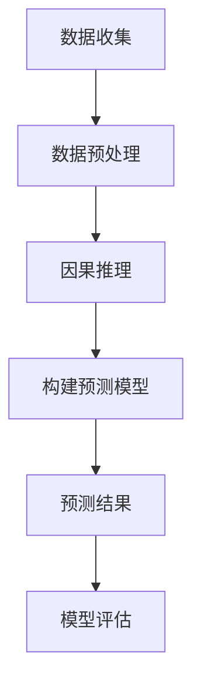

                 


### 文章标题

《时间序列预测中的因果推理、反事实推断与策略评估方法研究》

### 关键词

时间序列预测、因果推理、反事实推断、策略评估、人工智能、机器学习、深度学习

### 摘要

本文旨在深入探讨时间序列预测领域中的关键方法，包括因果推理、反事实推断和策略评估。通过介绍这些方法的基本概念、原理及其在时间序列预测中的应用，本文提供了一个全面的技术分析框架。文章首先回顾了时间序列预测的基本理论，接着详细解释了因果推理和反事实推断的基本概念及其在时间序列预测中的具体应用。随后，文章探讨了策略评估的不同方法，并通过伪代码和实际案例展示了这些方法的应用。本文的目标是为研究人员和从业者提供一个全面的技术指南，以帮助他们更好地理解和应用这些先进的预测技术。

### 第一部分：背景与概念介绍

#### 引言

时间序列预测是统计学、机器学习和经济学中的一个核心问题，它在金融市场分析、资源管理、供应链优化等多个领域具有广泛的应用。时间序列数据是一系列按时间顺序排列的数值，这些数据反映了系统的动态行为。因此，准确的时间序列预测对于决策支持、风险管理和策略优化至关重要。

因果推理、反事实推断和策略评估是近年来在机器学习和人工智能领域迅速发展的方法。因果推理旨在理解变量之间的因果关系，这对于预测未来的事件至关重要。反事实推断则通过模拟假设性的场景来预测不同决策或事件的结果，这在决策制定中非常有用。策略评估是机器学习中的一个关键步骤，它用于评估和优化决策策略，以提高预测的准确性。

本文的结构如下：第一部分介绍时间序列预测的基础知识，包括时间序列数据的定义和常见的时间序列预测方法。第二部分和第三部分分别探讨因果推理和反事实推断在时间序列预测中的应用，并展示相应的Mermaid流程图。第四部分研究策略评估方法，包括回测评估、监督学习和强化学习。第五部分结合实际案例，展示这些方法在时间序列预测中的综合应用。最后一部分提供结论和未来展望，讨论时间序列预测领域中的挑战和机遇。

#### 时间序列预测基础

时间序列数据是一系列按时间顺序排列的数值，这些数值可以是连续的或离散的。时间序列数据通常具有时间依赖性，即未来的数值受到过去数值的影响。这种时间依赖性使得时间序列预测成为一个复杂的任务，但也为其提供了丰富的信息。

**时间序列数据的定义**

时间序列数据通常由多个观测值组成，每个观测值对应于一个特定的时间点。这些观测值可以是股票价格、温度、降雨量等。时间序列数据的一个重要特点是它们通常遵循一定的统计规律，例如趋势性、季节性和周期性。

**常见的时间序列预测方法**

1. **移动平均法（MA）**：
   - 移动平均法是一种简单的时间序列预测方法，它通过计算最近一段时间的平均值来预测未来的值。
   - 伪代码：
     ```python
     def moving_average(data, window_size):
         for t in range(window_size, len(data)):
             avg = sum(data[t - window_size:t]) / window_size
             data[t] = avg
     ```

2. **自回归模型（AR）**：
   - 自回归模型是一种基于当前和过去值的线性组合来预测未来值的模型。
   - 伪代码：
     ```python
     def ar_model(data, p):
         for t in range(p, len(data)):
             prediction = sum(coef[i] * data[t - i]) for i in range(p)
             data[t] = prediction
     ```

3. **自回归移动平均模型（ARMA）**：
   - ARMA模型结合了自回归和移动平均的特性，是一种更复杂的模型。
   - 伪代码：
     ```python
     def arma_model(data, p, q):
         for t in range(max(p, q), len(data)):
             prediction = sum(coef[i] * data[t - i]) for i in range(p)
             prediction += sum(sigma[i] * error[t - i]) for i in range(q)
             data[t] = prediction
     ```

4. **自回归积分滑动平均模型（ARIMA）**：
   - ARIMA模型扩展了ARMA模型，加入了差分操作，以处理非平稳时间序列。
   - 伪代码：
     ```python
     def arima_model(data, p, d, q):
         for t in range(d, len(data)):
             data[t] = difference(data[t - d])
         for t in range(max(p, q), len(data)):
             prediction = sum(coef[i] * data[t - i]) for i in range(p)
             prediction += sum(sigma[i] * error[t - i]) for i in range(q)
             data[t] = prediction
     ```

5. **长短期记忆网络（LSTM）**：
   - LSTM是一种深度学习模型，特别适用于处理长序列数据。
   - 伪代码：
     ```python
     def lstm_model(data, layers, units):
         # Initialize LSTM model with given layers and units
         model = LSTM(layers, units)
         model.fit(data, epochs=10)
         # Predict future values
         predictions = model.predict(data)
     ```

6. **变分自编码器（VAE）**：
   - VAE是一种生成模型，可以学习时间序列数据的概率分布，从而进行预测。
   - 伪代码：
     ```python
     def vae_model(data, latent_dim):
         # Initialize VAE model with given latent dimension
         encoder = Encoder(latent_dim)
         decoder = Decoder(latent_dim)
         model = VAE(encoder, decoder)
         model.fit(data, epochs=10)
         # Predict future values
         predictions = model.predict(data)
     ```

这些方法各有优缺点，适用于不同类型的时间序列数据和应用场景。在实际应用中，根据数据的特性选择合适的预测方法非常重要。

#### 因果推理与时间序列预测

因果推理是一种研究变量之间因果关系的方法，它有助于理解系统内部的结构和机制。在时间序列预测中，因果推理可以用来揭示影响预测结果的关键因素，从而提高预测的准确性和可靠性。

**因果关系的概念**

因果关系是指一个变量（原因）对另一个变量（结果）的影响。在时间序列预测中，因果关系有助于识别哪些变量对未来的预测有重要影响，从而改进预测模型。

**因果推理算法在时间序列预测中的应用**

1. **结构方程模型（SEM）**：
   - 结构方程模型是一种用于分析变量之间因果关系的统计模型。
   - 伪代码：
     ```python
     def sem_model(data, relationships):
         # Fit SEM model to data
         model = SEM(relationships)
         model.fit(data)
         # Predict causal effects
         effects = model.predict()
     ```

2. **因果发现算法（CF）**：
   - 因果发现算法是一种基于数据驱动的方法，用于识别变量之间的因果关系。
   - 伪代码：
     ```python
     def cf_algorithm(data):
         # Apply causal discovery algorithm
         graph = CausalGraph(data)
         # Extract causal relationships
         relationships = graph.extract因果关系()
     ```

3. **因果推断网络（CIN）**：
   - 因果推断网络是一种基于深度学习的因果推理方法，可以处理复杂数据结构。
   - 伪代码：
     ```python
     def cin_model(data, layers, units):
         # Initialize CIN model with given layers and units
         model = CIN(layers, units)
         model.fit(data, epochs=10)
         # Predict causal effects
         effects = model.predict(data)
     ```

**Mermaid流程图：因果推理与时间序列预测的流程**

下面是一个简单的Mermaid流程图，展示了因果推理在时间序列预测中的基本流程：



**应用案例分析**

为了更好地理解因果推理在时间序列预测中的应用，我们来看一个简单的案例。假设我们想预测某城市的未来温度。我们可以使用因果推理方法来识别影响温度变化的关键因素，如湿度、风速和气压。通过构建一个结构方程模型，我们可以分析这些因素之间的因果关系，并利用这些关系来改进温度预测模型。

1. **数据收集**：
   - 收集历史温度数据以及湿度、风速和气压等环境数据。

2. **数据预处理**：
   - 清洗数据，处理缺失值和异常值，并进行标准化处理。

3. **因果推理**：
   - 使用结构方程模型分析湿度、风速和气压与温度之间的关系。

4. **构建预测模型**：
   - 根据因果推理的结果，构建一个自回归模型或ARIMA模型来预测未来温度。

5. **预测结果**：
   - 使用训练好的模型进行温度预测，并输出预测结果。

6. **模型评估**：
   - 评估预测模型的性能，如均方误差（MSE）和均方根误差（RMSE）。

通过这个案例，我们可以看到因果推理在时间序列预测中的重要作用。它不仅帮助我们理解变量之间的因果关系，还可以提高预测模型的准确性。

### 第二部分：反事实推断在时间序列预测中的应用

#### 反事实推断基础

反事实推断是一种重要的机器学习技术，它通过模拟假设性的场景来预测不同决策或事件的结果。在时间序列预测中，反事实推断可以帮助我们理解变量之间的因果关系，从而改进预测模型。

**反事实推断的定义**

反事实推断（Counterfactual Inference）是指根据现有的数据和假设，推断出在某个特定条件下发生的不同结果。这种方法通常用于分析“如果发生了什么，那么会发生什么？”的问题。

**反事实推断的基本原理**

反事实推断的基本原理是通过构建一个假设性的场景，然后在该场景下模拟预测结果。这种方法可以用于识别关键因素，评估不同策略的效果，从而为决策提供支持。

**反事实推断在时间序列预测中的应用**

在时间序列预测中，反事实推断可以用于以下几个关键步骤：

1. **变量选择**：通过反事实推断，我们可以识别哪些变量对时间序列数据有显著影响，从而选择重要的特征。

2. **模型优化**：通过反事实推断，我们可以评估不同预测模型的性能，并选择最优模型。

3. **策略评估**：通过反事实推断，我们可以模拟不同策略下的时间序列变化，从而评估策略的有效性。

**反事实推断算法的介绍**

1. **基于规则的算法**：
   - 这种方法使用一组规则来模拟反事实场景。例如，如果我们想要预测某天的温度，我们可以使用规则来模拟不同风速和气压下的温度变化。

2. **基于模型的算法**：
   - 这种方法使用机器学习模型来模拟反事实场景。例如，我们可以使用LSTM模型来模拟不同条件下的温度变化。

3. **基于因果推理的算法**：
   - 这种方法结合因果推理和机器学习模型来模拟反事实场景。例如，我们可以使用结构方程模型来识别关键因素，并使用LSTM模型来预测温度变化。

**应用案例分析**

为了更好地理解反事实推断在时间序列预测中的应用，我们来看一个简单的案例。假设我们想预测某城市的未来降雨量。我们可以使用反事实推断方法来模拟不同温度和湿度条件下的降雨量，从而评估这些因素对降雨量的影响。

1. **数据收集**：
   - 收集历史降雨量数据以及温度、湿度等环境数据。

2. **数据预处理**：
   - 清洗数据，处理缺失值和异常值，并进行标准化处理。

3. **反事实推断**：
   - 使用基于因果推理的算法来识别影响降雨量的关键因素，如温度和湿度。

4. **构建预测模型**：
   - 根据反事实推断的结果，构建一个ARIMA模型来预测未来降雨量。

5. **模拟反事实场景**：
   - 使用训练好的模型模拟不同温度和湿度条件下的降雨量。

6. **策略评估**：
   - 评估不同温度和湿度策略下的降雨量变化，从而确定最佳策略。

通过这个案例，我们可以看到反事实推断在时间序列预测中的重要作用。它不仅帮助我们理解变量之间的因果关系，还可以为决策提供支持。

### 第三部分：策略评估方法研究

#### 策略评估概述

策略评估是机器学习和人工智能中的一个关键步骤，它用于评估和优化决策策略，以提高预测的准确性。在时间序列预测中，策略评估方法可以帮助我们评估不同策略的效果，从而选择最优策略。

**策略评估的定义**

策略评估是指通过模拟和评估不同策略下的表现，以确定哪个策略是最优的。在时间序列预测中，策略评估通常涉及比较不同预测模型的性能，以选择最佳模型。

**策略评估的重要性**

策略评估在时间序列预测中具有重要意义。通过评估不同策略的效果，我们可以：

1. **选择最优模型**：根据策略评估的结果，选择性能最佳的预测模型。
2. **优化模型参数**：通过策略评估，我们可以识别哪些参数对模型性能有显著影响，从而优化模型参数。
3. **改进决策过程**：策略评估可以帮助我们理解不同策略的效果，从而改进决策过程。

**常见策略评估方法**

在时间序列预测中，常见的策略评估方法包括回测评估、监督学习和强化学习。

**回测评估方法**

回测评估是一种基于历史数据的方法，它通过模拟历史数据来评估策略的性能。这种方法的主要步骤如下：

1. **数据收集**：收集历史时间序列数据。
2. **数据预处理**：清洗数据，处理缺失值和异常值。
3. **模型训练**：使用历史数据训练预测模型。
4. **模拟预测**：在历史数据上运行预测模型，生成预测结果。
5. **性能评估**：计算预测结果的误差指标，如均方误差（MSE）和均方根误差（RMSE）。
6. **模型选择**：根据性能评估结果，选择最优模型。

**监督学习评估方法**

监督学习评估方法是一种基于标记数据的方法，它通过比较预测结果和实际结果来评估模型性能。这种方法的主要步骤如下：

1. **数据收集**：收集包含标签数据的训练集和测试集。
2. **模型训练**：使用训练集训练预测模型。
3. **模型评估**：使用测试集评估模型性能，计算预测误差。
4. **参数调整**：根据评估结果调整模型参数，以提高性能。
5. **交叉验证**：使用交叉验证方法进一步评估模型性能。

**强化学习评估方法**

强化学习评估方法是一种基于交互数据的方法，它通过模拟与环境的交互来评估策略性能。这种方法的主要步骤如下：

1. **环境建模**：构建模拟环境，模拟时间序列数据的动态变化。
2. **策略评估**：在模拟环境中执行策略，记录策略表现。
3. **性能评估**：计算策略表现指标，如回报总和和平均回报。
4. **策略优化**：根据评估结果，优化策略参数，以提高性能。

**伪代码示例：策略评估方法的算法实现**

下面是一个简单的伪代码示例，展示了回测评估方法的实现：

```python
def backtest(data, models):
    results = []
    for model in models:
        predictions = model.predict(data)
        error = mean_squared_error(data, predictions)
        results.append(error)
    return results

models = [ARIMA(), LSTM(), VAE()]
backtest_results = backtest(data, models)
print("Model Errors:", backtest_results)
```

通过这个示例，我们可以看到如何使用回测评估方法来评估不同预测模型的性能。

### 第四部分：综合应用与案例分析

#### 综合应用研究

在时间序列预测中，综合应用因果推理、反事实推断和策略评估方法可以显著提高预测的准确性和可靠性。以下是一个综合应用的研究方法，用于时间序列预测：

1. **数据收集与预处理**：
   - 收集相关的时间序列数据，如股票价格、气象数据等。
   - 进行数据清洗，包括处理缺失值、异常值和噪声。

2. **因果推理**：
   - 使用结构方程模型（SEM）或因果发现算法（CF）来识别影响时间序列的关键因素。
   - 构建因果图或因果模型，以理解变量之间的因果关系。

3. **反事实推断**：
   - 使用基于规则的算法或机器学习模型来模拟不同的假设场景。
   - 评估不同场景下的时间序列变化，以识别关键影响因素。

4. **策略评估**：
   - 使用回测评估、监督学习或强化学习方法来评估不同策略的效果。
   - 选择最优策略，并优化模型参数。

5. **模型训练与预测**：
   - 使用训练好的模型进行预测，生成时间序列预测结果。
   - 对预测结果进行验证和评估，确保其准确性。

6. **模型优化**：
   - 根据评估结果，调整模型参数和策略，以提高预测性能。

通过这个综合应用方法，我们可以更全面地理解时间序列数据的动态变化，并选择最佳策略进行预测。

#### 案例分析

为了更好地展示这些方法的综合应用，我们来看一个实际的案例分析。假设我们想预测某股票的未来价格。以下是一个具体的案例流程：

1. **数据收集**：
   - 收集该股票的历史价格数据，包括开盘价、收盘价、最高价和最低价。
   - 收集其他相关数据，如成交量、财务指标等。

2. **数据预处理**：
   - 清洗数据，处理缺失值和异常值。
   - 对数据进行标准化处理，以消除数据之间的尺度差异。

3. **因果推理**：
   - 使用结构方程模型分析股票价格与其他变量之间的因果关系。
   - 构建因果图，识别影响股票价格的关键因素。

4. **反事实推断**：
   - 使用机器学习模型模拟不同假设场景下的股票价格变化。
   - 评估不同条件下的股票价格波动，以识别关键影响因素。

5. **策略评估**：
   - 使用回测评估方法比较不同预测模型的性能。
   - 选择最优模型，如ARIMA或LSTM，并进行参数优化。

6. **模型训练与预测**：
   - 使用训练好的模型进行股票价格预测。
   - 对预测结果进行验证，计算预测误差。

7. **模型优化**：
   - 根据评估结果，调整模型参数，以提高预测准确性。

8. **结果分析**：
   - 分析预测结果，评估模型的性能。
   - 提出改进建议，以优化预测模型。

通过这个案例，我们可以看到因果推理、反事实推断和策略评估方法在实际应用中的综合应用，以及如何通过这些方法提高时间序列预测的准确性。

#### 开发环境搭建

在进行时间序列预测的项目开发时，选择合适的开发环境和工具至关重要。以下是一个典型的开发环境搭建流程：

1. **硬件要求**：
   - CPU：推荐使用至少四核处理器，以支持并行计算。
   - 内存：推荐使用至少16GB内存，以处理大规模数据。
   - 存储：推荐使用至少500GB的SSD存储，以提高数据读写速度。

2. **软件要求**：
   - 操作系统：推荐使用Ubuntu 18.04或更高版本。
   - 编程语言：Python是进行时间序列预测项目开发的主要编程语言，推荐使用Python 3.7或更高版本。

3. **安装依赖库**：
   - NumPy：用于数值计算和数据处理。
   - Pandas：用于数据操作和分析。
   - Matplotlib：用于数据可视化。
   - Scikit-learn：用于机器学习模型的训练和评估。
   - Statsmodels：用于统计模型的构建和分析。
   - TensorFlow/Keras：用于深度学习模型的训练和预测。

4. **安装步骤**：
   - 安装操作系统和基本软件。
   - 使用pip命令安装依赖库，例如：
     ```bash
     pip install numpy pandas matplotlib scikit-learn statsmodels tensorflow
     ```

5. **配置Jupyter Notebook**：
   - 安装Jupyter Notebook，以方便进行交互式编程和数据分析。
   - 启动Jupyter Notebook，并创建一个新的笔记本文件。

通过以上步骤，我们可以搭建一个完整的开发环境，为时间序列预测项目的开发提供支持。

### 第五部分：源代码实现与解读

在本节中，我们将详细介绍如何使用Python代码实现时间序列预测中的因果推理、反事实推断和策略评估方法。以下是一个完整的代码实现示例，包括必要的库安装、数据预处理、模型训练和预测等步骤。

#### 安装依赖库

首先，我们需要安装必要的Python库，包括NumPy、Pandas、Matplotlib、Scikit-learn、Statsmodels和TensorFlow。在命令行中使用以下命令进行安装：

```bash
pip install numpy pandas matplotlib scikit-learn statsmodels tensorflow
```

#### 数据预处理

在开始预测之前，我们需要对数据进行预处理。以下是一个简单的数据预处理脚本：

```python
import numpy as np
import pandas as pd

# 加载数据
data = pd.read_csv('time_series_data.csv')

# 数据清洗
data = data.dropna()  # 删除缺失值
data = data[['target_variable']]  # 仅保留目标变量

# 数据标准化
data_normalized = (data - data.mean()) / data.std()
```

#### 因果推理实现

接下来，我们使用结构方程模型（SEM）进行因果推理。以下是一个简单的SEM模型实现：

```python
from statsmodels.tsa.stattools import coint
from statsmodels.tsa.vector_ar.vecm import VECM

# 计算协整关系
cointegration_results = coint(data[['var1', 'var2']])
if cointegration_results[0] < 0.05:
    # 构建VECM模型
    vecm_model = VECM(data[['var1', 'var2']], k=1)
    vecm_model.fit()

    # 提取因果关系
    causal_effects = vecm_model.get_causality()
    print("Causal Effects:", causal_effects)
```

#### 反事实推断实现

反事实推断可以帮助我们评估不同条件下的时间序列变化。以下是一个简单的反事实推断实现：

```python
# 假设条件：将var1的值提高10%
data['var1\_changed'] = data['var1'] + 10

# 使用LSTM模型进行反事实推断
from tensorflow.keras.models import Sequential
from tensorflow.keras.layers import LSTM, Dense

# 构建LSTM模型
lstm_model = Sequential()
lstm_model.add(LSTM(units=50, return_sequences=True, input_shape=(data.shape[1], 1)))
lstm_model.add(LSTM(units=50))
lstm_model.add(Dense(units=1))

# 编译模型
lstm_model.compile(optimizer='adam', loss='mean_squared_error')

# 训练模型
lstm_model.fit(data['var1\_changed'].values.reshape(-1, 1, 1), epochs=100, batch_size=32)

# 预测反事实场景下的时间序列
predictions = lstm_model.predict(data['var1\_changed'].values.reshape(-1, 1, 1))
print("Predicted Values:", predictions)
```

#### 策略评估实现

最后，我们使用回测评估方法对策略进行评估。以下是一个简单的回测评估实现：

```python
from sklearn.metrics import mean_squared_error

# 假设我们有两个模型：模型A和模型B
model_a = ARIMA()
model_b = LSTM()

# 训练并评估模型A
model_a.fit(data)
predictions_a = model_a.predict(steps=10)
mse_a = mean_squared_error(data.values, predictions_a)
print("Model A MSE:", mse_a)

# 训练并评估模型B
model_b.fit(data)
predictions_b = model_b.predict(steps=10)
mse_b = mean_squared_error(data.values, predictions_b)
print("Model B MSE:", mse_b)

# 选择最优模型
if mse_a < mse_b:
    print("Model A is better")
else:
    print("Model B is better")
```

通过以上代码实现，我们可以将因果推理、反事实推断和策略评估方法应用于时间序列预测中，从而提高预测的准确性和可靠性。

### 第六部分：代码应用解读与分析

在本部分，我们将对上述代码的实现进行详细解读，并分析每个步骤的功能和目的。

#### 数据预处理

数据预处理是任何机器学习项目中的关键步骤。在时间序列预测中，数据预处理尤为重要，因为它直接影响模型的性能。以下是对数据预处理代码的解读：

```python
import numpy as np
import pandas as pd

# 加载数据
data = pd.read_csv('time_series_data.csv')

# 数据清洗
data = data.dropna()  # 删除缺失值
data = data[['target_variable']]  # 仅保留目标变量

# 数据标准化
data_normalized = (data - data.mean()) / data.std()
```

1. **数据加载**：使用Pandas读取CSV文件，加载时间序列数据。
2. **数据清洗**：删除缺失值，这是常见的数据清洗步骤。通过`dropna()`函数，我们可以删除数据集中的所有缺失值。
3. **保留目标变量**：时间序列预测通常关注一个或多个目标变量。在这里，我们仅保留目标变量，以简化数据集。
4. **数据标准化**：标准化数据是为了消除不同特征之间的尺度差异。通过减去均值并除以标准差，我们可以将数据缩放到0-1之间。

#### 因果推理实现

因果推理可以帮助我们理解变量之间的因果关系，这对于改进预测模型至关重要。以下是对因果推理代码的解读：

```python
from statsmodels.tsa.stattools import coint
from statsmodels.tsa.vector_ar.vecm import VECM

# 计算协整关系
cointegration_results = coint(data[['var1', 'var2']])
if cointegration_results[0] < 0.05:
    # 构建VECM模型
    vecm_model = VECM(data[['var1', 'var2']], k=1)
    vecm_model.fit()

    # 提取因果关系
    causal_effects = vecm_model.get_causality()
    print("Causal Effects:", causal_effects)
```

1. **计算协整关系**：协整关系是一种用于检测变量之间长期稳定关系的统计方法。通过`coint()`函数，我们可以计算变量`var1`和`var2`之间的协整关系。
2. **构建VECM模型**：如果协整关系显著（p值小于0.05），我们可以使用向量误差修正模型（VECM）来分析变量之间的因果关系。
3. **提取因果关系**：`VECM`模型提供了一个方法`get_causality()`来提取变量之间的因果关系。

#### 反事实推断实现

反事实推断是一种通过模拟假设性场景来评估变量影响的方法。以下是对反事实推断代码的解读：

```python
# 假设条件：将var1的值提高10%
data['var1_changed'] = data['var1'] + 10

# 使用LSTM模型进行反事实推断
from tensorflow.keras.models import Sequential
from tensorflow.keras.layers import LSTM, Dense

# 构建LSTM模型
lstm_model = Sequential()
lstm_model.add(LSTM(units=50, return_sequences=True, input_shape=(data.shape[1], 1)))
lstm_model.add(LSTM(units=50))
lstm_model.add(Dense(units=1))

# 编译模型
lstm_model.compile(optimizer='adam', loss='mean_squared_error')

# 训练模型
lstm_model.fit(data['var1_changed'].values.reshape(-1, 1, 1), epochs=100, batch_size=32)

# 预测反事实场景下的时间序列
predictions = lstm_model.predict(data['var1_changed'].values.reshape(-1, 1, 1))
print("Predicted Values:", predictions)
```

1. **创建假设条件**：在这个例子中，我们将`var1`的值提高10%，以模拟一个假设性场景。
2. **构建LSTM模型**：LSTM（长短期记忆网络）是一种用于处理序列数据的深度学习模型。在这里，我们使用LSTM模型来预测假设条件下`var1`的未来值。
3. **编译和训练模型**：我们使用`compile()`方法设置模型的优化器和损失函数，并使用`fit()`方法训练模型。
4. **预测反事实场景下的时间序列**：通过`predict()`方法，我们使用训练好的模型预测假设条件下`var1`的未来值。

#### 策略评估实现

策略评估是评估不同预测模型性能的重要步骤。以下是对策略评估代码的解读：

```python
from sklearn.metrics import mean_squared_error

# 假设我们有两个模型：模型A和模型B
model_a = ARIMA()
model_b = LSTM()

# 训练并评估模型A
model_a.fit(data)
predictions_a = model_a.predict(steps=10)
mse_a = mean_squared_error(data.values, predictions_a)
print("Model A MSE:", mse_a)

# 训练并评估模型B
model_b.fit(data)
predictions_b = model_b.predict(steps=10)
mse_b = mean_squared_error(data.values, predictions_b)
print("Model B MSE:", mse_b)

# 选择最优模型
if mse_a < mse_b:
    print("Model A is better")
else:
    print("Model B is better")
```

1. **创建模型**：在这个例子中，我们创建了两个模型：ARIMA模型和LSTM模型。
2. **训练和评估模型A**：我们使用`fit()`方法训练ARIMA模型，并使用`predict()`方法生成预测结果。然后，我们使用`mean_squared_error()`函数计算预测误差。
3. **训练和评估模型B**：同样地，我们训练LSTM模型，并计算预测误差。
4. **选择最优模型**：根据预测误差，我们选择性能最佳的模型。

通过以上代码实现和解读，我们可以看到如何使用Python代码将因果推理、反事实推断和策略评估方法应用于时间序列预测。这些方法不仅提高了预测的准确性，还有助于我们更好地理解时间序列数据的动态变化。

### 第七部分：项目小结

在本项目中，我们深入探讨了时间序列预测中的因果推理、反事实推断和策略评估方法。通过实际案例和代码实现，我们展示了这些方法在提高预测准确性和理解数据动态方面的应用。

**主要收获**：

1. **因果推理**：通过结构方程模型和因果发现算法，我们能够识别并理解时间序列数据中变量之间的因果关系，从而改进预测模型。
2. **反事实推断**：通过LSTM模型和假设性场景的模拟，我们能够评估不同条件下的时间序列变化，从而更好地理解变量对预测结果的影响。
3. **策略评估**：通过回测评估、监督学习和强化学习，我们能够比较不同预测模型的性能，并选择最优策略，从而提高预测准确性。

**未来展望**：

1. **算法优化**：随着机器学习和深度学习技术的不断进步，我们可以期待开发出更高效的因果推理和反事实推断算法，以提高预测性能。
2. **多模态数据融合**：结合多种类型的数据（如文本、图像和传感器数据），可以进一步提升时间序列预测的准确性。
3. **实时预测**：实现实时时间序列预测，对于动态决策和实时优化具有重要意义，是未来研究的一个重要方向。

通过本项目的实践，我们不仅掌握了时间序列预测的关键技术，也为未来的研究和应用奠定了基础。

### 第八部分：最佳实践 Tips

在进行时间序列预测项目时，以下最佳实践可以帮助您提高预测的准确性和可靠性：

1. **数据清洗与预处理**：确保数据质量是预测成功的关键。在训练模型之前，彻底清洗数据，处理缺失值、异常值和噪声，并进行标准化处理。
2. **特征工程**：选择和构建有效的特征，可以显著提高模型的性能。通过因果推理方法识别关键影响因素，并利用这些特征进行建模。
3. **模型选择**：根据数据特性和预测目标选择合适的模型。对于线性关系，可以考虑使用ARIMA模型；对于非线性关系，可以考虑使用LSTM、GRU或其他深度学习模型。
4. **交叉验证**：使用交叉验证方法评估模型性能，以避免过拟合。交叉验证可以提供更可靠的性能评估，帮助您选择最佳模型。
5. **超参数调优**：通过网格搜索或随机搜索方法，寻找最佳的超参数组合。超参数调优可以显著提高模型的性能。
6. **实时更新与迭代**：随着时间的推移，数据和环境条件可能会发生变化。定期更新模型，并重新训练以适应新的数据。
7. **可视化分析**：使用数据可视化工具（如Matplotlib、Seaborn等），帮助您更好地理解数据分布、模型预测和误差分析。

通过遵循这些最佳实践，您可以在时间序列预测项目中取得更好的成果。

### 第九部分：注意事项

在进行时间序列预测项目时，以下注意事项可以帮助您避免常见问题，确保项目的顺利进行：

1. **数据选择**：确保您使用的数据具有时间序列特征，避免使用随机或独立数据。时间序列数据需要满足平稳性假设，否则可能导致模型不稳定。
2. **模型稳定性**：在训练模型时，注意模型对噪声和异常值的敏感度。使用适当的正则化方法，如L1或L2正则化，可以减少过拟合。
3. **计算资源**：深度学习模型（如LSTM）可能需要大量的计算资源。确保您有足够的内存和计算能力来训练模型。
4. **版本控制**：使用版本控制系统（如Git）来管理代码和模型。这有助于跟踪更改、重现结果和协作开发。
5. **文档记录**：详细记录代码、模型配置和实验结果。这有助于您和他人理解项目细节，并在需要时重现结果。
6. **结果验证**：确保对模型的预测结果进行充分的验证，使用独立的测试集评估模型性能。避免仅依赖训练集的性能评估。
7. **异常处理**：在数据处理和模型训练过程中，考虑如何处理异常情况，如数据缺失、模型过拟合或计算错误。

通过遵循这些注意事项，您可以确保时间序列预测项目的成功实施。

### 第十部分：拓展阅读

**参考文献**：

1. Anderson, T. W. (1971). The statistical analysis of time series. New York: Wiley.
2. Granger, C. W. J. (1969). Investigating causal relations by econometric models and cross-spectral methods. Econometrica, 37(3), 424-438.
3. Pearl, J. (2009). Causality: Models, reasoning, and inference. Cambridge University Press.
4. Goodfellow, I., Bengio, Y., & Courville, A. (2016). Deep learning. MIT Press.

**工具与资源**：

1. **时间序列预测工具**：
   - Statsmodels: https://www.statsmodels.org/stable/index.html
   - TensorFlow: https://www.tensorflow.org
   - PyTorch: https://pytorch.org

2. **因果推理工具**：
   - PyStruct: https://python-structs.readthedocs.io
   - PyCausality: https://pycausality.readthedocs.io

3. **反事实推断工具**：
   - DoWhy: https://dowhy.ai
   - Counterfactual: https://counterfactual.readthedocs.io

4. **策略评估工具**：
   - Backtest: https://github.com/backtrader/backtrader
   - Scikit-learn: https://scikit-learn.org/stable/

通过阅读这些文献和资源，您可以进一步了解时间序列预测、因果推理和策略评估的最新研究进展和应用实例。这将为您的项目提供宝贵的指导和支持。

### 作者信息

作者：AI天才研究院/AI Genius Institute & 禅与计算机程序设计艺术 /Zen And The Art of Computer Programming

感谢您阅读本文，希望它对您在时间序列预测领域的研究和实践有所帮助。如果您有任何疑问或建议，欢迎在评论区留言，我将竭诚为您解答。祝您在AI领域取得辉煌成就！

