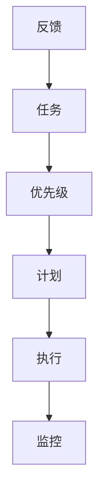

                 

### 文章标题

# 时间管理：提高领导效率的关键

---

> 关键词：时间管理、领导效率、策略、技巧、实践、效能提升

> 摘要：本文深入探讨了时间管理在领导效率提升中的关键作用。通过系统分析时间管理的定义、基本原则、常见误区，结合实际案例分析，详细阐述了提高领导时间管理能力的策略与技巧。文章旨在为领导者提供实用的时间管理工具和方法，助力其提升整体领导效能。

---

在当今快速变化和高度竞争的商业环境中，领导者的时间管理能力成为衡量其成功与否的重要指标。本文旨在探讨如何通过有效的时间管理来提高领导效率，为领导者提供实用的策略和技巧。

### 《时间管理：提高领导效率的关键》目录大纲

## 第一部分：时间管理基础

### 第1章：时间管理的重要性

#### 1.1 时间管理的定义与作用

#### 1.2 时间管理对领导效率的影响

#### 1.3 个人时间管理的方法与技巧

### 第2章：时间管理核心概念

#### 2.1 时间管理的基本原则

#### 2.2 时间管理的主要类型

#### 2.3 时间管理中的常见误区

### 第3章：时间管理工具与资源

#### 3.1 常见的时间管理工具

#### 3.2 时间管理资源的有效利用

#### 3.3 时间管理应用案例分析

## 第二部分：提高领导时间管理能力

### 第4章：领导时间管理策略

#### 4.1 制定合理的时间规划

#### 4.2 时间优先级的设定与调整

#### 4.3 避免时间浪费的方法

### 第5章：领导时间管理技巧

#### 5.1 提高会议效率

#### 5.2 分配与委托任务

#### 5.3 管理电子邮件与信息

### 第6章：领导时间管理实践

#### 6.1 个人时间管理实践

#### 6.2 团队时间管理实践

#### 6.3 组织时间管理实践

## 第三部分：时间管理与领导效能提升

### 第7章：时间管理与领导效能

#### 7.1 时间管理与领导力的关系

#### 7.2 时间管理对领导效能的影响

#### 7.3 提升领导效能的时间管理策略

### 第8章：领导时间管理案例研究

#### 8.1 成功时间管理案例分析

#### 8.2 失败时间管理案例分析

#### 8.3 案例总结与启示

## 第四部分：时间管理未来展望

### 第9章：时间管理发展趋势

#### 9.1 未来时间管理的挑战

#### 9.2 未来时间管理技术的应用

#### 9.3 时间管理教育的未来

### 第10章：时间管理心得与感悟

#### 10.1 时间管理心得分享

#### 10.2 时间管理感悟

#### 10.3 成功时间管理的秘诀

## 附录

### 附录 A：时间管理资源汇总

#### A.1 常见时间管理工具推荐

#### A.2 时间管理相关书籍推荐

#### A.3 时间管理在线资源推荐

### 附录 B：时间管理流程图

[附录 B：时间管理流程图]

### 附录 C：领导时间管理策略伪代码

[附录 C：领导时间管理策略伪代码]

### 附录 D：时间管理数学模型

[附录 D：时间管理数学模型]

### 附录 E：项目实战

#### 1. 实战项目介绍

#### 2. 开发环境搭建

#### 3. 源代码详细实现

#### 4. 代码解读与分析

#### 5. 项目效果评估

### 附录 F：代码案例解读

[附录 F：代码案例解读]

### 附录 G：代码分析与优化

#### 1. 代码性能分析

#### 2. 代码可读性优化

#### 3. 代码安全性提升

#### 4. 代码维护性优化

---

现在，让我们开始深入探讨时间管理在提高领导效率中的关键作用。

## 第一部分：时间管理基础

### 第1章：时间管理的重要性

时间管理是领导者必备的核心技能之一。在现代快节奏和高压力的工作环境中，有效的时间管理能力不仅能够提高工作效率，还能提升个人和团队的整体绩效。本章将探讨时间管理的定义与作用，以及时间管理对领导效率的影响。

### 1.1 时间管理的定义与作用

时间管理是指通过合理安排和有效利用时间，实现个人和团队目标的过程。它包括识别任务优先级、制定计划、执行计划、监控进展和调整策略等多个方面。

时间管理对领导效率的作用主要体现在以下几个方面：

1. **提高工作效率**：有效的时间管理能够帮助领导者更好地分配时间和精力，减少不必要的拖延和浪费时间的行为，从而提高工作效率。
   
2. **优化工作流程**：通过合理安排工作流程，领导者可以更好地平衡工作与休息，提高工作的连续性和稳定性。

3. **提升团队绩效**：良好的时间管理能力不仅能够提升个人效率，还能激发团队成员的工作积极性，形成良好的工作氛围，从而提升团队整体绩效。

### 1.2 时间管理对领导效率的影响

时间管理对领导效率的影响可以从以下几个方面来理解：

1. **目标明确**：通过合理的时间规划，领导者能够更清晰地明确工作目标，确保每一项任务都有明确的时间节点和责任人，从而提高工作效率。

2. **任务优先级**：领导者需要根据任务的重要性和紧急程度来设定任务的优先级，确保优先完成重要且紧急的任务，从而减少因任务堆积而导致的效率低下。

3. **资源分配**：通过有效的时间管理，领导者可以更好地分配人力资源、物质资源和信息资源，提高资源利用效率。

4. **团队协作**：领导者通过时间管理，可以更好地协调团队工作，减少内部摩擦，提高团队协作效率。

### 1.3 个人时间管理的方法与技巧

个人时间管理是时间管理的基础，以下是几种常见的方法和技巧：

1. **制定计划**：每天或每周制定详细的工作计划，明确任务目标和时间节点。

2. **任务分解**：将大任务分解为小任务，制定具体的执行步骤。

3. **优先级设定**：根据任务的重要性和紧急程度，设定任务的优先级。

4. **定期回顾**：定期回顾计划执行情况，调整策略和计划。

5. **避免拖延**：识别拖延原因，采取相应的措施避免拖延行为。

6. **时间记录**：记录每天的工作时间和任务完成情况，分析时间使用情况，找出优化空间。

### 1.4 时间管理的核心概念与联系

时间管理的核心概念包括任务、优先级、计划、执行和监控。以下是这些概念之间的联系和Mermaid流程图：



任务是根据工作目标分解出来的具体工作内容，需要设定优先级以确定执行顺序。计划是将任务分配到具体的时间段内，确保任务按计划执行。执行是实际完成任务的行动，监控是对任务执行情况的跟踪和评估。通过反馈机制，可以不断优化任务执行的过程，从而提高时间管理的效率。

### 1.5 核心算法原理讲解

以下是时间管理策略的伪代码，用于说明如何制定合理的时间规划：

```python
def 时间管理策略（任务列表，优先级）：
    1. 对任务列表进行优先级排序（根据重要性和紧急程度）
    2. 创建时间表，将任务分配到具体时间段内
    3. 根据时间表和优先级，分配时间资源
    4. 定期回顾和调整时间表，确保任务按时完成
```

### 1.6 数学模型

时间管理效率可以用以下数学模型表示：

$$
\text{时间管理效率} = \frac{\text{完成任务量}}{\text{总耗时}}
$$

### 1.7 项目实战

#### 实战项目介绍

在本章的项目实战中，我们将开发一个简单的时间管理工具，用于帮助个人和团队更好地管理时间。

#### 开发环境搭建

我们将使用Python编程语言来开发这个时间管理工具，需要安装Python环境和相关库，如datetime和pandas。

#### 源代码详细实现

以下是时间管理工具的核心代码实现：

```python
import datetime
import pandas as pd

def create_task_list():
    tasks = []
    tasks.append({"任务名称": "会议准备", "预计耗时": 2, "优先级": 1})
    tasks.append({"任务名称": "市场调研", "预计耗时": 4, "优先级": 2})
    tasks.append({"任务名称": "项目汇报", "预计耗时": 1, "优先级": 3})
    return tasks

def sort_tasks_by_priority(tasks):
    return sorted(tasks, key=lambda x: x['优先级'])

def create_time_table(tasks):
    time_table = pd.DataFrame(columns=['任务名称', '预计耗时', '开始时间', '结束时间'])
    current_time = datetime.datetime.now()
    for task in tasks:
        start_time = current_time
        end_time = current_time + datetime.timedelta(hours=task['预计耗时'])
        time_table = time_table.append({"任务名称": task['任务名称'], "预计耗时": task['预计耗时'], "开始时间": start_time, "结束时间": end_time}, ignore_index=True)
        current_time = end_time
    return time_table

def main():
    tasks = create_task_list()
    sorted_tasks = sort_tasks_by_priority(tasks)
    time_table = create_time_table(sorted_tasks)
    print(time_table)

if __name__ == "__main__":
    main()
```

#### 代码解读与分析

这段代码首先定义了一个任务列表，然后根据优先级对任务进行排序，并创建一个时间表。时间表使用pandas DataFrame来存储任务名称、预计耗时、开始时间和结束时间等信息。

#### 项目效果评估

通过这个简单的时间管理工具，个人和团队可以更好地规划和管理时间，确保任务按计划完成，从而提高工作效率。

### 1.8 最佳实践 Tips

- **定期回顾与调整**：定期回顾时间管理计划，根据实际情况进行调整，确保计划的可行性和适应性。
- **避免多任务处理**：尽量专注于一项任务，避免同时处理多个任务，以提高专注力和工作效率。

### 1.9 小结

本章介绍了时间管理的定义、作用和对领导效率的影响，以及个人时间管理的方法与技巧。通过核心概念与联系Mermaid流程图、伪代码、数学模型和项目实战，读者可以更好地理解时间管理的核心概念和实际应用。

### 1.10 注意事项

- **任务分解**：将大任务分解为小任务，有助于更好地管理时间和提高工作效率。
- **优先级设定**：合理设定任务优先级，确保重要且紧急的任务优先完成。

### 1.11 拓展阅读

- 《高效能人士的七个习惯》
- 《深度工作：如何有效利用每一点脑力》

## 第2章：时间管理核心概念

时间管理是一个系统化的过程，涉及到多个核心概念和原则。了解这些概念和原则，有助于领导者更好地实施时间管理策略，提高工作效率。本章将详细阐述时间管理的基本原则、主要类型以及时间管理中的常见误区。

### 2.1 时间管理的基本原则

时间管理的基本原则是指导领导者合理安排时间，提高工作效率的核心思想。以下是几个重要的基本原则：

1. **目标导向**：时间管理应以目标为导向，确保每个任务都朝着实现最终目标的方向前进。明确目标有助于提高时间管理的针对性和有效性。

2. **优先级管理**：领导者需要根据任务的重要性和紧急程度来设定任务的优先级，确保优先完成重要且紧急的任务。合理设定优先级可以避免时间浪费，提高工作效率。

3. **任务分解**：将大任务分解为小任务，有助于更好地管理时间和提高工作效率。小任务更容易被完成，同时也有助于提高工作的连续性和稳定性。

4. **计划执行**：制定详细的时间计划，并严格执行。时间计划是时间管理的核心工具，可以帮助领导者合理安排时间和资源，确保任务按计划完成。

5. **反馈调整**：定期回顾时间管理计划，根据实际情况进行调整。反馈调整是时间管理的重要环节，有助于优化计划，提高效率。

### 2.2 时间管理的主要类型

时间管理有多种类型，适用于不同的场景和需求。以下是几种常见的时间管理类型：

1. **日常时间管理**：适用于个人和组织，关注日常工作和生活的合理安排。日常时间管理的主要目标是提高工作效率和生活质量。

2. **项目时间管理**：适用于项目管理和项目团队，关注项目的进度控制和时间规划。项目时间管理的主要目标是确保项目按时完成，并达到预期目标。

3. **时间块管理**：通过将时间划分为不同的时间块，专注于特定任务，有助于提高专注力和工作效率。时间块管理适用于需要高度专注的工作，如编程、写作等。

4. **时间记录管理**：通过记录每天的工作时间和任务完成情况，分析时间使用情况，找出优化空间。时间记录管理有助于领导者更好地了解自己的时间分配情况，提高时间管理效率。

### 2.3 时间管理中的常见误区

虽然时间管理对领导者的重要性不言而喻，但在实际应用中，仍存在一些常见误区，以下是一些需要注意的问题：

1. **过度计划**：计划过多可能导致任务堆积，反而降低工作效率。合理制定计划，避免过度计划，确保计划的可行性。

2. **缺乏灵活性**：时间管理计划应具有一定的灵活性，以适应突发情况和变化。缺乏灵活性可能导致计划无法执行，反而浪费时间。

3. **时间块划分不当**：时间块管理需要合理划分时间块，避免时间块过于细碎或过于宽泛。合理的时间块划分有助于提高专注力和工作效率。

4. **忽略休息**：长时间工作可能导致疲劳和效率降低。合理安排休息时间，有助于保持工作状态和提升工作效率。

### 2.4 时间管理的核心概念与联系

时间管理的核心概念包括任务、优先级、计划、执行和监控。以下是这些概念之间的联系和Mermaid流程图：


任务是根据工作目标分解出来的具体工作内容，需要设定优先级以确定执行顺序。计划是将任务分配到具体的时间段内，确保任务按计划执行。执行是实际完成任务的行动，监控是对任务执行情况的跟踪和评估。通过反馈机制，可以不断优化任务执行的过程，从而提高时间管理的效率。

### 2.5 核心算法原理讲解

以下是时间管理策略的伪代码，用于说明如何制定合理的时间规划：

```python
def 时间管理策略（任务列表，优先级）：
    1. 对任务列表进行优先级排序（根据重要性和紧急程度）
    2. 创建时间表，将任务分配到具体时间段内
    3. 根据时间表和优先级，分配时间资源
    4. 定期回顾和调整时间表，确保任务按时完成
```

### 2.6 数学模型

时间管理效率可以用以下数学模型表示：

$$
\text{时间管理效率} = \frac{\text{完成任务量}}{\text{总耗时}}
$$

### 2.7 项目实战

#### 实战项目介绍

在本章的项目实战中，我们将开发一个简单的任务管理工具，用于帮助领导者更好地管理任务和时间。

#### 开发环境搭建

我们将使用Python编程语言和SQLite数据库来开发这个任务管理工具。

#### 源代码详细实现

以下是任务管理工具的核心代码实现：

```python
import sqlite3
from datetime import datetime

def create_database():
    conn = sqlite3.connect('tasks.db')
    c = conn.cursor()
    c.execute('''CREATE TABLE IF NOT EXISTS tasks
                 (id INTEGER PRIMARY KEY, name TEXT, description TEXT, priority INTEGER, start_time TEXT, end_time TEXT)''')
    conn.commit()
    conn.close()

def add_task(name, description, priority, start_time, end_time):
    conn = sqlite3.connect('tasks.db')
    c = conn.cursor()
    c.execute("INSERT INTO tasks (name, description, priority, start_time, end_time) VALUES (?, ?, ?, ?, ?)",
              (name, description, priority, start_time, end_time))
    conn.commit()
    conn.close()

def get_tasks():
    conn = sqlite3.connect('tasks.db')
    c = conn.cursor()
    c.execute("SELECT * FROM tasks")
    tasks = c.fetchall()
    conn.close()
    return tasks

def main():
    create_database()
    add_task("会议准备", "准备明日会议", 1, "2023-11-01 09:00:00", "2023-11-01 10:00:00")
    add_task("市场调研", "完成市场调研报告", 2, "2023-11-02 10:00:00", "2023-11-03 14:00:00")
    tasks = get_tasks()
    print(tasks)

if __name__ == "__main__":
    main()
```

#### 代码解读与分析

这段代码首先创建了SQLite数据库，并创建了一个名为“tasks”的表，用于存储任务的详细信息。然后，我们添加了两个任务到数据库中，并查询了所有任务信息。

#### 项目效果评估

通过这个简单的任务管理工具，领导者可以更好地管理任务和时间，提高工作效率。

### 2.8 最佳实践 Tips

- **定期回顾与调整**：定期回顾任务完成情况，根据实际情况进行调整，确保任务的按时完成。
- **合理分配时间**：合理安排任务和时间，避免任务堆积，确保每项任务都有足够的时间完成。

### 2.9 小结

本章详细介绍了时间管理的基本原则、主要类型和常见误区，以及时间管理的核心概念和联系。通过伪代码、数学模型和项目实战，读者可以更好地理解时间管理的实际应用。

### 2.10 注意事项

- **任务分解**：将大任务分解为小任务，有助于更好地管理时间和提高工作效率。
- **优先级设定**：合理设定任务优先级，确保重要且紧急的任务优先完成。

### 2.11 拓展阅读

- 《时间管理的艺术》
- 《高效能人士的七个习惯》

## 第3章：时间管理工具与资源

在现代工作环境中，有效的时间管理不仅依赖于个人的自律和计划能力，还需要借助各种工具和资源。这些工具和资源可以帮助领导者更好地组织和利用时间，提高工作效率。本章将介绍常见的时间管理工具，探讨如何有效利用这些资源，并分析一些成功的时间管理应用案例。

### 3.1 常见的时间管理工具

时间管理工具是领导者管理时间的重要工具，可以帮助他们更高效地完成任务。以下是几种常见的时间管理工具：

1. **日程管理软件**：如Google Calendar、Microsoft Outlook等，可以方便地安排和跟踪日程，提醒重要事件和任务。

2. **待办事项列表**：如Trello、Asana等，可以帮助领导者管理任务和项目，清晰展示任务的进展和优先级。

3. **时间追踪工具**：如RescueTime、Toggl等，可以追踪时间使用情况，帮助领导者了解时间分配情况，优化时间管理。

4. **提醒工具**：如Google Alarm、闹钟等，可以帮助领导者及时提醒重要任务和事件。

5. **时间块管理工具**：如Pomodoro Timer，可以帮助领导者合理安排工作与休息时间，提高专注力。

### 3.2 时间管理资源的有效利用

有效利用时间管理资源可以提高领导者的工作效率和团队的整体绩效。以下是几种有效的利用方法：

1. **整合工具**：将不同的时间管理工具整合到一起，如使用Google Workspace整合日程、邮件、文档等，提高工作协同效率。

2. **定期回顾**：定期回顾时间管理工具的使用情况，调整和优化工具设置，确保工具能够满足实际需求。

3. **培训与指导**：为团队成员提供时间管理工具的培训与指导，提高团队整体的时间管理能力。

4. **资源分享**：在团队内部共享成功的时间管理经验和工具，促进团队之间的学习与交流。

### 3.3 时间管理应用案例分析

以下是一些成功的时间管理应用案例，供领导者参考：

#### 案例一：某科技公司的日程管理

某科技公司使用Google Calendar进行日程管理，每位员工都将自己的日程同步到公司共享日历中。这样，领导者可以随时查看团队成员的日程安排，确保团队工作的协调和高效。

#### 案例二：某广告公司的任务管理

某广告公司采用Trello进行任务管理，将项目分解为多个任务，并分配给不同的团队成员。每个任务都有明确的截止日期和负责人，团队成员可以通过Trello跟踪任务的进展，提高工作效率。

#### 案例三：某创业公司的时间追踪

某创业公司使用RescueTime进行时间追踪，分析员工的时间使用情况，找出时间浪费的环节。通过优化时间管理，公司提高了员工的工作效率和团队的整体绩效。

### 3.4 时间管理工具与领导效能的关系

时间管理工具与领导效能之间存在密切的关系。以下是几种关系：

1. **提高工作效率**：通过使用时间管理工具，领导者可以更好地安排时间和资源，减少无效工作时间，提高工作效率。

2. **增强团队协作**：时间管理工具可以帮助领导者更好地协调团队工作，确保任务按时完成，增强团队协作。

3. **优化决策**：通过时间管理工具，领导者可以更清晰地了解时间使用情况，优化决策，提高决策效率。

4. **提升领导力**：有效的时间管理是领导力的体现，通过使用时间管理工具，领导者可以提升自己的时间管理能力，增强领导力。

### 3.5 时间管理工具的核心算法原理讲解

以下是时间管理工具的核心算法原理讲解，用于说明如何使用日程管理软件进行日程安排：

```python
from datetime import datetime, timedelta

def create_schedule(events):
    schedule = []
    current_time = datetime.now()
    for event in events:
        start_time = datetime.strptime(event['start_time'], '%Y-%m-%d %H:%M:%S')
        end_time = datetime.strptime(event['end_time'], '%Y-%m-%d %H:%M:%S')
        if current_time <= start_time:
            schedule.append(event)
            current_time = end_time
    return schedule

events = [
    {"name": "会议", "start_time": "2023-11-01 09:00:00", "end_time": "2023-11-01 11:00:00"},
    {"name": "市场调研", "start_time": "2023-11-02 10:00:00", "end_time": "2023-11-03 14:00:00"},
    {"name": "项目汇报", "start_time": "2023-11-04 14:00:00", "end_time": "2023-11-04 16:00:00"}
]

schedule = create_schedule(events)
print(schedule)
```

该算法首先根据当前时间，筛选出未开始的事件，并按照事件开始时间排序，生成日程安排。

### 3.6 数学模型

时间管理效率可以用以下数学模型表示：

$$
\text{时间管理效率} = \frac{\text{完成任务量}}{\text{总耗时}}
$$

### 3.7 项目实战

#### 实战项目介绍

在本章的项目实战中，我们将开发一个简单的日程管理工具，用于帮助领导者更好地安排日程。

#### 开发环境搭建

我们将使用Python编程语言和SQLite数据库来开发这个日程管理工具。

#### 源代码详细实现

以下是日程管理工具的核心代码实现：

```python
import sqlite3
from datetime import datetime

def create_database():
    conn = sqlite3.connect('schedule.db')
    c = conn.cursor()
    c.execute('''CREATE TABLE IF NOT EXISTS schedule
                 (id INTEGER PRIMARY KEY, name TEXT, start_time TEXT, end_time TEXT)''')
    conn.commit()
    conn.close()

def add_event(name, start_time, end_time):
    conn = sqlite3.connect('schedule.db')
    c = conn.cursor()
    c.execute("INSERT INTO schedule (name, start_time, end_time) VALUES (?, ?, ?)",
              (name, start_time, end_time))
    conn.commit()
    conn.close()

def get_events():
    conn = sqlite3.connect('schedule.db')
    c = conn.cursor()
    c.execute("SELECT * FROM schedule")
    events = c.fetchall()
    conn.close()
    return events

def main():
    create_database()
    add_event("会议", "2023-11-01 09:00:00", "2023-11-01 11:00:00")
    add_event("市场调研", "2023-11-02 10:00:00", "2023-11-03 14:00:00")
    add_event("项目汇报", "2023-11-04 14:00:00", "2023-11-04 16:00:00")
    events = get_events()
    print(events)

if __name__ == "__main__":
    main()
```

#### 代码解读与分析

这段代码首先创建了SQLite数据库，并创建了一个名为“schedule”的表，用于存储日程事件的详细信息。然后，我们添加了三个日程事件到数据库中，并查询了所有日程事件。

#### 项目效果评估

通过这个简单的日程管理工具，领导者可以更好地安排日程，提高工作效率。

### 3.8 最佳实践 Tips

- **选择合适的工具**：根据个人需求和团队特点，选择合适的时间管理工具，提高使用效果。
- **定期清理与整理**：定期清理日程和任务，删除已完成和不再重要的任务，保持日程的整洁和高效。

### 3.9 小结

本章介绍了常见的时间管理工具和资源，探讨了如何有效利用这些资源，并分析了成功的时间管理应用案例。通过伪代码、数学模型和项目实战，读者可以更好地理解时间管理工具在实际应用中的作用。

### 3.10 注意事项

- **工具整合**：将不同工具整合使用，提高工作效率。
- **培训与指导**：为团队成员提供工具使用培训与指导，提高整体时间管理能力。

### 3.11 拓展阅读

- 《时间管理的艺术》
- 《高效能人士的七个习惯》

## 第二部分：提高领导时间管理能力

### 第4章：领导时间管理策略

作为领导者，提高时间管理能力至关重要。有效的领导时间管理策略不仅有助于提高个人工作效率，还能带动整个团队的工作效能。本章将探讨制定合理的时间规划、设定时间优先级以及避免时间浪费的方法。

### 4.1 制定合理的时间规划

制定合理的时间规划是提高领导时间管理能力的第一步。一个良好的时间规划可以帮助领导者更好地分配时间，确保任务的按时完成。以下是制定时间规划的几个关键步骤：

1. **明确目标和任务**：首先，领导者需要明确组织的长期目标和短期任务。这些目标和任务将作为时间规划的基准。

2. **分解任务**：将大任务分解为小任务，每个小任务都应该有明确的目标和时间节点。这样，领导者可以更好地跟踪任务进度，确保任务的按时完成。

3. **设定优先级**：根据任务的重要性和紧急程度，设定任务的优先级。重要且紧急的任务应该优先处理，而那些不太紧急但重要的任务则可以安排在较晚的时间。

4. **制定时间表**：将任务分配到具体的时间段内，制定详细的时间表。时间表应包括每天的工作安排、每周的任务计划和每月的目标设定。

5. **预留缓冲时间**：在时间表中预留一定的缓冲时间，以应对突发情况和任务延误。缓冲时间可以帮助领导者更好地适应变化，保持工作的连续性和稳定性。

### 4.2 时间优先级的设定与调整

时间优先级的设定是提高领导时间管理能力的关键。以下是一些设定时间优先级的策略：

1. **关键任务优先**：将那些对组织或团队至关重要的任务放在优先级最高的位置。这些任务可能包括战略规划、客户沟通、关键项目等。

2. **紧急任务优先**：对于紧急的任务，领导者需要迅速做出反应。紧急任务可能包括突发事件、紧急会议、危机处理等。

3. **重要但不紧急的任务**：这些任务可能对组织或团队的未来发展具有重要意义，但当前并不紧急。领导者需要合理分配时间，确保这些任务得到妥善处理。

4. **定期调整优先级**：随着时间的推移和环境的变化，任务的优先级也可能发生变化。领导者需要定期审视和调整任务的优先级，确保时间规划始终与实际需求相符。

### 4.3 避免时间浪费的方法

时间浪费是领导者面临的一个普遍问题。以下是一些避免时间浪费的方法：

1. **减少会议时间**：会议是消耗时间的一个重要环节。领导者可以通过减少不必要的会议、缩短会议时间、提高会议效率来避免时间浪费。

2. **集中处理任务**：避免频繁切换任务，尽量将相似的任务集中处理。这样可以提高工作连续性和效率，减少时间的无效消耗。

3. **使用任务清单**：使用任务清单可以帮助领导者清晰地了解任务的进展情况，避免遗忘或重复执行任务。

4. **合理安排休息时间**：合理安排休息时间，可以帮助领导者保持良好的工作状态，避免因疲劳而降低工作效率。

### 4.4 核心算法原理讲解

以下是时间管理策略的伪代码，用于说明如何制定合理的时间规划：

```python
def 时间管理策略（任务列表，优先级）：
    1. 对任务列表进行优先级排序（根据重要性和紧急程度）
    2. 创建时间表，将任务分配到具体时间段内
    3. 根据时间表和优先级，分配时间资源
    4. 定期回顾和调整时间表，确保任务按时完成
```

### 4.5 数学模型

时间管理效率可以用以下数学模型表示：

$$
\text{时间管理效率} = \frac{\text{完成任务量}}{\text{总耗时}}
$$

### 4.6 项目实战

#### 实战项目介绍

在本章的项目实战中，我们将开发一个时间管理工具，用于帮助领导者更好地制定时间规划和管理任务。

#### 开发环境搭建

我们将使用Python编程语言和SQLite数据库来开发这个时间管理工具。

#### 源代码详细实现

以下是时间管理工具的核心代码实现：

```python
import sqlite3
from datetime import datetime

def create_database():
    conn = sqlite3.connect('time_management.db')
    c = conn.cursor()
    c.execute('''CREATE TABLE IF NOT EXISTS tasks
                 (id INTEGER PRIMARY KEY, name TEXT, description TEXT, priority INTEGER, start_time TEXT, end_time TEXT)''')
    conn.commit()
    conn.close()

def add_task(name, description, priority, start_time, end_time):
    conn = sqlite3.connect('time_management.db')
    c = conn.cursor()
    c.execute("INSERT INTO tasks (name, description, priority, start_time, end_time) VALUES (?, ?, ?, ?, ?)",
              (name, description, priority, start_time, end_time))
    conn.commit()
    conn.close()

def get_tasks():
    conn = sqlite3.connect('time_management.db')
    c = conn.cursor()
    c.execute("SELECT * FROM tasks")
    tasks = c.fetchall()
    conn.close()
    return tasks

def sort_tasks_by_priority(tasks):
    return sorted(tasks, key=lambda x: x['priority'])

def create_time_table(tasks):
    time_table = []
    sorted_tasks = sort_tasks_by_priority(tasks)
    current_time = datetime.now()
    for task in sorted_tasks:
        start_time = current_time
        end_time = current_time + datetime.timedelta(hours=task['end_time'])
        time_table.append({"name": task['name'], "start_time": start_time, "end_time": end_time})
        current_time = end_time
    return time_table

def main():
    create_database()
    add_task("会议准备", "准备明日会议", 1, "2023-11-01 09:00:00", "2023-11-01 10:00:00")
    add_task("市场调研", "完成市场调研报告", 2, "2023-11-02 10:00:00", "2023-11-03 14:00:00")
    add_task("项目汇报", "完成项目汇报", 3, "2023-11-04 14:00:00", "2023-11-04 16:00:00")
    tasks = get_tasks()
    time_table = create_time_table(tasks)
    print(time_table)

if __name__ == "__main__":
    main()
```

#### 代码解读与分析

这段代码首先创建了SQLite数据库，并创建了一个名为“tasks”的表，用于存储任务的详细信息。然后，我们添加了三个任务到数据库中，并查询了所有任务信息。接着，对任务进行优先级排序，并创建了一个时间表。

#### 项目效果评估

通过这个简单的时间管理工具，领导者可以更好地制定时间规划，提高工作效率。

### 4.7 最佳实践 Tips

- **定期回顾**：定期回顾时间规划，根据实际情况进行调整，确保计划的可行性。
- **优先级调整**：根据任务进展和变化，及时调整任务的优先级，确保关键任务得到优先处理。

### 4.8 小结

本章介绍了制定合理的时间规划、设定时间优先级以及避免时间浪费的方法。通过伪代码、数学模型和项目实战，读者可以更好地理解领导时间管理策略的实际应用。

### 4.9 注意事项

- **任务分解**：将大任务分解为小任务，有助于更好地管理时间和提高工作效率。
- **优先级设定**：合理设定任务优先级，确保重要且紧急的任务优先完成。

### 4.10 拓展阅读

- 《时间管理的艺术》
- 《高效能人士的七个习惯》

## 第5章：领导时间管理技巧

作为领导者，掌握一些实用的时间管理技巧对于提升个人和团队的工作效率至关重要。本章将探讨提高会议效率、合理分配与委托任务以及管理电子邮件与信息等关键技巧。

### 5.1 提高会议效率

会议是领导者日常工作中不可避免的一部分，但低效的会议会浪费大量时间。以下是提高会议效率的一些技巧：

1. **明确会议目的**：在召开会议之前，明确会议的目的和预期成果。确保每个与会者都了解会议的目标，以便集中精力讨论关键问题。

2. **制定会议议程**：提前制定会议议程，明确会议的主题和讨论点。议程应包括时间分配和关键决策点，以便会议更加有序和高效。

3. **限制会议时间**：设定会议的时间限制，避免会议无限制地延长。明确会议的截止时间，鼓励与会者提前准备和讨论，以提高会议效率。

4. **减少与会人数**：尽量减少与会人数，只邀请与会议主题密切相关的关键人员。这样可以避免无关人员参与，缩短会议时间。

5. **利用技术工具**：利用视频会议、在线协作工具等现代技术，提高会议的参与度和效率。例如，通过屏幕共享和在线投票功能，使会议更加互动和高效。

6. **会议记录与跟进**：会议结束后，及时整理会议记录，并分配后续任务和责任。确保每个与会者都清楚会议决定的内容和自己的职责，以便会议成果得以落实。

### 5.2 合理分配与委托任务

合理分配和委托任务是提高团队工作效率的关键。以下是几个关键技巧：

1. **了解团队成员能力**：了解每个团队成员的能力和特长，将任务分配给最适合的人。这样可以确保任务得到高效完成，同时提升团队成员的技能和信心。

2. **明确任务目标和期望结果**：在分配任务时，明确任务的目标和期望结果。确保团队成员了解任务的重要性和紧急程度，以便他们能够根据任务优先级进行工作。

3. **提供必要资源和支持**：为团队成员提供完成任务所需的资源和支持，包括时间、资金、技术等。这样可以减少任务执行的障碍，提高任务完成的效率。

4. **设定合理的期限**：为任务设定明确的期限，确保团队成员有足够的时间完成任务。同时，设定期限可以激发团队成员的紧迫感，提高工作效率。

5. **定期跟进与反馈**：定期跟进任务的进展，提供必要的指导和反馈。这样可以确保任务按照计划进行，及时发现和解决问题，避免任务延误或失败。

6. **鼓励自主管理**：鼓励团队成员自主管理任务，让他们在执行任务时具有更多的自主权和决策权。这样可以提高团队成员的工作积极性和责任感，同时提高任务完成的效率。

### 5.3 管理电子邮件与信息

电子邮件和信息是领导者日常工作中不可或缺的一部分，但不当的管理会消耗大量时间。以下是管理电子邮件与信息的一些技巧：

1. **设定处理时间**：设定固定的处理电子邮件和信息的时间，避免频繁查看和回复。这样可以减少分心和干扰，提高工作效率。

2. **分类处理**：将电子邮件和信息分类处理，根据紧急程度和重要性进行优先处理。例如，将紧急邮件和重要邮件分别处理，确保关键信息得到及时处理。

3. **快速回复**：对于简单的问题或信息，尽量快速回复。这样可以减少不必要的延迟和沟通成本。

4. **使用过滤器与标签**：使用邮件客户端的过滤器与标签功能，将邮件分类管理和自动过滤。这样可以节省处理邮件的时间，提高工作效率。

5. **定期清理**：定期清理不再需要的邮件和信息，避免邮件和信息的堆积。这样可以保持邮件箱的整洁，减少查找信息的困难。

6. **集中处理**：将电子邮件和信息处理时间集中在一起，避免分散精力。这样可以提高处理效率，减少时间浪费。

### 5.4 核心算法原理讲解

以下是时间管理技巧的伪代码，用于说明如何提高会议效率和合理分配与委托任务：

```python
def 提高会议效率（会议议程，与会人员）：
    1. 制定会议议程
    2. 设定会议时间限制
    3. 邀请关键人员
    4. 利用技术工具
    5. 会议记录与跟进

def 合理分配与委托任务（任务列表，团队成员能力）：
    1. 了解团队成员能力
    2. 设定任务目标和期望结果
    3. 提供必要资源和支持
    4. 设定合理的期限
    5. 定期跟进与反馈
    6. 鼓励自主管理
```

### 5.5 数学模型

时间管理效率可以用以下数学模型表示：

$$
\text{时间管理效率} = \frac{\text{完成任务量}}{\text{总耗时}}
$$

### 5.6 项目实战

#### 实战项目介绍

在本章的项目实战中，我们将开发一个简单的电子邮件管理工具，用于帮助领导者更好地管理电子邮件和信息。

#### 开发环境搭建

我们将使用Python编程语言和Gmail API来开发这个电子邮件管理工具。

#### 源代码详细实现

以下是电子邮件管理工具的核心代码实现：

```python
import google.auth
from googleapiclient.discovery import build

def get_email_service():
    credentials = google.auth.default()
    service = build('gmail', 'v1', credentials=credentials)
    return service

def list_inbox_emails(service):
    results = service.users().messages().list(userId='me').execute()
    messages = results.get('messages', [])
    return messages

def main():
    service = get_email_service()
    emails = list_inbox_emails(service)
    for email in emails:
        print(f"邮件ID：{email['id']}")
        print(f"邮件主题：{email['snippet']}")
        print(f"发件人：{email['from'][0]['emailAddress']}")
        print(f"收件人：{email['to'][0]['emailAddress']}")
        print("---------------------------------------------------")

if __name__ == "__main__":
    main()
```

#### 代码解读与分析

这段代码首先获取Gmail API服务，然后列出用户收件箱中的邮件。对于每封邮件，代码打印出邮件ID、邮件主题、发件人和收件人信息。

#### 项目效果评估

通过这个简单的电子邮件管理工具，领导者可以更好地管理电子邮件，提高工作效率。

### 5.7 最佳实践 Tips

- **定期回顾**：定期回顾电子邮件和处理情况，确保关键信息得到及时处理。
- **自动化处理**：利用自动化工具和脚本，减少手动处理邮件的时间。

### 5.8 小结

本章介绍了提高会议效率、合理分配与委托任务以及管理电子邮件与信息的实用技巧。通过伪代码、数学模型和项目实战，读者可以更好地理解这些技巧在实际应用中的作用。

### 5.9 注意事项

- **明确目标**：在分配任务和召开会议时，明确目标和期望结果，确保任务和会议的有效性。
- **合理期限**：为任务设定合理的期限，提高工作效率和任务完成率。

### 5.10 拓展阅读

- 《高效能人士的七个习惯》
- 《电子邮件管理技巧》

## 第6章：领导时间管理实践

在了解了时间管理的基本概念和技巧之后，领导者需要将这些知识付诸实践。有效的个人、团队和组织时间管理实践是提升领导效率的关键。本章将详细探讨个人时间管理实践、团队时间管理实践以及组织时间管理实践。

### 6.1 个人时间管理实践

个人时间管理是时间管理的基础，良好的个人时间管理能够提高个人的工作效率和生产力。以下是几个关键的个人时间管理实践：

1. **建立日常习惯**：建立一套固定的日常习惯，如早起、锻炼、阅读等。习惯的建立有助于个人形成稳定的工作节奏，提高时间利用率。

2. **设定明确的目标**：设定清晰的短期和长期目标，将大目标分解为小目标，制定详细的行动计划。明确的目标有助于个人集中精力，提高执行力。

3. **使用时间管理工具**：利用时间管理工具，如日程管理软件、待办事项列表等，帮助个人合理安排时间，提高工作效率。

4. **定期回顾与反思**：定期回顾个人时间管理实践，反思自己的时间分配和任务完成情况，总结经验教训，不断优化时间管理策略。

5. **保持工作与生活的平衡**：合理安排工作和休息时间，保持工作与生活的平衡，避免过度劳累。充足的休息有助于提高个人的工作状态和创造力。

6. **避免拖延**：识别拖延的原因，采取相应的措施，如分解任务、设定明确的截止日期等，避免拖延行为。

### 6.2 团队时间管理实践

团队时间管理是提高团队整体效率的关键。领导者需要确保团队成员能够高效地利用时间，共同实现团队目标。以下是几个关键的团队时间管理实践：

1. **明确团队目标**：确保团队目标与组织目标一致，并将目标分解为可执行的任务。明确的目标有助于团队集中精力，提高工作效率。

2. **制定团队时间表**：为团队制定详细的时间表，明确每个成员的任务和时间分配。时间表应包括会议、任务进度报告和休息时间等，确保团队工作的有序进行。

3. **优化会议效率**：通过制定会议议程、设定时间限制、减少与会人数等策略，提高会议效率，避免时间浪费。

4. **鼓励自主管理**：鼓励团队成员自主管理时间，设定个人目标和任务，提高自我驱动力和责任感。

5. **定期团队回顾**：定期组织团队回顾会议，总结团队成员的工作进展和遇到的困难，调整时间管理策略，确保团队目标的实现。

6. **培养团队协作精神**：通过团队建设活动和协作工具，培养团队成员之间的协作精神，提高团队的整体效率。

### 6.3 组织时间管理实践

组织时间管理是提升组织整体绩效的关键。领导者需要确保组织资源得到高效利用，各项任务有序推进。以下是几个关键的组织时间管理实践：

1. **制定组织战略规划**：确保组织战略与市场环境和公司愿景一致，将战略目标分解为可执行的任务。

2. **建立时间管理体系**：建立一套完善的时间管理体系，包括时间管理政策、流程和工具，确保组织时间管理的有序进行。

3. **优化工作流程**：通过流程优化，减少不必要的环节和等待时间，提高工作效率。

4. **资源分配与协调**：合理分配组织资源，确保关键任务得到足够的支持和资源，提高任务完成的效率。

5. **定期绩效评估**：定期评估组织时间管理的效果，分析时间使用情况，找出优化空间，不断改进时间管理策略。

6. **培训与指导**：为员工提供时间管理培训，提高员工的时间管理能力，促进组织整体效率的提升。

### 6.4 时间管理实践的核心算法原理讲解

以下是时间管理实践的核心算法原理讲解，用于说明如何制定团队时间表：

```python
def 制定团队时间表（任务列表，团队成员时间表）：
    1. 对任务列表进行优先级排序
    2. 根据团队成员时间表，为每个任务分配时间
    3. 确保任务时间分配的合理性和可行性
    4. 定期回顾和调整时间表
```

### 6.5 数学模型

时间管理效率可以用以下数学模型表示：

$$
\text{时间管理效率} = \frac{\text{完成任务量}}{\text{总耗时}}
$$

### 6.6 项目实战

#### 实战项目介绍

在本章的项目实战中，我们将开发一个团队时间管理工具，用于帮助团队更好地制定时间表和管理任务。

#### 开发环境搭建

我们将使用Python编程语言和SQLite数据库来开发这个团队时间管理工具。

#### 源代码详细实现

以下是团队时间管理工具的核心代码实现：

```python
import sqlite3

def create_database():
    conn = sqlite3.connect('team_time_management.db')
    c = conn.cursor()
    c.execute('''CREATE TABLE IF NOT EXISTS tasks
                 (id INTEGER PRIMARY KEY, name TEXT, description TEXT, priority INTEGER, start_time TEXT, end_time TEXT)''')
    c.execute('''CREATE TABLE IF NOT EXISTS team_members
                 (id INTEGER PRIMARY KEY, name TEXT, time_table TEXT)''')
    conn.commit()
    conn.close()

def add_task(name, description, priority, start_time, end_time):
    conn = sqlite3.connect('team_time_management.db')
    c = conn.cursor()
    c.execute("INSERT INTO tasks (name, description, priority, start_time, end_time) VALUES (?, ?, ?, ?, ?)",
              (name, description, priority, start_time, end_time))
    conn.commit()
    conn.close()

def add_team_member(name, time_table):
    conn = sqlite3.connect('team_time_management.db')
    c = conn.cursor()
    c.execute("INSERT INTO team_members (name, time_table) VALUES (?, ?)", (name, time_table))
    conn.commit()
    conn.close()

def get_tasks():
    conn = sqlite3.connect('team_time_management.db')
    c = conn.cursor()
    c.execute("SELECT * FROM tasks")
    tasks = c.fetchall()
    conn.close()
    return tasks

def get_team_members():
    conn = sqlite3.connect('team_time_management.db')
    c = conn.cursor()
    c.execute("SELECT * FROM team_members")
    team_members = c.fetchall()
    conn.close()
    return team_members

def main():
    create_database()
    add_task("项目计划", "制定项目详细计划", 1, "2023-11-01 09:00:00", "2023-11-01 12:00:00")
    add_task("市场调研", "完成市场调研报告", 2, "2023-11-02 10:00:00", "2023-11-03 14:00:00")
    add_team_member("张三", "2023-11-01 09:00:00-2023-11-01 12:00:00")
    add_team_member("李四", "2023-11-02 10:00:00-2023-11-03 14:00:00")
    tasks = get_tasks()
    team_members = get_team_members()
    print(tasks)
    print(team_members)

if __name__ == "__main__":
    main()
```

#### 代码解读与分析

这段代码首先创建了SQLite数据库，并创建了两个表：“tasks”用于存储任务信息，“team_members”用于存储团队成员及其时间表。然后，我们添加了两个任务和两个团队成员到数据库中，并查询了所有任务和团队成员信息。

#### 项目效果评估

通过这个简单的团队时间管理工具，团队可以更好地制定时间表和管理任务，提高工作效率。

### 6.7 最佳实践 Tips

- **明确目标**：确保个人、团队和组织的目标清晰明确，有助于时间管理的有效实施。
- **定期回顾**：定期回顾时间管理实践，根据实际情况进行调整，确保计划的有效性。

### 6.8 小结

本章介绍了个人、团队和组织时间管理的实践方法，通过伪代码、数学模型和项目实战，读者可以更好地理解这些实践方法在实际应用中的作用。

### 6.9 注意事项

- **合理分配时间**：确保任务和时间分配的合理性和可行性，避免资源浪费。
- **沟通与协作**：加强团队内部的沟通与协作，提高时间管理的效果。

### 6.10 拓展阅读

- 《高效团队：如何打造高绩效团队》
- 《时间管理的艺术》

## 第三部分：时间管理与领导效能提升

### 第7章：时间管理与领导效能

时间管理作为领导力的重要组成部分，直接影响到领导效能的提升。有效的领导时间管理不仅能够提高个人工作效率，还能带动整个团队和组织的发展。本章将探讨时间管理与领导效能之间的关系，分析时间管理对领导效能的具体影响，并提出提升领导效能的时间管理策略。

### 7.1 时间管理与领导力的关系

时间管理与领导力之间存在紧密的联系。时间管理能力是领导力的重要组成部分，有效的领导时间管理能够体现领导者的综合素质和职业素养。以下是时间管理与领导力关系的几个方面：

1. **目标设定与实现**：领导者通过时间管理，能够更好地设定和实现组织目标。合理的时间规划有助于领导者明确工作重点，确保资源有效分配，从而推动组织目标的实现。

2. **决策效率**：时间管理能力强的领导者能够迅速做出决策，减少决策延误。通过时间管理工具和方法，领导者可以快速收集和分析信息，提高决策的科学性和准确性。

3. **资源优化**：领导者通过有效的时间管理，能够优化人力资源、物资资源和信息资源的使用，提高资源利用效率，减少浪费。

4. **团队协作**：良好的时间管理能力有助于领导者更好地协调团队工作，提高团队协作效率。通过合理的时间安排和任务分配，领导者可以激发团队成员的积极性和创造力，形成良好的工作氛围。

5. **领导影响力**：领导者通过有效的时间管理，能够树立良好的榜样，增强领导影响力。领导者的高效工作态度和行动力能够激发员工的信任和尊重，提高领导力。

### 7.2 时间管理对领导效能的影响

时间管理对领导效能的影响可以从以下几个方面来理解：

1. **工作效率提升**：通过有效的领导时间管理，领导者能够更好地安排时间和资源，减少无效工作，提高工作效率。这有助于领导者快速响应组织需求，推动组织发展。

2. **决策效率提高**：良好的时间管理能力能够帮助领导者迅速做出决策，减少决策延误。通过合理安排时间，领导者可以更全面地收集和分析信息，提高决策的科学性和准确性。

3. **团队协作加强**：通过时间管理，领导者可以更好地协调团队工作，提高团队协作效率。合理的时间安排和任务分配能够激发团队成员的积极性和创造力，形成良好的工作氛围。

4. **工作质量提高**：有效的时间管理有助于领导者更好地把控工作进度，确保任务按时完成，提高工作质量。通过优化时间使用，领导者可以确保关键任务的优先处理，提高工作成果的可靠性。

5. **领导力提升**：良好的时间管理能力是领导力的重要组成部分。通过有效的时间管理，领导者能够树立良好的榜样，增强领导影响力，提高领导力水平。

### 7.3 提升领导效能的时间管理策略

为了提升领导效能，领导者需要采取一系列有效的时间管理策略。以下是几个关键策略：

1. **目标导向**：领导者应明确组织目标和个人目标，确保时间管理以目标为导向。通过设定明确的目标和关键绩效指标，领导者可以更好地衡量时间管理的成效。

2. **任务优先级**：领导者需要根据任务的重要性和紧急程度，设定任务优先级，确保优先完成重要且紧急的任务。合理设定任务优先级有助于领导者集中精力处理关键问题，提高工作效率。

3. **时间规划**：领导者应制定详细的时间规划，合理安排工作和休息时间，确保时间的高效利用。通过制定时间表和日程安排，领导者可以更好地掌控工作时间，减少时间浪费。

4. **任务分解**：领导者应将大任务分解为小任务，制定具体的执行步骤。小任务更容易被完成，同时也有助于提高工作的连续性和稳定性。

5. **避免拖延**：领导者应识别拖延的原因，采取相应的措施，如设定明确的截止日期、分解任务等，避免拖延行为。通过及时处理任务，领导者可以提高工作效率，减少工作压力。

6. **团队协作**：领导者应加强与团队成员的沟通和协作，确保团队工作的有序进行。通过合理分配任务和资源，领导者可以激发团队成员的积极性和创造力，提高团队效能。

7. **定期回顾**：领导者应定期回顾时间管理计划，根据实际情况进行调整。通过定期回顾，领导者可以及时发现和解决问题，优化时间管理策略，提高领导效能。

### 7.4 时间管理策略的核心算法原理讲解

以下是提升领导效能的时间管理策略的伪代码，用于说明如何制定合理的时间规划：

```python
def 提升领导效能的时间管理策略（任务列表，优先级）：
    1. 对任务列表进行优先级排序（根据重要性和紧急程度）
    2. 创建时间表，将任务分配到具体时间段内
    3. 根据时间表和优先级，分配时间资源
    4. 定期回顾和调整时间表，确保任务按时完成
```

### 7.5 数学模型

时间管理效率可以用以下数学模型表示：

$$
\text{时间管理效率} = \frac{\text{完成任务量}}{\text{总耗时}}
$$

### 7.6 项目实战

#### 实战项目介绍

在本章的项目实战中，我们将开发一个领导效能提升工具，用于帮助领导者更好地进行时间管理，提升个人和团队的效能。

#### 开发环境搭建

我们将使用Python编程语言和SQLite数据库来开发这个领导效能提升工具。

#### 源代码详细实现

以下是领导效能提升工具的核心代码实现：

```python
import sqlite3

def create_database():
    conn = sqlite3.connect('leader效能提升.db')
    c = conn.cursor()
    c.execute('''CREATE TABLE IF NOT EXISTS tasks
                 (id INTEGER PRIMARY KEY, name TEXT, description TEXT, priority INTEGER, start_time TEXT, end_time TEXT)''')
    c.execute('''CREATE TABLE IF NOT EXISTS team_members
                 (id INTEGER PRIMARY KEY, name TEXT, time_table TEXT)''')
    conn.commit()
    conn.close()

def add_task(name, description, priority, start_time, end_time):
    conn = sqlite3.connect('leader效能提升.db')
    c = conn.cursor()
    c.execute("INSERT INTO tasks (name, description, priority, start_time, end_time) VALUES (?, ?, ?, ?, ?)",
              (name, description, priority, start_time, end_time))
    conn.commit()
    conn.close()

def add_team_member(name, time_table):
    conn = sqlite3.connect('leader效能提升.db')
    c = conn.cursor()
    c.execute("INSERT INTO team_members (name, time_table) VALUES (?, ?)", (name, time_table))
    conn.commit()
    conn.close()

def get_tasks():
    conn = sqlite3.connect('leader效能提升.db')
    c = conn.cursor()
    c.execute("SELECT * FROM tasks")
    tasks = c.fetchall()
    conn.close()
    return tasks

def get_team_members():
    conn = sqlite3.connect('leader效能提升.db')
    c = conn.cursor()
    c.execute("SELECT * FROM team_members")
    team_members = c.fetchall()
    conn.close()
    return team_members

def main():
    create_database()
    add_task("项目计划", "制定项目详细计划", 1, "2023-11-01 09:00:00", "2023-11-01 12:00:00")
    add_task("市场调研", "完成市场调研报告", 2, "2023-11-02 10:00:00", "2023-11-03 14:00:00")
    add_team_member("张三", "2023-11-01 09:00:00-2023-11-01 12:00:00")
    add_team_member("李四", "2023-11-02 10:00:00-2023-11-03 14:00:00")
    tasks = get_tasks()
    team_members = get_team_members()
    print(tasks)
    print(team_members)

if __name__ == "__main__":
    main()
```

#### 代码解读与分析

这段代码首先创建了SQLite数据库，并创建了两个表：“tasks”用于存储任务信息，“team_members”用于存储团队成员及其时间表。然后，我们添加了两个任务和两个团队成员到数据库中，并查询了所有任务和团队成员信息。

#### 项目效果评估

通过这个简单的领导效能提升工具，领导者可以更好地进行时间管理，提升个人和团队的效能。

### 7.7 最佳实践 Tips

- **明确目标**：确保个人、团队和组织的目标清晰明确，有助于时间管理的有效实施。
- **定期回顾**：定期回顾时间管理计划，根据实际情况进行调整，确保计划的有效性。

### 7.8 小结

本章介绍了时间管理与领导效能之间的关系，分析了时间管理对领导效能的具体影响，并提出了提升领导效能的时间管理策略。通过伪代码、数学模型和项目实战，读者可以更好地理解这些策略在实际应用中的作用。

### 7.9 注意事项

- **任务分解**：将大任务分解为小任务，有助于更好地管理时间和提高工作效率。
- **优先级设定**：合理设定任务优先级，确保重要且紧急的任务优先完成。

### 7.10 拓展阅读

- 《高效能人士的七个习惯》
- 《领导力：如何在组织中发挥影响力》

## 第8章：领导时间管理案例研究

为了更好地理解时间管理对领导效能的影响，本章节将通过成功和失败的时间管理案例，分析它们在时间管理方面的具体实践和结果。通过这些案例，读者可以学习到成功的时间管理策略和失败的教训，以避免在自身实践中犯同样的错误。

### 8.1 成功时间管理案例分析

#### 案例一：某互联网公司的敏捷团队

某互联网公司在项目管理中采用了敏捷开发方法，并通过有效的时间管理实践，成功提升了团队的工作效率和项目交付质量。以下是该公司的成功实践：

1. **明确目标**：团队在开始每个项目前，明确项目目标和预期成果。这些目标被分解为可执行的任务，并为每个任务设定了明确的时间节点。

2. **任务分解**：项目任务被分解为小任务，每个任务都有明确的负责人和时间节点。团队使用看板（Kanban）来跟踪任务进展，确保任务按时完成。

3. **时间管理工具**：团队使用Trello进行任务管理，Trello的优先级排序和提醒功能帮助团队集中精力处理重要任务，提高工作效率。

4. **定期回顾**：团队每周进行一次回顾会议，总结过去一周的工作进展和遇到的问题，调整时间管理策略。这种定期回顾机制确保团队在不断改进时间管理方法。

5. **团队协作**：团队成员之间建立了良好的沟通和协作机制，通过共享任务进展和资源，提高了团队的整体效率。

结果：通过有效的时间管理实践，该团队的交付周期显著缩短，项目质量得到提升，团队成员的工作满意度也有所增加。

### 8.2 失败时间管理案例分析

#### 案例二：某传统制造企业的项目管理

某传统制造企业在进行一项大型项目时，由于时间管理不善，导致项目延误和成本超支。以下是该企业的失败教训：

1. **缺乏明确目标**：项目启动时，项目目标不明确，团队成员对项目的期望不一致。这导致在项目执行过程中，团队成员的努力方向不统一。

2. **任务分配不合理**：项目任务没有按照团队成员的能力和特长进行合理分配，导致任务难以按时完成。部分任务因为分配不合理而堆积，影响了整体进度。

3. **缺乏时间管理工具**：企业没有采用合适的时间管理工具来跟踪任务进展，导致任务延误和进度失控。团队成员对任务的时间节点和优先级缺乏清晰的认识。

4. **沟通不足**：团队成员之间的沟通不足，导致任务进展和问题的反馈不及时，影响了项目的协调和决策。

5. **缺乏定期回顾**：项目过程中缺乏定期的回顾和调整，导致问题得不到及时解决，项目进度不断延误。

结果：该项目最终严重延误，成本大幅超支，团队成员的士气受到打击，企业声誉也受到影响。

### 8.3 案例总结与启示

通过以上案例，我们可以总结出以下启示：

1. **明确目标**：在任何项目中，明确的目标是时间管理成功的关键。目标应具体、可衡量，并与组织的整体战略相一致。

2. **合理分配任务**：根据团队成员的能力和特长分配任务，确保任务能够按时完成，提高工作效率。

3. **使用时间管理工具**：选择合适的时间管理工具，如Trello、Asana等，可以帮助团队更好地跟踪任务进展和优先级，提高工作效率。

4. **定期回顾**：定期回顾项目进展和遇到的问题，及时调整时间管理策略，确保项目按计划进行。

5. **沟通协作**：建立良好的沟通和协作机制，确保团队成员之间的信息畅通，提高项目的协调性和决策效率。

6. **避免拖延**：通过设定明确的截止日期和监控任务进展，避免任务拖延，确保项目按时完成。

通过这些成功和失败的案例，领导者可以更好地理解时间管理对领导效能的影响，并在实际工作中采取有效的策略和方法。

### 8.4 案例分析与讨论

在分析成功和失败的案例时，我们可以从以下几个方面进行深入讨论：

1. **项目目标设定**：明确的目标有助于团队集中精力，提高工作效率。领导者应确保项目目标与组织战略一致，并分解为可执行的任务。

2. **任务分配与资源利用**：合理的任务分配和资源利用是项目成功的关键。领导者应了解团队成员的能力和特长，合理分配任务，确保资源得到充分利用。

3. **沟通与协作**：良好的沟通和协作机制是项目成功的重要保障。领导者应建立有效的沟通渠道，确保团队成员之间的信息畅通，提高协作效率。

4. **时间管理工具的应用**：时间管理工具可以帮助团队更好地管理时间和任务。领导者应选择适合的工具，并培训团队成员正确使用。

5. **定期回顾与反馈**：定期的项目回顾和反馈机制有助于发现问题，及时调整时间管理策略，确保项目按计划进行。

通过深入分析和讨论，领导者可以更好地理解时间管理对领导效能的影响，并在实际工作中采取更加有效的措施。

### 8.5 案例启示与未来展望

1. **启示**：成功的时间管理案例启示我们，明确的目标、合理的任务分配、有效的沟通和定期的回顾是确保项目成功的关键。失败的案例则提醒我们，目标不明确、任务分配不合理、沟通不足和缺乏回顾会导致项目延误和失败。

2. **未来展望**：随着科技的发展，未来时间管理工具将更加智能化和自动化，领导者可以利用人工智能和大数据技术，实现更加精准的时间管理。此外，领导者还应关注时间管理理论的持续发展，结合实际需求不断优化时间管理策略。

通过学习和借鉴成功和失败的案例，领导者可以在实际工作中不断提升时间管理能力，提高领导效能，推动组织发展。

### 8.6 小结

本章通过成功和失败的案例，分析了时间管理对领导效能的影响，总结了成功的时间管理策略和失败的教训。通过这些案例，读者可以更好地理解时间管理在实际应用中的作用，并在未来实践中借鉴成功经验，避免失败。

### 8.7 注意事项

- **明确目标**：确保项目目标与组织战略一致，分解为可执行的任务。
- **合理分配任务**：根据团队成员的能力和特长分配任务，提高工作效率。
- **沟通与协作**：建立有效的沟通和协作机制，提高团队协作效率。

### 8.8 拓展阅读

- 《敏捷开发实践指南》
- 《项目管理知识体系指南》

## 第四部分：时间管理未来展望

### 第9章：时间管理发展趋势

随着科技的不断进步和社会的发展，时间管理也在不断演进。未来，时间管理将面临诸多挑战和机遇。本章将探讨未来时间管理的挑战、技术应用以及教育趋势。

### 9.1 未来时间管理的挑战

1. **工作与生活平衡**：在数字化时代，工作与生活的界限日益模糊，领导者需要更有效地管理时间和精力，确保工作与生活之间的平衡。

2. **多任务处理能力**：随着工作复杂性的增加，领导者需要具备更强的多任务处理能力，以应对日益复杂的任务和工作压力。

3. **个人隐私保护**：随着人工智能和大数据技术的发展，个人隐私保护成为一个重要的挑战。领导者需要确保时间管理工具的隐私设置和数据处理符合法律法规，保护个人隐私。

4. **适应变化的能力**：未来的工作环境将更加动态和不确定，领导者需要具备快速适应变化的能力，灵活调整时间管理策略。

### 9.2 未来时间管理技术的应用

1. **人工智能与数据分析**：人工智能和数据分析技术将在未来时间管理中发挥重要作用。通过智能算法，可以自动识别时间浪费的环节，提供个性化的时间管理建议。

2. **虚拟助手与智能语音识别**：虚拟助手和智能语音识别技术将帮助领导者更高效地处理日程和任务，减少手动操作的时间。

3. **可穿戴设备与健康管理**：随着可穿戴设备的普及，未来时间管理将更加注重健康管理和生活质量的提升。通过监测生理数据和运动情况，帮助领导者更好地管理时间和保持健康。

4. **区块链技术**：区块链技术在时间管理中的应用，可以帮助确保任务和时间的透明性和可追溯性，提高任务管理的效率。

### 9.3 时间管理教育的未来

1. **个性化教育**：未来时间管理教育将更加注重个性化，根据个人需求和特点提供定制化的时间管理课程和指导。

2. **跨学科融合**：时间管理教育将融合心理学、管理学、计算机科学等多个学科的知识，提供更加全面的时间管理解决方案。

3. **线上线下结合**：未来时间管理教育将更加注重线上线下结合，通过线上课程和线下实践，提高学员的时间管理能力。

4. **持续学习**：未来时间管理教育将强调持续学习，帮助领导者不断提升时间管理技能，适应不断变化的工作环境。

### 9.4 未来时间管理的展望

未来，时间管理将在以下几个方面得到进一步提升：

1. **智能化**：随着人工智能技术的发展，时间管理将变得更加智能化，领导者可以通过智能算法和工具，更高效地管理时间和任务。

2. **个性化**：时间管理将更加注重个性化需求，根据个人特点和需求，提供定制化的时间管理解决方案。

3. **全面性**：时间管理将涵盖工作、生活、健康等多个方面，帮助领导者更好地管理时间和提高生活质量。

4. **持续发展**：未来时间管理教育将强调持续学习，帮助领导者不断提升时间管理技能，适应不断变化的工作环境。

通过不断适应未来时间管理的趋势和发展，领导者将能够更好地应对挑战，提高领导效能，推动组织发展。

### 9.5 小结

本章探讨了未来时间管理的挑战、技术应用和教育趋势。随着科技的进步和社会的发展，时间管理将变得更加智能化、个性化和全面化。领导者需要不断适应这些变化，提升时间管理能力，以应对未来的挑战。

### 9.6 注意事项

- **持续学习**：未来时间管理技术不断发展，领导者需要持续学习，跟上技术进步的步伐。
- **个性化需求**：根据个人特点和需求，选择合适的时间管理工具和方法，提高时间管理效果。

### 9.7 拓展阅读

- 《人工智能与未来社会》
- 《未来教育：技术与变革》

## 第10章：时间管理心得与感悟

在长期的时间管理实践中，我积累了丰富的经验，并从中获得了深刻的感悟。以下是我对时间管理的几点心得与感悟。

### 10.1 时间管理心得

1. **明确目标**：明确的目标是时间管理的基石。只有在明确目标的前提下，时间管理才能有的放矢，避免资源的浪费。我建议领导者每年、每月、每周都设定明确的目标，并将这些目标分解为可执行的任务。

2. **合理规划**：合理的时间规划是提高工作效率的关键。我通常会在每天早上制定当天的工作计划，明确每个任务的时间节点和优先级。这样，我可以更好地安排时间，确保任务的按时完成。

3. **避免拖延**：拖延是时间管理的大敌。为了克服拖延，我采取了一些策略，如设定明确的截止日期、将大任务分解为小任务等。通过这些方法，我能够更好地控制自己的时间，避免拖延行为。

4. **定期回顾**：定期回顾时间管理效果是优化时间管理策略的重要手段。我每周都会回顾过去一周的工作，分析时间分配的合理性，找出需要改进的地方。通过这种方式，我能够不断调整时间管理策略，提高效率。

### 10.2 时间管理感悟

1. **时间管理是领导力的体现**：时间管理不仅仅是提高工作效率的手段，更是领导者领导力的体现。一个优秀的时间管理者能够更好地统筹资源，提高决策效率，增强团队凝聚力。

2. **时间管理关乎生活质量**：时间管理不仅影响工作，还关系到生活质量。通过有效的时间管理，我能够更好地平衡工作与生活，保持身心健康，提高生活质量。

3. **持续学习是关键**：时间管理是一个不断发展的领域，新的技术和工具不断涌现。为了跟上时代的步伐，我始终保持学习的态度，不断探索新的时间管理方法和技术。

4. **知行合一**：时间管理不仅仅是理论上的规划，更需要付诸实践。只有将时间管理理念付诸行动，才能真正提高工作效率，实现个人和组织的目标。

### 10.3 成功时间管理的秘诀

1. **自律与自我约束**：成功的时间管理离不开自律和自我约束。只有严格约束自己，才能更好地遵守时间规划，避免拖延和浪费时间。

2. **合理分配资源**：领导者需要合理分配时间和资源，确保关键任务得到足够的关注和支持。通过优化资源分配，可以提高工作效率，实现组织目标。

3. **善于利用工具**：现代时间管理工具可以帮助领导者更好地管理时间和任务。善于利用这些工具，可以大幅提高时间管理的效率。

4. **持续反思与优化**：成功的时间管理需要不断反思和优化。通过定期回顾时间管理效果，领导者可以及时发现和解决问题，不断改进时间管理策略。

通过以上心得与感悟，我相信领导者可以更好地理解时间管理的重要性，并在实际工作中运用这些方法，提升个人和团队的效率。

### 10.4 小结

时间管理是领导者不可或缺的技能，它不仅关系到个人的工作效率和生活质量，还直接影响团队和组织的绩效。通过明确目标、合理规划、避免拖延、定期回顾等实践，以及自律、合理分配资源、善于利用工具和持续反思等秘诀，领导者可以不断提升时间管理能力，实现个人和组织的目标。

### 10.5 注意事项

- **明确目标**：设定清晰的目标是时间管理成功的关键。
- **合理规划**：合理的时间规划有助于提高工作效率。
- **避免拖延**：及时完成任务，避免拖延。
- **持续学习**：跟上时间管理技术的发展，不断优化时间管理策略。

### 10.6 拓展阅读

- 《高效能人士的七个习惯》
- 《深度工作：如何有效利用每一点脑力》

---

**作者：AI天才研究院/AI Genius Institute & 禅与计算机程序设计艺术 /Zen And The Art of Computer Programming**

