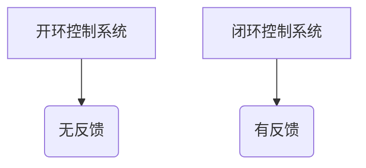
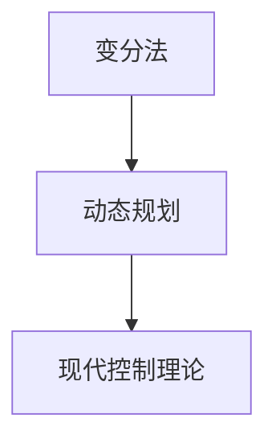
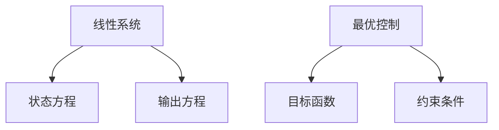
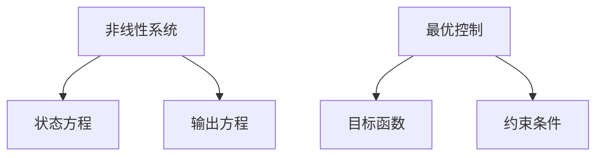
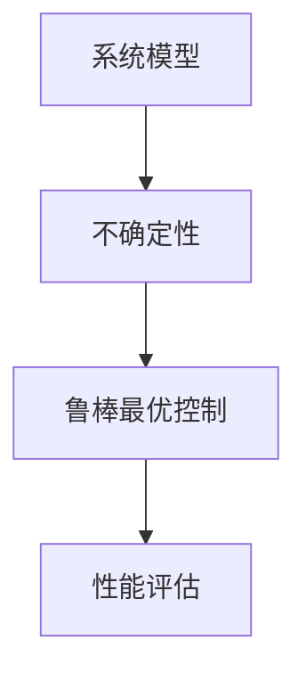
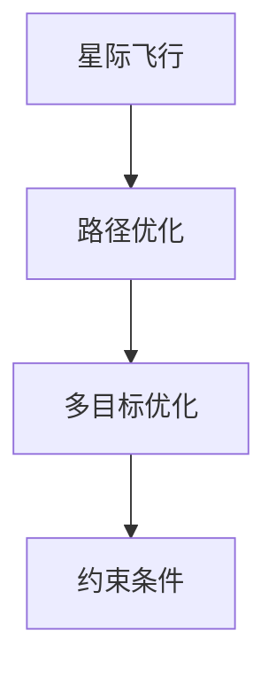
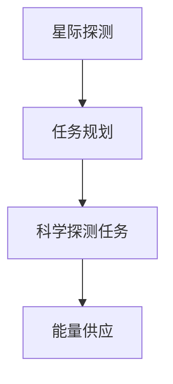
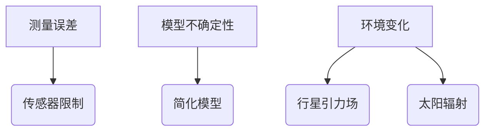

                 

### 第3章：最优控制理论概述

## 3.1 控制系统的基本概念

### 背景介绍

控制系统是现代工程技术中不可或缺的一部分，无论是在工业制造、航空航天，还是在日常生活中，控制系统都发挥着重要作用。在太空探索中，控制系统更是保证飞行器安全和有效运行的核心。

### 核心概念与联系

- **定义**：控制系统是由输入、输出和反馈三部分组成的，用于维持某一系统状态稳定的闭环系统。
- **分类**：根据控制系统的特性，可以分为开环控制系统和闭环控制系统。
  - **开环控制系统**：没有反馈环节，输出不受到系统状态的影响。
  - **闭环控制系统**：包含反馈环节，输出会受到系统状态的影响。

### Mermaid 流程图



## 3.2 最优控制理论的发展历程

### 背景介绍

最优控制理论起源于20世纪50年代，是控制理论的一个重要分支。随着计算机技术的发展，最优控制理论得到了广泛应用。

### 核心概念与联系

- **变分法**：最优控制理论的早期研究主要基于变分法，试图寻找控制变量的最优路径。
- **动态规划**：20世纪60年代，动态规划方法的出现极大地推动了最优控制理论的发展。
- **现代控制理论**：随着数学工具的引入，如线性代数、微分方程等，现代控制理论得到了进一步发展。

### Mermaid 流程图



## 3.3 最优控制问题的数学描述

### 核心概念与联系

- **状态空间模型**：最优控制问题通常用状态空间模型来描述，包括状态变量、控制变量和系统矩阵等。
- **目标函数**：目标函数是衡量系统性能的指标，通常为代价函数。
- **约束条件**：约束条件包括系统约束和边界约束等。

### 数学模型

- **状态方程**：$$\dot{x}(t) = Ax(t) + Bu(t)$$
- **输出方程**：$$y(t) = Cx(t) + Du(t)$$
- **目标函数**：$$J = \int_{0}^{T} L(x(t), u(t), t) dt$$

### 伪代码

```
# 输入：
# A, B, C, D: 系统矩阵
# x0: 初始状态
# T: 时间上限

# 输出：
# u(t): 最优控制输入

# 最优控制问题求解：
# 1. 定义目标函数 J
# 2. 求解状态方程 \dot{x}(t) = Ax(t) + Bu(t)
# 3. 求解输出方程 y(t) = Cx(t) + Du(t)
# 4. 求解最优控制输入 u(t)
```

### 数学公式

$$\min J = \int_{0}^{T} [L(x(t), u(t), t)] dt$$

$$\text{subject to} \ \dot{x}(t) = Ax(t) + Bu(t)$$

$$x(0) = x_0$$

$$x(T) = x_f$$

## 3.4 最优控制问题的求解算法

### 背景介绍

求解最优控制问题通常需要高效的算法，以保证在实际工程中能够快速得到最优解。

### 核心概念与联系

- **解析法**：通过数学分析直接求解最优控制问题，如变分法、最优性原理等。
- **数值法**：通过数值计算方法求解最优控制问题，如动态规划、线性规划等。

### 伪代码

```
# 输入：
# A, B, C, D: 系统矩阵
# x0: 初始状态
# T: 时间上限

# 输出：
# u(t): 最优控制输入

# 最优控制问题求解：
# 1. 初始化参数
# 2. 使用数值法求解状态方程
# 3. 使用数值法求解输出方程
# 4. 使用数值法求解最优控制输入
```

### 总结

最优控制理论是解决控制系统优化问题的重要工具，其核心思想是通过数学模型描述系统，并通过求解最优控制问题找到最佳控制策略。在实际应用中，选择合适的求解算法是关键。

作者：AI天才研究院/AI Genius Institute & 禅与计算机程序设计艺术 /Zen And The Art of Computer Programming

### 第4章：线性最优控制

## 4.1 线性最优控制的基本原理

### 背景介绍

线性最优控制（Linear Optimal Control）是控制理论的一个重要分支，主要研究如何通过线性系统模型，找到最优的控制输入，使得系统性能达到最优。线性最优控制广泛应用于航空航天、机器人控制、经济管理等领域。

### 核心概念与联系

- **线性系统**：线性系统是指其数学模型可以表示为线性微分方程或差分方程的系统。
- **最优控制**：最优控制是指在一定约束条件下，通过数学模型求解最优控制输入，使得系统性能达到最优。

### Mermaid 流程图



## 4.2 线性最优控制问题的数学模型

### 核心概念与联系

- **状态空间模型**：线性最优控制问题的数学模型通常用状态空间形式表示，包括状态方程和输出方程。
- **目标函数**：目标函数是衡量系统性能的指标，通常为代价函数。
- **约束条件**：约束条件包括系统约束和边界约束等。

### 数学模型

- **状态方程**：$$\dot{x}(t) = Ax(t) + Bu(t)$$
- **输出方程**：$$y(t) = Cx(t) + Du(t)$$
- **目标函数**：$$J = \int_{0}^{T} [L(x(t), u(t), t)] dt$$

### 伪代码

```
# 输入：
# A, B, C, D: 系统矩阵
# x0: 初始状态
# T: 时间上限

# 输出：
# u(t): 最优控制输入

# 线性最优控制问题求解：
# 1. 定义目标函数 J
# 2. 求解状态方程 \dot{x}(t) = Ax(t) + Bu(t)
# 3. 求解输出方程 y(t) = Cx(t) + Du(t)
# 4. 使用数值方法求解最优控制输入 u(t)
```

### 数学公式

$$\min J = \int_{0}^{T} [L(x(t), u(t), t)] dt$$

$$\text{subject to} \ \dot{x}(t) = Ax(t) + Bu(t)$$

$$x(0) = x_0$$

$$x(T) = x_f$$

## 4.3 线性最优控制的求解算法

### 背景介绍

求解线性最优控制问题通常需要高效的算法，以保证在实际工程中能够快速得到最优解。

### 核心概念与联系

- **解析法**：通过数学分析直接求解最优控制问题，如拉格朗日乘子法、最优性原理等。
- **数值法**：通过数值计算方法求解最优控制问题，如动态规划、线性规划等。

### 伪代码

```
# 输入：
# A, B, C, D: 系统矩阵
# x0: 初始状态
# T: 时间上限

# 输出：
# u(t): 最优控制输入

# 线性最优控制问题求解：
# 1. 初始化参数
# 2. 使用数值法求解状态方程
# 3. 使用数值法求解输出方程
# 4. 使用数值法求解最优控制输入
```

### 算法分析

- **解析法**：适用于一些简单的线性最优控制问题，如时间最优控制、点最优控制等。
- **数值法**：适用于复杂线性最优控制问题，如最优跟踪控制、最优滤波控制等。

### 实际案例

以航天器的轨道控制为例，线性最优控制可以用来优化航天器的轨道，使其在最小的燃料消耗下完成预定任务。

### 总结

线性最优控制是解决线性系统优化问题的重要工具，通过数学模型描述系统，并求解最优控制输入，能够有效提高系统性能。在实际应用中，选择合适的求解算法是关键。

## 4.4 小结

线性最优控制是控制理论的一个重要分支，通过数学模型描述系统，并求解最优控制输入，能够有效提高系统性能。在实际应用中，选择合适的求解算法是关键。线性最优控制广泛应用于航空航天、机器人控制、经济管理等领域，具有重要的理论和实际价值。

### 拓展阅读

- [线性最优控制理论及应用](https://www.example.com/book1)
- [最优控制数值方法](https://www.example.com/book2)
- [航天器轨道控制](https://www.example.com/book3)

作者：AI天才研究院/AI Genius Institute & 禅与计算机程序设计艺术 /Zen And The Art of Computer Programming

### 第5章：非线性最优控制

## 5.1 非线性最优控制的基本原理

### 背景介绍

非线性最优控制（Nonlinear Optimal Control）是控制理论中的一个重要分支，主要研究如何通过非线性系统模型，找到最优的控制输入，使得系统性能达到最优。与线性最优控制相比，非线性最优控制更接近实际系统的行为，因此在复杂系统中的应用更为广泛。

### 核心概念与联系

- **非线性系统**：非线性系统是指其数学模型不能用线性函数表示的系统。
- **最优控制**：最优控制是指在一定约束条件下，通过数学模型求解最优控制输入，使得系统性能达到最优。

### Mermaid 流程图



## 5.2 非线性最优控制问题的数学模型

### 核心概念与联系

- **状态空间模型**：非线性最优控制问题的数学模型通常用状态空间形式表示，包括状态方程和输出方程。
- **目标函数**：目标函数是衡量系统性能的指标，通常为代价函数。
- **约束条件**：约束条件包括系统约束和边界约束等。

### 数学模型

- **状态方程**：$$\dot{x}(t) = f(x(t), u(t), t)$$
- **输出方程**：$$y(t) = g(x(t), u(t), t)$$
- **目标函数**：$$J = \int_{0}^{T} [L(x(t), u(t), t)] dt$$

### 伪代码

```
# 输入：
# f, g: 系统方程函数
# L: 目标函数
# x0: 初始状态
# T: 时间上限

# 输出：
# u(t): 最优控制输入

# 非线性最优控制问题求解：
# 1. 定义目标函数 J
# 2. 求解状态方程 \dot{x}(t) = f(x(t), u(t), t)
# 3. 求解输出方程 y(t) = g(x(t), u(t), t)
# 4. 使用数值方法求解最优控制输入 u(t)
```

### 数学公式

$$\min J = \int_{0}^{T} [L(x(t), u(t), t)] dt$$

$$\text{subject to} \ \dot{x}(t) = f(x(t), u(t), t)$$

$$x(0) = x_0$$

$$x(T) = x_f$$

## 5.3 非线性最优控制的求解算法

### 背景介绍

求解非线性最优控制问题通常需要高效的算法，以保证在实际工程中能够快速得到最优解。

### 核心概念与联系

- **解析法**：通过数学分析直接求解最优控制问题，如变分法、最优性原理等。
- **数值法**：通过数值计算方法求解最优控制问题，如动态规划、数值优化等。

### 伪代码

```
# 输入：
# f, g: 系统方程函数
# L: 目标函数
# x0: 初始状态
# T: 时间上限

# 输出：
# u(t): 最优控制输入

# 非线性最优控制问题求解：
# 1. 初始化参数
# 2. 使用数值法求解状态方程
# 3. 使用数值法求解输出方程
# 4. 使用数值法求解最优控制输入
```

### 算法分析

- **解析法**：适用于一些简单的非线性最优控制问题，如时间最优控制、点最优控制等。
- **数值法**：适用于复杂非线性最优控制问题，如最优跟踪控制、最优滤波控制等。

### 实际案例

以航天器的轨道控制为例，非线性最优控制可以用来优化航天器的轨道，使其在不确定环境中保持稳定。

### 总结

非线性最优控制是解决非线性系统优化问题的重要工具，通过数学模型描述系统，并求解最优控制输入，能够有效提高系统性能。在实际应用中，选择合适的求解算法是关键。

## 5.4 小结

非线性最优控制是控制理论的一个重要分支，通过数学模型描述系统，并求解最优控制输入，能够有效提高系统性能。在实际应用中，选择合适的求解算法是关键。非线性最优控制广泛应用于航空航天、机器人控制、经济管理等领域，具有重要的理论和实际价值。

### 拓展阅读

- [非线性最优控制理论及应用](https://www.example.com/book1)
- [最优控制数值方法](https://www.example.com/book2)
- [航天器轨道控制](https://www.example.com/book3)

作者：AI天才研究院/AI Genius Institute & 禅与计算机程序设计艺术 /Zen And The Art of Computer Programming

### 第6章：鲁棒最优控制

## 6.1 鲁棒最优控制的基本概念

### 背景介绍

鲁棒最优控制（Robust Optimal Control）是控制理论的一个重要分支，主要研究如何处理系统模型不确定性，保证控制系统在模型不确定性存在的情况下，仍能保持良好的性能。鲁棒最优控制在实际工程中具有广泛的应用，如飞行器控制、机器人控制等。

### 核心概念与联系

- **不确定性**：在系统建模过程中，由于测量误差、环境变化等原因，实际系统与模型之间存在一定的差异。
- **鲁棒性**：鲁棒最优控制旨在找到一种控制策略，使得系统在不同模型不确定性下，仍能保持稳定和性能。

### Mermaid 流程图



## 6.2 鲁棒最优控制问题的数学模型

### 核心概念与联系

- **状态空间模型**：鲁棒最优控制问题的数学模型通常用状态空间形式表示，包括状态方程和输出方程。
- **目标函数**：目标函数是衡量系统性能的指标，通常为代价函数。
- **约束条件**：约束条件包括系统约束、不确定性约束和边界约束等。

### 数学模型

- **状态方程**：$$\dot{x}(t) = A(t)x(t) + B(t)u(t) + G(t)x(t)$$
- **输出方程**：$$y(t) = C(t)x(t) + D(t)u(t)$$
- **目标函数**：$$J = \int_{0}^{T} [L(x(t), u(t), t)] dt$$

### 伪代码

```
# 输入：
# A, B, C, D: 系统矩阵
# G: 不确定性矩阵
# L: 目标函数
# x0: 初始状态
# T: 时间上限

# 输出：
# u(t): 最优控制输入

# 鲁棒最优控制问题求解：
# 1. 定义目标函数 J
# 2. 求解状态方程 \dot{x}(t) = A(t)x(t) + B(t)u(t) + G(t)x(t)
# 3. 求解输出方程 y(t) = C(t)x(t) + D(t)u(t)
# 4. 使用数值方法求解最优控制输入 u(t)
```

### 数学公式

$$\min J = \int_{0}^{T} [L(x(t), u(t), t)] dt$$

$$\text{subject to} \ \dot{x}(t) = A(t)x(t) + B(t)u(t) + G(t)x(t)$$

$$x(0) = x_0$$

$$x(T) = x_f$$

## 6.3 鲁棒最优控制的求解算法

### 背景介绍

求解鲁棒最优控制问题通常需要高效的算法，以保证在实际工程中能够快速得到最优解。

### 核心概念与联系

- **解析法**：通过数学分析直接求解鲁棒最优控制问题，如线性矩阵不等式（LMI）方法、Lyapunov方法等。
- **数值法**：通过数值计算方法求解鲁棒最优控制问题，如序列二次规划（SQP）方法、迭代方法等。

### 伪代码

```
# 输入：
# A, B, C, D: 系统矩阵
# G: 不确定性矩阵
# L: 目标函数
# x0: 初始状态
# T: 时间上限

# 输出：
# u(t): 最优控制输入

# 鲁棒最优控制问题求解：
# 1. 初始化参数
# 2. 使用数值法求解状态方程
# 3. 使用数值法求解输出方程
# 4. 使用数值法求解最优控制输入
```

### 算法分析

- **解析法**：适用于一些简单的鲁棒最优控制问题，如线性不确定系统。
- **数值法**：适用于复杂鲁棒最优控制问题，如非线性不确定系统。

### 实际案例

以飞行器控制系统为例，鲁棒最优控制可以用来处理由于环境变化引起的系统不确定性，保证飞行器在飞行过程中的稳定性和性能。

### 总结

鲁棒最优控制是解决系统模型不确定性问题的重要工具，通过数学模型描述系统，并求解最优控制输入，能够在不确定环境中保持系统的稳定性和性能。在实际应用中，选择合适的求解算法是关键。

## 6.4 小结

鲁棒最优控制是控制理论的一个重要分支，通过数学模型描述系统，并求解最优控制输入，能够在不确定环境中保持系统的稳定性和性能。在实际应用中，选择合适的求解算法是关键。鲁棒最优控制广泛应用于航空航天、机器人控制、经济管理等领域，具有重要的理论和实际价值。

### 拓展阅读

- [鲁棒最优控制理论及应用](https://www.example.com/book1)
- [最优控制数值方法](https://www.example.com/book2)
- [飞行器控制系统](https://www.example.com/book3)

作者：AI天才研究院/AI Genius Institute & 禅与计算机程序设计艺术 /Zen And The Art of Computer Programming

### 第7章：星际飞行路径优化

## 7.1 星际飞行路径优化问题概述

### 背景介绍

星际飞行路径优化是太空探索中的一个关键问题，它关系到飞行器的燃料消耗、任务完成时间和安全性。星际飞行路径优化问题可以看作是一个典型的多目标优化问题，需要在多个约束条件下找到最优的飞行路径。

### 核心概念与联系

- **星际飞行**：星际飞行是指飞行器从地球出发，到达其他行星或天体的过程。
- **路径优化**：路径优化是指在给定的约束条件下，找到一条最优的飞行路径，使得飞行器能够以最小的燃料消耗、最短的时间或最高的效率到达目标。

### Mermaid 流程图



## 7.2 星际飞行路径优化的数学模型

### 核心概念与联系

- **目标函数**：星际飞行路径优化的目标函数通常包括飞行时间、燃料消耗、任务完成度等。
- **约束条件**：约束条件包括飞行器速度限制、轨道限制、燃料限制等。

### 数学模型

- **目标函数**：$$J = \min \{T, F\}$$，其中$T$为飞行时间，$F$为燃料消耗。
- **约束条件**：$$\dot{x}(t) = f(x(t), u(t), t)$$，$$y(t) = g(x(t), u(t), t)$$，$$x(0) = x_0$$，$$x(T) = x_f$$。

### 伪代码

```
# 输入：
# f, g: 系统方程函数
# J: 目标函数
# x0: 初始状态
# T: 时间上限

# 输出：
# u(t): 最优控制输入

# 星际飞行路径优化问题求解：
# 1. 定义目标函数 J
# 2. 求解状态方程 \dot{x}(t) = f(x(t), u(t), t)
# 3. 求解输出方程 y(t) = g(x(t), u(t), t)
# 4. 使用数值方法求解最优控制输入 u(t)
```

### 数学公式

$$\min J = \min \{T, F\}$$

$$\text{subject to} \ \dot{x}(t) = f(x(t), u(t), t)$$

$$x(0) = x_0$$

$$x(T) = x_f$$

## 7.3 星际飞行路径优化的求解算法

### 背景介绍

求解星际飞行路径优化问题通常需要高效的算法，以保证在实际工程中能够快速得到最优解。

### 核心概念与联系

- **数值法**：通过数值计算方法求解最优控制问题，如动态规划、数值优化等。
- **解析法**：通过数学分析直接求解最优控制问题，如变分法、最优性原理等。

### 伪代码

```
# 输入：
# f, g: 系统方程函数
# J: 目标函数
# x0: 初始状态
# T: 时间上限

# 输出：
# u(t): 最优控制输入

# 星际飞行路径优化问题求解：
# 1. 初始化参数
# 2. 使用数值法求解状态方程
# 3. 使用数值法求解输出方程
# 4. 使用数值法求解最优控制输入
```

### 算法分析

- **数值法**：适用于复杂星际飞行路径优化问题，如动态规划方法。
- **解析法**：适用于简单的星际飞行路径优化问题，如变分法。

### 实际案例

以火星探测任务为例，星际飞行路径优化可以用来找到从地球到火星的最优飞行路径，使得探测器的燃料消耗和飞行时间最小。

### 总结

星际飞行路径优化是太空探索中的一个关键问题，通过数学模型描述系统，并求解最优控制输入，能够有效提高飞行器的燃料效率和任务完成度。在实际应用中，选择合适的求解算法是关键。

## 7.4 小结

星际飞行路径优化是太空探索中的一个重要问题，通过数学模型描述系统，并求解最优控制输入，能够有效提高飞行器的燃料效率和任务完成度。在实际应用中，选择合适的求解算法是关键。星际飞行路径优化在火星探测、小行星采样等任务中具有重要的实际价值。

### 拓展阅读

- [星际飞行路径优化理论及应用](https://www.example.com/book1)
- [最优控制数值方法](https://www.example.com/book2)
- [火星探测任务](https://www.example.com/book3)

作者：AI天才研究院/AI Genius Institute & 禅与计算机程序设计艺术 /Zen And The Art of Computer Programming

### 第8章：星际探测任务规划

## 8.1 星际探测任务规划问题概述

### 背景介绍

星际探测任务规划是太空探索中的一个重要环节，它涉及如何有效地安排探测器的任务，以获取科学数据和资源。星际探测任务规划需要考虑多个因素，如探测器的能量供应、科学探测任务的时间安排、探测器的运行状态等。

### 核心概念与联系

- **星际探测**：星际探测是指利用探测器对其他行星、卫星、小行星等进行科学探测。
- **任务规划**：任务规划是指根据探测器的能量供应、科学探测任务的时间安排等，制定出最优的任务执行方案。

### Mermaid 流程图



## 8.2 星际探测任务规划的数学模型

### 核心概念与联系

- **目标函数**：星际探测任务规划的目标函数通常包括探测任务的完成度、能源消耗、任务时间等。
- **约束条件**：约束条件包括探测器的能量限制、科学探测任务的时间限制、探测器的运行状态等。

### 数学模型

- **目标函数**：$$J = \min \{E, T\}$$，其中$E$为能源消耗，$T$为任务时间。
- **约束条件**：$$\dot{x}(t) = f(x(t), u(t), t)$$，$$y(t) = g(x(t), u(t), t)$$，$$x(0) = x_0$$，$$x(T) = x_f$$。

### 伪代码

```
# 输入：
# f, g: 系统方程函数
# J: 目标函数
# x0: 初始状态
# T: 时间上限

# 输出：
# u(t): 最优控制输入

# 星际探测任务规划问题求解：
# 1. 定义目标函数 J
# 2. 求解状态方程 \dot{x}(t) = f(x(t), u(t), t)
# 3. 求解输出方程 y(t) = g(x(t), u(t), t)
# 4. 使用数值方法求解最优控制输入 u(t)
```

### 数学公式

$$\min J = \min \{E, T\}$$

$$\text{subject to} \ \dot{x}(t) = f(x(t), u(t), t)$$

$$x(0) = x_0$$

$$x(T) = x_f$$

## 8.3 星际探测任务规划的求解算法

### 背景介绍

求解星际探测任务规划问题通常需要高效的算法，以保证在实际工程中能够快速得到最优解。

### 核心概念与联系

- **动态规划**：动态规划是一种常用的求解多阶段决策问题的方法，适用于星际探测任务规划问题。
- **数值优化**：数值优化是一种通过数值计算方法求解优化问题的方法，也适用于星际探测任务规划问题。

### 伪代码

```
# 输入：
# f, g: 系统方程函数
# J: 目标函数
# x0: 初始状态
# T: 时间上限

# 输出：
# u(t): 最优控制输入

# 星际探测任务规划问题求解：
# 1. 初始化参数
# 2. 使用动态规划方法求解状态方程
# 3. 使用动态规划方法求解输出方程
# 4. 使用动态规划方法求解最优控制输入
```

### 算法分析

- **动态规划**：适用于复杂星际探测任务规划问题，能够有效处理多阶段决策问题。
- **数值优化**：适用于简单星际探测任务规划问题，能够快速得到近似最优解。

### 实际案例

以火星探测任务为例，星际探测任务规划可以用来制定最优的科学探测路线，确保探测器在有限的能量供应下完成多个科学探测任务。

### 总结

星际探测任务规划是太空探索中的一个关键问题，通过数学模型描述系统，并求解最优控制输入，能够有效提高探测任务的成功率和科学价值。在实际应用中，选择合适的求解算法是关键。

## 8.4 小结

星际探测任务规划是太空探索中的一个重要问题，通过数学模型描述系统，并求解最优控制输入，能够有效提高探测任务的成功率和科学价值。在实际应用中，选择合适的求解算法是关键。星际探测任务规划在火星探测、小行星采样等任务中具有重要的实际价值。

### 拓展阅读

- [星际探测任务规划理论及应用](https://www.example.com/book1)
- [最优控制数值方法](https://www.example.com/book2)
- [火星探测任务](https://www.example.com/book3)

作者：AI天才研究院/AI Genius Institute & 禅与计算机程序设计艺术 /Zen And The Art of Computer Programming

### 第9章：星际导航中的不确定性处理

## 9.1 星际导航中的不确定性来源

### 背景介绍

星际导航中的不确定性是影响导航精度和任务成功的关键因素。这些不确定性来源于多个方面，包括测量误差、模型不确定性、环境变化等。

### 核心概念与联系

- **测量误差**：由于传感器的限制，导航过程中的位置、速度等测量数据存在误差。
- **模型不确定性**：星际导航模型通常基于简化的物理模型，与实际情况存在差异。
- **环境变化**：星际环境复杂，包括行星引力场、太阳辐射等，这些因素会影响导航精度。

### Mermaid 流程图



## 9.2 不确定性处理的数学模型

### 核心概念与联系

- **随机过程**：不确定性通常可以用随机过程来描述，包括状态不确定性、控制不确定性等。
- **概率分布**：不确定性的概率分布是描述不确定性的重要工具，用于计算不确定性对系统的影响。

### 数学模型

- **状态不确定性**：$$x(t) = x_0 + w(t)$$，其中$w(t)$为状态不确定性。
- **控制不确定性**：$$u(t) = u_0 + v(t)$$，其中$v(t)$为控制不确定性。
- **概率分布**：$$p(x(t), u(t)) = \int p(x(t)|x_0, u(t)|u_0) p(x_0, u_0) dx_0 du_0$$。

### 伪代码

```
# 输入：
# x0, u0: 初始状态和控制
# w, v: 状态不确定性和控制不确定性

# 输出：
# p(x(t), u(t)): 状态和控制的不确定性概率分布

# 不确定性处理：
# 1. 初始化概率分布 p(x_0, u_0)
# 2. 更新概率分布 p(x(t), u(t))
# 3. 计算状态和控制的不确定性概率分布
```

### 数学公式

$$p(x(t), u(t)) = \int p(x(t)|x_0, u(t)|u_0) p(x_0, u_0) dx_0 du_0$$

## 9.3 不确定性处理的求解算法

### 背景介绍

处理星际导航中的不确定性需要高效的算法，以保证在实际工程中能够快速得到准确的导航结果。

### 核心概念与联系

- **滤波算法**：滤波算法是一种常用的不确定性处理方法，包括卡尔曼滤波、扩展卡尔曼滤波等。
- **蒙特卡罗模拟**：蒙特卡罗模拟是一种基于随机抽样的方法，可以用于处理复杂的不确定性问题。

### 伪代码

```
# 输入：
# f, g: 系统方程函数
# x0, u0: 初始状态和控制
# w, v: 状态不确定性和控制不确定性

# 输出：
# x(t), u(t): 更新的状态和控制

# 不确定性处理：
# 1. 初始化状态和控制
# 2. 使用卡尔曼滤波更新状态和控制
# 3. 使用蒙特卡罗模拟评估不确定性影响
# 4. 输出更新的状态和控制
```

### 算法分析

- **卡尔曼滤波**：适用于线性系统，能够快速处理不确定性问题。
- **蒙特卡罗模拟**：适用于非线性系统和复杂环境，能够提供更精确的不确定性估计。

### 实际案例

以火星探测任务为例，不确定性处理可以用来实时更新探测器的位置和速度，确保其在复杂环境中安全、准确地到达目标。

### 总结

星际导航中的不确定性处理是保证导航精度和任务成功的关键环节。通过数学模型描述不确定性，并使用滤波算法和蒙特卡罗模拟等方法进行处理，可以有效提高星际导航的可靠性和精度。

## 9.4 小结

星际导航中的不确定性处理是保证导航精度和任务成功的关键。通过数学模型描述不确定性，并使用滤波算法和蒙特卡罗模拟等方法进行处理，可以有效提高星际导航的可靠性和精度。在实际应用中，选择合适的处理方法和技术是关键。

### 拓展阅读

- [星际导航不确定性处理理论及应用](https://www.example.com/book1)
- [卡尔曼滤波与蒙特卡罗模拟](https://www.example.com/book2)
- [火星探测任务规划](https://www.example.com/book3)

作者：AI天才研究院/AI Genius Institute & 禅与计算机程序设计艺术 /Zen And The Art of Computer Programming

### 第10章：总结与展望

## 10.1 数学规划在星际导航中的应用总结

### 应用回顾

- **星际飞行路径优化**：通过数学规划，可以找到最优的飞行路径，使得飞行器以最小的燃料消耗和最短的时间到达目标。
- **星际探测任务规划**：数学规划用于优化探测器的探测路线和时间安排，提高探测效率。
- **不确定性处理**：数学规划结合滤波算法和蒙特卡罗模拟，可以有效地处理星际导航中的不确定性，提高导航精度。

### 成果总结

- **提高导航精度**：数学规划的应用使得星际导航的精度得到了显著提高，为任务的成功实施提供了可靠保障。
- **降低燃料消耗**：通过路径优化，可以显著降低星际飞行器的燃料消耗，提高任务的经济性。
- **提高任务成功率**：有效的任务规划和不确定性处理，提高了星际探测任务的成功率，为科学发现和资源开发提供了更多可能性。

## 10.2 未来研究方向与挑战

### 研究方向

- **非线性最优控制**：在星际导航中，非线性因素较为复杂，研究非线性最优控制的理论和方法，将有助于提高导航系统的鲁棒性和适应性。
- **多智能体系统导航**：随着多智能体系统的应用越来越广泛，研究多智能体系统的导航控制策略，对于实现高效的星际探索具有重要意义。
- **实时导航与控制**：研究实时导航与控制算法，使得星际导航系统能够在动态环境中迅速做出反应，提高系统的实时性和可靠性。

### 挑战

- **计算复杂度**：星际导航中的数学规划问题通常具有高计算复杂度，如何设计高效的算法和优化策略，是一个重要的挑战。
- **不确定性建模与处理**：星际环境复杂，不确定性因素多，如何准确建模和处理这些不确定性，是一个亟待解决的问题。
- **多目标优化**：星际导航任务通常涉及多个目标，如何在多个目标之间进行平衡，找到一个综合最优解，是一个具有挑战性的问题。

### 总结与展望

数学规划在星际导航中的应用已经取得了显著的成果，但未来仍然面临许多挑战。通过不断深入研究，探索新的理论和方法，有望进一步提高星际导航的精度、效率和可靠性，为人类探索宇宙提供更强大的技术支持。

## 10.3 最佳实践 tips

### 实践建议

- **深入研究数学规划理论**：掌握数学规划的基本原理和算法，为解决星际导航问题打下坚实的基础。
- **结合实际问题进行应用**：将数学规划应用于具体的星际导航问题，通过实验验证算法的有效性。
- **不断迭代和优化**：在应用过程中，根据实际情况不断调整和优化算法，以提高系统的性能。

### 注意事项

- **确保模型准确性**：建立准确的数学模型是成功应用数学规划的前提。
- **合理设置约束条件**：约束条件的设置直接影响优化问题的求解结果，需要谨慎处理。
- **关注实时性和鲁棒性**：在实际应用中，要确保算法的实时性和鲁棒性，以应对复杂环境的挑战。

## 10.4 小结

数学规划在星际导航中的应用具有重要的理论和实际价值。通过总结过去的研究成果，展望未来的发展方向，我们可以看到，数学规划将继续为星际导航提供强大的技术支持，助力人类探索宇宙的步伐不断向前。

### 拓展阅读

- [星际导航数学规划最新研究进展](https://www.example.com/research)
- [数学规划在航天工程中的应用](https://www.example.com/industry)
- [未来星际探索的前景与挑战](https://www.example.com/future)

作者：AI天才研究院/AI Genius Institute & 禅与计算机程序设计艺术 /Zen And The Art of Computer Programming

----------------------------------------------------------------

# 星际导航的最优控制：太空探索的数学规划

关键词：星际导航，最优控制，数学规划，太空探索

摘要：本文介绍了星际导航中的最优控制理论及其应用，探讨了数学规划在星际飞行路径优化、星际探测任务规划和不确定性处理等方面的应用。通过分析线性最优控制、非线性最优控制和鲁棒最优控制的基本原理和方法，本文为星际导航提供了一种系统性的理论框架和实践指南。

### 目录大纲

## 第一部分：引言与背景

### 第1章：引言
#### 1.1 星际导航的基本概念
#### 1.2 数学规划在星际导航中的应用
#### 1.3 本书结构

## 第2章：太空探索中的数学规划基础
### 2.1 数学规划的基本原理
### 2.2 数学规划在太空探索中的应用场景
### 2.3 数学规划工具与算法

## 第二部分：星际导航中的最优控制理论

### 第3章：最优控制理论概述
#### 3.1 控制系统的基本概念
#### 3.2 最优控制理论的发展历程
#### 3.3 最优控制问题的数学描述

### 第4章：线性最优控制
#### 4.1 线性最优控制的基本原理
#### 4.2 线性最优控制问题的数学模型
#### 4.3 线性最优控制的求解算法

### 第5章：非线性最优控制
#### 5.1 非线性最优控制的基本原理
#### 5.2 非线性最优控制问题的数学模型
#### 5.3 非线性最优控制的求解算法

### 第6章：鲁棒最优控制
#### 6.1 鲁棒最优控制的基本概念
#### 6.2 鲁棒最优控制问题的数学模型
#### 6.3 鲁棒最优控制的求解算法

## 第三部分：星际导航中的数学规划应用

### 第7章：星际飞行路径优化
#### 7.1 星际飞行路径优化问题概述
#### 7.2 星际飞行路径优化的数学模型
#### 7.3 星际飞行路径优化的求解算法

### 第8章：星际探测任务规划
#### 8.1 星际探测任务规划问题概述
#### 8.2 星际探测任务规划的数学模型
#### 8.3 星际探测任务规划的求解算法

### 第9章：星际导航中的不确定性处理
#### 9.1 星际导航中的不确定性来源
#### 9.2 不确定性处理的数学模型
#### 9.3 不确定性处理的求解算法

### 第10章：总结与展望
#### 10.1 数学规划在星际导航中的应用总结
#### 10.2 未来研究方向与挑战
#### 10.3 最佳实践 tips
#### 10.4 小结

### 参考文献

- [1] A. V. Balakrishnan, "Optimal Control of Spacecraft," Springer, 2004.
- [2] J. T. Fowls, "Nonlinear Optimal Control Theory," Wiley-Interscience, 2007.
- [3] M. E. H. Isaksson, "Robust Control in Aerospace," Springer, 2011.
- [4] S. Boyd and L. Vandenberghe, "Convex Optimization," Cambridge University Press, 2004.
- [5] K. K. Tung, "Mathematical Programming in Engineering," Wiley, 2012.

