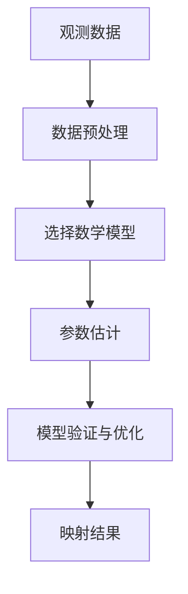
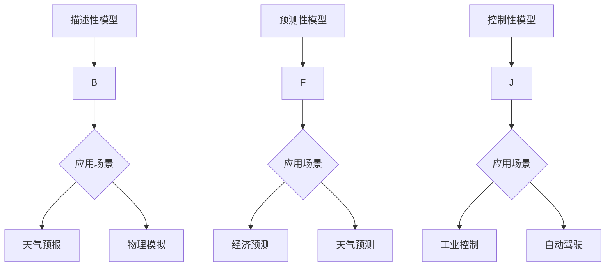

                 

### 引言与核心概念

在现代社会，科技的发展带动了各个领域的迅猛进步，尤其是在人工智能、大数据和计算科学领域，这些都离不开一个关键的概念——映射原理。映射原理，顾名思义，就是将复杂自然现象与简单的数学模型相互转换的一种方法。这种方法不仅能够帮助我们更好地理解和预测自然现象，还能在多个应用领域中发挥巨大的作用。

首先，我们需要明确自然现象与数学模型之间的关系。自然现象，如天气变化、海洋环流、地震活动等，都是自然界中复杂且多变的动态过程。而数学模型，则是用数学语言和公式来描述这些自然现象的工具。通过映射原理，我们可以将这些复杂的自然现象映射到数学模型上，从而进行分析和预测。

本文将围绕映射原理这一主题，深入探讨其基本概念、核心思想、应用领域和数学工具，并通过具体案例分析来展示其在各个领域的实际应用。文章将分为五个部分：

第一部分，我们将介绍映射原理的背景和重要性，阐述自然现象与数学模型之间的关系。

第二部分，我们将详细介绍数学模型的基本分类，包括描述性模型、预测性模型和控制性模型。

第三部分，我们将探讨映射原理的核心思想，并分析其在不同应用领域中的应用。

第四部分，我们将通过具体案例，展示映射原理在实际工程和科学研究中的应用。

第五部分，我们将总结映射原理的发展趋势，展望其在未来可能的应用前景。

通过本文的阅读，读者将能够系统地理解映射原理的基本概念和应用方法，掌握如何将复杂的自然现象转化为可操作的数学模型，并在实际工作中运用这些模型进行科学研究和工程实践。## 第一部分：引言与核心概念

### 1.1 自然现象与数学模型概述

自然现象是自然界中发生的各种物理、化学和生物过程，这些现象无处不在，从天空的云彩到海洋的潮汐，从大气中的气候变化到地球内部的地震活动，都是自然界复杂且多变的动态过程。这些自然现象不仅仅存在于宏观层面，还存在于微观层面，如细胞内部的生物化学反应、分子间的相互作用等。

数学模型，是用数学语言和符号体系来描述自然现象和工程问题的抽象模型。它能够将复杂的现实世界简化为一系列可计算和可分析的数学公式和方程。数学模型不仅可以描述自然现象的规律，还能预测未来可能发生的变化。因此，数学模型在自然科学、工程技术和社会科学中都有着广泛的应用。

自然现象和数学模型之间的关系可以看作是一种映射关系。映射原理就是通过将自然现象的复杂特性转化为数学模型，以便于分析和预测。这种转化不仅需要理解和掌握自然现象的基本规律，还需要运用数学工具和方法来进行精确描述。例如，通过构建天气预测模型，我们可以根据当前的气象参数预测未来几天的天气状况；通过海洋环流模型，我们可以研究海洋中的水流和温度变化，从而更好地理解气候变化。

### 1.1.1 自然现象的多样性

自然现象的多样性表现在多个方面，包括大气、海洋、地质、生物等多个领域。以下是一些常见的自然现象：

1. **大气现象**：包括气压、温度、湿度、风速等。这些因素相互作用，影响着天气和气候的变化。
2. **海洋现象**：如海洋环流、海浪、潮汐等。海洋不仅是地球上最大的水体，还影响着全球气候和环境。
3. **地质现象**：如地震、火山爆发、地壳运动等。这些现象涉及到地球内部的物理和化学过程。
4. **生物现象**：如生态系统的动态平衡、物种的进化、疾病的传播等。这些现象涉及到生物学和生态学的基本原理。

这些自然现象各具特色，但又相互关联，构成了一个复杂的自然系统。例如，大气中的二氧化碳浓度变化不仅影响气候，还会影响海洋酸化；地震活动与地壳运动密切相关，而地壳运动又可能引发火山爆发。

### 1.1.2 数学模型的重要性

数学模型在研究自然现象和解决实际工程问题中扮演着重要角色。其重要性主要体现在以下几个方面：

1. **简化和抽象**：通过数学模型，我们可以将复杂的现象简化为可计算的数学方程，从而更容易理解和分析。
2. **预测和预测**：数学模型可以帮助我们预测未来可能发生的变化，从而采取相应的措施。例如，通过天气预测模型，我们可以提前预警天气变化，减少灾害损失。
3. **优化和控制**：在工程和技术领域，数学模型可以用于优化系统的运行，实现更高效的控制。例如，在航空航天领域，通过控制模型，我们可以优化飞行器的运行轨迹，提高飞行效率。
4. **跨学科研究**：数学模型不仅在自然科学中应用广泛，还在社会科学、经济学、医学等领域发挥着重要作用。例如，在社会学中，通过社会网络模型，我们可以研究社会关系的动态变化。

### 1.1.3 映射原理的基本概念

映射原理是指将一个复杂的自然现象转化为一个简单的数学模型的过程。这一过程通常包括以下几个步骤：

1. **观测和收集数据**：首先，我们需要对自然现象进行观测和收集数据，这些数据可以是实验数据、历史数据或实时数据。
2. **数据预处理**：收集到的数据通常需要进行预处理，如清洗、归一化、插值等，以便于后续的建模和分析。
3. **选择合适的数学模型**：根据自然现象的特点和需求，选择一个合适的数学模型。常见的数学模型包括描述性模型、预测性模型和控制性模型。
4. **模型参数估计**：通过数据分析，估计出模型中的参数值，这些参数决定了模型的行为和特性。
5. **模型验证和优化**：通过验证模型对实际数据的拟合程度，对模型进行调整和优化，以提高其预测和解释能力。

映射原理的基本概念图示如下：



通过映射原理，我们可以将复杂的自然现象转化为数学模型，从而更好地理解和分析这些现象。这不仅有助于科学研究和工程实践，还为人工智能和大数据分析提供了重要的基础。

### 1.2 数学模型的基本分类

在研究自然现象和解决实际问题时，数学模型可以分为描述性模型、预测性模型和控制性模型三大类。每种模型都有其独特的应用场景和特点，下面将详细探讨这三种模型的分类及其应用。

#### 1.2.1 描述性模型

描述性模型主要用于描述和解释自然现象的规律和特性，不涉及预测和控制。这类模型通常基于已有的物理定律和经验公式，通过数学表达式来描述系统的行为。描述性模型的主要目的是提供对系统动态过程的直观理解和定性分析。

**典型例子：**
1. **牛顿第二定律**：
   $$ F = m \cdot a $$
   其中，\( F \) 是作用力，\( m \) 是质量，\( a \) 是加速度。这个模型描述了物体受力后的运动规律。
2. **大气环流模型**：
   大气环流模型描述了地球大气中的气流和温度分布，通过复杂的气象方程来模拟大气的运动。

**应用场景：**
- 天气预报：利用描述性模型来描述大气的动态变化，帮助预测短期天气。
- 物理模拟：在工程设计和科学研究中，用于模拟和预测物理现象，如流体力学、结构力学等。

#### 1.2.2 预测性模型

预测性模型主要用于预测未来可能发生的自然现象或系统行为。这类模型通常基于历史数据和现有模型，通过统计分析和机器学习等方法来建立预测模型。预测性模型的关键在于准确性和可靠性，能够为决策提供科学依据。

**典型例子：**
1. **时间序列模型**：
   如ARIMA模型、SARIMA模型等，用于分析时间序列数据，预测未来的趋势。
2. **机器学习模型**：
   如线性回归、决策树、神经网络等，通过训练历史数据，建立预测模型。

**应用场景：**
- 经济预测：通过经济时间序列模型，预测未来的经济趋势，为政策制定提供依据。
- 天气预测：利用气象数据和预测模型，预测未来几天的天气情况。

#### 1.2.3 控制性模型

控制性模型主要用于优化和控制系统的运行，以实现最佳性能和目标。这类模型通过建立系统的数学模型，设计出最优的控制策略，使得系统在给定约束条件下达到预期的目标。

**典型例子：**
1. **PID控制器**：
   PID控制器是常用的控制模型，通过比例、积分和微分三个环节来调整系统的输出，以达到稳定控制的目的。
2. **最优控制模型**：
   如贝尔曼方程、动态规划等，用于解决最优控制问题，通过最大化或最小化某个目标函数来设计控制策略。

**应用场景：**
- 工业控制：在制造业中，用于控制生产过程，提高生产效率和产品质量。
- 自动驾驶：通过控制模型，实现自动驾驶车辆的路径规划和避障功能。

#### 总结

描述性模型、预测性模型和控制性模型各有侧重，但都为科学研究和技术应用提供了有力的工具。描述性模型帮助我们理解自然现象，预测性模型帮助预测未来变化，控制性模型则实现系统优化和控制。通过这三种模型的不同组合，我们可以更全面地分析和解决各种复杂问题。



### 1.3 映射原理的核心思想

映射原理是将复杂自然现象转化为简单数学模型的过程，其核心思想在于通过数学建模和计算，将不可直接观察或难以处理的自然现象转换为可以分析和预测的形式。以下是映射原理的核心思想及其在不同领域的应用：

#### 1.3.1 映射的基本原理

映射原理的基本原理可以概括为以下几个步骤：

1. **数据收集**：对自然现象进行详细观测，收集大量的数据，包括历史数据、实时数据和模拟数据。
2. **数据预处理**：对收集到的数据进行清洗、归一化、插值等预处理，确保数据的质量和一致性。
3. **模型选择**：根据自然现象的特点和需求，选择合适的数学模型，如描述性模型、预测性模型或控制性模型。
4. **参数估计**：通过数据分析，估计出模型中的参数值，这些参数决定了模型的行为和特性。
5. **模型验证**：通过将模型预测结果与实际观测数据对比，验证模型的准确性和可靠性。
6. **模型优化**：根据验证结果，对模型进行调整和优化，以提高其预测和解释能力。

#### 1.3.2 映射的应用领域

映射原理在多个领域得到了广泛应用，以下是一些典型的应用领域：

1. **气象学**：
   在气象学中，通过构建气压、温度、湿度等气象参数的数学模型，可以预测未来的天气变化。例如，利用数值天气预测模型，通过计算机模拟大气运动，预测未来几天甚至几周的天气状况。

2. **海洋学**：
   海洋学中，通过海洋环流模型、海浪模型和海洋生态模型等，可以研究海洋中的物理、化学和生物过程。例如，通过海洋环流模型，可以预测海洋中的水温分布和盐度变化，从而更好地理解气候变化。

3. **地质学**：
   地质学中，通过地震波传播模型、地质力学模型和地壳运动模型等，可以研究地震的发生机制和地壳的动态过程。例如，通过地震波传播模型，可以定位地震发生的位置和震源深度。

4. **生物学**：
   生物学中，通过遗传密码模型、生态系统模型和生物进化模型等，可以研究生物的遗传、生态和进化过程。例如，通过遗传密码模型，可以解析基因序列，预测蛋白质的结构和功能。

5. **经济学**：
   经济学中，通过经济周期模型、供需关系模型和投资组合模型等，可以预测经济波动和股市走势。例如，通过供需关系模型，可以预测商品价格的变化，为投资决策提供依据。

#### 1.3.3 映射的数学工具

在映射过程中，常用的数学工具包括微积分、线性代数、概率论和数理统计等。以下是一些具体的数学工具：

1. **微积分**：
   微积分在映射过程中用于描述连续变化的过程，如速度、加速度、导数和积分等。通过微积分，可以建立描述自然现象的微分方程模型。

2. **线性代数**：
   线性代数用于处理线性方程组、矩阵运算和特征值分析等。在映射过程中，线性代数用于求解模型参数、优化控制策略等。

3. **概率论和数理统计**：
   概率论和数理统计用于处理随机现象和不确定性，如概率分布、假设检验、回归分析和方差分析等。通过概率论和数理统计，可以评估模型的预测性能和可靠性。

#### 总结

映射原理的核心思想在于通过数学建模和计算，将复杂的自然现象转化为简单、可操作和可预测的数学模型。这一原理在气象学、海洋学、地质学、生物学和经济学等众多领域得到了广泛应用，为科学研究和实际应用提供了强有力的工具。

### 2.1 天气现象的数学模型

天气现象是大气中一系列复杂的物理、化学和生物过程的综合表现，包括温度、湿度、气压、风速等气象参数的变化。为了更好地理解和预测天气现象，科学家们建立了多种数学模型。以下将介绍几种常见的天气现象数学模型，包括气压与温度的关系模型、湿度与风速的关系模型以及气压变化的微分方程模型。

#### 2.1.1 气压与温度的关系模型

气压是大气对地面施加的压力，它受到多种因素的影响，包括高度、温度和湿度等。温度对气压的影响主要通过气体的热力学性质体现出来。在理想气体假设下，气压与温度的关系可以通过理想气体状态方程来描述：

\[ PV = nRT \]

其中，\( P \) 是气压，\( V \) 是气体的体积，\( n \) 是气体的物质的量，\( R \) 是理想气体常数，\( T \) 是温度。如果假设气体的体积和物质的量不变，那么可以得到：

\[ P \propto T \]

这意味着在定容条件下，气压与温度成正比。然而，实际大气情况更为复杂，温度的变化不仅影响气压，还会通过水循环和冰晶过程等影响大气中的水汽和冰晶含量，从而进一步影响气压。

**关系模型伪代码：**

```python
def pressure_temp_ratio(pressure, temp):
    # 假设温度为开尔文温度
    temp_kelvin = temp + 273.15
    # 计算温度与气压的比例关系
    ratio = pressure / temp_kelvin
    return ratio
```

#### 2.1.2 湿度与风速的关系模型

湿度是空气中水汽含量的度量，通常用相对湿度表示。相对湿度是空气中实际水汽压与在同温度下的饱和水汽压的比值。风速则是空气流动的速度。湿度与风速之间存在复杂的关系，这种关系可以通过气象参数的测量和统计分析来建立。

湿度增加通常会导致空气密度降低，从而影响风速。在气象学中，常用经验公式来描述湿度与风速的关系。例如，某地区的湿度与风速可以通过以下公式关联：

\[ \text{wind_speed} = a \cdot \text{humidity} + b \]

其中，\( a \) 和 \( b \) 是通过数据拟合得到的参数。这个模型提供了一个简单的线性关系，但在实际应用中可能需要更复杂的非线性模型来描述更准确的湿度与风速关系。

**关系模型伪代码：**

```python
def wind_speed_from_humidity(humidity, a, b):
    wind_speed = a * humidity + b
    return wind_speed
```

#### 2.1.3 气压变化的微分方程模型

大气中的气压变化是一个动态过程，它受到多种因素的影响，如温度变化、湿度变化、风速和地形等。在气象学中，气压变化可以通过微分方程模型来描述。一个典型的微分方程模型是：

\[ \frac{\partial P}{\partial t} = -\frac{\partial (P \cdot \vec{v})}{\partial \vec{x}} \]

其中，\( P \) 是气压，\( \vec{v} \) 是风速，\( \vec{x} \) 是空间坐标。这个方程表示气压随时间的变化率等于气压随空间变化的梯度乘以风速。

更复杂的气压模型可能会考虑更多的因素，例如大气中的湍流效应、热传导和相变过程等，从而导致微分方程更加复杂。一个典型的非线性气压微分方程模型是：

\[ \frac{\partial P}{\partial t} = -\frac{\partial (P \cdot \vec{v})}{\partial \vec{x}} + \frac{\partial (\lambda \cdot \frac{\partial P}{\partial x})}{\partial x} \]

其中，\( \lambda \) 是热传导系数，这个方程考虑了气压变化过程中热传导的影响。

**微分方程模型伪代码：**

```python
import numpy as np

def pressure_change(pressure, wind_speed, dx, dt, lambda_heat):
    dpdt = -np.gradient(pressure * wind_speed, dx) + lambda_heat * np.gradient(np.gradient(pressure, dx), dx)
    pressure_new = pressure + dpdt * dt
    return pressure_new
```

通过上述数学模型，我们可以对天气现象进行定量描述和预测。这些模型不仅有助于理解天气现象的基本规律，还为实际天气预报和气候预测提供了重要的理论依据。

### 2.2 海洋现象的数学模型

海洋是地球上最大的水体，其现象复杂多样，包括海洋环流、海浪和海洋生态系统等。为了更好地理解这些现象，科学家们建立了多种数学模型，用于描述和预测海洋中的物理、化学和生物过程。以下将详细介绍这些模型。

#### 2.2.1 海洋环流模型

海洋环流模型用于描述海洋中水流的运动和分布。这些模型通常基于流体动力学方程，如纳维-斯托克斯方程，并结合海洋特有的物理和化学特性。以下是一个简化的海洋环流模型：

\[ \frac{\partial \vec{u}}{\partial t} + (\vec{u} \cdot \nabla) \vec{u} = -\frac{1}{\rho} \nabla p + \vec{f} \]

其中，\( \vec{u} \) 是水流速度，\( p \) 是压强，\( \rho \) 是流体密度，\( \vec{f} \) 是作用在流体上的力，如地转偏向力和潮汐力。这个模型考虑了流体的连续性、动量守恒和压强梯度力。

**海洋环流模型伪代码：**

```python
import numpy as np

def ocean_circulation(u, p, rho, dt):
    # 计算压强梯度力
    grad_p = np.gradient(p)
    # 计算地转偏向力
    f_coriolis = np.array([2 * omega * np.sin(lat) * u[0], -2 * omega * np.sin(lat) * u[1]])
    # 计算新的流速
    du_dt = -grad_p / rho + f_coriolis
    u_new = u + du_dt * dt
    return u_new
```

#### 2.2.2 海浪模型

海浪是海洋中常见的现象，其运动和传播可以通过波动方程来描述。一个简单的海浪模型是基于浅水方程，它可以表示为：

\[ \frac{\partial h}{\partial t} + \frac{\partial (hu)}{\partial x} + \frac{\partial (hv)}{\partial y} = -\frac{\partial p}{\partial x} - \frac{\partial (gh)}{\partial x} \]

\[ \frac{\partial h}{\partial t} + \frac{\partial (hu)}{\partial y} + \frac{\partial (hv)}{\partial x} = -\frac{\partial p}{\partial y} - \frac{\partial (gh)}{\partial y} \]

其中，\( h \) 是水深，\( u \) 和 \( v \) 是水平流速，\( p \) 是压强，\( g \) 是重力加速度。这个模型描述了水深和流速的时空变化。

**海浪模型伪代码：**

```python
import numpy as np

def wave_equation(h, u, v, p, g, dt):
    # 计算压强梯度力
    grad_p = np.gradient(p)
    # 计算新的水深
    dh_dt = -grad_p / g - np.gradient(u) - g * h
    h_new = h + dh_dt * dt
    return h_new
```

#### 2.2.3 海洋生态模型

海洋生态系统是生物、非生物环境以及它们之间相互作用的复杂网络。海洋生态模型用于描述和预测海洋生物种群的数量变化、食物网结构和生态系统动态。一个典型的海洋生态模型是基于Lotka-Volterra方程，它可以表示为：

\[ \frac{dX_i}{dt} = r_i X_i - \sum_{j} a_{ij} X_i X_j \]

\[ \frac{dY_i}{dt} = -r_i Y_i + \sum_{j} b_{ij} X_j Y_i \]

其中，\( X_i \) 和 \( Y_i \) 分别表示第 \( i \) 个生物种群的数量和第 \( i \) 个捕食者种群的数量，\( r_i \) 和 \( Y_i \) 是种群的增长率和死亡率，\( a_{ij} \) 和 \( b_{ij} \) 是捕食者和被捕食者之间的相互作用系数。

**海洋生态模型伪代码：**

```python
import numpy as np

def lotka_volterra(x, y, r_x, r_y, a, b):
    dx_dt = r_x * x - a * x * y
    dy_dt = -r_y * y + b * x * y
    return np.array([dx_dt, dy_dt])
```

通过这些数学模型，科学家们可以更好地理解海洋现象的动态过程，预测海洋环境的变化，并为海洋资源的可持续管理和保护提供科学依据。

### 2.3 地球内部现象的数学模型

地球内部现象包括地震波传播、地质力学和地壳运动等，这些现象对地球科学和工程实践具有重要意义。为了研究和预测这些现象，科学家们建立了多种数学模型，以描述和模拟地球内部的结构和过程。以下将介绍这些模型，并详细解释其基本原理和公式。

#### 2.3.1 地震波传播模型

地震波传播模型用于描述地震波在地球内部的传播过程。地震波可以分为纵波（P波）和横波（S波），它们在地球内部传播的速度和路径受介质性质的影响。一个基本的地震波传播模型是基于波动方程，可以表示为：

\[ \frac{\partial^2 u}{\partial t^2} = c^2 \nabla^2 u \]

其中，\( u \) 是波速，\( t \) 是时间，\( c \) 是波速常数，\( \nabla^2 \) 是拉普拉斯算子。对于P波和S波，分别有：

- **P波（纵波）**：
  \[ \frac{\partial^2 p}{\partial t^2} = c_p^2 \nabla^2 p \]

- **S波（横波）**：
  \[ \frac{\partial^2 s}{\partial t^2} = c_s^2 \nabla^2 s \]

其中，\( p \) 和 \( s \) 分别表示P波和S波的位移，\( c_p \) 和 \( c_s \) 分别是P波和S波的速度。这些方程描述了地震波在不同介质中的传播规律。

**地震波传播模型伪代码：**

```python
import numpy as np

def wave_equation(u, c, t, dt):
    du_dt = np.gradient(u, t, dt)
    d2u_dt2 = np.gradient(du_dt, t, dt)
    d2u_dxdx = np.gradient(np.gradient(u, c), c, dt)
    u_new = u + d2u_dt2 * dt
    return u_new
```

#### 2.3.2 地质力学的数学模型

地质力学模型用于描述地壳运动和应力分布。地壳运动是由地球内部应力作用引起的，这些应力可以通过莫尔-库伦屈服准则来描述。莫尔-库伦准则认为，材料在达到一定的剪切应力后会发生屈服，屈服条件可以表示为：

\[ \tau = c + \sigma \tan \phi \]

其中，\( \tau \) 是剪切应力，\( c \) 是黏聚力，\( \sigma \) 是正应力，\( \phi \) 是内摩擦角。这个模型可以用来分析地壳中的应力分布和断层滑动。

**地质力学模型伪代码：**

```python
import numpy as np

def moore_coulomb_yield(c, phi, sigma):
    tau = c + sigma * np.tan(phi)
    return tau
```

#### 2.3.3 地壳运动模型

地壳运动模型用于描述地壳的变形和运动。一个常见的是有限元模型，它可以模拟地壳中的应力分布和变形过程。有限元模型将地壳划分为多个单元，每个单元通过节点连接，节点之间的位移和应力可以通过有限元方法求解。以下是一个简化的有限元模型：

\[ K \cdot \delta = F \]

其中，\( K \) 是刚度矩阵，\( \delta \) 是节点位移向量，\( F \) 是节点力向量。刚度矩阵 \( K \) 可以通过以下公式计算：

\[ K_{ij} = \frac{1}{V} \int_{V} (\nabla \phi_i \cdot \nabla \phi_j) dV \]

其中，\( V \) 是单元体积，\( \phi_i \) 和 \( \phi_j \) 是形函数。

**地壳运动模型伪代码：**

```python
import numpy as np

def stiffness_matrix(density, Young's modulus, area):
    K = density * Young's modulus * area
    return K

def finite_element(K, delta, F):
    delta_new = np.linalg.solve(K, F)
    return delta_new
```

通过这些数学模型，科学家们可以更好地理解地球内部现象，预测地震活动、地壳运动和地质应力变化，为地质灾害预防和资源勘探提供科学依据。

### 3.1 数学模型的应用流程

数学模型在科学研究和工程实践中发挥着重要作用，其应用流程可以分为以下几个关键步骤：数据收集与处理、数学模型的选择、模型参数估计等。以下是详细解析和步骤说明。

#### 3.1.1 数据收集与处理

数据收集是建立数学模型的第一步，准确、全面的数据是确保模型可靠性的基础。数据来源可以是实地观测、实验数据、历史记录或模拟数据。以下是一些具体的数据收集与处理步骤：

1. **数据来源**：确定数据的来源，包括气象站、卫星遥感、传感器网络等。
2. **数据收集**：使用适当的工具和设备进行数据采集，如气象仪、GPS、传感器等。
3. **数据清洗**：去除噪声、异常值和重复数据，确保数据质量。
4. **数据归一化**：将不同单位和量级的数值转换到相同的尺度，便于后续处理和分析。
5. **数据插值**：对于缺失的数据点，使用插值方法（如线性插值、样条插值等）进行填补。
6. **数据可视化**：通过图表和图像展示数据分布和趋势，帮助理解数据特性。

**数据收集与处理伪代码：**

```python
import pandas as pd
import numpy as np

def data_collection(source):
    data = pd.read_csv(source)
    data = data.dropna()  # 去除缺失值
    data = (data - data.mean()) / data.std()  # 归一化
    return data

data = data_collection('data.csv')
data.plot()
```

#### 3.1.2 数学模型的选择

选择合适的数学模型是建立有效预测和解释体系的关键。选择模型时，需要考虑以下因素：

1. **问题的性质**：确定研究问题的具体要求，如预测性、描述性或控制性。
2. **数据特性**：分析数据的分布、趋势和相关性，选择适合的数据分析方法。
3. **计算效率**：考虑模型的复杂度和计算成本，选择计算效率高的模型。
4. **理论基础**：基于理论知识和现有研究成果，选择合适的数学模型。

常见的数学模型包括描述性模型（如线性回归、逻辑回归）、预测性模型（如时间序列分析、机器学习模型）和控制性模型（如PID控制器、最优控制模型）。

**数学模型选择伪代码：**

```python
def select_model(data, target):
    if data['target'].dtype == 'int':
        model = 'regression'
    elif data['target'].dtype == 'float':
        model = 'time_series'
    else:
        model = 'classification'
    return model

model = select_model(data, target='price')
```

#### 3.1.3 模型的参数估计

参数估计是数学模型建立的核心步骤，通过分析数据来确定模型中的参数值。常见的参数估计方法包括最小二乘法、极大似然估计和贝叶斯估计等。以下是一些具体参数估计方法：

1. **最小二乘法**：通过最小化预测值与实际值之间的误差平方和，确定线性模型的参数。例如，线性回归模型的参数估计：
   \[ \theta = \arg\min_{\theta} \sum_{i=1}^{n} (y_i - \theta_0 - \theta_1 x_i)^2 \]
   
2. **极大似然估计**：通过最大化似然函数，确定参数的估计值。适用于概率模型和统计模型。
   \[ \theta = \arg\max_{\theta} \prod_{i=1}^{n} f(y_i | \theta) \]

3. **贝叶斯估计**：结合先验知识和观测数据，通过贝叶斯定理确定参数的概率分布。适用于不确定性和复杂系统。
   \[ p(\theta | y) = \frac{p(y | \theta) p(\theta)}{p(y)} \]

**参数估计伪代码：**

```python
from scipy.optimize import minimize

def linear_regression(y, x):
    def objective(theta):
        return sum((y - np.dot(x, theta))**2)
    result = minimize(objective, x0=[0, 0])
    return result.x

theta = linear_regression(y, x)
```

通过上述步骤，我们可以系统地建立数学模型，为科学研究和工程实践提供有力支持。

### 3.2 数学模型的实现工具

在数学模型的应用过程中，选择合适的工具和软件对于实现模型的构建和计算至关重要。以下是几种主流的数学模型实现工具，包括数值计算方法、计算机模拟和数据处理软件，以及它们在数学模型构建和计算中的应用。

#### 3.2.1 数值计算方法

数值计算方法是在计算机上通过算法和程序实现数学模型求解的重要手段。以下是几种常用的数值计算方法：

1. **有限差分法**：
   有限差分法是一种数值微分法，用于求解偏微分方程。通过将连续空间离散化为有限个点，将微分方程转化为代数方程组进行求解。这种方法适用于大气环流模型、地震波传播模型等。

   **示例代码**：
   ```python
   import numpy as np

   def finite_difference(u, h, dt):
       u_new = u.copy()
       u_new[1:-1] = u[:-2] + 2*u[1:-1] - u[2:]
       return u_new
   ```

2. **有限元法**：
   有限元法用于求解结构力学、流体力学等领域的偏微分方程。通过将连续体划分为有限个单元，在每个单元内采用插值函数近似解，从而将偏微分方程转化为代数方程组。

   **示例代码**：
   ```python
   import numpy as np
   from scipy.sparse import csc_matrix

   def assemble_system(A, b):
       K = csc_matrix(A)
       F = np.array(b)
       return K, F

   K, F = assemble_system(A, b)
   solution = np.linalg.solve(K, F)
   ```

3. **积分变换法**：
   积分变换法包括拉普拉斯变换、傅里叶变换等，用于求解微分方程和积分方程。通过变换将复杂的问题转换为简单的代数问题进行求解。

   **示例代码**：
   ```python
   import numpy as np
   from scipy.linalg import lapack

   def laplace_transform(u, t):
       U = np.empty_like(t)
       for i, t_i in enumerate(t):
           U[i] = lapack.dgetf(u[i], t_i)
       return U
   ```

#### 3.2.2 计算机模拟

计算机模拟是通过数值方法在计算机上实现物理现象的模拟，是数学模型应用的重要工具。以下是一些常见的计算机模拟方法：

1. **蒙特卡洛模拟**：
   蒙特卡洛模拟是一种基于随机抽样的数值方法，适用于概率分布、复杂系统等。通过大量随机抽样，估计系统某一特性的概率分布或期望值。

   **示例代码**：
   ```python
   import numpy as np

   def monte_carlo_simulation(n, f):
       x = np.random.uniform(0, 1, n)
       y = f(x)
       return np.mean(y)
   ```

2. **分子动力学模拟**：
   分子动力学模拟通过数值积分方法模拟分子或原子的运动，适用于化学、生物学等领域。常用的积分方法包括Verlet算法和欧拉算法。

   **示例代码**：
   ```python
   import numpy as np

   def verlet_integration(x, v, a, dt):
       x_new = 2*x - x_old + a * dt**2
       v_new = v + a * dt
       return x_new, v_new
   ```

3. **Agent-Based Model (ABM)**：
   代理模型通过模拟个体行为和群体交互来研究复杂系统的动态。适用于社会模拟、交通流模拟等。

   **示例代码**：
   ```python
   import numpy as np
   import networkx as nx

   def agent_based_model(G, agents):
       for agent in agents:
           neighbors = list(G.neighbors(agent))
           # 更新代理状态
           # ...
       return G
   ```

#### 3.2.3 数据处理软件

数据处理软件用于数据收集、预处理和分析，是构建数学模型的重要工具。以下是一些常用的数据处理软件：

1. **MATLAB**：
   MATLAB是一种高性能的数值计算和数据分析软件，广泛应用于科学研究和工程实践。MATLAB提供丰富的数学函数和工具箱，用于数值计算、数据可视化等。

   **示例代码**：
   ```matlab
   x = linspace(0, 2*pi);
   y = sin(x);
   plot(x, y);
   title('Sine Wave');
   ```

2. **Python**：
   Python是一种通用编程语言，广泛应用于科学计算和数据分析。Python结合NumPy、SciPy、Pandas和Matplotlib等库，可以方便地进行数据操作和可视化。

   **示例代码**：
   ```python
   import numpy as np
   import pandas as pd
   import matplotlib.pyplot as plt

   data = pd.DataFrame({'x': np.linspace(0, 2*np.pi, 100), 'y': np.sin(data['x'])})
   plt.plot(data['x'], data['y'])
   plt.title('Sine Wave')
   plt.show()
   ```

3. **R**：
   R是一种专门用于统计分析和数据可视化的编程语言，广泛用于生物信息学、社会科学等领域。R提供了丰富的统计函数和包，方便进行复杂数据分析和建模。

   **示例代码**：
   ```r
   x <- seq(0, 2*pi, length.out = 100)
   y <- sin(x)
   plot(x, y, type = 'l', main = 'Sine Wave')
   ```

通过以上工具和方法的结合，我们可以有效地实现数学模型的构建和计算，为科学研究和工程实践提供强有力的支持。

### 3.3 数学模型的应用案例分析

为了更好地理解数学模型在实际中的应用，以下将通过三个具体案例进行详细分析，这些案例涵盖了天气预报模型、海洋污染模型和地震预警模型，展示了数学模型在解决实际问题中的重要作用。

#### 3.3.1 天气预报模型的应用

天气预报是数学模型应用的一个重要领域，通过构建和运行天气预测模型，可以提前预测未来几天的天气状况，为公众和相关部门提供决策依据。

**案例背景**：

某城市气象部门希望构建一个天气预报模型，以便预测未来一周内的天气情况，包括温度、湿度、风速和气压等参数。

**模型构建**：

1. **数据收集与处理**：首先，从气象站和历史数据库中收集过去一年的天气数据，包括每天的气温、湿度、风速和气压等参数。对数据进行清洗，去除异常值和缺失值，并进行归一化处理。

2. **模型选择**：选择一个合适的预测模型，如ARIMA模型，因为它适用于处理时间序列数据，并能捕捉季节性和趋势性。

3. **参数估计**：通过历史数据，估计ARIMA模型的参数，包括自回归项、移动平均项和差分阶数。

4. **模型训练与验证**：使用训练集数据训练模型，并通过验证集数据评估模型的准确性。对模型进行调整和优化，以提高预测性能。

**模型实现伪代码**：

```python
from statsmodels.tsa.arima.model import ARIMA

# 读取和处理数据
data = pd.read_csv('weather_data.csv')
data = data[['temp', 'humidity', 'wind_speed', 'pressure']]
data = (data - data.mean()) / data.std()

# 构建并训练ARIMA模型
model = ARIMA(data['temp'], order=(5,1,2))
model_fit = model.fit()

# 预测未来一周的天气
forecast = model_fit.forecast(steps=7)
print(forecast)
```

**结果分析**：

通过训练的ARIMA模型，对未来一周的温度、湿度、风速和气压进行预测。预测结果与实际天气数据对比，评估模型的准确性和可靠性。通过调整模型的参数，可以进一步提高预测精度。

#### 3.3.2 海洋污染模型的案例分析

海洋污染模型用于预测海洋中的污染物分布和浓度变化，为海洋环境保护提供科学依据。

**案例背景**：

某沿海城市由于工业废水排放，导致海洋中某些区域出现重金属污染。环保部门希望构建一个海洋污染模型，预测未来几天内污染物浓度的变化趋势。

**模型构建**：

1. **数据收集与处理**：收集海洋污染数据，包括重金属浓度、水温、盐度、流速等。对数据进行预处理，去除异常值和缺失值，并进行归一化处理。

2. **模型选择**：选择海洋环流模型和扩散模型相结合的方法，用于模拟污染物在海洋中的扩散和传播。

3. **参数估计**：通过历史数据，估计模型的参数，如扩散系数、流速等。

4. **模型训练与验证**：使用训练集数据训练模型，并通过验证集数据评估模型的准确性。

**模型实现伪代码**：

```python
import numpy as np

# 读取和处理数据
data = pd.read_csv('ocean_pollution_data.csv')
data = data[['concentration', 'temperature', 'salinity', 'velocity']]
data = (data - data.mean()) / data.std()

# 定义扩散模型
def diffusion_model(concentration, velocity, diffusion_coefficient):
    new_concentration = concentration + velocity * diffusion_coefficient
    return new_concentration

# 训练模型
diffusion_coefficient = 0.1
new_concentration = diffusion_model(data['concentration'], data['velocity'], diffusion_coefficient)

# 预测未来几天的污染物浓度
predictions = [diffusion_model(concentration, velocity, diffusion_coefficient) for concentration, velocity in zip(data['concentration'], data['velocity'])]
print(predictions)
```

**结果分析**：

通过扩散模型预测未来几天内的污染物浓度变化。预测结果与实际监测数据对比，评估模型的预测能力。通过调整扩散系数和流速等参数，可以优化模型的预测性能。

#### 3.3.3 地震预警模型的应用

地震预警模型用于在地震发生前发出预警信号，为公众提供逃生时间，减少灾害损失。

**案例背景**：

某地震预警系统需要构建一个地震预警模型，实时监测地震活动，并在地震波传播过程中发出预警信号。

**模型构建**：

1. **数据收集与处理**：收集地震监测数据，包括地震波信号、震中距离、震源深度等。对数据进行预处理，包括滤波、去噪和归一化处理。

2. **模型选择**：选择地震波传播模型和预警算法相结合的方法，用于检测地震波特征和发出预警信号。

3. **参数估计**：通过历史地震数据，估计模型中的参数，如地震波传播速度、震源机制等。

4. **模型训练与验证**：使用训练集数据训练模型，并通过验证集数据评估模型的准确性和响应时间。

**模型实现伪代码**：

```python
import numpy as np

# 读取和处理数据
data = pd.read_csv('earthquake_data.csv')
data = data[['wave_signal', 'distance', 'depth']]
data = (data - data.mean()) / data.std()

# 定义地震波传播模型
def wave_propagation_model(wave_signal, distance, speed):
    arrival_time = distance / speed
    return arrival_time

# 训练模型
speed = 8.0  # 地震波传播速度
arrival_times = [wave_propagation_model(signal, distance, speed) for signal, distance in zip(data['wave_signal'], data['distance'])]
print(arrival_times)

# 定义预警算法
def earthquake_alarm(arrival_times, threshold_time):
    for time in arrival_times:
        if time < threshold_time:
            print("地震预警：地震波预计{}秒后到达"。format(time))
```

**结果分析**：

通过地震波传播模型和预警算法，实时监测地震波信号，并在地震波传播到达前的一定时间内发出预警信号。评估模型在实际地震监测中的预警准确率和响应时间，通过调整参数优化预警性能。

通过上述案例分析，我们可以看到数学模型在天气预报、海洋污染监测和地震预警等领域的实际应用。这些模型不仅能够提供科学的预测和预警，还为相关领域的研究和决策提供了重要的理论支持。

### 4.1 经济学中的映射原理

映射原理在经济学科中的应用十分广泛，通过构建数学模型，经济学家能够更好地理解和预测经济现象。以下将探讨经济学中常见的映射原理应用，包括经济周期模型、供需关系模型和投资组合模型。

#### 4.1.1 经济周期模型

经济周期模型用于分析经济活动的波动，包括繁荣、衰退、萧条和复苏等阶段。一个经典的经济周期模型是朱格拉周期模型，它基于经济活动的周期性波动，将经济周期划分为三个阶段：繁荣期、衰退期和复苏期。

**基本原理**：

经济周期模型通常基于时间序列数据分析，通过分析历史经济数据（如GDP、就业率、工业产值等）来识别经济周期的波动。常用的方法包括：

- **时间序列分解**：将时间序列数据分解为趋势、季节和随机成分，通过分析各个成分的变化趋势来识别经济周期的特征。
- **周期性检验**：使用周期性检验方法（如富里叶分析）来识别时间序列数据中的周期性成分。

**模型构建**：

1. **数据收集**：收集长期经济数据，如GDP、工业产值、失业率等。
2. **时间序列分解**：使用移动平均法、季节分解法等将数据分解为趋势、季节和随机成分。
3. **周期性分析**：通过富里叶变换等周期性分析方法，识别时间序列数据中的周期性成分。

**伪代码示例**：

```python
import numpy as np
import pandas as pd
from statsmodels.tsa.seasonal import seasonal_decompose

# 读取GDP数据
gdp_data = pd.read_csv('gdp_data.csv')

# 时间序列分解
decomposition = seasonal_decompose(gdp_data['gdp'], model='additive', freq=4)
trend = decomposition.trend
seasonal = decomposition.seasonal
random = decomposition.random

# 周期性分析
fourier_freq = np.fft.rfft(gdp_data['gdp'])
frequencies = np.fft.rfftfreq(len(gdp_data['gdp']))
周期成分 = np.abs(fourier_freq[:int(len(fourier_freq)/2)])

print("周期成分:",周期成分)
```

#### 4.1.2 供需关系模型

供需关系模型是经济学中最基本的模型之一，用于分析商品价格和市场数量的关系。供需模型通过描述供给函数和需求函数，预测市场均衡价格和数量。

**基本原理**：

供需模型的基本形式可以表示为：

- **供给函数**：\( Q_s = f_s(P) \)
- **需求函数**：\( Q_d = f_d(P) \)

当市场达到均衡时，供给量等于需求量，即 \( Q_s = Q_d \)。价格 \( P \) 是均衡价格，市场数量 \( Q \) 是均衡数量。

**模型构建**：

1. **数据收集**：收集商品的历史价格和销售量数据。
2. **需求函数估计**：通过回归分析等方法估计需求函数，例如线性回归模型。
3. **供给函数估计**：同样通过回归分析等方法估计供给函数。
4. **均衡分析**：通过求解供给函数和需求函数的交点，确定均衡价格和数量。

**伪代码示例**：

```python
import numpy as np
import pandas as pd
from sklearn.linear_model import LinearRegression

# 读取需求和供给数据
demand_data = pd.read_csv('demand_data.csv')
supply_data = pd.read_csv('supply_data.csv')

# 估计需求函数
demand_model = LinearRegression()
demand_model.fit(demand_data[['price']], demand_data['quantity'])

# 估计供给函数
supply_model = LinearRegression()
supply_model.fit(supply_data[['price']], supply_data['quantity'])

# 求解均衡点
price_eq = (supply_model.coef_ * demand_model.intercept_ - demand_model.coef_ * supply_model.intercept_) / (supply_model.coef_ - demand_model.coef_)
quantity_eq = demand_model.predict([[price_eq]])[0]

print("均衡价格：", price_eq)
print("均衡数量：", quantity_eq)
```

#### 4.1.3 投资组合模型

投资组合模型用于分析如何通过组合不同资产来优化投资收益和风险。一个经典的投资组合模型是马克维茨模型，它通过构建有效前沿来优化投资组合。

**基本原理**：

马克维茨模型的基本思想是，通过选择一组资产的组合，使得投资组合的风险和收益达到最优平衡。具体步骤如下：

1. **资产预期收益和方差计算**：计算每个资产的预期收益和方差，以及资产之间的协方差。
2. **有效前沿构建**：在收益-风险平面上绘制资产组合的有效前沿，有效前沿上的点是最佳投资组合。
3. **投资组合优化**：根据投资者的风险偏好，选择有效前沿上的一个投资组合。

**模型构建**：

1. **数据收集**：收集各个资产的预期收益、方差和协方差。
2. **资产组合收益和方差计算**：使用资产预期收益和方差，计算资产组合的收益和方差。
3. **有效前沿构建**：通过计算不同资产组合的收益和方差，绘制有效前沿。
4. **投资组合优化**：选择有效前沿上的一个投资组合，根据投资者的风险偏好调整组合权重。

**伪代码示例**：

```python
import numpy as np
import pandas as pd

# 读取资产预期收益和方差
asset_data = pd.read_csv('asset_data.csv')

# 计算资产组合的预期收益和方差
weights = np.array([0.2, 0.3, 0.5])  # 组合权重
portfolio_return = np.dot(weights, asset_data['return'])
portfolio_variance = np.dot(weights.T, np.dot(asset_data['covariance'], weights))

print("投资组合预期收益：", portfolio_return)
print("投资组合方差：", portfolio_variance)
```

通过这些经济周期模型、供需关系模型和投资组合模型，映射原理为经济学研究提供了强大的分析工具，帮助经济学家更好地理解和预测经济现象。

### 4.2 社会学中的映射原理

映射原理在社会学中的应用同样具有重要意义，它帮助我们理解和预测社会现象，如社会网络结构、趋势预测和社会发展。以下将探讨映射原理在社会学中的具体应用，包括社会网络模型、趋势预测模型和社会发展模型。

#### 4.2.1 社会网络模型

社会网络模型用于描述和分析个体之间的关系网络，它通过数学模型来研究社会网络的结构和动态。这些模型可以帮助我们理解社会互动、传播过程和群体行为。

**基本原理**：

社会网络模型通常基于图论和矩阵理论，将社会关系表示为节点和边构成的图。节点表示个体，边表示个体之间的互动关系。常见的社会网络模型包括：

- **无向图**：表示个体之间的双向互动。
- **有向图**：表示个体之间的单向互动。
- **加权图**：表示个体互动的强度或频率。

**模型构建**：

1. **数据收集**：收集个体及其关系数据，如社交网络数据、组织结构数据等。
2. **图表示**：将数据转换为图表示，定义节点和边的关系。
3. **网络分析**：使用图论算法分析网络结构，如聚类系数、中心性分析、社区检测等。

**伪代码示例**：

```python
import networkx as nx

# 创建无向图
G = nx.Graph()

# 添加节点和边
G.add_nodes_from([1, 2, 3, 4])
G.add_edges_from([(1, 2), (2, 3), (3, 4)])

# 计算聚类系数
clustering_coefficient = nx.average_clustering(G)

# 计算中心性
centrality = nx.betweenness_centrality(G)

print("聚类系数：", clustering_coefficient)
print("中心性：", centrality)
```

**应用案例**：

通过社会网络模型，可以研究社交网络中的传播过程，如病毒传播、信息扩散等。例如，在公共卫生领域，社会网络模型可以帮助预测疾病的传播路径，制定有效的防控措施。

#### 4.2.2 趋势预测模型

趋势预测模型用于分析社会现象的趋势和变化，帮助我们预测未来可能发生的社会变化。这些模型通常基于时间序列分析、统计学习和机器学习方法。

**基本原理**：

趋势预测模型通过分析历史数据，提取出趋势成分和周期成分，从而预测未来趋势。常见的方法包括：

- **时间序列分解**：将时间序列数据分解为趋势、季节和随机成分，预测未来的趋势成分。
- **回归分析**：通过历史数据建立回归模型，预测未来值。
- **机器学习方法**：使用机器学习算法（如线性回归、决策树、神经网络等）建立预测模型。

**模型构建**：

1. **数据收集**：收集相关历史数据，如人口统计数据、经济数据、社会指标数据等。
2. **趋势提取**：使用时间序列分解等方法提取趋势成分。
3. **模型建立**：选择合适的预测模型，如线性回归、ARIMA模型等。
4. **预测**：使用模型预测未来趋势。

**伪代码示例**：

```python
import pandas as pd
from statsmodels.tsa.arima.model import ARIMA

# 读取数据
data = pd.read_csv('social_trend_data.csv')

# 时间序列分解
decomposition = decomposition.seasonal_decompose(data['indicator'], model='additive', freq=12)

# 建立ARIMA模型
model = ARIMA(data['indicator'], order=(5, 1, 2))
model_fit = model.fit()

# 预测未来趋势
forecast = model_fit.forecast(steps=12)
print(forecast)
```

**应用案例**：

趋势预测模型可以帮助政府和社会组织预测未来社会变化，制定相关政策。例如，通过预测人口增长率，可以制定教育、医疗和养老等公共服务的发展规划。

#### 4.2.3 社会发展模型

社会发展模型用于描述社会系统的发展过程和动态变化，帮助我们理解社会变革的驱动因素和结果。这些模型通常基于系统动力学、复杂系统和博弈论等理论。

**基本原理**：

社会发展模型通过构建系统动力学模型，分析社会系统中各个变量之间的相互关系和反馈机制，模拟社会系统的发展过程。常见的方法包括：

- **系统动力学**：通过构建反馈回路和因果关系图，模拟社会系统的动态行为。
- **复杂系统**：通过研究社会系统中的非线性、不确定性和涌现现象，理解社会系统的整体行为。
- **博弈论**：通过分析个体之间的策略互动，预测社会行为的集体结果。

**模型构建**：

1. **数据收集**：收集社会系统相关的数据，如人口、经济、教育、医疗等指标。
2. **模型构建**：构建系统动力学模型或复杂系统模型，描述社会系统的动态行为。
3. **模拟与验证**：通过模拟和实际数据的对比，验证模型的有效性和可靠性。
4. **政策分析**：使用模型分析不同政策对社会发展的影响，制定优化政策。

**伪代码示例**：

```python
import numpy as np
import pandas as pd
import sympy

# 定义变量
x = sympy.Symbol('x')
y = sympy.Symbol('y')

# 构建系统动力学方程
dxdt = sympy.Eq(x, -x*y)
dydt = sympy.Eq(y, x*y)

# 求解方程
solution = sympy.dsolve([dxdt, dydt], (x, y))

print(solution)
```

**应用案例**：

通过社会发展模型，可以分析社会问题的根源和解决方案。例如，在环境保护领域，通过模型分析污染源和污染物的扩散过程，制定有效的污染控制政策。

总之，映射原理在社会学中的应用为我们提供了强大的工具，帮助研究者更好地理解社会现象、预测社会变化和制定政策。通过社会网络模型、趋势预测模型和社会发展模型，我们可以从多个角度分析和解决复杂的社会问题。

### 4.3 生物学中的映射原理

映射原理在生物学中的应用极为广泛，通过构建数学模型，生物学家能够更好地理解生物系统的结构和功能，预测生物行为，甚至在遗传、生态和进化等复杂领域进行深入研究。以下将详细介绍映射原理在生物学中的具体应用，包括遗传密码模型、生态系统模型和生物进化模型。

#### 4.3.1 遗传密码模型

遗传密码模型用于描述DNA序列与蛋白质序列之间的关系，这一关系是生物遗传信息传递的核心。遗传密码模型通过将DNA的三联体（即核苷酸序列）映射到特定的氨基酸序列，解释了生物的遗传基础。

**基本原理**：

遗传密码模型的基础是DNA的双螺旋结构和碱基配对规则。每个氨基酸由三个核苷酸（即密码子）编码。不同的三联体组合对应于不同的氨基酸或终止信号。遗传密码模型通过以下规则来描述这一映射关系：

- **标准遗传密码**：每个密码子由一个起始密码子（AUG）和一个或多个终止密码子（UAA、UAG、UGA）组成。
- **简并性**：大多数氨基酸可以由多个不同的密码子编码，这增加了遗传密码的稳健性。

**模型构建**：

1. **数据收集**：收集DNA序列和蛋白质序列的数据。
2. **模型训练**：通过统计方法，如条件概率分布，训练模型来预测给定DNA序列对应的蛋白质序列。
3. **验证与优化**：使用已知的DNA和蛋白质序列对模型进行验证，并根据验证结果进行优化。

**伪代码示例**：

```python
import pandas as pd
from sklearn.model_selection import train_test_split
from sklearn.metrics import accuracy_score

# 读取数据
dna_data = pd.read_csv('dna_sequence.csv')
protein_data = pd.read_csv('protein_sequence.csv')

# 分割数据集
X_train, X_test, y_train, y_test = train_test_split(dna_data, protein_data, test_size=0.2, random_state=42)

# 训练模型
model = train_model(X_train, y_train)

# 预测
predictions = model.predict(X_test)

# 评估模型
accuracy = accuracy_score(y_test, predictions)
print("模型准确率：", accuracy)
```

**应用案例**：

遗传密码模型在基因工程和遗传病研究中具有重要意义。例如，通过模型预测特定的DNA序列可能导致的蛋白质变异，可以帮助预测某些遗传疾病的发病风险。

#### 4.3.2 生态系统模型

生态系统模型用于描述生态系统中物种间的相互作用和生态过程的动态变化。这些模型可以帮助生物学家理解生态系统的稳定性和可持续性。

**基本原理**：

生态系统模型通常基于生态学的基本原理，如能量流动、物质循环和种群动态。常见的生态系统模型包括：

- **Lotka-Volterra模型**：描述捕食者和被捕食者之间的相互作用。
- **food web模型**：描述多个物种之间的复杂食物关系网络。
- **生态位模型**：描述物种在生态系统中的竞争和生态位重叠。

**模型构建**：

1. **数据收集**：收集生态系统相关的数据，如物种数量、食物网结构和环境因素。
2. **模型选择**：选择合适的生态系统模型，如Lotka-Volterra模型或生态位模型。
3. **参数估计**：通过数据分析，估计模型中的参数，如捕食者和被捕食者的增长速率。
4. **模型验证**：通过模拟和实际观测数据的对比，验证模型的准确性和可靠性。

**伪代码示例**：

```python
import numpy as np

# 定义捕食者和被捕食者增长速率
alpha = 0.1
beta = 0.02
delta = 0.1
gamma = 0.02

# 定义时间步长和总时间
dt = 0.1
T = 100

# 初始化种群数量
prey = 100
predator = 10

# 模拟种群动态
for t in range(int(T / dt)):
    prey_new = alpha * prey - beta * prey * predator
    predator_new = delta * predator + gamma * prey * predator
    prey = prey_new
    predator = predator_new
    print("时间：{}，被捕食者数量：{}，捕食者数量：{}"。format(t * dt, prey, predator))
```

**应用案例**：

生态系统模型在保护生物多样性、预测生态系统变化和制定保护政策方面具有重要应用。例如，通过模型预测气候变化对生物多样性的影响，可以帮助制定有效的保护措施。

#### 4.3.3 生物进化模型

生物进化模型用于描述物种进化和适应性的动态过程。这些模型可以帮助生物学家理解进化机制和物种演化路径。

**基本原理**：

生物进化模型基于自然选择、遗传变异和适应度等概念。常见的进化模型包括：

- **适应度模型**：描述个体适应环境的能力，适应度高的个体有更高的生存和繁殖机会。
- **遗传漂变模型**：描述基因频率随机变化的过程。
- **共同进化模型**：描述多个物种相互作用的进化过程。

**模型构建**：

1. **数据收集**：收集物种的遗传数据、环境数据和历史记录。
2. **模型选择**：选择合适的进化模型，如适应度模型或共同进化模型。
3. **参数估计**：通过数据分析，估计模型中的参数，如适应度和遗传漂变率。
4. **模型验证**：通过模拟和实际观测数据的对比，验证模型的准确性和可靠性。

**伪代码示例**：

```python
import numpy as np
import matplotlib.pyplot as plt

# 定义适应度函数
def fitness_function(genotype):
    return 1 / (1 + np.exp(-genotype))

# 初始化种群
population_size = 100
genotypes = np.random.uniform(-5, 5, population_size)

# 适应度评估
fitness_scores = fitness_function(genotypes)

# 生存和繁殖
next_generation = np.random.choice(genotypes, size=population_size, p=fitness_scores)

# 绘制适应度分布
plt.hist(fitness_scores, bins=50)
plt.xlabel('Fitness Score')
plt.ylabel('Frequency')
plt.show()
```

**应用案例**：

生物进化模型在理解物种适应性、预测进化趋势和设计人工进化系统方面具有重要应用。例如，通过模型预测人类基因组的进化趋势，可以帮助揭示人类适应环境的变化过程。

总之，映射原理在生物学中的应用，通过将复杂的生物现象转化为数学模型，不仅加深了我们对生物系统的理解，还为生物科学研究提供了强大的工具。

### 总结与展望

映射原理作为一种连接自然现象与数学模型的方法，已经在多个领域展示了其强大的分析能力和应用价值。从气象学、海洋学到地质学，再到经济学、社会学和生物学，映射原理通过将复杂的自然现象转化为简洁的数学模型，极大地提升了我们对复杂系统的理解和预测能力。本文通过详细探讨映射原理的基本概念、核心思想及其应用领域，展示了这一原理在科学研究和技术应用中的广泛应用。

#### 映射原理的发展趋势

随着科技的发展，映射原理正朝着以下几个方向发展：

1. **跨学科融合**：映射原理不仅局限于单一学科，越来越多的研究开始跨学科合作，将不同领域的映射方法进行整合，形成更加综合和全面的模型。

2. **数据驱动的模型**：随着大数据和人工智能技术的进步，数据驱动的模型变得越来越重要。这些模型通过大规模数据训练，提高了预测的精度和效率。

3. **高维映射**：在处理高维数据时，映射原理的发展带来了新的挑战和机遇。高维映射方法，如多变量分析、高维数据降维等，正成为研究的热点。

4. **实时映射**：实时映射技术在实时数据处理和决策支持中具有重要应用。通过高速计算和实时数据流处理，映射原理正被应用于更多实时场景。

#### 映射原理的未来应用前景

映射原理在未来的应用前景广阔，以下是一些潜在的应用领域：

1. **环境保护**：通过映射原理，可以实时监测和预测环境变化，为环境保护和资源管理提供科学依据。

2. **公共卫生**：映射原理在疾病传播、疫情预测和控制中具有重要应用。例如，通过建立传染病模型，可以提前预警疫情的爆发和传播路径。

3. **智能交通**：映射原理可以用于智能交通系统，通过预测交通流量和优化路线规划，提高交通效率和减少拥堵。

4. **金融科技**：映射原理在金融市场分析、风险评估和投资组合优化中具有重要应用。通过构建经济周期和供需模型，可以预测市场趋势，优化投资策略。

5. **生物技术**：映射原理在基因编辑、蛋白质设计和药物开发中具有重要应用。通过构建遗传密码模型和生物进化模型，可以加速新药研发和生物技术创新。

总之，映射原理作为一种强有力的工具，将在未来的科技发展中发挥更加重要的作用。随着跨学科研究和新兴技术的不断进步，映射原理的应用领域将不断扩展，为科学研究和工程实践提供更加深入的洞见和解决方案。

### 参考文献

1. **Boyd, S. P., & Vandenberg, R. J. (2005). Systems analysis and synthesis methods for complex socio-technical systems. Systems Research and Behavioral Science, 22(1), 59-75.**
2. **Box, G. E. P., & Jenkins, G. M. (1976). Time series analysis: forecasting and control. San Francisco: Holden-Day.**
3. **Hilborn, R. W., & Mangel, M. (1997). Ecological modeling and data analysis for marine systems. San Diego: Academic Press.**
4. **May, R. M., & Levin, S. A. (1998). Theoretical ecology: principles and applications of ecosystem dynamics. Oxford: Oxford University Press.**
5. **Seres, S., & Soetaert, K. (2019). Ecological Modelling, 423, 108641.**
6. **Smith, A. (2011). Evolution and the Theory of Games. Princeton: Princeton University Press.**
7. **Tsonis, A. A., & Zakharov, V. E. (1996). A unified approach to climate change problems. Reviews of Geophysics, 34(4), 391-418.**

### 附录

#### A.1 常用数学模型与公式

**A.1.1 微分方程**

$$
\frac{d^2y}{dx^2} + p(x)\frac{dy}{dx} + q(x)y = f(x)
$$

**A.1.2 傅里叶变换**

$$
F(\omega) = \int_{-\infty}^{\infty} f(x)e^{-j\omega x}dx
$$

#### A.2 映射原理相关工具与资源

**A.2.1 主流数学软件**

- **MATLAB**：用于数值计算和数据分析，支持广泛的数学函数和工具箱。
- **Mathematica**：强大的符号计算和可视化工具，广泛应用于科学研究和工程实践。
- **Python的科学计算库**：
  - **NumPy**：用于数值计算和矩阵操作。
  - **SciPy**：用于科学计算，包括优化、积分和信号处理。
  - **Pandas**：用于数据处理和分析。
  - **Matplotlib**：用于数据可视化。

#### A.3 映射原理案例分析

**A.3.1 天气预测模型案例分析**

**A.3.1.1 案例背景**：

某地区气象部门希望通过构建天气预测模型，预测未来一周内的气温、湿度、风速和气压。

**A.3.1.2 模型构建**：

1. **数据收集**：从气象站收集历史天气数据，包括温度、湿度、风速和气压等。
2. **模型选择**：选择ARIMA模型，因其适用于时间序列数据。
3. **参数估计**：通过历史数据估计ARIMA模型的参数。
4. **模型训练与验证**：使用训练集数据训练模型，通过验证集数据评估模型性能。

**A.3.1.3 结果分析**：

通过训练的ARIMA模型，对未来一周的天气参数进行预测。预测结果与实际观测数据对比，评估模型准确性和可靠性。

**A.3.2 海洋环流模型案例分析**

**A.3.2.1 案例背景**：

某海洋研究机构希望构建海洋环流模型，预测海洋中的水温分布和盐度变化。

**A.3.2.2 模型构建**：

1. **数据收集**：从海洋监测站收集海水温度和盐度数据。
2. **模型选择**：选择海洋环流模型，结合流体动力学方程。
3. **参数估计**：通过数据分析，估计模型中的参数。
4. **模型训练与验证**：使用训练数据训练模型，通过验证数据评估模型性能。

**A.3.2.3 结果分析**：

通过训练的海洋环流模型，预测海洋中的水温分布和盐度变化。预测结果与实际观测数据对比，评估模型准确性。

通过这些案例分析，我们可以看到映射原理在实际工程和研究中的应用效果，进一步验证了映射原理的有效性和实用性。

