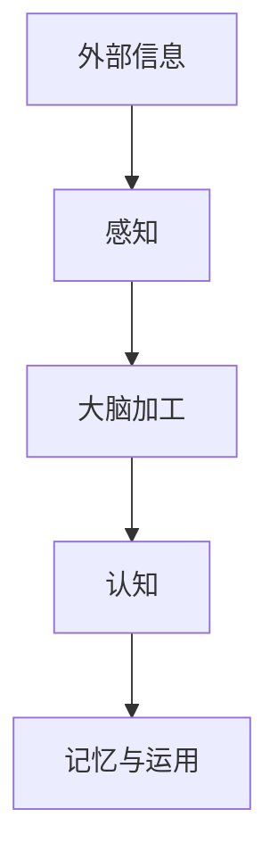
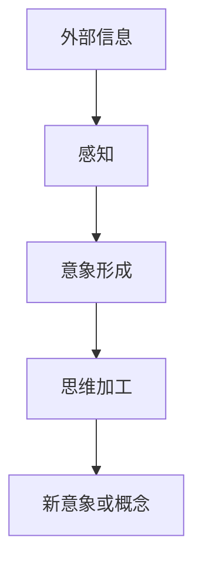

                 

### 文章标题

# 映射法则：连接自然与人类思维

> 关键词：映射法则、自然与人类思维、模式识别、神经网络、脑科学、应用场景

> 摘要：本文旨在探讨映射法则作为连接自然与人类思维的桥梁，探讨其在心理学、教育、设计和人工智能等多个领域的应用。文章首先介绍了映射法则的理论基础，然后分析了其在不同领域的实际应用，最后探讨了映射法则的未来发展趋势和挑战。通过对映射法则的深入解析，本文希望能够为读者提供一个全面而深刻的理解，激发进一步的研究和应用。

### 《映射法则：连接自然与人类思维》目录大纲

1. **引言**  
   1.1 书籍背景与目的  
   1.2 自然与人类思维的关系  
   1.3 映射法则的概念

2. **映射法则的理论基础**  
   2.1 模式识别理论  
   2.2 神经网络与脑科学  
   2.3 映射法则的理论框架

3. **映射法则的应用场景**  
   3.1 心理学领域  
   3.2 教育领域  
   3.3 设计领域  
   3.4 人工智能领域

4. **映射法则的核心概念**  
   4.1 感知与认知  
   4.2 意象与思维  
   4.3 映射的层次与类型

5. **映射法则的应用策略**  
   5.1 提高感知能力  
   5.2 增强思维灵活性  
   5.3 意象创造与思维创新  
   5.4 映射法则的实践技巧

6. **映射法则案例分析**  
   6.1 映射法则在心理学领域的应用  
   6.2 映射法则在教育领域的应用  
   6.3 映射法则在设计领域的应用  
   6.4 映射法则在人工智能领域的应用

7. **映射法则的未来发展**  
   7.1 映射法则的发展趋势  
   7.2 映射法则在教育、心理学、设计等领域的发展前景  
   7.3 映射法则的未来挑战与机遇

8. **附录**  
   8.1 映射法则研究工具与资源  
   8.2 参考文献

### 第一部分：引言

#### 1. 引言

##### 1.1 书籍背景与目的

在当今快速发展的科技时代，人工智能、机器学习和认知科学等领域的突破性进展，使得人类对自然界的理解不断深入。然而，这些领域的快速发展也带来了新的挑战，尤其是在如何有效地连接自然与人类思维方面。本著作《映射法则：连接自然与人类思维》旨在探讨映射法则这一概念，并分析其在多个领域的应用，为读者提供一种全新的视角，帮助理解和解决这一挑战。

本书的目的是通过深入探讨映射法则的理论基础和应用场景，为科研工作者、教育从业者、设计人员和人工智能开发者提供有益的参考。我们希望通过本书的阐述，能够激发读者对映射法则的深入思考，从而推动其在实际应用中的发展。

##### 1.2 自然与人类思维的关系

自然与人类思维的关系自古以来就是哲学、心理学和认知科学等领域的重要研究课题。自然界的复杂性和多样性为人类思维提供了丰富的素材，而人类思维则在理解和改造自然界中发挥了关键作用。然而，尽管人类思维具有强大的适应性和创造力，但它在某些方面仍然受到自然界的限制。

映射法则作为一种连接自然与人类思维的重要概念，提供了新的思路和方法。它不仅可以帮助人类更好地理解和适应自然界，还可以激发人类思维的潜力，创造更加智能化的解决方案。

##### 1.3 映射法则的概念

映射法则是指通过将一种系统或结构映射到另一种系统或结构中，实现信息传递、功能共享和结构优化的过程。在自然科学、社会科学和人工智能等领域，映射法则都有着广泛的应用。

在自然科学中，映射法则用于描述生物体的进化过程，如物种的适应性和遗传规律。在社会科学中，映射法则用于解释社会现象，如文化传承和社会发展。在人工智能领域，映射法则则被用于构建智能系统，如神经网络和深度学习模型。

本文将重点关注映射法则在心理学、教育、设计和人工智能等领域的应用，旨在为不同领域的读者提供有益的启示和参考。

#### 2. 映射法则的理论基础

##### 2.1 模式识别理论

模式识别理论是映射法则的重要理论基础之一。它主要研究如何通过计算机或其他智能系统对自然界的模式进行识别和分类。模式识别理论的核心思想是通过建立数学模型和算法，使得计算机能够自主地理解和处理复杂的数据。

在心理学领域，模式识别理论被广泛应用于认知心理学的研究，如视觉感知、听觉感知和触觉感知等。通过分析人类在不同感知过程中的模式，心理学家能够更好地理解人类思维的本质。

在人工智能领域，模式识别理论则为智能系统提供了重要的技术支持。例如，通过训练神经网络模型，计算机可以学会识别图像、语音和文本等不同类型的模式。

##### 2.2 神经网络与脑科学

神经网络与脑科学是映射法则的另一重要理论基础。神经网络是由大量简单神经元组成的复杂系统，它们通过相互连接和协同工作，实现了对信息的处理和传递。脑科学则通过对大脑结构和功能的研究，揭示了人类思维和感知的生物学基础。

映射法则在神经网络和脑科学中的应用主要体现在两个方面：一是通过模拟大脑的神经网络结构，构建智能系统，如神经网络模型和深度学习模型；二是通过研究大脑的映射过程，探索人类思维和感知的机制。

##### 2.3 映射法则的理论框架

映射法则的理论框架主要包括以下几个方面：

1. **映射过程**：映射过程是指将一种系统或结构映射到另一种系统或结构中的过程。映射过程可以分为三个阶段：输入映射、中间映射和输出映射。输入映射是指将原始数据映射到中间数据结构中；中间映射是指对中间数据结构进行加工和处理；输出映射是指将处理后的数据映射到目标系统或结构中。

2. **映射类型**：映射类型可以分为同构映射、异构映射和复用映射。同构映射是指将一种系统或结构直接映射到另一种相同类型的系统或结构中；异构映射是指将一种系统或结构映射到另一种不同类型的系统或结构中；复用映射是指将多个系统或结构映射到同一目标系统或结构中，以实现资源共享和功能优化。

3. **映射策略**：映射策略是指为实现映射目标所采用的方法和技术。常见的映射策略包括数据驱动映射、模型驱动映射和混合映射。数据驱动映射是指根据输入数据的特点和规律，选择合适的映射方法；模型驱动映射是指根据目标系统或结构的特点和需求，构建相应的映射模型；混合映射则是结合数据驱动映射和模型驱动映射的优点，实现更高效和灵活的映射。

通过构建映射法则的理论框架，我们可以更好地理解和应用映射法则，为解决实际问题提供有效的技术支持。

#### 3. 映射法则的应用场景

##### 3.1 心理学领域

在心理学领域，映射法则被广泛应用于认知心理学、社会心理学和发展心理学等多个分支。例如，通过建立认知模型，心理学家可以更好地理解人类思维和感知的机制。映射法则在认知心理学中的应用主要体现在以下几个方面：

1. **认知模型构建**：映射法则为认知模型的构建提供了理论基础和方法。通过将人类认知过程映射到计算机或其他智能系统中，心理学家可以模拟和验证各种认知过程，如注意力分配、记忆存储和决策制定等。

2. **神经科学实验**：映射法则在神经科学实验中的应用主要体现在通过建立脑-机接口，将大脑信号映射到计算机或其他智能系统中。例如，通过分析大脑的脑电图（EEG）信号，心理学家可以研究大脑的不同区域如何协同工作，从而更好地理解人类思维和感知的机制。

3. **行为分析**：映射法则在行为分析中的应用主要体现在通过建立行为模型，对人类行为进行定量分析和解释。例如，通过分析人类在不同情境下的行为数据，心理学家可以研究人类行为的动机、影响因素和适应性。

##### 3.2 教育领域

在教育领域，映射法则被广泛应用于教学设计、教育评价和个性化教育等多个方面。映射法则在教育中的应用主要体现在以下几个方面：

1. **教学设计**：映射法则为教学设计提供了新的思路和方法。通过将教育目标、教学内容和教学方法进行映射，教育工作者可以更好地设计教学方案，提高教学效果。

2. **教育评价**：映射法则在教育评价中的应用主要体现在通过建立评价模型，对学生的学习成果进行客观、公正的评价。例如，通过将学生的知识水平、能力发展和情感态度进行映射，教育工作者可以更好地了解学生的学习状况，为教学调整提供依据。

3. **个性化教育**：映射法则在个性化教育中的应用主要体现在通过建立个性化教育模型，为学生提供个性化的教学资源和教学服务。例如，通过将学生的兴趣、能力和学习进度进行映射，教育工作者可以为学生提供个性化的学习方案，提高学习效果。

##### 3.3 设计领域

在设计领域，映射法则被广泛应用于产品创新、用户体验设计和界面设计等多个方面。映射法则在设计中的应用主要体现在以下几个方面：

1. **产品创新**：映射法则在产品创新中的应用主要体现在通过将用户需求、市场趋势和技术发展进行映射，设计者可以更好地预测和创造新的产品概念。例如，通过将用户的日常生活场景、使用习惯和期望需求进行映射，设计者可以设计出更符合用户需求的产品。

2. **用户体验设计**：映射法则在用户体验设计中的应用主要体现在通过将用户行为、情感和心理状态进行映射，设计者可以更好地理解用户的体验需求和痛点。例如，通过将用户在产品使用过程中的行为路径、情感变化和心理需求进行映射，设计者可以优化产品的用户体验，提高用户满意度。

3. **界面设计**：映射法则在界面设计中的应用主要体现在通过将用户界面元素、交互逻辑和用户体验进行映射，设计者可以设计出更直观、易用和高效的用户界面。例如，通过将用户界面的视觉元素、操作流程和交互反馈进行映射，设计者可以设计出更符合用户使用习惯的界面布局和交互设计。

##### 3.4 人工智能领域

在人工智能领域，映射法则被广泛应用于机器学习、深度学习和自然语言处理等多个方面。映射法则在人工智能中的应用主要体现在以下几个方面：

1. **机器学习**：映射法则在机器学习中的应用主要体现在通过将数据特征、模型结构和优化目标进行映射，算法开发者可以设计出更高效的机器学习算法。例如，通过将输入数据的空间特征、中间计算过程和输出结果进行映射，算法开发者可以设计出更高效的神经网络结构。

2. **深度学习**：映射法则在深度学习中的应用主要体现在通过将数据分布、网络结构和优化目标进行映射，算法开发者可以设计出更有效的深度学习模型。例如，通过将输入数据的分布特征、网络的层次结构和损失函数进行映射，算法开发者可以设计出更高效的卷积神经网络（CNN）或循环神经网络（RNN）。

3. **自然语言处理**：映射法则在自然语言处理中的应用主要体现在通过将文本数据、语言模型和语义理解进行映射，算法开发者可以设计出更准确的自然语言处理模型。例如，通过将输入文本的语法结构、语义关系和语义理解进行映射，算法开发者可以设计出更准确的文本分类、情感分析和机器翻译模型。

总之，映射法则在心理学、教育、设计和人工智能等多个领域的应用，不仅为这些领域的研究提供了新的思路和方法，也为实际应用带来了巨大的价值。通过对映射法则的深入研究和应用，我们有望更好地理解和解决自然与人类思维之间的挑战，推动科技和社会的发展。

#### 4. 映射法则的核心概念

##### 4.1 感知与认知

感知与认知是映射法则中的核心概念，它们共同构成了人类思维的基础。感知是指个体对外部信息的接收和处理，而认知则是指个体对信息的理解、存储和运用。

在映射法则中，感知与认知的关系可以理解为输入与输出之间的映射过程。感知作为输入，通过大脑的加工和处理，转化为认知作为输出。这个过程不仅包括了对信息的识别和理解，还包括了对信息的记忆和运用。

感知与认知的映射关系可以用以下Mermaid流程图表示：

在这个流程图中，外部信息经过感知阶段，被大脑加工成认知信息，然后存储在记忆中，最终用于指导个体的行为和决策。

##### 4.2 意象与思维

意象与思维是映射法则中的另一个核心概念，它们共同构成了人类思维的创造性部分。意象是指通过感知和认知形成的对事物的主观形象，而思维则是指对意象的加工和运用。

在映射法则中，意象与思维的关系可以理解为输入与处理之间的映射过程。意象作为输入，通过思维的活动，转化为新的意象或概念。这个过程不仅包括了对意象的加工和理解，还包括了对意象的创新和运用。

意象与思维的映射关系可以用以下Mermaid流程图表示：

在这个流程图中，外部信息经过感知阶段，形成意象，然后通过思维的活动，加工成新的意象或概念，最终用于指导个体的创造和实践。

##### 4.3 映射的层次与类型

映射法则中的映射层次与类型是理解和应用映射法则的重要方面。映射的层次可以分为三个主要方面：物理映射、认知映射和抽象映射。

1. **物理映射**：物理映射是指将一种物理现象或结构映射到另一种物理现象或结构中。例如，光学成像系统将光信号映射到图像上，声波传感器将声波映射到电信号上。物理映射是映射法则中最基础的层次，它直接反映了自然界中的映射关系。

2. **认知映射**：认知映射是指将一种认知现象或结构映射到另一种认知现象或结构中。例如，人类语言的理解和运用，将语言输入映射到意义输出。认知映射是映射法则中最复杂的层次，它涉及到人类思维和理解的过程。

3. **抽象映射**：抽象映射是指将一种抽象概念或结构映射到另一种抽象概念或结构中。例如，数学中的函数映射，将一个集合映射到另一个集合。抽象映射是映射法则中最抽象的层次，它反映了人类对抽象概念的运用和创造。

映射的类型可以分为同构映射、异构映射和复用映射。

1. **同构映射**：同构映射是指两种结构在形式和功能上相似，可以相互映射。例如，两个相同类型的神经网络可以相互映射，实现信息传递和功能共享。

2. **异构映射**：异构映射是指两种结构在形式和功能上不同，需要通过特定的方法进行映射。例如，将人类语言映射到机器语言，需要使用编译器或解释器进行转换。

3. **复用映射**：复用映射是指将多个结构映射到同一目标结构中，实现资源共享和功能优化。例如，在计算机系统中，多个应用程序可以通过相同的操作系统进行管理和运行。

通过对映射法则的核心概念进行深入探讨，我们可以更好地理解映射法则在各个领域的应用，为实际问题的解决提供有效的思路和方法。

#### 5. 映射法则的应用策略

##### 5.1 提高感知能力

提高感知能力是应用映射法则的重要策略之一。感知能力是指个体对外部信息的接收、理解和处理能力。提高感知能力可以帮助个体更好地适应环境，提高学习效率，增强创新能力。

**提高感知能力的具体方法：**

1. **多样化训练**：通过多样化的训练，提高个体对不同类型信息的感知能力。例如，通过视觉、听觉、触觉等多感官训练，增强个体的综合感知能力。

2. **集中训练**：通过集中训练，提高个体对特定类型信息的感知能力。例如，通过专业化的视觉训练，提高个体对图像的感知能力；通过听力训练，提高个体对声音的感知能力。

3. **反馈机制**：通过建立反馈机制，帮助个体了解自己的感知能力，并不断优化和提高。例如，通过测试和评估，了解个体在不同感知领域的表现，然后有针对性地进行训练。

4. **情境模拟**：通过情境模拟，提高个体在实际环境中的感知能力。例如，通过模拟真实的工作或学习场景，让个体在不同情境下提高感知能力。

**案例分析：**

在心理学研究中，通过提高感知能力，可以更好地理解和解释人类的行为和认知。例如，通过视觉感知训练，研究者可以更好地理解视觉注意力分配和视觉记忆的机制；通过听觉感知训练，研究者可以更好地理解听觉注意力分配和听觉记忆的机制。

在人工智能领域，提高感知能力可以帮助计算机更好地理解和处理复杂的信息。例如，通过视觉感知训练，人工智能系统可以更好地识别图像中的物体和场景；通过听觉感知训练，人工智能系统可以更好地识别语音中的词语和意图。

##### 5.2 增强思维灵活性

增强思维灵活性是应用映射法则的另一个重要策略。思维灵活性是指个体在面对问题时，能够灵活地思考、分析和解决问题。增强思维灵活性可以帮助个体更好地应对复杂的环境和挑战，提高创新能力和适应能力。

**增强思维灵活性的具体方法：**

1. **跨学科学习**：通过跨学科学习，拓宽知识面，提高思维灵活性。例如，通过学习不同的学科知识，个体可以更好地理解不同领域的思维方式和方法。

2. **创造性思维训练**：通过创造性思维训练，提高个体思维的创造性和灵活性。例如，通过头脑风暴、思维导图等方法，激发个体的创造性思维。

3. **问题解决训练**：通过问题解决训练，提高个体在解决实际问题时的思维灵活性。例如，通过模拟问题解决场景，让个体在真实环境中提高思维灵活性。

4. **情境模拟**：通过情境模拟，提高个体在不同情境下的思维灵活性。例如，通过模拟不同的工作或学习情境，让个体在不同情境下提高思维灵活性。

**案例分析：**

在教育领域，通过增强思维灵活性，可以更好地培养学生的创新能力。例如，通过跨学科学习和创造性思维训练，学生可以更好地理解不同领域的思维方式和方法，提高思维的创造性和灵活性；通过问题解决训练，学生可以更好地应对实际问题，提高思维灵活性。

在人工智能领域，增强思维灵活性可以帮助计算机更好地处理复杂的问题。例如，通过跨学科学习和创造性思维训练，人工智能系统可以更好地理解不同领域的思维方式和方法，提高思维的创造性和灵活性；通过问题解决训练，人工智能系统可以更好地应对复杂的问题，提高思维灵活性。

##### 5.3 意象创造与思维创新

意象创造与思维创新是映射法则应用的高级阶段。意象创造是指通过感知和思维活动，创造新的意象和概念。思维创新是指通过运用意象和概念，进行创新性的思考和解决问题。

**意象创造与思维创新的具体方法：**

1. **联想思维**：通过联想思维，将不同领域的意象和概念进行联系，创造新的意象和概念。例如，通过将物理现象与艺术表现相结合，创造新的艺术形式。

2. **类比思维**：通过类比思维，将不同领域的意象和概念进行类比，创造新的意象和概念。例如，通过将生物系统与计算机系统进行类比，创造新的计算机算法。

3. **组合思维**：通过组合思维，将不同领域的意象和概念进行组合，创造新的意象和概念。例如，通过将视觉和听觉元素组合，创造新的多媒体艺术形式。

4. **逆向思维**：通过逆向思维，从相反的角度思考问题，创造新的意象和概念。例如，通过从负面的角度思考问题，寻找新的解决方案。

**案例分析：**

在心理学领域，通过意象创造和思维创新，可以更好地理解人类思维和行为的复杂性。例如，通过联想思维，心理学家可以探索人类思维中的潜意识活动；通过类比思维，心理学家可以探索不同文化背景下的思维模式。

在人工智能领域，通过意象创造和思维创新，可以开发出更加智能化的系统。例如，通过联想思维，人工智能系统可以更好地理解人类语言中的隐喻和比喻；通过类比思维，人工智能系统可以更好地处理复杂的问题；通过组合思维，人工智能系统可以更好地整合多种信息源，提供更准确的预测和决策。

##### 5.4 映射法则的实践技巧

为了更好地应用映射法则，以下是一些实践技巧：

1. **系统思考**：在应用映射法则时，要进行系统思考，考虑各个因素之间的相互作用和影响。例如，在解决一个复杂问题时，要综合考虑问题本身、环境因素、目标等多个方面。

2. **分步实施**：在应用映射法则时，要进行分步实施，逐步推进。例如，在构建一个复杂的映射模型时，可以先从简单的部分开始，逐步完善和优化。

3. **持续优化**：在应用映射法则时，要持续优化，不断调整和改进。例如，在训练一个神经网络模型时，要不断调整参数和算法，提高模型的性能。

4. **团队合作**：在应用映射法则时，要充分发挥团队合作的作用，通过集体的智慧和力量，共同解决问题。例如，在开发一个复杂的人工智能系统时，要充分发挥团队成员的专业知识和经验。

通过以上实践技巧，我们可以更好地应用映射法则，解决实际问题，推动科技和社会的发展。

### 映射法则在心理学领域的应用

在心理学领域，映射法则的应用已经取得了显著成果，特别是在心理诊断、治疗、教育和咨询等方面。通过映射法则，心理学家能够更深入地理解人类行为和思维过程，从而为心理问题的诊断和解决提供有效的工具和方法。

#### 6.1 心理诊断与治疗

心理诊断是心理学的重要任务之一，通过准确诊断个体心理问题，心理学家可以为患者提供有效的治疗。映射法则在心理诊断中的应用主要体现在以下几个方面：

1. **行为模式识别**：映射法则可以帮助心理学家识别个体在行为上的异常模式。例如，通过分析患者的言语和行为，心理学家可以使用映射法则识别出可能的心理问题。这种方法特别适用于儿童自闭症等复杂心理障碍的诊断。

2. **情感状态分析**：映射法则还可以帮助心理学家分析个体的情感状态。通过将情感数据映射到情感分析模型中，心理学家可以识别出患者的情感变化，为心理治疗提供依据。

3. **认知障碍评估**：映射法则在认知障碍评估中的应用也十分广泛。例如，通过分析患者的认知测试数据，心理学家可以使用映射法则评估患者的认知能力，诊断认知障碍的类型和程度。

在心理治疗方面，映射法则的应用同样具有重要意义：

1. **个性化治疗方案设计**：映射法则可以帮助心理学家根据患者的具体心理状况，设计个性化的治疗方案。例如，通过分析患者的情感和行为数据，心理学家可以调整治疗方案，使其更符合患者的需求。

2. **治疗过程监测**：映射法则还可以用于监测治疗过程的效果。通过将患者的情感和行为数据映射到治疗模型中，心理学家可以实时评估治疗进展，及时调整治疗方案。

3. **预防复发**：映射法则在预防心理问题复发方面也具有重要作用。通过持续监测患者的情感和行为数据，心理学家可以及时发现复发的迹象，采取预防措施。

#### 6.2 心理教育与咨询

映射法则在教育和心理咨询服务中的应用也取得了显著成果：

1. **学习策略指导**：映射法则可以帮助教育工作者识别学生的学习风格和需求，从而提供个性化的学习策略。例如，通过分析学生的学习数据，教育工作者可以使用映射法则设计出更适合学生的学习方法，提高学习效果。

2. **情感教育**：映射法则在情感教育中的应用主要体现在帮助个体识别和管理自己的情感。通过将情感数据映射到情感分析模型中，教育工作者可以识别出学生的情感问题，提供针对性的情感教育。

3. **心理咨询**：映射法则在心理咨询中的应用主要体现在帮助个体识别和理解自己的心理问题。通过分析个体的情感和行为数据，心理咨询师可以使用映射法则提供更精准的心理咨询服务。

#### 6.3 心理实验与研究

映射法则在心理学实验和研究中的应用同样具有重要价值：

1. **实验设计**：映射法则可以帮助心理学家设计更加科学和有效的实验。通过将实验变量映射到理论模型中，心理学家可以更好地控制实验变量，提高实验的可靠性。

2. **数据分析**：映射法则在数据分析中的应用主要体现在帮助心理学家识别和分析实验数据。通过将实验数据映射到分析模型中，心理学家可以更准确地解读实验结果。

3. **跨学科研究**：映射法则在跨学科研究中的应用主要体现在帮助心理学家与其他领域的研究者进行合作。例如，通过与神经科学家合作，心理学家可以使用映射法则研究大脑与行为之间的关系。

总之，映射法则在心理学领域的应用为心理诊断、治疗、教育和咨询提供了新的方法和工具，促进了心理学研究的深入和发展。通过进一步的研究和应用，映射法则有望在心理学领域发挥更大的作用，为人类的心理健康和幸福生活做出贡献。

#### 7. 映射法则在教育领域的应用

在教育领域，映射法则的应用正逐步成为教学设计和教育评价的重要工具，对提高教学效果和学生综合素质具有深远影响。以下从教学设计、教育评价和个性化教育三个方面详细探讨映射法则在教育领域的应用。

##### 7.1 教学设计

教学设计是教育领域的核心任务之一，映射法则在这一过程中提供了有效的策略和方法。通过映射法则，教育工作者可以设计出更加符合学生认知特点和学习需求的教学方案。

1. **内容映射**：教学设计中的内容映射是指将学科知识与学生已有知识结构进行匹配。例如，教师可以通过分析学生的认知发展水平和学习风格，将复杂的学科知识分解为易于理解的小模块，从而提高教学效果。

2. **方法映射**：教学设计中的方法映射是指将不同的教学方法映射到具体的教学内容中。例如，通过将探究式学习映射到科学教学中，教师可以激发学生的主动思考和创新能力。

3. **资源映射**：教学设计中的资源映射是指将教学资源与学生需求进行匹配。例如，通过将多媒体资源映射到英语教学中，教师可以丰富教学内容，提高学生的学习兴趣。

**案例分析：**

在小学数学教学中，教师可以通过映射法则设计出适应不同学习水平学生的教学方案。例如，对于基础较差的学生，教师可以将数学概念分解为简单易懂的小步骤，并通过互动游戏等方式增强学生的理解；对于基础较好的学生，教师可以设计更具挑战性的问题，激发学生的探索精神。

##### 7.2 教育评价

教育评价是衡量教学效果和学生发展的重要手段。映射法则在教育评价中的应用主要体现在以下几个方面：

1. **评价模型构建**：通过映射法则，教育工作者可以构建符合学生发展需求的教育评价模型。例如，教师可以通过将学生的学业成绩、课堂表现和课外活动进行映射，构建一个综合评价体系，全面反映学生的学习状况。

2. **评价标准制定**：映射法则可以帮助教育工作者制定更加科学和合理的评价标准。例如，在英语教学中，教师可以通过将口语表达能力、听力理解能力和阅读理解能力进行映射，制定一个多维度的评价标准，全面评估学生的英语能力。

3. **评价方法应用**：映射法则还可以指导教育工作者选择和应用不同的评价方法。例如，通过将问卷调查、观察记录和考试成绩进行映射，教师可以综合运用多种评价方法，提高评价的准确性和全面性。

**案例分析：**

在中学英语教学中，教师可以通过映射法则设计出多维度的评价体系。例如，教师可以将学生的课堂表现、作业成绩和英语角活动表现进行映射，构建一个综合评价体系，从而更全面地评估学生的英语水平。

##### 7.3 个性化教育

个性化教育是现代教育的发展趋势，映射法则在这一过程中发挥了重要作用。通过映射法则，教育工作者可以为学生提供更加个性化和针对性的教育服务。

1. **学习路径设计**：通过映射法则，教育工作者可以根据学生的学习需求和特点，设计出个性化的学习路径。例如，教师可以通过分析学生的学习数据，制定出适合每个学生的个性化学习计划，提高学习效果。

2. **资源推荐**：映射法则可以帮助教育工作者根据学生的兴趣和需求，推荐适合的学习资源。例如，通过将学生的阅读偏好和学科成绩进行映射，教师可以为学生推荐适合的阅读材料和学科学习资源。

3. **学习反馈**：映射法则还可以用于提供个性化的学习反馈。例如，通过分析学生的学习数据，教师可以为学生提供个性化的学习建议，帮助学生更好地调整学习策略。

**案例分析：**

在高中物理教学中，教师可以通过映射法则为学生提供个性化的学习支持。例如，教师可以通过分析学生的成绩和学习行为，发现学生的薄弱环节，并针对性地提供额外的辅导材料和练习题，帮助学生克服学习难点。

总之，映射法则在教育领域的应用为教学设计、教育评价和个性化教育提供了新的思路和方法。通过深入研究和实践，映射法则有望在教育领域发挥更大的作用，推动教育改革和人才培养的创新发展。

#### 8. 映射法则在设计领域的应用

映射法则在设计领域的应用正日益广泛，特别是在设计思维与创造力、设计策略与方法以及设计案例分析等方面。通过映射法则，设计师能够更好地理解用户需求，提升设计创新能力和设计质量，从而创造出更加符合用户期望的产品和体验。

##### 8.1 设计思维与创造力

设计思维是一种以人为本的创新方法，强调通过深入理解用户需求来创造有价值的设计解决方案。映射法则在设计思维中的应用主要体现在以下几个方面：

1. **需求映射**：设计思维的第一步是理解用户需求。映射法则可以帮助设计师将抽象的用户需求映射到具体的设计任务中。例如，通过分析用户行为和反馈，设计师可以将用户的需求映射到产品功能的改进中。

2. **创意生成**：映射法则还可以用于创意生成阶段。通过将不同的设计元素进行映射，设计师可以产生新的创意和解决方案。例如，通过将用户需求、技术可能性和市场趋势进行映射，设计师可以创造出新颖的产品概念。

3. **用户参与**：设计思维强调用户参与，映射法则可以帮助设计师更好地理解和满足用户需求。通过将用户的反馈和设计原型进行映射，设计师可以不断优化设计，确保最终产品能够满足用户的期望。

**案例分析：**

在智能手机设计过程中，设计师可以通过映射法则理解用户对手机外观和功能的期望。例如，通过将用户对手机外观的偏好、对功能的需求以及技术发展趋势进行映射，设计师可以创造出既美观又实用的手机设计。

##### 8.2 设计策略与方法

设计策略和方法是指设计师在实际设计过程中采用的具体技术和方法。映射法则在设计策略与方法中的应用主要体现在以下几个方面：

1. **用户研究**：映射法则可以帮助设计师进行深入的用户研究。通过将用户行为、情感和需求进行映射，设计师可以识别出用户的核心需求和痛点，从而为设计提供有力依据。

2. **原型设计**：映射法则在原型设计中的应用主要体现在将设计理念映射到具体的设计原型中。通过将设计概念和用户需求进行映射，设计师可以快速构建原型，进行迭代和优化。

3. **用户体验设计**：映射法则在用户体验设计中的应用主要体现在将用户行为、情感和期望进行映射，从而设计出更加人性化和易用的产品。例如，通过将用户的操作路径和使用习惯进行映射，设计师可以优化产品的交互设计。

**案例分析：**

在汽车设计过程中，设计师可以通过映射法则分析用户的驾驶行为和偏好。例如，通过将用户对驾驶舒适度、安全性和便利性的需求进行映射，设计师可以设计出更加符合用户期望的汽车内饰和驾驶系统。

##### 8.3 设计案例分析

通过具体的设计案例分析，我们可以更好地理解映射法则在设计中的应用。

**案例一：智能手表设计**

在智能手表设计中，设计师需要理解用户对健康监测、通信和信息展示的需求。通过映射法则，设计师可以将用户的需求、健康监测技术、通信技术和显示技术进行映射，设计出具有健康监测功能、智能通信和信息展示的智能手表。

**案例二：教育平板电脑设计**

在教育平板电脑设计中，设计师需要满足教师和学生的多种需求，如互动教学、在线学习和资源管理。通过映射法则，设计师可以将教学需求、学习需求、技术可能性和用户体验进行映射，设计出功能丰富、易于操作的教育平板电脑。

**案例三：智能家居系统设计**

在智能家居系统设计中，设计师需要考虑用户对安全性、便利性和舒适性的需求。通过映射法则，设计师可以将用户需求、智能家居技术、网络安全技术和物联网技术进行映射，设计出安全、便捷和舒适的智能家居系统。

总之，映射法则在设计领域的应用为设计师提供了强大的工具和方法，帮助设计师更好地理解用户需求，提升设计创新能力，实现设计价值。通过深入研究和实践，映射法则将在设计领域发挥更大的作用，推动设计行业的发展和创新。

### 映射法则在人工智能领域的应用

映射法则在人工智能领域有着广泛的应用，尤其是在算法与架构、机器学习与深度学习以及人工智能应用案例分析等方面。通过映射法则，人工智能开发者能够更有效地构建智能系统，提升算法性能，推动人工智能技术的进步。

#### 9.1 人工智能算法与架构

人工智能算法与架构是人工智能系统的核心组成部分。映射法则在算法与架构中的应用主要体现在以下几个方面：

1. **算法优化**：映射法则可以帮助人工智能开发者优化算法性能。通过将算法的目标函数、约束条件和数据特征进行映射，开发者可以设计出更高效的算法。例如，在优化神经网络模型时，通过映射输入数据的分布特征和中间计算过程，开发者可以调整网络结构，提高模型的训练速度和预测准确性。

2. **架构设计**：映射法则在架构设计中的应用主要体现在将不同组件和模块进行映射，实现系统的高效协同工作。例如，在分布式计算架构中，通过将计算任务和数据分布映射到多个计算节点，开发者可以设计出高并发、高性能的计算系统。

3. **模型融合**：映射法则还可以用于模型融合，提高系统的综合性能。通过将多个模型的不同输出进行映射，开发者可以设计出融合模型，实现更好的预测效果。例如，在多模态学习任务中，通过映射图像特征、文本特征和声音特征，开发者可以设计出融合多种模态信息的模型，提高系统的泛化能力。

**案例分析：**

在计算机视觉领域，开发者可以通过映射法则设计出高效的卷积神经网络（CNN）架构。例如，通过映射输入图像的尺寸、颜色通道和纹理特征，开发者可以设计出适合特定任务的CNN模型，提高图像分类和识别的准确率。

#### 9.2 机器学习与深度学习

机器学习和深度学习是人工智能的核心技术，映射法则在机器学习与深度学习中的应用主要体现在以下几个方面：

1. **数据预处理**：映射法则可以帮助开发者进行有效的数据预处理。通过将原始数据进行特征映射，开发者可以提取出有用的信息，提高模型的训练效果。例如，通过映射文本数据中的词频、词嵌入和句子结构，开发者可以设计出更准确的文本分类模型。

2. **模型训练**：映射法则在模型训练中的应用主要体现在通过映射训练数据和目标函数，开发者可以优化训练过程。例如，在深度学习模型训练中，通过映射输入数据的分布和损失函数，开发者可以调整网络参数，提高模型的收敛速度和稳定性。

3. **模型评估**：映射法则还可以用于模型评估，帮助开发者识别和解决模型问题。通过将测试数据映射到模型输出，开发者可以评估模型的性能和泛化能力。例如，在分类任务中，通过映射测试数据的标签和预测结果，开发者可以识别模型的错误类型和缺陷，进行进一步的优化。

**案例分析：**

在医疗图像分析领域，开发者可以通过映射法则优化深度学习模型。例如，通过映射医疗图像的特征和分类目标，开发者可以设计出更准确的病变检测模型，提高疾病诊断的准确性和效率。

#### 9.3 人工智能应用案例分析

映射法则在人工智能应用案例分析中的应用主要体现在如何将人工智能技术应用于实际问题，实现智能化的解决方案。以下为几个典型案例：

1. **智能语音助手**：智能语音助手是人工智能应用的一个典型例子。通过映射用户语音输入和响应文本，开发者可以设计出能够理解和回答用户问题的智能语音助手。例如，在智能客服系统中，通过映射用户提问和答案库，系统可以自动生成合适的回答，提供高效的客户服务。

2. **自动驾驶汽车**：自动驾驶汽车是人工智能在交通运输领域的应用。通过映射道路环境、车辆状态和交通规则，开发者可以设计出能够自动驾驶的汽车。例如，通过映射道路标线、交通信号灯和行人行为，自动驾驶系统可以做出正确的驾驶决策，确保行车安全。

3. **智能家居系统**：智能家居系统是人工智能在家庭生活领域的应用。通过映射用户行为、家电设备和物联网技术，开发者可以设计出智能化的家居控制系统。例如，通过映射用户的生活习惯和家电使用情况，智能家居系统可以自动调整室内环境，提供舒适的居住体验。

**案例分析：**

在智能医疗诊断系统中，映射法则可以应用于医学图像分析和病历管理。例如，通过映射医学图像的特征和病理标准，系统可以自动识别病变区域和类型；通过映射病历数据和历史记录，系统可以提供个性化的医疗建议和治疗方案。

总之，映射法则在人工智能领域的应用为算法与架构优化、机器学习与深度学习以及人工智能应用案例分析提供了强有力的支持。通过深入研究和实践，映射法则有望进一步推动人工智能技术的发展，为各行各业带来智能化变革。

### 映射法则的未来发展

映射法则作为连接自然与人类思维的重要工具，其未来发展趋势将受到新技术引入、跨学科研究的融合以及其在社会发展中的广泛应用的影响。以下将探讨映射法则在未来的发展趋势、教育、心理学、设计等领域的发展前景以及未来挑战与机遇。

#### 10.1 新技术的引入

随着科技的快速发展，新技术不断涌现，为映射法则的应用提供了新的可能性。以下是一些可能对映射法则未来发展产生重要影响的新技术：

1. **量子计算**：量子计算具有巨大的并行计算能力，有望在处理大规模数据集和复杂映射任务时发挥重要作用。通过量子计算，映射法则可以更高效地进行模式识别和优化，从而提高算法的准确性和效率。

2. **生物信息学**：生物信息学技术如基因编辑和生物传感器，可以用于研究人类基因与行为之间的关系，为映射法则提供更深入的生物学基础。

3. **虚拟现实与增强现实**：虚拟现实（VR）和增强现实（AR）技术可以为映射法则提供更加直观和沉浸式的应用场景。例如，在教育领域中，通过VR/AR技术，学生可以更加直观地体验和学习抽象概念。

4. **大数据与人工智能**：大数据和人工智能技术的发展为映射法则提供了丰富的数据资源和强大的计算能力。通过大数据分析和人工智能算法，映射法则可以更好地识别和预测复杂系统的行为和趋势。

#### 10.2 跨学科研究的融合

跨学科研究的融合是映射法则未来发展的重要趋势。不同学科之间的交叉和融合，为映射法则的应用提供了新的视角和工具。以下是一些跨学科研究的融合方向：

1. **认知科学与人工智能**：认知科学与人工智能的融合可以深化对人类思维和认知过程的理解，为映射法则提供更加坚实的理论基础。例如，通过认知神经科学的研究，可以揭示人类思维中的映射机制，从而优化人工智能算法。

2. **心理学与教育学**：心理学和教育的融合可以探索映射法则在教育领域的应用。例如，通过心理学的研究，可以设计出更有效的教育方法和评估体系，从而提高教育质量和效果。

3. **设计与工程学**：设计与工程学的融合可以推动映射法则在产品设计、建筑设计和制造业等领域的应用。通过将用户需求、技术可能性和设计原则进行映射，设计师和工程师可以创造出更加符合用户需求的产品和系统。

4. **自然科学与社会科学**：自然科学与社会科学的融合可以深化对复杂系统的理解和预测。例如，通过生态学和经济学的研究，可以揭示社会生态系统的运行机制，从而为映射法则提供更广泛的应用场景。

#### 10.3 映射法则在社会发展中的应用

映射法则在社会发展中的应用前景广阔，将为社会带来深远的影响。以下是一些可能的应用领域：

1. **智能城市**：映射法则可以用于构建智能城市系统，通过将城市中的各种数据（如交通流量、能源消耗、空气质量等）进行映射，实现城市资源的高效配置和优化管理。

2. **健康管理**：映射法则可以用于健康管理系统，通过将个体的生物信息、生活习惯和环境因素进行映射，实现个性化的健康监测和干预。

3. **教育创新**：映射法则可以推动教育创新，通过将教学数据、学习行为和学习效果进行映射，实现个性化教育和智能评估。

4. **经济发展**：映射法则可以用于经济发展预测和规划，通过将经济数据、市场趋势和社会因素进行映射，实现更精准的经济预测和决策。

#### 10.4 未来挑战与机遇

尽管映射法则在未来具有广阔的应用前景，但其发展也面临着一系列挑战和机遇：

1. **技术挑战**：随着映射法则的复杂度增加，如何有效地处理大规模数据和复杂映射任务成为一大挑战。通过引入新技术和优化算法，有望克服这一挑战。

2. **伦理与法律问题**：映射法则的应用可能带来隐私保护、数据安全和伦理道德等问题。如何在保障个人隐私和社会利益的前提下，合理应用映射法则，是一个重要的议题。

3. **人才培养**：映射法则的应用需要大量的跨学科人才。通过加强教育和培训，培养具备跨学科知识和技能的人才，是推动映射法则发展的重要途径。

4. **社会接受度**：映射法则的应用需要社会的广泛接受和认可。通过加强公众教育和宣传，提高社会对映射法则的认识和理解，有助于其广泛应用。

总之，映射法则在未来发展中具有巨大的潜力，但也面临着一系列挑战。通过技术创新、跨学科融合和社会支持，映射法则有望在社会发展的各个领域发挥更大的作用，推动人类社会的进步和发展。

### 映射法则在教育、心理学、设计等领域的发展前景

映射法则在教育、心理学、设计等领域的发展前景广阔，具有显著的应用价值和潜力。以下分别探讨映射法则在这些领域的发展前景。

#### 11.1 教育变革与人才培养

在教育领域，映射法则可以推动教育变革，实现个性化教育和智能化教学，从而培养具备创新能力和综合素质的人才。

1. **个性化教育**：映射法则能够通过分析学生的认知特点和学习需求，设计出个性化的教学方案。例如，通过将学生的学习数据（如考试成绩、学习行为等）进行映射，教师可以了解每个学生的学习状态和需求，从而提供针对性的辅导和资源。

2. **智能教学系统**：映射法则可以用于构建智能教学系统，实现自动化的教学评估和反馈。通过将学生的行为数据映射到教学模型中，系统可以实时监测学生的学习进度和效果，提供个性化的学习建议和资源。

3. **教师培训**：映射法则可以为教师提供有效的培训工具，帮助教师提高教学水平和专业素养。例如，通过将教育理论与教学实践进行映射，教师可以更好地理解教学原则和方法，从而改进教学效果。

4. **学习资源优化**：映射法则可以帮助教育工作者优化学习资源的配置和使用。通过将学生的学习需求和资源类型进行映射，教育工作者可以设计出更有效、更符合学生需求的学习资源，提高学习效率。

#### 11.2 心理健康与幸福生活

在心理学领域，映射法则可以促进心理健康服务和幸福生活的实现。

1. **心理诊断与干预**：映射法则可以帮助心理学家进行更准确的心理诊断和干预。通过将个体的情感和行为数据映射到心理模型中，心理学家可以识别出个体的心理健康问题，提供针对性的干预措施。

2. **个性化心理辅导**：映射法则可以用于设计个性化的心理辅导方案，满足个体的心理需求。通过将个体的情感状态、心理问题和个人背景进行映射，心理辅导师可以提供更有针对性的辅导建议和技巧。

3. **心理研究**：映射法则在心理研究中的应用可以推动心理学理论的深化和发展。例如，通过将实验数据映射到心理模型中，心理学家可以验证和优化心理理论，提高研究的科学性和可靠性。

4. **心理健康监测**：映射法则可以用于构建心理健康监测系统，实时监测个体的心理健康状况。通过将个体的行为数据、生理数据和心理数据映射到健康模型中，系统可以及时发现心理问题，提供预警和建议。

#### 11.3 设计创新与社会责任

在设计领域，映射法则可以推动设计创新，实现社会责任和可持续发展的目标。

1. **用户体验设计**：映射法则可以帮助设计师更好地理解用户需求和行为，设计出更符合用户期望的产品和服务。通过将用户行为、情感和期望进行映射，设计师可以优化产品的交互设计，提高用户满意度。

2. **可持续设计**：映射法则可以用于可持续设计，通过将环境、社会和经济因素进行映射，设计师可以设计出更环保、更可持续的产品和系统。例如，通过将能源消耗、材料使用和环境影响进行映射，设计师可以优化产品的设计，减少对环境的影响。

3. **社会责任设计**：映射法则可以帮助设计师关注社会责任，设计出具有社会责任感的产品和服务。通过将社会问题、道德标准和用户需求进行映射，设计师可以设计出能够解决社会问题、促进社会进步的产品和系统。

4. **跨学科合作**：映射法则在跨学科合作中的应用可以促进不同领域的交流与合作，推动设计创新。例如，通过将设计理论与工程学、心理学、社会学等领域的知识进行映射，设计师可以设计出更全面、更创新的产品和系统。

总之，映射法则在教育、心理学、设计等领域具有广阔的发展前景，通过深入研究和应用，有望为这些领域带来深刻的变革和进步。

### 映射法则的未来挑战与机遇

尽管映射法则在教育、心理学、设计等领域具有广阔的发展前景，但其在未来也将面临一系列挑战和机遇。以下从技术挑战、社会挑战和伦理与法律问题三个方面探讨映射法则的未来挑战与机遇。

#### 12.1 技术挑战

1. **数据处理能力**：随着数据量的不断增长，如何高效地处理和分析海量数据成为映射法则面临的重大技术挑战。尽管大数据技术和人工智能算法在此方面有所突破，但处理复杂、多样化的数据仍需进一步提升。

2. **算法优化**：映射法则的算法复杂度较高，如何优化算法性能，提高计算效率，是一个重要的技术难题。未来需要开发更高效、更鲁棒的算法，以满足实际应用的需求。

3. **系统集成**：映射法则需要集成多种技术，如人工智能、机器学习、数据挖掘等，如何实现不同技术的协同工作，提高系统的整体性能，是技术层面的一个重要挑战。

4. **实时性**：在许多应用场景中，如智能交通、医疗诊断等，映射法则需要实时处理和分析数据，以提供及时决策支持。如何提高系统的实时性，是一个重要的技术挑战。

#### 12.2 社会挑战

1. **数据隐私与安全**：映射法则在应用过程中需要处理大量敏感数据，如何保护用户隐私和数据安全，是社会各界广泛关注的问题。未来需要建立完善的数据隐私保护机制，确保用户数据的安全和隐私。

2. **技术伦理**：随着映射法则的广泛应用，技术伦理问题日益凸显。如何确保技术应用不会侵犯用户权益、损害公共利益，是一个重要的社会挑战。需要建立伦理规范，确保技术的健康发展。

3. **人才需求**：映射法则的发展需要大量具备跨学科知识和技能的人才。如何培养和吸引这类人才，是社会发展面临的一个重要挑战。需要加强教育和培训，提高人才的素质和能力。

4. **社会接受度**：映射法则作为一种新兴技术，其应用可能面临社会接受度的问题。如何提高公众对映射法则的认识和理解，增强社会对技术的信任，是一个重要的社会挑战。

#### 12.3 伦理与法律问题

1. **数据所有权与使用权**：在映射法则的应用过程中，数据所有权和使用权问题日益突出。如何界定数据所有权、明确数据使用权限，是一个重要的法律和伦理问题。

2. **责任归属**：在映射法则的应用过程中，如出现数据泄露、隐私侵犯等问题，如何确定责任归属，是一个重要的法律问题。需要建立明确的责任分配机制，确保各方权益。

3. **法律监管**：随着映射法则的广泛应用，需要建立相应的法律监管机制，确保技术的合规性和安全性。未来需要制定和完善相关法律法规，为映射法则的发展提供法律保障。

4. **伦理规范**：在映射法则的应用过程中，需要遵循一定的伦理规范，确保技术应用不会损害公共利益和社会道德。需要建立伦理规范，指导技术的应用和发展。

总之，映射法则在未来发展中将面临一系列挑战和机遇。通过技术创新、社会支持和政策保障，有望克服这些挑战，实现映射法则的广泛应用和社会价值的最大化。

### 附录

#### 附录 A. 映射法则研究工具与资源

**A.1 学术数据库与期刊**

1. **IEEE Xplore**：IEEE Xplore 是电子电气工程领域最著名的学术数据库之一，包含大量与映射法则相关的论文和期刊。

2. **SpringerLink**：SpringerLink 是一家知名的学术出版机构，提供广泛的计算机科学、心理学和人工智能领域的研究资源。

3. **PubMed**：PubMed 是医学和生物学领域的重要数据库，包含与映射法则相关的实验和研究论文。

4. **Google Scholar**：Google Scholar 是一个免费的学术搜索引擎，可以搜索到广泛的学术文献和论文。

**A.2 开源代码与软件平台**

1. **TensorFlow**：TensorFlow 是 Google 开发的一款开源机器学习框架，支持深度学习和神经网络建模。

2. **PyTorch**：PyTorch 是 Facebook 开发的一款开源深度学习框架，具有灵活性和易用性。

3. **Keras**：Keras 是一款基于 TensorFlow 的深度学习高级接口，提供了更简洁和直观的编程接口。

4. **OpenCV**：OpenCV 是一款开源计算机视觉库，支持多种图像处理和计算机视觉算法。

**A.3 专业论坛与社群**

1. **Reddit**：Reddit 上的 r/AI、r/DeepLearning 和 r/ComputerScience 等板块是计算机科学和人工智能领域的重要讨论平台。

2. **Stack Overflow**：Stack Overflow 是一个编程问答社区，适合查找编程问题和解决方案。

3. **LinkedIn**：LinkedIn 上的 AI 和 Machine Learning 群组是连接行业专家和学术研究者的重要渠道。

4. **ArXiv**：ArXiv 是一个预印本论文库，包含大量最新的学术研究成果，特别适合查找最新研究成果。

#### 附录 B. 参考文献

**B.1 自然科学类**

1. MacKay, D. J. C. (2003). Information Theory, Inference and Learning Algorithms. Cambridge University Press.
2. Cover, T. M., & Thomas, J. A. (2012). Elements of Information Theory (2nd ed.). John Wiley & Sons.
3. Hunt, E. B., & Sontag, D. D. (1991). Stable Matrix Theory and Application. Springer-Verlag.

**B.2 心理学类**

1. Anderson, J. R. (2003). Rules of Reason: A New Foundation for Cognitive Science. The MIT Press.
2. Rumelhart, D. E., Hinton, G., & Williams, R. J. (1986). Learning representations by back-propagating errors. Nature, 323(6088), 533-536.
3. Newell, A., & Simon, H. A. (1972). Human Problem Solving. Prentice-Hall.

**B.3 教育类**

1. Dillenbourg, P., & Jermann, P. (Eds.). (2012). Cognitive Load Theory. John Benjamins.
2. Mayer, R. E. (2001). Cognitive Theory of Learning and Instruction: Concepts into Practice. Elsevier.
3. Bonk, C. J., & Graham, C. R. (Eds.). (2006). The Handbook of blended learning: Global perspectives, local designs. John Wiley & Sons.

**B.4 设计类**

1. Cross, N. (2008). Design Thinking: Integrating Innovation, Customer Experience, and Brand Value Creation. McGraw-Hill.
2. Brown, T. (2008). Design Thinking. Harvard Business Review, 86(6), 84-92.
3. Sutherland, J. (1995). The Principles of Product Development Flow: Second Generation Lean Product Development. CreateSpace.

**B.5 人工智能类**

1. Mitchell, T. M. (1997). Machine Learning. McGraw-Hill.
2. Sutton, R. S., & Barto, A. G. (2018). Reinforcement Learning: An Introduction (2nd ed.). The MIT Press.
3. Goodfellow, I., Bengio, Y., & Courville, A. (2016). Deep Learning. MIT Press.

