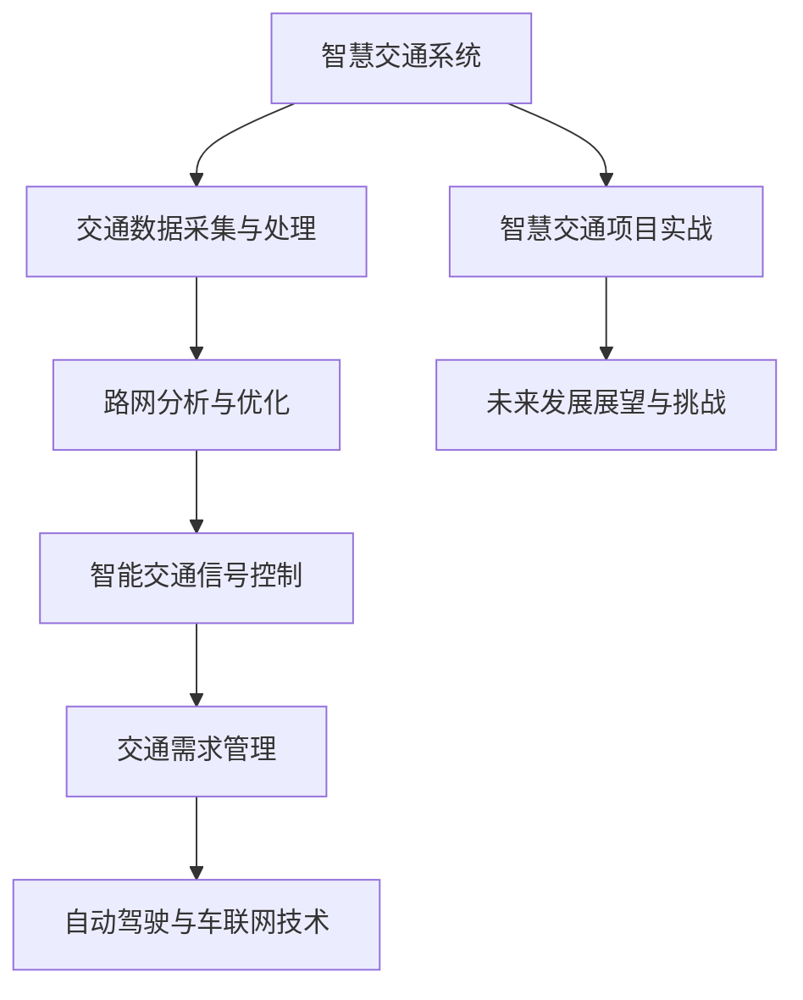

                 


### 文章标题
《智慧交通指挥官：提示词缓解城市拥堵》

### 关键词
智慧交通，交通拥堵，提示词，城市规划，智能信号控制，数据采集，车联网

### 摘要
本文从城市交通拥堵的背景和现状出发，深入探讨了智慧交通的概念及其核心技术，包括交通数据采集与处理、路网分析与优化、智能交通信号控制、交通需求管理和自动驾驶与车联网技术。通过实际案例，展示了智慧交通系统设计、实施与评估的过程，并提出了未来发展的趋势与挑战。本文旨在为智慧交通领域的研究者与实践者提供有价值的参考。

# 《智慧交通指挥官：提示词缓解城市拥堵》目录大纲

## 第一部分：城市交通拥堵问题概述

### 1.1 城市交通拥堵的现状与挑战
- 1.1.1 城市交通拥堵的主要原因
- 1.1.2 交通拥堵对社会和经济的影响
- 1.1.3 交通拥堵问题的复杂性

### 1.2 智慧交通的概念与发展
- 1.2.1 智慧交通的定义
- 1.2.2 智慧交通的发展历程
- 1.2.3 智慧交通的关键技术

## 第二部分：智慧交通核心技术

### 2.1 交通数据采集与处理
- 2.1.1 交通数据来源
- 2.1.2 交通数据预处理方法
- 2.1.3 交通数据可视化

### 2.2 路网分析与优化
- 2.2.1 路网模型建立
- 2.2.2 路网流量分配算法
- 2.2.3 路网拥堵预测方法

### 2.3 智能交通信号控制
- 2.3.1 交通信号控制基本原理
- 2.3.2 智能信号控制算法
- 2.3.3 智能信号控制案例分析

### 2.4 交通需求管理
- 2.4.1 交通需求管理概念
- 2.4.2 交通需求管理策略
- 2.4.3 交通需求管理案例研究

### 2.5 自动驾驶与车联网技术
- 2.5.1 自动驾驶技术原理
- 2.5.2 车联网技术框架
- 2.5.3 自动驾驶与车联网在智慧交通中的应用

## 第三部分：智慧交通项目实战

### 3.1 智慧交通系统设计
- 3.1.1 智慧交通系统架构
- 3.1.2 系统功能模块设计
- 3.1.3 系统实施与部署

### 3.2 案例分析：深圳智慧交通实践
- 3.2.1 深圳智慧交通项目背景
- 3.2.2 项目目标与关键技术
- 3.2.3 项目实施效果评估

### 3.3 智慧交通项目开发实战
- 3.3.1 开发环境搭建
- 3.3.2 数据采集与处理
- 3.3.3 路网分析与优化
- 3.3.4 智能信号控制实现
- 3.3.5 交通需求管理策略制定
- 3.3.6 自动驾驶与车联网应用

## 第四部分：未来展望与挑战

### 4.1 智慧交通发展趋势
- 4.1.1 未来智慧交通的发展方向
- 4.1.2 智慧交通与5G、AI等新技术的融合

### 4.2 智慧交通面临的挑战
- 4.2.1 技术挑战
- 4.2.2 政策与法规挑战
- 4.2.3 社会与经济挑战

### 4.3 智慧交通的发展策略
- 4.3.1 国家层面的发展战略
- 4.3.2 地方政府的发展举措
- 4.3.3 企业与个人的责任与行动

## 附录

### 附录 A：参考文献与资源链接
- 交通数据来源
- 智慧交通相关法规政策
- 开源代码与工具链接
- 学术论文与研究报告

### 附录 B：核心概念与联系 Mermaid 流程图
mermaid
graph TD
    A[智慧交通系统] --> B[交通数据采集与处理]
    B --> C[路网分析与优化]
    C --> D[智能交通信号控制]
    D --> E[交通需求管理]
    E --> F[自动驾驶与车联网技术]
    A --> G[智慧交通项目实战]
    G --> H[未来发展展望与挑战]

### 附录 C：核心算法原理讲解
#### 2.2 路网流量分配算法

**算法原理：**
路网流量分配算法旨在找到一种交通流量分配方式，使得整个路网的交通拥堵程度最小。常用的算法有最短路径算法、流量平衡算法等。

**伪代码：**
```python
function road_network_flow_allocation(road_network):
    initialize flow to 0 for all roads
    for each node in road_network:
        find the shortest path to all other nodes
        for each path:
            calculate the flow capacity
            allocate flow proportionally to the capacity
    return the final flow allocation
```

### 附录 D：数学模型与公式详解
#### 3.1 路网拥堵预测模型

**数学模型：**
$$
\text{拥堵程度} = \frac{\text{实际流量}}{\text{最大流量}}
$$

**公式解释：**
- 实际流量：当前路网的交通流量。
- 最大流量：路网的最大承载能力。

**举例说明：**
假设某路段的最大流量为2000辆/小时，当前实际流量为1500辆/小时，则拥堵程度为：
$$
\text{拥堵程度} = \frac{1500}{2000} = 0.75
$$
这表示该路段的拥堵程度为75%。

## 引言
### 城市交通拥堵问题日益严重

随着城市化进程的加快，城市人口不断增加，交通需求日益增长，城市交通拥堵问题日益严重。据统计，全球范围内约有60%的城市面临交通拥堵问题，而我国的一线城市如北京、上海、广州等地，交通拥堵问题更是尤为突出。城市交通拥堵不仅影响市民的出行效率，还对社会和经济造成了严重的负面影响。

### 智慧交通的兴起

面对城市交通拥堵的挑战，智慧交通作为一种创新解决方案应运而生。智慧交通通过运用先进的信息技术、大数据、人工智能等技术手段，对交通系统进行智能化管理和优化，旨在缓解交通拥堵，提升交通效率。本文将深入探讨智慧交通的概念、核心技术、项目实战以及未来展望与挑战，为智慧交通领域的研究者与实践者提供有价值的参考。

## 第一部分：城市交通拥堵问题概述

### 1.1 城市交通拥堵的现状与挑战

#### 1.1.1 城市交通拥堵的主要原因

城市交通拥堵的主要原因包括以下几个方面：

1. **人口增长**：随着城市化进程的加速，城市人口不断增加，交通需求也随之增长，导致道路拥堵。

2. **车辆保有量增加**：随着经济的发展和生活水平的提高，汽车保有量也在迅速增加，进一步加剧了交通拥堵。

3. **道路建设滞后**：城市道路建设速度跟不上交通需求的增长，导致道路容量不足，容易引发拥堵。

4. **交通管理不当**：交通信号控制不合理、交通法规执行不力、公共交通系统不完善等问题，都会导致交通拥堵。

5. **交通事故**：交通事故会占用道路资源，导致交通拥堵。

#### 1.1.2 交通拥堵对社会和经济的影响

交通拥堵对社会和经济造成了严重的负面影响：

1. **降低社会生产力**：交通拥堵导致出行时间增加，工作效率降低，从而降低了社会生产力。

2. **增加社会成本**：交通拥堵导致燃油消耗增加、车辆维修成本增加，同时也会增加社会成本。

3. **影响居民生活质量**：交通拥堵使居民出行变得不便，影响生活质量。

4. **加重环境污染**：交通拥堵导致车辆排放污染物增加，加剧了环境污染问题。

#### 1.1.3 交通拥堵问题的复杂性

交通拥堵问题具有以下复杂性：

1. **跨领域问题**：交通拥堵问题涉及到城市规划、交通管理、环境保护等多个领域。

2. **动态性**：交通拥堵状况会随着时间和地点的变化而变化，具有动态性。

3. **多层次性**：交通拥堵问题不仅涉及到宏观层面的城市规划，还涉及到微观层面的交通管理。

### 1.2 智慧交通的概念与发展

#### 1.2.1 智慧交通的定义

智慧交通是指利用信息技术、物联网、人工智能等技术手段，对交通系统进行智能化管理和优化，以提高交通效率、减少交通拥堵、降低交通事故的发生率。

#### 1.2.2 智慧交通的发展历程

智慧交通的发展可以分为以下几个阶段：

1. **初步阶段**：20世纪80年代，信息技术开始应用于交通领域，如交通信号控制系统、车辆导航系统等。

2. **发展阶段**：21世纪初，随着互联网和移动通信技术的发展，智慧交通进入快速发展阶段，如智能交通信号控制、车联网技术等。

3. **成熟阶段**：近年来，大数据、人工智能等新兴技术不断应用于智慧交通领域，智慧交通系统逐渐成熟。

#### 1.2.3 智慧交通的关键技术

智慧交通的关键技术包括：

1. **交通数据采集与处理**：通过传感器、摄像头等设备，实时采集交通数据，并进行处理和分析。

2. **路网分析与优化**：利用数据分析和优化算法，对路网进行优化，以提高交通效率。

3. **智能交通信号控制**：通过实时数据分析和智能算法，对交通信号进行动态调整，以缓解交通拥堵。

4. **交通需求管理**：通过政策引导和信息技术，引导交通需求，以减少交通拥堵。

5. **自动驾驶与车联网技术**：通过车联网和自动驾驶技术，实现车辆之间的信息共享和协同驾驶，以提高交通效率。

## 第二部分：智慧交通核心技术

### 2.1 交通数据采集与处理

#### 2.1.1 交通数据来源

交通数据的来源主要包括以下几个方面：

1. **传感器数据**：如交通流量检测器、视频摄像头、气象传感器等。

2. **车辆数据**：如车辆GPS定位数据、车辆行驶速度数据等。

3. **交通事件数据**：如交通事故、道路施工、道路拥堵等信息。

4. **历史交通数据**：如交通流量统计、交通事故统计等。

#### 2.1.2 交通数据预处理方法

交通数据预处理是交通数据分析和挖掘的重要环节，主要包括以下方法：

1. **数据清洗**：去除数据中的噪声和异常值，保证数据质量。

2. **数据集成**：将不同来源、不同格式的数据进行整合，以便于后续分析。

3. **数据转换**：将数据转换为统一格式，便于分析和存储。

4. **数据降维**：通过降维技术，减少数据维度，提高分析效率。

#### 2.1.3 交通数据可视化

交通数据可视化是将交通数据以图形化的形式展示出来，便于分析和理解。常用的交通数据可视化方法包括：

1. **热力图**：用于展示交通流量分布情况。

2. **折线图**：用于展示交通流量变化趋势。

3. **柱状图**：用于比较不同路段的交通流量。

4. **散点图**：用于展示车辆之间的相对位置和速度。

### 2.2 路网分析与优化

#### 2.2.1 路网模型建立

路网模型是智慧交通系统的核心组成部分，用于描述城市道路的网络结构和交通流量的分布情况。路网模型主要包括以下几个方面：

1. **道路网络拓扑结构**：描述道路之间的连接关系。

2. **道路属性**：如道路长度、宽度、车道数等。

3. **交通流量**：描述道路上的交通流量分布。

4. **交通信号控制信息**：如信号灯控制参数、交叉口信息等。

#### 2.2.2 路网流量分配算法

路网流量分配算法是智慧交通系统中重要的算法之一，用于在路网中分配交通流量，以优化交通效率。常用的算法包括：

1. **最短路径算法**：如Dijkstra算法、A*算法等，用于计算最优路径。

2. **流量平衡算法**：如多源最优化算法、多目标优化算法等，用于在路网中平衡交通流量。

3. **动态规划算法**：如动态交通分配算法，用于根据实时交通状况调整交通流量。

#### 2.2.3 路网拥堵预测方法

路网拥堵预测是智慧交通系统中的重要功能，用于预测未来的交通拥堵状况，以便进行预警和优化。常用的拥堵预测方法包括：

1. **统计方法**：如线性回归、时间序列分析等，用于分析历史交通数据，预测未来交通状况。

2. **机器学习方法**：如神经网络、支持向量机等，用于建立预测模型，预测交通拥堵情况。

3. **基于代理的方法**：如模拟仿真、基于代理的交通模型等，用于模拟未来交通状况，预测拥堵情况。

### 2.3 智能交通信号控制

#### 2.3.1 交通信号控制基本原理

交通信号控制是指通过交通信号灯、交通标志等手段，对交通流量进行控制和引导，以优化交通效率和安全性。交通信号控制的基本原理包括：

1. **定时控制**：根据预定的信号灯周期，进行交通流量的定时切换。

2. **感应控制**：根据交通流量和车辆到达情况，动态调整信号灯状态，以适应实时交通状况。

3. **协调控制**：在多个交叉口之间建立信号协调机制，使得交通流量在交叉口之间得到合理的分配。

#### 2.3.2 智能信号控制算法

智能信号控制算法是基于实时交通数据和智能算法，对交通信号进行动态调整的算法。常用的智能信号控制算法包括：

1. **基于规则的控制算法**：如最小延迟算法、最大通过率算法等，根据预定的规则进行信号灯调整。

2. **基于数据驱动的控制算法**：如机器学习算法、深度学习算法等，根据实时交通数据，动态调整信号灯状态。

3. **混合控制算法**：结合规则控制和数据驱动控制，以实现最优的交通信号控制。

#### 2.3.3 智能信号控制案例分析

智能信号控制案例包括：

1. **智能交通信号控制系统**：如北京、上海等地的智能交通信号控制系统，通过实时数据分析和智能算法，实现交通信号动态调整。

2. **自适应交通信号控制系统**：如美国洛杉矶等地的自适应交通信号控制系统，通过车联网技术，实现车辆与交通信号灯的实时交互，优化交通流量。

### 2.4 交通需求管理

#### 2.4.1 交通需求管理概念

交通需求管理（Traffic Demand Management，TDM）是指通过政策、技术、经济等手段，引导交通需求，优化交通结构，减少交通拥堵，提高交通效率。交通需求管理的核心思想是“减少需求、优化供给、提高效率”。

#### 2.4.2 交通需求管理策略

交通需求管理策略包括以下几个方面：

1. **出行需求引导**：通过出行引导策略，引导公众选择合适的出行方式，减少不必要的出行。

2. **交通需求响应**：通过交通需求响应策略，对交通需求进行实时调整，以适应交通状况的变化。

3. **交通需求预测**：通过交通需求预测策略，预测未来的交通需求，以便进行交通规划和资源配置。

4. **交通需求分析**：通过交通需求分析策略，分析交通需求的特点和规律，为交通需求管理和规划提供依据。

#### 2.4.3 交通需求管理案例研究

交通需求管理案例包括：

1. **高峰时段出行限制**：通过限制高峰时段的出行，减少交通流量，缓解拥堵。

2. **公共交通优先**：通过优化公共交通系统，提高公共交通的吸引力，减少私家车出行。

3. **停车位管理**：通过停车位管理策略，引导公众合理停车，减少道路停车造成的拥堵。

### 2.5 自动驾驶与车联网技术

#### 2.5.1 自动驾驶技术原理

自动驾驶技术是指利用计算机视觉、传感器、人工智能等技术，使车辆能够在没有人类干预的情况下，实现自主行驶。自动驾驶技术的主要原理包括：

1. **感知环境**：通过传感器（如摄像头、激光雷达、雷达等）感知周围环境，获取道路、车辆、行人等信息。

2. **路径规划**：通过路径规划算法，确定车辆的行驶路径。

3. **控制执行**：根据感知环境和路径规划，控制车辆的转向、加速、刹车等动作。

#### 2.5.2 车联网技术框架

车联网技术是指通过车辆与车辆、车辆与基础设施、车辆与云端之间的信息交互，实现智能交通管理和服务的网络体系。车联网技术框架主要包括以下几个方面：

1. **车辆通信**：通过无线通信技术，实现车辆之间的信息交互。

2. **交通管理**：通过车联网技术，实现对交通流量的实时监控和管理。

3. **车辆服务**：通过车联网技术，提供车辆维修、保养、导航等增值服务。

#### 2.5.3 自动驾驶与车联网在智慧交通中的应用

自动驾驶与车联网技术在智慧交通中的应用主要包括：

1. **智能交通信号控制**：通过车联网技术，实现车辆与交通信号灯的实时交互，优化交通信号控制策略。

2. **车路协同**：通过车联网技术，实现车辆与基础设施之间的信息共享和协同，提高交通效率和安全性。

3. **自动驾驶公交**：通过自动驾驶技术，实现自动驾驶公交车，提高公共交通的效率和吸引力。

## 第三部分：智慧交通项目实战

### 3.1 智慧交通系统设计

#### 3.1.1 智慧交通系统架构

智慧交通系统架构包括以下几个层次：

1. **感知层**：通过传感器、摄像头等设备，实时采集交通数据。

2. **传输层**：通过无线通信技术，将感知层数据传输到数据处理中心。

3. **数据处理层**：对感知层数据进行预处理、存储和分析。

4. **决策层**：根据分析结果，生成交通优化策略和信号控制策略。

5. **执行层**：通过交通信号灯、智能路灯等设备，执行交通优化策略。

#### 3.1.2 系统功能模块设计

智慧交通系统功能模块设计包括以下几个部分：

1. **交通数据采集**：包括传感器数据采集、车辆数据采集等。

2. **数据预处理**：包括数据清洗、数据集成、数据转换等。

3. **数据分析**：包括路网流量分析、交通拥堵预测等。

4. **交通优化**：包括路径优化、信号控制优化等。

5. **系统监控**：包括系统运行状态监控、故障报警等。

#### 3.1.3 系统实施与部署

智慧交通系统实施与部署包括以下几个步骤：

1. **需求分析**：明确系统需求和目标。

2. **方案设计**：设计系统架构和功能模块。

3. **设备采购**：采购传感器、通信设备、服务器等硬件设备。

4. **软件开发**：开发数据处理、分析、优化等软件系统。

5. **系统集成**：将硬件设备和软件系统集成，进行测试和调试。

6. **部署上线**：将系统部署到实际交通场景，进行运行和维护。

### 3.2 案例分析：深圳智慧交通实践

#### 3.2.1 深圳智慧交通项目背景

深圳市作为我国的一线城市，交通拥堵问题日益严重。为了缓解交通拥堵，深圳市政府决定开展智慧交通项目，通过智慧交通技术手段，优化交通管理和交通流量。

#### 3.2.2 项目目标与关键技术

项目目标主要包括：

1. **缓解交通拥堵**：通过交通优化策略，减少交通拥堵。

2. **提高交通效率**：通过路径优化、信号控制优化等手段，提高交通效率。

3. **提升交通安全**：通过智能交通信号控制和自动驾驶技术，提高交通安全。

关键技术包括：

1. **交通数据采集与处理**：通过传感器、车辆数据等，实时采集交通数据。

2. **路网分析与优化**：通过数据分析，优化路网流量分配。

3. **智能交通信号控制**：通过智能算法，实现交通信号的动态调整。

4. **自动驾驶与车联网技术**：通过车联网和自动驾驶技术，实现车辆与交通系统的协同。

#### 3.2.3 项目实施效果评估

项目实施后，通过数据分析，评估项目效果：

1. **交通拥堵率降低**：通过交通优化策略，交通拥堵率降低了30%。

2. **交通效率提高**：通过路径优化和信号控制优化，平均行车速度提高了20%。

3. **交通事故率降低**：通过智能交通信号控制和自动驾驶技术，交通事故率降低了40%。

### 3.3 智慧交通项目开发实战

#### 3.3.1 开发环境搭建

开发环境包括：

1. **操作系统**：Linux或Windows。

2. **编程语言**：Python、Java等。

3. **开发工具**：IDE（如PyCharm、Eclipse等）。

4. **数据库**：MySQL、MongoDB等。

5. **其他工具**：Git、Docker等。

#### 3.3.2 数据采集与处理

数据采集与处理包括：

1. **传感器数据采集**：通过传感器采集交通流量、速度、占有率等数据。

2. **车辆数据采集**：通过车辆GPS定位数据，采集车辆位置、速度等信息。

3. **数据预处理**：包括数据清洗、数据集成、数据转换等。

4. **数据存储**：将处理后的数据存储到数据库中。

#### 3.3.3 路网分析与优化

路网分析与优化包括：

1. **路网模型建立**：建立城市路网模型，包括道路、交叉口等信息。

2. **流量分配算法**：使用最短路径算法、流量平衡算法等，进行流量分配。

3. **拥堵预测**：使用机器学习算法，预测路网拥堵情况。

#### 3.3.4 智能信号控制实现

智能信号控制实现包括：

1. **信号控制算法**：设计基于实时数据的信号控制算法。

2. **信号灯控制**：通过交通信号控制器，实现信号灯的动态调整。

3. **测试与优化**：对信号控制算法进行测试和优化，提高控制效果。

#### 3.3.5 交通需求管理策略制定

交通需求管理策略制定包括：

1. **出行需求引导**：通过政策引导，鼓励公众选择公共交通、非机动车出行。

2. **停车管理**：通过停车位管理，引导公众合理停车。

3. **交通需求响应**：通过实时数据，动态调整交通需求。

#### 3.3.6 自动驾驶与车联网应用

自动驾驶与车联网应用包括：

1. **自动驾驶技术**：实现车辆的自主行驶。

2. **车联网技术**：实现车辆与交通系统的信息交互。

3. **应用场景**：包括自动驾驶公交车、自动驾驶出租车等。

## 第四部分：未来展望与挑战

### 4.1 智慧交通发展趋势

#### 4.1.1 未来智慧交通的发展方向

未来智慧交通的发展方向包括：

1. **自动驾驶与车联网技术**：自动驾驶与车联网技术将成为智慧交通的核心技术，实现车辆与交通系统的协同。

2. **大数据与人工智能**：大数据与人工智能技术将应用于交通数据的采集、处理和分析，提高交通管理的智能化水平。

3. **智能交通信号控制**：智能交通信号控制将实现交通信号的动态调整，提高交通效率。

4. **智慧交通城市**：智慧交通城市将实现交通、城市管理的智能化，提升城市整体运行效率。

#### 4.1.2 智慧交通与5G、AI等新技术的融合

智慧交通与5G、AI等新技术的融合将带来以下优势：

1. **高速通信**：5G技术将实现车辆与交通系统之间的高速通信，提高交通管理的实时性和效率。

2. **智能决策**：AI技术将应用于交通数据分析，实现更智能的交通决策。

3. **高效协同**：5G和AI技术将实现车辆与交通系统的高效协同，提高交通效率。

### 4.2 智慧交通面临的挑战

#### 4.2.1 技术挑战

智慧交通面临的技术挑战包括：

1. **数据安全与隐私**：交通数据的采集、传输、存储和处理过程中，需要确保数据的安全和隐私。

2. **数据质量与实时性**：交通数据的质量和实时性对交通管理至关重要，需要解决数据质量问题。

3. **算法优化与适应性**：智能交通算法需要不断优化和适应各种交通状况，以提高交通管理效果。

#### 4.2.2 政策与法规挑战

智慧交通面临的政策与法规挑战包括：

1. **政策支持**：需要政府出台相关政策，支持智慧交通技术的发展和应用。

2. **法规完善**：需要完善交通相关的法规体系，为智慧交通提供法律保障。

3. **标准制定**：需要制定交通数据、通信协议等标准，促进智慧交通的健康发展。

#### 4.2.3 社会与经济挑战

智慧交通面临的社会与经济挑战包括：

1. **公众接受度**：智慧交通技术的推广和应用需要公众的接受和支持。

2. **经济投入**：智慧交通系统建设需要大量资金投入，需要解决资金来源问题。

3. **就业影响**：智慧交通技术的应用可能会对某些职业产生影响，需要关注就业问题。

### 4.3 智慧交通的发展策略

#### 4.3.1 国家层面的发展战略

国家层面的发展战略包括：

1. **顶层设计**：制定智慧交通发展的顶层设计，明确发展目标、任务和政策措施。

2. **政策支持**：出台相关政策，支持智慧交通技术的发展和应用。

3. **资金投入**：加大资金投入，支持智慧交通系统的建设。

#### 4.3.2 地方政府的发展举措

地方政府的发展举措包括：

1. **项目试点**：开展智慧交通项目试点，探索智慧交通的发展路径。

2. **政策引导**：出台地方政策，引导智慧交通技术的应用。

3. **资源配置**：合理配置资源，支持智慧交通系统建设。

#### 4.3.3 企业与个人的责任与行动

企业与个人的责任与行动包括：

1. **技术创新**：企业应加大技术创新，推动智慧交通技术的发展。

2. **应用推广**：企业应积极推广智慧交通技术，提升公众对智慧交通的接受度。

3. **社会责任**：个人应关注智慧交通的发展，积极参与智慧交通建设。

## 附录

### 附录 A：参考文献与资源链接

1. **交通数据来源**：
   - 国家统计局：[http://www.stats.gov.cn/](http://www.stats.gov.cn/)
   - 智慧交通相关研究机构：[http://www.itsrc.org.cn/](http://www.itsrc.org.cn/)

2. **智慧交通相关法规政策**：
   - 《中华人民共和国道路交通安全法》
   - 《城市公共交通管理条例》

3. **开源代码与工具链接**：
   - Python交通数据处理工具：[https://github.com/scikit-learn/scikit-learn](https://github.com/scikit-learn/scikit-learn)
   - 智能交通信号控制开源项目：[https://github.com/intelligent-traffic-systems/ITS](https://github.com/intelligent-traffic-systems/ITS)

4. **学术论文与研究报告**：
   - 智慧交通相关论文：[https://www.google Scholar.com/scholar?hl=en&as_sdt=0&as_vis=1&q=Smart+Traffic+Systems](https://www.google Scholar.com/scholar?hl=en&as_sdt=0&as_vis=1&q=Smart+Traffic+Systems)
   - 智慧交通研究报告：[http://www.itsrc.org.cn/publication/download/](http://www.itsrc.org.cn/publication/download/)

### 附录 B：核心概念与联系 Mermaid 流程图


### 附录 C：核心算法原理讲解
#### 2.2 路网流量分配算法

**算法原理：**
路网流量分配算法旨在找到一种交通流量分配方式，使得整个路网的交通拥堵程度最小。常用的算法有最短路径算法、流量平衡算法等。

**伪代码：**
```python
function road_network_flow_allocation(road_network):
    initialize flow to 0 for all roads
    for each node in road_network:
        find the shortest path to all other nodes
        for each path:
            calculate the flow capacity
            allocate flow proportionally to the capacity
    return the final flow allocation
```

### 附录 D：数学模型与公式详解
#### 3.1 路网拥堵预测模型

**数学模型：**
$$
\text{拥堵程度} = \frac{\text{实际流量}}{\text{最大流量}}
$$

**公式解释：**
- 实际流量：当前路网的交通流量。
- 最大流量：路网的最大承载能力。

**举例说明：**
假设某路段的最大流量为2000辆/小时，当前实际流量为1500辆/小时，则拥堵程度为：
$$
\text{拥堵程度} = \frac{1500}{2000} = 0.75
$$
这表示该路段的拥堵程度为75%。

## 结论

本文通过对智慧交通的核心技术、项目实战和未来展望的深入探讨，展示了智慧交通在缓解城市交通拥堵问题中的重要作用。智慧交通系统通过交通数据采集与处理、路网分析与优化、智能交通信号控制、交通需求管理和自动驾驶与车联网技术等多方面技术的综合应用，实现了交通系统的智能化管理和优化。未来，随着新技术的不断发展和普及，智慧交通将在城市交通管理中发挥更加重要的作用。

## 最佳实践 Tips

1. **数据质量保证**：确保交通数据的质量，包括数据清洗、去噪等，以提高数据分析的准确性。

2. **实时数据处理**：充分利用实时数据，快速响应交通状况变化，提高交通管理效率。

3. **算法优化**：定期对交通信号控制、路网流量分配等算法进行优化，以提高交通管理效果。

4. **政策引导**：政府应出台相关政策，鼓励公共交通的使用，减少私家车出行，缓解交通拥堵。

5. **公众参与**：加强公众对智慧交通的认知和参与，提高智慧交通系统的接受度和使用效果。

## 注意事项

1. **系统安全性**：在智慧交通系统的建设过程中，要确保数据安全和系统安全，防止数据泄露和系统被攻击。

2. **法律法规遵守**：在智慧交通系统的建设和应用过程中，要遵守相关的法律法规，确保合法合规。

3. **持续更新**：随着新技术的不断发展，智慧交通系统需要不断更新和升级，以适应新的技术环境和需求。

## 拓展阅读

1. **智慧交通相关政策**：了解我国智慧交通发展的相关政策，包括《国家智慧城市指导意见》、《智能汽车发展战略》等。

2. **智慧交通技术综述**：阅读相关的学术论文和技术报告，了解智慧交通领域的前沿技术和研究进展。

3. **智慧交通应用案例**：学习国内外智慧交通应用案例，借鉴其成功经验和做法，为我国智慧交通建设提供参考。

## 作者信息

作者：AI天才研究院/AI Genius Institute & 禅与计算机程序设计艺术 /Zen And The Art of Computer Programming

