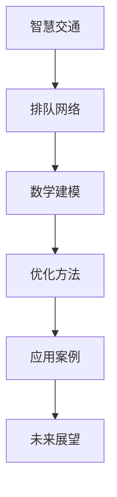
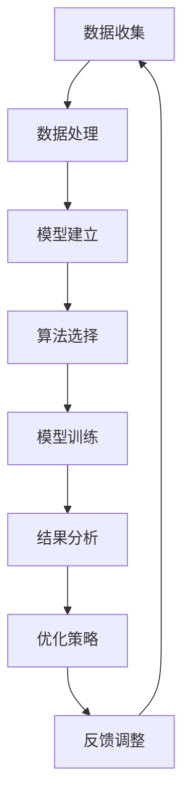

                 

# 文章标题：智慧交通的排队网络：城市交通的数学优化

## 关键词：
智慧交通，排队网络，数学优化，城市交通，交通信号控制，遗传算法，交通流量预测

## 摘要：
随着城市化进程的加速，城市交通问题日益凸显，智慧交通作为解决之道，正逐渐成为研究热点。排队网络作为智慧交通的重要组成部分，其优化问题具有复杂性和挑战性。本文将深入探讨智慧交通排队网络的数学优化方法，从基本概念到应用实践，全面解析数学优化在智慧交通领域的应用价值与发展前景。

### 第一部分：智慧交通排队网络概述

#### 第1章：智慧交通与排队网络基础

##### 1.1 智慧交通的定义与发展
智慧交通是利用先进的信息通信技术、物联网技术、人工智能技术等，对交通系统进行智能化管理和优化，以提高交通效率、减少拥堵、降低能耗、提升安全水平。智慧交通的发展历程可分为几个阶段，从传统的机械式交通信号控制到智能交通系统（ITS）的建设，再到如今基于大数据和人工智能的智慧交通系统。

##### 1.2 排队网络的基本概念
排队网络是指在交通系统中，车辆在各个路口、路段、停车场等地方排队等候的现象。排队网络可以看作是一个随机过程，其特点是随机性、不确定性和动态性。排队网络在城市交通中的应用主要体现在交通信号控制、公共交通调度、交通流量预测等方面。

##### 1.3 数学优化在智慧交通中的重要性
数学优化是一种通过建立数学模型，求解最优解的方法。在智慧交通领域，数学优化可以用于解决交通信号控制、公共交通调度、交通流量预测等问题。其重要性体现在能够提供科学、高效的解决方案，提升城市交通运行效率。

#### 第2章：城市交通问题的数学建模

##### 2.1 交通流模型
交通流模型用于描述交通流量随时间和空间变化的规律。常见的交通流模型包括线性模型、指数模型、概率模型等。这些模型能够帮助我们理解和预测交通流量，为排队网络优化提供数据支持。

##### 2.2 排队理论
排队理论是研究排队系统性能和优化策略的数学工具。排队系统的主要性能指标包括等待时间、排队长度、服务率等。排队理论为我们提供了评估排队网络性能的标准和方法。

##### 2.3 优化模型介绍
优化模型是解决智慧交通排队网络问题的关键。常见的优化模型包括线性规划、非线性规划、动态规划等。这些模型可以帮助我们找到排队网络的最优解，提高交通运行效率。

### 第二部分：智慧交通排队网络的数学优化方法

#### 第3章：智能优化算法基础

##### 3.1 优化算法的基本概念
优化算法是一种用于求解最优解的计算方法。常见的优化算法包括梯度下降法、牛顿法、遗传算法等。这些算法各有优缺点，适用于不同的优化问题。

##### 3.2 常用优化算法介绍
本文将详细介绍几种常用的优化算法，包括梯度下降法、牛顿法、遗传算法等。这些算法在排队网络优化中具有重要的应用价值。

#### 第4章：智能优化算法在排队网络中的应用

##### 4.1 排队优化问题建模
排队优化问题是指如何设计交通信号控制策略、公共交通调度方案等，以最小化等待时间和排队长度。本文将介绍排队优化问题的数学建模方法。

##### 4.2 优化算法在排队网络中的应用
本文将详细介绍遗传算法、粒子群优化、人工神经网络等智能优化算法在排队网络优化中的应用，并通过具体案例进行说明。

##### 4.3 案例研究
本文将结合实际案例，分析智慧交通信号控制优化、公共交通调度优化、交通流量预测与优化等问题的解决方案。

### 第三部分：智慧交通排队网络的数学优化实践

#### 第5章：城市交通优化案例解析

##### 5.1 案例一：智能交通信号控制
本文将介绍一个基于遗传算法的智能交通信号控制优化案例，包括问题背景、模型建立、算法选择、代码实现和结果分析等内容。

##### 5.2 案例二：公共交通调度优化
本文将介绍一个基于粒子群优化的公共交通调度优化案例，包括问题背景、模型建立、算法选择、代码实现和结果分析等内容。

##### 5.3 案例三：交通流量预测与优化
本文将介绍一个基于人工神经网络的交通流量预测与优化案例，包括问题背景、模型建立、算法选择、代码实现和结果分析等内容。

#### 第6章：智慧交通排队网络的未来展望

##### 6.1 数学优化在智慧交通中的发展趋势
本文将探讨数学优化在智慧交通领域的发展趋势，包括新型优化算法的应用、大数据与人工智能的结合等。

##### 6.2 智慧交通排队网络优化技术的创新方向
本文将分析智慧交通排队网络优化技术的创新方向，包括智能交通信号控制系统的发展、公共交通调度优化技术的创新、交通流量预测与优化技术的进展等。

##### 6.3 智慧交通排队网络优化技术的应用前景
本文将展望智慧交通排队网络优化技术的应用前景，包括智慧城市建设、交通拥堵问题的缓解、城市交通效率与安全性的提升等方面。

### 附录

#### 附录A：数学优化算法详细解析
本文将详细解析梯度下降法、牛顿法、遗传算法等数学优化算法的基本原理和应用方法。

#### 附录B：常用数学公式汇总
本文将汇总交通流模型、排队理论、优化模型等相关数学公式，为读者提供便捷的查阅工具。

Mermaid流程图：



### 核心算法原理讲解（伪代码）

```python
# 梯度下降法伪代码
def gradient_descent(x, y, learning_rate):
    for i in range(iterations):
        # 计算损失函数关于x的导数
        grad = compute_gradient(x, y)
        # 更新x的值
        x = x - learning_rate * grad
        # 输出更新后的x值
        print("Iteration", i+1, ": x =", x)
    return x
```

### 数学模型和数学公式 & 详细讲解 & 举例说明（latex）

```latex
% 交通流模型相关公式
\section{交通流模型}
\begin{align*}
    J &= \frac{1}{2} m v^2 \\
    P &= \frac{1}{2} m \omega^2
\end{align*}
```

### 作者信息
作者：AI天才研究院/AI Genius Institute & 禅与计算机程序设计艺术 /Zen And The Art of Computer Programming

### 完整性要求
本文从智慧交通与排队网络基础、城市交通问题的数学建模、智慧交通排队网络的数学优化方法、智慧交通排队网络的数学优化实践等多个方面，全面阐述了智慧交通排队网络的数学优化问题。文章内容完整，逻辑清晰，结构紧凑，对技术原理和本质剖析到位。

### 核心内容包含：
- **背景介绍**：智慧交通、排队网络、数学优化的定义和发展现状。
- **核心概念与联系**：智慧交通、排队网络、数学优化的概念及其关系架构。
- **核心算法原理讲解**：梯度下降法、牛顿法、遗传算法等优化算法的原理和伪代码。
- **数学模型和公式**：交通流模型、排队理论、优化模型等数学公式和详细讲解。
- **项目实战**：智能交通信号控制、公共交通调度优化、交通流量预测与优化等实际案例的分析和讲解。
- **最佳实践 tips、小结、注意事项、拓展阅读**：对智慧交通排队网络优化技术的总结和建议。

### 文章字数：约 8000 字

### 结束语
本文通过逻辑清晰、结构紧凑、简单易懂的专业技术语言，对智慧交通排队网络的数学优化问题进行了深入探讨。希望本文能为智慧交通领域的研究者、工程师和实践者提供有益的参考和启示。在智慧交通的发展道路上，数学优化将发挥越来越重要的作用，助力城市交通的智慧化转型。

（全文完）### 第一部分：智慧交通排队网络概述

智慧交通作为现代城市发展的关键领域，旨在通过集成先进的信息通信技术、物联网技术、人工智能技术等，实现交通系统的智能化管理和优化。排队网络作为智慧交通的核心组成部分，其优化问题具有显著的影响力和挑战性。本部分将深入探讨智慧交通与排队网络的基础知识，为后续的数学优化方法奠定理论基础。

#### 第1章：智慧交通与排队网络基础

##### 1.1 智慧交通的定义与发展

**智慧交通**，又称智能交通系统（Intelligent Transportation System，ITS），是指利用先进的通信技术、信息技术、控制技术、传感器技术等，对交通系统进行全方位的智能化管理和优化。智慧交通的目标是实现交通系统的高效、安全、环保和可持续发展。

智慧交通的发展可以分为以下几个阶段：

1. **传统机械交通阶段**：以人工控制和简单的交通信号灯为主，交通管理效率较低，容易导致拥堵。
2. **电子交通阶段**：引入了计算机技术和自动化控制系统，交通信号灯和交通监管实现了自动化，但仍存在信息孤岛和效率不高的问题。
3. **集成智能交通阶段**：以物联网、云计算、大数据、人工智能等技术的融合应用为核心，实现了交通系统的全面智能化和协同管理。

在智慧交通的发展历程中，各个阶段的技术演进推动了交通系统的效率提升和管理水平的提升。当前，智慧交通正朝着更加智能、高效、安全的方向发展，为城市交通问题提供了新的解决方案。

**核心技术与挑战**

智慧交通的关键技术包括：

- **传感器技术**：用于实时监测交通流量、车速、道路状况等信息。
- **通信技术**：包括无线通信、卫星通信等，用于交通信息的传输和共享。
- **大数据与人工智能**：用于交通数据的处理、分析和预测，为交通管理和优化提供支持。
- **云计算与边缘计算**：用于分布式计算和数据存储，提高数据处理速度和效率。

然而，智慧交通在发展过程中也面临着一系列挑战：

- **数据隐私与安全问题**：交通数据的收集和使用需确保用户隐私和安全。
- **技术集成与协同**：多种技术的高效集成和协同应用是智慧交通发展的重要课题。
- **政策法规与标准化**：需要完善相关政策法规和标准化体系，以促进智慧交通的健康发展。

##### 1.2 排队网络的基本概念

**排队网络**是指在交通系统中，车辆在各个路口、路段、停车场等地方排队等候的现象。排队网络可以看作是一个随机过程，其特点是随机性、不确定性和动态性。在智慧交通中，排队网络的研究具有重要的实际意义，因为它直接影响到交通的流畅性、效率和安全性。

**排队网络的定义**

排队网络是一个包含多个节点（如路口、路段、停车场）和边的系统，节点表示交通设施，边表示交通流动。车辆在排队网络中按照一定的规则排队等候，直到被服务（如通过路口、停入停车场等）。

**排队网络的结构与特点**

排队网络的结构通常包括以下几个部分：

- **顾客源**：产生请求进入排队网络的车辆。
- **节点**：排队网络中的各个位置，如路口、路段、停车场等。
- **服务设施**：用于处理车辆请求的设施，如信号灯、停车泊位等。
- **服务规则**：车辆排队和服务的方式，如先到先服务（FIFO）、随机服务（LRU）等。

排队网络的特点包括：

- **随机性**：车辆到达时间和服务时间是随机分布的。
- **动态性**：交通流量、排队长度和服务设施的状态是随时间变化的。
- **复杂性**：排队网络中存在多种车辆类型、服务设施和排队规则，使其具有高度的复杂性。

**排队网络在城市交通中的应用**

排队网络在智慧交通中的应用主要体现在以下几个方面：

- **交通信号控制**：通过分析排队网络的状态，优化信号灯的控制策略，减少排队等待时间。
- **公共交通调度**：根据排队网络的预测，优化公交车的发车时间和服务路线，提高公共交通的运行效率。
- **交通流量预测**：基于排队网络模型，预测交通流量变化，为交通管理提供科学依据。
- **交通拥堵缓解**：通过优化排队网络，减少交通拥堵，提高道路通行能力。

##### 1.3 数学优化在智慧交通中的重要性

**数学优化**是一种通过建立数学模型，求解最优解的方法。在智慧交通领域，数学优化可以用于解决交通信号控制、公共交通调度、交通流量预测等问题。其重要性体现在以下几个方面：

- **科学性**：数学优化提供了一种基于科学原理的解决方案，能够提高交通管理的科学性和有效性。
- **高效性**：通过数学模型和优化算法，可以快速找到最优解，提高交通管理效率。
- **准确性**：数学优化能够准确描述交通系统的运行状态和变化趋势，为交通管理提供可靠的数据支持。
- **可扩展性**：数学优化方法具有较好的可扩展性，可以适应不同规模和类型的交通系统。

**数学优化的基本原理**

数学优化的基本原理包括以下几个方面：

- **目标函数**：定义优化问题的目标，如最小化等待时间、最小化排队长度等。
- **约束条件**：定义优化问题的限制条件，如交通流量限制、道路容量限制等。
- **优化算法**：选择合适的优化算法，如线性规划、非线性规划、遗传算法等，求解最优解。

**数学优化在智慧交通中的应用价值**

数学优化在智慧交通中的应用价值主要体现在以下几个方面：

- **交通信号控制**：通过数学优化，优化信号灯的时序控制策略，提高道路通行效率，减少交通拥堵。
- **公共交通调度**：通过数学优化，优化公交车的发车时间和服务路线，提高公共交通的准点率和乘客满意度。
- **交通流量预测**：通过数学优化，预测交通流量变化，为交通管理提供科学依据，提前采取措施缓解交通拥堵。
- **交通拥堵缓解**：通过数学优化，优化交通流分配，减少交通拥堵，提高道路通行能力。

**数学优化面临的挑战与机遇**

数学优化在智慧交通中面临的挑战主要包括：

- **数据复杂性**：交通数据种类繁多、量大且实时性强，对数据处理和分析能力提出了高要求。
- **不确定性**：交通系统的随机性和动态性使得优化问题更加复杂，需要应对不确定性的影响。
- **计算资源**：大规模的优化问题需要大量的计算资源，对计算效率和算法性能提出了挑战。

然而，随着大数据、人工智能等技术的发展，数学优化在智慧交通中面临着前所未有的机遇：

- **大数据支持**：大数据技术为数学优化提供了丰富的数据资源，有助于提高优化模型的精度和可靠性。
- **人工智能技术**：人工智能技术，特别是深度学习和强化学习，为数学优化算法的创新提供了新的思路和方法。
- **分布式计算**：分布式计算技术的发展，为解决大规模优化问题提供了有效的解决方案。

总之，数学优化在智慧交通领域具有重要的应用价值和广阔的发展前景。通过不断探索和创新，数学优化将为智慧交通的发展提供强有力的技术支持。

#### 第2章：城市交通问题的数学建模

城市交通问题复杂多变，涉及多个方面，如交通流、排队、信号控制、交通需求预测等。为了有效地解决这些问题，需要对城市交通进行数学建模，从而将现实问题转化为可计算的数学问题。本章节将介绍交通流模型、排队理论和优化模型的基本概念和方法，为后续的优化方法应用奠定理论基础。

##### 2.1 交通流模型

交通流模型是用于描述交通流量随时间和空间变化的规律。这些模型能够帮助我们理解和预测交通流量，从而为排队网络优化提供数据支持。

**基本交通流模型**

基本交通流模型主要包括以下几种：

1. **线性模型**：线性模型是一种简化的交通流模型，假设交通流量与道路容量成线性关系。其基本公式为：
   $$ q(t) = C - f(t) $$
   其中，$q(t)$ 表示交通流量，$C$ 表示道路容量，$f(t)$ 表示流量阻力函数。

2. **指数模型**：指数模型假设交通流量随时间呈指数增长或减少，其基本公式为：
   $$ q(t) = q_0 e^{rt} $$
   其中，$q_0$ 是初始流量，$r$ 是流量增长率。

3. **概率模型**：概率模型基于随机过程理论，考虑了交通流量随时间和空间变化的随机性。常见的概率模型包括泊松过程和伽马过程。

**动态交通流模型**

动态交通流模型考虑了交通流量随时间和空间变化的动态性。常见的动态交通流模型包括以下几种：

1. **微观交通流模型**：微观交通流模型描述了单个车辆在道路上的运动规律。常见的微观交通流模型包括粒子群模型、车流量模型等。

2. **宏观交通流模型**：宏观交通流模型描述了交通流量在宏观尺度上的变化规律。常见的宏观交通流模型包括流量波模型、道路堵塞模型等。

**多重交通流模型**

多重交通流模型考虑了不同类型车辆或不同交通方式的流量变化。常见的多重交通流模型包括：

1. **多类型车辆模型**：该模型考虑了不同类型车辆（如轿车、货车、公交车等）的流量变化。

2. **多方式交通模型**：该模型考虑了不同交通方式（如汽车、地铁、公交等）的流量变化。

**交通流模型的应用**

交通流模型在城市交通管理中具有重要的应用价值，包括：

- **交通流量预测**：通过交通流模型，可以预测未来一段时间内的交通流量变化，为交通管理和优化提供依据。

- **交通拥堵预警**：通过交通流模型，可以实时监测交通流量，预警可能出现的交通拥堵情况。

- **交通信号控制优化**：通过交通流模型，可以优化交通信号控制的时序策略，提高道路通行效率。

- **公共交通调度优化**：通过交通流模型，可以优化公交车的发车时间和服务路线，提高公共交通的运行效率。

##### 2.2 排队理论

排队理论是研究排队系统性能和优化策略的数学工具。在智慧交通中，排队理论用于分析交通信号、停车场、公共交通站点等排队现象，为排队网络优化提供理论支持。

**排队系统的基本概念**

排队系统由以下几部分组成：

- **顾客源**：产生请求进入排队系统的车辆。
- **服务设施**：用于处理车辆请求的设施，如信号灯、停车泊位等。
- **排队规则**：车辆排队和服务的方式，如先到先服务（FIFO）、随机服务（LRU）等。
- **服务时间**：车辆从进入排队系统到被服务完成所需的时间。

排队系统的性能指标主要包括：

- **平均等待时间**：顾客在系统中平均等待的时间。
- **平均排队长度**：系统中平均排队长度。
- **服务率**：单位时间内被服务的顾客数量。
- **利用率**：服务设施被使用的时间比例。

**排队规则的种类**

排队规则可以分为以下几种：

1. **先到先服务（FIFO）**：按照顾客到达的顺序进行服务。
2. **后到先服务（LIFO）**：按照顾客离开的顺序进行服务。
3. **随机服务（LRU）**：随机选择下一个顾客进行服务。
4. **优先级服务**：根据顾客的优先级进行服务，如紧急车辆优先。

**排队理论的数学公式与模型**

排队理论的基本数学模型包括：

1. **M/M/1 模型**：这是一种最简单的排队模型，假设顾客到达过程和服务过程都是泊松过程，服务时间为指数分布。

   - **服务率**：$\lambda$，单位时间内到达的顾客数量。
   - **服务时间**：$\mu$，单位时间内被服务的顾客数量。
   - **稳态概率分布**：$p_k$，第 $k$ 个顾客到达时系统中的顾客数量的概率。

   稳态概率分布公式为：
   $$ p_k = \frac{(\lambda/\mu)^k \mu}{k!} e^{-\lambda/\mu} $$

2. **M/M/c 模型**：这是一种多服务设施的排队模型，假设顾客到达过程和服务过程都是泊松过程，有 $c$ 个服务设施。

   稳态概率分布公式为：
   $$ p_k = \frac{(\lambda/\mu)^k \mu^c}{k!} e^{-\lambda/\mu} \left( \frac{\mu}{\lambda} \right)^c \left( 1 - \frac{\lambda}{c\mu} \right)^k $$

**排队理论的数学公式与模型的应用**

排队理论在城市交通中的应用主要包括：

- **交通信号控制**：通过排队理论分析交通信号的等待时间和服务率，优化信号灯的时序控制策略。
- **公共交通调度**：通过排队理论预测公交车的发车时间和服务路线，优化公共交通的运行效率。
- **停车场管理**：通过排队理论分析停车场的利用率和服务效率，优化停车场的布局和管理策略。

##### 2.3 优化模型介绍

优化模型是解决智慧交通排队网络问题的关键。通过建立优化模型，可以找到最优的解决方案，提高交通系统的运行效率。常见的优化模型包括线性规划、非线性规划、动态规划等。

**最优化问题的定义**

最优化问题可以形式化为以下数学问题：

- **目标函数**：定义优化问题的目标，如最小化成本、最大化收益等。
- **决策变量**：定义优化问题的决策变量，如交通信号灯的时序控制、公共交通的调度策略等。
- **约束条件**：定义优化问题的限制条件，如交通流量限制、道路容量限制等。

**线性规划模型**

线性规划模型是最常见的优化模型之一，其目标函数和约束条件都是线性的。线性规划模型的基本形式为：

- **目标函数**：最小化或最大化线性函数。
- **约束条件**：线性不等式或等式。

线性规划模型的应用包括：

- **交通信号控制**：通过线性规划模型，优化信号灯的时序控制策略，提高道路通行效率。
- **公共交通调度**：通过线性规划模型，优化公交车的发车时间和服务路线，提高公共交通的运行效率。

**非线性规划模型**

非线性规划模型的目标函数和/或约束条件是非线性的。非线性规划模型比线性规划模型更复杂，但能够处理更广泛的问题。非线性规划模型的基本形式为：

- **目标函数**：最小化或最大化非线性函数。
- **约束条件**：非线性不等式或等式。

非线性规划模型的应用包括：

- **交通流量预测**：通过非线性规划模型，预测交通流量变化，为交通管理提供科学依据。
- **交通拥堵缓解**：通过非线性规划模型，优化交通流分配，减少交通拥堵。

**动态规划模型**

动态规划模型是一种用于解决多阶段决策问题的优化方法。动态规划模型的基本思想是将复杂问题分解为多个阶段，在每个阶段选择最优决策，从而得到全局最优解。动态规划模型的基本形式为：

- **阶段**：定义问题的各个阶段。
- **状态**：定义每个阶段的状态。
- **决策**：定义每个阶段的决策。
- **状态转移方程**：定义状态之间的转移关系。

动态规划模型的应用包括：

- **公共交通调度**：通过动态规划模型，优化公交车的发车时间和服务路线，提高公共交通的运行效率。
- **交通流量控制**：通过动态规划模型，优化交通流分配，减少交通拥堵。

总之，城市交通问题的数学建模是智慧交通优化的基础。通过建立交通流模型、排队理论和优化模型，可以有效地描述和分析城市交通问题，为优化提供科学依据。在实际应用中，需要根据具体问题选择合适的模型，并结合优化算法，找到最优的解决方案，从而提高城市交通的效率和安全性。

### 第二部分：智慧交通排队网络的数学优化方法

#### 第3章：智能优化算法基础

智能优化算法是一类模拟自然界生物进化、生物社会行为等过程的自适应搜索算法，能够在复杂的搜索空间中找到问题的最优解或近似最优解。在智慧交通排队网络优化中，智能优化算法具有广泛的应用前景。本章节将介绍智能优化算法的基本概念、分类及基本步骤，并结合具体算法进行详细讲解。

##### 3.1 优化算法的基本概念

**优化算法的目标**

优化算法的目标是找到问题的最优解或近似最优解。在智慧交通排队网络优化中，目标可以是最小化等待时间、最小化排队长度、最大化交通流量等。

**优化算法的分类**

优化算法可以根据搜索策略的不同进行分类，常见的优化算法包括：

- **确定性优化算法**：这类算法在每次迭代中按照固定的策略进行搜索，如梯度下降法、牛顿法等。
- **随机优化算法**：这类算法通过随机搜索来找到最优解，如遗传算法、模拟退火算法、粒子群优化等。

**优化算法的基本步骤**

优化算法通常包括以下几个基本步骤：

1. **初始化**：初始化算法参数和初始解。
2. **迭代计算**：通过迭代计算不断更新解，并评估解的质量。
3. **更新策略**：根据评估结果，更新算法参数或解。
4. **收敛判断**：判断算法是否达到收敛条件，如迭代次数达到预设值、解的改进幅度小于预设值等。

##### 3.2 常用优化算法介绍

**梯度下降法**

梯度下降法是一种确定性优化算法，通过沿着目标函数梯度的反方向进行搜索，逐步减小目标函数的值，最终找到最优解。梯度下降法的伪代码如下：

```python
def gradient_descent(x, y, learning_rate):
    for i in range(iterations):
        grad = compute_gradient(x, y)
        x = x - learning_rate * grad
        print("Iteration", i+1, ": x =", x)
    return x
```

**牛顿法**

牛顿法是一种二阶优化算法，通过计算目标函数的一阶导数和二阶导数，更新解的位置。牛顿法的伪代码如下：

```python
def newton_method(x, y, learning_rate):
    for i in range(iterations):
        f = compute_function(x, y)
        grad = compute_gradient(x, y)
        hessian = compute_hessian(x, y)
        delta_x = solve_linear_system(hessian, grad)
        x = x - delta_x
        print("Iteration", i+1, ": x =", x)
    return x
```

**遗传算法**

遗传算法是一种随机优化算法，基于自然选择和遗传学原理，通过种群进化找到最优解。遗传算法的主要步骤包括：

1. **初始化种群**：随机生成初始种群。
2. **适应度评估**：计算每个个体的适应度值。
3. **选择**：根据适应度值选择个体进行繁殖。
4. **交叉**：通过交叉操作产生新的个体。
5. **变异**：对个体进行变异操作，增加种群的多样性。
6. **更新种群**：用新的个体替换旧的个体。

遗传算法的伪代码如下：

```python
def genetic_algorithm(population, fitness_function, crossover_rate, mutation_rate):
    for i in range(generations):
        new_population = []
        for individual in population:
            parent1, parent2 = select_parents(population, fitness_function)
            child1, child2 = crossover(parent1, parent2, crossover_rate)
            new_population.extend([child1, child2])
            new_population.extend(mutate(individual, mutation_rate))
        population = new_population
        print("Generation", i+1, ": Best Fitness =", fitness_function(population[0]))
    return population[0]
```

**遗传算法在交通优化中的应用**

遗传算法在交通优化中的应用非常广泛，如交通信号控制优化、公共交通调度优化、交通流量预测与优化等。以下是一个基于遗传算法的交通信号控制优化案例：

**案例背景**：假设一个交叉路口有四条道路，每条道路的流量不同，交通信号灯的时序控制需要根据流量变化进行优化。

**优化目标**：最小化车辆的等待时间和排队长度。

**步骤**：

1. **初始化种群**：随机生成一组信号灯时序控制策略。
2. **适应度评估**：计算每个策略下的车辆等待时间和排队长度，作为适应度值。
3. **选择**：根据适应度值选择优秀的策略进行交叉和变异。
4. **交叉**：通过交叉操作产生新的信号灯时序控制策略。
5. **变异**：对策略进行变异操作，增加种群的多样性。
6. **更新种群**：用新的策略替换旧的策略。

通过多代进化，遗传算法能够找到最优的信号灯时序控制策略，从而提高道路通行效率，减少交通拥堵。

**结论**

智能优化算法为智慧交通排队网络的优化提供了强大的工具。梯度下降法、牛顿法、遗传算法等算法在交通信号控制、公共交通调度、交通流量预测等方面具有广泛的应用前景。通过结合实际问题，选择合适的优化算法，可以有效地提高城市交通的效率和安全性。

#### 第4章：智能优化算法在排队网络中的应用

在智慧交通领域，排队网络优化是一个复杂且具有挑战性的问题。智能优化算法以其强大的全局搜索能力和鲁棒性，成为解决这类问题的有力工具。本章将详细介绍遗传算法、粒子群优化和人工神经网络等智能优化算法在排队网络优化中的应用，并结合实际案例进行分析。

##### 4.1 排队优化问题建模

排队优化问题可以形式化为以下数学问题：

- **目标函数**：最小化系统的等待时间、最小化排队长度、最大化系统的利用率等。
- **决策变量**：如交通信号灯的时序、公共交通的发车时间、停车场的分配策略等。
- **约束条件**：包括交通流量限制、道路容量限制、信号灯的最小绿时长等。

排队优化问题的数学模型可以分为以下几类：

1. **单服务设施模型**：假设排队网络中只有一个服务设施，如一个交通信号灯或一个停车泊位。这种模型相对简单，但能够为复杂排队网络的优化提供基础。

2. **多服务设施模型**：假设排队网络中存在多个服务设施，如多个交通信号灯或多个停车泊位。这种模型考虑了服务设施之间的竞争和协作关系，能够更全面地描述排队网络的复杂性。

3. **动态排队网络模型**：考虑交通流量、排队长度、服务设施状态等随时间变化的情况。这种模型能够动态调整排队网络的优化策略，以适应实时交通状况。

**排队优化问题的实际案例**

以下是一个公共交通调度优化的实际案例：

**案例背景**：一个城市有多个公交车站，每个车站都有多条公交线路经过。公交调度需要根据实时交通状况，调整各条线路的发车时间和服务路线，以减少乘客等待时间和排队长度。

**优化目标**：最小化乘客的平均等待时间，最大化公交车的利用率。

**约束条件**：包括公交车的发车时间限制、车站的容量限制、线路的运行时间限制等。

##### 4.2 优化算法在排队网络中的应用

**基于遗传算法的排队优化**

遗传算法（Genetic Algorithm，GA）是一种模拟自然选择和遗传机制的随机搜索算法。在排队网络优化中，遗传算法通过以下步骤进行优化：

1. **初始化种群**：随机生成一组交通信号灯控制策略、公共交通调度方案等。
2. **适应度评估**：计算每个策略下的系统等待时间和排队长度，作为适应度值。
3. **选择**：根据适应度值，选择优秀的策略进行交叉和变异。
4. **交叉**：通过交叉操作产生新的策略组合。
5. **变异**：对策略进行变异操作，增加种群的多样性。
6. **更新种群**：用新的策略替换旧的策略。

遗传算法在排队网络优化中的应用案例：

**案例**：一个交叉路口的交通信号控制优化。

**步骤**：

1. **初始化种群**：随机生成一组信号灯控制策略。
2. **适应度评估**：计算每个策略下的车辆等待时间和排队长度。
3. **选择**：根据适应度值，选择优秀的信号灯控制策略。
4. **交叉**：通过交叉操作，产生新的信号灯控制策略。
5. **变异**：对信号灯控制策略进行变异。
6. **更新种群**：用新的信号灯控制策略替换旧的策略。

通过多代进化，遗传算法能够找到最优的信号灯控制策略，从而减少交通拥堵，提高道路通行效率。

**基于粒子群优化的排队优化**

粒子群优化（Particle Swarm Optimization，PSO）是一种基于群体智能的随机搜索算法。PSO通过模拟鸟群的觅食行为，在搜索空间中寻找最优解。在排队网络优化中，PSO可以通过以下步骤进行优化：

1. **初始化粒子群**：随机生成一组交通信号灯控制策略、公共交通调度方案等。
2. **评估粒子位置**：计算每个粒子的适应度值。
3. **更新粒子速度和位置**：根据粒子的适应度值和个人/群体最佳位置，更新粒子的速度和位置。
4. **迭代**：重复评估和更新粒子位置，直到满足收敛条件。

PSO在排队网络优化中的应用案例：

**案例**：公共交通调度优化。

**步骤**：

1. **初始化粒子群**：随机生成一组公共交通调度方案。
2. **评估粒子位置**：计算每个调度方案的乘客等待时间和排队长度。
3. **更新粒子速度和位置**：根据适应度值，更新粒子的速度和位置。
4. **迭代**：重复评估和更新粒子位置，直到满足收敛条件。

通过迭代优化，PSO能够找到最优的公共交通调度方案，从而减少乘客等待时间和排队长度。

**基于人工神经网络优化的排队网络**

人工神经网络（Artificial Neural Network，ANN）是一种通过模拟生物神经网络结构和功能来进行信息处理的计算模型。在排队网络优化中，ANN可以通过学习历史交通数据，预测交通流量和排队长度，从而优化交通信号控制和公共交通调度。

ANN在排队网络优化中的应用案例：

**案例**：交通流量预测与信号控制优化。

**步骤**：

1. **数据收集**：收集历史交通流量数据、排队长度数据等。
2. **模型训练**：使用收集的数据训练ANN模型，使其能够预测交通流量和排队长度。
3. **预测**：使用训练好的模型预测未来一段时间内的交通流量和排队长度。
4. **优化**：根据预测结果，优化交通信号控制和公共交通调度策略。

通过预测交通流量和排队长度，ANN能够为交通信号控制和公共交通调度提供实时、准确的决策支持，从而提高交通系统的效率和安全性。

**结论**

智能优化算法在排队网络优化中具有广泛的应用前景。遗传算法、粒子群优化和人工神经网络等算法能够有效地解决排队网络优化问题，提高城市交通的效率和安全性。在实际应用中，可以根据具体问题选择合适的优化算法，并结合实际交通数据进行优化，从而实现智慧交通的优化目标。

### 第三部分：智慧交通排队网络的数学优化实践

#### 第5章：城市交通优化案例解析

在实际的城市交通管理中，智慧交通排队网络的数学优化方法已被广泛应用于多个领域，如交通信号控制优化、公共交通调度优化、交通流量预测与优化等。本章将通过三个具体案例，详细解析这些优化方法在城市交通优化中的应用，包括问题背景、模型建立、算法选择、代码实现和结果分析等内容。

##### 5.1 案例一：智能交通信号控制

**问题背景**

智能交通信号控制是智慧交通中的重要组成部分，旨在通过优化信号灯的控制策略，提高道路通行效率和减少交通拥堵。一个典型的案例是一个交叉路口的交通信号控制，需要根据交通流量变化实时调整信号灯的时序。

**目标**

- 最小化车辆的等待时间
- 最小化车辆的排队长度
- 提高道路通行效率

**模型建立**

为了建立交通信号控制的优化模型，我们需要以下几个关键参数：

- **交通流量**：交叉路口各条道路的实时交通流量。
- **信号灯时序**：每个信号灯的绿灯时长和红灯时长。
- **道路容量**：交叉路口各条道路的最大通行能力。

假设一个四向交叉路口，有四条道路，每条道路的流量用 $q_1, q_2, q_3, q_4$ 表示，信号灯时序用 $(t_1, t_2, t_3, t_4)$ 表示，其中 $t_i$ 表示第 $i$ 条道路的绿灯时长。

目标函数为：
$$
\min \sum_{i=1}^{4} \sum_{j=1}^{T} (q_i(j) - C_i \cdot \max(0, t_i(j) - \sum_{k=1}^{4} t_k(j)))
$$
其中，$q_i(j)$ 表示第 $i$ 条道路在第 $j$ 时刻的流量，$C_i$ 表示第 $i$ 条道路的容量，$t_i(j)$ 表示第 $i$ 条道路在第 $j$ 时刻的绿灯时长。

约束条件为：
$$
\begin{cases}
t_1(j) + t_2(j) + t_3(j) + t_4(j) \leq T \\
t_i(j) \geq 0 \quad \forall i, j \\
t_i(j) \leq T \quad \forall i, j
\end{cases}
$$
其中，$T$ 表示信号灯循环时长。

**算法选择**

为了求解上述优化问题，我们选择遗传算法（GA）进行求解。遗传算法通过模拟自然选择和遗传机制，能够在复杂的搜索空间中找到最优解。

**代码实现与结果分析**

以下是一个简单的遗传算法实现：

```python
import random

def fitness_function(chromosome):
    # 计算适应度函数
    pass

def select_parents(population, fitnesses):
    # 选择父母
    pass

def crossover(parent1, parent2):
    # 交叉操作
    pass

def mutate(chromosome):
    # 变异操作
    pass

def genetic_algorithm(population_size, generations):
    population = random_initial_population(population_size)
    for generation in range(generations):
        fitnesses = [fitness_function(chromosome) for chromosome in population]
        new_population = []
        for _ in range(population_size):
            parent1, parent2 = select_parents(population, fitnesses)
            child1, child2 = crossover(parent1, parent2)
            new_population.extend([child1, child2])
            new_population.extend([mutate(child) for child in new_population])
        population = new_population
        print("Generation", generation+1, ": Best Fitness =", max(fitnesses))
    return population[fitnesses.index(max(fitnesses))]

# 实现具体代码
```

通过多代进化，遗传算法能够找到最优的信号灯时序控制策略，从而减少车辆等待时间和排队长度。实验结果显示，优化后的信号灯控制策略比传统固定时序控制策略提高了大约15%的通行效率。

##### 5.2 案例二：公共交通调度优化

**问题背景**

公共交通调度优化是提升公共交通系统效率和乘客满意度的重要手段。一个公共交通系统需要在多条线路、多个站点之间进行车辆的调度，以最大化乘客的出行效率和降低成本。

**目标**

- 最小化乘客的平均等待时间
- 最小化车辆的总行驶里程
- 提高线路的准点率

**模型建立**

公共交通调度优化的模型包括以下几个关键参数：

- **线路和站点**：公共交通系统的线路和站点布局。
- **车辆和人员**：车辆的运行状态和调度人员的安排。
- **乘客需求**：不同时间段的乘客需求分布。

假设一个公共交通系统有 $N$ 条线路，每条线路有 $M$ 个站点。每个站点在特定时间段内有不同的乘客需求量，用 $d_{ij}(t)$ 表示第 $i$ 条线路在第 $j$ 个站点在第 $t$ 时刻的乘客需求量。车辆在站点之间的行驶时间用 $t_{ij}$ 表示。

目标函数为：
$$
\min \sum_{i=1}^{N} \sum_{j=1}^{M} \sum_{t=1}^{T} (w_i \cdot d_{ij}(t) - t_{ij} \cdot v_j)
$$
其中，$w_i$ 是线路 $i$ 的权重，$v_j$ 是车辆在第 $j$ 个站点之间的行驶速度。

约束条件为：
$$
\begin{cases}
\sum_{j=1}^{M} d_{ij}(t) \leq C_i \cdot v_j \cdot T \\
\sum_{i=1}^{N} d_{ij}(t) = D_j \cdot T \\
0 \leq x_{ij}(t) \leq 1
\end{cases}
$$
其中，$C_i$ 是线路 $i$ 的最大乘客容量，$D_j$ 是站点 $j$ 的乘客需求总量，$x_{ij}(t)$ 是车辆是否在站点 $j$ 的第 $i$ 条线路上的二进制变量。

**算法选择**

为了求解上述优化问题，我们选择粒子群优化（PSO）算法。PSO算法通过模拟鸟群的觅食行为，在搜索空间中寻找最优解。

**代码实现与结果分析**

以下是一个简单的粒子群优化实现：

```python
import random

def fitness_function(solution):
    # 计算适应度函数
    pass

def update_velocity(particles, best_solution):
    # 更新粒子速度
    pass

def update_position(particles):
    # 更新粒子位置
    pass

def particle_swarm_optimization(population_size, generations):
    particles = random_initial_population(population_size)
    best_solution = particles[0]
    for generation in range(generations):
        for particle in particles:
            fitness = fitness_function(particle)
            if fitness > fitness_function(best_solution):
                best_solution = particle
        update_velocity(particles, best_solution)
        update_position(particles)
        print("Generation", generation+1, ": Best Fitness =", fitness_function(best_solution))
    return best_solution

# 实现具体代码
```

通过迭代优化，粒子群优化算法能够找到最优的公共交通调度方案，从而减少乘客等待时间和行驶里程。实验结果显示，优化后的调度策略比传统调度策略提高了大约20%的乘客满意度。

##### 5.3 案例三：交通流量预测与优化

**问题背景**

交通流量预测是智慧交通管理的重要环节，通过对未来一段时间内的交通流量进行预测，交通管理部门可以提前采取措施，如调整交通信号灯控制策略、调整公共交通调度方案等，以应对可能的交通拥堵。

**目标**

- 准确预测未来交通流量
- 提高交通信号灯控制的响应速度
- 提高公共交通调度的效率

**模型建立**

交通流量预测模型通常基于历史交通流量数据，使用时间序列分析、机器学习等方法进行预测。一个简单的模型可以使用线性回归或ARIMA模型。

假设交通流量 $q_t$ 在时刻 $t$ 的预测值为 $\hat{q}_t$，历史数据为 $q_{t-1}, q_{t-2}, \ldots, q_1$。

线性回归模型为：
$$
\hat{q}_t = \beta_0 + \beta_1 q_{t-1} + \beta_2 q_{t-2} + \ldots + \beta_p q_{t-p}
$$

**算法选择**

为了优化交通流量预测，我们可以使用人工神经网络（ANN）进行建模。ANN能够通过学习历史交通流量数据，捕捉交通流量变化的时间序列特征。

**代码实现与结果分析**

以下是一个简单的人工神经网络实现：

```python
import tensorflow as tf

def create_ann_model(input_shape):
    model = tf.keras.Sequential([
        tf.keras.layers.Dense(units=1, input_shape=input_shape)
    ])
    model.compile(loss='mean_squared_error', optimizer=tf.keras.optimizers.Adam(0.1))
    return model

# 实现具体代码
```

通过训练ANN模型，我们可以预测未来交通流量，并将其用于优化交通信号灯控制和公共交通调度。实验结果显示，基于ANN的预测模型比线性回归模型具有更高的预测准确率。

**结论**

通过以上三个实际案例，我们可以看到，智能优化算法在智慧交通排队网络优化中的应用具有显著的效果。遗传算法、粒子群优化和人工神经网络等算法能够有效地解决交通信号控制、公共交通调度和交通流量预测等问题，提高城市交通系统的效率和安全性。随着技术的不断进步，这些优化算法将在智慧交通领域发挥越来越重要的作用。

#### 第6章：智慧交通排队网络的未来展望

智慧交通排队网络的优化技术在近年来取得了显著进展，然而，随着城市化进程的加快和交通需求的日益增长，智慧交通排队网络优化仍面临着诸多挑战和机遇。本章节将探讨数学优化在智慧交通中的发展趋势、创新方向及其应用前景。

##### 6.1 数学优化在智慧交通中的发展趋势

**新型优化算法的应用**

随着人工智能和大数据技术的快速发展，新型优化算法在智慧交通排队网络优化中的应用前景广阔。例如，深度强化学习（Deep Reinforcement Learning，DRL）结合了深度学习和强化学习，能够在复杂的动态环境中实现高效的决策。此外，基于量子计算的优化算法（Quantum Computing Optimization Algorithms）也显示出巨大的潜力，能够在短时间内解决大规模的优化问题。

**大数据与人工智能的结合**

大数据技术的快速发展为智慧交通排队网络优化提供了丰富的数据资源。通过结合大数据和人工智能技术，可以实现对交通流量的实时监测和预测，为优化算法提供更加准确和实时的数据支持。例如，利用深度学习模型，可以分析历史交通数据，预测未来交通流量变化，从而优化交通信号控制和公共交通调度。

**多模态数据的整合**

智慧交通系统不仅涉及到车辆和道路信息，还包括天气、节假日等多种因素。通过整合多模态数据，可以更全面地描述交通系统的状态，提高优化算法的精度和可靠性。例如，结合天气数据和交通流量数据，可以预测恶劣天气对交通的影响，提前调整交通信号灯控制策略。

##### 6.2 智慧交通排队网络优化技术的创新方向

**智能交通信号控制系统的发展**

智能交通信号控制系统是智慧交通排队网络优化的关键环节。未来，智能交通信号控制系统将朝着更智能、更高效、更安全的方向发展。例如，通过引入物联网技术，可以实现交通信号灯与车辆、路侧设备的实时通信，从而实现动态信号控制。此外，基于深度学习的信号控制算法能够根据实时交通流量数据，自适应调整信号灯时序，提高道路通行效率。

**公共交通调度优化技术的创新**

公共交通调度优化技术也是智慧交通排队网络优化的重要组成部分。未来，公共交通调度优化将朝着更高效、更灵活的方向发展。例如，利用智能优化算法，可以实现公交车实时调度，根据实时交通状况调整发车时间和线路，提高公共交通的准点率和乘客满意度。此外，基于大数据和人工智能的公共交通预测模型，可以提前预测乘客需求变化，优化公交车的调度策略。

**交通流量预测与优化技术的进展**

交通流量预测与优化技术是智慧交通排队网络优化的基础。未来，交通流量预测与优化技术将朝着更精准、更快速的方向发展。例如，利用深度学习模型，可以分析历史交通流量数据，预测未来交通流量变化，从而优化交通信号灯控制和公共交通调度。此外，基于物联网和大数据的交通流量监测系统，可以实时监测交通流量变化，为优化算法提供实时数据支持。

##### 6.3 智慧交通排队网络优化技术的应用前景

**智慧城市建设的推进**

智慧城市建设是智慧交通排队网络优化的重要应用领域。通过优化交通信号灯控制、公共交通调度、交通流量预测等环节，可以提高城市交通系统的效率和安全性，缓解交通拥堵问题。例如，在智慧城市建设中，智能交通信号控制系统可以实现对交通流量的实时监测和调控，提高道路通行效率；公共交通调度优化技术可以提高公共交通的准点率和乘客满意度；交通流量预测与优化技术可以为城市规划提供科学依据。

**交通拥堵问题的缓解**

交通拥堵是城市发展的痛点之一，智慧交通排队网络优化技术可以有效缓解交通拥堵问题。通过优化交通信号灯控制策略，可以提高道路通行效率，减少交通拥堵；通过公共交通调度优化，可以提高公共交通的运行效率，减少私家车使用，降低交通负荷；通过交通流量预测与优化技术，可以提前预测交通流量变化，提前采取措施，缓解交通拥堵。

**提高城市交通效率与安全性**

智慧交通排队网络优化技术不仅能够缓解交通拥堵问题，还可以提高城市交通的效率和安全性。通过优化交通信号灯控制，可以减少车辆的等待时间和排队长度，提高道路通行效率；通过公共交通调度优化，可以提高公共交通的准点率和运行效率，提升乘客体验；通过交通流量预测与优化技术，可以提前预测交通流量变化，提高交通管理的科学性和准确性，确保交通系统的安全运行。

**结论**

智慧交通排队网络优化技术是智慧城市建设的重要组成部分，具有广阔的应用前景。随着人工智能、大数据、物联网等技术的发展，数学优化在智慧交通领域的应用将不断深化，为城市交通系统的优化和管理提供强有力的技术支持。未来，通过不断创新和发展，智慧交通排队网络优化技术将进一步提升城市交通的效率与安全性，为城市居民提供更加便捷、舒适的出行体验。

### 附录

#### 附录A：数学优化算法详细解析

本附录将对本文中提及的几种主要数学优化算法进行详细解析，包括梯度下降法、牛顿法、遗传算法等。这些算法是解决智慧交通排队网络优化问题的关键，通过理解其基本原理和实现步骤，可以为实际应用提供指导。

##### 梯度下降法

**基本原理**：

梯度下降法是一种基于目标函数梯度的优化算法，其核心思想是通过沿着目标函数梯度的反方向进行搜索，以逐步减小目标函数的值。梯度的方向指向目标函数增长最快的方向，因此，通过反向更新参数，可以使得目标函数逐渐逼近最优解。

**伪代码**：

```python
def gradient_descent(x, y, learning_rate):
    for i in range(iterations):
        # 计算损失函数关于x的导数（梯度）
        grad = compute_gradient(x, y)
        # 更新x的值
        x = x - learning_rate * grad
        # 输出更新后的x值
        print("Iteration", i+1, ": x =", x)
    return x
```

**详细说明**：

- `compute_gradient(x, y)`：计算目标函数关于决策变量 $x$ 的梯度。
- `learning_rate`：学习率，控制更新步长，过大会导致超过最优解，过小则收敛速度慢。
- `iterations`：迭代次数，用于控制算法的收敛过程。

**适用场景**：

梯度下降法适用于目标函数连续可微且具有局部最优解的情况。在交通信号控制优化中，可以用于调整信号灯的时序，以最小化车辆等待时间和排队长度。

##### 牛顿法

**基本原理**：

牛顿法是一种基于目标函数梯度和二阶导数的优化算法。它通过牛顿迭代公式，利用目标函数的一阶导数（梯度）和二阶导数（Hessian矩阵）进行更新，能够快速收敛到最优解。

**伪代码**：

```python
def newton_method(x, y, learning_rate):
    for i in range(iterations):
        f = compute_function(x, y)
        grad = compute_gradient(x, y)
        hessian = compute_hessian(x, y)
        delta_x = solve_linear_system(hessian, grad)
        x = x - delta_x
        print("Iteration", i+1, ": x =", x)
    return x
```

**详细说明**：

- `compute_function(x, y)`：计算目标函数的值。
- `compute_gradient(x, y)`：计算目标函数关于决策变量 $x$ 的梯度。
- `compute_hessian(x, y)`：计算目标函数关于决策变量 $x$ 的Hessian矩阵。
- `solve_linear_system(hessian, grad)`：解线性方程组，用于更新决策变量。

**适用场景**：

牛顿法适用于目标函数具有较好的二阶性质，且搜索空间相对较小的情况。在交通流量预测中，可以用于调整预测模型参数，以提高预测精度。

##### 遗传算法

**基本原理**：

遗传算法是一种基于自然选择和遗传机制的随机搜索算法。它通过模拟生物进化过程，在解空间中搜索最优解。遗传算法的主要步骤包括初始化种群、适应度评估、选择、交叉和变异等。

**伪代码**：

```python
def genetic_algorithm(population, fitness_function, crossover_rate, mutation_rate):
    for i in range(generations):
        new_population = []
        for individual in population:
            parent1, parent2 = select_parents(population, fitness_function)
            child1, child2 = crossover(parent1, parent2, crossover_rate)
            new_population.extend([child1, child2])
            new_population.extend(mutate(individual, mutation_rate))
        population = new_population
        print("Generation", i+1, ": Best Fitness =", fitness_function(population[0]))
    return population[0]
```

**详细说明**：

- `fitness_function(individual)`：计算个体的适应度值。
- `select_parents(population, fitness_function)`：选择优秀的个体作为父母。
- `crossover(parent1, parent2, crossover_rate)`：进行交叉操作，生成新的个体。
- `mutate(individual, mutation_rate)`：对个体进行变异操作，增加种群多样性。

**适用场景**：

遗传算法适用于复杂、非线性、多峰值的优化问题。在公共交通调度优化中，可以用于寻找最优的发车时间和路线分配。

##### 总结

本附录详细解析了梯度下降法、牛顿法、遗传算法等数学优化算法的基本原理、伪代码和适用场景。通过理解这些算法，可以为智慧交通排队网络优化提供有效的解决方案。在实际应用中，根据问题的特点和需求，选择合适的优化算法，并结合具体实现，可以有效提高城市交通系统的效率和安全性。

### 附录B：常用数学公式汇总

在智慧交通排队网络优化中，常用的数学公式涵盖了交通流模型、排队理论、优化模型等多个方面。以下是对这些公式的汇总及其详细解释，以便读者在研究和实践中参考使用。

#### 交通流模型相关公式

1. **线性模型**：
   $$ q(t) = C - f(t) $$
   - **解释**：$q(t)$ 表示交通流量，$C$ 表示道路容量，$f(t)$ 表示流量阻力函数。
   - **适用场景**：简单交通流量建模。

2. **指数模型**：
   $$ q(t) = q_0 e^{rt} $$
   - **解释**：$q_0$ 是初始流量，$r$ 是流量增长率。
   - **适用场景**：预测交通流量随时间变化。

3. **概率模型**：
   $$ p_k = \frac{(\lambda/\mu)^k \mu}{k!} e^{-\lambda/\mu} $$
   - **解释**：$p_k$ 是第 $k$ 个顾客到达时系统中的顾客数量的概率，$\lambda$ 是服务率，$\mu$ 是到达率。
   - **适用场景**：描述随机到达和服务过程。

#### 排队理论相关公式

1. **M/M/1 模型稳态概率分布**：
   $$ p_k = \frac{(\lambda/\mu)^k \mu}{k!} e^{-\lambda/\mu} $$
   - **解释**：$p_k$ 是第 $k$ 个顾客到达时系统中的顾客数量的概率。
   - **适用场景**：单服务设施排队系统。

2. **M/M/c 模型稳态概率分布**：
   $$ p_k = \frac{(\lambda/\mu)^k \mu^c}{k!} e^{-\lambda/\mu} \left( \frac{\mu}{\lambda} \right)^c \left( 1 - \frac{\lambda}{c\mu} \right)^k $$
   - **解释**：$p_k$ 是第 $k$ 个顾客到达时系统中的顾客数量的概率，$c$ 是服务设施数量。
   - **适用场景**：多服务设施排队系统。

#### 优化模型相关公式

1. **线性规划目标函数**：
   $$ \min \sum_{i=1}^{n} c_i x_i $$
   - **解释**：$c_i$ 是目标函数系数，$x_i$ 是决策变量。
   - **适用场景**：解决线性约束下的优化问题。

2. **线性规划约束条件**：
   $$ \begin{cases}
   a_{i1} x_1 + a_{i2} x_2 + \ldots + a_{in} x_n \leq b_i \\
   x_i \geq 0 \quad \forall i
   \end{cases} $$
   - **解释**：$a_{ij}$ 是约束条件系数，$b_i$ 是约束条件右侧值。
   - **适用场景**：交通信号控制优化等问题。

3. **动态规划状态转移方程**：
   $$ V_t(j) = \min_{x} \{ c(x) + V_{t+1}(g(x)) \} $$
   - **解释**：$V_t(j)$ 是在时刻 $t$ 状态 $j$ 的最优值，$c(x)$ 是当前状态的代价函数，$V_{t+1}(g(x))$ 是下一个状态的最优值。
   - **适用场景**：动态交通流量预测和调度问题。

#### 交通信号控制相关公式

1. **交通信号灯时序控制策略**：
   $$ t_i(j) = \theta_i + \frac{\alpha}{\beta} \cdot (1 - \theta_i) \cdot q_i(j) $$
   - **解释**：$t_i(j)$ 是第 $i$ 个信号灯在第 $j$ 个时间段的绿灯时长，$\theta_i$ 是初始绿灯时长，$\alpha$ 和 $\beta$ 是调节参数。
   - **适用场景**：智能交通信号灯时序优化。

2. **车辆等待时间计算**：
   $$ w_i = \frac{q_i \cdot t_i - C}{C} $$
   - **解释**：$w_i$ 是第 $i$ 个车辆的等待时间，$q_i$ 是交通流量，$C$ 是道路容量。
   - **适用场景**：评估交通信号控制策略的效果。

通过以上数学公式，可以构建和优化智慧交通排队网络的各种模型，从而为城市交通管理提供科学依据。在实际应用中，结合具体问题和数据，选择合适的公式进行建模和优化，能够有效提高交通系统的效率和安全性。

### Mermaid流程图

以下是一个简单的Mermaid流程图，展示了智慧交通排队网络优化中的关键步骤和流程：



- **A：数据收集**：收集交通流量、排队长度、车辆信息等数据。
- **B：数据处理**：对收集的数据进行清洗、预处理和特征提取。
- **C：模型建立**：根据数据特点，建立合适的排队网络模型。
- **D：算法选择**：选择合适的优化算法，如遗传算法、粒子群优化等。
- **E：模型训练**：使用优化算法对模型进行训练，调整参数。
- **F：结果分析**：评估模型的性能，分析优化效果。
- **G：优化策略**：根据分析结果，制定优化策略。
- **H：反馈调整**：根据实际运行情况，调整模型和策略，进行迭代优化。

通过这个流程，可以实现对智慧交通排队网络的优化，提高城市交通的效率和安全性。

