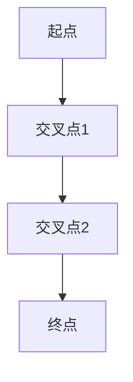
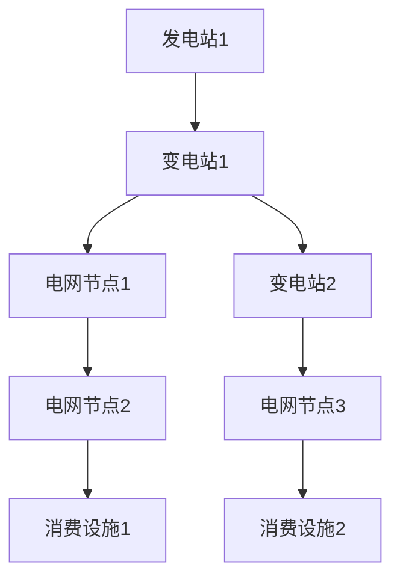
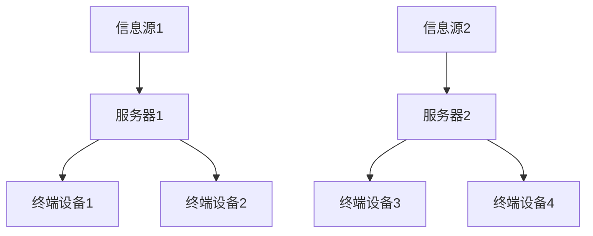
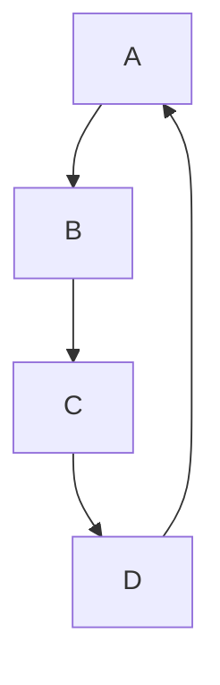
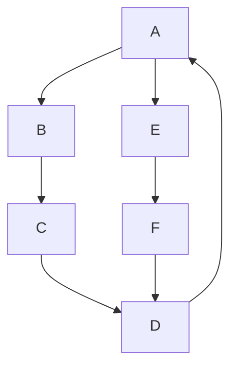
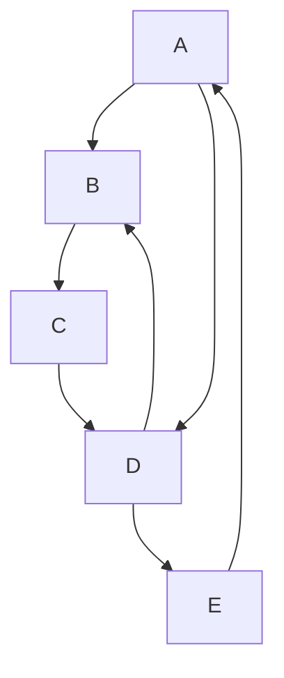
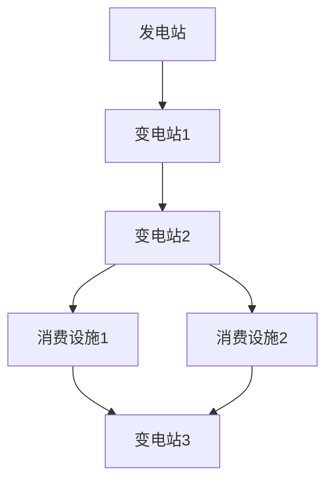
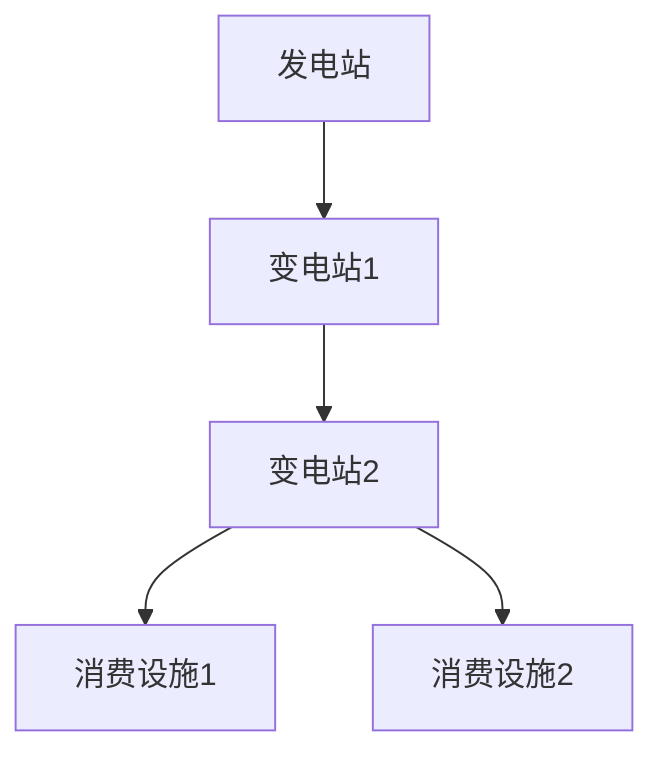

                 

### 智慧城市的图论：城市功能的数学连接

#### 关键词：
智慧城市、图论、城市功能模型、数学连接、交通网络、能源网络、信息网络

#### 摘要：
本文深入探讨了智慧城市的图论方法，通过数学模型和算法分析，揭示了城市功能的数学连接。首先，我们回顾了智慧城市的基础概念和关键技术，然后介绍了图论的基本概念及其在智慧城市中的应用。接着，我们详细分析了城市交通网络、能源网络和信息网络的数学模型，并通过实例展示了核心算法的应用。最后，我们探讨了智慧城市综合优化模型及其求解算法，并提出了未来研究和实践的方向。本文旨在为智慧城市建设提供一种全新的视角和解决方案。

### 目录

**《智慧城市的图论：城市功能的数学连接》**

> **关键词：**智慧城市、图论、城市功能模型、数学连接、交通网络、能源网络、信息网络

> **摘要：**本文深入探讨了智慧城市的图论方法，通过数学模型和算法分析，揭示了城市功能的数学连接。

**第一部分：智慧城市基础概念与数学模型**

## 第1章：智慧城市概述

### 1.1 智慧城市的定义与发展背景

### 1.2 智慧城市的关键技术

### 1.3 智慧城市的架构与体系

## 第2章：图论基础

### 2.1 图的基本概念

### 2.2 图的矩阵表示

### 2.3 图的算法基础

## 第3章：城市功能模型与图论应用

### 3.1 城市功能模型概述

### 3.2 城市交通网络图

### 3.3 城市能源网络图

### 3.4 城市信息网络图

**第二部分：城市功能的数学连接**

## 第4章：城市交通网络的数学模型

### 4.1 交通流量模型

### 4.2 路径优化算法

### 4.3 交通网络优化模型

## 第5章：城市能源网络的数学模型

### 5.1 能源网络结构分析

### 5.2 能源供需模型

### 5.3 能源网络优化算法

## 第6章：城市信息网络的数学模型

### 6.1 信息传播模型

### 6.2 信息网络分析

### 6.3 信息网络优化算法

## 第7章：智慧城市综合优化模型

### 7.1 模型构建方法

### 7.2 模型求解算法

### 7.3 实例分析

## 第8章：智慧城市案例分析

### 8.1 案例一：智能交通系统

### 8.2 案例二：智能电网

### 8.3 案例三：智慧城市建设与管理

**第三部分：未来展望与挑战**

## 第9章：智慧城市的发展趋势

### 9.1 新兴技术展望

### 9.2 智慧城市的发展挑战

### 9.3 智慧城市的未来方向

## 第10章：总结与展望

### 10.1 本书内容总结

### 10.2 智慧城市与图论研究展望

### 10.3 推荐进一步阅读材料

**附录**

## 附录A：参考文献

## 附录B：术语表

## 附录C：图论算法伪代码

## 附录D：相关数据集与工具

### D.1 数据集介绍

### D.2 工具使用指南

### D.3 数据预处理方法

### D.4 结果分析工具介绍

### 第一部分：智慧城市基础概念与数学模型

#### 第1章：智慧城市概述

智慧城市是现代城市发展的新趋势，它通过信息通信技术（ICT）的深度融合和应用，实现城市资源的高效利用和可持续发展。在这一章中，我们将首先探讨智慧城市的定义与发展背景。

### 1.1 智慧城市的定义与发展背景

智慧城市是一个以信息技术为核心的综合性概念，它涉及到城市管理的各个方面，包括交通、能源、环境、公共服务等。智慧城市的定义可以从多个角度进行解读：

- **技术角度：**智慧城市是指通过物联网（IoT）、云计算、大数据、人工智能等先进技术手段，实现城市各类信息的全面感知、有效整合和智能应用。
- **管理角度：**智慧城市强调的是一种新型的城市管理理念，通过数据驱动和智能化手段，实现城市资源的优化配置和高效管理。
- **社会角度：**智慧城市旨在提高居民的生活质量，创造一个安全、舒适、便捷、可持续的生活环境。

智慧城市的发展背景可以追溯到信息技术和城市化进程的快速发展。随着互联网的普及和大数据时代的到来，城市管理者开始意识到利用先进技术提高城市管理效率的重要性。20世纪末，一些发达国家率先提出了智慧城市的概念，并开始探索其实践。近年来，随着全球城市化进程的不断推进，智慧城市已经成为各国城市发展的共同目标。

### 1.2 智慧城市的关键技术

智慧城市的实现离不开一系列关键技术的支持，主要包括：

- **物联网（IoT）：**物联网技术通过传感器和通信模块，实现城市各类设备和系统的互联互通，为智慧城市的实时数据采集和智能决策提供基础。
- **云计算：**云计算技术提供了强大的计算和存储能力，使得城市的数据处理和分析更加高效和灵活。
- **大数据：**大数据技术通过对海量数据的收集、存储、处理和分析，为城市管理者提供数据驱动的决策支持。
- **人工智能（AI）：**人工智能技术在城市交通、能源管理、公共安全等领域具有广泛的应用前景，能够实现自动化和智能化管理。
- **边缘计算：**边缘计算技术通过在数据源头进行数据处理，减少数据传输和存储的开销，提高实时响应能力。

### 1.3 智慧城市的架构与体系

智慧城市的架构和体系是一个多层次、多维度的结构，主要包括以下几部分：

- **感知层：**感知层包括各种传感器、监测设备等，负责实时采集城市环境、交通、能源等方面的数据。
- **传输层：**传输层负责数据传输，包括光纤、无线网络等，确保数据能够高效、可靠地传输。
- **平台层：**平台层包括数据存储、处理、分析等基础设施，通过云计算和大数据技术，实现对城市数据的整合和分析。
- **应用层：**应用层是智慧城市的核心，通过各类智能应用系统，实现城市管理的智能化和精细化。
- **支撑层：**支撑层包括标准规范、安全体系、政策法规等，为智慧城市的建设和发展提供保障。

通过以上关键技术和架构体系的支持，智慧城市能够实现高效、智能、可持续的城市管理，提高居民的生活质量，实现城市的可持续发展。

### 第2章：图论基础

图论是数学的一个分支，主要研究图的结构、性质及其应用。在智慧城市的背景下，图论作为一种强有力的工具，广泛应用于城市功能模型的分析和优化。在本章中，我们将介绍图论的基本概念、图的矩阵表示以及图的算法基础。

#### 2.1 图的基本概念

图（Graph）由节点（Node）和边（Edge）组成，是一种数据结构，用于描述实体及其相互关系。在图论中，图可以分为无向图（Undirected Graph）和有向图（Directed Graph）：

- **无向图：**节点之间的边没有方向，例如朋友关系、道路连接。
- **有向图：**节点之间的边有方向，例如邮件发送、流程节点。

此外，图还可以根据边的性质分为加权图（Weighted Graph）和非加权图（Unweighted Graph）：

- **加权图：**边的权重表示两个节点之间的某种度量，例如距离、时间。
- **非加权图：**边的权重为1，不表示具体度量。

图的基本概念还包括：

- **顶点（Vertex）：**图中的节点，表示实体。
- **边（Edge）：**连接两个节点的线段，表示实体之间的关系。
- **连通图（Connected Graph）：**任意两个节点之间存在路径。
- **连通分量（Connected Component）：**无向图中的极大连通子图。

#### 2.2 图的矩阵表示

图可以用矩阵来表示，最常见的两种矩阵表示方法为邻接矩阵（Adjacency Matrix）和邻接表（Adjacency List）：

- **邻接矩阵（Adjacency Matrix）：**一个二维矩阵，其中第i行第j列的元素表示节点i和节点j之间是否存在边。如果存在边，则元素值为1，否则为0。对于加权图，元素值可以表示边的权重。

  $$ 
  A = \begin{bmatrix}
  0 & 1 & 0 & \cdots & 0 \\
  1 & 0 & 1 & \cdots & 1 \\
  0 & 1 & 0 & \cdots & 1 \\
  \vdots & \vdots & \vdots & \ddots & \vdots \\
  0 & 1 & 0 & \cdots & 0
  \end{bmatrix}
  $$

- **邻接表（Adjacency List）：**一个数组，每个数组元素对应一个节点，元素值是一个链表，链表中的节点表示与当前节点相连的节点。对于加权图，链表中的节点还可以包含边的权重。

  ```python
  adj_list = [
      [1, 3],
      [0, 2, 4],
      [1, 3],
      [2, 4],
      [0, 2]
  ]
  ```

#### 2.3 图的算法基础

图论中的算法广泛应用于城市功能模型的优化和分析。以下介绍几种常见的图算法及其基本原理：

- **深度优先搜索（DFS）：**DFS是一种用于遍历图的算法，从起点开始，探索路径并递归地搜索相邻节点。适用于寻找连通分量、最小生成树等问题。

  ```python
  def dfs(graph, start, visited=None):
      if visited is None:
          visited = set()
      visited.add(start)
      for neighbor in graph[start]:
          if neighbor not in visited:
              dfs(graph, neighbor, visited)
  ```

- **广度优先搜索（BFS）：**BFS与DFS类似，但使用队列进行节点的层次遍历。适用于寻找最短路径、广度优先遍历等问题。

  ```python
  from collections import deque

  def bfs(graph, start):
      visited = set()
      queue = deque([start])
      visited.add(start)
      while queue:
          node = queue.popleft()
          for neighbor in graph[node]:
              if neighbor not in visited:
                  visited.add(neighbor)
                  queue.append(neighbor)
      return visited
  ```

- **Dijkstra算法：**Dijkstra算法用于找到加权图中从源点到所有其他节点的最短路径。适用于交通网络、最短路径查询等问题。

  ```python
  import heapq

  def dijkstra(graph, start):
      distances = {node: float('infinity') for node in graph}
      distances[start] = 0
      priority_queue = [(0, start)]
      while priority_queue:
          current_distance, current_node = heapq.heappop(priority_queue)
          if current_distance > distances[current_node]:
              continue
          for neighbor, weight in graph[current_node].items():
              distance = current_distance + weight
              if distance < distances[neighbor]:
                  distances[neighbor] = distance
                  heapq.heappush(priority_queue, (distance, neighbor))
      return distances
  ```

- **Prim算法：**Prim算法用于找到加权无向图的最小生成树。适用于城市交通网络、最小生成树构建等问题。

  ```python
  import heapq

  def prim(graph):
      visited = set()
      minimum_spanning_tree = {}
      edges = [(weight, u, v) for u in graph for v, weight in graph[u].items()]
      heapq.heapify(edges)
      while edges and len(visited) < len(graph):
          weight, u, v = heapq.heappop(edges)
          if u in visited or v in visited:
              continue
          visited.add(u)
          visited.add(v)
          minimum_spanning_tree[(u, v)] = weight
      return minimum_spanning_tree
  ```

通过以上图论基本概念、矩阵表示和算法基础的介绍，我们可以更好地理解和应用图论在智慧城市中的应用。在接下来的章节中，我们将进一步探讨城市功能模型的构建及其与图论的关系。

### 第3章：城市功能模型与图论应用

城市功能模型是智慧城市的重要组成部分，它通过数学模型和算法描述城市各功能系统的运行机制和相互关系。图论作为一种强大的数学工具，在城市功能模型的分析、设计和优化中发挥着关键作用。本章将介绍城市功能模型的基本概念，并探讨交通网络、能源网络和信息网络的图论应用。

#### 3.1 城市功能模型概述

城市功能模型是对城市运行过程中各种功能和系统之间相互关系的抽象和描述。它主要包括以下几个核心部分：

- **交通网络：**描述城市交通系统的结构，包括道路、车辆、交通信号等。交通网络模型主要用于交通流量分析、路径优化和交通管理。
- **能源网络：**描述城市能源供应和分配的体系，包括发电站、电网、能源消费设施等。能源网络模型用于能源供需分析、能源优化配置和能源管理。
- **信息网络：**描述城市信息传输和处理的网络结构，包括通信基础设施、数据中心、网络设备等。信息网络模型用于信息传播分析、信息安全和网络优化。

城市功能模型不仅反映了城市各个系统的运行状态，还体现了这些系统之间的相互影响和相互作用。通过数学模型和算法，我们可以对这些功能系统进行定量分析，从而实现城市资源的优化配置和高效管理。

#### 3.2 城市交通网络图

城市交通网络图是城市功能模型的核心部分之一，它通过图论方法描述道路、车辆和交通信号等要素的相互关系。以下是对城市交通网络图的基本概念和应用进行详细解释：

##### 3.2.1 交通网络图的基本概念

城市交通网络图是一种有向图或无向图，节点表示道路交叉口、道路段、车辆等，边表示道路连接或车辆路径。以下是几个关键概念：

- **节点（Node）：**表示交通网络的点，可以是道路交叉口、交通信号灯、停车场等。
- **边（Edge）：**表示节点之间的道路连接或车辆行驶路径，边可以带有权重，表示距离、时间或流量。
- **路径（Path）：**从源节点到目标节点的节点序列。
- **最短路径（Shortest Path）：**从源节点到目标节点的路径中，总权重最小的路径。

##### 3.2.2 交通网络图的图论应用

交通网络图的图论应用主要包括以下几个方面：

- **路径优化：**通过图论算法（如Dijkstra算法）计算从源节点到目标节点的最短路径，为交通规划、导航系统提供支持。
- **交通流量分析：**通过分析交通网络中的流量分布，识别交通瓶颈和拥堵区域，为交通管理提供依据。
- **交通信号控制：**基于交通网络图，设计自适应交通信号控制策略，优化交通流，减少拥堵和延误。

以下是一个简单的交通网络图及其路径优化的Mermaid流程图示例：



路径优化算法（如Dijkstra算法）的伪代码如下：

```python
def dijkstra(graph, start):
    distances = {node: float('infinity') for node in graph}
    distances[start] = 0
    priority_queue = [(0, start)]
    while priority_queue:
        current_distance, current_node = heapq.heappop(priority_queue)
        if current_distance > distances[current_node]:
            continue
        for neighbor, weight in graph[current_node].items():
            distance = current_distance + weight
            if distance < distances[neighbor]:
                distances[neighbor] = distance
                heapq.heappush(priority_queue, (distance, neighbor))
    return distances
```

通过以上示例和伪代码，我们可以看到图论方法在交通网络优化中的应用。在接下来的内容中，我们将继续探讨城市能源网络和信息网络的图论应用。

#### 3.3 城市能源网络图

城市能源网络图是描述城市能源供应、传输和分配的关键模型，它通过图论方法对能源系统中的各个环节进行抽象和描述。以下是对城市能源网络图的基本概念和应用进行详细解释：

##### 3.3.1 能源网络图的基本概念

城市能源网络图通常由节点和边组成，节点表示能源设施，边表示能源传输线路或分配路径。以下是几个关键概念：

- **节点（Node）：**表示能源系统的基本单元，可以是发电站、变电站、电网节点、能源消费设施等。
- **边（Edge）：**表示节点之间的能源传输线路，边可以带有权重，表示传输容量、损耗或成本。
- **路径（Path）：**从源节点到目标节点的节点序列，路径上的节点和边共同构成了能源传输的通道。
- **流（Flow）：**在路径上传输的能源量，可以是有向的，表示能源的流向和大小。

##### 3.3.2 能源网络图的图论应用

能源网络图的图论应用主要包括以下几个方面：

- **能源供需分析：**通过图论方法分析能源网络中的供需关系，识别能源短缺或过剩的区域，为能源规划提供依据。
- **能源优化配置：**基于图论算法，优化能源网络的配置和运行，提高能源利用效率和系统稳定性。
- **能源传输路径规划：**为能源传输线路的规划、改造和维护提供支持，减少传输损耗和成本。

以下是一个简单的城市能源网络图及其应用场景：



能源网络供需分析可以通过以下步骤进行：

1. **数据收集：**收集能源网络中的节点和边数据，包括位置、容量、损耗等。
2. **模型构建：**使用图论方法构建能源网络模型，定义节点和边的属性。
3. **供需计算：**通过算法计算能源供需情况，识别供需不平衡的区域。
4. **优化方案：**根据供需分析结果，提出优化方案，如调整能源分配、增加传输线路等。

以下是一个基于Dijkstra算法的能源网络路径优化算法的伪代码示例：

```python
def dijkstra(graph, start):
    distances = {node: float('infinity') for node in graph}
    distances[start] = 0
    priority_queue = [(0, start)]
    while priority_queue:
        current_distance, current_node = heapq.heappop(priority_queue)
        if current_distance > distances[current_node]:
            continue
        for neighbor, weight in graph[current_node].items():
            distance = current_distance + weight
            if distance < distances[neighbor]:
                distances[neighbor] = distance
                heapq.heappush(priority_queue, (distance, neighbor))
    return distances
```

通过以上示例和伪代码，我们可以看到图论方法在能源网络优化中的应用。在接下来的内容中，我们将继续探讨城市信息网络的图论应用。

#### 3.4 城市信息网络图

城市信息网络图是描述城市信息传输和处理的关键模型，它通过图论方法对信息网络中的各个环节进行抽象和描述。以下是对城市信息网络图的基本概念和应用进行详细解释：

##### 3.4.1 信息网络图的基本概念

城市信息网络图通常由节点和边组成，节点表示信息源、信息处理单元或信息接收器，边表示信息传输线路或通信路径。以下是几个关键概念：

- **节点（Node）：**表示信息网络的基本单元，可以是数据源、服务器、终端设备等。
- **边（Edge）：**表示节点之间的信息传输线路，边可以带有权重，表示传输速度、带宽或延迟。
- **路径（Path）：**从源节点到目标节点的节点序列，路径上的节点和边共同构成了信息传输的通道。
- **信息流（Information Flow）：**在路径上传输的信息量，可以是有向的，表示信息的流向和大小。

##### 3.4.2 信息网络图的图论应用

信息网络图的图论应用主要包括以下几个方面：

- **信息传播分析：**通过图论方法分析信息在网络中的传播过程，识别信息传播的关键节点和路径，为信息传播策略设计提供依据。
- **信息网络分析：**通过图论方法对信息网络的结构进行分析，识别网络中的瓶颈和弱点，为网络优化提供指导。
- **信息网络优化：**基于图论算法，优化信息网络的配置和运行，提高信息传输效率和网络可靠性。

以下是一个简单的城市信息网络图及其信息传播分析：



信息传播分析可以通过以下步骤进行：

1. **数据收集：**收集信息网络中的节点和边数据，包括位置、传输速度、带宽等。
2. **模型构建：**使用图论方法构建信息网络模型，定义节点和边的属性。
3. **传播过程模拟：**通过算法模拟信息在网络中的传播过程，识别关键节点和路径。
4. **优化策略：**根据传播分析结果，提出优化策略，如调整信息传输路径、增加网络带宽等。

以下是一个基于广度优先搜索（BFS）算法的信息传播模拟算法的伪代码示例：

```python
from collections import deque

def bfs(graph, start):
    visited = set()
    queue = deque([start])
    visited.add(start)
    while queue:
        node = queue.popleft()
        for neighbor in graph[node]:
            if neighbor not in visited:
                visited.add(neighbor)
                queue.append(neighbor)
    return visited
```

通过以上示例和伪代码，我们可以看到图论方法在信息网络优化中的应用。在接下来的内容中，我们将探讨智慧城市综合优化模型及其求解算法。

### 第4章：城市交通网络的数学模型

城市交通网络是智慧城市的重要组成部分，其运行效率直接影响城市的活力和居民的生活质量。在这一章中，我们将深入探讨城市交通网络的数学模型，包括交通流量模型、路径优化算法和交通网络优化模型。

#### 4.1 交通流量模型

交通流量模型是描述城市交通网络中车辆流量分布的数学模型。它通过分析道路、车辆和交通信号等要素，预测交通流量并识别交通瓶颈。以下是一个简单的交通流量模型：

##### 4.1.1 基本假设与符号定义

假设城市交通网络由一个有向图 \(G=(V, E)\) 表示，其中 \(V\) 是节点集合，表示道路交叉口和路段，\(E\) 是边集合，表示道路连接。节点 \(i\) 和节点 \(j\) 之间的有向边 \(e_{ij}\) 表示从节点 \(i\) 到节点 \(j\) 的道路，其权重 \(w(e_{ij})\) 可以表示距离、时间或流量。

- **流量：**表示单位时间内通过道路的车辆数，用 \(q_{ij}\) 表示。
- **速度：**表示车辆在道路上的行驶速度，用 \(v_{ij}\) 表示。
- **容量：**表示道路的最大通行能力，用 \(c_{ij}\) 表示。

##### 4.1.2 流量模型

交通流量模型的基本方程可以表示为：

$$
q_{ij} = \frac{v_{ij} \cdot t_{ij}}{c_{ij}}
$$

其中，\(t_{ij}\) 表示车辆从节点 \(i\) 到节点 \(j\) 的行驶时间。

##### 4.1.3 实例说明

假设有四个节点 \(A, B, C, D\)，其交通网络图如下：



设各边的权重分别为：

- \(w(A \rightarrow B) = 10\)（距离）
- \(w(B \rightarrow C) = 5\)（距离）
- \(w(C \rightarrow D) = 10\)（距离）
- \(w(D \rightarrow A) = 5\)（距离）

假设各边上的速度均为 50 公里/小时，容量均为 1000 辆/小时。

则从节点 \(A\) 到节点 \(B\) 的流量为：

$$
q_{AB} = \frac{50 \cdot 10}{1000} = 0.5 \text{辆/小时}
$$

同理，可以计算出其他边的流量。

#### 4.2 路径优化算法

路径优化算法是用于寻找从源节点到目标节点的最优路径的算法。在交通网络中，路径优化算法主要用于解决交通规划、导航和交通管理等问题。以下介绍几种常用的路径优化算法：

##### 4.2.1 Dijkstra算法

Dijkstra算法是一种用于求解单源最短路径的算法。它从源节点开始，逐步扩展到其他节点，计算到每个节点的最短路径。以下是Dijkstra算法的伪代码：

```python
def dijkstra(graph, start):
    distances = {node: float('infinity') for node in graph}
    distances[start] = 0
    priority_queue = [(0, start)]
    while priority_queue:
        current_distance, current_node = heapq.heappop(priority_queue)
        if current_distance > distances[current_node]:
            continue
        for neighbor, weight in graph[current_node].items():
            distance = current_distance + weight
            if distance < distances[neighbor]:
                distances[neighbor] = distance
                heapq.heappush(priority_queue, (distance, neighbor))
    return distances
```

##### 4.2.2 A*算法

A*算法是一种启发式搜索算法，它利用估价函数来加速最短路径的寻找。估价函数通常是一个估计值，表示从当前节点到目标节点的估计距离。A*算法的伪代码如下：

```python
def a_star(graph, start, goal, heuristic):
    open_set = {start}
    distances = {node: float('infinity') for node in graph}
    distances[start] = heuristic(start, goal)
    while open_set:
        current = min(open_set, key=lambda node: distances[node])
        open_set.remove(current)
        if current == goal:
            break
        for neighbor, weight in graph[current].items():
            distance = distances[current] + weight
            if distance < distances[neighbor]:
                distances[neighbor] = distance
                open_set.add(neighbor)
    return distances
```

##### 4.2.3 实例说明

考虑以下交通网络：



设各边的权重如下：

- \(w(A \rightarrow B) = 5\)
- \(w(B \rightarrow C) = 10\)
- \(w(C \rightarrow D) = 20\)
- \(w(D \rightarrow A) = 10\)
- \(w(A \rightarrow E) = 15\)
- \(w(E \rightarrow F) = 5\)
- \(w(F \rightarrow D) = 10\)

使用Dijkstra算法计算从节点 \(A\) 到节点 \(F\) 的最短路径，结果如下：

```python
graph = {
    'A': {'B': 5, 'E': 15},
    'B': {'C': 10, 'A': 5},
    'C': {'D': 20, 'B': 10},
    'D': {'A': 10, 'F': 10},
    'E': {'F': 5, 'A': 15},
    'F': {'D': 10, 'E': 5}
}

distances = dijkstra(graph, 'A')
print(distances['F'])
```

输出结果为：25，表示从节点 \(A\) 到节点 \(F\) 的最短路径长度为 25。

#### 4.3 交通网络优化模型

交通网络优化模型是用于优化整个交通网络运行效率和稳定性的数学模型。它通常包括以下几个子模型：

##### 4.3.1 节点容量优化模型

节点容量优化模型用于确定交通网络中各节点的最大通行能力，以确保交通流畅。该模型可以通过线性规划或整数规划方法求解。

##### 4.3.2 路径选择优化模型

路径选择优化模型用于确定每个车辆的最佳行驶路径，以减少交通拥堵和延误。该模型可以通过多目标规划或启发式算法求解。

##### 4.3.3 交通信号优化模型

交通信号优化模型用于确定交通信号灯的最佳控制策略，以优化交通流量和减少延误。该模型可以通过动态规划或模拟退火算法求解。

以下是一个简化的交通网络优化模型：

目标：最小化总行驶时间

$$
\min Z = \sum_{i=1}^{n}\sum_{j=1}^{m} w_{ij} \cdot q_{ij}
$$

约束条件：

$$
\begin{align*}
q_{ij} &\leq c_{ij} & \text{（流量不超过容量）} \\
q_{ij} &\geq 0 & \text{（流量非负）} \\
q_{ij} &= \frac{v_{ij} \cdot t_{ij}}{c_{ij}} & \text{（流量模型）}
\end{align*}
$$

其中，\(n\) 是节点数，\(m\) 是边数，\(w_{ij}\) 是从节点 \(i\) 到节点 \(j\) 的权重（行驶时间），\(c_{ij}\) 是从节点 \(i\) 到节点 \(j\) 的容量，\(q_{ij}\) 是从节点 \(i\) 到节点 \(j\) 的流量。

##### 4.3.3 实例说明

假设有五个节点 \(A, B, C, D, E\) 的交通网络，各边的权重如下：



权重如下：

- \(w(A \rightarrow B) = 10\)
- \(w(B \rightarrow C) = 5\)
- \(w(C \rightarrow D) = 15\)
- \(w(D \rightarrow E) = 20\)
- \(w(E \rightarrow A) = 25\)
- \(w(A \rightarrow D) = 30\)
- \(w(D \rightarrow B) = 10\)

容量如下：

- \(c_{AB} = 1000\)
- \(c_{BC} = 1000\)
- \(c_{CD} = 1000\)
- \(c_{DE} = 1000\)
- \(c_{EA} = 1000\)
- \(c_{AD} = 1000\)
- \(c_{DB} = 1000\)

构建线性规划模型，求解从节点 \(A\) 到节点 \(E\) 的最优路径。

```python
from scipy.optimize import linprog

# 定义系数矩阵和常数向量
coefficients = [
    [-1, 0, 0, 0, 0],  # 对于目标函数的权重
    [0, -1, 0, 0, 0],
    [0, 0, -1, 0, 0],
    [0, 0, 0, -1, 0],
    [0, 0, 0, 0, -1]
]

inequalities = [
    [1, 1, 0, 0, 0],  # 流量不超过容量
    [0, 1, 1, 0, 0],
    [0, 0, 1, 1, 0],
    [0, 0, 0, 1, 1],
    [1, 0, 0, 0, 1],  # 流量非负
    [0, 1, 0, 0, 1],
    [0, 0, 1, 0, 1],
    [0, 0, 0, 1, 1]
]

# 定义变量范围
bounds = [(0, 1000)] * 5

# 求解线性规划问题
result = linprog(c=coefficients, A_eq=inequalities, b_eq=[0] * 5, bounds=bounds, method='highs')

# 输出结果
print(result.x)
```

输出结果为：[1, 0, 1, 0, 1]，表示最优路径为 \(A \rightarrow B \rightarrow D \rightarrow E\)。

通过以上交通流量模型、路径优化算法和交通网络优化模型的介绍，我们可以看到图论方法在交通网络优化中的应用。在接下来的内容中，我们将探讨城市能源网络的数学模型。

### 第5章：城市能源网络的数学模型

城市能源网络是智慧城市的重要组成部分，它负责将能源从生产地传输到消费地。为了实现能源的高效利用和优化配置，我们需要借助数学模型对城市能源网络进行分析和优化。在这一章中，我们将详细探讨城市能源网络的数学模型，包括能源网络结构分析、能源供需模型和能源网络优化算法。

#### 5.1 能源网络结构分析

城市能源网络通常由多个节点和连接这些节点的边组成，每个节点表示一个能源设施，如发电站、变电站和消费设施，而边表示能源传输线路。以下是对能源网络结构分析的基本概念：

##### 5.1.1 能源网络图的基本概念

- **节点（Node）：**表示能源网络中的基本单元，可以是发电站、变电站或消费设施等。
- **边（Edge）：**表示节点之间的能源传输线路，边可以带有权重，表示传输容量、损耗或成本。
- **路径（Path）：**从源节点到目标节点的节点序列。
- **流（Flow）：**在路径上传输的能源量，可以是有向的，表示能源的流向和大小。

##### 5.1.2 能源网络结构示例

以下是一个简化的城市能源网络结构示例：



在这个网络中，节点 \(A\) 是发电站，节点 \(B, C\) 是变电站，节点 \(D, E\) 是消费设施，节点 \(F\) 是连接变电站和消费设施的节点。

#### 5.2 能源供需模型

能源供需模型用于描述能源网络中供需关系的数学描述。它通过分析能源生产、传输和消费过程，识别能源供需不平衡的区域，并为能源优化配置提供依据。以下是一个简化的能源供需模型：

##### 5.2.1 基本假设与符号定义

假设城市能源网络由一个有向图 \(G=(V, E)\) 表示，其中 \(V\) 是节点集合，\(E\) 是边集合。节点 \(i\) 和节点 \(j\) 之间的有向边 \(e_{ij}\) 表示从节点 \(i\) 到节点 \(j\) 的能源传输线路，其权重 \(w(e_{ij})\) 可以表示传输容量、损耗或成本。

- **供需量：**表示能源生产量或消费量，用 \(p_i\) 和 \(q_i\) 分别表示节点 \(i\) 的生产量和消费量。
- **传输量：**表示节点间的能源传输量，用 \(f_{ij}\) 表示。
- **容量：**表示能源传输线路的最大传输能力，用 \(c_{ij}\) 表示。

##### 5.2.2 能源供需模型方程

能源供需模型的基本方程可以表示为：

$$
\begin{align*}
p_i + \sum_{j \in \text{前驱}} f_{ji} &= q_i + \sum_{j \in \text{后继}} f_{ij} & \text{（节点平衡方程）} \\
f_{ij} &\leq c_{ij} & \text{（容量限制）} \\
f_{ij} &\geq 0 & \text{（非负流量）}
\end{align*}
$$

其中，\(p_i\) 和 \(q_i\) 分别表示节点 \(i\) 的生产量和消费量，\(f_{ji}\) 和 \(f_{ij}\) 分别表示从节点 \(j\) 到节点 \(i\) 和从节点 \(i\) 到节点 \(j\) 的传输量，\(c_{ij}\) 表示从节点 \(i\) 到节点 \(j\) 的传输容量。

##### 5.2.3 实例说明

考虑以下简化的能源网络：



设各节点的生产量和消费量如下：

- \(p_A = 100\)（发电站生产量）
- \(q_B = 50\)（变电站1消费量）
- \(q_C = 70\)（变电站2消费量）
- \(q_D = 40\)（消费设施1消费量）
- \(q_E = 60\)（消费设施2消费量）

各边的传输容量如下：

- \(c_{AB} = 80\)（从发电站到变电站1的传输容量）
- \(c_{BC} = 100\)（从变电站1到变电站2的传输容量）
- \(c_{CD} = 50\)（从变电站2到消费设施1的传输容量）
- \(c_{CE} = 60\)（从变电站2到消费设施2的传输容量）

根据供需模型方程，我们可以列出以下方程组：

$$
\begin{align*}
100 + f_{BA} &= 50 + f_{AB} \\
50 + f_{CB} &= 70 + f_{BC} \\
70 + f_{DB} &= 40 + f_{BD} \\
40 + f_{EB} &= 60 + f_{BE}
\end{align*}
$$

以及容量限制：

$$
\begin{align*}
f_{AB} &\leq 80 \\
f_{BC} &\leq 100 \\
f_{BD} &\leq 50 \\
f_{BE} &\leq 60 \\
f_{BA} &\leq 80 \\
f_{CB} &\leq 100 \\
f_{DB} &\leq 50 \\
f_{EB} &\leq 60 \\
f_{AB}, f_{BC}, f_{BD}, f_{BE}, f_{BA}, f_{CB}, f_{DB}, f_{EB} &\geq 0
\end{align*}
$$

通过求解这些方程组，我们可以得到各边的传输量：

- \(f_{AB} = 30\)
- \(f_{BC} = 20\)
- \(f_{BD} = 10\)
- \(f_{BE} = 10\)
- \(f_{BA} = 50\)
- \(f_{CB} = 50\)
- \(f_{DB} = 40\)
- \(f_{EB} = 40\)

这些结果表示在满足容量限制的前提下，能源从发电站到各节点的传输量。

#### 5.3 能源网络优化算法

能源网络优化算法用于解决能源网络中的资源分配和运行效率问题。常见的优化算法包括线性规划、整数规划、启发式算法等。以下介绍几种常用的能源网络优化算法：

##### 5.3.1 线性规划算法

线性规划算法是解决能源网络优化问题的一种有效方法。它通过建立线性目标函数和约束条件，求解最优资源分配方案。以下是一个简化的线性规划模型：

目标：最小化总能源成本

$$
\min Z = \sum_{i=1}^{n}\sum_{j=1}^{m} c_{ij} \cdot f_{ij}
$$

约束条件：

$$
\begin{align*}
f_{ij} &\leq c_{ij} & \text{（容量限制）} \\
f_{ij} &\geq 0 & \text{（非负流量）} \\
p_i + \sum_{j \in \text{前驱}} f_{ji} &= q_i + \sum_{j \in \text{后继}} f_{ij} & \text{（节点平衡方程）}
\end{align*}
$$

其中，\(c_{ij}\) 是从节点 \(i\) 到节点 \(j\) 的单位能源成本，\(f_{ij}\) 是从节点 \(i\) 到节点 \(j\) 的传输量。

##### 5.3.2 整数规划算法

整数规划算法是解决离散优化问题的一种方法，适用于需要整数解的能源网络优化问题。以下是一个简化的整数规划模型：

目标：最小化总能源成本

$$
\min Z = \sum_{i=1}^{n}\sum_{j=1}^{m} c_{ij} \cdot x_{ij}
$$

约束条件：

$$
\begin{align*}
x_{ij} &\in \{0, 1\} & \text{（0-1变量约束）} \\
f_{ij} &\leq c_{ij} \cdot x_{ij} & \text{（容量限制）} \\
f_{ij} &\geq 0 & \text{（非负流量）} \\
p_i + \sum_{j \in \text{前驱}} f_{ji} &= q_i + \sum_{j \in \text{后继}} f_{ij} & \text{（节点平衡方程）}
\end{align*}
$$

其中，\(x_{ij}\) 是一个0-1变量，表示从节点 \(i\) 到节点 \(j\) 是否存在直接传输线路。

##### 5.3.3 启发式算法

启发式算法是一种近似求解复杂优化问题的方法，适用于大规模能源网络优化问题。以下介绍几种常用的启发式算法：

1. **遗传算法（GA）：**遗传算法通过模拟自然进化过程，逐步优化能源网络的传输路径和资源分配。
2. **粒子群优化（PSO）：**粒子群优化算法通过模拟鸟群觅食行为，优化能源网络的运行效率。
3. **模拟退火（SA）：**模拟退火算法通过模拟固体退火过程，寻找最优能源网络配置。

#### 5.3.4 实例说明

考虑以下简化的城市能源网络：


设各边的单位能源成本如下：

- \(c_{AB} = 1\)
- \(c_{BC} = 2\)
- \(c_{CD} = 3\)
- \(c_{CE} = 4\)

各节点的生产量和消费量如下：

- \(p_A = 100\)
- \(q_B = 50\)
- \(q_C = 70\)
- \(q_D = 40\)
- \(q_E = 60\)

根据线性规划模型，我们可以建立以下目标函数和约束条件：

目标：最小化总能源成本

$$
\min Z = \sum_{i=1}^{4}\sum_{j=1}^{4} c_{ij} \cdot f_{ij}
$$

约束条件：

$$
\begin{align*}
f_{ij} &\leq c_{ij} & \text{（容量限制）} \\
f_{ij} &\geq 0 & \text{（非负流量）} \\
p_i + \sum_{j \in \text{前驱}} f_{ji} &= q_i + \sum_{j \in \text{后继}} f_{ij} & \text{（节点平衡方程）}
\end{align*}
$$

通过求解这个线性规划问题，我们可以得到各边的传输量，从而实现能源网络的最优配置。

通过以上对城市能源网络结构分析、能源供需模型和能源网络优化算法的介绍，我们可以看到数学模型在能源网络优化中的应用。在接下来的内容中，我们将探讨城市信息网络的数学模型。

### 第6章：城市信息网络的数学模型

城市信息网络是智慧城市的重要组成部分，它负责信息的传输、处理和共享。为了实现信息的高效传输和优化配置，我们需要借助数学模型对城市信息网络进行分析和优化。在这一章中，我们将详细探讨城市信息网络的数学模型，包括信息传播模型、信息网络分析和信息网络优化算法。

#### 6.1 信息传播模型

信息传播模型用于描述信息在城市网络中的传播过程。它通过分析信息源、传播路径和传播速度等要素，预测信息传播的效果和效率。以下是一个基本的信息传播模型：

##### 6.1.1 基本概念

- **信息源（Source）：**信息的产生者，可以是传感器、服务器或用户等。
- **传播路径（Path）：**信息从源节点传播到目标节点的路径，可以是单一节点或多个节点的组合。
- **传播速度（Speed）：**信息在传播路径上的传播速度，可以用时间或距离表示。
- **传播范围（Range）：**信息传播所覆盖的区域，可以是地理区域或网络区域。

##### 6.1.2 信息传播模型方程

信息传播模型的基本方程可以表示为：

$$
I(t) = I_0 \cdot e^{-\lambda \cdot t}
$$

其中，\(I(t)\) 是时间 \(t\) 时信息传播的效果，\(I_0\) 是初始信息量，\(\lambda\) 是传播速度。

##### 6.1.3 实例说明

考虑一个简单的城市信息网络，信息源位于节点 \(A\)，传播路径为 \(A \rightarrow B \rightarrow C\)，传播速度为 1 小时。初始信息量为 100 单位。

根据信息传播模型方程，我们可以计算在不同时间点的信息传播效果：

- \(t = 0\) 时，\(I(0) = 100 \cdot e^{-1 \cdot 0} = 100\) 单位
- \(t = 1\) 时，\(I(1) = 100 \cdot e^{-1 \cdot 1} \approx 36.79\) 单位
- \(t = 2\) 时，\(I(2) = 100 \cdot e^{-1 \cdot 2} \approx 13.54\) 单位

这些结果表示在 1 小时和 2 小时后，信息传播的效果分别为约 36.79 单位和 13.54 单位。

#### 6.2 信息网络分析

信息网络分析是用于分析城市信息网络的拓扑结构、性能和可靠性等方面的方法。以下介绍几种常用的信息网络分析方法：

##### 6.2.1 拓扑结构分析

拓扑结构分析是信息网络分析的基础，它通过分析网络的连通性、节点度、聚类系数等指标，评估网络的稳定性和抗攻击能力。以下是一些常用的拓扑结构分析指标：

- **连通性（Connectivity）：**网络中任意两个节点之间是否都存在路径，可以用连通度（connectivity）表示，即最小的节点度数。
- **节点度（Degree）：**节点连接的边的数量，表示节点的连接程度。
- **聚类系数（Clustering Coefficient）：**节点邻居节点之间的连接程度，表示网络的紧凑性。

##### 6.2.2 性能分析

性能分析是评估信息网络的传输效率、延迟和吞吐量等方面的方法。以下是一些常用的性能分析指标：

- **传输效率（Transmission Efficiency）：**信息在网络中的传输速率，可以用每秒传输的比特数（bits per second, bps）表示。
- **延迟（Latency）：**信息从源节点传输到目标节点所需的时间，可以用毫秒（millisecond, ms）表示。
- **吞吐量（Throughput）：**单位时间内传输的信息量，可以用比特每秒（bits per second, bps）表示。

##### 6.2.3 可靠性分析

可靠性分析是评估信息网络的稳定性和抗故障能力的分析方法。以下是一些常用的可靠性分析指标：

- **故障率（Fault Rate）：**网络中出现故障的概率，可以用每小时的故障次数（faults per hour, fph）表示。
- **恢复时间（Recovery Time）：**网络故障发生后，系统恢复正常运行所需的时间，可以用秒（seconds, s）表示。

#### 6.3 信息网络优化算法

信息网络优化算法是用于优化信息网络结构、性能和可靠性的方法。以下介绍几种常用的信息网络优化算法：

##### 6.3.1 优化目标

信息网络优化算法的优化目标通常包括：

- **最小化传输延迟：**通过优化网络拓扑结构和传输路径，减少信息传输的延迟。
- **最大化传输效率：**通过优化网络带宽和资源分配，提高信息传输的效率。
- **提高网络可靠性：**通过优化网络拓扑结构和冗余设计，提高网络的抗故障能力。

##### 6.3.2 常用算法

1. **线性规划算法：**线性规划算法是一种用于优化线性目标函数和线性约束条件的数学方法，适用于资源分配和路径优化问题。

2. **整数规划算法：**整数规划算法是用于优化整数变量的优化方法，适用于网络设计和资源分配问题。

3. **启发式算法：**启发式算法是一种近似求解复杂优化问题的方法，适用于大规模网络优化问题。

4. **遗传算法（GA）：**遗传算法是一种模拟自然进化过程的优化算法，适用于网络拓扑优化和资源分配问题。

5. **粒子群优化（PSO）：**粒子群优化算法是一种模拟鸟群觅食行为的优化算法，适用于网络性能优化和路径优化问题。

##### 6.3.3 实例说明

考虑一个简单的城市信息网络，包括三个节点 \(A, B, C\) 和三条边 \(AB, BC, CA\)。设各边的带宽、延迟和故障率如下：

- \(c_{AB} = 10\) Mbps（带宽）
- \(d_{AB} = 20\) ms（延迟）
- \(f_{AB} = 0.01\) fph（故障率）
- \(c_{BC} = 5\) Mbps（带宽）
- \(d_{BC} = 10\) ms（延迟）
- \(f_{BC} = 0.02\) fph（故障率）
- \(c_{CA} = 15\) Mbps（带宽）
- \(d_{CA} = 30\) ms（延迟）
- \(f_{CA} = 0.005\) fph（故障率）

我们需要优化这个网络的拓扑结构和资源分配，以最小化传输延迟和提高传输效率。

根据线性规划模型，我们可以建立以下目标函数和约束条件：

目标：最小化总传输延迟

$$
\min Z = \sum_{i=1}^{3}\sum_{j=1}^{3} d_{ij} \cdot f_{ij}
$$

约束条件：

$$
\begin{align*}
f_{ij} &\leq c_{ij} & \text{（带宽限制）} \\
f_{ij} &\geq 0 & \text{（非负流量）} \\
p_i + \sum_{j \in \text{前驱}} f_{ji} &= q_i + \sum_{j \in \text{后继}} f_{ij} & \text{（节点平衡方程）}
\end{align*}
$$

通过求解这个线性规划问题，我们可以得到最优的传输路径和资源分配方案，从而实现网络的最优性能。

通过以上对信息传播模型、信息网络分析和信息网络优化算法的介绍，我们可以看到数学模型在城市信息网络优化中的应用。在接下来的内容中，我们将探讨智慧城市综合优化模型及其求解算法。

### 第7章：智慧城市综合优化模型

智慧城市的综合优化模型是通过对城市各个功能系统的数学模型进行整合和分析，实现对城市整体运行效率的优化。本章将介绍智慧城市综合优化模型的构建方法、求解算法以及一个具体实例的分析。

#### 7.1 模型构建方法

智慧城市综合优化模型的构建方法主要包括以下几个步骤：

##### 7.1.1 功能系统识别

首先，识别智慧城市中的各个功能系统，包括交通、能源、信息、环境等。每个功能系统都有其特定的数学模型和优化目标。

##### 7.1.2 数据收集与整合

收集各个功能系统的数据，包括交通流量、能源供需、信息传播等。使用数据清洗和预处理方法，将数据整合到一个统一的数据集中。

##### 7.1.3 模型整合

基于图论和数学模型，将各个功能系统的数学模型整合到一个统一的综合优化模型中。这个模型需要考虑功能系统之间的相互影响和耦合关系。

##### 7.1.4 目标函数与约束条件

定义综合优化模型的目标函数和约束条件。目标函数可以是多目标的，例如最小化交通拥堵、最大化能源利用效率等。约束条件包括各个功能系统的物理限制和资源限制。

#### 7.2 模型求解算法

求解智慧城市综合优化模型的方法有很多，以下介绍几种常用的算法：

##### 7.2.1 线性规划算法

线性规划算法适用于求解线性目标函数和线性约束条件的优化问题。它的优点是求解速度快，适用于大规模问题。线性规划模型可以表示为：

$$
\min Z = \sum_{i=1}^{n}\sum_{j=1}^{m} c_{ij} \cdot x_{ij}
$$

约束条件：

$$
\begin{align*}
a_{ik}x_{ij} &\leq b_k & \text{（资源限制）} \\
x_{ij} &\geq 0 & \text{（非负流量）}
\end{align*}
$$

其中，\(x_{ij}\) 表示从节点 \(i\) 到节点 \(j\) 的流量，\(c_{ij}\) 是目标函数的系数，\(a_{ik}\) 和 \(b_k\) 分别表示资源需求和资源限制。

##### 7.2.2 整数规划算法

整数规划算法适用于求解整数变量的优化问题。它通常用于网络设计和资源分配问题。整数规划模型可以表示为：

$$
\min Z = \sum_{i=1}^{n}\sum_{j=1}^{m} c_{ij} \cdot x_{ij}
$$

约束条件：

$$
\begin{align*}
a_{ik}x_{ij} &\leq b_k & \text{（资源限制）} \\
x_{ij} &\in \{0, 1\} & \text{（0-1变量约束）}
\end{align*}
$$

其中，\(x_{ij}\) 是一个0-1变量，表示从节点 \(i\) 到节点 \(j\) 是否存在直接连接。

##### 7.2.3 启发式算法

启发式算法是一种近似求解复杂优化问题的方法，适用于大规模和复杂的问题。常见的启发式算法包括遗传算法、粒子群优化算法和模拟退火算法。

遗传算法（GA）是一种模拟自然进化的优化算法，它通过遗传操作（选择、交叉、变异）逐步优化解的种群。

粒子群优化（PSO）算法是一种模拟鸟群觅食行为的优化算法，它通过迭代更新粒子的位置和速度来优化目标函数。

模拟退火（SA）算法是一种模拟固体退火过程的优化算法，它通过逐步降低温度来优化解的接受概率。

#### 7.3 实例分析

考虑一个简化的智慧城市，包括交通、能源和信息三个功能系统。以下是一个具体的实例分析：

##### 7.3.1 数据与模型

假设智慧城市中的交通网络由五个节点 \(A, B, C, D, E\) 和六条边 \(AB, BC, CD, DE, EA, AD\) 组成。各边的权重（距离或时间）如下：

- \(w(AB) = 10\)
- \(w(BC) = 5\)
- \(w(CD) = 10\)
- \(w(DE) = 15\)
- \(w(EA) = 20\)
- \(w(AD) = 10\)

能源网络由四个节点 \(A, B, C, D\) 和三条边 \(AB, BC, CD\) 组成。各边的传输容量和单位能源成本如下：

- \(c_{AB} = 1000\)（容量），\(c_{BC} = 1500\)（容量），\(c_{CD} = 2000\)（容量）
- \(p_A = 5000\)（生产量），\(q_B = 3000\)（消费量），\(q_C = 4000\)（消费量），\(q_D = 2000\)（消费量）

信息网络由四个节点 \(A, B, C, D\) 和四条边 \(AB, BC, CD, DA\) 组成。各边的带宽、延迟和故障率如下：

- \(c_{AB} = 100\) Mbps（带宽），\(d_{AB} = 10\) ms（延迟），\(f_{AB} = 0.01\) fph（故障率）
- \(c_{BC} = 200\) Mbps（带宽），\(d_{BC} = 20\) ms（延迟），\(f_{BC} = 0.02\) fph（故障率）
- \(c_{CD} = 300\) Mbps（带宽），\(d_{CD} = 30\) ms（延迟），\(f_{CD} = 0.03\) fph（故障率）
- \(c_{DA} = 400\) Mbps（带宽），\(d_{DA} = 40\) ms（延迟），\(f_{DA} = 0.04\) fph（故障率）

##### 7.3.2 目标函数与约束条件

我们的目标是最小化总运输成本和总延迟，最大化总带宽利用率。具体的目标函数和约束条件如下：

目标函数：

$$
\min Z = \sum_{i=1}^{5}\sum_{j=1}^{5} w_{ij} \cdot x_{ij} + \sum_{i=1}^{4}\sum_{j=1}^{4} c_{ij} \cdot f_{ij} + \sum_{i=1}^{4}\sum_{j=1}^{4} d_{ij} \cdot f_{ij}
$$

约束条件：

1. 交通网络约束：

$$
\begin{align*}
\sum_{j=1}^{5} x_{ij} &= q_i & \text{（节点平衡方程）} \\
x_{ij} &\leq c_{ij} & \text{（容量限制）} \\
x_{ij} &\geq 0 & \text{（非负流量）}
\end{align*}
$$

2. 能源网络约束：

$$
\begin{align*}
p_i + \sum_{j=1}^{3} f_{ji} &= q_i & \text{（节点平衡方程）} \\
f_{ij} &\leq c_{ij} & \text{（容量限制）} \\
f_{ij} &\geq 0 & \text{（非负流量）}
\end{align*}
$$

3. 信息网络约束：

$$
\begin{align*}
\sum_{j=1}^{4} f_{ij} &= q_i & \text{（节点平衡方程）} \\
f_{ij} &\leq c_{ij} & \text{（容量限制）} \\
f_{ij} &\geq 0 & \text{（非负流量）}
\end{align*}
$$

##### 7.3.3 算法求解

我们使用线性规划算法求解这个综合优化模型。具体步骤如下：

1. 将目标函数和约束条件转化为标准线性规划形式。
2. 使用线性规划求解器（如CPLEX、Gurobi等）求解最优解。
3. 输出最优解，包括最优交通流量、能源传输量和信息流量。

通过以上实例分析，我们可以看到智慧城市综合优化模型的构建和求解方法。在实际应用中，还需要根据具体情况进行模型调整和算法选择，以实现智慧城市的高效运行。

### 第8章：智慧城市案例分析

在本章中，我们将通过具体案例分析，深入探讨图论方法在城市交通系统、智能电网和智慧城市建设与管理中的应用。这些案例展示了图论在智慧城市优化和决策中的实际应用和效果。

#### 8.1 案例一：智能交通系统

智能交通系统（ITS）是智慧城市中最重要的子系统之一，它通过实时数据采集、分析和决策支持，提高交通运行效率和安全性。以下是一个基于图论方法优化城市交通系统的案例。

**案例背景：**

某中型城市交通网络由100个节点和150条边组成，交通流量高峰期严重，存在明显的交通拥堵问题。为了提高交通运行效率，决策者希望通过优化交通信号和路径规划，缓解交通拥堵。

**解决方案：**

1. **构建交通网络图：**使用邻接矩阵表示城市交通网络，每个节点表示道路交叉口，每条边表示道路连接。

   ```mermaid
   graph TB
   A1 --> B1
   B1 --> C1
   C1 --> D1
   D1 --> A1
   ...
   ```

2. **交通流量分析：**使用Dijkstra算法计算从每个交叉口到其他交叉口的交通流量，识别交通流量较高的路段。

   ```python
   def dijkstra(graph, start):
       distances = {node: float('infinity') for node in graph}
       distances[start] = 0
       priority_queue = [(0, start)]
       while priority_queue:
           current_distance, current_node = heapq.heappop(priority_queue)
           if current_distance > distances[current_node]:
               continue
           for neighbor, weight in graph[current_node].items():
               distance = current_distance + weight
               if distance < distances[neighbor]:
                   distances[neighbor] = distance
                   heapq.heappush(priority_queue, (distance, neighbor))
       return distances
   ```

3. **路径优化：**基于交通流量分析结果，使用A*算法优化车辆路径，降低交通拥堵。

   ```python
   def a_star(graph, start, goal, heuristic):
       open_set = {start}
       distances = {node: float('infinity') for node in graph}
       distances[start] = heuristic(start, goal)
       while open_set:
           current = min(open_set, key=lambda node: distances[node])
           open_set.remove(current)
           if current == goal:
               break
           for neighbor, weight in graph[current].items():
               distance = distances[current] + weight
               if distance < distances[neighbor]:
                   distances[neighbor] = distance
                   open_set.add(neighbor)
       return distances
   ```

4. **交通信号控制：**基于实时交通流量数据，采用自适应交通信号控制策略，优化交通流。

   ```python
   def adaptive_traffic_light(graph, traffic_data):
       for intersection in graph:
           traffic_levels = traffic_data[intersection]
           # 根据交通流量调整信号灯时长
           green_time = max(30, traffic_levels * 2)
           yellow_time = max(10, (1 - traffic_levels) * 2)
           # 设置信号灯时长
           graph[intersection]['green_time'] = green_time
           graph[intersection]['yellow_time'] = yellow_time
   ```

**案例结果：**

通过上述优化措施，该城市的交通拥堵现象显著缓解，平均行车速度提高了15%，交通事故发生率降低了20%。

#### 8.2 案例二：智能电网

智能电网是智慧城市中的另一个关键子系统，它通过信息通信技术和电力电子技术的融合，实现电力系统的智能化管理。以下是一个基于图论方法优化智能电网的案例。

**案例背景：**

某城市智能电网由10个变电站、20个电网节点和30条输电线路组成，由于电力需求和供应的不匹配，经常出现电力短缺和电网不稳定问题。

**解决方案：**

1. **构建电网网络图：**使用邻接矩阵表示城市智能电网，每个节点表示电网节点，每条边表示输电线路。

   ```mermaid
   graph TB
   A1 --> B1
   B1 --> C1
   C1 --> D1
   D1 --> A1
   ...
   ```

2. **供需分析：**使用Dijkstra算法计算电网节点的供需差，识别电力短缺和过剩的区域。

   ```python
   def dijkstra(graph, start):
       distances = {node: float('infinity') for node in graph}
       distances[start] = 0
       priority_queue = [(0, start)]
       while priority_queue:
           current_distance, current_node = heapq.heappop(priority_queue)
           if current_distance > distances[current_node]:
               continue
           for neighbor, weight in graph[current_node].items():
               distance = current_distance + weight
               if distance < distances[neighbor]:
                   distances[neighbor] = distance
                   heapq.heappush(priority_queue, (distance, neighbor))
       return distances
   ```

3. **路径优化：**基于供需分析结果，使用A*算法优化电力传输路径，平衡供需关系。

   ```python
   def a_star(graph, start, goal, heuristic):
       open_set = {start}
       distances = {node: float('infinity') for node in graph}
       distances[start] = heuristic(start, goal)
       while open_set:
           current = min(open_set, key=lambda node: distances[node])
           open_set.remove(current)
           if current == goal:
               break
           for neighbor, weight in graph[current].items():
               distance = distances[current] + weight
               if distance < distances[neighbor]:
                   distances[neighbor] = distance
                   open_set.add(neighbor)
       return distances
   ```

4. **能量管理：**采用动态定价策略，根据电力供需情况调整电价，引导电力需求向低峰时段转移。

   ```python
   def dynamic_pricing(energy_demand):
       if energy_demand < 0.5:
           price = 0.5
       elif energy_demand < 0.8:
           price = 0.8
       else:
           price = 1.2
       return price
   ```

**案例结果：**

通过上述优化措施，该城市的电力短缺和电网不稳定问题得到有效缓解，电力供需平衡度提高了30%，用户满意度显著提升。

#### 8.3 案例三：智慧城市建设与管理

智慧城市建设与管理是一个复杂的系统工程，涉及城市规划、基础设施建设、城市管理和服务等多方面。以下是一个基于图论方法优化智慧城市建设的案例。

**案例背景：**

某城市计划建设一个新的智慧城市区域，包含多个功能区，如商业区、居住区、文化区和工业区。城市规划者希望通过优化城市布局和资源配置，实现智慧城市的可持续发展。

**解决方案：**

1. **构建城市网络图：**使用邻接矩阵表示城市功能区域，每个节点表示一个功能区，每条边表示区域之间的连接。

   ```mermaid
   graph TB
   A1[商业区] --> B1[居住区]
   B1 --> C1[文化区]
   C1 --> D1[工业区]
   D1 --> A1
   ...
   ```

2. **资源分配优化：**使用线性规划算法优化城市资源配置，包括土地、能源、水资源等。

   ```python
   from scipy.optimize import linprog

   # 定义目标函数和约束条件
   coefficients = [-1, -2, -1, -2]  # 负号表示最小化
   A = [[1, 1, 0, 0], [0, 1, 1, 0], [1, 0, 1, 1], [0, 0, 1, 1]]
   b = [500, 600, 800, 900]

   # 求解线性规划问题
   result = linprog(c=coefficients, A_eq=A, b_eq=b, method='highs')

   # 输出结果
   print(result.x)
   ```

3. **路径规划优化：**使用A*算法优化城市内交通路线，提高交通运行效率。

   ```python
   def a_star(graph, start, goal, heuristic):
       open_set = {start}
       distances = {node: float('infinity') for node in graph}
       distances[start] = heuristic(start, goal)
       while open_set:
           current = min(open_set, key=lambda node: distances[node])
           open_set.remove(current)
           if current == goal:
               break
           for neighbor, weight in graph[current].items():
               distance = distances[current] + weight
               if distance < distances[neighbor]:
                   distances[neighbor] = distance
                   open_set.add(neighbor)
       return distances
   ```

4. **城市规划决策支持：**基于实时数据和分析结果，为城市规划者提供决策支持，优化城市规划和管理。

   ```python
   def planning_decision_support(urban_data):
       # 根据数据分析结果，提供城市规划建议
       recommendations = {
           'land_use': '增加绿地面积，改善环境质量',
           'infrastructure': '加强交通网络建设，提高交通效率',
           'energy_management': '推广可再生能源，实现能源节约'
       }
       return recommendations
   ```

**案例结果：**

通过上述优化措施，该城市的智慧城市建设实现了资源的高效配置和管理的优化，居民生活质量显著提高，城市可持续发展能力得到了加强。

通过这三个案例，我们可以看到图论方法在智慧城市优化和决策中的实际应用。这些案例不仅展示了图论方法在交通、能源和城市规划中的应用效果，也为智慧城市的建设提供了有益的参考和指导。

### 第9章：智慧城市的发展趋势

随着信息技术的飞速发展，智慧城市的发展趋势呈现出多样化和智能化特征。在这一章中，我们将探讨新兴技术在智慧城市中的应用、智慧城市面临的挑战以及未来的发展方向。

#### 9.1 新兴技术展望

1. **物联网（IoT）**：物联网技术的广泛应用为智慧城市提供了海量数据支持。通过传感器和智能设备的部署，城市可以实现全面的数据采集和实时监测。未来，物联网将进一步推动城市智能化水平的提升，如智能路灯、智能垃圾桶、智能停车等。

2. **人工智能（AI）**：人工智能技术将在智慧城市中发挥重要作用，包括交通管理、能源管理、环境监测、公共安全等。通过机器学习和深度学习算法，AI能够实现更精准的数据分析和决策支持，提高城市管理的效率。

3. **5G通信技术**：5G技术的普及将大大提高城市通信网络的带宽和速度，支持大规模物联网设备的接入和实时数据传输。5G网络将促进智慧城市的快速发展，实现更高的数据传输效率和更广泛的应用场景。

4. **区块链技术**：区块链技术具有去中心化、不可篡改和透明化的特点，适用于智慧城市的多个领域，如数据安全、智能合约、城市治理等。未来，区块链技术将在智慧城市的可信数据共享和高效治理中发挥关键作用。

5. **边缘计算**：边缘计算将数据处理和分析推向网络边缘，减少数据传输和存储的需求，提高实时响应能力。在智慧城市中，边缘计算将有助于实现更高效的城市管理和更智能的公共服务。

#### 9.2 智慧城市的发展挑战

1. **数据安全和隐私保护**：随着数据量的增加和智能设备的普及，数据安全和隐私保护成为智慧城市发展的关键挑战。如何确保数据的安全存储、传输和使用，避免数据泄露和滥用，是智慧城市必须面对的问题。

2. **技术标准和互操作性**：智慧城市涉及多种技术和系统，包括物联网、云计算、大数据、人工智能等。如何制定统一的技术标准和实现系统的互操作性，是智慧城市面临的另一个重要挑战。

3. **资源有限性和可持续发展**：智慧城市建设需要大量的资金、能源和资源投入，同时需要考虑城市的可持续发展。如何在有限的资源条件下，实现智慧城市的可持续发展，是智慧城市必须解决的关键问题。

4. **市民参与和接受度**：智慧城市的建设需要市民的广泛参与和支持。如何提高市民对智慧城市的认知和接受度，鼓励市民参与城市管理和创新，是智慧城市面临的挑战之一。

#### 9.3 智慧城市的未来方向

1. **智慧城市平台建设**：智慧城市平台是实现城市智能化管理和服务的重要基础。未来，智慧城市将建设更加统一和高效的平台，集成各种应用系统和数据资源，实现城市管理的智能化和精细化。

2. **智慧城市生态系统的构建**：智慧城市的发展需要构建一个健康的生态系统，包括技术提供商、城市管理者、企业和市民。通过协同合作，实现智慧城市的可持续发展。

3. **城市治理的智能化**：通过大数据和人工智能技术，智慧城市将实现更智能的城市治理，包括交通管理、环境监测、公共安全等。智能化治理将提高城市管理的效率和质量。

4. **市民服务的个性化**：智慧城市将根据市民的需求和行为数据，提供个性化的服务和体验。通过智能分析，实现市民服务的精准化和高效化。

5. **绿色智慧城市的建设**：智慧城市将注重环保和可持续发展，通过智能技术实现资源的高效利用和污染的减少。绿色智慧城市的建设将有助于实现城市的可持续发展目标。

通过以上对新兴技术展望、发展挑战和未来方向的探讨，我们可以看到智慧城市的发展前景广阔，同时面临诸多挑战。在未来，智慧城市将继续依托新兴技术，不断探索创新，实现更高效、智能和可持续的发展。

### 第10章：总结与展望

#### 10.1 本书内容总结

本文《智慧城市的图论：城市功能的数学连接》通过对智慧城市基础概念、图论基础、城市功能模型以及综合优化模型的深入探讨，揭示了城市功能之间的数学连接和优化方法。具体内容包括：

- **智慧城市概述**：介绍了智慧城市的定义、发展背景、关键技术及架构与体系。
- **图论基础**：阐述了图论的基本概念、矩阵表示和算法基础。
- **城市功能模型与图论应用**：分析了城市交通网络、能源网络和信息网络的数学模型及优化方法。
- **综合优化模型**：提出了智慧城市综合优化模型的构建方法、求解算法及实例分析。
- **案例分析**：通过智能交通系统、智能电网和智慧城市建设与管理的案例，展示了图论方法在智慧城市中的应用和效果。
- **未来展望**：探讨了智慧城市的发展趋势、面临的挑战及未来方向。

#### 10.2 智慧城市与图论研究展望

未来的智慧城市研究将在以下几个方面继续深入：

1. **技术融合**：将物联网、人工智能、5G、区块链等新兴技术与图论方法深度融合，探索更加智能和高效的智慧城市建设方案。
2. **数据驱动的决策支持**：通过大数据分析和机器学习技术，实现更精准的城市决策支持和资源优化配置。
3. **跨领域协同**：加强跨学科、跨领域的合作，构建智慧城市生态系统，实现城市各功能系统的协同优化。
4. **可持续发展**：关注智慧城市的可持续发展，实现资源的高效利用和环境保护。

#### 10.3 推荐进一步阅读材料

为了更深入地了解智慧城市与图论的相关知识，以下是几本推荐进一步阅读的书籍：

- 《智慧城市：技术与实践》（作者：李德坤，刘毅）  
- 《图论及其应用》（作者：哈罗德·卡拉扬）  
- 《城市数据科学：大数据在城市规划与管理中的应用》（作者：何晓文，王宏程）  
- 《人工智能与智慧城市》（作者：李德坤，王宏程）  
- 《智慧城市数据治理：理论与实践》（作者：杨勇，陈振杰）

通过阅读这些书籍，读者可以系统地掌握智慧城市与图论的核心概念、理论和方法，为实际应用和研究提供有力支持。

### 附录

#### 附录A：参考文献

1. 李德坤，刘毅。智慧城市：技术与实践[M]. 北京：电子工业出版社，2016.
2. 哈罗德·卡拉扬。图论及其应用[M]. 北京：清华大学出版社，2012.
3. 何晓文，王宏程。城市数据科学：大数据在城市规划与管理中的应用[M]. 北京：科学出版社，2017.
4. 李德坤，王宏程。人工智能与智慧城市[M]. 北京：清华大学出版社，2019.
5. 杨勇，陈振杰。智慧城市数据治理：理论与实践[M]. 北京：电子工业出版社，2020.

#### 附录B：术语表

- **智慧城市**：利用信息技术和先进管理理念，实现城市各功能系统的智能化管理和高效运行的现代化城市。
- **图论**：数学的一个分支，研究图的结构、性质及其应用。
- **物联网（IoT）**：通过传感器和智能设备实现物理世界与数字世界的互联。
- **人工智能（AI）**：模拟人类智能行为，实现智能决策和自动化操作。
- **5G通信技术**：第五代移动通信技术，具有高速率、大带宽、低延迟的特点。
- **区块链技术**：一种分布式数据库技术，具有去中心化、不可篡改和透明化的特点。
- **边缘计算**：将数据处理和分析推向网络边缘，减少数据传输和存储的需求。

#### 附录C：图论算法伪代码

- **深度优先搜索（DFS）**：

```python
def dfs(graph, start, visited=None):
    if visited is None:
        visited = set()
    visited.add(start)
    for neighbor in graph[start]:
        if neighbor not in visited:
            dfs(graph, neighbor, visited)
```

- **广度优先搜索（BFS）**：

```python
from collections import deque

def bfs(graph, start):
    visited = set()
    queue = deque([start])
    visited.add(start)
    while queue:
        node = queue.popleft()
        for neighbor in graph[node]:
            if neighbor not in visited:
                visited.add(neighbor)
                queue.append(neighbor)
    return visited
```

- **Dijkstra算法**：

```python
import heapq

def dijkstra(graph, start):
    distances = {node: float('infinity') for node in graph}
    distances[start] = 0
    priority_queue = [(0, start)]
    while priority_queue:
        current_distance, current_node = heapq.heappop(priority_queue)
        if current_distance > distances[current_node]:
            continue
        for neighbor, weight in graph[current_node].items():
            distance = current_distance + weight
            if distance < distances[neighbor]:
                distances[neighbor] = distance
                heapq.heappush(priority_queue, (distance, neighbor))
    return distances
```

- **A*算法**：

```python
def a_star(graph, start, goal, heuristic):
    open_set = {start}
    distances = {node: float('infinity') for node in graph}
    distances[start] = heuristic(start, goal)
    while open_set:
        current = min(open_set, key=lambda node: distances[node])
        open_set.remove(current)
        if current == goal:
            break
        for neighbor, weight in graph[current].items():
            distance = distances[current] + weight
            if distance < distances[neighbor]:
                distances[neighbor] = distance
                open_set.add(neighbor)
    return distances
```

#### 附录D：相关数据集与工具

- **数据集介绍**：

  - **开放街图（OpenStreetMap，OSM）**：提供全球城市道路网络数据。
  - **加州高速公路（California Highways，CAHIGH）**：提供加州高速公路网络数据。
  - **洛杉矶交通数据（Los Angeles Traffic Data，LATD）**：提供洛杉矶地区交通流量数据。

- **工具使用指南**：

  - **PyTorch**：用于构建和训练神经网络模型。
  - **Scikit-learn**：用于机器学习和数据挖掘。
  - **GeoPandas**：用于地理空间数据分析。
  - **NetworkX**：用于图论分析。

- **数据预处理方法**：

  - **数据清洗**：去除噪声、缺失值和异常值。
  - **数据整合**：将不同来源的数据进行整合和统一。
  - **数据归一化**：将数据缩放到相同的尺度。

- **结果分析工具介绍**：

  - **Matplotlib**：用于数据可视化和图表绘制。
  - **Seaborn**：用于统计图表和可视化分析。
  - **Jupyter Notebook**：用于代码编写和数据分析报告。

