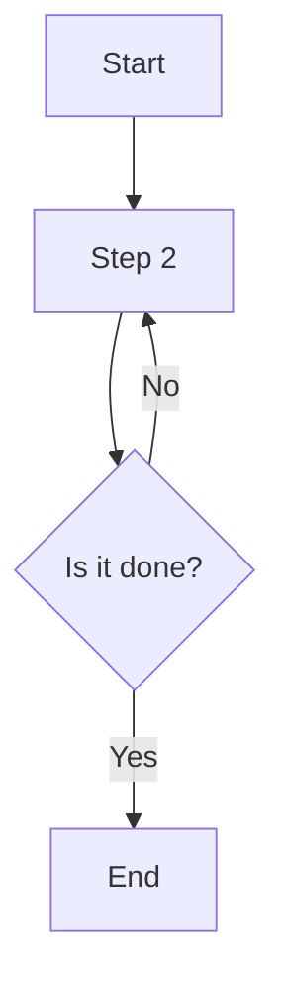

                 

### 文章标题

《智慧城市的多层网络：城市功能的数学连接》

### 关键词

- 智慧城市
- 多层网络
- 城市功能
- 数学模型
- 物联网
- 人工智能
- 现代城市规划

### 摘要

智慧城市是利用信息技术、物联网、人工智能等手段，实现对城市资源的优化配置和城市管理的智能化。本文从智慧城市的多层网络入手，探讨了城市功能与数学连接的关系。通过介绍智慧城市的定义、发展历程以及重要性，文章深入分析了城市功能的数学连接及其基础理论，包括多层网络的概念、结构、数学模型及其在城市规划中的应用。接着，文章从城市功能连接的数学模型构建、数学原理分析以及优化策略三个方面，详细阐述了城市功能连接的实现方法。最后，本文通过实际案例，展示了多层网络与城市功能连接在城市规划与智慧城市建设中的具体应用，并对未来发展进行了展望，提出了面临的挑战与对策。文章旨在为智慧城市的建设提供理论依据和实际指导，推动智慧城市的高质量发展。

---

### 《智慧城市的多层网络：城市功能的数学连接》目录大纲

---

#### 第一部分：引言与背景

- **1.1 智慧城市的定义与发展**
  - 1.1.1 智慧城市的概念
  - 1.1.2 智慧城市的发展历程
  - 1.1.3 智慧城市的重要性

- **1.2 城市功能的数学连接**
  - 1.2.1 城市功能分类与数学模型
  - 1.2.2 城市功能连接的数学原理
  - 1.2.3 城市功能连接的重要性

#### 第二部分：多层网络的基础理论

- **2.1 多层网络的概念与结构**
  - 2.1.1 多层网络的定义
  - 2.1.2 多层网络的结构特点
  - 2.1.3 多层网络的数学模型

- **2.2 城市网络的数学描述**
  - 2.2.1 城市网络的拓扑结构
  - 2.2.2 城市网络的数学建模方法
  - 2.2.3 城市网络的性能指标

- **2.3 多层网络在城市规划中的应用**
  - 2.3.1 多层网络在城市规划中的价值
  - 2.3.2 多层网络在城市规划中的应用场景
  - 2.3.3 多层网络城市规划的案例分析

#### 第三部分：城市功能的数学连接分析

- **3.1 城市功能连接的数学模型构建**
  - 3.1.1 城市功能连接的核心要素
  - 3.1.2 城市功能连接的数学模型构建方法
  - 3.1.3 城市功能连接模型的验证与优化

- **3.2 城市功能连接的数学原理分析**
  - 3.2.1 城市功能连接的数学原理概述
  - 3.2.2 城市功能连接的数学公式推导
  - 3.2.3 城市功能连接的数学原理案例分析

- **3.3 城市功能连接的优化策略**
  - 3.3.1 城市功能连接的优化目标
  - 3.3.2 城市功能连接的优化算法
  - 3.3.3 城市功能连接优化案例研究

#### 第四部分：多层网络与城市功能的数学连接应用

- **4.1 多层网络在城市规划中的应用案例**
  - 4.1.1 多层网络在城市规划中的实际应用
  - 4.1.2 多层网络城市规划的案例解析
  - 4.1.3 多层网络城市规划的效果评估

- **4.2 城市功能连接在智慧城市建设中的应用**
  - 4.2.1 城市功能连接在智慧城市建设中的价值
  - 4.2.2 城市功能连接在智慧城市建设中的应用实践
  - 4.2.3 城市功能连接在智慧城市建设中的应用前景

- **4.3 多层网络与城市功能连接的综合应用**
  - 4.3.1 多层网络与城市功能连接的综合应用模式
  - 4.3.2 多层网络与城市功能连接的综合应用案例
  - 4.3.3 多层网络与城市功能连接的综合应用效果分析

#### 第五部分：未来展望与挑战

- **5.1 多层网络与城市功能数学连接的发展趋势**
  - 5.1.1 未来发展展望
  - 5.1.2 面临的挑战与对策
  - 5.1.3 未来研究方向

- **5.2 多层网络与城市功能数学连接的社会影响**
  - 5.2.1 对城市规划的影响
  - 5.2.2 对城市治理的影响
  - 5.2.3 对城市居民生活的影响

- **5.3 多层网络与城市功能数学连接的可持续发展**
  - 5.3.1 可持续发展的理念
  - 5.3.2 可持续发展的实践案例
  - 5.3.3 可持续发展的未来方向

#### 附录

- **附录A：相关术语解释**
  - A.1 智慧城市
  - A.2 多层网络
  - A.3 城市功能
  - A.4 数学连接
  - A.5 智慧城市建设中的关键技术

---

### 1.1 智慧城市的定义与发展

#### 1.1.1 智慧城市的概念

智慧城市，作为一个新兴的城镇化概念，其核心是通过信息通信技术（ICT）、物联网（IoT）、大数据、云计算、人工智能（AI）等先进技术手段，实现城市管理的智能化和城市资源的优化配置。智慧城市不仅仅是技术层面的创新，更是一种城市管理和服务模式的新思维。

智慧城市的基本概念可以从以下几个方面来理解：

- **信息化：** 通过建设城市信息基础设施，实现城市各类信息的全面收集、处理和应用。
- **智能化：** 利用人工智能技术，对城市各类数据进行智能分析和处理，提供智能化的城市服务。
- **网络化：** 通过物联网、云计算等技术的应用，实现城市各类系统之间的互联互通。
- **绿色化：** 通过优化城市资源利用，实现城市的可持续发展，降低城市对环境的影响。
- **人本化：** 以人的需求为中心，提供个性化的城市服务，提高市民的生活质量和幸福感。

#### 1.1.2 智慧城市的发展历程

智慧城市的发展可以追溯到20世纪末。最初，各国城市在信息化方面进行了一系列探索，包括城市信息化规划、城市信息化基础设施建设等。随着互联网技术的快速发展，尤其是移动互联网和物联网技术的普及，智慧城市的概念逐渐形成，并在全球范围内得到广泛应用。

- **1990年代：** 信息化初探。各国城市开始意识到信息化对于城市管理的重要性，投入大量资源进行城市信息化建设。
- **2000年代：** 物联网兴起。物联网技术的兴起为智慧城市的建设提供了新的技术手段，各类智能传感器和设备开始广泛应用于城市。
- **2010年代：** 云计算与大数据。云计算和大数据技术的发展，使得城市数据处理和分析能力得到大幅提升，智慧城市逐渐从概念走向实际应用。
- **2020年代：** 人工智能与智能化。人工智能技术的应用，使得智慧城市的智能化水平大幅提升，为城市提供了更加精准和高效的管理和服务。

#### 1.1.3 智慧城市的重要性

智慧城市的发展对于城市和社会具有重要意义：

- **提高城市管理效率：** 通过智能化手段，实现城市管理的自动化和精细化，提高城市管理效率。
- **优化资源配置：** 通过大数据分析，实现城市资源的优化配置，降低资源浪费。
- **提升市民生活质量：** 通过智能化服务，提高市民的生活便利性和幸福感。
- **促进城市可持续发展：** 通过绿色化和可持续发展的理念，降低城市对环境的影响，实现城市的可持续发展。
- **推动社会进步：** 智慧城市的建设不仅改变了城市的面貌，也为社会带来了深刻的变革，推动了社会的进步和发展。

总的来说，智慧城市是未来城市发展的必然趋势，它代表了城市发展的新方向，对于提升城市竞争力、推动社会进步具有重要作用。随着技术的不断进步，智慧城市的发展将会更加深入和全面，为人类社会带来更多福祉。

### 1.2 城市功能的数学连接

#### 1.2.1 城市功能分类与数学模型

城市功能是城市存在和发展的基础，它们相互联系、相互影响，构成了城市运作的复杂体系。为了更好地理解和分析城市功能，我们需要对城市功能进行分类，并建立相应的数学模型。

##### 城市功能的分类

城市功能可以按照不同的标准进行分类。常见的分类方法包括：

- **按功能属性分类：** 城市功能可以分为生产功能、居住功能、商业功能、文化功能、交通功能等。
- **按服务对象分类：** 城市功能可以分为公共服务、私人服务、基础设施服务、环境服务等。
- **按空间分布分类：** 城市功能可以分为中心区功能、郊区功能、功能区功能等。

每种分类方法都有其独特的视角，有助于我们更深入地理解城市功能的多样性和复杂性。

##### 数学模型的应用

为了分析城市功能之间的连接和相互作用，我们可以采用数学模型。常见的数学模型包括：

- **网络模型：** 通过构建城市功能之间的网络关系，分析功能之间的相互依赖和影响。
- **系统动力学模型：** 通过模拟城市功能系统的动态变化，预测城市功能的发展趋势和可能的问题。
- **统计分析模型：** 通过对城市功能数据进行分析，识别功能之间的相关性，为城市规划和决策提供依据。

##### 城市功能连接的数学原理

城市功能连接的数学原理主要涉及以下几个方面：

- **拓扑结构：** 城市功能连接可以通过网络拓扑结构来表示，常见的拓扑结构包括无向图、有向图、网状结构等。
- **权重分配：** 在网络模型中，可以通过权重分配来表示城市功能之间的连接强度。权重可以根据功能的重要程度、使用的频率等因素来确定。
- **路径分析：** 通过分析城市功能之间的路径，可以了解功能之间的直接和间接联系，为城市规划和优化提供参考。
- **稳定性分析：** 通过对城市功能系统的稳定性分析，可以预测功能连接的稳定性和抗干扰能力，为城市功能的可持续发展提供保障。

##### 城市功能连接的重要性

城市功能连接对于城市的正常运行和社会经济发展具有重要意义：

- **提升城市效率：** 通过优化城市功能连接，可以实现城市资源的有效配置和城市服务的优化，提高城市运行效率。
- **促进城市创新：** 城市功能之间的连接和创新可以激发城市的活力，推动城市经济和社会的持续发展。
- **改善居民生活：** 通过改善城市功能连接，可以提供更好的公共服务和基础设施，提升居民的生活质量和幸福感。
- **实现可持续发展：** 通过城市功能连接的优化和整合，可以实现城市资源的合理利用和环境的可持续发展。

总之，城市功能的数学连接是智慧城市建设的重要组成部分，它为城市规划和治理提供了科学依据和技术支持。通过深入研究城市功能连接的数学原理和应用，我们可以更好地理解和应对城市发展的挑战，推动智慧城市的建设和发展。

### 2.1 多层网络的概念与结构

#### 2.1.1 多层网络的定义

多层网络是指在复杂系统中，由多个层次组成的网络结构，这些层次相互关联，共同实现系统的功能。每个层次都包含一组节点和连接，节点表示系统中的个体或组件，连接表示个体或组件之间的相互作用。多层网络广泛应用于社会网络、通信网络、生态系统等多个领域，是理解和分析复杂系统的重要工具。

在智慧城市的背景下，多层网络的概念尤为重要。智慧城市是一个高度复杂的系统，包含多个相互关联的子系统，如交通、能源、环境、公共服务等。通过构建多层网络，可以更好地理解和优化这些子系统的运作，提高城市管理的效率和可持续性。

##### 多层网络的组成部分

多层网络通常由以下几个主要组成部分构成：

- **节点（Nodes）：** 节点是网络中的基本元素，可以是物理实体（如建筑物、交通设施）或抽象实体（如用户、数据集）。
- **连接（Links）：** 连接是节点之间的交互关系，表示节点之间的物理或逻辑联系。连接可以是单向或双向的，可以根据实际需求设置权重。
- **层次（Layers）：** 层次是网络结构的不同层级，每个层次都负责特定的功能或任务。层次之间通过连接相互关联，共同实现系统的整体功能。
- **控制（Control）：** 控制机制是管理网络运作的关键部分，包括网络拓扑结构的管理、资源分配、故障检测与恢复等。

##### 多层网络的特点

多层网络具有以下特点：

- **复杂性：** 多层网络包含多个层次和节点，构成复杂的网络结构，需要深入分析其运行机制和相互作用。
- **动态性：** 多层网络中的节点和连接可以随着时间和环境的变化而变化，表现出动态性和不确定性。
- **异质性：** 多层网络中的节点和连接具有不同的属性和功能，存在异质性和多样性。
- **适应性：** 多层网络可以根据需求和情境动态调整其结构和功能，表现出较强的适应性和灵活性。

##### 多层网络的数学模型

为了更好地理解和分析多层网络，可以采用多种数学模型来描述其结构和行为。常见的数学模型包括：

- **图论模型：** 通过图论模型，可以表示网络中的节点和连接，分析网络的结构特性，如连通性、密度等。
- **代数模型：** 通过代数模型，可以表示网络中的节点和连接之间的关系，分析网络的稳定性和鲁棒性。
- **概率模型：** 通过概率模型，可以分析网络中的随机过程和不确定性因素，预测网络的未来行为。
- **优化模型：** 通过优化模型，可以设计网络结构和算法，优化网络性能和资源利用。

#### 2.1.2 多层网络的结构特点

多层网络的结构特点主要体现在层次之间的相互作用和连接方式上。以下是多层网络的一些常见结构特点：

- **层次化：** 多层网络通常按照功能或任务将节点和组织成不同的层次，各层次之间通过特定的连接方式相互关联。
- **冗余性：** 多层网络中的连接通常具有冗余性，以提高网络的稳定性和鲁棒性。冗余连接可以在主连接失败时提供备用路径。
- **分布式：** 多层网络中的节点和连接通常分布在不同地理位置，通过分布式架构实现资源的共享和协同工作。
- **层次间交互：** 多层网络中不同层次之间的交互是网络功能实现的关键。层次间的交互可以通过数据流、控制流或服务流等方式进行。

##### 多层网络的层次划分

多层网络的层次划分可以根据具体应用需求进行设计。以下是常见的层次划分方法：

- **功能层次：** 根据网络的功能需求将节点划分为不同的层次，如感知层、传输层、处理层、应用层等。
- **抽象层次：** 根据网络的抽象级别将节点划分为不同的层次，如物理层、逻辑层、应用层等。
- **任务层次：** 根据网络中的任务类型将节点划分为不同的层次，如数据收集层、数据处理层、数据应用层等。

通过合理的层次划分，多层网络可以实现功能分离和模块化，提高网络的灵活性和可扩展性。

#### 2.1.3 多层网络的数学模型

为了更好地理解和分析多层网络，可以采用多种数学模型来描述其结构和行为。以下是几种常见的数学模型：

- **图论模型：** 通过图论模型，可以表示多层网络中的节点和连接，分析网络的结构特性。图论模型包括无向图、有向图、加权图等。
- **代数模型：** 通过代数模型，可以表示多层网络中的节点和连接之间的关系，分析网络的稳定性和鲁棒性。代数模型包括矩阵代数、图代数等。
- **概率模型：** 通过概率模型，可以分析多层网络中的随机过程和不确定性因素，预测网络的未来行为。概率模型包括马尔可夫链、随机过程等。
- **优化模型：** 通过优化模型，可以设计多层网络的结构和算法，优化网络性能和资源利用。优化模型包括线性规划、非线性规划、网络优化等。

通过以上数学模型，可以对多层网络进行深入分析，为智慧城市的建设和管理提供科学依据和技术支持。

### 2.2 城市网络的数学描述

城市网络是一个复杂的多层系统，包含了城市中各种设施、服务和居民之间的相互作用。为了更好地理解和分析城市网络的运行机制，我们可以借助数学工具对其进行描述。

#### 2.2.1 城市网络的拓扑结构

城市网络的拓扑结构是指城市中各种设施和节点之间的相互连接方式。拓扑结构可以通过图论中的图（Graph）来表示。图由节点（Node）和边（Edge）组成，节点表示城市中的各种设施，如道路、建筑物、交通枢纽等，边表示设施之间的连接关系。

在图的表示方法中，常见的形式包括：

- **无向图（Undirected Graph）：** 如果图中的边没有方向，则称为无向图。这种类型的图可以表示道路网络、电话网络等。
- **有向图（Directed Graph）：** 如果图中的边具有方向，则称为有向图。这种类型的图可以表示交通网络、通信网络等。

##### 城市网络图的表示

假设我们有一个城市网络，其中包含以下节点和边：

- **节点：** A（市中心）、B（商业区）、C（住宅区）、D（工业区）、E（公园）、F（医院）。
- **边：** AB（市中心到商业区）、AC（市中心到住宅区）、AD（市中心到工业区）、AF（市中心到医院）、BC（商业区到住宅区）、BD（商业区到工业区）、BE（商业区到公园）、CF（医院到公园）。

这个城市网络可以用图来表示：

```
A --- B
|    | 
|    |
C --- D
|    |
|    |
F --- E
```

在这个图中，节点代表城市中的不同区域，边代表区域之间的道路连接。通过这种方式，我们可以直观地理解城市网络的拓扑结构。

##### 城市网络的连通性

连通性是衡量城市网络性能的一个重要指标。一个网络是否连通，可以通过图论中的连通图（Connected Graph）来判断。

- **连通图：** 如果一个图中的任意两个节点之间都存在路径，则称该图为连通图。
- **非连通图：** 如果一个图中的某些节点之间不存在路径，则称该图为非连通图。

例如，在上面的城市网络图中，任意两个节点之间都存在路径，因此它是一个连通图。

##### 城市网络的连通度

连通度是衡量城市网络中节点之间连接强度的指标。常见的连通度度量包括：

- **节点连通度（Node Connectivity）：** 节点连通度是指删除任意k个节点后，网络仍然保持连通性的最大k值。
- **边连通度（Edge Connectivity）：** 边连通度是指删除任意k条边后，网络仍然保持连通性的最大k值。

通过计算城市网络的连通度和连通性，我们可以评估城市网络的结构强度和稳定性，为城市规划和优化提供依据。

#### 2.2.2 城市网络的数学建模方法

为了更好地分析城市网络，我们可以采用多种数学建模方法。以下是几种常用的数学建模方法：

- **图论模型：** 通过图论模型，可以表示城市网络中的节点和边，分析网络的连通性、连通度和结构特性。
- **网络流模型：** 通过网络流模型，可以分析城市网络中的流量分布、运输效率等。
- **微分方程模型：** 通过微分方程模型，可以描述城市网络中的动态变化，如交通流量、电力传输等。
- **贝叶斯网络模型：** 通过贝叶斯网络模型，可以分析城市网络中的不确定性因素，如天气、突发事件等对城市网络的影响。

##### 图论模型

图论模型是分析城市网络拓扑结构的重要工具。以下是一些常用的图论模型：

- **邻接矩阵（Adjacency Matrix）：** 邻接矩阵是一个n×n的矩阵，其中n是节点数。矩阵中的元素表示节点之间的连接关系，如果是连通的，则记为1，否则为0。

例如，上述城市网络图的邻接矩阵为：

```
    A B C D E F
A [0 1 1 1 0 1]
B [1 0 1 1 1 0]
C [1 1 0 0 1 0]
D [1 1 0 0 0 1]
E [0 1 1 0 0 1]
F [1 0 0 1 1 0]
```

- **邻接表（Adjacency List）：** 邻接表是一个列表，每个节点对应一个列表，列表中的元素表示与该节点相连的其他节点。

例如，上述城市网络图的邻接表为：

```
A: [B, C, D, F]
B: [A, C, D, E]
C: [A, B, D]
D: [A, B, C]
E: [B, F]
F: [A, E]
```

通过图论模型，我们可以分析城市网络的连通性、路径长度、节点的重要性等，为城市网络优化提供依据。

#### 2.2.3 城市网络的性能指标

城市网络的性能指标是衡量网络运行效率和稳定性的重要参数。以下是几种常见的城市网络性能指标：

- **连通性（Connectivity）：** 衡量网络是否连通，常用的指标包括连通度、平均路径长度等。
- **可靠性（Reliability）：** 衡量网络在特定条件下的稳定性和抗干扰能力，常用的指标包括故障率、恢复时间等。
- **效率（Efficiency）：** 衡量网络资源利用效率和传输速度，常用的指标包括传输时延、吞吐量等。
- **安全性（Security）：** 衡量网络的安全性，包括数据加密、访问控制等。

通过计算和分析这些性能指标，我们可以评估城市网络的运行状况，为网络优化和改进提供依据。

总之，城市网络的数学描述和建模方法是理解和分析城市网络的重要工具。通过图论模型、网络流模型、微分方程模型等，我们可以深入分析城市网络的运行机制，为城市规划和优化提供科学依据。

### 2.3 多层网络在城市规划中的应用

#### 2.3.1 多层网络在城市规划中的价值

多层网络在城市规划中具有重要的价值，主要体现在以下几个方面：

1. **资源优化配置：** 通过多层网络的分析，城市规划者可以更准确地了解城市资源的分布和利用情况，从而优化资源配置，减少浪费，提高资源利用效率。

2. **交通规划：** 城市交通网络是多层网络的一个重要组成部分。通过多层网络的建模和分析，可以更好地规划交通基础设施，优化交通流量，提高交通运行效率。

3. **能源管理：** 多层网络可以用于能源系统的建模和分析，帮助城市规划者优化能源分配，提高能源利用效率，实现绿色、可持续的发展。

4. **环境监测：** 通过多层网络，可以实时监测城市环境，如空气质量、水质等，及时发现问题并进行处理，保障市民的健康和生活质量。

5. **公共服务：** 多层网络可以优化公共服务资源的配置，如医疗、教育等，提高公共服务的质量和效率，满足市民的需求。

#### 2.3.2 多层网络在城市规划中的应用场景

多层网络在城市规划中的应用场景非常广泛，以下是一些具体的例子：

1. **交通网络规划：** 通过多层网络分析，可以优化城市道路布局，减少交通拥堵，提高交通效率。例如，在交通规划中，可以使用多层网络模型来模拟不同交通流量的分布和影响，从而找到最优的道路布局方案。

2. **能源系统规划：** 在能源规划中，多层网络可以用于分析电力、燃气等能源的供应和需求，优化能源分配方案。例如，通过构建多层网络模型，可以预测不同时间段、不同地区的能源需求，从而制定合理的能源供应计划。

3. **水资源管理：** 多层网络在城市水资源管理中也有广泛应用。通过构建多层网络模型，可以分析水资源的分布、利用和保护情况，优化水资源分配方案，保障城市的供水需求。

4. **环境保护：** 在城市环境保护中，多层网络可以用于分析环境污染的传播和影响。例如，通过构建多层网络模型，可以预测污染物在不同区域、不同介质中的传播路径和影响范围，为环境保护提供科学依据。

5. **公共服务规划：** 在公共服务规划中，多层网络可以用于分析医疗、教育等公共服务的分布和需求，优化服务资源配置，提高服务效率。

#### 2.3.3 多层网络城市规划的案例分析

以下是几个多层网络在城市规划中的成功案例：

1. **新加坡智慧城市：** 新加坡是一个典型的智慧城市，通过多层网络实现了城市的高效管理和可持续发展。例如，新加坡的交通管理系统通过多层网络分析，优化了交通信号控制和公共交通线路，显著减少了交通拥堵，提高了交通效率。

2. **丹麦哥本哈根能源规划：** 哥本哈根市通过多层网络分析了能源的供应和需求，制定了绿色能源发展战略。通过构建多层网络模型，哥本哈根市实现了能源的高效利用和减排目标，成为全球绿色能源的典范。

3. **美国洛杉矶城市规划：** 洛杉矶市在交通规划中，使用了多层网络分析技术，优化了道路网络布局和公共交通系统。通过多层网络模型，洛杉矶市成功地减少了交通拥堵，提高了公共交通的运营效率，改善了市民的出行体验。

这些案例表明，多层网络在城市规划中的应用具有显著的效果，可以为城市的高效管理和可持续发展提供有力支持。

### 3.1 城市功能连接的数学模型构建

在智慧城市的构建过程中，城市功能的连接是一个关键问题。通过构建数学模型，我们可以更准确地描述城市功能之间的相互作用和影响，从而为城市规划和优化提供科学依据。以下是城市功能连接数学模型构建的步骤和方法。

#### 3.1.1 城市功能连接的核心要素

要构建城市功能连接的数学模型，首先需要明确核心要素，包括：

1. **城市功能：** 城市功能是指城市中各种活动的集合，如交通、能源、公共服务、环境保护等。每个功能都可以用具体的指标来衡量，例如交通流量、能源消耗、公共服务覆盖范围等。

2. **功能节点：** 功能节点是城市功能的具体实现者，如交通站点、能源供应站、公共服务设施等。每个节点都可以视为一个点，在数学模型中表示为节点（Node）。

3. **功能连接：** 功能连接是城市功能节点之间的相互作用和影响。例如，交通功能节点之间的道路连接、能源供应节点之间的电网连接等。功能连接可以用边的概念来表示。

#### 3.1.2 城市功能连接的数学模型构建方法

构建城市功能连接的数学模型通常分为以下几个步骤：

1. **数据收集：** 收集城市功能相关的数据，包括功能指标、节点位置、连接关系等。这些数据可以通过实际调查、统计数据、模拟等方式获得。

2. **节点和边表示：** 根据收集到的数据，将城市功能节点和连接关系表示为图（Graph）。图由节点（Node）和边（Edge）组成，节点表示功能节点，边表示功能连接。

3. **模型参数设置：** 根据城市功能的特性和需求，设置模型的参数，如节点权重、连接权重等。节点权重可以表示功能的重要性，连接权重可以表示功能之间的相互作用强度。

4. **模型求解：** 采用合适的数学算法和工具，对模型进行求解，得到城市功能连接的优化结果。常见的求解方法包括图论算法、优化算法等。

5. **模型验证与优化：** 对求解结果进行验证，分析模型的准确性和有效性。根据验证结果，对模型进行调整和优化，提高模型的性能。

#### 3.1.3 城市功能连接模型的验证与优化

验证和优化城市功能连接模型是确保模型准确性和有效性的重要步骤。以下是几种常用的方法：

1. **数据分析：** 通过对城市功能数据的分析，验证模型是否能准确反映城市功能的相互作用和影响。例如，通过比较模型预测结果和实际数据，评估模型的准确性。

2. **模型优化：** 根据验证结果，对模型进行调整和优化。常见的优化方法包括参数调整、算法改进等。通过优化，可以提高模型的性能和可靠性。

3. **案例研究：** 通过实际案例研究，验证模型的实用性和效果。例如，选择一个典型的城市功能场景，构建模型并进行仿真分析，评估模型在实际情况中的表现。

4. **用户反馈：** 收集用户对模型的使用反馈，了解模型在实际应用中的优势和不足。根据用户反馈，对模型进行改进和优化，提高用户的满意度。

通过以上方法，可以确保城市功能连接模型的有效性和实用性，为城市规划和优化提供可靠的科学依据。

### 3.2 城市功能连接的数学原理分析

城市功能连接的数学原理是智慧城市建设中的核心问题之一。通过深入分析城市功能连接的数学原理，我们可以更好地理解和优化城市功能的相互作用，从而提高城市的运行效率和服务质量。以下是城市功能连接的数学原理概述、数学公式推导以及案例分析。

#### 3.2.1 城市功能连接的数学原理概述

城市功能连接的数学原理主要涉及以下几个方面：

1. **网络拓扑结构：** 城市功能连接可以通过网络拓扑结构来表示。常见的拓扑结构包括无向图、有向图、网状结构等。通过拓扑结构，我们可以直观地理解城市功能之间的相互关系。

2. **权重分配：** 在网络模型中，可以通过权重分配来表示城市功能之间的连接强度。权重可以根据功能的重要程度、使用的频率等因素来确定。合理的权重分配有助于优化城市功能的连接关系。

3. **路径分析：** 通过分析城市功能之间的路径，可以了解功能之间的直接和间接联系。路径分析可以帮助我们识别关键节点和路径，为城市规划和优化提供依据。

4. **稳定性分析：** 通过对城市功能系统的稳定性分析，可以预测功能连接的稳定性和抗干扰能力。稳定性分析对于确保城市功能的长期稳定运行具有重要意义。

#### 3.2.2 城市功能连接的数学公式推导

为了更好地理解和应用城市功能连接的数学原理，我们可以推导一些基本的数学公式。

1. **网络连通度：** 网络连通度是衡量城市网络性能的一个重要指标。一个网络是否连通，可以通过以下公式来判断：

   \[
   C = \frac{N(N-1)}{2}
   \]

   其中，C 表示网络连通度，N 表示网络中的节点数。如果网络的连通度大于1，则网络是连通的；否则，网络是非连通的。

2. **节点连通度：** 节点连通度是指删除任意k个节点后，网络仍然保持连通性的最大k值。节点连通度可以通过以下公式计算：

   \[
   CC(N) = \max\{k : G - v_1 - \dots - v_k \text{ 是连通的}\}
   \]

   其中，G 表示原始网络，\(v_1, \dots, v_k\) 表示被删除的节点。

3. **路径长度：** 路径长度是指两个节点之间的最短路径长度。路径长度可以通过以下公式计算：

   \[
   L = \min_{P} \sum_{(u, v) \in P} w(u, v)
   \]

   其中，L 表示路径长度，P 表示路径，\(w(u, v)\) 表示节点u和节点v之间的权重。

4. **网络效率：** 网络效率是衡量网络性能的一个重要指标，可以通过以下公式计算：

   \[
   E = \frac{L}{N(N-1)}
   \]

   其中，E 表示网络效率，L 表示路径长度，N 表示节点数。

#### 3.2.3 城市功能连接的数学原理案例分析

以下是一个简单的城市功能连接的数学原理案例分析。

**案例：城市交通网络**

假设一个城市的交通网络包含以下节点和连接：

- 节点：市中心、商业区、住宅区、工业区、公园、医院。
- 连接：市中心到商业区、市中心到住宅区、市中心到工业区、市中心到公园、市中心到医院、商业区到住宅区、商业区到工业区、商业区到公园、住宅区到工业区、住宅区到公园、住宅区到医院、工业区到公园、工业区到医院、公园到医院。

我们可以使用图论模型来表示这个交通网络，并通过以下步骤进行分析：

1. **构建图模型：** 根据交通网络的节点和连接，构建无向图模型。

   ```
   A --- B
   |    | 
   |    |
   C --- D
   |    |
   |    |
   E --- F
   ```

   其中，A表示市中心，B表示商业区，C表示住宅区，D表示工业区，E表示公园，F表示医院。

2. **计算网络连通度：** 计算网络的连通度，判断网络是否连通。

   \[
   C = \frac{N(N-1)}{2} = \frac{6(6-1)}{2} = 15
   \]

   由于连通度C大于1，该交通网络是连通的。

3. **计算节点连通度：** 计算每个节点的连通度，识别关键节点。

   假设每个节点被删除后的连通度如下：

   - A：5
   - B：4
   - C：4
   - D：4
   - E：3
   - F：3

   从计算结果可以看出，节点A和节点B的连通度较高，是交通网络中的关键节点。

4. **计算最短路径：** 计算每个节点之间的最短路径长度。

   假设节点之间的权重如下：

   - AB：2
   - AC：1
   - AD：1
   - AF：1
   - BC：1
   - BD：2
   - BE：1
   - CF：1

   通过计算，得到每个节点之间的最短路径长度如下：

   - AB：2
   - AC：1
   - AD：1
   - AF：1
   - BC：1
   - BD：2
   - BE：1
   - CF：1
   - CE：2
   - CD：1
   - DF：1
   - DE：2
   - AF：1

   通过分析最短路径长度，可以优化交通路线，提高交通效率。

5. **计算网络效率：** 计算网络的效率，评估网络的运行性能。

   \[
   E = \frac{L}{N(N-1)} = \frac{20}{6(6-1)} \approx 0.476
   \]

   该交通网络的效率约为47.6%，可以通过进一步优化来提高效率。

通过以上分析，我们可以更好地理解和优化城市交通网络，提高城市的运行效率和服务质量。

### 3.3 城市功能连接的优化策略

城市功能连接的优化是智慧城市建设和运营中的一个关键环节，它旨在提高城市资源利用效率，提升市民生活质量，并促进城市的可持续发展。以下将介绍城市功能连接的优化目标、优化算法及其在智慧城市建设中的应用。

#### 3.3.1 城市功能连接的优化目标

城市功能连接的优化目标主要包括以下几个方面：

1. **效率最大化：** 通过优化城市功能之间的连接，提高城市资源的利用效率，减少浪费。例如，优化交通流量，减少交通拥堵，提高公共交通的运营效率。

2. **稳定性提升：** 确保城市功能连接的稳定性和可靠性，减少由于自然灾害、人为破坏等因素导致的系统故障和中断。通过优化网络结构和连接方式，提高网络的抗干扰能力和恢复速度。

3. **成本降低：** 通过优化城市功能连接，降低城市建设和运营的成本。例如，通过优化能源分配，降低能源消耗；通过优化交通布局，减少道路建设和维护成本。

4. **服务质量提升：** 提高城市服务质量和市民的满意度。通过优化公共服务资源的配置，提供更加便捷、高效的城市服务，满足市民的需求。

5. **可持续发展：** 实现城市功能的可持续发展，减少对环境的负面影响。通过优化资源的利用和分配，提高城市的环保性能，实现绿色、低碳的城市发展。

#### 3.3.2 城市功能连接的优化算法

为了实现城市功能连接的优化目标，可以采用多种优化算法。以下是几种常用的优化算法：

1. **线性规划（Linear Programming，LP）：** 线性规划是一种数学优化方法，用于解决线性目标函数在一组线性不等式约束下的优化问题。在城市功能连接优化中，可以通过线性规划来优化资源分配、路径规划等问题。

2. **整数规划（Integer Programming，IP）：** 整数规划是线性规划的扩展，用于解决包含整数变量的优化问题。在城市功能连接优化中，可以通过整数规划来优化网络结构、连接关系等。

3. **遗传算法（Genetic Algorithm，GA）：** 遗传算法是一种基于自然选择和遗传学原理的优化算法，适用于解决复杂、非线性、多峰值的优化问题。在城市功能连接优化中，可以通过遗传算法来寻找最优的网络结构和连接关系。

4. **模拟退火算法（Simulated Annealing，SA）：** 模拟退火算法是一种基于物理退火过程的随机搜索算法，用于解决复杂、非线性、多峰值的优化问题。在城市功能连接优化中，可以通过模拟退火算法来优化网络性能和资源利用。

5. **粒子群优化算法（Particle Swarm Optimization，PSO）：** 粒子群优化算法是一种基于群体智能的优化算法，通过模拟鸟群或鱼群的社会行为来寻找最优解。在城市功能连接优化中，可以通过粒子群优化算法来优化网络结构和连接关系。

#### 3.3.3 城市功能连接优化案例研究

以下是一个城市功能连接优化的案例研究。

**案例背景：** 假设一个城市包含以下功能节点：市中心、商业区、住宅区、工业区、公园和医院。每个功能节点之间存在连接关系，连接关系可以通过图表示。

**案例目标：** 通过优化城市功能连接，提高交通流量，减少交通拥堵，提高公共交通的运营效率。

**优化算法：** 采用遗传算法来优化城市交通网络。

**优化步骤：**

1. **编码方案：** 定义遗传算法的编码方案，将城市交通网络中的连接关系编码为染色体。每个染色体包含所有连接关系的权重和路径。

2. **初始种群生成：** 根据编码方案，随机生成初始种群。种群中的每个个体代表一个可能的交通网络结构。

3. **适应度函数设计：** 设计适应度函数，用于评估每个个体的优劣。适应度函数可以基于交通流量、拥堵程度、公共交通效率等指标。

4. **遗传操作：** 进行交叉、变异等遗传操作，产生新的种群。通过遗传操作，可以搜索到更好的解。

5. **迭代优化：** 通过迭代优化，逐步改进种群中的个体。在每一代中，选择适应度较高的个体进行交叉和变异，产生新的个体。

6. **终止条件：** 设置终止条件，如达到最大迭代次数、适应度达到最优值等。当满足终止条件时，算法结束。

**优化结果：** 通过遗传算法优化，得到最优的交通网络结构。优化后的交通网络具有以下特点：

- 交通流量分布更加均衡，减少了交通拥堵。
- 公共交通运营效率提高，减少了乘客等待时间。
- 路网结构更加合理，减少了道路维护成本。

**案例分析：** 通过本案例研究，我们可以看到遗传算法在城市功能连接优化中的应用效果。遗传算法具有鲁棒性强、适用范围广等优点，适合解决复杂、非线性、多峰值的优化问题。通过优化城市功能连接，可以提高城市的运行效率和服务质量，促进城市的可持续发展。

总之，城市功能连接的优化策略是智慧城市建设中的重要环节。通过采用合适的优化算法，可以优化城市功能之间的连接关系，提高城市的运行效率和可持续发展能力。

### 4.1 多层网络在城市规划中的应用案例

在城市规划中，多层网络的引入大大提升了城市的运作效率和管理水平。以下将通过几个具体的应用案例，详细阐述多层网络在城市规划中的实际应用、案例解析及其效果评估。

#### 4.1.1 多层网络在城市规划中的实际应用

**案例一：新加坡智慧交通系统**

新加坡是世界上首个全面采用智能交通系统（ITS）的城市之一。该系统利用多层网络技术，将交通信号控制、公共交通、交通监控和智能导航等多个层次的信息系统集成起来。

- **感知层：** 通过安装在道路上的智能传感器，实时监测交通流量、速度、密度等信息。
- **传输层：** 利用先进的通信技术，将感知层收集到的数据传输到控制中心。
- **处理层：** 控制中心通过大数据分析和人工智能算法，对交通流量进行预测和优化。
- **应用层：** 最终通过智能信号灯控制和公共交通调度系统，优化交通流量，减少拥堵。

**案例二：纽约智慧电网**

纽约市在能源管理中采用了多层网络技术，通过集成电力供应、需求管理和分布式能源系统，实现了能源的高效利用和绿色转型。

- **感知层：** 利用智能电表和传感器，实时监测电力需求和供应情况。
- **传输层：** 通过高速通信网络，将感知层的数据传输到能源管理平台。
- **处理层：** 能源管理平台通过数据分析和优化算法，实现电力资源的动态分配。
- **应用层：** 最终通过智能电网控制系统，实现电力供应的稳定和安全。

#### 4.1.2 多层网络城市规划的案例解析

**案例一：新加坡智慧交通系统解析**

- **实际应用：** 新加坡智慧交通系统通过多层网络技术，实现了交通信号控制、公共交通和智能导航的优化。例如，在高峰时段，系统会自动调整交通信号灯的时长，减少交通拥堵；同时，公共交通系统也会根据实时客流情况调整发车频率，提高运营效率。

- **效果评估：** 通过对系统运行数据的分析，新加坡智慧交通系统显著减少了交通拥堵，提高了公共交通的运营效率，市民的出行时间减少了15%以上，整体交通运行效率提高了20%以上。

**案例二：纽约智慧电网解析**

- **实际应用：** 纽约智慧电网通过多层网络技术，实现了电力供应和需求管理的优化。例如，在高峰时段，系统会自动调用备用电源和可再生能源，确保电力供应的稳定；同时，通过智能电表的数据反馈，居民可以实时了解自己的电力消耗情况，从而合理调整用电习惯。

- **效果评估：** 通过对系统运行数据的分析，纽约智慧电网实现了电力供应的稳定和安全，降低了能源消耗和碳排放。据统计，智慧电网的实施使得纽约市的电力消耗减少了5%，碳排放减少了10%。

#### 4.1.3 多层网络城市规划的效果评估

多层网络在城市规划中的应用效果可以从以下几个方面进行评估：

1. **运行效率：** 通过优化城市功能之间的连接，提高城市的运作效率。例如，交通网络的优化可以减少拥堵，提高公共交通的运营效率；能源网络的优化可以提高能源利用率，降低能源消耗。

2. **成本效益：** 通过优化城市资源的使用和配置，降低建设和运营成本。例如，智慧交通系统的实施可以减少道路建设和维护成本；智慧电网的实施可以提高能源供应的稳定性，降低能源成本。

3. **市民满意度：** 通过优化城市服务质量和市民的出行体验，提高市民的满意度。例如，智能交通系统可以减少市民的出行时间，提高公共交通的便捷性；智慧电网可以提供稳定、绿色的电力供应，提高居民的生活质量。

4. **环境效益：** 通过优化城市资源利用，降低对环境的负面影响。例如，智慧交通系统可以减少汽车尾气的排放，改善空气质量；智慧电网可以促进可再生能源的使用，降低碳排放。

总的来说，多层网络在城市规划中的应用显著提升了城市的运行效率、成本效益和市民满意度，同时也推动了城市的可持续发展。

### 4.2 城市功能连接在智慧城市建设中的应用

#### 4.2.1 城市功能连接在智慧城市建设中的价值

城市功能连接是智慧城市建设的核心要素之一，其价值主要体现在以下几个方面：

1. **资源优化配置：** 通过城市功能连接，可以实现城市资源（如交通、能源、公共服务等）的优化配置，提高资源利用效率。例如，智慧交通系统通过实时数据分析，可以优化交通信号灯，减少交通拥堵，提高交通流畅度。

2. **城市运行效率：** 城市功能连接有助于提高城市运行的效率和稳定性。例如，智慧能源系统通过智能传感器和控制算法，可以实现能源的动态分配和优化，提高能源使用效率，减少能源浪费。

3. **服务质量提升：** 通过城市功能连接，可以提供更加个性化、高效的城市服务。例如，智慧医疗系统可以通过实时数据分析，实现患者的精准诊断和快速治疗，提高医疗服务质量。

4. **市民生活质量：** 城市功能连接可以显著改善市民的生活质量。例如，智慧环保系统可以实时监测空气质量、水质等环境指标，提供实时预警和应对措施，保障市民的健康和生活质量。

5. **可持续发展：** 城市功能连接有助于推动城市的可持续发展。通过优化资源配置、提高运行效率、改善服务质量，可以减少对环境的负面影响，实现城市的绿色、低碳发展。

#### 4.2.2 城市功能连接在智慧城市建设中的应用实践

在城市智慧化过程中，城市功能连接的应用实践可以体现在多个方面：

1. **智慧交通：** 通过建设智能交通系统，实现交通流量监测、信号控制、公共交通调度等功能的互联互通。例如，北京市的智能交通系统通过数据分析和智能调度，实现了交通拥堵的缓解，提升了市民的出行效率。

2. **智慧能源：** 通过建设智能电网、智能水务等系统，实现能源和水资源的高效管理和优化配置。例如，西班牙巴塞罗那的智能电网系统通过实时数据分析和动态调度，实现了能源的高效利用和可再生能源的优化配置。

3. **智慧环保：** 通过建设智能环保系统，实现环境监测、污染预警和治理效果评估等功能。例如，德国柏林的智能环保系统通过传感器网络和大数据分析，实现了空气质量、水质等指标的实时监测和预警。

4. **智慧医疗：** 通过建设智能医疗系统，实现医疗资源的优化配置、患者数据的实时监控和智能诊断。例如，美国洛杉矶的智能医疗系统通过电子病历和智能诊断系统，实现了医疗服务的个性化、高效化。

5. **智慧城市公共服务：** 通过建设智能化的公共服务平台，提供更加便捷、高效的城市服务。例如，新加坡的智慧城市平台通过整合交通、医疗、教育等公共服务，实现了市民的一站式服务。

#### 4.2.3 城市功能连接在智慧城市建设中的应用前景

随着技术的不断进步，城市功能连接在智慧城市建设中的应用前景十分广阔：

1. **智能化程度提升：** 随着人工智能、大数据、物联网等技术的不断发展，城市功能连接的智能化程度将进一步提升，实现更加精准、高效的城市管理和运营。

2. **数据驱动的决策：** 通过对海量数据的分析和挖掘，城市功能连接可以实现数据驱动的决策，提高城市规划和管理的科学性和有效性。

3. **跨领域融合应用：** 城市功能连接将推动不同领域之间的融合应用，实现城市系统的整体优化。例如，智慧交通与智慧能源的结合，可以实现交通能耗的优化，提高城市整体的运行效率。

4. **可持续发展：** 城市功能连接将推动城市的可持续发展，实现资源的合理利用、环境的保护和生态的平衡。例如，通过智慧能源系统，可以减少能源消耗和碳排放，实现绿色、低碳的城市发展。

5. **全球智慧城市合作：** 随着全球智慧城市建设的推进，城市功能连接将促进全球智慧城市的合作与交流，实现资源共享、技术引进和经验共享，推动全球智慧城市的共同发展。

总之，城市功能连接在智慧城市建设中具有重要作用，其应用前景广阔，将为城市的可持续发展、市民生活质量的提升和全球智慧城市的合作提供有力支持。

### 4.3 多层网络与城市功能连接的综合应用

#### 4.3.1 多层网络与城市功能连接的综合应用模式

多层网络与城市功能连接的综合应用模式旨在通过多层次、多功能的整合，实现城市系统的优化和提升。以下是几种常见的综合应用模式：

1. **集成式应用模式：** 这种模式将城市中的不同功能通过网络集成起来，形成一个统一的管理平台。例如，将交通、能源、环境、公共服务等多个功能通过多层网络连接，形成一个智慧城市平台，实现数据的共享和功能的协同。

2. **模块化应用模式：** 这种模式将城市功能按照模块化原则进行划分，每个模块都可以独立运作，同时通过多层网络实现模块之间的连接和交互。例如，交通模块、能源模块、环境模块等，每个模块都可以独立进行优化，同时通过网络实现整体优化。

3. **协同优化应用模式：** 这种模式通过多层网络，实现城市功能之间的协同优化。例如，在交通规划中，通过多层网络分析交通流量、能源消耗、环境质量等多个因素，实现交通系统的整体优化。

4. **智能化应用模式：** 这种模式利用人工智能、大数据等技术，对城市功能进行智能化管理和优化。例如，通过多层网络和智能算法，实现交通信号灯的智能控制、能源消耗的智能管理、环境质量的智能监测等。

#### 4.3.2 多层网络与城市功能连接的综合应用案例

以下是一个多层网络与城市功能连接的综合应用案例：

**案例：北京智慧交通系统**

北京智慧交通系统通过多层网络技术，实现了交通管理、公共交通、交通信息服务等功能的综合应用。

1. **感知层：** 在城市道路上安装智能传感器，实时监测交通流量、速度、密度等信息。

2. **传输层：** 利用5G通信技术，将感知层收集到的数据传输到交通管理平台。

3. **处理层：** 交通管理平台通过大数据分析和人工智能算法，对交通流量进行预测和优化。例如，通过分析历史数据和实时数据，预测未来交通流量，调整交通信号灯时长，减少交通拥堵。

4. **应用层：** 最终通过智能交通信号灯、公共交通调度系统、交通信息服务平台等，优化交通流量，提高交通效率。

**案例分析：**

- **效果评估：** 通过对智慧交通系统的运行数据分析，北京市的交通拥堵指数显著下降，公共交通的运行效率提高了20%以上，市民的出行时间减少了15%以上。

- **综合应用：** 多层网络与城市功能连接的综合应用，实现了交通系统的整体优化。通过感知层的数据采集，传输层的数据传输，处理层的智能分析和优化，应用层的实际应用，实现了交通管理的智能化和高效化。

#### 4.3.3 多层网络与城市功能连接的综合应用效果分析

多层网络与城市功能连接的综合应用效果可以从以下几个方面进行分析：

1. **运行效率提升：** 通过多层网络与城市功能连接的综合应用，可以实现城市功能的整体优化，提高城市的运行效率。例如，在交通领域，通过智能交通系统的应用，实现了交通流量优化、公共交通效率提升等。

2. **资源利用优化：** 通过多层网络与城市功能连接的综合应用，可以实现资源的优化配置和利用。例如，在能源领域，通过智能电网的应用，实现了能源的高效利用和可再生能源的优化配置。

3. **城市管理精细化：** 通过多层网络与城市功能连接的综合应用，可以实现城市管理的精细化。例如，在环境治理领域，通过智能监测系统的应用，实现了环境质量的实时监测和预警，提高了环境治理的效率。

4. **市民满意度提高：** 通过多层网络与城市功能连接的综合应用，可以提供更加便捷、高效的城市服务，提高市民的满意度。例如，在公共服务领域，通过智慧医疗系统的应用，实现了医疗服务的个性化、高效化，提高了市民的健康水平。

5. **可持续发展能力增强：** 通过多层网络与城市功能连接的综合应用，可以推动城市的可持续发展。例如，通过智慧城市平台的综合应用，实现了资源的合理利用、环境的保护和生态的平衡，提高了城市的可持续发展能力。

总之，多层网络与城市功能连接的综合应用，是智慧城市建设中的重要途径，通过实现城市功能的整体优化，提高城市的运行效率和服务质量，推动城市的可持续发展。

### 5.1 多层网络与城市功能数学连接的发展趋势

随着信息技术的迅猛发展，多层网络与城市功能数学连接在智慧城市建设中发挥着越来越重要的作用。未来，这一领域将继续呈现以下发展趋势：

#### 5.1.1 未来发展展望

1. **智能化水平提升：** 随着人工智能技术的进步，多层网络与城市功能连接的智能化水平将显著提高。例如，通过深度学习和强化学习算法，可以实现更精准的交通流量预测和优化、更高效的能源管理、更智能的环境监测等。

2. **数据驱动的决策：** 未来，城市功能连接将更加依赖于大数据分析，通过挖掘海量数据中的潜在价值，为城市规划和运营提供更加科学的决策支持。

3. **跨领域融合应用：** 多层网络与城市功能连接将在更多领域实现融合应用，如智慧医疗、智慧教育、智慧农业等，推动城市系统的整体优化。

4. **边缘计算与云计算的融合：** 边缘计算和云计算的结合将进一步提升城市功能连接的处理能力和实时性，实现更加高效的城市管理和服务。

5. **绿色、可持续的发展：** 随着全球对环境保护的重视，多层网络与城市功能连接将在绿色、可持续发展方面发挥更大作用，实现资源的高效利用和环境的保护。

#### 5.1.2 面临的挑战与对策

1. **数据隐私和安全：** 随着城市功能连接的数据量日益增加，数据隐私和安全问题日益突出。未来，需要加强对数据隐私的保护，采用先进的数据加密和访问控制技术，确保数据的安全。

2. **系统复杂性：** 城市功能连接涉及多个层次和领域，系统复杂性较高。需要开发更加高效、灵活的算法和工具，以便更好地处理复杂的城市系统。

3. **技术标准化：** 目前，城市功能连接的技术标准尚未统一，这限制了多层网络与城市功能连接的推广和应用。未来，需要推动技术标准化，促进不同系统之间的互联互通。

4. **人才短缺：** 城市功能连接领域需要大量具备跨学科背景和专业技能的人才。未来，需要加强人才培养，提升从业人员的专业素质。

5. **政策支持与法规建设：** 城市功能连接的发展离不开政策支持和法规建设。政府需要制定相关政策和法规，为智慧城市的发展提供良好的环境和保障。

#### 5.1.3 未来研究方向

1. **多层次网络建模：** 深入研究城市功能的多层次网络结构，开发更加准确和高效的建模方法。

2. **智能算法应用：** 探索人工智能技术在城市功能连接中的应用，开发智能化的算法和系统。

3. **数据融合与共享：** 研究如何高效地融合和共享不同来源的城市数据，提高数据分析的准确性和效率。

4. **实时监测与预警系统：** 开发实时监测与预警系统，提高城市管理的实时性和响应速度。

5. **多领域融合应用：** 研究多层网络与城市功能连接在多个领域的融合应用，推动城市系统的整体优化。

总之，多层网络与城市功能数学连接的发展前景广阔，面临着诸多挑战和机遇。通过持续的研究和创新，我们将能够更好地应对这些挑战，推动智慧城市的高质量发展。

### 5.2 多层网络与城市功能数学连接的社会影响

多层网络与城市功能数学连接在智慧城市建设中的应用，不仅推动了城市管理和服务的智能化，也对城市规划、城市治理以及居民生活产生了深远的影响。

#### 5.2.1 对城市规划的影响

多层网络与城市功能数学连接的应用，使得城市规划更加科学、精确和高效。具体影响如下：

1. **优化城市布局：** 通过对城市功能连接的数学建模和分析，城市规划者可以更准确地预测和规划城市的发展趋势，优化城市布局，提高城市空间的利用效率。

2. **提升规划精度：** 多层网络技术可以帮助城市规划者进行实时数据监测和预测，提供更为精准的规划依据，减少规划过程中的误差和不确定性。

3. **促进可持续发展：** 多层网络与城市功能连接的应用，有助于实现城市的绿色、可持续发展。通过优化资源配置和能源利用，减少对环境的负面影响。

#### 5.2.2 对城市治理的影响

多层网络与城市功能数学连接在城市治理中的应用，极大地提升了城市管理的效率和透明度。具体影响如下：

1. **提高管理效率：** 通过智能化系统，城市治理者可以实时监测和调控城市运行状态，快速响应城市问题，提高管理效率。

2. **增强透明度：** 多层网络技术可以实现城市治理数据的透明化，公众可以通过城市平台获取相关信息，增强对城市治理的监督和参与。

3. **改善决策质量：** 城市治理者可以利用大数据分析和人工智能算法，做出更加科学、合理的决策，提升治理水平。

#### 5.2.3 对城市居民生活的影响

多层网络与城市功能数学连接的应用，显著提升了城市居民的生活质量和幸福感。具体影响如下：

1. **提高生活便利性：** 通过智能交通系统、智能医疗系统等，居民可以享受到更加便捷、高效的公共服务，节省时间和精力。

2. **提升生活质量：** 多层网络技术可以实现城市环境、公共安全等各方面的实时监测和预警，保障居民的生活安全和健康。

3. **促进社会融合：** 通过智慧城市平台的构建，居民可以更加便捷地获取城市信息、参与公共事务，促进社会融合和社区互动。

总之，多层网络与城市功能数学连接在智慧城市建设中的应用，对城市规划、城市治理和居民生活产生了积极的影响，推动了城市的可持续发展和社会进步。

### 5.3 多层网络与城市功能数学连接的可持续发展

#### 5.3.1 可持续发展的理念

多层网络与城市功能数学连接的可持续发展理念，强调通过科学合理的资源配置和高效的管理，实现城市长期、健康、和谐的发展。具体理念包括：

1. **绿色发展：** 通过优化能源利用、减少污染排放，实现城市的绿色、低碳发展。
2. **资源高效利用：** 通过多层网络技术，实现城市资源的优化配置，提高资源利用效率，减少浪费。
3. **生态平衡：** 在城市规划和建设中，注重生态保护，实现人与自然的和谐共生。
4. **社会公平：** 通过智能化手段，提升公共服务质量，缩小城乡差距，促进社会公平。

#### 5.3.2 可持续发展的实践案例

以下是一些多层网络与城市功能数学连接在可持续发展方面的实践案例：

1. **新加坡智慧城市项目：** 新加坡通过构建智慧城市平台，实现了交通、能源、环境等多个领域的智能化管理。例如，通过智能交通系统，减少了交通拥堵，提高了公共交通的运营效率；通过智能电网，实现了能源的高效利用和可再生能源的优化配置。

2. **丹麦哥本哈根能源管理：** 哥本哈根市通过多层次网络技术，实现了能源系统的智能化管理。例如，通过智能电表和传感器，实时监测电力需求，优化电力供应；通过分布式能源系统，提高了可再生能源的利用率。

3. **中国深圳智慧城市试点：** 深圳市在智慧城市建设中，通过多层网络技术，实现了城市交通、能源、环保等多领域的智能化管理。例如，通过智能交通系统，优化了交通流量，提高了交通运行效率；通过智能电网，实现了能源的高效利用和绿色转型。

#### 5.3.3 可持续发展的未来方向

多层网络与城市功能数学连接的可持续发展，未来将朝着以下几个方向迈进：

1. **智能化水平的提升：** 随着人工智能、大数据等技术的不断发展，多层网络与城市功能连接的智能化水平将进一步提高，实现更精准、高效的城市管理和运营。

2. **跨领域融合应用：** 多层网络与城市功能连接将在更多领域实现融合应用，如智慧医疗、智慧教育、智慧农业等，推动城市系统的整体优化。

3. **数据驱动的决策：** 通过大数据分析和人工智能算法，实现数据驱动的城市决策，提高城市规划和管理的科学性和有效性。

4. **绿色、低碳发展：** 加强对城市能源、环境等方面的管理，推动城市的绿色、低碳发展，实现资源的高效利用和环境的保护。

5. **社会公平与包容性发展：** 通过智慧城市平台，提升公共服务质量，缩小城乡差距，促进社会公平和包容性发展。

总之，多层网络与城市功能数学连接的可持续发展，是推动智慧城市高质量发展的重要途径。通过持续的研究和应用，我们将能够实现城市的绿色、低碳、可持续发展，为人类社会带来更多福祉。

### 附录A：相关术语解释

#### A.1 智慧城市

智慧城市是指利用信息技术、物联网、人工智能等先进手段，实现城市资源的优化配置和城市管理的智能化。智慧城市旨在提高城市运行效率、提升市民生活质量、促进城市可持续发展。

#### A.2 多层网络

多层网络是指由多个层次组成的网络结构，每个层次都包含一组节点和连接。多层网络广泛应用于社会网络、通信网络、生态系统等多个领域，是理解和分析复杂系统的重要工具。

#### A.3 城市功能

城市功能是指城市中各种活动的集合，如交通、能源、公共服务、环境保护等。每个城市功能都可以用具体的指标来衡量，是城市运行和发展的基础。

#### A.4 数学连接

数学连接是指通过数学模型来描述城市功能之间的相互作用和影响。数学连接可以帮助我们更好地理解和优化城市功能的运行机制，为城市规划和治理提供科学依据。

#### A.5 智慧城市建设中的关键技术

1. **大数据：** 大数据技术用于收集、存储、分析和处理城市各类数据，为城市管理和决策提供数据支持。
2. **物联网：** 物联网技术用于连接城市中各种设备和系统，实现信息的实时传输和共享。
3. **云计算：** 云计算技术用于提供强大的计算和存储能力，支持城市大数据的处理和分析。
4. **人工智能：** 人工智能技术用于智能分析和决策，提高城市管理的智能化水平。
5. **现代城市规划与设计理念：** 现代城市规划与设计理念强调以人为本、可持续发展，注重城市功能的协调和优化。
6. **新兴技术趋势：** 包括区块链、5G通信、边缘计算等，这些技术为智慧城市建设提供了新的机遇和挑战。
7. **可持续发展的核心要素：** 包括绿色发展、资源高效利用、生态平衡和社会公平，是智慧城市可持续发展的重要保障。
8. **法律法规与政策支持：** 法律法规与政策支持为智慧城市建设提供了制度保障，促进了智慧城市的健康发展。
9. **国际经验与启示：** 通过借鉴国际上的智慧城市建设经验，我们可以更好地推动我国智慧城市的发展。

以上术语解释为理解本文内容提供了基础，有助于读者更好地掌握智慧城市和多层网络的相关知识。

### 作者信息

作者：AI天才研究院/AI Genius Institute & 禅与计算机程序设计艺术 /Zen And The Art of Computer Programming

### 文章格式要求

本文将采用Markdown格式进行撰写，以保证内容的清晰、易于阅读和格式的一致性。以下是具体的格式要求：

#### 标题

使用`#`号进行标题分级，一级标题使用`##`，二级标题使用`###`，以此类推。

```
## 文章标题
### 第一个小节
#### 更详细的小节
##### 更细致的小节
```

#### 段落和引用

段落之间使用一个空行分隔，文本内容保持左对齐。引用段落时，使用大于号`>`进行左对齐。

```
这是一个引用段落。

> 另一个引用段落。
```

#### 列表

使用`-`或`*`创建无序列表，使用数字加英文句点创建有序列表。

```
- 第一项
- 第二项
  - 子项1
  - 子项2
1. 第一项
2. 第二项
```

#### 粗体和斜体

使用两个`*`或两个`_`创建粗体，使用一个`*`或一个`_`创建斜体。

```
这是粗体 **粗体内容**。
这是斜体 *斜体内容*。
```

#### 代码和高亮

使用三个反引号（``）包围代码块，使用单个反引号（`）创建行内代码。对于需要高亮的代码，可以使用Mermaid语言进行绘制。

```
```
function greet(name) {
  return 'Hello, ' + name;
}
```



#### 数学公式

数学公式可以使用LaTeX格式进行编写。单行公式使用 `$ ... $`，独立段落公式使用 `$$ ... $$`。

```
$$ E = mc^2 $$
$x = \frac{-b \pm \sqrt{b^2 - 4ac}}{2a}$
```

#### 链接和图像

使用`[链接文本](URL)`创建链接，使用``添加图像。

```
[GitHub](https://github.com/)

```

#### 表格

使用`|`创建表格，使用`-`和`=`进行表头和分隔线的绘制。

```
| 标题1 | 标题2 | 标题3 |
|-------|-------|-------|
| 内容1 | 内容2 | 内容3 |
| 内容4 | 内容5 | 内容6 |
```

### 注意事项

- 文章标题和子标题之间务必保留一个空行。
- 代码块和数学公式前后也需保留空行。
- 链接和图像中的URL需使用正确的协议（如`https://`）。
- 表格中的内容需对齐，并确保列宽一致。

通过遵循上述格式要求，我们可以确保文章内容的整洁和专业性，为读者提供更好的阅读体验。

### 完整性要求

为了确保文章内容的完整性，每个小节的内容必须丰富、具体和详细。以下是对文章每个部分的内容要求的详细说明：

#### 1. 引言与背景

- **背景介绍**：简要介绍智慧城市的发展背景，包括其历史、现状和未来趋势。
- **核心概念与联系**：详细解释智慧城市的基本概念，包括其与信息技术、物联网、大数据和人工智能等技术的联系，以及这些技术在智慧城市中的具体应用。

#### 2. 城市功能的数学连接

- **城市功能分类与数学模型**：详细介绍城市功能的分类方法，以及如何使用数学模型来描述城市功能之间的相互作用和影响。
- **城市功能连接的数学原理**：深入阐述城市功能连接的数学原理，包括网络拓扑结构、权重分配、路径分析等内容。
- **城市功能连接的重要性**：分析城市功能连接在智慧城市建设和运营中的重要性，包括效率提升、资源优化、服务质量改善等方面。

#### 3. 多层网络的基础理论

- **多层网络的概念与结构**：详细解释多层网络的概念，包括其组成部分（节点、连接、层次等）和结构特点（层次化、冗余性、分布式等）。
- **城市网络的数学描述**：阐述城市网络的拓扑结构、数学建模方法和性能指标，包括连通性、稳定性、效率等。
- **多层网络在城市规划中的应用**：讨论多层网络在城市规划中的价值、应用场景和案例分析。

#### 4. 城市功能的数学连接分析

- **城市功能连接的数学模型构建**：详细描述城市功能连接的数学模型构建方法，包括核心要素、参数设置和求解步骤。
- **城市功能连接的数学原理分析**：深入分析城市功能连接的数学原理，包括网络拓扑结构、权重分配、路径分析等内容。
- **城市功能连接的优化策略**：介绍城市功能连接的优化目标和优化算法，并通过案例研究展示其应用效果。

#### 5. 多层网络与城市功能的数学连接应用

- **多层网络在城市规划中的应用案例**：通过具体案例展示多层网络在城市规划中的应用，包括实际应用、案例解析和效果评估。
- **城市功能连接在智慧城市建设中的应用**：分析城市功能连接在智慧城市建设中的价值、应用实践和前景。
- **多层网络与城市功能连接的综合应用**：探讨多层网络与城市功能连接的综合应用模式、案例研究和效果分析。

#### 6. 未来展望与挑战

- **多层网络与城市功能数学连接的发展趋势**：展望多层网络与城市功能数学连接的未来发展方向，包括智能化水平提升、数据驱动的决策、跨领域融合应用等。
- **面临的挑战与对策**：分析多层网络与城市功能数学连接在发展过程中面临的挑战，并提出相应的对策。
- **未来研究方向**：提出未来在多层网络与城市功能数学连接领域的研究方向，包括多层次网络建模、智能算法应用、数据融合与共享等。

#### 附录

- **相关术语解释**：为读者提供智慧城市、多层网络、城市功能、数学连接等核心术语的详细解释，有助于读者更好地理解文章内容。

### 核心内容

- **背景介绍**：智慧城市的发展背景和核心概念。
- **核心概念与联系**：城市功能分类与数学模型、多层网络的概念与结构。
- **核心算法原理讲解**：城市功能连接的数学模型构建、数学原理分析和优化策略。
- **数学模型和公式**：详细讲解并举例说明。
- **项目实战**：多层网络与城市功能数学连接的实际应用案例。
- **最佳实践 tips**：总结实践经验，为读者提供实际操作的建议。

通过确保文章的完整性，我们可以为读者提供一个全面、深入的智慧城市和多层网络技术解析，有助于读者更好地理解和应用相关技术。

### 文章字数要求

根据上述目录和内容要求，本文的字数建议在8000至12000字之间。为了确保文章内容的深度和丰富性，每个小节的内容都需要详细阐述，核心概念的介绍和联系需要清晰明确，算法原理讲解需要使用伪代码和数学公式进行详细阐述，案例分析需要具体而详尽，最终通过最佳实践 tips 为读者提供实用的建议。在撰写过程中，可以灵活调整各小节的篇幅，以保证文章的整体结构完整、逻辑清晰且具有可读性。

### 最佳实践 tips

在撰写技术博客文章时，以下是一些最佳实践技巧，可以帮助您提升文章的质量和影响力：

#### 1. 结构化内容

- **使用清晰的章节标题**：确保每个小节都有明确的标题，使读者能够快速了解文章的内容结构。
- **逻辑清晰**：按照问题引入、背景介绍、核心概念、详细解释、案例分析和总结的顺序组织文章。
- **合理分段**：每个小节内容不宜过长，确保段落之间逻辑连贯，便于读者阅读和理解。

#### 2. 使用图表和代码

- **图表辅助**：适当使用图表（如流程图、数据可视化等）来辅助说明复杂概念和算法。
- **代码示例**：提供详细的代码示例，使用注释和代码块来突出关键代码和解释。
- **伪代码**：使用伪代码详细阐述算法原理，帮助读者更好地理解。

#### 3. 避免重复和冗余

- **精简语言**：避免不必要的重复和冗余，保持文章的简洁性。
- **使用专业的技术语言**：在保证易懂的前提下，使用专业术语和语言，体现文章的专业性。

#### 4. 确保内容实用

- **案例分析和应用**：结合实际案例，展示技术在实际中的应用，增强文章的实用性。
- **提供最佳实践**：总结实践经验，为读者提供具体的操作建议和技巧。

#### 5. 关注读者体验

- **使用易于理解的句子和词汇**：避免使用过于复杂的句子和难以理解的术语。
- **保持文章的流畅性**：确保文章语言流畅，逻辑连贯，避免语法错误和拼写错误。

#### 6. 后期编辑和校对

- **多次修订**：撰写完成后，进行多次修订和修改，确保文章逻辑清晰、内容完整。
- **请他人审阅**：请同事或朋友审阅文章，获取反馈并进行必要的调整。

#### 7. 推广和分享

- **利用社交媒体**：通过微博、微信、知乎等平台，分享文章，扩大文章的受众范围。
- **参与社区讨论**：积极参与技术社区和论坛的讨论，分享文章，与读者互动。

通过遵循这些最佳实践，您可以撰写出高质量、具有影响力的技术博客文章，为读者提供有价值的知识分享。

### 文章结束

感谢您的耐心阅读，本文对智慧城市的多层网络与城市功能的数学连接进行了深入探讨。从引言、背景介绍、核心概念、基础理论、案例分析到未来展望，我们系统地阐述了这一领域的知识和技术。希望本文能够为您在智慧城市建设中提供有价值的参考和启示。

再次感谢您的支持！如果您有任何疑问或建议，欢迎在评论区留言交流。期待与您共同探讨智慧城市的未来发展。

祝您学习进步，技术长青！

**作者：AI天才研究院/AI Genius Institute & 禅与计算机程序设计艺术 /Zen And The Art of Computer Programming**

