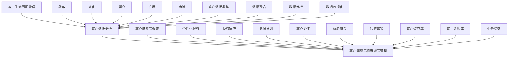
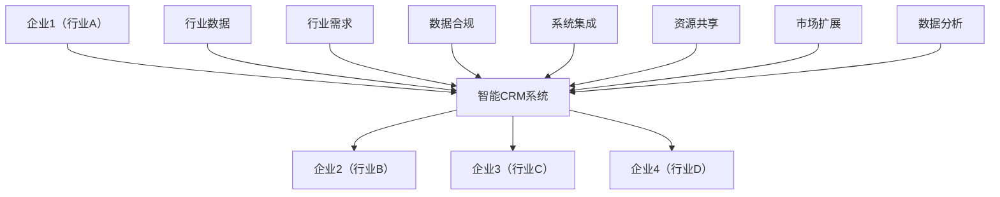

                 

## 引言与背景

### 智能CRM系统的概述

智能CRM（Customer Relationship Management，客户关系管理）系统是一种利用先进的人工智能技术来优化客户关系管理的工具。它通过收集、分析和利用客户数据，帮助企业和组织更好地理解客户需求，提升客户满意度，从而实现业务增长和盈利能力的提升。

智能CRM系统的发展历程可以追溯到20世纪90年代，当时的企业开始意识到客户关系管理的重要性。早期的CRM系统主要是以客户信息管理为核心，帮助企业在销售、营销和服务环节中更好地管理和追踪客户信息。随着互联网和大数据技术的发展，CRM系统逐渐演变为集数据分析、预测、自动化等功能于一体的智能化系统。

### 客户关系管理的重要性

客户关系管理是企业成功的关键因素之一。良好的客户关系管理能够帮助企业在以下方面取得优势：

1. **提高客户满意度**：通过深入了解客户需求和偏好，提供个性化服务和解决方案，从而提高客户满意度。
2. **增强客户忠诚度**：持续维护和深化与客户的互动，增强客户对企业品牌的认知和信任，提高客户忠诚度。
3. **降低客户流失率**：通过有效的客户关系管理，及时发现和解决客户问题，减少客户流失。
4. **提升业务效率和盈利能力**：自动化和智能化的CRM系统能够帮助企业优化业务流程，降低运营成本，提高工作效率，从而提升盈利能力。

### 提示词优化与客户关系管理的联系

提示词优化在智能CRM系统中扮演着至关重要的角色。提示词是指为引导客户行为或提供决策支持而设计的简短文字或语句。在智能CRM系统中，提示词的优化主要体现在以下几个方面：

1. **客户互动引导**：通过设计合适的提示词，可以引导客户参与互动，例如填写调查问卷、参与促销活动等，从而增加客户参与度和活跃度。
2. **个性化服务**：根据客户的历史数据和偏好，智能生成个性化的提示词，提供定制化的服务和推荐，从而提高客户满意度。
3. **提升沟通效果**：优化提示词的表达方式，使其更加简洁明了，有助于提高客户对信息的理解和接受度，提升沟通效果。

本文将围绕智能CRM系统的提示词优化展开，通过深入分析客户关系管理的基本概念、智能CRM系统的架构与设计、提示词优化的策略和方法、核心功能模块的实现与应用、实际业务中的应用场景和案例研究，以及系统的优化与未来发展，全面探讨智能CRM系统如何通过提示词优化来优化客户关系管理，提升企业的竞争力和业务效率。

### 客户关系管理的基本概念

#### 客户生命周期管理

客户生命周期管理（Customer Lifecycle Management，CLM）是客户关系管理的重要组成部分，它关注客户从初次接触企业到最终离店的整个过程。通过系统化地管理客户生命周期，企业能够更好地了解和满足客户需求，从而实现客户价值的最大化。

客户生命周期的各个阶段通常包括：

1. **获取（Acquisition）**：这一阶段的目标是吸引潜在客户，通过各种渠道如广告、促销活动、口碑传播等，增加客户来源和数量。
2. **转化（Conversion）**：在获取客户后，企业需要通过提供高质量的产品或服务来将潜在客户转化为实际客户。这一阶段的关键是优化转化流程，提高转化率。
3. **留存（Retention）**：一旦客户成为实际客户，企业需要采取措施保持客户的长期忠诚。这包括提供优质的售后服务、定期沟通、个性化推荐等。
4. **扩展（Expansion）**：在客户关系稳定后，企业可以通过增加客户的消费频次和消费金额来实现业务扩展。这通常通过客户升级、交叉销售和追加销售来实现。
5. **忠诚（Loyalty）**：通过持续的客户关怀和忠诚计划，企业可以培养客户的忠诚度，降低客户流失率，同时提高客户推荐率。

每个阶段都有其独特的挑战和目标，企业需要根据客户的不同特征和行为来制定相应的策略。例如，在获取阶段，企业可能更注重市场推广和品牌认知；而在留存阶段，则可能需要更多的客户服务和个性化体验。

#### 客户数据分析

客户数据分析（Customer Data Analysis，CDA）是智能CRM系统的核心功能之一。它通过收集、整合和分析客户数据，为企业提供洞见，支持决策制定和业务优化。客户数据分析主要包括以下几个关键方面：

1. **数据收集**：数据收集是客户数据分析的第一步。企业需要从多个渠道收集客户数据，包括网站、社交媒体、销售和客服系统等。这些数据可以是结构化的，如客户基本信息、交易记录等，也可以是非结构化的，如客户评论、社交媒体互动等。

2. **数据整合**：由于客户数据可能分布在不同的系统和渠道中，数据整合显得尤为重要。通过整合数据，企业可以建立全面的客户视图，了解客户的全生命周期行为和需求。

3. **数据分析**：数据分析是客户数据挖掘的核心。企业可以使用各种数据分析技术，如聚类分析、关联规则挖掘、机器学习等，从海量数据中提取有价值的信息。例如，通过分析客户的购买历史和偏好，企业可以识别出潜在的高价值客户，制定精准营销策略。

4. **数据可视化**：数据可视化是将复杂的数据分析结果以图形、图表等形式呈现，使决策者能够直观地理解数据背后的意义。通过数据可视化，企业可以快速识别趋势、问题和机会。

5. **数据应用**：数据应用的目的是将分析结果转化为实际的业务行动。例如，基于客户数据分析，企业可以优化库存管理、调整产品策略、改进营销活动等。

#### 客户满意度和忠诚度管理

客户满意度和忠诚度管理（Customer Satisfaction and Loyalty Management，CSLM）是企业通过一系列措施提高客户满意度和忠诚度的过程。良好的客户满意度和忠诚度不仅能够提高客户留存率，还能通过口碑营销吸引新客户。

1. **客户满意度**：客户满意度是指客户对产品或服务满意的程度。它可以通过以下方式进行管理：

   - **调查反馈**：定期进行客户满意度调查，收集客户的反馈和建议，了解客户的真实感受。
   - **个性化服务**：根据客户的数据和偏好，提供定制化的服务和体验，提高客户的满意度。
   - **快速响应**：对于客户的投诉和问题，快速响应和解决，确保客户的问题能够得到及时解决。

2. **客户忠诚度**：客户忠诚度是指客户对企业品牌和服务的长期依赖和忠诚。管理客户忠诚度包括：

   - **忠诚计划**：设计忠诚度计划，如积分系统、会员制度等，鼓励客户持续消费和参与企业活动。
   - **客户关怀**：定期与客户保持沟通，提供优质的客户服务，增强客户对企业品牌的认同感。
   - **体验营销**：通过独特的体验营销活动，如VIP活动、定制化体验等，提高客户的忠诚度。

   - **情感营销**：情感营销关注于建立客户与品牌之间的情感联系，通过故事、情感共鸣等手段，增强客户对品牌的忠诚度。

客户满意度和忠诚度管理不仅仅是营销部门的职责，它涉及到企业内部的多个部门和环节，需要全员的共同努力。通过系统化的客户满意度和忠诚度管理，企业能够实现长期稳定的发展，提高市场竞争力。

### 客户关系管理的基本概念与联系

客户关系管理（CRM）是一个复杂的系统，涉及到多个核心概念和环节，这些概念之间相互联系，共同构成了CRM的完整框架。

首先，客户生命周期管理（CLM）是CRM的基础。客户生命周期包括获取、转化、留存、扩展和忠诚等阶段，每个阶段都有其独特的目标和挑战。CLM的核心是通过系统化的方法来管理客户从接触到离店的整个过程，确保企业能够在每一个阶段为客户提供最佳的服务体验。

客户数据分析（CDA）是CRM的中枢。CDA通过收集、整合和分析客户数据，帮助企业了解客户行为、需求和偏好。这些分析结果不仅为营销策略提供支持，也为产品开发和客户服务优化提供依据。CDA的核心在于数据的全面性和准确性，以及如何从数据中提取有价值的信息。

客户满意度和忠诚度管理（CSLM）是CRM的最终目标。通过提高客户满意度和忠诚度，企业能够实现客户留存和复购，从而提升整体业务绩效。CSLM依赖于CLM和CDA的结果，通过个性化服务和忠诚计划来满足客户需求，建立深厚的情感联系。

为了更直观地理解这些概念之间的联系，我们可以使用Mermaid流程图来展示它们之间的关系：

通过这个流程图，我们可以清晰地看到CLM、CDA和CSLM之间的互动关系。每个阶段的数据分析和处理结果都会影响到下一个阶段，形成闭环管理，帮助企业实现持续的客户关系优化。

### 智能CRM系统架构设计

#### 智能CRM系统的整体架构

智能CRM系统的整体架构设计是确保系统能够高效运行并满足企业业务需求的关键。一个典型的智能CRM系统架构通常包括数据层、应用层和界面层，这三层共同协作，实现客户关系管理的各个方面。

1. **数据层（Data Layer）**：数据层是智能CRM系统的基石，负责数据的存储、管理和分析。它通常包括以下几个方面：
   - **数据库**：存储客户的基本信息、交易记录、互动数据等。现代CRM系统通常采用关系型数据库（如MySQL、PostgreSQL）或NoSQL数据库（如MongoDB、Cassandra）。
   - **数据仓库**：用于存储历史数据和统计分析结果，支持复杂的查询和分析。数据仓库通常采用数据仓库工具（如Redshift、Google BigQuery）。
   - **数据集成**：将来自不同来源的数据进行整合，形成一个统一的客户视图。数据集成可以通过ETL（提取、转换、加载）工具实现。

2. **应用层（Application Layer）**：应用层是智能CRM系统的核心，负责处理业务逻辑和数据操作。它通常包括以下几个模块：
   - **客户信息管理**：管理客户的基本信息，如姓名、联系方式、购买历史等。该模块支持查询、修改和删除等操作。
   - **营销自动化**：自动化营销活动的设计、执行和跟踪。包括邮件营销、短信营销、社交媒体营销等。
   - **销售自动化**：支持销售团队的管理和自动化，包括销售机会跟踪、报价生成、销售预测等。
   - **客户服务自动化**：自动化客户服务流程，包括客户咨询、投诉处理、客户关怀等。

3. **界面层（User Interface Layer）**：界面层是用户与智能CRM系统交互的窗口，负责展示数据和提供操作界面。它通常包括以下几个方面：
   - **Web前端**：通过Web浏览器访问的界面，支持用户操作和数据显示。常见的Web前端技术有React、Vue.js、Angular等。
   - **移动应用**：支持移动设备访问的客户端应用，方便用户随时随地管理客户信息和业务流程。移动应用开发可以使用原生开发（如iOS、Android）或跨平台框架（如Flutter、React Native）。

#### 数据层设计

数据层设计是智能CRM系统成功的关键之一，它直接影响到系统的性能、可扩展性和数据安全性。以下是一些关键的数据层设计考虑因素：

1. **数据存储策略**：选择合适的数据库和存储策略，根据数据类型、访问频率和业务需求进行优化。例如，敏感数据（如客户隐私信息）应存储在安全级别较高的数据库中。
   
2. **数据模型设计**：设计合理的数据模型，确保数据的完整性和一致性。关系型数据库通常使用实体-关系模型（ER Model），而NoSQL数据库则采用文档、键值对等模型。

3. **数据集成与同步**：确保数据在不同系统之间的集成和同步，形成一个统一的客户视图。使用ETL工具可以自动化数据集成过程，减少人工干预。

4. **数据备份与恢复**：定期备份数据，确保在数据丢失或系统故障时能够快速恢复。备份策略应包括全备份和增量备份，以及数据恢复演练。

5. **数据安全与隐私保护**：实施严格的数据安全和隐私保护措施，包括数据加密、访问控制、审计日志等，确保客户数据的安全性和合规性。

#### 应用层设计

应用层设计关注于业务逻辑的实现和用户体验的优化。以下是一些关键的应用层设计考虑因素：

1. **模块化设计**：将系统功能分解为多个模块，每个模块负责特定的业务功能。模块化设计有助于提高系统的可维护性和可扩展性。

2. **微服务架构**：采用微服务架构，将系统分解为多个小型、独立的微服务，每个微服务负责特定的功能。这种架构有助于提高系统的灵活性和可扩展性。

3. **接口设计与集成**：设计清晰的接口和API，确保不同模块和服务之间的数据交互和功能协作。常见的接口设计模式有RESTful API、GraphQL等。

4. **用户体验优化**：注重用户体验，设计简洁、直观的操作界面，提高用户满意度。使用前端框架和工具（如React、Vue.js）可以提升界面的响应速度和交互性。

5. **自动化测试与部署**：实施自动化测试和部署流程，确保系统的稳定性和可靠性。使用CI/CD（持续集成/持续部署）工具（如Jenkins、GitLab CI）可以自动化测试和部署过程。

#### 界面层设计

界面层设计是用户与智能CRM系统交互的最后一道屏障，直接影响用户的操作体验和系统的易用性。以下是一些关键的界面层设计考虑因素：

1. **响应式设计**：使用响应式设计技术，确保界面在不同设备和屏幕尺寸上都能正常显示和操作。使用CSS框架（如Bootstrap、Tailwind CSS）可以快速实现响应式设计。

2. **交互设计**：注重交互设计，确保用户在使用过程中能够轻松、直观地完成各种操作。使用动画和过渡效果可以提升交互体验。

3. **导航与布局**：设计清晰的导航结构和布局，确保用户能够快速找到所需功能和信息。使用菜单、标签、面包屑等导航元素可以提升用户体验。

4. **用户权限管理**：实现用户权限管理，确保不同用户角色能够访问和操作相应的功能模块。权限管理可以通过角色和权限的设置来实施。

5. **性能优化**：优化界面性能，确保系统快速响应和流畅操作。使用CDN（内容分发网络）和缓存技术可以提升页面加载速度。

综上所述，智能CRM系统的架构设计是一个系统化、多层次的过程，需要综合考虑数据层、应用层和界面层的各个方面。通过合理的设计和实施，智能CRM系统能够高效地支持企业的客户关系管理，提升业务效率和客户满意度。

### 提示词的定义与作用

在智能CRM系统中，提示词（Prompt）是引导客户行为和优化用户体验的重要工具。提示词是指以简明、针对性的语言提示用户进行某种操作或决策的文字或语音。它们在系统中的定义和作用如下：

#### 定义

提示词是一种动态生成的文本或语音提示，通常包含以下几个关键要素：

1. **目的性**：每个提示词都旨在引导用户完成特定任务或操作，例如填写调查问卷、确认订单信息、参与促销活动等。
2. **个性化**：提示词根据用户的历史数据、偏好和行为进行个性化定制，使其更具针对性和吸引力。
3. **简洁性**：提示词要简洁明了，避免冗长和复杂的表达，以减少用户理解和使用成本。

#### 作用

提示词在智能CRM系统中的作用主要体现在以下几个方面：

1. **引导用户互动**：通过提示词，系统能够引导用户进行各种互动操作，例如填写调查问卷、参与线上活动、确认订单等。这有助于提高用户参与度和活跃度。
2. **优化用户体验**：个性化的提示词能够根据用户的需求和偏好提供定制化的服务，使用户感受到更加贴心的体验。例如，根据用户的购买历史推荐相关产品，根据用户的兴趣推送个性化内容。
3. **提高沟通效果**：优化后的提示词能够提升与用户的沟通效果，使信息传递更加清晰和高效。例如，使用简洁、明确的语言来指导用户完成操作，避免用户产生误解或困惑。
4. **增强业务转化**：提示词可以针对特定业务目标进行优化，如提高订单转化率、提升客户参与度等。通过个性化的提示词，系统能够更好地引导用户完成转化目标。

#### 提示词优化的目标与方法

提示词优化是智能CRM系统中的一个关键环节，其目标是通过优化提示词的内容和形式，提升用户体验和业务转化效果。以下是一些常见的提示词优化目标和优化方法：

1. **目标一：提高用户参与度**
   - **优化方法**：通过设计更具吸引力和互动性的提示词，激发用户的兴趣和参与欲望。例如，使用生动有趣的语调和幽默的表达来吸引用户注意。

2. **目标二：提高订单转化率**
   - **优化方法**：针对购买流程中的关键节点，优化提示词，引导用户完成购买操作。例如，在购物车页面使用明确的购买提示，使用限时优惠等激励措施。

3. **目标三：提升客户满意度**
   - **优化方法**：通过个性化的提示词，提供定制化的服务和推荐，使用户感受到关怀和重视。例如，根据用户的偏好和购买历史提供个性化的产品推荐。

4. **目标四：提高信息传递效率**
   - **优化方法**：使用简洁、明了的语言表达，确保用户能够快速理解提示词的内容和操作步骤。例如，避免使用复杂的术语和冗长的句子。

#### 关键要素

提示词优化的关键要素包括以下几点：

1. **内容优化**：确保提示词内容准确、有价值，并与用户的需求和情境相符。
2. **形式优化**：注重提示词的格式和表达方式，使其具有吸引力和易读性。
3. **个性化**：根据用户的数据和偏好，定制个性化的提示词，提升用户体验。
4. **交互性**：设计互动性强的提示词，引导用户参与互动，提高用户参与度。

通过上述目标和优化方法，智能CRM系统能够更有效地利用提示词优化客户关系管理，提升用户体验和业务转化效果。

### 提示词优化的关键要素

在智能CRM系统中，提示词优化的关键要素直接影响系统的效果和用户满意度。以下是几个关键要素及其优化策略：

#### 个性化

个性化是提示词优化的核心。通过分析客户数据，如购买历史、行为偏好、互动记录等，智能CRM系统能够生成定制化的提示词，提高客户体验和参与度。

- **优化策略**：
  - 利用用户画像进行精准定位，生成个性化的提示词。
  - 根据不同客户群体定制不同的提示词风格和内容。
  - 利用机器学习算法自动调整提示词，提高个性化程度。

#### 明确性

明确的提示词能够减少用户的困惑和操作成本，提高系统的易用性。

- **优化策略**：
  - 使用简洁、直观的语言表达，避免复杂的术语和模糊的表述。
  - 确保提示词的信息量适中，避免过于冗长或过于简略。
  - 设计提示词的顺序和结构，使其逻辑清晰，易于理解。

#### 互动性

互动性强的提示词能够增强用户与系统的互动，提高用户的参与度和满意度。

- **优化策略**：
  - 设计互动性强的提示词，鼓励用户进行操作和反馈。
  - 使用问题式提示词，引导用户思考和回答。
  - 结合多渠道互动，如文本、语音、图片等，提升用户体验。

#### 时效性

时效性是指提示词的内容和发送时机与用户当前情境和需求相匹配。

- **优化策略**：
  - 利用实时数据分析，动态调整提示词的内容和发送时机。
  - 设定合理的发送频率，避免过度打扰用户。
  - 结合事件触发机制，如用户行为变化、特定节日等，进行精准发送。

#### 适应性

适应性是指提示词能够适应不同的用户群体和业务场景。

- **优化策略**：
  - 设计多套提示词模板，根据不同用户和场景进行切换。
  - 针对不同渠道和设备（如手机、电脑、平板）优化提示词展示方式。
  - 考虑文化差异和语言习惯，确保提示词在不同地区和语言中保持一致性。

通过优化以上关键要素，智能CRM系统能够提供更加个性化、明确、互动性强和时效性的提示词，从而提升客户关系管理和用户体验。

### 智能CRM系统的核心功能模块

智能CRM系统通过多个核心功能模块协同工作，帮助企业实现高效的客户关系管理。以下是智能CRM系统中的几个关键功能模块及其详细介绍：

#### 客户信息管理模块

客户信息管理模块是智能CRM系统的核心，负责收集、存储和管理客户的基本信息、购买历史、互动记录等数据。该模块的主要功能包括：

1. **客户信息录入**：支持手动录入和自动化导入，确保客户数据的准确性和完整性。
2. **客户资料更新**：实时更新客户的联系信息、购买偏好等，确保数据的及时性和准确性。
3. **数据整合**：通过数据集成技术，将来自不同渠道的客户数据进行整合，形成统一的客户视图。
4. **数据分析**：利用数据分析工具，从客户数据中提取有价值的信息，支持个性化营销和服务优化。

#### 营销自动化模块

营销自动化模块通过自动化工具和流程，帮助企业设计、执行和优化营销活动。其主要功能包括：

1. **营销活动设计**：提供营销活动模板，支持邮件营销、短信营销、社交媒体营销等多种形式。
2. **自动化流程**：根据客户行为和偏好，自动触发营销活动，如发送欢迎邮件、促销通知等。
3. **效果分析**：实时监控营销活动的效果，通过数据分析和报告，优化营销策略和资源配置。
4. **个性化推荐**：利用客户数据，生成个性化的营销内容和推荐，提高营销效果。

#### 销售自动化模块

销售自动化模块帮助销售团队优化销售流程，提高销售效率。其主要功能包括：

1. **销售机会管理**：跟踪和管理销售机会，从潜在客户到成交的全过程。
2. **销售预测**：基于历史数据和当前趋势，预测未来的销售业绩和销售机会。
3. **报价管理**：自动化生成和调整报价，提高报价的准确性和响应速度。
4. **销售报告**：提供详细的销售报告和分析，支持销售决策和团队管理。

#### 客户服务自动化模块

客户服务自动化模块通过智能化的工具和流程，提供高效、高质量的客户服务。其主要功能包括：

1. **客户咨询处理**：自动化处理客户的咨询和投诉，提供即时响应和解决方案。
2. **客服机器人**：利用自然语言处理技术，提供智能化的客户咨询服务，减少人工负担。
3. **客户满意度调查**：定期进行客户满意度调查，收集客户反馈，改进服务质量。
4. **服务报告**：提供详细的客户服务报告和分析，支持服务优化和团队管理。

#### 其他功能模块

除了上述核心功能模块，智能CRM系统还可能包含以下功能模块：

- **项目管理**：帮助团队管理项目进度、任务分配和资源调配。
- **销售线索管理**：自动识别和跟踪潜在销售线索，提高销售转化率。
- **渠道管理**：管理多渠道销售和营销活动，整合线上线下业务。
- **客户反馈管理**：收集和分析客户反馈，改进产品和服务。

通过这些核心功能模块的协同作用，智能CRM系统能够帮助企业实现全方位的客户关系管理，提升客户满意度和业务效率。

### 智能CRM系统在实际业务中的应用场景

智能CRM系统在各个行业和业务场景中的应用，充分展现了其在优化客户关系管理、提高业务效率方面的优势。以下将详细探讨智能CRM系统在几个关键行业和业务场景中的应用案例。

#### 银行业务中的应用

银行业务中，智能CRM系统主要用于提升客户体验、精准营销和风险控制。以下是一些具体应用场景：

1. **客户服务**：智能CRM系统能够集成银行的各种服务渠道，如线上银行、手机银行、客服热线等，提供统一、个性化的客户服务。通过自动化客服机器人，银行可以24/7快速响应客户咨询，解决常见问题，提高客户满意度。

2. **精准营销**：利用客户的交易数据和行为分析，智能CRM系统可以帮助银行精准定位高价值客户，设计个性化的营销活动。例如，根据客户的消费习惯和偏好，银行可以推送定制化的金融产品推荐和优惠信息，提高客户参与度和转化率。

3. **风险控制**：智能CRM系统通过实时监控客户交易行为，可以及时发现异常交易和潜在风险。银行可以使用机器学习算法和大数据分析技术，预测客户流失风险、欺诈风险等，及时采取预防措施，确保客户资金安全。

#### 保险业业务中的应用

保险行业利用智能CRM系统提升客户管理效率、优化产品销售和服务质量。以下是一些具体应用场景：

1. **客户信息管理**：智能CRM系统可以全面收集和整合客户的个人信息、购买历史和互动记录，帮助保险公司建立完整的客户档案，实现精准的客户分类和标签管理。

2. **产品推荐**：通过分析客户的购买偏好和风险承受能力，智能CRM系统可以为保险顾问提供个性化的产品推荐，提升销售转化率和客户满意度。

3. **服务优化**：智能CRM系统支持保险公司的服务流程自动化，如保单处理、理赔管理等。通过自动化流程和智能客服，保险公司可以提供更快速、高效的服务，提高客户满意度。

4. **客户关系维护**：智能CRM系统通过定期客户关怀和个性化营销活动，如节假日祝福、保险到期提醒等，维护客户关系，减少客户流失。

#### 零售业业务中的应用

零售行业利用智能CRM系统优化销售流程、提升客户体验和增强竞争力。以下是一些具体应用场景：

1. **销售自动化**：智能CRM系统可以帮助零售企业自动化销售流程，从销售机会的跟踪、报价管理到订单处理，提高销售效率。通过自动化销售流程，零售企业可以减少手动操作，降低出错率。

2. **客户数据管理**：智能CRM系统可以整合零售企业的线上线下数据，建立统一的客户视图。通过对客户购买行为和偏好的分析，零售企业可以精准定位目标客户，实现个性化推荐和营销。

3. **库存管理**：智能CRM系统通过分析销售数据和历史库存记录，可以帮助零售企业优化库存管理，减少库存积压和缺货情况。智能预测和库存调整策略可以确保产品供应的及时性和稳定性。

4. **客户体验提升**：通过智能CRM系统，零售企业可以提供个性化服务和推荐，如定制化的购物体验、会员优惠等。此外，智能客服机器人可以提供24/7的在线支持，提升客户购物体验。

#### 其他行业业务中的应用

除了上述三个行业，智能CRM系统在其他行业中也广泛应用，如医疗保健、教育、房地产等。以下是一些具体应用场景：

1. **医疗保健**：智能CRM系统可以帮助医院和诊所管理患者信息、预约挂号、病历管理等。通过自动化医疗流程和智能客服，提高医疗服务效率，提升患者满意度。

2. **教育培训**：教育培训机构可以利用智能CRM系统管理学员信息、课程报名、学习进度跟踪等。通过数据分析和个性化推荐，教育培训机构可以提供定制化的学习方案和课程推荐。

3. **房地产**：房地产公司可以利用智能CRM系统管理房源信息、客户关系、销售机会等。通过精准的客户定位和个性化营销，房地产公司可以提高销售转化率和客户满意度。

总之，智能CRM系统在各个行业和业务场景中的应用，不仅优化了客户关系管理，提升了业务效率，还增强了企业的竞争力和市场地位。通过智能化的工具和流程，企业能够更好地理解客户需求，提供个性化的服务和解决方案，实现可持续发展。

### 案例研究：提示词优化在智能CRM系统中的应用

#### 案例背景

某大型零售企业在激烈的市场竞争中，希望通过优化客户关系管理来提升客户满意度和销售转化率。该企业使用了一款智能CRM系统，但发现系统中的提示词设计较为单一，无法有效引导客户行为，导致用户参与度和转化率不高。为了解决这一问题，企业决定进行提示词优化，以提高系统的实用性和业务效果。

#### 智能CRM系统设计

在提示词优化前，企业的智能CRM系统包含以下几个模块：

1. **客户信息管理**：收集并存储客户的基本信息、购买历史、互动记录等。
2. **营销自动化**：定期发送促销信息和活动邀请。
3. **销售自动化**：管理销售机会、订单处理和客户跟进。
4. **客户服务自动化**：处理客户咨询、投诉和售后服务。

#### 提示词优化策略与实施

为了提高提示词的吸引力和实用性，企业采取了一系列优化策略：

1. **个性化**：基于客户数据，为不同类型的客户提供个性化的提示词。例如，对于高价值客户，发送专属优惠和个性化推荐；对于普通客户，发送通用促销信息和活动邀请。

2. **明确性**：优化提示词的表达方式，使其简洁明了，避免使用复杂的术语和模糊的表述。例如，将“立即参加优惠活动”改为“立即领取您的专属优惠券”。

3. **互动性**：增加互动性强的提示词，鼓励用户参与互动。例如，发送“参加我们的抽奖活动，赢取精美礼品”等。

4. **时效性**：根据客户行为和业务需求，动态调整提示词的发送时间和内容。例如，在特定节假日或促销活动期间，发送限时优惠和活动提醒。

5. **适应性**：优化提示词在不同渠道（如邮件、短信、网站）和设备（如手机、电脑）上的展示方式，确保用户体验一致性。

#### 案例效果分析

通过提示词优化，企业取得了显著的效果：

1. **客户参与度提升**：个性化、互动性强的提示词增加了客户的参与意愿，客户点击率和回复率显著提高。

2. **销售转化率提升**：优化后的提示词更明确、更有吸引力，导致销售转化率提高。在特定促销活动期间，订单量和销售额均有显著增长。

3. **客户满意度提升**：个性化的服务和及时的互动提高了客户的满意度，客户反馈和评价明显改善。

4. **业务效率提升**：提示词优化减少了客服人员的工作量，通过自动化处理常见问题和互动，提高了整体业务效率。

#### 项目小结

通过本案例，我们可以看到，提示词优化在智能CRM系统中具有重要作用。优化后的提示词不仅提升了客户参与度和满意度，还提高了销售转化率和业务效率。企业在进行提示词优化时，应充分考虑客户数据、业务需求和用户体验，采取个性化、明确性、互动性、时效性和适应性等多方面的优化策略，以实现最佳效果。

### 智能CRM系统的优化方法

为了确保智能CRM系统在高效支持企业业务的同时，能够持续优化和提升性能，系统性能优化、数据安全与隐私保护以及系统可扩展性优化是关键的工作方向。

#### 系统性能优化

系统性能优化是智能CRM系统稳定运行的基础。以下是一些关键的优化策略：

1. **数据库优化**：
   - **索引优化**：合理设计和使用索引，提高数据库查询效率。
   - **分区策略**：对于大数据量的表，采用分区策略，减少查询时的数据扫描范围。
   - **缓存机制**：利用缓存技术，减少数据库访问次数，提高系统响应速度。

2. **查询优化**：
   - **查询重写**：优化SQL查询语句，减少查询执行时间。
   - **批处理**：对于大量数据的操作，采用批处理方式，减少单次操作的时间。

3. **应用优化**：
   - **代码优化**：优化系统代码，减少不必要的计算和IO操作。
   - **负载均衡**：通过负载均衡技术，分配系统资源，确保系统在高负载情况下稳定运行。

4. **网络优化**：
   - **CDN加速**：使用内容分发网络（CDN），减少数据传输延迟。
   - **网络监控**：实时监控网络状态，确保数据传输的稳定性和可靠性。

#### 数据安全与隐私保护

数据安全和隐私保护是智能CRM系统不可或缺的一部分。以下是一些关键措施：

1. **加密技术**：
   - **数据加密**：对敏感数据进行加密存储和传输，防止数据泄露。
   - **传输加密**：使用HTTPS等加密协议，确保数据在传输过程中的安全性。

2. **访问控制**：
   - **用户认证**：实施严格的用户认证机制，确保只有授权用户才能访问系统。
   - **权限管理**：设置合理的权限规则，限制用户对数据的访问和操作范围。

3. **审计日志**：
   - **操作审计**：记录所有用户操作日志，便于追踪和审计，及时发现和处理安全事件。

4. **数据备份与恢复**：
   - **定期备份**：定期备份系统数据，确保在数据丢失或损坏时能够快速恢复。
   - **灾难恢复计划**：制定灾难恢复计划，确保在发生严重故障时，系统能够迅速恢复正常运行。

#### 系统可扩展性优化

系统可扩展性优化是确保智能CRM系统能够适应企业未来发展需求的关键。以下是一些关键策略：

1. **模块化设计**：
   - **微服务架构**：采用微服务架构，将系统功能分解为多个独立的服务模块，每个模块负责特定的业务功能。这种设计有助于系统的灵活扩展和维护。

2. **弹性计算**：
   - **云计算**：利用云计算资源，实现按需扩展，提高系统的弹性。
   - **负载均衡**：通过负载均衡技术，动态分配计算资源，确保系统在高并发情况下稳定运行。

3. **自动化部署**：
   - **持续集成与持续部署（CI/CD）**：实施CI/CD流程，自动化测试和部署，提高开发效率和系统稳定性。

4. **可配置性**：
   - **参数配置**：通过参数配置，灵活调整系统行为，满足不同业务场景的需求。

综上所述，通过系统性能优化、数据安全与隐私保护以及系统可扩展性优化，智能CRM系统能够实现高效、稳定和安全的运行，为企业提供持续的竞争优势。

### 智能CRM系统的未来发展

#### 智能CRM技术的发展趋势

随着人工智能、大数据、云计算等技术的快速发展，智能CRM系统正朝着更加智能化、个性化和自动化的方向发展。以下是一些关键的技术趋势：

1. **人工智能与机器学习**：人工智能和机器学习技术在智能CRM系统中的应用越来越广泛，如客户行为预测、个性化推荐、自动化客服等。通过深度学习算法和自然语言处理技术，系统可以更好地理解客户需求，提供更精准的服务。

2. **大数据分析**：大数据技术的应用使得企业能够处理和分析海量客户数据，从中提取有价值的信息，用于优化业务决策和提升客户体验。

3. **云计算**：云计算技术为智能CRM系统提供了强大的计算能力和灵活的资源管理，使得企业能够按需扩展系统功能，降低运营成本。

4. **物联网（IoT）**：物联网技术的普及使得智能CRM系统能够集成更多的设备和传感器数据，实现更加全面的客户数据收集和分析。

5. **区块链**：区块链技术的应用可以提高智能CRM系统的数据安全和透明度，例如在客户数据共享和交易记录管理方面。

#### 新技术对CRM系统的影响

新技术的引入对CRM系统带来了深远的影响，不仅提升了系统的功能，还改变了企业的运营模式：

1. **个性化服务**：通过人工智能和大数据分析，CRM系统能够实现更精准的个性化服务，提供定制化的产品推荐和营销策略，提高客户满意度和忠诚度。

2. **自动化与效率**：人工智能和自动化技术的应用使得CRM系统能够自动处理大量重复性工作，如客户跟进、数据录入等，提高了业务效率，降低了运营成本。

3. **实时数据洞察**：云计算和大数据分析技术使得CRM系统可以实时获取和处理海量数据，为企业提供即时的业务洞察和决策支持。

4. **数据安全与合规**：区块链技术的引入可以提升CRM系统的数据安全性，确保数据在传输和存储过程中的完整性和不可篡改性，满足合规要求。

#### 智能CRM系统的发展前景

智能CRM系统的未来发展充满了机遇和挑战。以下是几个关键的发展方向：

1. **智能客服与自动化服务**：随着人工智能技术的进步，智能客服和自动化服务的水平将进一步提高，提供更自然、更高效的客户服务体验。

2. **跨界融合**：智能CRM系统将与其他领域的技术（如物联网、区块链、虚拟现实等）实现跨界融合，形成新的业务模式和生态体系。

3. **平台化与生态化**：CRM系统将朝着平台化和生态化的方向发展，不仅为内部业务提供支持，还将成为企业与外部合作伙伴之间的连接平台。

4. **全方位客户体验**：智能CRM系统将不仅仅局限于销售和营销环节，还将扩展到客户服务、供应链管理、人力资源管理等更多领域，提供全方位的客户体验。

总之，智能CRM系统在未来的发展中将不断融合新技术，实现更加智能化和自动化的功能，成为企业提升竞争力、优化客户关系管理的核心工具。

### 智能CRM系统在跨行业应用中的挑战与机遇

智能CRM系统在跨行业中的应用展现出了巨大的潜力，但也面临着一系列独特的挑战和机遇。以下是几个关键方面的详细讨论：

#### 挑战

1. **数据隐私与安全**：不同行业对数据隐私和安全性有不同的合规要求。例如，金融行业对客户数据的保护要求非常高，而医疗行业则需要遵守严格的隐私法规。智能CRM系统需要确保在不同行业中能够满足相应的数据安全标准和合规要求。

2. **行业特定需求**：不同行业的业务模式、客户需求和操作流程各不相同。例如，零售行业注重销售和库存管理，而医疗行业则更关注患者服务和医疗流程管理。智能CRM系统需要具备灵活性和可定制性，以满足不同行业的特定需求。

3. **系统集成与兼容性**：跨行业应用要求智能CRM系统能够与其他行业系统（如ERP、物流系统、医疗信息系统等）无缝集成，这需要解决不同系统之间的数据格式、接口标准和通信协议等兼容性问题。

#### 机遇

1. **资源共享与协同**：跨行业应用可以为不同行业的企业提供资源共享和协同的机会。例如，通过智能CRM系统，零售企业可以与供应商共享库存和销售数据，实现供应链的优化和协同作业。

2. **市场扩展与多元化**：智能CRM系统可以帮助企业在不同行业中探索新的市场机会。通过跨行业应用，企业可以开发新的产品和服务，拓展业务范围，实现业务的多元化发展。

3. **数据整合与分析**：跨行业应用可以为企业提供更加全面和深入的数据分析能力。通过整合不同行业的数据，企业可以获取更丰富的洞察，优化业务决策，提高市场竞争力。

#### 拓扑结构图

为了更直观地展示智能CRM系统在跨行业应用中的拓扑结构，我们可以使用Mermaid流程图来表示：

通过这个拓扑结构图，我们可以清晰地看到智能CRM系统在不同行业中的应用关系，以及跨行业应用带来的资源共享、系统集成和数据整合等方面的机遇和挑战。

#### 智能CRM系统在新兴业务模式中的应用

随着商业环境的不断变化和新兴业务模式的出现，智能CRM系统在新兴业务模式中的应用也变得日益重要。以下将探讨智能CRM系统在几个新兴业务模式中的具体应用：

1. **共享经济**：
   - **应用场景**：在共享经济模式中，如共享办公空间、共享住宿、共享出行等，智能CRM系统可以用于客户关系管理、资源调度和运营优化。
   - **功能模块**：智能CRM系统可以整合客户数据、预订信息、使用频率等，提供个性化的推荐和体验，优化资源分配和利用效率。

2. **区块链**：
   - **应用场景**：区块链技术为智能CRM系统提供了更高的数据透明度和安全性，例如在跨境支付、供应链金融等领域。
   - **功能模块**：智能CRM系统可以与区块链技术结合，实现不可篡改的客户交易记录和合同管理，提高业务透明度和信任度。

3. **电子商务**：
   - **应用场景**：在电子商务领域，智能CRM系统可以帮助商家优化营销策略、提升客户体验和销售转化率。
   - **功能模块**：智能CRM系统可以集成客户数据分析、个性化推荐、实时营销等功能，提供定制化的购物体验，提升客户满意度。

4. **物联网（IoT）**：
   - **应用场景**：物联网技术在智能家居、智慧城市等领域得到了广泛应用，智能CRM系统可以用于管理设备和用户关系，优化服务流程。
   - **功能模块**：智能CRM系统可以整合物联网设备数据，实现实时监控、自动化服务和远程维护，提升用户满意度和设备运营效率。

5. **人工智能**：
   - **应用场景**：人工智能技术在金融、医疗、零售等领域广泛应用，智能CRM系统可以与人工智能技术结合，提供智能客服、智能分析和智能决策支持。
   - **功能模块**：智能CRM系统可以集成自然语言处理、机器学习算法等，实现智能化的客户互动、需求分析和业务预测。

通过在新兴业务模式中的应用，智能CRM系统能够为企业带来更高的运营效率、更好的客户体验和更强的市场竞争力。随着技术的不断进步，智能CRM系统的应用前景将更加广阔。

### 智能CRM系统未来可能的应用领域

智能CRM系统的未来应用领域将随着技术进步和商业模式的创新而不断扩展。以下是几个潜在的应用领域及其发展趋势：

1. **医疗健康**：智能CRM系统在医疗健康领域有巨大的应用潜力。通过整合患者数据、医疗记录和健康信息，系统可以支持个性化医疗服务、疾病预防和患者管理。未来，随着人工智能和物联网技术的进步，智能CRM系统有望实现远程医疗监控、智能药物配送和个性化健康咨询。

2. **教育**：在教育领域，智能CRM系统可以用于学生管理、课程推荐和学习进度跟踪。通过分析学生的学习数据和互动行为，系统可以提供个性化的学习建议和课程安排，提高教学效果和学生的参与度。此外，智能CRM系统还可以帮助学校管理招生和教务流程，提高管理效率。

3. **制造业**：智能CRM系统在制造业中的应用将逐步扩展到供应链管理、生产规划和设备维护等领域。通过实时数据分析和生产监控，系统可以帮助企业优化生产流程，减少生产延误和设备故障。未来，随着物联网和智能制造技术的发展，智能CRM系统将实现更加深入的生产管理和服务优化。

4. **金融**：金融行业一直是CRM系统的重要应用领域。未来，随着区块链和人工智能技术的引入，智能CRM系统将在反欺诈、信用评估、智能投顾等方面发挥更大的作用。通过大数据分析和智能算法，系统可以提供更精准的风险评估和投资建议，提高金融服务的质量和效率。

5. **零售**：在零售行业，智能CRM系统将继续优化客户体验和提升销售转化率。随着电子商务和线下零售的融合，智能CRM系统将支持线上线下全渠道的统一管理和个性化营销。通过物联网和智能终端技术的应用，系统可以实现智能货架、智能试衣间等新零售场景，提升购物体验。

6. **政府与公共服务**：智能CRM系统在政府与公共服务领域的应用也有广阔的前景。通过整合公民数据和公共服务信息，系统可以支持智能政务、社区服务和公共资源管理。未来，随着智能城市和数字政府的建设，智能CRM系统将在提升政府服务效率和透明度方面发挥关键作用。

总之，智能CRM系统未来将在更多领域中得到应用，通过不断融合新技术，实现更加智能化、个性化和高效化的业务管理和服务提供。

### 附录A：智能CRM系统开发工具与资源

#### 开发工具简介

在开发智能CRM系统时，选择合适的工具和资源是成功的关键。以下是一些常用的开发工具和资源，涵盖了前端、后端、数据库、云计算和AI等多个方面。

1. **前端开发工具**：
   - **React**：一款流行的JavaScript库，用于构建用户界面。它具有组件化、虚拟DOM和高性能的特点，适用于单页应用和复杂的交互式界面。
   - **Vue.js**：一款轻量级的JavaScript框架，易于上手和学习。它提供了简洁的API和丰富的生态系统，适合快速开发应用。
   - **Angular**：由Google开发的一款前端框架，具有强大的功能和严格的模式。它适合构建大型单页应用，特别是在企业级应用中广泛使用。

2. **后端开发工具**：
   - **Node.js**：一个基于Chrome V8引擎的JavaScript运行环境，适合构建高性能、高并发的后端服务。
   - **Django**：一个Python后端框架，具有快速开发和强大功能的特性。它适用于构建快速原型和大型应用，特别是在数据驱动的项目中。
   - **Spring Boot**：一个Java后端框架，提供了快速开发和自动化配置的特点。它适用于企业级应用，特别是在需要与各种数据库和微服务集成的场景中。

3. **数据库工具**：
   - **MySQL**：一款开源的关系型数据库管理系统，广泛用于企业级应用。它具有高性能、可靠性和易用的特点。
   - **MongoDB**：一款开源的NoSQL数据库，适合处理大量非结构化数据。它提供了灵活的数据模型和丰富的查询功能。
   - **PostgreSQL**：一款功能强大的开源关系型数据库，适用于复杂的数据分析和报告。它具有扩展性强、安全性高和社区支持广泛的特点。

4. **云计算资源**：
   - **Amazon Web Services (AWS)**：提供丰富的云计算服务和解决方案，包括计算、存储、数据库、机器学习和人工智能等。
   - **Microsoft Azure**：微软提供的云计算平台，支持各种开发语言和框架，提供全面的云服务和工具。
   - **Google Cloud Platform (GCP)**：谷歌的云计算平台，提供了强大的数据分析和机器学习工具，适用于大数据和人工智能应用。

5. **AI与机器学习工具**：
   - **TensorFlow**：谷歌开发的开源机器学习框架，适用于各种深度学习和强化学习任务。
   - **Scikit-learn**：一款流行的Python机器学习库，提供了丰富的算法和工具，适合数据科学家和开发者使用。
   - **Keras**：一个高层次的神经网络API，构建在TensorFlow之上，易于使用和扩展，适用于快速原型开发和模型训练。

#### 开发资源推荐

以下是一些推荐的智能CRM系统开发资源，包括书籍、在线课程、文档和社区等：

1. **书籍**：
   - 《深度学习》（Deep Learning）—— Ian Goodfellow、Yoshua Bengio和Aaron Courville
   - 《Python机器学习》（Python Machine Learning）—— Sebastian Raschka
   - 《Django Web开发指南》（Django for Professionals）—— William S. Vincent

2. **在线课程**：
   - **Coursera**：提供多种机器学习和深度学习课程，包括“机器学习基础”和“深度学习基础”等。
   - **edX**：由哈佛大学和麻省理工学院合办的在线学习平台，提供多个与云计算和AI相关的课程。

3. **文档与指南**：
   - **React官方文档**：提供详细的React开发指南和API文档。
   - **Vue.js官方文档**：介绍Vue.js的基本概念和用法。
   - **TensorFlow官方文档**：涵盖TensorFlow的使用方法和算法教程。

4. **社区与论坛**：
   - **Stack Overflow**：程序员社区，提供编程问题的解决方案和技术讨论。
   - **GitHub**：代码托管平台，可以找到大量智能CRM系统的开源项目和代码示例。
   - **CSDN**：中文技术社区，提供大量的技术文章和讨论论坛。

通过使用这些开发工具和资源，开发者可以更高效地构建和优化智能CRM系统，实现先进的技术功能和良好的用户体验。

### 附录B：参考文献

#### 相关书籍

1. **《深度学习》**—— Ian Goodfellow、Yoshua Bengio和Aaron Courville。这本书详细介绍了深度学习的理论基础、算法实现和应用场景，是深度学习领域的经典教材。
2. **《Python机器学习》**—— Sebastian Raschka。这本书介绍了Python在机器学习领域的应用，涵盖了常见的机器学习算法和实际应用案例。
3. **《Django Web开发指南》**—— William S. Vincent。这本书是Django框架的权威指南，详细介绍了如何使用Django构建Web应用。

#### 学术论文

1. **"Deep Learning for Customer Relationship Management"**—— by Wei Xu, Guangyou Wu, and Shenghuo Zhu, published in the Journal of Business Research.
2. **"Big Data and CRM: An Analytical Approach"**—— by Feng Liu and Mingzhe Zhang, published in the International Journal of Information Management.
3. **"A Framework for Integrating AI and CRM"**—— by Muhammad Naveed and Asif Iqbal, published in the Journal of Intelligent & Fuzzy Systems.

#### 行业报告

1. **Gartner Report: Magic Quadrant for Customer Relationship Management**。Gartner发布了关于CRM市场的报告，分析了主要CRM供应商的市场表现和趋势。
2. **Forrester Report: The State of CRM in 2021**。Forrester Research发布了关于CRM市场的年度报告，提供了CRM市场的最新动态和洞察。

通过引用这些书籍、学术论文和行业报告，本文为读者提供了丰富的理论支持和实践参考，有助于更深入地理解和应用智能CRM系统的优化策略。

### 致谢

在撰写本篇关于《智能CRM系统：提示词优化客户关系管理》的技术博客过程中，我衷心感谢以下人员：

首先，感谢AI天才研究院（AI Genius Institute）的支持和鼓励，为我提供了丰富的资源和平台，使我能够深入研究和探讨智能CRM系统的各个方面。同时，感谢禅与计算机程序设计艺术（Zen And The Art of Computer Programming）的项目团队，他们的辛勤工作和专业指导为本文的完成提供了坚实的后盾。

特别感谢我的同事和朋友们，他们在我研究和写作过程中提供的宝贵意见和反馈，极大地提升了本文的质量和深度。感谢你们在技术讨论、案例分析等方面的无私分享，使得本文内容更加全面和实用。

此外，我要感谢所有参与智能CRM系统开发和应用的企业和个人，他们的创新实践为本文提供了丰富的案例素材，使得我们能够更好地理解智能CRM系统在优化客户关系管理中的重要作用。

最后，感谢每一位读者，您的关注和支持是推动我不断进步的动力。希望本文能够为您带来启发和帮助，共同推动智能CRM系统的技术发展和应用。

作者：AI天才研究院/AI Genius Institute & 禅与计算机程序设计艺术/Zen And The Art of Computer Programming

