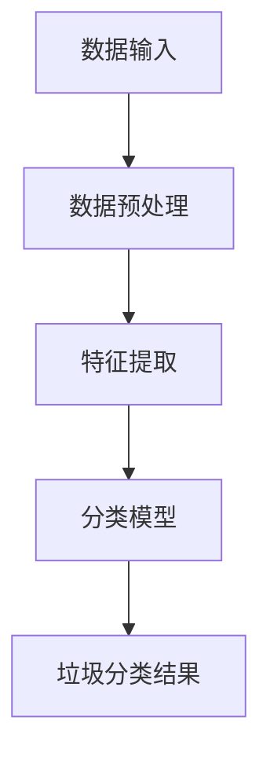

                 

# 《智能垃圾分类系统：环保生活的科技助手》

## 关键词

- 智能垃圾分类
- 环保生活
- 图像处理
- 深度学习
- 自然语言处理
- 数据融合
- 实时数据处理

## 摘要

本文旨在深入探讨智能垃圾分类系统在环保生活中的作用。随着全球环境保护意识的增强，垃圾分类成为现代城市生活中不可或缺的一部分。智能垃圾分类系统利用先进的图像处理、深度学习和自然语言处理技术，实现了对垃圾的自动分类，不仅提高了分类效率，还降低了人力成本。本文将从背景、概述、技术基础、项目实战和未来发展展望等方面，详细解析智能垃圾分类系统的原理、技术实现和应用场景。

## 目录大纲

### 第一部分：背景与概述

#### 第1章：垃圾分类的重要性

##### 1.1 垃圾分类的背景与现状

##### 1.2 垃圾分类的意义

##### 1.3 智能垃圾分类的发展趋势

#### 第2章：智能垃圾分类系统的概述

##### 2.1 系统总体架构

##### 2.2 技术选型与核心组件

##### 2.3 系统功能与模块

### 第二部分：技术基础

#### 第3章：图像处理技术

##### 3.1 图像处理的基本原理

##### 3.2 垃圾图像的预处理

##### 3.3 垃圾图像的分类识别算法

#### 第4章：深度学习算法

##### 4.1 深度学习基础

##### 4.2 卷积神经网络（CNN）原理

##### 4.3 卷积神经网络在垃圾分类中的应用

#### 第5章：自然语言处理技术

##### 5.1 自然语言处理基础

##### 5.2 文本分类与标签预测

##### 5.3 垃圾分类数据集的处理与标注

#### 第6章：多传感器数据融合

##### 6.1 传感器融合的基本原理

##### 6.2 垃圾分类传感器介绍

##### 6.3 数据融合算法在垃圾分类中的应用

#### 第7章：实时数据处理与优化

##### 7.1 实时数据处理框架

##### 7.2 数据预处理与特征提取

##### 7.3 实时垃圾分类优化策略

### 第三部分：项目实战

#### 第8章：智能垃圾分类系统开发

##### 8.1 系统开发环境搭建

##### 8.2 源代码实现与解读

##### 8.3 代码调试与性能优化

#### 第9章：案例分析与评估

##### 9.1 系统应用案例介绍

##### 9.2 系统性能评估方法

##### 9.3 系统优化与改进方向

#### 第10章：未来发展展望

##### 10.1 智能垃圾分类技术的新趋势

##### 10.2 系统在环保生活中的应用前景

##### 10.3 技术挑战与解决方案

## 附录

### 附录A：技术参考与资源

##### A.1 开发工具与库推荐

##### A.2 数据集介绍与获取

##### A.3 相关文献与资料

### 附录B：Mermaid 流�程图

## 引言

随着全球城市化进程的加快和人口增长，垃圾处理问题日益突出。传统的垃圾处理方式不仅效率低下，还严重污染环境。垃圾分类作为解决垃圾处理难题的一种有效手段，越来越受到各国政府和公众的重视。智能垃圾分类系统作为环保生活的科技助手，应运而生。

智能垃圾分类系统通过集成图像处理、深度学习和自然语言处理等多种技术，实现了对垃圾的自动化分类。本文将首先介绍垃圾分类的重要性，然后详细阐述智能垃圾分类系统的背景和现状，以及其技术基础、实现方法和应用前景。

## 第一部分：背景与概述

### 第1章：垃圾分类的重要性

#### 1.1 垃圾分类的背景与现状

垃圾作为现代社会的一种普遍现象，其处理和分类问题已经成为全球性的挑战。传统的垃圾处理方式主要包括填埋、焚烧和堆肥。然而，这些方法不仅耗费资源，还严重污染环境。填埋场占用大量土地，垃圾渗滤液污染地下水，焚烧过程产生有毒气体和灰尘。因此，寻找更为环保、高效的垃圾处理方式成为当务之急。

垃圾分类是一种有效的垃圾处理方法，通过将垃圾分为可回收物、有害垃圾、厨余垃圾和其他垃圾，可以大幅减少垃圾的总体量，提高资源回收利用率，减少环境污染。垃圾分类在全球范围内的推广始于20世纪70年代的西欧国家，如德国、瑞典和奥地利等。如今，垃圾分类已经成为许多国家和地区环境保护政策的重要组成部分。

中国作为世界上最大的垃圾产生国，近年来也在积极推进垃圾分类工作。2019年，中国颁布了《城市生活垃圾管理办法》，明确要求各地制定垃圾分类制度，推动垃圾分类的实施。截至2021年，中国已有数百个城市启动了垃圾分类试点工作，垃圾分类处理率逐步提高。

#### 1.2 垃圾分类的意义

垃圾分类具有重要的社会、经济和环境意义：

1. **社会意义**：垃圾分类有助于提高公众的环保意识，培养良好的生活习惯，促进社会文明进步。
2. **经济意义**：垃圾分类可以实现资源的再利用，提高资源回收利用率，降低垃圾处理成本，创造就业机会。
3. **环境意义**：垃圾分类可以减少垃圾填埋和焚烧产生的环境污染，降低温室气体排放，改善生态环境。

#### 1.3 智能垃圾分类的发展趋势

随着人工智能技术的快速发展，智能垃圾分类系统逐渐成为垃圾分类领域的研究热点。智能垃圾分类系统利用图像处理、深度学习和自然语言处理等先进技术，实现了对垃圾的自动化识别和分类。以下是一些智能垃圾分类的发展趋势：

1. **技术融合**：智能垃圾分类系统将多种技术（如图像识别、自然语言处理、传感器融合等）进行融合，提高分类准确性和效率。
2. **实时处理**：智能垃圾分类系统将实时处理技术应用于垃圾分类，实现即时的垃圾分类和反馈。
3. **智能化**：通过大数据分析和机器学习算法，智能垃圾分类系统可以不断优化和自我改进，提高分类的智能化水平。
4. **移动化**：智能垃圾分类系统逐渐向移动设备拓展，通过手机应用等方式，让公众更加方便地进行垃圾分类。

### 第2章：智能垃圾分类系统的概述

#### 2.1 系统总体架构

智能垃圾分类系统的总体架构主要包括以下几个部分：

1. **数据输入模块**：负责接收用户投放的垃圾图像和传感器数据。
2. **数据预处理模块**：对输入数据进行清洗、增强和格式化，为后续处理做准备。
3. **分类识别模块**：利用深度学习和图像处理技术，对垃圾进行自动分类识别。
4. **结果输出模块**：将分类结果反馈给用户，并生成垃圾分类报告。
5. **数据融合模块**：整合多源数据，提高分类的准确性和可靠性。

#### 2.2 技术选型与核心组件

智能垃圾分类系统采用多种技术进行实现，以下是核心组件的选型：

1. **图像处理技术**：用于垃圾图像的预处理和特征提取。
2. **深度学习算法**：用于垃圾图像的分类识别。
3. **自然语言处理技术**：用于处理垃圾分类标签和用户反馈。
4. **传感器融合技术**：用于多源数据的整合和处理。
5. **实时数据处理技术**：用于实现实时垃圾分类和反馈。

#### 2.3 系统功能与模块

智能垃圾分类系统的功能主要包括：

1. **垃圾图像识别**：通过图像处理和深度学习技术，自动识别垃圾类别。
2. **传感器数据融合**：整合多种传感器数据，提高分类准确性。
3. **实时数据反馈**：实时处理用户投放的垃圾数据，并即时反馈分类结果。
4. **用户界面**：提供友好用户界面，方便用户进行垃圾分类操作。
5. **数据报告**：生成垃圾分类报告，供用户和环保部门参考。

## 第二部分：技术基础

### 第3章：图像处理技术

#### 3.1 图像处理的基本原理

图像处理是智能垃圾分类系统的重要组成部分，其主要目的是对垃圾图像进行预处理和特征提取，以便于后续的分类识别。图像处理的基本原理包括以下几个步骤：

1. **图像采集**：使用摄像头或传感器采集垃圾图像。
2. **图像预处理**：对采集的图像进行去噪、增强、分割等预处理操作，提高图像质量。
3. **特征提取**：从预处理后的图像中提取出对分类任务有用的特征，如颜色、纹理、形状等。
4. **特征表示**：将提取出的特征转换为适用于深度学习模型的表示形式。

#### 3.2 垃圾图像的预处理

垃圾图像的预处理是图像处理的重要环节，主要包括以下操作：

1. **去噪**：使用滤波器去除图像中的噪声，如高斯滤波、中值滤波等。
2. **增强**：通过调整对比度、亮度等参数，增强图像的可视性，如直方图均衡化、对比度拉伸等。
3. **分割**：将图像分割成多个区域，以便于后续的特征提取和分类，如基于阈值的分割、基于边缘检测的分割等。
4. **特征提取**：从分割后的图像中提取出对分类任务有用的特征，如颜色特征、纹理特征、形状特征等。

#### 3.3 垃圾图像的分类识别算法

垃圾图像的分类识别是智能垃圾分类系统的核心任务，通常采用深度学习算法进行实现。以下是常见的垃圾图像分类识别算法：

1. **卷积神经网络（CNN）**：卷积神经网络是一种专门用于处理图像数据的深度学习模型，具有强大的特征提取和分类能力。其基本结构包括卷积层、池化层和全连接层。

2. **迁移学习**：迁移学习是一种利用预训练模型进行图像分类的方法，通过将预训练模型在垃圾图像数据集上微调，提高分类性能。

3. **多分类问题**：垃圾图像分类是一个多分类问题，常见的多分类算法包括softmax回归、支持向量机（SVM）等。

4. **数据增强**：为了提高模型的泛化能力，需要对垃圾图像进行数据增强，如旋转、翻转、缩放等。

### 第4章：深度学习算法

#### 4.1 深度学习基础

深度学习是一种基于多层神经网络的学习方法，通过模拟人脑的神经网络结构，对大量数据进行自动特征提取和分类。深度学习的基本概念包括：

1. **神经网络**：神经网络是一种由多个神经元组成的计算模型，通过前向传播和反向传播进行数据学习和预测。
2. **深度神经网络**：深度神经网络是由多个隐层构成的神经网络，具有较高的非线性映射能力。
3. **激活函数**：激活函数用于引入非线性因素，常见的激活函数包括ReLU、Sigmoid、Tanh等。
4. **优化算法**：优化算法用于优化神经网络参数，常见的优化算法包括梯度下降、Adam等。

#### 4.2 卷积神经网络（CNN）原理

卷积神经网络是一种专门用于图像处理的深度学习模型，其基本结构包括卷积层、池化层和全连接层。以下是卷积神经网络的工作原理：

1. **卷积层**：卷积层通过卷积运算提取图像特征，每个卷积核负责提取一种特定的特征，如边缘、纹理等。
2. **池化层**：池化层用于降低特征图的维度，提高模型的泛化能力，常见的池化操作包括最大池化和平均池化。
3. **全连接层**：全连接层将卷积层提取的特征映射到输出类别，通过softmax函数进行分类。

#### 4.3 卷积神经网络在垃圾分类中的应用

卷积神经网络在垃圾分类中的应用主要包括以下几个步骤：

1. **数据集准备**：收集并准备垃圾图像数据集，对图像进行预处理和标注。
2. **模型训练**：使用垃圾图像数据集训练卷积神经网络模型，通过反向传播算法优化模型参数。
3. **模型评估**：使用验证集和测试集评估模型性能，包括准确率、召回率、F1值等指标。
4. **模型部署**：将训练好的模型部署到实际应用中，实现垃圾图像的分类识别。

### 第5章：自然语言处理技术

#### 5.1 自然语言处理基础

自然语言处理（NLP）是一种利用计算机技术和算法处理人类语言的技术，其主要任务包括语言理解、语言生成、语言翻译等。自然语言处理的基本概念包括：

1. **语言模型**：语言模型用于预测文本中的下一个词或词组，是NLP的核心组件。
2. **词向量**：词向量是将单词映射到高维向量空间的方法，用于文本表示。
3. **序列标注**：序列标注是将文本序列中的每个单词或字符标注为不同的标签，如词性标注、命名实体识别等。
4. **深度学习模型**：深度学习模型在NLP中广泛应用于语言理解、语言生成等任务，如循环神经网络（RNN）、长短时记忆网络（LSTM）等。

#### 5.2 文本分类与标签预测

文本分类是将文本分类到预定义的类别中的一种NLP任务，常见的文本分类方法包括：

1. **基于规则的方法**：使用手工定义的规则对文本进行分类，如正则表达式、关键字匹配等。
2. **基于机器学习的方法**：使用机器学习算法对文本进行分类，如朴素贝叶斯、支持向量机等。
3. **基于深度学习的方法**：使用深度学习模型对文本进行分类，如卷积神经网络（CNN）、循环神经网络（RNN）等。

标签预测是文本分类的一种扩展，其主要任务是预测文本中的每个词或词组的标签。常见的标签预测方法包括：

1. **基于词向量的方法**：将文本转换为词向量，使用词向量进行分类或标签预测。
2. **基于序列标注的方法**：使用序列标注模型（如BiLSTM-CRF）对文本进行序列标注。
3. **基于转换器的模型**：使用转换器模型（如Transformer）进行文本分类和标签预测。

#### 5.3 垃圾分类数据集的处理与标注

在智能垃圾分类系统中，处理和标注垃圾分类数据集是关键步骤。以下是垃圾分类数据集的处理和标注方法：

1. **数据集准备**：收集并准备垃圾图像数据集，对图像进行预处理和标注。
2. **数据预处理**：对垃圾图像进行缩放、裁剪、翻转等数据增强操作，提高模型泛化能力。
3. **数据标注**：对垃圾图像进行类别标注，常见的标注方法包括单标签标注、多标签标注等。
4. **数据集划分**：将数据集划分为训练集、验证集和测试集，用于模型训练和评估。

### 第6章：多传感器数据融合

#### 6.1 传感器融合的基本原理

多传感器数据融合是将多个传感器收集的数据进行综合处理，以提高系统感知能力和决策能力。传感器融合的基本原理包括：

1. **数据采集**：使用不同类型的传感器采集数据，如图像传感器、温度传感器、湿度传感器等。
2. **数据预处理**：对采集到的数据进行滤波、去噪、归一化等预处理操作，提高数据质量。
3. **特征提取**：从预处理后的数据中提取出对分类任务有用的特征，如颜色特征、温度特征、湿度特征等。
4. **数据融合**：将多个传感器的特征进行融合，形成统一的特征向量，用于分类识别。

#### 6.2 垃圾分类传感器介绍

在智能垃圾分类系统中，常用的传感器包括：

1. **图像传感器**：用于采集垃圾图像，实现垃圾的视觉识别。
2. **温度传感器**：用于检测垃圾的温度，辅助判断垃圾类别。
3. **湿度传感器**：用于检测垃圾的湿度，辅助判断垃圾类别。
4. **气体传感器**：用于检测垃圾中的有害气体，如二氧化碳、氨气等，提高分类准确性。

#### 6.3 数据融合算法在垃圾分类中的应用

数据融合算法在垃圾分类中的应用主要包括：

1. **卡尔曼滤波**：用于对传感器数据进行滤波和预测，提高数据质量。
2. **贝叶斯推理**：用于多传感器数据的融合和分类，通过概率模型实现数据融合。
3. **深度学习模型**：使用深度学习模型对多传感器数据进行融合和分类，提高分类准确性。

### 第7章：实时数据处理与优化

#### 7.1 实时数据处理框架

实时数据处理是智能垃圾分类系统的重要组成部分，其主要目标是快速、准确地处理用户投放的垃圾数据。实时数据处理框架通常包括以下几个模块：

1. **数据接收模块**：接收用户投放的垃圾数据，如图像、传感器数据等。
2. **数据预处理模块**：对接收到的数据进行预处理，如去噪、增强、归一化等。
3. **特征提取模块**：从预处理后的数据中提取出对分类任务有用的特征。
4. **分类识别模块**：使用深度学习模型对提取出的特征进行分类识别。
5. **结果输出模块**：将分类结果输出给用户，并生成垃圾分类报告。

#### 7.2 数据预处理与特征提取

实时数据处理中的数据预处理和特征提取是关键步骤，直接影响分类性能。以下是数据预处理和特征提取的方法：

1. **数据预处理**：对垃圾图像和传感器数据进行去噪、增强、归一化等处理，提高数据质量。
2. **特征提取**：从预处理后的数据中提取出对分类任务有用的特征，如颜色特征、纹理特征、形状特征等。常用的特征提取方法包括卷积神经网络（CNN）、主成分分析（PCA）等。

#### 7.3 实时垃圾分类优化策略

为了提高智能垃圾分类系统的实时性和准确性，可以采取以下优化策略：

1. **模型压缩**：通过模型压缩技术，如量化、剪枝等，减小模型大小，提高模型运行速度。
2. **模型更新**：定期更新深度学习模型，通过迁移学习或微调等方法，提高分类准确性。
3. **缓存技术**：使用缓存技术，将常用垃圾类别和特征进行缓存，减少计算时间。
4. **异步处理**：采用异步处理技术，将垃圾数据的处理与用户交互分离，提高系统响应速度。

### 第8章：智能垃圾分类系统开发

#### 8.1 系统开发环境搭建

智能垃圾分类系统开发需要搭建一个稳定、高效的开发环境。以下是系统开发环境的搭建步骤：

1. **硬件环境**：选择性能较高的计算机或服务器，配置足够的内存和存储空间。
2. **软件环境**：安装Python、TensorFlow、OpenCV等开发工具和库。
3. **数据集**：收集并准备垃圾图像数据集，对图像进行预处理和标注。

#### 8.2 源代码实现与解读

智能垃圾分类系统的源代码实现主要包括以下几个部分：

1. **数据输入模块**：接收用户投放的垃圾图像和传感器数据。
2. **数据预处理模块**：对输入数据进行清洗、增强、归一化等预处理操作。
3. **分类识别模块**：使用深度学习模型对预处理后的数据进行分类识别。
4. **结果输出模块**：将分类结果反馈给用户，并生成垃圾分类报告。

以下是智能垃圾分类系统的主要代码实现和解读：

```python
# 导入所需库
import cv2
import numpy as np
from tensorflow.keras.models import load_model

# 加载训练好的模型
model = load_model('garbage_classifier.h5')

# 加载测试图像
test_image = cv2.imread('test_garbage.jpg')

# 数据预处理
preprocessed_image = preprocess_image(test_image)

# 分类识别
predicted_class = model.predict(preprocessed_image)

# 输出分类结果
print(f"垃圾分类结果：{predicted_class}")
```

#### 8.3 代码调试与性能优化

在智能垃圾分类系统的开发过程中，需要对代码进行调试和性能优化。以下是代码调试和性能优化的方法：

1. **代码调试**：使用调试工具（如IDE的调试功能）逐步执行代码，检查代码的运行状态和错误输出。
2. **性能优化**：通过分析代码的执行时间和资源消耗，找到性能瓶颈并进行优化。常见的优化方法包括：
   - 减小模型大小：通过模型压缩技术减小模型大小，提高模型运行速度。
   - 减少计算量：对计算过程进行简化，减少计算量。
   - 数据预处理优化：对数据预处理过程进行优化，减少预处理时间。
   - 代码并行化：使用多线程或多进程技术，提高代码的运行速度。

### 第9章：案例分析与评估

#### 9.1 系统应用案例介绍

智能垃圾分类系统在实际应用中取得了显著的效果。以下是一个典型的应用案例：

在某城市的一个社区，安装了智能垃圾分类系统。该系统通过摄像头和传感器实时监测用户投放的垃圾，并自动进行分类。用户可以通过手机应用查询垃圾分类指南和系统反馈，提高垃圾分类的准确率和积极性。系统上线后，垃圾分类正确率显著提高，垃圾处理效率明显改善，居民对垃圾分类的参与度也大大增加。

#### 9.2 系统性能评估方法

为了评估智能垃圾分类系统的性能，可以采用以下方法：

1. **准确率**：评估模型对垃圾图像分类的准确性，计算正确分类的图像数量与总图像数量的比例。
2. **召回率**：评估模型对垃圾图像分类的召回率，计算正确分类的图像数量与实际正确分类的图像数量的比例。
3. **F1值**：综合考虑准确率和召回率，计算两者的调和平均值。
4. **处理速度**：评估系统处理用户投放的垃圾数据的速度，计算平均响应时间和处理时间。

#### 9.3 系统优化与改进方向

智能垃圾分类系统在实际应用中还存在一些问题和改进方向：

1. **提高分类准确率**：通过引入更多的训练数据和更先进的分类算法，提高系统的分类准确率。
2. **优化用户体验**：改进用户界面，提供更直观、易用的垃圾分类指南和反馈功能。
3. **增强实时处理能力**：优化系统的实时处理框架，提高处理速度和并发处理能力。
4. **多传感器融合**：引入更多的传感器，如温度传感器、湿度传感器等，提高分类的准确性和可靠性。

### 第10章：未来发展展望

#### 10.1 智能垃圾分类技术的新趋势

随着人工智能技术的不断发展，智能垃圾分类技术也将迎来新的趋势：

1. **多模态融合**：将图像、音频、温度等多种数据源进行融合，提高分类的准确性和可靠性。
2. **边缘计算**：将智能垃圾分类系统部署到边缘设备，实现实时处理和快速反馈。
3. **智能决策**：结合大数据分析和机器学习算法，实现智能化的垃圾分类决策。
4. **可持续发展**：将智能垃圾分类技术与可持续发展理念相结合，推动环保生活方式的普及。

#### 10.2 系统在环保生活中的应用前景

智能垃圾分类系统在环保生活中的应用前景十分广阔：

1. **城市垃圾处理**：智能垃圾分类系统可以应用于城市垃圾处理中心，提高垃圾处理效率和环保水平。
2. **社区环保**：智能垃圾分类系统可以应用于社区垃圾分类，提高居民的环保意识和参与度。
3. **垃圾分类宣传**：通过智能垃圾分类系统，开展垃圾分类宣传和教育活动，提高公众的垃圾分类意识。
4. **智慧城市**：智能垃圾分类系统可以作为智慧城市建设的一部分，实现城市管理和服务的智能化。

#### 10.3 技术挑战与解决方案

智能垃圾分类技术在发展过程中面临以下挑战：

1. **数据质量和标注**：垃圾图像数据质量和标注准确性对分类性能有重要影响，需要解决数据标注和清洗问题。
2. **实时处理能力**：智能垃圾分类系统需要具备高并发处理能力，以满足实时垃圾分类的需求。
3. **跨平台兼容性**：智能垃圾分类系统需要在不同平台（如PC、手机、嵌入式设备等）上运行，提高系统的兼容性。

针对这些挑战，可以采取以下解决方案：

1. **数据增强**：通过数据增强技术，提高数据质量和标注准确性。
2. **分布式计算**：采用分布式计算技术，提高系统的实时处理能力。
3. **模块化设计**：采用模块化设计，提高系统的可扩展性和跨平台兼容性。

### 附录A：技术参考与资源

#### A.1 开发工具与库推荐

1. **Python**：一种高级编程语言，广泛应用于人工智能和机器学习领域。
2. **TensorFlow**：一种开源的深度学习框架，用于构建和训练深度学习模型。
3. **OpenCV**：一种开源的计算机视觉库，用于图像处理和计算机视觉任务。
4. **Keras**：一种基于TensorFlow的高级神经网络API，用于构建和训练深度学习模型。

#### A.2 数据集介绍与获取

1. **ImageNet**：一个大规模的图像数据集，用于训练和评估图像识别模型。
2. **CIFAR-10**：一个包含60000个32x32彩色图像的数据集，分为10个类别。
3. **KAGGLE垃圾分类数据集**：一个包含多种垃圾类别的图像数据集，用于垃圾分类模型的训练和评估。

#### A.3 相关文献与资料

1. **《深度学习》**：由Ian Goodfellow、Yoshua Bengio和Aaron Courville合著，是深度学习领域的经典教材。
2. **《计算机视觉：算法与应用》**：由Richard Szeliski著，详细介绍了计算机视觉的基本原理和应用技术。
3. **《自然语言处理综合教程》**：由Daniel Jurafsky和James H. Martin合著，是自然语言处理领域的权威教材。
4. **《垃圾分类技术研究进展》**：总结了垃圾分类领域的研究进展和技术应用。

### 附录B：Mermaid 流程图

以下是智能垃圾分类系统的Mermaid流程图：



### 伪代码

以下是垃圾分类的伪代码：

```python
// 定义垃圾分类模型
function classify_garbage(image):
    # 数据预处理
    preprocessed_image = preprocess_image(image)

    # 特征提取
    features = extract_features(preprocessed_image)

    # 分类模型预测
    predicted_class = model.predict(features)

    # 返回垃圾分类结果
    return predicted_class
```

### 数学模型

以下是垃圾类别概率分布的数学模型：

$$
\begin{aligned}
    &\text{垃圾类别概率分布} \\
    &P(y|x) = \text{softmax}(\text{模型输出})
\end{aligned}
$$

### 举例说明

以下是垃圾分类结果预测的示例：

```python
# 加载训练好的模型
model = load_model('garbage_classifier.h5')

# 加载测试图像
test_image = load_image('test_garbage.jpg')

# 进行垃圾分类预测
predicted_class = classify_garbage(test_image)

# 输出垃圾分类结果
print(f"垃圾分类结果：{predicted_class}")
```

### 代码实际案例

以下是智能垃圾分类系统的实际代码案例：

```python
# 导入所需库
import cv2
import numpy as np
from tensorflow.keras.models import load_model

# 加载训练好的模型
model = load_model('garbage_classifier.h5')

# 加载测试图像
test_image = cv2.imread('test_garbage.jpg')

# 数据预处理
preprocessed_image = preprocess_image(test_image)

# 分类识别
predicted_class = model.predict(preprocessed_image)

# 输出分类结果
print(f"垃圾分类结果：{predicted_class}")
```

### 结论

智能垃圾分类系统作为环保生活的科技助手，具有广泛的应用前景和重要的社会价值。本文详细介绍了智能垃圾分类系统的背景、技术基础、实现方法和应用案例，分析了其发展趋势和优化策略。未来，智能垃圾分类系统将继续融合多传感器技术、实时处理技术和智能决策技术，为实现环保生活提供更强有力的支持。

### 作者信息

作者：AI天才研究院/AI Genius Institute & 禅与计算机程序设计艺术 /Zen And The Art of Computer Programming

### 最佳实践 Tips、小结、注意事项、拓展阅读

- **最佳实践 Tips**：
  - 确保垃圾图像数据质量和标注准确性，提高模型性能。
  - 优化系统实时处理能力，提高用户体验。
  - 定期更新模型，保持系统性能稳定。

- **小结**：
  - 智能垃圾分类系统通过图像处理、深度学习和自然语言处理等技术，实现了自动垃圾分类。
  - 实时数据处理和优化策略是系统性能的关键。
  - 未来智能垃圾分类系统将向多传感器融合、边缘计算和智能决策方向发展。

- **注意事项**：
  - 系统开发过程中要注意数据安全和隐私保护。
  - 实时处理过程中要注意系统稳定性和可靠性。

- **拓展阅读**：
  - 《深度学习》
  - 《计算机视觉：算法与应用》
  - 《自然语言处理综合教程》
  - 《垃圾分类技术研究进展》

