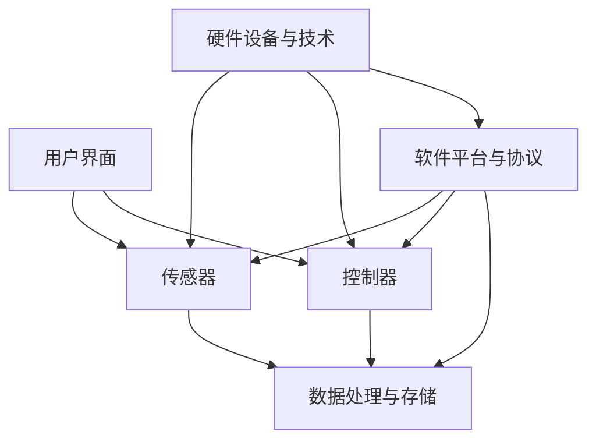
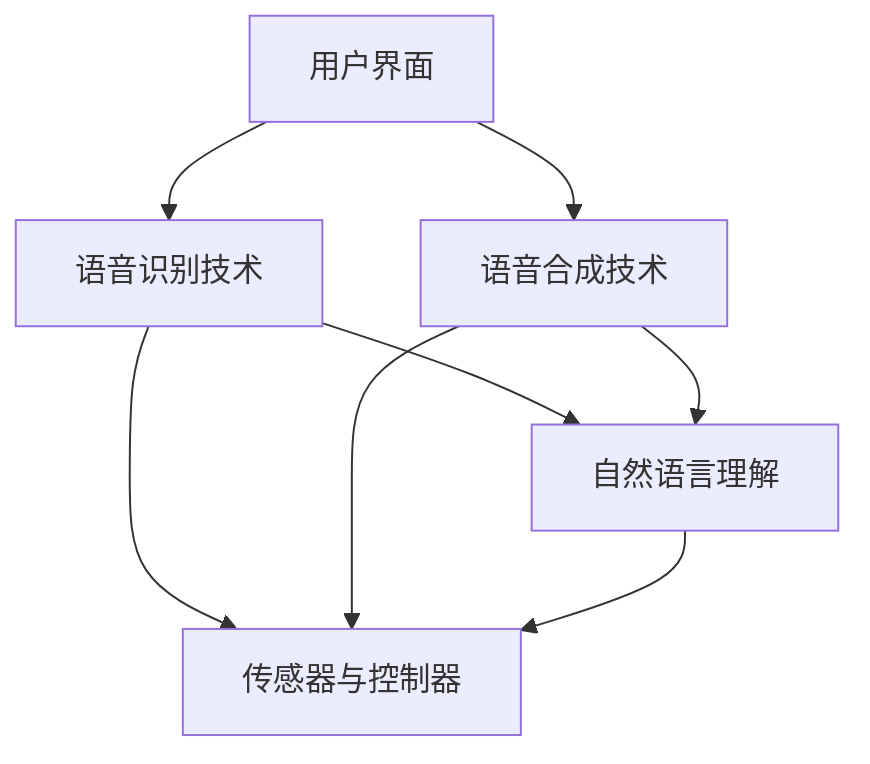
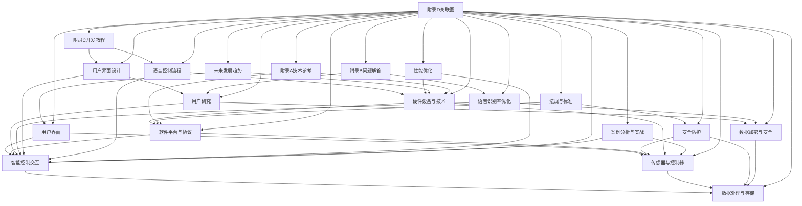

                 


### 文章标题: 《智能家居新体验：简化提示词语音控制交互》

### 关键词：
- 智能家居
- 语音控制
- 提示词设计
- 交互体验优化

### 摘要：
本文将深入探讨智能家居系统中语音控制交互的优化方法，尤其是提示词设计的简化策略。通过分析智能家居的发展历程、系统架构、安全挑战，我们将逐步介绍语音识别与合成技术原理，以及提示词与自然语言理解的关系。本文还将探讨如何通过用户研究和语音识别率优化，设计出更简单、易用的提示词，提高智能家居系统的用户体验。最后，通过实际案例和未来发展趋势的讨论，总结出智能家居语音控制交互的实现路径和优化策略。

----------------------------------------------------------------

# 《智能家居新体验：简化提示词语音控制交互》目录大纲

## 第一部分：智能家居概述

### 第1章：智能家居简介

### 第2章：智能家居系统架构

### 第3章：智能控制交互原理

### 第4章：智能家居安全

## 第二部分：简化提示词语音控制交互

### 第5章：简化提示词设计原则

### 第6章：语音控制交互实现

### 第7章：案例分析与实战

### 第8章：智能家居的未来发展趋势

## 附录

### 附录A：智能家居技术参考

### 附录B：常见问题解答

### 附录C：智能家居开发教程

### 附录D：跨部分内容关联图

----------------------------------------------------------------

### 第1章：智能家居简介

### 1.1 智能家居的发展历程

智能家居的概念起源于20世纪80年代，当时主要通过个人电脑（PC）来控制家居设备，实现基本的家务自动化。这一时期，智能家居更多的是一种概念性的产品，技术较为初级，市场接受度有限。

进入20世纪90年代，随着计算机技术的进步和总线技术的应用，智能家居系统开始逐渐成熟。这一时期的智能家居系统以集中控制的住宅自动化系统为主，通过总线技术将各种家居设备连接起来，实现集中控制。代表性的技术有KNX、BACnet等。

21世纪初期，物联网（IoT）技术的引入，使智能家居系统进入了一个全新的发展阶段。物联网技术通过互联网将各种智能设备连接起来，使得家居设备具备了远程控制、数据交互的能力。这一时期的智能家居产品开始逐渐普及，用户接受度不断提高。

近几年，随着人工智能、5G等新技术的快速发展，智能家居系统再次迎来了新的发展机遇。人工智能技术的应用，使得智能家居系统能够更好地理解用户需求，提供个性化的服务。5G技术的普及，则进一步提升了智能家居系统的实时性和稳定性。

### 1.2 智能家居的组成部分

智能家居系统通常由以下几个主要部分组成：

1. **传感器**：传感器是智能家居系统的“眼睛”和“耳朵”，负责采集室内外的环境信息，如温度、湿度、光照、烟雾等。常见的传感器有温湿度传感器、光敏传感器、烟雾传感器等。

2. **控制器**：控制器是智能家居系统的“大脑”，负责接收传感器的信息，并根据预设的规则或用户的指令，对家居设备进行控制。常见的控制器有智能插座、智能开关、智能灯泡等。

3. **通信网络**：通信网络是智能家居系统的“血管”，负责将传感器、控制器等设备连接起来，实现数据的传输和指令的执行。常见的通信网络有Wi-Fi、蓝牙、ZigBee、Z-Wave等。

4. **用户界面**：用户界面是智能家居系统的“嘴巴”，负责与用户进行交互，接收用户的指令，并显示系统的状态信息。常见的用户界面有智能手机、智能音箱、智能门锁等。

### 1.3 智能家居的优势与挑战

#### 优势：

1. **提高生活品质**：智能家居系统能够实现自动化、个性化的控制，为用户带来更加便捷、舒适的生活体验。

2. **节能环保**：智能家居系统可以通过智能控制，优化能源使用，降低能耗，具有明显的节能环保优势。

3. **安全防护**：智能家居系统可以集成安防功能，如监控摄像头、门锁等，提高家庭的安全性。

#### 挑战：

1. **高成本**：智能家居设备的价格相对较高，普及难度较大。

2. **兼容性问题**：不同品牌、不同设备的智能家居系统之间兼容性较差，给用户带来使用不便。

3. **隐私安全**：智能家居设备可能涉及用户隐私，存在安全风险。

----------------------------------------------------------------

## 第2章：智能家居系统架构

### 2.1 硬件设备与技术

智能家居系统的硬件设备是整个系统的基石，主要包括传感器、控制器和用户界面设备。这些设备的技术特点直接决定了系统的性能和用户体验。

#### 传感器

传感器作为智能家居系统的“触觉”部分，用于感知环境变化并反馈给系统。常见的传感器包括：

- **温度传感器**：用于检测室内外温度，常见的有热敏电阻、热电偶等。
- **湿度传感器**：用于检测空气中的湿度，常见的有电容式、电阻式等。
- **光敏传感器**：用于检测光照强度，常见的有光电管、光敏电阻等。
- **烟雾传感器**：用于检测烟雾浓度，常见的有离子式、光电式等。

传感器的技术特点主要在于精度、响应速度和环境适应性。高精度的传感器能够提供更准确的环境数据，快速响应的传感器可以及时检测到环境变化，而环境适应性的好坏则决定了传感器在不同环境下的稳定性和可靠性。

#### 控制器

控制器作为智能家居系统的“大脑”，负责处理传感器数据，并根据用户指令执行相应的操作。常见的控制器包括：

- **智能插座**：可以远程控制家中的电器设备，通过Wi-Fi或蓝牙连接。
- **智能开关**：用于控制家中的灯光、风扇等电器设备，通常与智能灯光系统兼容。
- **智能灯泡**：具有多种颜色和亮度的调节功能，可以通过Wi-Fi、蓝牙或语音控制。

控制器的技术特点主要在于处理能力、连接方式和控制策略。处理能力决定了控制器能否快速、准确地处理大量数据，连接方式则决定了控制器与用户的交互方式，控制策略则决定了控制器的智能化程度。

#### 用户界面

用户界面是智能家居系统与用户之间的交互接口，常见的用户界面设备包括：

- **智能手机**：通过移动应用，用户可以随时随地控制智能家居设备，查看设备状态。
- **智能音箱**：通过语音识别和语音合成技术，用户可以通过语音命令控制智能家居设备。
- **智能门锁**：通过指纹、密码、卡片等多种方式实现家庭安全的智能门锁。

用户界面的技术特点主要在于交互方式、便捷性和安全性。交互方式决定了用户的操作习惯，便捷性决定了用户的满意度，安全性则直接关系到家庭的安全。

### 2.2 软件平台与协议

智能家居系统的软件平台和协议是整个系统的“神经系统”，负责数据的传输、处理和控制。常见的软件平台和协议包括：

- **软件平台**：
  - **HomeKit**：苹果公司的智能家居平台，支持多种智能设备，通过iPhone、iPad等苹果设备进行控制。
  - **SmartThings**：三星的智能家居平台，支持多种设备和协议，提供中央控制和管理。
  - **eWeLink**：腾讯云的智能家居平台，支持多种设备和协议，提供云端数据存储和远程控制。

- **通信协议**：
  - **Wi-Fi**：通过无线网络连接设备，具有高速、稳定的优势，但功耗较高。
  - **蓝牙**：近距离无线通信技术，功耗较低，适用于低功耗设备。
  - **ZigBee**：低功耗、高可靠性的无线通信技术，适用于智能家居系统。
  - **Z-Wave**：另一种低功耗、高可靠性的无线通信技术，与ZigBee类似。

软件平台和协议的技术特点主要在于兼容性、稳定性和安全性。兼容性决定了平台能够支持多少种设备和协议，稳定性决定了系统能否长时间稳定运行，安全性则直接关系到用户数据的安全。

### 2.3 数据处理与存储

智能家居系统的数据处理与存储是整个系统的“数据仓库”，负责数据的收集、处理和存储。数据处理与存储的关键技术包括：

- **数据处理**：
  - **数据收集**：通过传感器和网络设备，实时收集家庭环境数据。
  - **数据预处理**：对收集到的数据进行清洗、筛选和转换，为后续处理做准备。
  - **数据分析**：利用数据挖掘、机器学习等技术，对预处理后的数据进行挖掘和分析，提取有价值的信息。

- **数据存储**：
  - **本地存储**：将数据存储在本地设备上，如智能设备、路由器等，适用于实时性要求高的场景。
  - **云端存储**：将数据存储在云端服务器上，适用于大规模数据存储和远程访问。

数据处理与存储的技术特点主要在于数据容量、处理速度和安全性。数据容量决定了系统能够存储多少数据，处理速度决定了系统响应的快慢，安全性则直接关系到数据的安全。

### 跨部分内容关联图

为了更好地理解智能家居系统的整体架构，我们可以通过Mermaid绘制一个跨部分的内容关联图：



在这个关联图中，用户界面通过控制器与传感器进行交互，控制器和传感器共同作用于数据处理与存储系统，而软件平台与协议则负责连接和控制整个系统。通过这种关联，我们可以更清晰地理解智能家居系统的运作机制。

----------------------------------------------------------------

## 第3章：智能控制交互原理

### 3.1 语音识别技术

语音识别技术是智能家居系统智能控制的核心技术之一，它使得用户可以通过语音命令来控制家居设备。语音识别技术的工作原理主要包括以下几个步骤：

1. **音频信号的采集**：首先，语音识别系统需要通过麦克风等设备采集用户的语音信号。这些语音信号是模拟信号，需要通过模数转换（A/D转换）转换为数字信号。

    ```python
    # 伪代码：音频信号的采集
    sample_rate = 44100  # 采样率
    num_samples = 1024    # 采样点数
    audio_signal = microphone.capture(num_samples, sample_rate)
    ```

2. **预处理**：对采集到的数字音频信号进行预处理，包括去噪、增益调整和分帧等操作。预处理的目的是提高语音信号的质量，为后续的语音识别做好准备。

    ```python
    # 伪代码：音频信号的预处理
    processed_signal = preprocess(audio_signal)
    ```

3. **特征提取**：将预处理后的音频信号转换为特征向量，这些特征向量能够反映语音信号的音素、音节等语音特征。常见的特征提取方法有梅尔频率倒谱系数（MFCC）和隐马尔可夫模型（HMM）。

    ```python
    # 伪代码：特征提取
    features = extract_features(processed_signal)
    ```

4. **模型训练**：使用大量的语音数据集对语音识别模型进行训练。训练过程中，模型会学习语音信号和对应的文本之间的映射关系。常见的语音识别模型有GMM-HMM、DTW-HMM和DNN-HMM等。

    ```python
    # 伪代码：模型训练
    model = train_model(training_data)
    ```

5. **识别**：将实时采集到的语音信号转换为文本。这一步骤通常采用动态时间规整（Dynamic Time Warping, DTW）或深度神经网络（Deep Neural Network, DNN）等方法。

    ```python
    # 伪代码：语音识别
    recognized_text = model.recognize(features)
    ```

### 3.2 语音合成技术

语音合成技术（Text-to-Speech, TTS）是智能家居系统的另一个关键组成部分，它使得系统能够通过语音向用户传达信息。语音合成技术的工作原理主要包括以下几个步骤：

1. **文本处理**：将用户输入的文本转换为适合语音合成的格式。这一步骤通常包括分词、词性标注和语法分析等操作。

    ```python
    # 伪代码：文本处理
    processed_text = preprocess_text(user_input)
    ```

2. **声学模型训练**：使用大量的语音数据集对声学模型进行训练。声学模型负责学习语音信号和文本之间的映射关系。常见的声学模型有高斯混合模型（GMM）和深度神经网络（DNN）。

    ```python
    # 伪代码：声学模型训练
    acoustic_model = train_acoustic_model(acoustic_data)
    ```

3. **语言模型训练**：使用大量的文本数据集对语言模型进行训练。语言模型负责预测文本序列的概率分布。常见的语言模型有n元语法模型（n-gram）和深度神经网络（DNN）。

    ```python
    # 伪代码：语言模型训练
    language_model = train_language_model(text_data)
    ```

4. **语音合成**：将处理后的文本转换为语音信号。语音合成的核心是计算文本的语音表示，并生成相应的语音波形。常见的合成方法有拼接合成（Concatenative Synthesis）和参数合成（Parametric Synthesis）。

    ```python
    # 伪代码：语音合成
    audio_signal = acoustic_model.synthesize(processed_text, language_model)
    ```

5. **播放**：将生成的语音信号通过扬声器播放给用户。

    ```python
    # 伪代码：播放语音
    speaker.play(audio_signal)
    ```

### 3.3 提示词与自然语言理解

提示词是用户与智能家居系统交互的重要桥梁，它引导用户输入正确的语音命令。设计有效的提示词需要考虑以下几个方面：

1. **简洁性**：提示词应尽量简洁明了，避免使用复杂的词汇和句子结构，以降低用户的认知负担。

    ```plaintext
    提示词示例："请说出您的控制指令"
    ```

2. **通用性**：提示词应适用于各种场景和设备，避免特定于某一设备或功能。

    ```plaintext
    提示词示例："您可以控制灯光、温度和音乐"
    ```

3. **多样性**：设计多个不同的提示词，以适应不同用户的使用习惯和偏好。

    ```plaintext
    提示词示例：
    - "我想关闭灯光"
    - "请关灯"
    - "关闭客厅的灯光"
    ```

自然语言理解（Natural Language Understanding, NLU）是智能家居系统的重要组成部分，它负责理解用户的语音命令并执行相应的操作。自然语言理解的过程包括以下几个步骤：

1. **分词**：将用户的语音命令分割成单个的词汇。

    ```plaintext
    分词示例："打开客厅的灯" → ["打开", "客厅", "的", "灯"]
    ```

2. **词性标注**：为每个词汇标注其词性，如名词、动词、形容词等。

    ```plaintext
    词性标注示例："打开客厅的灯" → ["打开"（动词）, "客厅"（名词）, "的"（形容词）, "灯"（名词）]
    ```

3. **语法分析**：分析词汇之间的语法关系，理解句子的结构和含义。

    ```plaintext
    语法分析示例："打开客厅的灯" → 动词短语（"打开"）作用于名词短语（"客厅的灯"）
    ```

4. **意图识别**：根据用户的语音命令，识别用户的意图。例如，用户说“打开客厅的灯”，系统需要识别出这是一个“开灯”的意图。

    ```plaintext
    意图识别示例："打开客厅的灯" → 意图：开灯
    ```

5. **实体提取**：从用户的语音命令中提取出具体的实体信息，如设备的名称、功能等。

    ```plaintext
    实体提取示例："打开客厅的灯" → 实体：客厅，实体：灯
    ```

通过自然语言理解，智能家居系统能够更准确地理解用户的语音命令，提高语音控制的准确性和用户体验。

### 跨部分内容关联图

为了更清晰地展示智能控制交互原理与智能家居系统其他部分的关系，我们可以使用Mermaid绘制一个跨部分的内容关联图：



在这个关联图中，用户界面通过语音识别技术和语音合成技术与传感器和控制器进行交互，而自然语言理解则负责解析用户的语音命令并传递给传感器和控制器执行相应的操作。

----------------------------------------------------------------

## 第4章：智能家居安全

### 4.1 安全风险分析

随着智能家居系统的普及，安全风险也逐渐显现出来。这些风险主要包括以下几个方面：

1. **数据泄露**：智能家居系统中的传感器和控制设备可能收集用户的隐私数据，如位置信息、行为习惯等。如果这些数据泄露，可能会导致用户隐私被侵犯。

2. **设备被黑**：智能家居设备通常通过网络连接，如果设备的安全防护措施不到位，黑客可能会入侵设备，操纵设备执行恶意操作，如控制家庭安全系统、窃取财物等。

3. **中间人攻击**：黑客可以通过中间人攻击（Man-in-the-Middle Attack）拦截用户与智能家居系统之间的通信，窃取敏感信息或篡改数据。

4. **拒绝服务攻击**：黑客可以通过拒绝服务攻击（Denial of Service Attack）使智能家居系统瘫痪，从而干扰用户的正常生活。

### 4.2 安全防护措施

为了应对上述安全风险，智能家居系统需要采取一系列安全防护措施：

1. **数据加密**：对用户数据进行加密处理，确保数据在传输和存储过程中的安全性。常用的加密算法有AES、RSA等。

    ```plaintext
    加密示例：
    encrypted_data = encrypt(data, key)
    ```

2. **身份认证**：通过用户名、密码、指纹、面部识别等手段对用户进行身份认证，确保只有授权用户才能访问系统。

    ```plaintext
    身份认证流程：
    1. 用户输入用户名和密码
    2. 系统验证用户身份
    3. 如果验证通过，用户获得访问权限
    ```

3. **网络隔离**：将智能家居系统与互联网进行隔离，减少系统暴露在公网下的风险。

    ```plaintext
    网络隔离策略：
    1. 使用私有网络
    2. 部署防火墙和入侵检测系统
    ```

4. **更新与补丁**：定期更新系统软件和设备固件，修复已知的漏洞和缺陷。

    ```plaintext
    更新流程：
    1. 检查系统版本
    2. 下载最新的系统更新
    3. 安装更新并重启设备
    ```

5. **访问控制**：对系统资源的访问进行控制，确保只有授权用户才能访问敏感资源。

    ```plaintext
    访问控制策略：
    1. 定义用户角色和权限
    2. 实现权限验证和授权机制
    ```

### 4.3 法规与标准

为了保障智能家居系统的安全，各国和地区纷纷制定了相关的法规和标准：

1. **美国**：美国联邦通信委员会（FCC）发布了关于智能家居设备的安全指南，要求设备必须符合特定的安全标准。

2. **欧盟**：欧盟发布了《通用数据保护条例》（GDPR），对用户数据的收集、处理和存储提出了严格的要求。

3. **中国**：中国发布了《智能硬件产品安全要求》和《智能家居系统安全标准》，对智能家居设备的安全性进行了详细规定。

4. **其他国家和地区**：如日本、韩国、澳大利亚等也分别制定了相关法规和标准，以保障智能家居系统的安全。

通过上述法规和标准的实施，智能家居系统的安全性将得到有效保障，用户隐私和数据安全将得到更好保护。

### 总结

智能家居系统在带来便利和舒适的同时，也带来了安全风险。通过数据加密、身份认证、网络隔离、更新与补丁、访问控制等安全防护措施，以及相关法规和标准的制定与实施，我们可以有效应对智能家居系统的安全挑战，保障用户的隐私和安全。

----------------------------------------------------------------

## 第二部分：简化提示词语音控制交互

### 第5章：简化提示词设计原则

#### 5.1 用户研究

为了设计出简洁、易用的提示词，首先需要进行用户研究，了解用户的需求和使用习惯。用户研究的方法包括：

1. **问卷调查**：通过设计问卷，收集用户对智能家居系统的使用体验和建议。
   
   ```plaintext
   问卷示例：
   - 您通常如何控制家居设备？
   - 您觉得当前的提示词设计是否合理？
   ```

2. **用户访谈**：与用户进行面对面交流，深入了解用户的需求和使用场景。

   ```plaintext
   访谈示例：
   - 请描述一下您平时如何使用智能家居系统。
   - 您觉得哪些功能的语音控制体验较好？
   ```

3. **现场观察**：在用户的实际使用环境中观察用户的行为，记录用户的操作步骤和交互方式。

   ```plaintext
   观察示例：
   - 用户如何与智能音箱交互？
   - 用户在语音控制时，是否会重复指令或修改指令？
   ```

通过用户研究，我们可以获取以下信息：

- **用户需求**：了解用户对智能家居系统的期望，如简单、快捷的语音控制体验。
- **使用习惯**：了解用户在语音控制时的语言表达习惯，如常用词汇、表达方式等。
- **痛点**：发现用户在使用过程中遇到的问题和不满，如提示词过于复杂、识别困难等。

#### 5.2 语音识别率优化

语音识别率是影响智能家居系统用户体验的关键因素之一。为了提高语音识别率，可以从以下几个方面进行优化：

1. **语音信号质量**：确保采集到的语音信号清晰、无噪声。可以通过以下方法提高语音信号质量：

   - **使用高质量的麦克风**：选择具有高灵敏度和低噪声的麦克风。
   - **降低背景噪声**：使用噪声抑制技术，如自适应滤波、噪声门限等。
   - **语音增强**：通过语音增强技术，提高语音信号的清晰度，如波束形成、谱减等。

2. **语音特征提取**：选择合适的语音特征提取方法，以提高语音识别的准确性。常见的语音特征提取方法有：

   - **梅尔频率倒谱系数（MFCC）**：适用于大多数语音识别任务，可以有效地提取语音信号的频率特征。
   - **隐马尔可夫模型（HMM）**：适用于连续语音识别，可以有效地处理语音信号的时间特征。
   - **深度神经网络（DNN）**：通过大量数据训练，可以提取更高层次的语言特征，提高语音识别的准确性。

3. **模型训练**：使用大量高质量的语音数据集对语音识别模型进行训练，以提高模型的泛化能力。可以通过以下方法提高模型训练效果：

   - **数据增强**：通过添加噪声、速度变化、声音翻转等操作，扩充训练数据集。
   - **多任务学习**：同时训练多个任务（如语音识别、语音合成等），以提高模型的综合能力。
   - **迁移学习**：利用已经训练好的大型语音识别模型，对特定任务进行微调，提高识别准确率。

#### 5.3 用户界面设计

用户界面设计是提高智能家居系统用户体验的关键环节。以下是一些用户界面设计的原则：

1. **简洁明了**：界面设计应简洁明了，避免使用复杂的布局和过多功能。通过简洁的界面，用户可以快速找到所需的功能，提高操作效率。

   ```plaintext
   设计示例：
   - 主界面只显示常用的控制功能，如灯光、温度、音乐等。
   - 通过简单的滑动、点击操作，即可完成对家居设备的控制。
   ```

2. **直观易用**：界面设计应直观易用，通过视觉元素（如图标、颜色、文字等）帮助用户理解界面的功能和操作方式。

   ```plaintext
   设计示例：
   - 使用直观的图标表示家居设备，如灯泡图标表示灯光控制。
   - 通过颜色变化或文字提示，提示用户当前设备的状态，如红色表示灯光关闭，绿色表示灯光开启。
   ```

3. **个性化定制**：界面设计应允许用户根据个人喜好进行个性化定制，如选择主题颜色、自定义提示词等。

   ```plaintext
   设计示例：
   - 提供多种主题颜色供用户选择，以适应不同用户的审美偏好。
   - 允许用户自定义提示词，如将“打开”改为“点亮”等。
   ```

4. **反馈机制**：界面设计应提供及时、准确的反馈机制，让用户了解操作结果。

   ```plaintext
   设计示例：
   - 在用户发出语音指令后，界面立即显示相应的操作提示，如“正在打开灯光”。
   - 在操作完成后，界面显示操作结果，如“灯光已打开”。
   ```

通过用户研究和语音识别率优化，结合简洁明了、直观易用、个性化定制和反馈机制的用户界面设计原则，我们可以设计出更简单、易用的智能家居系统，提高用户的语音控制交互体验。

----------------------------------------------------------------

## 第6章：语音控制交互实现

### 6.1 语音控制流程

语音控制交互实现的核心是确保用户语音指令的准确理解和执行。以下是语音控制交互的基本流程：

1. **语音信号采集**：使用麦克风等设备采集用户的语音信号。这一步的关键在于确保语音信号的清晰度和完整性。

    ```python
    # 伪代码：语音信号采集
    def capture_voice():
        sample_rate = 44100
        num_samples = 1024
        audio_signal = microphone.capture(num_samples, sample_rate)
        return audio_signal
    ```

2. **预处理**：对采集到的语音信号进行预处理，包括去除噪声、归一化处理等。预处理步骤有助于提高语音识别的准确性。

    ```python
    # 伪代码：预处理
    def preprocess(audio_signal):
        processed_signal = noise_removal(audio_signal)
        normalized_signal = normalization(processed_signal)
        return normalized_signal
    ```

3. **特征提取**：将预处理后的语音信号转换为特征向量，如梅尔频率倒谱系数（MFCC）。特征向量是语音识别的重要输入。

    ```python
    # 伪代码：特征提取
    def extract_features(audio_signal):
        features = mfcc特征提取(audio_signal)
        return features
    ```

4. **语音识别**：使用训练好的语音识别模型对特征向量进行处理，识别出用户的语音指令。常见的语音识别模型有GMM-HMM、DNN-HMM等。

    ```python
    # 伪代码：语音识别
    def recognize(features):
        recognized_text = model.recognize(features)
        return recognized_text
    ```

5. **意图识别**：对识别出的文本进行处理，理解用户的意图。例如，如果用户说“打开灯光”，系统需要识别出这是一个“开灯”的意图。

    ```python
    # 伪代码：意图识别
    def recognize_intent(recognized_text):
        intent = nlu_model.recognize_intent(recognized_text)
        return intent
    ```

6. **执行操作**：根据用户的意图，执行相应的操作。例如，如果用户意图是“开灯”，系统需要调用控制灯光的接口。

    ```python
    # 伪代码：执行操作
    def execute_action(intent):
        if intent == "开灯":
            control_light(true)
        elif intent == "关灯":
            control_light(false)
    ```

### 6.2 常见问题与解决方案

在实现语音控制交互时，可能会遇到以下常见问题：

1. **误识别**：语音识别系统可能会将用户的正确指令识别为错误的指令。

   **解决方案**：可以通过以下方法减少误识别：
   - **数据增强**：扩充训练数据集，包括各种语音环境和噪声情况，以提高模型的泛化能力。
   - **多模型融合**：使用多个不同的语音识别模型，并融合它们的识别结果，提高识别的准确性。
   - **用户训练**：让用户参与语音识别的训练过程，根据用户的语音特点调整模型。

2. **响应速度**：在处理用户语音指令时，系统可能无法及时响应。

   **解决方案**：可以通过以下方法提高响应速度：
   - **优化算法**：选择高效的语音识别算法和数据处理方法，减少计算时间。
   - **并行处理**：利用多线程或多进程技术，同时处理多个语音指令，提高系统的并发能力。
   - **缓存策略**：将常用的语音指令和操作结果缓存起来，减少重复处理的次数。

3. **环境适应性**：在噪声较大的环境中，系统的语音识别准确性可能会下降。

   **解决方案**：可以通过以下方法提高环境适应性：
   - **噪声抑制**：使用自适应滤波、谱减等技术，降低噪声对语音信号的影响。
   - **语音增强**：通过波束形成、回声消除等技术，提高语音信号的清晰度。
   - **自适应调整**：根据环境噪声的变化，动态调整语音识别系统的参数。

### 6.3 性能优化

为了提高语音控制交互的性能，可以从以下几个方面进行优化：

1. **模型优化**：通过使用更先进的语音识别模型（如深度神经网络DNN），提高识别的准确性和速度。

2. **硬件加速**：利用GPU等硬件资源，加速语音识别和处理的计算。

3. **数据缓存**：将常用语音指令和操作结果缓存起来，减少实时处理的负担。

4. **网络优化**：优化网络传输和数据处理，减少延迟和带宽占用。

5. **用户体验优化**：通过优化界面设计和交互流程，提高用户的操作便捷性和满意度。

通过以上方法，我们可以设计出一个高效、准确、易用的语音控制交互系统，提升智能家居系统的整体性能。

### 实际案例

下面通过一个实际案例，展示如何实现语音控制交互系统：

#### 案例背景

某智能家居公司开发了一款智能音箱，用户可以通过语音指令控制家中的灯光、温度和家电设备。

#### 案例实现

1. **语音信号采集**：使用内置麦克风采集用户的语音信号。

    ```python
    audio_signal = capture_voice()
    ```

2. **预处理**：对采集到的语音信号进行预处理，去除噪声。

    ```python
    processed_signal = preprocess(audio_signal)
    ```

3. **特征提取**：将预处理后的语音信号转换为特征向量。

    ```python
    features = extract_features(processed_signal)
    ```

4. **语音识别**：使用语音识别模型识别用户的语音指令。

    ```python
    recognized_text = recognize(features)
    ```

5. **意图识别**：根据识别出的文本，识别用户的意图。

    ```python
    intent = recognize_intent(recognized_text)
    ```

6. **执行操作**：根据用户的意图，执行相应的操作。

    ```python
    execute_action(intent)
    ```

#### 案例分析

通过以上步骤，用户可以通过语音指令轻松控制家中的灯光、温度和家电设备。例如，用户说“打开客厅的灯光”，系统识别出“打开灯光”的意图，并调用控制灯光的接口，将客厅的灯光开启。

通过实际案例，我们可以看到，语音控制交互系统的实现关键在于语音识别和意图识别的准确性，以及执行操作的效率。通过优化算法、硬件加速和用户体验，我们可以不断提升语音控制交互系统的性能和用户体验。

----------------------------------------------------------------

## 第7章：案例分析与实战

### 7.1 案例一：智能灯光控制

#### 案例背景

智能灯光控制是智能家居系统中的一个重要应用，通过语音控制可以方便地调节家中灯光的亮度和颜色，提升生活品质。某智能家居公司开发了一款基于语音控制的智能灯光系统，用户可以通过语音指令实现灯光的开关、亮度调节和颜色切换。

#### 案例实现

1. **硬件设备**：智能灯光系统包括智能灯泡、智能开关和语音控制模块。智能灯泡内置了LED光源和无线通信模块，支持Wi-Fi或蓝牙连接；智能开关用于手动控制灯光；语音控制模块负责接收用户的语音指令并传递给智能灯泡。

2. **语音控制流程**：
   - 用户说“打开客厅的灯光”，语音控制模块将语音信号转换为文本。
   - 语音识别模块识别出“打开客厅的灯光”的意图。
   - 意图识别模块分析出需要控制的设备是“客厅的灯光”。
   - 系统调用智能灯泡的控制接口，将灯光开启。

3. **实现细节**：
   - **语音识别**：使用训练好的语音识别模型，对用户的语音指令进行处理，识别出文本。
   - **意图识别**：通过自然语言理解技术，分析文本中的关键词和语法结构，确定用户的意图。
   - **接口调用**：通过智能家居系统的API接口，控制智能灯泡的开关、亮度和颜色。

#### 案例分析

智能灯光控制案例展示了语音控制交互的基本实现过程。通过语音识别和意图识别技术，用户可以方便地控制家中的灯光。实现过程中，关键在于语音识别的准确性和意图识别的准确性。同时，通过智能家居系统的API接口，可以实现与硬件设备的无缝连接，实现智能控制。

### 7.2 案例二：智能家电控制

#### 案例背景

智能家电控制是智能家居系统的另一个重要应用，通过语音控制可以方便地控制家中的电器设备，如空调、电视、洗衣机等。某智能家居公司开发了一款智能家电控制系统，用户可以通过语音指令控制家中的电器设备，提升生活便捷性。

#### 案例实现

1. **硬件设备**：智能家电控制系统包括智能插座、智能空调、智能电视等。智能插座可以控制电器的开关；智能空调可以调节温度和湿度；智能电视可以控制开关、频道切换等。

2. **语音控制流程**：
   - 用户说“关闭厨房的洗衣机”，语音控制模块将语音信号转换为文本。
   - 语音识别模块识别出“关闭厨房的洗衣机”的意图。
   - 意图识别模块分析出需要控制的设备是“厨房的洗衣机”。
   - 系统调用智能插座的控制接口，将洗衣机关闭。

3. **实现细节**：
   - **语音识别**：使用训练好的语音识别模型，对用户的语音指令进行处理，识别出文本。
   - **意图识别**：通过自然语言理解技术，分析文本中的关键词和语法结构，确定用户的意图。
   - **接口调用**：通过智能家居系统的API接口，控制智能插座、智能空调、智能电视等设备的开关、调节温度、切换频道等。

#### 案例分析

智能家电控制案例展示了如何通过语音控制交互技术，实现对家中电器设备的智能控制。实现过程中，关键在于语音识别的准确性和意图识别的准确性。同时，通过智能家居系统的API接口，可以实现与各种智能家电设备的无缝连接，实现全面智能控制。

### 7.3 案例三：智能安防系统

#### 案例背景

智能安防系统是智能家居系统的重要组成部分，通过语音控制可以实现家庭安全的实时监控和管理。某智能家居公司开发了一款智能安防系统，用户可以通过语音指令控制监控摄像头、门锁等设备，提升家庭安全。

#### 案例实现

1. **硬件设备**：智能安防系统包括监控摄像头、智能门锁、报警器等。监控摄像头可以实时监控家庭情况，智能门锁可以控制家庭出入口的开关。

2. **语音控制流程**：
   - 用户说“打开前门”，语音控制模块将语音信号转换为文本。
   - 语音识别模块识别出“打开前门”的意图。
   - 意图识别模块分析出需要控制的设备是“前门”。
   - 系统调用智能门锁的控制接口，将前门打开。

3. **实现细节**：
   - **语音识别**：使用训练好的语音识别模型，对用户的语音指令进行处理，识别出文本。
   - **意图识别**：通过自然语言理解技术，分析文本中的关键词和语法结构，确定用户的意图。
   - **接口调用**：通过智能家居系统的API接口，控制监控摄像头开启，报警器响起，智能门锁开关等。

#### 案例分析

智能安防系统案例展示了如何通过语音控制交互技术，实现对家庭安全的智能监控和管理。实现过程中，关键在于语音识别的准确性和意图识别的准确性。同时，通过智能家居系统的API接口，可以实现与监控摄像头、门锁等设备的无缝连接，实现实时监控和家庭安全。

### 总结

通过以上案例，我们可以看到，语音控制交互技术在智能家居系统中的应用非常广泛，从智能灯光控制到智能家电控制，再到智能安防系统，都展示了语音控制交互技术带来的便捷和安全。实现语音控制交互的关键在于语音识别和意图识别的准确性，以及与硬件设备的无缝连接。通过不断优化技术，我们可以进一步提升语音控制交互的体验，推动智能家居系统的发展。

----------------------------------------------------------------

## 第8章：智能家居的未来发展趋势

### 8.1 技术进步与市场前景

随着技术的不断进步，智能家居市场前景广阔。以下是一些关键趋势：

1. **人工智能**：人工智能技术在智能家居中的应用越来越广泛，通过深度学习、自然语言处理等技术，智能家居系统能够更好地理解用户需求，提供个性化的服务。

2. **物联网**：物联网技术的普及，使得各种智能设备能够无缝连接，实现数据共享和协同工作。智能家居系统将更加智能化、自动化。

3. **5G网络**：5G网络的广泛应用，将进一步提升智能家居系统的响应速度和网络稳定性，为实时控制提供支持。

4. **大数据**：大数据技术的应用，使得智能家居系统能够对大量用户数据进行挖掘和分析，提供更精准的服务和推荐。

5. **区块链**：区块链技术的引入，将提升智能家居系统的数据安全性和隐私保护，减少欺诈和滥用行为。

### 8.2 未来智能家居的可能形态

未来智能家居将呈现出以下几种可能形态：

1. **全屋智能**：通过物联网技术，将家庭中的所有设备连接起来，实现全屋智能控制。用户可以通过一个统一的平台，方便地管理家中的各种设备。

2. **个性化服务**：基于大数据和人工智能技术，智能家居系统能够根据用户的生活习惯和喜好，提供个性化的服务，提升生活品质。

3. **智能助理**：智能家居系统将更加智能化，可以像人类的助理一样，主动识别用户需求，提供帮助和建议。

4. **无缝交互**：通过语音、手势、触摸等多种交互方式，用户可以更加自然地与智能家居系统进行交互，提升用户体验。

5. **智能安防**：智能家居系统将更加重视家庭安全，集成监控、报警、门锁等多种安防设备，为用户提供全方位的安全保障。

### 8.3 发展趋势对社会的影响

智能家居的发展趋势将对社会产生深远影响：

1. **生活方式改变**：智能家居将使人们的生活更加便捷、舒适，改变传统的生活方式。

2. **能源消耗减少**：智能家居系统可以通过智能控制，优化能源使用，减少能源消耗，促进节能减排。

3. **社会管理优化**：智能家居技术可以用于城市管理、交通管理等领域，提升社会管理的效率和效果。

4. **隐私保护挑战**：智能家居设备涉及用户隐私数据，如何保护用户隐私将成为一个重要挑战。

5. **就业市场变化**：智能家居产业的发展，将带来新的就业机会，同时也可能影响传统行业的就业。

### 总结

智能家居的未来发展趋势令人期待，通过技术进步和市场前景的推动，智能家居将变得更加智能化、个性化、安全化。然而，在发展过程中，也需要关注隐私保护、社会管理等方面的挑战。通过不断优化技术和制度，我们可以推动智能家居行业的健康发展，为人们创造更美好的生活。

----------------------------------------------------------------

## 附录

### 附录A：智能家居技术参考

#### A.1 硬件设备选购指南

1. **智能插座**：适用于控制家电设备的开关，建议选择支持Wi-Fi或蓝牙的智能插座，便于远程控制。
2. **智能灯泡**：适用于调节灯光亮度和颜色，建议选择支持Wi-Fi或蓝牙的智能灯泡，便于语音控制。
3. **智能摄像头**：适用于家庭安防，建议选择具有高清画质和夜视功能的智能摄像头。
4. **智能门锁**：适用于家庭安全，建议选择具有指纹识别、密码解锁等功能的安全门锁。

#### A.2 软件平台介绍

1. **HomeKit**：苹果公司的智能家居平台，支持多种设备和协议，可通过iPhone、iPad等苹果设备进行控制。
2. **SmartThings**：三星的智能家居平台，支持多种设备和协议，提供中央控制和管理。
3. **eWeLink**：腾讯云的智能家居平台，支持多种设备和协议，提供云端数据存储和远程控制。

#### A.3 开发工具与资源

1. **ESP8266/ESP32开发板**：适用于智能家居设备的开发，具有Wi-Fi和蓝牙功能。
2. **Arduino IDE**：适用于开发智能设备的开源IDE，支持多种传感器和控制模块。
3. **Home Assistant**：开源智能家居控制系统，支持多种设备和协议，可通过多种方式（如Web、手机应用等）进行控制。

### 附录B：常见问题解答

#### B.1 用户常见问题

1. **如何设置智能设备？**
   - 解答：大多数智能设备可以通过配套的手机应用进行设置，也可以通过智能音箱等语音控制设备进行设置。

2. **智能设备能否兼容其他品牌？**
   - 解答：部分智能设备支持与其他品牌的设备兼容，但具体兼容情况需要查看设备说明书或询问设备厂商。

3. **智能设备安全吗？**
   - 解答：智能设备的安全性能取决于设备制造商的安全措施和用户的操作。建议选择知名品牌，并定期更新设备固件。

#### B.2 技术问题解答

1. **为什么语音识别不准确？**
   - 解答：可能原因包括语音信号质量差、噪声干扰、语音特征提取不准确等。可以通过提高语音信号质量、增加噪声抑制和优化特征提取方法来提高识别准确性。

2. **智能家居系统如何保证数据安全？**
   - 解答：可以通过数据加密、身份认证、访问控制等技术手段来保障数据安全。此外，定期更新设备和系统固件，避免已知漏洞被利用。

#### B.3 智能家居故障排除

1. **智能设备无法连接网络？**
   - 解答：检查网络连接是否正常，设备Wi-Fi设置是否正确，重置设备网络设置。

2. **智能设备无法接受语音指令？**
   - 解答：检查麦克风是否正常工作，语音信号是否清晰，尝试调整语音控制模块的位置和角度。

### 附录C：智能家居开发教程

#### C.1 开发环境搭建

1. **安装Arduino IDE**：从官方网站下载并安装Arduino IDE，配置开发板型号和端口。
2. **安装Home Assistant**：从官方文档中获取安装指南，配置Home Assistant服务器。

#### C.2 实践项目指南

1. **智能灯光控制系统**：使用ESP8266/ESP32开发板和智能灯泡，通过Arduino IDE编写控制代码，实现语音控制灯光。
2. **智能安防系统**：使用智能摄像头和报警器，通过Home Assistant实现实时监控和报警功能。

#### C.3 代码解读与分析

1. **智能灯光控制代码**：分析智能灯光控制项目的代码，理解语音识别和设备控制的实现过程。
2. **智能安防代码**：分析智能安防项目的代码，理解摄像头监控和报警功能的实现。

### 总结

通过附录，我们提供了智能家居技术参考、常见问题解答和开发教程，帮助用户更好地了解和使用智能家居系统。在发展智能家居的过程中，需要不断学习和实践，以适应不断变化的技术和市场环境。

### 拓展阅读

1. **《智能家居系统设计与实现》**：李明辉，清华大学出版社，2020年。
2. **《智能家居：技术、应用与未来》**：陈智，人民邮电出版社，2019年。
3. **《语音识别技术与应用》**：刘挺，机械工业出版社，2017年。

通过阅读这些书籍，用户可以更深入地了解智能家居系统的技术和应用，为自己的智能家居项目提供参考和指导。

----------------------------------------------------------------

### 跨部分内容关联图

为了更好地理解智能家居系统的整体架构及其各部分之间的关系，我们可以通过Mermaid绘制一个跨部分的内容关联图：



在这个关联图中，我们可以清晰地看到用户界面与智能控制交互、传感器与控制器、数据处理与存储、软件平台与协议、安全防护等部分之间的关系。同时，也展示了用户研究、语音识别率优化、用户界面设计、语音控制流程、性能优化、案例分析与实战、未来发展趋势、法规与标准、附录A技术参考、附录B问题解答、附录C开发教程等各个部分如何相互作用，共同构建一个完善的智能家居系统。

通过这个跨部分内容关联图，读者可以更全面地理解智能家居系统的整体架构和各部分的功能，有助于深入学习和实践智能家居技术的应用。

