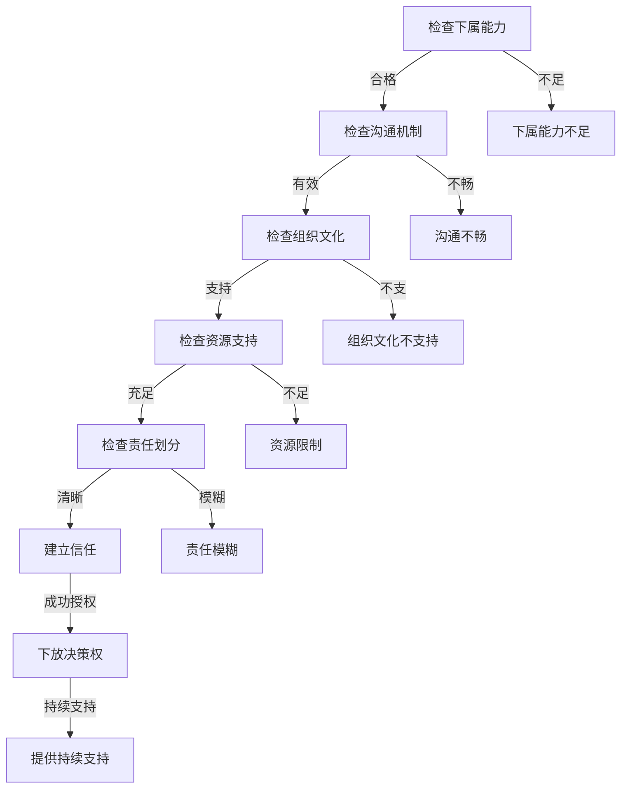
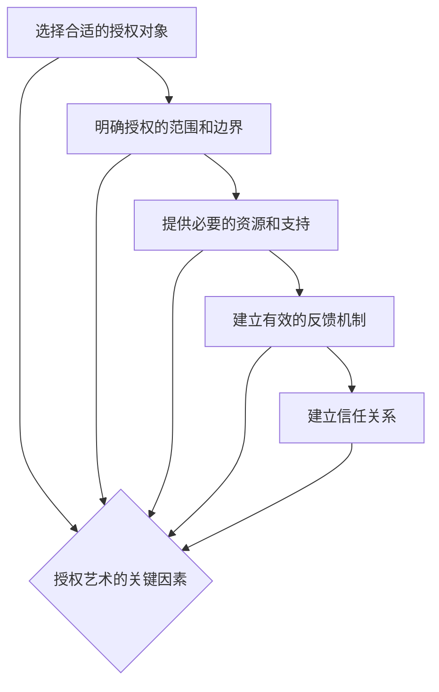
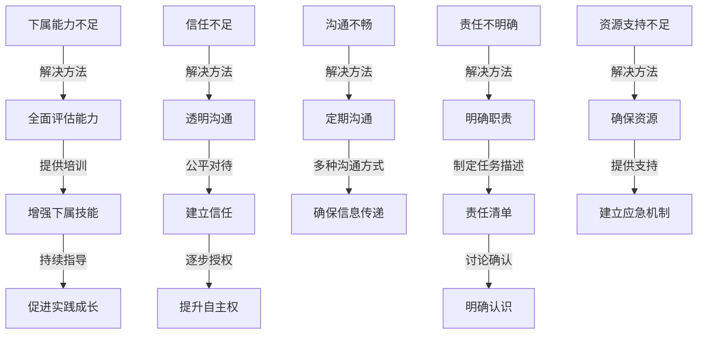
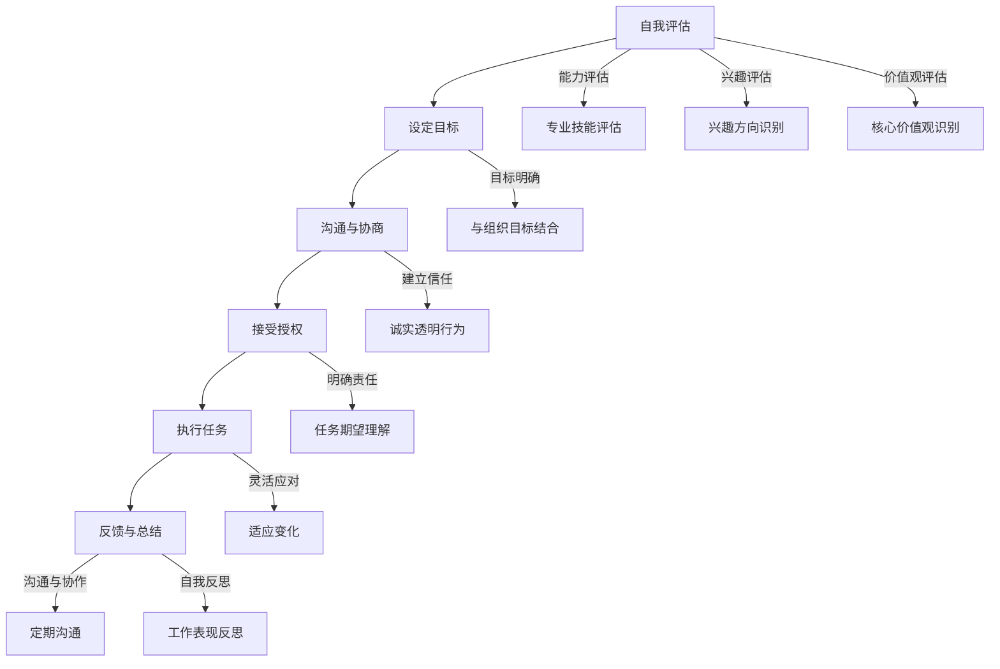
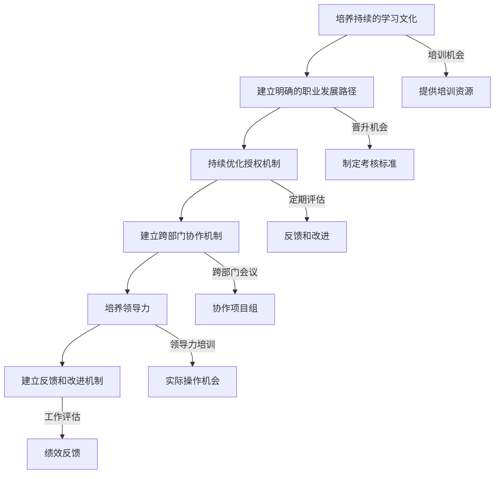
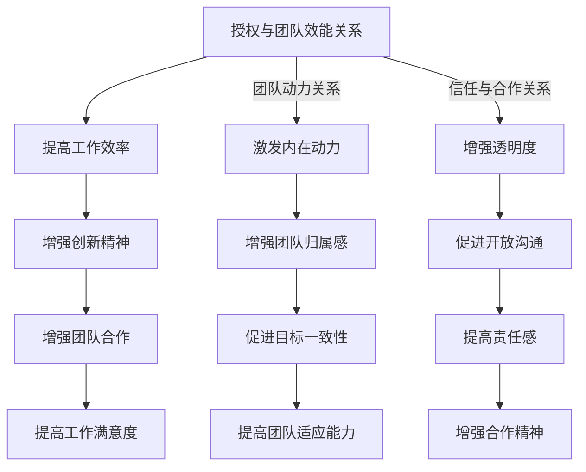
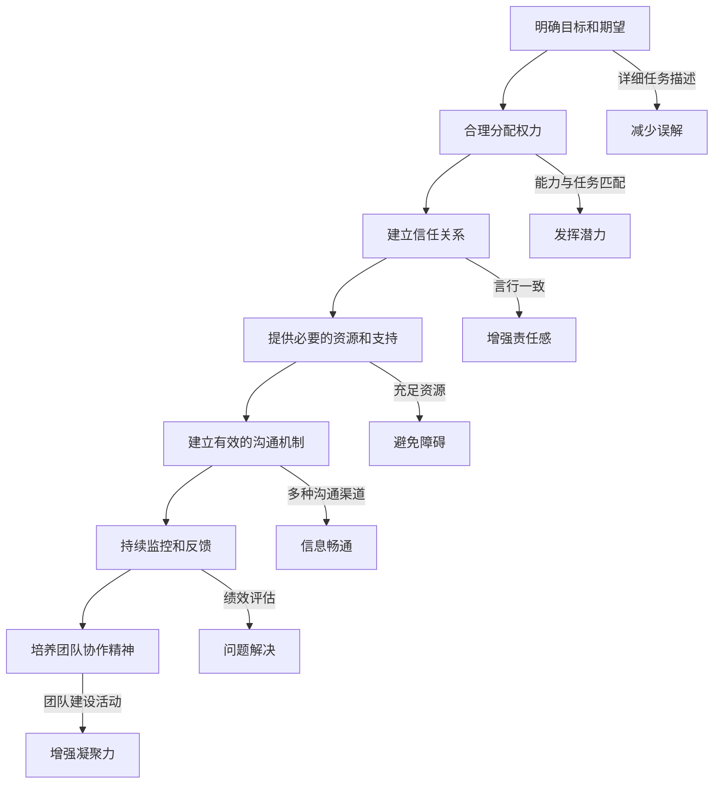
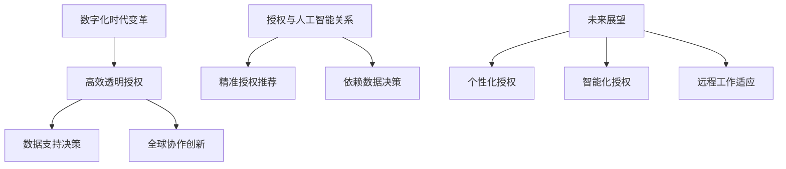

                 


### 引言

#### 背景介绍

在现代企业管理中，高效团队的建设成为企业成功的关键因素之一。授权作为一种管理策略，不仅能够激发团队成员的潜力，提升团队整体效能，还能促进组织创新和发展。然而，许多管理者在实施授权过程中常常面临诸多困惑和挑战，如如何平衡控制与信任、如何识别合适的授权对象等。

本文旨在探讨有效授权的核心原则和实践策略，帮助管理者掌握授权的艺术，释放团队潜能，提升团队效能。文章将从理解授权的重要性、明确授权的核心原则、掌握授权流程与策略，到实际操作中的团队授权、个人授权、跨部门授权等方面，全面剖析授权的各个方面。同时，文章还将探讨授权与领导力的关系，以及如何通过授权实现组织的持续改进。

通过阅读本文，读者将能够：

1. 深入理解授权的核心概念及其重要性。
2. 明确授权的核心原则，并掌握有效的授权策略。
3. 掌握授权流程与技巧，提升团队协作效率。
4. 通过案例分析，了解授权在不同场景下的最佳实践。

#### 文章关键词

- 授权
- 团队效能
- 领导力
- 授权流程
- 授权策略
- 团队授权
- 个人授权
- 跨部门授权

#### 文章摘要

本文以《有效授权：释放团队潜能的艺术》为题，系统地探讨了授权在企业管理中的重要性及其核心原则和实践策略。文章首先介绍了授权的定义和背景，随后详细阐述了授权的核心原则，如明确目标和期望、建立信任、分权与集权等。接着，文章从授权流程与策略、团队授权、个人授权、跨部门授权等方面，详细讲解了授权的实际操作方法。最后，文章通过案例分析，总结了授权的最佳实践，并探讨了授权与领导力、组织文化的关系。通过本文的阅读，读者将能够全面了解授权的概念、方法和实践，提升团队效能，推动组织发展。

## 第一部分：授权的核心原则

### 第1章：理解授权

#### 1.1 授权的重要性

授权是企业管理中至关重要的一环，它不仅是提高团队效率和激发员工潜力的重要手段，也是实现组织战略目标的关键步骤。首先，授权能够提升团队成员的自主性和责任感。当管理者将决策权和责任赋予下属时，下属在完成任务的过程中将拥有更多的自主权，从而能够更加主动地思考和解决问题，提高工作的创造力和效率。其次，授权有助于增强团队协作。通过授权，团队成员可以在各自擅长的领域发挥特长，协同合作，共同完成更复杂的任务，从而实现团队效能的最大化。此外，授权还能够促进组织的创新和发展。当团队成员被赋予足够的信任和自由度时，他们更可能提出新的想法和解决方案，推动组织不断进步。

总之，授权在企业管理中的重要性不可忽视。它不仅能够提升团队成员的积极性和创造力，还能促进团队协作和组织的长期发展。为了更好地理解和应用授权，我们需要进一步探讨授权的定义、核心原则和实践策略。

### 1.2 授权与委托的区别

授权与委托是两种不同的管理概念，尽管它们在某些方面有相似之处，但它们在本质和管理效果上存在显著差异。授权是指管理者将决策权和管理责任授予下属，使其在规定的范围内自主决策和执行任务。授权的核心在于信任和权力下放，目的是激励下属的积极性和创造力，提高工作效率。而委托则是指管理者将具体任务或工作分配给下属，但决策权和责任仍由管理者掌握。委托更多的是一种任务的分配，下属在执行任务时需要遵循管理者的指示，缺乏自主决策的空间。

从定义上看，授权与委托的主要区别在于权力下放的程度。授权是将决策权和责任完全下放，下属拥有自主决策的权利，而委托则是在管理者控制下进行任务执行，下属的决策权相对有限。这种差异导致了它们在管理效果上的不同。

首先，授权能够激发下属的积极性和创造力。由于授权赋予了下属更多的自主权，下属在完成任务时能够发挥自己的专业知识和创造力，提出创新的解决方案，从而提高工作质量和效率。而委托则可能限制下属的自主性，导致工作缺乏活力和创新。

其次，授权有助于提升团队协作。通过授权，团队成员可以在各自的领域内发挥特长，相互协作，共同完成复杂的任务。这种协作关系能够增强团队成员之间的信任和依赖，提高团队整体效能。而委托则可能导致团队成员之间的隔阂和依赖性降低，影响团队协作。

最后，授权能够促进组织的持续发展。通过授权，管理者能够将更多的时间和精力投入到战略规划和决策中，从而更好地应对市场变化和挑战。而委托则可能使管理者陷入日常事务中，无法专注于组织的长期发展。

总之，授权与委托在管理方式上存在本质差异。授权能够激发下属的积极性和创造力，提升团队协作和组织的长期发展。因此，管理者应充分理解授权与委托的区别，并根据实际情况合理选择和运用授权，以实现组织的最佳效能。

### 1.3 授权的障碍与挑战

在实施授权的过程中，管理者常常会遇到各种障碍和挑战，这些因素可能会阻碍授权的有效实施，从而影响团队效能和组织的长期发展。以下是几个常见的授权障碍与挑战：

#### 1. 对下属的不信任

管理者对下属的不信任是授权过程中最常见也最具破坏性的障碍之一。管理者可能担心下属无法胜任任务，或者担心下属在获得自主权后滥用权力。这种不信任会导致管理者倾向于保留决策权，不愿意将权力下放。这不仅限制了下属的发展空间，还可能挫伤下属的积极性和创造力。

#### 2. 害怕失去控制

许多管理者认为，授权意味着失去对团队和任务的直接控制。这种恐惧可能导致管理者不愿放手，即使在下属具备完成任务的能力时，也选择亲自管理。失去控制的担忧会影响管理者对授权的接受程度，阻碍授权的推进。

#### 3. 下属能力不足

下属的能力水平是决定授权成功与否的关键因素之一。如果下属缺乏必要的技能和知识，管理者可能会担心授权后任务无法顺利完成。这种情况会导致管理者对授权持谨慎态度，甚至放弃授权。

#### 4. 沟通不畅

有效的沟通是授权成功的关键。如果管理者与下属之间的沟通不畅，下属可能无法理解管理者的期望和目标，从而导致任务执行偏离预期。此外，沟通不畅还可能引发误解和冲突，进一步影响授权的实施。

#### 5. 文化障碍

企业文化是影响授权实施的重要因素。在一些组织文化中，层级分明、权威至上的观念根深蒂固，管理者习惯于独揽大权，下属也缺乏主动性和创新能力。这种文化环境会阻碍授权的实施，影响团队效能。

#### 6. 责任模糊

授权过程中，责任划分不清可能导致责任推卸和任务执行不力。如果下属在完成任务过程中遇到问题，而责任归属不明确，可能会导致下属产生依赖心理，不愿主动承担责任。

#### 7. 短期目标与长期发展的冲突

管理者在授权时，可能会面临短期目标和长期发展的冲突。一些管理者可能出于短期绩效考虑，不愿授权，担心下属无法在短期内达到预期目标，从而影响自己的绩效评估。

#### 8. 资源限制

资源限制也是授权过程中的一大挑战。如果组织内部资源有限，管理者可能担心授权后下属在资源支持方面不足，影响任务的完成质量。

要克服这些授权障碍与挑战，管理者需要采取一系列策略，包括提升下属能力、改善沟通机制、建立信任关系、优化组织文化等。通过有效应对这些障碍，管理者能够更好地实施授权，释放团队潜能，提升组织效能。

### 伪代码
```python
def authorize_with_challenges(employee, task):
    # 检查下属能力
    if not employee.is_qualified():
        print("下属能力不足，无法进行授权。")
        return
    
    # 检查沟通机制
    if not communication_is_effective(employee, manager):
        print("沟通不畅，无法进行授权。")
        return
    
    # 检查组织文化
    if organizational_culture_does_not_support_authority():
        print("组织文化不支持授权，无法进行授权。")
        return
    
    # 检查资源支持
    if not sufficient_resources_are_available():
        print("资源限制，无法进行授权。")
        return
    
    # 检查责任划分
    if responsibility_is_not_clear():
        print("责任模糊，无法进行授权。")
        return
    
    # 建立信任
    build_trust(employee, manager)
    
    # 下放决策权
    delegate_decision_rights(employee, task)
    
    # 提供持续支持
    provide_continual_support(employee, manager)
```

### Mermaid 流程图


## 第2章：授权的核心原则

### 2.1 明确目标和期望

在授权过程中，明确目标和期望是确保授权顺利实施的关键步骤。明确的目标和期望可以帮助下属更好地理解任务的内涵，从而更有针对性地开展工作。首先，管理者需要明确地定义任务目标，确保下属对任务的核心任务和目标有清晰的认识。这可以通过制定详细的任务描述、设定明确的关键绩效指标（KPI）等方式实现。其次，管理者需要明确表达对下属的期望，包括工作质量、时间节点和成果要求。这有助于下属了解管理者的期望值，从而更好地调整工作计划和方法。

为了确保目标和期望的明确性，管理者可以采取以下措施：

1. **详细任务描述**：在授权任务时，管理者应详细描述任务的内容、目标、时间表和资源需求，确保下属对任务有全面的理解。
2. **设立KPI**：通过设定关键绩效指标，管理者可以量化任务目标，使下属有具体的执行标准。
3. **定期沟通**：在任务执行过程中，定期与下属沟通，了解任务进展情况，及时调整目标和期望，确保任务方向的正确性。
4. **提供反馈**：及时给予下属工作反馈，帮助他们认识到自己的优势和不足，并在需要时提供指导和支持。

通过明确目标和期望，管理者能够提高授权的效率，确保任务的顺利完成，同时也有助于提升下属的工作积极性和责任感。

### 2.2 建立信任

建立信任是授权成功的关键因素之一。信任不仅是授权的基础，也是团队协作和长期合作的前提。管理者需要通过一系列行为和措施来建立和维护与下属之间的信任关系。

首先，管理者应保持言行一致。管理者在授权过程中需要做到承诺即做到，避免轻易改变决策或承诺，以树立良好的信用形象。其次，管理者需要公平对待下属。在决策过程中，管理者应避免偏袒，确保每位下属都有公平的机会展示自己的能力和贡献。此外，管理者还应积极倾听下属的意见和建议，尊重他们的观点和感受，这有助于增强下属的参与感和归属感。

为了建立和维护信任，管理者可以采取以下措施：

1. **透明沟通**：管理者应保持与下属的沟通透明，及时分享组织的战略、目标和进展情况，让下属了解组织的全貌。
2. **信任培养活动**：通过团队建设活动、培训和工作坊等形式，培养团队成员之间的信任，增强团队合作精神。
3. **赋予自主权**：在适当的情况下，管理者应赋予下属一定的自主权，让他们在规定范围内自由决策，从而增强他们的责任感和信任感。
4. **反馈与支持**：管理者应定期给予下属工作反馈，并在他们遇到困难时提供支持和帮助，这有助于增强下属对管理者的信任。
5. **建立共同目标**：通过设定共同的目标和愿景，管理者可以与下属建立共同的价值观和使命，从而增强团队凝聚力。

通过这些措施，管理者能够建立和维护与下属之间的信任关系，为授权的有效实施奠定坚实基础。

### 2.3 分权与集权

分权与集权是企业管理中关于权力分配的两种不同策略。分权是指将决策权和管理责任分散到组织中的各个层级和部门，使每个层级和部门能够在各自的职责范围内独立决策和行动。而集权则是指将决策权和管理责任集中在组织的最高管理层，所有重大决策均由最高管理层做出。

分权与集权各有其优缺点。分权的优点在于能够提高决策效率，增强下属的自主性和创新能力，从而更好地适应外部环境的变化。在分权模式下，下属拥有更多的决策权，能够根据具体情况迅速做出反应，减少信息传递过程中的失真，提高工作效率。此外，分权还可以培养下属的管理能力和责任感，提高团队的整体素质。

然而，分权也存在一些缺点。首先，过度分权可能导致决策分散，各部门之间的协调难度增加，影响整体战略的一致性。其次，分权可能会导致信息孤岛现象，各部门之间的信息交流不畅，影响资源的合理配置和利用。最后，分权可能会增加管理成本，因为每个部门都需要配备相应的管理团队。

相比之下，集权的优点在于能够确保决策的一致性和统一性，减少内部冲突和资源浪费。在集权模式下，决策集中在最高管理层，能够更好地协调各部门之间的工作，确保组织目标的实现。此外，集权还可以降低管理成本，提高决策效率。

然而，集权也存在一些缺点。首先，过度集权可能导致管理层负担过重，难以应对复杂多变的市场环境。其次，集权可能会限制下属的自主性和创新能力，影响团队的活力和创造力。此外，集权还可能导致信息传递过程中的失真，降低决策的准确性。

在企业管理中，分权与集权并不是非此即彼的选择，而是一个动态平衡的过程。管理者应根据组织的发展阶段、市场环境、文化特点和战略目标等因素，灵活运用分权与集权策略，实现权力的合理分配和高效管理。

首先，管理者应明确组织的战略目标和核心价值观，确保分权与集权策略与组织目标一致。其次，管理者应建立有效的沟通机制，确保各部门之间的信息交流畅通。此外，管理者还应建立完善的监督和评估体系，确保分权与集权实施的效果。

总之，分权与集权各有其优缺点，管理者应根据实际情况灵活运用，实现权力的合理分配和高效管理。通过有效的分权与集权策略，管理者能够激发团队潜能，提高组织效能，实现长期可持续发展。

### 2.4 授权的艺术

授权不仅仅是将任务分配给下属，更是一种管理和激励的艺术。管理者在授权过程中需要综合考虑多种因素，以实现授权的效果最大化。以下是一些关键的授权艺术：

首先，**选择合适的授权对象**至关重要。管理者应识别出那些具备胜任能力的下属，并给予他们相应的授权。这可以通过对下属的技能、经验和态度进行全面评估来实现。选择合适的授权对象能够确保任务顺利完成，同时也能增强下属的自信心和责任感。

其次，**明确授权的范围和边界**也是授权艺术的重要一环。管理者应在授权时明确下属的决策权和责任范围，避免授权过度或不足。明确边界有助于下属更好地理解自己的职责，避免因模糊的授权范围而产生的混乱和责任推卸。

第三，**提供必要的资源和支持**是确保授权成功的关键。管理者应在授权过程中确保下属获得完成任务所需的资源，包括人力、资金和信息技术支持等。同时，管理者还应提供必要的培训和心理支持，帮助下属克服工作中的困难和挑战。

第四，**建立有效的反馈机制**能够帮助管理者及时了解授权的实施情况，及时调整和优化授权策略。管理者应定期与下属进行沟通，了解他们的工作进展和遇到的困难，提供及时的反馈和建议。这种反馈机制不仅能够提高下属的工作效率，还能增强团队的合作精神。

最后，**建立信任关系**是授权艺术的核心。管理者应通过言行一致、公平对待下属、尊重下属的意见和贡献等方式建立和维护信任关系。信任关系的建立能够增强下属的积极性和责任感，提高团队的整体效能。

通过运用这些授权艺术，管理者能够更好地激发团队潜能，提高组织效能，实现长期可持续发展。

### Mermaid 流程图


### 伪代码
```python
def effective_authorization(employee, task):
    # 选择合适的授权对象
    if not employee.is_qualified():
        return "授权对象不合格，无法进行授权。"

    # 明确授权的范围和边界
    authorized_range = define_authorized_range(task)
    
    # 提供必要的资源和支持
    provide_resources(employee, authorized_range)

    # 建立有效的反馈机制
    setup_feedback_system(employee, task)

    # 建立信任关系
    build_trust(employee)

    return "授权成功。"
```

## 第3章：授权流程与策略

### 3.1 制定授权计划

在实施授权前，制定一个详尽的授权计划是确保授权过程顺利进行的关键步骤。一个全面的授权计划应包括以下内容：

首先，**确定授权目标**。明确授权的目标可以帮助管理者更好地理解授权的目的和预期成果。这包括提升团队效率、促进创新、培养下属能力等。通过明确目标，管理者可以确保授权的方向正确，避免资源浪费。

其次，**界定授权范围**。授权范围应明确下属在授权任务中可以决策的具体事项。这可以通过制定详细的授权清单来实现，确保下属在授权范围内能够独立行动，同时避免越权行为。

第三，**设定时间表**。为授权任务设定明确的时间节点，有助于管理者监控任务的进展情况，确保任务按计划进行。时间表应包括任务开始、执行和结束的时间点，以及每个关键阶段的时间限制。

第四，**明确责任分配**。在授权计划中，应明确每个下属的职责和责任，确保任务执行过程中的责任划分清晰。这有助于避免责任推卸，提高团队成员的积极性和责任感。

第五，**制定支持措施**。为授权任务提供必要的资源和支持，包括人力资源、技术支持、资金等。确保下属在执行任务过程中能够得到充分的支持，提高任务完成的效率和效果。

最后，**制定监控和反馈机制**。授权计划应包括对授权任务的监控和反馈机制，确保管理者能够及时了解任务进展情况，及时调整授权策略。通过定期沟通和反馈，管理者可以及时发现和解决问题，确保授权任务顺利进行。

通过制定详尽的授权计划，管理者能够为授权过程提供明确的方向和保障，确保授权目标的实现。

### 3.2 授权对话的技巧

成功的授权离不开有效的对话，管理者与下属之间的沟通技巧在授权过程中起着至关重要的作用。以下是一些关键的授权对话技巧，帮助管理者与下属建立良好的沟通关系，确保授权的顺利进行。

首先，**倾听是关键**。在授权对话中，管理者应给予下属充分的发言机会，倾听他们的意见和建议。这有助于管理者了解下属的想法和需求，同时也能增强下属的参与感和信任感。管理者应保持开放的心态，耐心倾听下属的表达，避免打断或立即反驳。

其次，**明确表达期望**。管理者在授权时应清晰、具体地表达对下属的期望，包括任务的目标、质量要求、时间节点等。通过明确的期望，下属能够更好地理解管理者的要求，从而更有针对性地开展工作。管理者可以使用具体的事例和场景来描述期望，确保下属对任务有全面的理解。

第三，**建立信任关系**。信任是授权成功的基础，管理者应通过言行一致、公平对待下属、尊重他们的意见等方式建立和维护信任关系。在对话中，管理者应表现出对下属的信任，给予他们足够的自主权，鼓励他们独立思考和决策。这有助于增强下属的自信心和责任感，提高工作积极性。

第四，**鼓励反馈和沟通**。管理者应鼓励下属在授权过程中提供反馈，包括遇到的问题、面临的挑战和需要支持的地方。通过开放的沟通，管理者能够及时了解下属的工作情况，提供必要的帮助和支持。同时，这也有助于建立良好的沟通文化，促进团队协作。

第五，**保持积极的态度**。在授权对话中，管理者应保持积极、乐观的态度，即使遇到困难和挑战，也要鼓励下属一起面对。积极的态度能够激发下属的斗志，增强团队的凝聚力。

通过运用这些授权对话技巧，管理者能够与下属建立有效的沟通，确保授权目标的实现。良好的沟通不仅有助于任务的顺利完成，还能提升团队的合作精神和整体效能。

### 3.3 授权与反馈机制

有效的授权不仅仅是任务的分配，更需要通过反馈机制来确保授权任务的顺利进行和持续改进。建立良好的反馈机制能够帮助管理者及时了解下属的工作情况，发现潜在问题，并提供必要的支持和指导。

首先，**定期反馈**是授权过程中不可或缺的一部分。管理者应定期与下属进行面对面或书面的反馈交流，了解任务的进展情况、遇到的挑战以及下属的需求和意见。这种定期反馈不仅能够帮助管理者及时调整授权策略，还能增强下属的责任感和工作动力。

其次，**反馈内容要具体和有针对性**。在反馈时，管理者应具体指出下属在工作中的优点和不足，避免泛泛而谈。例如，可以指出下属在任务完成中的亮点，如解决问题的方法、团队合作的表现等，同时也要指出需要改进的地方，如时间管理、沟通技巧等。具体的反馈能够帮助下属明确改进的方向，提高工作效率。

第三，**积极倾听下属的意见和反馈**。管理者在反馈过程中应积极倾听下属的意见和反馈，尊重他们的观点和感受。这有助于建立良好的沟通关系，增强下属的参与感和信任感。同时，管理者可以通过下属的反馈了解授权实施的效果，发现潜在的问题和改进空间。

第四，**建立持续的反馈循环**。授权与反馈是一个持续的过程，管理者应建立持续的反馈循环，不断调整和优化授权策略。通过持续的反馈和改进，管理者能够不断提高授权的效果，促进团队的发展和成长。

最后，**利用反馈进行激励**。管理者可以通过反馈来激励下属，表彰他们在工作中的优秀表现，鼓励他们继续努力。同时，对于需要改进的地方，管理者可以提供针对性的支持和培训，帮助下属提升能力。

通过建立有效的反馈机制，管理者能够确保授权任务的顺利进行，提高团队的整体效能，推动组织的持续发展。

### 3.4 授权的常见问题与解决方法

在授权的过程中，管理者常常会遇到一些常见的问题，这些问题可能会影响授权的效果。以下是一些常见的问题以及相应的解决方法：

#### 1. 下属能力不足

问题：在授权时，管理者可能会发现下属在执行任务时缺乏必要的技能和经验，导致任务完成质量不高或进度缓慢。

解决方法：首先，管理者应确保在授权前对下属的能力进行全面评估，选择具备胜任能力的下属进行授权。对于能力不足的下属，管理者可以提供针对性的培训和支持，帮助他们提升技能。其次，在任务执行过程中，管理者应提供持续的指导和支持，确保下属能够在实践中学习和成长。

#### 2. 信任不足

问题：管理者可能对下属的信任不足，担心下属在获得授权后无法承担相应的责任或滥用权力。

解决方法：建立信任是授权成功的关键。管理者可以通过透明沟通、公平对待和积极倾听下属的意见来建立和维护信任关系。此外，管理者可以逐步增加下属的授权范围，从小的任务开始，逐渐提升他们的自主权，从而增强信任。

#### 3. 沟通不畅

问题：管理者与下属之间的沟通不畅，导致任务目标不明确或工作过程中出现误解。

解决方法：建立有效的沟通机制是解决这一问题的关键。管理者应定期与下属进行沟通，了解任务进展情况，及时解决工作中遇到的问题。同时，管理者可以采用多种沟通方式，如面对面会议、邮件、即时通讯工具等，以确保信息的及时传递和准确理解。

#### 4. 责任不明确

问题：在授权过程中，下属可能不清楚自己的职责范围，导致工作出现推诿和责任不清的现象。

解决方法：管理者应在授权时明确下属的职责和责任，制定详细的任务描述和责任清单。同时，管理者可以与下属进行讨论，确保他们对任务和责任有清晰的认识。定期反馈和沟通也有助于明确责任，防止责任推卸。

#### 5. 资源支持不足

问题：下属在执行任务时可能缺乏必要的资源和支持，导致任务进展缓慢或无法完成。

解决方法：管理者应在授权前确保下属获得完成任务所需的资源和支持。这包括人力资源、资金、技术支持和信息资源等。管理者还应建立应急支持机制，确保在下属遇到困难时能够及时提供帮助。

通过以上方法，管理者可以有效地解决授权过程中常见的问题，提高授权的效果，促进团队的协作和组织的长期发展。

### Mermaid 流程图


### 伪代码
```python
def address_common_issues(employee, task):
    if not employee.is_qualified():
        employee.train()
    
    if trust_issue(employee, manager):
        build_trust(employee, manager)
    
    if communication_issue(employee, manager):
        ensure_effective_communication(employee, manager)
    
    if responsibility_issue(employee, task):
        clarify_responsibilities(employee, task)
    
    if resource_issue(employee, task):
        provide_resources(employee, task)

    delegate_decision_rights(employee, task)
```

## 第4章：授权与领导力

### 4.1 授权与领导风格的联系

授权与领导风格密切相关，不同的领导风格会影响授权的实施效果。领导者应根据组织的战略目标和团队的特点，选择合适的领导风格，以实现授权的最佳效果。

#### 1. 超越式领导风格

超越式领导风格强调领导者通过与下属建立深厚的信任关系，激发下属的潜能，鼓励他们进行创新和自主决策。这种领导风格适用于高度复杂和不确定性的环境，能够有效推动授权。领导者需要具备开放和包容的心态，愿意接受下属的建议和意见，并为下属提供必要的支持和资源。

#### 2. 参与式领导风格

参与式领导风格强调领导者在决策过程中与下属进行充分的沟通和协商，让下属参与到决策过程中，提高他们的参与感和责任感。这种领导风格适用于团队协作任务较多的环境，能够有效促进授权。领导者需要具备良好的沟通能力和团队合作精神，确保团队成员在决策过程中能够充分表达自己的观点。

#### 3. 命令式领导风格

命令式领导风格强调领导者通过明确指示和严格监督，确保任务的顺利完成。这种领导风格在任务明确、时间紧迫的情况下较为有效，但可能不利于授权的推广。领导者需要具备决策能力和执行力，能够迅速做出决策并监督下属的工作。

#### 4. 支持式领导风格

支持式领导风格强调领导者关心下属的需求和成长，提供情感上的支持，帮助下属克服困难。这种领导风格适用于需要高度协作和团队合作的环境，能够有效促进授权。领导者需要具备同理心和关怀能力，确保下属在授权过程中感受到领导的支持。

#### 5. 指导式领导风格

指导式领导风格强调领导者通过提供明确的指导和反馈，帮助下属完成任务。这种领导风格在下属能力较强但需要明确方向时较为适用，能够有效推动授权。领导者需要具备专业知识和指导能力，确保下属能够顺利完成任务。

不同领导风格在授权中的应用：

- 超越式领导风格：适用于需要高度创新和自主决策的任务，能够激发下属的创造力和积极性。
- 参与式领导风格：适用于需要团队合作和共同决策的任务，能够提高团队的凝聚力和工作效率。
- 命令式领导风格：适用于任务明确和时间紧迫的环境，能够确保任务按时完成。
- 支持式领导风格：适用于需要高度协作和团队支持的任务，能够提高下属的满意度和忠诚度。
- 指导式领导风格：适用于需要明确指导和反馈的任务，能够确保下属的工作质量和效率。

领导者应根据组织的实际情况和任务特点，选择合适的领导风格，以实现授权的最佳效果。

### 4.2 提升领导力的授权策略

提升领导力是每位领导者的重要任务，而有效的授权策略是实现领导力提升的关键途径。以下是一些提升领导力的授权策略：

#### 1. 培养下属的能力

领导者应关注下属的能力培养，通过培训、指导和实践机会，提高下属的专业技能和综合素质。这不仅能够增强下属的工作能力，还能提高他们的自信心和责任感，从而为授权奠定基础。

#### 2. 建立信任关系

信任是授权的基础，领导者应通过言行一致、公平对待和积极倾听等方式建立和维护与下属之间的信任关系。信任关系的建立能够增强下属的参与感和责任感，提高授权的效果。

#### 3. 分散决策权

领导者应适当分散决策权，让下属在各自的职责范围内拥有更多的自主权。这有助于提高下属的决策能力和自主性，促进团队的创新和发展。

#### 4. 提供支持和资源

领导者应为下属提供完成任务所需的资源和支持，包括人力、资金和技术等。这有助于下属更好地完成工作任务，提高授权的效果。

#### 5. 定期反馈和指导

领导者应定期与下属进行反馈和指导，了解下属的工作进展和遇到的困难，提供针对性的建议和支持。这有助于下属不断改进工作方法，提高工作效率。

#### 6. 鼓励团队合作

领导者应鼓励团队合作，促进团队成员之间的沟通和协作。通过团队合作，下属能够相互学习、分享经验和资源，提高整体团队的效能。

#### 7. 持续学习和改进

领导者应持续学习和改进自己的领导能力，关注行业动态和管理理念的变化。通过不断学习和实践，领导者能够不断提高自己的领导水平，为授权提供更加有效的策略。

通过以上授权策略，领导者能够提升自己的领导力，促进团队的成长和组织的持续发展。

### 4.3 高效授权的领导思维模式

要实现高效授权，领导者需要具备特定的思维模式，这些思维模式不仅能够帮助领导者更好地理解授权的核心原则，还能在实际操作中提高授权的效果。以下是一些高效授权的领导思维模式：

#### 1. **系统思维**

系统思维是一种将组织视为一个相互关联的复杂系统的思维方式。领导者应理解授权不仅仅是将任务分配给下属，而是一个涉及多个层面的动态过程。这包括分析组织的整体战略目标、评估下属的能力和需求，以及确保授权与组织的长期目标相一致。通过系统思维，领导者可以更全面地考虑授权的各个方面，从而提高授权的有效性。

#### 2. **成长导向思维**

成长导向思维强调领导者对下属能力的培养和提升。领导者应认识到，授权不仅仅是让下属完成任务，更是为他们提供成长和发展的机会。这种思维模式要求领导者关注下属的职业生涯发展，为他们提供培训、指导和支持，从而增强下属的能力和自信心。通过这种思维模式，领导者能够培养出更多能够承担更大责任的下属。

#### 3. **灵活应变思维**

灵活应变思维要求领导者具备适应变化和应对不确定性的能力。在授权过程中，领导者应能够灵活调整授权策略，根据下属的表现和环境的变化做出及时的调整。这种思维模式有助于领导者避免僵化的管理方式，使授权更加灵活和有效。

#### 4. **双赢思维**

双赢思维强调领导者与下属之间的合作和共赢。领导者应注重建立良好的沟通和信任关系，确保授权过程中双方的利益得到平衡。通过双赢思维，领导者能够激励下属积极参与授权过程，共同实现组织目标。

#### 5. **战略思维**

战略思维要求领导者具备从长远角度审视授权的能力。领导者应将授权纳入组织的整体战略规划中，确保授权策略与组织的长期目标和发展方向相一致。通过战略思维，领导者能够更好地把握授权的宏观方向，实现组织的持续发展和增长。

#### 6. **反思与学习思维**

反思与学习思维强调领导者对自身和管理实践的不断反思和学习。领导者应定期评估授权的效果，总结经验教训，并从中学习和改进。这种思维模式有助于领导者不断提升自己的管理能力和授权水平，实现持续改进。

通过培养以上高效授权的领导思维模式，领导者能够更好地理解授权的核心原则，并在实际操作中提高授权的效果，促进组织的长期发展。

### Mermaid 流程图
```mermaid
graph TD
    A[系统思维] --> B[理解授权的全面性]
    B -->|考虑多层面| C{分析组织战略 | 评估下属能力 | 确保目标一致}
    
    D[成长导向思维] --> E[培养下属能力]
    E --> F{提供培训 | 指导支持 | 职业发展}
    
    G[灵活应变思维] --> H[调整授权策略]
    H -->|应对变化| I{及时调整 | 灵活管理}
    
    J[双赢思维] --> K[平衡双方利益]
    K --> L{良好沟通 | 共同参与}
    
    M[N战略思维] --> O[审视授权与战略]
    O -->|规划方向| P{实现长期发展}
    
    Q[反思与学习思维] --> R[持续改进]
    R -->|评估效果| S{总结经验 | 学习改进}
```

### 伪代码
```python
def effective_authorization领导思维模式(employee, task, organization):
    # 系统思维
    if not align_with_organization_strategy(employee, task, organization):
        return "授权与组织战略不一致，需调整。"
    
    # 成长导向思维
    if not employee.is_qualified():
        employee.train()
    
    # 灵活应变思维
    adjust_authorization_as_needed(employee, task)
    
    # 双赢思维
    ensure_benefits_for_both_sides(employee, manager)
    
    # 战略思维
    align_authorization_with_long_term_goals(employee, task, organization)
    
    # 反思与学习思维
    continuously_improve_authorization_process(employee, manager, organization)
    
    return "授权成功。"
```

## 第二部分：授权的实际操作

### 第5章：团队授权的实践

团队授权是提高团队效率和协作能力的重要手段。在团队授权中，管理者需要明确授权的原则、步骤，并运用有效的实践策略，以实现团队的最大潜力。以下将详细探讨团队授权的原则、步骤和具体实践。

### 5.1 团队授权的原则

#### 1. 信任与责任

团队授权的基础是信任与责任。管理者必须信任团队成员，给予他们足够的自主权，同时明确团队成员的责任。这种信任与责任的关系能够激发团队成员的积极性和创造力。

#### 2. 明确目标

在团队授权前，管理者需要明确团队的目标和期望，确保团队成员对任务有清晰的理解。明确的目标有助于团队成员集中精力，提高工作效率。

#### 3. 分配适当的权力

管理者应根据团队成员的能力和任务的要求，分配适当的权力。适当的权力分配不仅能够提高团队的工作效率，还能促进团队成员的个人成长。

#### 4. 持续沟通与反馈

团队授权过程中，管理者应保持与团队成员的持续沟通与反馈。这不仅有助于了解团队成员的工作进展，还能及时解决遇到的问题，确保任务的顺利完成。

#### 5. 培养团队合作精神

团队授权强调团队合作，管理者需要培养团队成员的团队合作精神，促进团队成员之间的沟通与协作，提高团队的整体效能。

### 5.2 团队授权的步骤

#### 1. 评估团队成员的能力

在团队授权前，管理者需要对团队成员的能力进行全面评估，确保团队成员具备完成任务的能力。这可以通过观察、讨论和绩效评估等方式进行。

#### 2. 明确团队目标和期望

管理者需要明确团队的目标和期望，与团队成员进行沟通，确保团队成员对任务有清晰的理解。明确的目标有助于团队成员集中精力，提高工作效率。

#### 3. 分配任务与权力

根据团队成员的能力和任务的要求，管理者需要合理分配任务和权力。管理者可以采用任务分解法，将复杂的任务分解为多个小任务，然后分配给合适的团队成员。

#### 4. 建立沟通机制

管理者应建立有效的沟通机制，确保团队成员能够及时沟通和分享信息。这可以通过定期会议、即时通讯工具等方式实现。

#### 5. 提供必要的资源和支持

管理者需要确保团队成员获得完成任务所需的资源和支持。这包括人力、资金、技术支持等。

#### 6. 持续监控与反馈

在团队授权过程中，管理者需要持续监控任务进展，并提供反馈。这有助于了解团队成员的工作情况，及时调整授权策略。

#### 7. 庆祝成功与反思失败

当团队成功完成任务时，管理者应庆祝成功，激励团队成员。同时，管理者应反思失败的任务，总结经验教训，为未来的授权提供参考。

### 5.3 团队授权的案例分析

#### 案例一：某科技公司团队授权实践

某科技公司在一次新产品的开发项目中，采用了团队授权的方法。项目管理者首先对团队成员进行了能力评估，明确了每个人的特长和职责。然后，管理者与团队共同制定了项目的目标和期望，确保团队成员对任务有清晰的理解。

在项目执行过程中，管理者通过定期会议和即时通讯工具与团队成员保持沟通，及时了解工作进展和遇到的问题。管理者还提供了必要的技术支持和资源，确保团队成员能够顺利完成任务。

在项目结束后，管理者对团队成员进行了绩效评估，并总结了项目过程中的经验和教训。这次团队授权实践不仅提高了项目的效率，还培养了团队成员的协作能力和创新能力。

#### 案例二：某非营利组织团队授权实践

某非营利组织在组织一次大型公益活动时，采用了团队授权的方法。活动管理者首先对团队成员进行了培训，确保他们具备完成活动的能力。然后，管理者明确了活动的目标和期望，并与团队成员进行了讨论。

在活动执行过程中，管理者通过定期会议和即时通讯工具与团队成员保持沟通，及时了解活动进展和遇到的问题。管理者还提供了必要的资源和支持，确保活动顺利进行。

活动结束后，管理者对团队成员进行了评估，并总结了活动过程中的经验和教训。这次团队授权实践不仅提高了活动的效率，还增强了团队成员的团队合作精神和责任感。

通过以上案例分析，我们可以看到团队授权在提高团队效率和协作能力方面的显著效果。管理者应灵活运用团队授权的原则和步骤，实现团队的最大潜力。

### Mermaid 流程图
```mermaid
graph TD
    A[评估团队成员能力] --> B[明确团队目标和期望]
    B --> C[分配任务与权力]
    C --> D[建立沟通机制]
    D --> E[提供必要资源和支持]
    E --> F[持续监控与反馈]
    F --> G[庆祝成功与反思失败]
    
    A -->|任务分解| H[任务分解法]
    B -->|讨论沟通| I{定期会议 | 即时通讯}
    C -->|能力特长| J[合理分配]
    D -->|技术支持| K{人力资金 | 技术支持}
    E -->|及时调整| L{反馈机制 | 反思经验}
```

### 伪代码
```python
def team_authorization_practice(team_members, project_goals):
    # 评估团队成员能力
    evaluate_member_capabilities(team_members)
    
    # 明确团队目标和期望
    clarify_goals_and_expectations(team_members, project_goals)
    
    # 分配任务与权力
    assign_tasks_and_authority(team_members)
    
    # 建立沟通机制
    establish_communication_channels(team_members)
    
    # 提供必要资源和支持
    provide_necessary_resources(team_members)
    
    # 持续监控与反馈
    monitor_and_provide_feedback(team_members)
    
    # 庆祝成功与反思失败
    celebrate_success_and_reflect_on_failure(team_members)
```

## 第6章：个人授权的自我提升

### 6.1 个人授权的重要性

个人授权在职业发展和个人成长中扮演着至关重要的角色。首先，个人授权能够提高个人的自主性和责任感。当个人被赋予决策权和责任时，他们需要独立思考和解决问题，这不仅能够提升个人的解决问题的能力，还能增强个人的自信心和独立性。

其次，个人授权有助于提升工作效率和效能。被授权的个人能够根据实际情况灵活调整工作策略，减少中间环节的等待时间，提高工作的连续性和效率。此外，个人授权还能够激发个人的创造力和创新精神，鼓励他们在工作中提出新的想法和解决方案，推动组织的进步。

最后，个人授权对组织的整体发展具有重要意义。当个人能够充分发挥自己的潜能，为组织创造价值时，整个组织的效能和竞争力都会得到提升。因此，个人授权不仅是个人成长的助推器，也是组织持续发展的关键因素。

### 6.2 个人授权的步骤

#### 1. 自我评估

个人授权的第一步是进行自我评估。个人需要对自己的能力、兴趣和价值观进行深入分析，明确自己的强项和需要改进的地方。通过自我评估，个人可以找到最适合自己的任务和角色，从而更好地发挥自己的优势。

#### 2. 设定目标

在自我评估的基础上，个人需要设定明确的目标。这些目标应具有可衡量性和可实现性，既能够激发个人的积极性，又不会导致过度压力。设定目标可以帮助个人明确努力的方向，提高工作的目标感和动力。

#### 3. 沟通与协商

个人在设定目标后，应与上级和管理者进行沟通与协商。通过沟通，个人可以明确上级对工作的期望，同时也可以表达自己的需求和想法。这种双向的沟通有助于建立信任，为授权创造良好的氛围。

#### 4. 接受授权

在接受授权时，个人应明确自己的责任和权限。这包括理解任务的要求、时间节点和成果标准，同时也要了解自己可以行使的决策范围。明确责任和权限有助于个人在授权过程中保持清晰的认知，避免越权或推诿责任。

#### 5. 执行任务

在执行任务的过程中，个人需要保持高度的自律和责任感。他们应按照既定的目标和计划开展工作，同时灵活应对可能出现的问题和变化。执行任务的过程中，个人可以积累宝贵的经验和技能，为未来的职业发展打下坚实的基础。

#### 6. 反馈与总结

任务完成后，个人应主动向上级和管理者提供反馈，分享工作过程中的心得体会和遇到的问题。通过反馈与总结，个人可以了解自己的工作表现，获取改进建议，同时也可以为未来的授权积累经验。

### 6.3 个人授权的自我评估

自我评估是个人授权过程中的关键步骤，它有助于个人识别自己的优势和不足，从而更好地进行授权和职业规划。以下是一些自我评估的方法和工具：

#### 1. 能力评估

能力评估包括对个人专业技能、知识和技能的评估。个人可以通过在线评估工具、工作考核和自我反思等方式，了解自己的专业能力和技能水平。这种评估有助于个人明确自己的强项和需要提升的领域。

#### 2. 兴趣评估

兴趣评估旨在帮助个人识别自己对哪些工作领域感兴趣。个人可以通过职业兴趣量表、心理测试和自我反思等方式，了解自己的兴趣方向。这有助于个人在授权过程中选择感兴趣的任务，从而提高工作满意度和积极性。

#### 3. 价值观评估

价值观评估是了解个人行为和决策基础的重要工具。通过价值观评估，个人可以明确自己的核心价值观，从而更好地理解自己在工作中的行为和决策方式。这种评估有助于个人在授权过程中找到与自身价值观相符的任务和角色。

#### 4. 反馈与评估

通过定期获取上级和同事的反馈，个人可以了解自己在工作中的表现和影响。这种反馈不仅可以提供改进建议，还可以帮助个人识别自己的优势和不足。个人可以通过定期的绩效评估和360度评估等方式，获取全面的反馈。

### 6.4 个人授权的实践技巧

为了更好地进行个人授权，个人可以运用以下实践技巧：

#### 1. 建立信任

建立信任是个人授权成功的关键。个人可以通过诚实、透明和负责任的行为，建立与上级和同事的信任关系。信任的建立不仅有助于授权的顺利进行，还能提高个人在团队中的影响力。

#### 2. 明确目标

明确目标是个人授权的重要步骤。个人应确保自己对任务的期望和目标有清晰的理解，并能够将这些目标与组织的整体目标相结合。明确的目标有助于个人在授权过程中保持方向感和动力。

#### 3. 灵活应对

在授权过程中，个人可能面临各种问题和变化。灵活应对是提高授权效果的关键。个人应学会适应变化，灵活调整工作策略，确保任务能够按时完成。

#### 4. 沟通与协作

有效的沟通和协作是个人授权的重要组成部分。个人应保持与上级和同事的定期沟通，确保信息的畅通和协作的顺畅。这有助于个人在授权过程中获取必要的支持，并确保任务的顺利完成。

#### 5. 自我反思

自我反思是个人成长和改进的重要途径。个人应在任务完成后，对自己的工作表现进行反思，识别成功和不足之处，为未来的授权积累经验。

通过运用以上实践技巧，个人可以更好地进行个人授权，提升工作效率和职业发展，实现个人与组织的共同成长。

### Mermaid 流程图


### 伪代码
```python
def personal_authorization_self_evaluation():
    # 能力评估
    assess_capabilities()

    # 兴趣评估
    identify_interests()

    # 价值观评估
    identify_values()

    # 设定目标
    set_goals()

    # 沟通与协商
    communicate_and_negotiate()

    # 接受授权
    accept_authorization()

    # 执行任务
    execute_tasks()

    # 反馈与总结
    provide_feedback_and_summary()
```

## 第7章：跨部门授权与协作

### 7.1 跨部门授权的挑战

跨部门授权与协作在现代企业运营中至关重要，但同时也面临诸多挑战。首先，**部门壁垒**是跨部门授权的主要障碍。不同部门往往有着各自的工作流程、目标和优先级，这种壁垒可能导致信息交流不畅，影响跨部门协作的效率。其次，**资源分配不均**也是一个常见问题。各部门在资源获取和分配上可能存在差异，导致某些部门资源丰富而其他部门资源匮乏，影响跨部门任务的执行。此外，**文化差异**也是跨部门授权的挑战之一。不同部门有着不同的文化背景和工作习惯，这可能导致协作过程中的误解和冲突。最后，**决策权限不明确**也可能导致跨部门协作的困难。当各部门在决策权限上存在分歧时，任务执行可能会受到阻碍，影响项目的进展。

### 7.2 跨部门协作的授权策略

为了克服跨部门授权与协作的挑战，管理者需要采取一系列有效的策略。首先，**建立清晰的沟通机制**是关键。管理者应建立跨部门的沟通渠道，确保各部门在任务执行过程中能够及时交流信息和解决问题。这可以通过定期召开跨部门会议、设立专门的沟通协调小组等方式实现。其次，**明确责任和权限**也是确保跨部门协作顺利进行的重要措施。管理者应明确各部门在跨部门任务中的职责和权限，确保每个部门都了解自己的任务和责任范围。这可以通过制定详细的任务说明书和责任分配表来实现。此外，**建立共同的愿景和目标**有助于增强跨部门协作的动力。管理者应通过宣传和沟通，确保各部门都认同组织的整体目标和愿景，从而在协作过程中保持一致的方向。

### 7.3 跨部门授权的案例分析

#### 案例一：某大型科技企业跨部门项目

某大型科技企业在一个大型IT项目中，面临着跨部门协作的挑战。项目涉及研发、市场、销售和客户支持等多个部门。为了确保项目的顺利进行，企业采取了以下措施：

1. **建立跨部门沟通机制**：企业设立了跨部门沟通协调小组，定期召开跨部门会议，确保各部门之间的信息畅通。

2. **明确责任和权限**：企业制定了详细的任务说明书，明确各部门在项目中的职责和权限，确保每个部门都清楚自己的任务和责任。

3. **建立共同愿景和目标**：企业通过宣传和沟通，确保各部门都认同项目的整体目标和愿景，从而在协作过程中保持一致的方向。

4. **提供必要资源和支持**：企业确保各部门在资源获取上得到公平对待，提供必要的资源和支持，确保项目能够顺利推进。

通过以上措施，企业成功地克服了跨部门协作的挑战，项目取得了圆满成功。

#### 案例二：某制造业公司跨部门生产协调

某制造业公司在生产过程中，面临着跨部门协调的挑战。为了提高生产效率，公司采取了以下策略：

1. **建立跨部门沟通机制**：公司设立了生产协调小组，定期召开跨部门会议，及时交流生产进度和遇到的问题。

2. **优化资源分配**：公司根据各部门的生产需求和资源情况，调整资源分配，确保各部门在生产过程中能够得到必要的资源和支持。

3. **强化责任意识**：公司明确了各部门在生产过程中的职责和权限，强化各部门的责任意识，确保每个部门都能按时完成自己的任务。

4. **激励协作**：公司通过设立激励机制，鼓励各部门在协作过程中互相支持，共同完成任务。

通过以上措施，公司有效地解决了跨部门协作中的问题，生产效率显著提高。

通过以上案例分析，我们可以看到，跨部门授权与协作在企业管理中的重要性，以及如何通过有效的策略克服跨部门协作的挑战。管理者应借鉴这些案例，结合自身组织的实际情况，采取有效的跨部门授权和协作策略，提高企业的整体运营效率。

### Mermaid 流程图
```mermaid
graph TD
    A[部门壁垒] --> B[信息交流不畅]
    B --> C[资源分配不均]
    C --> D[文化差异]
    D --> E[决策权限不明确]
    
    A -->|跨部门沟通机制| F[定期会议 | 沟通协调小组]
    B -->|明确责任和权限| G[任务说明书 | 责任分配表]
    C -->|建立共同愿景| H[宣传沟通 | 共识目标]
    D -->|优化资源分配| I[调整分配 | 必要资源]
    E -->|强化责任意识| J[职责明确 | 激励机制]
```

### 伪代码
```python
def cross_department_authorization_issues():
    # 部门壁垒
    if department_barrriers():
        handle_department_barrriers()

    # 资源分配不均
    if unequal_resource_distribution():
        optimize_resource_distribution()

    # 文化差异
    if cultural_differences():
        promote_common_vision()

    # 决策权限不明确
    if unclear_decision_authority():
        clarify_responsibility_and_authority()

def cross_department_collaboration_strategies():
    # 建立跨部门沟通机制
    establish_cross_department_communication()

    # 明确责任和权限
    clarify_responsibility_and_authority()

    # 建立共同愿景和目标
    build_common_vision_and_goals()

    # 提供必要资源和支持
    provide_necessary_resources_and_support()
```

## 第8章：授权的持续改进

### 8.1 授权的持续优化

授权是一个动态的过程，需要不断优化和改进。持续优化授权不仅能够提高团队效能，还能促进组织的持续发展。以下是一些关键策略和方法，以实现授权的持续优化。

首先，**定期评估授权效果**。管理者应定期对授权的效果进行评估，了解授权任务的进展情况、下属的工作表现以及授权过程中存在的问题。这可以通过定期的绩效评估、工作反馈和下属的满意度调查等方式实现。通过评估，管理者可以及时发现和解决授权过程中存在的问题，优化授权策略。

其次，**反馈机制的建设**至关重要。管理者应建立有效的反馈机制，确保下属能够在授权过程中及时得到反馈。这包括定期的面对面反馈、书面的工作报告以及团队会议等。通过反馈，管理者可以了解下属的工作进展、遇到的困难以及需要支持的地方，从而提供有针对性的指导和支持。

第三，**培训和发展的投入**是授权持续优化的基础。管理者应关注下属的能力提升，提供必要的培训和发展机会。通过培训，下属可以学习新的技能和知识，提升工作能力和效率。此外，管理者还可以鼓励下属参加行业研讨会、工作坊等活动，以拓宽视野，提高专业素养。

第四，**授权策略的灵活调整**也是优化授权的重要手段。管理者应根据组织战略目标、市场环境和工作任务的变化，灵活调整授权策略。这包括调整授权的范围、权限和责任，确保授权与组织的整体目标相一致。同时，管理者还应鼓励下属在授权过程中提出改进建议，通过集思广益，不断优化授权流程。

最后，**建立授权的长期发展策略**是确保授权持续优化的重要保障。管理者应制定长期的授权发展规划，明确授权的目标、路径和措施。通过长期的规划和持续的努力，管理者可以不断提升授权的效果，实现组织的长期发展。

### 8.2 授权反馈的机制

有效的授权反馈机制是确保授权效果的重要保障。以下是一些建立授权反馈机制的关键步骤和策略：

首先，**建立多层次的反馈渠道**。管理者应建立多种反馈渠道，包括定期的绩效评估、下属的工作报告、团队会议和个人反馈等。这些渠道应覆盖不同层次和层面的反馈，确保管理者能够全面了解下属的工作表现和需求。

其次，**明确反馈内容和标准**。管理者应明确反馈的内容和标准，确保反馈具有针对性和有效性。反馈内容可以包括工作成果、工作过程、下属的能力提升和职业发展等方面。同时，管理者还应制定明确的反馈标准，确保反馈具有统一的评价基准。

第三，**鼓励双向反馈**。管理者应鼓励下属在反馈过程中表达自己的意见和看法，建立双向的反馈机制。这不仅有助于管理者了解下属的真实感受和需求，还能增强下属的参与感和信任感。

第四，**建立持续的反馈循环**。管理者应建立持续的反馈循环，确保反馈能够及时传递和落实。这可以通过定期的工作汇报、绩效评估和反馈会议等方式实现。通过持续的反馈，管理者可以及时了解下属的工作进展和问题，提供有针对性的支持和指导。

第五，**利用反馈进行改进**。管理者应将反馈结果用于改进授权策略和管理实践。通过分析反馈，管理者可以识别授权过程中的问题和不足，制定改进措施，不断提升授权效果。

最后，**建立反馈的文化**。管理者应倡导积极的反馈文化，鼓励下属在授权过程中主动寻求反馈和改进。通过建立反馈的文化，管理者可以营造一个开放、透明和持续改进的工作环境。

### 8.3 授权与组织文化的关联

授权与组织文化密切相关，组织文化在很大程度上决定了授权的有效性。以下是授权与组织文化之间的关联及其影响：

首先，**组织文化对授权的影响**。积极的组织文化能够促进授权的实施。在一个支持创新、信任和自主性的组织中，管理者更容易将权力下放给下属，下属也更愿意接受和行使授权。相反，在一个层级分明、权威至上的组织中，管理者可能更倾向于保留权力，下属也可能缺乏主动性和创新能力，从而阻碍授权的实施。

其次，**授权对组织文化的影响**。有效的授权可以改变组织文化，促进开放、协作和信任的价值观的形成。通过授权，管理者能够激励下属参与决策和任务执行，增强他们的责任感和归属感。这种参与和责任感有助于建立一种积极向上的组织文化，提高团队的凝聚力和工作效率。

第三，**组织文化与授权的互动**。组织文化不仅影响授权的实施，也受到授权的影响。通过有效的授权实践，管理者可以推动组织文化的变革，促进组织内部的沟通和协作。同时，组织文化的改变也会反过来影响授权的效果，一个开放、信任的组织文化有助于管理者更好地实施授权策略。

为了确保授权与组织文化的协调发展，管理者可以采取以下措施：

1. **倡导开放沟通**。管理者应倡导开放的沟通文化，鼓励下属自由表达意见和建议。通过建立有效的沟通机制，管理者可以确保信息畅通，增强团队的合作和信任。

2. **建立信任机制**。管理者应通过透明决策、公平对待和积极倾听等方式建立和维护信任关系。信任是授权成功的关键，只有建立了信任，下属才会愿意接受和行使授权。

3. **培养协作精神**。管理者应通过团队建设活动、跨部门合作项目等方式，培养团队成员的协作精神。协作精神有助于提升团队的整体效能，促进授权的实施。

4. **提供持续支持**。管理者应提供必要的资源和支持，帮助下属克服工作中的困难和挑战。通过提供持续的支持，管理者可以增强下属的自信心和责任感，促进授权的顺利进行。

5. **鼓励创新和自主学习**。管理者应鼓励下属在授权过程中进行创新和自主学习，提供必要的培训和指导。这有助于提升下属的能力，促进组织文化的变革。

通过上述措施，管理者可以确保授权与组织文化的协调发展，实现组织的持续发展。

### 8.4 授权的长期发展策略

为了确保授权能够持续发挥其价值，并支持组织的长期发展，管理者需要制定一系列长期的授权发展策略。以下是几个关键策略：

#### 1. **培养持续的学习文化**

管理者应积极推动组织内持续学习的文化，鼓励下属不断学习和提升自己的技能和知识。通过提供培训机会、在线学习资源和跨部门交流平台，管理者可以确保团队成员始终保持专业发展的动力。

#### 2. **建立明确的职业发展路径**

为下属建立明确的职业发展路径，可以帮助他们看到个人发展的方向和目标，从而更加积极地接受和行使授权。管理者可以通过制定职业发展规划、提供晋升机会和明确的考核标准，激励下属在授权过程中不断提升自己的能力。

#### 3. **持续优化授权机制**

授权机制需要根据组织的战略目标和外部环境的变化不断优化。管理者应定期评估授权的效果，收集下属和团队成员的反馈，识别存在的问题和改进空间。通过持续优化授权机制，管理者可以确保授权流程的高效和灵活性。

#### 4. **建立跨部门协作机制**

跨部门协作是授权成功的重要保障。管理者应建立有效的跨部门协作机制，确保不同部门之间的信息畅通和资源共享。通过定期召开跨部门会议、设立协作项目组等方式，管理者可以促进跨部门之间的沟通和协作，提高整体运营效率。

#### 5. **培养领导力**

领导力是授权成功的关键。管理者应培养下属的领导力，提高他们的决策能力、沟通能力和团队管理能力。通过提供领导力培训、导师指导和实际操作机会，管理者可以确保下属能够有效地行使授权，并在未来的职业生涯中取得更大的成就。

#### 6. **建立反馈和改进机制**

有效的反馈和改进机制是授权长期发展的基础。管理者应建立持续的反馈和改进机制，确保下属能够在授权过程中得到及时的反馈和支持。通过定期的工作评估、绩效反馈和团队建设活动，管理者可以不断优化授权实践，提高团队效能。

通过以上长期发展策略，管理者可以确保授权不仅能够在短期内提升团队效能，还能为组织的长期发展提供持续的推动力。

### Mermaid 流程图


### 伪代码
```python
def long_term_authorization_strategy():
    # 培养持续的学习文化
    promote_continual_learning()

    # 建立明确的职业发展路径
    establish_clearCareer_path()

    # 持续优化授权机制
    optimize_authorization_process()

    # 建立跨部门协作机制
    establish_cross_department Collaboration()

    # 培养领导力
    cultivate_leadership()

    # 建立反馈和改进机制
    establish_feedback_and_improvement_system()
```

## 第三部分：授权与团队效能

### 第9章：授权与团队效能的关系

授权在提升团队效能方面扮演着至关重要的角色。有效的授权不仅可以提高团队成员的工作效率和创造力，还能增强团队的凝聚力和合作精神，从而推动整个团队实现卓越的绩效。

### 9.1 授权对团队效能的影响

#### 1. 提高工作效率

授权使团队成员能够在自己的专业领域内独立决策，这大大减少了工作过程中的等待时间和协调成本。当团队成员拥有足够的自主权时，他们能够迅速响应任务变化和市场需求，提高工作的连续性和效率。

#### 2. 增强创新精神

授权鼓励团队成员在任务执行过程中进行创新和尝试。团队成员在拥有决策权的情况下，更有可能提出新的解决方案和改进措施，从而推动团队不断进步和突破。

#### 3. 增强团队合作

授权不仅赋予团队成员独立行动的权力，还要求他们承担相应的责任。这种责任意识能够增强团队成员之间的合作精神，促进团队成员共同面对挑战，实现共同的目标。

#### 4. 提高工作满意度

当团队成员感到被信任和重视时，他们的工作满意度和忠诚度通常会提高。有效的授权可以满足团队成员的职业发展需求，提高他们的工作积极性和归属感。

### 9.2 授权与团队动力的关系

授权不仅是提升团队效能的工具，也是激发团队动力的关键因素。以下是授权如何与团队动力相互关联：

#### 1. 激发内在动力

授权赋予团队成员自主权和责任感，激发了他们的内在动力。当团队成员感到自己被赋予重要任务时，他们更有可能投入更多的精力和创造力来完成工作。

#### 2. 增强团队归属感

通过授权，团队成员感受到自己在团队中的价值和地位，这增强了他们的归属感。一个有归属感的团队通常更具凝聚力和合作精神。

#### 3. 促进目标一致性

授权过程中，团队成员参与决策和目标设定，这有助于确保团队成员对组织目标的理解和认同。目标一致性是团队动力的重要来源，有助于团队成员共同追求卓越。

#### 4. 提高团队适应能力

授权使团队更加灵活和适应性强。团队成员在授权环境下能够迅速调整策略和应对变化，从而提高团队的整体适应能力。

### 9.3 授权对团队信任与合作的促进

授权不仅能够提升团队效能和动力，还能促进团队信任和合作。以下是授权如何影响团队信任与合作：

#### 1. 增强透明度

授权过程中，团队成员需要了解任务的目标、期望和决策过程，这增强了团队的透明度。透明度是建立信任的基础，有助于团队成员之间建立互信关系。

#### 2. 促进开放沟通

授权鼓励团队成员在任务执行过程中进行开放沟通，分享自己的想法和观点。这种沟通有助于团队成员了解彼此的立场和需求，从而增强合作。

#### 3. 提高责任感

授权使团队成员对自己的任务和团队目标负责。这种责任感有助于团队成员在面对挑战时相互支持，共同解决问题。

#### 4. 增强合作精神

通过授权，团队成员在共同的目标和任务中工作，这增强了他们的合作精神。团队成员在协作中共同成长，建立了深厚的信任和合作关系。

总之，授权是提升团队效能、激发团队动力、促进团队信任与合作的关键。通过有效的授权，管理者能够打造一个高效、有动力的团队，实现组织的长期成功。

### Mermaid 流程图


### 伪代码
```python
def team_effectiveness_and_authorization():
    # 授权与团队效能关系
    improve_work效率()
    enhance_innovation()
    strengthen_teamwork()
    increase_job_satisfaction()

    # 授权与团队动力关系
    excite_intrinsic_motivation()
    enhance_team_belonging()
    promote Zielkonformität()
    increase_team_adaptability()

    # 授权与信任与合作关系
    enhance_transparency()
    promote_open_communication()
    increase_responsibility()
    strengthen_collaboration()
```

## 第10章：授权的最佳实践

### 10.1 成功授权的案例分享

在探讨授权的最佳实践时，通过案例分析可以提供丰富的经验和见解。以下是几个成功授权的案例，这些案例展示了在不同行业和组织中如何有效实施授权策略。

#### 案例一：某跨国公司的创新实验室

某跨国公司在创建创新实验室时，采用了全面的授权策略。公司管理者在实验室设立了跨部门团队，团队成员来自不同的职能部门，如研发、市场、销售和技术支持等。管理者通过明确的任务分解和授权范围，赋予团队成员在各自领域的独立决策权。团队成员在实验室中拥有自主权，可以自由探索新的技术解决方案，并提出创新的商业模型。这种授权策略不仅提高了团队的创新能力，还促进了各部门之间的协作和资源共享。

**关键成功因素**：
- 明确的任务分解和授权范围。
- 跨部门团队的合作和资源共享。
- 提供必要的资源和支持，确保团队成员能够自由探索和尝试。

#### 案例二：某创业公司的快速成长

某创业公司在其快速成长过程中，通过授权策略有效提升了团队效能。公司创始人将核心业务模块授权给几位高级经理，每位经理负责一个业务领域的全面管理和决策。这种分权策略使得经理们能够更加专注于自己的领域，发挥专业特长，提高业务运营效率。同时，创始人定期与经理们进行沟通和反馈，确保授权的顺利进行。

**关键成功因素**：
- 分权策略，赋予高级经理充分的决策权。
- 定期的沟通和反馈机制，确保授权方向一致。
- 为经理们提供必要的资源和支持，确保他们能够有效行使授权。

#### 案例三：某非营利组织的社区服务项目

某非营利组织在开展社区服务项目时，采用了基层授权的策略。组织管理者将项目决策权下放给各个社区小组，每个小组由志愿者领导。志愿者在管理项目时拥有自主权，可以根据社区的具体需求设计和实施服务计划。这种授权策略不仅提高了社区参与度，还增强了志愿者的责任感和主人翁意识。

**关键成功因素**：
- 基层授权，赋予志愿者自主决策权。
- 强调社区需求和参与，提高项目相关度。
- 提供必要的培训和指导，确保志愿者能够胜任。

通过这些案例，我们可以看到成功的授权实践需要结合组织的特点和需求，制定合理的授权策略，并建立有效的沟通和支持机制。这些实践不仅能够提高团队效能，还能促进组织的长期发展。

### 10.2 授权失败的案例分析

在探讨授权的最佳实践时，分析授权失败的案例同样重要。通过了解失败的原因，我们可以总结经验教训，避免在未来的授权实践中重蹈覆辙。

#### 案例一：缺乏明确目标和期望

某公司在进行新项目开发时，管理者没有明确项目目标和期望，导致团队成员在任务执行过程中缺乏方向感。由于缺乏明确的指导，团队成员各自为政，项目进度严重滞后，最终导致项目失败。

**失败原因**：
- 缺乏明确的目标和期望，团队成员缺乏明确的方向。
- 管理者未能提供清晰的指导，导致团队成员工作混乱。

**解决方案**：
- 在授权前明确项目目标和期望，确保团队成员对任务有清晰的理解。
- 管理者应制定详细的任务描述和目标，并与团队成员进行沟通。

#### 案例二：授权过度导致失控

某公司在进行一项重大市场推广活动时，管理者将过多权力下放给下属，导致活动策划和执行过程失控。由于缺乏有效的监督和协调，下属各自为战，活动效果远未达到预期。

**失败原因**：
- 授权过度，缺乏有效的监督和协调机制。
- 管理者未能提供足够的资源和支持，导致下属无法完成任务。

**解决方案**：
- 在授权时，根据团队成员的能力和任务要求合理分配权力。
- 建立有效的监督和协调机制，确保任务执行过程中的信息畅通和资源充足。

#### 案例三：信任不足导致沟通不畅

某公司在推行一项新的销售策略时，管理者对下属缺乏信任，导致下属在执行任务过程中感到不被信任和不受重视。由于沟通不畅，下属无法充分表达自己的想法和需求，导致销售策略执行不力。

**失败原因**：
- 信任不足，管理者未能建立良好的信任关系。
- 沟通不畅，下属无法充分表达自己的想法和需求。

**解决方案**：
- 管理者应通过言行一致、公平对待和积极倾听等方式建立信任关系。
- 建立有效的沟通机制，确保下属能够及时传达信息和反馈。

通过分析这些授权失败的案例，我们可以看到，授权失败的主要原因包括缺乏明确的目标和期望、授权过度、信任不足和沟通不畅。为了避免这些失败，管理者应制定明确的授权策略，建立良好的信任关系和沟通机制，确保授权过程的有效实施。

### 10.3 授权的优化建议

为了提高授权的有效性，管理者可以采取一系列优化建议，确保授权策略能够真正发挥其价值。以下是几条关键建议：

#### 1. **明确目标和期望**

在授权前，管理者应明确项目的目标和期望，确保团队成员对任务有清晰的理解。通过制定详细的任务描述和目标，管理者可以减少因目标不清导致的误解和混乱，提高团队的工作效率。

#### 2. **合理分配权力**

管理者应根据团队成员的能力和任务的要求，合理分配权力。过度授权可能导致失控，而授权不足则可能限制团队成员的自主性和创造力。通过合理的权力分配，管理者可以确保团队成员能够在各自的领域内充分发挥潜力。

#### 3. **建立信任关系**

信任是授权成功的基础。管理者应通过言行一致、公平对待和积极倾听等方式建立和维护与下属之间的信任关系。信任关系的建立能够增强下属的积极性和责任感，提高授权的效果。

#### 4. **提供必要的资源和支持**

管理者应在授权过程中为下属提供必要的资源和支持，包括人力资源、资金、技术和信息等。充足的资源和支持能够确保下属在执行任务过程中不会遇到不必要的障碍，提高工作的连续性和效率。

#### 5. **建立有效的沟通机制**

有效的沟通是确保授权顺利进行的关键。管理者应建立多种沟通渠道，如定期会议、即时通讯工具和书面报告等，确保团队成员之间的信息畅通和协作的顺畅。通过建立有效的沟通机制，管理者可以及时了解团队成员的工作进展和需求，提供必要的支持和指导。

#### 6. **持续监控和反馈**

管理者应持续监控授权任务的进展，并提供及时的反馈。通过定期的绩效评估和反馈会议，管理者可以及时发现和解决问题，确保授权任务的顺利进行。持续监控和反馈有助于优化授权策略，提高团队的整体效能。

#### 7. **培养团队协作精神**

管理者应通过团队建设活动和跨部门协作项目，培养团队成员的协作精神。协作精神能够增强团队的凝聚力和合作能力，提高授权的效果。

通过以上优化建议，管理者可以确保授权策略的有效实施，提高团队效能，推动组织的持续发展。

### Mermaid 流程图


### 伪代码
```python
def optimize_authorization():
    # 明确目标和期望
    define_clear_goals_and_expectations()

    # 合理分配权力
    allocate_authority_based_on_capabilities()

    # 建立信任关系
    establish_trust_relationships()

    # 提供必要的资源和支持
    provide_necessary_resources_and_support()

    # 建立有效的沟通机制
    establish_effective_communication_channels()

    # 持续监控和反馈
    monitor_and_provide_continuous_feedback()

    # 培养团队协作精神
    cultivate_team_collaboration_spirit()
```

## 第11章：未来的授权趋势

### 11.1 授权在数字化时代的变革

随着数字化技术的迅猛发展，授权在企业管理中正经历深刻的变革。首先，数字化工具和平台的普及，使得授权过程更加高效和透明。例如，在线协作工具和项目管理软件可以帮助管理者实时监控任务进展，提供即时反馈，从而提高授权的执行效率。其次，大数据和人工智能技术的应用，为管理者提供了更全面的数据支持，使他们能够更准确地评估下属的能力和需求，制定更加科学的授权策略。此外，数字化技术还打破了时间和空间的限制，使授权可以在全球范围内进行，促进了跨国团队的协作和创新。

### 11.2 授权与人工智能的关系

人工智能在企业管理中的应用，为授权带来了新的机遇和挑战。一方面，人工智能可以帮助管理者更精准地识别下属的能力和潜力，从而进行更合理的授权。例如，通过分析下属的工作记录和绩效数据，人工智能可以推荐最适合的授权任务，提高授权的成功率。另一方面，人工智能的引入也要求管理者转变传统的授权观念，更多地依赖数据和算法进行决策。这需要管理者不断提升自己的数字素养，掌握人工智能的基本原理和应用，以便更好地利用这一工具提升授权效果。

### 11.3 授权的未来展望

未来的授权趋势将更加注重个性化和智能化。首先，个性化授权将成为主流，管理者将根据下属的特长、兴趣和发展需求，量身定制授权计划，提高授权的针对性和有效性。其次，智能化授权将借助人工智能和大数据技术，实现更精准的授权决策和动态调整。例如，通过实时分析下属的工作状态和行为数据，人工智能可以自动调整授权范围和责任分配，确保授权任务的高效执行。此外，随着远程工作和虚拟团队的普及，授权将更加灵活和多样化，管理者需要适应这种变化，制定适应远程协作的授权策略。

总之，数字化时代和人工智能的应用，将极大地改变授权的面貌，推动授权向更加高效、智能化和个性化的方向发展。管理者需要不断学习和适应这些变化，才能在未来的授权实践中保持竞争优势。

### Mermaid 流ograms


### 伪代码
```python
def future_of_authorization():
    # 数字化时代变革
    promote_high Efficiency_and_Transparency_in_authorization()
    leverage_data_for_decision_making()
    enable_global_collaboration_and_innovation()

    # 授权与人工智能关系
    offer_precise_authorization_recommendations()
    rely_on_data_for_decision_making()

    # 未来展望
    adopt personaliz_authorization()
    implement_smart_authorization()
    adapt_to_remote_work()
```

## 附录A：授权相关的工具和资源

### A.1 授权管理的软件工具

在现代企业管理中，授权管理的软件工具可以帮助管理者更高效地实施授权策略，以下是几种常用的授权管理软件工具：

1. **Asana**：一款功能强大的项目管理工具，可以协助团队进行任务分配、进度追踪和协作。它提供了丰富的视图和报告功能，帮助管理者实时监控任务进展。

2. **Trello**：一款基于看板（Kanban）理念的项目管理工具，用户可以创建任务卡片，拖放调整任务优先级，非常适合团队进行授权任务的管理和跟踪。

3. **Slack**：一款即时通讯工具，能够帮助团队成员之间进行实时沟通和协作。Slack内置了多种工作流自动化工具，有助于简化授权过程中的沟通流程。

4. **Google Workspace**：包括Google Docs、Google Sheets、Google Calendar等工具，提供一站式办公解决方案。这些工具支持多人协作，有助于管理者在授权过程中进行文件共享和协作。

5. **Microsoft Teams**：一款集即时通讯、视频会议、文档协作于一体的工具，特别适合远程团队进行授权管理和协作。

### A.2 授权相关的书籍和文章推荐

以下是一些关于授权管理的经典书籍和文章，可以帮助读者深入了解授权的理论和实践：

1. **《授权的艺术》（The Art of Delegation）**：作者：Karen Gately
   这本书详细介绍了授权的核心原则和技巧，提供了实用的案例和工具，帮助管理者有效地实施授权策略。

2. **《领导力的五个层次》（The Five Levels of Leadership）**：作者：John C. Maxwell
   本书从领导力发展的角度，探讨了授权在领导过程中的重要性，以及如何通过授权提升领导力。

3. **《授权与领导力》（Delegation and Leadership）**：作者：John P. Kotter
   这本书分析了授权与领导力之间的关系，提出了一系列实用的授权策略和管理方法。

4. **《管理的实践》（The Practice of Management）**：作者：Peter F. Drucker
   这本书是管理学领域的经典之作，其中包含了丰富的授权管理理论和实践建议。

5. **《哈佛商业评论》**：多篇文章探讨了授权在企业管理中的应用，提供了最新的研究和案例，有助于管理者了解授权的最新趋势和实践。

### A.3 授权实践的网络资源和社区

除了书籍和软件工具，网络资源和社区也是获取授权实践知识和经验的重要渠道。以下是一些推荐的授权实践网络资源和社区：

1. **LinkedIn Learning**：提供丰富的在线课程和培训，涵盖授权管理的各个方面，适合不同层次的管理者学习。

2. **Medium**：一个内容创作平台，上面有许多关于授权管理的高质量文章和案例研究，可以提供新的观点和见解。

3. **Harvard Business Review**：定期发布关于授权管理的研究文章和案例分析，有助于管理者了解最新的管理趋势和实践。

4. **Reddit**：特别是在如“r/management”等子版块，用户可以分享授权管理的经验和建议，获取实用的技巧和策略。

5. **管理者和领导者论坛**：如“CEO Forum”等在线论坛，提供了交流和管理者之间互动的平台，可以获取多样化的授权管理经验和建议。

通过利用这些网络资源和社区，管理者可以不断学习和分享授权管理的最佳实践，提升自己的管理能力。

### 附录B：授权案例汇编

#### B.1 案例一：某企业的高效授权实践

某大型企业通过实施高效授权策略，成功提升了团队效能和创新能力。该企业的管理者首先明确了公司的战略目标和愿景，然后根据部门的特点和员工的技能，制定了详细的授权计划。每个部门的管理者都被赋予了相应的决策权，可以在自己的领域内独立决策和执行任务。同时，公司引入了项目管理工具，确保管理者可以实时监控任务进展，提供及时反馈和支持。

**成功要点**：
- 明确战略目标和愿景，确保授权与公司整体目标一致。
- 根据员工能力和部门特点进行合理授权。
- 利用项目管理工具，实现任务监控和反馈机制的完善。

**挑战与解决**：
- 初始阶段，管理者对授权存有疑虑，担心失去控制。通过培训和案例分享，逐渐消除管理者的疑虑，建立信任。
- 部门之间的协作不顺畅，信息沟通不畅。通过定期跨部门会议和协作工具，加强部门间的沟通和协作。

#### B.2 案例二：如何授权给远程团队

在远程工作日益普及的背景下，某公司面临着如何有效授权给远程团队的挑战。公司采取了以下措施：

1. **建立明确的任务目标和期望**：在分配任务时，明确任务的目标和期望，确保远程团队成员对任务有清晰的理解。
2. **利用在线协作工具**：采用Trello和Slack等在线协作工具，确保团队成员之间的沟通和协作畅通。
3. **定期视频会议**：通过定期视频会议，了解团队成员的工作进展和需求，提供必要的支持和指导。

**成功要点**：
- 明确任务目标和期望，确保远程团队成员有明确的工作方向。
- 利用在线协作工具，提高远程团队的沟通效率和协作能力。
- 定期视频会议，保持远程团队的凝聚力和协作精神。

**挑战与解决**：
- 远程团队成员感到缺乏团队归属感。通过定期的团队建设活动和虚拟社交活动，增强远程团队的归属感。
- 管理者对远程团队的监控不足。通过设置关键绩效指标（KPI）和定期评估，确保远程团队的工作质量和进度。

#### B.3 案例三：授权在非营利组织的应用

某非营利组织在开展大型公益活动时，采用了授权策略，成功提升了活动效率和参与度。组织的管理者将活动策划和执行权下放给志愿者团队，每个团队负责不同的活动模块。管理者通过提供必要的资源和培训，确保志愿者团队有足够的技能和信心来完成各自的职责。

**成功要点**：
- 明确任务目标和期望，确保志愿者对活动有清晰的理解。
- 提供必要的资源和培训，确保志愿者团队的能力和信心。
- 建立有效的沟通和反馈机制，确保活动过程中的信息畅通。

**挑战与解决**：
- 志愿者团队的能力差异较大。通过筛选和培训，确保每个志愿者团队都有合适的成员和充足的技能。
- 志愿者团队之间的协作不畅。通过建立项目协调小组，负责协调不同团队之间的工作，确保活动的顺利进行。

通过以上案例，我们可以看到授权在不同组织中的应用和实践，以及如何克服授权过程中面临的挑战。这些案例为管理者提供了宝贵的经验和启示，帮助他们更好地实施授权策略，提升团队效能和组织的长期发展。

