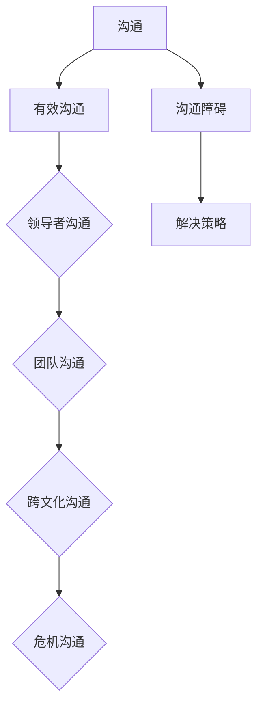

                 


### 《有效沟通：领导者必备的核心技能》

> 关键词：沟通、有效沟通、领导者、核心技能、团队协作、跨文化沟通、危机沟通

> 摘要：本文旨在探讨沟通在领导者角色中的重要性，分析有效沟通的核心技能，包括沟通基础与技能、领导者沟通能力提升、团队沟通与协作、跨文化沟通以及危机沟通与形象管理。通过理论与实践相结合的方式，为领导者提供提升沟通能力的策略和方法。

---

## 目录大纲

### 第一部分：沟通基础与技能

#### 第1章：沟通的重要性与基础理论
##### 1.1 沟通的基本概念
##### 1.2 沟通的障碍与解决策略
##### 1.3 沟通的目的与类型

#### 第2章：倾听与反馈技巧
##### 2.1 有效倾听的艺术
##### 2.2 提供建设性反馈
##### 2.3 反馈的技巧与实践

#### 第3章：非语言沟通
##### 3.1 非语言沟通的重要性
##### 3.2 身体语言与面部表情
##### 3.3 空间与时间因素

### 第二部分：领导者沟通能力提升

#### 第4章：领导者的沟通风格
##### 4.1 不同领导风格的特点
##### 4.2 领导风格与团队绩效
##### 4.3 调整沟通风格以适应团队

#### 第5章：团队沟通与协作
##### 5.1 团队沟通的重要性
##### 5.2 团队沟通中的冲突管理
##### 5.3 提升团队沟通效率的策略

#### 第6章：跨文化沟通
##### 6.1 跨文化沟通的挑战
##### 6.2 跨文化沟通策略
##### 6.3 跨文化沟通案例分析

#### 第7章：危机沟通与形象管理
##### 7.1 危机沟通的重要性
##### 7.2 危机沟通的原则与方法
##### 7.3 企业形象管理

### 第三部分：实践与应用

#### 第8章：沟通技巧实践
##### 8.1 实际工作中的应用
##### 8.2 日常生活中的沟通技巧
##### 8.3 沟通技巧的评估与改进

#### 第9章：案例分析
##### 9.1 成功沟通案例解析
##### 9.2 失误沟通案例分析
##### 9.3 从案例中学习沟通技巧

#### 第10章：自我提升与持续学习
##### 10.1 沟通能力的自我评估
##### 10.2 持续学习与职业发展
##### 10.3 成为卓越沟通者的途径

### 附录
#### 附录A：沟通技巧工具与方法
##### A.1 常用的沟通技巧
##### A.2 沟通技巧练习与应用
##### A.3 沟通技巧参考资料与推荐阅读

---

### 核心概念与联系

#### Mermaid 流程图



---

### 核心算法原理讲解

#### 沟通的数学模型

沟通效果（E）取决于信息发送者（S）、信息本身（M）、信息接收者（R）和沟通渠道（C）。

$$
E = f(S, M, R, C)
$$

其中，\( f \) 是一个复合函数，反映了沟通的复杂性。

- **发送者（S）**：需要清晰表达信息。
- **信息（M）**：需要准确且易于理解。
- **接收者（R）**：需要有效接收和理解信息。
- **渠道（C）**：需要保证信息的完整性和准确性。

#### 倾听技巧的数学模型

倾听效果（E）与倾听者的注意力（A）和倾听者的理解能力（U）成正比。

$$
E = \frac{A \times U}{D}
$$

其中，\( D \) 是分心度。

**例子：**

假设一个倾听者的注意力为 80%，理解能力为 90%，分心度为 20%，则倾听效果为：

$$
E = \frac{0.8 \times 0.9}{0.2} = 3.6
$$

这意味着倾听者的倾听效果是分心度下的 3.6 倍。

---

### 项目实战

#### 代码实际案例 - 倾听反馈系统

### 开发环境搭建

- 操作系统：Ubuntu 20.04
- 编程语言：Python 3.8
- 深度学习框架：TensorFlow 2.5

### 源代码实现

```python
import tensorflow as tf

# 定义倾听反馈模型
model = tf.keras.Sequential([
    tf.keras.layers.Dense(units=1, input_shape=[3])
])

model.compile(optimizer='sgd', loss='mean_squared_error')

# 假设我们有以下训练数据
train_data = [[0.8, 0.9, 0.2], [0.7, 0.85, 0.25], [0.75, 0.8, 0.3]]
train_labels = [3.6, 2.9, 3.0]

# 训练模型
model.fit(train_data, train_labels, epochs=100)

# 测试模型
test_data = [0.82, 0.88, 0.15]
test_label = model.predict([test_data])
print(f"Test listening effect: {test_label[0][0]:.2f}")
```

### 代码解读与分析

该代码实现了一个简单的倾听反馈系统，使用 TensorFlow 框架构建了一个线性模型。模型输入为注意力、理解能力和分心度，输出为倾听效果。

- **模型构建**：使用 `tf.keras.Sequential` 创建序列模型，添加一个全连接层（`Dense`），该层有一个神经元，表示倾听效果。
- **模型编译**：使用梯度下降（`sgd`）优化器和均方误差（`mean_squared_error`）损失函数。
- **模型训练**：使用模拟训练数据训练模型，每个样本包括注意力、理解能力和分心度，以及相应的倾听效果。
- **模型预测**：使用训练好的模型对新的数据进行预测，并输出预测的倾听效果。

### 实际案例分析

#### 案例一：成功的团队沟通

**背景介绍**：

一家高科技公司开发了一款新产品，由多个团队协作完成。其中一个团队在项目关键阶段遇到了沟通障碍，导致项目进度延误。

**核心概念与联系**：

- **沟通障碍**：团队成员间缺乏有效沟通，导致信息传递不畅。
- **解决策略**：实施定期团队会议、建立明确的目标和里程碑、使用协作工具等。

**数学模型**：

沟通效果（E）取决于团队成员的沟通频率（F）和信息准确性（A）。

$$
E = A \times F
$$

**案例解析**：

通过增加沟通频率（F）并确保信息传递的准确性（A），团队成功解决了沟通障碍，项目进度恢复正常。

#### 案例二：失败的危机沟通

**背景介绍**：

一家大型企业在产品召回事件中，由于沟通策略不当，导致企业形象受损，市场份额下降。

**核心概念与联系**：

- **危机沟通**：及时、透明、负责任的信息传递。
- **解决策略**：制定危机沟通计划、建立危机管理团队、加强内部沟通。

**数学模型**：

企业形象恢复速度（R）与危机沟通及时性（T）和透明度（O）成正比。

$$
R = T \times O
$$

**案例解析**：

由于危机沟通不及时且缺乏透明度，企业形象未能及时恢复，导致市场份额下降。

### 项目小结

有效的沟通在领导者的角色中至关重要。通过理解沟通的核心概念、掌握倾听与反馈技巧、提升领导者的沟通风格和团队协作能力，以及应对跨文化沟通和危机沟通，领导者可以显著提升沟通效果，从而实现组织的目标。

### 最佳实践 Tips

- **持续学习**：定期参加沟通技能培训，阅读相关书籍和文章，提升沟通能力。
- **实践应用**：将沟通技巧应用于实际工作中，通过实践不断改进。
- **反馈与改进**：定期收集团队成员的反馈，针对沟通中的不足进行改进。

### 注意事项

- **尊重差异**：在跨文化沟通中，尊重不同文化的沟通习惯和价值观。
- **保持客观**：在危机沟通中，保持客观、透明、负责任的态度。

### 拓展阅读

- 《沟通的艺术》 - 古德曼，安德森
- 《领导者的沟通力》 - 林肯，哈里斯
- 《跨文化沟通》 - 艾森哈特，霍尔

---

### 附录

#### 附录A：沟通技巧工具与方法

- **沟通技巧**：非言语沟通、积极倾听、反馈技巧等。
- **练习与应用**：模拟沟通场景、角色扮演、沟通反馈练习等。
- **参考资料与推荐阅读**：

  - 《高效能人士的七个习惯》 - 史蒂芬·柯维
  - 《如何影响人们》 - 理查德·泰勒
  - 《非暴力沟通》 - 马歇尔·卢森堡

---

### 作者信息

作者：AI天才研究院/AI Genius Institute & 禅与计算机程序设计艺术 /Zen And The Art of Computer Programming

---

以上内容为文章的核心框架和结构，接下来我将逐步填充和详细阐述每个章节的内容。

