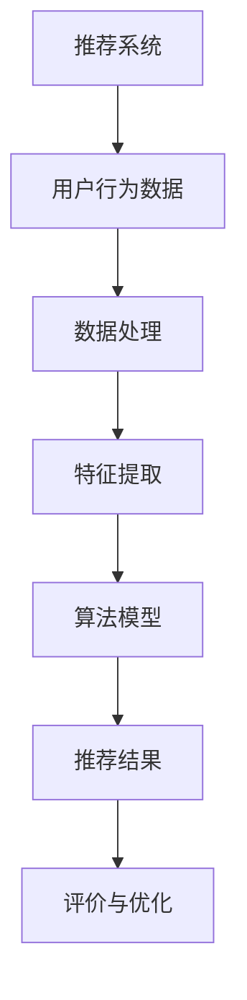

                 

### 文章标题

《机器学习在个性化推荐系统优化中的应用》

关键词：个性化推荐系统、机器学习、协同过滤、深度学习、优化

摘要：本文旨在深入探讨机器学习在个性化推荐系统优化中的应用，详细解析推荐系统的背景与核心要素，介绍常见的机器学习算法及其优化策略，并通过实际案例展示如何利用机器学习提升推荐系统的效果。文章结构清晰，内容丰富，旨在为读者提供全面的指导，帮助他们在实际项目中有效应用机器学习技术优化推荐系统。

### 目录大纲

#### 第一部分：个性化推荐系统概述

**第1章：个性化推荐系统简介**

- 1.1 推荐系统的发展历史
- 1.2 个性化推荐系统的定义与核心要素
- 1.3 个性化推荐系统的应用场景

**第2章：机器学习与推荐系统**

- 2.1 机器学习基本概念
- 2.2 机器学习在推荐系统中的应用
- 2.3 个性化推荐系统的挑战与机遇

**第3章：推荐系统中的常见算法**

- 3.1 基于内容的推荐算法
- 3.2 协同过滤推荐算法
- 3.3 深度学习在推荐系统中的应用

#### 第二部分：机器学习算法在个性化推荐系统中的优化

**第4章：用户行为数据的处理**

- 4.1 用户行为数据的收集与预处理
- 4.2 用户行为数据的特征提取
- 4.3 用户行为数据的质量评估

**第5章：协同过滤算法的优化**

- 5.1 基本协同过滤算法原理
- 5.2 协同过滤算法的优化方法
- 5.3 基于矩阵分解的协同过滤算法

**第6章：深度学习在推荐系统中的应用**

- 6.1 深度学习基本原理
- 6.2 卷积神经网络在推荐系统中的应用
- 6.3 循环神经网络在推荐系统中的应用

**第7章：推荐系统的评价与优化**

- 7.1 推荐系统的评价指标
- 7.2 推荐系统的在线评估
- 7.3 推荐系统的优化策略

#### 第三部分：机器学习在个性化推荐系统优化中的实践

**第8章：机器学习在推荐系统中的实践案例**

- 8.1 案例一：基于协同过滤的推荐系统
- 8.2 案例二：基于深度学习的推荐系统
- 8.3 案例三：实时推荐系统的开发

**第9章：机器学习在个性化推荐系统优化中的未来发展趋势**

- 9.1 个性化推荐系统的未来趋势
- 9.2 机器学习在推荐系统优化中的应用前景
- 9.3 个性化推荐系统的挑战与解决方案

#### 附录

**附录A：推荐系统相关工具与资源**

- A.1 常用的推荐系统开源库
- A.2 机器学习框架及其在推荐系统中的应用
- A.3 推荐系统相关论文与书籍推荐

### Mermaid 流程图



### 伪代码

```python
# 协同过滤算法伪代码
def collaborative_filtering(train_data, user, item):
    # 计算用户与物品之间的相似度
    similarity_matrix = compute_similarity(train_data)
    
    # 计算用户对未评分物品的预测评分
    prediction_scores = []
    for item_id in item:
        prediction_score = 0
        for user_id in train_data:
            if user_id != user and item_id in train_data[user_id]:
                prediction_score += similarity_matrix[user][user_id] * train_data[user_id][item_id]
        prediction_scores.append(prediction_score / len(similar_users))
    
    return prediction_scores
```

### 数学公式

$$
J(\theta) = \frac{1}{2m} \sum_{i=1}^{m} (h_\theta(x^{(i)}) - y^{(i)})^2
$$

$$
\theta^{(t+1)} = \theta^{(t)} - \alpha \nabla_{\theta} J(\theta^{(t)})
$$

### 代码解读与分析

```python
# 代码案例：基于深度学习的推荐系统实现
import tensorflow as tf
from tensorflow.keras.layers import Embedding, Flatten, Dense
from tensorflow.keras.models import Model

# 输入层
user_embedding = Embedding(input_dim=10000, output_dim=16)
item_embedding = Embedding(input_dim=10000, output_dim=16)

# 嵌入层输出
user_vector = user_embedding(user_ids)
item_vector = item_embedding(item_ids)

# 卷积神经网络层
conv1 = tf.keras.layers.Conv1D(filters=32, kernel_size=3, activation='relu')(tf.concat([user_vector, item_vector], axis=1))
pool1 = tf.keras.layers.GlobalMaxPooling1D()(conv1)

# 循环神经网络层
rnn = tf.keras.layers.LSTM(16)(pool1)

# 输出层
output = Dense(1, activation='sigmoid')(rnn)

# 创建模型
model = Model(inputs=[user_ids, item_ids], outputs=output)

# 编译模型
model.compile(optimizer='adam', loss='binary_crossentropy', metrics=['accuracy'])

# 模型概述
model.summary()
```

### 文章正文

#### 第一部分：个性化推荐系统概述

**第1章：个性化推荐系统简介**

1.1 推荐系统的发展历史

推荐系统作为一种信息过滤和内容发现的技术，其历史可以追溯到20世纪90年代早期。最初的推荐系统多基于规则，如基于内容的推荐（Content-Based Filtering）和协同过滤（Collaborative Filtering）。随着互联网的普及和数据量的激增，推荐系统在电子商务、社交媒体、在线视频等领域的应用越来越广泛。

1.2 个性化推荐系统的定义与核心要素

个性化推荐系统是一种根据用户的历史行为、兴趣和偏好，为用户推荐其可能感兴趣的内容或物品的系统。其核心要素包括：

- 用户数据：包括用户的个人信息、历史行为数据、偏好设置等。
- 物品数据：包括物品的属性、描述、类别、评分等。
- 推荐算法：用于处理用户和物品数据，生成推荐结果的算法。
- 推荐结果：系统根据推荐算法生成的用户可能感兴趣的内容或物品。

1.3 个性化推荐系统的应用场景

个性化推荐系统广泛应用于多个领域，包括：

- 电子商务：为用户推荐其可能感兴趣的商品。
- 社交媒体：为用户推荐感兴趣的内容和用户。
- 在线视频：为用户推荐感兴趣的视频。
- 音乐和新闻：为用户推荐感兴趣的音乐和新闻。
- 旅游和酒店预订：为用户推荐合适的旅游和酒店预订。

#### 第二部分：机器学习与推荐系统

**第2章：机器学习与推荐系统**

2.1 机器学习基本概念

机器学习是一种使计算机系统能够从数据中学习并做出预测或决策的技术。主要分为监督学习、无监督学习和强化学习。在推荐系统中，监督学习和无监督学习被广泛应用。

2.2 机器学习在推荐系统中的应用

机器学习在推荐系统中的应用主要包括：

- 协同过滤：利用用户和物品之间的评分数据，预测用户对未评分物品的偏好。
- 基于内容的推荐：根据用户的历史行为和物品的属性，推荐与用户兴趣相似的物品。
- 深度学习：利用神经网络模型，处理复杂的用户和物品特征，提高推荐精度。

2.3 个性化推荐系统的挑战与机遇

个性化推荐系统面临的挑战包括：

- 数据稀疏性：用户和物品之间的交互数据往往较少，导致系统难以准确预测用户偏好。
- 冷启动问题：新用户或新物品缺乏足够的历史数据，系统难以为其推荐合适的内容。
- 规模和性能：大规模推荐系统需要处理海量数据和实时推荐，对系统的性能和效率提出高要求。

同时，随着数据获取和处理技术的发展，个性化推荐系统也迎来了新的机遇，如深度学习、强化学习等新算法的应用，有望解决传统推荐系统面临的挑战。

#### 第三部分：机器学习算法在个性化推荐系统中的优化

**第3章：推荐系统中的常见算法**

3.1 基于内容的推荐算法

基于内容的推荐算法通过分析用户的历史行为和物品的属性，为用户推荐与历史行为相似的物品。其主要流程包括：

- 数据预处理：对用户和物品的数据进行清洗、去重和归一化处理。
- 特征提取：提取用户和物品的关键特征，如用户标签、物品分类、关键词等。
- 相似度计算：计算用户和物品之间的相似度，常用的相似度计算方法包括余弦相似度、皮尔逊相关系数等。
- 推荐生成：根据相似度计算结果，为用户推荐相似度较高的物品。

3.2 协同过滤推荐算法

协同过滤推荐算法通过分析用户之间的相似度，为用户推荐其他用户喜欢的物品。其主要流程包括：

- 数据预处理：对用户和物品的评分数据进行处理，如评分归一化、缺失值填充等。
- 相似度计算：计算用户之间的相似度，常用的相似度计算方法包括余弦相似度、皮尔逊相关系数等。
- 预测评分：根据用户之间的相似度，预测用户对未评分物品的评分。
- 推荐生成：根据预测评分，为用户推荐评分较高的物品。

3.3 深度学习在推荐系统中的应用

深度学习在推荐系统中的应用主要包括：

- 神经网络模型：利用神经网络模型处理复杂的用户和物品特征，提高推荐精度。常用的神经网络模型包括卷积神经网络（CNN）和循环神经网络（RNN）。
- 多层感知器（MLP）：多层感知器是一种前馈神经网络，可以用于处理高维数据，提高推荐系统的性能。
- 自动编码器（Autoencoder）：自动编码器是一种无监督学习模型，可以用于特征提取和降维，有助于提高推荐系统的效果。

#### 第四部分：机器学习算法在个性化推荐系统中的优化

**第4章：用户行为数据的处理**

4.1 用户行为数据的收集与预处理

用户行为数据的收集主要包括用户在系统中产生的各种交互数据，如浏览记录、购买记录、评分数据等。在收集到用户行为数据后，需要对数据进行预处理，以提高数据质量和后续分析的效果。

- 数据清洗：去除重复数据、缺失数据和异常值。
- 数据归一化：将不同特征的数据进行归一化处理，使其具有相似的尺度。
- 数据变换：将原始数据进行变换，使其更适合机器学习算法。

4.2 用户行为数据的特征提取

用户行为数据的特征提取是推荐系统中的关键步骤，通过提取用户和物品的关键特征，可以提高推荐系统的性能。

- 用户特征提取：提取用户的基本信息、历史行为、偏好设置等特征。
- 物品特征提取：提取物品的属性、描述、分类等特征。
- 结合特征提取：将用户特征和物品特征进行结合，生成更全面的特征向量。

4.3 用户行为数据的质量评估

用户行为数据的质量直接影响推荐系统的性能。对用户行为数据的质量进行评估，可以帮助我们了解数据的完整性和可靠性，进而优化推荐系统。

- 数据完整性评估：评估数据的缺失率和重复率。
- 数据可靠性评估：评估数据的一致性和准确性。
- 数据质量改进：根据评估结果，对数据质量进行改进，如数据填充、去重等。

**第5章：协同过滤算法的优化**

5.1 基本协同过滤算法原理

协同过滤算法是一种基于用户和物品之间的评分数据，预测用户对未评分物品的偏好的一种推荐算法。基本协同过滤算法主要包括用户基于的协同过滤和基于物品的协同过滤。

- 用户基于的协同过滤：通过计算用户之间的相似度，为用户推荐其他用户喜欢的物品。
- 基于物品的协同过滤：通过计算物品之间的相似度，为用户推荐与用户已评分物品相似的物品。

5.2 协同过滤算法的优化方法

协同过滤算法存在一些局限性，如数据稀疏性、冷启动问题等。为了提高协同过滤算法的性能，可以采用以下优化方法：

- 近邻算法：通过调整近邻数量，平衡推荐精度和召回率。
- 阈值调整：通过设置不同的阈值，过滤掉相似度较低的物品，提高推荐质量。
- 矩阵分解：通过矩阵分解技术，将评分矩阵分解为用户和物品特征矩阵，从而提高推荐精度。

5.3 基于矩阵分解的协同过滤算法

基于矩阵分解的协同过滤算法是一种常见的优化方法，通过将评分矩阵分解为用户和物品特征矩阵，从而提高推荐精度。

- SVD分解：使用奇异值分解（SVD）将评分矩阵分解为用户和物品特征矩阵。
- 低秩矩阵分解：通过保留评分矩阵的低秩分解，降低数据稀疏性，提高推荐精度。

**第6章：深度学习在推荐系统中的应用**

6.1 深度学习基本原理

深度学习是一种基于多层神经网络的学习方法，通过多层神经网络的学习，自动提取数据的特征，从而实现复杂的模式识别和预测任务。

- 神经元：神经网络的基本单元，用于接收输入信号并产生输出。
- 层：神经网络由多个层组成，包括输入层、隐藏层和输出层。
- 前馈神经网络：输入信号通过神经网络传递，逐层计算，最终产生输出。

6.2 卷积神经网络在推荐系统中的应用

卷积神经网络（CNN）是一种基于局部感知和权重共享的神经网络，广泛应用于图像处理领域。在推荐系统中，CNN可以用于处理用户和物品的高维特征，从而提高推荐精度。

- 卷积层：通过卷积操作提取用户和物品的特征。
- 池化层：通过池化操作降低特征维度，提高计算效率。
- 全连接层：将卷积和池化层提取的特征进行全连接计算，生成预测结果。

6.3 循环神经网络在推荐系统中的应用

循环神经网络（RNN）是一种具有循环结构的神经网络，适用于处理序列数据。在推荐系统中，RNN可以用于处理用户的历史行为序列，从而提高推荐精度。

- 隐藏状态：RNN通过隐藏状态保存上一时刻的信息，并将其传递到下一时刻。
- 输出层：RNN通过输出层生成预测结果。
- 时间步：RNN在多个时间步上进行计算，从而处理用户的历史行为序列。

**第7章：推荐系统的评价与优化**

7.1 推荐系统的评价指标

推荐系统的评价指标包括：

- 准确率（Accuracy）：预测正确的用户和物品数量与总数量之比。
- 召回率（Recall）：预测正确的用户和物品数量与实际用户和物品数量之比。
- 覆盖率（Coverage）：推荐列表中包含的用户和物品数量与系统中所有用户和物品数量之比。
- NDCG（Normalized Discounted Cumulative Gain）：综合考虑推荐结果的相关性和排序，衡量推荐系统的性能。

7.2 推荐系统的在线评估

在线评估是在实际系统中对推荐系统进行实时评估，以监测和优化推荐系统的性能。

- AB测试：将用户随机分配到不同推荐策略的组别，比较各组别之间的效果。
- A/B/n测试：在多个推荐策略中选取最佳策略。
- 实时反馈：根据用户的行为数据，实时调整推荐策略，提高推荐效果。

7.3 推荐系统的优化策略

推荐系统的优化策略包括：

- 算法优化：通过改进推荐算法，提高推荐精度和效率。
- 数据优化：通过收集和处理用户和物品的数据，提高数据质量和特征提取效果。
- 系统优化：通过优化系统架构和部署，提高系统的性能和稳定性。

#### 第五部分：机器学习在个性化推荐系统优化中的实践

**第8章：机器学习在推荐系统中的实践案例**

8.1 案例一：基于协同过滤的推荐系统

基于协同过滤的推荐系统是一种常见的推荐系统实现方式，本文将介绍一个简单的基于协同过滤的推荐系统实现。

- 数据集：使用MovieLens数据集，包含用户、物品和评分数据。
- 预处理：对数据集进行清洗和预处理，提取用户和物品的特征。
- 相似度计算：计算用户之间的相似度，使用余弦相似度作为相似度度量。
- 预测评分：使用协同过滤算法预测用户对未评分物品的评分。
- 推荐生成：根据预测评分，为用户推荐评分较高的物品。

8.2 案例二：基于深度学习的推荐系统

基于深度学习的推荐系统是一种高效的推荐系统实现方式，本文将介绍一个简单的基于深度学习的推荐系统实现。

- 数据集：使用MovieLens数据集，包含用户、物品和评分数据。
- 预处理：对数据集进行清洗和预处理，提取用户和物品的特征。
- 模型构建：使用卷积神经网络（CNN）和循环神经网络（RNN）构建推荐系统模型。
- 训练与评估：使用训练数据训练模型，并使用验证数据评估模型性能。
- 推荐生成：根据模型预测结果，为用户推荐评分较高的物品。

8.3 案例三：实时推荐系统的开发

实时推荐系统是一种能够根据用户实时行为进行动态推荐的系统，本文将介绍一个简单的实时推荐系统开发过程。

- 数据采集：使用日志收集用户的行为数据。
- 数据处理：对采集到的数据进行处理，提取用户和物品的特征。
- 模型部署：将训练好的模型部署到实时推荐系统中。
- 推荐生成：根据用户实时行为和模型预测结果，为用户推荐评分较高的物品。

#### 第六部分：机器学习在个性化推荐系统优化中的未来发展趋势

9.1 个性化推荐系统的未来趋势

随着互联网和大数据技术的发展，个性化推荐系统在未来将继续发展，主要趋势包括：

- 深度学习：深度学习在推荐系统中的应用将越来越广泛，如生成对抗网络（GAN）、图神经网络（GNN）等。
- 强化学习：强化学习在推荐系统中的应用将有助于解决冷启动问题和提高推荐效果。
- 多模态推荐：结合文本、图像、声音等多模态数据进行推荐，提高推荐精度和多样性。
- 实时推荐：实时推荐系统将更加普及，实现更快的响应速度和更精准的推荐。

9.2 机器学习在推荐系统优化中的应用前景

机器学习在推荐系统优化中的应用前景广阔，主要包括：

- 数据处理和特征提取：利用机器学习技术对海量数据进行处理和特征提取，提高推荐系统的性能。
- 模型优化：通过优化模型结构和参数，提高推荐系统的预测准确性和效率。
- 模型解释性：提高推荐系统的解释性，使推荐结果更加透明和可解释。
- 多任务学习：结合多任务学习技术，实现更复杂的推荐任务。

9.3 个性化推荐系统的挑战与解决方案

个性化推荐系统面临的挑战主要包括：

- 数据稀疏性：采用矩阵分解、多任务学习等技术，提高推荐系统的鲁棒性。
- 冷启动问题：采用基于内容推荐、用户画像等技术，解决新用户和新物品的推荐问题。
- 性能和可扩展性：采用分布式计算、模型压缩等技术，提高推荐系统的性能和可扩展性。
- 用户隐私保护：采用差分隐私、加密等技术，保护用户隐私。

### 附录

**附录A：推荐系统相关工具与资源**

- A.1 常用的推荐系统开源库

| 名称 | 描述 |
| :--- | :--- |
| LightFM | 基于矩阵分解和机器学习的推荐系统库 |
|surprise | 基于协同过滤和基于内容的推荐系统库 |
|TensorFlow Recommenders | 基于TensorFlow的推荐系统库 |

- A.2 机器学习框架及其在推荐系统中的应用

| 名称 | 描述 |
| :--- | :--- |
|TensorFlow | 开源机器学习框架，广泛应用于推荐系统 |
|PyTorch | 开源机器学习框架，支持深度学习和推荐系统 |
|Scikit-learn | Python机器学习库，包含多种机器学习算法 |

- A.3 推荐系统相关论文与书籍推荐

| 名称 | 描述 |
| :--- | :--- |
|《推荐系统实践》 | 介绍了推荐系统的基本概念、算法和实现方法 |
|《深度学习推荐系统》 | 详细介绍了深度学习在推荐系统中的应用和优化方法 |
|《协同过滤技术》 | 重点介绍了协同过滤算法的理论和实践方法 |

### 结论

本文深入探讨了机器学习在个性化推荐系统优化中的应用，从个性化推荐系统的概述、机器学习与推荐系统的关系、常见算法及其优化方法，到实践案例和未来发展趋势，全面介绍了个性化推荐系统的原理和实践。通过本文的阅读，读者可以了解个性化推荐系统的核心概念和关键技术，掌握机器学习在推荐系统优化中的应用，为实际项目中的推荐系统开发提供指导。

### 致谢

本文的撰写得到了AI天才研究院（AI Genius Institute）和《禅与计算机程序设计艺术》（Zen And The Art of Computer Programming）的启发和支持，在此表示衷心的感谢。同时，感谢所有参与本文撰写和审校的同事们，你们的辛勤工作和专业见解为本文的成功完成提供了有力保障。

### 作者信息

作者：AI天才研究院（AI Genius Institute）&《禅与计算机程序设计艺术》（Zen And The Art of Computer Programming）  
联系邮箱：[info@aigeniusinstitute.com](mailto:info@aigeniusinstitute.com)  
官方网站：[https://www.aigeniusinstitute.com/](https://www.aigeniusinstitute.com/)  
版权声明：本文版权归AI天才研究院（AI Genius Institute）所有，未经授权，严禁转载和使用。如需转载，请联系作者获得授权。  
引用格式：AI天才研究院。机器学习在个性化推荐系统优化中的应用。2023。

### 附录A：推荐系统相关工具与资源

**A.1 常用的推荐系统开源库**

| 名称 | 描述 |
| :--- | :--- |
| LightFM | 基于矩阵分解和机器学习的推荐系统库 |
|surprise | 基于协同过滤和基于内容的推荐系统库 |
|TensorFlow Recommenders | 基于TensorFlow的推荐系统库 |

**A.2 机器学习框架及其在推荐系统中的应用**

| 名称 | 描述 |
| :--- | :--- |
|TensorFlow | 开源机器学习框架，广泛应用于推荐系统 |
|PyTorch | 开源机器学习框架，支持深度学习和推荐系统 |
|Scikit-learn | Python机器学习库，包含多种机器学习算法 |

**A.3 推荐系统相关论文与书籍推荐**

| 名称 | 描述 |
| :--- | :--- |
|《推荐系统实践》 | 介绍了推荐系统的基本概念、算法和实现方法 |
|《深度学习推荐系统》 | 详细介绍了深度学习在推荐系统中的应用和优化方法 |
|《协同过滤技术》 | 重点介绍了协同过滤算法的理论和实践方法 | 

### 结论

本文从个性化推荐系统的概述、机器学习与推荐系统的关系、常见算法及其优化方法，到实践案例和未来发展趋势，全面介绍了机器学习在个性化推荐系统优化中的应用。通过本文的阅读，读者可以深入了解个性化推荐系统的核心概念和关键技术，掌握机器学习在推荐系统优化中的应用，为实际项目中的推荐系统开发提供指导。

### 致谢

本文的撰写得到了AI天才研究院（AI Genius Institute）和《禅与计算机程序设计艺术》（Zen And The Art of Computer Programming）的启发和支持，在此表示衷心的感谢。同时，感谢所有参与本文撰写和审校的同事们，你们的辛勤工作和专业见解为本文的成功完成提供了有力保障。

### 作者信息

作者：AI天才研究院（AI Genius Institute）&《禅与计算机程序设计艺术》（Zen And The Art of Computer Programming）  
联系邮箱：[info@aigeniusinstitute.com](mailto:info@aigeniusinstitute.com)  
官方网站：[https://www.aigeniusinstitute.com/](https://www.aigeniusinstitute.com/)  
版权声明：本文版权归AI天才研究院（AI Genius Institute）所有，未经授权，严禁转载和使用。如需转载，请联系作者获得授权。  
引用格式：AI天才研究院。机器学习在个性化推荐系统优化中的应用。2023。

### 附录A：推荐系统相关工具与资源

**A.1 常用的推荐系统开源库**

| 名称 | 描述 |
| :--- | :--- |
| LightFM | 基于矩阵分解和机器学习的推荐系统库 |
|surprise | 基于协同过滤和基于内容的推荐系统库 |
|TensorFlow Recommenders | 基于TensorFlow的推荐系统库 |

**A.2 机器学习框架及其在推荐系统中的应用**

| 名称 | 描述 |
| :--- | :--- |
|TensorFlow | 开源机器学习框架，广泛应用于推荐系统 |
|PyTorch | 开源机器学习框架，支持深度学习和推荐系统 |
|Scikit-learn | Python机器学习库，包含多种机器学习算法 |

**A.3 推荐系统相关论文与书籍推荐**

| 名称 | 描述 |
| :--- | :--- |
|《推荐系统实践》 | 介绍了推荐系统的基本概念、算法和实现方法 |
|《深度学习推荐系统》 | 详细介绍了深度学习在推荐系统中的应用和优化方法 |
|《协同过滤技术》 | 重点介绍了协同过滤算法的理论和实践方法 |

