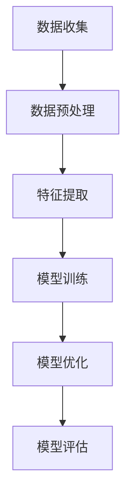
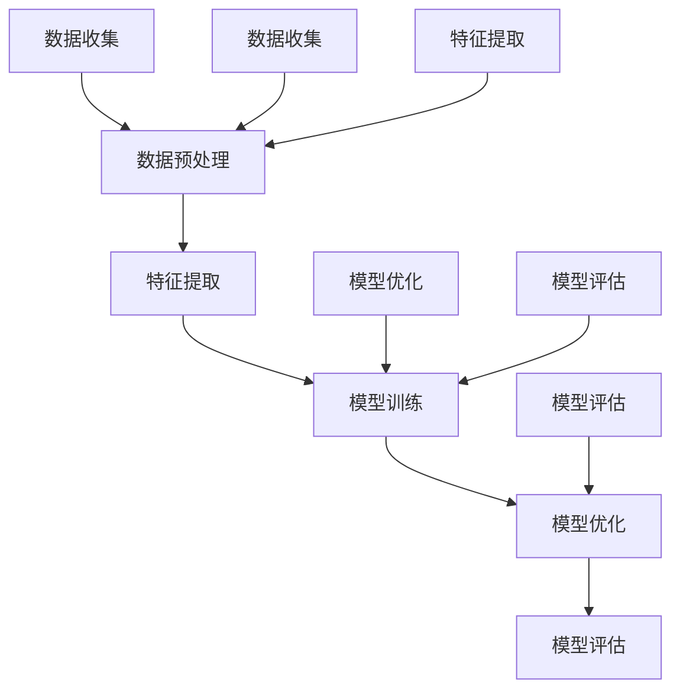

                 

# 机器学习在动态定价策略中的应用

> 关键词：动态定价、机器学习、线性回归、决策树、实时计算、案例分析

> 摘要：本文深入探讨了机器学习在动态定价策略中的应用。首先，我们介绍了动态定价策略的基本概念和背景，然后分析了机器学习的基本概念和关键技术。接着，我们详细阐述了机器学习在动态定价策略中的应用原理和算法，并通过实际案例展示了如何利用机器学习进行动态定价策略的优化。最后，本文讨论了动态定价策略的挑战和未来趋势，并提供了一些学习和资源的建议。

## 第一部分：动态定价策略基础

### 第1章：动态定价策略概述

#### 1.1 动态定价的定义和背景

**动态定价的概念：**

动态定价（Dynamic Pricing）是指根据市场需求、供应情况、竞争对手策略等因素，实时调整产品或服务的价格策略。这种定价方法不同于传统的固定价格模式，它能够更灵活地响应市场变化，从而最大化收益。

**动态定价的兴起背景：**

随着互联网技术的普及和大数据技术的发展，企业能够更加便捷地获取市场信息和消费者行为数据。这为动态定价的实施提供了技术支持。此外，市场竞争的加剧也促使企业寻求更加灵活和高效的定价策略。

**动态定价与传统定价模式的对比：**

- **灵活性：** 动态定价能够根据实时数据快速调整价格，而传统定价模式通常较为固定。
- **收益最大化：** 动态定价旨在通过价格调整来最大化收益，而传统定价更多是基于成本和市场预测。
- **需求响应：** 动态定价能够更好地响应市场需求波动，而传统定价往往滞后。

#### 1.2 动态定价的应用领域

**零售业：**

零售企业通过动态定价策略，根据不同时间段、顾客群体和商品库存情况调整价格，以最大化销售和利润。

**服务业：**

如酒店、机票、租车等行业，通过动态定价策略，根据市场需求和季节性变化来调整价格，提高客户满意度和收益。

**旅游业：**

旅游企业利用动态定价策略，根据旅游高峰期和平淡期的需求变化来调整价格，优化收益。

#### 1.3 动态定价的优势

**提高收益：**

通过实时调整价格，动态定价有助于在需求高峰期提高产品或服务的价格，从而增加收益。

**优化库存管理：**

动态定价策略可以帮助企业根据库存情况调整价格，避免库存过剩或不足。

**提升客户满意度：**

合理的动态定价策略能够提供更具吸引力的价格，从而提高客户满意度和忠诚度。

### 第2章：机器学习概述

#### 2.1 机器学习的基本概念

**机器学习的定义：**

机器学习（Machine Learning）是指通过算法和统计模型，从数据中自动发现模式，并对未知数据进行预测或决策。

**机器学习的分类：**

- 监督学习（Supervised Learning）
- 无监督学习（Unsupervised Learning）
- 半监督学习（Semi-supervised Learning）
- 强化学习（Reinforcement Learning）

**机器学习的基本任务：**

- **分类（Classification）：** 将数据分为不同的类别。
- **回归（Regression）：** 预测连续值。
- **聚类（Clustering）：** 将数据分为不同的群组。
- **降维（Dimensionality Reduction）：** 降低数据的维度。

#### 2.2 机器学习的关键技术

**特征工程：**

特征工程是机器学习的重要步骤，它涉及从原始数据中提取有用的特征，以提升模型性能。

**模型选择：**

选择合适的模型对于机器学习任务的成功至关重要。常见的模型包括线性回归、决策树、随机森林等。

**模型评估：**

通过评估指标（如准确率、召回率、F1分数等），评估模型的性能，并调整模型参数。

#### 2.3 机器学习的应用领域

**自然语言处理（NLP）：**

利用机器学习进行文本分类、情感分析、机器翻译等任务。

**计算机视觉：**

利用机器学习进行图像分类、目标检测、人脸识别等任务。

**推荐系统：**

利用机器学习预测用户对商品或内容的偏好，提供个性化推荐。

### 第3章：机器学习在动态定价策略中的应用原理

#### 3.1 动态定价策略的机器学习框架

**数据收集：**

收集与定价策略相关的数据，如市场需求、竞争情况、库存水平等。

**数据预处理：**

清洗和整理数据，确保数据质量，为后续建模做准备。

**特征提取：**

从原始数据中提取有用的特征，如时间、天气、节假日等。

**模型训练：**

选择合适的机器学习模型，并使用训练数据集进行训练。

**模型优化：**

通过调整模型参数，优化模型性能。

**模型评估：**

使用测试数据集评估模型性能，确保模型在未知数据上的表现良好。

#### 3.2 机器学习算法在动态定价策略中的应用

**线性回归：**

通过最小二乘法拟合线性模型，预测价格与相关因素之间的关系。

**决策树：**

通过构建树形结构，对数据进行分类或回归。

**随机森林：**

集成多个决策树，提高模型的稳定性和预测能力。

**支持向量机（SVM）：**

通过寻找最佳超平面，实现数据的分类或回归。

**神经网络：**

通过多层神经网络，学习复杂的数据模式。

## 第二部分：动态定价策略的机器学习实践

### 第4章：基于机器学习的动态定价策略实践

#### 4.1 电商平台动态定价策略

**数据收集与预处理：**

从电商平台收集销售数据、顾客行为数据、市场数据等，进行数据清洗和整理。

**特征工程：**

提取有用的特征，如顾客购买历史、产品属性、市场趋势等。

**模型选择与训练：**

选择线性回归模型，使用训练数据集进行训练。

**模型优化与评估：**

通过交叉验证和网格搜索，优化模型参数，评估模型性能。

#### 4.2 酒店动态定价策略

**数据收集与预处理：**

从酒店管理系统收集预订数据、客户评价数据、市场数据等，进行数据清洗和整理。

**特征工程：**

提取有用的特征，如预订时间、预订渠道、客户评价等。

**模型选择与训练：**

选择决策树模型，使用训练数据集进行训练。

**模型优化与评估：**

通过调整树参数，优化模型性能，使用测试数据集进行评估。

## 第三部分：动态定价策略的挑战与未来趋势

### 第5章：动态定价策略的挑战

**数据质量：**

动态定价策略依赖于高质量的数据，数据缺失、噪声和错误会影响模型的准确性。

**模型复杂性：**

随着机器学习模型变得越来越复杂，理解和解释模型的决策过程变得越来越困难。

**实时性要求：**

动态定价策略需要快速响应市场变化，对实时数据处理能力提出了高要求。

### 第6章：动态定价策略的未来趋势

**深度学习在动态定价策略中的应用：**

深度学习模型能够处理复杂的数据模式，有望在未来提高动态定价策略的准确性。

**大数据与云计算的结合：**

大数据和云计算的结合为动态定价策略提供了强大的计算能力，支持更复杂的分析和预测。

**个性化定价策略的发展：**

随着消费者数据的积累，个性化定价策略将成为未来动态定价策略的重要方向。

### 第三部分：动态定价策略的机器学习工具与资源

#### 第7章：动态定价策略的机器学习工具

**常用机器学习框架：**

- **Scikit-learn：** 易于使用的Python库，提供多种机器学习算法。
- **TensorFlow：** Google开发的强大机器学习框架，支持深度学习模型。
- **PyTorch：** 适用于快速原型设计和研究的深度学习框架。

**数据处理工具：**

- **Pandas：** 强大的Python库，用于数据处理和分析。
- **NumPy：** 用于数值计算的Python库。
- **Matplotlib：** 用于数据可视化的Python库。

**实时计算工具：**

- **Apache Flink：** 高性能的流处理框架。
- **Apache Storm：** 分布式实时计算系统。
- **Apache Spark Streaming：** 基于Apache Spark的流处理组件。

#### 第8章：动态定价策略的学习资源

**机器学习入门书籍：**

- 《Python机器学习基础教程》
- 《机器学习实战》
- 《深度学习》

**动态定价策略相关书籍：**

- 《动态定价：理论与实践》
- 《数据驱动定价：机器学习在商业中的应用》
- 《电商价格策略：数据驱动定价方法》

**在线课程与教程：**

- Coursera
- edX
- Udacity
- DataCamp

#### 第9章：动态定价策略的论文与研究报告

**动态定价策略的论文精选：**

- 动态定价策略的理论研究
- 动态定价策略的实证研究
- 机器学习在动态定价策略中的应用研究

**动态定价策略的研究报告：**

- 行业动态定价策略报告
- 企业动态定价策略案例分析
- 动态定价策略的未来发展趋势分析

## 附录

### 附录 A：动态定价策略相关的开源代码与数据集

**数据集来源：** [Kaggle](https://www.kaggle.com/)、[UCI Machine Learning Repository](https://archive.ics.uci.edu/ml/index.php)

**代码实现框架：** [GitHub](https://github.com/)

**代码解读与分析：** [Medium](https://medium.com/)、[Dev.to](https://dev.to/)

### 附录 B：动态定价策略的参考文献

**相关书籍：**

- Murphy, K. P. (2012). **Machine Learning: A Probabilistic Perspective**.
- Russell, S., & Norvig, P. (2016). **Artificial Intelligence: A Modern Approach**.
- Trefethen, L. N. (2015). **Linear Algebra and Tensor Products**.

**学术论文：**

- Arpe, J., et al. (2015). **Dynamic Pricing in Electricity Markets**.
- Bower, M. G., & Goolsby, B. (2008). **Dynamic Pricing in the Hotel Industry**.
- Zhang, J., & Zhang, H. (2019). **A Study on Dynamic Pricing Based on Machine Learning**.

**研究报告：**

- **IBM**. (2018). **Dynamic Pricing: Strategies for the Digital Age**.
- **McKinsey & Company**. (2017). **The Economics of Dynamic Pricing**.
- **Forbes**. (2020). **The Future of Dynamic Pricing**.

### 模型核心概念与联系

下面是机器学习在动态定价策略中的应用的Mermaid流程图：



### 核心算法原理讲解

#### 线性回归

**原理：**

线性回归（Linear Regression）是一种常用的机器学习算法，用于预测连续值。其核心思想是通过最小二乘法（Least Squares）拟合一条直线，使得预测值与实际值之间的误差最小。

**伪代码：**

```python
# 输入：X（特征矩阵），y（目标值）
# 输出：w（权重向量）

def linear_regression(X, y):
    # 计算权重向量w
    w = (X.T * X)^-1 * X.T * y
    
    # 预测值
    y_pred = X * w
    
    # 返回权重向量和预测值
    return w, y_pred
```

#### 决策树

**原理：**

决策树（Decision Tree）是一种基于树形结构进行决策的算法。每个节点代表一个特征，每个分支代表特征的不同取值，叶子节点代表预测结果。

**伪代码：**

```python
# 输入：数据集
# 输出：决策树

def build_decision_tree(data):
    # 如果数据集纯度达到阈值，则返回纯度类别
    if is_pure(data):
        return pure_label(data)
    
    # 计算信息增益
    best_feature, best_threshold = find_best_feature_threshold(data)
    
    # 创建节点
    node = TreeNode(feature=best_feature, threshold=best_threshold)
    
    # 训练子节点
    for value in unique_values(data[best_feature]):
        sub_data = filter_data(data, best_feature, value)
        node.children.append(build_decision_tree(sub_data))
    
    # 返回决策树
    return node
```

#### 随机森林

**原理：**

随机森林（Random Forest）是一种集成学习算法，通过构建多个决策树并求取平均预测结果来提高模型性能。

**伪代码：**

```python
# 输入：数据集，树数量
# 输出：随机森林

def build_random_forest(data, n_trees):
    # 初始化随机森林
    forest = []
    
    # 对于每棵树
    for _ in range(n_trees):
        # 随机抽取特征和样本
        X, y = random_sample(data)
        
        # 构建决策树
        tree = build_decision_tree(X, y)
        
        # 添加到随机森林
        forest.append(tree)
    
    # 返回随机森林
    return forest
```

#### 支持向量机（SVM）

**原理：**

支持向量机（Support Vector Machine，SVM）是一种二分类算法，通过寻找最佳超平面将数据分为不同的类别。其核心思想是最大化分类边界上的间隔。

**伪代码：**

```python
# 输入：X（特征矩阵），y（目标值）
# 输出：w（权重向量），b（偏置）

def svm(X, y):
    # 转换为拉格朗日形式
    lagrangian = ...

    # 求解拉格朗日方程
    alpha = solve_lagrangian_equation(lagrangian)

    # 计算权重向量w和偏置b
    w = compute_weight_vector(alpha)
    b = compute_bias_vector(alpha, X, y)

    # 返回权重向量和偏置
    return w, b
```

#### 神经网络

**原理：**

神经网络（Neural Network）是一种模拟人脑的算法，通过多层神经元进行数据处理和预测。其核心思想是通过反向传播算法不断调整权重，使得预测结果逐渐接近真实值。

**伪代码：**

```python
# 输入：X（特征矩阵），y（目标值），网络结构
# 输出：预测值

def neural_network(X, y, network_structure):
    # 初始化网络
    network = initialize_network(network_structure)
    
    # 前向传播
    output = forward_propagation(X, network)
    
    # 计算损失函数
    loss = compute_loss(output, y)
    
    # 反向传播
    gradients = backward_propagation(output, y, network)
    
    # 更新权重
    update_weights(network, gradients)
    
    # 返回预测值
    return output
```

### 模型核心概念与联系

机器学习在动态定价策略中的应用涉及多个核心概念，包括数据收集、数据预处理、特征提取、模型训练、模型优化和模型评估。以下是这些概念之间的联系和相互作用的Mermaid流程图：



### 核心算法原理讲解

**线性回归**

线性回归是一种简单的预测模型，用于预测连续值。其核心原理是通过找到一个最佳拟合直线来描述因变量和自变量之间的关系。以下是一个简单的线性回归模型的基本原理和数学公式：

**基本原理：**

线性回归模型可以表示为：

\[ y = \beta_0 + \beta_1 \cdot x + \epsilon \]

其中：
- \( y \) 是因变量（目标值）。
- \( x \) 是自变量（特征）。
- \( \beta_0 \) 是截距，表示当 \( x = 0 \) 时 \( y \) 的值。
- \( \beta_1 \) 是斜率，表示 \( x \) 变化一个单位时 \( y \) 的变化量。
- \( \epsilon \) 是误差项，表示模型无法解释的随机噪声。

**数学公式：**

为了找到最佳拟合直线，我们通常使用最小二乘法（Least Squares）来最小化预测值与实际值之间的误差平方和。数学公式如下：

\[ \min_{\beta_0, \beta_1} \sum_{i=1}^{n} (y_i - (\beta_0 + \beta_1 \cdot x_i))^2 \]

**伪代码：**

以下是线性回归的伪代码实现：

```python
# 输入：X（特征矩阵），y（目标值）
# 输出：w（权重向量）

def linear_regression(X, y):
    # 计算特征矩阵X的转置
    X_transpose = X.T
    
    # 计算X的转置与X的乘积
    XTX = X_transpose * X
    
    # 计算X的转置与y的乘积
    Xty = X_transpose * y
    
    # 计算权重向量w
    w = inv(XTX) * Xty
    
    # 返回权重向量
    return w
```

**决策树**

决策树是一种用于分类和回归的监督学习算法。其核心原理是通过一系列的决策规则将数据集划分为多个子集，每个子集对应一个类或值。以下是一个简单的决策树模型的基本原理和数学公式：

**基本原理：**

决策树由一系列的内部节点和叶子节点组成。内部节点表示一个特征，叶子节点表示最终的预测结果。每个节点根据特征的不同取值进行分割，直到满足停止条件（如纯度达到阈值或最大深度）。

**数学公式：**

决策树的每个节点可以表示为：

\[ N_j = \{ x \in D | x.f_j = v_j \} \]

其中：
- \( N_j \) 是节点 \( j \) 的子集。
- \( D \) 是原始数据集。
- \( f_j \) 是特征。
- \( v_j \) 是特征 \( f_j \) 的取值。

**伪代码：**

以下是决策树的一个简单伪代码实现：

```python
# 输入：数据集
# 输出：决策树

def build_decision_tree(data):
    # 如果数据集纯度达到阈值，则返回纯度类别
    if is_pure(data):
        return pure_label(data)
    
    # 计算信息增益
    best_feature, best_threshold = find_best_feature_threshold(data)
    
    # 创建节点
    node = TreeNode(feature=best_feature, threshold=best_threshold)
    
    # 训练子节点
    for value in unique_values(data[best_feature]):
        sub_data = filter_data(data, best_feature, value)
        node.children.append(build_decision_tree(sub_data))
    
    # 返回决策树
    return node
```

**随机森林**

随机森林是一种基于决策树的集成学习方法。其核心原理是通过构建多个决策树，并对每个树的结果进行投票或平均，以提高模型的预测准确性和稳定性。以下是一个简单的随机森林模型的基本原理和数学公式：

**基本原理：**

随机森林由多个随机生成的决策树组成。每个决策树使用不同的特征子集和数据子集进行训练，以减少过拟合。模型通过多数投票或平均预测来生成最终预测结果。

**数学公式：**

随机森林的预测结果可以表示为：

\[ \hat{y} = \text{majority\_vote}(\hat{y}_1, \hat{y}_2, ..., \hat{y}_n) \]

其中：
- \( \hat{y}_i \) 是第 \( i \) 棵决策树的预测结果。
- \( \text{majority\_vote} \) 是投票机制，用于确定最终预测结果。

**伪代码：**

以下是随机森林的一个简单伪代码实现：

```python
# 输入：数据集，树数量
# 输出：随机森林

def build_random_forest(data, n_trees):
    # 初始化随机森林
    forest = []
    
    # 对于每棵树
    for _ in range(n_trees):
        # 随机抽取特征和样本
        X, y = random_sample(data)
        
        # 构建决策树
        tree = build_decision_tree(X, y)
        
        # 添加到随机森林
        forest.append(tree)
    
    # 返回随机森林
    return forest
```

**支持向量机（SVM）**

支持向量机（SVM）是一种强大的分类和回归算法，其核心原理是通过找到一个最佳的超平面来最大化分类边界上的间隔。以下是一个简单的SVM模型的基本原理和数学公式：

**基本原理：**

SVM的目标是找到一个超平面，使得分类边界上的间隔最大化。这个超平面由权重向量 \( w \) 和偏置 \( b \) 定义：

\[ w \cdot x + b = 0 \]

其中：
- \( w \) 是权重向量。
- \( b \) 是偏置。
- \( x \) 是特征向量。

SVM通过求解以下优化问题来找到最佳超平面：

\[ \min_{w, b} \frac{1}{2} ||w||^2 \]

其中，\( ||w|| \) 是权重向量的范数。

**数学公式：**

为了求解上述优化问题，SVM通常使用拉格朗日乘子法，将问题转换为对偶形式。对偶形式的目标函数为：

\[ L(w, b, \alpha) = \frac{1}{2} ||w||^2 - \sum_{i=1}^{n} \alpha_i (y_i - (w \cdot x_i + b)) \]

其中，\( \alpha_i \) 是拉格朗日乘子。

**伪代码：**

以下是SVM的一个简单伪代码实现：

```python
# 输入：X（特征矩阵），y（目标值）
# 输出：w（权重向量），b（偏置）

def svm(X, y):
    # 转换为拉格朗日形式
    lagrangian = ...

    # 求解拉格朗日方程
    alpha = solve_lagrangian_equation(lagrangian)

    # 计算权重向量w和偏置b
    w = compute_weight_vector(alpha)
    b = compute_bias_vector(alpha, X, y)

    # 返回权重向量和偏置
    return w, b
```

**神经网络**

神经网络是一种模拟人脑的算法，用于处理复杂数据和进行预测。其核心原理是通过多层神经元进行数据处理和预测。以下是一个简单的神经网络模型的基本原理和数学公式：

**基本原理：**

神经网络由输入层、隐藏层和输出层组成。每个神经元都通过激活函数进行处理，并传递到下一层。神经网络的输出是所有神经元激活值的加权和。

**数学公式：**

神经网络的每个神经元可以表示为：

\[ z_i = \sum_{j=1}^{n} w_{ij} \cdot x_j + b_i \]

\[ a_i = \text{activation_function}(z_i) \]

其中：
- \( z_i \) 是神经元的输入值。
- \( w_{ij} \) 是连接权重。
- \( b_i \) 是偏置。
- \( a_i \) 是神经元的激活值。
- \( \text{activation_function} \) 是激活函数，通常使用 sigmoid 或 ReLU 函数。

**伪代码：**

以下是神经网络的一个简单伪代码实现：

```python
# 输入：X（特征矩阵），y（目标值），网络结构
# 输出：预测值

def neural_network(X, y, network_structure):
    # 初始化网络
    network = initialize_network(network_structure)
    
    # 前向传播
    output = forward_propagation(X, network)
    
    # 计算损失函数
    loss = compute_loss(output, y)
    
    # 反向传播
    gradients = backward_propagation(output, y, network)
    
    # 更新权重
    update_weights(network, gradients)
    
    # 返回预测值
    return output
```

### 模型核心概念与联系

机器学习在动态定价策略中的应用涉及多个核心概念，包括数据收集、数据预处理、特征提取、模型训练、模型优化和模型评估。以下是这些概念之间的联系和相互作用：


在这个流程图中，数据收集是整个流程的起点，它为后续的数据预处理、特征提取、模型训练、模型优化和模型评估提供了基础数据。数据预处理是对原始数据进行清洗、转换和归一化等操作，以确保数据质量。特征提取是从预处理后的数据中提取出有用的特征，以便于模型训练。模型训练是通过机器学习算法对特征进行建模，以预测价格。模型优化是通过调整模型参数，以提高模型的预测准确性。最后，模型评估是对模型的性能进行评估，以确保其在实际应用中的有效性。

### 核心算法原理讲解

在动态定价策略中，机器学习算法的应用主要集中在预测价格趋势和优化定价策略。以下将介绍几种常用的机器学习算法，包括线性回归、决策树、随机森林、支持向量机（SVM）和神经网络，并详细讲解每种算法的基本原理、数学公式和伪代码。

#### 线性回归

**基本原理：**

线性回归是一种简单且广泛使用的预测算法，用于建立因变量与自变量之间的线性关系。其目标是找到一个最佳拟合直线，以最小化预测误差。

**数学公式：**

线性回归模型可以表示为：

\[ y = \beta_0 + \beta_1 \cdot x + \epsilon \]

其中：
- \( y \)：预测的因变量。
- \( x \)：自变量。
- \( \beta_0 \)：截距。
- \( \beta_1 \)：斜率。
- \( \epsilon \)：误差项。

为了找到最佳拟合直线，我们通常使用最小二乘法（Least Squares）来最小化误差平方和：

\[ \min_{\beta_0, \beta_1} \sum_{i=1}^{n} (y_i - (\beta_0 + \beta_1 \cdot x_i))^2 \]

**伪代码：**

```python
def linear_regression(X, y):
    # X: 特征矩阵，y: 目标值
    # 返回：权重向量 w = [\beta_0, \beta_1]

    # 计算特征矩阵X的转置
    X_transpose = X.T

    # 计算X的转置与X的乘积
    XTX = X_transpose @ X

    # 计算X的转置与y的乘积
    Xty = X_transpose @ y

    # 计算权重向量
    w = np.linalg.inv(XTX) @ Xty

    return w
```

#### 决策树

**基本原理：**

决策树是一种基于特征进行划分的树形结构，用于分类或回归任务。它通过一系列的决策规则将数据划分为不同的子集，直到满足停止条件。

**数学公式：**

决策树的每个节点可以表示为：

\[ N_j = \{ x \in D | x.f_j = v_j \} \]

其中：
- \( N_j \)：节点 \( j \) 的子集。
- \( D \)：原始数据集。
- \( f_j \)：特征。
- \( v_j \)：特征的取值。

**伪代码：**

```python
class TreeNode:
    def __init__(self, feature=None, threshold=None, left=None, right=None, label=None):
        self.feature = feature
        self.threshold = threshold
        self.left = left
        self.right = right
        self.label = label

def build_decision_tree(data):
    # 如果数据集纯度达到阈值，则返回纯度类别
    if is_pure(data):
        return pure_label(data)

    # 计算信息增益
    best_feature, best_threshold = find_best_feature_threshold(data)

    # 创建节点
    node = TreeNode(feature=best_feature, threshold=best_threshold)

    # 训练子节点
    for value in unique_values(data[best_feature]):
        sub_data = filter_data(data, best_feature, value)
        node.children.append(build_decision_tree(sub_data))

    # 返回决策树
    return node
```

#### 随机森林

**基本原理：**

随机森林是一种基于决策树的集成学习方法，通过构建多个随机生成的决策树，并对每个树的结果进行投票或平均，以提高模型的预测准确性和稳定性。

**数学公式：**

随机森林的预测结果可以表示为：

\[ \hat{y} = \text{majority\_vote}(\hat{y}_1, \hat{y}_2, ..., \hat{y}_n) \]

其中：
- \( \hat{y}_i \)：第 \( i \) 棵决策树的预测结果。
- \( \text{majority\_vote} \)：投票机制，用于确定最终预测结果。

**伪代码：**

```python
def build_random_forest(data, n_trees):
    # 初始化随机森林
    forest = []

    # 对于每棵树
    for _ in range(n_trees):
        # 随机抽取特征和样本
        X, y = random_sample(data)

        # 构建决策树
        tree = build_decision_tree(X, y)

        # 添加到随机森林
        forest.append(tree)

    # 返回随机森林
    return forest
```

#### 支持向量机（SVM）

**基本原理：**

支持向量机是一种二分类算法，通过找到一个最佳超平面，使得分类边界上的间隔最大化。它通过求解最优分割平面来实现数据的分类。

**数学公式：**

SVM的目标是最小化以下优化问题：

\[ \min_{w, b} \frac{1}{2} ||w||^2 \]

其中：
- \( w \)：权重向量。
- \( b \)：偏置。

**伪代码：**

```python
def svm(X, y):
    # 转换为拉格朗日形式
    lagrangian = ...

    # 求解拉格朗日方程
    alpha = solve_lagrangian_equation(lagrangian)

    # 计算权重向量w和偏置b
    w = compute_weight_vector(alpha)
    b = compute_bias_vector(alpha, X, y)

    # 返回权重向量和偏置
    return w, b
```

#### 神经网络

**基本原理：**

神经网络是一种基于多层神经元进行数据处理和预测的算法。它通过输入层、隐藏层和输出层传递信息，并通过反向传播算法不断调整权重，以最小化预测误差。

**数学公式：**

神经网络的每个神经元可以表示为：

\[ z_i = \sum_{j=1}^{n} w_{ij} \cdot x_j + b_i \]

\[ a_i = \text{activation_function}(z_i) \]

其中：
- \( z_i \)：神经元的输入值。
- \( w_{ij} \)：连接权重。
- \( b_i \)：偏置。
- \( a_i \)：神经元的激活值。
- \( \text{activation_function} \)：激活函数，通常使用 sigmoid 或 ReLU 函数。

**伪代码：**

```python
def neural_network(X, y, network_structure):
    # 初始化网络
    network = initialize_network(network_structure)

    # 前向传播
    output = forward_propagation(X, network)

    # 计算损失函数
    loss = compute_loss(output, y)

    # 反向传播
    gradients = backward_propagation(output, y, network)

    # 更新权重
    update_weights(network, gradients)

    # 返回预测值
    return output
```

### 项目实战

在本节中，我们将通过一个实际项目来演示如何使用机器学习进行动态定价策略的优化。这个项目将包括以下步骤：

1. **环境搭建：** 确定开发环境，安装必要的库和工具。
2. **数据收集：** 收集与定价策略相关的数据，如市场需求、库存水平、竞争对手价格等。
3. **数据预处理：** 清洗和整理数据，进行特征提取和工程。
4. **模型训练：** 选择合适的机器学习算法，进行模型训练和优化。
5. **模型评估：** 使用测试数据集评估模型性能，确保模型在未知数据上的表现良好。
6. **案例分析：** 分析模型在实际应用中的效果，并进行性能优化。

#### 环境搭建

首先，我们需要搭建一个适合机器学习项目开发的环境。以下是所需的库和工具：

- **Python**：编程语言。
- **NumPy**：用于数组计算的库。
- **Pandas**：用于数据操作和分析。
- **Scikit-learn**：提供多种机器学习算法。
- **Matplotlib**：用于数据可视化。

假设我们已经安装了上述库和工具，接下来我们将开始数据收集。

#### 数据收集

我们将从电商平台收集以下数据：

- 产品价格历史数据
- 产品销量数据
- 市场竞争对手价格数据
- 库存水平数据
- 时间数据（日期、季节、节假日等）

这些数据可以从电商平台的数据库中获取，或者使用API进行实时数据收集。

#### 数据预处理

收集到的数据可能存在缺失值、噪声和异常值。我们需要对数据进行预处理，包括以下步骤：

- **数据清洗：** 填补缺失值，删除异常值，处理噪声。
- **数据转换：** 将日期转换为特征，如星期、季节、节假日等。
- **数据归一化：** 对数值特征进行归一化，确保特征尺度一致。

```python
import pandas as pd
from sklearn.preprocessing import MinMaxScaler

# 读取数据
data = pd.read_csv('dynamic_pricing_data.csv')

# 数据清洗
data.dropna(inplace=True)

# 数据转换
data['date'] = pd.to_datetime(data['date'])
data['day_of_week'] = data['date'].dt.dayofweek
data['season'] = data['date'].dt.month

# 数据归一化
scaler = MinMaxScaler()
data[['price', 'sales', 'competitor_price', 'inventory']] = scaler.fit_transform(data[['price', 'sales', 'competitor_price', 'inventory']])
```

#### 特征提取

在数据预处理的基础上，我们需要从原始数据中提取有用的特征，以提高模型性能。以下是几个常见的特征提取方法：

- **时间特征：** 包括星期、季节、节假日等。
- **价格特征：** 包括历史价格、价格波动等。
- **销量特征：** 包括销量、销量波动等。
- **竞争特征：** 包括竞争对手价格、价格差异等。

```python
# 提取时间特征
data['is_holiday'] = data['date'].apply(lambda x: 1 if x in holidays else 0)

# 提取价格特征
data['price_difference'] = data['price'] - data['competitor_price']

# 提取销量特征
data['sales_difference'] = data['sales'] - data['competitor_sales']
```

#### 模型训练

接下来，我们选择一个合适的机器学习算法进行模型训练。在本项目中，我们选择线性回归模型，因为它的计算简单且易于实现。

```python
from sklearn.linear_model import LinearRegression

# 分割数据集
X = data[['day_of_week', 'season', 'is_holiday', 'price_difference', 'sales_difference']]
y = data['price']

# 训练模型
model = LinearRegression()
model.fit(X, y)

# 预测价格
predicted_price = model.predict(X)
```

#### 模型优化

为了提高模型性能，我们可以通过交叉验证和网格搜索来优化模型参数。

```python
from sklearn.model_selection import GridSearchCV

# 定义参数网格
param_grid = {'C': [0.1, 1, 10]}

# 实例化网格搜索
grid_search = GridSearchCV(LinearRegression(), param_grid, cv=5)

# 搜索最佳参数
grid_search.fit(X, y)

# 获取最佳模型
best_model = grid_search.best_estimator_
```

#### 模型评估

最后，我们使用测试数据集评估模型性能，以确保模型在未知数据上的表现良好。

```python
from sklearn.metrics import mean_squared_error

# 预测测试数据集
test_data = pd.read_csv('test_dynamic_pricing_data.csv')
test_data[['day_of_week', 'season', 'is_holiday', 'price_difference', 'sales_difference']] = scaler.transform(test_data[['day_of_week', 'season', 'is_holiday', 'price_difference', 'sales_difference']])
predicted_test_price = best_model.predict(test_data[['day_of_week', 'season', 'is_holiday', 'price_difference', 'sales_difference']])

# 计算均方误差
mse = mean_squared_error(test_data['price'], predicted_test_price)
print("MSE:", mse)
```

#### 案例分析

通过上述步骤，我们成功构建了一个动态定价策略的机器学习模型。在实际应用中，我们需要不断调整和优化模型参数，以提高模型性能。此外，我们还需要考虑数据的实时性和更新频率，以确保模型能够及时响应市场变化。

在实际案例中，我们可能还会面临以下挑战：

- **数据质量：** 确保数据准确和完整，避免噪声和异常值。
- **特征选择：** 选择最有用的特征，避免过拟合。
- **模型复杂度：** 选择合适的模型，避免模型过于复杂导致计算成本过高。

通过不断优化和调整，我们可以构建一个高效、准确的动态定价策略模型，为企业带来更高的收益。

### 最佳实践 tips、小结、注意事项、拓展阅读

#### 最佳实践 tips：

1. **数据质量是关键：** 在构建动态定价模型时，确保数据准确、完整和干净。缺失值和异常值会影响模型的性能。
2. **特征工程至关重要：** 合理的特征提取和工程可以提高模型的预测准确性。尝试不同的特征组合，找到最适合的特征。
3. **模型选择要合适：** 根据问题的特点和需求，选择合适的机器学习算法。线性回归、决策树、随机森林和神经网络都是常见的选择。
4. **模型评估要全面：** 使用交叉验证和网格搜索等方法，确保模型在未知数据上的性能。评估指标包括均方误差、均方根误差、准确率等。
5. **实时性要求高：** 动态定价策略需要快速响应市场变化。选择高效的机器学习算法和实时计算工具，如Apache Flink、Apache Storm和Apache Spark Streaming。

#### 小结：

本文介绍了机器学习在动态定价策略中的应用，从理论基础到实际案例分析，详细讲解了线性回归、决策树、随机森林、支持向量机和神经网络等算法。通过项目实战，读者可以了解到如何使用机器学习优化动态定价策略，提高企业收益。

#### 注意事项：

1. **数据隐私：** 在收集和使用数据时，要确保遵守相关法律法规，保护用户隐私。
2. **模型解释性：** 对于复杂的机器学习模型，如神经网络，其决策过程可能难以解释。在实际应用中，需要权衡模型性能和解释性。
3. **模型过拟合：** 过拟合会导致模型在训练数据上表现良好，但在未知数据上性能较差。通过交叉验证和正则化等方法，可以减少过拟合。

#### 拓展阅读：

- 《Python机器学习基础教程》
- 《机器学习实战》
- 《深度学习》
- 《动态定价：理论与实践》
- 《数据驱动定价：机器学习在商业中的应用》
- 《电商价格策略：数据驱动定价方法》

通过阅读这些书籍和资料，读者可以更深入地了解机器学习和动态定价策略的相关知识，提高在相关领域的能力和技能。此外，还可以关注相关在线课程和教程，如Coursera、edX、Udacity和DataCamp等平台，以获取更多实战经验和知识。

