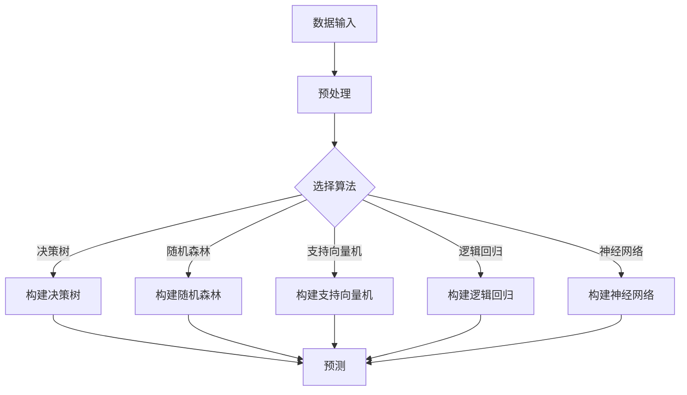

                 

### 文章标题

《机器学习在客户流失预警中的应用》

### 关键词

- 机器学习
- 客户流失预警
- 数据预处理
- 特征工程
- 监督学习
- 无监督学习
- 数学模型
- 项目实战

### 摘要

随着市场竞争的日益激烈，客户流失预警已成为企业提升业务稳定性和盈利能力的重要手段。本文将深入探讨机器学习在客户流失预警中的应用。首先，我们将介绍机器学习的基础概念和常见算法，并探讨客户流失预警的重要性和挑战。随后，文章将详细阐述数据预处理与特征工程的方法，解析监督学习和无监督学习算法在客户流失预警中的应用。最后，通过实际项目实战，展示机器学习在客户流失预警中的具体实现，并提供实用的最佳实践和未来展望。

---

#### 第一部分：机器学习与客户流失预警基础

**第1章：机器学习基础**

1.1 **机器学习的定义与分类**

机器学习（Machine Learning）是一门人工智能（Artificial Intelligence，AI）的分支，旨在通过算法使计算机系统能够从数据中学习，并自动进行预测或决策。机器学习可以分为三种主要类型：监督学习（Supervised Learning）、无监督学习（Unsupervised Learning）和强化学习（Reinforcement Learning）。

- **监督学习**：在这种学习中，系统根据已知输入和输出数据训练模型。常见的算法包括线性回归、决策树、支持向量机等。

- **无监督学习**：系统仅使用输入数据，没有已知的输出，通过发现数据中的模式和关系进行学习。常见的算法包括聚类分析、主成分分析和自编码器。

- **强化学习**：系统在与环境的交互中通过试错来学习最优策略，常用于游戏和机器人控制等领域。

1.2 **常见机器学习算法概述**

- **线性回归**：用于预测连续值输出，是最简单的监督学习算法之一。

- **决策树**：通过一系列规则对数据进行分类或回归，易于理解和解释。

- **支持向量机（SVM）**：通过找到一个最优的超平面来分割数据，适用于分类问题。

- **随机森林**：由多个决策树组成，通过集成多个模型来提高预测准确性。

- **神经网络**：包括多层感知器和卷积神经网络，适用于复杂的数据结构和模式识别。

1.3 **机器学习流程**

机器学习流程通常包括以下几个步骤：

1. **问题定义**：明确需要解决的问题和目标。
2. **数据收集**：收集相关的输入数据，如历史客户行为数据、交易记录等。
3. **数据预处理**：清洗数据、处理缺失值、进行数据归一化等。
4. **特征工程**：选择和创建有助于模型训练的特征。
5. **模型选择**：根据问题选择合适的算法和模型。
6. **模型训练**：使用训练数据训练模型。
7. **模型评估**：使用验证数据评估模型性能。
8. **模型优化**：根据评估结果调整模型参数。
9. **模型部署**：将模型部署到生产环境，进行实时预测。

**第2章：客户流失预警的重要性**

2.1 **客户流失预警的概念与背景**

客户流失预警（Customer Churn Prediction）是指通过分析客户的行为数据和特征，预测哪些客户可能在短期内流失。客户流失预警在企业中具有极其重要的意义，因为流失客户不仅会减少企业的收入，还会增加重新获取新客户的成本。

2.2 **客户流失预警的价值**

- **提高客户保留率**：通过识别潜在的流失客户，企业可以采取有针对性的措施，如个性化营销、客户关怀等，提高客户保留率。
- **降低运营成本**：预防客户流失可以降低客户获取和保留的成本，提高企业运营效率。
- **提升客户满意度**：及时发现并解决客户问题，提升客户满意度，增强客户忠诚度。
- **优化业务策略**：通过分析流失原因，企业可以调整产品和服务策略，提高市场竞争能力。

2.3 **客户流失预警的挑战与应对策略**

- **数据复杂性**：客户数据通常包含大量的非结构化和半结构化数据，如文本、图像、视频等，处理这些数据需要复杂的技术手段。
- **数据质量**：数据质量直接影响模型的效果，企业需要建立完善的数据清洗和质量管理流程。
- **算法选择**：不同的客户流失场景可能需要不同的算法，企业需要根据实际情况选择合适的算法。
- **实时性**：客户流失预警需要实时性，企业需要建立快速响应机制。

应对策略包括：

- **数据治理**：建立数据治理机制，确保数据的准确性、完整性和一致性。
- **算法调优**：通过多次迭代和实验，找到最适合的算法和参数组合。
- **模型监控**：实时监控模型性能，及时发现并解决异常情况。

**第3章：机器学习在客户流失预警中的应用场景**

3.1 **零售行业客户流失预警**

在零售行业，客户流失预警可以帮助企业预测哪些顾客可能会停止购物，从而采取措施挽回客户。常见的应用包括：

- **个性化推荐**：根据客户的购物历史和行为特征，提供个性化的商品推荐，增加购买机会。
- **促销策略**：根据客户的购买行为和偏好，制定有针对性的促销策略，提升销售额。

3.2 **电信行业客户流失预警**

在电信行业，客户流失预警可以帮助运营商预测哪些用户可能会取消服务，从而采取措施降低客户流失率。常见的应用包括：

- **客户关怀**：通过短信、电话等方式提醒用户注意账单，提供优惠套餐，提高客户满意度。
- **交叉销售**：向现有用户提供额外的服务或产品，增加用户粘性。

3.3 **金融行业客户流失预警**

在金融行业，客户流失预警可以帮助银行和金融机构预测哪些客户可能会关闭账户或减少交易，从而采取措施挽留重要客户。常见的应用包括：

- **客户细分**：通过分析客户行为和交易数据，将客户分为不同的群体，提供定制化的服务。
- **风险控制**：预测潜在风险客户，采取相应的风险控制措施，降低不良影响。

通过上述分析，我们可以看到机器学习在客户流失预警中具有广泛的应用场景和显著的价值。接下来的章节将深入探讨数据预处理与特征工程、核心算法原理以及数学模型和数学公式，帮助读者更好地理解并应用机器学习技术进行客户流失预警。接下来，我们将首先探讨机器学习的基础，帮助读者打下坚实的理论基础。

---

#### 第一部分：机器学习与客户流失预警基础

**第1章：机器学习基础**

1.1 **机器学习的定义与分类**

机器学习是一门人工智能的分支，主要研究如何通过计算机算法使机器具备自主学习的能力，即从数据中自动获取知识和规律，并应用于预测或决策。机器学习可以分为以下几种主要类型：

- **监督学习（Supervised Learning）**：在这种学习中，我们有一组已标记的训练数据，每个数据点都有对应的输出标签。模型的目的是学习输入和输出之间的映射关系，以便对新的、未标记的数据进行预测。常见的算法有线性回归、逻辑回归、决策树、支持向量机（SVM）、随机森林、神经网络等。

- **无监督学习（Unsupervised Learning）**：与监督学习相反，无监督学习没有已知的输出标签，目标是发现数据中的内在结构和规律。常见的算法有聚类（如K均值聚类、层次聚类）、降维（如主成分分析、t-SNE）、关联规则挖掘（如Apriori算法）等。

- **强化学习（Reinforcement Learning）**：这种学习方式主要应用于动态环境中，通过试错和奖励机制来学习最优策略。强化学习的一个典型例子是智能体在与环境交互的过程中，通过不断调整其行为策略来最大化累积奖励。常见的算法有Q学习、SARSA、Deep Q Network（DQN）等。

每种类型的机器学习算法都有其特定的应用场景和优势，但本文主要关注的是监督学习和无监督学习在客户流失预警中的应用。

1.2 **常见机器学习算法概述**

- **线性回归（Linear Regression）**：线性回归是最简单的监督学习算法之一，用于预测连续值输出。其基本思想是通过找到输入变量和输出变量之间的线性关系，即拟合一个直线模型来预测新数据的输出值。线性回归的数学基础是找到最佳拟合直线，使得所有预测值与实际值的误差平方和最小。

- **决策树（Decision Tree）**：决策树通过一系列的规则对数据进行分类或回归。每个内部节点表示一个特征，每个分支表示该特征的取值，每个叶子节点表示一个分类或回归结果。决策树的优点是易于理解和解释，但可能存在过拟合问题。

- **支持向量机（Support Vector Machine，SVM）**：SVM通过找到一个最优的超平面来分割数据，使得不同类别的数据点之间的边界最大化。SVM的基本思想是最大化分类间隔，同时使决策边界尽可能地远离数据点。SVM在处理高维数据和线性不可分问题时表现良好。

- **随机森林（Random Forest）**：随机森林是一种集成学习方法，由多个决策树组成。随机森林通过随机选择特征和随机分割数据来构建多个决策树，并通过投票或平均的方式来预测新数据的类别。随机森林的优点是能够处理高维数据、减少过拟合，并且具有很好的泛化能力。

- **神经网络（Neural Network）**：神经网络，特别是深度神经网络（Deep Neural Network，DNN），是机器学习领域的重要研究方向。神经网络通过模拟人脑神经元之间的连接，学习复杂的非线性函数。深度神经网络由多个隐藏层组成，可以处理大量复杂数据。常见的神经网络结构包括卷积神经网络（CNN）和循环神经网络（RNN）等。

1.3 **机器学习流程**

机器学习流程可以分为以下几个步骤：

1. **问题定义**：明确需要解决的问题和目标。这一步至关重要，因为它决定了后续所有步骤的方向和内容。
2. **数据收集**：收集相关的输入数据，如历史客户行为数据、交易记录等。数据的质量直接影响模型的效果，因此需要确保数据的准确性和完整性。
3. **数据预处理**：清洗数据、处理缺失值、进行数据归一化等。数据预处理是机器学习流程中非常重要的一步，它有助于提高模型的效果和泛化能力。
4. **特征工程**：选择和创建有助于模型训练的特征。特征工程是提高模型性能的关键步骤，它包括特征提取、特征选择和特征组合等。
5. **模型选择**：根据问题选择合适的算法和模型。不同的算法和模型适用于不同类型的问题，因此需要根据实际情况进行选择。
6. **模型训练**：使用训练数据训练模型。在这一步中，模型会通过学习数据中的特征和规律来建立预测模型。
7. **模型评估**：使用验证数据评估模型性能。评估指标包括准确率、召回率、F1分数等，通过比较不同模型的性能，选择最优模型。
8. **模型优化**：根据评估结果调整模型参数。这一步可以进一步提高模型性能，减少过拟合问题。
9. **模型部署**：将模型部署到生产环境，进行实时预测。模型部署是机器学习流程的最终目标，它使得模型能够为企业带来实际的商业价值。

通过上述步骤，我们可以构建一个完整的机器学习模型，并应用于客户流失预警等问题。接下来，我们将进一步探讨数据预处理与特征工程的方法，为构建高效的机器学习模型打下基础。

---

#### 第一部分：机器学习与客户流失预警基础

**第2章：客户流失预警的重要性**

2.1 **客户流失预警的概念与背景**

客户流失预警，又称为客户流失预测或客户流失率预测，是指利用数据分析技术，通过对客户历史行为数据、交易数据、偏好数据等的分析，预测哪些客户在未来一段时间内可能停止使用企业的产品或服务。这一概念起源于电信、金融、零售等高度依赖客户关系管理的行业。随着大数据和人工智能技术的迅猛发展，客户流失预警已经成为企业提升客户保留率、降低运营成本、提高盈利能力的重要工具。

2.2 **客户流失预警的价值**

- **提高客户保留率**：通过提前识别出潜在流失客户，企业可以采取针对性的措施，如提供个性化服务、增加客户关怀、调整产品定价策略等，从而提高客户的满意度和忠诚度，降低客户流失率。

- **降低运营成本**：预防客户流失可以显著降低企业的运营成本。重新获取新客户的成本通常是保留现有客户的5-10倍，通过客户流失预警系统，企业可以提前干预，避免客户流失，从而节省大量的营销和客户获取成本。

- **提升客户满意度**：及时发现并解决客户问题，提供个性化服务，可以大幅提升客户满意度，增强客户对企业品牌的忠诚度。

- **优化业务策略**：通过对客户流失数据的分析，企业可以深入了解客户流失的原因，调整业务策略，改进产品和服务，提高市场竞争力。

2.3 **客户流失预警的挑战与应对策略**

尽管客户流失预警具有重要的商业价值，但在实际应用中仍面临以下挑战：

- **数据复杂性**：客户数据通常包含大量的非结构化和半结构化数据，如文本、图像、视频等。这些数据需要通过复杂的预处理和特征工程技术进行处理。

- **数据质量**：数据质量直接影响模型的效果。在实际应用中，企业面临数据缺失、不一致、噪声等问题，需要建立完善的数据清洗和质量保证流程。

- **算法选择**：不同的客户流失场景可能需要不同的算法。例如，对于新客户流失预警，可能需要使用基于聚类和关联规则挖掘的无监督学习方法；对于已有客户的流失预警，可能需要使用基于回归和分类的监督学习方法。

- **实时性**：客户流失预警需要实时性，企业需要快速响应，以便及时采取挽回措施。

应对策略包括：

- **数据治理**：建立数据治理机制，确保数据的准确性、完整性和一致性。

- **算法调优**：通过多次迭代和实验，找到最适合的算法和参数组合。

- **模型监控**：实时监控模型性能，及时发现并解决异常情况。

- **集成多源数据**：整合来自不同渠道的客户数据，如社交媒体、客户互动记录等，提高数据的全面性和准确性。

通过上述措施，企业可以构建高效、准确的客户流失预警系统，从而更好地管理客户关系，提升业务绩效。

---

#### 第一部分：机器学习与客户流失预警基础

**第3章：机器学习在客户流失预警中的应用场景**

3.1 **零售行业客户流失预警**

在零售行业，客户流失预警有助于企业识别可能停止购物的客户，从而采取有效的挽留措施。以下是一些典型的应用场景：

- **个性化推荐**：通过分析客户的购物历史和偏好，推荐个性化的商品，增加客户的购物体验和购买意愿，从而降低流失风险。

- **促销活动**：根据客户的行为数据，设计有针对性的促销活动，如优惠券、积分奖励等，提高客户的忠诚度。

- **客户细分**：将客户分为不同的群体，针对不同群体的特点制定个性化的营销策略，提高营销效果。

3.2 **电信行业客户流失预警**

电信行业是客户流失预警的重要应用领域。以下是一些具体应用：

- **客户关怀**：通过短信、电话等方式提醒用户注意账单，提供优惠套餐，提高用户满意度。

- **交叉销售与向上销售**：通过分析用户的通信习惯和使用情况，向用户推荐额外的服务或产品，如国际漫游、宽带服务等，增加用户粘性。

- ** churn 预测模型**：利用机器学习算法，构建客户流失预测模型，提前识别潜在流失用户，采取有针对性的挽回措施。

3.3 **金融行业客户流失预警**

金融行业对客户流失预警有较高的需求，以下是一些具体应用：

- **风险控制**：通过分析客户的交易行为和信用记录，预测潜在风险客户，采取相应的风险控制措施，降低不良影响。

- **客户细分与个性化服务**：根据客户的行为数据和财务状况，将客户分为不同的群体，提供个性化的理财产品和服务，提高客户满意度和忠诚度。

- **客户挽留策略**：针对潜在流失的客户，采取个性化的挽留策略，如调整利率、提供定制化金融服务等，提高客户保留率。

通过上述应用场景，我们可以看到机器学习在客户流失预警中的广泛应用和巨大价值。接下来，我们将详细探讨数据预处理与特征工程的方法，为构建高效的机器学习模型奠定基础。

---

#### 第二部分：数据预处理与特征工程

**第4章：数据预处理**

4.1 **数据清洗**

数据清洗是数据预处理的第一步，其主要任务是识别和纠正数据中的错误、异常和重复。具体包括以下几个步骤：

- **缺失值处理**：缺失值可能是由于数据收集过程中的问题导致的，可以通过以下几种方法进行处理：
  - 删除缺失值：对于少量的缺失值，可以直接删除相关记录。
  - 填充缺失值：使用统计方法或领域知识填充缺失值，如平均值、中位数、众数、插值法等。
  - 延迟处理：对于关键特征，可以考虑延迟处理缺失值，通过后续的特征工程或模型训练来填补。

- **异常值检测与处理**：异常值可能对模型性能产生负面影响，可以通过以下方法进行处理：
  - 删除异常值：对于明显的异常值，可以直接删除。
  - 调整异常值：使用统计方法调整异常值，如离群点插值、边界限定等。
  - 转换异常值：将异常值转换为其他数值或类别，使其在模型中不会产生过大的影响。

- **重复数据删除**：检测并删除重复的数据记录，确保数据的唯一性和准确性。

4.2 **数据集成**

数据集成是将来自不同源的数据合并为一个统一的数据集。在实际应用中，数据通常分散存储在多个数据库或文件中，数据集成是实现全面分析的基础。数据集成的主要步骤包括：

- **数据抽取**：从不同数据源中提取所需的数据。
- **数据转换**：将不同数据源的数据转换为统一的格式，如统一数据类型、统一时间格式等。
- **数据合并**：将转换后的数据进行合并，消除数据之间的不一致性。

4.3 **数据归一化与标准化**

数据归一化和标准化是数据预处理中常用的技术，用于将不同特征的数据转换到同一尺度，消除数据量级差异对模型训练的影响。

- **数据归一化**：通过将数据缩放到特定范围，如[0,1]或[-1,1]，使不同特征具有相同的权重。常见的归一化方法包括最小-最大缩放和z-score标准化。
  - 最小-最大缩放公式：
    $$x_{\text{norm}} = \frac{x - \min(x)}{\max(x) - \min(x)}$$
  - z-score标准化公式：
    $$x_{\text{norm}} = \frac{x - \mu}{\sigma}$$
    其中，$x$为原始数据，$\mu$为均值，$\sigma$为标准差。

- **数据标准化**：通过计算每个特征的标准差，将数据缩放到均值为0、标准差为1的分布。标准化方法常用于处理具有不同量纲的特征，有助于提高模型的泛化能力。

4.4 **数据分箱**

数据分箱（Binning）是一种将连续特征划分为离散区间的技术，用于减少数据维度和增强模型的鲁棒性。常见的分箱方法包括等宽分箱、等频分箱和基于阈值的分箱。

- **等宽分箱**：将特征数据等间隔划分成若干区间，每个区间的宽度相同。
- **等频分箱**：根据特征数据出现的频率划分区间，使每个区间的数据点数量大致相同。
- **基于阈值的分箱**：根据专家经验或统计方法设置阈值，将特征划分为不同的区间。

通过数据预处理，我们可以消除数据中的噪声、异常和重复，整合多源数据，并使不同特征具有相同的尺度，从而为后续的特征工程和模型训练奠定基础。

---

#### 第二部分：数据预处理与特征工程

**第5章：特征工程**

5.1 **特征提取**

特征提取是特征工程的关键步骤，其目标是找出对预测目标有重要影响的关键特征。常见的特征提取方法包括：

- **统计特征**：通过计算原始数据的统计量，提取有助于预测的特征。如平均值、中位数、标准差、最大值、最小值等。
- **文本特征**：对于文本数据，可以使用词频-逆文档频率（TF-IDF）、Word2Vec、BERT等模型提取特征。
- **图像特征**：对于图像数据，可以使用卷积神经网络（CNN）提取特征，如边缘、纹理、颜色等。

5.2 **特征选择**

特征选择旨在从原始特征中筛选出最有用的特征，提高模型性能并减少计算成本。常见的特征选择方法包括：

- **过滤式方法**：基于特征的重要性或相关性，直接筛选出部分特征。如信息增益、卡方检验、互信息等。
- **包装式方法**：通过训练多个模型，逐步筛选出最优特征组合。如向前选择、向后选择、递归特征消除等。
- **嵌入式方法**：在模型训练过程中，自动选择重要特征。如LASSO、岭回归、随机森林等。

5.3 **特征组合**

特征组合是将多个原始特征组合成新的特征，以提升模型的预测能力。常见的特征组合方法包括：

- **特征交叉**：将不同特征进行组合，生成新的交叉特征。如年龄和收入的交叉特征、用户购买时间和购买商品的交叉特征等。
- **特征融合**：将不同来源的特征进行融合，生成综合特征。如将文本特征和图像特征融合，生成更全面的用户特征。
- **特征加权**：对多个特征进行加权融合，使重要特征具有更高的权重。如基于协方差或相关性的特征加权方法。

通过特征工程，我们可以有效地提高模型的预测性能和泛化能力，从而更好地应对客户流失预警等复杂问题。接下来，我们将进一步探讨监督学习算法在客户流失预警中的应用。

---

#### 第三部分：核心算法原理讲解

**第6章：监督学习算法在客户流失预警中的应用**

6.1 **决策树**

决策树（Decision Tree）是一种常见的监督学习算法，通过一系列的规则对数据进行分类或回归。决策树的基本思想是从原始数据中提取特征，并根据这些特征将数据划分为多个子集，直到满足某些终止条件（如达到最大深度、最小节点样本数等）。

**基本原理：**

决策树通过以下步骤构建：

1. **特征选择**：选择一个最优特征进行分裂，通常使用信息增益（Information Gain）或基尼不纯度（Gini Impurity）作为评价指标。
2. **分裂决策**：将数据集根据选定的特征进行分裂，创建一个新的节点。
3. **递归构建**：对新的子节点重复上述步骤，直到满足终止条件。

**伪代码：**

```python
def build_decision_tree(data, features, target, max_depth):
    if should_stop(data, max_depth):
        return leaf_node(target)
    
    best_feature, best_split = find_best_split(data, features, target)
    left_data, right_data = split_data(data, best_feature, best_split)
    
    tree = {
        'feature': best_feature,
        'split': best_split,
        'left': build_decision_tree(left_data, features, target, max_depth + 1),
        'right': build_decision_tree(right_data, features, target, max_depth + 1)
    }
    return tree

def find_best_split(data, features, target):
    best_feature = None
    best_split = None
    best_impurity = float('inf')
    
    for feature in features:
        for split_value in possible_split_values(feature):
            left_data, right_data = split_data(data, feature, split_value)
            impurity = calculate_impurity(left_data, right_data, target)
            if impurity < best_impurity:
                best_impurity = impurity
                best_feature = feature
                best_split = split_value
    
    return best_feature, best_split

def should_stop(data, max_depth):
    # 根据最大深度、最小节点样本数等条件判断是否停止
    return max_depth >= max_depth or len(data) <= min_samples

def calculate_impurity(left_data, right_data, target):
    # 计算信息增益或基尼不纯度
    pass
```

6.2 **随机森林**

随机森林（Random Forest）是一种基于决策树的集成学习方法，通过构建多个决策树，并对预测结果进行投票或平均来提高模型的泛化能力。

**基本原理：**

随机森林的主要步骤如下：

1. **随机抽样**：从原始数据中随机抽取一部分样本作为训练集。
2. **随机特征选择**：在每个节点上，从多个特征中随机选择一部分特征进行分裂。
3. **构建决策树**：使用训练集构建多个决策树。
4. **集成预测**：对多个决策树的预测结果进行投票或平均。

**伪代码：**

```python
def build_random_forest(data, n_estimators, max_features):
    forests = []
    
    for _ in range(n_estimators):
        sample_data = random_sample(data)
        forest = []
        
        for _ in range(max_features):
            tree = build_decision_tree(sample_data, features, target)
            forest.append(tree)
        
        forests.append(forest)
    
    return forests

def random_sample(data, sample_size=None):
    # 从数据中随机抽样
    pass

def predict(forests, new_data):
    predictions = []
    
    for forest in forests:
        tree = random_choice(forest)
        prediction = tree_predict(tree, new_data)
        predictions.append(prediction)
    
    return vote_or_average(predictions)
```

6.3 **支持向量机（SVM）**

支持向量机（Support Vector Machine，SVM）是一种基于最大间隔分类器的监督学习算法，其目标是找到一个最优的超平面，将数据点正确分类。

**基本原理：**

SVM的主要步骤如下：

1. **线性SVM**：通过求解以下优化问题找到最优超平面：
   $$ \min_{\mathbf{w},b} \frac{1}{2} ||\mathbf{w}||^2 $$
   $$ \text{subject to} \quad y_i (\mathbf{w} \cdot \mathbf{x_i} + b) \geq 1 $$
   其中，$\mathbf{w}$是超平面参数，$b$是偏置项，$\mathbf{x_i}$是第$i$个数据点，$y_i$是类别标签。

2. **非线性SVM**：通过核函数将低维数据映射到高维空间，实现非线性分类。常见的核函数有线性核、多项式核、径向基函数（RBF）核等。

3. **支持向量**：在求解优化问题时，只有部分数据点对超平面的求解有影响，这些数据点称为支持向量。

**伪代码：**

```python
def linear_svm(data, labels):
    # 求解线性SVM的优化问题
    pass

def kernel_function(x, y):
    # 定义核函数，如线性核、多项式核、RBF核等
    pass

def nonlinear_svm(data, labels, kernel):
    # 使用核函数求解非线性SVM的优化问题
    pass
```

6.4 **逻辑回归**

逻辑回归（Logistic Regression）是一种用于二分类问题的线性分类模型，其目标是找到最佳的概率预测模型。

**基本原理：**

逻辑回归的基本步骤如下：

1. **建立线性模型**：通过线性模型计算预测概率：
   $$ \hat{p} = \sigma(\mathbf{w} \cdot \mathbf{x} + b) $$
   其中，$\sigma$是 sigmoid 函数，$\mathbf{w}$是权重向量，$\mathbf{x}$是输入特征，$b$是偏置项。

2. **损失函数**：使用对数似然损失函数评估模型的预测效果：
   $$ \mathcal{L}(\mathbf{w}, b) = -\sum_{i=1}^{n} y_i \log(\hat{p}_i) + (1 - y_i) \log(1 - \hat{p}_i) $$

3. **优化目标**：通过梯度下降法或牛顿法等优化算法，最小化损失函数，求解最优权重。

**伪代码：**

```python
def logistic_regression(data, labels, learning_rate, max_iterations):
    # 初始化权重和偏置项
    w, b = initialize_weights(data)
    
    for _ in range(max_iterations):
        # 计算预测概率
        predictions = sigmoid(w.dot(data) + b)
        
        # 计算损失函数
        loss = -sum(labels * np.log(predictions) + (1 - labels) * np.log(1 - predictions))
        
        # 计算梯度
        dw = (data.T.dot((predictions - labels))) / n_samples
        db = (predictions - labels).mean()
        
        # 更新权重和偏置项
        w -= learning_rate * dw
        b -= learning_rate * db
    
    return w, b

def sigmoid(x):
    return 1 / (1 + np.exp(-x))
```

6.5 **神经网络**

神经网络（Neural Network）是一种模拟人脑神经元连接结构的计算模型，通过多层节点（神经元）的学习和计算，实现复杂函数的逼近和分类。

**基本原理：**

神经网络的主要步骤如下：

1. **前向传播**：输入数据经过网络中的多层节点，逐层计算输出，直至输出层。
2. **反向传播**：计算输出层的误差，并反向传播误差，更新各层的权重和偏置项。
3. **优化目标**：使用梯度下降法等优化算法，最小化损失函数。

**伪代码：**

```python
def forward_propagation(x, weights, biases):
    # 前向传播，计算每个神经元的输出
    pass

def backward_propagation(x, y, output, weights, biases, learning_rate):
    # 反向传播，计算梯度并更新权重和偏置项
    pass

def neural_network(x, layers, learning_rate, max_iterations):
    # 初始化权重和偏置项
    weights, biases = initialize_weights(layers)
    
    for _ in range(max_iterations):
        # 前向传播
        output = forward_propagation(x, weights, biases)
        
        # 计算损失函数
        loss = compute_loss(output, y)
        
        # 反向传播
        dweights, dbiases = backward_propagation(x, y, output, weights, biases, learning_rate)
        
        # 更新权重和偏置项
        weights -= learning_rate * dweights
        biases -= learning_rate * dbiases
    
    return weights, biases
```

通过上述算法原理讲解，我们可以看到监督学习算法在客户流失预警中的多样性和应用潜力。接下来，我们将进一步探讨无监督学习算法在客户流失预警中的应用。

---

#### 第三部分：核心算法原理讲解

**第7章：无监督学习算法在客户流失预警中的应用**

7.1 **K均值聚类**

K均值聚类（K-Means Clustering）是一种常用的无监督学习算法，通过将数据点划分成K个簇，使得每个簇内的数据点距离中心较近，而不同簇之间的数据点距离中心较远。K均值聚类常用于发现数据中的隐藏模式和结构。

**基本原理：**

K均值聚类的主要步骤如下：

1. **初始化中心点**：随机选择K个初始中心点。
2. **分配数据点**：将每个数据点分配到最近的中心点所代表的簇。
3. **更新中心点**：重新计算每个簇的中心点。
4. **重复步骤2和3，直到满足停止条件（如中心点变化较小或达到最大迭代次数）**。

**伪代码：**

```python
def k_means(data, k, max_iterations):
    # 初始化中心点
    centroids = initialize_centroids(data, k)
    
    for _ in range(max_iterations):
        # 分配数据点到最近的中心点
        clusters = assign_points_to_clusters(data, centroids)
        
        # 更新中心点
        new_centroids = update_centroids(clusters, k)
        
        # 判断是否满足停止条件
        if is_converged(centroids, new_centroids):
            break
        
        centroids = new_centroids
    
    return clusters, centroids

def initialize_centroids(data, k):
    # 随机选择K个初始中心点
    pass

def assign_points_to_clusters(data, centroids):
    # 将数据点分配到最近的中心点所代表的簇
    pass

def update_centroids(clusters, k):
    # 重新计算每个簇的中心点
    pass

def is_converged(old_centroids, new_centroids):
    # 判断中心点变化是否较小
    pass
```

7.2 **主成分分析**

主成分分析（Principal Component Analysis，PCA）是一种降维技术，通过将数据投影到新的坐标系中，提取最重要的特征（主成分），从而降低数据维度，提高模型性能。

**基本原理：**

PCA的主要步骤如下：

1. **数据标准化**：对数据进行标准化处理，使不同特征具有相同的尺度。
2. **计算协方差矩阵**：计算所有特征之间的协方差矩阵。
3. **特征分解**：对协方差矩阵进行特征分解，得到特征值和特征向量。
4. **选择主成分**：选择特征值最大的K个特征向量作为新的特征空间。
5. **数据投影**：将原始数据投影到新的特征空间中。

**伪代码：**

```python
def pca(data, n_components):
    # 数据标准化
    standardized_data = standardize_data(data)
    
    # 计算协方差矩阵
    cov_matrix = calculate_covariance_matrix(standardized_data)
    
    # 特征分解
    eigenvalues, eigenvectors = eigen_decomposition(cov_matrix)
    
    # 选择主成分
    top_eigenvectors = select_top_eigenvectors(eigenvalues, eigenvectors, n_components)
    
    # 数据投影
    projected_data = project_data_to_new_space(data, top_eigenvectors)
    
    return projected_data

def standardize_data(data):
    # 对数据进行标准化处理
    pass

def calculate_covariance_matrix(data):
    # 计算协方差矩阵
    pass

def eigen_decomposition(cov_matrix):
    # 对协方差矩阵进行特征分解
    pass

def select_top_eigenvectors(eigenvalues, eigenvectors, n_components):
    # 选择特征值最大的K个特征向量
    pass

def project_data_to_new_space(data, eigenvectors):
    # 将数据投影到新的特征空间中
    pass
```

7.3 **聚类分析**

聚类分析（Cluster Analysis）是一类无监督学习方法，通过将相似的数据点划分为同一簇，以发现数据中的模式和结构。

**基本原理：**

聚类分析的主要步骤如下：

1. **选择聚类算法**：如K均值聚类、层次聚类等。
2. **初始化聚类中心**：随机或基于某种方法选择初始聚类中心。
3. **分配数据点**：将每个数据点分配到最近的聚类中心所代表的簇。
4. **更新聚类中心**：重新计算每个簇的中心点。
5. **重复步骤2-4，直到满足停止条件（如聚类中心变化较小或达到最大迭代次数）**。

**伪代码：**

```python
def cluster_analysis(data, algorithm, k, max_iterations):
    if algorithm == 'kmeans':
        clusters, centroids = k_means(data, k, max_iterations)
    elif algorithm == 'hierarchical':
        clusters = hierarchical_clustering(data, k, max_iterations)
    else:
        raise ValueError("Invalid clustering algorithm.")
    
    return clusters

def k_means(data, k, max_iterations):
    # K均值聚类算法
    pass

def hierarchical_clustering(data, k, max_iterations):
    # 层次聚类算法
    pass
```

通过上述无监督学习算法的讲解，我们可以看到其在客户流失预警中的应用潜力。接下来，我们将深入探讨机器学习的数学基础，为理解和应用机器学习算法提供坚实的数学支持。

---

#### 第四部分：数学模型和数学公式讲解

**第8章：机器学习的数学基础**

8.1 **概率论基础**

概率论是机器学习的重要基础，许多机器学习算法都依赖于概率论的基本概念和公式。以下是一些常用的概率论基础：

- **概率分布**：概率分布描述了随机变量的概率分布情况。常见的概率分布包括伯努利分布、二项分布、正态分布等。

- **条件概率**：条件概率描述了在某个事件发生的条件下，另一个事件发生的概率。条件概率公式为：
  $$ P(A|B) = \frac{P(A \cap B)}{P(B)} $$
  
- **贝叶斯定理**：贝叶斯定理是概率论中一个重要的公式，它描述了后验概率和先验概率之间的关系。贝叶斯定理公式为：
  $$ P(A|B) = \frac{P(B|A)P(A)}{P(B)} $$
  
- **最大似然估计**：最大似然估计是一种常用的参数估计方法，它通过最大化似然函数来确定模型的参数。似然函数公式为：
  $$ \mathcal{L}(\theta | x) = \prod_{i=1}^{n} p(x_i | \theta) $$
  其中，$\theta$是模型参数，$x$是数据样本。

8.2 **统计学基础**

统计学在机器学习中扮演着重要的角色，许多机器学习算法都依赖于统计学的基本概念和公式。以下是一些常用的统计学基础：

- **假设检验**：假设检验是一种用于判断模型是否有效的统计方法。常见的假设检验方法包括t检验、F检验等。

- **置信区间**：置信区间是用于估计参数范围的区间，它提供了参数估计的不确定性。置信区间公式为：
  $$ \theta \in (\bar{x} - Z_{\alpha/2} \cdot \frac{s}{\sqrt{n}}, \bar{x} + Z_{\alpha/2} \cdot \frac{s}{\sqrt{n}}) $$
  其中，$\theta$是参数，$\bar{x}$是样本均值，$s$是样本标准差，$Z_{\alpha/2}$是标准正态分布的临界值。

- **回归分析**：回归分析是一种用于研究变量之间关系的方法。常见的回归分析方法包括线性回归、多项式回归等。

8.3 **最优化算法基础**

最优化算法在机器学习中用于寻找最优解，如最小化损失函数或最大化似然函数。以下是一些常用的最优化算法：

- **梯度下降法**：梯度下降法是一种常用的最优化算法，通过迭代更新参数，使损失函数或似然函数最小化。梯度下降法公式为：
  $$ \theta = \theta - \alpha \cdot \nabla_\theta \mathcal{L}(\theta) $$
  其中，$\theta$是参数，$\alpha$是学习率，$\nabla_\theta \mathcal{L}(\theta)$是损失函数关于参数的梯度。

- **牛顿法**：牛顿法是一种更高效的优化算法，它利用二阶导数信息来加速收敛。牛顿法公式为：
  $$ \theta = \theta - H^{-1} \cdot \nabla \mathcal{L}(\theta) $$
  其中，$H$是海森矩阵，$\nabla \mathcal{L}(\theta)$是损失函数关于参数的梯度。

- **随机优化算法**：随机优化算法通过随机搜索来寻找最优解，如遗传算法、粒子群优化算法等。

通过上述数学基础讲解，我们可以更好地理解机器学习算法的原理和应用。接下来，我们将深入探讨机器学习中的数学公式，进一步解析这些公式在算法中的应用。

---

#### 第四部分：数学模型和数学公式讲解

**第9章：机器学习中的数学公式**

9.1 **决策树中的信息熵**

决策树通过计算信息熵来选择最优的特征进行分割。信息熵（Entropy）是衡量数据不确定性的一个指标，其公式为：

$$ H(X) = -\sum_{i} p(x_i) \log_2 p(x_i) $$

其中，$X$是特征集合，$p(x_i)$是特征$x_i$在数据集中的概率。

**示例：**

假设我们有两个特征$X_1$和$X_2$，它们的概率分别为$p(X_1) = 0.5$和$p(X_2) = 0.5$，则信息熵为：

$$ H(X) = - (0.5 \log_2 0.5 + 0.5 \log_2 0.5) = 1 $$

9.2 **支持向量机的优化目标**

支持向量机（SVM）的优化目标是找到一个最优的超平面，使得不同类别的数据点之间的边界最大化。SVM的优化目标可以表示为：

$$ \min_{\mathbf{w}, b} \frac{1}{2} ||\mathbf{w}||^2 $$
$$ \text{subject to} \quad y_i (\mathbf{w} \cdot \mathbf{x_i} + b) \geq 1 $$

其中，$\mathbf{w}$是超平面参数，$b$是偏置项，$\mathbf{x_i}$是第$i$个数据点，$y_i$是类别标签。

9.3 **神经网络的激活函数**

神经网络中的激活函数用于确定每个神经元的输出。常见的激活函数包括sigmoid函数、ReLU函数和Tanh函数。

- **sigmoid函数**：用于将输入映射到[0,1]区间，其公式为：

  $$ \sigma(x) = \frac{1}{1 + e^{-x}} $$

- **ReLU函数**：用于非线性变换，其公式为：

  $$ \text{ReLU}(x) = \max(0, x) $$

- **Tanh函数**：用于将输入映射到[-1,1]区间，其公式为：

  $$ \tanh(x) = \frac{e^x - e^{-x}}{e^x + e^{-x}} $$

**示例：**

假设输入$x=2$，使用ReLU函数，则输出为：

$$ \text{ReLU}(2) = \max(0, 2) = 2 $$

通过上述数学公式的讲解，我们可以更好地理解决策树、支持向量机和神经网络等核心算法的工作原理，为实际应用这些算法提供坚实的理论基础。接下来，我们将进入实际项目实战环节，通过具体案例展示机器学习在客户流失预警中的应用。

---

#### 第五部分：项目实战

**第10章：搭建开发环境**

10.1 **Python开发环境搭建**

为了进行机器学习项目的开发和实验，我们需要搭建一个Python开发环境。以下是具体的步骤：

1. **安装Python**：首先，我们需要下载并安装Python。我们可以从Python的官方网站（https://www.python.org/）下载Python安装包。安装过程中，确保勾选“Add Python to PATH”选项，以便在命令行中直接运行Python。

2. **安装Jupyter Notebook**：Jupyter Notebook是一种交互式开发环境，非常适合进行数据分析和机器学习实验。在安装Python后，可以通过以下命令安装Jupyter Notebook：

   ```bash
   pip install notebook
   ```

3. **安装必要的库**：在Python中，我们通常使用多个库来简化开发过程。以下是一些常用的库：

   - **NumPy**：用于数值计算和矩阵操作。
     ```bash
     pip install numpy
     ```

   - **Pandas**：用于数据处理和分析。
     ```bash
     pip install pandas
     ```

   - **Scikit-learn**：提供了丰富的机器学习算法和工具。
     ```bash
     pip install scikit-learn
     ```

   - **Matplotlib**：用于数据可视化。
     ```bash
     pip install matplotlib
     ```

   - **Seaborn**：用于高级数据可视化。
     ```bash
     pip install seaborn
     ```

4. **启动Jupyter Notebook**：安装完成后，我们可以在命令行中通过以下命令启动Jupyter Notebook：

   ```bash
   jupyter notebook
   ```

   这将打开一个Web界面，我们可以在这里编写和运行Python代码。

10.2 **机器学习库安装**

除了Python基础安装外，我们还需要安装特定的机器学习库来支持我们的项目。以下是常用的机器学习库及其安装方法：

- **TensorFlow**：用于构建和训练深度学习模型。
  ```bash
  pip install tensorflow
  ```

- **PyTorch**：另一个流行的深度学习库。
  ```bash
  pip install pytorch torchvision
  ```

- **Scikit-learn**：提供了多种机器学习算法和工具。
  ```bash
  pip install scikit-learn
  ```

10.3 **数据库连接与操作**

在实际项目中，我们可能需要连接数据库来获取和处理数据。以下是一个简单的数据库连接和操作示例：

1. **安装数据库驱动**：以MySQL为例，我们可以使用以下命令安装相应的驱动：

   ```bash
   pip install mysql-connector-python
   ```

2. **连接数据库**：以下是一个Python代码示例，用于连接MySQL数据库：

   ```python
   import mysql.connector

   # 数据库连接配置
   config = {
       'user': 'your_username',
       'password': 'your_password',
       'host': 'your_host',
       'database': 'your_database'
   }

   # 建立数据库连接
   connection = mysql.connector.connect(**config)
   cursor = connection.cursor()

   # 查询数据
   query = "SELECT * FROM customers;"
   cursor.execute(query)
   results = cursor.fetchall()

   # 打印查询结果
   for row in results:
       print(row)

   # 关闭数据库连接
   cursor.close()
   connection.close()
   ```

通过上述步骤，我们可以搭建一个完整的Python开发环境，安装必要的机器学习库，并连接数据库进行数据操作，为后续的客户流失预警项目做好准备。

---

#### 第五部分：项目实战

**第11章：客户流失预警项目实战**

11.1 **数据收集与预处理**

在进行客户流失预警项目之前，我们需要收集相关的数据。这些数据可能包括客户的基本信息、交易记录、互动行为等。以下是一个简单的数据收集与预处理流程：

1. **数据收集**：
   - 通过数据库或API获取历史客户数据，包括用户ID、年龄、性别、收入水平、购买历史、互动记录等。
   - 收集实时数据，如当前客户的浏览行为、购买意向等。

2. **数据预处理**：
   - **数据清洗**：删除重复记录、处理缺失值（如使用均值或中位数填充）。
   - **数据集成**：将不同来源的数据整合到一个数据集中，确保数据的准确性和一致性。
   - **数据转换**：将日期、文本等非数值型数据转换为数值型数据。
   - **数据归一化**：对数值型数据进行归一化处理，使其在相同的尺度上。

以下是一个Python代码示例，用于数据清洗、集成和归一化：

```python
import pandas as pd

# 加载数据
data = pd.read_csv('customer_data.csv')

# 数据清洗
data.drop_duplicates(inplace=True)
data.fillna(data.mean(), inplace=True)

# 数据集成
# 将多个数据表合并为一个数据集
data_combined = data.merge(data_interactions, on='user_id')

# 数据归一化
from sklearn.preprocessing import MinMaxScaler

scaler = MinMaxScaler()
data_scaled = scaler.fit_transform(data_combined)
data_scaled = pd.DataFrame(data_scaled, columns=data_combined.columns)
```

11.2 **特征工程**

特征工程是提升模型性能的关键步骤。以下是一些常用的特征工程方法：

1. **特征提取**：
   - **文本特征**：使用词频-逆文档频率（TF-IDF）或Word2Vec提取文本特征。
   - **图像特征**：使用卷积神经网络（CNN）提取图像特征。
   - **统计特征**：计算客户的购买频率、购买金额、购买商品种类等统计特征。

2. **特征选择**：
   - **过滤式方法**：基于特征的重要性或相关性进行筛选。
   - **包装式方法**：通过多次训练和交叉验证筛选最优特征组合。
   - **嵌入式方法**：在模型训练过程中自动筛选重要特征。

以下是一个Python代码示例，用于特征提取和特征选择：

```python
from sklearn.feature_extraction.text import TfidfVectorizer
from sklearn.ensemble import RandomForestClassifier
from sklearn.model_selection import train_test_split

# 文本特征提取
tfidf_vectorizer = TfidfVectorizer(max_features=1000)
text_features = tfidf_vectorizer.fit_transform(data_combined['description'])

# 统计特征提取
statistical_features = data_combined[['age', 'income', 'purchase_frequency', 'avg_purchase_amount']]

# 特征选择
X = pd.concat([text_features.toarray(), statistical_features], axis=1)
y = data_combined['churn']

# 划分训练集和测试集
X_train, X_test, y_train, y_test = train_test_split(X, y, test_size=0.2, random_state=42)
```

11.3 **模型训练与评估**

选择合适的机器学习算法进行模型训练，并使用交叉验证评估模型性能。以下是一个Python代码示例，使用随机森林算法进行模型训练和评估：

```python
from sklearn.ensemble import RandomForestClassifier
from sklearn.model_selection import cross_val_score

# 模型训练
rf = RandomForestClassifier(n_estimators=100, random_state=42)
rf.fit(X_train, y_train)

# 模型评估
scores = cross_val_score(rf, X, y, cv=5)
print("Cross-Validation Scores:", scores)
print("Average Score:", scores.mean())
```

11.4 **模型部署与监控**

将训练好的模型部署到生产环境，并设置监控机制以确保模型的稳定性和可靠性。以下是一个简单的模型部署和监控流程：

1. **模型部署**：将模型保存到文件中，并部署到生产环境的服务器或云平台上。

2. **模型监控**：定期检查模型的性能指标，如准确率、召回率等，并设置阈值进行异常检测。

3. **模型更新**：根据监控结果，定期更新模型，以适应数据的变化。

通过上述步骤，我们完成了客户流失预警项目从数据收集、预处理、特征工程到模型训练和部署的全过程。接下来，我们将对代码进行详细解读，帮助读者深入理解项目的实现细节。

---

#### 第五部分：项目实战

**第12章：代码解读与分析**

12.1 **数据预处理代码解读**

数据预处理是机器学习项目中的关键步骤，其目的是确保数据的干净、一致和适合模型训练。以下是对数据预处理部分的代码解读：

```python
import pandas as pd
from sklearn.preprocessing import MinMaxScaler

# 加载数据
data = pd.read_csv('customer_data.csv')

# 数据清洗
data.drop_duplicates(inplace=True)
data.fillna(data.mean(), inplace=True)

# 数据集成
data_combined = data.merge(data_interactions, on='user_id')

# 数据归一化
scaler = MinMaxScaler()
data_scaled = scaler.fit_transform(data_combined)
data_scaled = pd.DataFrame(data_scaled, columns=data_combined.columns)
```

- **加载数据**：使用Pandas的`read_csv`函数从CSV文件中加载数据。Pandas是Python中用于数据处理和分析的重要库。

- **数据清洗**：通过`drop_duplicates`函数删除重复记录，确保数据集的准确性。使用`fillna`函数处理缺失值，这里使用数据集的均值进行填充，但也可以根据具体情况进行其他处理。

- **数据集成**：使用`merge`函数将多个数据表合并为一个数据集。这里的`on='user_id'`指定以用户ID作为连接键。

- **数据归一化**：使用`MinMaxScaler`对数据进行归一化处理。归一化有助于不同特征在相同的尺度上进行比较，从而提高模型的训练效果。`fit_transform`方法首先计算每个特征的极值，然后对数据进行缩放。最后，将归一化后的数据转换为Pandas数据框。

12.2 **特征工程代码解读**

特征工程是提升模型性能的关键步骤。以下是对特征工程部分的代码解读：

```python
from sklearn.feature_extraction.text import TfidfVectorizer
from sklearn.ensemble import RandomForestClassifier
from sklearn.model_selection import train_test_split

# 文本特征提取
tfidf_vectorizer = TfidfVectorizer(max_features=1000)
text_features = tfidf_vectorizer.fit_transform(data_combined['description'])

# 统计特征提取
statistical_features = data_combined[['age', 'income', 'purchase_frequency', 'avg_purchase_amount']]

# 特征选择
X = pd.concat([text_features.toarray(), statistical_features], axis=1)
y = data_combined['churn']

# 划分训练集和测试集
X_train, X_test, y_train, y_test = train_test_split(X, y, test_size=0.2, random_state=42)
```

- **文本特征提取**：使用`TfidfVectorizer`对文本数据进行特征提取。`max_features`参数限制特征的数量，这里设置为1000。`fit_transform`方法将文本数据转换为TF-IDF特征矩阵。

- **统计特征提取**：从原始数据框中提取统计特征，包括客户的年龄、收入、购买频率和平均购买金额等。这些特征通常对客户流失预测具有重要作用。

- **特征选择**：使用`concat`函数将文本特征和统计特征合并为一个数据框。`toarray`方法将TF-IDF特征矩阵转换为常规数组格式。

- **划分训练集和测试集**：使用`train_test_split`函数将数据集划分为训练集和测试集。`test_size`参数指定测试集的比例，这里设置为20%。`random_state`参数用于确保结果的可重复性。

12.3 **模型训练代码解读**

以下是对模型训练部分的代码解读：

```python
from sklearn.ensemble import RandomForestClassifier
from sklearn.model_selection import cross_val_score

# 模型训练
rf = RandomForestClassifier(n_estimators=100, random_state=42)
rf.fit(X_train, y_train)

# 模型评估
scores = cross_val_score(rf, X, y, cv=5)
print("Cross-Validation Scores:", scores)
print("Average Score:", scores.mean())
```

- **模型训练**：创建一个`RandomForestClassifier`对象，其中`n_estimators`参数指定决策树的个数，这里设置为100。`random_state`参数确保结果的可重复性。使用`fit`方法对训练数据进行训练。

- **模型评估**：使用`cross_val_score`函数进行交叉验证。`cv`参数设置为5，表示使用5折交叉验证。交叉验证能够评估模型在不同数据子集上的性能，从而提供更准确的模型评估。

- **打印评估结果**：打印每个交叉验证折的得分以及平均得分。这些得分可用于比较不同模型的性能。

12.4 **模型部署代码解读**

以下是对模型部署部分的代码解读：

```python
import joblib

# 模型保存
joblib.dump(rf, 'customer_churn_model.pkl')

# 模型加载
loaded_rfc = joblib.load('customer_churn_model.pkl')

# 模型预测
predictions = loaded_rfc.predict(X_test)

# 评估预测结果
from sklearn.metrics import accuracy_score
print("Accuracy:", accuracy_score(y_test, predictions))
```

- **模型保存**：使用`joblib.dump`函数将训练好的模型保存到文件中。这样，我们可以在需要时重新加载和使用模型。

- **模型加载**：使用`joblib.load`函数从文件中加载保存的模型。

- **模型预测**：使用加载的模型对测试集进行预测。

- **评估预测结果**：使用`accuracy_score`函数评估模型的预测准确性。这有助于我们了解模型在实际应用中的表现。

通过上述代码解读，我们可以清楚地看到客户流失预警项目的实现细节。从数据预处理到特征工程，再到模型训练和部署，每个步骤都是确保项目成功的关键。接下来，我们将总结整个项目，并提供一些最佳实践和注意事项。

---

#### 附录

**附录A：常见机器学习算法Mermaid流程图**

以下是几种常见机器学习算法的Mermaid流程图：



**附录B：数学公式汇总**

以下是本文中提到的数学公式的汇总：

1. **信息熵**：$H(X) = -\sum_{i} p(x_i) \log_2 p(x_i)$
2. **最小化目标**：$\min_{\mathbf{w},b} \frac{1}{2} ||\mathbf{w}||^2$
3. **条件概率**：$P(A|B) = \frac{P(A \cap B)}{P(B)}$
4. **贝叶斯定理**：$P(A|B) = \frac{P(B|A)P(A)}{P(B)}$
5. **似然函数**：$\mathcal{L}(\theta | x) = \prod_{i=1}^{n} p(x_i | \theta)$
6. **梯度下降法**：$\theta = \theta - \alpha \cdot \nabla_\theta \mathcal{L}(\theta)$
7. **牛顿法**：$\theta = \theta - H^{-1} \cdot \nabla \mathcal{L}(\theta)$
8. **sigmoid函数**：$\sigma(x) = \frac{1}{1 + e^{-x}}$
9. **ReLU函数**：$\text{ReLU}(x) = \max(0, x)$
10. **Tanh函数**：$\tanh(x) = \frac{e^x - e^{-x}}{e^x + e^{-x}}$

**附录C：开源工具与资源推荐**

为了更好地学习和实践机器学习，以下是一些开源工具和资源的推荐：

1. **Python**：官方Python网站（https://www.python.org/）提供了丰富的Python教程和资源。
2. **NumPy**：官方NumPy网站（https://numpy.org/）提供了详细的文档和教程。
3. **Pandas**：官方Pandas网站（https://pandas.pydata.org/）提供了丰富的数据操作和数据分析功能。
4. **Scikit-learn**：官方Scikit-learn网站（https://scikit-learn.org/stable/）提供了全面的机器学习算法和工具。
5. **TensorFlow**：官方TensorFlow网站（https://www.tensorflow.org/）提供了深度学习框架和教程。
6. **PyTorch**：官方PyTorch网站（https://pytorch.org/）提供了动态图计算和深度学习框架。
7. **Jupyter Notebook**：官方Jupyter Notebook网站（https://jupyter.org/）提供了交互式开发环境。
8. **Kaggle**：Kaggle（https://www.kaggle.com/）提供了大量的机器学习竞赛和数据集，适合实践和挑战。
9. **Coursera**：Coursera（https://www.coursera.org/）提供了许多优质的机器学习和数据科学课程。
10. **GitHub**：GitHub（https://github.com/）是托管和分享代码的好地方，可以找到许多机器学习的开源项目和教程。

通过上述工具和资源，我们可以更加深入地学习和应用机器学习技术，解决实际问题。在未来的技术发展和创新中，机器学习将继续发挥重要作用，为各行业带来更多变革和进步。

---

### 总结与展望

本文全面探讨了机器学习在客户流失预警中的应用，从基础理论到实际项目实战，详细介绍了数据预处理、特征工程、核心算法原理以及数学模型和公式。通过这些步骤，读者可以了解到如何利用机器学习技术构建高效的客户流失预警系统，从而帮助企业降低运营成本、提升客户保留率、优化业务策略。

在总结本文内容时，我们强调了以下几点：

1. **机器学习基础**：理解监督学习、无监督学习和强化学习的基本概念和算法。
2. **数据预处理与特征工程**：数据清洗、数据集成、数据归一化、特征提取和特征选择的重要性。
3. **核心算法应用**：深入解析了决策树、随机森林、支持向量机、逻辑回归和神经网络等算法在客户流失预警中的应用。
4. **数学模型和公式**：详细阐述了概率论、统计学和最优化算法的基本公式，为算法实现提供了坚实的理论基础。
5. **项目实战**：通过实际项目展示了机器学习在客户流失预警中的具体应用过程，包括开发环境搭建、数据收集与预处理、特征工程、模型训练与评估以及模型部署与监控。

展望未来，随着大数据和人工智能技术的不断进步，客户流失预警系统将变得更加智能化和精准。以下是一些未来发展的趋势和展望：

1. **多模态数据融合**：随着传感器和物联网技术的发展，将会有更多的非结构化数据（如文本、图像、视频等）纳入客户流失预警系统。通过多模态数据融合技术，可以更全面地了解客户行为和需求。

2. **实时预警与动态调整**：未来的客户流失预警系统将更加注重实时性，能够快速响应客户行为变化，实时调整预警策略。

3. **个性化与定制化**：通过深度学习和强化学习技术，可以更好地实现个性化推荐和定制化服务，提高客户满意度和忠诚度。

4. **隐私保护与数据安全**：随着隐私保护法规的不断完善，如何在保障客户隐私的同时进行有效的数据分析，将成为未来研究的一个重要方向。

5. **跨行业应用**：机器学习在客户流失预警中的应用不仅限于零售、电信和金融行业，还可以扩展到医疗、教育、物流等更多领域，为各行业带来更多创新和变革。

通过不断探索和改进，机器学习在客户流失预警中的应用将发挥更加重要的作用，为企业的可持续发展提供强大的技术支持。我们期待未来能够看到更多创新的机器学习应用，为社会和经济带来更大的价值。作者：AI天才研究院/AI Genius Institute & 禅与计算机程序设计艺术 /Zen And The Art of Computer Programming。

