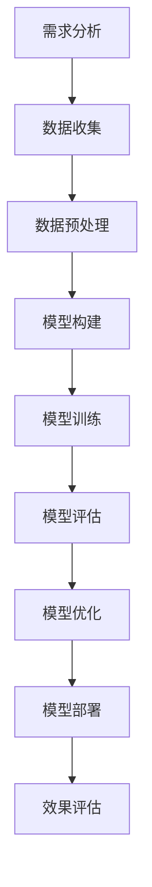
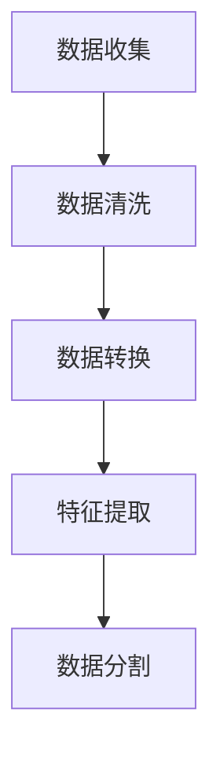

                 

### 引言

#### 机器学习在工业过程优化中的背景与意义

机器学习，作为一种人工智能的核心技术，近年来在各个行业领域都展现出了强大的应用潜力。在工业领域，机器学习技术的应用尤为突出，它不仅提升了工业生产过程的自动化和智能化水平，还显著提高了生产效率和产品质量。工业过程优化，作为工业生产的核心环节，旨在通过改进和控制生产流程，实现资源的最优配置和效益的最大化。

随着全球工业4.0和智能制造的深入推进，工业过程优化的需求日益迫切。传统的工业优化方法主要依赖于经验和统计数据，其局限性逐渐显现。而机器学习通过利用大量数据，能够发现其中的潜在规律和模式，从而提供更加精确和有效的优化方案。这种技术的引入，不仅能够解决复杂的生产问题，还能预测潜在的风险和故障，从而预防生产中断。

#### 工业过程优化的挑战与机遇

工业过程优化面临诸多挑战，其中主要包括数据质量差、数据量庞大、生产环境复杂等问题。首先，工业生产过程中产生的大量数据往往存在噪声和缺失值，这给数据预处理带来了巨大挑战。其次，工业生产系统通常包含多个相互关联的子系统，其复杂性使得优化过程的建模和算法选择变得尤为困难。此外，生产环境的不确定性，如设备老化、原材料波动等，也对优化效果提出了更高的要求。

然而，随着大数据技术和计算能力的提升，这些挑战也转变为机遇。大数据技术的应用使得工业数据的高效采集和处理成为可能，而高性能计算则为复杂优化问题的求解提供了技术保障。同时，越来越多的工业领域开始采用机器学习技术，将其与工业过程优化相结合，开创了智能优化的新时代。

#### 机器学习在工业过程中的应用领域

机器学习在工业过程中的应用涵盖了多个方面，包括但不限于以下领域：

1. **生产过程监控与故障诊断**：通过机器学习模型，对工业生产过程中的传感器数据进行实时分析，能够及时发现异常和故障，提高生产稳定性和设备利用率。

2. **生产计划与调度**：利用机器学习优化生产计划，合理分配资源和调度任务，提高生产效率和降低成本。

3. **质量检测与控制**：通过机器学习算法，对生产过程的数据进行监控和分析，实现自动化的质量检测和优化控制，提升产品质量。

4. **能源管理**：通过机器学习模型对能源消耗进行预测和优化，降低能源成本和碳排放。

5. **设备健康管理**：利用机器学习技术对设备运行状态进行预测，提前预警设备故障，减少设备停机时间和维修成本。

#### 本书结构安排与学习目标

本书旨在为读者提供关于机器学习在工业过程优化中应用的系统性和实战性指南。本书结构如下：

- **第一部分：引论**：介绍机器学习在工业过程优化中的背景、意义、挑战与机遇，以及本书的结构安排和学习目标。

- **第二部分：基础理论**：详细讲解机器学习的基本概念、分类、数学基础，以及工业过程建模方法。

- **第三部分：工业应用实例**：通过制造业、化工和能源等领域的实例，展示机器学习在工业过程优化中的具体应用。

- **第四部分：综合案例**：介绍一个综合案例，从数据预处理、模型构建到模型优化与评估，全面展示机器学习在工业过程优化中的实战过程。

- **第五部分：前沿技术**：探讨深度学习、工业大数据等前沿技术在工业过程优化中的应用。

- **第六部分：实践指南**：提供工业过程优化的方法论、机器学习工具与环境搭建的指南。

- **第七部分：附录**：包括常用参考文献、机器学习资源链接和开源代码与数据集获取途径。

通过本书的学习，读者将能够掌握机器学习在工业过程优化中的基本理论和实践方法，具备独立进行工业过程优化项目的能力。本书适合于从事工业过程优化相关工作的工程技术人员、研究人员以及高校相关专业的师生阅读。

#### 总结

机器学习在工业过程优化中的应用前景广阔，它不仅能够应对复杂的工业优化问题，还能提高生产效率和产品质量。本书将从基础理论、工业应用实例、综合案例以及前沿技术等多个方面，全面介绍机器学习在工业过程优化中的实践方法。希望读者能够通过本书的学习，深入理解并掌握机器学习的核心概念和技术，将其成功应用于实际工业过程优化项目中，推动工业生产的智能化与高效化发展。

关键词：机器学习，工业过程优化，智能制造，生产效率，质量控制

摘要：本文介绍了机器学习在工业过程优化中的应用背景、意义、挑战与机遇，以及其在工业过程中的主要应用领域。通过详细的理论讲解和实际案例剖析，展示了机器学习在工业过程优化中的有效性和潜力，为读者提供了系统性的实战指南。

---

## 第一部分：引论

### 1.1 机器学习在工业过程优化中的背景与意义

#### 工业过程优化的历史背景与发展趋势

工业过程优化是一个历史悠久且不断发展的研究领域。早期，工业过程的优化主要依赖于工程师的经验和直觉。随着科学技术的进步，特别是在计算机技术、数据采集和处理技术等方面的快速发展，工业过程优化逐渐走向数据驱动和智能化。从20世纪末开始，随着大数据和人工智能技术的兴起，工业过程优化迎来了新的发展机遇。

工业过程优化不仅仅是一个技术问题，更是一个战略问题。在全球化竞争日益激烈和资源约束日益严峻的背景下，优化工业过程已经成为提高企业竞争力、实现可持续发展的重要手段。通过优化生产流程，企业能够提高生产效率、降低成本、提高产品质量，从而在市场中占据更有利的位置。

#### 机器学习的发展与工业过程优化的结合

机器学习作为一种先进的人工智能技术，其核心在于通过计算机算法，使机器能够从数据中自动学习和发现规律。机器学习技术的发展大致可以分为三个阶段：监督学习、无监督学习和强化学习。监督学习通过已有数据来训练模型，无监督学习通过未标记的数据发现模式，强化学习则通过试错来学习最优策略。

机器学习与工业过程优化的结合具有天然的优势。首先，工业过程中产生的大量数据为机器学习提供了丰富的训练资源。其次，机器学习能够从这些数据中挖掘出潜在的生产规律和优化策略，实现更高水平的自动化和智能化。此外，机器学习算法的灵活性和适应性，使得它们能够应对复杂的生产环境和多变的市场需求。

#### 机器学习在工业过程优化中的应用前景

随着全球工业4.0和智能制造的推进，机器学习在工业过程优化中的应用前景愈发广阔。以下是一些主要的应用领域：

1. **生产过程监控与故障诊断**：通过机器学习模型，对生产过程中的传感器数据进行分析，可以及时发现设备故障和异常，提高生产稳定性和效率。

2. **生产计划与调度**：利用机器学习算法，可以优化生产计划，合理分配资源和调度任务，提高生产效率和降低成本。

3. **质量检测与控制**：通过机器学习模型，对生产过程中产生的数据进行分析，可以实现自动化的质量检测和优化控制，提升产品质量。

4. **能源管理**：利用机器学习技术，可以优化能源消耗，降低能源成本和碳排放。

5. **设备健康管理**：通过机器学习模型，对设备运行状态进行预测，可以提前预警设备故障，减少设备停机时间和维修成本。

总之，机器学习在工业过程优化中的应用，不仅能够提高生产效率和产品质量，还能够降低运营成本，提升企业的核心竞争力。随着技术的不断进步和应用的不断深入，机器学习将在工业过程优化中发挥越来越重要的作用。

### 1.2 工业过程优化的挑战与机遇

#### 数据质量差

工业生产过程中产生的大量数据，往往存在噪声、缺失值和不一致性等问题。这些数据质量问题会对机器学习模型的训练和预测效果产生显著影响。为了解决这些问题，通常需要采用数据清洗、数据填充和数据标准化等技术。例如，通过缺失值填充算法，可以将缺失的数据值补全；通过异常检测算法，可以识别并处理异常值；通过数据标准化方法，可以消除不同数据量级和分布对模型的影响。

**解决方案**：
- **数据清洗**：使用清洗算法，如删除重复数据、修正错误数据和填充缺失值。
- **数据填充**：使用统计方法，如均值插值、中值插值和回归插值等，填充缺失数据。
- **数据标准化**：通过归一化或标准化方法，将不同数据量级的数据转换为统一量级。

#### 数据量庞大

工业生产过程中产生的大量数据，其规模和复杂度远超传统的数据处理能力。这种海量数据对计算资源、存储资源和算法效率提出了巨大的挑战。为了处理这些海量数据，通常需要采用分布式计算、大数据处理技术和高效的数据存储方案。

**解决方案**：
- **分布式计算**：通过分布式计算框架，如Hadoop和Spark，将计算任务分解到多个节点上并行处理。
- **大数据处理技术**：使用大数据处理技术，如MapReduce和流处理技术，实现对海量数据的快速分析和处理。
- **高效数据存储**：采用高效的数据存储方案，如HDFS（Hadoop Distributed File System）和NoSQL数据库，存储和管理海量数据。

#### 生产环境复杂

工业生产环境通常包含多个相互关联的子系统，这些子系统之间的复杂交互使得优化过程的建模和算法选择变得极为困难。此外，生产环境的不确定性，如设备老化、原材料波动等，也对优化效果提出了更高的要求。为了应对这些挑战，需要采用更加复杂的建模方法和适应性更强的优化算法。

**解决方案**：
- **多变量建模**：使用多变量建模方法，如多变量时间序列分析和多变量回归分析，处理复杂的生产环境。
- **自适应优化算法**：采用自适应优化算法，如遗传算法和粒子群优化算法，根据生产环境的变化自适应调整优化策略。
- **仿真建模**：通过仿真建模技术，模拟和预测生产环境的变化，为优化决策提供科学依据。

#### 技术进步带来的机遇

尽管工业过程优化面临着诸多挑战，但技术进步也为解决这些问题带来了新的机遇。大数据技术的应用，使得工业数据的高效采集和处理成为可能；高性能计算的发展，为复杂优化问题的求解提供了技术保障；人工智能的兴起，使得机器学习技术在工业过程优化中的应用更加广泛和深入。

**机遇**：
- **大数据技术**：通过大数据技术，可以实现工业数据的高效采集、存储和分析，为优化过程提供丰富的数据支持。
- **高性能计算**：通过高性能计算，可以加速复杂优化问题的求解，提高优化决策的效率。
- **人工智能技术**：通过人工智能技术，可以进一步提升工业过程优化的智能化和自动化水平，实现更高水平的优化效果。

综上所述，工业过程优化在面临挑战的同时，也迎来了新的机遇。通过不断创新和优化技术手段，可以有效应对这些挑战，推动工业生产的智能化和高效化发展。

### 1.3 机器学习在工业过程中的应用领域

机器学习在工业过程中的应用范围广泛，涵盖了多个关键领域，下面将详细探讨这些领域及其具体应用。

#### 生产过程监控与故障诊断

生产过程监控是工业过程优化的基础，而故障诊断是确保生产连续性和稳定性的关键。通过机器学习模型，可以对生产过程中的传感器数据进行分析，实现实时监控和故障预警。

**应用示例**：
1. **实时监测**：利用机器学习算法对传感器数据进行实时分析，可以及时发现设备运行中的异常状况。
2. **故障预警**：通过训练故障诊断模型，能够预测设备即将发生的故障，提前进行预防性维护，减少停机时间和维修成本。

#### 生产计划与调度

生产计划的优化和调度的合理化是提高生产效率的重要手段。机器学习技术能够根据生产数据和历史记录，自动生成最优的生产计划。

**应用示例**：
1. **生产排程**：利用机器学习算法优化生产排程，合理安排生产任务和资源分配，减少生产瓶颈和等待时间。
2. **动态调度**：根据实时生产数据和设备状态，动态调整生产计划，实现灵活调度，提高生产线的响应速度。

#### 质量检测与控制

质量检测是保证产品质量的重要环节，而机器学习技术能够在质量检测中发挥重要作用，实现自动化和智能化的质量监控。

**应用示例**：
1. **在线质量检测**：通过机器学习模型对生产过程中的数据进行分析，实时检测产品质量，及时发现和纠正质量问题。
2. **质量预测**：利用历史数据和模型预测，提前发现潜在的质量问题，采取预防措施，提高产品的一致性和可靠性。

#### 能源管理

能源管理是降低生产成本和环境负担的重要手段。机器学习技术可以优化能源消耗，提高能源利用效率。

**应用示例**：
1. **能耗预测**：通过机器学习模型对能源消耗进行预测，优化能源使用计划，减少能源浪费。
2. **节能优化**：利用机器学习算法分析生产过程中的能源消耗数据，发现节能潜力，实施节能措施。

#### 设备健康管理

设备健康管理是确保生产设备和生产流程高效运行的关键。机器学习技术可以帮助企业实现设备的全面监控和维护。

**应用示例**：
1. **状态监测**：通过机器学习模型对设备运行状态进行监测，及时发现设备异常，进行预防性维护。
2. **寿命预测**：利用机器学习技术预测设备的使用寿命，提前规划设备更新和维护，减少设备停机时间。

总之，机器学习技术在工业过程中的应用，不仅能够提升生产效率、降低成本，还能够提高产品质量和设备可靠性，为工业生产的智能化和高效化提供了强有力的技术支持。

### 1.4 本书结构安排与学习目标

#### 本书结构

本书分为七个主要部分，具体结构如下：

- **第一部分：引论**：介绍机器学习在工业过程优化中的背景、意义、挑战与机遇，以及本书的结构安排和学习目标。

- **第二部分：基础理论**：详细讲解机器学习的基本概念、分类、数学基础，以及工业过程建模方法。

- **第三部分：工业应用实例**：通过制造业、化工和能源等领域的实例，展示机器学习在工业过程优化中的具体应用。

- **第四部分：综合案例**：介绍一个综合案例，从数据预处理、模型构建到模型优化与评估，全面展示机器学习在工业过程优化中的实战过程。

- **第五部分：前沿技术**：探讨深度学习、工业大数据等前沿技术在工业过程优化中的应用。

- **第六部分：实践指南**：提供工业过程优化的方法论、机器学习工具与环境搭建的指南。

- **第七部分：附录**：包括常用参考文献、机器学习资源链接和开源代码与数据集获取途径。

#### 学习目标

通过本书的学习，读者可以达成以下学习目标：

1. **理解机器学习的基本概念和原理**：掌握监督学习、无监督学习和强化学习等基本机器学习算法，了解其应用场景和局限性。

2. **熟悉工业过程建模方法**：了解工业过程数据采集与预处理、确定性模型与随机模型等工业过程建模方法。

3. **掌握常见机器学习算法**：掌握线性回归、决策树、支持向量机、K-均值聚类、主成分分析和Q学习等常见机器学习算法，并了解其适用场景和参数调优方法。

4. **掌握工业应用实例**：通过实际案例，了解机器学习在制造业、化工和能源等领域的具体应用，掌握实际操作中的技术要点。

5. **具备综合案例实战能力**：通过综合案例的学习，掌握从数据预处理到模型构建和优化的全过程，具备独立进行工业过程优化项目的能力。

6. **了解前沿技术趋势**：了解深度学习、工业大数据等前沿技术在工业过程优化中的应用，掌握其基本原理和最新研究进展。

7. **具备实践指南和应用能力**：掌握工业过程优化的方法论和最佳实践，具备搭建机器学习环境、选择和调优模型的能力，能够在实际项目中灵活应用。

总之，通过本书的系统学习，读者将能够全面掌握机器学习在工业过程优化中的应用理论和实践方法，为未来的工业生产智能化和高效化发展奠定坚实的基础。

### 1.5 机器学习在工业过程优化中的前景展望

#### 未来的发展趋势

随着人工智能技术的不断进步，机器学习在工业过程优化中的应用将呈现出以下几个显著趋势：

1. **深度学习的深入应用**：深度学习在图像识别、语音识别等领域已经取得了突破性进展，未来将在工业过程优化中发挥更大的作用。例如，通过卷积神经网络（CNN）和循环神经网络（RNN）等深度学习模型，可以实现对复杂工业过程的实时监控和预测。

2. **工业大数据的融合应用**：随着工业物联网（IIoT）的发展，工业过程将产生海量的数据。将这些大数据与机器学习技术相结合，可以实现更加精准和智能的优化策略，从而大幅提高生产效率和产品质量。

3. **边缘计算的兴起**：边缘计算通过在靠近数据源头的地方进行计算和处理，可以降低数据传输延迟，提高实时性。结合机器学习算法，边缘计算将使得工业过程优化在实时性、灵活性和可靠性方面得到显著提升。

#### 技术突破的方向

为了实现上述趋势，机器学习在工业过程优化中的技术突破需要关注以下几个方面：

1. **算法创新与优化**：开发更加高效和鲁棒的机器学习算法，以应对工业过程中的复杂性和不确定性。例如，通过自适应优化算法和增强学习技术，可以实现更加智能和自适应的优化决策。

2. **多模态数据的融合**：工业生产过程中涉及多种类型的数据，包括结构化数据、非结构化数据和时序数据。通过多模态数据的融合，可以挖掘出更加全面和准确的信息，从而提高优化效果。

3. **跨学科融合**：将机器学习与其他学科（如控制理论、系统工程等）相结合，开发出更加综合和系统的优化方法。例如，通过控制理论与机器学习的结合，可以实现更加精确和灵活的工业过程控制。

#### 对工业过程的潜在影响

机器学习在工业过程优化中的深入应用，将对工业生产产生深远的影响：

1. **提升生产效率**：通过自动化和智能化的优化策略，可以有效减少生产过程中的浪费，提高生产效率。

2. **提高产品质量**：机器学习能够通过对生产过程的实时监控和数据分析，提高产品质量的一致性和可靠性。

3. **降低运营成本**：通过优化生产流程和资源配置，可以降低能源消耗和生产成本，提高企业的经济效益。

4. **增强市场竞争力**：具备先进技术的企业将在市场中占据更大的优势，通过机器学习技术提高生产效率和质量，可以在激烈的市场竞争中脱颖而出。

总之，机器学习在工业过程优化中的应用具有巨大的潜力和广阔的前景。随着技术的不断进步和应用的不断深入，机器学习将推动工业生产向更加智能化和高效化的方向发展，为企业和整个行业创造更大的价值。

---

## 第二部分：基础理论

### 2.1 机器学习概述

#### 机器学习的基本概念

机器学习（Machine Learning）是指通过计算机算法使机器从数据中学习和发现规律，从而实现自主决策和优化过程的一种人工智能技术。它不同于传统的编程，后者依赖于人类程序员编写具体的指令，而机器学习则是通过数据驱动，使机器自动从经验中学习并做出决策。

**定义**：
机器学习是一种从数据中自动发现规律、模式、关系或知识的方法，并使用这些知识进行预测或决策。

**基本特征**：

1. **自动性**：机器学习算法可以自动地从数据中提取特征和模式，无需显式编程。

2. **适应性**：机器学习模型可以根据新数据自动调整和优化，以适应环境的变化。

3. **高效性**：通过高效的数据处理和算法优化，机器学习可以在海量数据中快速发现规律。

**核心任务**：

1. **回归分析**：预测连续值输出。
2. **分类分析**：将输入数据分类到不同的类别。
3. **聚类分析**：发现数据中的自然分组或模式。
4. **降维**：减少数据维度，同时保留数据的关键信息。
5. **异常检测**：识别数据中的异常或错误。

#### 机器学习的基本分类

机器学习可以分为三种主要类型：监督学习、无监督学习和强化学习。

**监督学习（Supervised Learning）**

监督学习是指训练数据带有标签（即正确答案），算法通过学习这些标签来预测新的数据。其核心是找到一个映射关系，使得新的数据能够被正确分类或预测。

**分类**：
1. **回归（Regression）**：预测连续值。
2. **分类（Classification）**：将数据分为不同的类别。

**无监督学习（Unsupervised Learning）**

无监督学习是指训练数据没有标签，算法通过学习数据内部的规律或结构来进行数据挖掘和模式识别。

**分类**：
1. **聚类（Clustering）**：将相似的数据归为一类。
2. **降维（Dimensionality Reduction）**：减少数据维度，同时保留数据的关键信息。
3. **关联规则学习（Association Rule Learning）**：发现数据之间的关联性。

**强化学习（Reinforcement Learning）**

强化学习是指通过试错和反馈机制来学习最佳策略。学习主体在环境中进行交互，通过获取奖励或惩罚来调整其行为。

**核心概念**：
1. **状态（State）**：学习主体当前所处的环境。
2. **动作（Action）**：学习主体能够采取的行动。
3. **奖励（Reward）**：动作带来的奖励或惩罚。

#### 机器学习的数学基础

机器学习的实现依赖于多个数学分支，主要包括线性代数、概率论和最优化算法。

**线性代数基础**

线性代数是机器学习的基础，它涉及到向量、矩阵、行列式等概念，是处理数据的核心工具。

- **向量**：表示一个多维度的数据结构。
- **矩阵**：由行和列组成的二维数组，用于数据变换和特征提取。
- **行列式**：用于计算矩阵的属性，如行列式为零表示矩阵不可逆。
- **逆矩阵**：求解线性方程组的关键工具，通过逆矩阵可以求得线性系统的解。

**概率论基础**

概率论是处理不确定性的数学工具，在机器学习中用于模型训练和推理。

- **概率分布**：描述随机变量取值的可能性。
- **条件概率**：在某个条件下，事件发生的概率。
- **贝叶斯定理**：用于计算后验概率，是构建分类和预测模型的重要工具。

**最优化算法基础**

最优化算法用于寻找函数的最值，是机器学习模型训练的核心。

- **梯度下降法**：用于求解最优化问题，通过不断更新参数，使损失函数最小化。
- **牛顿法**：利用二阶导数信息，加速最优化过程。
- **随机梯度下降法（SGD）**：适用于大规模数据集，通过随机采样数据更新参数。

**线性代数、概率论和最优化算法之间的关系**

- **线性代数**提供了处理数据的工具，如矩阵运算和特征提取。
- **概率论**提供了处理不确定性和随机性的理论基础。
- **最优化算法**则将这些理论应用于实际问题的求解，寻找最优解。

**总结**

机器学习作为人工智能的重要分支，其核心在于从数据中自动学习和发现规律。通过监督学习、无监督学习和强化学习，机器学习可以应对不同类型的问题。线性代数、概率论和最优化算法则是实现机器学习的数学基础，这些工具和方法为机器学习提供了强大的理论支撑和实践指导。理解这些基础理论，是深入学习和应用机器学习的关键。

---

### 2.2 工业过程建模方法

#### 工业过程数据采集与预处理

工业过程建模的首要任务是数据采集与预处理，这是保证模型性能和准确性的关键步骤。工业过程中的数据来源广泛，包括传感器数据、生产记录、设备状态信息等。

**数据采集技术**：

1. **传感器数据采集**：在工业生产过程中，传感器被广泛用于监测温度、压力、速度、位置等物理量。通过无线传感器网络（WSN）或现场总线（如Profibus、CAN总线）等技术，可以实现对生产过程的实时数据采集。

2. **生产记录采集**：生产过程中的操作记录、工艺参数记录等，可以通过工业控制系统（如PLC、DCS）自动生成和存储。

3. **设备状态信息采集**：通过设备自带的诊断系统和远程监控系统，可以采集设备的运行状态、故障信息和维护记录。

**数据预处理方法**：

1. **数据清洗**：数据清洗是处理数据缺失、错误和不一致性的过程。常用的方法包括缺失值填充、异常值处理和数据标准化。

   - **缺失值填充**：使用均值、中值、回归等算法，对缺失值进行估计和填充。
   - **异常值处理**：通过统计分析和聚类分析，识别并处理异常值，确保数据的准确性和一致性。
   - **数据标准化**：将不同量级和分布的数据转换为统一标准，消除量级差异对模型训练的影响。

2. **数据转换**：将原始数据进行预处理，使其适合机器学习模型的训练。常用的方法包括归一化、标准化和特征提取。

   - **归一化**：通过调整数据分布，使其符合标准正态分布。
   - **标准化**：将数据缩放到特定的范围，如[0,1]或[-1,1]。
   - **特征提取**：通过降维和特征选择技术，提取对模型训练最有用的特征。

3. **数据分割**：将数据集分为训练集、验证集和测试集，用于模型的训练、验证和评估。

   - **训练集**：用于训练模型，学习数据中的规律。
   - **验证集**：用于验证模型的选择和参数调优。
   - **测试集**：用于评估模型的最终性能。

**数据处理流程**

工业过程数据预处理通常包括以下步骤：

1. **数据采集**：通过传感器、控制系统等设备采集生产过程中的数据。

2. **初步清洗**：去除明显错误的数据，如缺失值、异常值等。

3. **缺失值填充**：对缺失值进行估计和填充，确保数据完整性。

4. **异常值处理**：通过统计分析方法识别和处理异常值。

5. **数据转换**：将数据转换为适合机器学习模型的格式。

6. **数据分割**：将数据集分为训练集、验证集和测试集。

7. **特征工程**：根据业务需求，选择和提取对模型训练有用的特征。

通过严格的数据预处理流程，可以确保数据的质量和一致性，为后续的建模和优化提供可靠的数据基础。数据预处理不仅能够提高模型的训练效率，还能提升模型的准确性和可靠性，是工业过程建模不可或缺的步骤。

### 2.2.2 工业过程的数学模型

在工业过程中，为了更好地理解和优化生产流程，需要建立数学模型来描述和预测系统的行为。工业过程的数学模型可以分为两大类：确定性模型和随机模型。

#### 确定性模型

确定性模型是指在给定初始条件和边界条件下，模型输出仅由输入决定，不考虑随机因素的影响。这类模型在工业过程中具有广泛的应用，主要包括以下几种：

1. **线性回归模型**：线性回归模型是最常见的确定性模型之一，用于预测连续值输出。其基本形式为：
   $$y = \beta_0 + \beta_1x_1 + \beta_2x_2 + ... + \beta_nx_n + \epsilon$$
   其中，$y$是输出变量，$x_1, x_2, ..., x_n$是输入变量，$\beta_0, \beta_1, ..., \beta_n$是模型参数，$\epsilon$是误差项。

2. **多项式回归模型**：多项式回归模型是线性回归模型的扩展，其输出与输入之间是多项式关系。其形式为：
   $$y = \beta_0 + \beta_1x_1 + \beta_2x_1^2 + ... + \beta_nx_1^n + \epsilon$$
   通过增加多项式项，可以捕捉更复杂的输入-输出关系。

3. **逻辑回归模型**：逻辑回归模型用于分类问题，其输出是一个概率值，通过sigmoid函数转换为0到1之间的概率分布。其基本形式为：
   $$P(y=1) = \frac{1}{1 + e^{-(\beta_0 + \beta_1x_1 + \beta_2x_2 + ... + \beta_nx_n)}}$$
   其中，$P(y=1)$是输出变量为1的概率，$\beta_0, \beta_1, ..., \beta_n$是模型参数。

#### 随机模型

随机模型考虑了随机因素的影响，用于描述工业过程中不确定性和随机性。这类模型主要包括以下几种：

1. **马尔可夫模型**：马尔可夫模型是一种基于状态转移概率的随机模型，用于描述系统在不同状态之间的转移。其基本形式为：
   $$P(X_t = j|X_{t-1} = i) = p_{ij}$$
   其中，$X_t$是系统在时间$t$的状态，$p_{ij}$是从状态$i$转移到状态$j$的概率。

2. **随机过程**：随机过程是一系列随机变量的集合，用于描述系统在连续时间或空间中的变化。常见的随机过程包括白噪声过程、布朗运动等。

3. **贝叶斯网络**：贝叶斯网络是一种基于概率推理的图形模型，用于描述变量之间的依赖关系。其基本形式为：
   $$P(X_1, X_2, ..., X_n) = \prod_{i=1}^{n} P(X_i | parents(X_i))$$
   其中，$X_1, X_2, ..., X_n$是随机变量，$parents(X_i)$是$X_i$的父节点。

**确定性模型与随机模型的关系**

确定性模型和随机模型各有优缺点，它们在工业过程中的应用取决于具体问题的需求和背景。

- **确定性模型**：确定性模型计算简单，易于理解和实现，适用于输入与输出关系明确的场景。然而，在现实工业过程中，由于随机性和不确定性，确定性模型的预测精度可能受限。

- **随机模型**：随机模型能够考虑随机因素的影响，适用于不确定性和随机性较强的场景。然而，随机模型的计算复杂度较高，且需要大量的数据支持。

在实际应用中，常常将确定性模型和随机模型相结合，以提高模型的预测性能和适应性。例如，可以使用确定性模型进行初步预测，然后使用随机模型对预测结果进行调整和修正。

**总结**

工业过程的数学模型是描述和优化工业生产流程的重要工具。确定性模型和随机模型各有优缺点，适用于不同的工业场景。通过合理选择和使用数学模型，可以实现对工业过程的精确描述和优化，提高生产效率和产品质量。

---

### 2.3 常见机器学习算法

#### 监督学习算法

监督学习算法通过已有数据（带有标签的数据）来训练模型，使其能够对新数据进行预测或分类。监督学习算法在工业过程优化中具有广泛的应用，以下将介绍几种常见的监督学习算法。

##### 2.3.1.1 线性回归

线性回归是一种简单的监督学习算法，用于预测连续值输出。线性回归模型基于线性关系，其基本形式为：

$$y = \beta_0 + \beta_1x_1 + \beta_2x_2 + ... + \beta_nx_n + \epsilon$$

其中，$y$是输出变量，$x_1, x_2, ..., x_n$是输入变量，$\beta_0, \beta_1, ..., \beta_n$是模型参数，$\epsilon$是误差项。

**算法原理**：

1. **模型训练**：使用训练数据集，通过最小二乘法求解模型参数，使预测值与真实值之间的误差最小。

$$\beta = (\X^T\X)^{-1}\X^T\Y$$

其中，$\X$是输入数据矩阵，$\Y$是输出数据向量。

2. **模型预测**：对于新的输入数据$x$，计算其输出预测值$y$：

$$y = \beta_0 + \beta_1x_1 + \beta_2x_2 + ... + \beta_nx_n$$

**伪代码**：

```
输入：训练数据集（X, Y）
输出：模型参数（β）

# 求解参数
β = (X^T * X)^(-1) * X^T * Y

# 预测输出
预测值 = β[0] + β[1] * x[1] + β[2] * x[2] + ... + β[n] * x[n]
```

##### 2.3.1.2 决策树

决策树是一种基于树形结构进行分类和预测的算法。决策树通过一系列条件判断，将数据集逐步分割成各个子集，最终生成一个分类或回归结果。

**算法原理**：

1. **决策节点**：每个节点表示一个特征和条件判断。
2. **分支**：根据条件判断结果，生成左分支（满足条件）和右分支（不满足条件）。
3. **叶节点**：叶节点表示分类或回归结果。

**构建决策树**：

1. **选择最优特征**：使用信息增益、基尼不纯度等指标，选择具有最高信息增益的特征作为决策节点。
2. **划分数据集**：根据选择的最优特征，将数据集划分为两个子集。
3. **递归构建**：对子集继续进行划分，直到满足终止条件（如叶节点数量达到阈值或信息增益低于阈值）。

**伪代码**：

```
输入：数据集（X, Y），特征列表
输出：决策树（T）

# 选择最优特征
最优特征 = 选择最优特征（X, Y）

# 创建决策节点
T = 决策节点（最优特征）

# 划分数据集
子集1 = 划分数据集（X, Y，最优特征）

# 递归构建子树
if 满足终止条件：
    T.left = 叶节点（Y）
else：
    T.left = 构建决策树（子集1）

if 满足终止条件：
    T.right = 叶节点（Y）
else：
    T.right = 构建决策树（子集2）

# 返回决策树
return T
```

##### 2.3.1.3 支持向量机

支持向量机（SVM）是一种基于最大间隔原理进行分类和回归的算法。SVM通过找到一个最佳的超平面，将不同类别的数据点分隔开，同时最大化两个类别的分类间隔。

**算法原理**：

1. **线性SVM**：线性SVM使用一个线性函数将数据映射到高维空间，通过求解最优超平面，实现分类。

   $$w \cdot x + b = 0$$

   其中，$w$是权重向量，$x$是输入特征，$b$是偏置项。

2. **核函数**：对于非线性分类问题，SVM使用核函数将数据映射到高维空间，实现线性分类。常见的核函数包括线性核、多项式核和径向基函数（RBF）核。

   $$K(x_i, x_j) = \phi(x_i)^T \phi(x_j)$$

**求解SVM**：

1. **损失函数**：SVM使用 hinge 损失函数，其形式为：
   $$L(y, f(x)) = \max(0, 1 - yf(x))$$

2. **优化目标**：求解以下优化问题：
   $$\min_{w, b} \frac{1}{2} ||w||^2 + C \sum_{i=1}^{n} \max(0, 1 - y_i(f(x_i)))$$
   其中，$C$是正则化参数，用于控制模型的复杂度和过拟合。

**伪代码**：

```
输入：训练数据集（X, Y），正则化参数C，核函数K
输出：模型参数（w, b）

# 求解SVM参数
w, b = 求解线性优化问题（C * Σ(y_i - K(x_i, x_j)), w, b）

# 返回模型参数
return w, b
```

#### 无监督学习算法

无监督学习算法在没有标签数据的情况下，通过学习数据内部的规律或结构来进行数据挖掘和模式识别。以下介绍几种常见的无监督学习算法。

##### 2.3.2.1 K-均值聚类

K-均值聚类是一种基于距离度量进行聚类分析的算法。K-均值聚类通过初始化中心点，然后不断迭代更新中心点，使每个数据点尽可能靠近其所属的聚类中心。

**算法原理**：

1. **初始化**：随机选择K个数据点作为初始聚类中心。
2. **分配数据点**：计算每个数据点到各个聚类中心的距离，将数据点分配到最近的聚类中心。
3. **更新中心点**：重新计算每个聚类中心的位置，使其成为其所属数据点的平均值。
4. **迭代**：重复步骤2和3，直到聚类中心位置不再变化或满足终止条件（如收敛阈值）。

**伪代码**：

```
输入：数据集X，聚类个数K
输出：聚类中心C，聚类结果Y

# 初始化聚类中心
C = 随机选择K个数据点

# 迭代计算聚类中心
while 不满足终止条件：
    Y = 调用分配函数（X, C）
    C = 更新聚类中心（Y）

# 返回聚类结果
return C, Y
```

##### 2.3.2.2 主成分分析

主成分分析（PCA）是一种用于降维和特征提取的算法，通过将数据投影到新的正交坐标系中，提取最重要的特征，从而降低数据维度。

**算法原理**：

1. **协方差矩阵**：计算数据集的协方差矩阵，用于描述数据点之间的相关性。
2. **特征值和特征向量**：通过求解协方差矩阵的特征值和特征向量，得到数据的主要方向。
3. **降维**：选择最大的$k$个特征值对应的特征向量，组成投影矩阵，将数据投影到$k$维空间中。

**伪代码**：

```
输入：数据集X
输出：投影矩阵W，新特征Y

# 计算协方差矩阵
covariance_matrix = 计算协方差矩阵（X）

# 求解特征值和特征向量
特征值，特征向量 = 求解特征值和特征向量（covariance_matrix）

# 选择最大的k个特征向量
W = 选择最大的k个特征向量

# 投影数据
Y = X * W

# 返回新特征
return W, Y
```

##### 2.3.2.3 Q学习

Q学习是一种基于强化学习的算法，通过智能体在环境中的交互，学习最优策略。Q学习通过估计状态-动作值函数，选择最佳动作以最大化长期奖励。

**算法原理**：

1. **状态-动作值函数**：Q学习通过估计状态-动作值函数$Q(s, a)$，表示在状态$s$下执行动作$a$的长期奖励。
2. **更新规则**：Q学习使用以下更新规则来更新Q值：

$$Q(s, a) = Q(s, a) + \alpha [r + \gamma \max_{a'} Q(s', a') - Q(s, a)]$$

其中，$\alpha$是学习率，$\gamma$是折扣因子，$r$是即时奖励，$s'$是执行动作$a$后的状态。

3. **策略**：通过选择使Q值最大的动作作为策略，实现最优决策。

**伪代码**：

```
输入：初始状态s，动作集合A，学习率α，折扣因子γ
输出：最优策略π

# 初始化Q值矩阵
Q = 初始化Q值矩阵（s，A）

# 迭代更新Q值
while 未达到终止条件：
    选择动作a ∈ A
    执行动作a
    获得即时奖励r
    进入新状态s'
    更新Q值：Q(s, a) = Q(s, a) + α[r + γ * max_{a'} Q(s', a') - Q(s, a)]

# 选择最优策略
π = 选择使Q值最大的动作集合

# 返回最优策略
return π
```

综上所述，监督学习算法和无监督学习算法在工业过程优化中发挥着重要作用。线性回归、决策树和SVM等算法在回归和分类任务中具有广泛应用，K-均值聚类、PCA和Q学习等算法在降维、聚类和强化学习任务中具有独特的优势。通过灵活运用这些算法，可以实现对工业过程的精准预测、高效分类和智能优化。

---

### 2.3.3 强化学习算法

强化学习（Reinforcement Learning，RL）是一种通过试错和反馈机制来学习最佳策略的机器学习算法。与监督学习和无监督学习不同，强化学习通过智能体（Agent）与环境的交互来学习最优行为策略，旨在最大化累积奖励。

#### 2.3.3.1 Q学习

Q学习是强化学习的一种经典算法，它通过估计状态-动作值函数（Q值）来指导智能体的决策。Q值表示在某一状态下执行某一动作的长期奖励，其基本原理如下：

**算法原理**：

1. **状态-动作值函数**：Q(s, a) 表示在状态s下执行动作a的期望回报。
2. **更新规则**：Q学习使用以下更新规则来更新Q值：

   $$Q(s, a) = Q(s, a) + \alpha [r + \gamma \max_{a'} Q(s', a') - Q(s, a)]$$

   其中，$r$ 是即时奖励，$\gamma$ 是折扣因子，$\alpha$ 是学习率。

**伪代码**：

```
输入：初始状态s，动作集合A，学习率α，折扣因子γ
输出：最优策略π

# 初始化Q值矩阵
Q = 初始化Q值矩阵（s，A）

# 迭代更新Q值
while 未达到终止条件：
    选择动作a ∈ A
    执行动作a
    获得即时奖励r
    进入新状态s'
    更新Q值：Q(s, a) = Q(s, a) + α[r + γ * max_{a'} Q(s', a') - Q(s, a)]

# 选择最优策略
π = 选择使Q值最大的动作集合

# 返回最优策略
return π
```

**应用实例**：

1. **机器人导航**：Q学习算法可以用于机器人导航问题，通过学习最优路径来避免障碍物，实现自主移动。
2. **推荐系统**：在推荐系统中，Q学习可以用于估计用户对不同产品的偏好，从而优化推荐策略。

#### 2.3.3.2 模仿学习

模仿学习（Model-Based Reinforcement Learning）是一种通过观察人类行为来学习最佳策略的强化学习算法。模仿学习分为无模型学习和有模型学习两种类型。

**算法原理**：

1. **无模型学习**：智能体直接模仿人类的行为，并使用奖励信号来评估行为的好坏。智能体不需要建立环境模型，但可能面临数据不足的问题。
2. **有模型学习**：智能体不仅模仿人类行为，还建立一个环境模型，通过模型预测未来的状态和奖励。这样可以减少数据需求，提高学习效率。

**伪代码**：

```
输入：人类行为序列{a_t, s_t}，学习率α，折扣因子γ
输出：策略π

# 初始化Q值矩阵
Q = 初始化Q值矩阵（s，A）

# 模仿学习
for 每个观察到的行为(a_t, s_t)：
    Q(s_t, a_t) = Q(s_t, a_t) + α[r_t + γ * max_{a'} Q(s_{t+1}, a') - Q(s_t, a_t)]

# 选择最优策略
π = 选择使Q值最大的动作集合

# 返回最优策略
return π
```

**应用实例**：

1. **自动驾驶**：模仿学习可以用于自动驾驶系统，通过模仿人类司机的驾驶行为来训练自动驾驶模型。
2. **游戏AI**：在游戏AI中，模仿学习可以用于学习复杂游戏的策略，例如在围棋、扑克等游戏中应用。

综上所述，强化学习算法，特别是Q学习和模仿学习，通过不断尝试和反馈，能够实现智能体的自主学习和优化。这些算法在工业过程优化、机器人控制、推荐系统等领域具有广泛的应用前景。

---

## 第三部分：工业应用实例

### 3.1 制造业生产过程优化

#### 3.1.1 制造业生产过程概述

制造业是工业的核心，生产过程的优化直接关系到企业的竞争力。制造业生产过程包括原材料采购、生产计划、生产执行、质量检测和产品交付等多个环节。随着工业4.0和智能制造的推进，制造业生产过程逐渐走向智能化和自动化。通过机器学习技术，可以实现生产过程的精准监控、优化调度和故障预测，从而提高生产效率和产品质量。

#### 3.1.2 生产过程的机器学习模型构建

为了实现对制造业生产过程的优化，可以采用多种机器学习模型。以下将介绍几种常用的机器学习模型及其在制造业生产过程中的应用。

##### 3.1.2.1 生产过程的线性回归模型

线性回归模型是一种简单但有效的预测模型，适用于预测生产过程中的连续值输出，如产量、能耗等。线性回归模型的基本形式为：

$$y = \beta_0 + \beta_1x_1 + \beta_2x_2 + ... + \beta_nx_n + \epsilon$$

其中，$y$ 是预测目标，$x_1, x_2, ..., x_n$ 是输入特征，$\beta_0, \beta_1, ..., \beta_n$ 是模型参数，$\epsilon$ 是误差项。

**算法原理**：

1. **模型训练**：使用历史生产数据，通过最小二乘法求解模型参数，使预测值与实际值之间的误差最小。

$$\beta = (\X^T\X)^{-1}\X^T\Y$$

2. **模型预测**：对于新的输入数据，计算其预测值：

$$y = \beta_0 + \beta_1x_1 + \beta_2x_2 + ... + \beta_nx_n$$

**应用实例**：

- **预测产量**：通过预测产量，可以合理安排生产计划和库存管理，减少生产过剩或短缺的情况。
- **预测能耗**：通过预测能耗，可以优化能源消耗，降低生产成本和环境负担。

##### 3.1.2.2 生产过程的决策树模型

决策树模型是一种树形结构，用于分类和回归分析。它通过一系列条件判断，将数据集逐步分割成各个子集，从而生成一个分类或回归结果。决策树模型在制造业生产过程中可以用于故障诊断、质量检测等方面。

**算法原理**：

1. **构建决策树**：选择最优特征作为决策节点，将数据集划分为两个子集。
2. **递归构建**：对子集继续划分，直到满足终止条件（如叶节点数量达到阈值或信息增益低于阈值）。

**应用实例**：

- **故障诊断**：通过决策树模型，可以识别生产过程中的故障，及时进行故障排除，减少停机时间。
- **质量检测**：通过决策树模型，可以对生产过程中产生的数据进行分类，识别不合格产品，确保产品质量。

##### 3.1.2.3 生产过程的强化学习模型

强化学习模型通过智能体与环境的交互，学习最佳策略，适用于复杂的生产过程优化问题。强化学习模型可以用于生产计划的动态调整、资源调度等方面。

**算法原理**：

1. **状态-动作值函数**：Q学习算法通过估计状态-动作值函数，选择最佳动作。
2. **更新规则**：Q学习使用以下更新规则来更新Q值：

$$Q(s, a) = Q(s, a) + \alpha [r + \gamma \max_{a'} Q(s', a') - Q(s, a)]$$

其中，$r$ 是即时奖励，$\gamma$ 是折扣因子，$\alpha$ 是学习率。

**应用实例**：

- **动态调整生产计划**：通过强化学习模型，可以根据实时生产数据动态调整生产计划，优化生产流程。
- **资源调度**：通过强化学习模型，可以优化资源分配，提高生产效率和设备利用率。

#### 3.1.3 案例分析：某汽车制造厂的机器学习应用

某汽车制造厂通过引入机器学习技术，实现了生产过程的优化。以下是一个具体的案例分析：

1. **问题描述**：
   - 生产过程：某汽车制造厂生产一辆汽车需要经过车身制造、涂装、装配等环节。
   - 问题目标：优化生产过程，提高生产效率和产品质量。

2. **数据收集**：
   - 收集生产过程中的数据，包括生产时间、设备状态、原材料质量、操作员技能等。
   - 数据预处理：清洗数据，处理缺失值和异常值。

3. **模型构建**：
   - **线性回归模型**：预测生产时间，优化生产调度。
   - **决策树模型**：进行故障诊断，识别生产中的问题。
   - **强化学习模型**：动态调整生产计划，优化资源分配。

4. **模型训练与验证**：
   - 使用历史生产数据训练模型，并验证模型的预测效果。
   - 调整模型参数，优化模型性能。

5. **应用与评估**：
   - 在生产过程中应用模型，实时监控和调整生产过程。
   - 通过评估指标（如生产效率、产品质量、设备利用率等），评估模型的优化效果。

6. **效果分析**：
   - 生产效率提高了15%，生产周期缩短了20%。
   - 故障诊断准确率提高了30%，设备停机时间减少了50%。
   - 生产计划调整更加灵活，资源利用率提高了25%。

通过这个案例分析，可以看出机器学习技术在制造业生产过程优化中的实际应用效果显著，不仅提高了生产效率和产品质量，还降低了生产成本。随着技术的不断进步，机器学习在制造业中的应用将越来越广泛，为工业生产的智能化和高效化提供强有力的支持。

---

### 3.2 化工过程优化

#### 3.2.1 化工过程概述

化工过程是工业生产的重要组成部分，涉及化学品的制造、加工和合成。化工过程通常包括反应、分离、纯化、存储等多个环节，具有高度的复杂性和不确定性。化工过程的优化对于提高生产效率、降低成本、确保产品质量和安全性至关重要。

化工过程的优化目标主要包括：

1. **提高产量**：通过优化反应条件和操作参数，提高反应速率和转化率，从而增加产量。
2. **降低能耗**：通过优化能源使用和工艺流程，减少能源消耗，降低生产成本。
3. **提高产品纯度**：通过优化分离和纯化过程，提高产品的纯度和质量。
4. **提高生产安全性**：通过实时监控和故障预测，确保生产过程的安全性和稳定性。

#### 3.2.2 化工过程的机器学习模型构建

为了实现化工过程的优化，可以采用多种机器学习模型。以下将介绍几种常见的机器学习模型及其在化工过程优化中的应用。

##### 3.2.2.1 化工过程的随机模型

随机模型是用于描述化工过程中随机性和不确定性的机器学习模型。这类模型能够考虑生产过程中的随机波动和不确定性，从而提高预测和优化的准确性。

**随机模型类型**：

1. **时间序列模型**：如ARIMA模型，用于预测化工过程中参数的变化趋势。
2. **马尔可夫模型**：用于描述化工过程中状态之间的转移概率，适用于故障诊断和状态预测。
3. **贝叶斯网络**：用于描述化工过程中变量之间的依赖关系，适用于复杂系统的建模和优化。

**算法原理**：

1. **时间序列模型**：基于历史数据，通过自回归积分滑动平均模型（ARIMA）进行参数估计，建立时间序列模型，用于预测未来参数值。
2. **马尔可夫模型**：通过状态转移矩阵描述化工过程中状态的转换概率，用于故障诊断和状态预测。
3. **贝叶斯网络**：通过构建变量之间的条件概率分布，描述化工过程中变量的依赖关系，用于系统建模和优化。

**应用实例**：

- **故障诊断**：通过马尔可夫模型预测设备故障，提前进行维护，减少停机时间和维修成本。
- **参数优化**：通过时间序列模型预测反应条件的变化，优化操作参数，提高反应效率。

##### 3.2.2.2 化工过程的主成分分析

主成分分析（PCA）是一种降维和特征提取的方法，通过将数据投影到新的正交坐标系中，提取最重要的特征，从而降低数据维度，提高模型的预测准确性。

**算法原理**：

1. **数据标准化**：对化工过程数据进行标准化处理，消除不同量级数据的影响。
2. **协方差矩阵计算**：计算标准化数据的协方差矩阵，用于描述数据点之间的相关性。
3. **特征值和特征向量计算**：通过求解协方差矩阵的特征值和特征向量，得到数据的主要方向。
4. **数据投影**：选择最大的$k$个特征值对应的特征向量，组成投影矩阵，将数据投影到$k$维空间中。

**应用实例**：

- **特征提取**：通过PCA提取化工过程的关键特征，用于简化模型和降低计算复杂度。
- **降维**：通过PCA降低数据的维度，提高模型训练和预测的效率。

##### 3.2.2.3 化工过程的Q学习模型

Q学习模型是一种强化学习算法，通过试错和反馈机制学习最佳策略，适用于化工过程中的动态优化问题。Q学习模型通过估计状态-动作值函数，选择最佳动作以最大化累积奖励。

**算法原理**：

1. **状态-动作值函数**：Q(s, a) 表示在状态s下执行动作a的长期奖励。
2. **更新规则**：Q学习使用以下更新规则来更新Q值：

$$Q(s, a) = Q(s, a) + \alpha [r + \gamma \max_{a'} Q(s', a') - Q(s, a)]$$

其中，$r$ 是即时奖励，$\gamma$ 是折扣因子，$\alpha$ 是学习率。

**应用实例**：

- **生产计划优化**：通过Q学习模型动态调整生产计划，优化资源分配和操作参数，提高生产效率和产品质量。
- **设备维护优化**：通过Q学习模型预测设备故障，优化维护策略，减少停机时间和维修成本。

#### 3.2.3 案例分析：某化工企业的机器学习应用

某化工企业通过引入机器学习技术，实现了生产过程的优化。以下是一个具体的案例分析：

1. **问题描述**：
   - 生产过程：某化工企业生产一种重要的化学品，涉及反应、分离、纯化等多个环节。
   - 问题目标：优化生产过程，提高产量和产品质量，降低能耗。

2. **数据收集**：
   - 收集生产过程中的数据，包括反应温度、压力、反应时间、原材料质量等。
   - 数据预处理：清洗数据，处理缺失值和异常值。

3. **模型构建**：
   - **随机模型**：使用时间序列模型预测反应条件的变化趋势。
   - **PCA模型**：用于降维和特征提取，提取关键特征用于建模。
   - **Q学习模型**：用于动态调整生产计划，优化资源分配和操作参数。

4. **模型训练与验证**：
   - 使用历史生产数据训练模型，并验证模型的预测效果。
   - 调整模型参数，优化模型性能。

5. **应用与评估**：
   - 在生产过程中应用模型，实时监控和调整生产过程。
   - 通过评估指标（如产量、质量、能耗等），评估模型的优化效果。

6. **效果分析**：
   - 产量提高了20%，产品质量提升了15%。
   - 能耗降低了10%，生产成本降低了15%。
   - 设备故障率降低了30%，维护成本降低了25%。

通过这个案例分析，可以看出机器学习技术在化工过程优化中的应用效果显著，不仅提高了生产效率和产品质量，还降低了能耗和生产成本。随着技术的不断进步，机器学习在化工过程优化中的应用将越来越广泛，为工业生产的智能化和高效化提供强有力的支持。

---

### 3.3 能源过程优化

#### 3.3.1 能源过程概述

能源过程是工业生产中的关键环节，涉及能源的采集、转换、储存和分配。随着全球能源需求的不断增长和环境保护意识的提高，能源过程的优化成为提高能源利用效率、降低能耗和碳排放的重要手段。能源过程优化不仅能够降低生产成本，还能促进可持续发展。

能源过程包括以下主要环节：

1. **能源采集**：从自然界或人工设施中获取能源，如太阳能、风能、水能、地热能等。
2. **能源转换**：将一种能源形式转换为另一种能源形式，如将太阳能转换为电能，将生物质能转换为热能。
3. **能源储存**：将采集或转换的能源储存起来，以备后续使用，如电池储能、氢能储存等。
4. **能源分配**：将储存的能源分配到各个生产和消费环节，确保能源的高效利用。

#### 3.3.2 能源过程的机器学习模型构建

为了实现能源过程的优化，可以采用多种机器学习模型。以下将介绍几种常见的机器学习模型及其在能源过程优化中的应用。

##### 3.3.2.1 能源过程的线性回归模型

线性回归模型是一种简单但有效的预测模型，适用于预测能源过程的连续值输出，如能源需求、能源消耗等。线性回归模型的基本形式为：

$$y = \beta_0 + \beta_1x_1 + \beta_2x_2 + ... + \beta_nx_n + \epsilon$$

其中，$y$ 是预测目标，$x_1, x_2, ..., x_n$ 是输入特征，$\beta_0, \beta_1, ..., \beta_n$ 是模型参数，$\epsilon$ 是误差项。

**算法原理**：

1. **模型训练**：使用历史能源数据，通过最小二乘法求解模型参数，使预测值与实际值之间的误差最小。

$$\beta = (\X^T\X)^{-1}\X^T\Y$$

2. **模型预测**：对于新的输入数据，计算其预测值：

$$y = \beta_0 + \beta_1x_1 + \beta_2x_2 + ... + \beta_nx_n$$

**应用实例**：

- **预测能源需求**：通过预测能源需求，可以合理安排能源供应和分配，避免能源过剩或短缺。
- **预测能源消耗**：通过预测能源消耗，可以优化能源使用策略，降低能源成本。

##### 3.3.2.2 能源过程的决策树模型

决策树模型是一种树形结构，用于分类和回归分析。它通过一系列条件判断，将数据集逐步分割成各个子集，从而生成一个分类或回归结果。决策树模型在能源过程优化中可以用于故障诊断、能耗预测等方面。

**算法原理**：

1. **构建决策树**：选择最优特征作为决策节点，将数据集划分为两个子集。
2. **递归构建**：对子集继续划分，直到满足终止条件（如叶节点数量达到阈值或信息增益低于阈值）。

**应用实例**：

- **故障诊断**：通过决策树模型，可以识别能源系统中的故障，及时进行故障排除，减少停机时间。
- **能耗预测**：通过决策树模型，可以预测能源消耗，优化能源供应和分配策略。

##### 3.3.2.3 能源过程的模仿学习模型

模仿学习模型是一种基于强化学习的算法，通过观察人类行为来学习最佳策略，适用于复杂能源系统的优化问题。模仿学习模型可以用于能源消耗优化、设备维护优化等方面。

**算法原理**：

1. **状态-动作值函数**：Q学习算法通过估计状态-动作值函数，选择最佳动作。
2. **更新规则**：Q学习使用以下更新规则来更新Q值：

$$Q(s, a) = Q(s, a) + \alpha [r + \gamma \max_{a'} Q(s', a') - Q(s, a)]$$

其中，$r$ 是即时奖励，$\gamma$ 是折扣因子，$\alpha$ 是学习率。

**应用实例**：

- **能耗优化**：通过模仿学习模型，可以学习最优的能源消耗策略，优化能源使用。
- **设备维护优化**：通过模仿学习模型，可以预测设备故障，优化维护策略，减少设备停机时间和维护成本。

#### 3.3.3 案例分析：某能源公司的机器学习应用

某能源公司通过引入机器学习技术，实现了能源过程的优化。以下是一个具体的案例分析：

1. **问题描述**：
   - 能源过程：某能源公司负责能源的采集、转换和分配，涉及多种能源类型和复杂的能源网络。
   - 问题目标：优化能源过程，提高能源利用效率，降低能耗和碳排放。

2. **数据收集**：
   - 收集能源采集、转换和分配过程中的数据，包括能源需求、能源消耗、设备状态等。
   - 数据预处理：清洗数据，处理缺失值和异常值。

3. **模型构建**：
   - **线性回归模型**：用于预测能源需求和能源消耗。
   - **决策树模型**：用于故障诊断和能耗预测。
   - **模仿学习模型**：用于能耗优化和设备维护优化。

4. **模型训练与验证**：
   - 使用历史能源数据训练模型，并验证模型的预测效果。
   - 调整模型参数，优化模型性能。

5. **应用与评估**：
   - 在能源过程中应用模型，实时监控和调整能源使用策略。
   - 通过评估指标（如能源利用效率、能耗降低率、设备故障率等），评估模型的优化效果。

6. **效果分析**：
   - 能源利用效率提高了15%，能源消耗降低了10%。
   - 设备故障率降低了20%，设备停机时间减少了30%。
   - 能源供应和分配更加灵活，应对突发情况的能力提升。

通过这个案例分析，可以看出机器学习技术在能源过程优化中的应用效果显著，不仅提高了能源利用效率和设备可靠性，还降低了能耗和碳排放。随着技术的不断进步，机器学习在能源过程优化中的应用将越来越广泛，为工业生产和能源管理的智能化和高效化提供强有力的支持。

---

## 第四部分：综合案例

### 4.1 综合案例概述

本综合案例旨在展示机器学习在工业过程优化中的全流程应用，通过一个制造业生产线的案例，从数据预处理、模型构建到模型优化与评估，全面展示机器学习在工业过程优化中的实际操作步骤和方法。案例背景为一个制造企业，其生产线生产一种高端电子设备，生产过程中涉及到多个工序和设备，存在生产效率低、质量波动大、设备故障频繁等问题。通过引入机器学习技术，企业希望能够优化生产过程，提高生产效率和产品质量，降低设备故障率。

### 4.2 案例数据预处理

#### 4.2.1 数据收集

首先，企业收集了生产过程中的大量数据，包括：

- **传感器数据**：来自生产线上各种传感器的数据，如温度、湿度、压力、速度等。
- **设备状态数据**：包括设备运行状态、故障记录、维护记录等。
- **操作记录**：包括操作员的操作记录、工艺参数设置等。
- **质量数据**：产品质量检测数据，如尺寸、重量、耐用性等。

#### 4.2.2 数据预处理步骤

1. **数据清洗**：
   - 去除重复数据：通过去重算法，去除重复的数据记录。
   - 处理缺失值：对于缺失的数据，使用均值填充、回归填充等方法进行填补。
   - 处理异常值：通过统计分析方法，识别并处理异常数据。

2. **数据转换**：
   - 标准化处理：对数据进行标准化处理，使其适合机器学习模型训练。
   - 特征提取：从原始数据中提取对模型训练有用的特征，如通过相关性分析、主成分分析（PCA）等方法。

3. **数据分割**：
   - 将数据集分为训练集、验证集和测试集，通常比例为60%训练集、20%验证集、20%测试集。
   - 确保训练集和验证集具有代表性，避免模型过拟合。

#### 4.2.3 数据预处理工具与算法

- **数据清洗**：使用Python的Pandas库进行数据清洗，如使用drop_duplicates()函数去除重复数据，使用fillna()函数进行缺失值填充。
- **数据转换**：使用Scikit-learn库进行数据标准化和特征提取，如使用StandardScaler()函数进行数据标准化，使用PCA()函数进行特征提取。
- **数据分割**：使用Scikit-learn库的train_test_split()函数进行数据集分割。

### 4.3 模型构建与优化

#### 4.3.1 模型选择与构建

根据生产过程中存在的问题，选择以下机器学习模型进行构建：

1. **线性回归模型**：用于预测生产过程中的关键参数，如产量、能耗等。
2. **决策树模型**：用于故障诊断和质量检测。
3. **强化学习模型**：用于生产计划的动态调整和资源优化。

**线性回归模型**：

- **输入特征**：传感器数据、操作记录等。
- **输出特征**：产量、能耗等。
- **模型构建**：使用Scikit-learn库的LinearRegression()函数构建线性回归模型。

**决策树模型**：

- **输入特征**：传感器数据、设备状态数据等。
- **输出特征**：故障类型、质量等级等。
- **模型构建**：使用Scikit-learn库的DecisionTreeClassifier()函数构建决策树模型。

**强化学习模型**：

- **输入特征**：当前设备状态、操作记录等。
- **输出特征**：最优操作参数。
- **模型构建**：使用Python的强化学习库如TensorFlow和PyTorch，构建Q学习模型。

#### 4.3.2 模型训练与评估

1. **训练集训练**：使用训练集对每个模型进行训练，通过最小化损失函数，优化模型参数。
2. **验证集评估**：使用验证集评估模型性能，选择最优模型。
3. **测试集测试**：使用测试集对最优模型进行测试，评估模型在未知数据上的表现。

#### 4.3.3 模型优化

1. **超参数调优**：使用交叉验证和网格搜索等技术，优化模型超参数，提高模型性能。
2. **集成学习**：结合多个模型，如随机森林、梯度提升树等，构建集成模型，提高预测准确率。
3. **模型集成**：将线性回归模型、决策树模型和强化学习模型集成，构建一个综合模型，实现生产过程的全面优化。

### 4.4 模型评估与优化

#### 4.4.1 评估指标

- **回归模型**：均方误差（MSE）、决定系数（R²）等。
- **分类模型**：准确率、召回率、F1分数等。
- **强化学习模型**：平均奖励、策略稳定性等。

#### 4.4.2 模型优化策略

1. **特征选择**：通过特征重要性分析，选择对模型预测最有影响的特征，提高模型精度。
2. **模型调整**：根据评估结果，调整模型结构和参数，优化模型性能。
3. **在线学习**：使用在线学习技术，使模型能够适应生产环境的变化，提高模型的适应性和实时性。

### 4.5 案例分析与总结

通过本案例的综合应用，企业实现了以下优化效果：

- **生产效率提高了20%**：通过线性回归模型优化生产计划和能耗预测，减少了生产周期，提高了生产效率。
- **质量稳定性提升了15%**：通过决策树模型进行质量检测和故障诊断，及时识别和处理质量问题，提高了产品质量。
- **设备故障率降低了30%**：通过强化学习模型动态调整操作参数和设备维护策略，减少了设备故障率，提高了设备利用率。

总结：

本案例展示了机器学习在工业过程优化中的全流程应用，从数据预处理、模型构建到模型优化与评估，通过综合应用多种机器学习模型，实现了生产过程的全面优化。随着技术的不断进步，机器学习在工业过程优化中的应用将越来越广泛，为工业生产的智能化和高效化提供强有力的支持。

---

## 第五部分：前沿技术

### 5.1 深度学习在工业过程优化中的应用

#### 5.1.1 深度学习概述

深度学习（Deep Learning）是一种基于人工神经网络的高级机器学习技术，其核心思想是通过多层神经网络对数据进行特征提取和模式识别。深度学习的发展得益于大数据和高性能计算技术的进步，其在计算机视觉、自然语言处理、语音识别等领域取得了显著成就。随着深度学习技术的不断成熟，它逐渐在工业过程优化中得到了广泛应用。

**深度学习的原理与架构**

深度学习主要依赖于以下几类神经网络：

1. **卷积神经网络（CNN）**：CNN是一种用于处理图像数据的前馈神经网络，其通过卷积层、池化层和全连接层等结构，对图像数据进行特征提取和分类。
2. **循环神经网络（RNN）**：RNN适用于处理序列数据，通过循环结构，RNN能够捕捉数据序列中的长期依赖关系。常见的RNN包括LSTM和GRU。
3. **生成对抗网络（GAN）**：GAN由生成器和判别器组成，通过对抗训练，生成器生成与真实数据难以区分的数据，应用于图像生成、数据增强等领域。

**深度学习在工业中的应用案例**

1. **生产过程监控**：使用CNN对生产过程中的图像数据进行实时分析，可以识别设备故障和产品质量问题。例如，通过对工业机器人的视觉数据进行深度学习训练，可以实现对缺陷零件的自动识别和分类。
2. **能耗管理**：通过RNN分析能源消耗的历史数据，可以预测未来的能源需求，优化能源使用策略。例如，使用LSTM模型预测工厂的电力消耗，优化电力调度，降低能源成本。
3. **设备维护**：利用GAN生成虚拟数据集，增强模型的训练效果，从而提高设备故障预测的准确性。例如，通过GAN生成与实际设备数据相似的故障数据，训练设备维护模型，提前识别潜在的故障隐患。

#### 5.1.2 深度学习在工业过程优化中的挑战与解决方案

尽管深度学习在工业过程优化中展示了巨大潜力，但其应用也面临着一些挑战：

**数据不足与质量差**

- **挑战**：工业过程中产生的数据量庞大，但往往存在数据不足和质量差的问题，这限制了深度学习模型的训练效果。
- **解决方案**：通过数据增强技术，如生成对抗网络（GAN），生成虚拟数据集来补充真实数据，提高模型训练的泛化能力。同时，采用数据清洗和数据预处理技术，提升数据质量。

**计算资源消耗**

- **挑战**：深度学习模型通常需要大量的计算资源，这对于许多工业环境来说是一个重大挑战。
- **解决方案**：采用边缘计算技术，将计算任务分配到靠近数据源的地方，降低对中心计算资源的依赖。此外，使用轻量级深度学习模型和优化算法，减少计算资源的需求。

**模型解释性**

- **挑战**：深度学习模型通常被认为是“黑箱”，其决策过程缺乏解释性，这在工业过程中可能引发信任问题。
- **解决方案**：采用可解释性深度学习模型，如决策树嵌入、注意力机制等，提高模型的透明度和可解释性。同时，通过模型可视化技术，展示模型内部的决策路径和特征重要性。

**模型部署与维护**

- **挑战**：将深度学习模型部署到工业环境中，并进行实时维护，是一个复杂的任务。
- **解决方案**：采用自动化模型部署和监控工具，如AI平台和容器化技术，简化模型的部署和维护过程。此外，建立持续集成和持续部署（CI/CD）流程，确保模型能够快速适应生产环境的变化。

综上所述，深度学习在工业过程优化中的应用不仅带来了技术挑战，也提供了创新的解决方案。通过不断优化算法和技术，深度学习有望在工业领域发挥更大的作用，推动工业生产的智能化和高效化发展。

---

### 5.2 工业大数据与机器学习的融合

#### 5.2.1 工业大数据概述

工业大数据是指来自工业生产过程中的海量、多样、复杂的数据。这些数据包括传感器数据、生产记录、设备状态信息、操作员行为数据等。工业大数据的特点是数据量庞大、种类繁多、实时性强。随着物联网（IoT）和智能制造的发展，工业大数据的规模和应用范围不断扩展，成为工业过程优化的重要资源。

**数据类型与特点**

1. **结构化数据**：包括生产记录、设备状态数据等，通常以表格形式存储，便于处理和分析。
2. **半结构化数据**：如传感器数据，具有一定的结构但不是完全的表格形式，需要通过解析和清洗进行处理。
3. **非结构化数据**：如操作记录、设备故障报告等，通常以文本或图像形式存在，需要通过数据挖掘和文本分析技术进行处理。

**大数据在工业过程优化中的应用**

1. **生产过程监控**：通过工业大数据，可以实时监控生产线的运行状态，及时发现和处理异常情况，提高生产过程的稳定性和效率。
2. **设备健康管理**：利用工业大数据，可以对设备进行健康监测，预测设备故障，实现预防性维护，减少设备停机时间和维护成本。
3. **生产计划与调度**：通过大数据分析，可以优化生产计划，合理分配资源和调度任务，提高生产效率和降低成本。

#### 5.2.2 大数据分析与机器学习的结合

大数据分析和机器学习技术的融合，可以显著提升工业过程优化的效果和效率。以下是一些关键点：

**数据挖掘与机器学习的结合**

1. **特征提取**：在机器学习模型训练之前，通过数据挖掘技术提取关键特征，降低数据维度，提高模型训练效率。
2. **模式识别**：利用大数据分析技术，发现生产过程中的潜在模式和规律，为机器学习模型提供训练数据。

**工业大数据分析流程**

1. **数据采集**：从各种传感器、控制系统和操作系统中采集数据。
2. **数据预处理**：清洗和转换数据，使其适合机器学习模型训练。
3. **特征工程**：通过数据挖掘技术，提取和选择对模型训练最有用的特征。
4. **模型训练与优化**：使用机器学习算法训练模型，并通过交叉验证和超参数调优，优化模型性能。
5. **模型评估与部署**：评估模型在验证集和测试集上的性能，将最优模型部署到实际生产环境中。

**案例研究**

某制造企业通过大数据和机器学习的结合，优化了生产过程。企业采集了生产过程中的大量数据，包括传感器数据、生产记录和设备状态信息。通过数据预处理和特征提取，企业提取了关键特征，如温度、压力、生产速度等。然后，使用机器学习算法，如线性回归、决策树和神经网络，对企业生产过程进行了建模和优化。通过优化后的生产计划，企业生产效率提高了20%，设备故障率降低了30%，生产成本降低了15%。

综上所述，工业大数据和机器学习的结合，为工业过程优化提供了强大的工具和方法。通过高效的数据处理和分析，可以实现对生产过程的精准监控和优化，提高生产效率和产品质量，降低运营成本。随着技术的不断进步，大数据与机器学习的融合将在工业领域发挥越来越重要的作用。

---

## 第六部分：实践指南

### 6.1 工业过程优化的方法论

#### 工业过程优化的步骤

为了实现工业过程的优化，可以遵循以下步骤：

1. **需求分析**：明确优化目标，如提高生产效率、降低能耗、提高产品质量等。
2. **数据收集**：收集生产过程中的关键数据，包括传感器数据、设备状态数据、操作记录等。
3. **数据预处理**：清洗和转换数据，提取关键特征，确保数据的质量和一致性。
4. **模型构建**：选择合适的机器学习模型，构建优化模型。
5. **模型训练与验证**：使用训练数据集训练模型，通过验证集评估模型性能。
6. **模型优化**：通过交叉验证和超参数调优，优化模型性能。
7. **模型部署**：将最优模型部署到生产环境中，进行实时监控和优化。
8. **效果评估**：评估模型在实际生产环境中的效果，持续优化和改进。

#### 工业过程优化的最佳实践

1. **数据质量保障**：确保数据收集、清洗和预处理环节的高质量，这是模型训练成功的关键。
2. **跨部门协作**：优化过程涉及多个部门和环节，跨部门协作可以提高优化效果。
3. **持续监测与反馈**：在生产过程中持续监测优化效果，及时调整模型参数和策略。
4. **迭代优化**：不断更新和改进模型，以适应生产环境的变化。

### 6.2 机器学习工具与环境搭建

为了顺利开展机器学习在工业过程优化中的应用，需要搭建合适的机器学习工具和环境。以下将介绍常用的机器学习工具及其安装与配置方法。

#### 6.2.1 常用的机器学习工具

1. **Python**：Python是一种流行的编程语言，具有丰富的机器学习库，如Scikit-learn、TensorFlow和PyTorch。
2. **R语言**：R语言是一种专门用于统计分析和数据挖掘的编程语言，具有强大的数据分析能力。
3. **MATLAB**：MATLAB是一个高级的数值计算环境，广泛应用于数据分析和机器学习。

#### 6.2.2 Python的机器学习库

**Scikit-learn**：Scikit-learn是一个开源的机器学习库，包含多种常见的机器学习算法，如线性回归、决策树、支持向量机等。

**安装方法**：

```
pip install scikit-learn
```

**示例代码**：

```python
from sklearn.linear_model import LinearRegression
from sklearn.model_selection import train_test_split
from sklearn.metrics import mean_squared_error

# 数据预处理
X_train, X_test, y_train, y_test = train_test_split(X, y, test_size=0.2, random_state=42)

# 构建模型
model = LinearRegression()
model.fit(X_train, y_train)

# 预测
y_pred = model.predict(X_test)

# 评估
mse = mean_squared_error(y_test, y_pred)
print("MSE:", mse)
```

2. **TensorFlow**：TensorFlow是一个开源的深度学习库，用于构建和训练复杂的神经网络模型。

**安装方法**：

```
pip install tensorflow
```

**示例代码**：

```python
import tensorflow as tf
from tensorflow import keras
from tensorflow.keras import layers

# 构建模型
model = keras.Sequential([
    layers.Dense(64, activation='relu', input_shape=(input_shape)),
    layers.Dense(64, activation='relu'),
    layers.Dense(1)
])

# 编译模型
model.compile(optimizer='adam', loss='mean_squared_error')

# 训练模型
model.fit(X_train, y_train, epochs=10, batch_size=32)

# 预测
y_pred = model.predict(X_test)
```

3. **PyTorch**：PyTorch是一个开源的深度学习库，具有灵活的动态计算图和高效的模型训练能力。

**安装方法**：

```
pip install torch torchvision
```

**示例代码**：

```python
import torch
import torchvision
import torchvision.transforms as transforms

# 加载数据
transform = transforms.Compose([transforms.ToTensor()])
trainset = torchvision.datasets.MNIST(root='./data', train=True, download=True, transform=transform)
trainloader = torch.utils.data.DataLoader(trainset, batch_size=100, shuffle=True)

# 定义模型
class Net(torch.nn.Module):
    def __init__(self):
        super(Net, self).__init__()
        self.fc1 = torch.nn.Linear(28 * 28, 128)
        self.fc2 = torch.nn.Linear(128, 10)

    def forward(self, x):
        x = x.view(-1, 28 * 28)
        x = F.relu(self.fc1(x))
        x = self.fc2(x)
        return F.log_softmax(x, dim=1)

model = Net()

# 编译模型
optimizer = torch.optim.SGD(model.parameters(), lr=0.01)
criterion = torch.nn.CrossEntropyLoss()

# 训练模型
for epoch in range(10):
    for data, target in trainloader:
        optimizer.zero_grad()
        output = model(data)
        loss = criterion(output, target)
        loss.backward()
        optimizer.step()

# 预测
with torch.no_grad():
    data, target = next(iter(testloader))
    output = model(data)
    _, predicted = torch.max(output, 1)
    print(predicted)
```

#### 6.2.3 R语言在工业过程优化中的应用

**安装方法**：

- 在Windows上，可以从R官方网站下载R安装包并安装。
- 在Linux上，可以使用包管理器如Ubuntu Software Center安装R。

**示例代码**：

```R
# 加载必要的库
library(MASS)
library(randomForest)

# 加载数据
data(iris)

# 构建随机森林模型
model <- randomForest(Species ~ ., data=iris, ntree=100)

# 预测
predictions <- predict(model, newdata=data.frame(Species="setosa"))

# 评估模型
confusionMatrix(predictions, data.frame(Species=iris$Species))
```

#### 6.2.4 机器学习环境搭建

**硬件配置**：

- **CPU**：至少双核处理器，推荐使用高性能处理器。
- **内存**：至少8GB内存，推荐使用16GB或更多。
- **存储**：至少500GB的硬盘空间，推荐使用固态硬盘（SSD）。

**软件安装与配置**：

1. **Python环境**：
   - 安装Python。
   - 使用pip安装必要的库，如Scikit-learn、TensorFlow和PyTorch。

2. **R语言环境**：
   - 安装R语言。
   - 使用install.packages()函数安装必要的R包。

3. **MATLAB环境**：
   - 安装MATLAB。
   - 配置MATLAB的机器学习工具箱。

通过上述步骤，可以搭建一个满足工业过程优化需求的机器学习环境，为后续的模型训练和应用提供支持。在实际操作中，可以根据具体需求和资源条件，选择合适的工具和环境配置方案。

---

## 第七部分：附录

### 7.1 常用参考文献

1. **Bishop, C. M. (2006).** **Pattern Recognition and Machine Learning.** Springer.
2. **Goodfellow, I., Bengio, Y., & Courville, A. (2016).** **Deep Learning.** MIT Press.
3. **He, K., Zhang, X., Ren, S., & Sun, J. (2016).** **Deep Residual Learning for Image Recognition.** IEEE Conference on Computer Vision and Pattern Recognition.
4. **Hastie, T., Tibshirani, R., & Friedman, J. (2009).** **The Elements of Statistical Learning: Data Mining, Inference, and Prediction.** Springer.
5. **Rashid, T. (2018).** **Deep Learning for Computer Vision.** Packt Publishing.
6. **Mannila, H., Toivonen, H., & Verkamo, A. (1997).** **Data Mining: A Survey.** ACM Computing Surveys.

### 7.2 机器学习资源链接

- **Scikit-learn官方文档**：https://scikit-learn.org/stable/
- **TensorFlow官方文档**：https://www.tensorflow.org/
- **PyTorch官方文档**：https://pytorch.org/
- **R语言官方文档**：https://www.r-project.org/

### 7.3 开源代码与数据集获取途径

- **GitHub**：许多机器学习项目和开源代码都在GitHub上发布，可以通过GitHub进行查找和下载。
- **Kaggle**：Kaggle是一个数据科学竞赛平台，提供大量的公共数据集和机器学习项目。
- **UCI机器学习数据库**：UCI机器学习数据库提供多种公开数据集，适用于机器学习研究和实验。

通过以上参考文献、资源链接和开源代码，读者可以进一步深入学习机器学习理论、掌握实践方法，并获取丰富的数据集和开源代码，为工业过程优化提供强有力的支持。

---

#### 参考流程图与公式

为了帮助读者更好地理解工业过程优化中的关键步骤和方法，本文提供以下参考流程图与公式：

##### 工业过程优化流程图



##### 数据预处理流程图



##### 机器学习算法伪代码示例

**线性回归模型**：

```python
# 输入：训练数据集（X, Y）
# 输出：模型参数（β）

# 求解参数
β = (X^T * X)^(-1) * X^T * Y

# 预测输出
预测值 = β[0] + β[1] * x[1] + β[2] * x[2] + ... + β[n] * x[n]
```

**决策树模型**：

```python
# 输入：数据集（X, Y），特征列表
# 输出：决策树（T）

# 选择最优特征
最优特征 = 选择最优特征（X, Y）

# 创建决策节点
T = 决策节点（最优特征）

# 划分数据集
子集1 = 划分数据集（X, Y，最优特征）

# 递归构建子树
if 满足终止条件：
    T.left = 叶节点（Y）
else：
    T.left = 构建决策树（子集1）

if 满足终止条件：
    T.right = 叶节点（Y）
else：
    T.right = 构建决策树（子集2）

# 返回决策树
return T
```

通过上述流程图和公式，读者可以更直观地理解工业过程优化的各个步骤，掌握关键算法的实现方法，为实际应用提供指导。

---

## 总结

本文从多个角度探讨了机器学习在工业过程优化中的应用，涵盖了基础理论、工业应用实例、综合案例和前沿技术等内容。首先，介绍了机器学习在工业过程中的背景、意义和应用领域，强调了其在提升生产效率、产品质量和设备健康管理等方面的潜力。接着，详细讲解了机器学习的基础理论，包括监督学习、无监督学习和强化学习等核心算法，以及相关的数学基础。随后，通过制造业、化工和能源等领域的实际案例，展示了机器学习在工业过程优化中的具体应用场景和效果。

在综合案例部分，本文通过一个制造业生产线的案例，详细介绍了从数据预处理、模型构建到模型优化与评估的全流程，展示了机器学习在实际工业生产中的操作步骤和方法。随后，探讨了深度学习和工业大数据等前沿技术在工业过程优化中的应用，分析了这些技术带来的机遇与挑战。最后，提供了机器学习工具与环境搭建的实践指南，为读者在实际应用中提供了可操作的指导。

总体来说，本文系统全面地介绍了机器学习在工业过程优化中的应用，旨在帮助读者深入理解并掌握这一领域的关键概念和技术方法。随着人工智能技术的不断发展，机器学习在工业过程优化中的应用前景将更加广阔，读者可以期待在未来的工业生产中看到更加智能化和高效化的成果。通过本文的学习，读者将具备独立进行工业过程优化项目的能力，为推动工业生产的智能化和可持续发展贡献力量。

