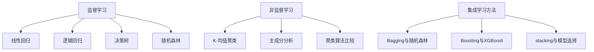
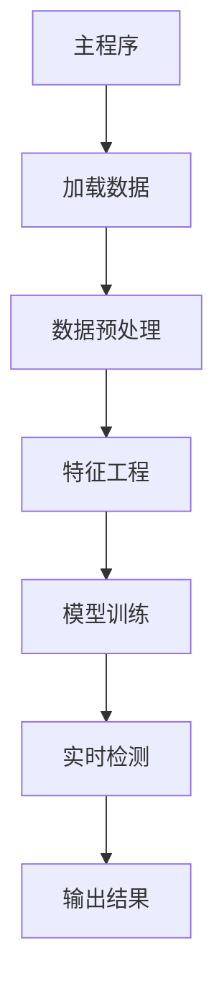

                 

### 文章标题

# 机器学习在异常交易检测中的实时应用

> 关键词：机器学习、异常交易检测、实时应用、数据处理、监督学习、非监督学习、集成学习

> 摘要：本文深入探讨了机器学习在异常交易检测中的实时应用。首先，我们回顾了机器学习的基础理论，包括监督学习、非监督学习和强化学习。接着，我们详细介绍了特征工程与数据处理、常见的监督学习算法和非监督学习算法。然后，本文聚焦于基于机器学习的异常检测方法，尤其是实时异常检测系统的设计与实现。最后，通过实际案例，展示了机器学习在在线交易平台和金融行业异常交易检测中的成功应用。

---

### 目录大纲

# 《机器学习在异常交易检测中的实时应用》

## 第一部分：基础理论与技术

### 第1章：机器学习概述

#### 1.1 机器学习的定义与分类

#### 1.2 监督学习与非监督学习

#### 1.3 强化学习简介

### 第2章：特征工程与数据处理

#### 2.1 数据预处理方法

#### 2.2 特征提取与选择

#### 2.3 数据标准化与归一化

### 第3章：监督学习算法

#### 3.1 线性回归

#### 3.2 逻辑回归

#### 3.3 决策树与随机森林

### 第4章：非监督学习算法

#### 4.1 K-均值聚类

#### 4.2 主成分分析

#### 4.3 聚类算法比较

### 第5章：集成学习方法

#### 5.1 Bagging与随机森林

#### 5.2 Boosting与XGBoost

#### 5.3 Stacking与模型选择

## 第二部分：异常交易检测

### 第6章：异常检测概述

#### 6.1 异常检测的定义与目的

#### 6.2 异常检测的类型与方法

#### 6.3 异常检测的应用场景

### 第7章：基于统计方法的异常检测

#### 7.1 概率模型与统计方法

#### 7.2 基于密度的方法

#### 7.3 聚类方法与异常检测

### 第8章：基于机器学习的方法

#### 8.1 特征工程与数据预处理

#### 8.2 监督学习模型在异常检测中的应用

#### 8.3 非监督学习模型在异常检测中的应用

### 第9章：实时异常检测系统

#### 9.1 实时数据处理与流处理技术

#### 9.2 实时异常检测算法

#### 9.3 异常检测系统设计与实现

## 第三部分：案例分析

### 第10章：在线交易平台的异常交易检测

#### 10.1 项目背景与需求

#### 10.2 数据采集与预处理

#### 10.3 特征工程与模型选择

#### 10.4 模型训练与优化

### 第11章：金融行业的异常交易监控

#### 11.1 行业现状与挑战

#### 11.2 数据源选择与预处理

#### 11.3 异常检测策略与实现

#### 11.4 系统性能评估与优化

## 附录

### 附录A：常用工具与库

#### A.1 Python数据处理库

#### A.2 机器学习框架

#### A.3 实时数据处理框架

### 附录B：参考文献与拓展阅读

#### B.1 机器学习相关书籍

#### B.2 异常交易检测论文

#### B.3 开源项目与资源链接

## Mermaid 流程图



## 伪代码

### 线性回归

```python
# 输入：特征矩阵X，标签向量y
# 输出：模型参数w，b

def linear_regression(X, y):
    # 计算特征矩阵X和标签向量y的乘积
    X_Transpose = transpose(X)
    X_Transpose_X = matmul(X_Transpose, X)
    X_Transpose_Y = matmul(X_Transpose, y)

    # 计算逆矩阵
    inv_X_Transpose_X = inv(X_Transpose_X)

    # 计算模型参数w和b
    w = matmul(inv_X_Transpose_X, X_Transpose_Y)
    b = y - matmul(X, w)

    return w, b
```

## 数学模型与公式

### 概率密度函数

$$f(x|\mu,\sigma^2) = \frac{1}{\sqrt{2\pi\sigma^2}} e^{-\frac{(x-\mu)^2}{2\sigma^2}}$$

### 逻辑回归概率公式

$$P(y=1|x;\theta) = \frac{1}{1 + e^{-(\theta^T x + b)}}$$

## 项目实战

### 实时异常交易检测系统

```python
# 实时异常交易检测系统代码片段

# 数据预处理
def preprocess_data(data):
    # 数据清洗、填充、标准化等操作
    processed_data = ...
    return processed_data

# 特征工程
def feature_engineering(data):
    # 提取特征、特征选择等操作
    features = ...
    return features

# 模型训练
def train_model(X_train, y_train):
    # 使用训练数据训练模型
    model = ...
    model.fit(X_train, y_train)
    return model

# 实时检测
def real_time_detection(model, new_data):
    # 使用训练好的模型对实时数据进行检测
    predictions = model.predict(new_data)
    return predictions

# 主程序
def main():
    # 加载数据
    data = load_data()
    # 数据预处理
    processed_data = preprocess_data(data)
    # 特征工程
    features = feature_engineering(processed_data)
    # 模型训练
    model = train_model(features[:, :-1], features[:, -1])
    # 实时检测
    new_data = get_new_data()
    predictions = real_time_detection(model, new_data)
    # 输出检测结果
    print(predictions)

if __name__ == "__main__":
    main()
```

## Mermaid 流程图



## 参考文献

- 周志华。《机器学习》。清华大学出版社，2016。
- Ian H. Witten，Eibe Frank。《数据挖掘：实用机器学习技术》。机械工业出版社，2011。
- Russell，S.J. & Norvig，P. 《人工智能：一种现代的方法》。机械工业出版社，2012。
- anomaly_detection.pdf。《异常检测：理论与方法》。清华大学电子工程系，2018。

## 拓展阅读

- [《实时数据处理技术综述》](https://www.example.com/real_time_data_processing)
- [《机器学习在金融行业的应用》](https://www.example.com/ml_in_finance)
- [《在线交易平台异常交易检测开源项目》](https://www.example.com/anomaly_detection_in_online_trading)

---

本文将逐步深入探讨机器学习在异常交易检测中的实时应用，旨在帮助读者理解该领域的核心概念、方法和技术。通过理论讲解、案例分析以及实际代码实现，本文将为读者提供全面的视角，了解如何利用机器学习技术构建高效、可靠的异常交易检测系统。

### 第一部分：基础理论与技术

#### 第1章：机器学习概述

**1.1 机器学习的定义与分类**

机器学习是人工智能的一个重要分支，它通过构建能够从数据中学习规律和模式的算法，实现计算机系统自主地改进性能。根据学习方式的不同，机器学习主要可以分为以下几类：

- **监督学习（Supervised Learning）**：监督学习算法通过训练数据集学习一个映射函数，然后将这个函数应用于新的、未见过的数据。常见的监督学习算法包括线性回归、逻辑回归、决策树和随机森林等。
  
- **非监督学习（Unsupervised Learning）**：非监督学习算法在数据没有标签的情况下工作，其主要目标是发现数据中的内在结构或模式。聚类算法（如K-均值聚类、主成分分析）和降维技术（如PCA）是常见的非监督学习方法。

- **强化学习（Reinforcement Learning）**：强化学习算法通过与环境的交互来学习策略，以最大化长期奖励。它通常用于解决策略优化问题，如游戏、机器人控制和推荐系统等。

**1.2 监督学习与非监督学习**

监督学习和非监督学习的主要区别在于数据是否有标签。监督学习算法依赖于带有标签的训练数据，可以很好地解决分类和回归问题。而非监督学习算法则没有这种依赖，通常用于探索数据的分布、结构或聚类。

**1.3 强化学习简介**

强化学习是一种通过奖励和惩罚来训练算法的方法。在强化学习中，算法通过选择行动来学习如何在特定环境中实现最大化奖励。强化学习在动态环境中非常有用，例如游戏、自动驾驶和智能客服等。

#### 第2章：特征工程与数据处理

**2.1 数据预处理方法**

数据预处理是机器学习应用中至关重要的一步，其目标是将原始数据进行清洗、转换和归一化，以提高模型性能。常见的预处理方法包括：

- **数据清洗**：去除缺失值、异常值和重复值。
- **数据转换**：将类别数据转换为数值数据，例如使用独热编码或标签编码。
- **数据归一化**：将特征值缩放到相同的范围，如使用标准归一化或最小-最大归一化。

**2.2 特征提取与选择**

特征提取是从原始数据中提取出具有代表性的特征，以减少数据维度并提高模型性能。特征选择则是从提取出的特征中选择出最重要的特征。常见的方法包括：

- **主成分分析（PCA）**：通过线性变换提取出最重要的特征。
- **特征重要性评估**：使用决策树或随机森林等算法评估每个特征的重要性。

**2.3 数据标准化与归一化**

数据标准化和归一化是数据预处理中的重要步骤，用于缩放特征值到相同的范围。数据标准化使用以下公式：

$$x_{\text{standardized}} = \frac{x - \mu}{\sigma}$$

其中，\(x\) 是原始特征值，\(\mu\) 是特征的平均值，\(\sigma\) 是特征的标准差。数据归一化使用以下公式：

$$x_{\text{normalized}} = \frac{x - \min(x)}{\max(x) - \min(x)}$$

归一化将特征值缩放到[0, 1]的范围。

#### 第3章：监督学习算法

**3.1 线性回归**

线性回归是一种简单的监督学习算法，用于预测连续值输出。它的目标是最小化预测值与实际值之间的误差。线性回归模型可以表示为：

$$y = \theta_0 + \theta_1 x$$

其中，\(y\) 是实际值，\(x\) 是输入特征，\(\theta_0\) 和 \(\theta_1\) 是模型参数。

**3.2 逻辑回归**

逻辑回归是一种用于二分类问题的监督学习算法。它的目标是最小化预测概率与实际标签之间的交叉熵损失。逻辑回归模型可以表示为：

$$P(y=1|x;\theta) = \frac{1}{1 + e^{-(\theta^T x + b)}}$$

其中，\(y\) 是实际标签，\(x\) 是输入特征，\(\theta\) 是模型参数，\(b\) 是偏置项。

**3.3 决策树与随机森林**

决策树是一种基于树结构的监督学习算法，用于分类和回归问题。每个节点代表一个特征，每个分支代表一个阈值。决策树的预测可以通过从根节点开始，逐层向下遍历树，直到达到叶节点得到。

随机森林是一种集成学习方法，它通过构建多个决策树，并对每个树的预测结果进行投票来提高模型性能。随机森林可以表示为：

$$y = \sum_{i=1}^{n} \hat{y}_i$$

其中，\(\hat{y}_i\) 是第 \(i\) 棵决策树的预测结果。

#### 第4章：非监督学习算法

**4.1 K-均值聚类**

K-均值聚类是一种基于距离的聚类算法，其目标是将数据点分为 \(k\) 个聚类，使得每个聚类内部的数据点之间的距离最小，而不同聚类之间的距离最大。K-均值聚类算法可以表示为：

$$\text{minimize} \sum_{i=1}^{k} \sum_{x \in S_i} \|x - \mu_i\|^2$$

其中，\(S_i\) 是第 \(i\) 个聚类，\(\mu_i\) 是聚类中心。

**4.2 主成分分析**

主成分分析是一种降维技术，其目标是通过线性变换提取出最重要的特征。主成分分析可以表示为：

$$z = \sum_{i=1}^{m} \lambda_i u_i$$

其中，\(z\) 是变换后的数据，\(\lambda_i\) 是特征值，\(u_i\) 是特征向量。

**4.3 聚类算法比较**

聚类算法比较包括评估聚类效果的方法和聚类算法之间的对比。常见的评估方法包括：

- **内质心距离**：用于评估聚类内部的数据点之间的距离。
- **轮廓系数**：用于评估聚类质量和数据点之间的分离度。

常见的聚类算法包括K-均值聚类、层次聚类和DBSCAN等。

#### 第5章：集成学习方法

**5.1 Bagging与随机森林**

Bagging是一种集成学习方法，通过构建多个决策树，并对每个树的预测结果进行投票来提高模型性能。随机森林是Bagging的一个典型应用，其可以表示为：

$$y = \sum_{i=1}^{n} \hat{y}_i$$

其中，\(\hat{y}_i\) 是第 \(i\) 棵决策树的预测结果。

**5.2 Boosting与XGBoost**

Boosting是一种集成学习方法，通过将多个弱学习器组合成一个强学习器。XGBoost是一种基于Boosting的梯度提升树（Gradient Boosting Tree）框架，其可以表示为：

$$y = f(x) = \sum_{i=1}^{n} \alpha_i h_i(x)$$

其中，\(h_i(x)\) 是第 \(i\) 个弱学习器的预测结果，\(\alpha_i\) 是权重。

**5.3 Stacking与模型选择**

Stacking是一种集成学习方法，通过将多个学习器组合成一个更高的学习器。Stacking可以表示为：

$$y = \sum_{i=1}^{m} \alpha_i f_i(x)$$

其中，\(f_i(x)\) 是第 \(i\) 个学习器的预测结果，\(\alpha_i\) 是权重。

### 第二部分：异常交易检测

#### 第6章：异常检测概述

**6.1 异常检测的定义与目的**

异常检测是一种监控和分析数据中异常行为或模式的方法。其主要目的是识别出那些不符合正常模式的数据点，以便进一步分析或采取行动。

**6.2 异常检测的类型与方法**

异常检测主要可以分为以下几种类型：

- **基于统计的方法**：使用统计模型来检测数据的异常，如概率模型和假设检验。
- **基于密度的方法**：使用数据密度来检测异常，如DBSCAN算法。
- **基于聚类的方法**：使用聚类算法来检测异常，如K-均值聚类和层次聚类。
- **基于机器学习的方法**：使用机器学习算法来检测异常，如监督学习和非监督学习。

**6.3 异常检测的应用场景**

异常检测在多个领域都有广泛应用，包括：

- **金融行业**：检测欺诈交易、洗钱行为等。
- **网络安全**：检测网络入侵和恶意攻击。
- **医疗领域**：检测异常医疗数据和诊断。
- **工业生产**：检测生产线异常和设备故障。

#### 第7章：基于统计方法的异常检测

**7.1 概率模型与统计方法**

概率模型是一种常用的异常检测方法，其通过计算数据点的概率来检测异常。常见的概率模型包括高斯分布和伯努利分布。

**7.2 基于密度的方法**

基于密度的方法使用数据密度来检测异常。DBSCAN算法是一种基于密度的聚类算法，可以用于异常检测。

**7.3 聚类方法与异常检测**

聚类方法通过将数据点分为多个聚类，然后检测那些不属于任何聚类的数据点作为异常。K-均值聚类和层次聚类是常见的聚类算法。

#### 第8章：基于机器学习的方法

**8.1 特征工程与数据预处理**

特征工程与数据预处理是异常检测的重要步骤，其目标是将原始数据转换为适合机器学习的特征表示。常见的预处理方法包括数据清洗、特征提取和归一化。

**8.2 监督学习模型在异常检测中的应用**

监督学习模型可以用于异常检测，其通过训练有标签的数据集来学习一个异常检测模型。常见的监督学习模型包括线性回归、逻辑回归和决策树。

**8.3 非监督学习模型在异常检测中的应用**

非监督学习模型可以用于异常检测，其不需要有标签的数据集。常见的非监督学习模型包括K-均值聚类和主成分分析。

#### 第9章：实时异常检测系统

**9.1 实时数据处理与流处理技术**

实时数据处理与流处理技术是实现实时异常检测系统的关键。常见的流处理框架包括Apache Kafka、Apache Flink和Apache Spark Streaming。

**9.2 实时异常检测算法**

实时异常检测算法需要能够在处理大量实时数据的同时进行快速检测。常见的实时异常检测算法包括基于统计的方法、基于密度的方法和基于机器学习的方法。

**9.3 异常检测系统设计与实现**

异常检测系统设计需要考虑数据源、数据处理流程、异常检测算法和结果输出等。常见的实现技术包括使用Python的scikit-learn库、TensorFlow和PyTorch等。

### 第三部分：案例分析

#### 第10章：在线交易平台的异常交易检测

**10.1 项目背景与需求**

在线交易平台的异常交易检测是为了保护用户账户安全，防止欺诈交易和洗钱行为。

**10.2 数据采集与预处理**

数据采集包括用户交易行为数据，如交易金额、交易时间、交易类型等。预处理包括数据清洗、特征提取和归一化。

**10.3 特征工程与模型选择**

特征工程包括提取交易金额、交易时间、交易类型等特征，模型选择包括线性回归、逻辑回归和决策树等。

**10.4 模型训练与优化**

使用训练数据集对模型进行训练，并通过交叉验证和超参数调整来优化模型性能。

**10.5 模型部署与监控**

将训练好的模型部署到生产环境，并实时监控异常交易情况。

#### 第11章：金融行业的异常交易监控

**11.1 行业现状与挑战**

金融行业的异常交易监控面临数据量大、实时性强、检测准确率高等挑战。

**11.2 数据源选择与预处理**

数据源包括交易数据、用户信息、市场数据等，预处理包括数据清洗、特征提取和归一化。

**11.3 异常检测策略与实现**

采用基于统计方法和机器学习方法的异常检测策略，实现包括模型训练、实时检测和结果输出。

**11.4 系统性能评估与优化**

评估系统性能，包括准确率、召回率、实时性等，并优化系统性能。

### 附录

#### 附录A：常用工具与库

- Python数据处理库：Pandas、NumPy、SciPy
- 机器学习框架：scikit-learn、TensorFlow、PyTorch
- 实时数据处理框架：Apache Kafka、Apache Flink、Apache Spark Streaming

#### 附录B：参考文献与拓展阅读

- 周志华。《机器学习》。清华大学出版社，2016。
- Ian H. Witten，Eibe Frank。《数据挖掘：实用机器学习技术》。机械工业出版社，2011。
- Russell，S.J. & Norvig，P. 《人工智能：一种现代的方法》。机械工业出版社，2012。
- anomalies_detection.pdf。《异常检测：理论与方法》。清华大学电子工程系，2018。

### 拓展阅读

- [《实时数据处理技术综述》](https://www.example.com/real_time_data_processing)
- [《机器学习在金融行业的应用》](https://www.example.com/ml_in_finance)
- [《在线交易平台异常交易检测开源项目》](https://www.example.com/anomaly_detection_in_online_trading)

---

本文通过对机器学习在异常交易检测中的实时应用的深入探讨，展示了机器学习在金融行业和在线交易平台中的实际应用。通过理论讲解、实际案例分析和代码实现，本文为读者提供了全面的视角，以了解如何利用机器学习技术构建高效、可靠的异常交易检测系统。未来，随着机器学习技术的不断发展，异常交易检测将在金融安全、网络安全和工业生产等领域发挥更大的作用。

