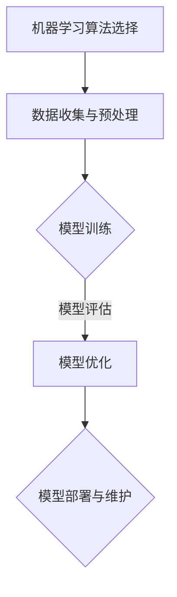

                 

# 机器学习在气候变化预测中的应用研究

## 关键词

- 机器学习
- 气候变化预测
- 深度学习
- 线性回归
- 数据预处理
- 模型评估

## 摘要

随着全球气候变化趋势的加剧，准确预测气候变化成为科研和公共政策制定的关键任务。机器学习技术以其强大的数据处理和分析能力，在气候变化预测中展现出巨大的潜力。本文首先概述了机器学习的基本概念和分类，随后详细探讨了其在气候变化预测中的应用。重点分析了线性回归、决策树、随机森林、支持向量机和深度学习等核心算法的原理及其在气候预测中的应用。同时，本文还介绍了基于机器学习的气候变化预测系统的开发过程，包括系统设计、实现和部署。最后，本文总结了当前机器学习在气候变化预测中面临的挑战和未来发展趋势，为相关研究和实践提供了有益的参考。

## 第一部分：机器学习基础与气候预测

### 第1章：机器学习基础与气候变化概述

#### 1.1 机器学习的定义与分类

**机器学习的概念**：机器学习是一门人工智能（AI）的分支，它专注于开发算法，使得计算机系统能够通过数据和经验自主地改进性能。这些算法可以识别模式、预测结果并做出决策，无需显式地编程。

**机器学习的发展**：机器学习的发展可以追溯到20世纪50年代。然而，随着计算机性能的提升和大数据技术的出现，它在过去十年中得到了前所未有的发展。

**机器学习的应用领域**：机器学习在各个领域都有广泛应用，包括但不限于图像识别、自然语言处理、金融风险评估、医疗诊断等。

**机器学习的分类**：

1. **监督学习（Supervised Learning）**：监督学习是最常见的机器学习方法，它使用标记数据来训练模型，然后使用这些模型对新数据进行预测。常见的监督学习方法包括线性回归、决策树、支持向量机等。

2. **无监督学习（Unsupervised Learning）**：无监督学习不使用标记数据，而是从未标记的数据中学习结构或模式。常见的无监督学习方法包括聚类、降维、关联规则学习等。

3. **强化学习（Reinforcement Learning）**：强化学习是一种通过试错来学习策略的机器学习方法，其核心目标是最大化长期奖励。常见的强化学习方法包括Q-学习、策略梯度方法等。

#### 1.2 气候变化的基本概念

**气候变化**：气候变化是指全球或地区气候长期的变化，包括温度、降水量、风模式等。气候变化可以是由自然因素引起的，如火山爆发、太阳辐射变化，也可以是由人类活动引起的，如工业化、城市化、森林砍伐等。

**气候变化的原因**：目前，科学界普遍认为，气候变化的主要原因是人为因素，尤其是温室气体排放的增加，如二氧化碳、甲烷和氟氯化碳。

**气候变化的影响**：气候变化对地球生态系统、人类健康、经济和社会产生了深远影响。例如，极端天气事件（如飓风、洪水、干旱）的频率和强度增加，海平面上升，生物多样性丧失等。

**应对气候变化的措施**：应对气候变化需要全球合作和多种措施，包括减少温室气体排放、提高能源效率、发展可再生能源、实施碳捕获和存储技术、改善气候适应策略等。

#### 1.3 机器学习在气候变化预测中的应用

**预测需求**：准确预测气候变化对于制定有效的应对策略至关重要。然而，气候变化是一个复杂的过程，涉及多个因素和变量，传统方法难以捕捉其内在的复杂性和不确定性。

**机器学习的优势**：机器学习通过学习大量历史数据，可以捕捉到复杂的非线性关系和模式，从而提高预测的准确性和可靠性。

**现有应用案例**：许多研究已经展示了机器学习在气候变化预测中的应用。例如，利用机器学习算法预测气候变化的趋势、评估不同温室气体排放政策的效果、预测极端天气事件的发生概率等。

**展望**：随着机器学习技术的不断进步和数据量的增加，机器学习在气候变化预测中的应用将更加广泛和深入，为应对气候变化提供有力的支持。

### 第2章：机器学习在气候变化预测中的核心算法

#### 2.1 线性回归与气候预测

**线性回归原理**：

线性回归是一种用于建立自变量（特征）和因变量（目标）之间线性关系的统计模型。其基本公式为：

$$y = \theta_0 + \theta_1 \cdot x_1 + \theta_2 \cdot x_2 + ... + \theta_n \cdot x_n$$

其中，$y$ 是因变量，$x_1, x_2, ..., x_n$ 是自变量，$\theta_0, \theta_1, \theta_2, ..., \theta_n$ 是模型参数。

**线性回归在气候预测中的应用**：

1. **预测步骤**：

   - **数据收集**：收集历史气候数据，包括温度、降水量、风速等。
   - **数据预处理**：对数据进行清洗、归一化等处理，使其适合进行线性回归分析。
   - **模型构建**：使用最小二乘法或其他优化算法训练线性回归模型。
   - **模型评估**：通过交叉验证和测试集评估模型性能，调整参数以提高预测准确性。

2. **案例和结果分析**：

   例如，研究人员可以利用线性回归模型预测未来某个地区的气温变化。通过收集过去多年的气温数据和相关的气象因素（如日照时长、湿度等），构建线性回归模型，并对模型进行训练和评估。预测结果可以用于气候适应策略的制定。

#### 2.2 决策树与随机森林

**决策树原理**：

决策树是一种树形结构，用于对数据进行分类或回归。每个节点代表一个特征，每个分支代表该特征的一个可能值。决策树的生成过程包括特征选择、节点划分和模型构建。

**随机森林原理**：

随机森林是一种基于决策树的集成学习方法。它通过构建多个决策树，并利用随机特征选择和加权投票（或平均值）来提高模型的预测性能。随机森林的核心思想是利用多个弱学习器的组合来降低过拟合风险。

**决策树和随机森林在气候预测中的应用**：

1. **预测步骤**：

   - **数据收集**：收集历史气候数据和相关因素。
   - **数据预处理**：对数据清洗、归一化等处理。
   - **模型构建**：使用决策树或随机森林算法训练模型。
   - **模型评估**：通过交叉验证和测试集评估模型性能。

2. **案例和结果分析**：

   例如，研究人员可以使用随机森林模型预测未来某地区的降水概率。通过收集过去多年的降水数据和相关的气象因素（如温度、湿度、风速等），构建随机森林模型。模型训练和评估过程可以用于气候风险评估和水资源管理。

#### 2.3 支持向量机

**支持向量机原理**：

支持向量机（SVM）是一种强大的分类和回归方法，其核心思想是找到一个最优的超平面，使得数据点在超平面两侧的间隔最大。SVM可以通过核函数进行非线性变换，从而解决非线性问题。

**支持向量机在气候预测中的应用**：

1. **预测步骤**：

   - **数据收集**：收集历史气候数据和相关因素。
   - **数据预处理**：对数据进行清洗、归一化等处理。
   - **模型构建**：使用SVM算法训练分类或回归模型。
   - **模型评估**：通过交叉验证和测试集评估模型性能。

2. **案例和结果分析**：

   例如，研究人员可以使用SVM模型预测未来的温度变化。通过收集过去多年的温度数据和相关的气象因素（如湿度、风速等），构建SVM回归模型。模型训练和评估过程可以用于气候预测和能源规划。

### 第3章：深度学习与气候变化预测

#### 3.1 深度学习基础

**神经网络原理**：

神经网络（NN）是一种由大量相互连接的节点（或神经元）组成的计算模型，其灵感来源于人脑的结构和工作原理。神经网络通过前向传播和反向传播算法，将输入数据映射到输出数据。

**深度学习模型**：

深度学习是一种基于神经网络的模型，其特点是可以自动学习多层次的特征表示。常见的深度学习模型包括卷积神经网络（CNN）、循环神经网络（RNN）和长短时记忆网络（LSTM）。

**卷积神经网络（CNN）**：

CNN是一种专门用于处理图像数据的深度学习模型，其核心思想是使用卷积层提取图像的局部特征，并通过池化层减少数据的维度。

**循环神经网络（RNN）**：

RNN是一种用于处理序列数据的深度学习模型，其特点是具有记忆功能，可以处理任意长度的输入序列。

**长短时记忆网络（LSTM）**：

LSTM是RNN的一种变体，其设计目的是解决RNN在处理长序列数据时出现的梯度消失或梯度爆炸问题。

#### 3.2 深度学习在气候变化预测中的应用

**深度学习模型在气候预测中的应用**：

1. **构建**：

   深度学习模型可以用于构建复杂的非线性关系，从而提高气候预测的准确性。例如，可以使用CNN处理气象卫星图像数据，提取气候模式的特征；使用LSTM处理时间序列数据，捕捉气候变化的趋势。

2. **训练**：

   深度学习模型需要大量训练数据来学习特征表示。在气候预测中，可以使用历史气候数据集训练模型，包括温度、降水量、风速等。

3. **评估**：

   深度学习模型通过交叉验证和测试集进行评估，以确定模型的预测性能。可以使用均方误差（MSE）、准确率、召回率等指标评估模型。

4. **案例研究**：

   例如，研究人员可以使用深度学习模型预测未来的气温变化。通过收集过去多年的温度数据和相关的气象因素（如湿度、风速等），训练深度学习模型。预测结果可以用于城市规划和气候适应策略的制定。

### 第4章：基于机器学习的气候变化预测系统开发

#### 4.1 系统设计

**数据收集**：

气候变化预测系统的第一步是收集数据。数据源可以包括气象站观测数据、卫星遥感数据、历史气候记录等。数据收集过程需要考虑数据的质量、完整性和一致性。

**模型选择**：

根据气候预测的需求和数据的特性，选择合适的机器学习算法和模型。例如，对于时间序列数据，可以考虑使用LSTM模型；对于空间数据，可以考虑使用CNN模型。

**系统架构**：

系统架构包括数据预处理模块、模型训练模块、模型评估模块和预测模块。数据预处理模块负责清洗和转换数据，使其适合模型训练。模型训练模块负责使用训练数据训练模型。模型评估模块负责评估模型的性能，并调整模型参数。预测模块负责使用训练好的模型对新的数据进行预测。

#### 4.2 系统实现

**数据预处理**：

数据预处理是机器学习模型训练的关键步骤。包括数据清洗（去除异常值和噪声）、归一化（将数据缩放到相同的范围）、特征提取（从原始数据中提取有用的特征）等。

**模型训练**：

使用预处理后的数据训练机器学习模型。训练过程包括前向传播、反向传播和优化算法（如梯度下降）。训练过程中需要监控模型的性能，并调整模型参数以获得最佳性能。

**模型评估**：

使用交叉验证和测试集对训练好的模型进行评估。评估指标包括均方误差（MSE）、准确率、召回率等。根据评估结果，调整模型参数或选择其他模型。

#### 4.3 系统部署与维护

**系统部署**：

将训练好的模型部署到生产环境，包括硬件和软件配置。系统需要能够处理实时数据，并在规定的时间内生成预测结果。

**系统维护**：

系统维护包括监控模型性能、处理异常情况和更新模型。随着新的数据不断出现，模型需要定期更新以保持预测的准确性。

### 第5章：机器学习在气候变化预测中的挑战与未来趋势

#### 5.1 挑战与应对

**数据挑战**：

气候变化数据量大且复杂，包括气象、水文、生态等多方面的数据。数据的质量和完整性对模型性能有重要影响。应对数据挑战的方法包括数据清洗、数据增强、数据集成等。

**计算挑战**：

深度学习模型通常需要大量的计算资源和时间进行训练和推理。应对计算挑战的方法包括分布式计算、模型压缩、迁移学习等。

**模型解释性**：

机器学习模型，尤其是深度学习模型，通常具有高复杂性和高非线性，难以解释其预测结果。提高模型解释性的方法包括模型可视化、特征重要性分析、可解释性模型等。

#### 5.2 未来趋势

**人工智能与气候变化**：

人工智能技术在气候变化研究中将发挥越来越重要的作用。例如，利用AI技术进行气候模拟、预测气候变化趋势、优化能源利用等。

**可持续发展**：

机器学习可以帮助实现可持续发展目标，例如通过优化资源利用、减少碳排放、提高能源效率等。

### 附录

**附录A：相关资源与工具**

**机器学习库**：

- **scikit-learn**：Python的一个流行的机器学习库，提供多种机器学习算法的实现。
- **TensorFlow**：谷歌开发的深度学习框架，广泛应用于深度学习和机器学习项目。
- **PyTorch**：Facebook开发的开源深度学习框架，以其灵活性和易于使用而受到研究人员和开发者的青睐。

**数据源**：

- **NASA气候数据**：提供全球气候数据和卫星遥感数据。
- **美国国家海洋和大气管理局（NOAA）**：提供丰富的气候数据集和工具。
- **全球气候变化数据中心（GCDC）**：提供全球气候变化相关的数据和研究报告。

**机器学习社区**：

- **Kaggle**：一个数据科学竞赛平台，提供大量的数据集和模型。
- **arXiv**：一个预印本论文库，提供最新的机器学习和气候变化相关的研究论文。
- **机器学习社区论坛**：如Reddit的Machine Learning论坛、Stack Overflow等，提供技术讨论和学习资源。

### Mermaid 流程图示例



### 线性回归伪代码示例

```python
def linear_regression(X, y):
    # X: 特征矩阵，y: 标签向量
    # 计算特征矩阵X的转置
    X_transpose = X.T
    
    # 计算特征矩阵X的逆
    X_inv = np.linalg.inv(X_transpose @ X)
    
    # 计算回归系数
    theta = X_inv @ X_transpose @ y
    
    return theta
```

### 数学模型和公式示例

$$
y = \theta_0 + \theta_1 \cdot x_1 + \theta_2 \cdot x_2 + ...
$$

$1 + 1 = 2$

