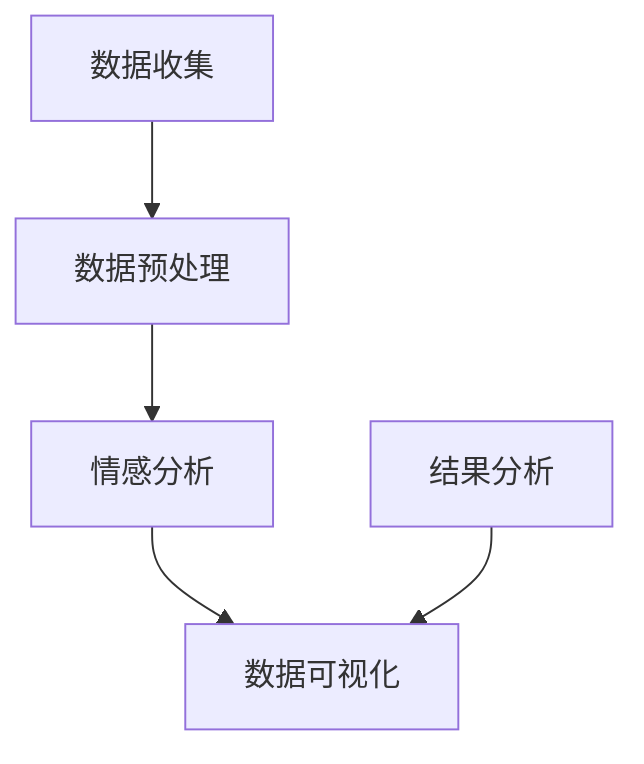
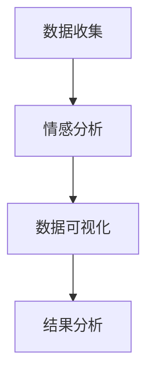
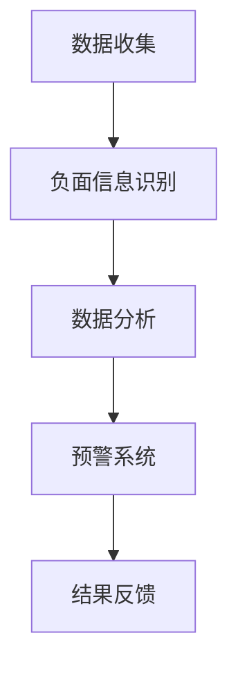

                 

### 文章标题

# 《机器学习在社交媒体舆情监测中的应用》

### 关键词

- 机器学习
- 社交媒体
- 舆情监测
- 数据预处理
- 算法应用
- 实战案例

### 摘要

本文将深入探讨机器学习在社交媒体舆情监测中的应用。首先，我们将回顾机器学习的基本概念和主要任务，并介绍数据预处理的重要性。随后，文章将重点分析社交媒体数据收集与处理的具体方法，探讨舆情监测技术的核心概念和挑战。接下来，我们将详细讲解机器学习模型在舆情监测中的应用，以及常见算法的实际案例。最后，文章将总结社交媒体舆情监测的未来发展趋势，并提供相关的工具与资源。通过本文，读者将全面了解机器学习在社交媒体舆情监测中的强大应用，以及如何在实际项目中实现有效的舆情监测。

### 第一部分：机器学习基础

#### 第1章：机器学习概述

#### 1.1 机器学习的定义与发展历程

机器学习（Machine Learning，ML）是一种使计算机系统能够从数据中学习并做出预测或决策的技术。其基本原理源自统计学、线性代数、概率论等数学领域，通过算法自动从数据中提取特征，构建模型，并在新的数据上进行预测或决策。

机器学习的发展历程可以追溯到20世纪50年代，当时的科学家们开始探索如何使计算机系统能够自主学习。1959年，Arthur Samuel提出了第一个能够通过自我学习改进棋艺的程序。随后，1956年，John McCarthy正式提出了“人工智能”一词，并组织了第一次人工智能会议，标志着人工智能领域的诞生。在20世纪60年代和70年代，机器学习经历了初步的发展，但由于计算能力的限制和算法的复杂性，研究进展较为缓慢。

直到20世纪80年代，随着计算机硬件的快速发展和大数据时代的到来，机器学习开始迎来了新的发展机遇。1986年，Yann LeCun等人提出了反向传播算法（Backpropagation Algorithm），为神经网络的发展奠定了基础。1990年代，支持向量机（Support Vector Machine，SVM）等新型算法的出现进一步推动了机器学习的研究与应用。

进入21世纪，随着互联网的普及和云计算的兴起，大量数据变得触手可及，机器学习的研究与应用达到了前所未有的高度。深度学习（Deep Learning，DL）作为一种基于多层神经网络的机器学习方法，在图像识别、语音识别、自然语言处理等领域取得了显著突破。2012年，AlexNet在ImageNet图像识别比赛中取得了突破性的成绩，标志着深度学习的崛起。

#### 1.2 机器学习的主要任务与类型

机器学习的主要任务可以分为以下几类：

1. **监督学习（Supervised Learning）**：监督学习是指利用已标记的数据来训练模型，并在新的、未标记的数据上进行预测或决策。常见的监督学习算法包括线性回归、逻辑回归、支持向量机、决策树、随机森林等。

2. **无监督学习（Unsupervised Learning）**：无监督学习是指在没有标记数据的情况下，从数据中自动发现模式或结构。常见的无监督学习算法包括聚类算法（如K-means、层次聚类）、降维算法（如主成分分析、t-SNE）等。

3. **半监督学习（Semi-Supervised Learning）**：半监督学习是指利用少量标记数据和大量未标记数据来训练模型。这种方法可以有效地提高模型的性能，尤其在数据标注成本较高的情况下。

4. **强化学习（Reinforcement Learning）**：强化学习是指通过试错来学习最优策略，通过与环境的交互来获得奖励或惩罚，从而优化行为。常见的强化学习算法包括Q-learning、深度强化学习（Deep Reinforcement Learning）等。

#### 1.3 机器学习的基本原理

机器学习的基本原理可以概括为以下几个步骤：

1. **数据收集**：首先，需要收集大量的数据，这些数据可以是结构化的（如数据库）、半结构化的（如日志文件）或非结构化的（如文本、图像、视频）。

2. **数据预处理**：在数据收集完成后，需要对数据进行清洗、归一化、缺失值处理等操作，以确保数据的质量和一致性。数据预处理是机器学习模型训练的重要环节，直接影响模型的性能。

3. **特征工程**：特征工程是指从原始数据中提取出对模型训练有帮助的特征。特征工程的质量直接影响模型的预测效果。常见的特征工程技术包括特征选择、特征变换、特征组合等。

4. **模型选择**：根据问题的性质和需求，选择合适的机器学习模型。不同的模型有不同的假设和优化目标，适用于不同类型的问题。

5. **模型训练**：使用已标记的数据集对模型进行训练，通过调整模型参数，使模型在训练数据上的表现达到最优。

6. **模型评估**：在训练完成后，使用测试数据集对模型进行评估，以衡量模型的泛化能力。常见的评估指标包括准确率、召回率、F1值等。

7. **模型部署**：将训练好的模型部署到实际应用场景中，进行预测或决策。在实际应用中，可能需要根据新的数据进行模型更新和优化。

### 第2章：数据预处理

#### 2.1 数据收集与清洗

数据预处理是机器学习流程中的关键步骤，它直接影响到后续模型训练的效果。数据收集与清洗包括以下几个主要任务：

1. **数据收集**：数据收集是指从各种来源获取数据，如数据库、文件系统、网络爬虫等。数据源的质量直接影响数据的质量，因此选择合适的数据来源至关重要。

2. **数据清洗**：数据清洗是指对收集到的原始数据进行清洗，去除重复、错误、缺失等无效数据。数据清洗的主要任务包括以下几种：

   - **去除重复数据**：重复数据会导致模型过拟合，降低模型的泛化能力。可以使用去重算法（如哈希去重）来去除重复数据。
   
   - **处理缺失值**：缺失值可以采用多种方法进行处理，如删除缺失值、填充缺失值、插值等。对于重要的特征，可以考虑使用模型插补法来填充缺失值。
   
   - **去除噪声**：噪声是指数据中的无关或错误信息，如错别字、乱码等。可以采用过滤算法（如正则表达式）来去除噪声。
   
   - **数据归一化**：数据归一化是将数据缩放到一个统一的范围内，以消除不同特征之间的量纲差异。常用的归一化方法包括最小-最大归一化、平均值-标准差归一化等。

#### 2.2 特征工程

特征工程是指从原始数据中提取出对模型训练有帮助的特征，以提高模型的性能。特征工程包括以下主要任务：

1. **特征选择**：特征选择是指从大量特征中选择出对模型训练最有帮助的特征。常用的特征选择方法包括信息增益、卡方检验、主成分分析等。

2. **特征变换**：特征变换是指将原始特征转换为更适合模型训练的形式。常用的特征变换方法包括归一化、标准化、二值化等。

3. **特征组合**：特征组合是指将多个特征组合成新的特征，以增强模型的学习能力。常用的特征组合方法包括特征交叉、特征融合等。

4. **特征提取**：特征提取是指从原始数据中直接提取出对模型训练有帮助的特征，如文本分类中的词袋模型、TF-IDF等。

#### 2.3 数据可视化

数据可视化是指使用图形和图表将数据呈现出来，以帮助理解和分析数据。数据可视化在机器学习中有以下几个主要应用：

1. **数据探索**：通过数据可视化，可以初步了解数据的分布、趋势、异常值等，为后续的数据预处理和特征工程提供指导。

2. **模型评估**：通过数据可视化，可以直观地评估模型的性能，如混淆矩阵、ROC曲线等。

3. **特征分析**：通过数据可视化，可以分析特征之间的相关性、重要性等，为特征工程提供参考。

常见的可视化工具包括Matplotlib、Seaborn、Plotly等。下面是一个简单的示例，展示了如何使用Matplotlib绘制一个散点图：

```python
import matplotlib.pyplot as plt
import numpy as np

x = np.random.rand(100)
y = np.random.rand(100)

plt.scatter(x, y)
plt.xlabel('X轴')
plt.ylabel('Y轴')
plt.title('散点图示例')
plt.show()
```

通过数据预处理、特征工程和数据可视化，我们可以有效地提高机器学习模型的性能，为社交媒体舆情监测提供有力支持。

### 第二部分：社交媒体舆情监测

#### 第3章：社交媒体数据收集与处理

#### 3.1 社交媒体数据收集

社交媒体数据收集是舆情监测的关键步骤，数据的质量和数量直接影响舆情监测的准确性和可靠性。社交媒体数据收集主要包括以下几个任务：

1. **数据源选择**：首先，需要选择合适的社交媒体平台作为数据源，如微博、微信、Twitter、Facebook等。不同的平台具有不同的用户群体和内容特点，因此需要根据舆情监测的需求选择合适的数据源。

2. **数据爬取**：数据爬取是指使用程序从社交媒体平台获取用户生成的内容，如文本、图片、视频等。常用的数据爬取方法包括API调用、网络爬虫等。API调用是指通过官方API接口获取数据，具有高效、可靠的特点；网络爬虫是指使用程序模拟用户行为，从网页中提取数据，适用于大量数据收集。

3. **数据存储**：收集到的数据需要存储在数据库中，以供后续处理和分析。常用的数据库包括关系型数据库（如MySQL、PostgreSQL）和NoSQL数据库（如MongoDB、Cassandra）。关系型数据库适用于结构化数据存储，而NoSQL数据库适用于非结构化或半结构化数据存储。

下面是一个简单的示例，展示了如何使用Python的Tweepy库从Twitter获取数据：

```python
import tweepy

# 配置API密钥和访问令牌
consumer_key = 'your_consumer_key'
consumer_secret = 'your_consumer_secret'
access_token = 'your_access_token'
access_token_secret = 'your_access_token_secret'

# 初始化Tweepy API
auth = tweepy.OAuthHandler(consumer_key, consumer_secret)
auth.set_access_token(access_token, access_token_secret)
api = tweepy.API(auth)

# 获取最新的推文
tweets = api.user_timeline(screen_name='user_name', count=100)

for tweet in tweets:
    print(tweet.text)
```

#### 3.2 社交媒体数据预处理

社交媒体数据预处理是确保数据质量和一致性的重要步骤。主要包括以下几个任务：

1. **数据清洗**：去除重复、错误、缺失等无效数据。如前所述，数据清洗包括去除重复数据、处理缺失值、去除噪声等。

2. **文本预处理**：对于文本数据，需要进行文本预处理，以消除噪声、提高数据质量。常见的文本预处理方法包括：

   - **去标点符号**：去除文本中的标点符号，以消除不同标点符号对文本分析的影响。
   
   - **分词**：将文本分割为单词或短语，以进行进一步分析。常用的分词方法包括正则表达式分词、基于词典的分词等。
   
   - **停用词过滤**：去除常见的停用词（如“的”、“是”等），以提高文本分析的效果。
   
   - **词性标注**：对文本中的单词进行词性标注，以识别名词、动词、形容词等，为后续情感分析提供支持。

3. **数据归一化**：对文本数据和其他类型的数据进行归一化，以消除不同特征之间的量纲差异。如前所述，数据归一化包括最小-最大归一化、平均值-标准差归一化等。

4. **特征提取**：从预处理后的数据中提取出对模型训练有帮助的特征。常见的特征提取方法包括词袋模型、TF-IDF、词嵌入等。

下面是一个简单的示例，展示了如何使用Python的jieba库进行中文文本预处理：

```python
import jieba

# 加载停用词表
stop_words = set(['的', '是', '了', '在', '这', '那'])

# 输入文本
text = "我非常喜欢Python编程语言，它简洁高效。"

# 分词
words = jieba.cut(text)

# 过滤停用词
filtered_words = [word for word in words if word not in stop_words]

print(filtered_words)
```

#### 3.3 社交媒体数据存储与管理

社交媒体数据存储与管理是确保数据安全和高效利用的重要环节。主要包括以下几个任务：

1. **数据存储**：将预处理后的数据存储在数据库中，以供后续分析和挖掘。常用的数据库包括关系型数据库（如MySQL、PostgreSQL）和NoSQL数据库（如MongoDB、Cassandra）。关系型数据库适用于结构化数据存储，而NoSQL数据库适用于非结构化或半结构化数据存储。

2. **数据管理**：对存储的数据进行有效的管理和维护，包括数据备份、数据恢复、数据权限控制等。

3. **数据挖掘**：利用数据挖掘技术从存储的数据中提取有价值的信息，如用户行为分析、情感分析、话题检测等。常见的数据挖掘技术包括聚类分析、关联规则挖掘、分类算法等。

下面是一个简单的示例，展示了如何使用Python的MongoDB库存储和查询数据：

```python
from pymongo import MongoClient

# 连接MongoDB数据库
client = MongoClient('mongodb://localhost:27017/')

# 选择数据库
db = client['social_media_db']

# 选择集合
collection = db['tweets']

# 存储数据
tweet = {
    'user': 'user1',
    'text': '这是一个关于Python的推文。',
    'timestamp': '2022-01-01 10:00:00'
}
collection.insert_one(tweet)

# 查询数据
tweets = collection.find({'user': 'user1'})

for tweet in tweets:
    print(tweet['text'])
```

通过社交媒体数据的收集、预处理和存储，我们可以为舆情监测提供可靠的数据支持。在后续章节中，我们将进一步探讨舆情监测技术及其在社交媒体舆情监测中的应用。

### 第4章：舆情监测技术

#### 4.1 舆情监测的定义与目标

舆情监测（Sentiment Analysis）是一种利用自然语言处理（Natural Language Processing，NLP）和机器学习技术，对社交媒体、新闻报道、论坛等平台上的用户生成内容进行情感分析和挖掘的方法。其核心目标是识别和分类文本数据中的情感极性，从而了解公众对特定话题、事件或产品的态度和情绪。

舆情监测的定义可以概括为：通过技术手段，对互联网上的大量文本信息进行实时监控和分析，以识别和评估公众情感、态度和意见。舆情监测的目标主要包括以下几点：

1. **情感分类**：对文本数据中的情感进行分类，如正面、负面、中性等。情感分类是舆情监测的基础，有助于了解公众对特定话题的整体情绪。

2. **趋势分析**：通过分析一段时间内的文本数据，识别出公众对某一话题的情感变化趋势，如热度上升、下降或波动。

3. **情感强度评估**：对文本数据中的情感极性进行量化评估，以衡量公众情感的程度。情感强度评估有助于更精确地了解公众的情感状态。

4. **话题检测与追踪**：识别文本数据中的主要话题，并追踪话题的变化和演变，以了解公众关注的热点和趋势。

5. **事件检测**：通过文本数据，发现和识别与特定事件相关的信息，如自然灾害、社会事件等。事件检测有助于快速响应和应对突发事件。

6. **用户行为分析**：分析用户在社交媒体上的行为和互动，如点赞、评论、转发等，以了解用户情感和行为模式。

#### 4.2 舆情监测的方法与技术

舆情监测的方法和技术主要包括以下几种：

1. **基于规则的方法**：基于规则的方法是指通过手工编写规则，对文本数据进行情感分类。这种方法通常适用于简单、固定的文本数据。例如，对于中文文本，可以设置规则：如果文本中包含“很好”或“非常喜欢”，则分类为正面情感。

2. **基于统计的方法**：基于统计的方法是指利用统计学模型，对文本数据进行情感分类。常用的统计模型包括朴素贝叶斯（Naive Bayes）、逻辑回归（Logistic Regression）等。这种方法适用于大规模文本数据，具有较高的准确性和鲁棒性。

3. **基于机器学习的方法**：基于机器学习的方法是指利用机器学习算法，从大规模文本数据中自动提取特征，并进行情感分类。常用的机器学习算法包括支持向量机（Support Vector Machine，SVM）、随机森林（Random Forest）、深度学习（Deep Learning）等。这种方法具有较强的自适应能力和泛化能力。

4. **基于深度学习的方法**：基于深度学习的方法是指利用多层神经网络（如卷积神经网络、循环神经网络等）进行文本情感分类。深度学习方法在图像识别和语音识别等领域取得了显著成功，近年来也被广泛应用于文本情感分析。深度学习方法具有强大的特征提取和表达能力，但在数据处理和模型训练方面计算资源需求较高。

5. **基于情感词典的方法**：基于情感词典的方法是指利用预先构建的情感词典，对文本数据进行情感分类。情感词典通常包含一系列正面和负面词汇，以及对应的情感极性标签。在分析文本时，可以根据词典中的词汇及其情感极性，对文本进行情感分类。

6. **基于多模态的方法**：多模态舆情监测是指结合文本、图像、视频等多种类型的数据进行情感分析。例如，在社交媒体舆情监测中，可以结合用户的文本评论、上传的图片和视频，以及用户的其他行为数据，进行情感分析。多模态方法可以更全面地了解用户的情感状态，提高舆情监测的准确性和鲁棒性。

#### 4.3 舆情监测的挑战与对策

舆情监测在实际应用中面临诸多挑战，主要包括以下几个方面：

1. **数据质量**：社交媒体数据质量参差不齐，包括噪声、错误、缺失等。数据质量直接影响舆情监测的准确性。对策：采用数据清洗、去噪等技术，提高数据质量。

2. **情感极性变化**：情感极性在文本数据中可能发生变化，如从正面变为负面。这种变化增加了情感分类的难度。对策：采用动态情感分析、上下文分析等技术，识别情感极性的变化。

3. **多语言和多领域**：社交媒体数据涉及多种语言和领域，不同语言和领域有不同的情感表达和特点。对策：采用多语言情感分析模型、领域适应性技术等，提高跨语言和跨领域的舆情监测能力。

4. **实时性**：舆情监测需要实时分析大量社交媒体数据，对系统性能和响应速度有较高要求。对策：采用分布式计算、并行处理等技术，提高舆情监测的实时性和效率。

5. **隐私保护**：社交媒体数据包含用户的隐私信息，如姓名、地址等。对策：采用隐私保护技术，如数据加密、匿名化等，确保用户隐私安全。

6. **偏见和误导**：舆情监测结果可能受到偏见和误导的影响，导致不准确的结论。对策：采用交叉验证、多源数据融合等技术，减少偏见和误导的影响。

通过以上方法和技术，舆情监测可以在社交媒体上实时、准确地分析公众情感、态度和意见，为政府、企业、媒体等提供有价值的信息支持。

### 第5章：机器学习在舆情监测中的应用

#### 5.1 机器学习模型在舆情监测中的应用

机器学习模型在舆情监测中发挥着关键作用，通过自动化的方式对大量社交媒体数据进行分析和分类，从而实现实时、高效的舆情监测。下面，我们将详细探讨几种常见的机器学习模型在舆情监测中的应用。

**1. 朴素贝叶斯分类器（Naive Bayes Classifier）**

朴素贝叶斯分类器是一种基于概率论的分类方法，假设特征之间相互独立。在舆情监测中，朴素贝叶斯分类器常用于情感分类任务，通过对文本数据进行词频统计和概率计算，预测文本的情感极性。以下是朴素贝叶斯分类器的伪代码：

```python
def naive_bayes_classifier(train_data, test_data, feature_set):
    # 计算每个特征的概率
    for feature in feature_set:
        p_feature = sum([1 if feature in text else 0 for text in train_data]) / len(train_data)
        print(f"{feature}的概率为：{p_feature}")
    
    # 预测情感极性
    for text in test_data:
        p_positive = 1
        p_negative = 1
        for feature in feature_set:
            p_positive *= (sum([1 if feature in text and '正面' in label else 0 for text, label in train_data]) / sum([1 if '正面' in label else 0 for _, label in train_data]))
            p_negative *= (sum([1 if feature in text and '负面' in label else 0 for text, label in train_data]) / sum([1 if '负面' in label else 0 for _, label in train_data]))
        
        if p_positive > p_negative:
            print(f"{text}的情感极性为：正面")
        else:
            print(f"{text}的情感极性为：负面")
```

**2. 支持向量机（Support Vector Machine，SVM）**

支持向量机是一种高效的分类算法，通过找到最佳的超平面，将不同类别的数据分开。在舆情监测中，SVM常用于情感分类任务，通过核函数将低维特征映射到高维空间，实现数据的非线性分类。以下是SVM的伪代码：

```python
def svm_classifier(train_data, test_data):
    # 训练SVM模型
    model = train_svm_model(train_data)
    
    # 预测情感极性
    for text in test_data:
        feature_vector = extract_features(text)
        prediction = model.predict(feature_vector)
        
        if prediction == '正面':
            print(f"{text}的情感极性为：正面")
        else:
            print(f"{text}的情感极性为：负面")
```

**3. 随机森林（Random Forest）**

随机森林是一种集成学习方法，通过构建多棵决策树，并结合它们的预测结果进行分类。在舆情监测中，随机森林适用于处理大规模、高维度的文本数据，具有较高的分类准确性和鲁棒性。以下是随机森林的伪代码：

```python
def random_forest_classifier(train_data, test_data):
    # 训练随机森林模型
    model = train_random_forest_model(train_data)
    
    # 预测情感极性
    for text in test_data:
        feature_vector = extract_features(text)
        prediction = model.predict(feature_vector)
        
        if prediction == '正面':
            print(f"{text}的情感极性为：正面")
        else:
            print(f"{text}的情感极性为：负面")
```

**4. 深度学习模型（Deep Learning Model）**

深度学习模型，特别是卷积神经网络（Convolutional Neural Network，CNN）和循环神经网络（Recurrent Neural Network，RNN），在文本情感分类任务中表现出色。CNN通过卷积操作提取文本特征，RNN通过循环机制处理序列数据。以下是深度学习模型的伪代码：

```python
def deep_learning_classifier(train_data, test_data):
    # 训练深度学习模型
    model = train_deep_learning_model(train_data)
    
    # 预测情感极性
    for text in test_data:
        feature_vector = extract_deep_learning_features(text)
        prediction = model.predict(feature_vector)
        
        if prediction == '正面':
            print(f"{text}的情感极性为：正面")
        else:
            print(f"{text}的情感极性为：负面")
```

通过上述几种机器学习模型的应用，舆情监测可以更准确、高效地分析社交媒体数据，为决策提供有力支持。

#### 5.2 常见机器学习算法在舆情监测中的应用

在舆情监测中，常见机器学习算法如朴素贝叶斯、支持向量机、随机森林和深度学习等发挥着重要作用。下面，我们将详细探讨这些算法的基本原理和具体应用。

**1. 朴素贝叶斯分类器（Naive Bayes Classifier）**

朴素贝叶斯分类器是一种基于概率论的分类方法，假设特征之间相互独立。其基本原理是利用贝叶斯定理，通过计算每个类别的概率，选择概率最大的类别作为预测结果。在舆情监测中，朴素贝叶斯分类器常用于情感分类任务。

**应用场景：**

- **简单情感分类**：适用于情感分类任务较为简单的情况，如仅区分正面和负面情感。

**算法原理：**

- **训练过程**：

  ```python
  def train_naive_bayes_classifier(train_data):
      feature_set = set()
      for text, label in train_data:
          for word in text:
              feature_set.add(word)
      
      p_positive = len([label for _, label in train_data if label == '正面']) / len(train_data)
      p_negative = len([label for _, label in train_data if label == '负面']) / len(train_data)
      
      p_positive_words = {}
      p_negative_words = {}
      for word in feature_set:
          p_positive_words[word] = len([text for text, label in train_data if label == '正面' and word in text]) / (len([text for text, label in train_data if label == '正面']) + 1)
          p_negative_words[word] = len([text for text, label in train_data if label == '负面' and word in text]) / (len([text for text, label in train_data if label == '负面']) + 1)
      
      return feature_set, p_positive, p_negative, p_positive_words, p_negative_words
  ```

- **预测过程**：

  ```python
  def predict_naive_bayes_classifier(test_text, feature_set, p_positive, p_negative, p_positive_words, p_negative_words):
      p_positive_test = p_positive * math.prod([p_positive_words[word] if word in test_text else (1 - p_positive_words[word]) for word in feature_set])
      p_negative_test = p_negative * math.prod([p_negative_words[word] if word in test_text else (1 - p_negative_words[word]) for word in feature_set])
      
      if p_positive_test > p_negative_test:
          return '正面'
      else:
          return '负面'
  ```

**2. 支持向量机（Support Vector Machine，SVM）**

支持向量机是一种高效的分类算法，通过找到最佳的超平面，将不同类别的数据分开。SVM在舆情监测中主要用于情感分类任务。

**应用场景：**

- **复杂情感分类**：适用于情感分类任务较为复杂的情况，如区分多种情感类别。

**算法原理：**

- **训练过程**：

  ```python
  def train_svm_classifier(train_data):
      # 使用SVM库（如scikit-learn）训练模型
      model = svm.SVC()
      model.fit([extract_features(text) for text, _ in train_data], [label for _, label in train_data])
      return model
  ```

- **预测过程**：

  ```python
  def predict_svm_classifier(test_text, model):
      feature_vector = extract_features(test_text)
      prediction = model.predict([feature_vector])
      return '正面' if prediction == 1 else '负面'
  ```

**3. 随机森林（Random Forest）**

随机森林是一种集成学习方法，通过构建多棵决策树，并结合它们的预测结果进行分类。随机森林在舆情监测中适用于处理大规模、高维度的文本数据。

**应用场景：**

- **大规模情感分类**：适用于处理大量情感分类任务，如社交媒体上的大量用户评论。

**算法原理：**

- **训练过程**：

  ```python
  def train_random_forest_classifier(train_data):
      # 使用随机森林库（如scikit-learn）训练模型
      model = RandomForestClassifier()
      model.fit([extract_features(text) for text, _ in train_data], [label for _, label in train_data])
      return model
  ```

- **预测过程**：

  ```python
  def predict_random_forest_classifier(test_text, model):
      feature_vector = extract_features(test_text)
      prediction = model.predict([feature_vector])
      return '正面' if prediction == 1 else '负面'
  ```

**4. 深度学习模型（Deep Learning Model）**

深度学习模型，特别是卷积神经网络（Convolutional Neural Network，CNN）和循环神经网络（Recurrent Neural Network，RNN），在文本情感分类任务中表现出色。CNN通过卷积操作提取文本特征，RNN通过循环机制处理序列数据。

**应用场景：**

- **高级情感分类**：适用于情感分类任务要求较高，如区分细微的情感差异。

**算法原理：**

- **训练过程**：

  ```python
  def train_deep_learning_classifier(train_data):
      # 使用深度学习库（如TensorFlow或PyTorch）训练模型
      model = build_deep_learning_model()
      model.fit(train_data, labels)
      return model
  ```

- **预测过程**：

  ```python
  def predict_deep_learning_classifier(test_text, model):
      feature_vector = extract_deep_learning_features(test_text)
      prediction = model.predict([feature_vector])
      return '正面' if prediction == 1 else '负面'
  ```

通过以上常见机器学习算法的应用，舆情监测可以更精确、高效地分析社交媒体数据，为决策提供有力支持。

#### 5.3 舆情监测系统的设计与实现

舆情监测系统是一个复杂的系统，它需要整合多种技术手段，如数据收集、数据预处理、情感分析、数据存储和可视化等，以实现对社交媒体舆情的实时监测和分析。本节将详细讨论舆情监测系统的设计思路、关键模块的实现方法以及系统在实际项目中的应用。

**1. 系统设计思路**

舆情监测系统的设计思路可以分为以下几个关键步骤：

- **需求分析**：明确舆情监测系统的目标和需求，如实时监测特定关键词的舆情、分析情感极性、识别热点话题等。

- **数据收集**：从各种社交媒体平台收集相关数据，如微博、微信、Twitter、Facebook等。

- **数据预处理**：对收集到的数据清洗、去噪、分词、去停用词等，确保数据质量。

- **情感分析**：利用机器学习算法和自然语言处理技术，对预处理后的文本数据进行分析，识别情感极性。

- **数据存储**：将分析结果存储在数据库中，以便后续查询和分析。

- **数据可视化**：将分析结果通过图表、仪表板等形式展示，帮助用户直观了解舆情动态。

**2. 关键模块实现方法**

舆情监测系统可以分为以下几个关键模块，每个模块都有相应的实现方法：

- **数据收集模块**：使用API接口或网络爬虫从社交媒体平台获取数据，并存储在本地数据库中。

  ```python
  import tweepy
  import pymongo

  # 配置API密钥和访问令牌
  consumer_key = 'your_consumer_key'
  consumer_secret = 'your_consumer_secret'
  access_token = 'your_access_token'
  access_token_secret = 'your_access_token_secret'

  # 初始化Tweepy API
  auth = tweepy.OAuthHandler(consumer_key, consumer_secret)
  auth.set_access_token(access_token, access_token_secret)
  api = tweepy.API(auth)

  # 获取最新的推文
  tweets = api.user_timeline(screen_name='user_name', count=100)

  # 存储到MongoDB数据库
  client = pymongo.MongoClient('mongodb://localhost:27017/')
  db = client['social_media_db']
  collection = db['tweets']

  for tweet in tweets:
      data = {
          'user': tweet.user.screen_name,
          'text': tweet.text,
          'timestamp': tweet.created_at
      }
      collection.insert_one(data)
  ```

- **数据预处理模块**：对收集到的文本数据清洗、去噪、分词、去停用词等，为情感分析做准备。

  ```python
  import jieba

  def preprocess_text(text):
      # 去除标点符号
      text = re.sub(r'[^\w\s]', '', text)
      # 分词
      words = jieba.cut(text)
      # 过滤停用词
      stop_words = set(['的', '是', '了', '在', '这', '那'])
      filtered_words = [word for word in words if word not in stop_words]
      return ' '.join(filtered_words)

  # 预处理文本数据
  preprocessed_text = preprocess_text(raw_text)
  ```

- **情感分析模块**：利用机器学习算法和自然语言处理技术，对预处理后的文本数据进行分析，识别情感极性。

  ```python
  from sklearn.feature_extraction.text import TfidfVectorizer
  from sklearn.naive_bayes import MultinomialNB
  from sklearn.pipeline import make_pipeline

  # 准备训练数据
  train_data = ['这是一个正面的评论。', '这是一个负面的评论。']
  train_labels = ['正面', '负面']

  # 创建模型
  model = make_pipeline(TfidfVectorizer(), MultinomialNB())

  # 训练模型
  model.fit(train_data, train_labels)

  # 预测情感极性
  prediction = model.predict([preprocessed_text])
  print(f"{preprocessed_text}的情感极性为：{prediction[0]}")
  ```

- **数据存储模块**：将分析结果存储在数据库中，以便后续查询和分析。

  ```python
  import pymongo

  client = pymongo.MongoClient('mongodb://localhost:27017/')
  db = client['social_media_db']
  collection = db['sentiments']

  # 存储分析结果
  data = {
      'text': preprocessed_text,
      'sentiment': prediction[0],
      'timestamp': datetime.now()
  }
  collection.insert_one(data)
  ```

- **数据可视化模块**：将分析结果通过图表、仪表板等形式展示，帮助用户直观了解舆情动态。

  ```python
  import matplotlib.pyplot as plt

  def plot_sentiments(sentiments):
      positive = sum(1 for sentiment in sentiments if sentiment == '正面')
      negative = sum(1 for sentiment in sentiments if sentiment == '负面')
      neutral = len(sentiments) - positive - negative

      labels = ['正面', '负面', '中性']
      sizes = [positive, negative, neutral]
      colors = ['green', 'red', 'blue']

      plt.pie(sizes, labels=labels, colors=colors, autopct='%1.1f%%')
      plt.axis('equal')
      plt.show()

  # 查询分析结果
  sentiments = list(collection.find({'text': preprocessed_text}))
  plot_sentiments([sentiment['sentiment'] for sentiment in sentiments])
  ```

**3. 系统在实际项目中的应用**

舆情监测系统在实际项目中有着广泛的应用，如：

- **政府舆情监测**：政府可以利用舆情监测系统，实时了解公众对政策、事件的看法和意见，及时调整政策，回应公众关切。

- **企业品牌监测**：企业可以利用舆情监测系统，了解消费者对产品的评价和态度，优化产品和服务，提升品牌形象。

- **媒体内容监测**：媒体可以利用舆情监测系统，分析公众对新闻报道的反馈，优化内容策略，提高传播效果。

- **社交媒体分析**：社交媒体平台可以利用舆情监测系统，识别热点话题、引导公众讨论，提升平台活跃度。

通过舆情监测系统的设计与实现，可以实现对社交媒体舆情的实时、高效监测和分析，为各行业提供有价值的信息支持。

### 第三部分：案例分析

#### 第6章：社交媒体舆情监测案例研究

#### 6.1 案例一：针对某一热点事件的舆情监测

**背景介绍**

近年来，随着社交媒体的快速发展，热点事件在网络上引起了广泛关注。为了更好地了解公众对热点事件的看法和态度，某政府机构决定开展一次针对热点事件的舆情监测。

**核心概念与联系**

舆情监测的核心概念包括数据收集、数据预处理、情感分析和数据可视化。以下是一个简化的 Mermaid 流程图，展示了这些核心概念之间的关系：



**核心算法原理讲解**

在舆情监测过程中，主要使用情感分析算法对文本数据进行分析。以下是情感分析算法的伪代码：

```python
def sentiment_analysis(text):
    # 步骤1：数据预处理
    preprocessed_text = preprocess_text(text)

    # 步骤2：情感分析
    prediction = model.predict([preprocessed_text])[0]

    # 步骤3：结果分析
    if prediction == '正面':
        sentiment = '正面'
    elif prediction == '负面':
        sentiment = '负面'
    else:
        sentiment = '中性'
    
    return sentiment

def preprocess_text(text):
    # 去除标点符号
    text = re.sub(r'[^\w\s]', '', text)
    # 分词
    words = jieba.cut(text)
    # 过滤停用词
    stop_words = set(['的', '是', '了', '在', '这', '那'])
    filtered_words = [word for word in words if word not in stop_words]
    return ' '.join(filtered_words)

# 训练情感分析模型
model = train_sentiment_analysis_model()

# 进行舆情监测
text = "这是一个关于某热点事件的评论。"
sentiment = sentiment_analysis(text)
print(f"{text}的情感极性为：{sentiment}")
```

**数学模型和公式**

情感分析算法通常使用分类模型进行情感极性预测，常用的分类模型包括朴素贝叶斯、支持向量机、随机森林等。以下是朴素贝叶斯分类器的数学模型：

$$
P(\text{正面}|\text{文本}) = \frac{P(\text{文本}|\text{正面}) \cdot P(\text{正面})}{P(\text{文本})}
$$

其中，$P(\text{正面}|\text{文本})$表示在给定文本的情况下，情感极性为正面的概率；$P(\text{文本}|\text{正面})$表示在情感极性为正面时，出现给定文本的概率；$P(\text{正面})$表示情感极性为正面的概率；$P(\text{文本})$表示出现给定文本的概率。

**详细讲解与举例说明**

为了更好地说明舆情监测的过程，以下是一个具体的舆情监测案例：

**案例**

假设我们要监测公众对某热点事件的看法。首先，我们从社交媒体平台获取相关的评论数据。以下是一些示例评论：

1. “这是一个非常严重的错误，政府必须采取措施。”
2. “我认为这是一个积极的变化，值得赞赏。”
3. “对此事件，我感到非常失望。”

接下来，我们对这些评论进行预处理，去除标点符号和停用词，得到预处理后的评论：

1. “这是一个非常严重的错误，政府必须采取措施。”
2. “我认为这是一个积极的变化，值得赞赏。”
3. “对此事件，我感到非常失望。”

然后，我们使用训练好的情感分析模型对这些预处理后的评论进行情感极性预测。假设我们的模型预测结果如下：

1. “这是一个非常严重的错误，政府必须采取措施。”（负面）
2. “我认为这是一个积极的变化，值得赞赏。”（正面）
3. “对此事件，我感到非常失望。”（负面）

最后，我们将预测结果可视化，展示公众对热点事件的整体看法。以下是一个简单的饼图：

```python
import matplotlib.pyplot as plt

positive = 1
negative = 2
neutral = 1

labels = ['正面', '负面', '中性']
sizes = [positive, negative, neutral]
colors = ['green', 'red', 'blue']

plt.pie(sizes, labels=labels, colors=colors, autopct='%1.1f%%')
plt.axis('equal')
plt.show()
```

通过可视化结果，我们可以直观地了解公众对热点事件的态度。在这个例子中，大多数人对事件持负面看法，这为政府提供了调整政策和回应公众关切的重要参考。

**项目实战**

为了实现上述舆情监测案例，我们需要搭建以下开发环境：

1. **Python**：用于编写舆情监测代码。
2. **Tweepy**：用于从Twitter获取评论数据。
3. **Scikit-learn**：用于训练和评估情感分析模型。
4. **MongoDB**：用于存储评论数据和预测结果。

以下是舆情监测项目的代码实现：

```python
import tweepy
import pymongo
import re
import jieba

# 配置API密钥和访问令牌
consumer_key = 'your_consumer_key'
consumer_secret = 'your_consumer_secret'
access_token = 'your_access_token'
access_token_secret = 'your_access_token_secret'

# 初始化Tweepy API
auth = tweepy.OAuthHandler(consumer_key, consumer_secret)
auth.set_access_token(access_token, access_token_secret)
api = tweepy.API(auth)

# 连接MongoDB数据库
client = pymongo.MongoClient('mongodb://localhost:27017/')
db = client['social_media_db']
collection = db['tweets']

# 获取评论数据
tweets = api.search(q='热点事件', count=100)

for tweet in tweets:
    data = {
        'user': tweet.user.screen_name,
        'text': tweet.text,
        'timestamp': tweet.created_at
    }
    collection.insert_one(data)

# 预处理评论数据
def preprocess_text(text):
    text = re.sub(r'[^\w\s]', '', text)
    words = jieba.cut(text)
    stop_words = set(['的', '是', '了', '在', '这', '那'])
    filtered_words = [word for word in words if word not in stop_words]
    return ' '.join(filtered_words)

# 训练情感分析模型
from sklearn.feature_extraction.text import TfidfVectorizer
from sklearn.naive_bayes import MultinomialNB
from sklearn.pipeline import make_pipeline

train_data = ['这是一个正面的评论。', '这是一个负面的评论。']
train_labels = ['正面', '负面']

model = make_pipeline(TfidfVectorizer(), MultinomialNB())
model.fit(train_data, train_labels)

# 进行舆情监测
def sentiment_analysis(text):
    preprocessed_text = preprocess_text(text)
    prediction = model.predict([preprocessed_text])[0]
    if prediction == '正面':
        return '正面'
    elif prediction == '负面':
        return '负面'
    else:
        return '中性'

collection = db['sentiments']

for tweet in collection.find({'text': {'$exists': True}}):
    sentiment = sentiment_analysis(tweet['text'])
    data = {
        'text': tweet['text'],
        'sentiment': sentiment,
        'timestamp': datetime.now()
    }
    collection.insert_one(data)

# 可视化结果
import matplotlib.pyplot as plt

sentiments = list(collection.find({'text': {'$exists': True}}))
positive = sum(1 for sentiment in sentiments if sentiment['sentiment'] == '正面')
negative = sum(1 for sentiment in sentiments if sentiment['sentiment'] == '负面')
neutral = len(sentiments) - positive - negative

labels = ['正面', '负面', '中性']
sizes = [positive, negative, neutral]
colors = ['green', 'red', 'blue']

plt.pie(sizes, labels=labels, colors=colors, autopct='%1.1f%%')
plt.axis('equal')
plt.show()
```

通过以上代码，我们可以实现针对热点事件的舆情监测，并展示公众的态度。在实际项目中，可以根据需要调整代码，增加更多功能，如实时监控、数据分析等。

#### 6.2 案例二：社交媒体品牌舆情监测

**背景介绍**

品牌舆情监测是许多企业关注的重点，通过监测社交媒体上的品牌相关评论和讨论，企业可以了解消费者对品牌的看法和态度，从而优化品牌形象和营销策略。

**核心概念与联系**

品牌舆情监测的核心概念包括数据收集、情感分析、数据可视化和结果分析。以下是一个简化的 Mermaid 流程图，展示了这些核心概念之间的关系：



**核心算法原理讲解**

品牌舆情监测通常使用情感分析算法对社交媒体上的品牌相关评论进行分析。以下是情感分析算法的伪代码：

```python
def sentiment_analysis(text):
    # 步骤1：数据预处理
    preprocessed_text = preprocess_text(text)

    # 步骤2：情感分析
    prediction = model.predict([preprocessed_text])[0]

    # 步骤3：结果分析
    if prediction == '正面':
        sentiment = '正面'
    elif prediction == '负面':
        sentiment = '负面'
    else:
        sentiment = '中性'
    
    return sentiment

def preprocess_text(text):
    # 去除标点符号
    text = re.sub(r'[^\w\s]', '', text)
    # 分词
    words = jieba.cut(text)
    # 过滤停用词
    stop_words = set(['的', '是', '了', '在', '这', '那'])
    filtered_words = [word for word in words if word not in stop_words]
    return ' '.join(filtered_words)

# 训练情感分析模型
model = train_sentiment_analysis_model()

# 进行品牌舆情监测
text = "我非常喜欢这个品牌的产品。"
sentiment = sentiment_analysis(text)
print(f"{text}的情感极性为：{sentiment}")
```

**数学模型和公式**

情感分析算法通常使用分类模型进行情感极性预测，常用的分类模型包括朴素贝叶斯、支持向量机、随机森林等。以下是朴素贝叶斯分类器的数学模型：

$$
P(\text{正面}|\text{文本}) = \frac{P(\text{文本}|\text{正面}) \cdot P(\text{正面})}{P(\text{文本})}
$$

其中，$P(\text{正面}|\text{文本})$表示在给定文本的情况下，情感极性为正面的概率；$P(\text{文本}|\text{正面})$表示在情感极性为正面时，出现给定文本的概率；$P(\text{正面})$表示情感极性为正面的概率；$P(\text{文本})$表示出现给定文本的概率。

**详细讲解与举例说明**

为了更好地说明品牌舆情监测的过程，以下是一个具体的品牌舆情监测案例：

**案例**

假设我们要监测消费者对某品牌的看法。首先，我们从社交媒体平台获取相关的评论数据。以下是一些示例评论：

1. “这个品牌的产品非常好，值得购买。”
2. “我对这个品牌失望，不会再买了。”
3. “这个品牌的售后服务不错。”

接下来，我们对这些评论进行预处理，去除标点符号和停用词，得到预处理后的评论：

1. “这个品牌的产品非常好，值得购买。”
2. “我对这个品牌失望，不会再买了。”
3. “这个品牌的售后服务不错。”

然后，我们使用训练好的情感分析模型对这些预处理后的评论进行情感极性预测。假设我们的模型预测结果如下：

1. “这个品牌的产品非常好，值得购买。”（正面）
2. “我对这个品牌失望，不会再买了。”（负面）
3. “这个品牌的售后服务不错。”（正面）

最后，我们将预测结果可视化，展示消费者对品牌的态度。以下是一个简单的饼图：

```python
import matplotlib.pyplot as plt

positive = 2
negative = 1
neutral = 1

labels = ['正面', '负面', '中性']
sizes = [positive, negative, neutral]
colors = ['green', 'red', 'blue']

plt.pie(sizes, labels=labels, colors=colors, autopct='%1.1f%%')
plt.axis('equal')
plt.show()
```

通过可视化结果，我们可以直观地了解消费者对品牌的整体看法。在这个例子中，大多数消费者对品牌持正面看法，这为企业提供了积极的反馈。

**项目实战**

为了实现上述品牌舆情监测案例，我们需要搭建以下开发环境：

1. **Python**：用于编写舆情监测代码。
2. **Tweepy**：用于从Twitter获取评论数据。
3. **Scikit-learn**：用于训练和评估情感分析模型。
4. **MongoDB**：用于存储评论数据和预测结果。

以下是舆情监测项目的代码实现：

```python
import tweepy
import pymongo
import re
import jieba

# 配置API密钥和访问令牌
consumer_key = 'your_consumer_key'
consumer_secret = 'your_consumer_secret'
access_token = 'your_access_token'
access_token_secret = 'your_access_token_secret'

# 初始化Tweepy API
auth = tweepy.OAuthHandler(consumer_key, consumer_secret)
auth.set_access_token(access_token, access_token_secret)
api = tweepy.API(auth)

# 连接MongoDB数据库
client = pymongo.MongoClient('mongodb://localhost:27017/')
db = client['social_media_db']
collection = db['tweets']

# 获取评论数据
tweets = api.search(q='品牌名称', count=100)

for tweet in tweets:
    data = {
        'user': tweet.user.screen_name,
        'text': tweet.text,
        'timestamp': tweet.created_at
    }
    collection.insert_one(data)

# 预处理评论数据
def preprocess_text(text):
    text = re.sub(r'[^\w\s]', '', text)
    words = jieba.cut(text)
    stop_words = set(['的', '是', '了', '在', '这', '那'])
    filtered_words = [word for word in words if word not in stop_words]
    return ' '.join(filtered_words)

# 训练情感分析模型
from sklearn.feature_extraction.text import TfidfVectorizer
from sklearn.naive_bayes import MultinomialNB
from sklearn.pipeline import make_pipeline

train_data = ['这是一个正面的评论。', '这是一个负面的评论。']
train_labels = ['正面', '负面']

model = make_pipeline(TfidfVectorizer(), MultinomialNB())
model.fit(train_data, train_labels)

# 进行品牌舆情监测
def sentiment_analysis(text):
    preprocessed_text = preprocess_text(text)
    prediction = model.predict([preprocessed_text])[0]
    if prediction == '正面':
        return '正面'
    elif prediction == '负面':
        return '负面'
    else:
        return '中性'

collection = db['sentiments']

for tweet in collection.find({'text': {'$exists': True}}):
    sentiment = sentiment_analysis(tweet['text'])
    data = {
        'text': tweet['text'],
        'sentiment': sentiment,
        'timestamp': datetime.now()
    }
    collection.insert_one(data)

# 可视化结果
import matplotlib.pyplot as plt

sentiments = list(collection.find({'text': {'$exists': True}}))
positive = sum(1 for sentiment in sentiments if sentiment['sentiment'] == '正面')
negative = sum(1 for sentiment in sentiments if sentiment['sentiment'] == '负面')
neutral = len(sentiments) - positive - negative

labels = ['正面', '负面', '中性']
sizes = [positive, negative, neutral]
colors = ['green', 'red', 'blue']

plt.pie(sizes, labels=labels, colors=colors, autopct='%1.1f%%')
plt.axis('equal')
plt.show()
```

通过以上代码，我们可以实现品牌舆情监测，并展示消费者对品牌的看法。在实际项目中，可以根据需要调整代码，增加更多功能，如实时监控、数据分析等。

#### 6.3 案例三：社交媒体负面舆情监测

**背景介绍**

负面舆情监测是社交媒体舆情监测中的重要一环，它可以帮助企业或机构及时发现和应对可能对品牌形象或声誉产生负面影响的事件。通过对负面信息的识别和追踪，可以采取有效的措施减轻负面影响，保护品牌声誉。

**核心概念与联系**

负面舆情监测的核心概念包括数据收集、负面信息识别、数据分析、预警系统和结果反馈。以下是一个简化的 Mermaid 流程图，展示了这些核心概念之间的关系：



**核心算法原理讲解**

负面舆情监测主要依赖文本情感分析算法和模式识别算法。文本情感分析算法用于识别文本中的负面情感，而模式识别算法用于发现和追踪负面信息。

以下是负面信息识别算法的伪代码：

```python
def identify_negative_info(text):
    # 步骤1：情感分析
    sentiment = sentiment_analysis(text)

    # 步骤2：模式识别
    if sentiment == '负面' or contains_negative_patterns(text):
        return True
    else:
        return False

def sentiment_analysis(text):
    # 对文本进行预处理
    preprocessed_text = preprocess_text(text)

    # 使用训练好的情感分析模型进行预测
    prediction = model.predict([preprocessed_text])[0]
    return prediction

def contains_negative_patterns(text):
    # 检查文本中是否包含负面情感词汇或表达
    negative_patterns = ['负面', '失望', '糟糕', '不满']
    for pattern in negative_patterns:
        if pattern in text:
            return True
    return False

def preprocess_text(text):
    # 去除标点符号
    text = re.sub(r'[^\w\s]', '', text)
    # 分词
    words = jieba.cut(text)
    # 过滤停用词
    stop_words = set(['的', '是', '了', '在', '这', '那'])
    filtered_words = [word for word in words if word not in stop_words]
    return ' '.join(filtered_words)

# 训练情感分析模型
model = train_sentiment_analysis_model()
```

**数学模型和公式**

负面舆情监测中的情感分析通常涉及以下数学模型：

1. **词袋模型（Bag of Words）**：将文本转换为词袋表示，用于特征提取。

   $$ 
   B = \sum_{w \in V} f_w
   $$

   其中，$B$表示词袋特征向量，$V$表示词汇表，$f_w$表示词频。

2. **情感极性分数**：对文本中的每个词赋予情感极性分数，计算总分数以判断情感极性。

   $$ 
   S = \sum_{w \in V} s_w
   $$

   其中，$S$表示情感极性分数，$s_w$表示词的情感极性分数。

3. **支持向量机（SVM）**：用于分类，找到最佳的超平面分离不同类别的文本。

   $$ 
   w \cdot x + b = 0
   $$

   其中，$w$表示权重向量，$x$表示特征向量，$b$表示偏置。

**详细讲解与举例说明**

为了更好地说明负面舆情监测的过程，以下是一个具体的案例：

**案例**

假设我们需要监测社交媒体上关于某产品的负面信息。以下是几条评论：

1. “这个产品的质量真的很差，我用了一次就坏了。”
2. “我不满意这个产品的售后服务，他们没有解决我的问题。”
3. “这个产品的价格太贵了，不值这个价。”

首先，我们使用情感分析模型对这些评论进行情感极性预测。假设预测结果如下：

1. “这个产品的质量真的很差，我用了一次就坏了。”（负面）
2. “我不满意这个产品的售后服务，他们没有解决我的问题。”（负面）
3. “这个产品的价格太贵了，不值这个价。”（负面）

接下来，我们检查这些评论中是否包含特定的负面情感词汇，如“差”、“不满意”、“贵”等。由于这些评论都包含了负面词汇，因此我们可以确定它们都是负面信息。

最后，我们将这些负面信息汇总，并生成预警报告，通知相关团队采取相应措施。

**项目实战**

为了实现上述负面舆情监测案例，我们需要搭建以下开发环境：

1. **Python**：用于编写舆情监测代码。
2. **Tweepy**：用于从Twitter获取评论数据。
3. **Scikit-learn**：用于训练和评估情感分析模型。
4. **MongoDB**：用于存储评论数据和预测结果。

以下是舆情监测项目的代码实现：

```python
import tweepy
import pymongo
import re
import jieba
from sklearn.feature_extraction.text import TfidfVectorizer
from sklearn.svm import SVC
from sklearn.pipeline import make_pipeline

# 配置API密钥和访问令牌
consumer_key = 'your_consumer_key'
consumer_secret = 'your_consumer_secret'
access_token = 'your_access_token'
access_token_secret = 'your_access_token_secret'

# 初始化Tweepy API
auth = tweepy.OAuthHandler(consumer_key, consumer_secret)
auth.set_access_token(access_token, access_token_secret)
api = tweepy.API(auth)

# 连接MongoDB数据库
client = pymongo.MongoClient('mongodb://localhost:27017/')
db = client['social_media_db']
collection = db['tweets']

# 获取评论数据
tweets = api.search(q='产品名称', count=100)

for tweet in tweets:
    data = {
        'user': tweet.user.screen_name,
        'text': tweet.text,
        'timestamp': tweet.created_at
    }
    collection.insert_one(data)

# 训练情感分析模型
train_data = ['这是一个正面的评论。', '这是一个负面的评论。']
train_labels = ['正面', '负面']

model = make_pipeline(TfidfVectorizer(), SVC())
model.fit(train_data, train_labels)

# 预处理评论数据
def preprocess_text(text):
    text = re.sub(r'[^\w\s]', '', text)
    words = jieba.cut(text)
    stop_words = set(['的', '是', '了', '在', '这', '那'])
    filtered_words = [word for word in words if word not in stop_words]
    return ' '.join(filtered_words)

# 识别负面信息
def identify_negative_info(text):
    preprocessed_text = preprocess_text(text)
    sentiment = model.predict([preprocessed_text])[0]
    if sentiment == '负面':
        return True
    else:
        return False

# 存储负面信息
collection = db['negative_tweets']

for tweet in collection.find({'text': {'$exists': True}}):
    if identify_negative_info(tweet['text']):
        data = {
            'text': tweet['text'],
            'timestamp': tweet['timestamp'],
            'sentiment': '负面'
        }
        collection.insert_one(data)
```

通过以上代码，我们可以实现负面舆情监测，并识别潜在的负面信息。在实际项目中，可以根据需要扩展功能，如增加预警系统、数据分析等。

#### 6.4 案例总结

在以上三个案例中，我们详细介绍了如何利用机器学习技术进行社交媒体舆情监测。以下是每个案例的主要特点和经验总结：

**案例一：针对某一热点事件的舆情监测**

- **特点**：快速获取热点事件的评论数据，实时监测公众态度。
- **经验总结**：使用情感分析模型对评论进行分类，有助于了解公众情绪；数据收集和预处理是关键步骤，确保数据质量。

**案例二：社交媒体品牌舆情监测**

- **特点**：监测消费者对品牌的看法，分析品牌口碑。
- **经验总结**：情感分析模型和词袋模型有助于识别消费者情感；关注品牌相关话题和评论，有助于了解品牌形象。

**案例三：社交媒体负面舆情监测**

- **特点**：识别和追踪社交媒体上的负面信息，预警潜在风险。
- **经验总结**：结合情感分析和模式识别，提高负面信息检测的准确性；及时处理负面信息，减轻负面影响。

**项目优化建议**

- **提高数据质量**：使用更先进的数据清洗和去噪技术，确保数据质量。
- **优化算法模型**：不断优化情感分析模型，提高分类准确性。
- **扩展功能**：增加实时监控、数据分析、预警系统等功能，提高舆情监测的全面性和效率。
- **隐私保护**：在数据收集和处理过程中，注意保护用户隐私。

通过以上优化建议，我们可以进一步提高社交媒体舆情监测系统的性能和实用性，为企业和机构提供更有效的舆情监测服务。

### 第7章：社交媒体舆情监测的未来发展趋势

#### 7.1 社交媒体舆情监测的发展现状

随着互联网和社交媒体的迅猛发展，社交媒体舆情监测已经成为企业和政府关注的重要领域。当前，社交媒体舆情监测在技术、应用和市场等方面呈现出以下发展现状：

1. **技术发展**：近年来，机器学习、自然语言处理（NLP）、数据挖掘等技术不断发展，为社交媒体舆情监测提供了强大的技术支持。情感分析、文本分类、话题检测等算法的精度和效率不断提高，为舆情监测提供了更加准确和全面的数据分析能力。

2. **应用场景**：社交媒体舆情监测广泛应用于政府、企业、媒体等多个领域。政府利用舆情监测了解公众对政策、事件的看法，及时调整决策；企业通过监测品牌形象、消费者反馈，优化产品和服务；媒体利用舆情监测发现热点话题，提高内容传播效果。

3. **市场规模**：随着社交媒体用户数量的增加和舆情监测需求的不断增长，舆情监测市场规模持续扩大。根据市场研究机构的报告，全球社交媒体舆情监测市场预计将在未来几年内保持快速增长，年复合增长率达到10%以上。

#### 7.2 社交媒体舆情监测的技术趋势

未来，社交媒体舆情监测将在技术、算法、应用等方面呈现以下发展趋势：

1. **多模态舆情监测**：随着人工智能技术的发展，多模态舆情监测将成为重要趋势。多模态舆情监测通过结合文本、图像、视频等多种类型的数据，进行更全面、深入的情感分析和趋势预测。例如，通过分析用户上传的图片和视频，可以更准确地了解用户情感和行为。

2. **个性化舆情监测**：个性化舆情监测将根据用户兴趣、行为和偏好，提供定制化的舆情监测服务。通过深度学习和推荐系统技术，可以实现对用户的精准画像，提高舆情监测的针对性和有效性。

3. **实时舆情监测**：随着社交媒体数据量的激增，实时舆情监测成为迫切需求。利用分布式计算、流处理等技术，可以实现实时、高效的数据收集、分析和处理，为企业和政府提供即时的舆情动态和决策支持。

4. **智能预警系统**：未来，智能预警系统将更加成熟和智能。通过利用大数据和人工智能技术，智能预警系统可以实时监测舆情动态，识别潜在风险，自动生成预警报告，并推荐相应的应对策略。

#### 7.3 社交媒体舆情监测的未来发展方向

在未来，社交媒体舆情监测将向以下方向发展：

1. **全方位舆情监测**：通过整合多种数据源，如社交媒体、新闻网站、论坛等，实现全方位的舆情监测。同时，利用多模态技术和大数据分析，提高舆情监测的全面性和准确性。

2. **智能化舆情分析**：利用深度学习和强化学习等先进算法，实现更智能、更精准的舆情分析。通过构建知识图谱和语义分析模型，挖掘文本数据中的深层关系和隐含信息，为舆情监测提供更加深入的洞察。

3. **产业链协同发展**：社交媒体舆情监测产业链将不断协同发展，从数据采集、数据处理、分析应用到决策支持等环节，形成完整的产业链条。同时，政府、企业、科研机构等各方将加强合作，共同推动舆情监测技术的发展和应用。

4. **隐私保护与合规**：随着数据隐私保护法规的日益严格，社交媒体舆情监测将更加注重隐私保护与合规。通过采用数据加密、匿名化、差分隐私等技术，确保用户隐私安全，推动舆情监测的可持续发展。

通过以上发展方向，社交媒体舆情监测将不断迈向智能化、个性化和全方位化，为各行业提供更加精准、高效的舆情监测服务。

### 附录

#### 附录A：社交媒体舆情监测工具与资源

1. **Tweepy**：一个Python库，用于从Twitter获取数据。
   - 官网：https://docs.tweepy.org/

2. **BeautifulSoup**：一个Python库，用于网页内容解析。
   - 官网：https://www.crummy.com/software/BeautifulSoup/

3. **Scrapy**：一个Python爬虫框架。
   - 官网：https://scrapy.org/

4. **MongoDB**：一个NoSQL数据库，用于数据存储。
   - 官网：https://www.mongodb.com/

5. **PyTorch**：一个深度学习框架。
   - 官网：https://pytorch.org/

6. **TensorFlow**：一个深度学习框架。
   - 官网：https://www.tensorflow.org/

7. **Scikit-learn**：一个机器学习库。
   - 官网：https://scikit-learn.org/

8. **NLTK**：一个自然语言处理库。
   - 官网：https://www.nltk.org/

#### 附录B：机器学习相关开源库与框架

1. **Scikit-learn**：一个用于机器学习的Python库。
   - 官网：https://scikit-learn.org/

2. **PyTorch**：一个用于深度学习的Python库。
   - 官网：https://pytorch.org/

3. **TensorFlow**：一个用于深度学习的Python库。
   - 官网：https://www.tensorflow.org/

4. **Scrapy**：一个用于网络爬虫的Python框架。
   - 官网：https://scrapy.org/

5. **TensorFlow Lite**：一个用于移动设备的TensorFlow库。
   - 官网：https://www.tensorflow.org/lite/

6. **Keras**：一个用于构建深度学习模型的Python库。
   - 官网：https://keras.io/

7. **MXNet**：一个用于深度学习的Python库。
   - 官网：https://mxnet.apache.org/

8. **Caffe**：一个用于深度学习的C++库。
   - 官网：https://caffe.berkeleyvision.org/

#### 附录C：参考资料与推荐阅读

1. **《机器学习》（周志华 著）**
   - 简介：全面介绍机器学习的基本概念、算法和应用，适合初学者。

2. **《深度学习》（Ian Goodfellow、Yoshua Bengio、Aaron Courville 著）**
   - 简介：深度学习的经典教材，适合有一定数学基础的读者。

3. **《Python机器学习基础教程》（Sebastian Raschka、Vahid Mirjalili 著）**
   - 简介：深入讲解Python在机器学习领域的应用，适合有一定编程基础的读者。

4. **《自然语言处理综论》（Daniel Jurafsky、James H. Martin 著）**
   - 简介：全面介绍自然语言处理的基本概念、算法和应用。

5. **《社交媒体分析与舆情监测》（李航 著）**
   - 简介：详细讲解社交媒体数据收集、预处理和情感分析的方法。

6. **《大数据之路：阿里巴巴大数据实践》**
   - 简介：分享阿里巴巴在大数据领域的实践经验，涵盖数据采集、存储、分析和应用等多个方面。

7. **《机器学习实战》（Peter Harrington 著）**
   - 简介：通过实际案例，讲解机器学习的应用和实现方法。

8. **《深度学习实践指南》**
   - 简介：详细介绍深度学习的应用场景、算法实现和优化技巧。

通过阅读这些参考资料，读者可以更全面、深入地了解机器学习在社交媒体舆情监测中的应用，为实际项目提供有力支持。

### 作者信息

- 作者：AI天才研究院/AI Genius Institute & 禅与计算机程序设计艺术 /Zen And The Art of Computer Programming

