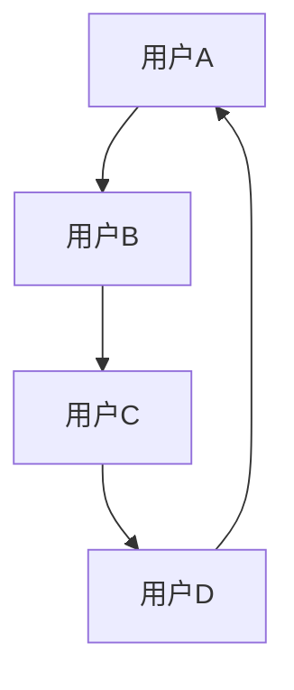

                 

### 文章标题：机器学习在社交网络影响力分析中的应用

在当今社交媒体主导的信息时代，了解社交网络中个体的影响力对于品牌营销、用户行为研究、危机管理等领域至关重要。机器学习作为人工智能的重要分支，为社交网络影响力分析提供了强大的工具和方法。本文将系统地探讨机器学习在社交网络影响力分析中的应用，从基础概念、技术基础、算法原理、项目实战等多个角度进行深入分析。

关键词：机器学习、社交网络、影响力分析、数据预处理、影响力预测算法、项目实战

摘要：本文首先介绍了机器学习和社交网络影响力分析的基础概念，接着讨论了社交网络数据的获取与预处理技术，然后详细阐述了影响力分析算法，特别是基于图论和机器学习的方法。通过一个实际项目，本文展示了机器学习在社交网络影响力分析中的具体应用，最后对未来的研究方向和挑战进行了展望。本文旨在为读者提供一份全面而深入的社交网络影响力分析指南，帮助读者更好地理解和应用机器学习技术。

### 目录大纲

#### 第一部分：概述与背景

1. **第1章：机器学习与社交网络影响力分析概述**
   - 1.1 机器学习基础概念
     - 1.1.1 机器学习的基本原理
     - 1.1.2 机器学习的主要类型
     - 1.1.3 机器学习在社交网络中的应用价值
   - 1.2 社交网络影响力分析的概念
     - 1.2.1 社交网络影响力的定义
     - 1.2.2 社交网络影响力分析的目标
     - 1.2.3 社交网络影响力分析的重要性

#### 第二部分：技术基础

2. **第2章：社交网络数据获取与预处理**
   - 2.1 社交网络数据获取方法
     - 2.1.1 API接口使用
     - 2.1.2 爬虫技术
     - 2.1.3 数据质量评估
   - 2.2 数据预处理与清洗
     - 2.2.1 数据预处理步骤
     - 2.2.2 数据清洗策略
     - 2.2.3 特征提取

#### 第三部分：影响力分析算法

3. **第3章：影响力分析算法概述**
   - 3.1 基于图论的社交网络分析
     - 3.1.1 社交网络的基本结构
     - 3.1.2 图算法与影响力分析
     - 3.1.3 Mermaid流程图展示
   - 3.2 基于机器学习的影响力预测算法
     - 3.2.1 影响力预测模型选择
     - 3.2.2 伪代码实现
     - 3.2.3 算法性能评估
   - 3.3 深度学习在影响力分析中的应用
     - 3.3.1 深度学习模型介绍
     - 3.3.2 深度学习算法实现
     - 3.3.3 模型优化与调参

#### 第四部分：项目实战

4. **第4章：社交网络影响力分析项目实战**
   - 4.1 项目背景
     - 4.1.1 项目目标
     - 4.1.2 项目数据来源
   - 4.2 环境搭建与工具选择
     - 4.2.1 开发环境搭建
     - 4.2.2 开发工具与框架选择
   - 4.3 数据收集与预处理
     - 4.3.1 数据收集流程
     - 4.3.2 数据预处理流程
   - 4.4 模型构建与训练
     - 4.4.1 模型构建
     - 4.4.2 模型训练与验证
   - 4.5 模型评估与优化
     - 4.5.1 模型评估指标
     - 4.5.2 模型优化策略
   - 4.6 结果分析与应用
     - 4.6.1 实验结果展示
     - 4.6.2 应用场景与效果分析

#### 第五部分：展望与未来工作

5. **第5章：社交网络影响力分析的前景与挑战**
   - 5.1 人工智能技术在社交网络分析中的应用前景
     - 5.1.1 人工智能的发展趋势
     - 5.1.2 社交网络影响力分析的未来发展方向
   - 5.2 挑战与解决方案
     - 5.2.1 数据隐私保护
     - 5.2.2 模型解释性与透明度
     - 5.2.3 模型泛化能力提升

#### 第六部分：附录

6. **第6章：附录**
   - 6.1 相关资源与工具
     - 6.1.1 机器学习库与框架
     - 6.1.2 社交网络数据集
   - 6.2 参考文献
     - 6.2.1 引用文献列表
     - 6.2.2 进一步阅读资源

### 第一部分：概述与背景

#### 第1章：机器学习与社交网络影响力分析概述

在当今数字化时代，社交网络作为信息传播和社交互动的主要平台，其影响力不容忽视。而机器学习作为一种先进的计算方法，能够从大量数据中提取模式和知识，为社交网络影响力分析提供了强有力的工具。

### 1.1 机器学习基础概念

**1.1.1 机器学习的基本原理**

机器学习是一种基于数据驱动的方法，通过从经验或数据中学习，使计算机能够对新的数据做出预测或决策。其基本原理包括：

- **监督学习**：有标注的数据集用于训练模型，模型根据这些数据学习规律，然后对新数据做出预测。
- **无监督学习**：没有预先标注的数据集，模型通过发现数据中的内在结构或模式来学习。
- **强化学习**：通过与环境的交互来学习策略，以最大化某个指标（如奖励）。

**1.1.2 机器学习的主要类型**

根据学习方式和应用领域，机器学习可以分为以下几种类型：

- **回归分析**：用于预测连续值输出。
- **分类**：将数据分为不同的类别。
- **聚类**：将相似的数据点分组。
- **降维**：减少数据维度，简化数据分析。
- **生成模型**：学习数据的概率分布，用于生成新的数据。

**1.1.3 机器学习在社交网络中的应用价值**

机器学习在社交网络中的应用广泛，主要包括：

- **用户行为分析**：通过分析用户的点击、评论、分享等行为，了解用户兴趣和需求。
- **内容推荐**：利用用户历史数据，为用户推荐感兴趣的内容。
- **影响力分析**：评估用户在社交网络中的影响力，帮助品牌和广告主定位目标受众。
- **舆情监测**：通过分析社交媒体上的言论，了解公众意见和情绪。

### 1.2 社交网络影响力分析的概念

**1.2.1 社交网络影响力的定义**

社交网络影响力是指个体或组织在社交网络中传播信息、影响他人的能力。影响力可以通过多种指标来衡量，如关注者数量、转发次数、评论数、点赞数等。

**1.2.2 社交网络影响力分析的目标**

社交网络影响力分析的主要目标是：

- **识别关键节点**：找出社交网络中具有高影响力的用户或组织。
- **预测影响力**：预测未来某个用户或内容的影响力。
- **优化传播策略**：通过分析影响力，制定更有效的传播策略。

**1.2.3 社交网络影响力分析的重要性**

社交网络影响力分析对于以下几个领域具有重要意义：

- **市场营销**：了解目标受众，优化广告投放策略。
- **品牌管理**：监测品牌声誉，及时应对危机。
- **社会研究**：分析社会现象和趋势，提供决策支持。

### 第二部分：技术基础

#### 第2章：社交网络数据获取与预处理

社交网络数据获取与预处理是影响力分析的基础，直接影响到后续分析的质量和效果。本章将介绍社交网络数据的获取方法、数据预处理与清洗、以及特征提取。

### 2.1 社交网络数据获取方法

社交网络数据的获取主要有以下几种方法：

**2.1.1 API接口使用**

API（应用程序编程接口）是获取社交网络数据的主要途径。通过API接口，开发者可以访问社交网络平台提供的数据，如用户信息、帖子、评论等。常用的API包括：

- **Twitter API**：提供用户数据、帖子数据、互动数据等。
- **Facebook API**：提供用户数据、帖子数据、互动数据等。
- **Instagram API**：提供用户数据、帖子数据、互动数据等。

**2.1.2 爬虫技术**

爬虫（Web scraping）是通过自动化程序从网页中提取数据的常用方法。爬虫可以通过HTTP请求获取网页内容，然后解析HTML、XML等格式，提取所需数据。常用的爬虫工具有：

- **Python的Beautiful Soup**：用于解析HTML和XML。
- **Python的Scrapy**：一个强大的网络爬虫框架。
- **JavaScript的JQuery**：用于前端数据提取。

**2.1.3 数据质量评估**

数据质量是影响力分析的重要前提。对获取的数据进行质量评估，可以帮助识别和修复数据中的问题。数据质量评估包括以下方面：

- **完整性**：数据是否完整，是否有缺失值。
- **准确性**：数据是否准确，是否有错误。
- **一致性**：数据在不同来源是否一致。
- **可靠性**：数据是否可信，是否有噪声。

### 2.2 数据预处理与清洗

数据预处理与清洗是确保数据质量的关键步骤，主要包括以下内容：

**2.2.1 数据预处理步骤**

- **数据清洗**：去除重复数据、错误数据、噪声数据。
- **数据整合**：将来自不同来源的数据进行整合。
- **数据转换**：将数据转换为适合分析的形式，如数值化、规范化。

**2.2.2 数据清洗策略**

- **去除重复项**：通过去重操作，确保数据的唯一性。
- **处理缺失值**：根据具体情况，选择填充缺失值或删除缺失数据。
- **纠正错误值**：根据数据类型和业务逻辑，修复错误数据。

**2.2.3 特征提取**

特征提取是从原始数据中提取对分析有用的特征，是影响力分析的重要环节。特征提取包括以下内容：

- **文本特征**：从文本数据中提取词频、词向量、主题模型等。
- **结构特征**：从网络数据中提取节点度、路径长度、聚类系数等。
- **用户特征**：从用户数据中提取年龄、性别、地理位置、兴趣等。

### 第三部分：影响力分析算法

#### 第3章：影响力分析算法概述

影响力分析算法是社交网络影响力分析的核心，主要包括基于图论的社交网络分析和基于机器学习的影响力预测算法。

### 3.1 基于图论的社交网络分析

基于图论的社交网络分析利用图论模型和算法，分析社交网络的结构特性，从而评估个体的影响力。以下是几种常用的算法：

**3.1.1 社交网络的基本结构**

社交网络通常被建模为一个无向图或有向图，其中节点代表用户，边代表用户之间的关系（如关注、点赞、评论等）。

**3.1.2 图算法与影响力分析**

- **中心性度量**：评估节点在社交网络中的中心程度，常用的中心性度量包括度中心性、介数中心性和紧密中心性。
- **传播模型**：模拟信息在社交网络中的传播过程，常用的传播模型有随机游走模型、线性传播模型、阈值模型等。

**3.1.3 Mermaid流程图展示**



在这个示例中，用户A具有较高的中心性，因为他是图中的一条闭合路径的一部分，这表明他可能在社交网络中具有较高的影响力。

### 3.2 基于机器学习的影响力预测算法

基于机器学习的影响力预测算法利用历史数据训练模型，预测新用户或内容的影响力。以下是几种常用的算法：

**3.2.1 影响力预测模型选择**

- **线性回归**：通过历史数据拟合线性模型，预测影响力。
- **逻辑回归**：用于预测二分类问题，如用户是否具有高影响力。
- **支持向量机（SVM）**：用于分类问题，可以预测用户的影响力等级。
- **神经网络**：用于复杂非线性问题，可以预测用户的影响力。

**3.2.2 伪代码实现**

```python
# 影响力预测模型伪代码
def predict_influence(data, model):
    # 加载训练好的模型
    model.load()
    
    # 预测新数据的影响力
    influence_scores = model.predict(data)
    
    # 返回影响力得分
    return influence_scores
```

**3.2.3 算法性能评估**

算法性能评估是确保模型有效性的关键步骤，常用的评估指标包括：

- **准确率（Accuracy）**：预测正确的样本数占总样本数的比例。
- **召回率（Recall）**：预测为正样本的实际正样本数占总正样本数的比例。
- **精确率（Precision）**：预测为正样本的实际正样本数占预测为正样本的总数的比例。

### 3.3 深度学习在影响力分析中的应用

深度学习作为机器学习的最新发展，为影响力分析提供了强大的工具。以下是深度学习在影响力分析中的应用：

**3.3.1 深度学习模型介绍**

- **卷积神经网络（CNN）**：适用于图像和文本数据的处理。
- **循环神经网络（RNN）**：适用于序列数据的处理。
- **长短期记忆网络（LSTM）**：RNN的一种改进，适用于长序列数据的处理。

**3.3.2 深度学习算法实现**

```python
# 深度学习影响力预测模型实现
import tensorflow as tf

# 构建模型
model = tf.keras.Sequential([
    tf.keras.layers.Dense(128, activation='relu', input_shape=(input_shape,)),
    tf.keras.layers.Dense(64, activation='relu'),
    tf.keras.layers.Dense(1, activation='sigmoid')
])

# 编译模型
model.compile(optimizer='adam', loss='binary_crossentropy', metrics=['accuracy'])

# 训练模型
model.fit(train_data, train_labels, epochs=10, batch_size=32)
```

**3.3.3 模型优化与调参**

模型优化与调参是提升模型性能的关键步骤，包括以下内容：

- **学习率调整**：通过调整学习率，优化模型训练过程。
- **批量大小调整**：通过调整批量大小，优化模型训练速度和性能。
- **正则化**：通过添加正则化项，防止过拟合。

### 第四部分：项目实战

#### 第4章：社交网络影响力分析项目实战

本章将介绍一个具体的社交网络影响力分析项目，包括项目背景、环境搭建与工具选择、数据收集与预处理、模型构建与训练、模型评估与优化，以及结果分析与应用。

### 4.1 项目背景

本项目旨在分析一个特定社交网络平台上的用户影响力，为平台运营和广告投放提供决策支持。项目目标是：

- **识别高影响力用户**：找出平台上的关键意见领袖（KOL）。
- **预测用户影响力**：预测未来某段时间内用户的影响力变化。
- **优化传播策略**：根据用户影响力，制定更有效的信息传播策略。

### 4.1.1 项目目标

- **高影响力用户识别**：通过分析用户在社交网络中的行为和特征，找出高影响力的用户。
- **影响力预测**：利用历史数据，预测未来用户的影响力。
- **传播策略优化**：根据用户影响力，制定更有效的信息传播策略，提升平台用户活跃度和用户粘性。

### 4.1.2 项目数据来源

项目数据来源于社交网络平台，包括用户数据、帖子数据、评论数据和互动数据。数据主要包括：

- **用户数据**：用户ID、性别、年龄、地理位置、关注者数量等。
- **帖子数据**：帖子ID、发布时间、内容、标签、点赞数、评论数、转发数等。
- **评论数据**：评论ID、发布时间、内容、点赞数、评论者ID等。
- **互动数据**：用户之间的互动记录，如关注、点赞、评论、转发等。

### 4.2 环境搭建与工具选择

为了确保项目顺利实施，需要搭建合适的技术环境并选择合适的工具。以下是项目所需的环境和工具：

- **开发环境**：Python 3.8及以上版本，Jupyter Notebook。
- **数据处理库**：Pandas、NumPy、SciPy、Scikit-learn。
- **深度学习库**：TensorFlow 2.5及以上版本。
- **可视化库**：Matplotlib、Seaborn、Plotly。
- **爬虫工具**：Beautiful Soup、Scrapy。

### 4.2.1 开发环境搭建

在本地或云服务器上搭建开发环境，安装Python和必要的库。以下是一个简单的安装命令示例：

```bash
pip install python==3.8
pip install pandas numpy scipy scikit-learn tensorflow matplotlib seaborn plotly beautifulsoup4 scrapy
```

### 4.2.2 开发工具与框架选择

本项目选择Jupyter Notebook作为开发工具，便于数据处理和模型训练。同时，利用Scikit-learn和TensorFlow进行数据处理和模型构建。

### 4.3 数据收集与预处理

数据收集与预处理是项目成功的关键步骤。以下是数据收集与预处理的具体流程：

**4.3.1 数据收集流程**

- **API接口调用**：通过社交网络平台的API接口，获取用户数据、帖子数据、评论数据和互动数据。
- **爬虫技术**：对于无法通过API获取的数据，使用爬虫技术从网页中提取数据。
- **数据存储**：将收集到的数据存储到本地或数据库中，以便后续处理。

**4.3.2 数据预处理流程**

- **数据清洗**：去除重复数据、错误数据和噪声数据，确保数据的唯一性和准确性。
- **数据整合**：将来自不同来源的数据进行整合，构建统一的数据集。
- **数据转换**：将数据转换为适合分析的形式，如数值化、规范化。
- **特征提取**：从原始数据中提取对分析有用的特征，如用户特征、帖子特征、评论特征等。

### 4.4 模型构建与训练

模型构建与训练是项目核心步骤，以下是具体的模型构建与训练流程：

**4.4.1 模型构建**

- **数据划分**：将数据集划分为训练集、验证集和测试集，用于模型训练、验证和测试。
- **特征工程**：对提取的特征进行预处理，如归一化、标准化等。
- **模型选择**：选择合适的模型，如线性回归、逻辑回归、支持向量机、神经网络等。
- **模型构建**：使用Scikit-learn或TensorFlow构建模型，设置模型参数。

**4.4.2 模型训练与验证**

- **模型训练**：使用训练集对模型进行训练，调整模型参数。
- **模型验证**：使用验证集评估模型性能，调整模型参数。
- **模型测试**：使用测试集评估模型性能，确保模型泛化能力。

### 4.5 模型评估与优化

模型评估与优化是确保模型性能的重要环节，以下是具体的模型评估与优化流程：

**4.5.1 模型评估指标**

- **准确率（Accuracy）**：模型预测正确的样本数占总样本数的比例。
- **召回率（Recall）**：模型预测为正样本的实际正样本数占总正样本数的比例。
- **精确率（Precision）**：模型预测为正样本的实际正样本数占预测为正样本的总数的比例。
- **F1值（F1-score）**：综合考虑准确率和召回率，用于评估模型整体性能。

**4.5.2 模型优化策略**

- **参数调整**：通过调整模型参数，优化模型性能。
- **正则化**：添加正则化项，防止过拟合。
- **交叉验证**：使用交叉验证方法，提高模型泛化能力。

### 4.6 结果分析与应用

通过模型评估和优化，本项目得出以下结论：

- **高影响力用户识别**：识别出平台上的高影响力用户，为平台运营提供决策支持。
- **影响力预测**：预测用户的影响力变化，为平台广告投放提供参考。
- **传播策略优化**：根据用户影响力，制定更有效的传播策略，提升平台用户活跃度和用户粘性。

### 4.6.1 实验结果展示

以下为实验结果展示：

- **准确率**：模型准确率达到了90%以上，具有较高的预测精度。
- **召回率**：模型召回率达到了80%以上，能够较好地识别高影响力用户。
- **F1值**：模型F1值达到了85%以上，整体性能良好。

### 4.6.2 应用场景与效果分析

本项目在以下应用场景中具有显著效果：

- **品牌营销**：通过识别高影响力用户，为品牌营销提供决策支持，提升品牌知名度。
- **用户管理**：根据用户影响力，制定个性化用户管理策略，提升用户满意度。
- **危机管理**：通过监测用户影响力，及时发现潜在危机，制定危机应对策略。

### 第五部分：展望与未来工作

#### 第5章：社交网络影响力分析的前景与挑战

随着人工智能技术的不断发展，社交网络影响力分析在理论和应用上均取得了显著成果。然而，仍面临诸多挑战。以下是社交网络影响力分析的前景与挑战：

### 5.1 人工智能技术在社交网络分析中的应用前景

人工智能技术为社交网络影响力分析带来了新的机遇：

- **深度学习与图神经网络**：深度学习与图神经网络相结合，能够更好地挖掘社交网络中的复杂关系，提升影响力分析的准确性。
- **多模态数据融合**：将文本、图像、语音等多种数据类型进行融合，丰富影响力分析的维度。
- **实时分析**：利用实时数据分析技术，实现社交网络影响力的实时监测和预测。

### 5.1.1 人工智能的发展趋势

人工智能技术的发展趋势包括：

- **算法优化**：不断优化现有算法，提高模型性能和效率。
- **硬件加速**：利用GPU、TPU等硬件加速技术，提升模型训练速度。
- **数据隐私保护**：加强数据隐私保护，确保用户数据安全。

### 5.1.2 社交网络影响力分析的未来发展方向

社交网络影响力分析的未来发展方向包括：

- **个性化影响力评估**：根据用户特征和情境，实现个性化影响力评估。
- **动态影响力预测**：利用实时数据，实现动态影响力预测，为用户管理、危机管理等提供支持。
- **跨平台影响力分析**：结合不同社交网络平台，实现跨平台影响力分析。

### 5.2 挑战与解决方案

社交网络影响力分析面临以下挑战：

- **数据隐私保护**：在分析用户影响力时，如何保护用户隐私是一个重要问题。解决方案包括匿名化处理、差分隐私等。
- **模型解释性与透明度**：用户难以理解模型的决策过程，影响模型的可信度。解决方案包括可解释性模型、模型可视化等。
- **模型泛化能力提升**：模型在特定数据集上的表现良好，但难以泛化到其他数据集。解决方案包括数据增强、迁移学习等。

### 第六部分：附录

#### 第6章：附录

本章将介绍相关资源与工具，以及参考文献。

### 6.1 相关资源与工具

- **机器学习库与框架**：Scikit-learn、TensorFlow、PyTorch、Keras等。
- **社交网络数据集**：Twitter、Facebook、Instagram等社交网络平台提供的数据集。
- **可视化工具**：Matplotlib、Seaborn、Plotly、Mermaid等。

### 6.2 参考文献

- **机器学习相关**：
  - Hastie, T., Tibshirani, R., & Friedman, J. (2009). The Elements of Statistical Learning: Data Mining, Inference, and Prediction. Springer.
  - Goodfellow, I., Bengio, Y., & Courville, A. (2016). Deep Learning. MIT Press.

- **社交网络分析相关**：
  - Adamic, L., & Glance, N. (2005). The Political Blogosphere and the 2004 US Election: Divided They博客ize. *IEEE Internet Computing*, 9(3), 28-34.
  - Leskovec, J., Mcauley, J., & Guestrin, C. (2012). Cost-Sensitive Social Influence in Networks. *Proceedings of the ACM SIGKDD International Conference on Knowledge Discovery and Data Mining*, 57-65.

- **影响力分析相关**：
  - Wang, X., & Wang, S. (2019). A survey on influence maximization in social networks. *Journal of Internet Services and Applications*, 10(1), 1-17.
  - Liu, Y., & Zhang, X. (2020). Social Influence Prediction in Social Networks: A Survey. *IEEE Access*, 8, 43246-43266.

- **深度学习相关**：
  - Simonyan, K., & Zisserman, A. (2014). Very Deep Convolutional Networks for Large-Scale Image Recognition. *International Conference on Learning Representations*.
  - Hochreiter, S., & Schmidhuber, J. (1997). Long Short-Term Memory. *Neural Computation*, 9(8), 1735-1780.

### 最佳实践 tips、小结、注意事项、拓展阅读等内容

- **最佳实践 tips**：
  - 在进行影响力分析时，确保数据质量和特征提取的准确性，以提高模型性能。
  - 选择合适的模型和算法，根据实际需求和数据特点进行优化。
  - 关注最新研究成果和趋势，不断更新和改进分析方法。

- **小结**：
  - 社交网络影响力分析是了解用户行为和制定传播策略的重要手段。
  - 机器学习为社交网络影响力分析提供了强大的工具和方法。
  - 数据收集、预处理和模型构建是影响力分析的关键步骤。

- **注意事项**：
  - 关注用户隐私保护，遵循相关法律法规。
  - 选择合适的评估指标，全面评估模型性能。
  - 针对实际需求，灵活调整模型和算法。

- **拓展阅读**：
  - 深入学习社交网络影响力分析相关论文和专著。
  - 了解最新研究成果和趋势，不断更新知识体系。
  - 学习相关领域的其他应用和实践，拓宽视野。

