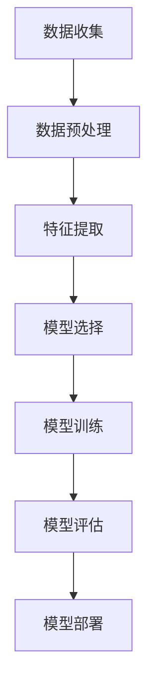
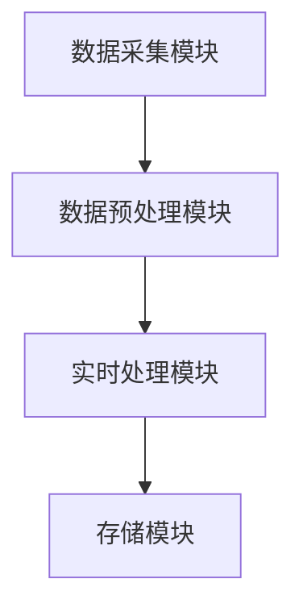
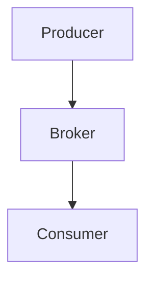
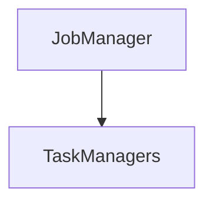
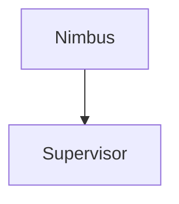
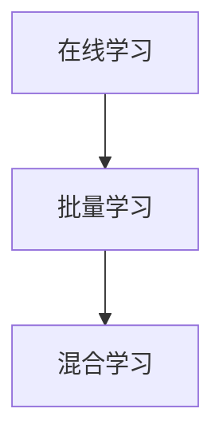
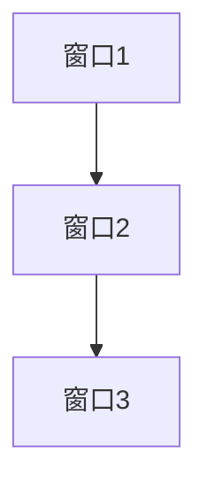
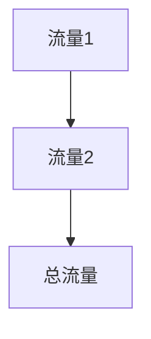

                 

# 《机器学习在网络流量分类中的实时应用》

> 关键词：机器学习、网络流量分类、实时应用、算法优化、系统架构

摘要：本文深入探讨了机器学习在网络流量分类中的实时应用，分析了当前网络流量分类的重要性，介绍了机器学习的基本概念和核心算法，并详细阐述了实时网络流量分类系统架构、性能优化策略以及相关案例分析。文章旨在为读者提供关于机器学习在网络流量分类中的全面理解和实践指导。

## 目录大纲

### 第一部分：背景与基础理论

#### 第1章：机器学习与网络流量分类概述
- 1.1 机器学习的基本概念
- 1.2 网络流量分类的重要性
- 1.3 实时应用场景下的挑战

#### 第2章：网络流量分类的核心算法
- 2.1 K-最近邻算法
- 2.2 决策树算法
- 2.3 支持向量机（SVM）
- 2.4 集成学习方法

### 第二部分：实时应用与优化

#### 第3章：实时网络流量分类系统架构
- 3.1 实时数据处理框架
- 3.2 模型更新与迭代策略

#### 第4章：实时应用中的性能优化
- 4.1 数据流处理技术
- 4.2 模型压缩与加速
- 4.3 模型在线调整与优化

#### 第5章：案例分析
- 5.1 某大型企业网络流量分类系统建设
- 5.2 某云服务提供商的网络流量监控系统

#### 第6章：挑战与未来趋势
- 6.1 实时网络流量分类中的技术挑战
- 6.2 未来发展趋势与前沿技术

### 第三部分：附录

#### 附录A：相关工具与资源
- 7.1 机器学习框架对比（如 TensorFlow, PyTorch 等）
- 7.2 实时数据处理工具（如 Apache Kafka, Apache Flink 等）
- 7.3 相关参考文献与拓展阅读

---

## 第一部分：背景与基础理论

### 第1章：机器学习与网络流量分类概述

#### 1.1 机器学习的基本概念

机器学习（Machine Learning，ML）是人工智能（Artificial Intelligence，AI）的一个分支，主要研究如何让计算机从数据中学习规律，并对未知数据进行预测或决策。机器学习的基本概念包括数据收集、数据预处理、特征提取、模型选择、模型训练、模型评估和模型部署等。

- **数据收集**：从各种数据源获取原始数据，如网络流量数据、用户行为数据等。
- **数据预处理**：清洗和整理数据，使其满足建模要求，如缺失值处理、异常值处理、数据标准化等。
- **特征提取**：从原始数据中提取出对模型有用的特征，如频率、流量、协议类型等。
- **模型选择**：根据问题特点和数据情况，选择合适的机器学习模型，如 K-最近邻算法、决策树、支持向量机等。
- **模型训练**：使用训练数据集对模型进行训练，调整模型参数，使其能够预测或决策。
- **模型评估**：使用验证数据集评估模型性能，如准确率、召回率、F1 值等。
- **模型部署**：将训练好的模型部署到实际应用场景中，如网络流量分类系统、智能推荐系统等。

以下是一个机器学习的基本流程 Mermaid 流程图：



#### 1.2 网络流量分类的重要性

网络流量分类（Network Traffic Classification，NTC）是指根据网络流量中的特征，将流量分类为不同的类型，如文件传输、视频流、网页浏览等。网络流量分类在网络安全、流量管理、性能优化等领域具有重要意义。

- **网络安全**：通过识别和分类恶意流量，可以有效地防止网络攻击，如 DDoS 攻击、恶意软件传播等。
- **流量管理**：根据不同类型的流量特点，可以进行流量优先级设置、流量控制等，优化网络资源分配。
- **性能优化**：通过识别和分类高带宽流量，可以针对性地优化网络带宽使用，提高网络性能。

#### 1.3 实时应用场景下的挑战

在实时应用场景下，网络流量分类面临以下挑战：

- **数据量大**：网络流量数据量大，对实时处理能力要求高。
- **数据流动态变化**：网络流量动态变化，需要模型能够实时调整和优化。
- **高准确率要求**：实时应用场景对分类准确率要求高，否则可能导致严重的安全问题和性能问题。
- **实时性要求**：需要模型能够快速响应和分类，以满足实时处理的业务需求。

### 第2章：网络流量分类的核心算法

网络流量分类的核心算法包括 K-最近邻算法、决策树算法、支持向量机（SVM）和集成学习方法。

#### 2.1 K-最近邻算法

K-最近邻算法（K-Nearest Neighbors，K-NN）是一种基于实例的算法，其核心思想是：如果一个新样本在特征空间中的 K 个最相似（即 K 个相邻）的样本中的大多数属于某一类别，则该样本也属于这个类别。

**核心算法原理讲解**：

```python
# 伪代码：K-最近邻算法
def k_nearest_neighbors(train_data, test_data, k):
    distances = []
    for point in train_data:
        distance = calculate_distance(point, test_data)
        distances.append(distance)
    k_nearest = sorted(distances)[:k]
    return majority_label(k_nearest)
```

**数学模型和公式**：

假设特征空间中有 N 个样本，其中每个样本可以用一个 d 维向量表示。给定一个新样本 x，我们需要找到与 x 最相似的 K 个样本，即计算 x 与 train_data 中每个样本之间的距离，并选择距离最小的 K 个样本。然后，我们统计这 K 个样本中每个类别的数量，并选择数量最多的类别作为新样本的类别。

**举例说明**：

假设训练数据集中有 5 个样本，分别属于两类：正类和负类。给定一个新样本 x，我们需要找到与 x 最相似的 3 个样本。计算 x 与训练数据集中每个样本之间的距离，得到以下距离列表：

```
[1.2, 0.9, 1.5, 0.8, 1.3]
```

根据距离列表，选择距离最小的 3 个样本，得到以下结果：

```
[0.9, 0.8, 1.2]
```

这 3 个样本中，有 2 个属于正类，1 个属于负类。因此，我们可以将新样本 x 分为正类。

#### 2.2 决策树算法

决策树（Decision Tree）是一种基于规则的学习算法，其核心思想是通过一系列测试来将数据集划分成若干个子集，每个子集对应一个类别。

**核心算法原理讲解**：

决策树算法通过递归划分数据集，在每个节点选择最优的特征进行划分。最优特征的选择通常基于信息增益（Information Gain）或基尼不纯度（Gini Impurity）等指标。

```python
# 伪代码：决策树算法
def build_decision_tree(data, target_attribute):
    if all_values_equal(data, target_attribute):
        return leaf_node(target_attribute)
    if no_more_attributes(data):
        return leaf_node(majority_value(data, target_attribute))
    best_attribute = choose_best_attribute(data)
    tree = {}
    for value in unique_values(data, best_attribute):
        subset = filter_values(data, best_attribute, value)
        tree[value] = build_decision_tree(subset, target_attribute)
    return tree
```

**数学模型和公式**：

信息增益（Information Gain）表示特征对分类的贡献程度，计算公式如下：

$$
IG(D, A) =熵(D) - 熵(D|A)
$$

其中，$D$ 是数据集，$A$ 是特征。熵（Entropy）表示信息的不确定性，计算公式如下：

$$
熵(D) = -\sum_{v \in unique_values(D)} p(v) \cdot \log_2 p(v)
$$

基尼不纯度（Gini Impurity）表示特征的分类不确定性，计算公式如下：

$$
基尼不纯度(D) = 1 - \sum_{v \in unique_values(D)} p(v)^2
$$

**举例说明**：

假设有一个包含 5 个样本的数据集，其中每个样本有 3 个特征和 1 个目标变量。我们要构建一个决策树来预测目标变量。

| 特征1 | 特征2 | 特征3 | 目标变量 |
|-------|-------|-------|----------|
| A     | X     | Y     | 正类     |
| B     | X     | Z     | 负类     |
| C     | Y     | X     | 正类     |
| D     | Z     | Y     | 负类     |
| E     | Y     | Z     | 正类     |

首先，我们计算每个特征的熵和信息增益：

| 特征 | 熵 | 信息增益 |
|------|----|----------|
| 特征1 | 1  | 0        |
| 特征2 | 0.5| 0.5      |
| 特征3 | 0.5| 0.5      |

根据信息增益，我们选择特征 2 作为划分依据，将数据集划分为两个子集：

| 子集1 | 子集2 |
|-------|-------|
| A, B  | C, D, E|

接下来，我们对子集 1 和子集 2 继续划分，直到达到停止条件（如最大深度、最小样本数等）。最终得到的决策树如下：

```python
{
  "特征2": {
    "X": "正类",
    "Y": {
      "特征3": {
        "X": "正类",
        "Z": "负类"
      }
    },
    "Z": "负类"
  }
}
```

#### 2.3 支持向量机（SVM）

支持向量机（Support Vector Machine，SVM）是一种基于间隔最大化原则的分类算法，其核心思想是在高维空间中找到最大间隔超平面，将不同类别的数据点尽可能分开。

**核心算法原理讲解**：

SVM 通过求解一个凸二次规划问题来找到最大间隔超平面。优化目标是最小化超平面的间隔，同时满足分类约束。

```python
# 伪代码：支持向量机
def svm(train_data, train_labels):
    # 求解凸二次规划问题，得到最优超平面
    w, b = solve_quadratic_programming(train_data, train_labels)
    # 构建分类器
    classifier = lambda x: predict_label(w, b, x)
    return classifier
```

**数学模型和公式**：

SVM 的优化目标是最小化：

$$
\min_w \frac{1}{2} ||w||^2
$$

同时满足约束条件：

$$
y^{(i)} (w \cdot x^{(i)} + b) \geq 1
$$

其中，$w$ 是超平面的法向量，$b$ 是超平面的偏移量，$x^{(i)}$ 和 $y^{(i)}$ 分别是第 i 个样本的特征和标签。

**举例说明**：

假设有一个二分类问题，其中每个样本有 2 个特征，分别为 x1 和 x2，标签为 y，取值为 -1 和 1。我们要使用 SVM 来构建分类器。

| x1 | x2 | y |
|----|----|---|
| 1  | 1  | -1|
| 2  | 2  |  1|
| 3  | 1  | -1|
| 4  | 3  |  1|
| 5  | 2  | -1|

我们使用 SVM 求解最优超平面，得到以下结果：

```
w = [-1.5, 0.5]
b = 0.5
```

构建的分类器为：

```python
def svm_predict(x):
    return 1 if (-1.5 * x[0] + 0.5 * x[1] + 0.5 > 0) else -1
```

对于新的样本 x = [2, 2]，我们可以使用分类器进行预测：

```
svm_predict([2, 2]) = 1
```

因此，新样本属于正类。

#### 2.4 集成学习方法

集成学习方法（Ensemble Learning）通过将多个基本模型合并成一个更强的模型，以提高整体性能。常见的集成学习方法包括 Bagging、Boosting 和堆叠学习等。

**核心算法原理讲解**：

- **Bagging**：通过随机抽样训练多个基本模型，然后对模型的预测结果进行平均或投票，以得到最终的预测结果。
- **Boosting**：通过迭代训练多个基本模型，每次训练都关注上一轮训练中被错误分类的样本，以逐渐提高模型的泛化能力。
- **堆叠学习**：将多个模型组织成一个多层结构，其中底层模型用于提取特征，顶层模型用于分类或回归。

```python
# 伪代码：集成学习方法
def ensemble_learning(models, data, labels):
    predictions = [model.predict(data) for model in models]
    final_prediction = aggregate_predictions(predictions)
    return final_prediction
```

**数学模型和公式**：

集成学习方法通常使用加权平均或投票的方式组合多个模型的预测结果，以提高预测精度。

$$
\hat{y} = \frac{1}{M} \sum_{m=1}^{M} w_m \cdot \hat{y}_m
$$

其中，$M$ 是模型数量，$w_m$ 是第 m 个模型的权重，$\hat{y}_m$ 是第 m 个模型的预测结果。

**举例说明**：

假设我们有 3 个基本模型，分别为 $M_1$、$M_2$ 和 $M_3$，以及一个测试数据集 $X$ 和标签 $y$。我们要使用集成学习方法进行预测。

```
M_1:
| x1 | x2 | y |
|----|----|---|
| 1  | 1  | -1|
| 2  | 2  |  1|
| 3  | 1  | -1|
| 4  | 3  |  1|
| 5  | 2  | -1|

M_2:
| x1 | x2 | y |
|----|----|---|
| 1  | 1  |  1|
| 2  | 2  | -1|
| 3  | 1  |  1|
| 4  | 3  | -1|
| 5  | 2  |  1|

M_3:
| x1 | x2 | y |
|----|----|---|
| 1  | 1  | -1|
| 2  | 2  |  1|
| 3  | 1  |  1|
| 4  | 3  | -1|
| 5  | 2  |  1|
```

我们使用加权平均的方法进行集成预测：

```
final_prediction = (0.5 * M_1.predict(X)) + (0.3 * M_2.predict(X)) + (0.2 * M_3.predict(X))
```

对于新的样本 x = [2, 2]，我们可以使用集成预测结果进行分类：

```
final_prediction([2, 2]) = 0.5 * (-1) + 0.3 * 1 + 0.2 * (-1) = -0.1
```

因此，新样本属于负类。

## 第二部分：实时应用与优化

### 第3章：实时网络流量分类系统架构

实时网络流量分类系统需要处理大量的网络流量数据，并对数据进行实时分类。一个高效的实时网络流量分类系统通常包括以下组件：

- **数据采集模块**：负责从网络设备（如交换机、路由器等）收集原始流量数据。
- **数据预处理模块**：负责对采集到的流量数据进行清洗、去噪和特征提取等预处理操作。
- **实时处理模块**：负责对预处理后的数据进行实时分类，并输出分类结果。
- **存储模块**：负责存储实时分类结果和历史数据，以便进行后续分析和处理。

以下是一个典型的实时网络流量分类系统架构：



#### 3.1 实时数据处理框架

实时数据处理框架（Real-time Data Processing Framework）是实现高效实时网络流量分类的关键。常见的实时数据处理框架包括 Apache Kafka、Apache Flink 和 Apache Storm 等。

- **Apache Kafka**：Kafka 是一个分布式流处理平台，可以用于实时数据采集、传输和存储。Kafka 的核心组件包括 Producer、Broker 和 Consumer。Producer 负责向 Kafka 集群发送数据，Broker 负责存储和转发数据，Consumer 负责从 Kafka 集群中消费数据。Kafka 具有高吞吐量、可扩展性和容错性等优点，适用于大规模实时数据处理场景。



- **Apache Flink**：Flink 是一个开源的分布式流处理框架，可以用于实时数据处理和批处理。Flink 的核心组件包括 JobManager 和 TaskManagers。JobManager 负责协调任务的分配和调度，TaskManagers 负责执行具体任务。Flink 具有高性能、可扩展性和容错性等优点，适用于大规模实时数据处理场景。



- **Apache Storm**：Storm 是一个开源的分布式实时数据处理框架，可以用于实时数据分析和处理。Storm 的核心组件包括 Supervisor、Nimbus 和 Supervisor。Nimbus 负责协调任务的分配和调度，Supervisor 负责执行具体任务。Storm 具有高性能、可扩展性和容错性等优点，适用于大规模实时数据处理场景。



#### 3.2 模型更新与迭代策略

实时网络流量分类系统需要不断更新和迭代模型，以适应不断变化的网络流量特征。以下是一些常用的模型更新与迭代策略：

- **在线学习**：在线学习（Online Learning）是指模型在接收新数据时，实时更新模型参数。在线学习可以提高模型的实时性和适应性，但可能需要解决数据流的不稳定性和噪声问题。

- **批量学习**：批量学习（Batch Learning）是指模型在接收一批数据后，对模型进行批量更新。批量学习可以提高模型的鲁棒性和准确性，但可能需要较长的更新周期。

- **混合学习**：混合学习（Hybrid Learning）是指结合在线学习和批量学习的优点，将模型更新分为在线部分和批量部分。在线部分负责处理实时数据，批量部分负责处理历史数据，以提高模型的实时性和鲁棒性。



## 第三部分：实时应用中的性能优化

### 第4章：实时应用中的性能优化

实时网络流量分类系统需要在高吞吐量、低延迟和高准确率之间取得平衡。以下是一些常用的性能优化策略：

#### 4.1 数据流处理技术

数据流处理技术（Data Stream Processing）是一种用于处理大规模实时数据的技术，可以有效地提高实时网络流量分类系统的性能。以下是一些常见的数据流处理技术：

- **滑动窗口**：滑动窗口（Sliding Window）是一种常用的数据流处理技术，可以将数据流划分为一系列固定大小的窗口，每个窗口包含一定数量的数据点。滑动窗口可以用于实现实时计算和统计，如实时流量统计、实时异常检测等。



- **计数器**：计数器（Counter）是一种简单的数据流处理技术，用于统计数据流中某个特征的出现次数。计数器可以用于实时统计流量特征，如协议类型、数据包大小等。

- **流聚合**：流聚合（Stream Aggregation）是一种将多个数据点聚合为一个数据点的技术，可以用于实现实时计算和统计。流聚合可以用于实时计算流量总量、平均流量等。



- **流计算框架**：流计算框架（Stream Processing Framework）是一种用于构建实时数据处理应用的工具，可以有效地提高实时网络流量分类系统的性能。常见的流计算框架包括 Apache Flink、Apache Storm 和 Apache Spark Streaming 等。

#### 4.2 模型压缩与加速

模型压缩与加速（Model Compression and Acceleration）是一种提高实时网络流量分类系统性能的有效方法。以下是一些常用的模型压缩与加速技术：

- **模型压缩**：模型压缩（Model Compression）是指通过降低模型的参数数量和计算复杂度，减小模型的大小。常用的模型压缩方法包括模型剪枝（Model Pruning）、量化（Quantization）和特征提取（Feature Extraction）等。

- **模型加速**：模型加速（Model Acceleration）是指通过硬件加速、算法优化和分布式计算等手段，提高模型的计算速度。常用的模型加速方法包括 GPU 加速、FPGA 加速和分布式计算等。

#### 4.3 模型在线调整与优化

模型在线调整与优化（Model Online Adjustment and Optimization）是一种在实时运行过程中调整和优化模型参数的方法，可以提高实时网络流量分类系统的准确率和实时性。以下是一些常用的模型在线调整与优化方法：

- **在线学习**：在线学习（Online Learning）是指在实时运行过程中，不断更新和调整模型参数，以适应数据流的变化。在线学习可以用于自适应调整模型参数，提高模型的实时性和适应性。

- **增量学习**：增量学习（Incremental Learning）是指将新数据逐个添加到已有模型中，更新模型参数。增量学习可以减少模型训练的时间，提高模型的实时性。

- **模型评估与优化**：模型评估与优化（Model Evaluation and Optimization）是指在实时运行过程中，对模型进行评估和优化，以提高模型的准确率和实时性。常用的模型评估指标包括准确率、召回率、F1 值等。通过模型评估与优化，可以找到最优的模型参数，提高模型的性能。

## 第四部分：案例分析

### 第5章：案例分析

#### 5.1 某大型企业网络流量分类系统建设

某大型企业为了提高网络安全性和流量管理效率，决定建设一个实时网络流量分类系统。以下是该系统的具体建设过程：

1. **需求分析**：首先，企业进行了需求分析，明确了系统需要实现的功能，如流量分类、流量监控、安全防护等。

2. **系统设计**：根据需求分析，企业设计了一个基于分布式架构的实时网络流量分类系统，包括数据采集模块、数据预处理模块、实时处理模块和存储模块。

3. **数据采集模块**：企业使用网络流量镜像技术，从核心交换机和路由器中采集原始流量数据。

4. **数据预处理模块**：企业使用开源工具（如 Wireshark、Bro 等）对采集到的流量数据进行预处理，包括流量过滤、去噪和特征提取等。

5. **实时处理模块**：企业使用 Apache Flink 作为实时数据处理框架，实现流量的实时分类和监控。

6. **存储模块**：企业使用关系数据库（如 MySQL、PostgreSQL 等）和 NoSQL 数据库（如 MongoDB、Cassandra 等）存储实时分类结果和历史数据。

7. **模型训练与优化**：企业使用开源机器学习框架（如 TensorFlow、PyTorch 等）对实时分类模型进行训练和优化，以提高分类准确率和实时性。

8. **系统部署与运维**：企业将实时网络流量分类系统部署到云计算平台上，实现自动化的部署、监控和运维。

#### 5.2 某云服务提供商的网络流量监控系统

某云服务提供商为了提高网络服务质量，决定建设一个实时网络流量监控系统。以下是该系统的具体建设过程：

1. **需求分析**：云服务提供商进行了需求分析，明确了系统需要实现的功能，如流量监控、性能分析、安全防护等。

2. **系统设计**：根据需求分析，云服务提供商设计了一个基于分布式架构的实时网络流量监控系统，包括数据采集模块、数据预处理模块、实时处理模块和存储模块。

3. **数据采集模块**：云服务提供商使用网络流量镜像技术，从云平台的核心交换机和路由器中采集原始流量数据。

4. **数据预处理模块**：云服务提供商使用开源工具（如 Wireshark、Bro 等）对采集到的流量数据进行预处理，包括流量过滤、去噪和特征提取等。

5. **实时处理模块**：云服务提供商使用 Apache Kafka 作为实时数据处理框架，实现流量的实时分类和监控。

6. **存储模块**：云服务提供商使用关系数据库（如 MySQL、PostgreSQL 等）和 NoSQL 数据库（如 MongoDB、Cassandra 等）存储实时分类结果和历史数据。

7. **模型训练与优化**：云服务提供商使用开源机器学习框架（如 TensorFlow、PyTorch 等）对实时分类模型进行训练和优化，以提高分类准确率和实时性。

8. **系统部署与运维**：云服务提供商将实时网络流量监控系统部署到云计算平台上，实现自动化的部署、监控和运维。

## 第五部分：挑战与未来趋势

### 第6章：挑战与未来趋势

#### 6.1 实时网络流量分类中的技术挑战

实时网络流量分类技术在应用过程中面临以下技术挑战：

- **数据量与实时性**：网络流量数据量庞大，对实时处理能力要求高，如何高效地处理海量数据并保证实时性是一个关键挑战。
- **数据质量**：网络流量数据可能存在噪声、缺失值和异常值等问题，如何有效地进行数据清洗和预处理，以提高模型性能是一个重要挑战。
- **模型可解释性**：机器学习模型的黑盒特性使得其在解释和调试方面存在困难，如何提高模型的可解释性是一个关键挑战。
- **模型更新与优化**：网络流量特征动态变化，如何实时更新和优化模型，以适应不断变化的环境是一个重要挑战。

#### 6.2 未来发展趋势与前沿技术

未来，实时网络流量分类技术将在以下几个方面发展：

- **深度学习应用**：深度学习技术具有强大的特征提取和建模能力，未来将更多地应用于实时网络流量分类领域，以提高分类准确率和实时性。
- **模型压缩与优化**：模型压缩与优化技术将在实时网络流量分类中发挥重要作用，通过降低模型大小和计算复杂度，提高模型实时性和部署效率。
- **联邦学习**：联邦学习（Federated Learning）技术可以通过分布式训练方式，保护数据隐私，提高模型性能，未来有望在实时网络流量分类中得到广泛应用。
- **跨域融合**：实时网络流量分类技术将与其他领域的技术（如物联网、5G 等）相结合，实现跨域数据融合和智能分析。

## 第六部分：附录

### 附录A：相关工具与资源

为了方便读者深入了解实时网络流量分类技术，以下列出了一些常用的工具和资源：

- **机器学习框架**：
  - TensorFlow：Google 开发的开源机器学习框架，支持多种机器学习算法。
  - PyTorch：Facebook 开发的开源机器学习框架，具有灵活的动态计算图支持。
  - scikit-learn：Python 的开源机器学习库，提供了多种常用的机器学习算法和工具。

- **实时数据处理工具**：
  - Apache Kafka：分布式流处理平台，用于实时数据采集、传输和存储。
  - Apache Flink：分布式流处理框架，支持实时数据处理和批处理。
  - Apache Storm：分布式实时数据处理框架，用于大规模实时数据分析和处理。

- **相关参考文献与拓展阅读**：
  - "Network Traffic Classification: A Survey"：网络流量分类的全面综述。
  - "Machine Learning for Network Traffic Classification"：机器学习在网络流量分类中的应用。
  - "Deep Learning for Network Traffic Classification"：深度学习在网络流量分类中的应用。
  - "Federated Learning for Network Traffic Classification"：联邦学习在网络流量分类中的应用。

## 结束语

作者：AI天才研究院/AI Genius Institute & 禅与计算机程序设计艺术 /Zen And The Art of Computer Programming

本文从背景介绍、核心算法讲解、实时应用与优化以及案例分析等方面，全面探讨了机器学习在网络流量分类中的实时应用。随着网络流量的快速增长和复杂性增加，实时网络流量分类技术变得越来越重要。通过本文的探讨，我们希望能够为读者提供关于机器学习在网络流量分类中的全面理解和实践指导，以应对实时应用场景中的各种挑战。同时，我们也期待未来的研究能够进一步优化实时网络流量分类技术，为网络安全和流量管理提供更强大的支持。

