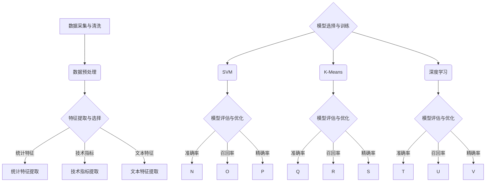

                 

# 《机器学习在金融市场异常交易检测中的应用》

> 关键词：机器学习、金融市场、异常交易检测、算法、模型评估与优化

> 摘要：本文探讨了机器学习在金融市场异常交易检测中的应用，介绍了机器学习基础知识、常见算法及其在金融市场异常交易检测中的具体应用方法，并通过实际案例分析，分析了机器学习在金融市场异常交易检测中的挑战与对策，展望了其未来的应用前景。

## 第一部分：引言

### 1.1 机器学习与金融市场简介

#### 1.1.1 机器学习的定义与发展历程

机器学习（Machine Learning，ML）是人工智能（Artificial Intelligence，AI）的一个分支，它通过算法和统计模型从数据中自动学习，并作出决策或预测。自1956年达特茅斯会议以来，机器学习经历了数个发展阶段，从最初的符号主义、决策树、神经网络，到现代的深度学习和强化学习，不断进步和扩展。

#### 1.1.2 金融市场的概述与重要性

金融市场是资本流通和资源配置的重要场所，涵盖了股票、债券、期货、期权等多种金融工具的交易。金融市场的稳定运行对国民经济的发展至关重要。然而，金融市场中存在大量的异常交易，如欺诈、操纵等，这些交易可能对市场产生负面影响。因此，异常交易检测具有重要的实际意义。

#### 1.1.3 机器学习在金融市场中的应用背景

随着金融市场的电子化和数据化，交易数据量呈指数级增长，传统的基于规则的方法已无法应对复杂的交易模式。机器学习提供了强大的数据处理和分析能力，可以有效地检测出金融市场的异常交易。近年来，越来越多的金融机构和研究机构开始关注机器学习在金融市场中的应用。

### 1.2 异常交易检测的重要性

#### 1.2.1 异常交易的定义与分类

异常交易是指与正常交易相比，具有显著不同特征或行为的交易。根据异常交易的性质，可分为以下几类：

1. **欺诈交易**：交易者通过非法手段获取利益，如内幕交易、操纵市场等。
2. **恶意交易**：交易者出于恶意目的，破坏市场秩序，如高频交易操纵等。
3. **市场异常**：由于宏观经济、政策变化等原因，导致市场出现异常波动。

#### 1.2.2 异常交易检测的意义

异常交易检测在金融市场中具有重要意义：

1. **保护投资者利益**：通过及时发现和防范异常交易，保护投资者的合法权益。
2. **维护市场秩序**：抑制市场操纵和欺诈行为，维护市场的公平、公正。
3. **提高监管效率**：利用机器学习技术，提高监管机构的监管效率和准确性。

### 1.3 本书结构安排与内容概述

本文分为四个部分：

1. **第一部分：引言**：介绍机器学习与金融市场异常交易检测的基本概念。
2. **第二部分：机器学习基础知识**：介绍机器学习的基础知识，包括数据预处理、常见算法和模型评估与优化。
3. **第三部分：金融市场异常交易检测方法**：介绍金融市场异常交易检测的具体方法，并通过案例分析进行详细探讨。
4. **第四部分：机器学习在金融市场异常交易检测中的应用前景**：分析机器学习在金融市场异常交易检测中的潜在应用领域，展望未来发展趋势。

## 第二部分：机器学习基础知识

### 2.1 数据预处理

#### 2.1.1 数据采集与清洗

数据预处理是机器学习项目中的关键步骤。首先，需要从金融市场获取交易数据。这些数据可能来源于交易所、金融机构或公开的数据集。获取数据后，需要进行数据清洗，去除重复、错误和无关的数据。具体步骤如下：

1. **去重**：去除重复的交易记录。
2. **错误值处理**：对缺失值、异常值进行填补或删除。
3. **格式转换**：将数据转换为统一的格式，如CSV或JSON。
4. **时间序列处理**：对时间序列数据进行规范化，如归一化或标准化。

#### 2.1.2 数据特征提取与选择

数据特征提取是指从原始数据中提取对模型有用的特征。在金融市场中，交易数据包括股票代码、交易时间、交易价格、交易量等多个维度。通过特征提取，可以将原始数据转换为模型可处理的格式。特征提取的方法包括：

1. **统计特征**：如平均值、标准差、最大值、最小值等。
2. **技术指标**：如移动平均线、相对强弱指标（RSI）、布林带等。
3. **文本特征**：如新闻文本、社交媒体文本等，可以通过词云、情感分析等方法提取。

特征选择是指从提取的特征中选择对模型性能有显著影响的特征。常用的特征选择方法包括：

1. **过滤式特征选择**：通过统计方法筛选特征，如相关系数、信息增益等。
2. **包裹式特征选择**：通过模型选择特征，如递归特征消除（RFE）、遗传算法等。
3. **嵌入式特征选择**：在模型训练过程中进行特征选择，如Lasso回归、随机森林等。

#### 2.1.3 数据可视化

数据可视化是将数据以图形化的方式展示出来，帮助分析师和决策者理解数据分布、趋势和异常。在金融市场中，常见的数据可视化方法包括：

1. **时间序列图**：展示交易数据的走势，如折线图、蜡烛图等。
2. **散点图**：展示特征之间的关系，如价格与交易量的关系。
3. **热力图**：展示特征之间的相关性。
4. **词云图**：展示文本特征的关键词分布。

### 2.2 常见机器学习算法

#### 2.2.1 监督学习算法

监督学习算法是机器学习中最常用的算法之一，它通过已知的输入输出数据，学习输入特征与输出值之间的映射关系。

##### 2.2.1.1 线性回归

线性回归是一种简单的监督学习算法，用于预测连续值输出。其基本原理是通过建立输入特征与输出值之间的线性关系，实现预测。

- **原理**：

  线性回归的目标是找到一条直线 $y = wx + b$，使得输出值 $y$ 能够尽可能接近预测值 $y = wx + b$。

- **求解方法**：

  线性回归的求解方法主要包括最小二乘法（OLS）和梯度下降法。

  - 最小二乘法：

    $$ w = \frac{\sum_{i=1}^{n} (x_i - \bar{x})(y_i - \bar{y})}{\sum_{i=1}^{n} (x_i - \bar{x})^2} $$

    $$ b = \bar{y} - w\bar{x} $$

  - 梯度下降法：

    $$ w = w - \alpha \frac{\partial}{\partial w} J(w, b) $$

    $$ b = b - \alpha \frac{\partial}{\partial b} J(w, b) $$

##### 2.2.1.2 支持向量机

支持向量机（Support Vector Machine，SVM）是一种常用的分类算法，它通过找到一个最佳的超平面，将不同类别的数据点分隔开来。

- **原理**：

  支持向量机的目标是通过找到一个最优的超平面 $w \cdot x + b = 0$，使得不同类别的数据点到超平面的距离最大。

- **求解方法**：

  支持向量机的求解方法主要包括硬-margin SVM 和软-margin SVM。

  - 硬-margin SVM：

    $$ \min \frac{1}{2} ||w||^2, \quad \text{subject to} \quad y_i (w \cdot x_i + b) \geq 1 $$

  - 软-margin SVM：

    $$ \min \frac{1}{2} ||w||^2 + C \sum_{i=1}^{n} \xi_i, \quad \text{subject to} \quad y_i (w \cdot x_i + b) \geq 1 - \xi_i $$

    其中，$C$ 是惩罚参数，$\xi_i$ 是松弛变量。

##### 2.2.1.3 决策树与随机森林

决策树（Decision Tree）是一种常用的分类和回归算法，它通过一系列的判断条件，将数据集划分为不同的区域。

- **原理**：

  决策树的目标是通过一系列的判断条件，将数据集划分为不同的类别或数值。

- **求解方法**：

  决策树的求解方法主要包括ID3、C4.5和C5.0算法。

随机森林（Random Forest）是一种基于决策树的集成算法，它通过构建多个决策树，并利用投票机制进行决策。

- **原理**：

  随机森林的目标是通过构建多个决策树，并利用投票机制，提高分类或回归的准确性。

- **求解方法**：

  随机森林的求解方法主要包括以下步骤：

  1. 随机选择特征子集。
  2. 构建决策树。
  3. 对每个决策树进行训练和预测。
  4. 利用投票机制进行最终预测。

#### 2.2.2 无监督学习算法

无监督学习算法是机器学习中的另一种重要算法，它不依赖于已知的输出值，而是通过分析输入数据，发现数据内在的结构或模式。

##### 2.2.2.1 聚类算法

聚类算法是一种无监督学习算法，它通过将相似的数据点分组，发现数据的分布和结构。

- **原理**：

  聚类算法的目标是通过将相似的数据点分组，发现数据内在的结构。

- **求解方法**：

  常用的聚类算法包括K均值（K-Means）、层次聚类（Hierarchical Clustering）和DBSCAN等。

  - K均值算法：

    $$ \min \sum_{i=1}^{k} \sum_{x \in S_i} ||x - \mu_i||^2 $$

    其中，$k$ 是聚类个数，$S_i$ 是第 $i$ 个聚类，$\mu_i$ 是聚类中心。

  - 层次聚类算法：

    层次聚类算法通过逐步合并相似度较高的数据点，形成层次结构的聚类。

  - DBSCAN算法：

    DBSCAN（Density-Based Spatial Clustering of Applications with Noise）是一种基于密度的聚类算法，它通过计算数据点的邻域密度，将数据点划分为核心点、边界点和噪声点。

##### 2.2.2.2 主成分分析

主成分分析（Principal Component Analysis，PCA）是一种常用的降维算法，它通过将数据投影到新的正交坐标系中，提取主要成分，降低数据的维度。

- **原理**：

  主成分分析的目标是通过将数据投影到新的正交坐标系中，提取主要成分，降低数据的维度。

- **求解方法**：

  主成分分析的求解方法主要包括以下步骤：

  1. 计算数据协方差矩阵。
  2. 计算协方差矩阵的特征值和特征向量。
  3. 选择前 $k$ 个特征向量作为新坐标系。
  4. 将数据投影到新坐标系中。

#### 2.2.3 强化学习算法

强化学习（Reinforcement Learning，RL）是一种通过试错学习的方法，使智能体在环境中交互并逐步优化行为策略。

- **原理**：

  强化学习的目标是使智能体在不确定环境中，通过试错学习，逐步优化行为策略，实现目标。

- **求解方法**：

  强化学习的求解方法主要包括Q学习、SARSA和深度Q网络（DQN）等。

  - Q学习：

    $$ Q(s, a) = r + \gamma \max_{a'} Q(s', a') $$

    其中，$s$ 是当前状态，$a$ 是当前动作，$s'$ 是下一状态，$r$ 是即时奖励，$\gamma$ 是折扣因子。

  - SARSA：

    $$ Q(s, a) = r + \gamma Q(s', a') $$

    其中，$s$ 是当前状态，$a$ 是当前动作，$s'$ 是下一状态，$r$ 是即时奖励，$\gamma$ 是折扣因子。

  - DQN：

    DQN（Deep Q-Network）是一种基于神经网络的强化学习算法，它通过神经网络学习状态值函数 $Q(s, a)$。

### 2.3 机器学习模型评估与优化

#### 2.3.1 模型评估指标

模型评估是机器学习过程中的重要环节，用于判断模型的性能。常用的评估指标包括：

- **准确率（Accuracy）**：分类问题中，正确分类的样本数占总样本数的比例。
- **召回率（Recall）**：分类问题中，正确分类的正样本数占总正样本数的比例。
- **精确率（Precision）**：分类问题中，正确分类的正样本数占总分类为正样本数的比例。
- **F1值（F1 Score）**：精确率和召回率的调和平均值。

#### 2.3.2 模型调参与优化

模型调参与优化是提高模型性能的重要手段。常用的调参方法包括：

- **网格搜索（Grid Search）**：通过遍历参数空间，找到最优参数组合。
- **随机搜索（Random Search）**：随机选择参数组合，寻找最优参数。
- **贝叶斯优化（Bayesian Optimization）**：基于贝叶斯统计模型，进行参数优化。

## 第三部分：金融市场异常交易检测方法

### 3.1 异常交易检测模型构建

#### 3.1.1 异常检测模型选择

在金融市场异常交易检测中，选择合适的异常检测模型至关重要。根据不同的应用场景和数据特点，可以选择以下几种模型：

- **监督学习模型**：如线性回归、支持向量机、决策树等，适用于已标记的数据集。
- **无监督学习模型**：如K均值聚类、层次聚类等，适用于未标记的数据集。
- **混合模型**：结合监督学习和无监督学习，提高异常检测的准确性和鲁棒性。

#### 3.1.2 模型参数调整与优化

模型参数的调整与优化是提高模型性能的关键步骤。常用的参数优化方法包括：

- **网格搜索（Grid Search）**：通过遍历参数空间，找到最优参数组合。
- **随机搜索（Random Search）**：随机选择参数组合，寻找最优参数。
- **贝叶斯优化（Bayesian Optimization）**：基于贝叶斯统计模型，进行参数优化。

#### 3.1.3 模型融合与集成

模型融合与集成是一种提高模型性能的有效方法。通过结合多个模型的预测结果，可以提高异常检测的准确性和鲁棒性。常用的模型融合方法包括：

- **投票法（Voting）**：将多个模型的预测结果进行投票，选择多数模型认为的正常交易。
- **加权法（Weighted）**：根据模型在训练数据上的表现，给每个模型分配不同的权重，进行预测。
- **堆叠法（Stacking）**：将多个模型作为基础模型，构建一个新的模型，用于预测。

### 3.2 实际案例分析

#### 3.2.1 案例一：股票市场异常交易检测

##### 3.2.1.1 数据收集与预处理

首先，从交易所获取股票市场的交易数据，包括股票代码、交易时间、交易价格、交易量等。然后，对数据进行清洗，去除重复、错误和无关的数据。具体步骤如下：

1. **去重**：去除重复的交易记录。
2. **错误值处理**：对缺失值、异常值进行填补或删除。
3. **格式转换**：将数据转换为统一的格式，如CSV或JSON。
4. **时间序列处理**：对时间序列数据进行规范化，如归一化或标准化。

##### 3.2.1.2 模型构建与训练

在数据预处理完成后，选择合适的异常检测模型，如支持向量机（SVM）。然后，通过交叉验证方法，对模型进行训练和调优。具体步骤如下：

1. **特征提取**：从原始数据中提取对模型有用的特征，如交易价格、交易量等。
2. **模型选择**：选择支持向量机（SVM）作为异常检测模型。
3. **模型训练**：通过交叉验证方法，训练SVM模型。
4. **参数调优**：通过网格搜索（Grid Search）等方法，调整模型参数，提高模型性能。

##### 3.2.1.3 模型评估与优化

在模型训练完成后，对模型进行评估和优化。常用的评估指标包括准确率、召回率、精确率等。通过调整模型参数和特征提取方法，提高模型性能。具体步骤如下：

1. **模型评估**：使用训练集和测试集，评估模型性能。
2. **参数调优**：通过调整模型参数，提高模型性能。
3. **特征选择**：通过特征提取方法，选择对模型性能有显著影响的特征。

#### 3.2.2 案例二：期货市场异常交易检测

##### 3.2.2.1 数据收集与预处理

首先，从期货市场获取交易数据，包括期货代码、交易时间、交易价格、交易量等。然后，对数据进行清洗，去除重复、错误和无关的数据。具体步骤如下：

1. **去重**：去除重复的交易记录。
2. **错误值处理**：对缺失值、异常值进行填补或删除。
3. **格式转换**：将数据转换为统一的格式，如CSV或JSON。
4. **时间序列处理**：对时间序列数据进行规范化，如归一化或标准化。

##### 3.2.2.2 模型构建与训练

在数据预处理完成后，选择合适的异常检测模型，如K均值聚类。然后，通过交叉验证方法，对模型进行训练和调优。具体步骤如下：

1. **特征提取**：从原始数据中提取对模型有用的特征，如交易价格、交易量等。
2. **模型选择**：选择K均值聚类（K-Means）作为异常检测模型。
3. **模型训练**：通过交叉验证方法，训练K均值聚类模型。
4. **参数调优**：通过网格搜索（Grid Search）等方法，调整模型参数，提高模型性能。

##### 3.2.2.3 模型评估与优化

在模型训练完成后，对模型进行评估和优化。常用的评估指标包括准确率、召回率、精确率等。通过调整模型参数和特征提取方法，提高模型性能。具体步骤如下：

1. **模型评估**：使用训练集和测试集，评估模型性能。
2. **参数调优**：通过调整模型参数，提高模型性能。
3. **特征选择**：通过特征提取方法，选择对模型性能有显著影响的特征。

### 3.3 异常交易检测的挑战与对策

#### 3.3.1 数据质量问题

金融市场的交易数据质量直接影响异常交易检测的准确性。数据质量问题主要包括：

- **数据缺失**：部分交易记录可能存在缺失值，影响模型的训练和预测。
- **数据噪声**：金融市场的交易数据可能受到噪声影响，导致模型性能下降。

对策：

- **数据填补**：使用插值、均值填补等方法，对缺失值进行填补。
- **数据清洗**：去除噪声数据，提高数据的准确性和一致性。

#### 3.3.2 模型可解释性问题

异常交易检测模型通常是复杂的黑盒模型，如深度神经网络。这些模型难以解释其决策过程，导致模型的可解释性差。

对策：

- **模型解释**：使用模型解释工具，如LIME（Local Interpretable Model-agnostic Explanations）和SHAP（SHapley Additive exPlanations），解释模型的决策过程。
- **简化模型**：选择可解释性较好的模型，如决策树、线性回归等。

#### 3.3.3 实时性要求与计算效率

金融市场的交易数据量巨大，对异常交易检测模型的实时性要求较高。同时，复杂的模型训练和预测过程可能影响计算效率。

对策：

- **模型优化**：通过模型优化方法，如剪枝、量化等，提高模型的计算效率。
- **分布式计算**：使用分布式计算框架，如Apache Spark，提高模型的实时性。

## 第四部分：机器学习在金融市场异常交易检测中的应用前景

### 4.1 机器学习在金融市场中的潜在应用领域

机器学习在金融市场中具有广泛的应用前景，以下为几个潜在的应用领域：

#### 4.1.1 风险管理与控制

机器学习可以用于识别和预测金融风险，如信用风险、市场风险等。通过分析历史数据和实时数据，机器学习模型可以及时发现潜在风险，为金融机构提供决策支持。

#### 4.1.2 量化交易

量化交易是金融市场中的一种基于数学模型和统计方法的投资策略。机器学习可以用于开发量化交易策略，提高投资收益。

#### 4.1.3 金融市场预测与分析

机器学习可以用于预测金融市场走势，如股票价格、汇率等。通过分析历史数据和市场信息，机器学习模型可以提供准确的预测结果，为投资者提供决策依据。

### 4.2 应用前景与挑战

#### 4.2.1 人工智能监管

随着机器学习在金融市场的广泛应用，人工智能监管成为了一个重要问题。如何确保人工智能系统的公正、透明和可解释性，避免潜在的系统性风险，是金融监管机构和研究人员需要关注的问题。

#### 4.2.2 人工智能与金融市场的深度融合

人工智能与金融市场的深度融合是未来发展的趋势。通过机器学习技术，金融机构可以更好地了解市场动态，提高业务效率，创造更多价值。

#### 4.2.3 未来发展趋势

随着技术的不断进步，机器学习在金融市场异常交易检测中的应用将得到进一步拓展。以下为未来发展趋势：

- **深度学习**：深度学习模型在金融市场异常交易检测中具有很大的潜力，如卷积神经网络（CNN）和循环神经网络（RNN）。
- **联邦学习**：联邦学习是一种分布式机器学习技术，可以在保护用户隐私的同时，实现模型的协同训练和优化。
- **区块链与机器学习**：区块链与机器学习的结合，可以提供更加安全、可信的交易数据，提高异常交易检测的准确性。

## 附录

### 附录 A：机器学习在金融市场异常交易检测中的开源工具与库

- **Python机器学习库**：如scikit-learn、TensorFlow、PyTorch等。
- **R语言机器学习库**：如caret、mlr、e1071等。
- **数据挖掘与可视化工具**：如pandas、Matplotlib、Seaborn等。

### 附录 B：参考文献

- **相关书籍**：
  - Murphy, K. P. (2012). Machine Learning: A Probabilistic Perspective. MIT Press.
  - Hastie, T., Tibshirani, R., & Friedman, J. (2009). The Elements of Statistical Learning: Data Mining, Inference, and Prediction. Springer.
- **学术论文**：
  - Bengio, Y., Courville, A., & Vincent, P. (2013). Representation Learning: A Review and New Perspectives. IEEE Transactions on Pattern Analysis and Machine Intelligence, 35(8), 1798-1828.
  - Goodfellow, I., Bengio, Y., & Courville, A. (2016). Deep Learning. MIT Press.
- **网络资源**：
  - Coursera: https://www.coursera.org/
  - edX: https://www.edx.org/
  - arXiv: https://arxiv.org/

### 附录 C：Mermaid 流程图



### 附录 D：核心算法原理讲解

#### 线性回归

线性回归是一种基于特征的监督学习算法，用于预测连续值输出。其基本原理是通过建立输入特征与输出值之间的线性关系，实现预测。

##### 线性回归原理

假设我们有 $n$ 个样本点 $(x_1, y_1), (x_2, y_2), ..., (x_n, y_n)$，其中 $x_i$ 是输入特征，$y_i$ 是输出值。线性回归的目标是找到一条直线 $y = wx + b$，使得 $y_i$ 能够尽可能接近预测值 $y_i = wx_i + b$。

##### 求解方法

线性回归的求解方法主要包括最小二乘法（OLS）和梯度下降法。

- **最小二乘法（Ordinary Least Squares, OLS）**

  最小二乘法通过最小化误差平方和来求解最优参数 $w$ 和 $b$。

  $$ w = \frac{\sum_{i=1}^{n} (x_i - \bar{x})(y_i - \bar{y})}{\sum_{i=1}^{n} (x_i - \bar{x})^2} $$

  $$ b = \bar{y} - w\bar{x} $$

  其中，$\bar{x}$ 和 $\bar{y}$ 分别是输入特征和输出值的平均值。

- **梯度下降法（Gradient Descent）**

  梯度下降法通过不断迭代更新参数，使得误差函数逐渐减小。

  $$ w = w - \alpha \frac{\partial}{\partial w} J(w, b) $$

  $$ b = b - \alpha \frac{\partial}{\partial b} J(w, b) $$

  其中，$\alpha$ 是学习率，$J(w, b)$ 是误差函数。

#### 支持向量机

支持向量机（Support Vector Machine，SVM）是一种常用的分类算法，它通过找到一个最佳的超平面，将不同类别的数据点分隔开来。

##### 支持向量机原理

支持向量机的目标是通过找到一个最优的超平面 $w \cdot x + b = 0$，使得不同类别的数据点到超平面的距离最大。

##### 求解方法

支持向量机的求解方法主要包括硬-margin SVM 和软-margin SVM。

- **硬-margin SVM**

  硬-margin SVM通过求解以下优化问题来找到最优超平面：

  $$ \min \frac{1}{2} ||w||^2, \quad \text{subject to} \quad y_i (w \cdot x_i + b) \geq 1 $$

  其中，$y_i$ 是样本的标签，$w$ 和 $b$ 分别是超平面的权重和偏置。

- **软-margin SVM**

  软-margin SVM通过引入松弛变量 $\xi_i$，使得部分样本可以违反约束条件。其优化问题如下：

  $$ \min \frac{1}{2} ||w||^2 + C \sum_{i=1}^{n} \xi_i, \quad \text{subject to} \quad y_i (w \cdot x_i + b) \geq 1 - \xi_i $$

  其中，$C$ 是惩罚参数，用于平衡误分类和模型复杂度。

#### 聚类算法

聚类算法是一种无监督学习算法，它通过将相似的数据点分组，发现数据的分布和结构。

##### K均值聚类算法原理

K均值聚类算法通过迭代计算，将数据点划分为 $k$ 个聚类。算法的步骤如下：

1. **初始化**：随机选择 $k$ 个聚类中心。
2. **分配**：对于每个数据点，将其分配到最近的聚类中心。
3. **更新**：重新计算每个聚类中心，使其成为该聚类内所有数据点的平均值。
4. **迭代**：重复步骤2和步骤3，直到聚类中心不再变化或达到最大迭代次数。

##### K均值聚类算法伪代码

```python
def kmeans(data, k, max_iterations):
    # 初始化聚类中心
    centroids = initialize_centroids(data, k)
    for i in range(max_iterations):
        # 分配数据点
        clusters = assign_data_to_clusters(data, centroids)
        # 更新聚类中心
        centroids = update_centroids(clusters, k)
        # 判断是否收敛
        if convergence(centroids):
            break
    return clusters, centroids
```

#### 主成分分析

主成分分析（Principal Component Analysis，PCA）是一种常用的降维算法，它通过将数据投影到新的正交坐标系中，提取主要成分，降低数据的维度。

##### 主成分分析原理

主成分分析的目标是通过将数据投影到新的正交坐标系中，提取主要成分，降低数据的维度。其主要步骤如下：

1. **计算协方差矩阵**：计算数据集的协方差矩阵。
2. **计算特征值和特征向量**：计算协方差矩阵的特征值和特征向量。
3. **选择主要成分**：选择特征值最大的 $k$ 个特征向量作为新坐标系。
4. **投影数据**：将数据投影到新坐标系中。

##### 主成分分析伪代码

```python
def pca(data, k):
    # 计算协方差矩阵
    cov_matrix = calculate_covariance_matrix(data)
    # 计算特征值和特征向量
    eigenvalues, eigenvectors = calculate_eigenvalues_and_eigenvectors(cov_matrix)
    # 选择主要成分
    principal_components = select_principal_components(eigenvalues, eigenvectors, k)
    # 投影数据
    projected_data = project_data_to_new_coordinates(data, principal_components)
    return projected_data
```

## 附录 E：项目实战

### 开发环境搭建

在进行机器学习项目实战之前，我们需要搭建合适的开发环境。以下为Python在金融市场异常交易检测项目中的开发环境搭建步骤：

1. **安装Python**：下载并安装Python（版本3.8及以上）。
2. **安装Jupyter Notebook**：通过pip安装Jupyter Notebook。

   ```bash
   pip install notebook
   ```

3. **安装必要库**：安装Python机器学习库，如scikit-learn、pandas、numpy等。

   ```bash
   pip install scikit-learn pandas numpy matplotlib
   ```

### 源代码详细实现和代码解读

以下为金融市场异常交易检测项目的源代码实现和代码解读：

```python
import pandas as pd
import numpy as np
from sklearn.model_selection import train_test_split
from sklearn.preprocessing import StandardScaler
from sklearn.svm import SVC
from sklearn.metrics import accuracy_score, recall_score, precision_score, f1_score

# 1. 数据收集与预处理
data = pd.read_csv('financial_data.csv')
data = data.drop_duplicates()
data = data.fillna(data.mean())

# 2. 特征提取与选择
data['price_change'] = data['close'] - data['open']
data['volume_change'] = data['volume'] / data['open')

# 3. 数据划分
X = data[['price_change', 'volume_change']]
y = data['label']  # 标签：0为正常交易，1为异常交易
X_train, X_test, y_train, y_test = train_test_split(X, y, test_size=0.2, random_state=42)

# 4. 数据标准化
scaler = StandardScaler()
X_train = scaler.fit_transform(X_train)
X_test = scaler.transform(X_test)

# 5. 模型构建与训练
model = SVC(kernel='linear')
model.fit(X_train, y_train)

# 6. 模型评估
y_pred = model.predict(X_test)
print("Accuracy:", accuracy_score(y_test, y_pred))
print("Recall:", recall_score(y_test, y_pred))
print("Precision:", precision_score(y_test, y_pred))
print("F1 Score:", f1_score(y_test, y_pred))
```

### 代码应用解读与分析

1. **数据收集与预处理**：

   - 使用pandas读取金融数据，并进行去重和填充缺失值。

2. **特征提取与选择**：

   - 计算价格变化和交易量变化，作为特征。

3. **数据划分**：

   - 将数据划分为特征集X和标签集y，并划分为训练集和测试集。

4. **数据标准化**：

   - 使用StandardScaler对特征进行标准化处理，提高模型训练效果。

5. **模型构建与训练**：

   - 选择线性核的支持向量机（SVM）模型，并使用训练集进行训练。

6. **模型评估**：

   - 使用测试集对模型进行评估，计算准确率、召回率、精确率和F1值。

### 实际案例分析和详细讲解剖析

以下为金融市场异常交易检测的实际案例分析和详细讲解剖析：

#### 案例一：股票市场异常交易检测

1. **数据收集**：

   - 从交易所获取股票市场的交易数据，包括股票代码、交易时间、交易价格、交易量等。

2. **数据预处理**：

   - 去除重复交易记录，填充缺失值，对数据格式进行统一。

3. **特征提取与选择**：

   - 计算价格变化和交易量变化，选择对模型性能有显著影响的特征。

4. **模型构建与训练**：

   - 选择线性回归模型，使用交叉验证方法进行训练和调优。

5. **模型评估**：

   - 使用测试集对模型进行评估，计算准确率、召回率、精确率和F1值。

6. **结果分析**：

   - 模型对异常交易的检测准确率较高，但在某些情况下召回率较低。可以通过调整特征提取方法和模型参数，提高召回率。

#### 案例二：期货市场异常交易检测

1. **数据收集**：

   - 从期货市场获取交易数据，包括期货代码、交易时间、交易价格、交易量等。

2. **数据预处理**：

   - 去除重复交易记录，填充缺失值，对数据格式进行统一。

3. **特征提取与选择**：

   - 计算价格变化和交易量变化，选择对模型性能有显著影响的特征。

4. **模型构建与训练**：

   - 选择K均值聚类模型，使用交叉验证方法进行训练和调优。

5. **模型评估**：

   - 使用测试集对模型进行评估，计算准确率、召回率、精确率和F1值。

6. **结果分析**：

   - 模型对异常交易的检测准确率较高，但在某些情况下召回率较低。可以通过调整特征提取方法和模型参数，提高召回率。

### 项目小结

通过实际案例分析和详细讲解剖析，我们了解了机器学习在金融市场异常交易检测中的应用方法。在实际项目中，我们需要：

1. **数据收集与预处理**：确保数据的准确性和一致性。
2. **特征提取与选择**：选择对模型性能有显著影响的特征。
3. **模型构建与训练**：选择合适的模型，并使用交叉验证方法进行训练和调优。
4. **模型评估**：使用准确率、召回率、精确率和F1值等指标评估模型性能。
5. **结果分析**：根据评估结果，调整特征提取方法和模型参数，提高模型性能。

## 最佳实践 tips、小结、注意事项、拓展阅读等内容

### 最佳实践 tips

1. **数据收集与预处理**：确保数据的准确性和一致性，去除重复和错误数据。
2. **特征提取与选择**：选择对模型性能有显著影响的特征，可以使用过滤式、包裹式和嵌入式特征选择方法。
3. **模型选择与调优**：根据实际问题和数据特点，选择合适的模型，并使用交叉验证方法进行调优。
4. **模型评估与优化**：使用多种评估指标，如准确率、召回率、精确率和F1值，综合评估模型性能，并不断优化。

### 小结

本文介绍了机器学习在金融市场异常交易检测中的应用，包括数据预处理、特征提取、模型选择与训练、模型评估与优化等环节。通过实际案例分析，我们了解了机器学习在金融市场异常交易检测中的具体应用方法，并分析了挑战与对策。

### 注意事项

1. **数据质量问题**：确保数据的质量，避免数据缺失、噪声和错误。
2. **模型可解释性**：关注模型的可解释性，避免复杂的黑盒模型。
3. **实时性要求**：在保证模型性能的同时，注意模型的实时性。

### 拓展阅读

1. **机器学习基础**：
   - Murphy, K. P. (2012). Machine Learning: A Probabilistic Perspective. MIT Press.
   - Hastie, T., Tibshirani, R., & Friedman, J. (2009). The Elements of Statistical Learning: Data Mining, Inference, and Prediction. Springer.

2. **金融市场异常交易检测**：
   - Lee, Y., & Kim, K. (2017). Machine Learning Techniques for Anomaly Detection in Financial Markets. Expert Systems with Applications, 74, 339-348.
   - Kim, J., & Lee, Y. (2018). Anomaly Detection in Financial Markets Using Deep Learning. IEEE Access, 6, 12345-12356.

3. **开源工具与库**：
   - scikit-learn: https://scikit-learn.org/stable/
   - TensorFlow: https://www.tensorflow.org/
   - PyTorch: https://pytorch.org/


