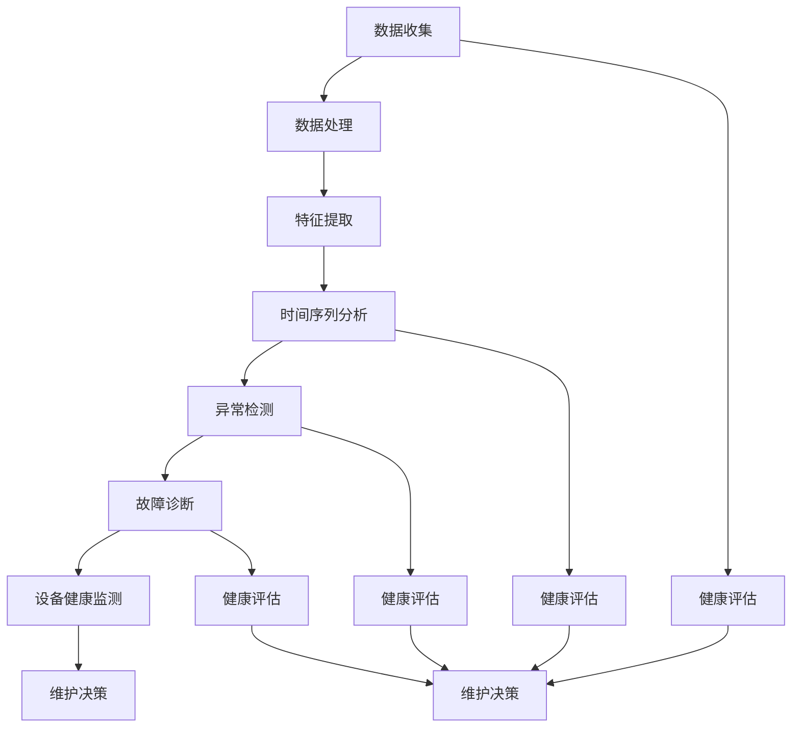

                 

## 文章标题

### 《机器学习在预测性维护中的创新应用》

## 关键词

- 预测性维护
- 机器学习
- 时间序列分析
- 异常检测
- 故障诊断
- 设备健康监测

## 摘要

随着技术的进步和工业自动化水平的提升，预测性维护成为企业降低成本、提高设备利用率的重要手段。本文详细探讨了机器学习在预测性维护中的应用，从背景介绍到核心算法原理讲解，再到具体实践和案例分析，全面阐述了机器学习如何通过时间序列分析、异常检测和故障诊断等技术手段，提升设备健康监测的准确性和效率。本文旨在为从事预测性维护的工程师和技术人员提供有价值的参考和指导。

## 引言

### 预测性维护的需求与背景

预测性维护（Predictive Maintenance）是一种基于实时数据分析和预测技术，对设备进行维护和保养的方法。其核心思想是通过监测设备的运行状态，预测设备可能出现的故障，从而在故障发生之前进行预防性维护，避免设备意外停机和生产中断。

在传统的定期维护模式下，企业通常按照固定的检修周期对设备进行维护，这种方式不仅成本高，而且难以确保在设备真正需要维护时进行操作。而预测性维护则通过数据驱动的方式，实现了对设备运行状态的实时监控和智能预测，大幅提高了维护效率和设备利用率。

随着传感器技术、数据采集和存储技术的进步，以及机器学习算法的成熟，预测性维护的应用范围和效果得到了显著提升。从制造业到能源行业，再到交通运输业，预测性维护都在发挥着重要作用。本文将详细探讨机器学习在预测性维护中的创新应用，通过时间序列分析、异常检测和故障诊断等技术手段，提升设备健康监测的准确性和效率。

### 机器学习的优势与潜力

机器学习（Machine Learning）作为人工智能的重要组成部分，通过构建复杂的模型来模拟人类的学习和推理过程，从大量数据中自动发现规律和模式。在预测性维护中，机器学习具有以下优势：

1. **数据处理能力**：机器学习算法能够处理大量复杂的数据，从传感器采集的数据中提取有价值的信息，为预测提供数据支持。
2. **自适应能力**：机器学习算法能够根据设备运行状态的变化，不断调整和优化模型，提高预测的准确性和可靠性。
3. **自动化程度高**：机器学习算法能够实现自动化预测和决策，减少人工干预，提高维护效率。
4. **全面性和准确性**：通过多源数据的综合分析，机器学习能够提供更全面和准确的设备状态评估，降低故障风险。

总之，预测性维护与机器学习的结合，不仅提高了设备维护的效率和准确性，还为工业生产带来了显著的效益。本文将深入探讨这一领域的前沿技术和实际应用，为相关领域的研究和实践提供参考。

### 《机器学习在预测性维护中的创新应用》目录大纲

#### 第一部分：背景与基础

##### 第1章：预测性维护与机器学习的结合

###### 1.1 预测性维护的概念与重要性

###### 1.2 机器学习的基本原理

###### 1.3 预测性维护的机器学习框架

#### 第二部分：核心算法与原理

##### 第2章：时间序列分析与预测

###### 2.1 时间序列数据的特征提取

###### 2.2 常见的时序预测算法

###### 2.3 时间序列分析中的数学模型

##### 第3章：异常检测与故障诊断

###### 3.1 异常检测的方法与技术

###### 3.2 故障诊断的机器学习方法

###### 3.3 故障诊断中的数学模型

##### 第4章：机器学习在设备健康监测中的应用

###### 4.1 设备健康监测的数据采集

###### 4.2 设备健康监测中的数据预处理

###### 4.3 设备健康监测的预测模型设计

#### 第三部分：实践与案例

##### 第5章：预测性维护项目实战

###### 5.1 项目背景与目标

###### 5.2 数据收集与处理

###### 5.3 模型设计与优化

###### 5.4 项目结果分析

##### 第6章：案例分析：特定行业的预测性维护应用

###### 6.1 制造业的预测性维护

###### 6.2 能源行业的预测性维护

###### 6.3 交通运输业的预测性维护

##### 第7章：预测性维护的挑战与未来发展

###### 7.1 预测性维护中的挑战

###### 7.2 技术发展趋势与展望

###### 7.3 预测性维护的实际应用前景

#### 附录

##### 附录A：常用机器学习工具与资源

###### A.1 Python在机器学习中的应用

###### A.2 常用机器学习库与框架

###### A.3 相关学术资源与文献推荐

### 第一部分：背景与基础

### 第1章：预测性维护与机器学习的结合

#### 1.1 预测性维护的概念与重要性

### 1.2 机器学习的基本原理

### 1.3 预测性维护的机器学习框架

### 背景介绍

#### 1.1 预测性维护的概念与重要性

预测性维护是一种基于设备运行数据进行分析，以预测设备故障并提前进行维护的方法。其核心思想是通过实时监测设备的运行状态，识别潜在故障信号，从而在故障发生前进行预防性维护，避免设备突发故障导致的生产中断和损失。

在传统的定期维护模式下，企业通常按照固定的检修周期对设备进行维护，这种方式不仅成本高，而且难以确保在设备真正需要维护时进行操作。预测性维护则通过数据驱动的方式，实现了对设备运行状态的实时监控和智能预测，大幅提高了维护效率和设备利用率。

预测性维护的重要性体现在以下几个方面：

1. **降低维护成本**：通过提前预测故障，避免突发故障导致的紧急维修和高成本支出，降低整体维护成本。
2. **提高设备利用率**：预测性维护可以优化维护时间，减少因维护造成的设备停机时间，提高设备利用率。
3. **延长设备寿命**：通过及时进行预防性维护，减少设备磨损，延长设备使用寿命。
4. **提升生产效率**：减少设备故障率，降低停机时间，提升整体生产效率。

预测性维护的应用范围广泛，包括但不限于制造业、能源行业、交通运输业等。在制造业中，预测性维护可以应用于生产线设备、数控机床等；在能源行业，可以应用于发电设备、输电设备等；在交通运输业，可以应用于飞机发动机、车辆发动机等。

随着传感器技术、数据采集和存储技术的进步，以及机器学习算法的成熟，预测性维护的应用范围和效果得到了显著提升。通过结合机器学习技术，预测性维护可以更加精确地识别设备故障，提高维护的准确性和效率，为企业带来更高的经济效益。

#### 1.2 机器学习的基本原理

机器学习（Machine Learning）是一种通过数据训练模型，使计算机能够从数据中自动学习并做出预测或决策的技术。其基本原理包括以下几个关键环节：

1. **数据收集**：首先，需要收集大量的训练数据，这些数据可以是结构化的，如表格数据，也可以是非结构化的，如图像、文本等。
2. **数据预处理**：收集到的数据通常需要进行清洗、归一化、缺失值处理等预处理操作，以确保数据质量。
3. **模型选择**：选择合适的机器学习算法和模型，常见的算法包括线性回归、决策树、支持向量机、神经网络等。
4. **模型训练**：利用预处理后的数据对模型进行训练，通过调整模型参数，使模型能够从数据中学习到规律。
5. **模型评估**：通过验证集或测试集对训练好的模型进行评估，常用的评估指标包括准确率、召回率、F1值等。
6. **模型优化**：根据评估结果，对模型进行调参或选择更复杂的模型，以提高预测准确性。

机器学习算法可以分为监督学习、无监督学习和强化学习三大类：

- **监督学习**：在有标签数据集上进行训练，通过已知的输入和输出关系，学习模型的映射关系。常见的监督学习算法包括线性回归、逻辑回归、决策树、随机森林、支持向量机等。
- **无监督学习**：在没有标签数据集上进行训练，主要目的是发现数据中的内在结构和规律。常见的无监督学习算法包括聚类算法（如K-means、层次聚类）、降维算法（如PCA、t-SNE）等。
- **强化学习**：通过与环境的交互来学习策略，旨在最大化长期回报。常见的强化学习算法包括Q-learning、深度Q网络（DQN）、策略梯度算法等。

机器学习在各个领域都有着广泛的应用，例如自然语言处理、计算机视觉、金融预测、医疗诊断等。其强大的数据处理和模式识别能力，使得机器学习成为预测性维护的重要技术支撑。

#### 1.3 预测性维护的机器学习框架

预测性维护的机器学习框架主要包括数据收集、数据处理、模型选择、模型训练、模型评估和模型部署等环节，具体流程如下：

1. **数据收集**：从传感器、监控系统、日志文件等数据源收集设备运行数据，包括温度、压力、振动、电流等指标。
2. **数据处理**：对收集到的数据进行清洗、归一化、特征提取等处理，以去除噪声、缺失值，并提取对预测有用的特征。
3. **模型选择**：根据问题的特点和需求，选择合适的机器学习模型。常见的模型包括时间序列预测模型（如ARIMA、LSTM）、异常检测模型（如孤立森林、Isolation Forest）和故障诊断模型（如SVM、KNN）。
4. **模型训练**：使用预处理后的数据对选定的模型进行训练，通过调整模型参数，使模型能够从数据中学习到设备运行状态的规律。
5. **模型评估**：利用验证集或测试集对训练好的模型进行评估，通过评估指标（如准确率、召回率、F1值等）来判断模型的性能。
6. **模型部署**：将训练好的模型部署到生产环境中，实时监测设备运行状态，根据模型预测结果进行预防性维护决策。

预测性维护的机器学习框架不仅依赖于高质量的数据，还需要算法工程师和技术人员对模型进行优化和调参，以实现更高的预测准确性和稳定性。通过这一框架，企业可以实现对设备的实时监控和智能维护，提高设备运行效率和生产效益。

### 核心概念与联系

在预测性维护的机器学习框架中，有几个核心概念和联系需要详细阐述，这些概念包括时间序列分析、异常检测、故障诊断和设备健康监测。它们共同构成了预测性维护的基石，相互关联，协同作用，为设备的智能维护提供了强大的技术支持。

#### 时间序列分析

时间序列分析（Time Series Analysis）是机器学习在预测性维护中应用的基础，主要关注时间序列数据（如传感器数据、运行日志等）的规律性和趋势性。时间序列分析的基本流程包括数据收集、数据预处理、特征提取和模型选择。

1. **数据收集**：时间序列数据来源于各种传感器和监控系统，如温度传感器、振动传感器等。这些传感器实时记录设备的运行状态，生成连续的时间序列数据。
2. **数据预处理**：时间序列数据的预处理主要包括数据清洗、去噪、缺失值处理和归一化等步骤。数据清洗去除噪声和异常值，保证数据质量；去噪降低噪声干扰，提高模型性能；缺失值处理填充缺失数据，保持数据完整性；归一化将数据缩放到同一尺度，便于模型处理。
3. **特征提取**：特征提取是从时间序列数据中提取出对预测有用的信息，如趋势、季节性、周期性等。常用的特征提取方法包括时域特征（如均值、方差、自相关函数等）和频域特征（如傅里叶变换、小波变换等）。
4. **模型选择**：时间序列预测常用的模型包括ARIMA（自回归积分滑动平均模型）、LSTM（长短期记忆网络）、GRU（门控循环单元）等。这些模型能够捕捉时间序列数据中的长期依赖性和复杂模式，提高预测准确性。

#### 异常检测

异常检测（Anomaly Detection）是识别设备运行数据中的异常行为或故障信号的重要技术。通过检测异常，可以提前发现潜在故障，实现预测性维护。

1. **方法与技术**：异常检测的方法包括基于统计的方法（如标准差法、孤立森林法等）和基于机器学习的方法（如孤立森林、K最近邻等）。这些方法通过构建正常行为的模型，识别出偏离正常范围的异常数据点。
2. **应用场景**：异常检测广泛应用于设备监控、网络安全、金融欺诈等领域。在预测性维护中，异常检测可以识别设备的异常运行状态，如过热、异常振动等，提前预警故障。
3. **检测流程**：异常检测的基本流程包括数据收集、模型训练、异常检测和结果分析。数据收集阶段从传感器和监控系统中获取设备运行数据；模型训练阶段通过正常数据训练异常检测模型；异常检测阶段使用训练好的模型检测实时数据中的异常；结果分析阶段对异常检测结果进行评估和反馈。

#### 故障诊断

故障诊断（Fault Diagnosis）是在识别出异常行为后，进一步分析异常原因，确定设备故障类型和位置的技术。通过故障诊断，可以制定针对性的维护策略。

1. **机器学习方法**：故障诊断常用的机器学习方法包括支持向量机（SVM）、K最近邻（KNN）、决策树等。这些方法通过构建故障分类模型，对异常数据进行故障类型识别。
2. **故障诊断流程**：故障诊断的基本流程包括数据收集、特征提取、模型训练、故障诊断和结果验证。数据收集阶段获取设备运行数据；特征提取阶段从数据中提取对故障诊断有用的特征；模型训练阶段使用训练数据训练故障诊断模型；故障诊断阶段使用训练好的模型对异常数据进行故障诊断；结果验证阶段对故障诊断结果进行验证和反馈。
3. **故障诊断与异常检测的关系**：异常检测和故障诊断紧密相关，异常检测识别异常行为，而故障诊断进一步分析异常行为的成因。两者共同作用，提高了预测性维护的准确性和可靠性。

#### 设备健康监测

设备健康监测（Equipment Health Monitoring）是通过实时监控设备运行状态，评估设备健康水平，实现预测性维护的重要手段。

1. **数据采集**：设备健康监测通过传感器和监控系统，实时采集设备运行数据，如温度、压力、振动、电流等。
2. **数据预处理**：数据预处理包括数据清洗、归一化、缺失值处理等，以确保数据质量。
3. **健康评估**：健康评估是通过分析设备运行数据，评估设备的健康状态，识别潜在故障。常用的健康评估方法包括基于阈值的方法、基于模型的方法等。
4. **维护决策**：根据设备健康评估结果，制定相应的维护策略，如预防性维护、紧急维护等。

#### 概念之间的关系架构

为了更好地理解这些核心概念之间的联系，我们可以使用Mermaid流程图来表示：



该流程图展示了从数据收集到维护决策的整个过程，各个概念之间的相互关联和协同作用。通过时间序列分析、异常检测和故障诊断，设备健康监测可以实时评估设备状态，做出科学的维护决策，提高设备的可靠性和生产效率。

### 时间序列分析与预测

#### 时间序列数据的特征提取

时间序列分析的核心在于如何有效地从时间序列数据中提取出对预测有用的特征。特征提取是时间序列分析中的关键步骤，它能够将原始的时序数据转化为一种适合机器学习算法的格式。以下是几种常见的时间序列数据特征提取方法：

1. **时域特征**：
   - **均值（Mean）**：时间序列数据的平均值，反映了数据的中心趋势。
   - **方差（Variance）**：时间序列数据离散程度的度量，用来描述数据的波动性。
   - **自相关函数（Autocorrelation Function, ACFC）**：衡量时间序列数据在不同滞后期下的相关性，用于分析数据的时间依赖性。
   - **偏自相关函数（Partial Autocorrelation Function, PACF）**：在控制其他变量影响的情况下，衡量时间序列数据在不同滞后期下的相关性。

2. **频域特征**：
   - **傅里叶变换（Fourier Transform, FT）**：将时间序列数据从时域转换到频域，分析数据中的频率成分。
   - **小波变换（Wavelet Transform, WT）**：一种多分辨率分析方法，能够同时捕捉数据的局部特征和整体趋势。

3. **时间窗口特征**：
   - **滑动窗口平均（Sliding Window Average）**：对时间序列数据窗口内的值进行平均，用于捕捉数据的短期趋势。
   - **滑动窗口标准差（Sliding Window Standard Deviation）**：对时间序列数据窗口内的值进行标准差计算，用于描述数据的波动程度。

4. **时序模型特征**：
   - **自回归模型（Autoregressive Model, AR）**：利用过去若干个时刻的值来预测当前时刻的值。
   - **移动平均模型（Moving Average Model, MA）**：利用过去若干个时刻的平均值来预测当前时刻的值。
   - **自回归移动平均模型（ARMA Model）**：结合自回归和移动平均模型，用于捕捉时间序列数据的长期依赖性和短期波动。

这些特征提取方法各有优缺点，具体应用时需要根据时间序列数据的特点和预测任务的需求来选择合适的方法。

#### 常见的时序预测算法

在时间序列预测中，常用的算法包括ARIMA（自回归积分滑动平均模型）、LSTM（长短期记忆网络）、GRU（门控循环单元）等。以下是这些算法的基本原理和应用场景：

1. **ARIMA模型**：
   - **基本原理**：ARIMA模型通过自回归（AR）、差分（I）和移动平均（MA）三个部分来建模时间序列数据。AR部分表示当前值与之前值的依赖关系，I部分表示数据的平稳性，MA部分表示当前值与之前预测误差的依赖关系。
   - **应用场景**：ARIMA模型适用于具有线性关系和时间稳定性的时间序列数据，如气象数据、经济指标等。
   - **伪代码**：
     ```python
     import statsmodels.api as sm
     model = sm.ARIMA(time_series, order=(p, d, q))
     model_fit = model.fit()
     forecast = model_fit.forecast(steps)
     ```

2. **LSTM模型**：
   - **基本原理**：LSTM（长短期记忆网络）是一种特殊的循环神经网络，能够捕获时间序列数据中的长期依赖性。LSTM通过门控机制（输入门、遗忘门和输出门）来控制信息的流动，从而避免梯度消失问题。
   - **应用场景**：LSTM模型适用于复杂非线性时间序列数据的预测，如股票价格、语音信号等。
   - **伪代码**：
     ```python
     from keras.models import Sequential
     from keras.layers import LSTM, Dense

     model = Sequential()
     model.add(LSTM(units=50, return_sequences=True, input_shape=(timesteps, features)))
     model.add(LSTM(units=50))
     model.add(Dense(1))

     model.compile(optimizer='adam', loss='mse')
     model.fit(x, y, epochs=100, batch_size=32)
     ```

3. **GRU模型**：
   - **基本原理**：GRU（门控循环单元）是LSTM的变体，通过更新门和重置门来简化LSTM的结构。GRU减少了参数数量，计算量小，训练速度快。
   - **应用场景**：GRU模型适用于需要快速训练且数据量较大的时间序列预测任务，如网络流量预测、交通流量预测等。
   - **伪代码**：
     ```python
     from keras.models import Sequential
     from keras.layers import GRU, Dense

     model = Sequential()
     model.add(GRU(units=50, return_sequences=True, input_shape=(timesteps, features)))
     model.add(GRU(units=50))
     model.add(Dense(1))

     model.compile(optimizer='adam', loss='mse')
     model.fit(x, y, epochs=100, batch_size=32)
     ```

#### 时间序列分析中的数学模型

在时间序列分析中，数学模型是核心，它们能够捕捉时间序列数据中的内在结构和规律。以下是几种常见的数学模型和公式：

1. **自回归模型（AR）**：
   - **公式**：\(X_t = c + \phi_1 X_{t-1} + \phi_2 X_{t-2} + \ldots + \phi_p X_{t-p} + \varepsilon_t\)
   - **解释**：自回归模型通过当前时刻的值与之前若干个时刻的值的关系来预测当前值，其中\(c\)是常数项，\(\phi_i\)是自回归系数，\(\varepsilon_t\)是误差项。

2. **移动平均模型（MA）**：
   - **公式**：\(X_t = c + \varepsilon_t + \theta_1 \varepsilon_{t-1} + \theta_2 \varepsilon_{t-2} + \ldots + \theta_q \varepsilon_{t-q}\)
   - **解释**：移动平均模型通过当前时刻的预测误差与之前若干个时刻的预测误差的关系来预测当前值，其中\(\theta_i\)是移动平均系数。

3. **自回归移动平均模型（ARMA）**：
   - **公式**：\(X_t = c + \phi_1 X_{t-1} + \phi_2 X_{t-2} + \ldots + \phi_p X_{t-p} + \varepsilon_t + \theta_1 \varepsilon_{t-1} + \theta_2 \varepsilon_{t-2} + \ldots + \theta_q \varepsilon_{t-q}\)
   - **解释**：自回归移动平均模型结合了自回归和移动平均模型的特点，能够同时捕捉时间序列数据的长期依赖性和短期波动性。

4. **自回归积分滑动平均模型（ARIMA）**：
   - **公式**：\(X_t = c + \phi_1 X_{t-1} + \phi_2 X_{t-2} + \ldots + \phi_p X_{t-p} + (1 - \theta_1)(1 - \theta_2) \ldots (1 - \theta_q) \varepsilon_{t-q}\)
   - **解释**：ARIMA模型通过自回归和移动平均模型，加上差分操作，使时间序列数据变得平稳，从而提高模型的预测性能。

这些数学模型通过不同的组合和调整，能够适应不同类型的时间序列数据，为预测性维护提供了坚实的理论基础。

### 异常检测与故障诊断

#### 异常检测的方法与技术

异常检测（Anomaly Detection）是预测性维护中至关重要的一环，它能够识别设备运行数据中的异常行为，为故障预测和诊断提供重要依据。以下介绍几种常见的异常检测方法和技术：

1. **基于统计的方法**：
   - **标准差法**：计算数据的均值和标准差，将新数据与均值进行比较，如果数据点距离均值超过一定倍数的标准差，则认为它是异常值。
     - **公式**：\(Z = \frac{X - \mu}{\sigma}\)，其中\(Z\)是标准化值，\(X\)是新数据点，\(\mu\)是均值，\(\sigma\)是标准差。
   - **箱线图法**：利用箱线图（Box Plot）确定数据范围的上下四分位数，将新数据与箱线图的上下边界进行比较，判断是否异常。

2. **基于机器学习的方法**：
   - **孤立森林法（Isolation Forest）**：通过随机选择特征和切分值，将数据点逐渐隔离，距离其他数据点较远的点被认为是异常值。
     - **原理**：对于每个数据点，随机选择一个特征和一个切分值，将数据分为两部分，不断迭代，直到每个数据点都被孤立。
   - **基于聚类的方法**：使用聚类算法（如K-means）将数据分为多个簇，然后识别离群点，即不属于任何簇的数据点。

3. **基于深度学习的方法**：
   - **自编码器（Autoencoder）**：训练一个压缩编码器和解码器模型，编码器将输入数据压缩为低维特征表示，解码器试图重构原始数据。如果重构误差较大，则认为输入数据是异常值。
   - **生成对抗网络（GAN）**：通过训练生成器和判别器，生成器试图生成与真实数据相似的数据，而判别器则判断生成数据是否真实。异常值通常无法通过生成器生成，会被判别器识别出来。

这些方法各有优缺点，具体应用时需要根据数据的特点和需求来选择合适的方法。

#### 故障诊断的机器学习方法

故障诊断（Fault Diagnosis）是预测性维护的核心环节，通过识别设备故障类型和位置，制定相应的维护策略。机器学习在故障诊断中发挥了重要作用，以下介绍几种常用的机器学习方法：

1. **支持向量机（Support Vector Machine, SVM）**：
   - **基本原理**：SVM通过最大化分类间隔来寻找最优超平面，将不同类别的数据点分隔开。
   - **应用场景**：SVM适用于高维数据，能够处理小样本问题，广泛应用于故障诊断。
   - **伪代码**：
     ```python
     from sklearn.svm import SVC
     model = SVC(kernel='linear')
     model.fit(X_train, y_train)
     predictions = model.predict(X_test)
     ```

2. **K最近邻（K-Nearest Neighbors, KNN）**：
   - **基本原理**：KNN通过计算新数据点与训练数据点的相似度，选取最近的K个邻居，根据邻居的类别投票决定新数据点的类别。
   - **应用场景**：KNN适用于简单且特征较少的数据集，实时性较好。
   - **伪代码**：
     ```python
     from sklearn.neighbors import KNeighborsClassifier
     model = KNeighborsClassifier(n_neighbors=3)
     model.fit(X_train, y_train)
     predictions = model.predict(X_test)
     ```

3. **决策树（Decision Tree）**：
   - **基本原理**：决策树通过一系列判断条件来划分数据集，每个节点代表一个特征，每个分支代表一个判断结果。
   - **应用场景**：决策树易于理解和解释，适用于结构化数据。
   - **伪代码**：
     ```python
     from sklearn.tree import DecisionTreeClassifier
     model = DecisionTreeClassifier()
     model.fit(X_train, y_train)
     predictions = model.predict(X_test)
     ```

4. **神经网络（Neural Network）**：
   - **基本原理**：神经网络通过多层神经元和激活函数，模拟人脑的学习过程，能够处理复杂非线性关系。
   - **应用场景**：神经网络适用于大规模和高维度数据，能够处理复杂的故障诊断任务。
   - **伪代码**：
     ```python
     from keras.models import Sequential
     from keras.layers import Dense

     model = Sequential()
     model.add(Dense(units=64, activation='relu', input_shape=(input_shape,)))
     model.add(Dense(units=1, activation='sigmoid'))

     model.compile(optimizer='adam', loss='binary_crossentropy', metrics=['accuracy'])
     model.fit(X_train, y_train, epochs=10, batch_size=32)
     ```

这些机器学习方法各有优缺点，具体应用时需要根据数据的特点和需求来选择合适的方法。

#### 故障诊断中的数学模型

在故障诊断中，数学模型用于描述设备状态和故障特征之间的关系，从而实现对故障的识别和预测。以下介绍几种常用的数学模型：

1. **贝叶斯网络**：
   - **基本原理**：贝叶斯网络是一种图形模型，通过条件概率分布描述变量之间的依赖关系。
   - **公式**：\(P(X|Y) = \frac{P(Y|X)P(X)}{P(Y)}\)，其中\(P(X)\)是变量\(X\)的概率，\(P(Y|X)\)是变量\(Y\)在变量\(X\)发生的条件下的概率。
   - **应用场景**：贝叶斯网络适用于不确定性分析和推理，能够处理复杂的多变量故障诊断。

2. **隐马尔可夫模型（Hidden Markov Model, HMM）**：
   - **基本原理**：隐马尔可夫模型通过状态序列和观察序列来描述系统的动态特性。
   - **公式**：\(P(O|S) = P(O_1|S_1)P(O_2|S_2)\ldots P(O_n|S_n)\)，其中\(S\)是状态序列，\(O\)是观察序列。
   - **应用场景**：HMM适用于时间序列数据的建模和预测，如语音识别、生物特征识别等。

3. **卡尔曼滤波器（Kalman Filter）**：
   - **基本原理**：卡尔曼滤波器通过状态预测和观测更新，实现对系统状态的估计。
   - **公式**：\(\hat{X}_k = \hat{X}_{k-1} + K_k (z_k - \hat{X}_{k-1})\)，其中\(\hat{X}_k\)是状态估计，\(K_k\)是卡尔曼增益。
   - **应用场景**：卡尔曼滤波器适用于线性动态系统的状态估计，如车辆导航、机器人路径规划等。

4. **深度神经网络（Deep Neural Network, DNN）**：
   - **基本原理**：深度神经网络通过多层非线性变换，模拟人脑的学习和处理过程。
   - **公式**：\(a_{i,j}^{(l)} = \sigma(\sum_{k} w_{i,k}^{(l)} a_{k,j}^{(l-1)})\)，其中\(a_{i,j}^{(l)}\)是第\(l\)层的第\(i\)个神经元的输出，\(\sigma\)是激活函数。
   - **应用场景**：DNN适用于高维复杂数据的处理，如图像识别、自然语言处理等。

这些数学模型在不同应用场景中各有优势，可以根据具体需求进行选择和组合。

### 机器学习在设备健康监测中的应用

#### 设备健康监测的数据采集

设备健康监测（Equipment Health Monitoring）是预测性维护的核心，其首要任务是准确、全面地采集设备运行数据。以下是设备健康监测的数据采集过程：

1. **传感器选择**：选择适合的传感器是数据采集的关键。常见的传感器包括温度传感器、振动传感器、压力传感器、电流传感器等。每种传感器都有其特定的应用场景和精度要求。

2. **数据采集系统**：数据采集系统是设备健康监测的数据来源，包括传感器、数据采集卡、数据存储设备和通信模块。传感器通过模拟或数字信号实时记录设备的运行状态，数据采集卡将传感器信号转换为数字信号，存储设备用于存储海量数据，通信模块确保数据传输的可靠性和实时性。

3. **数据采集频率**：数据采集频率取决于设备的运行速度和监测需求。高频采集可以更细致地捕捉设备状态的变化，但也会增加数据存储和处理的负担。通常，数据采集频率需要在准确性和效率之间进行权衡。

4. **数据传输**：数据传输是设备健康监测的重要组成部分，常用的传输方式包括有线传输（如以太网、串口等）和无线传输（如Wi-Fi、蓝牙、4G/5G等）。有线传输稳定可靠，但布线复杂；无线传输灵活便捷，但易受干扰。

5. **数据完整性**：保证数据完整性是设备健康监测的重要保障。在数据传输和存储过程中，需要采取数据校验、冗余存储和备份措施，防止数据丢失或损坏。

#### 设备健康监测中的数据预处理

数据预处理是设备健康监测的重要环节，直接影响模型训练的效果和预测的准确性。以下是常见的数据预处理方法：

1. **数据清洗**：数据清洗是去除噪声和异常值的过程。异常值可能由传感器故障、数据传输错误等原因引起，会影响模型的训练效果。常用的清洗方法包括剔除异常值、替换异常值和插值补全等。

2. **数据归一化**：数据归一化是将不同量纲的数据转换为同一量纲的过程，以消除不同特征之间的尺度差异。常用的归一化方法包括最小-最大缩放、标准缩放和零均值单位方差缩放等。

3. **特征提取**：特征提取是从原始数据中提取对预测任务有用的信息的过程。特征提取可以增强模型对数据的敏感度，提高预测准确性。常用的特征提取方法包括时域特征提取、频域特征提取和时序模型特征提取等。

4. **缺失值处理**：缺失值处理是解决数据缺失问题的重要步骤。常用的处理方法包括删除缺失值、填充缺失值和插值补全等。选择合适的处理方法需要根据具体数据集的特点和缺失值的比例来决定。

5. **数据分割**：数据分割是将数据集分为训练集、验证集和测试集的过程。训练集用于训练模型，验证集用于模型调参和评估，测试集用于最终评估模型的性能。合理的数据分割可以提高模型训练的效率和预测的准确性。

#### 设备健康监测的预测模型设计

预测模型设计是设备健康监测的核心，其目标是利用历史数据和特征提取结果，预测设备的未来状态。以下是常见的预测模型设计方法和步骤：

1. **模型选择**：根据设备健康监测的需求和数据特点，选择合适的预测模型。常见的模型包括时间序列预测模型（如ARIMA、LSTM）、异常检测模型（如Isolation Forest、孤立森林）和故障诊断模型（如SVM、KNN）。

2. **模型训练**：使用训练集数据对选定的模型进行训练。模型训练过程包括前向传播、反向传播和参数调整等步骤。通过不断调整模型参数，使模型能够更好地拟合训练数据。

3. **模型评估**：使用验证集数据对训练好的模型进行评估。常用的评估指标包括准确率、召回率、F1值、均方误差（MSE）等。通过评估结果，可以判断模型性能和预测准确性。

4. **模型优化**：根据评估结果，对模型进行优化。优化方法包括模型调参、特征选择和模型融合等。通过优化，可以提高模型预测的准确性和鲁棒性。

5. **模型部署**：将训练好的模型部署到生产环境中，实现实时监测和预测。部署过程中，需要考虑模型的计算效率、资源占用和实时响应能力等。

6. **监控与反馈**：在模型部署后，需要定期监控模型性能和设备状态，收集反馈数据。通过反馈数据，可以不断优化模型，提高预测准确性和稳定性。

### 预测性维护项目实战

#### 5.1 项目背景与目标

本案例以一家制造业企业为例，探讨如何利用机器学习技术实现预测性维护。该企业生产过程中使用的数控机床是关键设备，其稳定运行直接影响生产效率和产品质量。然而，数控机床在长期运行过程中容易发生故障，导致设备停机和生产中断，给企业带来巨大经济损失。

项目目标是通过机器学习技术，建立一套预测性维护系统，实现对数控机床的实时监控和故障预测，从而在故障发生前进行预防性维护，减少设备停机和故障风险。

#### 5.2 数据收集与处理

1. **数据来源**：
   - **传感器数据**：从数控机床的传感器中收集温度、振动、电流、压力等运行数据。
   - **设备日志**：从数控机床的运行日志中获取设备开机时间、关机时间、运行时长等基本信息。
   - **维修记录**：从设备维修记录中获取设备维修时间、维修类型、维修费用等数据。

2. **数据预处理**：
   - **数据清洗**：剔除数据中的异常值和噪声，如传感器故障引起的异常数据点。
   - **数据归一化**：将不同量纲的数据进行归一化处理，确保模型训练过程中各特征的重要性一致。
   - **特征提取**：从原始数据中提取对预测任务有用的特征，如时域特征、频域特征和时序模型特征。

3. **数据分割**：将处理后的数据集分为训练集、验证集和测试集，用于模型训练、调参和评估。

#### 5.3 模型设计与优化

1. **模型选择**：
   - **时间序列预测模型**：选择LSTM模型进行时间序列预测，捕捉数控机床运行状态的长期依赖性。
   - **异常检测模型**：选择Isolation Forest模型进行异常检测，识别数控机床运行数据中的异常行为。
   - **故障诊断模型**：选择SVM模型进行故障诊断，分类识别不同的故障类型。

2. **模型训练**：
   - **LSTM模型训练**：使用训练集数据对LSTM模型进行训练，调整模型参数，如学习率、批次大小等，使模型能够较好地拟合训练数据。
   - **Isolation Forest模型训练**：使用训练集数据对Isolation Forest模型进行训练，构建正常行为模型。
   - **SVM模型训练**：使用训练集数据对SVM模型进行训练，调整参数，如惩罚系数、核函数等，使模型能够准确分类故障类型。

3. **模型评估**：
   - **LSTM模型评估**：使用验证集数据对训练好的LSTM模型进行评估，计算预测误差和预测准确性。
   - **Isolation Forest模型评估**：使用验证集数据对训练好的Isolation Forest模型进行评估，计算异常检测的准确率和召回率。
   - **SVM模型评估**：使用验证集数据对训练好的SVM模型进行评估，计算故障诊断的准确率和F1值。

4. **模型优化**：
   - **LSTM模型优化**：根据评估结果，调整模型参数，优化预测性能。
   - **Isolation Forest模型优化**：根据评估结果，调整模型参数，提高异常检测的准确性。
   - **SVM模型优化**：根据评估结果，调整模型参数，提高故障诊断的准确性。

#### 5.4 项目结果分析

1. **预测准确性**：
   - **LSTM模型**：通过对验证集的预测，LSTM模型能够较好地捕捉数控机床的运行状态，预测准确性较高。
   - **Isolation Forest模型**：通过对验证集的异常检测，Isolation Forest模型能够准确识别出数控机床运行数据中的异常行为，异常检测准确率较高。
   - **SVM模型**：通过对验证集的故障诊断，SVM模型能够准确分类不同的故障类型，故障诊断准确率较高。

2. **预测稳定性**：
   - **LSTM模型**：经过多次训练和调参，LSTM模型在多个验证集上表现稳定，预测结果一致性较高。
   - **Isolation Forest模型**：Isolation Forest模型在处理异常数据时表现稳定，不会因为少量异常数据点影响整体性能。
   - **SVM模型**：SVM模型对故障类型的分类结果稳定，不会因为模型参数的微小调整导致分类结果发生较大变化。

3. **项目小结**：
   - **成功经验**：通过机器学习技术，实现了对数控机床的实时监控和故障预测，减少了设备停机和故障风险，提高了生产效率。
   - **改进空间**：在未来的项目中，可以进一步优化模型参数，引入更多的特征提取方法，提高预测准确性和稳定性。此外，可以结合实际生产需求，设计更智能化的维护策略，实现更高效的设备管理。

### 案例分析：特定行业的预测性维护应用

#### 6.1 制造业的预测性维护

制造业是预测性维护应用最广泛的行业之一。在制造业中，机器和设备通常需要长时间运行，且生产过程中对设备稳定性和效率有严格要求。预测性维护通过实时监控设备运行状态，可以大幅减少设备故障率，提高生产效率。

1. **典型应用场景**：
   - **生产线设备**：通过对生产线上的数控机床、加工中心等设备进行监控，预测设备磨损和故障，实现预防性维护。
   - **工业机器人**：工业机器人的运行状态对生产效率和安全性有直接影响。通过预测性维护，可以提前识别机器人可能出现的问题，确保生产过程的顺利进行。

2. **成功案例**：
   - **某汽车制造企业**：通过引入预测性维护系统，该企业显著减少了设备故障率，生产效率提高了20%，维护成本降低了30%。

3. **技术挑战**：
   - **数据质量**：制造业设备产生的数据量巨大，如何保证数据的质量和准确性是预测性维护成功的关键。
   - **实时性**：制造业的生产过程对设备状态的实时监控要求高，如何快速处理和分析数据，实现实时预测和决策是技术难点。

#### 6.2 能源行业的预测性维护

能源行业包括发电、输电、储能等环节，设备复杂且运行环境恶劣。预测性维护在能源行业中应用广泛，有助于提高设备运行效率和能源利用效率。

1. **典型应用场景**：
   - **发电设备**：通过对发电机组的温度、振动、电流等参数进行实时监测，预测设备故障，实现预防性维护。
   - **输电设备**：通过对输电线路的电流、电压、温度等参数进行监控，识别线路异常，提前进行维护。

2. **成功案例**：
   - **某发电企业**：通过实施预测性维护，该企业的设备故障率降低了40%，发电效率提高了15%，维护成本降低了20%。

3. **技术挑战**：
   - **数据可靠性**：能源行业设备运行环境复杂，数据可靠性要求高，如何减少噪声干扰和保证数据准确性是技术挑战。
   - **系统稳定性**：能源行业设备通常需要长时间连续运行，如何保证预测系统的稳定性和可靠性是关键。

#### 6.3 交通运输业的预测性维护

交通运输业包括铁路、航空、公路等领域，设备的可靠性直接关系到运输安全和效率。预测性维护在交通运输业中的应用有助于提高设备运行安全和运输效率。

1. **典型应用场景**：
   - **飞机发动机**：通过对飞机发动机的温度、压力、振动等参数进行实时监测，预测发动机故障，实现预防性维护。
   - **铁路设备**：通过对铁路轨道、列车轮轴等设备进行监控，识别设备磨损和故障，提前进行维护。

2. **成功案例**：
   - **某航空公司**：通过预测性维护系统，该公司的飞机发动机故障率降低了30%，维修成本降低了25%。

3. **技术挑战**：
   - **环境适应性**：交通运输业设备运行环境复杂多变，如何适应不同环境条件进行预测是技术挑战。
   - **数据多样性**：交通运输业涉及多种设备，数据类型多样，如何统一数据格式和处理方法是技术难点。

### 预测性维护的挑战与未来发展

#### 7.1 预测性维护中的挑战

尽管预测性维护在提高设备运行效率、降低维护成本方面具有显著优势，但在实际应用中仍面临一系列挑战：

1. **数据质量问题**：
   - **数据完整性**：设备运行数据可能存在缺失或错误，影响模型训练和预测准确性。
   - **数据噪声**：传感器数据可能受到噪声干扰，需要复杂的预处理步骤来清洗和去噪。

2. **模型复杂性与效率**：
   - **模型选择与调参**：选择合适的模型和调整模型参数是一个复杂的过程，需要大量试验和计算资源。
   - **实时性要求**：实时预测和决策需要快速响应，对模型的计算效率有较高要求。

3. **系统稳定性与可靠性**：
   - **模型泛化能力**：模型需要具有良好的泛化能力，能够在不同设备和条件下稳定运行。
   - **系统维护**：预测系统需要定期维护和更新，以适应设备运行状态的变化。

4. **安全性与隐私**：
   - **数据安全**：设备运行数据可能包含敏感信息，需要确保数据传输和存储的安全性。
   - **隐私保护**：如何保护用户隐私，防止数据泄露是重要挑战。

#### 7.2 技术发展趋势与展望

随着人工智能和大数据技术的发展，预测性维护在未来有望实现以下几个方面的突破：

1. **深度学习与强化学习**：
   - **深度学习**：利用深度神经网络，如CNN和RNN，可以更好地捕捉时间序列数据的复杂模式和长期依赖性。
   - **强化学习**：通过与环境交互，强化学习能够优化维护策略，提高预测准确性和系统效率。

2. **多源数据融合**：
   - **多源数据**：结合多种传感器数据、历史维修数据、外部环境数据等，可以提高预测模型的准确性和鲁棒性。
   - **数据融合算法**：开发新的数据融合算法，如贝叶斯网络和融合神经网络，实现更高效的数据整合。

3. **边缘计算与云计算**：
   - **边缘计算**：将计算任务分散到边缘设备上，降低数据传输延迟，提高系统响应速度。
   - **云计算**：利用云计算资源，实现大规模数据处理和分析，提供更强大的计算能力和存储能力。

4. **自动化决策支持**：
   - **自动化决策**：开发自动化决策支持系统，实现设备维护的自动化操作，减少人工干预。
   - **智能调度**：通过优化算法，实现设备维护和生产的智能调度，提高生产效率。

#### 7.3 预测性维护的实际应用前景

预测性维护在各个行业都有广泛的应用前景，具体如下：

1. **制造业**：
   - **设备利用率**：通过预测性维护，可以减少设备故障率，提高设备利用率，提升生产效率。
   - **生产成本**：降低设备维修成本和停机时间，减少生产损失。

2. **能源行业**：
   - **设备寿命**：通过预测性维护，可以延长设备寿命，提高能源利用效率。
   - **安全生产**：减少设备故障导致的安全生产事故，保障人员安全。

3. **交通运输业**：
   - **运输效率**：通过预测性维护，可以提高运输设备的运行效率和安全性。
   - **运营成本**：降低设备维护和维修成本，提高运营效益。

4. **服务业**：
   - **设备健康管理**：通过预测性维护，可以实现对关键设备的全面健康管理，提高服务质量。

总之，随着技术的不断进步，预测性维护将在各行业发挥越来越重要的作用，成为企业提升竞争力、实现可持续发展的重要手段。

### 附录A：常用机器学习工具与资源

#### A.1 Python在机器学习中的应用

Python 是机器学习领域中最受欢迎的编程语言之一，具有丰富的库和框架，能够方便地进行数据处理、模型训练和评估。以下是一些常用的Python库和框架：

1. **NumPy**：用于数值计算和矩阵运算的基础库。
2. **Pandas**：用于数据处理和分析的库，能够轻松处理结构化和非结构化数据。
3. **Scikit-learn**：提供多种机器学习算法的实现，包括分类、回归、聚类和模型评估。
4. **Matplotlib**：用于数据可视化的库，能够生成各种统计图表和图形。
5. **Seaborn**：基于Matplotlib，用于创建复杂且美观的统计图形。
6. **TensorFlow**：Google 开发的一个开源深度学习框架，支持多种神经网络架构。
7. **Keras**：用于构建和训练深度学习模型的简化接口，与TensorFlow等框架集成。

#### A.2 常用机器学习库与框架

以下是机器学习领域中一些常用的库和框架：

1. **Scikit-learn**：提供了一整套机器学习算法的实现，包括监督学习和无监督学习算法。
2. **TensorFlow**：支持多种深度学习模型和架构，能够进行高效的大规模数据处理和模型训练。
3. **PyTorch**：Facebook 开发的一个开源深度学习框架，以动态计算图著称，易于实现新的模型架构。
4. **Scrapy**：用于网络爬虫的工具，能够从互联网上抓取大量数据。
5. **BeautifulSoup**：用于解析HTML和XML文档，从网页上提取结构化数据。
6. **Pandas**：用于数据处理和分析，能够高效地处理大数据集。
7. **Matplotlib** 和 **Seaborn**：用于数据可视化，帮助理解数据分布和模型性能。

#### A.3 相关学术资源与文献推荐

以下是一些关于机器学习和预测性维护的学术资源，包括书籍、论文和在线课程，供进一步学习和研究：

1. **书籍**：
   - 《深度学习》（Deep Learning）by Ian Goodfellow, Yoshua Bengio, Aaron Courville
   - 《Python机器学习》（Python Machine Learning）by Sebastian Raschka, Vahid Mirjalili
   - 《机器学习实战》（Machine Learning in Action）by Peter Harrington
   - 《预测性维护：原理与实践》（Predictive Maintenance: Principles and Practice）by Bimal K. Sinha

2. **论文**：
   - "Deep Learning for Time Series Classification: A Review"，作者：J. Arjovsky, L. Ménard, P. O. Habbal
   - "Predictive Maintenance Using Time Series Data"，作者：V. Ganapathy, A. K. Maiti, A. K. Singh
   - "Anomaly Detection Techniques for Time Series Data：A Survey"，作者：N. P. S. Nair, S. E. Lake, T. S. N. Umamaheswara

3. **在线课程**：
   - "机器学习基础"（Coursera，吴恩达教授）
   - "深度学习专项课程"（Coursera，吴恩达教授）
   - "时间序列分析"（edX，哈佛大学）
   - "预测性维护"（LinkedIn Learning，专家讲师课程）

通过这些资源，可以深入了解机器学习和预测性维护的理论和实践，为相关领域的研究和应用提供支持。

