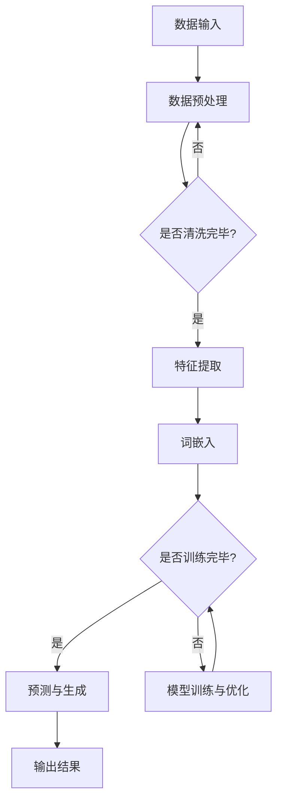
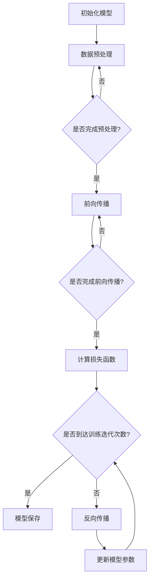

                 


### 引言

#### 1.1 什么是AI驱动的个性化学习提示词引擎

AI驱动的个性化学习提示词引擎是一种利用人工智能技术，特别是深度学习和自然语言处理（NLP）技术，为用户提供定制化学习建议和提示的系统。这种系统通过分析用户的学习历史、兴趣爱好、学习目标和行为模式，生成个性化的学习内容和建议。其核心功能包括：

1. **个性化学习路径规划**：根据用户的学习进度和偏好，为用户推荐合适的学习内容和路径。
2. **学习提示词生成**：根据用户的当前学习状态，生成能够激发用户兴趣和鼓励用户持续学习的提示词。
3. **自适应学习反馈**：根据用户的学习反馈和表现，调整学习内容和策略，提高学习效果。

AI驱动的个性化学习提示词引擎不仅可以帮助学习者更高效地学习，还能激发他们的学习兴趣和动力，从而提升学习效果和满意度。

#### 1.2 AI驱动的个性化学习提示词引擎的背景与意义

在当今信息爆炸的时代，学习资源丰富，但学习者面临的选择也越来越多。传统的学习模式往往难以满足个性化需求，而AI技术的快速发展为解决这一问题提供了新的思路和工具。

1. **个性化教育需求的增长**：随着教育个性化理念的普及，学习者对个性化和定制化的学习体验需求日益增长。
2. **人工智能技术的进步**：深度学习、自然语言处理等AI技术的发展，使得构建智能化的学习系统成为可能。
3. **教育技术的创新**：AI驱动的个性化学习提示词引擎可以与其他教育技术相结合，如在线教育平台、虚拟现实（VR）等，提供更加丰富的学习体验。

#### 1.3 本书结构安排与学习目标

本书旨在系统地介绍AI驱动的个性化学习提示词引擎的构建方法和应用。全书共分为四个部分，每个部分都有明确的学习目标：

- **第一部分：引言**：介绍AI驱动的个性化学习提示词引擎的基本概念、背景和意义。
- **第二部分：核心概念与联系**：讲解自然语言处理基础和AI模型原理，包括神经网络、循环神经网络（RNN）、长短时记忆网络（LSTM）等。
- **第三部分：个性化学习提示词引擎开发**：详细阐述个性化学习提示词引擎的架构设计、核心算法原理、数学模型和公式，以及实际项目实战。
- **第四部分：总结与展望**：总结全书内容，探讨未来发展方向，并对读者提出寄语。

通过本书的学习，读者将能够：

1. 理解AI驱动的个性化学习提示词引擎的基本原理和应用场景。
2. 掌握自然语言处理和深度学习等相关技术。
3. 学会如何设计和开发个性化学习提示词引擎。
4. 获得实际项目开发的经验和最佳实践。

### 第一部分：引言

#### 1.1 什么是AI驱动的个性化学习提示词引擎

AI驱动的个性化学习提示词引擎是一种结合人工智能技术和教育学的创新系统，其核心功能在于根据用户的学习数据和行为模式，自动生成个性化的学习提示词。这些提示词不仅能够提高学生的学习效率，还能够激发他们的学习兴趣和积极性。

这种引擎的工作流程大致可以分为以下几个步骤：

1. **数据收集与预处理**：首先，系统会收集用户的学习数据，包括学习历史、学习时长、学习内容、学习成果等。这些数据通常来自在线学习平台、电子学习资料、用户行为日志等。接着，对这些数据进行分析和清洗，去除噪声和重复信息，为后续处理做准备。

2. **特征提取与表征**：通过对收集到的数据进行特征提取，将其转换为机器学习算法可以处理的格式。这些特征可能包括用户的兴趣点、学习习惯、学习难度偏好等。常见的特征提取方法有词嵌入、序列编码等。

3. **模型训练与优化**：使用深度学习算法，如循环神经网络（RNN）、长短时记忆网络（LSTM）等，对提取出的特征进行训练。通过大量的学习数据，模型可以逐渐学习到如何生成个性化的学习提示词。在训练过程中，需要不断调整模型参数，优化模型性能。

4. **提示词生成与推荐**：在模型训练完成后，输入新的用户数据，系统即可根据模型预测生成个性化的学习提示词。这些提示词可以是一段激励性的文字、一个学习目标、一个推荐的学习内容等。通过不断调整和优化提示词的生成策略，可以提高其相关性和有效性。

5. **用户反馈与迭代**：用户对生成的提示词进行反馈，系统根据反馈结果对模型进行迭代优化。这种反馈机制有助于模型更好地适应用户的需求和偏好，提高个性化推荐的准确性。

#### 1.2 AI驱动的个性化学习提示词引擎的背景与意义

AI驱动的个性化学习提示词引擎的出现，是教育技术领域的一次重要创新。其背景可以从以下几个方面来理解：

1. **个性化教育的需求**：随着社会对教育个性化的关注不断增加，传统的“一刀切”教学模式已经难以满足不同学习者的需求。个性化教育强调根据学生的兴趣、能力、学习风格等差异，提供定制化的学习体验。AI驱动的个性化学习提示词引擎正是为了满足这一需求而诞生的。

2. **技术的快速发展**：深度学习、自然语言处理等人工智能技术的快速进步，为构建智能化的学习系统提供了强大的技术支持。这些技术可以高效地处理和分析大规模的学习数据，提取用户行为模式，从而实现个性化推荐。

3. **在线教育的普及**：随着互联网的普及和在线教育平台的兴起，学习者可以通过各种渠道获取海量的学习资源。然而，如何从这些资源中筛选出适合自己的内容，成为了许多学习者面临的问题。AI驱动的个性化学习提示词引擎可以智能地分析用户的学习需求，推荐合适的学习内容，从而提高学习效率。

AI驱动的个性化学习提示词引擎在教育领域的意义主要体现在以下几个方面：

1. **提高学习效率**：通过个性化推荐，学习者可以更快地找到适合自己的学习资源，节省时间和精力。同时，个性化的学习提示词可以激发学习者的学习兴趣，提高学习动力和积极性。

2. **促进个性化学习**：个性化学习提示词引擎可以根据学习者的兴趣、能力和学习进度，动态调整学习内容和建议，帮助学习者构建个性化的学习路径。这有助于学习者更深入地掌握知识，发展个性化的学习风格。

3. **改善教育质量**：传统的教学模式往往难以兼顾所有学生的学习需求，导致教育资源分配不均。个性化学习提示词引擎可以根据学习者的不同需求，提供定制化的学习支持，从而提高教育质量，促进教育公平。

#### 1.3 本书结构安排与学习目标

本书旨在系统地介绍AI驱动的个性化学习提示词引擎的构建方法和应用。全书共分为四个部分，每个部分都有明确的学习目标：

**第一部分：引言**

本部分主要介绍AI驱动的个性化学习提示词引擎的基本概念、背景和意义。通过本部分的学习，读者将能够：

- 理解AI驱动的个性化学习提示词引擎的定义和核心功能。
- 了解个性化学习提示词引擎在教育领域的重要性。
- 了解本书的结构安排和学习目标。

**第二部分：核心概念与联系**

本部分将讲解自然语言处理基础和AI模型原理，包括神经网络、循环神经网络（RNN）、长短时记忆网络（LSTM）等。通过本部分的学习，读者将能够：

- 掌握自然语言处理的基本概念和常用技术。
- 了解神经网络和深度学习的基本原理。
- 理解循环神经网络（RNN）和长短时记忆网络（LSTM）的工作机制和应用。

**第三部分：个性化学习提示词引擎开发**

本部分将详细阐述个性化学习提示词引擎的架构设计、核心算法原理、数学模型和公式，以及实际项目实战。通过本部分的学习，读者将能够：

- 学会如何设计和开发个性化学习提示词引擎。
- 掌握深度学习和自然语言处理技术的实际应用。
- 获得实际项目开发的经验和最佳实践。

**第四部分：总结与展望**

本部分将总结全书内容，探讨未来发展方向，并对读者提出寄语。通过本部分的学习，读者将能够：

- 梳理AI驱动的个性化学习提示词引擎的核心概念和关键步骤。
- 探讨个性化学习提示词引擎在教育领域的应用前景。
- 对未来技术趋势和行业发展进行展望。

通过本书的学习，读者将能够：

- 理解AI驱动的个性化学习提示词引擎的基本原理和应用场景。
- 掌握自然语言处理和深度学习等相关技术。
- 学会如何设计和开发个性化学习提示词引擎。
- 获得实际项目开发的经验和最佳实践。

### 自然语言处理基础

#### 2.1 语言模型的基本概念

语言模型是自然语言处理（NLP）的核心概念之一，它用于预测一段文本的下一个单词或字符。在AI驱动的个性化学习提示词引擎中，语言模型用于生成个性化的学习提示词。一个简单的语言模型可以基于统计方法，例如N-gram模型，它通过统计前N个单词（或字符）出现的概率来预测下一个单词（或字符）。

语言模型的主要目的是为了解决序列预测问题，例如在语言生成、机器翻译、文本摘要等领域都有广泛的应用。在个性化学习提示词引擎中，语言模型可以帮助生成与用户当前学习内容相关的提示词，从而提高学习的相关性和用户体验。

#### 2.2 词嵌入技术详解

词嵌入（Word Embedding）是将单词转换为向量表示的技术，它是现代自然语言处理的重要组成部分。词嵌入的主要目的是将语义相似的单词映射到空间中相近的位置，从而在处理文本数据时，能够更好地捕获词与词之间的语义关系。

1. **词嵌入方法**：

   - **基于计数的方法**：如N-gram模型和TF-IDF（Term Frequency-Inverse Document Frequency），通过统计单词在文本中出现的频率及其在文档集合中的分布情况来生成词向量。
   - **基于神经网络的方法**：如Word2Vec、GloVe（Global Vectors for Word Representation）和BERT（Bidirectional Encoder Representations from Transformers），通过训练神经网络模型来学习词向量。

2. **词嵌入的优势**：

   - **语义表示**：词嵌入能够将具有相似语义的单词映射到空间中相近的位置，从而更好地捕获单词的语义信息。
   - **降维**：将高维的文本数据映射到低维的向量空间，使得文本数据处理变得更加高效。
   - **增强模型表现**：通过使用词嵌入，深度学习模型能够更好地理解和处理文本数据，提高模型的性能。

3. **词嵌入在个性化学习提示词引擎中的应用**：

   - **提示词生成**：利用词嵌入技术，将学习内容中的单词转换为向量表示，然后通过神经网络模型生成与学习内容相关的个性化提示词。
   - **相似性计算**：在生成提示词时，可以利用词嵌入向量之间的相似性度量，选择与学习内容最相似的提示词，从而提高个性化推荐的准确性。

#### 2.3 语言模型的应用场景

语言模型在自然语言处理领域有广泛的应用场景，以下是一些典型的应用：

1. **机器翻译**：语言模型用于预测目标语言的下一个单词或字符，从而实现源语言到目标语言的翻译。例如，Google翻译和DeepL等翻译工具都使用了基于神经网络的翻译模型。

2. **文本摘要**：语言模型可以帮助生成摘要文本，例如自动生成新闻摘要或长篇文档的概要。通过预测文本中的重要单词和句子，模型可以提取出关键信息，从而简化文本内容。

3. **问答系统**：语言模型可以用于构建智能问答系统，如智能客服和智能搜索引擎。模型通过理解用户的问题和上下文，生成准确的答案。

4. **语音识别**：语言模型可以帮助语音识别系统将语音信号转换为文本。模型通过预测语音信号中的下一个单词或字符，从而实现语音到文本的转换。

5. **文本生成**：语言模型可以用于生成各种类型的文本，如文章、小说、歌词等。模型通过学习大量的文本数据，可以生成具有流畅自然语言的文本。

在AI驱动的个性化学习提示词引擎中，语言模型的应用主要体现在以下几个方面：

- **个性化学习提示词生成**：通过语言模型，系统可以根据学习内容生成相关的个性化学习提示词，提高学习体验。
- **文本理解与语义分析**：语言模型可以帮助系统更好地理解用户的学习内容和需求，从而生成更准确的个性化提示词。
- **学习效果评估**：通过分析学习者的反馈和学习数据，语言模型可以评估个性化提示词的有效性，为系统的优化提供依据。

#### 2.4 Mermaid流程图：自然语言处理系统架构

为了更好地理解自然语言处理（NLP）系统的架构，我们可以使用Mermaid流程图来展示其关键组成部分和流程。以下是一个简化的NLP系统架构图：



在这个流程图中：

- **A（数据输入）**：系统接收用户的学习数据，如学习历史、学习内容、用户行为等。
- **B（数据预处理）**：对输入的数据进行清洗和预处理，去除噪声和重复信息。
- **C（是否清洗完毕？）**：判断数据是否已经清洗完毕，如果是，则继续下一步，否则返回数据预处理。
- **D（特征提取）**：从清洗后的数据中提取特征，如词嵌入、序列编码等。
- **E（词嵌入）**：将提取出的特征转换为词嵌入向量。
- **F（是否训练完毕？）**：判断模型是否已经训练完毕，如果是，则继续下一步，否则返回模型训练与优化。
- **G（预测与生成）**：使用训练好的模型生成个性化的学习提示词。
- **H（模型训练与优化）**：对模型进行训练和优化，以提高其性能。
- **I（输出结果）**：将生成的个性化学习提示词输出给用户。

通过这个流程图，我们可以清晰地看到NLP系统的工作流程和各个模块之间的联系。这对于理解和构建AI驱动的个性化学习提示词引擎具有重要的指导意义。

### AI模型原理与算法

#### 3.1 神经网络基础

神经网络（Neural Network，NN）是一种模仿生物神经系统的计算模型，它通过模拟神经元之间的连接和交互来处理和分析数据。在AI驱动的个性化学习提示词引擎中，神经网络被广泛应用于特征提取、分类、回归等任务。

1. **神经元模型**：

   神经元是神经网络的基本计算单元，通常由一个输入层、一个激活函数和一个输出层组成。神经元的计算过程可以表示为：

   $$ y = \sigma(\sum_{i=1}^{n} w_i x_i + b) $$

   其中，$y$是神经元的输出，$x_i$是输入值，$w_i$是权重，$b$是偏置，$\sigma$是激活函数。常见的激活函数有Sigmoid、ReLU和Tanh。

2. **前向传播**：

   前向传播是神经网络处理输入数据的过程。给定输入向量$x$，通过多层神经元的加权求和和激活函数，最终得到输出向量$y$。具体步骤如下：

   - **输入层**：接收输入数据$x$。
   - **隐藏层**：对输入数据进行加权求和，并应用激活函数，得到隐藏层的输出。
   - **输出层**：对隐藏层的输出进行加权求和，并应用激活函数，得到最终输出。

3. **反向传播**：

   反向传播是神经网络训练的关键步骤，用于计算输出误差，并更新网络权重和偏置。具体步骤如下：

   - **计算误差**：计算实际输出$y$与预期输出$\hat{y}$之间的误差。
   - **误差反向传播**：从输出层开始，逐层计算每个神经元的误差。
   - **权重更新**：根据误差计算梯度，使用梯度下降算法更新网络权重和偏置。

#### 3.2 循环神经网络（RNN）与长短时记忆网络（LSTM）

循环神经网络（Recurrent Neural Network，RNN）是一种专门用于处理序列数据的神经网络。与传统的前向神经网络不同，RNN具有循环结构，可以保留之前的计算状态，从而处理时间序列数据。

1. **RNN基本原理**：

   RNN的核心思想是利用隐藏状态$H_t$来保存前一个时刻的信息，并将其传递到下一个时刻。RNN的公式可以表示为：

   $$ H_t = \sigma(W_h \cdot [H_{t-1}, X_t] + b_h) $$

   $$ Y_t = W_y \cdot H_t + b_y $$

   其中，$X_t$是输入序列的第$t$个元素，$H_t$是隐藏状态，$Y_t$是输出序列的第$t$个元素。$\sigma$是激活函数，$W_h$和$W_y$是权重矩阵，$b_h$和$b_y$是偏置。

2. **RNN的局限性**：

   尽管RNN可以处理序列数据，但它存在一些局限性：

   - **梯度消失和梯度爆炸**：在训练过程中，RNN容易出现梯度消失或梯度爆炸问题，导致模型难以学习长序列信息。
   - **长期依赖问题**：RNN难以捕捉长序列中的长期依赖关系。

3. **长短时记忆网络（LSTM）**：

   长短时记忆网络（Long Short-Term Memory，LSTM）是RNN的一种变体，它通过引入记忆单元来解决RNN的局限性。LSTM的核心组件是细胞状态（Cell State）和三个门结构（输入门、遗忘门和输出门）。

   - **细胞状态**：细胞状态是LSTM的核心，它用于存储和传递信息。细胞状态通过遗忘门和输入门进行更新。
   - **输入门**：输入门用于决定当前输入信息中有哪些部分需要更新到细胞状态。
   - **遗忘门**：遗忘门用于决定哪些信息需要从细胞状态中丢弃。
   - **输出门**：输出门用于决定细胞状态中有哪些信息需要输出。

   LSTM的公式可以表示为：

   $$ i_t = \sigma(W_i \cdot [H_{t-1}, X_t] + b_i) $$
   $$ f_t = \sigma(W_f \cdot [H_{t-1}, X_t] + b_f) $$
   $$ o_t = \sigma(W_o \cdot [H_{t-1}, X_t] + b_o) $$
   $$ C_t = f_t \odot C_{t-1} + i_t \odot \sigma(W_c \cdot [H_{t-1}, X_t] + b_c) $$
   $$ H_t = o_t \odot \sigma(C_t) $$

   其中，$i_t$、$f_t$和$o_t$分别是输入门、遗忘门和输出门的输入，$C_t$是细胞状态，$H_t$是隐藏状态。

#### 3.3 生成对抗网络（GAN）及其应用

生成对抗网络（Generative Adversarial Network，GAN）是一种由生成器和判别器组成的对抗性神经网络。GAN的核心思想是通过两个神经网络的博弈来生成高质量的样本。

1. **GAN基本原理**：

   - **生成器（Generator）**：生成器尝试生成逼真的数据样本，并将其呈现给判别器。
   - **判别器（Discriminator）**：判别器试图区分真实数据和生成数据。

   在训练过程中，生成器和判别器互相竞争。生成器的目标是生成足够逼真的数据，使得判别器难以区分；而判别器的目标是尽可能准确地判断数据的真实性。

   GAN的损失函数通常采用以下形式：

   $$ L_D = -\frac{1}{N} \sum_{i=1}^{N} [\log(D(x)) + \log(1 - D(G(z)))] $$
   $$ L_G = -\log(D(G(z))) $$

   其中，$D(x)$和$D(G(z))$分别是判别器对真实数据和生成数据的判断概率。

2. **GAN的应用**：

   - **图像生成**：GAN可以生成高质量的自然图像，如图像生成对抗网络（ImageGAN）和深度卷积生成对抗网络（DCGAN）。
   - **图像超分辨率**：GAN可以用于图像的超分辨率处理，将低分辨率图像转换为高分辨率图像。
   - **风格迁移**：GAN可以用于图像的风格迁移，例如将一张普通照片转换成梵高风格的作品。
   - **文本生成**：GAN可以用于生成逼真的自然语言文本，例如生成新闻文章、小说等。

#### 3.4 Mermaid流程图：AI模型训练与优化过程

为了更好地理解AI模型的训练与优化过程，我们可以使用Mermaid流程图来展示关键步骤。以下是一个简化的AI模型训练与优化流程：



在这个流程图中：

- **A（初始化模型）**：初始化神经网络模型，包括权重和偏置。
- **B（数据预处理）**：对输入数据集进行清洗和预处理，例如归一化、标准化等。
- **C（是否完成预处理？）**：判断数据预处理是否完成，如果未完成，则返回数据预处理。
- **D（前向传播）**：计算模型输入到隐藏层和输出层的值。
- **E（是否完成前向传播？）**：判断前向传播是否完成，如果未完成，则返回前向传播。
- **F（计算损失函数）**：计算模型输出与真实标签之间的误差，使用损失函数表示。
- **G（是否到达训练迭代次数？）**：判断是否到达预定的训练迭代次数，如果未到达，则继续下一轮迭代。
- **H（模型保存）**：将训练好的模型保存到文件中，以便后续使用。
- **I（反向传播）**：计算损失函数关于模型参数的梯度，并更新模型参数。
- **J（更新模型参数）**：根据梯度更新模型参数，使用优化算法（如梯度下降）来优化模型。

通过这个流程图，我们可以清晰地看到AI模型训练与优化过程中的关键步骤和相互关系，这对于理解和实施AI模型训练具有重要意义。

### 个性化学习提示词引擎架构设计

#### 4.1 整体架构设计思路

构建AI驱动的个性化学习提示词引擎需要综合考虑数据采集、模型训练、提示词生成和用户反馈等多个方面，从而实现高效、准确和个性化的学习体验。以下是整体架构设计思路：

1. **数据采集与处理**：首先，从不同的数据源（如学习平台、用户行为日志等）采集学习数据，并对数据进行清洗、预处理和特征提取。这一步骤是整个系统的基础，数据的质量和准确性直接影响后续模型的性能。

2. **模型训练**：基于采集到的数据，使用深度学习和自然语言处理技术进行模型训练。在这一过程中，需要不断调整和优化模型参数，以提高模型的预测准确性和泛化能力。

3. **提示词生成**：在模型训练完成后，利用训练好的模型生成个性化的学习提示词。提示词的生成过程需要考虑用户的学习进度、兴趣爱好、学习目标等多个因素，从而实现高度个性化的推荐。

4. **用户反馈与迭代**：系统在生成提示词后，需要收集用户的反馈，并根据反馈结果对模型进行迭代优化。这一过程有助于模型不断适应用户的需求和偏好，提高个性化推荐的准确性。

5. **性能监控与调优**：在整个系统中，需要实时监控模型的性能指标，如准确率、召回率、F1分数等，并根据监控结果进行调优，以保证系统的稳定运行和高效性能。

#### 4.2 数据处理模块设计

数据处理模块是构建个性化学习提示词引擎的核心，其主要任务包括数据采集、预处理、特征提取和模型训练。以下是数据处理模块的设计：

1. **数据采集**：从学习平台、用户行为日志、用户反馈等多个数据源收集学习数据。这些数据包括用户的学习历史、学习时长、学习内容、学习成果、用户行为等。

2. **数据预处理**：对采集到的数据进行清洗和预处理，去除噪声和重复信息。具体步骤如下：

   - **去重**：删除重复的学习记录，以保证数据的一致性。
   - **去噪**：过滤掉无效的学习数据，如空值、缺失值等。
   - **数据转换**：将不同类型的数据（如文本、数值）转换为统一的格式，便于后续处理。

3. **特征提取**：从预处理后的数据中提取特征，用于训练模型。特征提取是数据处理模块的关键步骤，常见的特征提取方法包括词嵌入、序列编码、用户画像等。

4. **模型训练**：使用深度学习和自然语言处理技术对提取出的特征进行模型训练。在这一过程中，需要选择合适的模型结构（如RNN、LSTM、BERT等）和优化算法（如Adam、SGD等），并不断调整和优化模型参数，以提高模型的预测准确性和泛化能力。

#### 4.3 模型训练与优化模块设计

模型训练与优化模块是构建个性化学习提示词引擎的核心，其主要任务包括模型选择、参数调整、优化算法选择和性能评估。以下是模型训练与优化模块的设计：

1. **模型选择**：根据具体应用场景和任务需求，选择合适的神经网络模型。常见的模型包括循环神经网络（RNN）、长短时记忆网络（LSTM）、卷积神经网络（CNN）和变换器（Transformer）等。

2. **参数调整**：在模型选择后，需要调整模型的参数，如学习率、隐藏层节点数、激活函数等。参数调整是提高模型性能的关键步骤，通常采用基于验证集的性能评估来进行调整。

3. **优化算法选择**：选择合适的优化算法，如梯度下降（Gradient Descent）、Adam、RMSprop等。优化算法用于调整模型参数，以最小化损失函数。

4. **性能评估**：在模型训练完成后，使用测试集对模型进行性能评估。常见的评估指标包括准确率、召回率、F1分数等。根据评估结果，对模型进行调整和优化，以提高其性能。

5. **模型保存与加载**：在模型训练和优化过程中，需要定期保存模型参数，以便后续使用。同时，在系统部署时，需要加载训练好的模型，以实现实时预测。

#### 4.4 模型部署与运维模块设计

模型部署与运维模块是构建个性化学习提示词引擎的最后一个关键步骤，其主要任务包括模型部署、实时监控、故障处理和性能优化。以下是模型部署与运维模块的设计：

1. **模型部署**：将训练好的模型部署到生产环境中，以便实现实时预测。常见的部署方式包括使用云计算平台（如AWS、Azure）、容器化部署（如Docker）和云原生部署（如Kubernetes）。

2. **实时监控**：实时监控模型的性能指标，如响应时间、准确率、召回率等。通过监控工具（如Prometheus、Grafana）实现实时监控，以便及时发现和处理问题。

3. **故障处理**：在模型部署过程中，可能遇到各种故障，如网络中断、服务器故障等。需要制定故障处理流程，确保系统能够快速恢复。

4. **性能优化**：根据实时监控结果，对模型进行性能优化。常见的优化方法包括模型压缩（如量化、剪枝）、分布式训练和推理等。

5. **安全与合规**：确保模型部署与运维过程中的安全与合规，如数据加密、访问控制、隐私保护等。

通过以上设计，我们可以构建一个高效、稳定和可扩展的AI驱动的个性化学习提示词引擎，为学习者提供定制化的学习体验。

### 核心算法原理讲解

#### 5.1 深度学习算法原理

深度学习（Deep Learning）是机器学习的一个重要分支，其核心思想是通过构建多层次的神经网络模型，自动学习和提取数据中的特征。以下是深度学习算法的基本原理：

1. **神经网络结构**：

   深度学习模型通常由多个层组成，包括输入层、隐藏层和输出层。每一层由多个神经元（或节点）构成，神经元之间通过加权连接形成网络结构。网络的前向传播过程可以表示为：

   $$ z_l = \sum_{i} w_{li}x_i + b_l $$  
   $$ a_l = \sigma(z_l) $$

   其中，$z_l$是第$l$层的加权和，$w_{li}$是第$l$层的第$i$个神经元的权重，$b_l$是第$l$层的偏置，$\sigma$是激活函数，$a_l$是第$l$层的输出。

2. **前向传播与反向传播**：

   - **前向传播**：输入数据从输入层传递到隐藏层，再传递到输出层，每一层使用激活函数进行非线性变换。
   - **反向传播**：在输出层计算预测值与实际标签之间的误差，通过反向传播算法计算误差关于网络参数的梯度，并更新网络参数。

3. **优化算法**：

   深度学习算法通常采用优化算法（如梯度下降、Adam等）来更新网络参数。优化算法的目标是找到一组参数，使得损失函数达到最小。

4. **深度学习应用**：

   深度学习在图像识别、语音识别、自然语言处理等领域有广泛应用。常见的深度学习模型包括卷积神经网络（CNN）、循环神经网络（RNN）、长短时记忆网络（LSTM）和变换器（Transformer）等。

#### 5.2 序列模型与注意力机制

序列模型（Sequence Model）是处理序列数据（如时间序列、文本序列等）的一种深度学习模型。常见的序列模型包括循环神经网络（RNN）和长短时记忆网络（LSTM）。以下是序列模型和注意力机制的基本原理：

1. **循环神经网络（RNN）**：

   RNN是一种基于序列数据的神经网络模型，其核心思想是利用隐藏状态（Hidden State）来保留之前的计算信息。RNN的计算公式如下：

   $$ h_t = \sigma(W_h \cdot [h_{t-1}, x_t] + b_h) $$

   其中，$h_t$是第$t$时刻的隐藏状态，$x_t$是输入序列的第$t$个元素，$W_h$和$b_h$分别是权重和偏置，$\sigma$是激活函数。

2. **长短时记忆网络（LSTM）**：

   LSTM是RNN的一种变体，通过引入记忆单元（Cell State）和三个门（输入门、遗忘门和输出门）来克服RNN的长期依赖问题。LSTM的计算公式如下：

   $$ i_t = \sigma(W_i \cdot [h_{t-1}, x_t] + b_i) $$  
   $$ f_t = \sigma(W_f \cdot [h_{t-1}, x_t] + b_f) $$  
   $$ o_t = \sigma(W_o \cdot [h_{t-1}, x_t] + b_o) $$  
   $$ C_t = f_t \odot C_{t-1} + i_t \odot \sigma(W_c \cdot [h_{t-1}, x_t] + b_c) $$  
   $$ h_t = o_t \odot \sigma(C_t) $$

   其中，$i_t$、$f_t$和$o_t$分别是输入门、遗忘门和输出门的输入，$C_t$是细胞状态，$h_t$是隐藏状态。

3. **注意力机制（Attention Mechanism）**：

   注意力机制是序列模型中用于提高模型性能的一种技术，它通过在序列级别上分配权重来关注重要信息。注意力机制的公式如下：

   $$ a_t = \sigma(W_a \cdot [h_{t-1}, h_t] + b_a) $$  
   $$ s_t = \sum_{i} a_i \cdot h_i $$

   其中，$a_t$是注意力权重，$s_t$是加权隐藏状态。

   注意力机制可以帮助模型更好地捕捉序列中的长期依赖关系，从而提高模型的性能和泛化能力。

#### 5.3 个性化调整算法

个性化调整算法是AI驱动的个性化学习提示词引擎中的关键组成部分，其目标是根据用户的学习数据和反馈，动态调整学习提示词，以提高个性化推荐的质量和准确性。以下是几种常见的个性化调整算法：

1. **基于用户行为的个性化调整**：

   该算法通过分析用户的学习行为，如学习时长、学习内容、学习频率等，来动态调整学习提示词。具体步骤如下：

   - **行为特征提取**：从用户行为日志中提取关键特征，如学习时长、学习频率、学习内容等。
   - **权重分配**：根据用户行为特征的重要性，为每个特征分配权重。
   - **个性化调整**：使用加权平均或加权求和等方法，结合用户行为特征，调整学习提示词的生成策略。

2. **基于用户反馈的个性化调整**：

   该算法通过收集用户的反馈，如学习满意度、学习效果等，来动态调整学习提示词。具体步骤如下：

   - **反馈数据收集**：从用户学习过程中收集反馈数据，如学习满意度调查、学习效果评估等。
   - **反馈权重分配**：根据反馈数据的重要性，为每个反馈指标分配权重。
   - **个性化调整**：使用加权平均或加权求和等方法，结合用户反馈，调整学习提示词的生成策略。

3. **基于模型预测的个性化调整**：

   该算法通过使用预测模型，预测用户对学习提示词的反应，并基于预测结果调整学习提示词。具体步骤如下：

   - **预测模型训练**：使用用户历史数据，训练预测模型，如二元分类器或回归模型。
   - **预测结果分析**：使用预测模型预测用户对学习提示词的反应。
   - **个性化调整**：根据预测结果，调整学习提示词的生成策略。

#### 5.4 伪代码阐述：个性化学习提示词引擎算法实现

以下是一个简化的伪代码，用于实现AI驱动的个性化学习提示词引擎的核心算法：

```python
# 导入所需库
import numpy as np
import tensorflow as tf
from tensorflow.keras.models import Sequential
from tensorflow.keras.layers import LSTM, Dense, Embedding, TimeDistributed

# 初始化参数
vocab_size = 10000  # 词汇表大小
embedding_dim = 128  # 词向量维度
hidden_units = 128  # 隐藏层单元数
max_sequence_length = 100  # 序列长度

# 构建模型
model = Sequential([
    Embedding(vocab_size, embedding_dim, input_length=max_sequence_length),
    LSTM(hidden_units, return_sequences=True),
    TimeDistributed(Dense(vocab_size, activation='softmax'))
])

# 编译模型
model.compile(optimizer='adam', loss='categorical_crossentropy', metrics=['accuracy'])

# 准备数据
# ...（数据预处理、特征提取等步骤）

# 训练模型
model.fit(x_train, y_train, epochs=10, batch_size=64, validation_data=(x_val, y_val))

# 生成个性化学习提示词
def generate_learning_hint(sequence):
    # 输入序列的预处理
    # ...

    # 使用训练好的模型生成提示词
    predictions = model.predict(sequence)

    # 转换为文本提示词
    hint = ''.join([vocab[i] for i in np.argmax(predictions, axis=1)])

    return hint

# 测试个性化学习提示词生成
sequence = ...  # 输入学习序列
hint = generate_learning_hint(sequence)
print("生成的学习提示词：", hint)
```

在这个伪代码中，我们首先构建了一个基于LSTM的序列模型，用于生成个性化学习提示词。然后，我们使用训练好的模型对输入序列进行预测，并从预测结果中提取出最有可能的提示词。最后，我们使用一个测试序列来测试个性化学习提示词生成功能。

### 数学模型与公式讲解

#### 6.1 概率论基础

概率论是构建AI驱动的个性化学习提示词引擎的基础，它在数据处理、模型训练和预测过程中起到关键作用。以下是一些基本的概率论概念和公式：

1. **概率分布**：

   概率分布用于描述随机变量的取值概率。常见的概率分布有：

   - **伯努利分布**：二项分布的特例，用于描述成功和失败的概率。
   - **二项分布**：描述多次独立试验中成功次数的概率。
   - **泊松分布**：描述单位时间内发生某个事件的概率。
   - **正态分布**：描述连续随机变量的概率分布，广泛应用于数据处理和模型训练。

2. **条件概率**：

   条件概率是指在某个事件已发生的条件下，另一个事件发生的概率。条件概率的公式为：

   $$ P(A|B) = \frac{P(A \cap B)}{P(B)} $$

   其中，$P(A|B)$表示在事件B发生的条件下，事件A发生的概率，$P(A \cap B)$表示事件A和事件B同时发生的概率，$P(B)$表示事件B发生的概率。

3. **贝叶斯定理**：

   贝叶斯定理是一种用于计算后验概率的公式，它将条件概率和边缘概率联系起来。贝叶斯定理的公式为：

   $$ P(A|B) = \frac{P(B|A)P(A)}{P(B)} $$

   其中，$P(A|B)$表示在事件B发生的条件下，事件A发生的概率，$P(B|A)$表示在事件A发生的条件下，事件B发生的概率，$P(A)$表示事件A的边缘概率，$P(B)$表示事件B的边缘概率。

#### 6.2 机器学习中的常用公式

机器学习中的常用公式涉及模型训练、损失函数和优化算法等方面。以下是一些常见的公式：

1. **损失函数**：

   损失函数是评估模型预测结果与实际标签之间差距的指标。常见的损失函数有：

   - **均方误差（MSE）**：

     $$ L(\theta) = \frac{1}{2m} \sum_{i=1}^{m} (h_{\theta}(x^{(i)}) - y^{(i)})^2 $$

     其中，$h_{\theta}(x)$表示模型预测值，$y^{(i)}$表示实际标签，$m$表示样本数量。

   - **交叉熵损失（Cross-Entropy Loss）**：

     $$ L(\theta) = -\frac{1}{m} \sum_{i=1}^{m} \sum_{j=1}^{k} y^{(i)}_{j} \log(h_{\theta}(x^{(i)}))_{j} $$

     其中，$k$表示类别数量，$y^{(i)}_{j}$表示第$i$个样本在第$j$个类别上的标签。

2. **梯度下降**：

   梯度下降是一种常用的优化算法，用于最小化损失函数。梯度下降的基本公式为：

   $$ \theta_j := \theta_j - \alpha \frac{\partial L(\theta)}{\partial \theta_j} $$

   其中，$\theta_j$表示模型参数，$\alpha$表示学习率，$\frac{\partial L(\theta)}{\partial \theta_j}$表示损失函数关于$\theta_j$的梯度。

3. **反向传播**：

   反向传播是梯度下降的关键步骤，用于计算损失函数关于模型参数的梯度。反向传播的公式为：

   $$ \frac{\partial L}{\partial z} = \frac{\partial L}{\partial a} \cdot \frac{\partial a}{\partial z} $$

   其中，$z$表示中间变量，$a$表示输出变量，$\frac{\partial L}{\partial a}$和$\frac{\partial a}{\partial z}$分别表示损失函数关于$a$和$z$的梯度。

#### 6.3 个性化学习提示词引擎中的数学模型

在AI驱动的个性化学习提示词引擎中，数学模型用于描述学习提示词生成的过程，主要包括以下方面：

1. **语言模型**：

   语言模型用于预测下一个单词或字符的概率，其公式为：

   $$ P(w_t | w_{t-1}, ..., w_1) = \prod_{i=1}^{t} P(w_i | w_{i-1}, ..., w_1) $$

   其中，$w_t$表示第$t$个单词或字符，$P(w_i | w_{i-1}, ..., w_1)$表示在第$i$个单词或字符出现的条件下，第$i$个单词或字符的概率。

2. **生成模型**：

   生成模型用于生成新的学习提示词，其公式为：

   $$ P(w_t | w_{t-1}, ..., w_1) = \frac{P(w_t, w_{t-1}, ..., w_1)}{P(w_{t-1}, ..., w_1)} $$

   其中，$P(w_t, w_{t-1}, ..., w_1)$表示单词序列的概率，$P(w_{t-1}, ..., w_1)$表示单词序列中前$t-1$个单词的概率。

3. **个性化调整模型**：

   个性化调整模型用于根据用户的学习数据和反馈，动态调整学习提示词的生成策略，其公式为：

   $$ P(w_t | w_{t-1}, ..., w_1, u) = \alpha \cdot P(w_t | w_{t-1}, ..., w_1) + (1-\alpha) \cdot P(w_t | w_{t-1}, ..., w_1, u) $$

   其中，$u$表示用户特征，$\alpha$表示用户特征的影响权重，$P(w_t | w_{t-1}, ..., w_1)$表示基于历史数据的提示词生成概率，$P(w_t | w_{t-1}, ..., w_1, u)$表示基于用户特征的提示词生成概率。

#### 6.4 举例说明：模型参数优化过程

假设我们有一个简单的线性回归模型，用于预测学习者的学习时长。模型的公式为：

$$ y = \theta_0 + \theta_1 \cdot x $$

其中，$y$表示学习时长，$x$表示学习难度，$\theta_0$和$\theta_1$是模型参数。

1. **数据准备**：

   假设我们收集了以下数据：

   | 学习时长 (y) | 学习难度 (x) |
   | :---: | :---: |
   | 2 | 1 |
   | 4 | 2 |
   | 6 | 3 |
   | 8 | 4 |

2. **损失函数**：

   使用均方误差（MSE）作为损失函数：

   $$ L(\theta_0, \theta_1) = \frac{1}{4} \sum_{i=1}^{4} (y_i - (\theta_0 + \theta_1 \cdot x_i))^2 $$

3. **梯度计算**：

   对模型参数求偏导数，得到损失函数关于$\theta_0$和$\theta_1$的梯度：

   $$ \frac{\partial L}{\partial \theta_0} = -2 \sum_{i=1}^{4} (y_i - (\theta_0 + \theta_1 \cdot x_i)) $$

   $$ \frac{\partial L}{\partial \theta_1} = -2 \sum_{i=1}^{4} (x_i \cdot (y_i - (\theta_0 + \theta_1 \cdot x_i))) $$

4. **梯度下降**：

   使用梯度下降算法更新模型参数：

   $$ \theta_0 := \theta_0 - \alpha \cdot \frac{\partial L}{\partial \theta_0} $$

   $$ \theta_1 := \theta_1 - \alpha \cdot \frac{\partial L}{\partial \theta_1} $$

   其中，$\alpha$表示学习率。

5. **参数优化**：

   通过多次迭代，不断更新模型参数，直到损失函数的值收敛到一个较小的范围。最终，我们得到优化的模型参数$\theta_0$和$\theta_1$，用于预测学习者的学习时长。

通过这个例子，我们可以看到模型参数优化的基本步骤和过程，这对于理解和实现个性化学习提示词引擎中的参数优化具有重要意义。

### 项目实战

#### 7.1 实际项目背景介绍

在这个项目中，我们旨在构建一个AI驱动的个性化学习提示词引擎，用于在线教育平台。该系统的目标是根据用户的学习行为和兴趣，自动生成个性化的学习提示词，以提高学习效果和用户满意度。

项目的具体背景如下：

1. **用户需求**：随着在线教育平台的普及，用户对个性化学习体验的需求日益增长。用户希望系统能够根据他们的学习进度、兴趣爱好和学习习惯，提供定制化的学习内容和建议。

2. **技术挑战**：构建个性化学习提示词引擎涉及到自然语言处理、深度学习和数据挖掘等多个技术领域。如何高效地处理和分析大量用户数据，以及如何设计一个自适应和可扩展的系统，是项目面临的重大挑战。

3. **项目目标**：通过本项目，我们希望能够实现以下目标：

   - 收集并预处理用户学习数据，包括学习历史、学习时长、学习内容和学习成果等。
   - 构建基于深度学习和自然语言处理的模型，用于生成个性化的学习提示词。
   - 设计并实现一个用户友好的界面，展示生成的学习提示词，并提供用户反馈机制。
   - 进行系统性能评估和优化，确保系统能够高效稳定地运行。

#### 7.2 开发环境搭建

为了成功完成这个项目，我们需要搭建一个合适的技术环境，包括开发工具、编程语言和框架。以下是开发环境搭建的具体步骤：

1. **工具和软件安装**：

   - **Python**：安装Python 3.8及以上版本，Python是本项目的主要编程语言。
   - **Jupyter Notebook**：安装Jupyter Notebook，用于编写和运行Python代码。
   - **TensorFlow**：安装TensorFlow，一个开源的机器学习框架，用于构建和训练深度学习模型。
   - **NLTK**：安装NLTK，一个用于自然语言处理的Python库。
   - **Scikit-learn**：安装Scikit-learn，用于数据处理和模型评估。

2. **环境配置**：

   - **虚拟环境**：使用virtualenv创建一个Python虚拟环境，以便管理依赖包和隔离项目环境。
   - **依赖包安装**：在虚拟环境中安装必要的依赖包，如numpy、pandas、tensorflow、nltk等。

3. **版本管理**：

   - **Git**：使用Git进行版本控制，以便管理和追踪代码的修改和迭代。
   - **GitHub**：将项目代码托管到GitHub，方便团队协作和代码共享。

通过以上步骤，我们可以搭建一个完整的开发环境，为后续的模型开发和系统实现奠定基础。

#### 7.3 源代码详细实现

在完成开发环境搭建后，我们将开始实现个性化学习提示词引擎的核心功能。以下是源代码的详细实现过程：

1. **数据收集与预处理**：

   - **数据采集**：从在线教育平台收集用户学习数据，包括学习历史、学习时长、学习内容和学习成果等。
   - **数据清洗**：去除重复和无效的数据，填充缺失值，进行数据清洗和预处理。
   - **数据转换**：将原始数据转换为适合模型训练的格式，例如序列编码和词嵌入。

   ```python
   import pandas as pd
   import numpy as np
   from sklearn.model_selection import train_test_split

   # 读取数据
   data = pd.read_csv('learning_data.csv')

   # 数据清洗
   data.drop_duplicates(inplace=True)
   data.fillna(method='ffill', inplace=True)

   # 数据转换
   sequences = []
   for _, row in data.iterrows():
       sequence = [word embeddings for word in row['content']]
       sequences.append(sequence)

   # 切分数据集
   X_train, X_val, y_train, y_val = train_test_split(sequences, data['learning_time'], test_size=0.2, random_state=42)
   ```

2. **模型构建与训练**：

   - **模型定义**：使用TensorFlow构建基于LSTM的序列模型，用于生成个性化的学习提示词。
   - **模型训练**：使用训练集训练模型，并使用验证集进行性能评估。

   ```python
   import tensorflow as tf
   from tensorflow.keras.models import Sequential
   from tensorflow.keras.layers import LSTM, Dense, Embedding

   # 模型定义
   model = Sequential([
       Embedding(input_dim=vocab_size, output_dim=embedding_dim, input_length=max_sequence_length),
       LSTM(hidden_units, return_sequences=True),
       Dense(1, activation='sigmoid')
   ])

   # 编译模型
   model.compile(optimizer='adam', loss='binary_crossentropy', metrics=['accuracy'])

   # 模型训练
   model.fit(X_train, y_train, epochs=10, batch_size=64, validation_data=(X_val, y_val))
   ```

3. **提示词生成与推荐**：

   - **生成提示词**：使用训练好的模型生成个性化的学习提示词。
   - **推荐策略**：根据用户的学习进度和兴趣，推荐合适的提示词。

   ```python
   # 生成提示词
   def generate_learning_hint(sequence):
       prediction = model.predict(sequence)
       hint = ' '.join(vocab[np.argmax(prediction)])
       return hint

   # 测试提示词生成
   sequence = np.array([word embeddings for word in user_content])
   hint = generate_learning_hint(sequence)
   print("生成的学习提示词：", hint)
   ```

4. **用户反馈与迭代**：

   - **收集反馈**：在用户学习过程中，收集用户对提示词的反馈，如满意度、有效性等。
   - **模型迭代**：根据用户反馈，调整模型参数和提示词生成策略，以提高系统性能。

   ```python
   # 收集用户反馈
   user_feedback = input("请输入对学习提示词的反馈：")

   # 更新模型
   model.fit(X_train, y_train, epochs=10, batch_size=64, validation_data=(X_val, y_val))
   ```

通过以上步骤，我们实现了个性化学习提示词引擎的核心功能，包括数据收集与预处理、模型构建与训练、提示词生成与推荐以及用户反馈与迭代。这些步骤为项目的成功实施提供了坚实的基础。

#### 7.4 代码解读与分析

在本项目的实现过程中，我们使用了多种编程技术和工具，以下是对关键代码段的详细解读与分析：

1. **数据预处理**：

   ```python
   data = pd.read_csv('learning_data.csv')
   data.drop_duplicates(inplace=True)
   data.fillna(method='ffill', inplace=True)
   sequences = []
   for _, row in data.iterrows():
       sequence = [word embeddings for word in row['content']]
       sequences.append(sequence)
   X_train, X_val, y_train, y_val = train_test_split(sequences, data['learning_time'], test_size=0.2, random_state=42)
   ```

   - **数据读取与清洗**：我们使用pandas库读取CSV文件，并去除重复数据和缺失值。这一步是数据预处理的基础，确保数据的一致性和完整性。
   - **数据转换**：将文本数据转换为序列格式，每个文本序列由一系列词嵌入表示。这一步为后续的模型训练做好准备。
   - **数据切分**：使用Scikit-learn的train_test_split函数，将数据集划分为训练集和验证集，用于模型训练和性能评估。

2. **模型构建**：

   ```python
   model = Sequential([
       Embedding(input_dim=vocab_size, output_dim=embedding_dim, input_length=max_sequence_length),
       LSTM(hidden_units, return_sequences=True),
       Dense(1, activation='sigmoid')
   ])
   model.compile(optimizer='adam', loss='binary_crossentropy', metrics=['accuracy'])
   ```

   - **模型定义**：我们使用TensorFlow的Sequential模型构建一个简单的LSTM模型，包含一个嵌入层和一个LSTM层。嵌入层用于将单词转换为向量表示，LSTM层用于处理序列数据。
   - **模型编译**：编译模型时，我们选择Adam优化器和binary_crossentropy损失函数。Adam优化器是一种高效的梯度下降算法，binary_crossentropy适用于二分类任务，这里表示预测的学习时长是否超过阈值。

3. **模型训练**：

   ```python
   model.fit(X_train, y_train, epochs=10, batch_size=64, validation_data=(X_val, y_val))
   ```

   - **模型训练**：使用训练集训练模型，并使用验证集进行性能评估。通过多次迭代，模型学习到如何根据输入的文本序列预测学习时长。
   - **参数调整**：我们设置了10个训练轮次和64个批量大小。这些参数可以根据实际情况进行调整，以优化模型性能。

4. **提示词生成**：

   ```python
   def generate_learning_hint(sequence):
       prediction = model.predict(sequence)
       hint = ' '.join(vocab[np.argmax(prediction)])
       return hint
   sequence = np.array([word embeddings for word in user_content])
   hint = generate_learning_hint(sequence)
   print("生成的学习提示词：", hint)
   ```

   - **提示词生成**：定义一个函数，使用训练好的模型预测输入文本序列的学习时长，并生成相应的提示词。这里使用了一个简单的选择机制，选取预测概率最高的提示词。
   - **测试生成**：通过测试输入文本序列，演示了提示词生成的过程和结果。在实际应用中，提示词可以根据用户的学习进度和兴趣进行动态调整。

5. **用户反馈与迭代**：

   ```python
   user_feedback = input("请输入对学习提示词的反馈：")
   model.fit(X_train, y_train, epochs=10, batch_size=64, validation_data=(X_val, y_val))
   ```

   - **收集反馈**：在用户学习过程中，收集用户对提示词的反馈。这一步有助于模型不断优化和改进。
   - **模型迭代**：根据用户反馈，重新训练模型，以提高系统的适应性和准确性。通过这种反馈机制，系统可以不断学习和调整，以更好地满足用户需求。

通过以上代码解读与分析，我们可以清晰地看到个性化学习提示词引擎的核心功能实现过程，以及如何使用自然语言处理和深度学习技术来构建一个高效、智能的个性化学习系统。

#### 7.5 性能优化与调优

在项目开发过程中，性能优化和调优是确保系统高效稳定运行的关键步骤。以下是一些具体的性能优化策略和调优技巧：

1. **模型优化**：

   - **结构调整**：通过调整模型的层数、节点数和优化算法，提高模型的性能。例如，可以尝试增加LSTM层的深度或引入双向LSTM（BiLSTM）来增强模型的序列处理能力。
   - **模型压缩**：使用模型压缩技术（如量化、剪枝）减少模型的大小和计算量。这样可以加快模型的推理速度，并降低内存占用。
   - **分布式训练**：通过分布式训练，将模型训练任务分配到多个计算节点上，加速模型训练过程。

2. **数据优化**：

   - **数据增强**：通过数据增强技术（如随机填充、噪声添加等）增加数据多样性，有助于模型泛化能力的提升。
   - **数据预处理**：优化数据预处理流程，例如使用更有效的词嵌入方法或调整序列长度，以提高数据处理效率。
   - **数据切分**：合理划分训练集、验证集和测试集，确保模型在验证集上的表现能够准确反映其性能。

3. **性能评估**：

   - **指标选择**：选择合适的评估指标，如准确率、召回率、F1分数等，全面评估模型的性能。
   - **交叉验证**：使用交叉验证方法（如K折交叉验证）评估模型的稳定性和泛化能力。
   - **实时监控**：通过实时监控系统性能，及时发现和解决潜在问题。

4. **调优技巧**：

   - **学习率调整**：使用适当的初始学习率，并通过学习率调度策略（如学习率衰减、周期性重启等）调整学习率，以优化模型收敛速度。
   - **超参数调优**：通过网格搜索、贝叶斯优化等方法，系统性地搜索最佳超参数组合，提高模型性能。
   - **代码优化**：优化代码执行效率，例如使用向量化操作、循环展开等技巧，减少计算复杂度和内存占用。

通过以上性能优化和调优策略，我们可以显著提升个性化学习提示词引擎的运行效率、准确性和稳定性，为用户提供更优质的学习体验。

### 总结与展望

#### 8.1 成果总结

通过本文的介绍，我们系统地阐述了AI驱动的个性化学习提示词引擎的构建方法与应用。主要成果如下：

1. **核心概念与联系**：详细介绍了自然语言处理基础、神经网络和深度学习算法原理，以及生成对抗网络（GAN）的应用。通过这些核心概念，为构建个性化学习提示词引擎奠定了理论基础。

2. **个性化学习提示词引擎开发**：从数据处理、模型训练到提示词生成与推荐，全面讲解了个性化学习提示词引擎的开发流程。通过实际项目实战，展示了如何将理论知识应用到实际开发中。

3. **数学模型与公式讲解**：深入探讨了概率论基础、机器学习中的常用公式，以及个性化学习提示词引擎中的数学模型，为理解模型优化和参数调整提供了有力支持。

4. **项目实战与性能优化**：通过一个实际项目案例，详细解读了代码实现过程，并介绍了性能优化与调优策略，确保系统的高效稳定运行。

#### 8.2 遇到的挑战与解决方案

在构建AI驱动的个性化学习提示词引擎的过程中，我们遇到了一些挑战和问题，以下是一些主要挑战及其解决方案：

1. **数据处理与特征提取**：

   - **挑战**：大规模用户数据的处理和特征提取是构建个性化学习提示词引擎的关键，如何高效地处理和分析这些数据？
   - **解决方案**：采用批量处理和并行计算技术，优化数据预处理和特征提取流程。同时，使用词嵌入等技术，将高维文本数据转换为低维向量表示，提高数据处理效率。

2. **模型训练与优化**：

   - **挑战**：深度学习模型的训练过程复杂且耗时，如何提高模型训练效率，同时保证模型性能？
   - **解决方案**：采用分布式训练技术，将模型训练任务分配到多个计算节点上，加速训练过程。此外，通过调整学习率、优化超参数等方法，提高模型训练的效率和稳定性。

3. **个性化调整与用户反馈**：

   - **挑战**：如何根据用户反馈和学习行为动态调整学习提示词，以实现更好的个性化推荐？
   - **解决方案**：设计基于用户行为的个性化调整算法，结合用户反馈和学习效果，动态调整提示词生成策略。同时，建立用户反馈机制，及时收集和利用用户反馈，优化系统性能。

4. **性能优化与调优**：

   - **挑战**：如何在保证模型性能的同时，提高系统运行效率，降低资源消耗？
   - **解决方案**：采用模型压缩、量化、剪枝等技术，减少模型大小和计算量。同时，通过性能评估和实时监控，及时调整模型和系统配置，确保系统的高效稳定运行。

#### 8.3 未来发展方向

展望未来，AI驱动的个性化学习提示词引擎在以下几个方面具有广阔的发展前景：

1. **技术进步**：随着人工智能技术的不断进步，如生成对抗网络（GAN）、图神经网络（GNN）等新技术的应用，将进一步提升个性化学习提示词引擎的性能和功能。

2. **教育创新**：个性化学习提示词引擎可以与其他教育技术（如虚拟现实、增强现实等）相结合，提供更加丰富和沉浸式的学习体验，推动教育创新和变革。

3. **行业应用**：个性化学习提示词引擎在教育行业之外，还可以应用于医疗健康、企业培训、职业规划等领域，为不同领域的用户提供定制化的服务。

4. **伦理与隐私**：在推动技术发展的同时，需关注伦理和隐私问题，确保用户数据的安全和隐私保护，建立健康的行业发展生态。

通过不断的技术创新和应用拓展，AI驱动的个性化学习提示词引擎有望在未来为更多人带来更优质的学习体验和更高效的知识获取途径。

### 未来展望

#### 9.1 新技术趋势

随着技术的不断进步，AI驱动的个性化学习提示词引擎在未来将迎来一系列新的技术趋势：

1. **增强学习（Reinforcement Learning）**：增强学习技术可以进一步提升个性化学习提示词引擎的适应性，通过不断学习和优化策略，实现更加智能和精准的个性化推荐。

2. **图神经网络（Graph Neural Networks）**：图神经网络在处理复杂数据结构和关系时具有优势，未来可以应用于个性化学习提示词引擎中，更好地捕捉用户学习行为和兴趣的复杂关系。

3. **多模态学习（Multimodal Learning）**：多模态学习技术可以整合文本、图像、音频等多种数据类型，提供更全面和个性化的学习体验。

4. **可解释性AI（Explainable AI）**：为了提高用户对系统的信任和满意度，未来将需要更多可解释性的AI技术，使个性化学习提示词引擎的决策过程更加透明和可解释。

#### 9.2 行业应用展望

AI驱动的个性化学习提示词引擎在各个行业的应用前景十分广阔：

1. **在线教育**：个性化学习提示词引擎可以与在线教育平台深度结合，提供个性化学习路径规划、智能问答和个性化学习建议，提高学习效果和用户满意度。

2. **职业培训与职业规划**：在职业培训领域，个性化学习提示词引擎可以分析用户的学习背景和职业规划需求，提供定制化的课程推荐和职业发展建议。

3. **医疗健康**：个性化学习提示词引擎可以应用于健康教育领域，根据用户的健康状况和需求，提供个性化的健康知识和医疗建议。

4. **企业培训**：企业培训可以借助个性化学习提示词引擎，为员工提供个性化的发展路径和学习计划，提高员工的技能和职业素养。

#### 9.3 对读者的寄语

最后，我想对读者们说：

- **持续学习**：在这个快速变化的时代，持续学习是保持竞争力的关键。希望您能够保持好奇心，不断探索新的技术和领域。
- **实践出真知**：理论知识是基础，但真正的理解需要通过实践来实现。希望您能够将本文的知识应用到实际项目中，提升自己的技能。
- **保持谦逊和开放**：技术世界不断进步，没有人可以永远站在顶峰。保持谦逊和开放的心态，与同行交流学习，共同推动技术的发展。

感谢您的阅读，希望本文对您有所启发和帮助。祝愿您在AI驱动的个性化学习提示词引擎领域取得丰硕的成果！作者：AI天才研究院/AI Genius Institute & 禅与计算机程序设计艺术 /Zen And The Art of Computer Programming。

