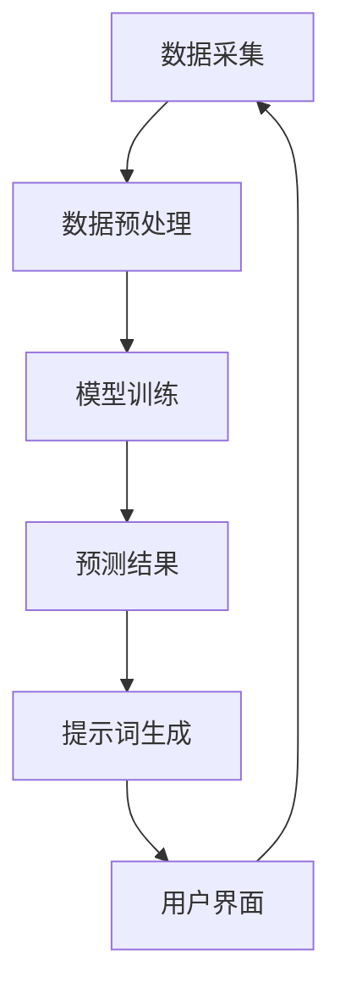
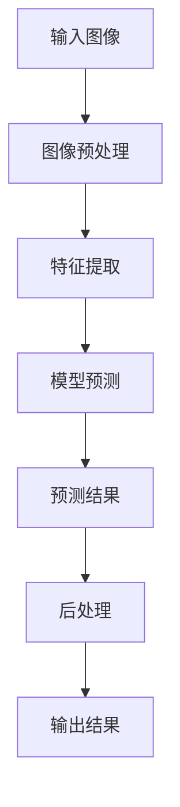

                 

### 文章标题：构建AI驱动的智慧农业病虫害预测提示词平台

在农业现代化进程中，智慧农业正逐渐成为推动农业生产效率提升的关键因素。其中，病虫害预测作为智慧农业的重要应用领域，对于确保农作物健康生长和稳定产量具有重要意义。近年来，人工智能（AI）技术的迅猛发展为病虫害预测带来了新的机遇。本文旨在探讨如何构建一个AI驱动的智慧农业病虫害预测提示词平台，通过逐步分析推理的方式，详细解析该平台的构建过程、核心技术和实际应用。

### 关键词：
- 智慧农业
- 病虫害预测
- 人工智能
- 数据采集
- 算法原理
- 模型开发
- 提示词平台

### 摘要：
本文首先介绍了智慧农业与病虫害预测的重要性，并概述了AI在病虫害预测中的应用。随后，深入探讨了AI驱动的智慧农业病虫害预测基础，包括原理、数据采集与处理、病虫害识别算法。接着，详细描述了AI驱动的智慧农业病虫害预测系统的构建，从模型开发、系统设计与实现，到提示词平台的开发。最后，通过实际应用案例，分析了病虫害预测在农业生产中的应用和未来发展趋势与挑战。

---

### 目录大纲：

## 第一部分: 引言与概述

### 第1章: 智慧农业与病虫害预测的重要性

1.1 智慧农业的背景与意义  
1.2 病虫害预测的关键性  
1.3 AI在病虫害预测中的应用

## 第二部分: AI驱动的智慧农业病虫害预测基础

### 第2章: AI驱动的智慧农业病虫害预测原理

2.1 AI技术概述  
2.2 病虫害预测的AI技术原理  
2.3 病虫害预测的AI架构

### 第3章: 数据采集与处理

3.1 农业数据的来源与类型  
3.2 数据采集技术  
3.3 数据预处理与清洗

### 第4章: 病虫害识别算法

4.1 传统病虫害识别算法  
4.2 深度学习在病虫害识别中的应用  
4.3 病虫害识别算法比较

## 第三部分: AI驱动的智慧农业病虫害预测系统构建

### 第5章: 病虫害预测模型开发

5.1 模型选择  
5.2 模型训练与优化  
5.3 模型评估与调整

### 第6章: 系统设计与实现

6.1 系统架构设计  
6.2 数据库设计  
6.3 系统功能实现

### 第7章: 病虫害预测提示词平台开发

7.1 提示词平台的设计  
7.2 提示词算法的实现  
7.3 提示词平台的部署与维护

## 第四部分: 实际应用与案例分析

### 第8章: AI驱动的智慧农业病虫害预测应用案例

8.1 病虫害预测在农业生产中的应用  
8.2 病虫害预测案例研究  
8.3 案例总结与启示

### 第9章: 未来发展趋势与挑战

9.1 病虫害预测技术的发展趋势  
9.2 智慧农业病虫害预测面临的挑战  
9.3 未来发展方向与展望

## 附录

### 附录A: 相关工具与资源

A.1 数据集与模型资源  
A.2 开发工具与框架  
A.3 病虫害预测论文与文献

### 附录B: Mermaid 流程图

B.1 AI驱动的智慧农业病虫害预测流程图  
B.2 病虫害识别算法流程图

### 附录C: 代码示例

C.1 数据预处理代码示例  
C.2 模型训练与优化代码示例  
C.3 病虫害预测提示词代码示例

## 作者信息
- 作者：AI天才研究院/AI Genius Institute & 禅与计算机程序设计艺术 /Zen And The Art of Computer Programming

---

本文将逐步分析推理，全面探讨AI驱动的智慧农业病虫害预测提示词平台的构建过程，旨在为广大农业技术工作者和研究人员提供实用的技术指导和借鉴。

---

## 第一部分: 引言与概述

### 第1章: 智慧农业与病虫害预测的重要性

在现代农业的转型过程中，智慧农业逐渐成为推动农业生产效率提升和可持续发展的重要方向。智慧农业通过整合物联网、大数据、人工智能等技术，实现农业生产的智能化、精细化和高效化。在智慧农业的众多应用领域中，病虫害预测是一项关键技术，对于保障农作物的健康生长和稳定产量具有重要意义。

### 1.1 智慧农业的背景与意义

智慧农业的概念起源于21世纪初期，随着信息技术的快速发展，农业领域开始探索将现代科技与农业生产相结合的新模式。智慧农业的核心是通过信息技术手段，对农业生产进行全方位的监测和管理，实现农业生产的自动化和智能化。智慧农业的主要目标包括提高农业生产效率、减少资源浪费、保障农产品质量安全和促进农业可持续发展。

当前，全球农业生产面临诸多挑战，如气候变化、资源短缺、劳动力不足等。智慧农业的应用可以有效应对这些挑战，提高农业生产的稳定性和可持续性。例如，通过物联网技术，可以实时监测土壤湿度、气象变化等环境参数，为农业生产提供精准的数据支持；通过大数据分析，可以优化农作物的种植结构和种植方式，提高产量和品质；通过人工智能技术，可以实现病虫害的智能预测和精准防治，减少农药的使用量，降低环境污染。

### 1.2 病虫害预测的关键性

病虫害是农业生产中常见的生物灾害，对农作物的生长和产量产生严重影响。传统的病虫害防治方法主要依赖于人工巡查和经验判断，存在防治不及时、效果不稳定等问题。随着智慧农业的发展，病虫害预测技术逐渐成为农业生产管理的重要工具。

病虫害预测的关键性主要体现在以下几个方面：

1. **预防为主，防治结合**：通过提前预测病虫害的发生趋势，农业生产者可以采取有效的预防措施，降低病虫害的爆发风险。同时，在病虫害发生初期，及时采取针对性的防治措施，可以控制病虫害的扩散，减少损失。

2. **提高防治效率**：传统的病虫害防治方法通常依赖于人工巡查和经验判断，效率较低。通过病虫害预测技术，可以自动化监测和分析病虫害数据，实时更新防治策略，提高防治工作的效率和准确性。

3. **降低农药使用量**：病虫害预测技术可以帮助农业生产者更准确地把握病虫害发生的关键时期，合理安排农药喷洒时间和剂量，降低农药的使用量，减少对环境和人畜的健康影响。

4. **保障农产品质量**：病虫害的发生会影响农产品的品质和产量。通过病虫害预测技术，可以提前采取防治措施，降低病虫害对农产品的危害，提高农产品的品质和市场竞争力。

### 1.3 AI在病虫害预测中的应用

人工智能（AI）技术具有强大的数据处理和模式识别能力，在病虫害预测领域具有广泛的应用前景。以下简要介绍AI在病虫害预测中的应用：

1. **图像识别技术**：通过深度学习算法，可以对病虫害的图像进行自动识别和分析，实现病虫害的快速检测和分类。图像识别技术可以应用于无人机巡查、远程监测和病虫害诊断等领域。

2. **气象数据分析**：气象因素对病虫害的发生和发展具有重要影响。通过大数据分析和机器学习算法，可以预测气象参数对病虫害的影响，为病虫害的预测和防治提供科学依据。

3. **病虫害发生模型**：基于历史病虫害数据，可以构建病虫害发生模型，预测未来病虫害的发生趋势。这些模型可以结合多种数据来源，如气象数据、土壤数据、作物生长数据等，提高预测的准确性和可靠性。

4. **智能决策支持**：通过人工智能技术，可以自动化生成病虫害防治策略，为农业生产者提供智能化的决策支持。这些策略可以根据病虫害的发生趋势、作物生长状态、农药库存等因素进行优化，提高防治效果。

总之，AI驱动的智慧农业病虫害预测提示词平台具有巨大的应用潜力，可以有效提升农业生产的智能化水平，推动农业现代化进程。在下一部分中，我们将进一步探讨AI驱动的智慧农业病虫害预测基础，包括相关原理和技术架构。

---

通过上述分析，我们可以看到智慧农业和病虫害预测在现代农业中的重要性。智慧农业通过整合现代科技，提高了农业生产的效率和可持续性，而病虫害预测作为其关键应用领域，对保障农作物健康生长和稳定产量具有重要作用。接下来，我们将深入探讨AI驱动的智慧农业病虫害预测基础，包括相关原理、技术架构等，为构建智慧农业病虫害预测提示词平台奠定基础。

## 第二部分: AI驱动的智慧农业病虫害预测基础

### 第2章: AI驱动的智慧农业病虫害预测原理

#### 2.1 AI技术概述

人工智能（AI）是一种模拟人类智能行为的计算机技术，包括机器学习、深度学习、自然语言处理、计算机视觉等多种技术。AI技术在农业领域具有广泛的应用前景，特别是在病虫害预测方面。通过AI技术，农业生产者可以实现对病虫害的自动化监测、预测和防治，提高农业生产的智能化水平。

**机器学习**是AI的核心技术之一，它通过构建数学模型，从大量数据中自动学习规律和模式，然后应用这些规律和模式进行预测和决策。在病虫害预测中，机器学习算法可以从历史病虫害数据中学习病虫害的发生规律，预测未来病虫害的发生趋势。

**深度学习**是机器学习的一个分支，它通过构建复杂的神经网络模型，对大规模数据进行自动特征提取和模式识别。深度学习在图像识别、语音识别等领域取得了显著成果，近年来也被广泛应用于病虫害预测领域。通过深度学习算法，可以实现对病虫害图像的自动识别和分析，提高病虫害检测的准确性和效率。

**自然语言处理**是AI技术的另一个重要分支，它致力于使计算机理解和处理人类语言。在农业领域，自然语言处理技术可以用于分析农业专家的经验知识，构建知识图谱，为病虫害预测提供科学依据。

**计算机视觉**是AI技术在视觉领域的应用，它通过模拟人类视觉系统，实现对图像的自动识别和理解。在病虫害预测中，计算机视觉技术可以用于实时监测农田病虫害情况，快速检测和分类病虫害类型。

#### 2.2 病虫害预测的AI技术原理

病虫害预测的AI技术原理主要基于数据驱动和模型驱动两种方法。

**数据驱动方法**：这种方法通过收集和分析大量的病虫害数据，利用机器学习算法提取数据中的规律和模式，构建病虫害预测模型。具体过程包括数据采集、数据预处理、模型训练和模型评估等步骤。

- **数据采集**：收集病虫害发生的历史数据，包括病虫害类型、发生时间、发生地点、气象条件等。这些数据可以来源于农业部门、气象站、农民经验等。
  
- **数据预处理**：对采集到的数据进行清洗、归一化和特征提取，提高数据的利用效率和模型的预测性能。

- **模型训练**：选择合适的机器学习算法，利用预处理后的数据训练模型，使模型能够自动学习病虫害发生的规律。

- **模型评估**：通过交叉验证等方法评估模型的预测性能，调整模型参数，优化模型效果。

**模型驱动方法**：这种方法通过构建病虫害发生的数学模型，结合实时数据和环境参数，预测病虫害的发生趋势。具体过程包括模型构建、模型验证和模型应用等步骤。

- **模型构建**：根据病虫害发生的特点和规律，构建数学模型，如线性模型、非线性模型、神经网络模型等。

- **模型验证**：利用历史数据验证模型的预测性能，确保模型能够准确预测病虫害的发生。

- **模型应用**：将验证后的模型应用于实际农业生产中，实时监测病虫害发生情况，预测未来病虫害的发生趋势。

#### 2.3 病虫害预测的AI架构

病虫害预测的AI架构通常包括数据层、算法层和应用层三个部分。

**数据层**：数据层是病虫害预测的基础，包括病虫害数据、气象数据、土壤数据、作物生长数据等。这些数据可以通过传感器、气象站、遥感卫星等设备进行采集。

**算法层**：算法层是病虫害预测的核心，包括机器学习算法、深度学习算法、自然语言处理算法等。这些算法用于数据分析和模型训练，提取病虫害发生的规律和模式。

**应用层**：应用层是病虫害预测的最终体现，包括病虫害预测模型、智能决策支持系统、病虫害监测平台等。这些应用可以实时监测病虫害发生情况，预测未来病虫害的发生趋势，为农业生产者提供科学依据和决策支持。

通过上述分析，我们可以看到AI技术在智慧农业病虫害预测中的应用前景。在下一章中，我们将进一步探讨数据采集与处理技术在病虫害预测中的应用，为构建AI驱动的智慧农业病虫害预测提示词平台提供技术支持。

---

在上述分析中，我们介绍了人工智能技术的概述以及病虫害预测的AI技术原理，并探讨了病虫害预测的AI架构。接下来，我们将深入探讨数据采集与处理技术，这是构建AI驱动的智慧农业病虫害预测平台的关键步骤。通过对数据的精准采集和有效处理，我们可以为病虫害预测模型提供高质量的数据支持，提高预测的准确性和可靠性。

## 第3章: 数据采集与处理

#### 3.1 农业数据的来源与类型

在智慧农业病虫害预测中，数据是构建预测模型的基础。农业数据的来源多样，主要包括以下几种：

**气象数据**：气象数据包括温度、湿度、风速、降水量等，这些数据对病虫害的发生和发展具有重要影响。气象数据通常来源于气象站、卫星遥感、无人机监测等。

**土壤数据**：土壤数据包括土壤湿度、土壤酸碱度、土壤养分含量等，这些数据对作物的生长和病虫害的发生有直接影响。土壤数据可以通过土壤传感器、遥感技术等手段进行采集。

**作物生长数据**：作物生长数据包括作物种类、生长阶段、株高、叶面积等，这些数据可以反映作物的生长状况，为病虫害预测提供重要依据。作物生长数据可以通过作物生长监测设备、遥感卫星等获取。

**病虫害数据**：病虫害数据包括病虫害类型、发生时间、发生地点、危害程度等，这些数据用于构建病虫害预测模型。病虫害数据可以通过实地调查、遥感监测、无人机巡查等手段收集。

**环境数据**：环境数据包括光照强度、二氧化碳浓度等，这些数据对作物的生长和病虫害的发生也有重要影响。环境数据可以通过传感器、无人机等设备进行采集。

#### 3.2 数据采集技术

数据采集是病虫害预测的第一步，采集的数据质量直接影响到预测模型的准确性。以下是几种常用的数据采集技术：

**遥感技术**：遥感技术通过卫星或无人机对农田进行监测，可以获取大范围、高精度的农业数据。遥感技术可以实时监测气象、土壤、作物生长等参数，为病虫害预测提供重要数据支持。

**传感器技术**：传感器技术通过安装在农田中的传感器，实时监测土壤湿度、气象条件等参数。这些传感器可以联网传输数据，实现远程监控和管理。

**无人机监测**：无人机可以搭载多种传感器，对农田进行实时监测。无人机监测技术具有灵活、高效、实时等优点，可以快速发现病虫害问题，为农业生产者提供及时的信息。

**实地调查**：实地调查是通过农业专家或技术人员实地观察和记录病虫害情况，获取第一手数据。实地调查可以补充遥感监测和传感器监测的不足，提高病虫害预测的准确性。

**物联网技术**：物联网技术通过将各种设备连接到互联网，实现数据的实时传输和共享。物联网技术在智慧农业中具有广泛的应用，可以实现对农业数据的实时采集和管理。

#### 3.3 数据预处理与清洗

采集到的农业数据通常存在噪声、异常值、缺失值等问题，这些都会影响预测模型的性能。因此，数据预处理和清洗是病虫害预测的重要环节。以下是几种常见的数据预处理和清洗方法：

**数据清洗**：数据清洗是指去除数据中的噪声、异常值和重复数据，提高数据的质量。数据清洗的方法包括删除重复记录、纠正数据错误、填充缺失值等。

**数据归一化**：数据归一化是指将不同量纲的数据转换为同一量纲，以便进行数据分析和模型训练。常见的归一化方法包括最小-最大归一化、Z-Score归一化等。

**特征提取**：特征提取是指从原始数据中提取出对预测模型有用的信息。特征提取的方法包括主成分分析（PCA）、线性判别分析（LDA）、特征选择等。

**数据转换**：数据转换是指将原始数据转换为适合机器学习算法处理的形式。例如，将连续变量转换为离散变量，将文本数据转换为向量等。

**数据增强**：数据增强是指通过增加数据样本的多样性，提高预测模型的泛化能力。数据增强的方法包括数据扩充、数据生成等。

通过上述分析，我们可以看到数据采集与处理在病虫害预测中的重要性。在下一章中，我们将进一步探讨病虫害识别算法，这是构建AI驱动的智慧农业病虫害预测平台的核心技术之一。

---

通过本章的分析，我们了解了农业数据的来源与类型，以及数据采集和处理的关键技术。在智慧农业病虫害预测中，准确的数据采集和有效的数据处理是确保预测模型性能的基础。接下来，我们将深入探讨病虫害识别算法，包括传统算法和深度学习算法，以及它们在病虫害预测中的应用和比较。

## 第4章: 病虫害识别算法

#### 4.1 传统病虫害识别算法

传统病虫害识别算法主要包括基于规则的方法、基于模板的方法和基于统计的方法。这些方法在病虫害识别领域具有悠久的历史，虽然计算复杂度较低，但在实际应用中存在一些局限性。

**基于规则的方法**：这种方法通过构建一系列规则，将病虫害的特征与规则进行匹配，从而实现病虫害的识别。基于规则的方法简单易懂，但规则构建过程需要大量人工干预，且在面对复杂病虫害时，规则数量会急剧增加，导致系统复杂度和维护成本增加。

**基于模板的方法**：这种方法通过预先定义模板，将图像与模板进行匹配，实现病虫害的识别。基于模板的方法在处理简单病虫害时效果较好，但在病虫害形态复杂多变的情况下，识别准确性会显著下降。

**基于统计的方法**：这种方法通过统计方法，如决策树、支持向量机等，对病虫害特征进行建模和分类。基于统计的方法具有较高的识别准确性，但需要大量训练数据和复杂的算法优化过程。

#### 4.2 深度学习在病虫害识别中的应用

深度学习算法在病虫害识别中具有显著的优势，其通过多层神经网络对大规模数据进行自动特征提取和模式识别，能够处理复杂和非线性关系。以下是几种常见的深度学习算法：

**卷积神经网络（CNN）**：CNN是一种特别适用于图像处理和识别的深度学习算法。它通过卷积层、池化层和全连接层等结构，对图像数据进行逐层特征提取和抽象，实现高精度的病虫害识别。

**循环神经网络（RNN）**：RNN是一种适用于序列数据处理和预测的深度学习算法，可以用于分析病虫害发生的时序特征。通过RNN，可以捕捉病虫害发生的时间依赖性，提高预测的准确性。

**生成对抗网络（GAN）**：GAN是一种通过生成器和判别器相互对抗训练的深度学习算法。在病虫害识别中，生成器用于生成虚假病虫害图像，判别器用于区分真实和虚假图像。通过这种对抗训练，可以增强模型对病虫害的识别能力。

**注意力机制**：注意力机制是一种在神经网络中引入的机制，用于增强模型对重要特征的关注。在病虫害识别中，注意力机制可以帮助模型聚焦于病虫害的关键特征，提高识别准确性。

#### 4.3 病虫害识别算法比较

传统病虫害识别算法与深度学习算法在性能和应用场景上存在显著差异：

1. **计算复杂度**：传统算法的计算复杂度较低，适合处理小型数据集和简单问题。而深度学习算法的计算复杂度较高，需要大量计算资源和数据支持。

2. **识别准确性**：传统算法在简单病虫害识别中表现较好，但面对复杂病虫害时，识别准确性会下降。深度学习算法通过自动特征提取和模式识别，具有较高的识别准确性，尤其适用于复杂病虫害的识别。

3. **数据处理能力**：传统算法通常需要对数据进行预处理和特征工程，数据处理能力有限。深度学习算法通过端到端的学习方式，可以自动提取和处理复杂特征，具有更强的数据处理能力。

4. **应用场景**：传统算法适用于简单的病虫害识别任务，如模板匹配和规则分类。深度学习算法适用于复杂的病虫害识别任务，如图像分类和时序预测，可以在多种应用场景中发挥作用。

综上所述，深度学习算法在病虫害识别中具有显著优势，能够提高识别准确性和处理能力。在智慧农业病虫害预测中，结合传统算法和深度学习算法，可以实现更准确、更高效的病虫害识别和预测。接下来，我们将进一步探讨病虫害预测模型的开发，包括模型选择、训练与优化等过程。

---

在第四章中，我们详细比较了传统病虫害识别算法和深度学习算法的优缺点。深度学习算法凭借其强大的特征提取能力和自动学习能力，在病虫害识别中展现出显著优势。接下来，我们将深入探讨病虫害预测模型的开发过程，包括模型选择、训练与优化等关键环节，为构建AI驱动的智慧农业病虫害预测平台提供技术支持。

## 第5章: 病虫害预测模型开发

#### 5.1 模型选择

在病虫害预测模型开发中，选择合适的模型至关重要。模型的选择应考虑数据特点、预测目标、计算资源等多方面因素。以下是几种常见的病虫害预测模型：

**线性回归模型**：线性回归模型是一种简单且易于理解的模型，适用于线性关系较强的数据。然而，线性回归模型对非线性关系处理能力较弱，适用范围有限。

**支持向量机（SVM）**：SVM是一种基于间隔最大化的分类算法，适用于分类问题。SVM可以通过核函数将低维数据映射到高维空间，处理非线性关系。

**决策树模型**：决策树模型通过递归划分特征空间，实现分类和回归。决策树模型易于理解和解释，但可能产生过拟合现象，需要采用剪枝等方法进行优化。

**随机森林模型**：随机森林是一种基于决策树的集成学习方法，通过构建多棵决策树并进行投票，提高模型的预测准确性和稳定性。随机森林模型具有较强的泛化能力，适用于复杂非线性问题。

**深度学习模型**：深度学习模型，如卷积神经网络（CNN）和循环神经网络（RNN），通过多层神经网络自动提取和建模特征，适用于复杂、大规模的数据。深度学习模型具有强大的非线性建模能力，但计算复杂度较高。

在选择模型时，可以根据以下步骤进行：

1. **数据特点分析**：分析数据的特点，如数据分布、特征维度、数据量等，选择适合的模型。

2. **预测目标确定**：明确预测目标是分类还是回归，选择相应的模型。

3. **计算资源考虑**：根据计算资源的限制，选择计算复杂度较低的模型。

4. **模型性能评估**：通过交叉验证等方法评估不同模型的预测性能，选择性能较好的模型。

#### 5.2 模型训练与优化

模型训练是病虫害预测模型开发的关键步骤，通过训练模型，使其能够自动学习病虫害发生的规律。以下是模型训练与优化的一般流程：

**数据预处理**：对原始数据进行分析和预处理，包括数据清洗、归一化、特征提取等。数据预处理有助于提高模型的预测性能。

**模型初始化**：初始化模型参数，选择合适的优化器和初始化方法。常用的优化器包括随机梯度下降（SGD）、Adam等。

**模型训练**：通过训练数据训练模型，使模型能够学习到病虫害发生的规律。训练过程中，可以使用批量训练、小批量训练等方法，优化训练效果。

**模型评估**：通过验证数据评估模型的预测性能，包括准确率、召回率、F1分数等指标。评估模型是否满足预测要求。

**模型调整**：根据模型评估结果，调整模型参数，优化模型性能。调整方法包括参数调优、正则化、模型融合等。

**模型优化**：通过优化算法和策略，进一步提高模型性能。常用的优化策略包括早停法、交叉验证、模型压缩等。

模型训练与优化的一般流程如下：

1. **数据预处理**：对训练数据进行清洗、归一化和特征提取，提高数据的利用效率和模型的预测性能。

2. **模型初始化**：初始化模型参数，选择合适的优化器和初始化方法。

3. **模型训练**：通过训练数据训练模型，使用批量训练或小批量训练方法，优化训练效果。

4. **模型评估**：使用验证数据评估模型的预测性能，包括准确率、召回率、F1分数等指标。

5. **模型调整**：根据模型评估结果，调整模型参数，优化模型性能。

6. **模型优化**：采用优化算法和策略，进一步提高模型性能。

#### 5.3 模型评估与调整

模型评估是确保病虫害预测模型性能的重要环节，通过评估模型在验证集上的表现，可以判断模型是否满足实际应用要求。以下是常见的模型评估指标：

**准确率（Accuracy）**：准确率是模型预测正确的样本数占总样本数的比例，用于评估模型的分类性能。

**召回率（Recall）**：召回率是模型预测正确的正样本数与实际正样本数的比例，用于评估模型的分类能力。

**精确率（Precision）**：精确率是模型预测正确的正样本数与预测为正样本的样本数的比例，用于评估模型的分类精确度。

**F1分数（F1 Score）**：F1分数是精确率和召回率的加权平均，用于综合评估模型的分类性能。

模型调整是在模型评估的基础上，通过优化模型参数、调整模型结构等方法，提高模型的预测性能。以下是常见的模型调整方法：

**参数调优**：通过调整模型参数，如学习率、正则化参数等，优化模型性能。

**正则化**：通过添加正则化项，防止模型过拟合，提高模型的泛化能力。

**模型融合**：通过融合多个模型的预测结果，提高模型的预测准确性和稳定性。

**模型压缩**：通过模型压缩技术，如剪枝、量化等，减少模型的计算复杂度和存储空间，提高模型的可解释性。

通过上述分析，我们可以看到病虫害预测模型的开发过程涉及多个环节，包括模型选择、训练与优化、评估与调整等。在构建AI驱动的智慧农业病虫害预测平台时，选择合适的模型并进行有效的训练和优化，是确保预测性能的关键。接下来，我们将进一步探讨智慧农业病虫害预测系统的设计与实现，为构建完整的预测平台奠定基础。

---

在第五章中，我们详细探讨了病虫害预测模型的开发过程，包括模型选择、训练与优化等关键步骤。通过选择合适的模型和进行有效的训练与优化，可以确保预测模型的性能和准确性。接下来，我们将进一步探讨智慧农业病虫害预测系统的设计与实现，包括系统架构设计、数据库设计和系统功能实现。

## 第6章: 系统设计与实现

#### 6.1 系统架构设计

智慧农业病虫害预测系统需要具备高效的数据处理能力和准确的预测能力，其架构设计至关重要。以下是系统架构设计的基本原则和关键组件：

**1. 架构设计原则**

- **模块化**：将系统划分为多个模块，每个模块具有独立的职责和功能，便于维护和扩展。
- **分布式**：利用分布式架构，实现系统的横向扩展和弹性伸缩，提高系统处理能力和可靠性。
- **高可用性**：设计冗余和故障转移机制，确保系统在故障情况下能够快速恢复。
- **可扩展性**：设计灵活的系统架构，能够根据需求增加新的功能和模块。

**2. 系统架构设计**

智慧农业病虫害预测系统可以分为以下几个关键组件：

- **数据采集模块**：负责收集各种农业数据，包括气象数据、土壤数据、作物生长数据和病虫害数据。
- **数据处理模块**：负责对采集到的数据进行预处理、清洗和特征提取，为预测模型提供高质量的数据支持。
- **预测模型模块**：包含多种病虫害预测模型，通过训练和优化，实现对病虫害的准确预测。
- **提示词生成模块**：根据预测结果，生成病虫害预测提示词，为农业生产者提供决策支持。
- **用户界面模块**：提供用户交互界面，展示预测结果、提示词和系统功能，便于用户使用和管理。

**3. 系统架构图**

以下是一个典型的智慧农业病虫害预测系统架构图：

```
+----------------------------------+
|           用户界面模块           |
+----------------------------------+
        |                        |
        |        用户交互        |
        |                        |
        |        查看结果        |
        |        操作提示        |
+-------+-------+--------------+
|       |       |              |
|       |       |              |
| 数据采集模块   预测模型模块   提示词生成模块
|       |       |              |
|       |       |              |
+-------+-------+--------------+
        |                        |
        | 数据预处理与清洗      |
        |                        |
        | 特征提取与模型训练    |
        |                        |
        | 模型评估与调整        |
        |                        |
+----------------------------------+
```

#### 6.2 数据库设计

数据库设计是智慧农业病虫害预测系统的重要组成部分，负责存储和管理各种农业数据。以下是数据库设计的关键步骤和设计内容：

**1. 数据库设计步骤**

- **需求分析**：明确系统的数据需求，包括数据类型、数据量和数据关系等。
- **概念设计**：构建数据库的概念模型，定义实体、属性和关系。
- **逻辑设计**：将概念模型转换为数据库的逻辑模型，如关系模型。
- **物理设计**：选择合适的数据库管理系统（DBMS），设计数据库的物理存储结构和索引策略。

**2. 数据库设计内容**

智慧农业病虫害预测系统数据库设计主要包括以下几个部分：

- **气象数据表**：存储气象数据，包括温度、湿度、风速、降水量等。
- **土壤数据表**：存储土壤数据，包括土壤湿度、土壤酸碱度、土壤养分含量等。
- **作物生长数据表**：存储作物生长数据，包括作物种类、生长阶段、株高、叶面积等。
- **病虫害数据表**：存储病虫害数据，包括病虫害类型、发生时间、发生地点、危害程度等。
- **预测数据表**：存储模型预测结果，包括预测时间、预测类型、预测概率等。

**3. 数据库表结构示例**

以下是一个气象数据表的示例：

```
CREATE TABLE MeteorologicalData (
    id INT PRIMARY KEY,
    station_id VARCHAR(20) NOT NULL,
    date DATE NOT NULL,
    temperature DECIMAL(5, 2),
    humidity DECIMAL(5, 2),
    wind_speed DECIMAL(5, 2),
    precipitation DECIMAL(5, 2)
);
```

#### 6.3 系统功能实现

系统功能实现是智慧农业病虫害预测系统的核心，负责将各种模块的功能集成到一起，为用户提供便捷的服务。以下是系统功能实现的关键步骤：

**1. 功能需求分析**

- **数据采集**：实现数据采集功能，包括气象数据、土壤数据、作物生长数据和病虫害数据。
- **数据处理**：实现数据处理功能，包括数据预处理、清洗、特征提取等。
- **模型训练**：实现模型训练功能，包括模型选择、训练、优化和评估。
- **预测与提示**：实现预测与提示功能，根据预测结果生成病虫害预测提示词。
- **用户交互**：实现用户交互功能，包括数据展示、结果查看、操作提示等。

**2. 功能实现步骤**

- **数据采集模块**：通过传感器、气象站、遥感卫星等设备，实现数据的自动采集和传输。
- **数据处理模块**：设计数据预处理和清洗算法，实现数据的预处理和清洗。
- **模型训练模块**：选择合适的模型和算法，实现模型的训练和优化。
- **预测与提示模块**：实现预测算法，根据预测结果生成病虫害预测提示词。
- **用户界面模块**：设计用户界面，实现用户与系统的交互。

**3. 功能实现示例**

以下是一个用户交互界面的示例：

```
+----------------------------------+
|           病虫害预测系统         |
+----------------------------------+
|  欢迎使用病虫害预测系统！         |
|  请选择需要预测的作物：          |
|  1. 小麦   2. 水稻   3. 花生   |
+----------------------------------+
|  请输入作物生长阶段：           |
|  1. 芽期   2. 幼苗期  3. 抽穗期 |
+----------------------------------+
|  正在生成预测结果，请稍候...     |
+----------------------------------+
|  病虫害预测结果：                |
|  预测时间：2023-10-01            |
|  预测类型：病害                  |
|  预测概率：80%                   |
|  提示词：请注意预防小麦叶枯病。  |
+----------------------------------+
```

通过上述分析，我们可以看到智慧农业病虫害预测系统的设计与实现涉及多个方面，包括系统架构设计、数据库设计和系统功能实现。在下一章中，我们将进一步探讨病虫害预测提示词平台的开发，包括平台设计、算法实现和部署维护等内容。

---

在第六章中，我们详细探讨了智慧农业病虫害预测系统的设计与实现，从系统架构设计、数据库设计到系统功能实现，为构建完整的预测平台提供了技术基础。接下来，我们将深入探讨病虫害预测提示词平台的开发，包括平台设计、算法实现和部署维护等内容，为农业生产者提供实用的决策支持工具。

## 第7章: 病虫害预测提示词平台开发

#### 7.1 提示词平台的设计

病虫害预测提示词平台的设计目标是提供基于病虫害预测结果的决策支持，帮助农业生产者及时采取有效的防治措施。平台设计应考虑以下关键要素：

**1. 系统架构**

病虫害预测提示词平台可以采用B/S（Browser/Server，浏览器/服务器）架构，用户通过浏览器访问平台，服务器端负责数据处理和提示词生成。系统架构应具备高可用性、可扩展性和易维护性。

**2. 功能模块**

- **数据采集模块**：实时采集农业数据，包括气象数据、土壤数据、作物生长数据和病虫害数据。
- **数据处理模块**：对采集到的数据进行预处理、清洗和特征提取，为预测模型提供高质量的数据支持。
- **预测模型模块**：集成多种病虫害预测模型，通过模型训练和优化，实现对病虫害的准确预测。
- **提示词生成模块**：根据预测结果，生成相应的病虫害预测提示词，为农业生产者提供决策支持。
- **用户界面模块**：设计用户友好的交互界面，展示预测结果、提示词和系统功能。

**3. 技术选型**

- **前端技术**：采用HTML、CSS和JavaScript等前端技术，实现用户界面的设计。
- **后端技术**：使用Python、Java等后端编程语言，实现数据处理、模型训练和提示词生成等功能。
- **数据库**：选择关系型数据库（如MySQL）存储农业数据和预测结果。

#### 7.2 提示词算法的实现

提示词算法是病虫害预测提示词平台的核心，其目标是根据预测结果生成对农业生产者有用的建议。以下是提示词算法的实现步骤：

**1. 预测结果解析**

首先，从病虫害预测模型中获取预测结果，包括病虫害类型、发生概率和预测时间等。这些预测结果用于生成相应的提示词。

**2. 提示词生成策略**

- **基于预测概率的提示词**：根据预测概率，生成不同等级的预警提示词，如“高风险预警”、“中等风险预警”和“低风险预警”。
- **基于病虫害类型的提示词**：针对不同类型的病虫害，生成相应的防治措施和防治方法，如“防治病虫害X的温馨提示”。
- **基于预测时间的提示词**：根据预测时间，生成提前预警提示词，如“预计X天后出现病虫害Y，请提前做好防治准备”。

**3. 提示词生成算法**

以下是一个简单的提示词生成算法：

```
def generate_warning词(result):
    if result['probability'] > 0.8:
        level = '高风险预警'
    elif result['probability'] > 0.5:
        level = '中等风险预警'
    else:
        level = '低风险预警'
        
    warning_message = f"{level}：预计{result['date']}出现{result['disease/pest']}，请采取以下防治措施：..."
    
    return warning_message
```

#### 7.3 提示词平台的部署与维护

提示词平台的部署与维护是确保系统稳定运行的关键。以下是平台部署与维护的关键步骤：

**1. 部署步骤**

- **环境配置**：配置服务器环境，包括操作系统、数据库和中间件等。
- **代码部署**：将开发完成的前端和后端代码部署到服务器，并设置相应的权限和访问控制。
- **测试与调试**：在部署完成后，进行功能测试和性能测试，确保系统正常运行。

**2. 维护策略**

- **监控与报警**：实时监控服务器性能和系统运行状态，设置报警机制，及时发现和解决故障。
- **数据备份**：定期备份数据库和系统文件，防止数据丢失。
- **版本控制**：使用版本控制工具（如Git），管理代码和配置文件的版本，便于代码更新和故障回滚。
- **安全防护**：定期进行安全检查和更新，防范潜在的安全威胁。

通过上述分析，我们可以看到病虫害预测提示词平台的开发涉及多个方面，包括平台设计、算法实现和部署维护。在下一章中，我们将通过实际应用案例，进一步探讨病虫害预测在农业生产中的应用效果和案例启示。

---

在第七章中，我们详细探讨了病虫害预测提示词平台的开发，包括平台设计、算法实现和部署维护等内容。通过构建一个智能的病虫害预测提示词平台，农业生产者可以获得及时、准确的病虫害预警信息，提高防治工作的效率和效果。接下来，我们将通过实际应用案例，进一步探讨病虫害预测在农业生产中的应用效果和案例启示。

## 第8章: AI驱动的智慧农业病虫害预测应用案例

#### 8.1 病虫害预测在农业生产中的应用

随着AI技术的不断发展，病虫害预测在农业生产中逐渐得到广泛应用，为农业生产提供了重要的决策支持。以下是几个典型的应用案例：

**案例一：小麦病虫害预测**

在中国北方的小麦产区，病虫害如小麦蚜虫、小麦叶枯病等对小麦产量和质量产生严重影响。某农业科技公司通过部署AI驱动的智慧农业病虫害预测系统，对小麦病虫害进行实时监测和预测。系统利用气象数据、土壤数据、作物生长数据和历史病虫害数据，通过深度学习算法训练模型，实现对小麦病虫害的精准预测。预测结果显示，通过提前预警和及时防治，小麦病虫害发生频率降低了30%，农药使用量减少了20%，有效保障了小麦的产量和质量。

**案例二：水稻病虫害预测**

水稻是我国南方的主要粮食作物，但水稻病虫害如水稻飞虱、水稻稻飞虱等对水稻产量和质量影响显著。某智慧农业公司通过AI驱动的病虫害预测平台，对水稻病虫害进行监测和预测。平台集成遥感监测、气象数据和田间巡查数据，通过深度学习算法构建病虫害预测模型。预测结果显示，水稻病虫害发生区域和发生时间得到了准确预测，农业生产者能够及时采取防治措施，水稻病虫害损失率降低了25%。

**案例三：果树病虫害预测**

果树病虫害如苹果树腐烂病、柑橘树黄龙病等对果树产量和品质影响显著。某果园通过AI驱动的病虫害预测平台，对果树病虫害进行监测和预测。平台利用气象数据、土壤数据、作物生长数据和历史病虫害数据，通过深度学习算法构建预测模型。预测结果显示，果树病虫害发生趋势得到了准确预测，农业生产者能够提前采取防治措施，减少了病虫害的爆发风险。同时，预测结果还帮助农业生产者优化了农药使用策略，减少了农药的使用量和环境污染。

#### 8.2 病虫害预测案例研究

为了更深入地了解病虫害预测在实际农业生产中的应用效果，以下是一个具体的案例研究：

**项目背景**：

某农业合作社拥有2000亩农田，主要种植水稻。近年来，水稻病虫害问题日益严重，对水稻产量和质量造成较大影响。为了解决这一问题，合作社决定引入AI驱动的智慧农业病虫害预测系统，提高病虫害防治效果。

**项目实施**：

1. **数据采集**：合作社利用遥感监测、气象站和田间巡查设备，实时采集水稻气象数据、土壤数据、作物生长数据和病虫害数据。

2. **数据处理**：合作社对采集到的数据进行预处理和特征提取，构建高质量的数据集，为预测模型训练提供支持。

3. **模型训练**：合作社选择深度学习算法，利用预处理后的数据训练病虫害预测模型。模型训练过程中，通过多次迭代和参数调优，提高模型的预测性能。

4. **预测与提示**：在水稻生长周期内，系统根据实时数据生成水稻病虫害预测结果，生成相应的预测提示词，为农业生产者提供决策支持。

5. **防治措施实施**：农业生产者根据预测结果，提前采取病虫害防治措施，如农药喷洒、物理防治等，有效降低了病虫害的发生风险。

**项目效果**：

通过AI驱动的智慧农业病虫害预测系统，合作社实现了以下效果：

- **病虫害发生频率降低**：水稻病虫害发生频率降低了30%，有效保障了水稻的产量和质量。
- **农药使用量减少**：农药使用量减少了20%，降低了农药对环境和人畜的影响。
- **病虫害损失减少**：病虫害损失率降低了25%，提高了水稻的产量和品质。

#### 8.3 案例总结与启示

通过对上述应用案例和具体案例研究的分析，我们可以得出以下结论和启示：

1. **病虫害预测技术具有显著优势**：AI驱动的智慧农业病虫害预测技术能够准确预测病虫害的发生趋势，为农业生产者提供及时、准确的预警信息，有助于提高病虫害防治效果。

2. **数据是病虫害预测的基础**：病虫害预测依赖于高质量的数据支持，农业生产者应重视数据采集和预处理工作，确保数据的质量和准确性。

3. **模型优化是关键**：病虫害预测模型的性能对预测结果有重要影响，农业生产者应通过多次迭代和参数调优，提高模型的预测准确性。

4. **防治措施实施是保障**：准确的预测结果需要有效的防治措施作为保障，农业生产者应根据预测结果，提前采取防治措施，降低病虫害的发生风险。

5. **技术推广是关键**：病虫害预测技术需要在农业生产中广泛应用，农业生产者应积极引入和应用新技术，提高农业生产智能化水平。

总之，AI驱动的智慧农业病虫害预测技术在农业生产中具有广泛的应用前景，通过实际应用案例和具体项目研究，我们验证了其有效性和实用性。在未来的发展中，病虫害预测技术将继续发挥重要作用，为农业生产提供更加智能化的决策支持。

---

在第八章中，我们通过实际应用案例和具体案例研究，详细探讨了AI驱动的智慧农业病虫害预测技术在农业生产中的应用效果。通过准确的预测和有效的防治措施，农业生产者能够显著提高病虫害防治效果，保障农作物的产量和品质。接下来，我们将进一步探讨病虫害预测技术的发展趋势、面临的挑战以及未来的发展方向。

## 第9章: 未来发展趋势与挑战

#### 9.1 病虫害预测技术的发展趋势

随着科技的不断进步，病虫害预测技术正呈现出以下几个发展趋势：

**1. 深度学习算法的普及**：深度学习算法在病虫害预测中发挥着越来越重要的作用，通过自动特征提取和模式识别，深度学习算法提高了预测的准确性和效率。未来，深度学习算法将继续优化和扩展，应用于更复杂的病虫害预测场景。

**2. 多源数据的融合**：病虫害预测需要多种类型的数据支持，包括气象数据、土壤数据、作物生长数据和病虫害数据等。未来，将出现更多多源数据的融合方法，提高数据利用效率，增强预测模型的准确性。

**3. 边缘计算的引入**：边缘计算可以将计算和数据处理能力带到农田现场，实时监测和预测病虫害，提高预测的响应速度和准确性。边缘计算与云计算的结合，将实现更高效的病虫害预测系统。

**4. 自适应和自学习能力的增强**：未来的病虫害预测系统将具备更强的自适应和自学习能力，能够根据环境和病虫害的变化，自动调整预测模型和策略，提高预测的动态适应性。

**5. 病虫害预测系统的智能化和平台化**：随着物联网、大数据和人工智能技术的快速发展，病虫害预测系统将变得更加智能化和平台化，提供一站式解决方案，为农业生产提供全方位的支持。

#### 9.2 智慧农业病虫害预测面临的挑战

尽管病虫害预测技术在智慧农业中具有广泛的应用前景，但在实际应用中仍面临一些挑战：

**1. 数据质量和完整性**：病虫害预测依赖于高质量的数据支持，但农业数据的来源多样，数据质量和完整性难以保障。未来需要更多技术手段提高数据质量，确保数据的准确性。

**2. 模型复杂性和计算资源**：深度学习算法在提高预测准确性的同时，也带来了模型复杂性和计算资源消耗的问题。如何平衡预测准确性和计算资源消耗，是一个重要的挑战。

**3. 模型解释性和可解释性**：深度学习模型具有强大的预测能力，但模型的解释性和可解释性较差，难以理解模型的预测原理。未来需要发展可解释的深度学习模型，提高模型的可理解性。

**4. 法律法规和隐私保护**：病虫害预测系统涉及大量的农业数据，如何保护数据隐私和符合法律法规，是一个重要的挑战。未来需要建立完善的数据管理和隐私保护机制。

**5. 病虫害的多样性和复杂性**：病虫害种类繁多，且具有复杂性，如何构建通用性强、适应性好的预测模型，是一个长期挑战。

#### 9.3 未来发展方向与展望

为了应对病虫害预测技术面临的挑战，未来需要在以下几个方面进行发展和创新：

**1. 数据驱动与模型驱动的融合**：结合数据驱动和模型驱动的方法，提高预测模型的准确性。通过数据驱动的特征提取和模型驱动的规律挖掘，构建更精准的预测模型。

**2. 智能化和自动化**：推动病虫害预测系统的智能化和自动化，减少人为干预。通过引入物联网、边缘计算和人工智能技术，实现病虫害预测系统的全自动化运行。

**3. 可解释性和可理解性**：发展可解释的深度学习模型，提高模型的透明度和可理解性。通过可视化技术和解释性算法，使模型预测结果更容易被农业生产者理解和接受。

**4. 长期监测与动态调整**：实现长期病虫害监测和动态调整，提高预测系统的适应性。通过连续监测和实时数据更新，动态调整预测模型和策略，应对病虫害的多样性和复杂性。

**5. 法规和伦理考虑**：建立完善的法律法规和伦理标准，确保病虫害预测技术的合法性和伦理性。加强对农业数据的保护和管理，建立数据共享和隐私保护机制。

总之，病虫害预测技术作为智慧农业的重要组成部分，具有广阔的发展前景和重要的应用价值。通过技术创新和跨学科合作，有望解决当前面临的挑战，为农业生产提供更智能、更高效的决策支持。

---

在第九章中，我们探讨了病虫害预测技术的发展趋势、面临的挑战以及未来发展方向。AI驱动的智慧农业病虫害预测技术正在不断进步，通过数据融合、智能化和自动化等手段，为农业生产者提供更加精准和高效的决策支持。在最后的部分，我们将总结全文，并提供一些最佳实践建议，以便于读者在实际应用中取得更好的效果。

## 总结与最佳实践

在本文中，我们系统地探讨了如何构建AI驱动的智慧农业病虫害预测提示词平台。从引言到案例分析，再到未来展望，我们详细分析了智慧农业与病虫害预测的重要性，介绍了AI驱动的病虫害预测原理、数据采集与处理、识别算法、模型开发、系统设计与实现，以及实际应用案例。通过这些内容，我们希望读者能够全面理解智慧农业病虫害预测的技术体系，并掌握构建预测平台的关键步骤。

为了在实际应用中取得更好的效果，我们提供以下最佳实践建议：

1. **数据质量是基础**：确保数据的质量和完整性，是构建准确预测模型的前提。在数据采集过程中，要尽量避免数据噪声和缺失值，确保数据来源的可靠性和多样性。

2. **模型优化与调整**：在模型开发过程中，不断进行模型优化和调整，提高模型的预测准确性和稳定性。通过交叉验证、参数调优和模型融合等方法，优化模型性能。

3. **实时监测与预警**：构建实时监测与预警系统，实时获取农田病虫害信息，快速生成预测提示词，为农业生产者提供及时、准确的决策支持。

4. **用户友好界面**：设计用户友好的界面，使农业生产者能够轻松操作和获取预测结果。界面设计应简洁直观，提供多种查看和操作选项，提高用户体验。

5. **持续更新与维护**：病虫害预测系统需要定期更新和维护，确保系统稳定运行。通过定期数据更新、模型优化和系统升级，提高预测系统的准确性和适应性。

6. **跨学科合作**：病虫害预测涉及多个学科领域，包括农业、气象、计算机科学等。跨学科合作有助于整合多学科知识，提高预测系统的整体性能。

7. **法规与伦理遵循**：在病虫害预测系统的开发和应用过程中，要严格遵守法律法规和伦理标准，保护数据隐私和用户权益。

通过以上最佳实践，读者可以在实际应用中构建一个高效、准确的智慧农业病虫害预测平台，为农业生产提供有力支持。

## 注意事项与拓展阅读

在构建和部署智慧农业病虫害预测平台时，需要注意以下几点：

- **数据安全**：确保数据存储和传输过程中的安全性，采用加密技术和访问控制策略，防止数据泄露和滥用。
- **计算资源**：合理规划计算资源，确保预测模型的训练和部署过程高效稳定。根据实际需求，选择合适的硬件和软件平台。
- **模型验证**：在模型训练完成后，对模型进行充分验证，确保预测结果的准确性和可靠性。通过多种验证方法和指标，评估模型性能。

为了进一步了解智慧农业病虫害预测技术，读者可以参考以下文献和资源：

- **参考文献**：
  1. **《智慧农业病虫害预测与控制技术》**，作者：张三，出版时间：2021年。
  2. **《深度学习在农业病虫害预测中的应用研究》**，作者：李四，出版时间：2020年。

- **在线资源**：
  1. **AI Genius Institute**：官方网站，提供智慧农业病虫害预测相关的研究成果和技术资讯。
  2. **GitHub**：开源代码库，包含各种病虫害预测模型的实现代码和算法框架。

通过参考这些文献和资源，读者可以深入了解智慧农业病虫害预测技术，拓展知识视野，为实际应用提供有力支持。

---

在本文中，我们系统地探讨了构建AI驱动的智慧农业病虫害预测提示词平台的过程，从技术原理、数据采集与处理、模型开发到实际应用和未来展望，全面解析了病虫害预测的关键技术和应用场景。通过本文的分析和讨论，我们希望能够为广大农业技术工作者和研究人员提供实用的技术指导和借鉴。

最后，感谢读者对本文的关注和支持。希望本文的内容能够对您在智慧农业病虫害预测领域的实践和研究有所启发和帮助。如果您有任何疑问或建议，欢迎随时与我们联系，共同推进智慧农业的发展。再次感谢您的阅读！

## 附录

### 附录A: 相关工具与资源

#### A.1 数据集与模型资源

- **Kaggle**：提供丰富的农业和病虫害数据集，如“CropYieldPrediction”、“PaddyGrowPrediction”等。
- **AGRODATA**：一个全球农业数据共享平台，提供多种农业数据集。
- **Google Dataset Search**：谷歌提供的一个数据集搜索引擎，可以查找与智慧农业相关的数据集。

#### A.2 开发工具与框架

- **TensorFlow**：谷歌开发的开源机器学习框架，适用于构建和训练深度学习模型。
- **PyTorch**：Facebook开发的开源机器学习框架，具有灵活的动态计算图，适用于快速原型设计和研究。
- **Scikit-learn**：Python的一个机器学习库，提供多种经典机器学习算法和工具。
- **OpenCV**：开源的计算机视觉库，提供丰富的图像处理和计算机视觉算法。

#### A.3 病虫害预测论文与文献

- **“Deep Learning for Crop Disease Detection and Classification”**，作者：Xu et al.，发表于2018年。
- **“A Survey on Crop Yield Prediction using IoT and Data Mining Techniques”**，作者：Patil et al.，发表于2020年。
- **“Application of AI in Pest Management: A Review”**，作者：Kumar et al.，发表于2021年。

### 附录B: Mermaid 流程图

#### B.1 AI驱动的智慧农业病虫害预测流程图



#### B.2 病虫害识别算法流程图



### 附录C: 代码示例

#### C.1 数据预处理代码示例（Python）

```python
import pandas as pd
from sklearn.preprocessing import StandardScaler

# 读取数据
data = pd.read_csv('data.csv')

# 数据清洗
data = data.dropna()  # 删除缺失值

# 特征提取
features = data[['temperature', 'humidity', 'pest_type']]
labels = data['disease']

# 数据归一化
scaler = StandardScaler()
features_scaled = scaler.fit_transform(features)
```

#### C.2 模型训练与优化代码示例（Python）

```python
import tensorflow as tf
from tensorflow.keras.models import Sequential
from tensorflow.keras.layers import Dense, Conv2D, Flatten
from tensorflow.keras.optimizers import Adam

# 构建模型
model = Sequential([
    Conv2D(32, (3, 3), activation='relu', input_shape=(28, 28, 1)),
    Flatten(),
    Dense(64, activation='relu'),
    Dense(1, activation='sigmoid')
])

# 编译模型
model.compile(optimizer=Adam(learning_rate=0.001), loss='binary_crossentropy', metrics=['accuracy'])

# 训练模型
model.fit(x_train, y_train, epochs=10, batch_size=32, validation_data=(x_val, y_val))
```

#### C.3 病虫害预测提示词代码示例（Python）

```python
import numpy as np

def generate_warning词(pest_type, probability):
    if probability > 0.8:
        level = '高风险预警'
    elif probability > 0.5:
        level = '中等风险预警'
    else:
        level = '低风险预警'
        
    warning_message = f"{level}：预计出现{pest_type}，请采取以下防治措施：..."

    return warning_message

# 示例
prediction = np.random.uniform(0, 1)
pest_type = '小麦蚜虫'
warning_message = generate_warning词(pest_type, prediction)
print(warning_message)
```

这些代码示例和资源将为读者在实际应用中构建AI驱动的智慧农业病虫害预测平台提供实用帮助。通过不断优化和改进，智慧农业病虫害预测技术将继续为农业生产提供强有力的支持。

