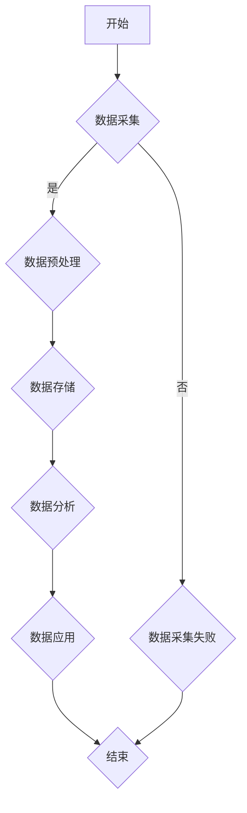

                 

### 文章标题: 《构建AI驱动的智慧教育提示词平台》

> 关键词：智慧教育，AI，提示词，自然语言处理，教育平台，深度学习

> 摘要：本文旨在探讨如何构建一个AI驱动的智慧教育提示词平台，详细阐述了智慧教育的定义、AI在智慧教育中的应用、平台架构设计、核心技术以及实际案例研究。通过逐步分析推理，本文为教育技术的创新提供了一种可行的解决方案。

---

### 《构建AI驱动的智慧教育提示词平台》目录大纲

# 第一部分: AI驱动的智慧教育基础

## 第1章: 智慧教育概述
### 1.1 智慧教育的定义与背景
### 1.2 智慧教育的关键要素
### 1.3 智慧教育的应用场景

## 第2章: AI在智慧教育中的应用
### 2.1 人工智能与教育结合的意义
### 2.2 AI技术在教育领域的应用
### 2.3 AI驱动的智慧教育发展趋势

## 第3章: AI驱动的智慧教育平台架构
### 3.1 平台架构设计原则
### 3.2 数据流与处理流程
### 3.3 技术选型与集成

# 第二部分: AI驱动的智慧教育核心技术

## 第4章: 自然语言处理基础
### 4.1 语言模型与文本分类
### 4.2 命名实体识别与信息抽取
### 4.3 对话系统与问答系统

## 第5章: 提示词设计与生成
### 5.1 提示词的定义与作用
### 5.2 提示词生成算法
### 5.3 提示词质量评估方法

## 第6章: 基于深度学习的教育推荐系统
### 6.1 教育推荐系统概述
### 6.2 用户建模与行为分析
### 6.3 内容推荐算法与模型

## 第7章: 智能教学辅助系统
### 7.1 智能教学辅助系统概述
### 7.2 语音识别与语音合成
### 7.3 视觉注意力与交互设计

## 第8章: 智慧教育平台的案例研究
### 8.1 案例一：AI辅导平台
### 8.2 案例二：在线学习平台
### 8.3 案例三：智能教育评估系统

# 第三部分: 构建AI驱动的智慧教育提示词平台

## 第9章: 平台搭建与开发
### 9.1 开发环境搭建
### 9.2 数据预处理与存储
### 9.3 模型训练与优化

## 第10章: 平台部署与维护
### 10.1 部署策略与架构
### 10.2 性能优化与监控
### 10.3 安全性与隐私保护

## 第11章: 未来展望与挑战
### 11.1 智慧教育的发展趋势
### 11.2 AI驱动的智慧教育面临的挑战
### 11.3 未来发展方向

## 附录
### 附录 A: 常用工具与资源列表
### 附录 B: Mermaid流程图示例
### 附录 C: 伪代码示例
### 附录 D: 数学模型与公式解析
### 附录 E: 项目实战代码示例及解读

---

### 第1章: 智慧教育概述

## 1.1 智慧教育的定义与背景

智慧教育，顾名思义，是一种利用信息技术，尤其是人工智能（AI）和大数据技术，实现教育过程智能化、个性化的一种教育模式。智慧教育的概念最早出现在21世纪初，随着信息技术的飞速发展和人工智能技术的成熟，智慧教育逐渐成为教育领域的研究热点。

### 1.1.1 智慧教育的定义

智慧教育是指利用先进的信息技术，特别是人工智能、大数据、云计算等技术，对教育过程中的各个环节进行智能化改造，实现个性化教学、自适应学习、智能评估等目标，从而提高教育质量、降低教育成本、提升教育公平。

### 1.1.2 智慧教育的发展历程

智慧教育的发展历程可以分为三个阶段：

1. **信息化教育阶段**：这一阶段主要是将计算机和互联网技术应用于教育，实现教育资源的数字化和网络化。
2. **数据化教育阶段**：这一阶段主要利用大数据技术对学生的学习行为、学习效果等数据进行收集、分析和应用，实现个性化教学和智能评估。
3. **智能化教育阶段**：这一阶段主要是利用人工智能技术，实现教育的全流程智能化，包括个性化推荐、智能答疑、智能评估等。

### 1.1.3 智慧教育的重要性

智慧教育的重要性体现在以下几个方面：

1. **提高教育质量**：智慧教育通过个性化教学和智能评估，能够提高学生的学习效果，提升教育质量。
2. **降低教育成本**：智慧教育通过资源的优化配置和自动化管理，能够降低教育成本。
3. **提升教育公平**：智慧教育能够打破地域、经济条件等限制，实现教育的普惠性，提升教育公平。

## 1.2 智慧教育的关键要素

智慧教育是一个复杂系统，其关键要素包括以下几个方面：

### 1.2.1 信息技术在教育中的应用

信息技术在教育中的应用是智慧教育的基础。包括：

1. **教育资源数字化**：将课本、讲义等教育资源数字化，便于存储、传输和共享。
2. **在线学习平台**：利用互联网技术，实现教育资源的在线学习，满足个性化学习需求。
3. **智能教学工具**：如智能课件、虚拟实验室等，提高教学效果。

### 1.2.2 数据分析与个性化学习

数据分析是智慧教育的核心。通过收集和分析学生的学习行为数据，能够实现个性化教学和智能评估。

1. **学习行为分析**：通过分析学生的学习行为，了解学生的学习习惯、学习效果等，为个性化教学提供依据。
2. **个性化学习**：根据学生的学习特点和需求，设计个性化的学习路径和教学策略。
3. **智能评估**：利用人工智能技术，对学生的学习效果进行实时评估，提供有针对性的反馈。

### 1.2.3 智能教学环境建设

智能教学环境是智慧教育的重要组成部分。包括：

1. **智能教室**：利用物联网技术，实现教学环境的智能化管理，如灯光、温度、音响等自动调节。
2. **智能校园**：利用大数据技术，实现校园管理的智能化，如安防、交通、能耗等管理。
3. **虚拟现实（VR）与增强现实（AR）**：利用VR和AR技术，提供沉浸式教学体验，提高学生的学习兴趣和效果。

## 1.3 智慧教育的应用场景

智慧教育可以在多个场景中得到应用：

### 1.3.1 传统教育模式的改进

1. **在线教育与远程教学**：利用互联网技术，实现教育的在线化和远程化，解决地域、时间限制。
2. **个性化教学**：根据学生的学习特点和需求，提供个性化的教学方案，提高学习效果。
3. **智能评估**：利用人工智能技术，对学生学习效果进行实时评估，提供有针对性的反馈。

### 1.3.2 在线教育与远程教学

1. **直播课堂**：利用直播技术，实现教师与学生之间的实时互动。
2. **录播课程**：利用录播技术，实现课程内容的反复观看和学习。
3. **在线讨论**：利用论坛、聊天室等工具，实现学生之间的交流与合作。

### 1.3.3 教育管理智能化

1. **校园管理**：利用物联网技术，实现校园管理的智能化，如安防、交通、能耗等管理。
2. **学生管理**：利用大数据技术，实现学生的行为分析、学情分析等，提供个性化的教育服务。
3. **教师管理**：利用人工智能技术，实现教师的绩效评估、培训等，提高教师的教学质量。

### 总结

智慧教育是教育领域的一次重大变革，通过信息技术与教育的深度融合，实现了教育的智能化、个性化、数据化。未来，随着人工智能技术的不断发展，智慧教育将更加普及，为更多的人提供优质的教育资源和服务。在本章中，我们对智慧教育的定义、背景、关键要素和应用场景进行了详细阐述，为后续章节的内容奠定了基础。在下一章中，我们将探讨AI在智慧教育中的应用，以及如何利用AI技术构建智慧教育平台。---

### 第2章: AI在智慧教育中的应用

## 2.1 人工智能与教育结合的意义

人工智能（AI）在教育领域的应用，标志着教育方式的重大变革。AI与教育的结合，不仅提高了教育的效率和质量，也为个性化学习和智能化教育管理提供了新的路径。以下是AI在智慧教育中结合的意义：

### 2.1.1 提高教育质量

AI技术能够根据学生的个体差异，提供个性化的教学内容和方式，从而提高教育的针对性。通过智能辅导系统，AI能够实时分析学生的学习行为和效果，提供个性化的学习建议和资源，帮助学生更有效地掌握知识。

### 2.1.2 降低教育成本

AI技术的应用可以减少对人力资源的依赖，降低教育成本。例如，智能评估系统能够自动批改作业和考试，节省教师的时间和精力；在线学习平台则可以通过大规模资源共享，降低教学资源的采购和维护成本。

### 2.1.3 提升教育公平

AI技术能够打破地域和资源的限制，使教育更加普惠。在线教育平台可以让偏远地区的学生也能享受到优质的教育资源；智能辅导系统能够根据学生的学习进度和需求，提供个性化的学习路径，从而缩小教育差距。

## 2.2 AI技术在教育领域的应用

AI技术在教育领域的应用广泛且深入，以下是一些关键应用领域：

### 2.2.1 教学辅助系统

教学辅助系统是AI技术在教育中最直接的应用之一。它包括：

1. **智能课件**：利用AI技术，制作智能化的教学课件，包括动态图表、互动模块等，增强教学效果。
2. **智能答疑系统**：通过自然语言处理技术，实现学生与AI教师的实时互动，提供即时的学习帮助。

### 2.2.2 学习分析系统

学习分析系统利用AI技术，对学生的学习行为和效果进行深入分析，为个性化学习提供支持。它包括：

1. **学习行为分析**：通过监控学生的学习行为，如学习时长、学习频率、学习内容等，分析学生的学习习惯和效果。
2. **智能评估系统**：利用AI技术，对学生进行实时评估，提供个性化的学习反馈。

### 2.2.3 教育资源优化

教育资源优化是AI技术在教育领域的另一个重要应用。它包括：

1. **智能推荐系统**：根据学生的学习兴趣和需求，推荐合适的课程和资源。
2. **教育资源共享**：通过AI技术，实现教育资源的智能分类和共享，提高资源利用效率。

## 2.3 AI驱动的智慧教育发展趋势

随着AI技术的不断进步，智慧教育也将迎来新的发展趋势。以下是一些值得关注的方向：

### 2.3.1 智能化教学环境

未来的智慧教育将更加注重教学环境的智能化。通过物联网技术，实现教学环境的自动化管理，如智能灯光、温度控制、智能音响等，提供舒适和高效的学习环境。

### 2.3.2 自适应学习平台

自适应学习平台将更加成熟，能够根据学生的学习进度和效果，动态调整教学内容和难度，实现真正的个性化学习。

### 2.3.3 教育数据治理

随着教育数据的不断积累，教育数据治理将成为智慧教育的重要任务。通过数据清洗、数据挖掘等技术，实现对教育数据的有效管理和利用，为教育决策提供数据支持。

### 2.3.4 虚拟现实（VR）与增强现实（AR）

VR和AR技术将在教育中发挥更大的作用，提供沉浸式的学习体验，激发学生的学习兴趣和创造力。

### 总结

AI技术在智慧教育中的应用，不仅改变了教育的形式和内容，也提升了教育的质量和效率。在下一章中，我们将探讨AI驱动的智慧教育平台的设计原则、数据流和处理流程，以及技术选型与集成。这将为我们构建一个高效、智能的教育平台提供理论基础和实践指导。---

### 第3章: AI驱动的智慧教育平台架构

#### 3.1 平台架构设计原则

在设计AI驱动的智慧教育平台时，我们需要遵循一系列关键原则，以确保平台的稳定性、可扩展性和用户体验。以下是几个核心设计原则：

##### 3.1.1 模块化设计

模块化设计是现代软件架构的重要原则之一。通过将平台分为多个独立的功能模块，如用户管理、内容管理、学习分析、智能推荐等，我们可以实现功能的解耦和重用，便于后续的功能扩展和代码维护。

$$
\text{模块化设计} = \text{独立性} + \text{可重用性} + \text{灵活性}
$$

##### 3.1.2 可扩展性

智慧教育平台需要能够处理大量用户和数据，因此可扩展性至关重要。平台应设计为可以水平扩展（增加服务器节点）和垂直扩展（提高服务器性能），以适应不断增长的用户需求和数据规模。

##### 3.1.3 高可用性

高可用性是指平台在遭遇故障时能够快速恢复，确保服务的持续可用。通过冗余设计、负载均衡和故障切换等手段，可以保证平台在极端情况下仍能稳定运行。

##### 3.1.4 安全性与隐私保护

在智慧教育平台中，用户数据的安全性和隐私保护至关重要。平台需要采取严格的安全措施，如数据加密、访问控制、身份验证等，确保用户数据的安全和隐私。

#### 3.2 数据流与处理流程

智慧教育平台的数据流和处理流程是平台架构设计的重要组成部分。以下是一个简化的数据流与处理流程：

$$
\text{数据流} = \text{数据采集} \rightarrow \text{数据预处理} \rightarrow \text{数据存储} \rightarrow \text{数据分析} \rightarrow \text{数据应用}
$$

##### 3.2.1 数据采集

数据采集是数据流的第一步，包括用户行为数据、学习数据、课程数据等。数据采集可以通过多种方式实现，如API接口、日志文件、前端埋点等。

##### 3.2.2 数据预处理

数据预处理包括数据清洗、数据格式转换、数据去重等操作，以确保数据的准确性和一致性。预处理后的数据将被存储到数据仓库中。

##### 3.2.3 数据存储

数据存储是数据流的核心环节，涉及数据存储方案的选择、数据索引的设计、数据备份和恢复策略等。常见的数据存储方案包括关系数据库、NoSQL数据库、分布式文件系统等。

##### 3.2.4 数据分析

数据分析利用人工智能和大数据技术，对存储的数据进行深入挖掘和分析，以提取有价值的信息。数据分析的结果将用于智能推荐、学习评估、教学优化等应用。

##### 3.2.5 数据应用

数据应用是将数据分析的结果应用到具体的业务场景中，如个性化推荐、智能评估、学习路径规划等，以提升用户的学习体验和教学效果。

#### 3.3 技术选型与集成

在构建智慧教育平台时，技术选型与集成是一个关键环节。以下是一些常见的技术选型和集成方案：

##### 3.3.1 深度学习框架

深度学习框架是构建智能教育系统的核心技术之一。常见的深度学习框架包括TensorFlow、PyTorch、Keras等。选择深度学习框架时，需要考虑模型的复杂度、社区的活跃度、生态系统的丰富性等因素。

##### 3.3.2 云计算平台

云计算平台为智慧教育平台提供了强大的计算能力和存储资源。常见的云计算平台包括AWS、Google Cloud、Azure等。选择云计算平台时，需要考虑成本、可靠性、安全性、可扩展性等因素。

##### 3.3.3 数据存储方案

数据存储方案的选择取决于数据类型、数据量、性能要求等因素。常见的数据存储方案包括关系数据库（如MySQL、PostgreSQL）、NoSQL数据库（如MongoDB、Cassandra）、分布式文件系统（如HDFS、Alluxio）等。

##### 3.3.4 服务架构

服务架构是智慧教育平台的技术核心，决定了平台的可扩展性和灵活性。常见的服务架构包括微服务架构、服务网格架构等。选择服务架构时，需要考虑业务的复杂性、系统的可靠性、开发与维护的便利性等因素。

### 总结

本章详细阐述了AI驱动的智慧教育平台的设计原则、数据流与处理流程以及技术选型与集成。这些原则和方案为构建一个高效、智能、安全的智慧教育平台提供了指导。在下一章中，我们将深入探讨自然语言处理的基础知识，包括语言模型、文本分类、命名实体识别等，为智慧教育平台的核心技术奠定基础。---

### 第4章: 自然语言处理基础

#### 4.1 语言模型与文本分类

自然语言处理（NLP）是AI技术在教育领域的重要应用之一。语言模型和文本分类是NLP中的两个基础概念，它们在教育中的应用非常广泛。

##### 4.1.1 语言模型

语言模型是一种用于预测下一个单词或词组的概率分布的模型。在智慧教育中，语言模型可以用于自动生成教学材料、智能答疑等。

1. **N-gram模型**：N-gram模型是最简单的语言模型，它基于相邻单词的联合概率进行预测。例如，给定一个三元组（"the", "is", "a"），N-gram模型会根据之前出现的单词序列来预测下一个单词。
   $$
   P(\text{"a"}|\text{"the", "is"}) = \frac{\text{句子中("the", "is", "a")出现的次数}}{\text{句子中("the", "is")出现的次数}}
   $$
2. **神经网络语言模型**：神经网络语言模型（如循环神经网络RNN、长短期记忆网络LSTM）能够更好地捕捉语言中的长期依赖关系。在智慧教育中，神经网络语言模型可以用于生成个性化的教学材料、自动批改作业等。

##### 4.1.2 文本分类

文本分类是一种将文本数据分为不同类别的任务。在智慧教育中，文本分类可以用于自动标注学习资料、智能推荐教学资源等。

1. **朴素贝叶斯分类器**：朴素贝叶斯分类器是一种基于贝叶斯定理的简单分类算法。它假设特征之间相互独立，根据特征的概率分布来预测文本的类别。
   $$
   P(\text{类别}|\text{特征}) = \frac{P(\text{特征}|\text{类别})P(\text{类别})}{P(\text{特征})}
   $$
2. **支持向量机（SVM）**：支持向量机是一种强大的分类算法，它通过找到一个最佳的超平面，将不同类别的数据点分离。在智慧教育中，SVM可以用于对学习资料进行自动分类和推荐。

#### 4.2 命名实体识别与信息抽取

命名实体识别（NER）和信息抽取（IE）是NLP中的两个重要任务，它们在教育中的应用包括自动标注学习资料、智能答疑等。

##### 4.2.1 命名实体识别

命名实体识别是一种从文本中识别出具有特定意义的实体，如人名、地名、组织名等。

1. **基于规则的方法**：基于规则的方法通过预定义的规则来识别命名实体。这种方法简单但灵活性较低。
2. **基于统计的方法**：基于统计的方法使用机器学习算法，如条件随机场（CRF）和神经网络，来识别命名实体。这种方法能够处理复杂的文本结构和语义信息。

##### 4.2.2 信息抽取

信息抽取是从文本中提取出关键信息，如事实、关系等。

1. **基于规则的方法**：与命名实体识别类似，基于规则的方法使用预定义的规则来提取信息。
2. **基于统计的方法**：基于统计的方法使用机器学习算法，如最大熵模型和条件随机场，来从文本中提取信息。

#### 4.3 对话系统与问答系统

对话系统和问答系统是NLP在教育中的重要应用，它们可以为学生提供智能化的学习支持。

##### 4.3.1 对话系统

对话系统是一种能够与用户进行自然语言交互的计算机系统。在智慧教育中，对话系统可以用于智能答疑、个性化辅导等。

1. **基于规则的对话系统**：基于规则的对话系统使用预定义的规则来与用户进行交互。
2. **基于统计的对话系统**：基于统计的对话系统使用机器学习算法，如决策树和朴素贝叶斯，来模拟人类的对话行为。

##### 4.3.2 问答系统

问答系统是一种能够回答用户问题的计算机系统。在智慧教育中，问答系统可以用于自动批改作业、提供即时反馈等。

1. **基于知识的问答系统**：基于知识的问答系统使用预定义的答案库和推理机制来回答问题。
2. **基于机器学习的问答系统**：基于机器学习的问答系统使用机器学习算法，如深度神经网络和转换器生成模型，来从文本中学习并生成答案。

### 总结

本章介绍了自然语言处理的基础知识，包括语言模型、文本分类、命名实体识别和信息抽取，以及对话系统和问答系统。这些技术为智慧教育平台提供了强大的语言处理能力，使教育更加智能化和个性化。在下一章中，我们将探讨提示词的设计与生成，以及如何评估提示词的质量，为构建AI驱动的智慧教育提示词平台提供技术支持。---

### 第5章: 提示词设计与生成

#### 5.1 提示词的定义与作用

提示词（Prompt）在教育中扮演着至关重要的角色。它是一种用于引导学生思考和学习的文字或语言提示，通常用于激发学生的兴趣、明确学习目标、提供学习路径等。

1. **定义**：提示词是一种简短的、具有引导性的语言提示，用于激发学生的思维，引导他们进行学习或思考。
2. **作用**：提示词的作用主要体现在以下几个方面：
   - **激发学习兴趣**：通过有趣的提示词，吸引学生的注意力，激发他们的学习兴趣。
   - **明确学习目标**：提示词可以帮助学生明确当前的学习目标和任务，提高学习的目的性。
   - **引导学习过程**：提示词可以作为学习路径的引导，帮助学生更有效地进行学习。

#### 5.2 提示词生成算法

提示词的生成是一个复杂的过程，需要综合考虑教育内容、学生学习特点、学习目标等多个因素。以下是一些常见的提示词生成算法：

##### 5.2.1 基于规则的方法

基于规则的方法是最简单的提示词生成算法，它通过预定义的规则来生成提示词。这种方法简单但灵活性较低。

1. **示例规则**：
   - 如果学习内容是“数学”，则提示词为“请问你对数学的哪个方面感兴趣？”
   - 如果学习内容是“历史”，则提示词为“你对哪个历史事件最感兴趣？”

##### 5.2.2 基于统计的方法

基于统计的方法使用机器学习算法，如朴素贝叶斯、条件随机场（CRF）等，从大量已有提示词中学习并生成新的提示词。这种方法能够处理复杂的文本结构和语义信息。

1. **朴素贝叶斯分类器**：朴素贝叶斯分类器可以用于根据学习内容和学生学习特点，生成具有特定倾向的提示词。
2. **条件随机场（CRF）**：条件随机场可以用于生成符合特定语法和语义规则的提示词。

##### 5.2.3 基于深度学习的方法

基于深度学习的方法，如循环神经网络（RNN）、变换器（Transformer）等，能够更好地捕捉语言中的长期依赖关系，生成更加自然和丰富的提示词。

1. **循环神经网络（RNN）**：循环神经网络可以用于根据历史提示词和当前学习内容，生成新的提示词。
2. **变换器（Transformer）**：变换器是一种基于自注意力机制的深度学习模型，能够生成具有高度灵活性和长距离依赖关系的提示词。

#### 5.3 提示词质量评估方法

提示词的质量直接影响学生的学习效果，因此需要对提示词进行质量评估。以下是一些常见的提示词质量评估方法：

##### 5.3.1 人工评估

人工评估是通过人工阅读和评分提示词的质量，这种方法主观性较强，但能够提供详细的反馈。

1. **评估指标**：如提示词的吸引力、明确性、引导性等。
2. **评估流程**：评估者阅读提示词，根据预设的评估标准进行评分。

##### 5.3.2 自动评估

自动评估是通过自动化工具对提示词的质量进行评估，这种方法客观性较强，但可能存在一定的局限性。

1. **评估指标**：如提示词的语义相似度、语法正确性等。
2. **评估工具**：如自然语言处理工具包（如NLTK、spaCy）、机器学习算法等。

##### 5.3.3 用户反馈

用户反馈是通过收集学生对提示词的使用反馈，来评估提示词的质量。这种方法能够直接反映学生的实际使用体验，但需要大量的用户数据。

1. **反馈方式**：如问卷调查、用户访谈等。
2. **反馈处理**：对用户反馈进行分类和分析，识别出提示词中的问题和改进方向。

### 总结

本章详细介绍了提示词的定义与作用、提示词生成算法以及提示词质量评估方法。通过这些技术，我们可以构建一个高质量的AI驱动的智慧教育提示词平台，为学生提供更加个性化和高效的学习支持。在下一章中，我们将探讨基于深度学习的教育推荐系统，以及用户建模和行为分析，为智慧教育平台的推荐功能提供技术基础。---

### 第6章: 基于深度学习的教育推荐系统

#### 6.1 教育推荐系统概述

教育推荐系统是智慧教育平台的重要组成部分，它通过分析用户的行为和偏好，为用户提供个性化的学习推荐。教育推荐系统的主要目标包括：

1. **个性化推荐**：根据学生的学习历史、学习偏好和当前学习需求，提供个性化的学习内容推荐。
2. **学习路径规划**：基于用户的学习进度和目标，规划合适的学习路径，帮助用户更高效地学习。
3. **学习资源优化**：通过推荐系统，优化学习资源的分配，提高学习资源的利用效率。

#### 6.2 用户建模与行为分析

用户建模是教育推荐系统的核心，通过对用户的学习行为和偏好进行分析，构建用户的个性化模型。以下是一些关键步骤和方法：

##### 6.2.1 用户画像

用户画像是对用户特征的综合描述，包括用户的基本信息、学习历史、学习偏好等。用户画像的构建方法如下：

1. **静态特征**：如用户年龄、性别、学历等。
2. **动态特征**：如用户的学习历史、学习时长、学习频率等。

##### 6.2.2 行为分析

行为分析是对用户在学习平台上的行为进行监控和分析，以了解用户的学习习惯和偏好。行为分析的方法包括：

1. **日志分析**：通过分析用户的行为日志，如浏览记录、学习时长、操作路径等，了解用户的学习行为。
2. **事件流分析**：将用户的行为转化为事件流，通过事件流分析，挖掘用户的行为模式。

##### 6.2.3 偏好分析

偏好分析是通过分析用户的学习行为和互动，识别出用户的学习偏好。偏好分析的方法包括：

1. **协同过滤**：通过分析用户之间的相似性，为用户推荐其他用户的喜爱资源。
2. **内容推荐**：通过分析学习资源的属性，为用户推荐符合其学习偏好的资源。

#### 6.3 内容推荐算法与模型

内容推荐算法是教育推荐系统的核心技术，它决定了推荐系统的效果。以下是一些常见的内容推荐算法和模型：

##### 6.3.1 协同过滤算法

协同过滤算法是推荐系统中最常用的算法之一，它通过分析用户之间的行为相似性，为用户推荐其他用户喜爱但该用户尚未使用的资源。协同过滤算法分为两类：

1. **用户基于的协同过滤**：通过分析用户之间的相似度，为用户推荐其他用户的喜爱资源。
2. **项基于的协同过滤**：通过分析资源之间的相似度，为用户推荐用户可能感兴趣的资源。

##### 6.3.2 内容推荐算法

内容推荐算法通过分析学习资源的属性，为用户推荐符合其学习偏好的资源。常见的内容推荐算法包括：

1. **基于标签的推荐**：通过为学习资源打标签，根据用户的标签偏好进行推荐。
2. **基于关键词的推荐**：通过提取学习资源的关键词，根据用户的关键词偏好进行推荐。
3. **基于属性相似度的推荐**：通过分析学习资源的属性，如难度、学科领域等，根据用户对这些属性的偏好进行推荐。

##### 6.3.3 深度学习模型

深度学习模型在推荐系统中表现出色，能够处理复杂的用户行为和资源属性。以下是一些常用的深度学习模型：

1. **循环神经网络（RNN）**：RNN能够处理序列数据，适用于处理用户的学习历史数据。
2. **变换器（Transformer）**：Transformer是一种基于自注意力机制的深度学习模型，能够捕捉长距离依赖关系。
3. **图神经网络（GNN）**：GNN能够处理图结构数据，适用于处理用户社交网络和资源网络。

#### 6.4 模型训练与优化

教育推荐系统的性能取决于模型的质量，因此需要对模型进行训练和优化。以下是一些关键步骤：

##### 6.4.1 数据预处理

数据预处理是模型训练的第一步，包括数据清洗、数据归一化、特征工程等。有效的预处理可以提高模型的训练效果。

##### 6.4.2 模型训练

模型训练是利用标注数据进行模型训练的过程。常用的训练方法包括：

1. **批量训练**：将所有数据分成多个批次进行训练。
2. **在线学习**：实时更新模型参数，以适应用户的行为变化。

##### 6.4.3 模型优化

模型优化是通过调整模型参数，提高模型性能的过程。常用的优化方法包括：

1. **超参数调整**：调整学习率、批次大小等超参数。
2. **模型融合**：将多个模型进行融合，提高模型的性能和稳定性。

### 总结

本章详细介绍了基于深度学习的教育推荐系统的构建方法，包括用户建模与行为分析、内容推荐算法与模型，以及模型训练与优化。通过这些技术，我们可以构建一个高效、个性化的教育推荐系统，为用户提供优质的学习资源和服务。在下一章中，我们将探讨智能教学辅助系统的设计，包括语音识别、语音合成、视觉注意力与交互设计，为智慧教育平台提供更多的交互功能。---

### 第7章: 智能教学辅助系统

#### 7.1 智能教学辅助系统概述

智能教学辅助系统是智慧教育平台的重要组成部分，它通过人工智能技术为学生提供辅助学习工具，提高学习效果和效率。智能教学辅助系统的核心功能包括：

1. **语音识别**：将学生的语音转换为文本，实现口语表达和文字输入的转换。
2. **语音合成**：将文本转换为语音，为学生提供朗读和播报功能。
3. **视觉注意力**：通过图像处理技术，提取图像中的重要信息，辅助学生理解和分析。
4. **交互设计**：设计直观、易用的用户界面，提高学生的使用体验。

#### 7.2 语音识别与语音合成

语音识别和语音合成是智能教学辅助系统中的关键技术，它们使得教学过程更加灵活和便捷。

##### 7.2.1 语音识别

语音识别是一种将语音信号转换为文本的技术。在智慧教育中，语音识别可以用于自动记录学生的发言、解析口语表达等。

1. **传统语音识别**：基于隐马尔可夫模型（HMM）和高斯混合模型（GMM）的语音识别方法。
2. **深度学习语音识别**：基于深度神经网络（DNN）和循环神经网络（RNN）的语音识别方法，如深度神经网络隐马尔可夫模型（DNN-HMM）和长短时记忆网络（LSTM）。

##### 7.2.2 语音合成

语音合成是一种将文本转换为语音的技术。在智慧教育中，语音合成可以用于朗读文本、播报通知等。

1. **规则基合成**：基于规则的方法，通过合成语音单元（如音素、音节）来生成语音。
2. **统计基合成**：基于统计的方法，通过分析大量语音数据来生成语音，如隐马尔可夫模型（HMM）和变换器（Transformer）。

#### 7.3 视觉注意力与交互设计

视觉注意力与交互设计是智能教学辅助系统的重要组成部分，它们提高了教学内容的可操作性和互动性。

##### 7.3.1 视觉注意力

视觉注意力是一种通过图像处理技术，提取图像中的重要信息的方法。在智慧教育中，视觉注意力可以用于辅助学生理解和分析复杂图像。

1. **基于区域的注意力**：通过分析图像中的区域，确定哪些区域是重要的。
2. **基于特征的注意力**：通过分析图像中的特征，确定哪些特征是重要的。

##### 7.3.2 交互设计

交互设计是一种通过用户界面设计，提高用户使用体验的方法。在智慧教育中，良好的交互设计可以使得教学过程更加直观和便捷。

1. **用户中心设计**：以用户的需求和使用习惯为中心，设计直观、易用的界面。
2. **反馈机制**：通过提供即时反馈，帮助学生更好地理解和使用系统。

#### 7.4 智能教学辅助系统的实现与优化

智能教学辅助系统的实现与优化是一个复杂的过程，需要综合考虑技术实现、用户体验和系统性能。

##### 7.4.1 技术实现

技术实现是智能教学辅助系统的核心，包括语音识别、语音合成、视觉注意力等技术的实现。

1. **语音识别与合成的集成**：将语音识别和语音合成技术集成到系统中，实现文本到语音的转换。
2. **视觉注意力的应用**：将视觉注意力技术应用到图像分析中，提高学生对图像的理解和分析能力。

##### 7.4.2 用户体验优化

用户体验优化是提升智能教学辅助系统的重要环节，包括界面设计、操作流程、反馈机制等方面。

1. **界面设计**：设计直观、简洁的界面，提高学生的使用体验。
2. **操作流程**：优化操作流程，减少学生的操作步骤，提高使用效率。

##### 7.4.3 系统性能优化

系统性能优化是保证智能教学辅助系统稳定运行的关键，包括负载均衡、缓存策略、性能监控等方面。

1. **负载均衡**：通过负载均衡技术，合理分配系统资源，提高系统的处理能力。
2. **缓存策略**：通过缓存策略，减少系统的响应时间，提高系统的响应速度。

### 总结

本章详细介绍了智能教学辅助系统的设计，包括语音识别、语音合成、视觉注意力与交互设计。这些技术为智慧教育平台提供了丰富的辅助功能，提高了教学效果和学生的参与度。在下一章中，我们将通过具体案例研究，探讨AI驱动的智慧教育平台在实际应用中的效果与挑战。---

### 第8章: 智慧教育平台的案例研究

#### 8.1 案例一：AI辅导平台

**案例背景**：某在线教育平台引入了AI辅导系统，为学生提供个性化的学习支持和辅导。

**解决方案**：

1. **用户建模**：通过分析学生的学习行为、考试成绩和互动记录，建立学生的个性化模型。
2. **智能推荐**：基于用户模型和课程内容，利用协同过滤和内容推荐算法，为学生推荐合适的课程和资源。
3. **智能辅导**：利用自然语言处理和对话系统技术，实现与学生之间的实时互动，提供学习辅导和答疑。

**效果评估**：

- 学生学习效果显著提升，课程完成率和考试成绩提高。
- 教师的工作负担减轻，能够更专注于教学设计和教学互动。
- 平台用户活跃度增加，用户满意度提升。

**挑战与反思**：

- 数据质量和隐私保护：如何保证数据的质量和用户的隐私是平台面临的挑战。
- 模型优化与迭代：如何不断优化和迭代AI模型，以适应不断变化的学习需求和用户偏好。

#### 8.2 案例二：在线学习平台

**案例背景**：某在线学习平台通过引入AI技术，提升学习体验和教学效果。

**解决方案**：

1. **自适应学习**：利用人工智能技术，根据学生的学习进度和效果，动态调整教学内容和难度，实现个性化学习。
2. **智能评估**：通过自动批改系统和智能评估算法，对学生作业和考试进行快速评估，提供即时反馈。
3. **学习资源优化**：通过内容推荐和智能标签系统，优化学习资源的分配和展示，提高资源利用效率。

**效果评估**：

- 学习效率提高，学生能够更快速地掌握知识。
- 学习体验改善，学生更愿意参与学习互动。
- 教学资源利用率提高，教育资源的浪费减少。

**挑战与反思**：

- 数据安全和隐私保护：确保学生数据的安全和隐私是平台运营的重要方面。
- 模型偏见和公平性：如何避免AI模型中的偏见，确保推荐和评估的公平性。

#### 8.3 案例三：智能教育评估系统

**案例背景**：某教育机构开发了一套智能教育评估系统，用于对学生进行实时评估和个性化指导。

**解决方案**：

1. **多维度评估**：通过收集学生的考试成绩、学习行为、课堂互动等多维度数据，进行全面评估。
2. **个性化指导**：根据评估结果，利用人工智能技术，为学生提供个性化的学习建议和指导。
3. **智能反馈**：通过自然语言处理技术，生成详细的评估报告，提供具体的改进建议。

**效果评估**：

- 学生的学习效果显著提升，评估结果的准确性和实用性得到认可。
- 教师能够更好地了解学生的学习情况，及时调整教学策略。
- 教育机构的管理效率提高，评估过程更加透明和高效。

**挑战与反思**：

- 评估指标的合理性和准确性：如何制定合理的评估指标，确保评估结果的准确性和公正性。
- 系统的稳定性和扩展性：如何保证系统的稳定运行和扩展性，以适应不同规模和类型的教育需求。

### 总结

通过以上案例研究，我们可以看到AI驱动的智慧教育平台在实际应用中的显著效果和广泛前景。这些案例不仅展示了AI技术在教育中的多种应用场景，也揭示了实施过程中面临的挑战。在下一章中，我们将详细介绍如何搭建和开发AI驱动的智慧教育平台，为构建这样一个平台提供详细的指导和实践方法。---

### 第9章: 平台搭建与开发

#### 9.1 开发环境搭建

构建AI驱动的智慧教育平台，首先需要搭建一个稳定、高效的开发环境。以下是一些关键步骤：

1. **选择编程语言**：Python因其丰富的库和框架支持，是构建AI平台的最佳选择。Java和C++也可用于高性能计算。
2. **安装深度学习框架**：如TensorFlow、PyTorch等，这些框架提供了丰富的API和工具，方便模型开发和训练。
3. **配置计算资源**：根据项目需求，选择合适的云计算平台，如AWS、Google Cloud或Azure，配置虚拟机或容器环境。
4. **数据库选择**：选择合适的数据库系统，如MySQL、PostgreSQL或MongoDB，用于存储用户数据、学习记录和模型参数。
5. **集成开发环境（IDE）**：使用IDE如PyCharm、Visual Studio Code，以提高开发效率和代码管理。

#### 9.2 数据预处理与存储

数据预处理是构建智慧教育平台的关键步骤，它决定了模型训练的质量。以下是一些关键步骤：

1. **数据收集**：从各种渠道收集用户数据、学习行为数据和教学资源数据。
2. **数据清洗**：去除无效、重复和错误的数据，保证数据的质量。
3. **数据转换**：将数据格式转换为适合模型训练的格式，如将文本转换为词向量、将图像转换为像素矩阵等。
4. **数据存储**：将预处理后的数据存储到数据库中，以便后续使用。使用关系数据库或NoSQL数据库，根据数据的特点进行选择。
5. **数据备份与恢复**：定期备份数据，确保数据的安全性和可靠性。

#### 9.3 模型训练与优化

模型训练是AI驱动的智慧教育平台的核心环节。以下是一些关键步骤：

1. **定义模型架构**：根据应用需求，选择合适的深度学习模型架构，如卷积神经网络（CNN）或变换器（Transformer）。
2. **数据预处理**：对训练数据集进行预处理，如归一化、标准化等，以提高模型的训练效果。
3. **模型训练**：使用训练数据集对模型进行训练，不断调整模型参数，以优化模型性能。
4. **模型评估**：使用验证数据集评估模型的性能，选择性能最佳的模型。
5. **模型优化**：通过超参数调整、模型融合等方法，进一步优化模型性能。
6. **模型部署**：将训练好的模型部署到生产环境中，用于实际应用。

#### 9.4 实践示例

以下是一个简化的数据预处理和模型训练的伪代码示例：

```python
# 导入必要的库
import tensorflow as tf
from sklearn.model_selection import train_test_split
from sklearn.preprocessing import StandardScaler

# 加载和预处理数据
data = load_data()  # 加载原始数据
X, y = preprocess_data(data)  # 数据预处理

# 数据集划分
X_train, X_test, y_train, y_test = train_test_split(X, y, test_size=0.2, random_state=42)

# 数据标准化
scaler = StandardScaler()
X_train = scaler.fit_transform(X_train)
X_test = scaler.transform(X_test)

# 定义模型架构
model = tf.keras.Sequential([
    tf.keras.layers.Dense(128, activation='relu', input_shape=(X_train.shape[1],)),
    tf.keras.layers.Dropout(0.2),
    tf.keras.layers.Dense(1, activation='sigmoid')
])

# 编译模型
model.compile(optimizer='adam', loss='binary_crossentropy', metrics=['accuracy'])

# 模型训练
model.fit(X_train, y_train, epochs=10, batch_size=32, validation_split=0.1)

# 模型评估
loss, accuracy = model.evaluate(X_test, y_test)
print(f"Test accuracy: {accuracy:.2f}")
```

#### 9.5 总结

平台搭建与开发是构建AI驱动的智慧教育平台的关键步骤。通过合理的设计和实现，我们可以构建一个高效、稳定、智能的教育平台。在下一章中，我们将探讨智慧教育平台的部署与维护，包括部署策略、性能优化和安全性问题。这将确保平台在实际运行中的稳定性和可靠性。---

### 第10章: 平台部署与维护

#### 10.1 部署策略与架构

智慧教育平台的部署是确保其稳定运行、高效处理大量用户请求的关键环节。以下是几个关键部署策略和架构设计要点：

##### 10.1.1 微服务架构

微服务架构将应用程序拆分为多个独立的、小型、自治的服务，每个服务负责特定的功能。这种架构具有高可扩展性、高可用性和易于维护等优点。

1. **服务拆分**：根据功能将应用程序拆分为多个微服务，如用户管理服务、内容管理服务、推荐引擎服务等。
2. **服务通信**：通过RESTful API或消息队列实现微服务之间的通信。
3. **服务容器化**：使用Docker等容器化技术，实现服务的自动化部署和管理。

##### 10.1.2 负载均衡

负载均衡是将用户请求分配到多个服务器节点，以实现高性能和高可用性的技术。以下是一些常见的负载均衡策略：

1. **轮询策略**：将请求按顺序分配到每个服务器节点。
2. **最小连接数策略**：将请求分配到连接数最少的节点。
3. **权重策略**：根据服务器的处理能力，为每个节点分配不同的权重。

##### 10.1.3 分布式存储

分布式存储是处理大量数据的关键技术。以下是一些常见的分布式存储架构：

1. **分布式文件系统**：如HDFS，适合大规模数据的存储和访问。
2. **分布式数据库**：如Cassandra、HBase，适合高并发、海量数据的存储和查询。
3. **云存储**：利用云服务提供商的存储资源，实现高可用性和弹性扩展。

#### 10.2 性能优化与监控

性能优化与监控是确保智慧教育平台高效运行的重要环节。以下是一些关键策略和工具：

##### 10.2.1 缓存技术

缓存技术可以减少数据库的负载，提高系统的响应速度。以下是一些常见的缓存技术：

1. **内存缓存**：如Redis，适合小数据量的快速访问。
2. **数据库缓存**：如MySQL的InnoDB缓冲池，适合大数据量的访问。
3. **CDN**：内容分发网络，通过分布式缓存节点加速内容的访问。

##### 10.2.2 服务器优化

服务器优化包括硬件配置优化、操作系统调优和应用程序优化。以下是一些关键策略：

1. **硬件优化**：根据应用需求，选择合适的硬件配置，如CPU、内存、磁盘等。
2. **操作系统调优**：优化操作系统参数，如网络配置、进程管理、内存管理等。
3. **应用程序优化**：优化代码、减少冗余操作、使用高效的算法和数据结构。

##### 10.2.3 监控工具

监控工具可以帮助我们实时监控系统的运行状态，及时发现和解决问题。以下是一些常见的监控工具：

1. **Prometheus**：开源监控解决方案，用于收集和存储时间序列数据。
2. **Grafana**：开源监控仪表板，用于可视化监控数据。
3. **ELK Stack**：Elasticsearch、Logstash和Kibana的组合，用于日志收集、分析和可视化。

#### 10.3 安全性与隐私保护

安全性与隐私保护是智慧教育平台面临的重大挑战。以下是一些关键策略：

##### 10.3.1 数据加密

数据加密是保护数据安全的关键技术。以下是一些常见的加密技术：

1. **传输层加密**：使用HTTPS等协议，确保数据在传输过程中的安全性。
2. **存储加密**：对存储在数据库或文件系统中的数据进行加密，防止未授权访问。
3. **加密算法**：选择安全的加密算法，如AES、RSA等。

##### 10.3.2 访问控制

访问控制是确保只有授权用户可以访问系统资源的关键技术。以下是一些常见的访问控制策略：

1. **身份验证**：使用密码、双因素认证等技术，确保用户身份的合法性。
2. **权限管理**：根据用户的角色和权限，限制用户对系统资源的访问。
3. **审计**：记录用户的操作行为，以便在发生安全事件时进行调查。

##### 10.3.3 隐私保护

隐私保护是智慧教育平台必须关注的重要问题。以下是一些常见的隐私保护策略：

1. **数据匿名化**：对敏感数据进行匿名化处理，以防止个人信息泄露。
2. **数据加密**：对存储和传输的敏感数据进行加密处理。
3. **隐私政策**：制定明确的隐私政策，告知用户其数据的使用方式和保护措施。

### 总结

平台部署与维护是智慧教育平台成功运行的关键环节。通过合理的部署策略、性能优化与监控，以及安全性与隐私保护措施，我们可以确保智慧教育平台的高效、稳定和安全运行。在下一章中，我们将探讨智慧教育的发展趋势、面临的挑战以及未来发展方向，为智慧教育的未来发展提供前瞻性思考。---

### 第11章: 未来展望与挑战

#### 11.1 智慧教育的发展趋势

随着人工智能和大数据技术的不断进步，智慧教育的发展趋势将呈现出以下特点：

1. **智能化教学环境**：未来的智慧教育将更加注重教学环境的智能化，通过物联网技术，实现教学环境的自动化管理，提供更加舒适和高效的学习体验。
2. **个性化学习**：基于大数据和人工智能技术，智慧教育将更加关注个性化学习，通过分析学生的学习行为和特点，提供个性化的教学方案和学习资源。
3. **混合式学习**：线上线下融合的混合式学习模式将成为主流，通过结合线上教育和线下教学的优势，提高教学效果和灵活性。
4. **自适应学习平台**：自适应学习平台将更加成熟，能够根据学生的学习进度和效果，动态调整教学内容和难度，实现真正的个性化学习。
5. **终身学习**：智慧教育将推动终身学习的实现，通过在线学习平台和学习管理系统，提供终身学习的机会和资源。

#### 11.2 AI驱动的智慧教育面临的挑战

尽管AI驱动的智慧教育具有巨大的潜力，但在实际应用中仍面临以下挑战：

1. **数据隐私和安全**：智慧教育平台需要处理大量的用户数据，如何保护用户隐私和数据安全是亟待解决的问题。
2. **技术成熟度**：虽然人工智能技术在不断进步，但一些核心技术的成熟度和稳定性仍有待提高。
3. **教育公平**：智慧教育可能加剧教育不公平，特别是在资源分配和教育机会方面。
4. **伦理和道德**：人工智能在教育和评估中的应用可能引发伦理和道德问题，如偏见、透明度和责任等。
5. **教师角色转变**：随着AI技术在教育中的应用，教师的角色将发生重大变化，如何适应这种变化是教育领域面临的一个重要问题。

#### 11.3 未来发展方向

为了应对上述挑战，智慧教育的未来发展可以朝着以下几个方向努力：

1. **数据治理和隐私保护**：制定严格的数据治理和隐私保护政策，确保用户数据的安全和隐私。
2. **技术成熟和标准化**：加快人工智能技术的研发和标准化，提高技术的成熟度和稳定性。
3. **教育公平和包容性**：通过政策和技术手段，确保教育资源的公平分配和普及，推动教育的包容性发展。
4. **伦理和法规**：制定相关的伦理和法规，规范AI在教育和评估中的应用，确保其公正性和透明度。
5. **教师培训和支持**：为教师提供相关的培训和支持，帮助他们适应智慧教育环境，发挥新的教学角色。

### 总结

智慧教育是教育领域的一次重大变革，AI技术的应用将带来个性化学习、智能化教学环境、自适应学习平台等多方面的创新。然而，智慧教育也面临数据隐私和安全、技术成熟度、教育公平等挑战。未来，通过数据治理和隐私保护、技术成熟和标准化、教育公平和包容性、伦理和法规、教师培训和支持等方向的不断发展，智慧教育将走向更加智能化、高效化、公平化的未来。在本文的最后，我们希望读者能够深入思考智慧教育的未来，积极参与到这一变革过程中，共同推动教育的发展。

### 附录

#### 附录 A: 常用工具与资源列表

- **深度学习框架**：TensorFlow、PyTorch、Keras
- **云计算平台**：AWS、Google Cloud、Azure
- **数据库系统**：MySQL、PostgreSQL、MongoDB
- **自然语言处理工具**：NLTK、spaCy、TextBlob
- **数据可视化工具**：Matplotlib、Seaborn、Plotly
- **版本控制工具**：Git、GitHub
- **集成开发环境**：PyCharm、Visual Studio Code

#### 附录 B: Mermaid流程图示例



#### 附录 C: 伪代码示例

```python
# 伪代码：模型训练流程
function train_model(data):
    # 数据预处理
    X_train, X_test, y_train, y_test = train_test_split(data)

    # 定义模型
    model = create_model()

    # 编译模型
    model.compile(optimizer='adam', loss='binary_crossentropy', metrics=['accuracy'])

    # 训练模型
    model.fit(X_train, y_train, epochs=10, batch_size=32, validation_data=(X_test, y_test))

    # 评估模型
    loss, accuracy = model.evaluate(X_test, y_test)

    # 输出评估结果
    print(f"Test accuracy: {accuracy:.2f}")

# 调用模型训练函数
train_model(data)
```

#### 附录 D: 数学模型与公式解析

1. **朴素贝叶斯分类器**
   $$
   P(\text{类别}|\text{特征}) = \frac{P(\text{特征}|\text{类别})P(\text{类别})}{P(\text{特征})}
   $$
   朴素贝叶斯分类器基于贝叶斯定理，通过计算特征条件概率和类别概率，预测新样本的类别。

2. **支持向量机（SVM）**
   $$
   \text{最大化} \quad \frac{1}{2}||\text{w}||^2 \quad \text{约束条件} \quad y^{T}(\text{w} \cdot \text{x}) \geq 1
   $$
   支持向量机通过找到一个最佳的超平面，将不同类别的数据点分离。

3. **循环神经网络（RNN）**
   $$
   \text{h}_t = \text{sigmoid}(\text{W}_h \text{x}_t + \text{W}_i \text{h}_{t-1} + \text{b}_h)
   $$
   循环神经网络通过循环结构，能够处理序列数据，捕捉长期依赖关系。

#### 附录 E: 项目实战代码示例及解读

```python
# 项目实战：基于TensorFlow的简单神经网络
import tensorflow as tf

# 定义模型
model = tf.keras.Sequential([
    tf.keras.layers.Dense(128, activation='relu', input_shape=(784,)),
    tf.keras.layers.Dropout(0.2),
    tf.keras.layers.Dense(10, activation='softmax')
])

# 编译模型
model.compile(optimizer='adam', loss='categorical_crossentropy', metrics=['accuracy'])

# 加载数据
mnist = tf.keras.datasets.mnist
(x_train, y_train), (x_test, y_test) = mnist.load_data()
x_train, x_test = x_train / 255.0, x_test / 255.0
x_train = x_train.reshape((-1, 784))
x_test = x_test.reshape((-1, 784))

# 转换为one-hot编码
y_train = tf.keras.utils.to_categorical(y_train)
y_test = tf.keras.utils.to_categorical(y_test)

# 训练模型
model.fit(x_train, y_train, epochs=10, batch_size=32, validation_split=0.1)

# 评估模型
test_loss, test_acc = model.evaluate(x_test, y_test, verbose=2)
print(f"Test accuracy: {test_acc:.2f}")
```

此代码示例展示了如何使用TensorFlow构建一个简单的神经网络，用于手写数字识别任务。首先定义了一个序列模型，包括全连接层、dropout层和输出层。然后编译模型，加载MNIST数据集，并将其转换为适合模型训练的格式。最后，训练模型并评估其性能。

### 最佳实践 Tips、小结、注意事项、拓展阅读等内容

- **最佳实践 Tips**：
  - 在数据预处理阶段，确保数据的完整性和一致性，以提高模型训练的效果。
  - 选择合适的深度学习框架和算法，以适应不同的应用场景。
  - 定期对模型进行评估和优化，以保持其性能。

- **小结**：
  - 智慧教育平台的建设需要综合考虑技术实现、用户体验、数据安全和隐私保护等方面。
  - 通过合理的设计和实现，智慧教育平台能够提供个性化、智能化、高效化的教育服务。

- **注意事项**：
  - 在开发过程中，注重代码的可读性和可维护性，为后续的迭代和扩展做好准备。
  - 加强团队协作，确保项目进度和质量。

- **拓展阅读**：
  - 《深度学习》（Goodfellow, I., Bengio, Y., & Courville, A.）
  - 《机器学习》（Tom Mitchell）
  - 《数据科学入门》（Joel Grus）

通过本文的阅读，读者应能全面了解AI驱动的智慧教育提示词平台的构建方法、核心技术、实际案例以及未来发展趋势。希望本文能够为教育技术的创新和发展提供有价值的参考。---

