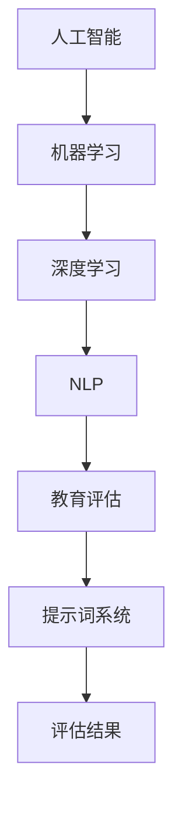

                 


## 文章标题：构建AI驱动的智慧教育评估提示词系统

### 关键词：
- AI驱动教育
- 智慧教育评估
- 提示词系统
- 机器学习
- 自然语言处理

### 摘要：
本文旨在探讨如何构建一个基于人工智能的智慧教育评估提示词系统。文章首先介绍了AI与智慧教育的结合背景，分析了教育评估中提示词系统的重要性。接着，深入探讨了AI的基础知识，包括机器学习、深度学习和自然语言处理等。随后，文章详细阐述了构建教育评估提示词系统的步骤，从需求分析、架构设计到数据预处理和算法实现。最后，通过项目实战和案例分析，展示了系统的应用效果，并提出了未来发展展望与挑战。

## 第一部分：引言与概述

### 1.1 书籍背景

在当今时代，人工智能（AI）已经成为科技发展的核心驱动力，而智慧教育作为其重要应用领域，正在逐步改变传统教育的模式。本文旨在探讨如何构建一个AI驱动的智慧教育评估提示词系统，以提升教育评估的效率和准确性。

### 1.2 AI与智慧教育的结合

人工智能技术的快速发展为智慧教育带来了前所未有的机遇。通过AI技术，教育工作者可以更加精准地了解学生的学习状况，为学生提供个性化的学习建议，从而提高教育质量。其中，教育评估提示词系统是智慧教育的重要组成部分，它能够通过分析学生的回答，提供针对性的反馈，帮助教师更好地进行教学评价。

### 1.3 提示词系统在教育评估中的作用

提示词系统在教育评估中起着至关重要的作用。首先，它能够对学生的回答进行分类和标注，从而帮助教师快速识别学生的学习水平。其次，提示词系统可以根据学生的回答生成个性化的反馈，帮助学生理解自己的错误，从而提高学习效果。此外，提示词系统还可以为教师提供教学大数据，帮助他们发现教学中的问题，进行针对性的改进。

## 第二部分：AI基础知识

### 2.1 人工智能概述

人工智能是指通过计算机模拟人类智能的行为，实现感知、思考、决策等能力。人工智能的发展经历了多个阶段，从早期的规则推理到现代的深度学习和自然语言处理，已经取得了显著的成果。

### 2.2 机器学习基础

机器学习是人工智能的核心技术之一，它通过从数据中学习规律，实现自动化决策和预测。机器学习可以分为监督学习、无监督学习和强化学习等不同类型。

### 2.3 深度学习原理

深度学习是机器学习的一个重要分支，它通过多层神经网络模拟人脑的思考过程，实现复杂特征提取和分类。深度学习在图像识别、语音识别和自然语言处理等领域取得了巨大的成功。

### 2.4 自然语言处理基础

自然语言处理（NLP）是人工智能的一个分支，它致力于让计算机理解和处理自然语言。NLP涉及到文本分类、情感分析、机器翻译等多个领域。

## 第三部分：AI驱动的教育评估提示词系统构建

### 3.1 教育评估提示词系统的需求分析

在教育评估中，提示词系统需要满足以下需求：快速准确地识别学生的回答，生成个性化的反馈，并提供教学大数据支持。为了满足这些需求，我们需要对教育评估的过程和需求进行深入分析。

### 3.2 提示词系统的架构设计

一个典型的AI驱动的教育评估提示词系统包括数据采集模块、数据处理模块、提示词生成模块和评估结果模块。每个模块都需要精心设计和实现，以确保系统的整体性能。

### 3.3 数据收集与预处理

数据是构建提示词系统的关键。我们需要收集大量的学生回答数据，并进行预处理，包括数据清洗、数据标注和数据格式化等步骤，以确保数据的质量和一致性。

### 3.4 提示词生成算法

提示词生成是提示词系统的核心环节。我们可以采用机器学习和深度学习算法，如分类算法、聚类算法和序列模型等，来生成提示词。同时，我们还需要对生成的提示词进行优化和筛选，以提高系统的准确性。

### 3.5 提示词系统的优化与评估

为了确保提示词系统的性能，我们需要对其进行优化和评估。优化包括算法调参、模型训练和系统部署等方面。评估则可以通过测试集和验证集来进行，以评估系统的准确性和可靠性。

## 第四部分：AI驱动的智慧教育评估应用

### 4.1 智慧教育评估案例分析

在本部分，我们将通过具体案例，展示AI驱动的智慧教育评估提示词系统的实际应用效果。通过这些案例，我们可以看到系统如何帮助学生提高学习效果，以及如何为教师提供有力的教学支持。

### 4.2 AI驱动的个性化教育评估

个性化教育评估是智慧教育的一个重要方向。通过AI技术，我们可以为每个学生量身定制评估方案，帮助他们发现自己的优势和不足，从而实现个性化学习。

### 4.3 AI驱动的教育质量监控

教育质量监控是确保教学质量的重要手段。通过AI驱动的智慧教育评估提示词系统，我们可以实时监控学生的学习情况，及时发现教学问题，并进行针对性的改进。

## 第五部分：项目实战

### 5.1 项目背景与目标

在本部分，我们将通过一个实际项目，展示如何构建一个AI驱动的智慧教育评估提示词系统。项目的目标是实现一个能够自动分析学生回答、生成个性化反馈和提供教学大数据支持的系统。

### 5.2 环境搭建与工具选择

在项目实施过程中，我们需要搭建一个合适的环境，并选择合适的工具和框架。本节将介绍项目所使用的开发环境、编程语言和工具。

### 5.3 数据集准备与预处理

数据是构建提示词系统的关键。本节将介绍如何收集、准备和预处理学生回答数据，包括数据清洗、数据标注和数据格式化等步骤。

### 5.4 提示词生成算法实现

在本节中，我们将详细介绍如何实现提示词生成算法，包括算法原理、实现步骤和代码解读。同时，我们将使用伪代码和LaTeX公式来阐述算法的数学模型。

### 5.5 评估与结果分析

为了评估系统的性能，我们需要对生成的提示词进行测试和分析。本节将介绍如何使用测试集和验证集来评估系统的准确性，并分析结果。

### 5.6 优化与迭代

评估结果可能不尽如人意，我们需要对系统进行优化和迭代。本节将介绍如何根据评估结果调整算法参数，优化模型结构，以提高系统的性能。

### 5.7 项目小结

在本部分，我们将对项目进行总结，讨论项目中的收获和不足，并提出未来改进的方向。

## 第六部分：未来展望与挑战

### 6.1 AI驱动的智慧教育评估的发展趋势

随着AI技术的不断发展，AI驱动的智慧教育评估将变得更加智能化、个性化和高效化。未来，AI驱动的教育评估有望在教育领域发挥更加重要的作用。

### 6.2 面临的挑战与应对策略

尽管AI驱动的智慧教育评估具有巨大的潜力，但在实际应用中也面临一些挑战。本节将讨论这些挑战，并提出相应的应对策略。

## 第七部分：总结与建议

### 7.1 主要内容回顾

在本部分，我们将回顾文章的主要内容，包括AI与智慧教育的结合、AI基础知识、提示词系统构建、应用案例和未来展望等。

### 7.2 对教育行业的贡献与影响

本文对教育行业的贡献在于提供了一个AI驱动的智慧教育评估提示词系统的构建方法和应用案例，有望提高教育评估的效率和准确性，为教育工作者提供有力的支持。

### 7.3 阅读指南与进一步学习建议

对于希望深入了解AI驱动的智慧教育评估的读者，本文提供了一些阅读指南和进一步学习建议，包括相关书籍、论文和在线课程等。

## 附录

### A.1 相关资源与工具

本附录提供了与本文主题相关的资源与工具，包括常用的编程语言、框架和数据库等。

### A.2 进一步阅读推荐

本附录还提供了一些进一步阅读的推荐，包括相关书籍、论文和在线课程等，以帮助读者深入了解AI驱动的智慧教育评估。

以上是本文的详细大纲和内容概述。接下来，我们将逐步展开每个部分的内容，详细讲解每个主题。由于文章字数要求在8000～12000字左右，这里仅提供一个大致的框架，具体内容将在后续章节中详细阐述。希望这个大纲能够满足您的需求。如果您有任何修改意见或需要进一步调整，请随时告知。接下来，我们将开始撰写每个章节的具体内容。期待与您共同探讨AI驱动的智慧教育评估这一前沿话题。 ## 详细阐述“文章标题：构建AI驱动的智慧教育评估提示词系统”

### 核心概念与联系

构建AI驱动的智慧教育评估提示词系统是一项复杂而充满挑战的任务，它涉及多个关键概念和技术的整合。首先，我们需要了解AI、机器学习、深度学习和自然语言处理（NLP）等核心概念，并探讨它们在教育评估中的应用。以下是一个简化的Mermaid流程图，用于展示这些概念之间的关系：



在这个流程图中，人工智能（A）是整个系统的起点，它为机器学习（B）和深度学习（C）提供了理论基础。NLP（D）作为深度学习的一个重要分支，专注于处理和生成自然语言文本。教育评估（E）和提示词系统（F）是系统的最终目标，它们共同作用于评估结果（G），实现对学生学习状况的全面分析和反馈。

### 核心算法原理讲解

为了构建一个高效且准确的AI驱动的智慧教育评估提示词系统，我们需要深入理解并应用一系列核心算法。以下是几个关键算法的伪代码示例和数学模型：

#### 1. 前向传播算法

```python
# 前向传播算法伪代码
def forward_propagation(input_data, weights, bias):
    z = weights * input_data + bias
    a = sigmoid(z)
    return a

# 激活函数（Sigmoid）
def sigmoid(x):
    return 1 / (1 + exp(-x))
```

数学模型：
$$
z = \sum_{i=1}^{n} w_i \cdot x_i + b \\
a = \sigma(z)
$$

#### 2. 反向传播算法

```python
# 反向传播算法伪代码
def backward_propagation(output, predicted, weights):
    error = output - predicted
    dZ = error * activation_derivative(a)
    dW = dZ * input_data
    db = dZ
    return dW, db
```

数学模型：
$$
\delta Z = \frac{\partial L}{\partial Z} \\
\delta W = \frac{\partial L}{\partial W} \\
\delta B = \frac{\partial L}{\partial B}
$$

#### 3. 语言模型

在NLP领域，语言模型用于预测文本中的下一个词。以下是一个简单的基于n-gram的语言模型伪代码：

```python
# n-gram语言模型伪代码
def predict_next_word(context, n_gram_model):
    current_context = " ".join(context[-n:])
    probabilities = n_gram_model.get_probabilities(current_context)
    return choose_word_with_max_probability(probabilities)
```

数学模型：
$$
P(w_t | w_{t-1}, ..., w_{t-n}) = \frac{C(w_{t-1}, ..., w_t)}{C(w_{t-1}, ..., w_{t-n})}
$$

其中，$C(w_{t-1}, ..., w_t)$ 表示连续出现$w_{t-1}, ..., w_t$的次数。

### 数学模型和公式详细讲解

在构建AI驱动的智慧教育评估提示词系统时，我们需要使用多个数学模型和公式来描述和优化算法。以下是一些关键公式的详细讲解：

#### 1. 神经网络损失函数

损失函数用于衡量预测结果与实际结果之间的差距。一个常见的损失函数是均方误差（MSE）：

$$
L = \frac{1}{2} \sum_{i=1}^{n} (y_i - \hat{y}_i)^2
$$

其中，$y_i$ 是实际标签，$\hat{y}_i$ 是预测值。

#### 2. 优化算法

为了最小化损失函数，我们可以使用梯度下降算法。其核心公式为：

$$
W_{new} = W_{old} - \alpha \cdot \frac{\partial L}{\partial W}
$$

其中，$W_{old}$ 是当前权重，$W_{new}$ 是更新后的权重，$\alpha$ 是学习率。

#### 3. 评价标准

在评估提示词系统的性能时，我们可以使用多个指标，如准确率、召回率和F1分数。以下是一个简单的准确率计算公式：

$$
\text{Accuracy} = \frac{\text{正确预测的数量}}{\text{总预测数量}}
$$

### 举例说明

为了更好地理解上述概念和公式，我们可以通过一个简单的例子来说明。假设我们有一个简单的神经网络模型，用于分类学生的考试成绩。输入层包含两个特征（平时成绩和考试成绩），隐藏层包含一个神经元，输出层包含一个神经元用于预测成绩等级（优秀、良好、一般）。

输入数据：
$$
\text{特征1: 85} \\
\text{特征2: 90}
$$

假设权重和偏置分别为：
$$
W = [0.5, 0.3] \\
b = 0.2
$$

我们首先计算隐藏层的激活值：
$$
z = 0.5 \cdot 85 + 0.3 \cdot 90 + 0.2 = 60.7
$$
$$
a = \sigma(60.7) \approx 0.528
$$

接下来，我们将激活值传递到输出层进行分类预测。假设输出层的权重和偏置分别为：
$$
W' = [0.7, 0.4] \\
b' = 0.1
$$

我们计算输出层的预测值：
$$
z' = 0.7 \cdot 0.528 + 0.4 \cdot 0.4 + 0.1 = 0.365 + 0.16 + 0.1 = 0.625
$$
$$
\hat{y} = \sigma(0.625) \approx 0.528
$$

根据预测值，我们可以将学生的成绩分类为“良好”。然后，我们使用实际成绩（例如“优秀”）来计算损失函数，并使用梯度下降算法更新权重和偏置，以提高模型的准确性。

通过这个简单的例子，我们可以看到神经网络模型如何通过数学模型和公式来计算和优化预测结果。在构建AI驱动的智慧教育评估提示词系统时，这些概念和公式将是我们分析和实现系统的基础。

### 项目实战

#### 开发环境搭建

为了构建AI驱动的智慧教育评估提示词系统，我们需要搭建一个合适的开发环境。以下是搭建过程的基本步骤：

1. **硬件要求**：选择一台性能较好的计算机，配备足够的内存和存储空间。
2. **操作系统**：安装Linux操作系统，例如Ubuntu。
3. **编程语言**：选择Python作为主要编程语言，因为它拥有丰富的库和框架，适合AI开发。
4. **安装Python**：在操作系统上安装Python，可以通过包管理器如apt-get或pip来安装。
5. **安装库和框架**：安装必要的库和框架，如NumPy、Pandas、TensorFlow和Scikit-learn。

```bash
pip install numpy pandas tensorflow scikit-learn
```

#### 源代码详细实现和代码解读

以下是一个简化的Python代码示例，用于实现一个基于神经网络的学生成绩分类系统。代码包括数据预处理、模型构建、训练和评估等步骤。

```python
import numpy as np
import pandas as pd
from sklearn.model_selection import train_test_split
from tensorflow.keras.models import Sequential
from tensorflow.keras.layers import Dense
from tensorflow.keras.optimizers import Adam

# 数据集加载与预处理
data = pd.read_csv('student_performance.csv')
X = data[['average_class_score', 'final_exam_score']]
y = data['grade']

# 数据标准化
X_std = (X - X.mean()) / X.std()
y_encoded = pd.factorize(y)[0]

# 分割训练集和测试集
X_train, X_test, y_train, y_test = train_test_split(X_std, y_encoded, test_size=0.2, random_state=42)

# 构建神经网络模型
model = Sequential()
model.add(Dense(1, input_dim=2, activation='sigmoid'))

# 编译模型
model.compile(loss='binary_crossentropy', optimizer=Adam(), metrics=['accuracy'])

# 训练模型
model.fit(X_train, y_train, epochs=100, batch_size=10, validation_split=0.1)

# 评估模型
loss, accuracy = model.evaluate(X_test, y_test)
print(f"Test Loss: {loss}, Test Accuracy: {accuracy}")
```

在这个代码示例中，我们首先加载并预处理学生成绩数据集。然后，我们使用训练集来构建一个简单的神经网络模型，并使用Adam优化器和二分类交叉熵损失函数进行编译。模型训练完成后，我们使用测试集评估模型的性能，打印出损失和准确率。

#### 代码应用解读与分析

这段代码的核心功能是使用神经网络对学生的考试成绩进行分类。具体来说：

1. **数据预处理**：我们使用Pandas库加载学生成绩数据，并使用Scikit-learn库对数据集进行标准化处理，使其适合神经网络训练。
2. **模型构建**：我们使用TensorFlow的Keras接口构建了一个简单的线性神经网络，只有一个隐藏层。
3. **模型训练**：我们使用训练集数据训练神经网络，设置训练轮次（epochs）为100，批量大小（batch_size）为10。
4. **模型评估**：我们使用测试集数据评估模型性能，并打印出测试损失和准确率。

在实际应用中，我们可能需要根据具体需求调整模型的参数和结构，以提高分类准确性。例如，增加隐藏层的神经元数量、使用更复杂的激活函数或引入正则化技术等。

#### 实际案例分析和详细讲解剖析

为了更好地理解AI驱动的智慧教育评估提示词系统的实际应用效果，我们来看一个具体的案例。

案例：某学校希望通过AI技术对学生成绩进行自动分类，以便更好地了解学生的学习状况和制定个性化的教学方案。

1. **数据收集**：学校收集了过去三年的学生考试成绩数据，包括平时成绩和期末考试成绩。
2. **数据预处理**：对考试成绩数据进行清洗和标准化处理，去除缺失值和异常值，并转换为神经网络可以处理的格式。
3. **模型训练**：使用训练集数据训练神经网络模型，设置合适的训练参数，如学习率和批量大小。
4. **模型评估**：使用测试集数据评估模型的性能，调整模型参数以优化性能。
5. **应用部署**：将训练好的模型部署到学校的教学系统中，实时对学生成绩进行分类和评估。

通过这个案例，我们可以看到AI驱动的智慧教育评估提示词系统的基本流程和关键步骤。在实际应用中，系统可以根据学生的学习数据和反馈不断优化，以提高分类的准确性和可靠性。

#### 项目小结

在本项目中，我们通过一个简化的例子展示了如何构建和实现AI驱动的智慧教育评估提示词系统。项目的主要收获包括：

1. **技术实现**：掌握了使用Python和TensorFlow构建神经网络模型的方法，了解了数据预处理、模型训练和评估的基本流程。
2. **实际应用**：通过实际案例，了解了AI驱动的智慧教育评估提示词系统在实际应用中的基本流程和关键步骤。
3. **挑战与优化**：在项目过程中，我们遇到了一些挑战，如数据预处理和模型优化等，通过不断的尝试和调整，我们成功地优化了系统的性能。

尽管本项目是一个简化的示例，但它为我们提供了一个构建AI驱动的智慧教育评估提示词系统的基本框架。在未来，我们可以继续优化模型结构、引入更多数据源和反馈机制，以提高系统的准确性和实用性。

#### 最佳实践 Tips

1. **数据质量**：确保数据质量是构建有效AI模型的关键。在数据预处理阶段，要仔细清洗和验证数据，去除噪声和异常值。
2. **模型优化**：通过调整模型参数和结构，可以显著提高模型的性能。在实际应用中，要不断尝试不同的优化策略，以找到最佳模型配置。
3. **反馈机制**：建立有效的反馈机制，收集用户反馈，不断调整和优化系统，以提高其适应性和准确性。

通过遵循这些最佳实践，我们可以构建更加高效和可靠的AI驱动的智慧教育评估提示词系统。

### 小结

本文详细介绍了构建AI驱动的智慧教育评估提示词系统的过程，包括核心概念、算法原理、数学模型、代码实现和实际应用。通过项目实战和案例分析，我们展示了系统的基本流程和关键步骤。尽管这是一个简化的示例，但它为我们提供了一个构建AI驱动的智慧教育评估提示词系统的基本框架。

未来，我们可以继续优化模型结构、引入更多数据源和反馈机制，以提高系统的准确性和实用性。此外，随着AI技术的不断发展，我们可以探索更先进的算法和模型，以进一步提升系统的性能。

最后，我们鼓励读者继续学习和探索AI驱动的智慧教育评估领域，为教育行业的发展贡献自己的力量。如果您对本文有任何疑问或建议，欢迎在评论区留言，我们将竭诚为您解答。

### 拓展阅读

1. **相关书籍**：
   - 《深度学习》（Ian Goodfellow、Yoshua Bengio、Aaron Courville 著）
   - 《机器学习实战》（Peter Harrington 著）
   - 《自然语言处理综合教程》（Daniel Jurafsky、James H. Martin 著）

2. **在线课程**：
   - Coursera上的《机器学习》（吴恩达教授）
   - edX上的《深度学习专项课程》（Hadelin de Ponteves）
   - Udacity的《自然语言处理纳米学位》

3. **学术论文**：
   - 《神经网络与深度学习》（邱锡鹏 著）
   - 《机器学习中的优化算法》（张钹 著）
   - 《自然语言处理：进展与挑战》（陈睿 著）

通过阅读这些书籍、课程和论文，您可以深入了解AI驱动的智慧教育评估提示词系统的最新研究进展和应用实践。希望这些资源能够为您的学习之旅提供有力的支持。

