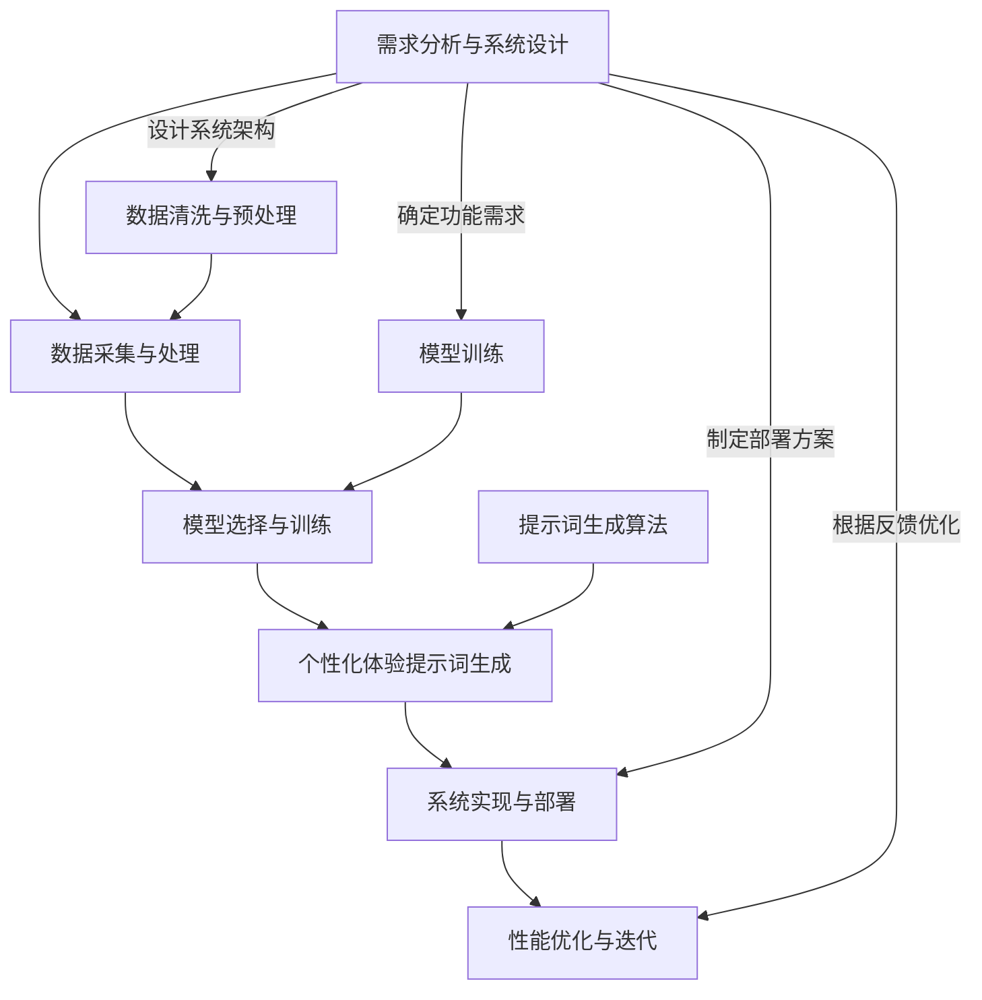

                 

### 文章标题

《构建AI驱动的智慧旅游个性化体验提示词引擎》

### 关键词

- AI驱动
- 智慧旅游
- 个性化体验提示词引擎
- 自然语言处理
- 机器学习
- 深度学习

### 摘要

本文旨在探讨构建AI驱动的智慧旅游个性化体验提示词引擎的方法与流程。首先，介绍了AI驱动的智慧旅游个性化体验提示词引擎的定义、背景及其意义。接着，分析了智慧旅游与个性化体验的关系，并概述了AI技术在智慧旅游中的应用现状与发展趋势。随后，深入探讨了自然语言处理、机器学习和深度学习等技术基础，以及用户行为分析与个性化推荐算法。在第三部分，详细介绍了构建AI驱动的智慧旅游个性化体验提示词引擎的方法与流程，包括数据采集与处理、模型选择与训练、个性化体验提示词生成等关键环节。第四部分通过实战应用案例，展示了个性化体验提示词引擎在智慧旅游场景中的实现与部署，并分析了未来发展趋势与挑战。文章末尾，提供了相关的开发工具与资源，以及Mermaid流程图与伪代码示例。本文为从事智慧旅游领域的技术人员提供了实用的参考和指导。

### 第一部分: AI驱动的智慧旅游个性化体验提示词引擎概述

#### 1.1 AI驱动的智慧旅游个性化体验提示词引擎的定义与背景

##### 1.1.1 AI驱动的智慧旅游个性化体验提示词引擎的概念

AI驱动的智慧旅游个性化体验提示词引擎是一种利用人工智能技术，通过对用户行为数据的分析和理解，生成个性化旅游体验提示词的系统。它能够根据用户的兴趣、需求和行为模式，自动推荐与其匹配的旅游活动和景点，从而提升用户的旅游体验。

在传统的旅游信息服务中，用户往往需要通过搜索引擎或旅游网站进行信息查询，这种方式存在信息过载、个性化不足等问题。而AI驱动的智慧旅游个性化体验提示词引擎能够通过机器学习和自然语言处理技术，对用户的查询历史、浏览记录、评价等数据进行深度分析，生成个性化的旅游推荐内容。

##### 1.1.2 AI驱动的智慧旅游个性化体验提示词引擎的背景

随着互联网和人工智能技术的飞速发展，旅游业也在经历着深刻的变革。智慧旅游作为旅游业的新模式，已经成为行业发展的趋势。智慧旅游通过利用大数据、云计算、物联网等技术，为游客提供智能化、个性化的旅游服务，提高游客的满意度和体验。

个性化体验是智慧旅游的核心目标之一。游客的需求和兴趣各异，传统的旅游产品和服务难以满足他们的个性化需求。而AI驱动的智慧旅游个性化体验提示词引擎能够根据游客的个性化需求，实时提供个性化的旅游推荐，从而提升游客的旅游体验。

##### 1.1.3 AI驱动的智慧旅游个性化体验提示词引擎的意义

AI驱动的智慧旅游个性化体验提示词引擎具有重要的意义：

1. **提升用户满意度**：通过个性化推荐，满足用户的个性化需求，提升用户的满意度和忠诚度。

2. **优化旅游资源配置**：通过对用户行为数据的分析，优化旅游资源的配置，提高景区、酒店等旅游服务提供商的运营效率。

3. **创新旅游产品**：基于用户行为数据和个性化需求，创新旅游产品和服务，推动旅游业的发展。

4. **促进数据驱动决策**：通过大数据分析和智能推荐，为旅游企业提供数据驱动的决策支持，提高市场竞争力。

#### 1.2 智慧旅游与个性化体验的关系

##### 1.2.1 智慧旅游的定义与特点

智慧旅游是指通过信息技术和智能设备的支持，实现旅游行业的智能化、数字化和互联网化。智慧旅游具有以下特点：

1. **智能化**：利用人工智能技术，提供智能化的旅游服务，如智能导览、智能客服等。
2. **数字化**：通过物联网、云计算等技术，实现旅游数据的全面采集、存储和分析。
3. **互联网化**：通过移动互联网，为游客提供在线预订、咨询、支付等服务。

##### 1.2.2 个性化体验的概念与需求

个性化体验是指根据用户的个性化需求和偏好，提供定制化的旅游产品和服务。个性化体验的需求来源于以下几个方面：

1. **多样性**：游客的旅游需求和偏好多样，需要提供多样化的旅游产品和服务。
2. **定制化**：游客希望旅游活动能够根据其兴趣和需求进行定制化，提高旅游的个性化和独特性。
3. **便捷性**：游客希望旅游过程中能够享受到便捷的服务，如在线预订、实时咨询等。

##### 1.2.3 智慧旅游与个性化体验的关联性

智慧旅游与个性化体验密切相关，智慧旅游通过提供智能化、数字化和互联网化的服务，为个性化体验的实现提供了技术支持。个性化体验则是智慧旅游的核心目标之一，通过满足游客的个性化需求，提升游客的满意度和体验。

AI驱动的智慧旅游个性化体验提示词引擎作为智慧旅游的重要组成部分，通过分析用户行为数据，生成个性化的旅游推荐，为游客提供个性化的旅游体验。这种关联性使得智慧旅游能够更好地满足游客的个性化需求，提升游客的满意度。

#### 1.3 AI技术在智慧旅游中的应用现状与发展趋势

##### 1.3.1 AI技术在智慧旅游中的应用现状

当前，AI技术在智慧旅游中已有广泛应用：

1. **智能导览**：利用自然语言处理和语音识别技术，为游客提供智能导览服务，提升旅游体验。
2. **个性化推荐**：基于用户的兴趣和行为数据，提供个性化的旅游推荐，满足游客的个性化需求。
3. **智能客服**：利用聊天机器人和语音识别技术，为游客提供智能客服服务，提高服务效率。
4. **图像识别**：通过图像识别技术，实现景区的人流监测、违规行为识别等，提高景区管理效率。

##### 1.3.2 AI技术在智慧旅游中的应用趋势

未来，AI技术在智慧旅游中的应用将继续深化和扩展：

1. **更加智能化**：通过深度学习和强化学习等技术，实现更高层次的智能化服务，如智能导游、智能翻译等。
2. **更加个性化**：通过个性化推荐和用户行为分析，提供更加精准的个性化旅游推荐，提升游客体验。
3. **更加协同化**：通过AI技术，实现旅游服务各环节的协同，提供一站式旅游服务，提升整体服务效率。
4. **更加生态化**：通过AI技术，构建智慧旅游生态系统，实现旅游资源、服务、管理等方面的互联互通。

##### 1.3.3 AI驱动的智慧旅游个性化体验提示词引擎的发展前景

AI驱动的智慧旅游个性化体验提示词引擎作为AI技术在智慧旅游中的创新应用，具有广阔的发展前景：

1. **市场需求**：随着智慧旅游的普及，个性化体验需求日益增长，AI驱动的个性化体验提示词引擎具有巨大的市场潜力。
2. **技术进步**：AI技术的不断进步，如深度学习、自然语言处理等，为AI驱动的个性化体验提示词引擎提供了强大的技术支持。
3. **产业协同**：智慧旅游产业链的各方，如景区、酒店、旅行社等，将共同推动AI驱动的个性化体验提示词引擎的发展。

总之，AI驱动的智慧旅游个性化体验提示词引擎将成为智慧旅游的重要组成部分，为游客提供更加智能化、个性化的旅游体验。

### 第二部分: AI驱动的智慧旅游个性化体验提示词引擎技术基础

在构建AI驱动的智慧旅游个性化体验提示词引擎时，需要深入了解并掌握一系列关键技术，包括自然语言处理技术、机器学习与深度学习基础、数据采集与处理技术、以及用户行为分析与个性化推荐算法。以下内容将逐一介绍这些技术基础。

#### 2.1 自然语言处理技术基础

自然语言处理（Natural Language Processing，NLP）是AI驱动的智慧旅游个性化体验提示词引擎的核心技术之一，其主要目标是对人类语言进行自动处理和理解。以下是NLP技术的一些基础概念：

##### 2.1.1 自然语言处理的基本概念

自然语言处理涉及对文本数据进行处理和分析，包括文本的分词、词性标注、句法分析、语义分析等。其核心任务是使计算机能够理解、生成和处理人类语言。

- **分词**：将连续的文本切分成一个个具有独立意义的词语。
- **词性标注**：为文本中的每个词标注其词性，如名词、动词、形容词等。
- **句法分析**：分析句子的结构，包括主谓宾结构、从句等。
- **语义分析**：理解文本中的语义，包括实体识别、关系抽取、情感分析等。

##### 2.1.2 词向量表示方法

词向量表示是将文本中的词语映射到高维空间中的向量，以便于计算机处理。常见的词向量表示方法包括：

- **词袋模型（Bag of Words，BoW）**：将文本表示为一个向量，其中每个维度对应一个词汇，值表示该词汇在文本中出现的次数。
- **TF-IDF（Term Frequency-Inverse Document Frequency）**：考虑词语在单个文档中的重要性和在文档集合中的普遍性，对词袋模型进行改进。
- **Word2Vec**：基于神经网络模型，通过上下文信息学习词语的向量表示，能够捕捉词语的语义关系。
- **GloVe（Global Vectors for Word Representation）**：通过矩阵分解的方法，学习词语的全球向量表示，能够捕捉词语的共现关系。

##### 2.1.3 语言模型与序列模型

语言模型是预测下一个词语的概率分布的模型，常用于文本生成和文本分类任务。序列模型则能够处理输入序列数据，包括循环神经网络（RNN）和其变种如长短期记忆网络（LSTM）和门控循环单元（GRU）。

- **循环神经网络（Recurrent Neural Network，RNN）**：能够处理序列数据，但存在梯度消失和梯度爆炸问题。
- **长短期记忆网络（Long Short-Term Memory，LSTM）**：通过门控机制，克服了RNN的梯度消失问题，能够处理长序列数据。
- **门控循环单元（Gated Recurrent Unit，GRU）**：简化了LSTM的结构，计算效率更高。

#### 2.2 机器学习与深度学习基础

机器学习（Machine Learning，ML）和深度学习（Deep Learning，DL）是构建AI驱动的智慧旅游个性化体验提示词引擎的核心技术。

##### 2.2.1 机器学习的基本概念

机器学习是一种让计算机通过数据学习规律和模式，从而进行预测或决策的技术。其主要内容包括：

- **监督学习（Supervised Learning）**：通过已标记的输入输出数据，训练模型进行预测。
- **无监督学习（Unsupervised Learning）**：没有预先标记的输入输出数据，通过发现数据内在结构进行学习。
- **半监督学习（Semi-Supervised Learning）**：结合监督学习和无监督学习，利用少量标记数据和大量未标记数据。
- **强化学习（Reinforcement Learning）**：通过与环境交互，学习最优策略。

##### 2.2.2 深度学习的基本概念

深度学习是机器学习的一个分支，通过构建多层神经网络，实现对复杂数据的建模和预测。深度学习的基本内容包括：

- **神经网络（Neural Network）**：由多个神经元组成，通过前向传播和反向传播进行训练。
- **深度神经网络（Deep Neural Network，DNN）**：具有多个隐层的神经网络，能够处理大规模数据和复杂问题。
- **卷积神经网络（Convolutional Neural Network，CNN）**：特别适用于图像处理任务，通过卷积层提取图像特征。
- **循环神经网络（Recurrent Neural Network，RNN）**：适用于序列数据处理，通过循环结构保持长时状态。
- **生成对抗网络（Generative Adversarial Network，GAN）**：由生成器和判别器组成，通过对抗训练生成高质量数据。

##### 2.2.3 常见的深度学习框架

深度学习框架是用于构建和训练深度学习模型的工具。以下是一些常见的深度学习框架：

- **TensorFlow**：由Google开发，是应用最广泛的深度学习框架之一，支持Python编程。
- **PyTorch**：由Facebook开发，具有动态计算图，便于模型设计和调试。
- **Keras**：是Python的高级神经网络API，支持TensorFlow和Theano后端。
- **MXNet**：由Apache软件基金会开发，支持多种编程语言，适用于工业级应用。

#### 2.3 数据采集与处理

数据采集与处理是构建AI驱动的智慧旅游个性化体验提示词引擎的重要环节。以下是数据采集与处理的一些关键技术：

##### 2.3.1 数据采集的方法

数据采集的方法主要包括以下几种：

- **Web scraping**：通过网络爬虫从网站中抓取数据，适用于公开数据源。
- **API**：通过调用API接口获取数据，适用于有权限访问的数据源。
- **传感器数据**：通过传感器收集实时数据，适用于智能旅游场景。
- **用户行为数据**：通过用户行为追踪，收集用户在旅游过程中的行为数据。

##### 2.3.2 数据清洗与预处理

数据清洗与预处理是保证数据质量和模型性能的关键步骤。主要包括以下内容：

- **去重**：去除重复的数据，提高数据质量。
- **缺失值处理**：填充或删除缺失值，保证数据完整性。
- **异常值处理**：检测并处理异常值，避免对模型训练产生干扰。
- **数据规范化**：对数据进行归一化或标准化处理，使数据具有相同的尺度。

##### 2.3.3 数据增强技术

数据增强是通过生成更多的数据样本来提高模型的泛化能力。常见的数据增强技术包括：

- **数据扩充（Data Augmentation）**：通过对原始数据进行变换，如旋转、缩放、裁剪等，生成新的数据样本。
- **合成数据（Synthetic Data）**：通过生成模型生成新的数据，适用于数据不足的情况。
- **迁移学习（Transfer Learning）**：利用预训练模型，在新数据集上进一步训练，适用于新数据集与训练数据集相似的情况。

#### 2.4 用户行为分析与个性化推荐

用户行为分析是构建AI驱动的智慧旅游个性化体验提示词引擎的关键环节，通过对用户在旅游过程中的行为数据进行分析，提取用户兴趣和行为模式，实现个性化推荐。

##### 2.4.1 用户行为分析的基本概念

用户行为分析是指对用户在旅游过程中的行为数据进行分析，包括用户浏览、搜索、评价、预订等行为。用户行为分析的基本概念包括：

- **用户画像**：通过用户行为数据构建用户的综合描述，包括用户的基本信息、兴趣偏好等。
- **行为轨迹**：记录用户在旅游过程中的行为路径，包括浏览、搜索、评价等。
- **行为模式**：通过分析用户行为数据，提取用户的常见行为模式和规律。

##### 2.4.2 个性化推荐算法的基本原理

个性化推荐算法是一种基于用户兴趣和行为数据，为用户推荐感兴趣的内容或商品的算法。个性化推荐算法的基本原理包括：

- **协同过滤（Collaborative Filtering）**：通过分析用户行为数据，发现用户之间的相似性，进行推荐。
- **基于内容的推荐（Content-Based Filtering）**：通过分析用户对内容的偏好，推荐相似的内容。
- **混合推荐（Hybrid Recommendation）**：结合协同过滤和基于内容的推荐，提高推荐效果。

##### 2.4.3 个性化推荐算法的应用实践

在智慧旅游场景中，个性化推荐算法可以应用于以下方面：

- **旅游目的地推荐**：根据用户的兴趣和行为数据，推荐符合条件的旅游目的地。
- **旅游活动推荐**：根据用户的兴趣和行为数据，推荐符合用户偏好的旅游活动。
- **景点推荐**：根据用户的兴趣和行为数据，推荐用户可能感兴趣的景点。

通过用户行为分析与个性化推荐，AI驱动的智慧旅游个性化体验提示词引擎能够为用户提供个性化、智能化的旅游服务，提升用户的旅游体验。

### 第三部分: 构建AI驱动的智慧旅游个性化体验提示词引擎的方法与流程

在构建AI驱动的智慧旅游个性化体验提示词引擎时，需要遵循一定的方法和流程，以确保系统的高效性和准确性。本部分将详细介绍构建流程，包括数据采集与处理、模型选择与训练、个性化体验提示词生成等关键环节。

#### 3.1 构建流程概述

构建AI驱动的智慧旅游个性化体验提示词引擎的基本步骤如下：

1. **需求分析与系统设计**：明确系统目标和功能需求，设计系统架构和模块。
2. **数据采集与处理**：收集旅游相关的数据，进行数据清洗和预处理，为模型训练提供高质量的数据集。
3. **模型选择与训练**：选择合适的模型架构，进行模型训练和优化。
4. **个性化体验提示词生成**：基于训练好的模型，生成个性化的体验提示词。
5. **系统实现与部署**：实现系统功能，进行测试和部署。
6. **性能优化与迭代**：对系统进行性能优化，不断迭代更新，提高系统的效果和稳定性。

以下是对每个步骤的详细说明：

##### 3.1.1 构建AI驱动的智慧旅游个性化体验提示词引擎的基本步骤

**步骤一：需求分析与系统设计**

在构建系统之前，首先需要进行需求分析，明确系统的目标和功能需求。具体包括：

- **用户需求分析**：分析游客在旅游过程中的需求和痛点，明确个性化体验提示词的目标。
- **系统功能设计**：设计系统的主要功能模块，包括数据采集模块、数据处理模块、模型训练模块、提示词生成模块等。
- **系统架构设计**：设计系统的总体架构，包括前后端交互、数据处理流程、模型训练流程等。

**步骤二：数据采集与处理**

数据采集与处理是构建系统的关键环节，具体包括：

- **数据源选择**：选择合适的旅游数据源，如用户行为数据、旅游活动数据、景点数据等。
- **数据采集**：通过Web scraping、API、传感器数据等方式采集数据。
- **数据清洗**：去除重复数据、处理缺失值、异常值，确保数据质量。
- **数据预处理**：进行数据规范化、特征提取等预处理工作，为模型训练提供高质量的数据集。

**步骤三：模型选择与训练**

模型选择与训练是系统的核心，具体包括：

- **模型选择**：根据问题类型和数据特点选择合适的模型，如深度学习模型、监督学习模型等。
- **模型训练**：使用预处理后的数据集对模型进行训练，调整模型参数，优化模型性能。
- **模型优化**：通过交叉验证、网格搜索等方法，优化模型参数，提高模型精度。

**步骤四：个性化体验提示词生成**

个性化体验提示词生成是系统的关键功能，具体包括：

- **提示词生成算法**：设计提示词生成算法，如基于文本生成模型、基于规则的方法等。
- **提示词生成**：使用训练好的模型，根据用户行为数据生成个性化的体验提示词。
- **提示词评估**：评估生成提示词的质量和效果，对算法进行调整和优化。

**步骤五：系统实现与部署**

系统实现与部署是构建系统的最后环节，具体包括：

- **系统实现**：编写代码，实现系统功能，进行单元测试和集成测试。
- **系统部署**：将系统部署到服务器或云平台，进行实际运行和测试。
- **系统监控**：监控系统运行状态，确保系统稳定可靠。

**步骤六：性能优化与迭代**

系统构建完成后，需要进行性能优化和迭代更新，具体包括：

- **性能优化**：对系统进行性能优化，提高处理速度和效率。
- **算法迭代**：根据用户反馈和实际运行情况，对算法进行调整和优化，提高系统效果。
- **迭代更新**：定期更新系统功能和算法，保持系统的先进性和竞争力。

##### 3.1.2 构建流程的关键环节与难点

在构建AI驱动的智慧旅游个性化体验提示词引擎的过程中，以下环节是关键且存在一定难度：

1. **数据采集与处理**：数据质量和多样性对模型性能有重要影响，数据采集和清洗是构建系统的关键。需要解决数据缺失、噪声、重复等问题，确保数据质量。
2. **模型选择与训练**：选择合适的模型和优化方法是提高模型性能的关键。需要根据数据特点和问题类型选择合适的模型，同时优化模型参数，提高模型精度。
3. **个性化体验提示词生成**：生成高质量的个性化体验提示词是系统的核心目标。需要设计有效的提示词生成算法，并根据用户反馈不断调整和优化。
4. **系统实现与部署**：实现系统功能和部署到实际环境中是构建系统的最后一步。需要编写高质量代码，进行充分的测试和调试，确保系统稳定可靠。

通过以上关键环节的合理规划和实施，可以构建出高效、准确的AI驱动的智慧旅游个性化体验提示词引擎，为用户提供优质的旅游服务。

#### 3.2 数据采集与处理

在构建AI驱动的智慧旅游个性化体验提示词引擎时，数据采集与处理是至关重要的环节。数据的质量和多样性直接影响模型的效果和准确性。以下是数据采集与处理的详细过程和方法。

##### 3.2.1 数据采集的流程与工具

数据采集是构建系统的基础，需要从多个来源获取相关数据。以下是数据采集的流程与常用工具：

1. **用户行为数据采集**：
   - **Web scraping**：通过编写爬虫程序，从旅游网站、社交媒体等获取用户的行为数据，如浏览记录、搜索关键词、评价等。
   - **API**：利用第三方API接口，获取用户在旅游服务提供商平台上的行为数据，如在线预订记录、用户反馈等。
   - **传感器数据采集**：通过安装在景区、酒店等地的传感器设备，采集游客的地理位置、行为轨迹等数据。

2. **旅游活动数据采集**：
   - **旅游活动信息获取**：从旅游服务平台、政府网站等获取旅游活动信息，如景区介绍、活动日程、门票价格等。
   - **社交媒体数据采集**：通过爬取社交媒体平台（如微博、微信公众号等）上的旅游活动信息，获取用户的兴趣和参与情况。

3. **其他数据采集**：
   - **用户问卷调查**：通过在线问卷收集用户的基本信息、旅游偏好等数据。
   - **公共数据源**：利用公共数据源，如政府公开的数据、学术论文等，获取相关的背景信息和研究数据。

##### 3.2.2 数据清洗与预处理的方法

数据清洗与预处理是确保数据质量的关键步骤。以下是常用的数据清洗与预处理方法：

1. **去重**：
   - 去除重复的数据记录，避免重复计算和处理。
   - 使用去重算法，如MD5哈希值，对数据记录进行唯一性校验。

2. **缺失值处理**：
   - **填充法**：使用平均值、中位数或最频繁值等方法，填充缺失值。
   - **删除法**：删除包含缺失值的数据记录，适用于缺失值较少的情况。

3. **异常值处理**：
   - **边界检测**：检测并处理超出数据范围的异常值。
   - **聚类分析**：使用聚类算法（如K-means），将异常值从正常数据中分离出来，进行处理。

4. **数据规范化**：
   - **归一化**：将不同数据范围的数据统一到相同的尺度，如使用z-score归一化方法。
   - **标准化**：保持数据的方差不变，将数据映射到标准正态分布，如使用min-max标准化方法。

5. **特征提取**：
   - **文本特征提取**：使用词袋模型、TF-IDF等方法，提取文本数据中的关键词和主题。
   - **数值特征提取**：对数值数据进行离散化或标准化处理，提取有意义的数据特征。

6. **数据融合**：
   - **合并数据集**：将来自不同数据源的数据进行合并，形成统一的数据集。
   - **多源数据融合**：使用融合算法（如贝叶斯网络、隐马尔可夫模型等），融合多个数据源的信息。

##### 3.2.3 数据增强技术的应用

数据增强是提高模型泛化能力和性能的重要手段。以下是几种常用的数据增强技术：

1. **数据扩充（Data Augmentation）**：
   - **文本数据扩充**：使用文本生成模型（如GPT-2、BERT等），生成新的文本数据，扩充原始数据集。
   - **图像数据扩充**：通过图像变换（如旋转、翻转、缩放等），生成新的图像数据，扩充原始数据集。

2. **合成数据（Synthetic Data）**：
   - **合成文本**：使用生成对抗网络（GAN）等生成模型，合成新的文本数据，补充原始数据集的不足。
   - **合成图像**：使用生成对抗网络（GAN）等生成模型，合成新的图像数据，补充原始数据集的不足。

3. **迁移学习（Transfer Learning）**：
   - **预训练模型**：使用在大型数据集上预训练的模型，在新数据集上进行微调，提高模型的泛化能力。
   - **特征提取**：提取预训练模型的高层特征，用于新数据集的特征表示。

通过以上数据采集与处理的方法和步骤，可以构建高质量的数据集，为模型训练和个性化体验提示词生成提供可靠的基础。

#### 3.3 模型选择与训练

在构建AI驱动的智慧旅游个性化体验提示词引擎时，模型的选择与训练是至关重要的环节。选择合适的模型和进行有效的训练，能够确保系统的高效性和准确性。以下是模型选择与训练的详细过程和方法。

##### 3.3.1 模型选择的基本原则

模型选择的基本原则包括以下几个方面：

1. **问题类型**：根据问题的类型选择合适的模型，如分类问题选择分类模型，回归问题选择回归模型。

2. **数据特点**：根据数据的特点选择合适的模型，如数据量较大选择深度学习模型，数据量较小选择传统机器学习模型。

3. **模型复杂度**：选择适当复杂度的模型，过复杂的模型可能导致过拟合，过简单的模型可能导致欠拟合。

4. **计算资源**：考虑计算资源的限制，选择在现有硬件环境下能够训练的模型，如GPU加速的深度学习模型。

5. **可解释性**：根据需求选择可解释性较高的模型，便于调试和优化。

##### 3.3.2 模型训练的方法与技巧

模型训练的方法主要包括以下几种：

1. **监督学习（Supervised Learning）**：
   - **回归模型**：用于预测连续值输出，如线性回归、决策树回归、随机森林回归等。
   - **分类模型**：用于预测离散值输出，如逻辑回归、支持向量机（SVM）、K最近邻（KNN）等。

2. **无监督学习（Unsupervised Learning）**：
   - **聚类分析**：用于发现数据中的隐藏结构和模式，如K-means、层次聚类等。
   - **降维技术**：用于减少数据维度，如主成分分析（PCA）、t-SNE等。

3. **深度学习（Deep Learning）**：
   - **卷积神经网络（CNN）**：用于处理图像数据，通过卷积层提取图像特征。
   - **循环神经网络（RNN）**：用于处理序列数据，通过循环结构保持长时状态。
   - **变换器（Transformer）**：用于处理序列数据，通过自注意力机制实现高效特征提取。

模型训练的技巧包括：

1. **数据预处理**：对数据进行归一化、标准化、缺失值处理等预处理，提高模型训练的效果。

2. **正则化技术**：使用正则化方法（如L1正则化、L2正则化），防止模型过拟合。

3. **批量归一化（Batch Normalization）**：加速模型训练，提高模型稳定性。

4. **学习率调度**：使用学习率调度策略（如学习率衰减、学习率预热等），优化模型训练过程。

5. **优化器选择**：选择合适的优化器（如Adam、RMSProp等），提高模型训练速度和效果。

6. **交叉验证**：使用交叉验证方法（如K折交叉验证），评估模型性能，防止过拟合。

##### 3.3.3 模型评估与优化

模型评估是确保模型性能的重要步骤。常用的评估指标包括：

1. **分类问题**：
   - **准确率（Accuracy）**：分类正确的样本数占总样本数的比例。
   - **召回率（Recall）**：分类正确的正样本数占总正样本数的比例。
   - **精确率（Precision）**：分类正确的正样本数占分类为正样本的样本数的比例。
   - **F1值（F1 Score）**：精确率和召回率的调和平均值。

2. **回归问题**：
   - **均方误差（Mean Squared Error，MSE）**：预测值与真实值之间差的平方的平均值。
   - **均绝对误差（Mean Absolute Error，MAE）**：预测值与真实值之间差的绝对值的平均值。
   - **决定系数（R-squared）**：模型解释的方差比例。

模型优化方法包括：

1. **参数调优**：通过网格搜索、随机搜索等方法，调整模型参数，提高模型性能。

2. **模型集成**：使用集成方法（如随机森林、提升树等），提高模型的泛化能力和预测精度。

3. **特征工程**：通过特征提取、特征选择等方法，优化数据特征，提高模型性能。

4. **模型剪枝**：通过剪枝方法，减少模型的参数数量，提高模型的效率和效果。

通过合理的模型选择与训练，以及有效的评估与优化，可以构建出高效、准确的AI驱动的智慧旅游个性化体验提示词引擎，为用户提供优质的个性化旅游服务。

#### 3.4 个性化体验提示词生成

在构建AI驱动的智慧旅游个性化体验提示词引擎时，个性化体验提示词生成是关键的一环。这一部分将详细介绍个性化体验提示词生成的原理、算法实现，以及实际案例。

##### 3.4.1 个性化体验提示词生成的原理

个性化体验提示词生成的原理主要基于用户行为数据分析和自然语言生成技术。其核心思想是利用用户的兴趣和行为模式，生成具有针对性的旅游推荐提示词。

具体来说，个性化体验提示词生成包括以下几个步骤：

1. **用户行为数据采集**：收集用户在旅游过程中的行为数据，如浏览记录、搜索关键词、评价、预订记录等。
2. **用户兴趣分析**：通过分析用户行为数据，提取用户的兴趣点，建立用户兴趣模型。
3. **旅游内容分析**：对旅游内容数据进行分析，提取旅游活动的特征信息，如景点类型、活动内容、景点评价等。
4. **提示词生成**：基于用户兴趣模型和旅游内容特征，利用自然语言生成技术，生成个性化的体验提示词。

##### 3.4.2 个性化体验提示词生成的算法实现

实现个性化体验提示词生成，可以采用以下算法：

1. **基于规则的方法**：
   - **规则库构建**：根据用户行为数据，构建用户兴趣规则库，如用户喜欢游览历史景点，则生成与历史相关的提示词。
   - **规则匹配**：将用户行为数据与规则库进行匹配，生成个性化提示词。
   - **优化的规则库**：通过用户反馈和实际应用效果，不断优化和更新规则库。

2. **基于机器学习的方法**：
   - **用户兴趣模型训练**：使用用户行为数据，训练用户兴趣模型，如基于协同过滤算法的用户兴趣模型。
   - **提示词生成模型训练**：利用训练好的用户兴趣模型和旅游内容数据，训练提示词生成模型，如使用循环神经网络（RNN）或变换器（Transformer）模型。
   - **提示词生成**：将用户兴趣模型和旅游内容特征输入到提示词生成模型，生成个性化提示词。

3. **基于深度学习的方法**：
   - **用户兴趣模型训练**：使用用户行为数据，训练深度学习模型，如基于生成对抗网络（GAN）的用户兴趣模型。
   - **提示词生成模型训练**：利用训练好的用户兴趣模型和旅游内容数据，训练深度学习模型，如使用生成式模型（如GPT-2、BERT等）生成提示词。
   - **提示词生成**：将用户兴趣模型和旅游内容特征输入到深度学习模型，生成个性化提示词。

以下是基于深度学习的个性化体验提示词生成算法的伪代码实现：

```python
# 伪代码：基于深度学习的个性化体验提示词生成算法

# 数据预处理
def preprocess_data(user_behavior_data, tourism_content_data):
    # 对用户行为数据进行清洗和特征提取
    # 对旅游内容数据进行清洗和特征提取
    # 返回预处理后的数据

# 用户兴趣模型训练
def train_user_interest_model(preprocessed_user_behavior_data):
    # 使用用户行为数据训练深度学习模型
    # 返回训练好的用户兴趣模型

# 提示词生成模型训练
def train_tourism_tip_model(preprocessed_tourism_content_data, user_interest_model):
    # 使用旅游内容数据和用户兴趣模型训练深度学习模型
    # 返回训练好的提示词生成模型

# 提示词生成
def generate_tourism_tips(tourism_content_data, user_interest_model, tip_model):
    # 将旅游内容数据、用户兴趣模型和提示词生成模型输入到模型
    # 生成个性化体验提示词

# 主程序
def main():
    # 采集和预处理用户行为数据、旅游内容数据
    user_behavior_data = collect_user_behavior_data()
    tourism_content_data = collect_tourism_content_data()
    
    preprocessed_user_behavior_data = preprocess_data(user_behavior_data, tourism_content_data)
    
    # 训练用户兴趣模型
    user_interest_model = train_user_interest_model(preprocessed_user_behavior_data)
    
    # 训练提示词生成模型
    tip_model = train_tourism_tip_model(preprocessed_user_behavior_data, user_interest_model)
    
    # 生成个性化体验提示词
    tourism_tips = generate_tourism_tips(tourism_content_data, user_interest_model, tip_model)
    
    # 输出个性化体验提示词
    print(tourism_tips)
```

##### 3.4.3 个性化体验提示词生成的案例分析

以下是一个个性化体验提示词生成的案例分析：

**案例背景**：某用户在旅游平台上浏览了多个历史景点，搜索了“古建筑”、“博物馆”等相关关键词，并留下了对历史文化的兴趣评价。

**案例分析**：

1. **用户兴趣分析**：通过用户行为数据，提取用户的兴趣点，如对历史文化、古建筑的兴趣。

2. **旅游内容分析**：对旅游平台上的历史景点、博物馆等旅游内容进行分析，提取相关特征信息。

3. **提示词生成**：基于用户兴趣和旅游内容特征，生成个性化体验提示词。

   ```plaintext
   【个性化体验提示词】
   您好！根据您对历史文化的浓厚兴趣，我们为您推荐以下景点和活动：
   - 景点：故宫博物院、长城、颐和园
   - 活动推荐：参观故宫博物院，了解中国传统文化；登长城，感受历史的厚重；游览颐和园，欣赏园林美景。
   - 注意事项：参观时请注意保护文物，遵守景区规定。
   ```

通过上述案例，可以看到个性化体验提示词生成的效果，根据用户的兴趣和行为数据，为用户提供了针对性的旅游推荐。

总之，个性化体验提示词生成是AI驱动的智慧旅游个性化体验提示词引擎的核心功能之一，通过深度学习和自然语言生成技术，能够为用户提供智能化、个性化的旅游推荐，提升用户的旅游体验。

### 第四部分: AI驱动的智慧旅游个性化体验提示词引擎的实战应用

在本部分中，我们将通过具体的案例分析，探讨AI驱动的智慧旅游个性化体验提示词引擎在实际应用中的实现与部署，以及其在提升旅游体验和运营效率方面的具体作用。

#### 4.1 智慧旅游场景下的应用案例分析

##### 4.1.1 智慧景区的应用案例分析

**案例背景**：某大型智慧景区，拥有多个历史遗迹和文化景点，希望通过AI驱动的个性化体验提示词引擎提升游客的旅游体验。

**解决方案**：

1. **数据采集与处理**：景区通过传感器、游客互动设备等，收集游客的行为数据，如游览路径、停留时间、兴趣点等。数据经过清洗和预处理后，用于模型训练。

2. **模型训练**：使用收集到的用户行为数据，结合景点信息，训练个性化体验提示词生成模型。模型采用变换器（Transformer）架构，能够捕捉复杂的用户兴趣和景点特征。

3. **个性化体验提示词生成**：基于训练好的模型，实时生成个性化体验提示词，如根据游客的兴趣偏好推荐特定景点或活动。

**应用效果**：

- **提升游客满意度**：通过个性化的体验提示词，游客能够更好地了解景区内的特色景点和活动，提升旅游体验。
- **增加游客停留时间**：个性化推荐能够吸引游客更多地停留在感兴趣的区域，延长游客在景区的停留时间。
- **优化景区管理**：基于游客行为数据的分析，景区管理者可以优化景点的布局和设施，提高运营效率。

##### 4.1.2 智慧酒店的应用案例分析

**案例背景**：某知名酒店集团，希望通过AI驱动的个性化体验提示词引擎提升住客的入住体验。

**解决方案**：

1. **用户行为数据采集**：通过酒店管理系统和住客互动设备，收集住客的偏好数据，如房间类型、餐饮喜好、娱乐活动等。

2. **个性化体验提示词生成**：基于住客的历史数据和实时行为，生成个性化的入住提示词，如推荐符合住客口味的餐饮、附近的旅游景点等。

3. **智能客服系统**：集成AI驱动的个性化体验提示词引擎，为住客提供智能客服服务，解答疑问、推荐活动等。

**应用效果**：

- **提升住客满意度**：个性化的入住提示词和智能客服服务，提升了住客的入住体验和满意度。
- **增加酒店营收**：通过个性化推荐，吸引住客尝试新的餐饮和娱乐项目，提高酒店营收。
- **优化服务流程**：智能客服系统能够高效地处理住客咨询，减轻客服人员的工作负担，提升服务效率。

##### 4.1.3 智慧旅行社的应用案例分析

**案例背景**：某在线旅行社，希望通过AI驱动的个性化体验提示词引擎提升游客的旅行规划体验。

**解决方案**：

1. **用户行为数据采集**：通过网站访问记录、在线咨询记录等，收集游客的兴趣偏好和旅游需求。

2. **个性化体验提示词生成**：根据游客的个性化需求和偏好，生成个性化的旅行规划建议，如推荐最佳旅行路线、热门景点等。

3. **智能推荐系统**：集成个性化体验提示词引擎，为游客提供智能化的旅行规划服务。

**应用效果**：

- **提升游客体验**：个性化的旅行规划建议，使游客能够更好地规划旅行，提升旅游体验。
- **增加销售转化率**：通过个性化推荐，吸引游客预订行程，提高销售转化率。
- **优化营销策略**：基于用户行为数据，旅行社能够制定更加精准的营销策略，提高营销效果。

#### 4.2 个性化体验提示词引擎的实现与部署

在智慧旅游场景中，实现和部署AI驱动的个性化体验提示词引擎是一个复杂的过程，涉及多个环节。以下是实现与部署的关键步骤：

1. **需求分析与系统设计**：根据具体场景需求，设计系统的功能模块和技术架构。

2. **数据采集与处理**：通过传感器、网站日志、用户互动设备等，收集和整理旅游相关数据，确保数据的质量和多样性。

3. **模型训练**：选择合适的机器学习和深度学习模型，进行训练和优化，提高模型的准确性和泛化能力。

4. **个性化体验提示词生成**：基于训练好的模型，实时生成个性化体验提示词，并根据用户反馈进行调整和优化。

5. **系统集成**：将个性化体验提示词引擎集成到智慧旅游平台的各个模块中，如酒店预订系统、景区导览系统、旅行社规划系统等。

6. **系统部署与测试**：将系统部署到服务器或云平台，进行实际运行和测试，确保系统的稳定性和可靠性。

7. **性能优化与迭代**：根据用户反馈和系统运行情况，对模型和系统进行优化和迭代，提升用户体验和系统效果。

#### 4.3 个性化体验提示词引擎的性能优化

为了确保AI驱动的智慧旅游个性化体验提示词引擎的高效性和准确性，性能优化是关键。以下是几个性能优化策略：

1. **模型优化**：
   - **参数调优**：通过网格搜索、贝叶斯优化等技术，调整模型参数，提高模型性能。
   - **模型压缩**：使用模型剪枝、量化等技术，减少模型参数数量，提高模型推理速度。

2. **数据优化**：
   - **数据增强**：通过数据扩充、生成对抗网络等技术，增加训练数据的多样性，提高模型泛化能力。
   - **数据缓存**：使用数据缓存技术，减少数据读取时间，提高数据处理速度。

3. **系统优化**：
   - **分布式计算**：使用分布式计算框架，如Apache Spark，处理大规模数据，提高系统处理能力。
   - **服务优化**：优化系统的接口设计和数据处理流程，提高系统的响应速度和服务质量。

4. **自动化运维**：
   - **监控与报警**：使用监控系统，实时监控系统运行状态，及时发现问题并进行处理。
   - **自动化部署**：使用自动化部署工具，如Kubernetes，简化系统部署和升级过程，提高系统稳定性。

通过上述性能优化策略，可以确保AI驱动的智慧旅游个性化体验提示词引擎在实际应用中高效稳定地运行，为用户提供优质的个性化服务。

#### 4.4 未来发展趋势与挑战

随着人工智能技术和旅游行业的不断发展，AI驱动的智慧旅游个性化体验提示词引擎具有广阔的发展前景。以下是未来发展趋势与挑战：

1. **发展趋势**：
   - **智能化水平提升**：通过深度学习和强化学习等先进技术，进一步提升个性化体验提示词引擎的智能化水平。
   - **多模态数据处理**：结合文本、图像、语音等多模态数据，提供更加丰富和精准的个性化推荐。
   - **跨领域应用拓展**：智慧旅游个性化体验提示词引擎的应用范围将不断拓展，如应用到智慧城市、智慧交通等领域。
   - **用户体验优化**：通过用户行为分析和个性化推荐，不断优化用户体验，提升用户满意度和忠诚度。

2. **挑战**：
   - **数据隐私与安全**：在数据采集和使用过程中，如何确保用户隐私和数据安全是一个重要挑战。
   - **算法公平性与透明性**：如何保证个性化推荐算法的公平性和透明性，避免算法偏见和不公平现象。
   - **计算资源限制**：大规模数据处理和模型训练需要大量的计算资源，如何高效利用计算资源是一个挑战。
   - **实时性要求**：个性化体验提示词引擎需要实时响应用户需求，如何在保证准确性的同时提高响应速度是一个挑战。

面对这些挑战，需要通过技术创新、法律法规完善、跨领域合作等方式，不断提升AI驱动的智慧旅游个性化体验提示词引擎的成熟度和实用性，推动智慧旅游的发展。

### 附录

#### 附录A: AI驱动的智慧旅游个性化体验提示词引擎开发工具与资源

在构建AI驱动的智慧旅游个性化体验提示词引擎时，需要使用一系列工具和资源。以下是一些常用的开发工具和资源推荐：

##### 附录A.1 开发工具介绍

1. **Python**：Python是一种通用编程语言，广泛应用于人工智能和数据分析领域。其简洁的语法和丰富的库支持，使得Python成为构建AI系统的首选语言。

2. **TensorFlow**：TensorFlow是Google开发的开源机器学习和深度学习框架，支持多种神经网络结构和模型训练。

3. **PyTorch**：PyTorch是Facebook开发的深度学习框架，具有动态计算图和强大的GPU支持，适合快速原型开发和模型研究。

4. **Scikit-learn**：Scikit-learn是一个开源的机器学习库，提供多种经典的机器学习算法和工具，适用于数据分析和模型评估。

5. **NLTK**：NLTK是一个用于自然语言处理的Python库，提供了多种文本处理工具和算法，如分词、词性标注等。

##### 附录A.2 资源链接与推荐

1. **在线课程与教程**：
   - Coursera上的“机器学习”课程，由斯坦福大学教授Andrew Ng主讲。
   - Udacity的“深度学习纳米学位”，提供深度学习的基础知识和实战项目。

2. **开源代码与项目**：
   - GitHub上的AI相关开源项目，如TensorFlow、PyTorch等框架的官方仓库。
   - Kaggle上的数据科学和机器学习竞赛项目，提供丰富的实战数据集和解决方案。

3. **专业书籍**：
   - 《深度学习》（Deep Learning）由Ian Goodfellow、Yoshua Bengio和Aaron Courville合著，是深度学习的经典教材。
   - 《Python机器学习》（Python Machine Learning）由 Sebastian Raschka和Vahid Mirjalili合著，详细介绍Python在机器学习中的应用。

通过这些工具和资源的合理利用，开发者可以更高效地构建和优化AI驱动的智慧旅游个性化体验提示词引擎。

### 附录B: Mermaid流程图与伪代码示例

为了更好地理解AI驱动的智慧旅游个性化体验提示词引擎的构建过程，以下提供了相关的Mermaid流程图和伪代码示例。

#### 附录B.1 Mermaid流程图示例

以下是构建过程的Mermaid流程图示例：



这段Mermaid代码将生成一个描述系统构建过程的流程图，展示了各个步骤及其相互关系。

#### 附录B.2 伪代码示例

以下是模型训练的伪代码示例：

```python
# 伪代码：模型训练过程

# 数据预处理
def preprocess_data(data):
    # 数据清洗
    cleaned_data = clean_data(data)
    # 数据增强
    augmented_data = augment_data(cleaned_data)
    return augmented_data

# 模型训练
def train_model(preprocessed_data):
    # 初始化模型
    model = initialize_model()
    # 训练模型
    trained_model = train(model, preprocessed_data)
    # 评估模型
    evaluate_model(trained_model, validation_data)
    return trained_model

# 主程序
def main():
    # 采集和预处理数据
    data = collect_data()
    preprocessed_data = preprocess_data(data)
    # 训练模型
    trained_model = train_model(preprocessed_data)
    # 输出训练结果
    print("训练完成，模型参数：", trained_model.parameters())

# 执行主程序
main()
```

这段伪代码展示了数据预处理、模型训练和评估的基本步骤，用于说明模型训练过程的实现逻辑。

通过这些Mermaid流程图和伪代码示例，可以更直观地理解AI驱动的智慧旅游个性化体验提示词引擎的构建过程，帮助读者更好地掌握系统开发的关键技术和方法。

