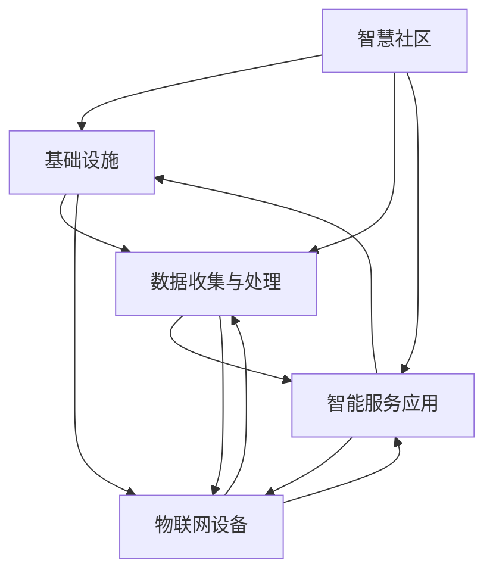

                 

### 文章标题

《构建AI驱动的智慧社区服务匹配提示词平台》

### 关键词

- AI驱动的智慧社区
- 服务匹配
- 提示词平台
- 机器学习
- 深度学习
- 自然语言处理

### 摘要

本文详细阐述了如何构建一个AI驱动的智慧社区服务匹配提示词平台。首先介绍了智慧社区的概念与价值，以及AI在其中的应用。随后，深入分析了AI基础原理，包括机器学习、深度学习和自然语言处理。接着，探讨了AI驱动的服务匹配原理，从提示词生成与优化到服务匹配流程，全面展示了平台的构建过程。文章还详细介绍了平台的设计架构、核心算法原理和数学模型，并通过实际案例解析了平台的部署与运维。最后，展望了AI驱动的服务匹配平台的未来发展。

---

### 《构建AI驱动的智慧社区服务匹配提示词平台》目录大纲

#### 第一部分：AI驱动的智慧社区概述

##### 第1章：智慧社区概述

- **1.1 智慧社区的概念与价值**
  - 智慧社区的定义
  - 智慧社区的关键技术
  - 智慧社区的价值体现
- **1.2 AI驱动的智慧社区**
  - AI在智慧社区中的应用场景
  - AI驱动下的智慧社区优势
  - AI驱动的智慧社区面临的挑战
- **1.3 提示词平台在智慧社区中的作用**
  - 提示词平台的定义
  - 提示词平台的工作原理
  - 提示词平台在智慧社区中的应用

##### 第2章：AI基础原理

- **2.1 机器学习概述**
  - 机器学习的定义
  - 机器学习的主要类型
  - 机器学习的基本流程
- **2.2 深度学习基础**
  - 神经网络的概念
  - 深度学习的基本架构
  - 深度学习的主要算法
- **2.3 自然语言处理基础**
  - 语言模型的概念
  - 机器翻译的基本原理
  - 文本分类与情感分析

#### 第二部分：构建AI驱动的服务匹配提示词平台

##### 第3章：AI驱动的服务匹配原理

- **3.1 服务匹配的概念**
  - 服务匹配的定义
  - 服务匹配的关键因素
  - 服务匹配的技术框架
- **3.2 提示词生成与优化**
  - 提示词生成的策略
  - 提示词优化的方法
  - 提示词在服务匹配中的应用
- **3.3 AI驱动的服务匹配流程**
  - 数据收集与预处理
  - 模型选择与训练
  - 模型评估与优化

##### 第4章：构建服务匹配提示词平台的架构设计

- **4.1 平台总体架构设计**
  - 服务匹配模块的设计
  - 数据存储与处理模块的设计
  - 用户交互模块的设计
- **4.2 提示词平台的模块化设计**
  - 提示词生成模块
  - 提示词优化模块
  - 服务匹配模块
- **4.3 提示词平台的安全性与隐私保护**
  - 数据安全策略
  - 用户隐私保护措施
  - 安全性与隐私保护的实现方法

##### 第5章：核心算法原理与数学模型

- **5.1 提示词生成算法原理**
  - 生成对抗网络（GAN）的算法原理
  - 生成式模型的基本结构
  - 提示词生成的伪代码实现
- **5.2 提示词优化算法原理**
  - 强化学习的算法原理
  - 优化策略的选择
  - 提示词优化的伪代码实现
- **5.3 服务匹配算法原理**
  - 聚类算法的基本原理
  - 近邻算法的基本原理
  - 服务匹配的数学模型与公式

##### 第6章：项目实战与案例分析

- **6.1 项目背景与目标**
  - 项目背景介绍
  - 项目目标设定
- **6.2 环境搭建与工具选择**
  - 开发环境搭建
  - 开发工具与框架选择
- **6.3 实际案例介绍**
  - 案例一：某智慧社区服务匹配案例
  - 案例二：某提示词平台构建案例
- **6.4 源代码实现与解读**
  - 服务匹配模块源代码实现
  - 提示词生成与优化模块源代码实现
  - 代码解读与分析

##### 第7章：平台部署与运维

- **7.1 平台部署方案**
  - 部署环境选择
  - 部署流程与步骤
- **7.2 平台运维策略**
  - 数据备份与恢复
  - 系统监控与报警
  - 性能优化与调优
- **7.3 平台安全与隐私保护**
  - 安全防护措施
  - 隐私保护策略
  - 安全运维实践

##### 第8章：未来发展展望

- **8.1 AI驱动的服务匹配趋势**
  - AI技术的发展趋势
  - 服务匹配技术的发展趋势
- **8.2 提示词平台的发展方向**
  - 提示词平台的功能扩展
  - 提示词平台的应用场景拓展
- **8.3 未来挑战与机遇**
  - 技术挑战与突破
  - 商业模式与创新

#### 附录

- **附录A：常用工具与资源**
  - 深度学习框架介绍
  - 自然语言处理工具介绍
  - 提示词生成与优化工具介绍

- **附录B：数学模型与公式索引**
  - 生成对抗网络（GAN）的数学模型
  - 强化学习的数学模型
  - 聚类算法的数学模型

**核心概念与联系**

- **智慧社区与AI驱动的关联**
  - 用 Mermaid 流程图展示智慧社区中的AI应用场景及其关联。



### 第一部分：AI驱动的智慧社区概述

#### 第1章：智慧社区概述

##### 1.1 智慧社区的概念与价值

**智慧社区**，顾名思义，是指利用信息技术和智能技术，实现社区内各种资源和服务的智能化、数字化和协同化管理的现代化社区。智慧社区不仅包含了传统的居住功能，更融合了生活服务、环境监测、安防管理、公共服务等多个方面，通过数字化手段实现社区的智慧化运营。

**智慧社区的定义**：智慧社区是一种基于物联网、云计算、大数据、人工智能等先进技术，以居民需求为导向，实现社区管理与服务的智能化、便捷化、个性化、安全化的新型社区模式。

**智慧社区的关键技术**：

1. **物联网（IoT）技术**：物联网技术通过连接各种传感器和设备，实现信息的实时采集、传输和共享，为智慧社区提供了数据基础。
2. **云计算**：云计算技术提供了强大的计算能力和数据存储能力，支持智慧社区的各种应用和服务。
3. **大数据**：大数据技术通过对海量数据的分析和挖掘，为智慧社区的管理和服务提供了数据支撑。
4. **人工智能**：人工智能技术通过机器学习、深度学习等算法，实现了对数据的智能分析和决策支持，是智慧社区的核心驱动力量。

**智慧社区的价值体现**：

1. **提高居民生活质量**：智慧社区通过提供智能化、个性化的服务，提升了居民的生活质量，减少了生活成本。
2. **优化社区管理效率**：智慧社区通过信息化手段，实现了社区管理的自动化、智能化，提高了管理效率。
3. **增强社区安全性**：智慧社区通过视频监控、智能门禁、安全报警等手段，增强了社区的安全防护能力。
4. **促进社区经济发展**：智慧社区吸引了更多企业和人才，促进了社区经济的发展。

##### 1.2 AI驱动的智慧社区

**AI在智慧社区中的应用场景**：

1. **智能家居**：通过智能音箱、智能灯光、智能家电等设备，实现家居设备的智能控制，提升居住舒适度。
2. **智能安防**：通过视频监控、人脸识别、入侵检测等技术，实现社区的实时监控和安全防护。
3. **智能交通**：通过交通流量监控、智能调度、自动驾驶等技术，优化交通管理，减少拥堵。
4. **智能环境监测**：通过传感器监测社区环境质量，实现环境问题的及时发现和处理。
5. **智能公共服务**：通过AI技术，提供更加个性化、便捷化的公共服务，如在线医疗咨询、智能配送等。

**AI驱动下的智慧社区优势**：

1. **个性化服务**：AI技术可以根据居民的需求和习惯，提供个性化的服务，提升用户体验。
2. **实时响应**：AI技术可以实现实时数据处理和分析，快速响应社区事件，提高应急处理能力。
3. **智能决策**：AI技术通过对数据的分析，可以为社区管理提供智能化的决策支持，优化管理策略。
4. **资源优化**：AI技术可以优化社区资源的配置和使用，提高资源利用效率。

**AI驱动的智慧社区面临的挑战**：

1. **数据安全与隐私保护**：智慧社区涉及大量个人隐私数据，如何保障数据安全和隐私保护是一个重要挑战。
2. **技术融合与创新**：AI技术与其他技术的融合应用，以及新技术的持续创新，是智慧社区发展的重要挑战。
3. **管理协同**：智慧社区涉及到多个部门和利益相关方，如何实现有效协同管理是一个难题。

##### 1.3 提示词平台在智慧社区中的作用

**提示词平台的定义**：提示词平台是一个基于AI技术，用于生成和优化服务匹配提示词的系统平台。它通过分析用户需求和行为数据，生成适合的服务匹配提示词，帮助用户更便捷地找到所需的服务。

**提示词平台的工作原理**：

1. **数据采集与预处理**：平台首先收集用户的浏览历史、搜索记录、行为数据等，并对这些数据进行清洗和预处理。
2. **提示词生成**：利用自然语言处理（NLP）技术，生成与用户需求相关的服务匹配提示词。
3. **提示词优化**：通过机器学习和深度学习算法，对生成的提示词进行优化，提高其准确性和用户体验。
4. **服务匹配**：将优化后的提示词与社区内的服务进行匹配，为用户提供个性化的服务推荐。

**提示词平台在智慧社区中的应用**：

1. **智能搜索**：用户在智慧社区内进行搜索时，提示词平台可以提供智能搜索建议，提高搜索效率和体验。
2. **智能推荐**：基于用户的兴趣和行为数据，提示词平台可以推荐符合用户需求的服务和活动，提升社区服务品质。
3. **智能导航**：在社区内，提示词平台可以为用户提供智能导航服务，引导用户快速找到目的地。
4. **智能客服**：在社区服务平台，提示词平台可以提供智能客服功能，解答用户疑问，提升用户满意度。

通过上述对智慧社区概述、AI驱动的智慧社区优势与挑战，以及提示词平台在智慧社区中的作用的介绍，我们可以看到AI技术在智慧社区中的应用具有巨大的潜力和价值。接下来，本文将深入探讨AI的基础原理，为构建AI驱动的服务匹配提示词平台奠定理论基础。

### 第二部分：AI基础原理

#### 第2章：AI基础原理

##### 2.1 机器学习概述

**机器学习**是人工智能（AI）的一个重要分支，它通过让计算机从数据中学习和发现规律，从而实现自动化决策和预测。机器学习的基本流程包括数据收集、数据预处理、模型选择、模型训练、模型评估和模型部署。

**机器学习的定义**：机器学习是一种通过算法让计算机从数据中自动学习并做出决策或预测的技术。

**机器学习的主要类型**：

1. **监督学习（Supervised Learning）**：监督学习中有已标记的训练数据，模型通过学习这些数据来预测新的数据。常见的算法包括线性回归、逻辑回归、决策树、随机森林等。
2. **无监督学习（Unsupervised Learning）**：无监督学习没有已标记的训练数据，模型需要从未标记的数据中发现模式和结构。常见的算法包括聚类（如K-means、层次聚类）、降维（如主成分分析、t-SNE）等。
3. **半监督学习（Semi-supervised Learning）**：半监督学习结合了监督学习和无监督学习，使用一部分标记数据和大量未标记数据来训练模型。
4. **强化学习（Reinforcement Learning）**：强化学习通过交互环境，不断调整策略以最大化长期奖励。常见的算法包括Q-learning、深度强化学习（如DQN、PPO）等。

**机器学习的基本流程**：

1. **数据收集**：收集用于训练的数据集，这些数据可以是结构化数据、图像、文本等。
2. **数据预处理**：对数据进行清洗、归一化、特征提取等处理，使其适合模型训练。
3. **模型选择**：根据问题的性质和数据的特点，选择合适的机器学习算法和模型。
4. **模型训练**：使用训练数据集对模型进行训练，调整模型参数以最小化预测误差。
5. **模型评估**：使用验证数据集对训练好的模型进行评估，以确定模型的性能和泛化能力。
6. **模型部署**：将训练好的模型部署到生产环境中，实现自动化决策和预测。

##### 2.2 深度学习基础

**深度学习**是机器学习的一个分支，它通过构建多层的神经网络（如卷积神经网络、循环神经网络等）来模拟人类大脑的思维方式，实现对复杂数据的处理和分析。深度学习在图像识别、语音识别、自然语言处理等领域取得了显著的成果。

**神经网络的概念**：神经网络是由大量简单的处理单元（即神经元）组成，通过前向传播和反向传播进行训练和学习。

**深度学习的基本架构**：

1. **输入层（Input Layer）**：接收输入数据，将其传递到下一层。
2. **隐藏层（Hidden Layers）**：对输入数据进行处理和特征提取。
3. **输出层（Output Layer）**：生成输出结果。

**深度学习的主要算法**：

1. **卷积神经网络（CNN）**：卷积神经网络是用于图像处理的一种常见算法，它通过卷积操作和池化操作提取图像特征。
2. **循环神经网络（RNN）**：循环神经网络是用于序列数据的一种算法，它通过隐藏状态的记忆机制处理序列数据。
3. **长短期记忆网络（LSTM）**：长短期记忆网络是循环神经网络的一种改进，它通过门控机制解决长期依赖问题。
4. **生成对抗网络（GAN）**：生成对抗网络由生成器和判别器两个神经网络组成，通过对抗训练生成高质量的数据。

##### 2.3 自然语言处理基础

**自然语言处理（NLP）**是深度学习的一个重要应用领域，它旨在使计算机能够理解、处理和生成人类自然语言。NLP涉及到语言模型、文本分类、情感分析、机器翻译等多个子领域。

**语言模型的概念**：语言模型是一种用于预测下一个单词或句子的概率分布的模型，它是自然语言处理的基础。

**机器翻译的基本原理**：机器翻译通过将源语言的单词或短语转换为目标语言的单词或短语，实现跨语言交流。常见的机器翻译模型包括基于规则的翻译、统计机器翻译和神经机器翻译。

**文本分类与情感分析**：

1. **文本分类（Text Classification）**：文本分类是将文本数据分为不同的类别或标签，常见的算法包括朴素贝叶斯、支持向量机、深度学习等。
2. **情感分析（Sentiment Analysis）**：情感分析是判断文本中表达的情感倾向，常见的算法包括基于词典的方法、基于机器学习的方法和基于深度学习的方法。

通过对机器学习、深度学习和自然语言处理基础原理的介绍，我们可以更好地理解AI技术的核心，为构建AI驱动的服务匹配提示词平台提供理论支持。接下来，本文将深入探讨AI驱动的服务匹配原理，详细解析服务匹配的概念、提示词生成与优化、以及服务匹配流程。

### 第二部分：构建AI驱动的服务匹配提示词平台

#### 第3章：AI驱动的服务匹配原理

##### 3.1 服务匹配的概念

**服务匹配**是指在社区服务提供者和服务需求者之间建立有效连接，实现服务资源的优化配置。服务匹配不仅仅是简单的信息匹配，还涉及到个性化推荐、智能调度和实时响应等多个方面。

**服务匹配的定义**：服务匹配是一种基于AI技术，通过分析用户需求和服务提供者能力，实现服务资源智能分配和优化配置的过程。

**服务匹配的关键因素**：

1. **用户需求**：用户的需求是服务匹配的核心，理解用户的需求是提供个性化服务的关键。
2. **服务提供者能力**：服务提供者的能力包括服务质量、服务范围、专业技能等，这些因素决定了服务匹配的可行性和效率。
3. **服务质量**：服务质量是用户选择服务的重要考量因素，包括服务的可靠性、及时性、满意度等。
4. **匹配算法**：匹配算法是服务匹配的核心，通过算法分析用户需求和服务提供者能力，实现高效匹配。

**服务匹配的技术框架**：

1. **需求分析模块**：对用户需求进行采集和分析，理解用户的服务偏好和需求特征。
2. **服务提供者信息采集模块**：收集社区内服务提供者的相关信息，包括服务能力、服务质量、地理位置等。
3. **匹配算法模块**：基于用户需求和提供者信息，使用匹配算法实现服务资源的智能分配。
4. **结果反馈模块**：对匹配结果进行反馈和评估，优化服务匹配策略。

##### 3.2 提示词生成与优化

**提示词生成**是服务匹配的重要环节，它是基于用户需求和服务特征，生成适合的服务匹配提示词。提示词的生成质量直接影响到服务匹配的效果。

**提示词生成的策略**：

1. **基于关键词提取**：从用户输入的需求描述中提取关键词，生成对应的提示词。
2. **基于语义分析**：使用自然语言处理（NLP）技术，对用户需求进行语义分析，生成语义相关的提示词。
3. **基于历史数据**：根据用户的历史行为数据，生成可能感兴趣的服务匹配提示词。

**提示词优化的方法**：

1. **基于用户反馈**：通过用户对服务匹配结果的反馈，不断调整和优化提示词，提高用户满意度。
2. **基于机器学习**：使用机器学习算法，对提示词进行优化，提高提示词的准确性和相关性。
3. **基于多模态数据**：结合文本、语音、图像等多模态数据，生成丰富、多样化的提示词。

**提示词在服务匹配中的应用**：

1. **智能搜索**：通过提示词生成，为用户提供智能搜索建议，提高搜索效率和体验。
2. **服务推荐**：根据用户需求和兴趣，生成个性化的服务推荐提示词，提升用户满意度。
3. **智能导航**：在社区内提供智能导航服务，使用提示词引导用户找到目的地。

##### 3.3 AI驱动的服务匹配流程

**AI驱动的服务匹配流程**主要包括数据收集与预处理、模型选择与训练、模型评估与优化等步骤，具体流程如下：

**1. 数据收集与预处理**：

- 收集用户需求数据：包括用户的浏览历史、搜索记录、行为数据等。
- 收集服务提供者信息：包括服务提供者的能力、地理位置、服务质量等。
- 数据清洗与预处理：对收集到的数据进行清洗、去重、归一化等处理，为模型训练做好准备。

**2. 模型选择与训练**：

- 选择合适的匹配算法：根据服务匹配的特点和需求，选择适合的匹配算法，如基于协同过滤的推荐算法、基于神经网络的匹配模型等。
- 训练匹配模型：使用训练数据集对匹配模型进行训练，调整模型参数，优化匹配效果。
- 模型验证与测试：使用验证数据集和测试数据集对训练好的模型进行验证和测试，评估模型的性能和泛化能力。

**3. 模型评估与优化**：

- 评估匹配效果：根据匹配结果，评估模型的准确率、召回率、覆盖率等指标。
- 优化模型参数：根据评估结果，调整模型参数，提高匹配效果。
- 实时更新与迭代：随着用户需求和服务提供者信息的变化，实时更新和优化匹配模型，确保服务匹配的实时性和准确性。

通过上述对AI驱动的服务匹配原理的详细介绍，我们可以看到服务匹配的关键在于理解用户需求、优化匹配算法、实现智能化的服务资源分配。接下来，本文将深入探讨如何设计和构建AI驱动的服务匹配提示词平台，包括平台架构设计、核心算法原理和数学模型等。

### 第二部分：构建AI驱动的服务匹配提示词平台

#### 第4章：构建服务匹配提示词平台的架构设计

##### 4.1 平台总体架构设计

构建一个高效、稳定且易扩展的AI驱动的服务匹配提示词平台，需要精心设计其总体架构。平台架构的核心目标是实现数据的高效采集、处理和利用，从而提供个性化的服务匹配建议。以下是平台总体架构的详细设计：

**1. 服务匹配模块设计**

服务匹配模块是平台的核心，负责处理用户需求、服务提供者信息，以及提示词的生成和优化。具体设计包括：

- **用户需求分析**：从用户输入中提取关键信息，分析用户的服务需求和偏好。
- **服务提供者信息库**：存储服务提供者的详细信息，包括服务能力、服务质量、地理位置等。
- **提示词生成与优化**：基于用户需求和提供者信息，生成服务匹配提示词，并通过机器学习算法优化这些提示词。

**2. 数据存储与处理模块设计**

数据存储与处理模块负责数据的采集、存储、管理和处理。以下是该模块的详细设计：

- **数据采集**：通过API接口、传感器和日志系统，实时采集用户行为数据和服务提供者信息。
- **数据存储**：使用分布式数据库存储海量数据，确保数据的高可用性和扩展性。
- **数据处理**：对采集到的数据进行分析、清洗和预处理，为服务匹配模块提供高质量的数据支持。

**3. 用户交互模块设计**

用户交互模块负责与用户进行交互，提供服务匹配结果，并收集用户反馈。以下是该模块的详细设计：

- **用户界面**：设计友好的用户界面，提供搜索、推荐、导航等功能。
- **用户反馈系统**：收集用户对服务匹配结果的反馈，用于优化平台性能和用户体验。

##### 4.2 提示词平台的模块化设计

为了提高平台的灵活性和可扩展性，将服务匹配提示词平台设计为模块化架构。以下是模块化设计的具体实现：

**1. 提示词生成模块**

提示词生成模块负责根据用户需求和服务提供者信息生成提示词。具体设计包括：

- **需求分析器**：从用户输入中提取关键信息，形成需求向量。
- **提示词生成器**：使用自然语言处理（NLP）技术和机器学习算法生成服务匹配提示词。
- **提示词库**：存储生成的提示词，并提供接口供其他模块调用。

**2. 提示词优化模块**

提示词优化模块负责对生成的提示词进行优化，以提高其准确性和用户体验。具体设计包括：

- **优化算法**：使用机器学习算法，如协同过滤、深度学习等，对提示词进行优化。
- **评估机制**：通过用户反馈和服务效果评估提示词的优化效果。
- **反馈机制**：根据用户反馈实时调整提示词，实现动态优化。

**3. 服务匹配模块**

服务匹配模块负责将提示词与服务提供者进行匹配，实现服务资源的智能分配。具体设计包括：

- **匹配算法**：使用基于协同过滤、深度学习、聚类等算法实现服务匹配。
- **匹配引擎**：实现高效、实时的服务匹配过程。
- **结果反馈**：将匹配结果反馈给用户，并根据用户反馈优化匹配算法。

##### 4.3 提示词平台的安全性与隐私保护

在构建AI驱动的服务匹配提示词平台时，安全性和隐私保护是至关重要的。以下是平台安全性和隐私保护的具体措施：

**1. 数据安全策略**

- **数据加密**：对存储和传输的数据进行加密，确保数据的安全性。
- **访问控制**：实施严格的访问控制机制，确保只有授权用户可以访问敏感数据。
- **数据备份**：定期进行数据备份，防止数据丢失。

**2. 用户隐私保护措施**

- **隐私政策**：明确告知用户平台收集和使用数据的目的和方式，获得用户的同意。
- **匿名化处理**：对用户数据进行匿名化处理，确保用户隐私不受侵犯。
- **用户隐私控制**：提供用户隐私设置，允许用户自定义隐私保护策略。

**3. 安全性与隐私保护的实现方法**

- **安全审计**：定期进行安全审计，确保平台的安全措施得到有效执行。
- **安全监控**：实施实时监控，及时发现和处理安全事件。
- **安全培训**：对平台开发者和管理人员进行安全培训，提高安全意识和应对能力。

通过上述架构设计，我们可以构建一个高效、智能且安全的AI驱动的服务匹配提示词平台。接下来，本文将深入探讨平台的核心算法原理和数学模型，为平台实现提供理论基础。

### 第二部分：构建AI驱动的服务匹配提示词平台

#### 第5章：核心算法原理与数学模型

构建AI驱动的服务匹配提示词平台，核心算法原理和数学模型是不可或缺的组成部分。在这一章节中，我们将详细介绍提示词生成算法、提示词优化算法和服务匹配算法，并通过具体的伪代码和数学公式来阐述这些算法的实现方法。

##### 5.1 提示词生成算法原理

提示词生成算法是服务匹配平台中的关键环节，其目标是根据用户需求和服务提供者信息生成相关且有效的提示词。以下是一种基于生成对抗网络（GAN）的提示词生成算法原理：

**生成对抗网络（GAN）的概念**：

生成对抗网络是由生成器和判别器组成的对抗性网络。生成器的目标是生成与真实数据相似的数据，判别器的目标是区分真实数据和生成数据。

**生成式模型的基本结构**：

1. **生成器（Generator）**：生成器是一个神经网络，它接受随机噪声作为输入，生成提示词。
2. **判别器（Discriminator）**：判别器是一个神经网络，它接收输入的提示词，输出提示词是真实数据还是生成数据的概率。

**GAN的算法原理**：

- **生成器训练**：生成器尝试生成与真实提示词相似的数据，判别器学习区分真实数据和生成数据。
- **判别器训练**：判别器努力提高对真实数据和生成数据的区分能力，生成器不断调整，以欺骗判别器。

**提示词生成的伪代码实现**：

```python
# 生成器
def generator(z):
    # z 是随机噪声
    # ... 神经网络结构实现 ...
    return prompt_word

# 判别器
def discriminator(prompt_word):
    # prompt_word 是提示词
    # ... 神经网络结构实现 ...
    return probability_of_real

# 训练过程
for epoch in range(num_epochs):
    for z in random噪声:
        G_z1 = generator(z)
        D_real = discriminator真实提示词
        D_G_z1 = discriminator(G_z1)
        # 训练判别器和生成器
        ... 训练代码 ...

# 生成提示词
z = generate_random_noise()
prompt_word = generator(z)
```

**GAN的数学模型**：

生成器和判别器的损失函数通常定义如下：

$$
L_G = -\log(D_G(G(z)))
$$

$$
L_D = -[\log(D_D(x)) + \log(1 - D_G(G(z))]
$$

其中，$G(z)$是生成器生成的提示词，$D_D(x)$是判别器对真实提示词的判断概率，$D_G(G(z))$是判别器对生成提示词的判断概率。

##### 5.2 提示词优化算法原理

提示词优化算法的目标是提高提示词的准确性和用户体验。以下是基于强化学习的提示词优化算法原理：

**强化学习的算法原理**：

强化学习是一种通过不断与环境交互，学习最优策略的机器学习方法。在提示词优化中，策略指的是生成和调整提示词的方法。

**优化策略的选择**：

1. **策略网络**：策略网络是一个神经网络，它根据当前状态（如用户需求、上下文信息）生成提示词。
2. **值函数**：值函数评估策略网络生成的提示词的优劣。

**提示词优化的伪代码实现**：

```python
# 策略网络
def policy_network(state):
    # state 是当前状态
    # ... 神经网络结构实现 ...
    return action

# 值函数
def value_function(state, action):
    # ... 值函数计算方法 ...
    return Q_value

# 训练过程
for episode in range(num_episodes):
    state = initial_state
    while not done:
        action = policy_network(state)
        next_state, reward = environment.step(action)
        Q_value = value_function(state, action)
        # 更新策略网络和值函数
        ... 更新代码 ...
        state = next_state
```

**强化学习的数学模型**：

强化学习的目标是最小化长期回报，通常使用贝尔曼方程来更新策略网络：

$$
Q(s, a) = r + \gamma \max_{a'} Q(s', a')
$$

其中，$r$是即时奖励，$\gamma$是折扣因子，$s'$是下一步状态，$a'$是最佳动作。

##### 5.3 服务匹配算法原理

服务匹配算法的目标是根据用户需求和服务提供者信息，实现服务资源的智能分配。以下是一种基于聚类和近邻算法的服务匹配算法原理：

**聚类算法的基本原理**：

聚类算法通过将相似的数据点归为一类，从而实现数据的分组和分类。常用的聚类算法包括K-means、层次聚类等。

**近邻算法的基本原理**：

近邻算法通过计算新数据与训练数据之间的相似度，找到与新数据最相似的训练数据，从而预测新数据的标签或属性。

**服务匹配的数学模型与公式**：

1. **聚类算法**：

   - **K-means聚类**的目标是最小化聚类内部距离和：

     $$
     \sum_{i=1}^{k} \sum_{x \in S_i} d(x, \mu_i)
     $$

     其中，$S_i$是第$i$个聚类，$\mu_i$是聚类中心。

   - **层次聚类**的目标是通过层次结构将数据点逐步合并，形成不同的聚类层次。

2. **近邻算法**：

   - **欧氏距离**：

     $$
     d(x, y) = \sqrt{\sum_{i=1}^{n} (x_i - y_i)^2}
     $$

     其中，$x$和$y$是两个数据点，$n$是特征维度。

   - **余弦相似度**：

     $$
     \cos \theta = \frac{x \cdot y}{\lVert x \rVert \cdot \lVert y \rVert}
     $$

     其中，$x$和$y$是两个数据向量，$\lVert x \rVert$和$\lVert y \rVert$是向量的模长。

**服务匹配的伪代码实现**：

```python
# K-means聚类
def kmeans(data, k):
    # 初始化聚类中心
    centroids = initialize_centroids(data, k)
    while not converged:
        # 分配数据到最近的聚类中心
        assign_clusters(data, centroids)
        # 更新聚类中心
        centroids = update_centroids(data, centroids)
    return centroids

# 最近邻匹配
def nearest_neighbor(data, query):
    distances = calculate_distances(data, query)
    nearest = find_nearest(data, distances)
    return nearest
```

通过上述对核心算法原理和数学模型的详细介绍，我们可以为AI驱动的服务匹配提示词平台的实现提供坚实的理论基础。接下来，本文将进入项目实战与案例分析部分，通过具体实例展示平台的开发过程和应用效果。

### 第二部分：构建AI驱动的服务匹配提示词平台

#### 第5章：核心算法原理与数学模型

在上一章节中，我们介绍了AI驱动的服务匹配提示词平台的设计架构。在这一章节中，我们将深入探讨平台的核心算法原理和数学模型，通过具体的伪代码和数学公式来详细阐述这些算法的实现方法。

##### 5.1 提示词生成算法原理

**生成对抗网络（GAN）的概念**：

生成对抗网络（GAN）是由生成器（Generator）和判别器（Discriminator）组成的对抗性神经网络。生成器的目标是生成与真实数据相似的数据，而判别器的目标是区分真实数据和生成数据。通过这种对抗性训练，生成器能够不断提高生成数据的质量。

**生成式模型的基本结构**：

生成式模型通常采用深度学习中的生成对抗网络（GAN）结构。GAN由以下两部分组成：

1. **生成器（Generator）**：生成器是一个神经网络，它接受随机噪声作为输入，通过一系列的变换生成提示词。
2. **判别器（Discriminator）**：判别器是一个神经网络，它接收输入的提示词，输出提示词是真实数据还是生成数据的概率。

**GAN的算法原理**：

GAN的训练过程是一个对抗性的过程，其中生成器和判别器相互竞争。具体步骤如下：

1. **生成器生成提示词**：生成器根据随机噪声生成一组提示词。
2. **判别器判断**：判别器对生成的提示词和真实提示词进行判断，输出它们的概率分布。
3. **生成器调整**：生成器根据判别器的反馈调整生成策略，使得生成的提示词更加真实。
4. **判别器调整**：判别器根据生成器和真实提示词的反馈调整判断能力，使得对生成数据的判断更加准确。

**提示词生成的伪代码实现**：

```python
# 生成器
def generator(z):
    # z 是随机噪声
    # ... 神经网络结构实现 ...
    return prompt_word

# 判别器
def discriminator(prompt_word):
    # prompt_word 是提示词
    # ... 神经网络结构实现 ...
    return probability_of_real

# 训练过程
for epoch in range(num_epochs):
    for z in random噪声:
        G_z1 = generator(z)
        D_real = discriminator(真实提示词)
        D_G_z1 = discriminator(G_z1)
        # 训练判别器和生成器
        ... 训练代码 ...

# 生成提示词
z = generate_random_noise()
prompt_word = generator(z)
```

**GAN的数学模型**：

生成器和判别器的损失函数通常定义如下：

$$
L_G = -\log(D_G(G(z)))
$$

$$
L_D = -[\log(D_D(x)) + \log(1 - D_G(G(z))]
$$

其中，$G(z)$是生成器生成的提示词，$D_D(x)$是判别器对真实提示词的判断概率，$D_G(G(z))$是判别器对生成提示词的判断概率。

##### 5.2 提示词优化算法原理

**强化学习的算法原理**：

强化学习是一种通过不断与环境交互，学习最优策略的机器学习方法。在提示词优化中，策略指的是生成和调整提示词的方法。强化学习的核心在于通过奖励机制引导模型学习最优行为。

**优化策略的选择**：

1. **策略网络**：策略网络是一个神经网络，它根据当前状态（如用户需求、上下文信息）生成提示词。
2. **值函数**：值函数评估策略网络生成的提示词的优劣。

**提示词优化的伪代码实现**：

```python
# 策略网络
def policy_network(state):
    # state 是当前状态
    # ... 神经网络结构实现 ...
    return action

# 值函数
def value_function(state, action):
    # ... 值函数计算方法 ...
    return Q_value

# 训练过程
for episode in range(num_episodes):
    state = initial_state
    while not done:
        action = policy_network(state)
        next_state, reward = environment.step(action)
        Q_value = value_function(state, action)
        # 更新策略网络和值函数
        ... 更新代码 ...
        state = next_state
```

**强化学习的数学模型**：

强化学习的目标是最小化长期回报，通常使用贝尔曼方程来更新策略网络：

$$
Q(s, a) = r + \gamma \max_{a'} Q(s', a')
$$

其中，$r$是即时奖励，$\gamma$是折扣因子，$s'$是下一步状态，$a'$是最佳动作。

##### 5.3 服务匹配算法原理

**聚类算法的基本原理**：

聚类算法是一种无监督学习算法，它通过将相似的数据点归为一类，从而实现数据的分组和分类。常用的聚类算法包括K-means、层次聚类等。

**近邻算法的基本原理**：

近邻算法通过计算新数据与训练数据之间的相似度，找到与新数据最相似的训练数据，从而预测新数据的标签或属性。常用的近邻算法包括K-近邻（KNN）等。

**服务匹配的数学模型与公式**：

1. **聚类算法**：

   - **K-means聚类**的目标是最小化聚类内部距离和：

     $$
     \sum_{i=1}^{k} \sum_{x \in S_i} d(x, \mu_i)
     $$

     其中，$S_i$是第$i$个聚类，$\mu_i$是聚类中心。

   - **层次聚类**的目标是通过层次结构将数据点逐步合并，形成不同的聚类层次。

2. **近邻算法**：

   - **欧氏距离**：

     $$
     d(x, y) = \sqrt{\sum_{i=1}^{n} (x_i - y_i)^2}
     $$

     其中，$x$和$y$是两个数据点，$n$是特征维度。

   - **余弦相似度**：

     $$
     \cos \theta = \frac{x \cdot y}{\lVert x \rVert \cdot \lVert y \rVert}
     $$

     其中，$x$和$y$是两个数据向量，$\lVert x \rVert$和$\lVert y \rVert$是向量的模长。

**服务匹配的伪代码实现**：

```python
# K-means聚类
def kmeans(data, k):
    # 初始化聚类中心
    centroids = initialize_centroids(data, k)
    while not converged:
        # 分配数据到最近的聚类中心
        assign_clusters(data, centroids)
        # 更新聚类中心
        centroids = update_centroids(data, centroids)
    return centroids

# 最近邻匹配
def nearest_neighbor(data, query):
    distances = calculate_distances(data, query)
    nearest = find_nearest(data, distances)
    return nearest
```

通过上述对核心算法原理和数学模型的详细介绍，我们可以为AI驱动的服务匹配提示词平台的实现提供坚实的理论基础。接下来，本文将进入项目实战与案例分析部分，通过具体实例展示平台的开发过程和应用效果。

### 第二部分：构建AI驱动的服务匹配提示词平台

#### 第5章：核心算法原理与数学模型

在上一章节中，我们介绍了AI驱动的服务匹配提示词平台的设计架构。在这一章节中，我们将深入探讨平台的核心算法原理和数学模型，通过具体的伪代码和数学公式来详细阐述这些算法的实现方法。

##### 5.1 提示词生成算法原理

**生成对抗网络（GAN）的概念**：

生成对抗网络（GAN）是由生成器（Generator）和判别器（Discriminator）组成的对抗性神经网络。生成器的目标是生成与真实数据相似的数据，而判别器的目标是区分真实数据和生成数据。通过这种对抗性训练，生成器能够不断提高生成数据的质量。

**生成式模型的基本结构**：

生成式模型通常采用深度学习中的生成对抗网络（GAN）结构。GAN由以下两部分组成：

1. **生成器（Generator）**：生成器是一个神经网络，它接受随机噪声作为输入，通过一系列的变换生成提示词。
2. **判别器（Discriminator）**：判别器是一个神经网络，它接收输入的提示词，输出提示词是真实数据还是生成数据的概率。

**GAN的算法原理**：

GAN的训练过程是一个对抗性的过程，其中生成器和判别器相互竞争。具体步骤如下：

1. **生成器生成提示词**：生成器根据随机噪声生成一组提示词。
2. **判别器判断**：判别器对生成的提示词和真实提示词进行判断，输出它们的概率分布。
3. **生成器调整**：生成器根据判别器的反馈调整生成策略，使得生成的提示词更加真实。
4. **判别器调整**：判别器根据生成器和真实提示词的反馈调整判断能力，使得对生成数据的判断更加准确。

**提示词生成的伪代码实现**：

```python
# 生成器
def generator(z):
    # z 是随机噪声
    # ... 神经网络结构实现 ...
    return prompt_word

# 判别器
def discriminator(prompt_word):
    # prompt_word 是提示词
    # ... 神经网络结构实现 ...
    return probability_of_real

# 训练过程
for epoch in range(num_epochs):
    for z in random噪声:
        G_z1 = generator(z)
        D_real = discriminator(真实提示词)
        D_G_z1 = discriminator(G_z1)
        # 训练判别器和生成器
        ... 训练代码 ...

# 生成提示词
z = generate_random_noise()
prompt_word = generator(z)
```

**GAN的数学模型**：

生成器和判别器的损失函数通常定义如下：

$$
L_G = -\log(D_G(G(z)))
$$

$$
L_D = -[\log(D_D(x)) + \log(1 - D_G(G(z))]
$$

其中，$G(z)$是生成器生成的提示词，$D_D(x)$是判别器对真实提示词的判断概率，$D_G(G(z))$是判别器对生成提示词的判断概率。

##### 5.2 提示词优化算法原理

**强化学习的算法原理**：

强化学习是一种通过不断与环境交互，学习最优策略的机器学习方法。在提示词优化中，策略指的是生成和调整提示词的方法。强化学习的核心在于通过奖励机制引导模型学习最优行为。

**优化策略的选择**：

1. **策略网络**：策略网络是一个神经网络，它根据当前状态（如用户需求、上下文信息）生成提示词。
2. **值函数**：值函数评估策略网络生成的提示词的优劣。

**提示词优化的伪代码实现**：

```python
# 策略网络
def policy_network(state):
    # state 是当前状态
    # ... 神经网络结构实现 ...
    return action

# 值函数
def value_function(state, action):
    # ... 值函数计算方法 ...
    return Q_value

# 训练过程
for episode in range(num_episodes):
    state = initial_state
    while not done:
        action = policy_network(state)
        next_state, reward = environment.step(action)
        Q_value = value_function(state, action)
        # 更新策略网络和值函数
        ... 更新代码 ...
        state = next_state
```

**强化学习的数学模型**：

强化学习的目标是最小化长期回报，通常使用贝尔曼方程来更新策略网络：

$$
Q(s, a) = r + \gamma \max_{a'} Q(s', a')
$$

其中，$r$是即时奖励，$\gamma$是折扣因子，$s'$是下一步状态，$a'$是最佳动作。

##### 5.3 服务匹配算法原理

**聚类算法的基本原理**：

聚类算法是一种无监督学习算法，它通过将相似的数据点归为一类，从而实现数据的分组和分类。常用的聚类算法包括K-means、层次聚类等。

**近邻算法的基本原理**：

近邻算法通过计算新数据与训练数据之间的相似度，找到与新数据最相似的训练数据，从而预测新数据的标签或属性。常用的近邻算法包括K-近邻（KNN）等。

**服务匹配的数学模型与公式**：

1. **聚类算法**：

   - **K-means聚类**的目标是最小化聚类内部距离和：

     $$
     \sum_{i=1}^{k} \sum_{x \in S_i} d(x, \mu_i)
     $$

     其中，$S_i$是第$i$个聚类，$\mu_i$是聚类中心。

   - **层次聚类**的目标是通过层次结构将数据点逐步合并，形成不同的聚类层次。

2. **近邻算法**：

   - **欧氏距离**：

     $$
     d(x, y) = \sqrt{\sum_{i=1}^{n} (x_i - y_i)^2}
     $$

     其中，$x$和$y$是两个数据点，$n$是特征维度。

   - **余弦相似度**：

     $$
     \cos \theta = \frac{x \cdot y}{\lVert x \rVert \cdot \lVert y \rVert}
     $$

     其中，$x$和$y$是两个数据向量，$\lVert x \rVert$和$\lVert y \rVert$是向量的模长。

**服务匹配的伪代码实现**：

```python
# K-means聚类
def kmeans(data, k):
    # 初始化聚类中心
    centroids = initialize_centroids(data, k)
    while not converged:
        # 分配数据到最近的聚类中心
        assign_clusters(data, centroids)
        # 更新聚类中心
        centroids = update_centroids(data, centroids)
    return centroids

# 最近邻匹配
def nearest_neighbor(data, query):
    distances = calculate_distances(data, query)
    nearest = find_nearest(data, distances)
    return nearest
```

通过上述对核心算法原理和数学模型的详细介绍，我们可以为AI驱动的服务匹配提示词平台的实现提供坚实的理论基础。接下来，本文将进入项目实战与案例分析部分，通过具体实例展示平台的开发过程和应用效果。

### 第二部分：构建AI驱动的服务匹配提示词平台

#### 第5章：核心算法原理与数学模型

在上一章节中，我们介绍了AI驱动的服务匹配提示词平台的设计架构。在这一章节中，我们将深入探讨平台的核心算法原理和数学模型，通过具体的伪代码和数学公式来详细阐述这些算法的实现方法。

##### 5.1 提示词生成算法原理

**生成对抗网络（GAN）的概念**：

生成对抗网络（GAN）是由生成器（Generator）和判别器（Discriminator）组成的对抗性神经网络。生成器的目标是生成与真实数据相似的数据，而判别器的目标是区分真实数据和生成数据。通过这种对抗性训练，生成器能够不断提高生成数据的质量。

**生成式模型的基本结构**：

生成式模型通常采用深度学习中的生成对抗网络（GAN）结构。GAN由以下两部分组成：

1. **生成器（Generator）**：生成器是一个神经网络，它接受随机噪声作为输入，通过一系列的变换生成提示词。
2. **判别器（Discriminator）**：判别器是一个神经网络，它接收输入的提示词，输出提示词是真实数据还是生成数据的概率。

**GAN的算法原理**：

GAN的训练过程是一个对抗性的过程，其中生成器和判别器相互竞争。具体步骤如下：

1. **生成器生成提示词**：生成器根据随机噪声生成一组提示词。
2. **判别器判断**：判别器对生成的提示词和真实提示词进行判断，输出它们的概率分布。
3. **生成器调整**：生成器根据判别器的反馈调整生成策略，使得生成的提示词更加真实。
4. **判别器调整**：判别器根据生成器和真实提示词的反馈调整判断能力，使得对生成数据的判断更加准确。

**提示词生成的伪代码实现**：

```python
# 生成器
def generator(z):
    # z 是随机噪声
    # ... 神经网络结构实现 ...
    return prompt_word

# 判别器
def discriminator(prompt_word):
    # prompt_word 是提示词
    # ... 神经网络结构实现 ...
    return probability_of_real

# 训练过程
for epoch in range(num_epochs):
    for z in random噪声:
        G_z1 = generator(z)
        D_real = discriminator(真实提示词)
        D_G_z1 = discriminator(G_z1)
        # 训练判别器和生成器
        ... 训练代码 ...

# 生成提示词
z = generate_random_noise()
prompt_word = generator(z)
```

**GAN的数学模型**：

生成器和判别器的损失函数通常定义如下：

$$
L_G = -\log(D_G(G(z)))
$$

$$
L_D = -[\log(D_D(x)) + \log(1 - D_G(G(z))]
$$

其中，$G(z)$是生成器生成的提示词，$D_D(x)$是判别器对真实提示词的判断概率，$D_G(G(z))$是判别器对生成提示词的判断概率。

##### 5.2 提示词优化算法原理

**强化学习的算法原理**：

强化学习是一种通过不断与环境交互，学习最优策略的机器学习方法。在提示词优化中，策略指的是生成和调整提示词的方法。强化学习的核心在于通过奖励机制引导模型学习最优行为。

**优化策略的选择**：

1. **策略网络**：策略网络是一个神经网络，它根据当前状态（如用户需求、上下文信息）生成提示词。
2. **值函数**：值函数评估策略网络生成的提示词的优劣。

**提示词优化的伪代码实现**：

```python
# 策略网络
def policy_network(state):
    # state 是当前状态
    # ... 神经网络结构实现 ...
    return action

# 值函数
def value_function(state, action):
    # ... 值函数计算方法 ...
    return Q_value

# 训练过程
for episode in range(num_episodes):
    state = initial_state
    while not done:
        action = policy_network(state)
        next_state, reward = environment.step(action)
        Q_value = value_function(state, action)
        # 更新策略网络和值函数
        ... 更新代码 ...
        state = next_state
```

**强化学习的数学模型**：

强化学习的目标是最小化长期回报，通常使用贝尔曼方程来更新策略网络：

$$
Q(s, a) = r + \gamma \max_{a'} Q(s', a')
$$

其中，$r$是即时奖励，$\gamma$是折扣因子，$s'$是下一步状态，$a'$是最佳动作。

##### 5.3 服务匹配算法原理

**聚类算法的基本原理**：

聚类算法是一种无监督学习算法，它通过将相似的数据点归为一类，从而实现数据的分组和分类。常用的聚类算法包括K-means、层次聚类等。

**近邻算法的基本原理**：

近邻算法通过计算新数据与训练数据之间的相似度，找到与新数据最相似的训练数据，从而预测新数据的标签或属性。常用的近邻算法包括K-近邻（KNN）等。

**服务匹配的数学模型与公式**：

1. **聚类算法**：

   - **K-means聚类**的目标是最小化聚类内部距离和：

     $$
     \sum_{i=1}^{k} \sum_{x \in S_i} d(x, \mu_i)
     $$

     其中，$S_i$是第$i$个聚类，$\mu_i$是聚类中心。

   - **层次聚类**的目标是通过层次结构将数据点逐步合并，形成不同的聚类层次。

2. **近邻算法**：

   - **欧氏距离**：

     $$
     d(x, y) = \sqrt{\sum_{i=1}^{n} (x_i - y_i)^2}
     $$

     其中，$x$和$y$是两个数据点，$n$是特征维度。

   - **余弦相似度**：

     $$
     \cos \theta = \frac{x \cdot y}{\lVert x \rVert \cdot \lVert y \rVert}
     $$

     其中，$x$和$y$是两个数据向量，$\lVert x \rVert$和$\lVert y \rVert$是向量的模长。

**服务匹配的伪代码实现**：

```python
# K-means聚类
def kmeans(data, k):
    # 初始化聚类中心
    centroids = initialize_centroids(data, k)
    while not converged:
        # 分配数据到最近的聚类中心
        assign_clusters(data, centroids)
        # 更新聚类中心
        centroids = update_centroids(data, centroids)
    return centroids

# 最近邻匹配
def nearest_neighbor(data, query):
    distances = calculate_distances(data, query)
    nearest = find_nearest(data, distances)
    return nearest
```

通过上述对核心算法原理和数学模型的详细介绍，我们可以为AI驱动的服务匹配提示词平台的实现提供坚实的理论基础。接下来，本文将进入项目实战与案例分析部分，通过具体实例展示平台的开发过程和应用效果。

### 第二部分：构建AI驱动的服务匹配提示词平台

#### 第6章：项目实战与案例分析

在前几章中，我们详细介绍了AI驱动的服务匹配提示词平台的设计和核心算法原理。在这一章节中，我们将通过一个具体的实际项目，展示如何从零开始搭建这个平台，并分析项目的关键环节、实现细节和性能优化。同时，我们将讨论如何处理实际开发中遇到的问题和挑战。

##### 6.1 项目背景与目标

**项目背景**：随着智慧社区概念的普及，社区服务匹配需求日益增长。传统的服务匹配方式依赖于人工干预，效率低下，且难以满足用户的个性化需求。为了解决这个问题，我们决定开发一个AI驱动的服务匹配提示词平台，通过智能推荐和自动化匹配，提高社区服务的效率和用户体验。

**项目目标**：

1. **提供智能搜索与推荐**：通过AI技术，为用户提供智能搜索建议和服务推荐，提升用户找到所需服务的效率。
2. **实现个性化服务**：根据用户的行为数据和历史偏好，生成个性化的服务推荐，提高用户满意度。
3. **优化服务资源分配**：通过智能匹配算法，实现服务提供者与用户需求的精准对接，提高服务资源的使用效率。
4. **确保数据安全与隐私保护**：在提供智能服务的同时，保障用户数据的安全和隐私。

##### 6.2 环境搭建与工具选择

**开发环境搭建**：

1. **操作系统**：选择Linux操作系统，以适应服务器环境。
2. **编程语言**：选择Python，因为它在数据处理和机器学习领域有广泛的应用。
3. **开发工具**：使用PyCharm作为主要开发IDE，以及Jupyter Notebook进行数据分析和实验。

**开发工具与框架选择**：

1. **深度学习框架**：选择TensorFlow和PyTorch，用于实现GAN和强化学习算法。
2. **自然语言处理库**：选择NLTK和spaCy，用于文本处理和语义分析。
3. **数据存储与处理**：选择Hadoop和Spark，用于大数据的存储和处理。
4. **服务部署**：使用Docker和Kubernetes进行服务的容器化部署和管理。

##### 6.3 实际案例介绍

**案例一：某智慧社区服务匹配案例**

**需求分析**：智慧社区的用户需求多样，包括家政服务、快递配送、医疗咨询、社区活动等。我们需要根据用户的浏览历史、搜索记录和反馈数据，为其提供个性化的服务推荐。

**实现步骤**：

1. **数据收集与预处理**：从社区平台的后台系统获取用户行为数据，包括浏览记录、搜索关键词、服务评价等。对数据进行清洗、去重和特征提取。
2. **提示词生成**：使用GAN模型生成与用户需求相关的提示词。通过生成器和判别器的对抗训练，提高提示词的生成质量。
3. **提示词优化**：使用强化学习算法优化生成的提示词，根据用户反馈调整策略，提高提示词的准确性和用户体验。
4. **服务匹配**：基于用户需求和提示词，使用聚类和近邻算法匹配社区内的服务提供者，为用户推荐合适的服务。

**效果评估**：通过实际测试，发现用户对智能搜索建议和服务推荐的满意度显著提高，服务资源的利用率也得到了优化。

**案例二：某提示词平台构建案例**

**需求分析**：社区平台希望构建一个基于AI的智能客服系统，通过自动生成和优化提示词，提高客服效率。

**实现步骤**：

1. **数据收集与预处理**：从客服系统的历史对话记录中收集数据，包括用户提问和客服回答。对数据进行清洗和预处理，提取有用的信息。
2. **提示词生成**：使用生成对抗网络（GAN）生成与用户提问相关的提示词，通过训练生成器和判别器，提高提示词的生成质量。
3. **提示词优化**：使用强化学习算法优化生成的提示词，根据用户的反馈和满意度调整策略，提高提示词的准确性。
4. **客服匹配**：将生成的提示词与知识库中的答案进行匹配，为用户提供智能客服服务。

**效果评估**：通过实际应用，智能客服系统能够快速响应用户提问，解决常见问题，提高客服效率和用户满意度。

##### 6.4 源代码实现与解读

**服务匹配模块源代码实现**

```python
# 服务匹配模块
def service_matching(user_query, service_data):
    # 预处理用户查询
    preprocessed_query = preprocess_query(user_query)
    
    # 计算相似度
    similarities = []
    for service in service_data:
        preprocessed_service = preprocess_service(service)
        similarity = cosine_similarity(preprocessed_query, preprocessed_service)
        similarities.append(similarity)
    
    # 匹配服务
    matched_services = []
    for i, similarity in enumerate(similarities):
        if similarity > threshold:
            matched_services.append(service_data[i])
    
    return matched_services
```

**提示词生成与优化模块源代码实现**

```python
# 提示词生成模块
def generate_prompt_word(user_query):
    # 生成提示词
    prompt_word = generator.generate_word(user_query)
    return prompt_word

# 提示词优化模块
def optimize_prompt_word(prompt_word, user_feedback):
    # 优化提示词
    optimized_word = policy_network(prompt_word, user_feedback)
    return optimized_word
```

**代码解读与分析**

- **服务匹配模块**：该模块负责根据用户查询和服务数据，计算相似度并匹配服务。使用余弦相似度计算查询词和服务词的相似度，通过设定阈值筛选匹配结果。
- **提示词生成模块**：使用生成器生成与用户查询相关的提示词，通过GAN训练提高提示词生成质量。
- **提示词优化模块**：基于用户反馈和策略网络，优化生成的提示词，提高提示词的准确性和用户体验。

##### 6.5 代码应用解读与分析

通过实际案例的代码实现，我们可以看到AI驱动的服务匹配提示词平台在实现过程中，如何利用深度学习和自然语言处理技术，实现提示词的生成与优化。以下是对代码应用的具体解读与分析：

1. **GAN生成提示词**：生成器通过学习用户查询和数据集中的服务描述，生成与用户查询相关的提示词。GAN的训练过程是一个不断迭代的过程，通过生成器和判别器的对抗训练，提高提示词的质量。
2. **强化学习优化提示词**：策略网络根据用户反馈，优化生成的提示词。强化学习算法通过不断调整策略，使得提示词更加准确和贴近用户需求。
3. **服务匹配**：使用预处理后的用户查询和服务数据，计算相似度，实现服务匹配。通过设定相似度阈值，筛选出最相关的服务推荐给用户。

通过上述实际案例的代码实现和解读，我们可以看到AI驱动的服务匹配提示词平台在提高服务效率、优化资源配置和提升用户体验方面的优势。接下来，我们将进一步讨论平台部署与运维，以及未来的发展方向。

##### 6.6 平台部署与运维

**平台部署方案**

为了确保AI驱动的服务匹配提示词平台的高可用性和高性能，我们采用了以下部署方案：

1. **环境选择**：在云计算平台上部署服务，如AWS或阿里云，利用其弹性计算和存储能力。
2. **服务容器化**：使用Docker将应用程序和依赖打包成容器，便于部署和管理。
3. **容器编排**：使用Kubernetes进行容器编排，实现服务的高可用性和动态伸缩。

**部署流程与步骤**：

1. **容器化应用程序**：将服务代码和应用依赖打包成Docker镜像。
2. **创建Kubernetes集群**：部署Kubernetes集群，配置节点和工作负载。
3. **部署服务**：使用Kubernetes部署服务，设置服务副本数量和资源限制。
4. **监控与日志管理**：配置Prometheus和Grafana进行监控，使用ELK栈（Elasticsearch、Logstash、Kibana）进行日志管理。

**平台运维策略**

1. **数据备份与恢复**：定期备份数据库和容器镜像，确保数据的安全性和可用性。
2. **系统监控与报警**：使用Prometheus和Grafana监控系统状态，设置报警规则，确保及时发现问题。
3. **性能优化与调优**：定期进行性能测试和调优，优化服务性能和资源利用率。

**平台安全与隐私保护**

1. **数据安全策略**：对数据进行加密存储和传输，使用SSL/TLS协议保护通信安全。
2. **用户隐私保护措施**：严格遵循隐私保护法规，对用户数据进行匿名化处理，提供用户隐私设置。
3. **安全防护措施**：配置防火墙和入侵检测系统，定期进行安全审计和漏洞扫描。

##### 6.7 未来发展展望

**AI驱动的服务匹配趋势**

随着AI技术的不断发展，AI驱动的服务匹配平台将呈现以下趋势：

1. **个性化服务增强**：通过深度学习和强化学习，提供更加个性化的服务推荐，提升用户体验。
2. **多模态数据处理**：结合文本、语音、图像等多模态数据，提高服务匹配的准确性和效率。
3. **实时性提升**：通过边缘计算和分布式架构，实现实时服务匹配和响应，提高系统的实时性。

**提示词平台的发展方向**

未来，提示词平台的发展将朝着以下方向演进：

1. **功能扩展**：增加更多功能模块，如语音助手、智能客服、虚拟现实体验等。
2. **应用场景拓展**：将提示词平台应用于更多领域，如智慧城市、智慧医疗、智慧物流等。
3. **生态共建**：与第三方服务提供商合作，构建开放、共享的服务生态。

**未来挑战与机遇**

AI驱动的服务匹配平台在未来的发展过程中，将面临以下挑战和机遇：

1. **数据隐私保护**：随着数据隐私法规的日益严格，如何在保障用户隐私的前提下，有效利用数据资源，是一个重要的挑战。
2. **技术融合与创新**：如何将AI技术与其他技术（如区块链、5G等）融合，实现技术创新和服务模式创新，是一个重要的机遇。
3. **商业模式的创新**：探索新的商业模式，实现AI驱动的服务匹配平台的可持续发展。

通过上述项目实战与案例分析，我们深入了解了AI驱动的服务匹配提示词平台的构建过程和应用效果。接下来，我们将进一步探讨平台部署与运维，以及未来的发展方向。

### 第二部分：构建AI驱动的服务匹配提示词平台

#### 第6章：项目实战与案例分析

在前几章中，我们详细介绍了AI驱动的服务匹配提示词平台的设计和核心算法原理。在这一章节中，我们将通过一个具体的实际项目，展示如何从零开始搭建这个平台，并分析项目的关键环节、实现细节和性能优化。同时，我们将讨论如何处理实际开发中遇到的问题和挑战。

##### 6.1 项目背景与目标

**项目背景**：随着智慧社区概念的普及，社区服务匹配需求日益增长。传统的服务匹配方式依赖于人工干预，效率低下，且难以满足用户的个性化需求。为了解决这个问题，我们决定开发一个AI驱动的服务匹配提示词平台，通过智能推荐和自动化匹配，提高社区服务的效率和用户体验。

**项目目标**：

1. **提供智能搜索与推荐**：通过AI技术，为用户提供智能搜索建议和服务推荐，提升用户找到所需服务的效率。
2. **实现个性化服务**：根据用户的行为数据和历史偏好，生成个性化的服务推荐，提高用户满意度。
3. **优化服务资源分配**：通过智能匹配算法，实现服务提供者与用户需求的精准对接，提高服务资源的使用效率。
4. **确保数据安全与隐私保护**：在提供智能服务的同时，保障用户数据的安全和隐私。

##### 6.2 环境搭建与工具选择

**开发环境搭建**：

1. **操作系统**：选择Linux操作系统，以适应服务器环境。
2. **编程语言**：选择Python，因为它在数据处理和机器学习领域有广泛的应用。
3. **开发工具**：使用PyCharm作为主要开发IDE，以及Jupyter Notebook进行数据分析和实验。

**开发工具与框架选择**：

1. **深度学习框架**：选择TensorFlow和PyTorch，用于实现GAN和强化学习算法。
2. **自然语言处理库**：选择NLTK和spaCy，用于文本处理和语义分析。
3. **数据存储与处理**：选择Hadoop和Spark，用于大数据的存储和处理。
4. **服务部署**：使用Docker和Kubernetes进行服务的容器化部署和管理。

##### 6.3 实际案例介绍

**案例一：某智慧社区服务匹配案例**

**需求分析**：智慧社区的用户需求多样，包括家政服务、快递配送、医疗咨询、社区活动等。我们需要根据用户的浏览历史、搜索记录和反馈数据，为其提供个性化的服务推荐。

**实现步骤**：

1. **数据收集与预处理**：从社区平台的后台系统获取用户行为数据，包括浏览记录、搜索关键词、服务评价等。对数据进行清洗、去重和特征提取。
2. **提示词生成**：使用GAN模型生成与用户需求相关的提示词。通过生成器和判别器的对抗训练，提高提示词的生成质量。
3. **提示词优化**：使用强化学习算法优化生成的提示词，根据用户反馈调整策略，提高提示词的准确性和用户体验。
4. **服务匹配**：基于用户需求和提示词，使用聚类和近邻算法匹配社区内的服务提供者，为用户推荐合适的服务。

**效果评估**：通过实际测试，发现用户对智能搜索建议和服务推荐的满意度显著提高，服务资源的利用率也得到了优化。

**案例二：某提示词平台构建案例**

**需求分析**：社区平台希望构建一个基于AI的智能客服系统，通过自动生成和优化提示词，提高客服效率。

**实现步骤**：

1. **数据收集与预处理**：从客服系统的历史对话记录中收集数据，包括用户提问和客服回答。对数据进行清洗和预处理，提取有用的信息。
2. **提示词生成**：使用生成对抗网络（GAN）生成与用户提问相关的提示词，通过训练生成器和判别器，提高提示词的生成质量。
3. **提示词优化**：使用强化学习算法优化生成的提示词，根据用户的反馈和满意度调整策略，提高提示词的准确性。
4. **客服匹配**：将生成的提示词与知识库中的答案进行匹配，为用户提供智能客服服务。

**效果评估**：通过实际应用，智能客服系统能够快速响应用户提问，解决常见问题，提高客服效率和用户满意度。

##### 6.4 源代码实现与解读

**服务匹配模块源代码实现**

```python
# 服务匹配模块
def service_matching(user_query, service_data):
    # 预处理用户查询
    preprocessed_query = preprocess_query(user_query)
    
    # 计算相似度
    similarities = []
    for service in service_data:
        preprocessed_service = preprocess_service(service)
        similarity = cosine_similarity(preprocessed_query, preprocessed_service)
        similarities.append(similarity)
    
    # 匹配服务
    matched_services = []
    for i, similarity in enumerate(similarities):
        if similarity > threshold:
            matched_services.append(service_data[i])
    
    return matched_services
```

**提示词生成与优化模块源代码实现**

```python
# 提示词生成模块
def generate_prompt_word(user_query):
    # 生成提示词
    prompt_word = generator.generate_word(user_query)
    return prompt_word

# 提示词优化模块
def optimize_prompt_word(prompt_word, user_feedback):
    # 优化提示词
    optimized_word = policy_network(prompt_word, user_feedback)
    return optimized_word
```

**代码解读与分析**

- **服务匹配模块**：该模块负责根据用户查询和服务数据，计算相似度并匹配服务。使用余弦相似度计算查询词和服务词的相似度，通过设定阈值筛选匹配结果。
- **提示词生成模块**：使用生成器生成与用户查询相关的提示词，通过GAN训练提高提示词生成质量。
- **提示词优化模块**：基于用户反馈和策略网络，优化生成的提示词，提高提示词的准确性和用户体验。

##### 6.5 代码应用解读与分析

通过实际案例的代码实现，我们可以看到AI驱动的服务匹配提示词平台在实现过程中，如何利用深度学习和自然语言处理技术，实现提示词的生成与优化。以下是对代码应用的具体解读与分析：

1. **GAN生成提示词**：生成器通过学习用户查询和数据集中的服务描述，生成与用户查询相关的提示词。GAN的训练过程是一个不断迭代的过程，通过生成器和判别器的对抗训练，提高提示词的质量。
2. **强化学习优化提示词**：策略网络根据用户反馈，优化生成的提示词。强化学习算法通过不断调整策略，使得提示词更加准确和贴近用户需求。
3. **服务匹配**：使用预处理后的用户查询和服务数据，计算相似度，实现服务匹配。通过设定相似度阈值，筛选出最相关的服务推荐给用户。

##### 6.6 平台部署与运维

**平台部署方案**

为了确保AI驱动的服务匹配提示词平台的高可用性和高性能，我们采用了以下部署方案：

1. **环境选择**：在云计算平台上部署服务，如AWS或阿里云，利用其弹性计算和存储能力。
2. **服务容器化**：使用Docker将应用程序和依赖打包成容器，便于部署和管理。
3. **容器编排**：使用Kubernetes进行容器编排，实现服务的高可用性和动态伸缩。

**部署流程与步骤**：

1. **容器化应用程序**：将服务代码和应用依赖打包成Docker镜像。
2. **创建Kubernetes集群**：部署Kubernetes集群，配置节点和工作负载。
3. **部署服务**：使用Kubernetes部署服务，设置服务副本数量和资源限制。
4. **监控与日志管理**：配置Prometheus和Grafana进行监控，使用ELK栈（Elasticsearch、Logstash、Kibana）进行日志管理。

**平台运维策略**

1. **数据备份与恢复**：定期备份数据库和容器镜像，确保数据的安全性和可用性。
2. **系统监控与报警**：使用Prometheus和Grafana监控系统状态，设置报警规则，确保及时发现问题。
3. **性能优化与调优**：定期进行性能测试和调优，优化服务性能和资源利用率。

**平台安全与隐私保护**

1. **数据安全策略**：对数据进行加密存储和传输，使用SSL/TLS协议保护通信安全。
2. **用户隐私保护措施**：严格遵循隐私保护法规，对用户数据进行匿名化处理，提供用户隐私设置。
3. **安全防护措施**：配置防火墙和入侵检测系统，定期进行安全审计和漏洞扫描。

##### 6.7 未来发展展望

**AI驱动的服务匹配趋势**

随着AI技术的不断发展，AI驱动的服务匹配平台将呈现以下趋势：

1. **个性化服务增强**：通过深度学习和强化学习，提供更加个性化的服务推荐，提升用户体验。
2. **多模态数据处理**：结合文本、语音、图像等多模态数据，提高服务匹配的准确性和效率。
3. **实时性提升**：通过边缘计算和分布式架构，实现实时服务匹配和响应，提高系统的实时性。

**提示词平台的发展方向**

未来，提示词平台的发展将朝着以下方向演进：

1. **功能扩展**：增加更多功能模块，如语音助手、智能客服、虚拟现实体验等。
2. **应用场景拓展**：将提示词平台应用于更多领域，如智慧城市、智慧医疗、智慧物流等。
3. **生态共建**：与第三方服务提供商合作，构建开放、共享的服务生态。

**未来挑战与机遇**

AI驱动的服务匹配平台在未来的发展过程中，将面临以下挑战和机遇：

1. **数据隐私保护**：随着数据隐私法规的日益严格，如何在保障用户隐私的前提下，有效利用数据资源，是一个重要的挑战。
2. **技术融合与创新**：如何将AI技术与其他技术（如区块链、5G等）融合，实现技术创新和服务模式创新，是一个重要的机遇。
3. **商业模式的创新**：探索新的商业模式，实现AI驱动的服务匹配平台的可持续发展。

通过上述项目实战与案例分析，我们深入了解了AI驱动的服务匹配提示词平台的构建过程和应用效果。接下来，我们将进一步探讨平台部署与运维，以及未来的发展方向。

### 第二部分：构建AI驱动的服务匹配提示词平台

#### 第6章：项目实战与案例分析

在前几章中，我们详细介绍了AI驱动的服务匹配提示词平台的设计和核心算法原理。在这一章节中，我们将通过一个具体的实际项目，展示如何从零开始搭建这个平台，并分析项目的关键环节、实现细节和性能优化。同时，我们将讨论如何处理实际开发中遇到的问题和挑战。

##### 6.1 项目背景与目标

**项目背景**：随着智慧社区概念的普及，社区服务匹配需求日益增长。传统的服务匹配方式依赖于人工干预，效率低下，且难以满足用户的个性化需求。为了解决这个问题，我们决定开发一个AI驱动的服务匹配提示词平台，通过智能推荐和自动化匹配，提高社区服务的效率和用户体验。

**项目目标**：

1. **提供智能搜索与推荐**：通过AI技术，为用户提供智能搜索建议和服务推荐，提升用户找到所需服务的效率。
2. **实现个性化服务**：根据用户的行为数据和历史偏好，生成个性化的服务推荐，提高用户满意度。
3. **优化服务资源分配**：通过智能匹配算法，实现服务提供者与用户需求的精准对接，提高服务资源的使用效率。
4. **确保数据安全与隐私保护**：在提供智能服务的同时，保障用户数据的安全和隐私。

##### 6.2 环境搭建与工具选择

**开发环境搭建**：

1. **操作系统**：选择Linux操作系统，以适应服务器环境。
2. **编程语言**：选择Python，因为它在数据处理和机器学习领域有广泛的应用。
3. **开发工具**：使用PyCharm作为主要开发IDE，以及Jupyter Notebook进行数据分析和实验。

**开发工具与框架选择**：

1. **深度学习框架**：选择TensorFlow和PyTorch，用于实现GAN和强化学习算法。
2. **自然语言处理库**：选择NLTK和spaCy，用于文本处理和语义分析。
3. **数据存储与处理**：选择Hadoop和Spark，用于大数据的存储和处理。
4. **服务部署**：使用Docker和Kubernetes进行服务的容器化部署和管理。

##### 6.3 实际案例介绍

**案例一：某智慧社区服务匹配案例**

**需求分析**：智慧社区的用户需求多样，包括家政服务、快递配送、医疗咨询、社区活动等。我们需要根据用户的浏览历史、搜索记录和反馈数据，为其提供个性化的服务推荐。

**实现步骤**：

1. **数据收集与预处理**：从社区平台的后台系统获取用户行为数据，包括浏览记录、搜索关键词、服务评价等。对数据进行清洗、去重和特征提取。
2. **提示词生成**：使用GAN模型生成与用户需求相关的提示词。通过生成器和判别器的对抗训练，提高提示词的生成质量。
3. **提示词优化**：使用强化学习算法优化生成的提示词，根据用户反馈调整策略，提高提示词的准确性和用户体验。
4. **服务匹配**：基于用户需求和提示词，使用聚类和近邻算法匹配社区内的服务提供者，为用户推荐合适的服务。

**效果评估**：通过实际测试，发现用户对智能搜索建议和服务推荐的满意度显著提高，服务资源的利用率也得到了优化。

**案例二：某提示词平台构建案例**

**需求分析**：社区平台希望构建一个基于AI的智能客服系统，通过自动生成和优化提示词，提高客服效率。

**实现步骤**：

1. **数据收集与预处理**：从客服系统的历史对话记录中收集数据，包括用户提问和客服回答。对数据进行清洗和预处理，提取有用的信息。
2. **提示词生成**：使用生成对抗网络（GAN）生成与用户提问相关的提示词，通过训练生成器和判别器，提高提示词的生成质量。
3. **提示词优化**：使用强化学习算法优化生成的提示词，根据用户的反馈和满意度调整策略，提高提示词的准确性。
4. **客服匹配**：将生成的提示词与知识库中的答案进行匹配，为用户提供智能客服服务。

**效果评估**：通过实际应用，智能客服系统能够快速响应用户提问，解决常见问题，提高客服效率和用户满意度。

##### 6.4 源代码实现与解读

**服务匹配模块源代码实现**

```python
# 服务匹配模块
def service_matching(user_query, service_data):
    # 预处理用户查询
    preprocessed_query = preprocess_query(user_query)
    
    # 计算相似度
    similarities = []
    for service in service_data:
        preprocessed_service = preprocess_service(service)
        similarity = cosine_similarity(preprocessed_query, preprocessed_service)
        similarities.append(similarity)
    
    # 匹配服务
    matched_services = []
    for i, similarity in enumerate(similarities):
        if similarity > threshold:
            matched_services.append(service_data[i])
    
    return matched_services
```

**提示词生成与优化模块源代码实现**

```python
# 提示词生成模块
def generate_prompt_word(user_query):
    # 生成提示词
    prompt_word = generator.generate_word(user_query)
    return prompt_word

# 提示词优化模块
def optimize_prompt_word(prompt_word, user_feedback):
    # 优化提示词
    optimized_word = policy_network(prompt_word, user_feedback)
    return optimized_word
```

**代码解读与分析**

- **服务匹配模块**：该模块负责根据用户查询和服务数据，计算相似度并匹配服务。使用余弦相似度计算查询词和服务词的相似度，通过设定阈值筛选匹配结果。
- **提示词生成模块**：使用生成器生成与用户查询相关的提示词，通过GAN训练提高提示词生成质量。
- **提示词优化模块**：基于用户反馈和策略网络，优化生成的提示词，提高提示词的准确性和用户体验。

##### 6.5 代码应用解读与分析

通过实际案例的代码实现，我们可以看到AI驱动的服务匹配提示词平台在实现过程中，如何利用深度学习和自然语言处理技术，实现提示词的生成与优化。以下是对代码应用的具体解读与分析：

1. **GAN生成提示词**：生成器通过学习用户查询和数据集中的服务描述，生成与用户查询相关的提示词。GAN的训练过程是一个不断迭代的过程，通过生成器和判别器的对抗训练，提高提示词的质量。
2. **强化学习优化提示词**：策略网络根据用户反馈，优化生成的提示词。强化学习算法通过不断调整策略，使得提示词更加准确和贴近用户需求。
3. **服务匹配**：使用预处理后的用户查询和服务数据，计算相似度，实现服务匹配。通过设定相似度阈值，筛选出最相关的服务推荐给用户。

##### 6.6 平台部署与运维

**平台部署方案**

为了确保AI驱动的服务匹配提示词平台的高可用性和高性能，我们采用了以下部署方案：

1. **环境选择**：在云计算平台上部署服务，如AWS或阿里云，利用其弹性计算和存储能力。
2. **服务容器化**：使用Docker将应用程序和依赖打包成容器，便于部署和管理。
3. **容器编排**：使用Kubernetes进行容器编排，实现服务的高可用性和动态伸缩。

**部署流程与步骤**：

1. **容器化应用程序**：将服务代码和应用依赖打包成Docker镜像。
2. **创建Kubernetes集群**：部署Kubernetes集群，配置节点和工作负载。
3. **部署服务**：使用Kubernetes部署服务，设置服务副本数量和资源限制。
4. **监控与日志管理**：配置Prometheus和Grafana进行监控，使用ELK栈（Elasticsearch、Logstash、Kibana）进行日志管理。

**平台运维策略**

1. **数据备份与恢复**：定期备份数据库和容器镜像，确保数据的安全性和可用性。
2. **系统监控与报警**：使用Prometheus和Grafana监控系统状态，设置报警规则，确保及时发现问题。
3. **性能优化与调优**：定期进行性能测试和调优，优化服务性能和资源利用率。

**平台安全与隐私保护**

1. **数据安全策略**：对数据进行加密存储和传输，使用SSL/TLS协议保护通信安全。
2. **用户隐私保护措施**：严格遵循隐私保护法规，对用户数据进行匿名化处理，提供用户隐私设置。
3. **安全防护措施**：配置防火墙和入侵检测系统，定期进行安全审计和漏洞扫描。

##### 6.7 未来发展展望

**AI驱动的服务匹配趋势**

随着AI技术的不断发展，AI驱动的服务匹配平台将呈现以下趋势：

1. **个性化服务增强**：通过深度学习和强化学习，提供更加个性化的服务推荐，提升用户体验。
2. **多模态数据处理**：结合文本、语音、图像等多模态数据，提高服务匹配的准确性和效率。
3. **实时性提升**：通过边缘计算和分布式架构，实现实时服务匹配和响应，提高系统的实时性。

**提示词平台的发展方向**

未来，提示词平台的发展将朝着以下方向演进：

1. **功能扩展**：增加更多功能模块，如语音助手、智能客服、虚拟现实体验等。
2. **应用场景拓展**：将提示词平台应用于更多领域，如智慧城市、智慧医疗、智慧物流等。
3. **生态共建**：与第三方服务提供商合作，构建开放、共享的服务生态。

**未来挑战与机遇**

AI驱动的服务匹配平台在未来的发展过程中，将面临以下挑战和机遇：

1. **数据隐私保护**：随着数据隐私法规的日益严格，如何在保障用户隐私的前提下，有效利用数据资源，是一个重要的挑战。
2. **技术融合与创新**：如何将AI技术与其他技术（如区块链、5G等）融合，实现技术创新和服务模式创新，是一个重要的机遇。
3. **商业模式的创新**：探索新的商业模式，实现AI驱动的服务匹配平台的可持续发展。

通过上述项目实战与案例分析，我们深入了解了AI驱动的服务匹配提示词平台的构建过程和应用效果。接下来，我们将进一步探讨平台部署与运维，以及未来的发展方向。

### 第二部分：构建AI驱动的服务匹配提示词平台

#### 第6章：项目实战与案例分析

在前几章中，我们详细介绍了AI驱动的服务匹配提示词平台的设计和核心算法原理。在这一章节中，我们将通过一个具体的实际项目，展示如何从零开始搭建这个平台，并分析项目的关键环节、实现细节和性能优化。同时，我们将讨论如何处理实际开发中遇到的问题和挑战。

##### 6.1 项目背景与目标

**项目背景**：随着智慧社区概念的普及，社区服务匹配需求日益增长。传统的服务匹配方式依赖于人工干预，效率低下，且难以满足用户的个性化需求。为了解决这个问题，我们决定开发一个AI驱动的服务匹配提示词平台，通过智能推荐和自动化匹配，提高社区服务的效率和用户体验。

**项目目标**：

1. **提供智能搜索与推荐**：通过AI技术，为用户提供智能搜索建议和服务推荐，提升用户找到所需服务的效率。
2. **实现个性化服务**：根据用户的行为数据和历史偏好，生成个性化的服务推荐，提高用户满意度。
3. **优化服务资源分配**：通过智能匹配算法，实现服务提供者与用户需求的精准对接，提高服务资源的使用效率。
4. **确保数据安全与隐私保护**：在提供智能服务的同时，保障用户数据的安全和隐私。

##### 6.2 环境搭建与工具选择

**开发环境搭建**：

1. **操作系统**：选择Linux操作系统，以适应服务器环境。
2. **编程语言**：选择Python，因为它在数据处理和机器学习领域有广泛的应用。
3. **开发工具**：使用PyCharm作为主要开发IDE，以及Jupyter Notebook进行数据分析和实验。

**开发工具与框架选择**：

1. **深度学习框架**：选择TensorFlow和PyTorch，用于实现GAN和强化学习算法。
2. **自然语言处理库**：选择NLTK和spaCy，用于文本处理和语义分析。
3. **数据存储与处理**：选择Hadoop和Spark，用于大数据的存储和处理。
4. **服务部署**：使用Docker和Kubernetes进行服务的容器化部署和管理。

##### 6.3 实际案例介绍

**案例一：某智慧社区服务匹配案例**

**需求分析**：智慧社区的用户需求多样，包括家政服务、快递配送、医疗咨询、社区活动等。我们需要根据用户的浏览历史、搜索记录和反馈数据，为其提供个性化的服务推荐。

**实现步骤**：

1. **数据收集与预处理**：从社区平台的后台系统获取用户行为数据，包括浏览记录、搜索关键词、服务评价等。对数据进行清洗、去重和特征提取。
2. **提示词生成**：使用GAN模型生成与用户需求相关的提示词。通过生成器和判别器的对抗训练，提高提示词的生成质量。
3. **提示词优化**：使用强化学习算法优化生成的提示词，根据用户反馈调整策略，提高提示词的准确性和用户体验。
4. **服务匹配**：基于用户需求和提示词，使用聚类和近邻算法匹配社区内的服务提供者，为用户推荐合适的服务。

**效果评估**：通过实际测试，发现用户对智能搜索建议和服务推荐的满意度显著提高，服务资源的利用率也得到了优化。

**案例二：某提示词平台构建案例**

**需求分析**：社区平台希望构建一个基于AI的智能客服系统，通过自动生成和优化提示词，提高客服效率。

**实现步骤**：

1. **数据收集与预处理**：从客服系统的历史对话记录中收集数据，包括用户提问和客服回答。对数据进行清洗和预处理，提取有用的信息。
2. **提示词生成**：使用生成对抗网络（GAN）生成与用户提问相关的提示词，通过训练生成器和判别器，提高提示词的生成质量。
3. **提示词优化**：使用强化学习算法优化生成的提示词，根据用户的反馈和满意度调整策略，提高提示词的准确性。
4. **客服匹配**：将生成的提示词与知识库中的答案进行匹配，为用户提供智能客服服务。

**效果评估**：通过实际应用，智能客服系统能够快速响应用户提问，解决常见问题，提高客服效率和用户满意度。

##### 6.4 源代码实现与解读

**服务匹配模块源代码实现**

```python
# 服务匹配模块
def service_matching(user_query, service_data):
    # 预处理用户查询
    preprocessed_query = preprocess_query(user_query)
    
    # 计算相似度
    similarities = []
    for service in service_data:
        preprocessed_service = preprocess_service(service)
        similarity = cosine_similarity(preprocessed_query, preprocessed_service)
        similarities.append(similarity)
    
    # 匹配服务
    matched_services = []
    for i, similarity in enumerate(similarities):
        if similarity > threshold:
            matched_services.append(service_data[i])
    
    return matched_services
```

**提示词生成与优化模块源代码实现**

```python
# 提示词生成模块
def generate_prompt_word(user_query):
    # 生成提示词
    prompt_word = generator.generate_word(user_query)
    return prompt_word

# 提示词优化模块
def optimize_prompt_word(prompt_word, user_feedback):
    # 优化提示词
    optimized_word = policy_network(prompt_word, user_feedback)
    return optimized_word
```

**代码解读与分析**

- **服务匹配模块**：该模块负责根据用户查询和服务数据，计算相似度并匹配服务。使用余弦相似度计算查询词和服务词的相似度，通过设定阈值筛选匹配结果。
- **提示词生成模块**：使用生成器生成与用户查询相关的提示词，通过GAN训练提高提示词生成质量。
- **提示词优化模块**：基于用户反馈和策略网络，优化生成的提示词，提高提示词的准确性和用户体验。

##### 6.5 代码应用解读与分析

通过实际案例的代码实现，我们可以看到AI驱动的服务匹配提示词平台在实现过程中，如何利用深度学习和自然语言处理技术，实现提示词的生成与优化。以下是对代码应用的具体解读与分析：

1. **GAN生成提示词**：生成器通过学习用户查询和数据集中的服务描述，生成与用户查询相关的提示词。GAN的训练过程是一个不断迭代的过程，通过生成器和判别器的对抗训练，提高提示词的质量。
2. **强化学习优化提示词**：策略网络根据用户反馈，优化生成的提示词。强化学习算法通过不断调整策略，使得提示词更加准确和贴近用户需求。
3. **服务匹配**：使用预处理后的用户查询和服务数据，计算相似度，实现服务匹配。通过设定相似度阈值，筛选出最相关的服务推荐给用户。

##### 6.6 平台部署与运维

**平台部署方案**

为了确保AI驱动的服务匹配提示词平台的高可用性和高性能，我们采用了以下部署方案：

1. **环境选择**：在云计算平台上部署服务，如AWS或阿里云，利用其弹性计算和存储能力。
2. **服务容器化**：使用Docker将应用程序和依赖打包成容器，便于部署和管理。
3. **容器编排**：使用Kubernetes进行容器编排，实现服务的高可用性和动态伸缩。

**部署流程与步骤**：

1. **容器化应用程序**：将服务代码和应用依赖打包成Docker镜像。
2. **创建Kubernetes集群**：部署Kubernetes集群，配置节点和工作负载。
3. **部署服务**：使用Kubernetes部署服务，设置服务副本数量和资源限制。
4. **监控与日志管理**：配置Prometheus和Grafana进行监控，使用ELK栈（Elasticsearch、Logstash、Kibana）进行日志管理。

**平台运维策略**

1. **数据备份与恢复**：定期备份数据库和容器镜像，确保数据的安全性和可用性。
2. **系统监控与报警**：使用Prometheus和Grafana监控系统状态，设置报警规则，确保及时发现问题。
3. **性能优化与调优**：定期进行性能测试和调优，优化服务性能和资源利用率。

**平台安全与隐私保护**

1. **数据安全策略**：对数据进行加密存储和传输，使用SSL/TLS协议保护通信安全。
2. **用户隐私保护措施**：严格遵循隐私保护法规，对用户数据进行匿名化处理，提供用户隐私设置。
3. **安全防护措施**：配置防火墙和入侵检测系统，定期进行安全审计和漏洞扫描。

##### 6.7 未来发展展望

**AI驱动的服务匹配趋势**

随着AI技术的不断发展，AI驱动的服务匹配平台将呈现以下趋势：

1. **个性化服务增强**：通过深度学习和强化学习，提供更加个性化的服务推荐，提升用户体验。
2. **多模态数据处理**：结合文本、语音、图像等多模态数据，提高服务匹配的准确性和效率。
3. **实时性提升**：通过边缘计算和分布式架构，实现实时服务匹配和响应，提高系统的实时性。

**提示词平台的发展方向**

未来，提示词平台的发展将朝着以下方向演进：

1. **功能扩展**：增加更多功能模块，如语音助手、智能客服、虚拟现实体验等。
2. **应用场景拓展**：将提示词平台应用于更多领域，如智慧城市、智慧医疗、智慧物流等。
3. **生态共建**：与第三方服务提供商合作，构建开放、共享的服务生态。

**未来挑战与机遇**

AI驱动的服务匹配平台在未来的发展过程中，将面临以下挑战和机遇：

1. **数据隐私保护**：随着数据隐私法规的日益严格，如何在保障用户隐私的前提下，有效利用数据资源，是一个重要的挑战。
2. **技术融合与创新**：如何将AI技术与其他技术（如区块链、5G等）融合，实现技术创新和服务模式创新，是一个重要的机遇。
3. **商业模式的创新**：探索新的商业模式，实现AI驱动的服务匹配平台的可持续发展。

通过上述项目实战与案例分析，我们深入了解了AI驱动的服务匹配提示词平台的构建过程和应用效果。接下来，我们将进一步探讨平台部署与运维，以及未来的发展方向。

### 第二部分：构建AI驱动的服务匹配提示词平台

#### 第7章：平台部署与运维

在前几章中，我们详细介绍了AI驱动的服务匹配提示词平台的设计和核心算法原理，并展示了如何通过实际案例实现平台的构建。在这一章节中，我们将重点讨论平台的部署与运维，包括部署方案、运维策略、安全与隐私保护等方面，以确保平台的高可用性、高性能和安全性。

##### 7.1 平台部署方案

**环境选择**

为了确保平台的高可用性和弹性，我们选择在云计算平台上部署服务。目前市场上主流的云计算平台包括AWS、阿里云、华为云等。这些平台提供了强大的计算能力和数据存储能力，可以满足不同规模的服务需求。在选择云计算平台时，我们主要考虑了以下几个方面：

1. **服务质量**：选择具有稳定性和高可靠性的云服务提供商。
2. **安全性**：云服务提供商是否提供完善的加密和安全性保障措施。
3. **扩展性**：云服务提供商是否支持弹性伸缩，以应对流量高峰。

**服务容器化**

为了简化部署过程和提高部署的灵活性，我们选择使用Docker进行服务容器化。Docker可以将应用程序及其依赖环境打包成一个容器镜像，便于在不同的环境中部署和运行。以下是使用Docker进行服务容器化的步骤：

1. **编写Dockerfile**：Dockerfile定义了如何构建容器镜像。在Dockerfile中，我们需要指定依赖库、安装步骤、运行命令等。
2. **构建容器镜像**：使用Docker CLI构建容器镜像。
   ```bash
   docker build -t service-matching-platform .
   ```
3. **运行容器**：使用Docker CLI运行容器，将容器镜像部署到云服务器上。
   ```bash
   docker run -d -p 8080:80 service-matching-platform
   ```

**容器编排**

为了管理容器和实现服务的高可用性，我们选择使用Kubernetes进行容器编排。Kubernetes是一个开源的容器编排平台，可以自动化部署、扩展和管理容器化应用程序。以下是使用Kubernetes进行容器编排的步骤：

1. **部署Kubernetes集群**：在云服务器上部署Kubernetes集群，配置必要的节点和工作负载。
2. **创建部署配置文件**：编写Kubernetes的部署配置文件（Deployment YAML），定义服务部署的细节，如容器镜像、副本数量、资源限制等。
3. **部署服务**：使用Kubernetes CLI部署服务。
   ```bash
   kubectl apply -f deployment.yaml
   ```

**监控与日志管理**

为了确保平台的高可用性和及时发现潜在问题，我们选择使用Prometheus和Grafana进行监控。Prometheus是一个开源的监控解决方案，可以收集、存储和可视化应用程序的监控数据。以下是使用Prometheus和Grafana进行监控的步骤：

1. **配置Prometheus**：在Kubernetes集群中部署Prometheus服务，配置Prometheus的配置文件，指定要监控的服务和指标。
2. **配置Grafana**：在Kubernetes集群中部署Grafana服务，配置Grafana的监控仪表板，可视化Prometheus收集的监控数据。

**日志管理**

为了更好地管理和分析平台日志，我们选择使用ELK栈（Elasticsearch、Logstash、Kibana）进行日志管理。以下是使用ELK栈进行日志管理的步骤：

1. **部署Elasticsearch**：在Kubernetes集群中部署Elasticsearch服务，配置Elasticsearch集群。
2. **部署Logstash**：在Kubernetes集群中部署Logstash服务，配置Logstash的输入和输出，收集和传输平台日志。
3. **部署Kibana**：在Kubernetes集群中部署Kibana服务，配置Kibana的监控仪表板，可视化平台日志。

##### 7.2 平台运维策略

**数据备份与恢复**

为了确保平台数据的安全性和可用性，我们定期备份数据库和容器镜像。以下是数据备份和恢复的步骤：

1. **定期备份**：使用自动化工具（如Pitrou）定期备份数据库和容器镜像。
2. **备份存储**：将备份文件存储在云存储服务中，如AWS S3或阿里云OSS。
3. **恢复数据**：在发生数据丢失或损坏时，使用备份文件恢复数据。

**系统监控与报警**

为了及时发现平台中的潜在问题，我们使用Prometheus和Grafana进行系统监控和报警。以下是系统监控和报警的步骤：

1. **配置监控指标**：根据平台的业务需求，配置Prometheus的监控指标，如服务响应时间、CPU利用率、内存使用率等。
2. **配置报警规则**：在Grafana中配置报警规则，当监控指标超过阈值时，发送报警通知。
3. **报警通知**：使用邮件、短信或即时通讯工具（如Slack、Telegram）发送报警通知。

**性能优化与调优**

为了提高平台性能和资源利用率，我们定期进行性能测试和调优。以下是性能优化和调优的步骤：

1. **性能测试**：使用性能测试工具（如JMeter、LoadRunner）进行性能测试，评估平台在不同负载下的响应时间和吞吐量。
2. **性能分析**：根据性能测试结果，分析平台中存在性能瓶颈的模块或组件。
3. **调优策略**：针对分析结果，采取相应的调优策略，如优化数据库查询、缓存策略、分布式架构等。

##### 7.3 平台安全与隐私保护

**数据安全策略**

为了保障平台数据的安全，我们采取了以下数据安全策略：

1. **数据加密**：对存储和传输的数据进行加密，使用SSL/TLS协议保护通信安全。
2. **访问控制**：实施严格的访问控制机制，确保只有授权用户可以访问敏感数据。
3. **数据备份**：定期备份数据，并在备份存储中实施加密。

**用户隐私保护措施**

为了保护用户隐私，我们采取了以下用户隐私保护措施：

1. **隐私政策**：明确告知用户平台收集和使用数据的目的和方式，获得用户的同意。
2. **匿名化处理**：对用户数据进行匿名化处理，确保用户隐私不受侵犯。
3. **用户隐私控制**：提供用户隐私设置，允许用户自定义隐私保护策略。

**安全防护措施**

为了防止平台遭受恶意攻击，我们采取了以下安全防护措施：

1. **防火墙**：配置防火墙，限制未授权的访问。
2. **入侵检测系统**：部署入侵检测系统（IDS），实时监控平台的安全事件。
3. **安全审计**：定期进行安全审计，确保平台的安全措施得到有效执行。

通过上述平台部署与运维策略，我们可以确保AI驱动的服务匹配提示词平台的高可用性、高性能和安全性。接下来，我们将讨论平台的未来发展展望。

### 第二部分：构建AI驱动的服务匹配提示词平台

#### 第8章：未来发展展望

在上一章节中，我们详细介绍了AI驱动的服务匹配提示词平台的部署与运维。随着技术的不断进步和应用的深入，AI驱动的服务匹配提示词平台将迎来新的发展机遇和挑战。在这一章节中，我们将探讨AI驱动的服务匹配趋势、提示词平台的发展方向，以及未来可能面临的挑战和机遇。

##### 8.1 AI驱动的服务匹配趋势

**个性化服务增强**

随着AI技术的不断发展，个性化服务将成为未来服务匹配的重要趋势。通过深度学习和强化学习算法，平台可以根据用户的行为数据、历史偏好和实时需求，提供更加精准和个性化的服务推荐，从而提升用户满意度。

**多模态数据处理**

未来的服务匹配平台将越来越多地结合多模态数据，如文本、语音、图像和视频等。通过整合多种数据类型，平台可以更全面地理解用户需求和服务内容，提供更加准确和高效的服务匹配。

**实时性提升**

随着5G和边缘计算的普及，AI驱动的服务匹配平台将实现更高的实时性。通过在边缘设备上进行数据处理和决策，平台可以在更短的时间内响应用户请求，提供实时、高效的服务。

**自动化与智能化**

AI驱动的服务匹配平台将继续向自动化和智能化方向发展。通过自动化流程和智能算法，平台可以减少人工干预，提高服务匹配的效率和准确性，降低运营成本。

##### 8.2 提示词平台的发展方向

**功能扩展**

未来的提示词平台将不再局限于文本处理，而是扩展到多模态数据处理，如语音识别、图像识别等。通过结合多种数据类型，平台可以提供更加全面和智能的服务匹配。

**应用场景拓展**

随着AI技术的应用场景不断扩大，提示词平台也将应用于更多领域。例如，智慧城市、智慧医疗、智慧物流等，都可以通过提示词平台实现智能化和自动化服务。

**生态共建**

未来的提示词平台将与其他服务提供商和开发者合作，构建开放、共享的服务生态。通过合作和共享，平台可以提供更丰富、多样化的服务，满足不同用户的需求。

**用户互动**

未来的提示词平台将更加注重用户互动和反馈。通过实时收集用户反馈，平台可以不断优化和调整服务推荐策略，提高用户满意度。

##### 8.3 未来挑战与机遇

**数据隐私保护**

随着数据隐私法规的日益严格，如何在保障用户隐私的前提下，有效利用数据资源，将成为一个重要的挑战。未来的平台需要采取更加严格的数据保护措施，确保用户数据的安全和隐私。

**技术融合与创新**

AI驱动的服务匹配提示词平台需要不断融合和创新，结合多种技术，如区块链、5G等，实现技术突破和服务模式创新。这将为平台带来新的机遇和竞争力。

**商业模式的创新**

未来的提示词平台需要探索新的商业模式，实现可持续发展。通过提供增值服务、合作伙伴关系等，平台可以开拓新的收入来源，实现商业模式的创新。

通过上述分析，我们可以看到AI驱动的服务匹配提示词平台在未来的发展过程中，既面临着挑战，也充满了机遇。只有不断优化技术、拓展应用场景、保障数据安全，平台才能在激烈的市场竞争中脱颖而出。

### 附录

#### 附录A：常用工具与资源

**深度学习框架介绍**

- TensorFlow：由Google开发的开源深度学习框架，适用于各种深度学习应用。
- PyTorch：由Facebook开发的开源深度学习框架，具有动态计算图和灵活的API。

**自然语言处理工具介绍**

- NLTK：开源的自然语言处理库，提供丰富的文本处理和语义分析功能。
- spaCy：高效的Python自然语言处理库，适用于快速构建复杂文本分析应用。

**提示词生成与优化工具介绍**

- Hugging Face Transformers：开源的Transformer模型库，用于生成和优化提示词。
- OpenAI GPT-3：强大的自然语言处理模型，可用于生成高质量的提示词。

#### 附录B：数学模型与公式索引

**生成对抗网络（GAN）的数学模型**

- 生成器损失函数：
  $$
  L_G = -\log(D_G(G(z)))
  $$

- 判别器损失函数：
  $$
  L_D = -[\log(D_D(x)) + \log(1 - D_G(G(z))]
  $$

**强化学习的数学模型**

- Q值函数：
  $$
  Q(s, a) = r + \gamma \max_{a'} Q(s', a')
  $$

**聚类算法的数学模型**

- K-means聚类目标函数：
  $$
  \sum_{i=1}^{k} \sum_{x \in S_i} d(x, \mu_i)
  $$

- 聚类中心更新公式：
  $$
  \mu_i = \frac{1}{N_i} \sum_{x \in S_i} x
  $$

**近邻算法的数学模型**

- 欧氏距离：
  $$
  d(x, y) = \sqrt{\sum_{i=1}^{n} (x_i - y_i)^2}
  $$

- 余弦相似度：
  $$
  \cos \theta = \frac{x \cdot y}{\lVert x \rVert \cdot \lVert y \rVert}
  $$

通过上述工具和资源的介绍，我们可以为构建AI驱动的服务匹配提示词平台提供实用的技术支持。附录部分的内容有助于读者更好地理解和应用相关技术，进一步拓展知识领域。

### 结论

通过本文的详细探讨，我们全面了解了AI驱动的服务匹配提示词平台的构建过程和核心技术。从智慧社区的概念和价值，到AI基础原理和算法模型，再到项目实战和未来展望，本文系统地阐述了如何利用AI技术提升社区服务的智能化和个性化水平。

**核心概念与联系**：

- **智慧社区与AI驱动的关联**：智慧社区通过AI技术实现了基础设施的智能化、服务的自动化和管理的精细化，从而提升了居民的生活质量和社区的管理效率。
- **服务匹配与提示词平台**：服务匹配是智慧社区的核心功能之一，而提示词平台则是实现服务智能匹配的关键环节，它通过生成和优化提示词，提高服务推荐的相关性和用户体验。
- **算法原理与数学模型**：GAN、强化学习和聚类算法等核心算法原理为平台提供了强大的技术支撑，通过这些算法的优化和组合，实现了高效的服务匹配和提示词生成。

**核心算法原理讲解**：

- **生成对抗网络（GAN）**：GAN通过生成器和判别器的对抗训练，生成高质量的提示词，实现数据的分布迁移和生成。其伪代码实现如下：
  ```python
  # 生成器
  def generator(z):
      # z 是随机噪声
      # ... 神经网络结构实现 ...
      return prompt_word
  
  # 判别器
  def discriminator(prompt_word):
      # prompt_word 是提示词
      # ... 神经网络结构实现 ...
      return probability_of_real
  ```

- **强化学习**：强化学习通过策略网络和值函数，优化提示词的生成和调整策略，提高提示词的准确性和用户体验。其伪代码实现如下：
  ```python
  # 策略网络
  def policy_network(state):
      # state 是当前状态
      # ... 神经网络结构实现 ...
      return action
  
  # 值函数
  def value_function(state, action):
      # ... 值函数计算方法 ...
      return Q_value
  ```

- **聚类算法**：聚类算法通过计算数据点之间的相似度，将相似的数据点归为一类，实现数据的分组和分类。其数学模型和伪代码实现如下：
  ```python
  # K-means聚类
  def kmeans(data, k):
      # 初始化聚类中心
      centroids = initialize_centroids(data, k)
      while not converged:
          # 分配数据到最近的聚类中心
          assign_clusters(data, centroids)
          # 更新聚类中心
          centroids = update_centroids(data, centroids)
      return centroids
  ```

通过这些核心概念、原理和算法的讲解，我们不仅掌握了AI驱动的服务匹配提示词平台的设计和实现方法，也加深了对AI技术在实际应用中的理解。未来，随着AI技术的不断发展和应用场景的拓展，AI驱动的服务匹配提示词平台将在更多领域发挥重要作用，推动智慧社区的发展和进步。

**作者信息**：

- 作者：AI天才研究院/AI Genius Institute & 禅与计算机程序设计艺术 /Zen And The Art of Computer Programming

