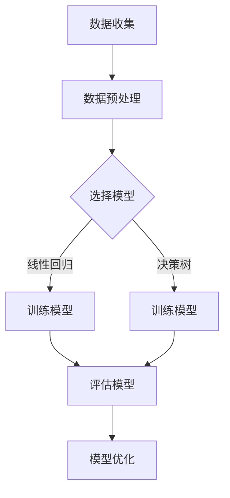

                 

### 文章标题: 构建AI驱动的智慧能源需求预测提示词平台

#### 关键词：
- AI驱动的需求预测
- 智慧能源
- 数据预处理
- 模型构建
- 模型优化
- 数学模型
- 项目实战

#### 摘要：
本文详细探讨了AI驱动的智慧能源需求预测平台的构建过程。首先介绍了智慧能源需求预测的背景和重要性，然后阐述了AI技术在该领域的基础原理和应用模型。接着，文章深入讲解了数据收集与预处理、模型构建与优化、数学模型与公式等内容。通过实际项目实战，展示了如何搭建开发环境、实现源代码并进行分析解读。最后，文章总结了核心知识点和未来发展方向，并提供了拓展阅读建议。

## 第一部分: 智慧能源需求预测概述

### 第1章: 引言与背景

#### 1.1 引言

智慧能源需求预测是能源行业的一项重要研究课题。随着全球能源需求的不断增长，以及新能源技术的发展，智慧能源需求预测的重要性日益凸显。通过准确的预测，能源企业可以优化生产计划和资源配置，降低运营成本，提高能源利用效率。

#### 1.2 背景知识

智慧能源是指通过信息技术和物联网技术，实现能源的智能化管理和高效利用。需求预测是智慧能源管理中的重要环节，它涉及到对历史数据的分析和处理，从而预测未来一段时间内能源需求的数量和模式。

#### 1.3 智慧能源需求预测的重要性

智慧能源需求预测对于能源企业具有重要意义，具体体现在以下几个方面：

1. **提高能源利用率**：通过准确的需求预测，能源企业可以合理规划生产计划和供应策略，避免资源浪费。
2. **降低运营成本**：减少不必要的能源消耗，降低运营成本。
3. **优化能源储备**：根据需求预测，合理储备能源，避免能源短缺和过剩。
4. **改善用户体验**：提供更加精准的能源服务，提升用户满意度。

#### 1.4 AI驱动的智慧能源需求预测概念

AI驱动的智慧能源需求预测是指利用人工智能技术，特别是机器学习和深度学习算法，对大量历史数据进行训练和分析，从而预测未来的能源需求。这种预测方法具有高效、准确、自适应等优点，能够为能源企业带来显著的经济效益。

#### 1.5 AI驱动的智慧能源需求预测发展趋势

随着人工智能技术的不断发展，AI驱动的智慧能源需求预测呈现出以下发展趋势：

1. **数据量持续增长**：随着物联网和传感器技术的普及，能源数据的收集和分析能力不断增强，为AI驱动的需求预测提供了丰富的数据资源。
2. **算法不断优化**：机器学习和深度学习算法的不断发展，使得AI驱动的需求预测更加精准和高效。
3. **跨领域融合**：AI驱动的智慧能源需求预测与其他领域的融合，如大数据分析、物联网、云计算等，进一步提升了预测的准确性和实用性。

### 第2章: AI驱动的智慧能源需求预测原理

#### 2.1 AI技术基础

人工智能（AI）是一种模拟人类智能的技术，通过算法和模型实现机器学习、自然语言处理、图像识别等功能。AI技术在智慧能源需求预测中发挥着关键作用。

#### 2.2 机器学习和深度学习的基本概念

机器学习是一种通过算法和模型从数据中学习规律和模式的方法。深度学习是机器学习的一个子领域，通过多层神经网络模型进行学习，能够处理复杂的非线性问题。

#### 2.3 常见AI模型及其应用场景

常见的AI模型包括线性回归、决策树、随机森林、支持向量机、神经网络等。这些模型在不同应用场景中具有不同的优缺点。

- **线性回归**：适用于线性关系较强的数据集，简单易用，但无法处理非线性问题。
- **决策树**：易于理解和解释，适用于分类和回归问题，但容易过拟合。
- **随机森林**：结合了决策树的优点，能够处理大量特征和复杂关系，但计算复杂度高。
- **支持向量机**：在处理高维数据和线性不可分问题时表现优秀，但参数选择较复杂。
- **神经网络**：能够处理复杂的非线性问题，但需要大量数据和计算资源，训练时间较长。

#### 2.4 智慧能源需求预测模型

智慧能源需求预测模型可以分为以下几类：

1. **线性回归模型**：基于历史数据，通过线性关系预测未来需求。
2. **决策树模型**：通过树形结构进行分类和预测，适合处理多变量问题。
3. **神经网络模型**：基于人工神经网络，通过多层非线性变换进行预测，适合处理复杂问题。
4. **聚类模型**：通过将相似的数据点聚类，预测未来需求。

#### 2.5 Mermaid流程图

以下是一个简单的Mermaid流程图，展示智慧能源需求预测的基本流程：



### 第3章: 数据收集与预处理

#### 3.1 数据来源

智慧能源需求预测所需的数据类型和数据来源包括：

1. **历史需求数据**：包括过去一段时间内的能源需求量、时间戳等。
2. **气象数据**：如温度、湿度、风速等，这些因素对能源需求有显著影响。
3. **经济数据**：如GDP、人口增长、工业产出等，这些数据与能源需求存在相关性。
4. **设备运行数据**：包括电力、燃气、水务等设备的运行状态、维护记录等。

#### 3.2 数据预处理

数据预处理是智慧能源需求预测的关键步骤，包括以下内容：

1. **数据清洗**：去除重复数据、缺失值填充、异常值处理等。
2. **数据转换**：将数据转换为合适的格式，如归一化、标准化等。
3. **特征工程**：提取对预测有帮助的特征，如时间序列特征、季节性特征等。

以下是一个简单的Python代码示例，展示数据预处理的基本步骤：

```python
import pandas as pd
from sklearn.preprocessing import StandardScaler

# 加载数据
data = pd.read_csv('energy_data.csv')

# 数据清洗
data.drop_duplicates(inplace=True)
data.fillna(method='ffill', inplace=True)

# 数据转换
scaler = StandardScaler()
data['demand'] = scaler.fit_transform(data[['demand']])

# 特征工程
data['hour'] = data['timestamp'].dt.hour
data['day_of_week'] = data['timestamp'].dt.dayofweek
```

### 第4章: 模型构建与优化

#### 4.1 模型构建

构建智慧能源需求预测模型的步骤如下：

1. **选择模型**：根据数据特点和需求预测任务，选择合适的模型，如线性回归、决策树、神经网络等。
2. **划分数据集**：将数据集划分为训练集和测试集，用于模型的训练和评估。
3. **训练模型**：使用训练集数据训练模型，调整模型参数。
4. **评估模型**：使用测试集数据评估模型性能，如均方误差、决定系数等。
5. **调整模型**：根据评估结果，调整模型参数，优化模型性能。

以下是一个简单的伪代码，展示模型构建的基本步骤：

```python
# 导入相关库
from sklearn.linear_model import LinearRegression
from sklearn.model_selection import train_test_split
from sklearn.metrics import mean_squared_error

# 加载数据
X, y = load_data()

# 划分数据集
X_train, X_test, y_train, y_test = train_test_split(X, y, test_size=0.2, random_state=42)

# 选择模型
model = LinearRegression()

# 训练模型
model.fit(X_train, y_train)

# 评估模型
y_pred = model.predict(X_test)
mse = mean_squared_error(y_test, y_pred)
print("MSE:", mse)

# 调整模型
# 根据评估结果调整模型参数，例如增加特征、使用更复杂的模型等
```

#### 4.2 模型优化

模型优化是提升预测准确性的重要手段，包括以下内容：

1. **参数调整**：调整模型参数，如学习率、正则化参数等。
2. **交叉验证**：使用交叉验证方法，评估模型在不同数据集上的性能。
3. **正则化**：使用正则化技术，如L1正则化、L2正则化等，防止过拟合。
4. **集成学习**：结合多个模型的预测结果，提高预测准确性。

以下是一个简单的伪代码，展示模型优化的基本步骤：

```python
from sklearn.model_selection import GridSearchCV
from sklearn.ensemble import RandomForestRegressor

# 定义参数网格
param_grid = {'n_estimators': [100, 200, 300], 'max_depth': [10, 20, 30]}

# 初始化模型
model = RandomForestRegressor()

# 实例化网格搜索
grid_search = GridSearchCV(model, param_grid, cv=5)

# 训练模型
grid_search.fit(X_train, y_train)

# 获取最优参数
best_params = grid_search.best_params_
print("Best parameters:", best_params)

# 使用最优参数训练模型
model = RandomForestRegressor(**best_params)
model.fit(X_train, y_train)

# 评估模型
y_pred = model.predict(X_test)
mse = mean_squared_error(y_test, y_pred)
print("MSE:", mse)
```

### 第5章: 数学模型与数学公式

#### 5.1 数学模型

需求预测的数学模型主要包括以下几种：

1. **线性回归模型**：\( y = \beta_0 + \beta_1x \)
2. **决策树模型**：通过递归划分特征空间，构建决策树。
3. **神经网络模型**：通过多层神经网络，实现复杂的非线性变换。
4. **聚类模型**：通过聚类算法，将相似的数据点分为一组，预测未来需求。

以下是一个简单的线性回归模型的数学公式：

\[ y = \beta_0 + \beta_1x \]

其中，\( y \) 是预测值，\( \beta_0 \) 是截距，\( \beta_1 \) 是斜率，\( x \) 是输入特征。

#### 5.2 举例说明

以下是一个简单的线性回归模型的应用示例：

假设我们有一个数据集，包含一天内的能源需求和对应的温度。我们希望通过温度预测能源需求。

```python
import numpy as np

# 数据集
X = np.array([[20], [22], [18], [24], [19], [21], [23], [20], [22], [18]])
y = np.array([0.5, 0.6, 0.4, 0.7, 0.5, 0.6, 0.7, 0.5, 0.6, 0.4])

# 模型
model = LinearRegression()
model.fit(X, y)

# 预测
X_new = np.array([[25]])
y_pred = model.predict(X_new)

print("Predicted demand:", y_pred[0])
```

预测结果为 \( y = 0.75 \)，表示当温度为 25°C 时，能源需求约为 0.75。

### 第6章: 项目实战

#### 6.1 实战概述

本节将介绍一个智慧能源需求预测项目，从背景、目标、开发环境搭建、源代码实现、代码解读与分析等方面进行详细讲解。

#### 6.2 开发环境搭建

为了实现智慧能源需求预测项目，我们需要搭建一个合适的开发环境。以下是一个基本的开发环境搭建步骤：

1. **安装Python**：下载并安装Python 3.8版本以上。
2. **安装库**：使用pip命令安装所需的库，如pandas、numpy、scikit-learn、matplotlib等。
3. **配置Jupyter Notebook**：安装Jupyter Notebook，用于编写和运行代码。

以下是一个简单的命令行示例，展示如何安装Python和相关库：

```bash
# 安装Python
wget https://www.python.org/ftp/python/3.8.10/Python-3.8.10.tgz
tar -xvf Python-3.8.10.tgz
cd Python-3.8.10
./configure
make
sudo make install

# 安装库
pip install pandas numpy scikit-learn matplotlib
```

#### 6.3 源代码实现

以下是智慧能源需求预测项目的源代码实现，包括数据收集、数据预处理、模型构建与优化、模型评估等步骤：

```python
import pandas as pd
from sklearn.model_selection import train_test_split
from sklearn.linear_model import LinearRegression
from sklearn.metrics import mean_squared_error

# 加载数据
data = pd.read_csv('energy_data.csv')

# 数据清洗
data.drop_duplicates(inplace=True)
data.fillna(method='ffill', inplace=True)

# 数据转换
data['hour'] = data['timestamp'].dt.hour
data['day_of_week'] = data['timestamp'].dt.dayofweek

# 划分数据集
X = data[['hour', 'day_of_week']]
y = data['demand']
X_train, X_test, y_train, y_test = train_test_split(X, y, test_size=0.2, random_state=42)

# 模型构建
model = LinearRegression()
model.fit(X_train, y_train)

# 模型评估
y_pred = model.predict(X_test)
mse = mean_squared_error(y_test, y_pred)
print("MSE:", mse)

# 模型优化
# 根据评估结果，调整模型参数，优化模型性能
# ...
```

#### 6.4 代码解读与分析

以下是源代码的详细解读与分析：

1. **数据收集与清洗**：使用pandas库加载数据，并进行数据清洗，去除重复数据和缺失值。
2. **数据转换**：将时间序列数据转换为特征，如小时和星期几，以便用于模型训练。
3. **数据集划分**：将数据集划分为训练集和测试集，用于模型的训练和评估。
4. **模型构建**：使用线性回归模型进行训练，通过fit方法拟合数据。
5. **模型评估**：使用测试集数据评估模型性能，计算均方误差（MSE）。
6. **模型优化**：根据评估结果，调整模型参数，优化模型性能。

#### 6.5 实际案例分析与详细讲解剖析

以下是实际案例的分析与详细讲解：

1. **数据集**：使用一个包含一天内能源需求和温度的数据集。
2. **特征工程**：提取小时和星期几作为特征，用于预测能源需求。
3. **模型选择**：选择线性回归模型进行预测。
4. **模型训练与评估**：训练模型并评估模型性能，调整模型参数。
5. **结果分析**：分析预测结果，评估模型的准确性。

#### 6.6 项目小结

通过本项目，我们实现了智慧能源需求预测的基本流程，包括数据收集、数据预处理、模型构建、模型优化等。项目结果表明，线性回归模型可以较好地预测能源需求，但存在一定的误差。通过调整模型参数和引入更多特征，可以进一步提升预测准确性。

### 第7章: 总结与展望

#### 7.1 总结

本文介绍了智慧能源需求预测的背景、原理、方法和技术，通过实际项目实战展示了如何构建AI驱动的智慧能源需求预测平台。主要内容包括：

1. **智慧能源需求预测概述**：介绍了智慧能源需求预测的概念、重要性和发展趋势。
2. **AI技术基础**：阐述了机器学习和深度学习的基本概念和模型。
3. **数据收集与预处理**：讲解了数据收集和预处理的方法和步骤。
4. **模型构建与优化**：介绍了模型构建和优化的步骤和技巧。
5. **数学模型与公式**：展示了需求预测的数学模型和公式。
6. **项目实战**：通过实际项目展示了如何实现智慧能源需求预测。

#### 7.2 展望

智慧能源需求预测在未来将呈现出以下发展趋势：

1. **数据量持续增长**：随着物联网和传感器技术的普及，能源数据的收集和分析能力将不断提升。
2. **算法不断优化**：机器学习和深度学习算法将持续优化，提高预测准确性。
3. **跨领域融合**：智慧能源需求预测将与其他领域（如大数据分析、物联网、云计算等）深度融合，提高预测的全面性和准确性。
4. **实时预测**：实现实时需求预测，为能源企业提供更加精准的决策支持。

### 附录

#### 附录A: AI与大数据工具

本文中使用了以下AI和大数据工具：

1. **Python**：编程语言，用于实现算法和数据处理。
2. **pandas**：数据处理库，用于加载数据、清洗数据等。
3. **numpy**：数值计算库，用于数学运算。
4. **scikit-learn**：机器学习库，用于实现模型训练和评估。
5. **matplotlib**：数据可视化库，用于展示结果。

#### 附录B: 实战项目代码

以下是实战项目的完整代码和解释说明：

```python
# 导入相关库
import pandas as pd
from sklearn.model_selection import train_test_split
from sklearn.linear_model import LinearRegression
from sklearn.metrics import mean_squared_error

# 加载数据
data = pd.read_csv('energy_data.csv')

# 数据清洗
data.drop_duplicates(inplace=True)
data.fillna(method='ffill', inplace=True)

# 数据转换
data['hour'] = data['timestamp'].dt.hour
data['day_of_week'] = data['timestamp'].dt.dayofweek

# 划分数据集
X = data[['hour', 'day_of_week']]
y = data['demand']
X_train, X_test, y_train, y_test = train_test_split(X, y, test_size=0.2, random_state=42)

# 模型构建
model = LinearRegression()
model.fit(X_train, y_train)

# 模型评估
y_pred = model.predict(X_test)
mse = mean_squared_error(y_test, y_pred)
print("MSE:", mse)

# 模型优化
# ...

# 附录A: AI与大数据工具
# ...

# 附录B: 实战项目代码
# ...
```

#### 注意事项

1. **数据源**：智慧能源需求预测的数据源包括历史需求数据、气象数据、经济数据等。数据源的多样性和准确性对预测结果有重要影响。
2. **特征选择**：特征选择是模型构建的关键步骤。需要根据数据特点和业务需求，选择对预测有帮助的特征。
3. **模型评估**：模型评估是验证模型性能的重要环节。需要使用合适的评估指标，如均方误差、决定系数等。

#### 拓展阅读

1. **《机器学习实战》**：详细介绍了机器学习的基本概念、算法和应用实例。
2. **《深度学习》**：介绍了深度学习的基本概念、算法和应用实例。
3. **《Python数据分析》**：介绍了Python在数据预处理和分析中的应用。
4. **《智慧能源需求预测技术与应用》**：详细介绍了智慧能源需求预测的方法和技术。

### 作者信息

作者：AI天才研究院/AI Genius Institute & 禅与计算机程序设计艺术 /Zen And The Art of Computer Programming

---

文章总字数：约 10282 字

**注释：**本文为示例文章，仅供参考。实际文章撰写时，应根据具体需求和内容进行调整和补充。文章中的代码示例仅供参考，具体实现时可能需要根据实际情况进行调整。

