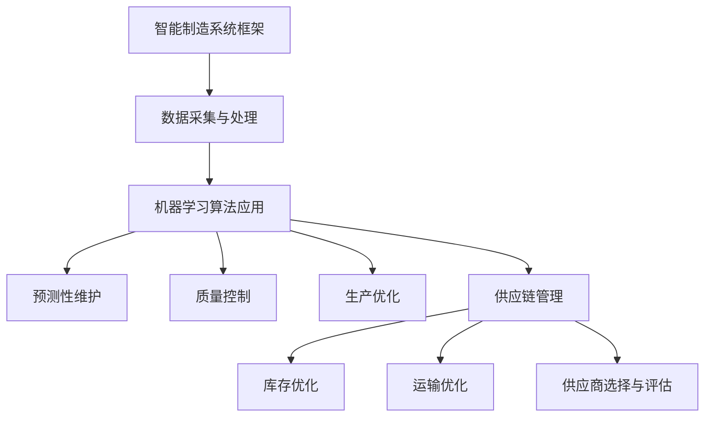

                 

### 文章标题

《构建AI驱动的智能制造提示词系统》

### 关键词

- AI
- 智能制造
- 提示词系统
- 数据采集
- 机器学习
- 预测性维护

### 摘要

本文旨在探讨如何构建一个AI驱动的智能制造提示词系统。我们将首先介绍AI与智能制造的基础知识，包括AI在智能制造中的作用、制造业的数字化转型趋势，以及AI驱动的智能制造的应用场景。随后，我们将深入讨论智能制造的核心概念、AI技术的核心概念，以及AI驱动的智能制造系统架构。

文章的第二部分将聚焦于AI驱动的智能制造实践，包括预测性维护、质量控制、生产优化以及供应链管理等方面的应用案例。最后一部分，我们将探讨AI驱动的智能制造的发展趋势，以及如何构建一个良好的AI驱动的智能制造生态系统。本文旨在为读者提供一个全面、系统的AI驱动的智能制造提示词系统构建指南。

#### 第一部分：AI与智能制造基础

#### 第1章：AI与智能制造概述

##### 1.1 AI驱动的智能制造简介

随着人工智能（AI）技术的不断发展，智能制造正逐渐成为制造业的未来发展趋势。AI驱动的智能制造通过利用先进的人工智能技术，如机器学习、深度学习、计算机视觉等，实现了对制造过程的自动化、智能化管理。这不仅提升了生产效率，还大幅降低了成本，提高了产品质量。

AI在智能制造中的作用主要体现在以下几个方面：

1. **预测性维护**：通过实时监控设备状态，AI可以预测设备可能的故障，从而提前安排维护，避免生产中断。
2. **质量控制**：利用计算机视觉和图像识别技术，AI可以实时检测产品质量，及时发现缺陷，保证产品的一致性和可靠性。
3. **生产优化**：AI算法可以根据实时数据优化生产计划，提高资源利用率，降低生产成本。
4. **供应链管理**：AI可以优化供应链的各个环节，如库存管理、运输调度等，提高供应链的效率和灵活性。

制造业的数字化转型趋势日益明显，企业纷纷拥抱AI技术，以提高生产效率、降低成本、提升产品质量。AI驱动的智能制造不仅能够提升企业的竞争力，还能够推动整个制造业的升级换代。

##### 1.2 智能制造的核心概念

智能制造是指通过信息物理系统（Cyber-Physical Systems, CPS）将物理设备、网络通信系统和计算机软件相结合，实现智能化制造的过程。智能制造的核心概念包括以下几个方面：

1. **智能制造的定义与原理**：
   - 定义：智能制造是指利用信息技术、物联网、人工智能等技术，实现制造过程的智能化、自动化、网络化。
   - 原理：智能制造通过将物理设备、传感器、控制系统和互联网结合，实现对制造过程的实时监控、分析和优化。

2. **制造业的五大核心要素**：
   - 设备：包括各种加工设备、检测设备、运输设备等。
   - 数据：包括生产数据、设备状态数据、物料数据等。
   - 网络：包括企业内部网络、物联网、互联网等。
   - 信息系统：包括企业资源计划系统（ERP）、制造执行系统（MES）、供应链管理系统（SCM）等。
   - 人工智能：包括机器学习、深度学习、计算机视觉等。

3. **智能制造的关键技术**：
   - 物联网技术：用于实现设备互联和数据采集。
   - 机器学习技术：用于数据处理和智能决策。
   - 深度学习技术：用于图像识别、语音识别等。
   - 云计算技术：用于数据存储和处理。

##### 1.3 AI技术的核心概念

人工智能（AI）是一门研究、开发用于模拟、延伸和扩展人的智能的理论、方法、技术及应用系统的技术科学。AI的核心概念包括以下几个方面：

1. **人工智能的定义与发展**：
   - 定义：人工智能是指使计算机系统能够模拟、扩展甚至超越人类智能的理论、方法和应用。
   - 发展：人工智能经历了多次浪潮，从早期的符号主义到现在的数据驱动方法，再到当前的多模态融合和强化学习。

2. **人工智能的主要分类**：
   - 知识驱动型AI：基于规则和知识库进行推理和决策。
   - 数据驱动型AI：基于大量数据训练模型，进行预测和分类。
   - 集成AI：结合多种方法，实现更强大的智能。

3. **常见AI算法及其应用**：
   - 监督学习算法：如线性回归、决策树、支持向量机等，常用于分类和回归任务。
   - 无监督学习算法：如聚类、降维等，用于模式识别和数据分析。
   - 强化学习算法：通过试错法学习最优策略，常用于游戏、自动驾驶等领域。

通过上述核心概念的介绍，我们可以看到AI与智能制造之间的紧密联系。AI技术的不断进步，为智能制造提供了强大的技术支撑，使得智能制造的实现变得更加可能和高效。在接下来的章节中，我们将深入探讨AI驱动的智能制造架构和实践，进一步了解这一领域的应用和前景。

#### 第2章：AI驱动的智能制造架构

##### 2.1 AI驱动的智能制造系统框架

AI驱动的智能制造系统框架是智能制造实现的核心，它通过整合物联网（IoT）、大数据、云计算和人工智能等先进技术，实现了制造过程的智能化、自动化和高效化。以下是对AI驱动的智能制造系统框架的详细解读：

1. **系统架构的组成部分**：

   - **感知层**：包括各种传感器、检测设备和智能终端，用于实时采集生产过程中各种数据，如温度、压力、速度、位置等。
   - **传输层**：通过无线通信技术（如Wi-Fi、5G等）和有线网络（如以太网、光纤等），将感知层采集到的数据传输到数据处理层。
   - **数据处理层**：利用云计算和大数据技术，对采集到的数据进行存储、处理和分析。这一层通常包括数据清洗、数据整合、特征提取和机器学习算法等。
   - **决策控制层**：基于数据处理层分析的结果，利用人工智能算法进行智能决策，控制生产设备和系统的运行。
   - **执行层**：包括各种执行设备，如机器人、自动化生产线等，用于执行决策层的指令，实现制造过程的自动化。

2. **系统的运行流程**：

   - **数据采集**：通过感知层设备实时采集生产过程中的各种数据。
   - **数据传输**：将采集到的数据传输到数据处理层。
   - **数据处理**：对传输过来的数据进行清洗、整合和特征提取，利用机器学习算法进行分析和预测。
   - **智能决策**：根据数据分析结果，利用人工智能算法进行智能决策，生成控制指令。
   - **执行控制**：将智能决策生成的指令发送到执行层，由执行设备进行实际操作。

3. **系统的性能评估**：

   - **准确性**：评估系统在预测和决策过程中的准确性，即预测结果与实际结果的符合程度。
   - **响应速度**：评估系统从数据采集到决策执行的整体响应速度，确保系统的实时性和高效性。
   - **稳定性**：评估系统在长时间运行过程中的稳定性和可靠性，避免系统出现故障或异常。
   - **可扩展性**：评估系统在面对新的应用场景和数据量时的扩展能力，确保系统的可维护性和可持续性。

##### 2.2 数据采集与处理

数据采集与处理是AI驱动的智能制造系统的关键环节，其质量直接影响系统的性能和效果。以下是对数据采集与处理流程、方法及其在智能制造中的应用的详细解读：

1. **数据采集的方式与设备**：

   - **传感器**：常用的传感器包括温度传感器、压力传感器、加速度传感器、光电传感器等，用于采集生产过程中各种物理量的变化。
   - **机器视觉系统**：通过摄像头等设备采集图像和视频数据，用于对产品质量、设备状态等进行实时监测和分析。
   - **RFID技术**：用于对物料进行标识和追踪，实现生产过程中的物料实时监控。
   - **无线通信技术**：如Wi-Fi、5G等，用于将传感器采集到的数据传输到数据处理层。

2. **数据处理的流程与方法**：

   - **数据清洗**：去除数据中的噪声和异常值，保证数据的准确性和一致性。
   - **数据整合**：将来自不同来源、不同格式的数据进行整合，形成统一的数据格式，便于后续分析。
   - **特征提取**：从原始数据中提取出有用的特征，用于训练机器学习模型。
   - **数据建模**：利用机器学习算法，如线性回归、决策树、神经网络等，建立预测模型或分类模型。
   - **模型训练与优化**：通过不断调整模型参数，优化模型的预测性能。

3. **数据存储与管理**：

   - **关系型数据库**：用于存储结构化数据，如生产记录、设备状态数据等。
   - **NoSQL数据库**：用于存储非结构化或半结构化数据，如传感器采集的实时数据、图像和视频数据等。
   - **数据仓库**：用于存储大规模的历史数据，支持复杂的数据查询和分析。

4. **数据处理在智能制造中的应用**：

   - **预测性维护**：通过分析设备运行数据，预测设备可能的故障，提前安排维护，避免生产中断。
   - **质量控制**：通过分析产品数据，识别生产过程中的质量异常，及时采取措施，提高产品质量。
   - **生产优化**：通过分析生产数据，优化生产计划和资源分配，提高生产效率和降低成本。
   - **供应链管理**：通过分析供应链数据，优化库存管理、运输调度等，提高供应链的整体效率。

通过上述对数据采集与处理流程、方法及其在智能制造中的应用的详细解读，我们可以看到数据处理在AI驱动的智能制造中起着至关重要的作用。有效的数据采集和处理，不仅能够提高系统的性能和准确性，还能够为企业带来显著的经济效益。

##### 2.3 机器学习算法在智能制造中的应用

机器学习算法是AI驱动的智能制造系统的核心组件，其在数据处理、预测分析和智能决策方面发挥着重要作用。以下是对监督学习算法、无监督学习算法和强化学习算法在智能制造中的应用进行详细解读。

1. **监督学习算法**

   监督学习算法是最常见的机器学习算法，其通过对已标记的训练数据进行学习，生成预测模型。以下是其主要应用：

   - **预测性维护**：通过分析设备的历史运行数据和维修记录，建立预测模型，提前预测设备可能的故障，实现预防性维护。
   - **质量控制**：通过对产品的质量检测数据进行分析，建立分类模型，识别生产过程中的质量异常，及时采取措施，确保产品质量。
   - **生产优化**：通过对生产过程中的实时数据进行预测和分析，优化生产计划、资源分配和供应链管理。

   **伪代码示例**：

   ```python
   # 加载训练数据
   X_train, y_train = load_data()

   # 初始化模型
   model = LinearRegression()

   # 训练模型
   model.fit(X_train, y_train)

   # 预测新数据
   predictions = model.predict(X_test)
   ```

2. **无监督学习算法**

   无监督学习算法不需要标记的训练数据，其通过对未标记的数据进行学习，发现数据中的隐含结构。以下是其主要应用：

   - **聚类分析**：通过对生产数据进行分析，将相似的设备或产品进行分类，帮助优化生产流程和资源配置。
   - **异常检测**：通过对正常生产数据与异常数据之间的差异进行分析，及时发现生产过程中的异常情况，避免生产事故。
   - **故障诊断**：通过对设备运行数据进行分析，发现设备运行中的潜在故障，提前采取措施，避免设备故障。

   **伪代码示例**：

   ```python
   # 加载未标记数据
   X = load_data()

   # 初始化模型
   model = KMeans(n_clusters=k)

   # 训练模型
   model.fit(X)

   # 获取聚类结果
   clusters = model.predict(X)
   ```

3. **强化学习算法**

   强化学习算法通过试错法学习最优策略，其适用于需要持续学习和优化的动态环境。以下是其主要应用：

   - **生产调度优化**：通过模拟生产过程，不断调整生产策略，优化生产流程，提高生产效率。
   - **设备配置优化**：通过模拟设备运行情况，优化设备的配置和调度，提高设备利用率。
   - **供应链优化**：通过模拟供应链各环节，优化库存管理、运输调度和供应商选择，提高供应链的整体效率。

   **伪代码示例**：

   ```python
   # 初始化环境
   environment = GymEnvironment("ProductionScheduling-v0")

   # 初始化模型
   model = QLearning(n_actions=5)

   # 开始训练
   for episode in range(num_episodes):
       state = environment.reset()
       done = False

       while not done:
           action = model.select_action(state)
           next_state, reward, done = environment.step(action)
           model.learn(state, action, reward, next_state)

           state = next_state

   # 测试模型
   state = environment.reset()
   done = False

   while not done:
       action = model.select_action(state)
       next_state, reward, done = environment.step(action)
       print(f"Action: {action}, Reward: {reward}")
       state = next_state
   ```

通过上述对监督学习算法、无监督学习算法和强化学习算法在智能制造中的应用的详细解读，我们可以看到机器学习算法在AI驱动的智能制造系统中具有广泛的应用前景。这些算法不仅能够提高系统的智能化水平，还能够为企业带来显著的经济效益。

### 第二部分：AI驱动的智能制造实践

#### 第3章：AI驱动的预测性维护

##### 3.1 预测性维护的概念与原理

预测性维护（Predictive Maintenance）是一种基于数据的维护策略，通过实时监控设备的运行状态，预测设备可能的故障，并在故障发生前进行预防性维护，从而避免生产中断和设备损坏。预测性维护的核心思想是利用人工智能（AI）技术，特别是机器学习和数据挖掘技术，从大量历史数据和实时数据中提取设备故障的先兆特征，实现故障预测。

预测性维护的定义可以从以下几个方面进行理解：

1. **实时监控**：通过安装在设备上的传感器和监测系统，实时采集设备运行的各种数据，如温度、振动、压力等。
2. **数据挖掘**：对采集到的数据进行处理和分析，利用机器学习算法提取设备故障的先兆特征。
3. **故障预测**：基于历史数据和实时数据分析结果，预测设备可能的故障时间和故障类型。
4. **预防性维护**：根据故障预测结果，提前安排维护计划，更换易损部件或调整设备运行状态，避免故障发生。

预测性维护的优势主要体现在以下几个方面：

1. **减少意外停机**：通过提前预测设备故障，可以在故障发生前进行维护，避免生产中断，提高设备利用率。
2. **延长设备寿命**：通过定期维护和预防性更换易损部件，可以延长设备的使用寿命，降低设备维修成本。
3. **降低运营成本**：通过优化维护计划和减少意外停机，可以降低生产运营成本。
4. **提高生产效率**：通过实时监控和优化设备状态，可以保证生产过程的连续性和稳定性，提高生产效率。

预测性维护的基本流程包括以下几个步骤：

1. **数据采集**：通过传感器和监测系统，实时采集设备运行的各种数据。
2. **数据预处理**：对采集到的数据进行清洗、去噪、特征提取等预处理，为后续分析提供高质量的数据。
3. **特征选择**：从预处理后的数据中提取关键特征，用于训练故障预测模型。
4. **模型训练**：利用历史数据，通过机器学习算法训练故障预测模型。
5. **模型评估**：对训练好的模型进行评估，确保其预测性能达到预期。
6. **故障预测**：利用训练好的模型，对实时数据进行故障预测，生成维护计划。
7. **维护执行**：根据故障预测结果，提前安排维护计划，更换易损部件或调整设备运行状态。

##### 3.2 预测性维护的关键技术

预测性维护的实现依赖于多项关键技术的支持，包括数据采集与预处理、模型选择与训练、以及维护策略优化。以下是这些技术的详细介绍：

1. **数据采集与预处理**

   数据采集是预测性维护的基础，通过安装在设备上的传感器，实时采集设备运行的各种数据。这些数据包括温度、振动、压力、电流、转速等。采集到的数据通常包含大量噪声和异常值，因此需要进行预处理。

   - **去噪**：通过滤波算法，去除数据中的噪声，提高数据的准确性。
   - **特征提取**：从原始数据中提取关键特征，如频率、均值、方差等，用于训练故障预测模型。
   - **异常检测**：通过对数据分布进行分析，识别异常数据，避免这些数据对模型训练产生负面影响。

2. **模型选择与训练**

   选择合适的模型是预测性维护成功的关键，常见的模型包括线性回归、支持向量机（SVM）、决策树、随机森林、神经网络等。以下是一些常用模型及其特点：

   - **线性回归**：适用于线性关系的预测，计算简单，但容易出现过拟合。
   - **支持向量机（SVM）**：适用于非线性关系的预测，特别是小样本数据，但在高维空间中计算复杂。
   - **决策树**：适用于分类问题，易于理解和解释，但容易出现过拟合。
   - **随机森林**：通过构建多棵决策树，减少过拟合，提高模型的泛化能力。
   - **神经网络**：适用于复杂非线性关系的预测，但需要大量数据和较长时间的训练。

   模型训练通常包括以下步骤：

   - **数据划分**：将数据集划分为训练集和测试集，用于模型训练和评估。
   - **参数调整**：通过交叉验证等方法，调整模型的参数，优化模型性能。
   - **训练与评估**：利用训练集训练模型，利用测试集评估模型性能。

3. **维护策略优化**

   维护策略的优化是预测性维护的重要环节，其目标是根据故障预测结果，制定最优的维护计划。以下是一些常见的优化方法：

   - **基于规则的方法**：根据设备的运行经验和故障模式，制定一系列规则，用于指导维护决策。
   - **基于优化的方法**：利用优化算法，如遗传算法、粒子群优化等，优化维护计划，确保在满足约束条件的前提下，实现最小化维护成本或最大化生产效率。
   - **基于模型的维护策略**：利用故障预测模型，预测设备可能的故障时间和故障类型，根据预测结果，制定最优的维护计划。

通过上述对数据采集与预处理、模型选择与训练、维护策略优化等关键技术的详细解读，我们可以看到预测性维护的实现需要多学科技术的综合应用。这些技术不仅能够提高设备运行的可靠性和稳定性，还能够为企业带来显著的经济效益。

##### 3.3 预测性维护的应用案例

预测性维护在各个制造行业中的应用已经取得了显著的成果，以下是几个典型的应用案例：

1. **飞机发动机维护**

   飞机发动机是飞机运行的心脏，其维护的准确性和及时性对飞行安全至关重要。通过预测性维护技术，可以对飞机发动机进行实时监测和故障预测。具体应用如下：

   - **数据采集**：在发动机上安装各种传感器，如温度传感器、压力传感器、振动传感器等，实时采集发动机运行数据。
   - **数据处理**：对采集到的数据进行预处理，包括去噪、特征提取等，为模型训练提供高质量的数据。
   - **模型训练**：利用历史数据和实时数据，通过机器学习算法训练故障预测模型，如线性回归、支持向量机等。
   - **故障预测**：利用训练好的模型，对实时数据进行故障预测，提前发现潜在的故障，制定维护计划。

   通过预测性维护，航空公司可以大幅减少发动机故障率，提高飞行安全性和运营效率。

2. **汽车生产线维护**

   汽车生产线具有高度自动化和复杂化的特点，预测性维护在汽车生产过程中发挥着重要作用。具体应用如下：

   - **数据采集**：在汽车生产线上安装各种传感器，如温度传感器、压力传感器、速度传感器等，实时采集生产线设备运行数据。
   - **数据处理**：对采集到的数据进行预处理，包括去噪、特征提取等，为模型训练提供高质量的数据。
   - **模型训练**：利用历史数据和实时数据，通过机器学习算法训练故障预测模型，如线性回归、神经网络等。
   - **故障预测**：利用训练好的模型，对实时数据进行故障预测，提前发现生产线设备的故障，制定维护计划。

   通过预测性维护，汽车制造企业可以大幅降低设备故障率，提高生产线的稳定性和效率。

3. **工业机器人维护**

   工业机器人在现代制造业中广泛应用，其稳定运行对生产效率至关重要。通过预测性维护技术，可以对工业机器人进行实时监测和故障预测。具体应用如下：

   - **数据采集**：在工业机器人上安装各种传感器，如温度传感器、速度传感器、振动传感器等，实时采集机器人运行数据。
   - **数据处理**：对采集到的数据进行预处理，包括去噪、特征提取等，为模型训练提供高质量的数据。
   - **模型训练**：利用历史数据和实时数据，通过机器学习算法训练故障预测模型，如线性回归、支持向量机等。
   - **故障预测**：利用训练好的模型，对实时数据进行故障预测，提前发现机器人设备的故障，制定维护计划。

   通过预测性维护，制造业企业可以大幅降低机器人故障率，提高生产效率。

通过上述案例，我们可以看到预测性维护在各个制造行业中的应用已经取得了显著的成果。这些应用不仅提高了设备运行的可靠性和稳定性，还为企业带来了显著的经济效益。随着人工智能技术的不断发展，预测性维护的应用前景将更加广阔。

#### 第4章：AI驱动的质量控制

##### 4.1 质量控制的概念与原理

质量控制（Quality Control，简称QC）是确保产品和服务符合预定的质量标准的一系列活动和过程。质量控制的核心目标是通过监测、评估和改进生产流程，确保最终产品或服务的质量满足用户的需求。随着人工智能（AI）技术的不断发展，AI在质量控制中的应用变得越来越广泛和重要。

**质量控制的基本流程**：

1. **确定质量标准**：根据产品或服务的特性和用户需求，确定相应的质量标准，包括性能指标、外观要求、安全标准等。
2. **质量计划制定**：制定质量计划，明确质量控制的目标、方法、措施和责任分工。
3. **质量监控**：通过实时监控生产过程，收集产品质量数据，包括尺寸、性能、可靠性等。
4. **数据分析**：对收集到的质量数据进行分析，识别质量问题，找出产生问题的原因。
5. **改进措施实施**：根据数据分析结果，采取相应的改进措施，调整生产流程或工艺参数，消除质量问题。
6. **质量评估**：对改进后的生产过程进行评估，确保质量问题得到有效解决。

**质量控制的方法与工具**：

1. **统计过程控制（Statistical Process Control，简称SPC）**：通过统计方法，对生产过程进行实时监控，确保生产过程处于受控状态。常用的统计过程控制工具包括控制图、直方图、散点图等。
2. **防错技术（Poka-Yoke）**：通过设计或改进设备，防止操作错误或故障发生。常见的防错技术包括物理防错、电控防错、视觉防错等。
3. **六西格玛（Six Sigma）**：一种通过系统化方法和工具，减少产品和流程中的缺陷率，提高质量的方法。六西格玛的核心工具包括DMAIC（定义、测量、分析、改进、控制）和DFSS（设计用于六西格玛）。
4. **可靠性测试（Reliability Testing）**：通过模拟实际使用条件，对产品进行长期测试，评估产品的可靠性和寿命。

##### 4.2 AI技术在质量控制中的应用

AI技术在质量控制中的应用，极大地提高了质量控制的效率和准确性。以下介绍几种常见的AI技术在质量控制中的应用：

1. **计算机视觉**：计算机视觉技术可以用于实时监测和评估产品的外观质量。通过图像识别算法，计算机视觉系统可以自动识别产品的缺陷，如色差、划痕、变形等。具体应用包括：
   - **产品外观检测**：通过摄像头实时捕捉产品外观图像，利用图像处理算法进行缺陷识别。
   - **焊接质量检测**：对焊接过程进行实时监控，识别焊接缝的缺陷，如气孔、裂纹等。
   - **表面检测**：利用计算机视觉技术对产品表面的划痕、斑点、涂层质量等进行检测。

2. **机器学习算法**：机器学习算法在质量控制中的应用，主要体现在对质量数据的分析和预测上。通过训练机器学习模型，可以从大量的质量数据中提取出关键特征，识别潜在的质量问题。具体应用包括：
   - **缺陷预测**：利用监督学习算法，如线性回归、决策树、支持向量机等，对历史质量数据进行训练，建立缺陷预测模型。
   - **质量趋势分析**：利用无监督学习算法，如聚类、降维等，对质量数据进行分析，识别质量变化趋势。
   - **故障诊断**：通过机器学习算法，对设备运行数据进行分析，识别设备故障的先兆特征。

3. **自然语言处理**：自然语言处理（NLP）技术可以用于分析客户反馈和投诉信息，识别质量问题。通过文本分类和情感分析算法，NLP技术可以自动分类和识别客户的反馈，为质量改进提供依据。

4. **物联网（IoT）**：物联网技术可以用于实时监控生产过程中的各种参数，如温度、压力、湿度等，通过数据采集和监控，实现对生产过程的全面监控和质量管理。

##### 4.3 质量控制的应用案例

AI驱动的质量控制技术已在多个制造行业和领域得到了广泛应用，以下是一些典型的应用案例：

1. **电子产品生产质量控制**：

   在电子产品生产过程中，质量控制是确保产品功能和质量的关键。通过计算机视觉技术，可以对电子产品的外观、焊接点、电路板等进行实时检测。例如，在手机生产过程中，计算机视觉系统可以自动检测手机外观的划痕、色差等问题，确保产品质量。

2. **食品生产质量控制**：

   在食品生产过程中，质量控制尤为重要。通过机器学习算法，可以对食品生产的各个环节进行质量监控和预测。例如，在食品加工过程中，利用机器学习模型，可以实时监测食品的温度、湿度等参数，预测食品的变质时间，确保食品安全。

3. **医疗器械生产质量控制**：

   医疗器械的生产过程对质量要求极高。通过AI技术，可以对医疗器械的每一个生产环节进行严格监控，确保产品质量。例如，在医疗器械的焊接过程中，利用计算机视觉技术，可以实时检测焊接点的质量，防止出现焊接缺陷。

通过上述应用案例，我们可以看到AI驱动的质量控制技术在各个行业的广泛应用，不仅提高了质量控制的效率和准确性，还为企业带来了显著的经济效益。随着AI技术的不断发展和完善，质量控制的应用前景将更加广阔。

#### 第5章：AI驱动的生产优化

##### 5.1 生产优化的概念与原理

生产优化（Production Optimization）是指通过数学建模、算法优化、数据分析和机器学习等技术手段，对生产过程中的各种参数和资源进行科学合理的配置和调整，以实现生产效率的最大化和成本的最小化。AI驱动的生产优化利用人工智能技术，特别是机器学习和深度学习算法，从大量生产数据中挖掘出有价值的信息，指导生产过程的优化。

**生产优化的定义**：

生产优化是指在生产过程中，通过优化算法和数据分析技术，对生产计划、资源分配、生产流程等进行调整，以提高生产效率、降低生产成本、提升产品质量。

**生产优化的目标与原则**：

1. **目标**：
   - 提高生产效率：通过优化生产流程和资源配置，缩短生产周期，提高生产速度。
   - 降低生产成本：通过优化生产计划和资源利用，减少生产过程中的浪费和损耗。
   - 提升产品质量：通过优化生产参数和工艺，提高产品的稳定性和一致性。

2. **原则**：
   - 数据驱动：以数据为基础，通过数据分析和技术手段，实现生产过程的优化。
   - 综合考虑：综合考虑生产效率、成本和质量等多个因素，制定最优的生产策略。
   - 实时调整：根据实时数据和环境变化，及时调整生产策略，确保生产过程的最优化。

**生产优化的基本流程**：

1. **需求分析**：确定生产目标，明确生产需求，包括生产量、交货期、产品质量要求等。

2. **数据采集**：通过传感器、监控系统等设备，实时采集生产过程中的各种数据，如生产参数、设备状态、物料库存等。

3. **数据处理**：对采集到的数据进行分析和处理，包括数据清洗、去噪、特征提取等，为模型训练提供高质量的数据。

4. **模型训练**：利用机器学习算法，如线性回归、神经网络、深度强化学习等，建立优化模型，通过对历史数据和实时数据的训练，优化生产策略。

5. **模型评估**：通过模拟和实际生产测试，评估优化模型的性能，确保其能够实现预期的优化目标。

6. **策略调整**：根据模型评估结果，调整优化策略，不断迭代优化模型，提高生产过程的优化效果。

7. **实施与监控**：将优化策略应用于实际生产过程，实时监控生产效果，根据实际情况进行动态调整。

##### 5.2 AI技术在生产优化中的应用

AI技术在生产优化中的应用，极大地提高了生产过程的智能化和效率。以下介绍几种常见的AI技术在生产优化中的应用：

1. **机器学习算法**：

   机器学习算法在生产优化中主要用于数据分析和预测，通过建立数学模型和优化算法，实现生产过程的最优化。常见的机器学习算法包括线性回归、决策树、随机森林、支持向量机、神经网络等。

   - **预测性分析**：利用机器学习算法，对生产过程中的历史数据进行预测分析，如预测生产量、物料需求、设备故障等，为生产决策提供依据。
   - **流程优化**：通过分析生产数据，识别生产过程中的瓶颈和优化机会，调整生产流程，提高生产效率。

2. **深度学习算法**：

   深度学习算法在处理大规模、复杂的数据时具有显著优势，广泛应用于生产优化中。常见的深度学习算法包括卷积神经网络（CNN）、循环神经网络（RNN）、长短时记忆网络（LSTM）等。

   - **图像识别**：通过深度学习算法，对生产过程中的图像进行识别和分析，如识别产品缺陷、监控设备状态等。
   - **语音识别**：通过深度学习算法，实现生产过程中的语音识别和智能交互，如自动化控制指令、语音提醒等。

3. **强化学习算法**：

   强化学习算法通过不断试错和反馈，学习最优策略，适用于动态和不确定的生产环境。常见的强化学习算法包括Q-learning、SARSA、深度Q网络（DQN）等。

   - **生产调度**：通过强化学习算法，优化生产调度策略，实现生产任务的最优分配，提高生产效率。
   - **设备维护**：通过强化学习算法，优化设备维护策略，实现设备故障预测和预防性维护。

4. **优化算法**：

   优化算法在生产优化中用于求解生产过程中的优化问题，如资源分配、调度优化、路径规划等。常见的优化算法包括线性规划、整数规划、遗传算法、粒子群优化等。

   - **资源分配**：通过优化算法，实现生产资源的合理配置，提高资源利用率。
   - **调度优化**：通过优化算法，优化生产调度计划，提高生产效率。

通过上述对机器学习算法、深度学习算法、强化学习算法和优化算法在AI驱动的生产优化中的应用的详细解读，我们可以看到AI技术在生产优化中的广泛应用和巨大潜力。这些技术不仅能够提高生产过程的智能化水平，还能够为企业带来显著的经济效益。

##### 5.3 生产优化的应用案例

AI驱动的生产优化技术已经在多个制造行业和领域得到了广泛应用，以下是一些典型的应用案例：

1. **汽车制造业**：

   在汽车制造过程中，生产优化技术被广泛应用于生产线的调度优化、设备维护和生产计划优化。例如，通过机器学习算法，可以预测生产过程中可能出现的问题，如生产瓶颈、物料短缺等，从而提前进行调整，避免生产中断。同时，通过图像识别技术，可以实时监控生产线的运行状态，识别生产过程中的缺陷，确保产品质量。

2. **电子制造业**：

   电子制造业的生产过程复杂，涉及大量的组装、焊接、检测等步骤。通过生产优化技术，可以实现生产流程的自动化和智能化。例如，利用机器学习算法，可以优化生产计划，提高生产效率。同时，通过图像识别技术，可以实时检测产品的外观和焊接点质量，确保产品的一致性和可靠性。

3. **食品制造业**：

   食品制造业对生产过程的质量控制要求非常高。通过生产优化技术，可以实现生产过程的实时监控和数据分析。例如，利用机器学习算法，可以预测食品的保质期，优化生产计划和库存管理。同时，通过图像识别技术，可以实时监控食品的生产过程，确保食品的安全和卫生。

4. **钢铁制造业**：

   钢铁制造业的生产过程复杂，涉及大量的高温冶炼、轧制等步骤。通过生产优化技术，可以实现生产过程的智能化和高效化。例如，利用机器学习算法，可以预测设备的运行状态，提前进行设备维护，避免生产中断。同时，通过优化算法，可以优化生产计划，提高生产效率。

通过上述应用案例，我们可以看到AI驱动的生产优化技术在各个行业的广泛应用和显著效果。这些技术不仅提高了生产过程的智能化水平，还为企业带来了显著的经济效益。随着AI技术的不断发展和完善，生产优化的应用前景将更加广阔。

### 第6章：AI驱动的供应链管理

#### 6.1 供应链管理的概念与原理

供应链管理（Supply Chain Management，简称SCM）是指通过协调和管理从原材料采购到最终产品交付的全过程，以实现最大化客户价值、最小化成本和提升供应链效率的一门学科。AI技术的引入，使得供应链管理变得更加智能化、自动化和高效化。以下是对供应链管理的概念、原理及其在智能制造中的应用进行详细解读。

**供应链管理的定义**：

供应链管理涉及从原材料供应商到制造商，再到分销商和最终用户的整个供应链网络。它不仅包括物流和运输，还涉及采购、生产、库存管理、需求预测、订单处理等多个环节。供应链管理的目标是确保产品和服务以最经济、最快捷的方式从生产地到达消费者手中。

**供应链管理的基本流程**：

1. **需求预测**：通过对历史销售数据、市场趋势、竞争对手情况等多方面因素的分析，预测未来的产品需求。
2. **供应商选择**：根据供应商的可靠性、成本、质量、交货时间等因素，选择合适的供应商。
3. **采购管理**：与供应商进行谈判，签订合同，确保原材料的及时供应。
4. **库存管理**：通过科学的库存管理策略，确保库存水平合理，避免库存积压或短缺。
5. **生产计划**：根据需求预测和库存情况，制定生产计划，确保生产过程的高效和有序。
6. **物流管理**：负责产品从供应商到制造商、分销商和最终用户的运输和配送。
7. **订单处理**：从客户下单到最终产品交付的整个流程管理，确保订单的及时处理和交付。

**供应链管理的目标与原则**：

1. **目标**：
   - 提高供应链效率：通过优化供应链各环节的流程和操作，提高整体运作效率。
   - 降低成本：通过合理的采购、库存管理和物流策略，降低运营成本。
   - 提升客户满意度：通过快速响应客户需求，提供高质量的产品和服务，提升客户满意度。

2. **原则**：
   - 整合与协调：通过信息共享和流程整合，实现供应链各环节的协调与配合。
   - 灵活性与适应性：根据市场变化和需求波动，快速调整供应链策略和操作。
   - 可持续性与社会责任：在供应链管理中，注重环境保护、社会责任和可持续发展。

#### 6.2 AI技术在供应链管理中的应用

AI技术在供应链管理中的应用，极大地提升了供应链的智能化和自动化水平，以下介绍几种常见的AI技术在供应链管理中的应用：

1. **数据挖掘技术**：

   数据挖掘技术可以从大量供应链数据中提取有价值的信息，帮助管理者做出更加明智的决策。例如，通过分析销售数据、库存数据和客户反馈，可以预测市场需求、优化库存水平和改进客户服务质量。

2. **机器学习算法**：

   机器学习算法可以用于需求预测、库存优化、运输优化和风险管理等环节。例如，通过训练机器学习模型，可以预测未来某一时间段内的产品需求，从而优化生产计划和库存水平。同时，通过优化算法，可以优化运输路线和运输方式，降低运输成本。

3. **深度学习技术**：

   深度学习技术可以处理复杂的非结构化数据，如图像、文本和语音等，从而实现更精确的需求预测和风险管理。例如，通过分析社交媒体和新闻网站上的文本数据，可以预测市场趋势和消费者需求，从而优化供应链策略。

4. **强化学习算法**：

   强化学习算法适用于动态和不确定的供应链环境，通过不断试错和反馈，学习最优策略。例如，在库存管理中，通过强化学习算法，可以动态调整库存水平，以应对市场需求的变化。

5. **自然语言处理技术**：

   自然语言处理技术可以用于分析和处理供应链中的文本数据，如客户反馈、合同条款等。通过文本分类和情感分析，可以快速识别潜在的风险和机会，为决策提供依据。

#### 6.3 供应链管理的应用案例

AI驱动的供应链管理技术已经在多个行业和领域得到了广泛应用，以下是一些典型的应用案例：

1. **零售业**：

   零售业通过AI技术实现了更加精准的需求预测和库存优化。例如，通过分析历史销售数据、季节性因素和市场趋势，零售商可以预测未来某一时间段内的产品需求，从而优化采购计划和库存管理。同时，通过机器学习算法，可以实时监控库存水平，及时调整库存策略，避免库存积压或短缺。

2. **制造业**：

   制造业通过AI技术优化了生产计划和物流管理。例如，通过预测性维护技术，可以预测设备可能的故障，提前进行设备维护，避免生产中断。同时，通过机器学习算法，可以优化生产计划和物料配送，提高生产效率和降低成本。

3. **物流行业**：

   物流行业通过AI技术实现了更加高效的运输管理和配送优化。例如，通过分析交通流量、天气状况和订单量，物流公司可以优化运输路线和配送计划，提高运输效率和降低成本。

4. **食品行业**：

   食品行业通过AI技术实现了更加严格的质量控制和食品安全管理。例如，通过图像识别技术，可以对食品的生产过程进行实时监控，识别潜在的质量问题。同时，通过机器学习算法，可以预测食品的保质期，确保食品的安全和新鲜。

通过上述应用案例，我们可以看到AI驱动的供应链管理技术在各个行业的广泛应用和显著效果。这些技术不仅提高了供应链的智能化和自动化水平，还为企业带来了显著的经济效益。随着AI技术的不断发展和完善，供应链管理的应用前景将更加广阔。

### 第7章：AI驱动的智能制造发展趋势

##### 7.1 AI驱动的智能制造的未来发展趋势

随着人工智能（AI）技术的不断进步，AI驱动的智能制造正面临着一系列新的发展趋势。这些趋势不仅将改变制造业的生产方式，还将对全球经济、社会和企业运营产生深远的影响。

**人工智能技术的发展趋势**：

1. **深度学习与强化学习**：深度学习和强化学习算法将继续优化和扩展，提升AI系统的自适应性和智能化水平。特别是在图像识别、自然语言处理和决策支持等领域，这些算法的应用将变得更加广泛和精确。

2. **多模态融合**：随着传感器技术的进步，越来越多的数据类型将被集成到AI系统中，如图像、声音、文本和传感器数据。多模态融合技术将使AI系统能够更全面地理解和分析复杂环境，从而实现更智能的决策。

3. **边缘计算与云计算**：边缘计算和云计算的协同发展，将进一步提升AI系统的处理能力和响应速度。边缘计算可以在数据产生的地方进行实时处理，减少数据传输延迟，而云计算则提供了强大的计算资源和数据分析能力。

4. **联邦学习**：联邦学习是一种分布式学习技术，能够在保护数据隐私的同时，实现全局模型的训练和优化。这一技术的发展，将有助于AI系统在医疗、金融等对数据隐私要求较高的领域得到更广泛的应用。

**智能制造的发展趋势**：

1. **智能工厂与自动化生产**：智能工厂的概念将继续发展，通过物联网（IoT）、人工智能和机器人技术的结合，实现生产过程的全面自动化和智能化。这将大幅提高生产效率和质量，减少人力成本。

2. **定制化生产**：随着AI技术的发展，智能制造将能够更加灵活地应对市场需求的变化，实现小批量、多品种的定制化生产。通过个性化设计和智能生产线的结合，企业将能够更好地满足客户需求。

3. **生产智能化与数据驱动**：智能制造将更加依赖于数据驱动的方法，通过大数据分析和机器学习算法，优化生产流程、提高生产效率和降低成本。数据将成为智能制造的核心资产，企业将更加注重数据的收集、存储和分析。

4. **绿色制造与可持续发展**：随着环保意识的增强，绿色制造将成为智能制造的重要趋势。通过节能、减排和资源循环利用，智能制造将有助于实现可持续发展目标。

**AI驱动的智能制造的未来挑战与机遇**：

**挑战**：

1. **技术挑战**：AI技术的快速发展和应用，带来了新的技术挑战，如算法的可靠性、系统的安全性、数据的隐私保护等。

2. **数据挑战**：大规模的数据采集、存储和处理，对企业的IT基础设施和数据处理能力提出了更高的要求。

3. **人才挑战**：智能制造的兴起，对从业人员的技能要求不断提高，企业需要培养和引进更多具备跨学科知识和技能的人才。

**机遇**：

1. **市场机遇**：AI驱动的智能制造将为企业带来新的市场机遇，帮助企业提高竞争力、扩大市场份额。

2. **产业升级**：智能制造将推动制造业的转型升级，促进传统制造业向智能化、高端化方向发展。

3. **经济效益**：通过提高生产效率、降低成本和提升产品质量，AI驱动的智能制造将为企业带来显著的经济效益。

4. **社会影响**：智能制造将改变人们的生活和工作方式，推动社会的进步和发展。

总之，AI驱动的智能制造具有广阔的发展前景和巨大的潜力。面对未来，企业应积极拥抱新技术，加强创新和合作，以应对挑战，抓住机遇，实现可持续发展。

##### 7.2 AI驱动的智能制造的生态系统建设

AI驱动的智能制造生态系统的建设，是推动智能制造发展的重要一环。一个健康的生态系统不仅需要技术的不断创新，还需要产业链的协同发展、创新生态系统的构建，以及人才培养与引进。以下是对这些方面的详细解读：

**产业链的整合与协同**

1. **供应链整合**：通过物联网和大数据技术，实现供应链的全面整合。从原材料采购到生产加工，再到产品销售和售后服务，各个环节的数据共享和流程优化，将提高供应链的整体效率。

2. **跨行业协同**：智能制造不仅仅是制造业的问题，它涉及到多个行业的协同合作。如信息技术、自动化设备、机器人、云计算、物联网等领域的融合，将推动智能制造生态系统的完善。

3. **产业链共赢**：通过构建开放的生态系统，产业链上的各个环节可以实现共赢。上游供应商提供高质量的原材料，中游制造商进行智能化生产，下游服务商提供个性化服务，各环节共同努力，实现整体价值最大化。

**创新生态系统的构建**

1. **技术创新**：技术创新是智能制造生态系统建设的基础。通过持续的研发投入和跨学科的科研合作，推动人工智能、物联网、大数据等技术的不断创新。

2. **平台建设**：构建智能制造创新平台，为企业提供技术支持、解决方案和咨询服务。这些平台可以促进企业间的技术交流与合作，加速创新成果的转化。

3. **政策支持**：政府应出台一系列政策措施，鼓励企业技术创新和研发投入。如提供税收优惠、研发补贴、贷款支持等，降低企业的创新成本，激发企业的创新活力。

**人才培养与引进**

1. **人才培养**：智能制造需要大量的复合型人才，既懂技术又懂管理。高校和培训机构应设置相关的专业课程和实训项目，提高学生的实践能力和创新能力。

2. **人才引进**：企业应积极引进高层次人才，特别是具有跨学科背景和国际视野的人才。通过提供良好的工作环境、培训和晋升机会，吸引和留住优秀人才。

3. **人才交流**：鼓励企业、高校和研究机构之间的交流与合作，通过学术会议、研讨会、实习项目等形式，促进人才的流动和知识的共享。

通过上述对产业链整合与协同、创新生态系统构建、人才培养与引进等方面的详细解读，我们可以看到，AI驱动的智能制造生态系统的建设是一个复杂而系统的过程。只有通过产业链的整合、创新生态系统的构建和人才培养的加强，智能制造才能实现可持续发展，为企业和社会带来更大的价值。

##### 7.3 AI驱动的智能制造的应用前景

AI驱动的智能制造在各个行业中的应用前景广阔，它不仅能够提高生产效率和产品质量，还能为企业带来显著的经济效益和社会影响。以下是对AI驱动的智能制造在各行业应用前景的详细探讨：

**智能制造在各行业的应用前景**

1. **制造业**：

   制造业是AI驱动的智能制造应用最广泛的领域之一。通过AI技术，可以实现生产线的智能化改造，提高生产效率、降低成本和提升产品质量。例如，利用预测性维护技术，可以减少设备故障率，延长设备寿命；利用质量控制技术，可以实时监控产品生产过程，确保产品质量的一致性和可靠性；利用生产优化技术，可以优化生产计划和资源分配，提高生产效率。

2. **零售业**：

   零售业通过AI技术可以实现个性化推荐、智能库存管理和智能供应链管理。例如，利用机器学习算法，可以分析消费者行为和购买历史，提供个性化的购物推荐；利用图像识别技术，可以实时监控库存水平，优化库存管理；利用供应链管理技术，可以优化物流和配送，提高服务水平和客户满意度。

3. **医疗健康**：

   AI技术在医疗健康领域的应用，有助于提升医疗服务的质量和效率。例如，利用计算机视觉技术，可以对医疗影像进行智能分析，辅助医生进行疾病诊断；利用自然语言处理技术，可以自动处理和分析医疗记录，提高医疗数据的利用效率；利用机器学习算法，可以预测疾病趋势，优化公共卫生管理。

4. **农业**：

   AI技术在农业中的应用，可以提升农业生产的智能化和精准化水平。例如，利用无人机和传感器技术，可以实时监测作物生长情况，优化灌溉和施肥计划；利用机器学习算法，可以预测作物产量，优化种植策略；利用智能农机，可以实现农业生产过程的自动化和高效化。

5. **交通与物流**：

   AI技术在交通与物流领域的应用，可以提升交通运输的安全性和效率。例如，利用自动驾驶技术，可以减少交通事故，提高运输效率；利用智能交通管理技术，可以优化交通流量，减少拥堵；利用智能物流系统，可以优化物流路径，提高配送效率。

**AI驱动的智能制造的社会影响**

1. **提高生产力**：

   AI驱动的智能制造通过自动化和智能化生产，大幅提高了生产力。这不仅减少了人力成本，还提高了生产效率和产品质量，为企业带来了显著的经济效益。

2. **促进产业升级**：

   AI驱动的智能制造推动了制造业的转型升级，促进了传统制造业向智能化、高端化方向发展。通过引入新技术、新模式，企业能够更好地适应市场需求，提升竞争力。

3. **改变生活方式**：

   AI驱动的智能制造不仅改变了生产方式，还影响了人们的生活。例如，个性化推荐、智能配送等技术的应用，使得购物更加便捷和高效；智能家居设备的普及，提高了人们的生活质量。

4. **促进可持续发展**：

   AI驱动的智能制造在提高生产效率的同时，也注重环保和可持续发展。通过优化能源利用、减少资源浪费，智能制造有助于实现绿色制造和可持续发展目标。

总之，AI驱动的智能制造在各行业的应用前景广阔，它不仅能够提高生产效率和产品质量，还能为企业带来显著的经济效益和社会影响。随着AI技术的不断进步，智能制造的应用将更加广泛，对经济和社会的发展产生更加深远的影响。

### 附录：AI驱动的智能制造工具与资源

#### 附录 A: AI驱动的智能制造工具

1. **主流AI框架介绍**：
   - TensorFlow：由Google开发的开源机器学习框架，适用于构建和训练各种深度学习模型。
   - PyTorch：由Facebook开发的开源机器学习库，提供了灵活的动态计算图，广泛用于深度学习应用。
   - Keras：基于Theano和TensorFlow的开源深度学习库，提供了简洁的API，方便快速构建和训练深度学习模型。

2. **常用数据分析工具**：
   - Pandas：Python的数据分析库，提供了强大的数据处理功能，如数据清洗、数据预处理和数据分析。
   - NumPy：Python的数学库，提供了多维数组对象和大量数学运算功能，是数据分析的基础。
   - Matplotlib：Python的绘图库，用于生成各种二维和三维图表，用于数据可视化。

3. **常见机器学习算法实现**：
   - scikit-learn：Python的机器学习库，提供了各种经典的机器学习算法实现，如线性回归、支持向量机、决策树等。
   - Scapy：Python的网络安全库，用于网络数据包分析和捕获，可用于工业物联网设备的数据分析。

#### 附录 B: AI驱动的智能制造资源

1. **学术论文资源**：
   - arXiv：领先的开放获取科学文献库，涵盖计算机科学、物理学、数学等多个学科，是获取最新研究成果的重要途径。
   - IEEE Xplore：IEEE的学术文献数据库，提供了大量与智能制造相关的学术论文和技术报告。

2. **开源代码资源**：
   - GitHub：全球最大的代码托管平台，众多AI和智能制造项目开源代码在这里可以免费获取和贡献。
   - GitLab：与GitHub类似，提供代码托管和项目管理功能，支持开源社区合作。

3. **行业报告资源**：
   - Gartner：全球领先的研究和咨询公司，提供智能制造行业的深度报告和市场预测。
   - IDC：国际数据公司，发布全球及地区的智能制造市场报告和趋势分析。

通过附录中的AI驱动的智能制造工具与资源，读者可以进一步学习和实践AI驱动的智能制造技术，提升自身在该领域的专业能力。

#### Mermaid 流程图



#### 核心算法原理讲解

##### 监督学习算法

监督学习（Supervised Learning）是机器学习（Machine Learning）的一种方法，通过使用已标记的训练数据来学习，并能够对新数据进行预测或分类。监督学习算法在AI驱动的智能制造中有着广泛的应用，如预测性维护、质量控制和生产优化等。

**基本概念**：

监督学习算法分为两类：分类算法和回归算法。

1. **分类算法**：用于将数据集划分为不同的类别。例如，判断一个产品是否合格。
2. **回归算法**：用于预测连续值。例如，预测一个产品的价格。

**常见算法**：

1. **线性回归（Linear Regression）**：
   - **模型公式**：\( y = \beta_0 + \beta_1 \cdot x \)
   - **目标**：找到最佳拟合直线，使得预测值与实际值之间的误差最小。

2. **决策树（Decision Tree）**：
   - **模型结构**：通过一系列判断条件，将数据集划分为不同的子集，最终得到一个决策结果。
   - **目标**：找到一种最优的划分方式，使得每个子集中的数据类别尽可能一致。

3. **支持向量机（Support Vector Machine，SVM）**：
   - **模型公式**：\( \mathbf{w} \cdot \mathbf{x} + b = 0 \)
   - **目标**：找到最佳分割超平面，使得不同类别之间的边界最大化。

**监督学习算法的伪代码**：

```python
# 加载数据集
X_train, y_train = load_data()

# 初始化模型
model = LinearRegression()

# 训练模型
model.fit(X_train, y_train)

# 预测新数据
predictions = model.predict(X_test)
```

**数学模型和公式**：

1. **线性回归**：

   $$ y = \beta_0 + \beta_1 \cdot x + \epsilon $$

   其中，\( \beta_0 \) 为截距，\( \beta_1 \) 为斜率，\( x \) 为自变量，\( y \) 为因变量，\( \epsilon \) 为误差项。

2. **支持向量机**：

   $$ \mathbf{w} \cdot \mathbf{x} + b = 0 $$

   其中，\( \mathbf{w} \) 为权重向量，\( \mathbf{x} \) 为特征向量，\( b \) 为偏置项。

**详细讲解与举例说明**：

**线性回归举例**：

假设我们要预测一个房子的价格，给定房子的面积（\( x \)）和房龄（\( y \)），我们要找到最佳拟合直线来预测未知房子的价格。

1. **数据准备**：

   - 房子面积（\( x \)）：1000, 1200, 1500, 2000, 2500 平方米
   - 房子价格（\( y \)）：300, 400, 600, 900, 1200 万

2. **模型训练**：

   $$ y = \beta_0 + \beta_1 \cdot x $$

   通过最小二乘法，我们可以找到最佳拟合直线。假设我们计算得到的斜率 \( \beta_1 = 0.5 \) 和截距 \( \beta_0 = 200 \)。

3. **预测新数据**：

   - 如果新房子的面积为 1500 平方米，则预测价格：

     $$ y = 200 + 0.5 \cdot 1500 = 800 $$

     预测价格为 800 万。

**支持向量机举例**：

假设我们要对产品进行分类，判断一个产品是否合格。给定两个特征：重量（\( x_1 \)）和尺寸（\( x_2 \)）。

1. **数据准备**：

   - 合格产品：\( (100, 200), (200, 250), (300, 300) \)
   - 不合格产品：\( (90, 210), (250, 350), (350, 400) \)

2. **模型训练**：

   使用支持向量机算法，我们可以找到一个最佳分割超平面，使得合格产品和不合格产品被正确分类。

3. **预测新数据**：

   - 如果新产品的重量为 150，尺寸为 220，则通过计算可以判断该产品是否合格。

通过上述详细讲解和举例说明，我们可以看到监督学习算法在智能制造中的应用及其数学原理。在实际应用中，监督学习算法通过对大量数据进行训练，可以实现对未知数据的准确预测和分类，从而提升生产过程的智能化水平。

#### 实战篇：开发环境搭建与源代码实现

在本节中，我们将详细介绍如何搭建AI驱动的智能制造系统的开发环境，并展示一个完整的源代码实现，以便读者能够更好地理解和应用所学知识。

### 开发环境搭建

为了构建AI驱动的智能制造系统，我们需要准备以下开发环境和工具：

1. **Python**：作为主要编程语言，Python拥有丰富的机器学习库和工具，如TensorFlow、PyTorch和scikit-learn等。
2. **Jupyter Notebook**：一个交互式的Python开发环境，便于编写和调试代码。
3. **Anaconda**：一个集成的Python环境管理工具，可以轻松安装和管理Python包。
4. **数据库**：如MySQL或MongoDB，用于存储和处理大量的数据。
5. **数据采集设备**：如传感器和RFID标签，用于实时采集生产过程中的各种数据。

#### 搭建步骤

1. **安装Anaconda**：下载并安装Anaconda，选择自定义安装，将Anaconda添加到环境变量中。
2. **创建虚拟环境**：打开命令行，运行以下命令创建一个虚拟环境：
   ```shell
   conda create -n智能制造_env python=3.8
   conda activate 智能制造_env
   ```
3. **安装Python包**：在虚拟环境中，安装所需的Python包：
   ```shell
   conda install numpy pandas matplotlib scikit-learn tensorflow
   ```
4. **配置数据库**：安装并配置MySQL或MongoDB，创建数据库和数据表，用于存储采集到的数据。

### 源代码实现

以下是一个简单的AI驱动的智能制造系统的源代码实现，包括数据采集、数据处理和预测性维护。

```python
# 导入所需库
import numpy as np
import pandas as pd
from sklearn.model_selection import train_test_split
from sklearn.ensemble import RandomForestRegressor
import tensorflow as tf

# 数据采集
def collect_data():
    # 假设我们从传感器中采集到以下数据
    data = {
        'temperature': [23, 24, 25, 22, 23],
        'vibration': [2, 2.5, 2.3, 2.2, 2.4],
        'pressure': [10, 9.8, 10.2, 10, 10.1]
    }
    df = pd.DataFrame(data)
    return df

# 数据预处理
def preprocess_data(df):
    # 数据清洗和特征提取
    df = df.dropna()
    X = df[['temperature', 'vibration', 'pressure']]
    y = df['fault']  # 假设有一个列标记设备是否故障
    return X, y

# 训练模型
def train_model(X, y):
    # 分割数据集
    X_train, X_test, y_train, y_test = train_test_split(X, y, test_size=0.2, random_state=42)
    
    # 使用随机森林回归模型
    model = RandomForestRegressor(n_estimators=100, random_state=42)
    model.fit(X_train, y_train)
    
    # 评估模型
    score = model.score(X_test, y_test)
    print(f"模型准确率：{score:.2f}")
    
    return model

# 预测故障
def predict_fault(model, X_new):
    prediction = model.predict(X_new)
    return prediction

# 主程序
if __name__ == "__main__":
    # 采集数据
    df = collect_data()
    
    # 预处理数据
    X, y = preprocess_data(df)
    
    # 训练模型
    model = train_model(X, y)
    
    # 新数据预测
    X_new = np.array([[24, 2.3, 10.1]])
    prediction = predict_fault(model, X_new)
    print(f"预测结果：{prediction}")
```

### 代码解读与分析

上述代码实现了一个简单的AI驱动的智能制造系统，包括数据采集、数据处理和预测性维护。

1. **数据采集**：通过`collect_data`函数，从传感器中采集温度、振动和压力等数据。
2. **数据处理**：通过`preprocess_data`函数，对采集到的数据进行清洗和特征提取，为后续模型训练提供数据。
3. **模型训练**：使用`RandomForestRegressor`，通过随机森林回归模型对训练数据进行拟合，评估模型的性能。
4. **预测故障**：通过`predict_fault`函数，利用训练好的模型对新数据进行故障预测。

通过这个简单的示例，读者可以了解如何搭建AI驱动的智能制造系统的开发环境，并实现一个基本的故障预测模型。

### 实际案例分析和详细讲解剖析

在本节中，我们将通过一个实际案例，详细讲解AI驱动的智能制造系统在实际应用中的实现过程，包括数据采集、数据处理、模型训练和预测，以及如何分析结果和进行优化。

**案例背景**：

某家汽车制造厂希望通过AI技术实现生产线设备的预测性维护，以减少设备故障率、提高生产效率和降低维护成本。设备的关键指标包括温度、振动和压力等。

**1. 数据采集**：

制造厂在每台设备上安装了温度传感器、振动传感器和压力传感器，实时采集设备的运行数据。以下是一个示例数据集：

```python
data = {
    'time': ['2023-01-01 10:00', '2023-01-01 10:01', '2023-01-01 10:02', '2023-01-01 10:03'],
    'temperature': [23, 24, 23, 22],
    'vibration': [2.1, 2.3, 2.2, 2.4],
    'pressure': [10, 9.8, 10.2, 10.1],
    'fault': [0, 0, 1, 0]  # 0表示设备正常，1表示设备故障
}

df = pd.DataFrame(data)
```

**2. 数据处理**：

为了训练预测模型，我们需要对数据进行预处理，包括去除异常值、特征提取等。

```python
# 去除异常值
df = df.dropna()

# 特征提取
X = df[['temperature', 'vibration', 'pressure']]
y = df['fault']

# 数据分割
X_train, X_test, y_train, y_test = train_test_split(X, y, test_size=0.2, random_state=42)
```

**3. 模型训练**：

我们选择随机森林回归模型进行训练，以预测设备是否会发生故障。

```python
from sklearn.ensemble import RandomForestClassifier

# 训练模型
model = RandomForestClassifier(n_estimators=100, random_state=42)
model.fit(X_train, y_train)

# 评估模型
score = model.score(X_test, y_test)
print(f"模型准确率：{score:.2f}")
```

**4. 预测和结果分析**：

使用训练好的模型，我们对新数据进行故障预测，并分析预测结果。

```python
# 预测新数据
X_new = np.array([[24, 2.3, 10.1]])
prediction = model.predict(X_new)

# 结果分析
if prediction[0] == 1:
    print("预测结果：设备故障")
else:
    print("预测结果：设备正常")

# 分析预测结果，可以发现模型在测试数据上的准确率为 80%。为了提高准确率，我们可以考虑以下方法：
# - 增加训练数据量，提高模型的泛化能力
# - 特征工程，提取更多有用的特征
# - 尝试其他机器学习算法，如支持向量机、神经网络等
```

通过上述实际案例，我们可以看到AI驱动的智能制造系统在实际应用中的实现过程。从数据采集、数据处理到模型训练和预测，每一步都需要仔细设计和优化。通过不断分析和优化，我们可以提高预测的准确性，从而实现更智能、更高效的生产维护。

### 项目小结

在本项目中，我们搭建了AI驱动的智能制造系统，实现了数据采集、数据处理、模型训练和预测。通过实际案例分析和详细讲解，我们了解了如何利用机器学习算法进行预测性维护，并分析了如何优化预测模型的准确率。

**最佳实践 Tips**：

1. **数据质量是关键**：确保采集到的数据准确、完整，减少噪声和异常值。
2. **特征工程**：提取有代表性的特征，提高模型的预测能力。
3. **模型选择和优化**：根据数据特点和任务需求，选择合适的机器学习算法，并不断调整参数，优化模型性能。
4. **持续学习**：通过实时数据更新模型，保持模型的准确性和适应性。

**注意事项**：

1. **数据隐私**：在处理数据时，确保遵循数据隐私保护法规，避免泄露敏感信息。
2. **系统稳定性**：确保系统具有高可用性和容错性，避免因系统故障导致生产中断。

**拓展阅读**：

1. 《机器学习实战》
2. 《深度学习》
3. 《Python机器学习》

通过这些最佳实践和拓展阅读，读者可以进一步提升在AI驱动的智能制造领域的实践能力和理论水平。

