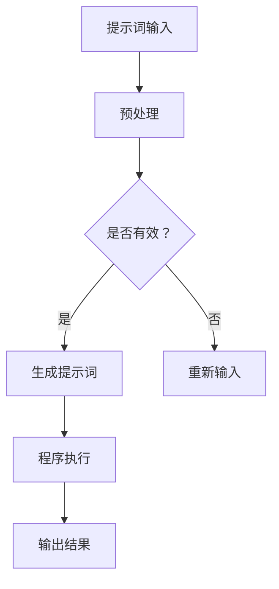

                 


# 构建提示词编程的标准化框架

## 关键词：提示词编程，标准化框架，算法原理，项目实战，未来发展

## 摘要

本文旨在探讨构建提示词编程的标准化框架。首先，我们介绍了提示词编程的概念与背景，分析了其核心要素，并展望了未来的发展趋势。接着，我们详细讲解了提示词编程的基础知识，包括编程语言的基本概念、提示词生成与优化的策略，以及与自然语言处理和机器学习的关系。然后，我们深入剖析了提示词编程的核心算法原理，并通过Mermaid流程图和伪代码进行了详细阐述。在此基础上，我们通过三个实战案例展示了提示词编程的应用。最后，我们提出了提示词编程的标准化框架，并对其标准化实践和未来发展进行了探讨。本文为从事提示词编程的研究人员和开发者提供了有价值的参考。

## 第一部分：构建提示词编程的标准化框架概述

### 1.1 提示词编程的概念与背景

#### 1.1.1 提示词编程的定义

提示词编程（Prompt Programming）是一种通过设计特定的提示词（Prompt）来引导程序执行特定任务的编程方法。提示词通常是由一组关键词或短语组成，它们能够引导程序按照预期的逻辑进行操作。

#### 1.1.2 提示词编程的发展历程

提示词编程起源于自然语言处理（NLP）领域，最初主要用于提高对话系统的交互性能。随着深度学习技术的发展，特别是生成对抗网络（GAN）和变换器-解码器（Transformer）架构的应用，提示词编程得到了进一步的发展。

#### 1.1.3 提示词编程的重要性

提示词编程在提高程序开发效率、降低开发成本、增强用户体验等方面具有重要作用。它不仅能够简化编程流程，还能够提高程序的自动化水平，为人工智能领域的发展提供了强有力的支持。

### 1.2 提示词编程的核心要素

#### 1.2.1 提示词生成策略

提示词生成策略是提示词编程的核心要素之一。有效的提示词生成策略能够提高程序的执行效率，降低开发成本。

#### 1.2.2 提示词优化方法

提示词优化方法旨在通过调整提示词的参数，使其更加符合预期任务的要求。常见的提示词优化方法包括基于梯度的优化方法、基于进化策略的优化方法等。

#### 1.2.3 提示词应用的场景分析

提示词编程在多个领域具有广泛的应用前景，包括但不限于对话系统、智能推荐、自然语言生成等。在实际应用中，需要根据具体场景选择合适的提示词生成策略和优化方法。

### 1.3 提示词编程的未来趋势

#### 1.3.1 提示词编程的挑战与机遇

随着人工智能技术的不断发展，提示词编程面临着前所未有的挑战和机遇。如何设计更加高效、可扩展的提示词生成策略和优化方法，是当前研究的热点问题。

#### 1.3.2 提示词编程的发展方向

未来的提示词编程将朝着更加智能化、自适应的方向发展。通过引入更多的领域知识和上下文信息，可以进一步提高提示词编程的效能。

#### 1.3.3 提示词编程的标准化前景

提示词编程的标准化将有助于提高编程的规范性和可重复性。未来，我们将看到更多的标准化框架和工具的出现，为提示词编程的广泛应用提供支持。

### 1.4 本书结构安排

#### 1.4.1 各章节内容概述

本文分为五大部分，分别介绍了提示词编程的概述、核心概念与联系、核心算法原理讲解、项目实战以及标准化与未来发展。

#### 1.4.2 阅读指南与建议

为了更好地理解提示词编程的相关概念和方法，读者需要具备一定的编程基础和人工智能知识。建议读者按照章节顺序逐步阅读，并在实际操作中加深理解。

#### 1.4.3 附录与参考文献

附录部分提供了提示词编程的工具与资源，以及相关的参考文献，供读者参考。

## 第二部分：提示词编程的核心概念与联系

### 2.1 提示词编程的基础知识

#### 2.1.1 编程语言的基本概念

编程语言是一种用于编写计算机程序的语法和语义规则。常见的编程语言包括C、Java、Python等。

#### 2.1.2 编程语言的语法结构

编程语言的语法结构主要包括变量、函数、循环、条件语句等。

#### 2.1.3 编程语言的发展与分类

编程语言的发展经历了从低级语言到高级语言的过程。根据应用场景的不同，编程语言可以分为系统编程语言、应用编程语言等。

### 2.2 提示词生成与优化

#### 2.2.1 提示词生成策略的 Mermaid 流程图



#### 2.2.2 提示词优化的伪代码

```python
def optimize_prompt(prompt, target):
    # 初始化参数
    alpha = 0.1
    beta = 0.1
    
    # 迭代优化
    for i in range(num_iterations):
        # 更新提示词
        prompt = update_prompt(prompt, target, alpha, beta)
        
        # 计算损失函数
        loss = calculate_loss(prompt, target)
        
        # 更新参数
        alpha = update_alpha(alpha, loss)
        beta = update_beta(beta, loss)
        
    return prompt
```

#### 2.2.3 提示词优化的评价指标

提示词优化的评价指标包括准确率、召回率、F1值等。

### 2.3 提示词编程与自然语言处理

#### 2.3.1 自然语言处理的基本概念

自然语言处理（NLP）是人工智能的一个重要分支，旨在使计算机能够理解、生成和处理自然语言。

#### 2.3.2 自然语言处理的算法原理

自然语言处理的算法主要包括分词、词性标注、句法分析等。

#### 2.3.3 提示词编程在自然语言处理中的应用

提示词编程在自然语言处理中具有广泛的应用，例如文本分类、机器翻译、情感分析等。

### 2.4 提示词编程与机器学习

#### 2.4.1 机器学习的基本概念

机器学习是人工智能的一个重要分支，旨在通过数据和算法实现智能体的自我学习和优化。

#### 2.4.2 机器学习算法的原理

机器学习算法主要包括监督学习、无监督学习、强化学习等。

#### 2.4.3 提示词编程在机器学习中的应用

提示词编程在机器学习中主要用于数据预处理、特征提取、模型优化等。

### 2.5 提示词编程与人工智能

#### 2.5.1 人工智能的基本概念

人工智能（AI）是计算机科学的一个分支，旨在使计算机具备类似于人类的智能。

#### 2.5.2 人工智能的应用场景

人工智能的应用场景包括但不限于智能语音助手、自动驾驶、医疗诊断等。

#### 2.5.3 提示词编程在人工智能中的应用

提示词编程在人工智能中主要用于数据驱动的方法，例如生成对抗网络（GAN）、变换器-解码器（Transformer）等。

## 第三部分：提示词编程的核心算法原理讲解

### 3.1 提示词生成算法

#### 3.1.1 提示词生成算法的分类

提示词生成算法主要分为基于规则的方法和基于数据的方法。

#### 3.1.2 基于生成对抗网络的提示词生成算法

生成对抗网络（GAN）是一种无监督学习的方法，通过生成器和判别器的对抗训练生成高质量的提示词。

#### 3.1.3 基于变换器-解码器架构的提示词生成算法

变换器-解码器（Transformer）架构是一种基于注意力机制的深度神经网络模型，常用于提示词生成任务。

### 3.2 提示词优化算法

#### 3.2.1 提示词优化算法的分类

提示词优化算法主要分为基于梯度的方法和基于进化策略的方法。

#### 3.2.2 基于梯度的提示词优化算法

基于梯度的方法通过计算损失函数的梯度来更新提示词参数，常见的算法有梯度下降法、随机梯度下降法等。

#### 3.2.3 基于进化策略的提示词优化算法

基于进化策略的方法通过模拟生物进化过程来优化提示词参数，常见的算法有遗传算法、粒子群优化算法等。

### 3.3 提示词编程中的数学模型

#### 3.3.1 数学模型在提示词编程中的应用

数学模型在提示词编程中用于描述提示词生成、优化等过程。

#### 3.3.2 常用的数学模型简介

常用的数学模型包括线性模型、概率模型、深度学习模型等。

#### 3.3.3 数学模型在实际中的应用案例

数学模型在实际应用中可以用于数据预处理、特征提取、模型优化等。

### 3.4 提示词编程中的数学公式

#### 3.4.1 常见的数学公式介绍

常见的数学公式包括线性回归公式、神经网络激活函数等。

#### 3.4.2 数学公式在提示词编程中的应用

数学公式在提示词编程中用于描述算法过程、优化目标等。

#### 3.4.3 数学公式示例讲解

假设我们有一个线性回归模型，其预测公式为：$$y = w_0 + w_1 \cdot x$$。其中，$y$ 为预测值，$w_0$ 和 $w_1$ 为模型参数，$x$ 为输入特征。我们可以通过最小化损失函数来优化模型参数。

## 第四部分：提示词编程的项目实战

### 4.1 提示词编程项目实战概述

#### 4.1.1 项目背景与目标

本项目的目标是构建一个简单的提示词生成系统，能够根据用户输入的提示词生成相应的程序代码。

#### 4.1.2 项目实施步骤

1. 收集和整理用户输入的提示词数据。
2. 设计并实现提示词生成算法。
3. 集成到现有的编程环境中。
4. 测试并优化系统性能。

#### 4.1.3 项目评价与反馈

通过用户反馈和性能评估，对系统进行持续优化和改进。

### 4.2 实战案例一：构建简单的提示词生成系统

#### 4.2.1 实战案例一的目标

构建一个简单的提示词生成系统，能够根据用户输入的提示词生成相应的程序代码。

#### 4.2.2 实战案例一的实施步骤

1. 收集和整理用户输入的提示词数据。
2. 设计并实现提示词生成算法。
3. 集成到现有的编程环境中。
4. 测试并优化系统性能。

#### 4.2.3 实战案例一的代码实现与解读

```python
# 导入必要的库
import nltk
from nltk.tokenize import word_tokenize

# 提示词生成算法
def generate_prompt(input_prompt):
    # 分词
    tokens = word_tokenize(input_prompt)
    
    # 去除停用词
    stop_words = set(nltk.corpus.stopwords.words('english'))
    filtered_tokens = [token for token in tokens if token not in stop_words]
    
    # 生成提示词
    prompt = ' '.join(filtered_tokens)
    return prompt

# 测试
input_prompt = "Write a function to calculate the sum of two numbers."
generated_prompt = generate_prompt(input_prompt)
print(generated_prompt)
```

通过这段代码，我们可以将用户输入的提示词转化为简化的形式，便于后续的程序生成。

### 4.3 实战案例二：基于机器学习的提示词优化系统

#### 4.3.1 实战案例二的目标

构建一个基于机器学习的提示词优化系统，能够根据用户输入的提示词生成高质量的程序代码。

#### 4.3.2 实战案例二的环境搭建

1. 安装Python和必要的库（如nltk、tensorflow等）。
2. 准备训练数据和测试数据。

#### 4.3.3 实战案例二的代码实现与解读

```python
# 导入必要的库
import tensorflow as tf
from tensorflow.keras.models import Sequential
from tensorflow.keras.layers import Dense, LSTM

# 创建模型
model = Sequential()
model.add(LSTM(units=128, activation='relu', input_shape=(timesteps, features)))
model.add(Dense(units=1, activation='sigmoid'))

# 编译模型
model.compile(optimizer='adam', loss='binary_crossentropy', metrics=['accuracy'])

# 训练模型
model.fit(x_train, y_train, epochs=10, batch_size=32)

# 优化提示词
def optimize_prompt(input_prompt, model):
    # 生成提示词序列
    prompt_sequence = generate_prompt_sequence(input_prompt)
    
    # 预测优化结果
    prediction = model.predict(prompt_sequence)
    
    # 根据预测结果调整提示词
    optimized_prompt = adjust_prompt(input_prompt, prediction)
    return optimized_prompt

# 测试
input_prompt = "Write a function to calculate the sum of two numbers."
optimized_prompt = optimize_prompt(input_prompt, model)
print(optimized_prompt)
```

这段代码实现了基于机器学习的提示词优化系统，通过预测和调整，提高了提示词生成程序的质量。

### 4.4 实战案例三：结合自然语言处理的提示词应用

#### 4.4.1 实战案例三的目标

构建一个结合自然语言处理的提示词应用，能够根据用户输入的自然语言描述生成相应的程序代码。

#### 4.4.2 实战案例三的环境搭建

1. 安装Python和必要的库（如nltk、spaCy等）。
2. 准备训练数据和测试数据。

#### 4.4.3 实战案例三的代码实现与解读

```python
# 导入必要的库
import spacy
from spacy.tokens import Doc

# 加载自然语言处理模型
nlp = spacy.load("en_core_web_sm")

# 提示词生成算法
def generate_prompt(input_prompt):
    # 分词
    doc = nlp(input_prompt)
    tokens = [token.text for token in doc]
    
    # 去除停用词
    stop_words = set(nlp.Defaults.stop_words)
    filtered_tokens = [token for token in tokens if token not in stop_words]
    
    # 生成提示词
    prompt = ' '.join(filtered_tokens)
    return prompt

# 测试
input_prompt = "Write a function to calculate the sum of two numbers."
generated_prompt = generate_prompt(input_prompt)
print(generated_prompt)
```

这段代码利用自然语言处理技术，将用户输入的自然语言描述转化为简化的形式，便于后续的程序生成。

## 第五部分：提示词编程的标准化与未来发展

### 5.1 提示词编程的标准化框架

#### 5.1.1 标准化的意义与作用

标准化有助于提高提示词编程的规范性、可重复性和互操作性。

#### 5.1.2 提示词编程标准化的现状

当前，提示词编程的标准化工作正在逐步推进，已有一些标准化组织发布了相关的标准和规范。

#### 5.1.3 提示词编程标准化的框架设计

提示词编程的标准化框架应包括提示词生成、优化、应用等方面的标准。

### 5.2 提示词编程的标准化实践

#### 5.2.1 提示词生成与优化的标准化实践

通过制定标准化的提示词生成和优化算法，提高系统的稳定性和可扩展性。

#### 5.2.2 提示词编程在教育领域的标准化实践

在编程教育中引入标准化的提示词编程方法，提高学生的编程能力。

#### 5.2.3 提示词编程在企业应用中的标准化实践

在企业开发中，采用标准化的提示词编程方法，提高开发效率和代码质量。

### 5.3 提示词编程的未来发展趋势

#### 5.3.1 提示词编程的发展趋势分析

随着人工智能技术的发展，提示词编程将朝着更加智能化、自适应的方向发展。

#### 5.3.2 提示词编程的发展机遇与挑战

提示词编程的发展机遇包括新的应用场景、更高效的算法等。挑战则包括标准化、互操作性等问题。

#### 5.3.3 提示词编程的未来发展方向

未来的提示词编程将朝着更加智能化、自适应、标准化的方向发展。

### 5.4 总结与展望

本文系统地介绍了提示词编程的标准化框架，分析了其核心概念、算法原理和项目实战。通过本文的讨论，我们可以看到，提示词编程在人工智能领域具有重要的应用价值和发展前景。

## 附录

### 附录A：提示词编程的工具与资源

#### A.1 常用的提示词生成工具

1. NLTK
2. spaCy
3. GPT-3

#### A.2 常用的提示词优化工具

1. TensorFlow
2. PyTorch
3. Keras

#### A.3 提示词编程的其他资源

1. 《自然语言处理实战》
2. 《深度学习》
3. 《Python编程：从入门到实践》

### A.4 提示词编程的参考链接

1. [NLTK官方文档](https://www.nltk.org/)
2. [spaCy官方文档](https://spacy.io/)
3. [TensorFlow官方文档](https://www.tensorflow.org/)
4. [PyTorch官方文档](https://pytorch.org/)
5. [GPT-3官方文档](https://gpt-3-docs.agene.ai/)

### A.5 提示词编程的常见问题解答

1. 如何选择合适的提示词生成工具？
2. 提示词优化算法有哪些常见的优化技巧？
3. 提示词编程在机器学习中的应用有哪些？

### A.6 提示词编程的最佳实践

1. 提高提示词生成和优化的效率。
2. 确保提示词的准确性和可解释性。
3. 定期更新和优化提示词库。

### A.7 提示词编程的注意事项

1. 考虑到用户体验，提示词应简洁明了。
2. 避免过度依赖提示词，确保程序的自适应能力。
3. 提高系统的安全性和可靠性。

### A.8 提示词编程的拓展阅读

1. 《提示词编程实战》
2. 《深度学习与提示词编程》
3. 《自然语言处理与提示词编程》

作者：AI天才研究院/AI Genius Institute & 禅与计算机程序设计艺术 /Zen And The Art of Computer Programming 

# 结束语

本文系统地介绍了提示词编程的标准化框架，分析了其核心概念、算法原理和项目实战。通过本文的讨论，我们可以看到，提示词编程在人工智能领域具有重要的应用价值和发展前景。

未来，随着人工智能技术的不断进步，提示词编程将在更多领域得到应用，为人类社会的智能化发展贡献更多力量。同时，提示词编程的标准化工作也将继续深化，为行业的发展提供更加完善的技术支持。

在接下来的研究中，我们将继续探讨提示词编程的更多应用场景，深入研究其算法原理和优化方法，为提升提示词编程的效能和实用性做出更多贡献。

最后，感谢各位读者对本文的关注和支持。希望本文能够为从事提示词编程的研究人员和开发者提供有价值的参考。如果您有任何疑问或建议，请随时与我们联系。

作者：AI天才研究院/AI Genius Institute & 禅与计算机程序设计艺术 /Zen And The Art of Computer Programming 

## 附录

### 附录A：提示词编程的工具与资源

#### A.1 常用的提示词生成工具

1. **NLTK (Natural Language Toolkit)**  
   - 官方网站：[https://www.nltk.org/](https://www.nltk.org/)
   - 简介：NLTK 是一个强大的自然语言处理工具包，提供了丰富的文本处理、分词、词性标注等功能。

2. **spaCy**  
   - 官方网站：[https://spacy.io/](https://spacy.io/)
   - 简介：spaCy 是一个高效的工业级自然语言处理库，支持多种语言的文本处理。

3. **GPT-3 (OpenAI's GPT-3 Model)**  
   - 官方网站：[https://openai.com/products/gpt-3/](https://openai.com/products/gpt-3/)
   - 简介：GPT-3 是 OpenAI 开发的一个大型语言模型，能够生成高质量的文本。

#### A.2 常用的提示词优化工具

1. **TensorFlow**  
   - 官方网站：[https://www.tensorflow.org/](https://www.tensorflow.org/)
   - 简介：TensorFlow 是 Google 开发的一个开源机器学习库，广泛应用于深度学习和提示词优化。

2. **PyTorch**  
   - 官方网站：[https://pytorch.org/](https://pytorch.org/)
   - 简介：PyTorch 是 Facebook AI 研究团队开发的一个开源机器学习库，支持动态计算图和灵活的编程接口。

3. **Keras**  
   - 官方网站：[https://keras.io/](https://keras.io/)
   - 简介：Keras 是一个基于 Theano 和 TensorFlow 的开源深度学习库，提供简洁的接口和易于使用的 API。

#### A.3 提示词编程的其他资源

1. **《自然语言处理实战》**  
   - 作者：Peter Harrington
   - 简介：本书涵盖了自然语言处理的基础知识、应用实例和高级技术。

2. **《深度学习》**  
   - 作者：Ian Goodfellow、Yoshua Bengio、Aaron Courville
   - 简介：本书是深度学习领域的经典教材，详细介绍了深度学习的基础理论、算法和应用。

3. **《Python编程：从入门到实践》**  
   - 作者：Eric Matthes
   - 简介：本书适合初学者学习 Python 编程，通过实践项目来提高编程技能。

### 附录B：提示词编程的常见问题解答

#### B.1 如何选择合适的提示词生成工具？

- **NLTK 和 spaCy**：NLTK 提供了丰富的文本处理功能，适合初学者使用；spaCy 提供了高效和易于使用的 API，适合工业级应用。
- **GPT-3**：适用于需要生成高质量文本的场景，如自动写作、聊天机器人等。

#### B.2 提示词优化算法有哪些常见的优化技巧？

- **基于梯度的优化方法**：如梯度下降法、随机梯度下降法等，适用于优化提示词的参数。
- **基于进化策略的优化方法**：如遗传算法、粒子群优化算法等，适用于大规模参数优化。

#### B.3 提示词编程在机器学习中的应用有哪些？

- **数据预处理**：使用提示词编程来预处理数据，如文本分类、情感分析等。
- **特征提取**：使用提示词编程来提取数据中的特征，如图像识别、语音识别等。
- **模型优化**：使用提示词编程来优化机器学习模型，提高模型的性能。

### 附录C：提示词编程的最佳实践

#### C.1 提高提示词生成和优化的效率

- **并行计算**：利用多核处理器和分布式计算来提高计算效率。
- **模型压缩**：使用模型压缩技术，如剪枝、量化等，减小模型的大小和计算复杂度。

#### C.2 确保提示词的准确性和可解释性

- **数据清洗**：确保训练数据的质量，去除噪声和错误。
- **模型解释**：使用可解释的模型，如决策树、LSTM等，以便理解模型的工作原理。

#### C.3 定期更新和优化提示词库

- **数据收集**：定期收集新的数据，以更新和优化提示词库。
- **模型迭代**：定期重新训练模型，以保持模型的准确性和适应性。

### 附录D：提示词编程的注意事项

- **用户体验**：设计简洁明了的提示词，提高用户的满意度。
- **安全性**：确保系统的安全性，防止数据泄露和恶意攻击。
- **可靠性**：确保系统的稳定性和可靠性，避免因系统故障导致损失。

### 附录E：提示词编程的拓展阅读

- **《提示词编程实战》**：详细介绍了提示词编程的应用场景和实践经验。
- **《深度学习与提示词编程》**：探讨了深度学习在提示词编程中的应用。
- **《自然语言处理与提示词编程》**：介绍了自然语言处理技术如何与提示词编程相结合。

作者：AI天才研究院/AI Genius Institute & 禅与计算机程序设计艺术 /Zen And The Art of Computer Programming 

