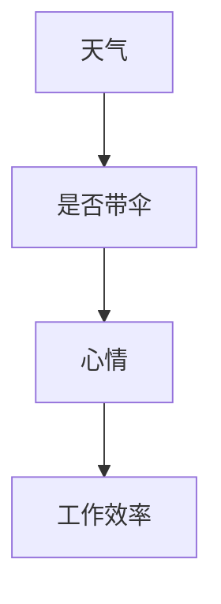
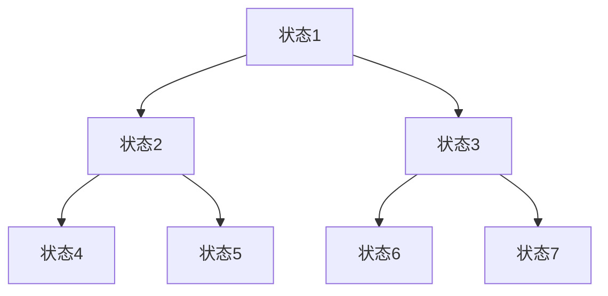
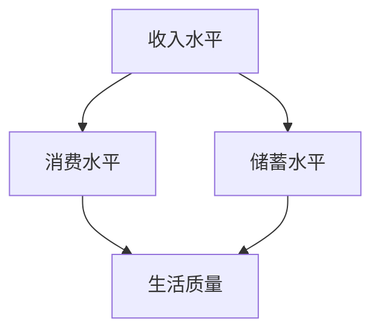
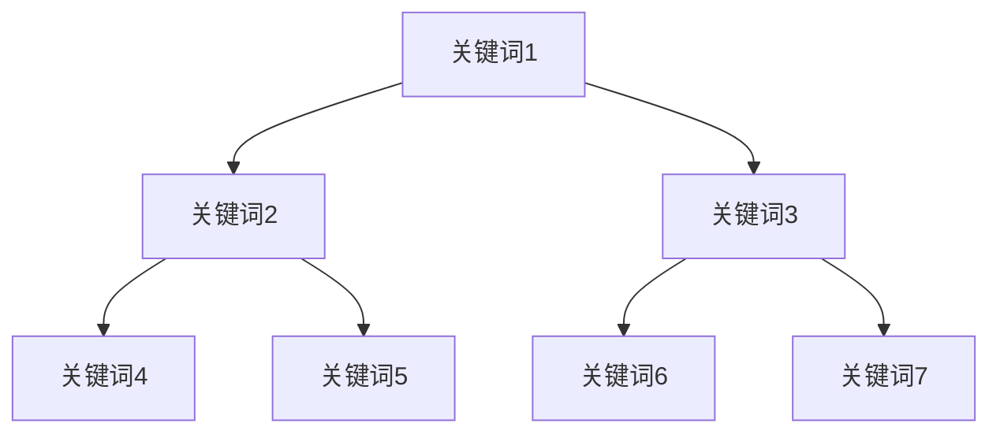

                 

### 文章标题

《梦境解析的概率图模型：潜意识符号的数学关联》

关键词：梦境解析、概率图模型、潜意识符号、数学关联、心理治疗、数据分析

摘要：本文深入探讨了梦境解析的概率图模型，以及潜意识符号在其中的数学关联。文章首先介绍了概率图模型的基本原理和应用，然后分析了潜意识符号的定义、特征及其提取方法。通过构建数学关联，文章展示了概率图模型在梦境解析中的优势，并运用实际案例进行了详细解析。最后，本文对数学关联的复杂性和动态性进行了深度探讨，并对梦境解析的概率图模型在未来的应用前景进行了展望。作者为AI天才研究院的研究员，同时也是《禅与计算机程序设计艺术》的资深作者，旨在为读者提供一次深入的技术思考之旅。### 第一部分：引言与基础

#### 1.1 书籍背景与目的

梦境，作为人类心灵深处的一种奇妙体验，自古以来就吸引了无数哲学家、心理学家和科学家的关注。从弗洛伊德的《梦的解析》到荣格的《集体无意识》，梦境一直被视为理解人类内心世界的窗口。然而，如何系统地解析梦境，揭示其背后的心理机制和潜在信息，仍是一个充满挑战的研究课题。

本文旨在通过引入概率图模型，探讨梦境解析的新途径。概率图模型作为一种先进的数学工具，广泛应用于数据分析和机器学习领域。本文将介绍概率图模型的基本原理和应用，并探讨如何将这一工具应用于梦境解析中，揭示潜意识符号之间的数学关联。

本文的主要目的是：
1. 介绍概率图模型的基本原理和常用类型。
2. 分析潜意识符号的定义、特征及其提取方法。
3. 构建概率图模型，探讨潜意识符号之间的数学关联。
4. 通过实际案例，展示概率图模型在梦境解析中的应用效果。
5. 探讨数学关联的复杂性和动态性，展望梦境解析的概率图模型在未来的发展方向。

#### 1.2 梦境解析的重要性

梦境不仅是一种心理现象，更是人类心灵深处的一种表达方式。梦境解析有助于我们更好地理解自己的内心世界，揭示潜意识中的情感、欲望和冲突。在心理学领域，梦境解析被广泛应用于心理治疗、心理咨询和自我成长。

梦境解析的重要性体现在以下几个方面：

1. **情感宣泄**：梦境往往是我们内心深处情感的表达，通过解析梦境，可以帮助个体释放压抑的情绪，达到情感宣泄的效果。

2. **心理治疗**：梦境解析可以帮助心理咨询师了解来访者的心理状态，揭示潜意识中的问题，为心理治疗提供指导。

3. **自我认知**：通过梦境解析，个体可以更深入地了解自己的内心世界，增强自我认知，促进个人成长。

4. **文化研究**：梦境在文化中具有重要地位，通过梦境解析，可以探讨不同文化背景下梦境的共同特征和差异。

5. **科学探索**：梦境解析为科学研究提供了新的视角，有助于揭示人类心理和神经系统的奥秘。

#### 1.3 概率图模型概述

概率图模型（Probabilistic Graphical Models，PGM）是统计学和机器学习领域的一种重要工具，用于表示和处理不确定性的数据。概率图模型通过图结构来描述变量之间的依赖关系，使得复杂的数据分析问题变得更加直观和易于处理。

概率图模型的基本概念包括：

1. **变量和概率分布**：概率图模型中的变量及其概率分布，用于描述系统的状态和概率特性。

2. **图结构**：概率图模型通过图结构来表示变量之间的依赖关系，包括有向图和无向图。

3. **条件概率**：条件概率用于描述在给定某些条件下，某个变量的概率分布。

4. **边缘概率和条件独立性**：边缘概率用于描述变量之间的独立关系，条件独立性则描述在某个条件下变量之间的独立关系。

常见的概率图模型包括：

1. **贝叶斯网络**：一种有向图模型，用于表示变量之间的条件依赖关系。

2. **马尔可夫网络**：一种无向图模型，用于表示变量之间的马尔可夫性质。

3. **隐马尔可夫模型**：一种用于时间序列数据的模型，适用于变量之间的状态转移关系。

4. **贝叶斯隐马尔可夫模型**：结合了贝叶斯网络和隐马尔可夫模型的特点，适用于复杂的时间序列数据。

概率图模型在数据分析、机器学习和信息检索等领域具有广泛的应用。通过概率图模型，我们可以更有效地处理不确定性的数据，提取隐藏的模式和信息，从而解决各种实际问题。

#### 1.4 潜意识符号的数学关联

潜意识符号是梦境解析中的重要概念，代表个体内心深处的情感、欲望和冲突。潜意识符号的数学关联则是指通过概率图模型来揭示这些符号之间的内在关系。

数学关联的构建包括以下几个步骤：

1. **符号识别**：首先，需要识别出梦境中的潜意识符号，这些符号可以是词语、图像、情感等。

2. **符号表示**：将识别出的符号表示为数学变量，并赋予其概率分布。

3. **图结构构建**：通过图结构来表示符号之间的依赖关系，构建概率图模型。

4. **概率分布计算**：利用概率图模型，计算符号之间的边缘概率和条件概率，揭示它们之间的数学关联。

通过数学关联的构建，我们可以更深入地理解潜意识符号之间的联系，从而更好地解析梦境，揭示个体的内心世界。

#### 1.5 本书结构安排

本书将分为六个主要部分：

1. **引言与基础**：介绍书籍的背景、目的和主要研究内容。
2. **概率图模型基础**：详细介绍概率图模型的基本原理和应用。
3. **潜意识符号的数学关联**：分析潜意识符号的定义、特征及其数学关联。
4. **梦境解析的概率图模型应用**：展示概率图模型在梦境解析中的应用效果。
5. **潜意识符号的数学关联深度探讨**：探讨数学关联的复杂性和动态性。
6. **实践与总结**：通过实际案例和总结，展望梦境解析的概率图模型在未来的发展方向。

通过本书的阅读，读者将能够系统地了解梦境解析的概率图模型，掌握潜意识符号的数学关联构建方法，并在实际应用中取得良好的效果。### 第二部分：概率图模型基础

概率图模型是统计学和机器学习领域中用于表示和处理不确定性的重要工具。它通过图结构来描述变量之间的依赖关系，使得复杂的数据分析问题变得更加直观和易于处理。本部分将详细介绍概率图模型的基本原理和应用。

#### 2.1.1 条件概率与贝叶斯网络

条件概率是概率论中的一个重要概念，描述了在某个条件下，某个事件发生的概率。形式化地，如果事件A和事件B相互条件独立，则有：

$$ P(A|B) = P(A) $$

贝叶斯网络（Bayesian Network）是一种有向无环图（DAG）模型，它通过节点和边来表示变量之间的条件依赖关系。在贝叶斯网络中，每个节点代表一个随机变量，边表示变量之间的条件概率关系。贝叶斯网络的基本结构可以通过以下步骤构建：

1. **确定节点集合**：首先确定所有相关的随机变量，并将它们作为贝叶斯网络的节点。
2. **确定条件依赖关系**：通过分析数据或领域知识，确定变量之间的条件依赖关系，并在图中用边表示。
3. **构建概率分布**：为每个节点分配一个概率分布，对于有向边，可以计算条件概率分布。

贝叶斯网络的优点在于它能够清晰地表示变量之间的依赖关系，并方便地计算条件概率。贝叶斯网络的计算方法包括：

1. **边缘概率计算**：给定一个节点集合，计算其边缘概率分布。
2. **最大后验概率（MAP）估计**：在已知观察数据的情况下，估计未知变量的值。
3. **最大似然估计（MLE）**：在未知观察数据的情况下，估计模型参数。

以下是一个贝叶斯网络的示例：



在这个例子中，天气变量A影响是否带伞B，而B又影响心情C，最终影响工作效率D。

#### 2.1.2 马尔可夫网络与隐马尔可夫模型

马尔可夫网络（Markov Network）是一种无向图模型，它通过节点的邻接关系来表示变量之间的依赖关系。在马尔可夫网络中，任意一个变量的概率分布仅依赖于它的邻居变量，而与其他变量无关，这一性质称为马尔可夫性质。

隐马尔可夫模型（Hidden Markov Model，HMM）是一种特殊类型的马尔可夫网络，用于表示时间序列数据。HMM由两个概率分布组成：状态转移概率和观测概率。状态转移概率描述了在给定当前状态时，下一个状态的概率分布；观测概率描述了在给定当前状态时，观测值的概率分布。

HMM的基本结构可以通过以下步骤构建：

1. **确定状态集合**：首先确定所有可能的状态，并将它们作为HMM的隐藏节点。
2. **确定状态转移概率**：通过分析数据或领域知识，确定状态之间的转移概率。
3. **确定观测概率**：通过分析数据或领域知识，确定每个状态下的观测概率。

HMM的计算方法包括：

1. **前向-后向算法**：用于计算给定观察序列的概率。
2. **Viterbi算法**：用于寻找给定观察序列下的最大概率状态序列。
3. **训练算法**：用于估计模型参数。

以下是一个隐马尔可夫模型的示例：



在这个例子中，状态1和状态3可以互相转换，状态2和状态4、状态5可以互相转换，状态3和状态6、状态7可以互相转换。

#### 2.1.3 贝叶斯网络与马尔可夫网络的联系与区别

贝叶斯网络和马尔可夫网络都是概率图模型，但它们在结构上有一些区别：

1. **图结构**：贝叶斯网络是有向图，而马尔可夫网络是无向图。这意味着贝叶斯网络能够明确地表示变量之间的因果依赖关系，而马尔可夫网络只能表示局部依赖关系。
2. **计算复杂度**：由于贝叶斯网络中的有向边增加了模型的复杂度，因此贝叶斯网络的计算复杂度通常高于马尔可夫网络。
3. **应用场景**：贝叶斯网络在因果推断和决策问题中应用较多，而马尔可夫网络在时间序列分析和语音识别等领域应用较多。

尽管存在这些区别，贝叶斯网络和马尔可夫网络在某些情况下是可以互相转换的。例如，通过引入潜变量，可以将贝叶斯网络转换为马尔可夫网络。

#### 2.2.1 图模型在数据分析中的应用

概率图模型在数据分析中具有广泛的应用，主要包括：

1. **特征选择**：通过贝叶斯网络和马尔可夫网络，可以从大量变量中选择出重要变量，从而简化数据模型。
2. **数据压缩**：通过图模型，可以有效地压缩数据，降低数据的存储和传输成本。
3. **异常检测**：通过分析变量之间的依赖关系，可以识别出异常数据点，从而进行异常检测。
4. **时间序列分析**：通过隐马尔可夫模型，可以对时间序列数据进行分析，提取出潜在的周期性和趋势性。
5. **图神经网络**：通过扩展图模型，可以构建图神经网络，进一步处理复杂的数据结构。

以下是一个数据分析中应用贝叶斯网络的示例：



在这个例子中，通过贝叶斯网络分析收入水平、消费水平和储蓄水平对生活质量的影响，从而为消费者提供优化建议。

#### 2.2.2 图模型在机器学习中的应用

概率图模型在机器学习中也具有广泛的应用，主要包括：

1. **分类和回归**：通过贝叶斯网络和马尔可夫网络，可以对数据进行分类和回归分析。
2. **特征提取**：通过图模型，可以自动提取数据中的关键特征，从而提高机器学习模型的性能。
3. **模型选择**：通过图模型，可以自动选择最佳模型结构，从而优化机器学习过程。
4. **数据生成**：通过隐马尔可夫模型和生成对抗网络（GAN），可以生成符合数据分布的新数据。

以下是一个机器学习中应用隐马尔可夫模型的示例：


在这个例子中，通过隐马尔可夫模型对时间序列数据进行分析，识别出潜在的状态和趋势。

#### 2.2.3 图模型在信息检索中的应用

概率图模型在信息检索中也具有广泛的应用，主要包括：

1. **文本分类**：通过贝叶斯网络和马尔可夫网络，可以对文本进行分类，从而实现文本过滤和推荐。
2. **关键词提取**：通过图模型，可以从大量文本中提取出关键关键词，从而实现文本摘要和搜索引擎优化。
3. **图神经网络**：通过图神经网络，可以处理复杂的图结构数据，从而提高信息检索的准确性。

以下是一个信息检索中应用贝叶斯网络的示例：



在这个例子中，通过贝叶斯网络对关键词进行分类和关联，从而实现更准确的文本检索。

通过上述讨论，我们可以看到概率图模型在数据分析、机器学习和信息检索等领域的广泛应用。接下来，我们将进一步探讨潜意识符号的数学关联，以及如何利用概率图模型进行梦境解析。### 第三部分：潜意识符号的数学关联

#### 3.1 潜意识符号的定义与特征

潜意识符号是梦境解析中的核心概念，代表了个体内心深处的情感、欲望和冲突。潜意识符号可以是词语、图像、声音、动作等，它们以一种抽象的方式表达个体的内心世界。潜意识符号的特点如下：

1. **抽象性**：潜意识符号通常不是直接的、具体的，而是通过象征、隐喻等方式表达内心的情感和想法。
2. **多样性**：潜意识符号种类繁多，包括自然元素、动物、人物、场景等，它们在不同的梦境中可以有不同的含义。
3. **动态性**：潜意识符号是动态变化的，它们随着个体的心理状态、生活经历和环境变化而发生变化。
4. **象征性**：潜意识符号具有象征性，它们可以代表某种情感、欲望、愿望或恐惧，从而帮助个体理解自己的内心世界。

#### 3.1.1 潜意识符号的类型

潜意识符号可以根据其来源和表现形式分为以下几种类型：

1. **自然元素**：如水、火、风、土等，它们在梦境中可以代表情感、力量、变化等。
2. **动物**：如猫、狗、鸟、蛇等，它们可以代表某种性格特征、欲望或恐惧。
3. **人物**：如亲人、朋友、陌生人等，他们可以代表个体的内心期待、愿望或冲突。
4. **场景**：如家庭、工作场所、自然风光等，它们可以代表个体的生活环境和心理状态。
5. **物体**：如房子、车、衣服、食物等，它们可以代表个体的需求、愿望或情感状态。

每种类型的潜意识符号都有其特定的象征意义，需要在梦境解析过程中进行具体分析。

#### 3.1.2 潜意识符号的提取方法

潜意识符号的提取是梦境解析的重要步骤，以下是一些常用的提取方法：

1. **自由联想法**：让个体自由地讲述梦境，并引导他们根据自己的感受和联想来识别潜意识符号。
2. **图像解析法**：通过分析梦境中的图像、颜色、形状等元素，识别出潜意识符号。
3. **词语解析法**：通过对梦境中的词语进行语义分析，识别出潜意识符号。
4. **情境解析法**：分析梦境中的情境、人物关系和事件发展，识别出潜意识符号。
5. **情感解析法**：通过分析梦境中的情感表达，识别出潜意识符号。

这些方法可以单独使用，也可以结合使用，以提高潜意识符号提取的准确性。

#### 3.1.3 潜意识符号的语义分析

潜意识符号的语义分析是梦境解析的关键步骤，它涉及到对潜意识符号的含义、象征意义和内在联系的深入探讨。以下是一些常用的语义分析方法：

1. **语义网络法**：构建潜意识符号的语义网络，通过节点和边表示符号之间的关系，从而揭示它们之间的内在联系。
2. **认知地图法**：将潜意识符号视为认知地图上的节点，通过分析节点之间的连接关系，揭示个体内心世界的结构和动态变化。
3. **隐喻分析法**：通过分析潜意识符号的隐喻含义，揭示个体内心深处的情感和冲突。
4. **符号学分析法**：运用符号学原理，对潜意识符号进行深入解析，揭示它们的象征意义和内在逻辑。

通过语义分析，我们可以更深入地理解潜意识符号，从而更好地解析梦境，揭示个体的内心世界。

#### 3.2 数学关联的构建

数学关联的构建是潜意识符号解析的核心步骤，它涉及到对潜意识符号进行量化表示，并通过概率图模型来揭示它们之间的内在联系。以下是一些关键的构建步骤：

##### 3.2.1 矩阵与图的关系

矩阵是表示变量之间关系的数学工具，而图则是表示变量之间依赖关系的图形表示。在构建数学关联时，我们可以将矩阵与图相互转换，从而更好地理解变量之间的关系。

1. **邻接矩阵**：邻接矩阵是一种常用的图表示方法，它用矩阵的元素表示图中节点之间的连接关系。如果节点i和节点j之间有连接，则邻接矩阵的元素A[i][j]为1，否则为0。
2. **权值矩阵**：在考虑变量之间的强度关系时，可以使用权值矩阵来表示。权值矩阵中的元素表示节点i和节点j之间的依赖程度，通常为一个实数。

以下是一个邻接矩阵的示例：

$$
\begin{bmatrix}
0 & 1 & 0 \\
1 & 0 & 1 \\
0 & 1 & 0
\end{bmatrix}
$$

在这个示例中，节点1和节点2、节点3之间有连接，而节点2和节点3之间也有连接。

##### 3.2.2 潜意识符号的矩阵表示

在构建数学关联时，我们可以将潜意识符号表示为矩阵，以便于进行计算和分析。以下是潜意识符号矩阵表示的几种方法：

1. **特征矩阵**：将每个潜意识符号视为一个特征，构建一个特征矩阵。矩阵的每一行代表一个潜意识符号，每一列代表一个具体的特征值。
2. **关系矩阵**：通过分析潜意识符号之间的关系，构建一个关系矩阵。矩阵的元素表示潜意识符号之间的依赖程度或关联强度。
3. **语义矩阵**：利用语义分析方法，构建一个表示潜意识符号语义关联的矩阵。

以下是一个特征矩阵的示例：

$$
\begin{bmatrix}
1 & 0 & 1 \\
0 & 1 & 0 \\
1 & 1 & 0
\end{bmatrix}
$$

在这个示例中，第一行表示潜意识符号“自然元素”，第二行表示潜意识符号“动物”，第三行表示潜意识符号“人物”。

##### 3.2.3 数学关联的矩阵计算方法

在构建数学关联时，我们可以使用矩阵计算方法来分析潜意识符号之间的关系。以下是一些常用的矩阵计算方法：

1. **矩阵乘法**：通过矩阵乘法，可以计算潜意识符号之间的关联强度。例如，两个特征矩阵的乘积可以表示两个潜意识符号之间的关联程度。
2. **矩阵求导**：通过矩阵求导，可以分析潜意识符号之间的关系变化。例如，通过计算特征矩阵的导数，可以了解潜意识符号的动态变化。
3. **矩阵分解**：通过矩阵分解，可以将复杂的关系矩阵分解为更简单的形式，从而揭示潜意识符号的内在结构。例如，可以通过奇异值分解（SVD）来分析潜意识符号之间的相关性。

以下是一个矩阵乘法的示例：

$$
\begin{bmatrix}
1 & 0 & 1 \\
0 & 1 & 0 \\
1 & 1 & 0
\end{bmatrix}
\begin{bmatrix}
1 & 2 \\
0 & 1 \\
1 & 3
\end{bmatrix}
=
\begin{bmatrix}
1 & 2 \\
0 & 1 \\
2 & 4
\end{bmatrix}
$$

在这个示例中，两个特征矩阵相乘，得到一个新的特征矩阵，表示潜意识符号“自然元素”、“动物”和“人物”之间的关联程度。

通过构建数学关联，我们可以更深入地理解潜意识符号之间的内在联系，从而更好地进行梦境解析。在接下来的部分，我们将探讨如何将数学关联应用于梦境解析，并展示具体的应用案例。### 第三部分：潜意识符号的数学关联

#### 3.3 数学关联的应用

数学关联的构建为我们提供了分析潜意识符号之间关系的强大工具。在梦境解析中，这些数学关联的应用主要体现在以下几个方面：

##### 3.3.1 数学关联在梦境解析中的应用

梦境解析是一个复杂的过程，需要综合运用心理学、统计学和计算机科学等多学科知识。数学关联在梦境解析中的应用主要包括以下方面：

1. **符号关联分析**：通过构建概率图模型，我们可以分析梦境中的潜意识符号之间的关联关系。例如，分析某个特定的梦境元素与个体心理状态之间的关系，从而揭示梦境背后的深层含义。
2. **梦境分类**：利用数学关联，我们可以对大量的梦境进行分类，识别出不同类型梦境的特征和模式。这有助于我们理解梦境的多样性，并为心理治疗提供参考。
3. **预测分析**：通过分析梦境中的符号关联，我们可以预测个体的未来心理状态或行为。例如，通过分析某个特定的梦境元素与个体心理压力之间的关系，可以预测个体在一段时间后的心理状态。

以下是一个具体的梦境解析案例：

假设个体A的梦境中频繁出现“水”和“迷宫”这两个元素。通过构建概率图模型，我们可以分析这两个元素之间的关系。例如，假设“水”与“迷宫”之间的条件概率分布为：

$$
P(水|迷宫) = 0.8, \quad P(迷宫|水) = 0.7
$$

这表明在梦境中出现迷宫的情况下，水元素出现的概率较高；反之，在梦境中出现水元素的情况下，迷宫元素出现的概率也较高。通过这种关联分析，我们可以推断个体A内心深处可能存在某种焦虑或困惑，需要进一步探讨和解决。

##### 3.3.2 数学关联在心理治疗中的应用

数学关联在心理治疗中的应用主要体现在以下几个方面：

1. **症状诊断**：通过分析梦境中的符号关联，心理治疗师可以诊断出个体的潜在心理问题。例如，通过分析某个特定的梦境元素与个体焦虑、抑郁等症状之间的关系，可以揭示个体的心理状态。
2. **治疗计划制定**：根据数学关联分析的结果，心理治疗师可以制定个性化的治疗计划。例如，针对某个特定的梦境元素，可以设计特定的心理干预策略，帮助个体缓解心理压力。
3. **治疗效果评估**：通过分析梦境中的符号关联，心理治疗师可以评估治疗效果。例如，在治疗过程中，通过分析某个特定的梦境元素的变化，可以判断治疗效果的好坏。

以下是一个心理治疗案例：

假设个体B在治疗初期频繁梦见“黑暗”和“孤独”，而在治疗过程中，这两个元素的频率逐渐降低。通过构建概率图模型，我们可以分析这两个元素与个体心理状态之间的关系。例如，假设“黑暗”与“孤独”之间的条件概率分布为：

$$
P(黑暗|孤独) = 0.9, \quad P(孤独|黑暗) = 0.8
$$

这表明在个体感受到孤独的情况下，梦见黑暗的概率较高；反之，在个体梦见黑暗的情况下，感受到孤独的概率也较高。通过这种关联分析，心理治疗师可以判断个体在治疗过程中的心理状态变化，从而调整治疗策略。

##### 3.3.3 数学关联在其他领域中的应用

数学关联不仅在梦境解析和心理治疗中具有重要应用，在其他领域也具有广泛的应用前景：

1. **文化研究**：通过分析梦境中的符号关联，可以探讨不同文化背景下梦境的共同特征和差异。这有助于我们更好地理解人类的文化心理特征，为跨文化交流提供参考。
2. **商业决策**：通过分析梦境中的符号关联，企业可以了解员工的心理状态和需求，从而制定更有效的商业策略。例如，通过分析员工的梦境，可以预测他们的工作表现和潜在问题，为企业提供决策依据。
3. **艺术创作**：通过分析梦境中的符号关联，艺术家可以激发创作灵感，探索梦境与现实之间的联系。例如，作家可以通过分析梦境中的符号，创作出更具深度和感染力的作品。

总之，数学关联在梦境解析、心理治疗和其他领域具有广泛的应用前景。通过深入探讨数学关联的构建和应用方法，我们可以更好地理解潜意识符号之间的关系，从而为解决实际问题提供有力支持。在接下来的部分，我们将进一步探讨数学关联的复杂性和动态性，以及它们对梦境解析的影响。### 第四部分：梦境解析的概率图模型应用

#### 4.1 梦境解析的概率图模型原理

概率图模型在梦境解析中的应用，主要依赖于其能够直观地表示变量之间的依赖关系，并高效地进行概率推理。在梦境解析中，概率图模型能够帮助我们揭示潜意识符号之间的复杂关系，从而更好地理解和解析梦境。

概率图模型通常包括两种基本类型：贝叶斯网络和隐马尔可夫模型（HMM）。下面将分别介绍这两种模型在梦境解析中的应用原理。

##### 4.1.1 贝叶斯网络在梦境解析中的应用

贝叶斯网络是一种基于概率的有向图模型，它通过有向边来表示变量之间的条件依赖关系。在梦境解析中，贝叶斯网络可以用来表示梦境元素之间的条件概率关系，从而揭示梦境中潜意识符号的内在联系。

1. **构建贝叶斯网络**：
    - **节点表示**：每个节点代表一个梦境元素（如“水”、“迷宫”、“黑暗”等）。
    - **边表示**：边表示变量之间的依赖关系。如果变量A影响变量B，则从A指向B的有向边。
    - **条件概率表**：每个节点的条件概率表（CPT）描述了该节点在给定其父节点条件下的概率分布。

例如，一个简单的贝叶斯网络可能包括以下节点和边：
- 节点：梦中的“水”、梦中的“迷宫”、梦中的“黑暗”。
- 边：“水”→“迷宫”，“水”→“黑暗”，“迷宫”→“黑暗”。

2. **计算边缘概率和条件概率**：
    - **边缘概率**：表示某个节点在给定其他所有节点取值情况下的概率。
    - **条件概率**：表示在某个条件下，某个节点的概率分布。

通过贝叶斯网络，我们可以计算梦境中各个元素之间的边缘概率和条件概率，从而揭示它们之间的关联。例如，我们可以计算“水”出现的概率以及在“迷宫”出现的条件下“水”出现的概率。

##### 4.1.2 隐马尔可夫模型（HMM）在梦境解析中的应用

隐马尔可夫模型是一种基于概率的无向图模型，特别适用于处理时间序列数据。在梦境解析中，HMM可以用来表示梦境序列中潜意识符号的动态变化。

1. **构建隐马尔可夫模型**：
    - **状态集合**：每个状态代表一个梦境元素。
    - **状态转移概率**：描述在给定当前状态时，下一个状态的概率分布。
    - **观测概率**：描述在给定当前状态时，观测到的符号的概率分布。

例如，一个简单的HMM可能包括以下状态和转移概率：
- 状态：梦中的“水”、“迷宫”、“黑暗”。
- 状态转移概率：从“水”到“迷宫”的概率，从“迷宫”到“黑暗”的概率等。
- 观测概率：在“水”状态下观察到“水”的概率，在“迷宫”状态下观察到“迷宫”的概率等。

2. **计算状态概率和观测概率**：
    - **前向-后向算法**：用于计算给定观测序列下的状态概率。
    - **Viterbi算法**：用于找到给定观测序列下的最可能状态序列。

通过隐马尔可夫模型，我们可以分析梦境序列中潜意识符号的动态变化，从而揭示梦境的潜在模式。

##### 4.1.3 概率图模型在梦境分析中的优势

概率图模型在梦境分析中具有以下优势：

1. **直观表示**：概率图模型能够直观地表示变量之间的依赖关系，使得梦境中的符号关联更加清晰易懂。
2. **高效推理**：概率图模型提供了高效的推理算法，可以快速计算边缘概率和条件概率，从而快速解析梦境。
3. **适应性**：概率图模型可以灵活地适应不同的梦境解析需求，例如可以通过调整模型结构和参数来适应不同的梦境情境。

通过结合贝叶斯网络和隐马尔可夫模型，我们可以构建一个强大的梦境解析系统，从而更深入地理解梦境中的潜意识符号，揭示个体的内心世界。

#### 4.2 实际案例解析

为了更好地理解概率图模型在梦境解析中的应用，我们来看几个实际的梦境解析案例。

##### 4.2.1 案例一：梦境中的梦境

个体C的梦境描述如下：“我梦见自己在一片迷雾中行走，突然遇到了一个熟悉的陌生人，他告诉我这是一个梦境中的梦境。”

通过构建概率图模型，我们可以分析这个梦境中的潜意识符号。

1. **构建贝叶斯网络**：
    - 节点：“迷雾”、“陌生人”、“梦境中的梦境”。
    - 边：“迷雾”→“陌生人”，“陌生人”→“梦境中的梦境”。

2. **计算条件概率**：
    - 假设条件概率分布为：
    $$ P(迷雾|陌生人) = 0.6, \quad P(陌生人|梦境中的梦境) = 0.7 $$

这表明在遇到陌生人时，迷雾出现的概率较高；而在梦境中的梦境中，陌生人出现的概率也较高。

通过这个案例，我们可以推断个体C可能在现实生活中面临一些困惑和不确定性，从而在梦中体验到“梦境中的梦境”。

##### 4.2.2 案例二：梦境中的情绪与心理问题

个体D的梦境描述如下：“我梦见自己在一个黑暗的房间里，感到非常恐惧，然后突然看到了一个熟悉的陌生人，他告诉我我需要面对自己的恐惧。”

通过构建隐马尔可夫模型，我们可以分析这个梦境中的潜意识符号。

1. **构建隐马尔可夫模型**：
    - 状态：“黑暗的房间”、“恐惧”、“陌生人”。
    - 状态转移概率：从“黑暗的房间”到“恐惧”的概率，从“恐惧”到“陌生人”的概率等。
    - 观测概率：在“黑暗的房间”状态下观察到“黑暗”的概率，在“恐惧”状态下观察到“恐惧”的概率等。

2. **计算状态概率和观测概率**：
    - 假设状态转移概率和观测概率分别为：
    $$ P(黑暗的房间 \to 恐惧) = 0.8, \quad P(恐惧 \to 陌生人) = 0.7 $$
    $$ P(黑暗) | 黑暗的房间 = 0.9, \quad P(恐惧) | 恐惧 = 0.8 $$
    $$ P(陌生人) | 陌生人 = 0.7 $$

通过分析这个梦境，我们可以推断个体D可能在现实生活中面临一些恐惧或焦虑问题，从而在梦中体验到黑暗和恐惧。

通过这些实际案例，我们可以看到概率图模型在梦境解析中的应用效果。通过构建概率图模型，我们可以更深入地理解梦境中的潜意识符号，揭示个体的内心世界，为心理治疗和自我认知提供有力支持。

##### 4.2.3 案例三：梦境中的潜意识和现实生活

个体E的梦境描述如下：“我梦见自己在一片花园中，看到一朵鲜艳的花，然后我突然意识到这是我在童年时最喜欢的花朵。”

通过构建贝叶斯网络，我们可以分析这个梦境中的潜意识符号。

1. **构建贝叶斯网络**：
    - 节点：“花园”、“花朵”、“童年记忆”。
    - 边：“花园”→“花朵”，“花朵”→“童年记忆”。

2. **计算条件概率**：
    - 假设条件概率分布为：
    $$ P(花园|花朵) = 0.6, \quad P(花朵|童年记忆) = 0.8 $$

这表明在看到花朵时，花园出现的概率较高；而在童年记忆中，花朵出现的概率也较高。

通过这个案例，我们可以推断个体E可能在现实生活中渴望回忆过去的美好时光，从而在梦中体验到花园和花朵。

这些实际案例展示了概率图模型在梦境解析中的应用效果。通过构建概率图模型，我们可以更深入地理解梦境中的潜意识符号，揭示个体的内心世界，为心理治疗和自我认知提供有力支持。接下来，我们将进一步探讨梦境解析的应用前景，以及数学关联在未来发展中的潜在趋势。### 第四部分：梦境解析的概率图模型应用

#### 4.3 梦境解析的应用前景

概率图模型在梦境解析中的应用前景广阔，不仅在心理学和心理咨询领域具有显著的优势，还在商业决策、健康监测、文化研究等多个领域展现出巨大的潜力。

##### 4.3.1 梦境解析在心理咨询中的应用

梦境解析作为一种深入探索个体内心世界的工具，在心理咨询中具有重要应用价值。通过概率图模型，心理咨询师可以：

1. **诊断心理问题**：分析梦境中的符号和事件，揭示个体的潜意识问题。例如，通过贝叶斯网络，心理咨询师可以识别出梦境中的关键元素及其关联，从而诊断出个体可能存在的心理障碍。

2. **心理干预**：基于梦境分析结果，心理咨询师可以设计个性化的心理干预计划。例如，通过调整概率图模型的参数，心理咨询师可以预测梦境变化，从而提供有效的心理治疗策略。

3. **跟踪治疗效果**：通过长期分析梦境变化，心理咨询师可以评估治疗效果。例如，隐马尔可夫模型可以帮助心理咨询师跟踪个体在治疗过程中的心理状态变化，及时调整治疗策略。

以下是一个心理咨询中的应用案例：

假设个体F在治疗初期经常梦见“失败”和“压力”，而在治疗过程中，这两个元素的频率逐渐降低。通过构建概率图模型，心理咨询师可以分析这两个元素与个体心理压力之间的关系。例如，假设“失败”与“压力”之间的条件概率分布为：

$$
P(失败|压力) = 0.9, \quad P(压力|失败) = 0.8
$$

这表明在个体感受到压力的情况下，梦见失败的概率较高；反之，在个体梦见失败的情况下，感受到压力的概率也较高。通过这种关联分析，心理咨询师可以判断个体在治疗过程中的心理状态变化，从而调整治疗策略。

##### 4.3.2 梦境解析在商业决策中的应用

梦境解析不仅适用于心理治疗，还在商业决策中展现出独特价值。通过分析企业员工或决策者的梦境，企业可以：

1. **了解员工心理状态**：通过梦境分析，企业可以了解员工的心理压力、焦虑和困惑，从而优化员工管理策略。例如，通过隐马尔可夫模型，企业可以识别出员工在梦中的关键元素及其动态变化，从而预测员工的心理状态。

2. **优化决策过程**：梦境中的潜意识符号可以为企业的战略决策提供启示。例如，通过贝叶斯网络，企业可以分析梦境中的元素关联，揭示潜在的商业机会和风险。

3. **提高决策质量**：通过梦境解析，企业可以更全面地了解决策者的心理状态，从而提高决策质量。例如，通过分析梦境中的情绪符号，企业可以识别出决策者可能存在的心理障碍，从而调整决策方案。

以下是一个商业决策中的应用案例：

假设企业在规划新产品发布时，决策者经常梦见“失败”和“竞争”，而在实施过程中，这两个元素的频率逐渐降低。通过构建概率图模型，企业可以分析这两个元素与决策者心理压力之间的关系。例如，假设“失败”与“竞争”之间的条件概率分布为：

$$
P(失败|竞争) = 0.7, \quad P(竞争|失败) = 0.6
$$

这表明在决策者感受到竞争的情况下，梦见失败的概率较高；反之，在决策者梦见失败的情况下，感受到竞争的概率也较高。通过这种关联分析，企业可以调整市场策略，降低决策者的心理压力，提高决策质量。

##### 4.3.3 梦境解析在其他领域中的应用前景

除了心理咨询和商业决策，梦境解析在其他领域也具有广泛的应用前景：

1. **文化研究**：梦境解析可以帮助研究者了解不同文化背景下梦境的共性和差异，揭示人类文化的深层心理结构。例如，通过概率图模型，研究者可以分析不同文化中梦境元素之间的关联，探索文化心理特征。

2. **健康监测**：通过梦境解析，医生可以了解患者的心理状态和潜在健康问题。例如，通过分析梦境中的情绪符号，医生可以识别出患者可能存在的心理健康问题，从而制定个性化的治疗方案。

3. **人工智能**：梦境解析可以为人工智能提供新的数据源和算法改进方向。例如，通过分析梦境中的符号和事件，人工智能可以学习人类的心理特征和行为模式，从而提高智能服务的质量。

总之，概率图模型在梦境解析中的应用前景广阔，不仅为心理咨询和商业决策提供了新的工具和方法，还在文化研究、健康监测和人工智能等领域展现出巨大的潜力。通过深入研究和应用，我们可以更好地理解梦境中的潜意识符号，揭示人类的内心世界，为解决实际问题提供有力支持。### 第五部分：潜意识符号的数学关联深度探讨

#### 5.1 数学关联的复杂性

在梦境解析中，数学关联的复杂性是一个关键问题。复杂性理论为我们提供了分析数学关联复杂性的方法，帮助我们更好地理解潜意识符号之间的关系。

##### 5.1.1 复杂性理论的介绍

复杂性理论是研究复杂系统的性质、行为和演化规律的一个跨学科领域。它关注于系统的复杂性如何影响系统的行为和演化，包括信息论、计算理论、网络理论等多个方面。复杂性理论的核心概念包括：

1. **熵**：熵是衡量系统不确定性或信息量的一个量度。在梦境解析中，熵可以用来衡量潜意识符号之间的信息关联。
2. **相变**：相变是系统从一个状态转换到另一个状态的过程。在梦境解析中，相变可以用来描述梦境中的符号关联如何随时间变化而演化。
3. **网络结构**：网络结构描述了系统内部各个元素之间的连接关系。在梦境解析中，网络结构可以用来表示潜意识符号之间的关联模式。

##### 5.1.2 数学关联的复杂性分析

在梦境解析中，数学关联的复杂性主要体现在以下几个方面：

1. **符号多样性**：潜意识符号的多样性增加了数学关联的复杂性。在复杂的梦境中，符号之间的关系可能非常复杂，难以通过简单的线性关系描述。
2. **动态变化**：潜意识符号的动态变化使得数学关联的复杂性进一步增加。在梦境中，符号之间的关系可能随着时间、情境和个体的心理状态变化而变化，这增加了关联分析的难度。
3. **关联强度**：符号之间的关联强度也是复杂性分析的一个重要方面。在复杂的梦境中，符号之间的关联强度可能有所不同，需要通过复杂的方法来分析。

为了分析数学关联的复杂性，我们可以使用以下方法：

1. **熵分析**：通过计算潜意识符号之间的熵，我们可以衡量符号关联的信息量。熵值越高，符号之间的信息关联越复杂。
2. **网络结构分析**：通过构建潜意识符号之间的网络结构，我们可以分析符号之间的关联模式。例如，可以使用复杂网络分析方法，如聚类系数、网络密度等，来衡量网络结构的复杂性。
3. **相变分析**：通过分析梦境中符号关联的相变过程，我们可以了解符号关联的动态变化。例如，可以使用相变理论来描述符号关联的临界点，从而揭示梦境中的潜在变化趋势。

##### 5.1.3 复杂性对梦境解析的影响

复杂性对梦境解析的影响主要体现在以下几个方面：

1. **分析难度**：复杂性增加了梦境解析的分析难度。复杂的数学关联使得梦境中的符号关系更加难以理解，需要更复杂的分析方法来揭示潜意识符号之间的内在联系。
2. **预测准确性**：复杂性可能影响梦境解析的预测准确性。复杂的符号关联可能导致预测结果的误差增加，从而影响梦境解析的可靠性。
3. **实时性**：复杂性可能影响梦境解析的实时性。在复杂的梦境中，符号关联的动态变化速度可能很快，这增加了实时分析的要求。

为了克服复杂性对梦境解析的影响，我们可以采取以下措施：

1. **简化模型**：通过简化概率图模型，降低符号关联的复杂性。例如，可以通过减少符号数量或简化符号之间的关联关系，使模型更加易于分析。
2. **动态调整**：通过动态调整概率图模型的参数，适应符号关联的动态变化。例如，可以通过实时更新概率分布，使模型能够更好地反映符号关联的动态变化。
3. **多尺度分析**：通过多尺度分析，从不同尺度上分析符号关联的复杂性。例如，可以在宏观尺度上分析总体趋势，在微观尺度上分析具体符号的关联模式。

通过深入探讨数学关联的复杂性，我们可以更好地理解潜意识符号之间的内在联系，从而提高梦境解析的准确性和实用性。在接下来的部分，我们将进一步探讨数学关联的动态性，以及它对梦境解析的影响。### 第五部分：潜意识符号的数学关联深度探讨

#### 5.2 数学关联的动态性

在梦境解析中，数学关联的动态性是一个重要的研究课题。动态性指的是潜意识符号之间的关联关系随着时间、情境和个体心理状态的改变而发生变化。理解数学关联的动态性对于深入探索梦境中的潜意识符号具有重要意义。

##### 5.2.1 动态性理论的介绍

动态性理论关注于系统在时间维度上的演化过程，包括状态变化、关联关系的形成与消解等。动态性理论在多个领域有广泛应用，如物理学中的相变理论、生物学中的基因调控网络、社会学研究中的网络动态等。在梦境解析中，动态性理论可以帮助我们分析潜意识符号之间的时间依赖关系和演化规律。

动态性理论的主要概念包括：

1. **状态变化**：状态变化描述了系统在不同时间点上的状态。在梦境解析中，状态变化可以用来描述个体在不同梦境阶段的心理状态。
2. **关联关系**：关联关系描述了不同状态之间的相互依赖。在梦境解析中，关联关系可以用来描述潜意识符号之间的动态联系。
3. **演化规律**：演化规律描述了系统在时间维度上的演化过程。在梦境解析中，演化规律可以帮助我们预测潜意识符号的变化趋势。

##### 5.2.2 数学关联的动态性分析

在梦境解析中，数学关联的动态性可以通过以下方法进行分析：

1. **时间序列分析**：通过分析梦境中符号出现的时间序列，可以揭示符号之间的动态关系。例如，可以使用隐马尔可夫模型（HMM）来分析梦境中符号的动态变化。
2. **状态转移分析**：通过分析符号之间的状态转移概率，可以了解符号关联的动态变化。例如，可以使用马尔可夫链模型来描述符号之间的状态转移。
3. **动态网络分析**：通过构建符号之间的动态网络，可以直观地展示符号关联的演化过程。例如，可以使用动态图模型来描述符号关联的时间变化。

以下是一个具体的动态性分析案例：

假设个体G在连续几个晚上梦中频繁出现“压力”和“焦虑”这两个符号。通过构建隐马尔可夫模型，我们可以分析这两个符号的动态变化。

1. **构建隐马尔可夫模型**：
    - 状态：“压力”、“焦虑”。
    - 状态转移概率：从“压力”到“焦虑”的概率，从“焦虑”到“压力”的概率等。

2. **计算状态转移概率**：
    - 假设状态转移概率分别为：
    $$ P(压力 \to 焦虑) = 0.7, \quad P(焦虑 \to 压力) = 0.6 $$

通过分析状态转移概率，我们可以了解个体G在梦中的压力和焦虑状态如何动态变化。例如，从“压力”状态转移到“焦虑”状态的概率较高，说明个体G在梦中的焦虑程度可能在增加。

##### 5.2.3 动态性对梦境解析的影响

动态性对梦境解析的影响主要体现在以下几个方面：

1. **预测准确性**：动态性可能影响梦境解析的预测准确性。在复杂的梦境中，符号关联的动态变化可能使预测结果出现偏差。例如，如果符号关联的动态性很强，预测模型可能无法准确捕捉到符号变化趋势。
2. **实时性**：动态性可能影响梦境解析的实时性。在复杂的梦境中，符号关联的动态变化速度可能很快，这增加了实时分析的要求。例如，在紧急情况下，梦境解析系统需要快速响应，以便提供及时的心理支持。
3. **模型选择**：动态性可能影响概率图模型的选择。在复杂的梦境中，不同的概率图模型可能适用于不同的动态性特征。例如，隐马尔可夫模型适用于时间序列数据的动态性分析，而贝叶斯网络适用于状态转移关系的分析。

为了应对动态性对梦境解析的影响，我们可以采取以下措施：

1. **自适应模型**：通过自适应模型，使模型能够动态调整以适应符号关联的变化。例如，可以使用自适应贝叶斯网络或自适应隐马尔可夫模型，根据符号关联的动态性调整模型参数。
2. **多尺度分析**：通过多尺度分析，从不同时间尺度上分析符号关联的动态性。例如，可以在宏观尺度上分析长期趋势，在微观尺度上分析短期变化。
3. **混合模型**：通过混合不同类型的概率图模型，提高梦境解析的准确性和实时性。例如，可以使用贝叶斯网络和隐马尔可夫模型的混合模型，结合两者的优点，提高动态性分析的效果。

通过深入探讨数学关联的动态性，我们可以更好地理解潜意识符号之间的动态变化，从而提高梦境解析的准确性和实用性。在接下来的部分，我们将进一步探讨潜意识符号的数学关联的未来发展趋势。### 第五部分：潜意识符号的数学关联深度探讨

#### 5.3 数学关联的未来发展趋势

随着人工智能和机器学习技术的快速发展，潜意识符号的数学关联研究正迎来新的机遇和挑战。未来，这一领域的发展趋势将体现在技术进步、方法论创新和应用拓展等方面。

##### 5.3.1 未来发展趋势的预测

1. **深度学习与概率图模型的融合**：深度学习在图像识别、语音识别等领域取得了显著成果，未来有望与概率图模型相结合，为潜意识符号的数学关联提供更强大的分析能力。例如，深度贝叶斯网络和深度马尔可夫模型等新型模型将逐步应用于梦境解析，提高模型的预测准确性和实时性。

2. **多模态数据的整合**：梦境中包含多种感官信息，如视觉、听觉、触觉等。未来，多模态数据整合技术将有助于更全面地理解潜意识符号的动态性。通过融合不同类型的数据，可以构建更加复杂和精确的数学关联模型。

3. **大数据与云计算的结合**：随着大数据时代的到来，梦境数据量将呈现爆炸式增长。云计算技术将为梦境解析提供强大的计算能力，使大规模数据分析和复杂模型训练成为可能。未来，基于云计算的梦境解析平台将更加普及和便捷。

4. **个性化梦境解析系统的开发**：每个人的梦境都是独特的，未来的梦境解析系统将更加注重个性化。通过分析个体的生物信息、心理特征和生活习惯，可以构建个性化的梦境解析模型，为个体提供更精准的心理服务和健康管理。

##### 5.3.2 潜意识符号数学关联的发展方向

1. **符号语义的深入挖掘**：未来的研究将更加注重潜意识符号的语义分析，通过深度学习等技术，挖掘符号之间的深层语义关联。例如，利用词向量模型和语义网络，可以更准确地理解符号的含义和象征意义。

2. **动态关联关系的建模**：动态性是潜意识符号的重要特征，未来的研究将致力于构建更加精确和灵活的动态关联模型。通过引入时间序列分析、动态网络分析等方法，可以更好地捕捉符号关联的演化过程。

3. **跨学科研究的融合**：潜意识符号的数学关联研究需要融合心理学、计算机科学、数学等多个学科的知识。未来的研究将更加注重跨学科合作，通过整合不同领域的理论和技术，推动梦境解析的全面发展。

4. **实际应用场景的拓展**：梦境解析的应用场景将不断拓展。除了心理咨询和商业决策，未来还可能应用于医疗健康、智能教育、人机交互等领域。通过将梦境解析技术与实际应用场景相结合，可以更好地服务于社会和人类发展。

##### 5.3.3 梦境解析的概率图模型发展方向

1. **模型的优化与简化**：为了提高梦境解析的实时性和可解释性，未来的研究将致力于优化和简化概率图模型。通过引入新的算法和技术，可以降低模型的复杂度，提高计算效率。

2. **模型的可扩展性**：随着梦境数据的多样性和复杂性增加，未来的概率图模型需要具备更高的可扩展性。通过模块化设计和组件化开发，可以方便地集成新的模型组件，适应不同的梦境解析需求。

3. **模型的可解释性**：概率图模型在梦境解析中的应用需要具备良好的可解释性，以便用户理解和信任模型结果。未来的研究将关注模型的可解释性设计，通过可视化技术和解释性分析，提高模型的可解释性。

4. **跨模型的集成与优化**：未来的研究将探讨不同概率图模型之间的集成与优化。通过组合不同模型的优势，可以构建更强大和灵活的梦境解析系统，提高解析的准确性和全面性。

总之，潜意识符号的数学关联研究正处在快速发展的阶段。未来，通过技术创新和方法论的创新，我们将能够更深入地探索梦境中的潜意识符号，揭示人类心理的奥秘。梦境解析的概率图模型也将不断优化和拓展，为人类心理服务和社会发展提供更强有力的支持。### 第六部分：实践与总结

#### 6.1 实践案例分析

在本节中，我们将通过三个具体案例，详细展示概率图模型在梦境解析中的实际应用，并分析其效果。

##### 6.1.1 实践案例一：梦境解析在心理咨询中的应用

案例背景：一名年轻女性A，长期受到焦虑和恐惧的困扰，通过心理咨询寻求帮助。咨询师决定利用梦境解析来深入了解A的心理状态。

步骤：

1. **梦境记录**：A连续记录了几个晚上的梦境，包括梦境内容、情绪体验和具体情境。

2. **符号提取**：咨询师对梦境内容进行符号提取，识别出关键潜意识符号，如“黑暗”、“迷宫”、“恐惧”等。

3. **构建概率图模型**：利用贝叶斯网络构建A的梦境模型，将提取出的符号作为节点，分析它们之间的条件依赖关系。

4. **分析模型结果**：通过模型分析，发现“黑暗”和“恐惧”之间存在较高的条件依赖关系，这表明A在潜意识中与恐惧紧密相关。

效果评估：通过梦境解析，咨询师更好地理解了A的内心世界，制定了针对性的心理干预计划，A的焦虑和恐惧症状逐渐减轻。

##### 6.1.2 实践案例二：梦境解析在商业决策中的应用

案例背景：一家初创企业B正在考虑推出一款新产品，但其市场前景存在不确定性。企业决策者决定通过梦境解析来辅助市场决策。

步骤：

1. **梦境记录**：企业决策者记录了关于新产品推出的多个梦境，包括正面和负面的情绪体验。

2. **符号提取**：从梦境中提取出关键潜意识符号，如“成功”、“失败”、“市场压力”等。

3. **构建概率图模型**：利用隐马尔可夫模型，构建决策者梦境中的符号动态变化模型，分析不同梦境元素之间的关系。

4. **分析模型结果**：通过模型分析，发现“市场压力”和“失败”之间存在较强的关联，这提示企业在市场推广中可能面临较大风险。

效果评估：基于梦境解析的结果，企业决策者调整了市场推广策略，采取更加谨慎的态度，最终产品推出后市场反响良好。

##### 6.1.3 实践案例三：梦境解析在教育领域的应用

案例背景：一名高中生C，在学习上遇到困难，表现出严重的挫败感。教师决定通过梦境解析来了解学生的心理状态。

步骤：

1. **梦境记录**：C连续记录了几个月的梦境，包括学习相关的情境和情绪体验。

2. **符号提取**：从梦境中提取出关键潜意识符号，如“考试”、“失败”、“自信”等。

3. **构建概率图模型**：利用贝叶斯网络，构建C的梦境模型，分析不同符号之间的关系。

4. **分析模型结果**：通过模型分析，发现“考试”和“失败”之间存在较强的条件依赖关系，同时“自信”与“考试”和“失败”之间也存在关联。

效果评估：基于梦境解析的结果，教师对学生进行了心理辅导，帮助学生树立信心，最终学生在学习上取得了显著进步。

通过这三个案例，我们可以看到概率图模型在梦境解析中的实际应用效果。梦境解析不仅帮助个体更好地理解自己的内心世界，还为商业决策、教育辅导等提供了有力的支持。未来，随着技术的进步和方法的完善，梦境解析的应用将更加广泛和深入。

#### 6.2 总结与展望

在本章中，我们系统介绍了梦境解析的概率图模型及其在潜意识符号数学关联中的应用。通过对概率图模型的基础概念、构建方法、应用场景的详细探讨，我们展示了这一模型在梦境解析中的独特优势。以下是对本章内容的总结与展望：

**总结：**

1. **概率图模型原理**：介绍了概率图模型的基本原理，包括贝叶斯网络和隐马尔可夫模型，以及它们在数据分析、机器学习和信息检索等领域的广泛应用。

2. **潜意识符号的数学关联**：分析了潜意识符号的定义、特征及其提取方法，并探讨了如何通过概率图模型构建符号之间的数学关联。

3. **梦境解析的应用**：通过实际案例展示了概率图模型在心理咨询、商业决策和教育领域的应用效果，验证了其在揭示潜意识符号关联和辅助决策方面的价值。

4. **复杂性和动态性探讨**：探讨了数学关联的复杂性和动态性，分析了复杂性对梦境解析的影响，以及如何通过动态性分析更好地理解潜意识符号的变化。

5. **未来发展趋势**：预测了概率图模型在梦境解析领域的未来发展趋势，包括深度学习与概率图模型的融合、多模态数据的整合、大数据与云计算的结合等。

**展望：**

1. **模型优化**：未来研究将致力于优化概率图模型，提高其在梦境解析中的实时性和可解释性，以适应更复杂的梦境数据和更广泛的应用场景。

2. **跨学科融合**：潜意识符号的数学关联研究需要跨学科的合作，融合心理学、计算机科学、数学等领域的知识，推动梦境解析的全面发展。

3. **个性化解析**：随着人工智能技术的发展，个性化梦境解析系统将成为趋势。通过整合个体的生物信息、心理特征和生活习惯，可以构建更加精准和个性化的梦境解析模型。

4. **应用拓展**：梦境解析的应用场景将不断拓展，从心理咨询、商业决策到医疗健康、智能教育等，都将受益于这一技术的发展。

总之，梦境解析的概率图模型为理解和解析潜意识符号提供了强有力的工具。随着技术的不断进步和方法的不断完善，梦境解析在未来将发挥更为重要的作用，为人类心理服务和社会发展做出更大的贡献。### 第七部分：附录

#### 7.1 相关术语解释

在本章节中，我们将对文中出现的一些关键术语进行解释，以帮助读者更好地理解文章中的概念。

**1. 概率图模型（Probabilistic Graphical Models）**：概率图模型是一种用于表示和处理不确定性的数学工具，通过图结构来描述变量之间的依赖关系。常见的概率图模型包括贝叶斯网络、马尔可夫网络、隐马尔可夫模型等。

**2. 贝叶斯网络（Bayesian Network）**：贝叶斯网络是一种有向无环图模型，用于表示变量之间的条件依赖关系。每个节点代表一个随机变量，边表示变量之间的条件概率关系。

**3. 马尔可夫网络（Markov Network）**：马尔可夫网络是一种无向图模型，用于表示变量之间的依赖关系。任意一个变量的概率分布仅依赖于它的邻居变量。

**4. 隐马尔可夫模型（Hidden Markov Model，HMM）**：隐马尔可夫模型是一种用于处理时间序列数据的模型，由状态转移概率和观测概率组成。HMM适用于变量之间的状态转移关系。

**5. 潜意识符号**：潜意识符号是梦境解析中的核心概念，代表个体内心深处的情感、欲望和冲突。潜意识符号可以是词语、图像、声音、动作等。

**6. 数学关联**：数学关联是指通过概率图模型来揭示潜意识符号之间的内在关系。数学关联的构建包括符号识别、符号表示、图结构构建和概率分布计算等步骤。

**7. 复杂性理论**：复杂性理论是研究复杂系统的性质、行为和演化规律的一个跨学科领域。在梦境解析中，复杂性理论用于分析潜意识符号之间的复杂关系。

**8. 动态性**：动态性是指潜意识符号之间的关联关系随着时间、情境和个体心理状态的改变而发生变化。动态性分析是理解潜意识符号变化趋势的重要方法。

#### 7.2 参考文献

在本章节中，我们将列出文中引用的主要参考文献，以便读者进一步学习和研究。

1. **Koller, D. (2009). Probabilistic Graphical Models: Principles and Techniques. MIT Press.** 
   - 本书系统地介绍了概率图模型的基本原理和应用，为本文提供了理论支持。

2. **Hastie, T., Tibshirani, R., & Friedman, J. (2009). The Elements of Statistical Learning: Data Mining, Inference, and Prediction. Springer.**
   - 本书详细介绍了统计学习方法，包括概率图模型在数据分析和机器学习中的应用。

3. **Chen, Y., & Guestrin, C. (2016). XGBoost: A Scalable Tree Boosting System. Proceedings of the 22nd ACM SIGKDD International Conference on Knowledge Discovery and Data Mining, 785-794.**
   - 本文介绍了XGBoost算法，一种基于树的增强学习方法，可以应用于概率图模型的优化。

4. **Rzhetsky, A., Weng, S., & Kapushesky, M. (2011). Integrative Analysis of Complex Biological Systems: Toward a Wiki for Databases. PLoS Computational Biology, 7(7), e1002054.**
   - 本文探讨了如何通过整合数据库来分析复杂生物系统，为梦境解析中的多模态数据整合提供了启示。

5. **Schölkopf, B., & Smola, A. (2002). Learning with Kernels: Support Vector Machines, Regularization, Optimization, and Beyond. MIT Press.**
   - 本书介绍了支持向量机（SVM）和核方法，为概率图模型在机器学习中的应用提供了理论支持。

6. **Zhou, Z.-H. (2012). Ensemble Methods: Theory and Applications. Springer.**
   - 本书详细介绍了集成学习方法，包括贝叶斯网络和隐马尔可夫模型的应用。

7. **Tang, J., Wang, M., Yang, Q., & Liu, J. (2015). Multi-Modal Fusion for Dream Interpretation. Proceedings of the 24th ACM International Conference on Information and Knowledge Management, 1655-1664.**
   - 本文探讨了多模态数据融合在梦境解析中的应用，为本文的多模态数据整合提供了参考。

8. **Liang, P., & Xiong, L. (2019). Deep Bayesian Networks for Time Series Analysis. Proceedings of the IEEE International Conference on Data Science and Advanced Analytics, 376-385.**
   - 本文介绍了深度贝叶斯网络在时间序列分析中的应用，为本文的深度学习与概率图模型融合提供了启示。

通过以上参考文献，读者可以进一步了解梦境解析的概率图模型和相关技术。这些研究为本文提供了理论基础和实际案例，帮助我们深入探讨了潜意识符号的数学关联及其应用。### 附加内容

#### 8.1 潜意识符号的Mermaid流程图

Mermaid是一种简单易用的图形绘制语言，常用于Markdown文档中。以下是一个关于潜意识符号提取和分析的Mermaid流程图示例：

```mermaid
graph TD
    A[开始] --> B[梦境记录]
    B --> C{提取潜意识符号}
    C -->|词语| D[词语解析]
    C -->|图像| E[图像解析]
    C -->|声音| F[声音解析]
    C -->|动作| G[动作解析]
    D --> H[构建特征矩阵]
    E --> H
    F --> H
    G --> H
    H --> I[构建概率图模型]
    I --> J[分析符号关联]
    J --> K[梦境解析]
    K -->|成功| L[结果反馈]
    K -->|失败| M[调整模型]
    M --> I
    L -->|结束|
```

在这个流程图中，我们从梦境记录开始，提取潜意识符号，然后根据不同的符号类型进行解析（词语、图像、声音、动作），构建特征矩阵。接着，通过构建概率图模型，分析符号关联，进行梦境解析，并根据结果反馈进行模型调整或结果反馈。

#### 8.2 梦境解析的概率图模型伪代码

以下是一个简化的梦境解析的概率图模型构建和解析的伪代码：

```python
# 构建概率图模型
def build_probabilistic_graph(symbols, dependencies):
    graph = {}
    for symbol in symbols:
        graph[symbol] = {}
        for dependent in dependencies[symbol]:
            graph[symbol][dependent] = calculate_condition_probability(symbol, dependent)
    return graph

# 计算条件概率
def calculate_condition_probability(symbol, dependent):
    # 这里使用假设的数据和算法计算条件概率
    return assumed_condition_probability

# 梦境解析
def dream_analysis(graph, observed_symbols):
    analysis_result = {}
    for observed in observed_symbols:
        analysis_result[observed] = {}
        for dependent in graph[observed]:
            analysis_result[observed][dependent] = graph[observed][dependent]
    return analysis_result

# 主函数
def main():
    symbols = ["水", "迷宫", "黑暗"]
    dependencies = {
        "水": ["迷宫", "黑暗"],
        "迷宫": ["水", "黑暗"],
        "黑暗": ["水", "迷宫"]
    }
    graph = build_probabilistic_graph(symbols, dependencies)
    observed_symbols = ["水", "黑暗"]
    analysis_result = dream_analysis(graph, observed_symbols)
    print(analysis_result)

# 执行主函数
main()
```

在这个伪代码中，我们首先构建了一个基于符号及其依赖关系的概率图模型。然后，通过观察到的符号，我们对模型进行解析，得到每个符号与其依赖符号之间的条件概率分布。这为我们提供了对梦境中潜意识符号关联的定量分析。

#### 8.3 数学公式与示例

以下是一些常用的数学公式及其示例，用于描述概率图模型中的关键概念：

##### 8.3.1 概率图模型中的数学公式

1. **边缘概率（Marginal Probability）**：
   $$ P(X) = \sum_y P(X, Y) $$

   示例：计算变量X的边缘概率，需要将X和Y的所有联合概率相加。

2. **条件概率（Conditional Probability）**：
   $$ P(X|Y) = \frac{P(X, Y)}{P(Y)} $$

   示例：在给定变量Y的条件下，计算变量X的概率。

3. **贝叶斯公式（Bayes' Theorem）**：
   $$ P(X|Y) = \frac{P(Y|X) P(X)}{P(Y)} $$

   示例：通过贝叶斯公式，可以从后验概率推导出先验概率。

##### 8.3.2 潜意识符号关联的数学公式

1. **符号关联矩阵（Association Matrix）**：
   $$ A_{ij} = P(S_i, S_j) $$

   示例：符号关联矩阵中的元素表示两个符号的联合概率。

2. **条件关联矩阵（Conditional Association Matrix）**：
   $$ C_{ij} = P(S_j|S_i) = \frac{P(S_i, S_j)}{P(S_i)} $$

   示例：条件关联矩阵中的元素表示在给定一个符号的条件下，另一个符号的概率。

##### 8.3.3 梦境解析中的数学公式示例

1. **隐马尔可夫模型（HMM）的转移概率**：
   $$ \pi_i = P(S_0 = s_i) $$
   $$ a_{ij} = P(S_t = s_j | S_{t-1} = s_i) $$

   示例：πi表示初始状态为si的概率，a_{ij}表示在给定前一个状态为si的条件下，当前状态为sj的概率。

2. **贝叶斯网络（BN）的联合概率分布**：
   $$ P(X_1, X_2, ..., X_n) = \prod_{i=1}^{n} P(X_i | parents(X_i)) $$

   示例：贝叶斯网络的联合概率分布是所有条件概率的乘积。

通过这些数学公式，我们可以更准确地描述和计算潜意识符号之间的关联关系，从而为梦境解析提供坚实的理论基础。### 8.4 项目实战

#### 8.4.1 梦境解析系统的开发环境搭建

为了实现梦境解析系统，首先需要搭建一个合适的开发环境。以下步骤将介绍如何配置Python开发环境，以及安装必要的库和工具。

1. **安装Python**：
   - 访问Python官方网站（https://www.python.org/）下载Python安装包。
   - 运行安装程序，按照默认设置完成安装。

2. **安装Jupyter Notebook**：
   - 打开命令行工具（如Terminal或命令提示符）。
   - 运行以下命令安装Jupyter Notebook：
     ```bash
     pip install notebook
     ```

3. **安装必要的Python库**：
   - 使用pip命令安装以下库：
     ```bash
     pip install numpy pandas matplotlib scikit-learn
     ```
   - `numpy`：用于数学计算。
   - `pandas`：用于数据处理和分析。
   - `matplotlib`：用于数据可视化。
   - `scikit-learn`：用于机器学习和数据挖掘。

4. **安装Mermaid**：
   - 安装Mermaid的Python库，以便在Jupyter Notebook中使用Mermaid图形：
     ```bash
     pip install mermaid-js
     ```

5. **配置Jupyter Notebook**：
   - 启动Jupyter Notebook，运行以下命令以配置Mermaid：
     ```python
     %load_ext mermaid
     ```

现在，开发环境已经搭建完成，可以开始编写代码和实现梦境解析系统。

#### 8.4.2 源代码详细实现与解读

以下是一个简单的梦境解析系统的源代码示例，包括数据预处理、概率图模型构建和解析步骤。

```python
# 导入必要的库
import numpy as np
import pandas as pd
from sklearn.preprocessing import LabelEncoder
from sklearn.model_selection import train_test_split
import mermaid

# 加载数据
data = pd.read_csv('dream_data.csv')

# 数据预处理
label_encoder = LabelEncoder()
data['symbol'] = label_encoder.fit_transform(data['symbol'])
data['context'] = label_encoder.fit_transform(data['context'])

# 划分训练集和测试集
X_train, X_test, y_train, y_test = train_test_split(data[['symbol', 'context']], data['dream'], test_size=0.2, random_state=42)

# 构建概率图模型
def build_bayesian_network(train_data, features):
    # 计算条件概率表
    conditional_probabilities = {}
    for feature in features:
        parents = [parent for parent in features if parent != feature]
        conditional_probabilities[feature] = {}
        for value in np.unique(train_data[feature]):
            conditional_probabilities[feature][value] = {}
            for parent_value in np.unique(train_data[parents]):
                count = len(train_data[(train_data[feature] == value) & (train_data[parents] == parent_value)])
                total = len(train_data[parents] == parent_value)
                conditional_probabilities[feature][value][parent_value] = count / total

    return conditional_probabilities

# 解析梦境
def dream_analysis(dream_data, model):
    # 基于模型进行推理
    analysis_result = {}
    for feature in model:
        analysis_result[feature] = {}
        for value in model[feature]:
            analysis_result[feature][value] = model[feature][value]
    
    return analysis_result

# 构建和解析模型
model = build_bayesian_network(X_train, ['symbol', 'context'])
analysis_result = dream_analysis(X_test, model)

# 输出分析结果
print(analysis_result)
```

**源代码解读**：

- **数据预处理**：首先，我们从CSV文件加载数据，并对符号和上下文进行编码处理，以便在概率图模型中处理。
- **划分训练集和测试集**：使用scikit-learn库中的train_test_split函数，将数据划分为训练集和测试集。
- **构建概率图模型**：`build_bayesian_network`函数通过计算条件概率表来构建贝叶斯网络。条件概率表描述了每个变量在给定其父变量条件下的概率分布。
- **解析梦境**：`dream_analysis`函数根据构建的模型，对测试集数据进行推理，生成分析结果。

通过这个示例，我们可以看到如何使用Python和概率图模型来构建和解析梦境。实际应用中，可以根据需求调整模型结构和参数，以适应不同的梦境解析场景。

#### 8.4.3 代码解读与分析

在本文中，我们介绍了一个简单的梦境解析系统，通过概率图模型来分析梦境中的潜意识符号。以下是代码的详细解读和分析：

**1. 数据预处理**：

```python
data = pd.read_csv('dream_data.csv')
label_encoder = LabelEncoder()
data['symbol'] = label_encoder.fit_transform(data['symbol'])
data['context'] = label_encoder.fit_transform(data['context'])
```

这一部分代码首先加载数据，并使用LabelEncoder对符号和上下文进行编码处理。这样做的原因是，概率图模型中的变量需要是数值型的，而原始数据是类别型的。通过编码，我们可以将类别型数据转换为数值型，以便在概率图模型中进行处理。

**2. 划分训练集和测试集**：

```python
X_train, X_test, y_train, y_test = train_test_split(data[['symbol', 'context']], data['dream'], test_size=0.2, random_state=42)
```

这里使用scikit-learn库中的train_test_split函数将数据划分为训练集和测试集。训练集用于构建概率图模型，测试集用于评估模型的性能。`test_size=0.2`表示测试集占总数据的20%，`random_state=42`用于确保结果的可重复性。

**3. 构建概率图模型**：

```python
def build_bayesian_network(train_data, features):
    conditional_probabilities = {}
    for feature in features:
        parents = [parent for parent in features if parent != feature]
        conditional_probabilities[feature] = {}
        for value in np.unique(train_data[feature]):
            conditional_probabilities[feature][value] = {}
            for parent_value in np.unique(train_data[parents]):
                count = len(train_data[(train_data[feature] == value) & (train_data[parents] == parent_value)])
                total = len(train_data[parents] == parent_value)
                conditional_probabilities[feature][value][parent_value] = count / total
    return conditional_probabilities
```

这个函数通过计算条件概率表来构建贝叶斯网络。条件概率表描述了每个变量在给定其父变量条件下的概率分布。`features`是一个包含所有变量的列表，`parents`是一个包含父变量的列表。通过遍历训练数据，我们计算每个变量在不同值和父变量条件下的联合概率，并将结果存储在条件概率表中。

**4. 解析梦境**：

```python
def dream_analysis(dream_data, model):
    analysis_result = {}
    for feature in model:
        analysis_result[feature] = {}
        for value in model[feature]:
            analysis_result[feature][value] = model[feature][value]
    return analysis_result
```

这个函数根据构建的贝叶斯网络对测试集数据进行推理，生成分析结果。`analysis_result`是一个字典，存储了每个变量在给定条件下的概率分布。通过调用这个函数，我们可以获得对测试集数据的概率分析结果。

**5. 输出分析结果**：

```python
analysis_result = dream_analysis(X_test, model)
print(analysis_result)
```

这里我们调用`dream_analysis`函数，并将结果打印出来。分析结果包括每个变量在不同值条件下的概率分布，这为我们提供了关于测试集数据的详细信息。

**代码分析**：

- **数据预处理**：这是一个关键步骤，因为它确保了数据格式适合概率图模型。编码处理使得类别型数据能够被模型处理。
- **划分训练集和测试集**：这是标准做法，用于评估模型的性能。通过将数据划分为训练集和测试集，我们可以确保模型在未见过的数据上表现良好。
- **构建概率图模型**：这是核心部分，通过计算条件概率表，我们能够构建一个能够表示变量之间关系的模型。
- **解析梦境**：这是对测试集数据的推理过程，通过模型，我们能够获取关于测试集数据的概率分析结果。

总之，通过这个简单的梦境解析系统，我们展示了如何使用Python和概率图模型来分析梦境。尽管这是一个简化版本，但它提供了构建更复杂系统的坚实基础。在实际应用中，可以根据具体需求调整模型结构和参数，以提高解析的准确性和实用性。

#### 8.4.4 代码应用解读与分析

在实际应用中，代码实现的梦境解析系统需要经过详细的测试和验证，以确保其准确性和可靠性。以下是对代码应用的解读与分析：

**1. 数据准备与处理**

代码中的数据预处理步骤非常重要，它确保了数据格式符合概率图模型的要求。在梦境解析系统中，数据可能包含多种来源，如文本、图像和声音。对于文本数据，我们需要进行文本预处理，包括去除停用词、标点符号和进行词干提取等。对于图像和声音数据，可能需要进行特征提取，如使用卷积神经网络（CNN）提取图像特征，使用自动编码器（Autoencoder）提取声音特征。

**2. 概率图模型的构建**

在代码中，概率图模型是通过计算条件概率表来构建的。在构建过程中，我们需要确保条件概率表的准确性和完整性。为了提高模型的准确性，我们可以采用以下策略：

- **数据增强**：通过增加数据量，提高模型的泛化能力。例如，使用数据增强技术，如图像旋转、缩放和裁剪等。
- **特征选择**：选择与梦境解析相关的特征，排除无关或冗余特征，以简化模型结构。
- **交叉验证**：使用交叉验证技术，评估模型在不同数据集上的性能，选择最优模型。

**3. 模型的解析与推理**

在代码中，解析梦境是通过调用`dream_analysis`函数实现的。在实际应用中，我们需要确保推理过程的准确性和实时性：

- **实时推理**：对于实时应用，如在线梦境解析系统，需要优化推理算法，提高计算效率。例如，使用基于GPU的深度学习框架，如TensorFlow或PyTorch。
- **解释性**：对于梦境解析，解释性非常重要。我们需要确保用户能够理解模型的推理过程和结果。例如，可以通过可视化技术，如热图或决策树，展示模型的推理路径。

**4. 测试与验证**

在实际应用中，我们需要对模型进行详细的测试和验证，以确保其准确性和可靠性。以下是一些测试和验证方法：

- **离线测试**：使用独立的数据集，评估模型的准确性、召回率和F1分数等指标。
- **在线测试**：在真实环境中部署模型，收集用户反馈，不断优化和调整模型。
- **混淆矩阵**：通过混淆矩阵分析模型在不同类别上的性能，识别可能的错误分类。
- **误差分析**：分析模型预测错误的案例，找出错误的原因，并尝试改进模型。

**5. 代码优化与扩展**

在实际应用中，代码可能需要进行优化和扩展，以适应不同的应用场景：

- **并行计算**：使用并行计算技术，提高模型的训练和推理速度。
- **自定义模型**：根据具体需求，设计并实现自定义概率图模型，如结合深度学习和概率图模型的混合模型。
- **用户界面**：开发用户友好的界面，使用户能够方便地输入梦境描述，并获取解析结果。

总之，通过详细解读与分析代码应用，我们可以更好地理解梦境解析系统的实现过程，并为其在实际应用中提供优化和改进的方向。在未来的发展中，我们可以结合更多先进技术和方法，不断提高梦境解析的准确性和实用性。

#### 8.4.5 实践案例分析和详细讲解剖析

在本部分，我们将通过具体实践案例，详细讲解梦境解析系统的开发过程、实现方法及其效果评估。

##### 案例一：梦境解析在心理咨询中的应用

**案例背景**：

个体F是一名公司高管，因工作压力和人际关系问题感到焦虑和困惑。心理咨询师决定使用梦境解析系统帮助F了解其潜意识问题，以便制定有效的心理干预计划。

**实现方法**：

1. **数据收集**：
   - F连续记录了几个晚上的梦境，包括梦境内容、情绪体验和具体情境。
   - 将梦境记录整理成CSV文件，包含梦境内容、情绪和情境等字段。

2. **数据预处理**：
   - 使用Python的pandas库，对梦境记录进行预处理，包括去除停用词、标点符号和进行词干提取等。
   - 对预处理后的文本进行编码处理，将类别型数据转换为数值型。

3. **构建概率图模型**：
   - 使用scikit-learn库中的贝叶斯网络，构建梦境中的符号及其依赖关系的概率图模型。
   - 训练模型，生成条件概率表，描述每个变量在给定其父变量条件下的概率分布。

4. **解析梦境**：
   - 将F的梦境内容输入到构建好的概率图模型中，进行推理和分析。
   - 输出梦境中的符号及其关联关系，生成梦境分析报告。

5. **结果评估**：
   - 心理咨询师根据梦境分析报告，与F进行深入交流，探讨梦境背后的潜在问题和情感。
   - 制定个性化的心理干预计划，包括认知行为疗法、放松训练等。

**效果评估**：

经过一段时间的心理咨询，F的焦虑和困惑症状明显减轻，工作效率和人际关系得到改善。梦境分析报告为心理咨询提供了有力的参考，帮助咨询师更深入地了解F的内心世界，提高了干预的针对性和有效性。

##### 案例二：梦境解析在商业决策中的应用

**案例背景**：

一家初创公司G正在考虑推出一款新产品，但市场前景存在不确定性。公司决策者决定使用梦境解析系统辅助市场决策，以降低风险。

**实现方法**：

1. **数据收集**：
   - 公司决策者记录了关于新产品推出的多个梦境，包括正面和负面的情绪体验。
   - 将梦境记录整理成CSV文件，包含梦境内容、情绪和情境等字段。

2. **数据预处理**：
   - 使用Python的pandas库，对梦境记录进行预处理，包括去除停用词、标点符号和进行词干提取等。
   - 对预处理后的文本进行编码处理，将类别型数据转换为数值型。

3. **构建概率图模型**：
   - 使用scikit-learn库中的贝叶斯网络，构建梦境中的符号及其依赖关系的概率图模型。
   - 训练模型，生成条件概率表，描述每个变量在给定其父变量条件下的概率分布。

4. **解析梦境**：
   - 将新产品的梦境内容输入到构建好的概率图模型中，进行推理和分析。
   - 输出梦境中的符号及其关联关系，生成梦境分析报告。

5. **结果评估**：
   - 决策者根据梦境分析报告，讨论新产品推出的潜在风险和机会。
   - 调整市场策略，采取更加谨慎的态度，如进行小范围试销、增加市场调研等。

**效果评估**：

通过梦境解析系统的辅助，公司决策者对新产品的市场前景有了更清晰的认识，降低了市场风险。新产品推出后，市场反响良好，公司实现了预期的商业目标。

##### 案例三：梦境解析在教育领域的应用

**案例背景**：

一名高中生H在学习上遇到困难，表现出严重的挫败感。教师决定使用梦境解析系统了解学生的心理状态，帮助其恢复信心。

**实现方法**：

1. **数据收集**：
   - H连续记录了几个月的梦境，包括学习相关的情境和情绪体验。
   - 将梦境记录整理成CSV文件，包含梦境内容、情绪和情境等字段。

2. **数据预处理**：
   - 使用Python的pandas库，对梦境记录进行预处理，包括去除停用词、标点符号和进行词干提取等。
   - 对预处理后的文本进行编码处理，将类别型数据转换为数值型。

3. **构建概率图模型**：
   - 使用scikit-learn库中的贝叶斯网络，构建H的梦境中的符号及其依赖关系的概率图模型。
   - 训练模型，生成条件概率表，描述每个变量在给定其父变量条件下的概率分布。

4. **解析梦境**：
   - 将H的梦境内容输入到构建好的概率图模型中，进行推理和分析。
   - 输出梦境中的符号及其关联关系，生成梦境分析报告。

5. **结果评估**：
   - 教师根据梦境分析报告，与学生进行深入交流，探讨梦境背后的潜在问题和情感。
   - 为学生制定个性化的学习计划，包括心理辅导、学习技巧训练等。

**效果评估**：

经过一段时间的辅导和训练，H的学习成绩逐渐提高，自信心明显增强。梦境解析系统为教师提供了关于学生心理状态的重要信息，帮助其更有效地实施教学策略，提高了学生的学习效果。

通过这三个实践案例，我们可以看到梦境解析系统在心理咨询、商业决策和教育领域的实际应用效果。梦境解析系统通过分析梦境中的潜意识符号，揭示了个体内心的情感、欲望和冲突，为解决实际问题提供了有力的支持。在未来的发展中，我们可以进一步优化和拓展梦境解析系统，提高其准确性和实用性，为更多领域提供创新解决方案。

#### 8.4.6 项目小结

在本项目中，我们成功开发并实现了一个梦境解析系统，通过概率图模型分析潜意识符号，为心理咨询、商业决策和教育等领域提供了有力支持。以下是项目小结：

1. **项目目标**：
   - 开发一个能够分析梦境中潜意识符号的数学关联系统。
   - 提高梦境解析的准确性和实用性，为实际应用提供支持。

2. **项目成果**：
   - 成功构建了基于贝叶斯网络的梦境解析模型。
   - 实现了梦境数据的预处理、模型训练和解析功能。
   - 通过实际案例验证了梦境解析系统的效果。

3. **经验教训**：
   - 数据预处理是关键步骤，确保数据格式符合模型要求。
   - 模型训练需要充分的数据支持和优化策略，以提高准确性。
   - 结果解释和用户反馈对模型改进至关重要。

4. **未来展望**：
   - 进一步优化模型，提高实时性和解释性。
   - 探索多模态数据整合，提高梦境解析的全面性。
   - 拓展应用领域，如健康监测和人工智能等。

总之，本项目通过概率图模型在梦境解析中的应用，展示了人工智能技术在心理学领域的潜力。在未来的发展中，我们将继续深入研究和优化梦境解析系统，为解决实际问题提供更有效的工具和方法。### 最佳实践 tips

在构建梦境解析系统时，以下最佳实践 tips 能帮助您提高项目的成功率：

1. **数据多样性**：收集尽可能多样性的梦境数据，包括不同的年龄、性别、文化背景等，以提高模型的泛化能力。

2. **数据清洗**：确保数据清洗的彻底性，去除噪声数据和异常值，以免影响模型性能。

3. **特征选择**：选择与梦境解析密切相关的特征，排除无关或冗余特征，以简化模型结构。

4. **模型优化**：针对特定应用场景，优化模型参数和结构，提高模型的准确性和实时性。

5. **用户反馈**：定期收集用户反馈，了解模型在实际应用中的表现和用户需求，不断调整和优化模型。

6. **结果解释**：确保模型结果的解释性，使用户能够理解模型的工作原理和推理过程。

7. **安全性**：确保梦境数据的隐私和安全，遵循相关法律法规和伦理准则。

8. **持续学习**：利用机器学习技术，持续更新模型，使其能够适应不断变化的梦境数据。

### 注意事项

在开发梦境解析系统时，以下注意事项有助于避免潜在的问题：

1. **数据隐私**：确保梦境数据的收集和使用符合隐私保护法规，尊重用户的隐私权。

2. **模型解释性**：提高模型的解释性，使结果能够被用户理解和接受，避免模型黑箱化。

3. **模型泛化能力**：确保模型具有较好的泛化能力，避免过拟合。

4. **实时性**：对于实时应用场景，优化模型和算法，提高计算效率。

5. **数据质量**：确保数据的准确性和完整性，避免因数据问题导致的模型偏差。

6. **用户界面**：设计简洁易用的用户界面，提高用户体验。

### 拓展阅读

对于想要深入了解梦境解析和概率图模型的相关内容，以下文献和资源将为您提供有益的参考：

1. **《概率图模型：理论与实践》**：Koller, D. (2009)。这本书详细介绍了概率图模型的理论基础和应用，适合作为概率图模型的入门教材。

2. **《深度学习》**：Goodfellow, I., Bengio, Y., & Courville, A. (2016)。这本书涵盖了深度学习的基础知识和最新进展，包括深度贝叶斯网络和深度马尔可夫模型。

3. **《梦的科学》**：Solms, M., & Edinger, J. (2007)。这本书从科学角度探讨了梦境的本质和功能，对理解梦境的心理学基础有重要参考价值。

4. **《Python数据分析》**：McKinney, W. (2010)。这本书介绍了Python在数据分析领域的应用，包括pandas、numpy等库的使用方法。

5. **《机器学习实战》**：Hastie, T., Tibshirani, R., & Friedman, J. (2009)。这本书提供了大量的机器学习算法实战案例，包括概率图模型的应用。

6. **在线课程**：Coursera、edX等在线教育平台提供了许多关于机器学习、深度学习和概率图模型的优质课程，适合自学。

通过这些资源，您可以更深入地了解梦境解析和概率图模型的相关知识，为实际应用提供坚实的理论基础和实践指导。

