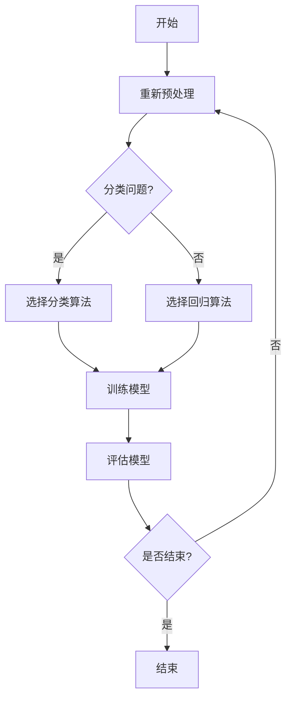

                 

# 《模式识别：自然特征的数学提取》

## 关键词
模式识别、特征提取、机器学习算法、神经网络、深度学习、自然特征、数学模型、应用案例、未来趋势

## 摘要
本文将深入探讨模式识别领域中的关键主题：自然特征的数学提取。首先，我们将回顾模式识别的基础知识，包括其定义、历史、应用领域和分类。接着，我们将详细讨论特征提取的重要性以及在不同领域（图像、声音、文本）中的方法。随后，本文将介绍常见的模式识别算法，包括机器学习方法和统计模式识别方法，并重点讨论神经网络与深度学习模型。我们还将探讨特征选择与降维技术，并展示模式识别在实际应用中的案例。最后，我们将分析模式识别中的挑战和未来趋势。

## 目录大纲

### 第一部分: 模式识别基础知识

#### 第1章: 模式识别概述
##### 1.1 模式识别的定义与历史
##### 1.2 模式识别的应用领域
##### 1.3 模式识别的分类
##### 1.4 模式识别的发展趋势

#### 第2章: 特征提取方法
##### 2.1 特征提取的重要性
##### 2.2 基于图像的特征提取
###### 2.2.1 颜色特征
###### 2.2.2 纹理特征
###### 2.2.3 形态学特征
##### 2.3 基于声音的特征提取
###### 2.3.1 频谱特征
###### 2.3.2 时域特征
###### 2.3.3 其他声音特征
##### 2.4 基于文本的特征提取
###### 2.4.1 词频统计
###### 2.4.2 主题模型
###### 2.4.3 其他文本特征

### 第二部分: 常见模式识别算法

#### 第3章: 机器学习方法
##### 3.1 机器学习基础
###### 3.1.1 监督学习
###### 3.1.2 无监督学习
###### 3.1.3 半监督学习
##### 3.2 常见机器学习算法
###### 3.2.1 k-近邻算法
###### 3.2.2 支持向量机
###### 3.2.3 决策树
###### 3.2.4 随机森林
###### 3.2.5 神经网络

#### 第4章: 统计模式识别方法
##### 4.1 统计模式识别基本概念
###### 4.1.1 聚类分析
###### 4.1.2 贝叶斯分类
##### 4.2 独立成分分析
###### 4.2.1 独立成分分析原理
###### 4.2.2 独立成分分析算法
##### 4.3 主成分分析
###### 4.3.1 主成分分析原理
###### 4.3.2 主成分分析算法

#### 第5章: 神经网络与深度学习
##### 5.1 神经网络基础
###### 5.1.1 神经元模型
###### 5.1.2 神经网络结构
###### 5.1.3 前向传播与反向传播
##### 5.2 深度学习模型
###### 5.2.1 卷积神经网络
###### 5.2.2 循环神经网络
###### 5.2.3 生成对抗网络

#### 第6章: 特征选择与降维技术
##### 6.1 特征选择方法
###### 6.1.1 递归特征消除
###### 6.1.2 基于过滤的方法
###### 6.1.3 基于包装的方法
##### 6.2 降维技术
###### 6.2.1 主成分分析
###### 6.2.2 独立成分分析

#### 第7章: 模式识别应用案例
##### 7.1 图像识别应用
###### 7.1.1 手写数字识别
###### 7.1.2 脸部识别
##### 7.2 声音识别应用
###### 7.2.1 语音识别
###### 7.2.2 音乐识别
##### 7.3 文本分类应用
###### 7.3.1 情感分析
###### 7.3.2 文本分类算法

#### 第8章: 模式识别中的挑战与未来趋势
##### 8.1 数据隐私保护
##### 8.2 算法可解释性
##### 8.3 跨模态识别
##### 8.4 未来趋势展望

### 第一部分: 模式识别基础知识

### 第1章: 模式识别概述

#### 1.1 模式识别的定义与历史

模式识别是一门研究如何通过计算机技术自动识别和理解外界信息模式的学科。其核心目标是使计算机能够识别出不同模式之间的差异，并对其进行分类、分析和解释。

模式识别的历史可以追溯到20世纪50年代，当时出现了基于规则的方法，如决策树和关联规则挖掘。随后，60年代出现了基于统计模式识别的方法，如线性判别分析和神经网络。到了70年代，出现了基于结构的方法，如模式匹配和模板匹配。80年代和90年代，机器学习技术的发展使得模式识别取得了显著的进步，特别是支持向量机、决策树和神经网络等算法的应用。进入21世纪，随着深度学习的兴起，模式识别领域迎来了新的发展机遇。

#### 1.2 模式识别的应用领域

模式识别在多个领域有着广泛的应用：

1. **图像识别**：如人脸识别、车辆识别、遥感图像分析等。
2. **声音识别**：如语音识别、音乐识别、语音合成等。
3. **文本分类**：如情感分析、文本聚类、关键词提取等。
4. **生物信息学**：如基因序列分析、蛋白质结构预测等。
5. **自然语言处理**：如机器翻译、语音识别、情感分析等。

#### 1.3 模式识别的分类

模式识别可以按照不同的分类标准进行划分：

1. **按处理数据类型**：
   - **数值型数据**：如传感器数据、气象数据等。
   - **文本数据**：如自然语言文本、社交媒体数据等。
   - **图像数据**：如图像、视频等。
   - **声音数据**：如音频、音乐等。

2. **按任务类型**：
   - **分类问题**：将数据分为不同的类别。
   - **回归问题**：预测连续值输出。
   - **聚类问题**：将数据分为若干个集群。

3. **按算法类型**：
   - **基于规则的方法**：如决策树、规则归纳等。
   - **基于统计的方法**：如线性判别分析、贝叶斯分类等。
   - **基于机器学习的方法**：如支持向量机、神经网络等。
   - **基于深度学习的方法**：如卷积神经网络、循环神经网络等。

#### 1.4 模式识别的发展趋势

随着人工智能和大数据技术的不断发展，模式识别领域也在不断进步：

1. **深度学习的兴起**：深度学习模型在图像识别、语音识别等领域取得了显著的成果，推动了模式识别技术的发展。
2. **跨模态识别**：跨模态识别是将不同模态的数据进行融合，如将图像和文本数据进行结合，以提高识别的准确性和鲁棒性。
3. **可解释性**：随着算法的复杂化，如何提高算法的可解释性成为一个重要研究方向，以帮助用户更好地理解模型的决策过程。
4. **实时性**：提高模式识别算法的实时性，使其能够快速处理大量数据，满足实时应用的需求。
5. **隐私保护**：在数据隐私日益受到关注的背景下，如何在确保用户隐私的前提下进行模式识别成为了一个挑战。

### 第2章: 特征提取方法

#### 2.1 特征提取的重要性

特征提取是模式识别中的一个关键步骤，其目的是将原始数据转换为一组有意义的特征，从而简化数据、降低数据维度，并提高识别准确率。有效的特征提取可以增强模型性能，降低计算复杂度，并减少数据噪声对识别结果的影响。

#### 2.2 基于图像的特征提取

在图像识别任务中，特征提取是识别成功的关键。以下是一些常用的图像特征提取方法：

1. **颜色特征**：颜色是图像中最直观的特征之一。常用的颜色特征包括颜色直方图、主成分分析（PCA）等。

2. **纹理特征**：纹理是图像中视觉上的规律性或重复性结构。常用的纹理特征包括灰度共生矩阵、Gabor滤波器等。

3. **形态学特征**：形态学特征是通过图像的膨胀、腐蚀、开运算和闭运算等操作得到的。常用的形态学特征包括边界、区域、形状等。

#### 2.3 基于声音的特征提取

在声音识别任务中，特征提取是提取声音信号中具有区分性的特征，以便于后续的识别和分类。以下是一些常用的声音特征提取方法：

1. **频谱特征**：频谱特征描述了声音信号的频率成分。常用的频谱特征包括梅尔频率倒谱系数（MFCC）、功率谱等。

2. **时域特征**：时域特征描述了声音信号的时域特性。常用的时域特征包括短时傅里叶变换（STFT）、过零率等。

3. **其他声音特征**：其他声音特征包括共振峰频率、基频、音高、音强等。

#### 2.4 基于文本的特征提取

在文本分类和情感分析等任务中，特征提取是将文本数据转换为一组数值表示，以便于后续的建模和分类。以下是一些常用的文本特征提取方法：

1. **词频统计**：词频统计是最简单的文本特征提取方法，通过计算文本中每个单词出现的次数来表示特征。

2. **主题模型**：主题模型是一种无监督学习方法，可以挖掘文本中的潜在主题，并将文本表示为多个主题的加权和。

3. **其他文本特征**：其他文本特征包括词嵌入、词性标注、句法结构等。

### 第二部分: 常见模式识别算法

#### 第3章: 机器学习方法

机器学习方法是基于数据和学习算法来构建模型，从而对未知数据进行预测和分类。以下是几种常见的机器学习方法：

##### 3.1.1 监督学习

监督学习是机器学习中的一种方法，其中模型通过学习已知的输入和输出数据对未知数据进行预测。监督学习可以分为以下几种类型：

1. **分类问题**：给定一组特征，将数据分为多个类别。
2. **回归问题**：给定一组特征，预测连续值输出。

常用的监督学习算法包括：

1. **k-近邻算法（k-Nearest Neighbors, KNN）**：基于距离最近的原则进行分类。
2. **支持向量机（Support Vector Machine, SVM）**：通过寻找最优超平面进行分类。
3. **决策树（Decision Tree）**：通过一系列决策规则进行分类。
4. **随机森林（Random Forest）**：通过多棵决策树的集成进行分类。

##### 3.1.2 无监督学习

无监督学习是机器学习中的另一种方法，其中模型仅根据输入数据来发现数据中的结构和模式，而不需要已知的输出标签。无监督学习可以分为以下几种类型：

1. **聚类问题**：将数据分为多个集群。
2. **降维问题**：减少数据维度，同时保持数据的内在结构。

常用的无监督学习算法包括：

1. **k-均值聚类（k-Means Clustering）**：通过迭代算法将数据分为多个集群。
2. **主成分分析（Principal Component Analysis, PCA）**：通过保留最重要的数据特征来降维。
3. **自编码器（Autoencoder）**：通过编码器和解码器来学习数据的低维表示。

##### 3.1.3 半监督学习

半监督学习是一种介于监督学习和无监督学习之间的方法，其中模型利用部分有标签数据和大量无标签数据来学习。这种方法可以有效地利用无标签数据，提高学习效果。

常用的半监督学习算法包括：

1. **标签传播（Label Propagation）**：通过迭代传播标签，将相似的数据点赋予相同的标签。
2. **图半监督学习（Graph-based Semi-supervised Learning）**：利用图结构来传播标签，提高学习效果。

##### 3.2 常见机器学习算法

以下是几种常见的机器学习算法，包括其原理、优缺点和应用场景：

1. **k-近邻算法（k-Nearest Neighbors, KNN）**

   - **原理**：根据新数据的k个最近邻的数据点的标签来预测新数据的标签。
   - **优点**：简单、易于实现。
   - **缺点**：对噪声敏感、计算复杂度高。
   - **应用场景**：图像识别、文本分类等。

2. **支持向量机（Support Vector Machine, SVM）**

   - **原理**：通过找到一个最优的超平面来最大化分类间隔。
   - **优点**：适用于高维空间、具有很好的分类性能。
   - **缺点**：对异常值敏感、计算复杂度高。
   - **应用场景**：图像分类、文本分类等。

3. **决策树（Decision Tree）**

   - **原理**：通过一系列决策规则来将数据分为不同的类别。
   - **优点**：易于理解、可解释性强。
   - **缺点**：容易过拟合、对噪声敏感。
   - **应用场景**：分类问题、回归问题等。

4. **随机森林（Random Forest）**

   - **原理**：通过构建多棵决策树的集成来进行分类。
   - **优点**：具有很好的分类性能、可解释性强、对噪声鲁棒。
   - **缺点**：计算复杂度高、对大规模数据集的性能下降。
   - **应用场景**：图像分类、文本分类等。

5. **神经网络（Neural Networks）**

   - **原理**：通过模拟人脑神经网络的结构和功能来进行分类和预测。
   - **优点**：适用于复杂非线性问题、具有很好的泛化能力。
   - **缺点**：需要大量数据、计算资源需求大、训练时间较长。
   - **应用场景**：图像识别、语音识别、自然语言处理等。

### 第4章: 统计模式识别方法

统计模式识别方法是基于概率统计理论来进行分类和预测的方法。以下介绍几种常用的统计模式识别方法：

##### 4.1.1 聚类分析

聚类分析是一种无监督学习方法，旨在将数据点划分为多个集群，使得同一集群内的数据点之间相似度较高，不同集群之间的数据点之间相似度较低。常用的聚类算法包括：

1. **k-均值聚类（k-Means Clustering）**：通过迭代算法将数据分为k个集群。
2. **层次聚类（Hierarchical Clustering）**：通过递归地合并或分裂集群来构建一个层次结构。
3. **基于密度的聚类（Density-Based Clustering）**：通过密度聚类方法来识别出密集区域并划分为多个集群。

##### 4.1.2 贝叶斯分类

贝叶斯分类是一种基于贝叶斯定理的分类方法。贝叶斯分类器通过计算每个类别的后验概率来预测新数据的标签。贝叶斯分类器可以分为以下几种类型：

1. **朴素贝叶斯分类器（Naive Bayes Classifier）**：假设特征之间相互独立。
2. **贝叶斯网络（Bayesian Networks）**：通过概率图模型来表示特征之间的关系。
3. **贝叶斯推理（Bayesian Inference）**：通过贝叶斯定理来计算后验概率。

##### 4.2 独立成分分析

独立成分分析（Independent Component Analysis, ICA）是一种无监督学习方法，旨在从混合信号中分离出独立的源信号。ICA的基本思想是最大化信号之间的独立性，即每个源信号与其他源信号之间没有相关性。

ICA算法可以分为以下几种类型：

1. **固定点迭代算法**：通过迭代优化目标函数来求解ICA问题。
2. **信息最大化算法**：通过最大化信号之间的信息熵来求解ICA问题。
3. **贪心算法**：通过逐个分离源信号来求解ICA问题。

##### 4.3 主成分分析

主成分分析（Principal Component Analysis, PCA）是一种常用的降维方法，旨在将高维数据映射到低维空间，同时保留数据的最大方差。PCA的基本思想是通过线性变换将数据投影到新的坐标轴上，这些坐标轴称为主成分轴。

PCA算法可以分为以下几种类型：

1. **协方差矩阵法**：通过计算协方差矩阵来求解主成分。
2. **特征值分解法**：通过特征值分解协方差矩阵来求解主成分。
3. **奇异值分解法**：通过奇异值分解协方差矩阵来求解主成分。

### 第5章: 神经网络与深度学习

神经网络（Neural Networks）是一种模拟人脑神经元之间交互作用的计算模型。深度学习（Deep Learning）是神经网络的一种扩展，其核心思想是使用多层神经网络来提取数据的特征表示。

##### 5.1.1 神经元模型

神经元模型是神经网络的基本组成单元，它通过接收输入信号并产生输出信号来实现信息处理。神经元模型通常包含以下几个组成部分：

1. **输入层**：接收外部输入信号。
2. **隐藏层**：通过非线性激活函数对输入信号进行变换。
3. **输出层**：产生最终输出信号。

神经元模型的输出通常由以下公式给出：

\[ z = \sum_{i=1}^{n} w_i x_i + b \]

其中，\( z \) 是输出，\( w_i \) 是权重，\( x_i \) 是输入，\( b \) 是偏置。

##### 5.1.2 神经网络结构

神经网络的结构可以分为以下几种类型：

1. **前馈神经网络**：数据从输入层依次传递到输出层，中间包含一个或多个隐藏层。
2. **循环神经网络**：在时间序列数据上，当前时刻的输出作为下一个时刻的输入。
3. **卷积神经网络**：通过卷积操作来提取图像的特征。
4. **生成对抗网络**：通过对抗训练来生成数据。

##### 5.1.3 前向传播与反向传播

前向传播和反向传播是神经网络训练的两个关键步骤：

1. **前向传播**：从输入层开始，依次计算每个神经元的输出，直到输出层。
2. **反向传播**：从输出层开始，计算每个神经元的误差，并更新权重和偏置。

前向传播和反向传播的伪代码如下：

```python
# 前向传播
for layer in layers:
    layer.forward()

# 反向传播
for layer in reversed(layers):
    layer.backward()
```

##### 5.2 深度学习模型

深度学习模型是神经网络的一种扩展，其核心思想是通过多层神经网络来提取数据的特征表示。以下介绍几种常用的深度学习模型：

1. **卷积神经网络（Convolutional Neural Networks, CNN）**：通过卷积操作来提取图像的特征，适用于图像识别、视频分析等领域。

2. **循环神经网络（Recurrent Neural Networks, RNN）**：通过循环结构来处理时间序列数据，适用于自然语言处理、语音识别等领域。

3. **生成对抗网络（Generative Adversarial Networks, GAN）**：通过对抗训练来生成数据，适用于图像生成、数据增强等领域。

### 第6章: 特征选择与降维技术

特征选择与降维技术是模式识别中的重要方法，旨在减少数据的维度，同时保留数据的原始信息。以下介绍几种常用的特征选择与降维技术：

##### 6.1 特征选择方法

特征选择是选择一组最有用的特征，以减少数据的维度并提高模型的性能。以下介绍几种常用的特征选择方法：

1. **递归特征消除（Recursive Feature Elimination, RFE）**：通过迭代地选择和删除特征，直到找到最优特征集合。

2. **基于过滤的方法（Filter Methods）**：通过对特征进行预处理来筛选出最有用的特征。例如，相关性分析和方差分析。

3. **基于包装的方法（Wrapper Methods）**：通过训练模型并评估特征集的性能来选择最优特征集合。例如，递归特征消除和遗传算法。

##### 6.2 降维技术

降维技术是通过减少数据的维度来提高计算效率和模型性能。以下介绍几种常用的降维技术：

1. **主成分分析（Principal Component Analysis, PCA）**：通过保留数据的最大方差来降维，适用于线性可分的数据。

2. **独立成分分析（Independent Component Analysis, ICA）**：通过最大化信号之间的独立性来降维，适用于非线性和非线性可分的数据。

### 第7章: 模式识别应用案例

模式识别技术在多个领域有着广泛的应用，以下介绍几个常见的应用案例：

##### 7.1 图像识别应用

1. **手写数字识别**：使用卷积神经网络对手写数字图像进行分类，常见的模型包括MNIST数据集。

2. **脸部识别**：使用深度学习模型对脸部图像进行识别，常见的模型包括Facenet和FaceNet。

##### 7.2 声音识别应用

1. **语音识别**：使用循环神经网络对语音信号进行识别，常见的模型包括CTC和WaveNet。

2. **音乐识别**：使用卷积神经网络对音乐信号进行分类，常见的模型包括Mel-Spectrogram和GRU。

##### 7.3 文本分类应用

1. **情感分析**：使用卷积神经网络或循环神经网络对文本进行情感分类，常见的模型包括TextCNN和LSTM。

2. **文本分类算法**：使用朴素贝叶斯或支持向量机等算法对文本进行分类，常见的模型包括TF-IDF和词袋模型。

### 第8章: 模式识别中的挑战与未来趋势

模式识别技术在快速发展的同时，也面临着一些挑战和未来的发展趋势：

##### 8.1 数据隐私保护

数据隐私保护是模式识别中的一个重要问题。随着数据量的不断增加，如何在保证用户隐私的前提下进行模式识别成为了一个挑战。未来的发展趋势包括差分隐私、联邦学习等。

##### 8.2 算法可解释性

算法可解释性是模式识别中的另一个重要问题。随着深度学习模型变得越来越复杂，如何解释模型的决策过程成为了一个挑战。未来的发展趋势包括可解释性模型、可视化技术等。

##### 8.3 跨模态识别

跨模态识别是将不同模态的数据进行融合，以提高识别的准确性和鲁棒性。未来的发展趋势包括多模态数据融合、跨模态交互等。

##### 8.4 未来趋势展望

未来的模式识别技术将朝着更加智能化、自动化和高效化的方向发展。以下是一些未来趋势的展望：

1. **深度学习的发展**：深度学习模型将越来越强大，应用于更多领域，如自然语言处理、计算机视觉等。

2. **联邦学习**：联邦学习将使得多个机构可以在不共享数据的情况下进行联合学习和推理。

3. **跨模态识别**：跨模态识别技术将得到进一步发展，将不同模态的数据进行融合，以实现更准确的识别和预测。

4. **可解释性**：可解释性技术将得到更多关注，以帮助用户更好地理解模型的决策过程。

### 作者信息

作者：AI天才研究院/AI Genius Institute & 禅与计算机程序设计艺术 /Zen And The Art of Computer Programming

本文由AI天才研究院（AI Genius Institute）和禅与计算机程序设计艺术（Zen And The Art of Computer Programming）联合撰写，旨在深入探讨模式识别领域中的关键主题：自然特征的数学提取。我们希望通过本文，读者能够对模式识别的基础知识、特征提取方法、常见模式识别算法、神经网络与深度学习、特征选择与降维技术、模式识别应用案例以及模式识别中的挑战和未来趋势有一个全面的了解。希望本文能为模式识别领域的学者、工程师和研究人员提供有价值的参考和启示。

---

### 附录

以下是本文中使用的数学公式和Mermaid流程图的代码示例：

#### 数学公式示例

- 段落内的公式：\[ z = \sum_{i=1}^{n} w_i x_i + b \]
- 独立段落的公式：$$ z = \sum_{i=1}^{n} w_i x_i + b $$

#### Mermaid流程图示例



通过这些示例，读者可以更好地理解和应用数学公式和流程图，以更清晰地表达技术概念和算法流程。

---

本文作为一篇技术博客文章，力求在深入浅出的同时，提供详细的技术讲解和实际应用案例。希望读者能够通过本文，对模式识别领域有一个更加全面和深入的认识，并在实践中运用所学知识，推动人工智能技术的发展。在未来的研究和应用中，我们期待更多的创新和突破，为人类的智能生活带来更多的便利和惊喜。感谢您的阅读，祝您在技术探索的道路上越走越远，不断突破自我，实现人生价值。再次感谢AI天才研究院和禅与计算机程序设计艺术的支持与指导，让我们共同进步，共创辉煌！

