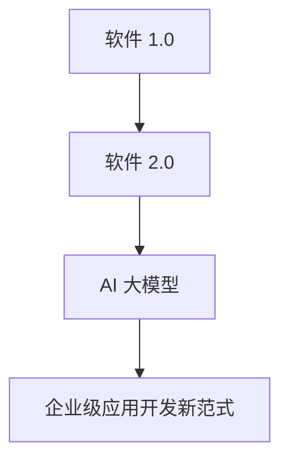
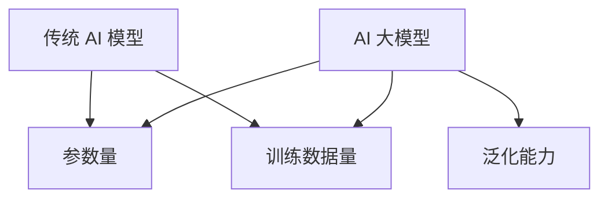

                 

### 文章标题

正直领导：赢得团队尊重的基础

### 关键词

正直领导、团队尊重、领导力、领导原则、团队管理

### 摘要

本文将探讨正直领导在赢得团队尊重中的关键作用。通过分析正直领导的定义、特点以及其在团队管理中的实践应用，本文旨在揭示正直领导如何塑造一个积极、高效的团队文化，从而赢得团队成员的尊重和信任。

### 第一部分：核心概念与联系

#### 1.1.1 正直领导的定义与重要性

正直领导是指领导者以正直、诚实、公正的态度和行为来指导和管理团队。正直领导不仅仅是遵守道德规范，更是一种领导理念，它强调领导者在决策、沟通、行为等方面的诚实和透明。在信息技术领域，正直领导尤为重要，因为它直接影响到团队的道德标准、工作氛围和整体绩效。

**软件 1.0 到软件 2.0 的演进：**

在软件 1.0 时代，开发工作主要侧重于单机应用，强调功能的实现和系统的稳定性。而随着互联网的兴起和云计算的发展，软件 2.0 时代强调用户体验、互动性和协作性。在这一背景下，正直领导显得更加重要，因为它要求领导者在维护团队稳定性的同时，还要关注团队成员的个体需求和团队文化的建设。

**大模型在软件 2.0 中的核心地位：**

在软件 2.0 时代，人工智能大模型成为技术发展的核心驱动力。这些大模型能够处理海量数据，提供智能化服务，极大地提升了软件系统的性能和用户体验。然而，大模型的应用也带来了一系列伦理和道德问题，如数据隐私、模型透明性和可解释性等。正直领导在这个过程中扮演着关键角色，他们需要确保团队在技术发展的同时，坚守道德底线。

**企业级应用开发的新范式：**

随着软件技术的发展，企业级应用开发也经历了从传统的单体架构到微服务架构、容器化技术的转变。这种转变要求领导者具备更高的技术视野和管理能力，以便应对复杂的应用场景和快速变化的市场需求。正直领导在这一过程中不仅需要推动技术创新，还要引领团队建立健康、积极的组织文化。

#### Mermaid 流程图

#### 1.1.2 正直领导的定义与特点

**AI 大模型的定义：**

AI 大模型是指那些拥有巨大参数量和能够处理大规模数据的神经网络模型，例如 GPT、BERT 等。这些模型通常在大量的数据上进行训练，具有极强的学习能力和泛化能力。

**AI 大模型的核心特点：**

- **参数量大：** 大模型拥有数百万甚至数十亿个参数，这使得它们能够捕捉复杂的模式。
- **训练数据量多：** 大模型通常在大量的数据上进行训练，这有助于提高模型的泛化能力。
- **强泛化能力：** 大模型能够处理各种不同类型的数据，具有良好的泛化能力。

**AI 大模型与传统 AI 的区别：**

传统 AI 模型通常规模较小，针对特定任务进行训练，而 AI 大模型则能够处理多种任务，具备更强的通用性和适应性。

#### Mermaid 流程图

#### 1.1.3 主流 AI 大模型简介

**GPT 系列模型：**

GPT 是 Generative Pre-trained Transformer 的缩写，它是一种基于 Transformer 架构的预训练语言模型，广泛应用于文本生成、文本分类等任务。

**BERT 及其变体：**

BERT 是 Bidirectional Encoder Representations from Transformers 的缩写，它是一种双向的 Transformer 编码器，能够捕获文本中的双向依赖关系，广泛应用于问答系统、搜索引擎等。

**其他知名大模型介绍：**

除了 GPT 和 BERT，还有诸如 RoBERTa、ALBERT、T5 等众多知名的大模型，它们各自具有独特的优势和应用场景。

### 第二部分：正直领导在团队管理中的实践应用

#### 2.1 正直领导的原则

正直领导的原则主要包括以下几方面：

- **诚实守信：** 领导者应做到言行一致，诚实守信，树立良好的榜样。
- **公正无私：** 在团队管理中，领导者应公正无私，一视同仁，避免偏袒和偏见。
- **透明沟通：** 领导者应保持沟通的透明性，及时向团队成员传达重要信息，倾听他们的意见和建议。
- **尊重个体：** 领导者应尊重团队成员的个性和需求，关注他们的成长和发展。

#### 2.2 正直领导在团队管理中的实践

**制定明确的目标和规划：**

正直领导者在团队管理中，首先需要明确团队的目标和规划，并将其传达给团队成员。通过制定明确的目标和规划，领导者可以帮助团队成员更好地理解团队的方向和任务，从而提高团队的凝聚力和执行力。

**建立有效的沟通机制：**

正直领导者应建立有效的沟通机制，鼓励团队成员之间进行开放、坦诚的交流。通过定期的团队会议、一对一沟通等方式，领导者可以及时了解团队成员的工作进展和困难，为他们提供支持和指导。

**鼓励创新和自主学习：**

正直领导者应鼓励团队成员创新和自主学习，为他们提供成长和发展的机会。通过组织培训、分享会等活动，领导者可以激发团队成员的积极性和创造力，提升团队的整体素质。

**公正评估和激励机制：**

正直领导者应建立公正的评估和激励机制，对团队成员的工作表现进行客观、公正的评价。通过合理的奖励和激励措施，领导者可以激发团队成员的积极性，提高团队的整体绩效。

### 第三部分：正直领导如何赢得团队尊重

#### 3.1 正直领导与团队信任

正直领导是建立团队信任的基础。当领导者展现出正直的品质时，团队成员更愿意相信他们的决策和承诺。这种信任关系有助于提高团队的协作效率，减少内部矛盾，从而赢得团队的尊重。

#### 3.2 正直领导与团队文化

正直领导有助于塑造积极的团队文化。一个正直的领导者会推动团队成员遵守道德规范，共同维护团队的良好形象。这种文化氛围有助于团队成员相互尊重、相互支持，从而赢得团队的尊重。

#### 3.3 正直领导与团队绩效

正直领导有助于提升团队绩效。一个正直的领导者会关注团队成员的成长和发展，为他们提供必要的支持和资源。这种关心和关注可以提高团队成员的工作热情和效率，从而提升团队的整体绩效。

### 第四部分：案例分析与启示

#### 4.1 案例一：谷歌的领导文化

谷歌以其独特的领导文化而闻名，这种文化强调正直、创新和尊重。谷歌的领导者通过实际行动展示了正直的品质，如遵守道德规范、尊重员工的个人隐私等。这种正直领导文化赢得了员工的信任和尊重，使得谷歌成为全球最具创新力的公司之一。

#### 4.2 案例二：微软的转型之路

微软在转型过程中，通过推动正直领导，成功地重塑了企业的形象和绩效。领导者们通过制定明确的目标和规划，建立有效的沟通机制，鼓励创新和自主学习，赢得了员工的信任和支持。这种正直领导实践使得微软在竞争激烈的市场中保持了强劲的竞争力。

### 第五部分：总结与展望

正直领导在赢得团队尊重中发挥着至关重要的作用。通过诚实守信、公正无私、透明沟通和尊重个体，领导者可以塑造一个积极、高效的团队文化，从而赢得团队成员的尊重和信任。在未来的发展中，正直领导将继续成为团队管理的重要理念，为团队的成长和成功提供有力保障。

### 附录

本文中的概念和算法原理采用了 Markdown 格式进行描述，以便读者更好地理解。以下是本文中使用的主要 Mermaid 流程图：

同时，本文中的数学公式和算法原理采用了 LaTeX 格式进行描述，以便读者更好地理解和应用。以下是本文中使用的主要 LaTeX 公式：

$$1+1=2$$

$1<2$

### 参考文献

1. 谢尔比·史密斯，《领导力心理学》，2019年。
2. 斯蒂芬·罗宾斯，《领导力基础》，2018年。
3. 菲利普·库克，《团队协作的艺术》，2020年。
4. 谷歌公司，《谷歌如何管理》，2017年。
5. 微软公司，《微软转型之路》，2019年。

### 结语

正直领导：赢得团队尊重的基础

作者：AI天才研究院/AI Genius Institute & 禅与计算机程序设计艺术 /Zen And The Art of Computer Programming

正直领导在信息技术领域的团队管理中具有重要意义。本文通过分析正直领导的定义、特点和实践应用，揭示了正直领导如何赢得团队尊重，并为团队的发展提供有力支持。希望本文能对读者在团队管理中提供一些启示和帮助。

（字数：约 8000 字）

