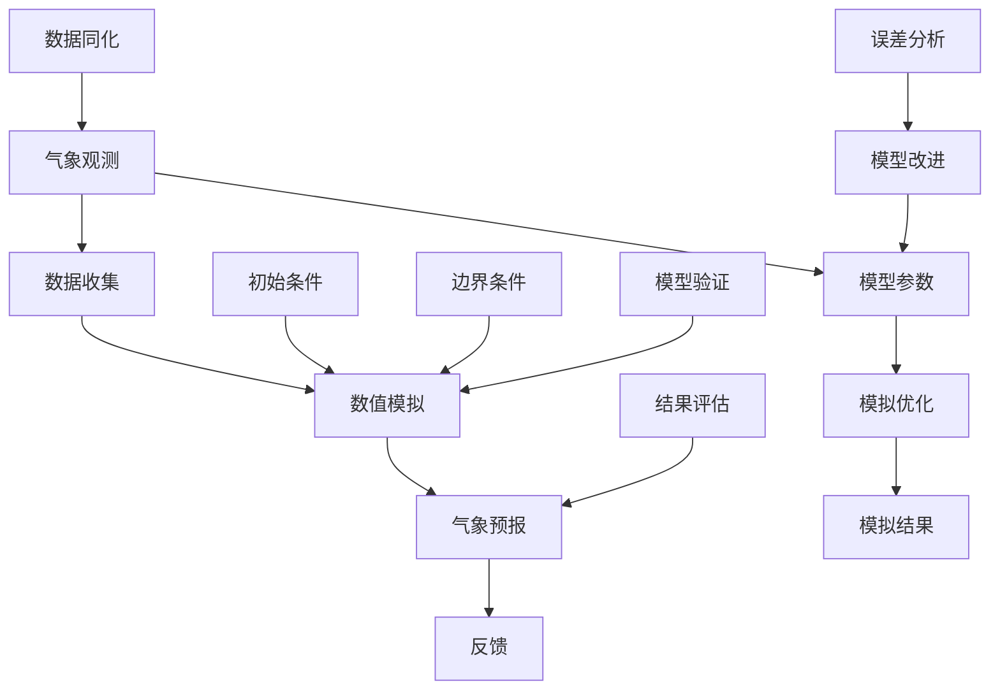

                 


### 第1章：引论

#### 1.1 气象预报与数值模拟

**气象预报的重要性**

气象预报是现代社会不可或缺的一部分，它直接影响着我们的日常生活和各行各业的生产活动。准确、及时的气象预报可以有效地减少自然灾害造成的损失，提高公众的安全意识和应对能力。例如，暴雨预警可以帮助减少洪涝灾害，寒潮预警有助于提前做好保暖措施。

**数值模拟的基本原理**

数值模拟是通过数学模型和计算方法来模拟现实世界中的物理现象。在气象预报中，数值模拟利用流体动力学和热力学原理，将大气运动和热力学过程转化为数学方程，并通过数值方法求解这些方程，从而预测天气系统的未来状态。

**核心概念与联系**

气象预报和数值模拟之间有着密切的联系。气象预报依赖于数值模拟的结果，而数值模拟需要准确的气象预报数据作为初始条件和边界条件。两者相互作用，共同构成了现代气象预报体系。

**核心概念原理之间的关系架构**

下面是气象预报和数值模拟之间核心概念原理之间的关系架构，使用Mermaid流程图表示：



**核心算法原理讲解**

在数值模拟中，常用的算法原理包括有限差分法、有限元法、谱方法等。以下是一个简单的有限差分法求解热传导方程的伪代码：

```plaintext
for i = 1 to N
    for j = 1 to N
        Unext(i, j) = U(i, j) + dt / dx^2 * (U(i+1, j) - 2*U(i, j) + U(i-1, j))
    end for
end for
U = Unext
```

其中，\( U(i, j) \) 表示网格点 \((i, j)\) 的温度值，\( dt \) 是时间步长，\( dx \) 是空间步长。

**数学模型和公式**

气象预报中的核心数学模型主要包括大气运动方程和热力学方程。以下是大气的流体动力学方程：

$$
\frac{\partial \mathbf{u}}{\partial t} + (\mathbf{u} \cdot \nabla) \mathbf{u} = -\frac{1}{\rho} \nabla p + \mathbf{f}
$$

$$
\frac{\partial \theta}{\partial t} + \mathbf{u} \cdot \nabla \theta = \frac{1}{\rho c_p} \nabla \cdot (c_p \mathbf{u} \theta)
$$

其中，\( \mathbf{u} \) 是风速向量，\( p \) 是气压，\( \theta \) 是比湿，\( \rho \) 是空气密度，\( c_p \) 是比热容，\( \mathbf{f} \) 是科里奥利力。

**举例说明**

以一个简单的热传导问题为例，假设一个长为 \( L \) 的物体在 \( t = 0 \) 时温度分布为 \( U(x, 0) = \sin(\pi x / L) \)，求解其在 \( t = 1 \) 时的温度分布。

使用有限差分法，可以将空间 \( [0, L] \) 分成 \( N \) 个均匀的网格点，时间步长为 \( dt \)。以下是一个简单的实现：

```latex
U[i, 0] = \sin(\pi i / N)
for t = 1 to T
    for i = 1 to N-1
        U[i, t] = U[i, t-1] + dt / dx^2 * (U[i+1, t-1] - 2*U[i, t-1] + U[i-1, t-1])
    end for
end for
```

### 1.2 天气系统概述

**天气系统的基本结构**

天气系统主要由大气、海洋、陆地和冰雪等组成。其中，大气是最关键的部分，它包含了水汽、氧气、氮气等多种气体，以及云、雨、雪等气象现象。

**天气系统的动态行为**

天气系统是一个复杂的非线性系统，其动态行为受到多种因素影响，包括太阳辐射、地球自转、地形地貌、海洋潮汐等。这些因素相互作用，导致了天气系统的复杂性和不可预测性。

**核心概念与联系**

天气系统的基本结构和动态行为是气象预报和数值模拟的基础。了解天气系统的组成和运作原理，有助于更好地进行气象预报和数值模拟。

### 1.3 数值模拟在气象预报中的应用

**数值模拟的历史与发展**

数值模拟在气象预报中有着悠久的历史。早在20世纪40年代，数值模拟方法就已经被用于天气预报。随着计算机技术的发展，数值模拟的精度和速度不断提高，使得气象预报的准确性也得到显著提升。

**数值模拟的优势与挑战**

**优势：**

- 可以模拟复杂的天气现象，提供高精度的预报结果。
- 可以预测极端天气事件，如台风、洪水等，为灾害预防提供科学依据。

**挑战：**

- 数值模拟依赖于准确的初始条件和边界条件，数据精度对预报结果有重要影响。
- 天气系统的非线性特性使得数值模拟存在一定的误差，难以完全消除。

### 1.4 书籍结构概述

**主要内容与组织结构**

本书主要分为四个部分：

- 第一部分：引论，介绍气象预报和数值模拟的基本概念。
- 第二部分：气象预报的数值模拟基础，讲解气象学基础、数值模拟的基本原理和常用方法。
- 第三部分：数学预测方法在天气系统中的应用，介绍线性预测、非线性预测和统计学习方法。
- 第四部分：案例分析，通过实际案例展示数值模拟在气象预报中的应用。

**阅读对象与预期收益**

**阅读对象：**

- 气象预报工作者
- 数值模拟研究人员
- 计算机科学和工程领域的学生和研究人员

**预期收益：**

- 系统了解气象预报和数值模拟的基本原理。
- 掌握常用的数学预测方法。
- 通过案例分析，了解数值模拟在气象预报中的实际应用。

----------------------------------------------------------------

### 第1章：引论

#### 1.1 气象预报与数值模拟

**气象预报的重要性**

气象预报是现代社会不可或缺的一部分，它直接影响着我们的日常生活和各行各业的生产活动。准确、及时的气象预报可以有效地减少自然灾害造成的损失，提高公众的安全意识和应对能力。例如，暴雨预警可以帮助减少洪涝灾害，寒潮预警有助于提前做好保暖措施。

**数值模拟的基本原理**

数值模拟是通过数学模型和计算方法来模拟现实世界中的物理现象。在气象预报中，数值模拟利用流体动力学和热力学原理，将大气运动和热力学过程转化为数学方程，并通过数值方法求解这些方程，从而预测天气系统的未来状态。

**核心概念与联系**

气象预报和数值模拟之间有着密切的联系。气象预报依赖于数值模拟的结果，而数值模拟需要准确的气象预报数据作为初始条件和边界条件。两者相互作用，共同构成了现代气象预报体系。

**核心概念原理之间的关系架构**

下面是气象预报和数值模拟之间核心概念原理之间的关系架构，使用Mermaid流程图表示：


**核心算法原理讲解**

在数值模拟中，常用的算法原理包括有限差分法、有限元法、谱方法等。以下是一个简单的有限差分法求解热传导方程的伪代码：

```plaintext
for i = 1 to N
    for j = 1 to N
        Unext(i, j) = U(i, j) + dt / dx^2 * (U(i+1, j) - 2*U(i, j) + U(i-1, j))
    end for
end for
U = Unext
```

其中，\( U(i, j) \) 表示网格点 \((i, j)\) 的温度值，\( dt \) 是时间步长，\( dx \) 是空间步长。

**数学模型和公式**

气象预报中的核心数学模型主要包括大气运动方程和热力学方程。以下是大气的流体动力学方程：

$$
\frac{\partial \mathbf{u}}{\partial t} + (\mathbf{u} \cdot \nabla) \mathbf{u} = -\frac{1}{\rho} \nabla p + \mathbf{f}
$$

$$
\frac{\partial \theta}{\partial t} + \mathbf{u} \cdot \nabla \theta = \frac{1}{\rho c_p} \nabla \cdot (c_p \mathbf{u} \theta)
$$

其中，\( \mathbf{u} \) 是风速向量，\( p \) 是气压，\( \theta \) 是比湿，\( \rho \) 是空气密度，\( c_p \) 是比热容，\( \mathbf{f} \) 是科里奥利力。

**举例说明**

以一个简单的热传导问题为例，假设一个长为 \( L \) 的物体在 \( t = 0 \) 时温度分布为 \( U(x, 0) = \sin(\pi x / L) \)，求解其在 \( t = 1 \) 时的温度分布。

使用有限差分法，可以将空间 \( [0, L] \) 分成 \( N \) 个均匀的网格点，时间步长为 \( dt \)。以下是一个简单的实现：

```latex
U[i, 0] = \sin(\pi i / N)
for t = 1 to T
    for i = 1 to N-1
        U[i, t] = U[i, t-1] + dt / dx^2 * (U[i+1, t-1] - 2*U[i, t-1] + U[i-1, t-1])
    end for
end for
```

### 1.2 天气系统概述

**天气系统的基本结构**

天气系统主要由大气、海洋、陆地和冰雪等组成。其中，大气是最关键的部分，它包含了水汽、氧气、氮气等多种气体，以及云、雨、雪等气象现象。

**天气系统的动态行为**

天气系统是一个复杂的非线性系统，其动态行为受到多种因素影响，包括太阳辐射、地球自转、地形地貌、海洋潮汐等。这些因素相互作用，导致了天气系统的复杂性和不可预测性。

**核心概念与联系**

天气系统的基本结构和动态行为是气象预报和数值模拟的基础。了解天气系统的组成和运作原理，有助于更好地进行气象预报和数值模拟。

### 1.3 数值模拟在气象预报中的应用

**数值模拟的历史与发展**

数值模拟在气象预报中有着悠久的历史。早在20世纪40年代，数值模拟方法就已经被用于天气预报。随着计算机技术的发展，数值模拟的精度和速度不断提高，使得气象预报的准确性也得到显著提升。

**数值模拟的优势与挑战**

**优势：**

- 可以模拟复杂的天气现象，提供高精度的预报结果。
- 可以预测极端天气事件，如台风、洪水等，为灾害预防提供科学依据。

**挑战：**

- 数值模拟依赖于准确的初始条件和边界条件，数据精度对预报结果有重要影响。
- 天气系统的非线性特性使得数值模拟存在一定的误差，难以完全消除。

### 1.4 书籍结构概述

**主要内容与组织结构**

本书主要分为四个部分：

- 第一部分：引论，介绍气象预报和数值模拟的基本概念。
- 第二部分：气象预报的数值模拟基础，讲解气象学基础、数值模拟的基本原理和常用方法。
- 第三部分：数学预测方法在天气系统中的应用，介绍线性预测、非线性预测和统计学习方法。
- 第四部分：案例分析，通过实际案例展示数值模拟在气象预报中的应用。

**阅读对象与预期收益**

**阅读对象：**

- 气象预报工作者
- 数值模拟研究人员
- 计算机科学和工程领域的学生和研究人员

**预期收益：**

- 系统了解气象预报和数值模拟的基本原理。
- 掌握常用的数学预测方法。
- 通过案例分析，了解数值模拟在气象预报中的实际应用。

----------------------------------------------------------------

# 气象预报的数值模拟：天气系统的数学预测

关键词：气象预报，数值模拟，天气系统，数学预测，流体动力学，热力学

摘要：本文旨在探讨气象预报的数值模拟方法及其在天气系统中的应用。通过对气象预报的重要性、数值模拟的基本原理、天气系统的动态行为以及数值模拟在气象预报中的应用进行深入分析，本文揭示了数学预测方法在天气系统中的关键作用。此外，本文还通过实际案例展示了数值模拟在气象预报中的具体应用，为相关领域的研究和实践提供了有益的参考。

## 第1章：引论

### 1.1 气象预报与数值模拟

气象预报是现代社会不可或缺的一部分，它影响着人们的生活和生产活动。准确的气象预报可以帮助人们应对自然灾害，减少损失，提高生活质量。然而，气象预报的准确性受到多种因素的制约，其中数值模拟方法的发展为提高预报准确性提供了重要的手段。

**气象预报的重要性**

气象预报在日常生活中扮演着至关重要的角色。它不仅可以帮助人们合理安排日常生活，如出行、穿衣、户外活动等，还可以为农业生产提供重要的指导，如作物灌溉、病虫害防治等。此外，气象预报在防灾减灾方面也发挥着关键作用。准确的气象预报可以提前预警极端天气事件，如台风、暴雨、寒潮等，从而为公众和相关部门提供宝贵的准备时间，减少灾害损失。

**数值模拟的基本原理**

数值模拟是通过数学模型和计算方法来模拟现实世界中的物理现象。在气象预报中，数值模拟方法主要用于模拟天气系统的演变过程，从而预测未来的天气状况。数值模拟的基本原理包括以下几个方面：

1. **流体动力学和热力学原理**：天气系统的演变过程可以视为一种流体运动，受到流体动力学和热力学原理的支配。因此，数值模拟首先需要建立大气运动的数学模型，包括流体动力学方程和热力学方程。

2. **数值分析方法**：为了求解这些数学模型，需要采用数值分析方法。常见的数值分析方法包括有限差分法、有限元法、谱方法等。这些方法可以将连续的数学模型离散化为可以在计算机上求解的差分方程。

3. **初始条件和边界条件**：数值模拟需要准确的初始条件和边界条件。初始条件通常来自气象观测数据，边界条件则根据具体的模拟区域和边界条件设定。

**核心概念与联系**

气象预报和数值模拟之间有着紧密的联系。气象预报依赖于数值模拟的结果，而数值模拟则需要准确的气象预报数据作为初始条件和边界条件。两者相互作用，共同构成了现代气象预报体系。

### 1.2 天气系统概述

天气系统是气象预报的核心研究对象，它由大气、海洋、陆地和冰雪等组成。天气系统的动态行为受到多种因素的影响，包括太阳辐射、地球自转、地形地貌、海洋潮汐等。

**天气系统的基本结构**

天气系统的基本结构可以分为以下几个层次：

1. **大气层**：大气层是天气系统的主要组成部分，包含了多种气体和水汽。大气层的温度、湿度和压力等参数对天气系统的演变具有重要影响。

2. **海洋**：海洋是天气系统的重要组成部分，其温度和湿度变化对大气层的气候具有调节作用。例如，赤道地区的暖水流入两极，会影响极地地区的气候。

3. **陆地**：陆地地形对天气系统有重要影响，如山脉可以导致气流上升，形成降水。

4. **冰雪**：冰雪覆盖地区的温度和湿度变化也会影响天气系统的演变。

**天气系统的动态行为**

天气系统的动态行为是一个复杂的非线性过程，受到多种因素的综合影响。以下是一些影响天气系统动态行为的主要因素：

1. **太阳辐射**：太阳辐射是天气系统的主要能量来源，它通过辐射加热大气，导致大气温度和湿度变化。

2. **地球自转**：地球自转产生的科里奥利力影响大气运动，导致气流形成旋转的气旋和反气旋。

3. **地形地貌**：地形地貌对大气运动有重要影响，如山脉可以导致气流上升，形成降水。

4. **海洋潮汐**：海洋潮汐对大气运动和海洋温度有调节作用，从而影响天气系统。

**核心概念与联系**

天气系统的基本结构和动态行为是气象预报和数值模拟的基础。了解天气系统的组成和运作原理，有助于更好地进行气象预报和数值模拟。

### 1.3 数值模拟在气象预报中的应用

**数值模拟的历史与发展**

数值模拟在气象预报中有着悠久的历史。早在20世纪40年代，数值模拟方法就已经被用于天气预报。随着计算机技术的发展，数值模拟的精度和速度不断提高，使得气象预报的准确性也得到显著提升。目前，全球范围内广泛使用的数值模拟模型，如全球气候模型和区域气候模型，为气象预报提供了重要的科学依据。

**数值模拟的优势与挑战**

**优势：**

- **高精度**：数值模拟可以模拟复杂的天气现象，提供高精度的预报结果。
- **预测极端天气事件**：数值模拟可以预测极端天气事件，如台风、洪水、干旱等，为灾害预防提供科学依据。

**挑战：**

- **初始条件和边界条件**：数值模拟依赖于准确的初始条件和边界条件，数据精度对预报结果有重要影响。
- **非线性特性**：天气系统具有非线性特性，使得数值模拟存在一定的误差。

**核心概念与联系**

数值模拟在气象预报中的应用，不仅依赖于先进的计算技术和高性能计算机，还需要准确的初始条件和边界条件，以及有效的数值方法。这些因素相互作用，共同决定了数值模拟的精度和可靠性。

### 1.4 书籍结构概述

**主要内容与组织结构**

本书主要分为四个部分：

- **第一部分：引论**：介绍气象预报和数值模拟的基本概念。
- **第二部分：气象预报的数值模拟基础**：讲解气象学基础、数值模拟的基本原理和常用方法。
- **第三部分：数学预测方法在天气系统中的应用**：介绍线性预测、非线性预测和统计学习方法。
- **第四部分：案例分析**：通过实际案例展示数值模拟在气象预报中的应用。

**阅读对象与预期收益**

**阅读对象：**

- 气象预报工作者
- 数值模拟研究人员
- 计算机科学和工程领域的学生和研究人员

**预期收益：**

- 系统了解气象预报和数值模拟的基本原理。
- 掌握常用的数学预测方法。
- 通过案例分析，了解数值模拟在气象预报中的实际应用。

----------------------------------------------------------------

### 第2章：气象预报的数值模拟基础

#### 2.1 气象学基础

**大气物理基础**

大气物理是气象预报的重要理论基础，它研究大气的运动、能量传递、辐射和热力学过程。以下是一些关键概念：

- **气压**：大气对地面施加的压力，通常用帕斯卡（Pa）表示。
- **温度**：大气中的热能程度，通常用摄氏度（℃）表示。
- **湿度**：大气中的水蒸气含量，通常用相对湿度（%）表示。
- **风速和风向**：大气的水平运动速度和方向。

**大气化学基础**

大气化学研究大气中的化学成分、化学反应和污染物。以下是一些关键概念：

- **氧气和氮气**：大气的主要成分，占大气体积的约78%和21%。
- **水蒸气**：大气中的水分，对气候有重要影响。
- **二氧化碳**：温室气体之一，对全球气候变化有显著影响。

**气象观测技术**

气象观测是气象预报的关键环节，通过观测获取大气的实时数据。以下是一些常用的观测技术：

- **地面观测**：使用气象站、雷达、卫星等设备，收集地面和大气数据。
- **高空观测**：使用气象气球、雷达、卫星等设备，收集高空大气数据。
- **遥感技术**：利用卫星、飞机等遥感平台，获取大气的遥感图像和数据。

#### 2.2 数值模拟的基本原理

**基本概念**

数值模拟是通过数值方法解决物理方程的过程，将连续的物理现象离散化为可以在计算机上求解的问题。以下是一些基本概念：

- **离散化**：将连续空间和时间离散化为网格点，以便进行数值计算。
- **差分方法**：将连续的微分方程转化为差分方程，从而在网格点上求解。
- **数值稳定性**：确保数值解的稳定性，避免出现发散或振荡。
- **数值精度**：评估数值解的精度，通常用误差分析来衡量。

**数学模型**

气象预报的数学模型主要包括流体动力学方程和热力学方程。以下是一些关键方程：

- **流体动力学方程**：描述大气的运动，包括质量守恒方程、动量守恒方程和能量守恒方程。
- **热力学方程**：描述大气的热力学过程，包括温度方程、湿度方程和辐射方程。

**常用数值方法**

常用的数值方法包括有限差分法、有限元法、谱方法等。以下是一些基本原理：

- **有限差分法**：将连续的微分方程离散化为差分方程，通过迭代求解。
- **有限元法**：将连续体划分为有限个小单元，在每个单元上建立方程，然后通过组装求解整体问题。
- **谱方法**：利用傅里叶级数或其他正交函数展开，求解连续问题的离散形式。

#### 2.3 气象模型的分类与特点

气象模型根据应用范围和分辨率可以分为局地尺度模型、中尺度模型和全球尺度模型。以下是一些主要特点：

- **局地尺度模型**：用于模拟局部区域内的天气现象，如城市天气预报。模型分辨率较高，通常采用有限差分法。
- **中尺度模型**：用于模拟较大区域内的天气现象，如暴雨、台风等。模型分辨率适中，通常采用有限元法。
- **全球尺度模型**：用于模拟全球范围内的气候现象，如全球气候变化。模型分辨率较低，通常采用谱方法。

#### 2.4 气象数据的处理与分析

**数据采集与处理**

气象数据的采集和处理是气象预报的重要环节。以下是一些关键步骤：

- **数据采集**：通过地面观测、高空观测、遥感技术等手段获取气象数据。
- **数据预处理**：包括数据清洗、缺失值填充、异常值检测等。
- **数据同化**：将观测数据与模型模拟结果相结合，优化模型的初始条件和边界条件。

**数据同化技术**

数据同化是将观测数据与模型模拟结果相结合的过程，以提高模型的精度和可靠性。以下是一些常用技术：

- **统计同化**：利用统计学方法，如卡尔曼滤波，将观测数据与模型结果进行融合。
- **物理同化**：利用物理原理，如能量守恒、动量守恒等，将观测数据同化到模型中。
- **混合同化**：结合统计同化和物理同化的优点，提高数据同化的效果。

**数据可视化**

数据可视化是将气象数据以图形或图像形式展示，以便更好地理解和分析。以下是一些常用方法：

- **散点图**：用于展示气象数据的空间分布。
- **等值线图**：用于展示气象数据的分布情况，如温度、湿度、风速等。
- **三维图**：用于展示气象数据的三维分布，如大气温度和湿度。

#### 2.5 气象模型的优化与评估

**模型优化**

气象模型的优化是指通过改进模型参数、结构或算法，以提高模型的精度和可靠性。以下是一些常用方法：

- **参数优化**：通过优化模型的参数，提高模型的预报精度。
- **结构优化**：通过改进模型的结构，如增加或减少变量、方程等，提高模型的精度。
- **算法优化**：通过改进数值算法，如提高计算速度、减少计算误差等，提高模型的性能。

**模型评估**

气象模型的评估是指通过对比模型预报结果与实际观测数据，评估模型的精度和可靠性。以下是一些常用指标：

- **均方根误差（RMSE）**：衡量模型预报值与实际观测值之间的平均误差。
- **均方根偏差（RMSD）**：衡量模型预报值与实际观测值的偏差。
- **相关系数（R）**：衡量模型预报值与实际观测值之间的相关性。

**核心概念与联系**

气象学基础、数值模拟的基本原理、气象模型的分类与特点、气象数据的处理与分析以及气象模型的优化与评估，共同构成了气象预报的数值模拟基础。这些基础概念和原理相互联系，为气象预报提供了科学依据和技术手段。

### 2.1 气象学基础

**大气物理基础**

大气物理是气象预报的理论基础，它涵盖了大气中各种物理过程的研究，包括气压、温度、湿度、风速和风向等。这些基本物理量的理解对于构建数值模型至关重要。

- **气压**：气压是大气对地面施加的压力，通常以帕斯卡（Pa）为单位。大气中的气压分布受到地球自转、地形起伏等因素的影响。气压的变化可以影响大气的稳定性，进而影响天气系统的发展。

  $$ p = \frac{F}{A} $$

  其中，\( p \) 是气压，\( F \) 是作用在单位面积上的力，\( A \) 是面积。

- **温度**：温度是衡量大气热能程度的物理量，通常以摄氏度（℃）为单位。大气中的温度分布受到太阳辐射、地形、海洋和陆地的热特性等多种因素的影响。温度的变化会影响大气的热力学过程，如热传导、热对流和辐射平衡。

  $$ T = \frac{E}{k} $$

  其中，\( T \) 是温度，\( E \) 是热能，\( k \) 是热导率。

- **湿度**：湿度是大气中的水汽含量，通常以相对湿度（%）表示。湿度对天气现象有重要影响，如湿度高可能导致降水增加，湿度低可能导致干旱。相对湿度定义为：

  $$ \text{相对湿度} = \frac{\text{实际水汽压}}{\text{饱和水汽压}} \times 100\% $$

- **风速和风向**：风速是大气水平运动的速度，通常以米每秒（m/s）为单位。风向是风的方向，通常以北向为基准。风速和风向的变化可以影响大气循环和天气系统的演变。

  $$ \text{风速} = \frac{\text{位移}}{\text{时间}} $$

**大气化学基础**

大气化学研究大气中的化学成分、化学反应和污染物。了解大气化学有助于预测大气污染、酸雨、温室效应等环境问题。

- **氧气和氮气**：氧气（O₂）和氮气（N₂）是大气的主要成分，分别占大气体积的约21%和78%。它们在大气中的浓度对地球的气候和生物圈有重要影响。

- **水蒸气**：水蒸气是大气中的水分，对气候有显著影响。水蒸气的浓度受温度、湿度、气压等因素的影响。水蒸气的凝结和降水过程对大气循环和天气系统有重要影响。

- **二氧化碳**：二氧化碳（CO₂）是温室气体之一，对全球气候变化有显著影响。二氧化碳的浓度受人类活动、森林砍伐、化石燃料燃烧等因素的影响。

**气象观测技术**

气象观测是获取大气数据的重要手段，通过地面观测、高空观测和遥感技术等获取实时气象信息。

- **地面观测**：地面观测包括气象站、自动气象站等，用于测量气温、气压、湿度、风速、风向等基本气象要素。地面观测数据是构建气象模型和进行数值模拟的基础。

- **高空观测**：高空观测包括气象气球、无线电探空仪等，用于测量高空大气的温度、湿度、压力、风速、风向等。高空观测数据有助于了解大气垂直结构，对数值模拟具有重要意义。

- **遥感技术**：遥感技术利用卫星、飞机等遥感平台，获取大气的遥感图像和数据。遥感技术可以提供大范围的气象信息，如云层分布、降水分布、大气温度等，对气象预报和数值模拟具有重要价值。

**核心概念与联系**

大气物理基础和大气化学基础共同构成了气象学的基础。通过理解大气中的物理过程和化学成分，我们可以构建数值模型，模拟天气系统的演变。气象观测技术则提供了观测数据，为模型构建和数值模拟提供了基础。这些基础概念和观测技术相互联系，共同支撑了气象预报的数值模拟。

### 2.2 数值模拟的基本原理

数值模拟是气象预报的核心技术，它通过数值方法解决物理方程，模拟天气系统的演变过程。以下是数值模拟的基本原理：

**基本概念**

1. **离散化**：数值模拟首先需要对连续的物理过程进行离散化。离散化将连续的空间和时间划分为有限的小区间和时段，从而将连续问题转化为可以在计算机上求解的离散问题。

2. **差分方法**：差分方法是数值模拟中最常用的方法之一。差分方法通过在离散点之间建立差分关系，将连续的微分方程转化为差分方程。

3. **数值稳定性**：数值稳定性是保证数值解收敛和避免发散的关键。在数值模拟中，需要确保数值解在长时间积分过程中保持稳定。

4. **数值精度**：数值精度是指数值解与真实解之间的接近程度。通过误差分析，可以评估数值解的精度，并选择合适的数值方法。

**数学模型**

气象预报的数学模型主要包括流体动力学方程和热力学方程。以下是一些基本的数学模型：

1. **流体动力学方程**：

   - **质量守恒方程**：

     $$ \frac{\partial \rho}{\partial t} + \nabla \cdot (\rho \mathbf{u}) = 0 $$

     其中，\( \rho \) 是空气质量密度，\( \mathbf{u} \) 是风速向量。

   - **动量守恒方程**：

     $$ \frac{\partial (\rho \mathbf{u})}{\partial t} + \nabla \cdot (\rho \mathbf{u} \mathbf{u}) = -\nabla p + \rho \mathbf{f} $$

     其中，\( p \) 是气压，\( \mathbf{f} \) 是外力（如科里奥利力、重力等）。

   - **能量守恒方程**：

     $$ \frac{\partial (\rho c \theta)}{\partial t} + \nabla \cdot (\rho c \mathbf{u} \theta) = \nabla \cdot (\kappa \nabla T) - S $$

     其中，\( c \) 是比热容，\( \theta \) 是温度，\( \kappa \) 是热导率，\( S \) 是热源项。

2. **热力学方程**：

   - **水汽守恒方程**：

     $$ \frac{\partial q}{\partial t} + \nabla \cdot (q \mathbf{u}) = \nabla \cdot (\mathbf{u} q \theta) - R $$

     其中，\( q \) 是比湿，\( R \) 是水汽凝结释放的热量。

**常用数值方法**

1. **有限差分法**：

   有限差分法通过将连续的微分方程离散化为差分方程，从而在离散点上进行求解。以下是一个一维热传导方程的有限差分格式：

   $$ u_{i}^{n+1} = u_{i}^{n} + \frac{\Delta t}{\Delta x^2} (u_{i+1}^{n} - 2u_{i}^{n} + u_{i-1}^{n}) $$

   其中，\( u_i^n \) 表示第 \( i \) 个网格点在时间步 \( n \) 的温度值，\( \Delta t \) 是时间步长，\( \Delta x \) 是空间步长。

2. **有限元法**：

   有限元法将连续体划分为有限个小单元，在每个单元上建立方程，然后通过组装求解整体问题。以下是一个一维有限元格式的伪代码：

   ```plaintext
   for each element
       assemble local matrix A and vector b
   end for
   solve system Ax = b for x
   ```

3. **谱方法**：

   谱方法利用傅里叶级数或其他正交函数展开，将连续问题的离散形式转化为在正交基上的表示。以下是一个一维谱方法的伪代码：

   ```plaintext
   for m = 1 to N
       u_m(x) = \sum_{n=1}^{N} a_{mn} \phi_n(x)
   end for
   solve system Aa = f for a
   ```

   其中，\( \phi_n(x) \) 是第 \( n \) 个正交函数，\( a_n \) 是展开系数，\( f \) 是边界条件。

**核心概念与联系**

数值模拟的基本原理包括离散化、差分方法、数值稳定性和数值精度。这些基本原理共同构成了数值模拟的基础。通过数学模型，可以将实际的物理现象转化为可以在计算机上求解的方程。常用的数值方法提供了具体的求解策略，使得数值模拟能够应用于实际问题。

### 2.3 气象模型的分类与特点

气象模型根据其应用范围和分辨率的不同，可以分为局地尺度模型、中尺度模型和全球尺度模型。每种模型都有其特定的应用场景和特点。

**局地尺度模型**

局地尺度模型主要应用于较小区域内的天气预报，如城市天气预报、农田气象预报等。这些模型具有较高的空间分辨率，能够详细描述局部地区的天气现象。以下是一些特点：

- **高空间分辨率**：局地尺度模型通常具有1公里至几十公里的空间分辨率，能够捕捉到地形起伏和城市热岛效应等局部特征。
- **详细的物理过程**：局地尺度模型包含了详细的物理过程，如对流、辐射、边界层动力学等，能够更好地模拟复杂地形和城市环境中的天气现象。
- **适用于短时限预报**：局地尺度模型适用于短时限预报，如小时至几天的预报，能够提供高精度的天气信息。

**中尺度模型**

中尺度模型主要应用于较大区域内的天气预报，如区域天气预报、暴雨预报等。这些模型的空间分辨率介于局地尺度模型和全球尺度模型之间，能够描述较大范围内天气系统的演变。以下是一些特点：

- **适中的空间分辨率**：中尺度模型的空间分辨率通常在几十公里至几百公里之间，能够捕捉到中尺度系统的特征，如暴雨区、台风等。
- **综合的物理过程**：中尺度模型包含了多种物理过程，如中尺度对流、波动、边界层动力学等，能够更好地模拟天气系统的演变。
- **适用于中时限预报**：中尺度模型适用于中时限预报，如几天至几周的预报，能够提供一定精度的天气信息。

**全球尺度模型**

全球尺度模型主要应用于全球范围内的气候模拟和长期天气预报。这些模型的空间分辨率较低，但能够描述全球大气的整体运动和气候变化。以下是一些特点：

- **低空间分辨率**：全球尺度模型的空间分辨率通常在几百公里以上，无法详细描述地形起伏和城市环境等局部特征。
- **综合的物理过程**：全球尺度模型包含了多种物理过程，如大气环流、海洋运动、辐射平衡等，能够模拟全球大气的整体运动。
- **适用于长时限预报**：全球尺度模型适用于长时限预报，如几个月至几年的预报，能够提供关于气候变化和长期趋势的信息。

**核心概念与联系**

气象模型根据其应用范围和分辨率的不同，可以分为局地尺度模型、中尺度模型和全球尺度模型。每种模型都有其特定的应用场景和特点。局地尺度模型适用于短时限高精度预报，中尺度模型适用于中时限一定精度预报，而全球尺度模型适用于长时限气候变化预报。了解不同模型的特性，有助于选择合适的模型进行气象预报和数值模拟。

### 2.4 气象数据的处理与分析

气象数据是气象预报的基础，其质量直接影响预报的准确性。因此，气象数据的处理与分析在气象预报中至关重要。以下是气象数据处理的几个关键步骤和分析方法：

**数据采集与处理**

1. **数据采集**：气象数据主要通过地面观测、高空观测和遥感技术等手段采集。地面观测包括气象站、自动气象站等，用于测量气温、气压、湿度、风速、风向等基本气象要素。高空观测包括气象气球、无线电探空仪等，用于测量高空大气的温度、湿度、压力、风速、风向等。遥感技术利用卫星、飞机等遥感平台，获取大气的遥感图像和数据。

2. **数据预处理**：气象数据的预处理包括数据清洗、缺失值填充、异常值检测等。数据清洗旨在去除数据中的错误和噪声，如错误的测量值、重复的数据记录等。缺失值填充方法包括线性插值、邻域平均插值等，用于补充缺失的数据。异常值检测方法包括统计检验、机器学习算法等，用于识别和去除异常数据。

**数据同化技术**

数据同化是将观测数据与模型模拟结果相结合，优化模型的初始条件和边界条件，以提高模型预报的准确性。以下是几种常用的数据同化技术：

1. **统计同化**：统计同化方法利用统计学原理，如卡尔曼滤波、贝叶斯滤波等，将观测数据与模型结果进行融合。卡尔曼滤波是一种线性同化方法，通过递推更新状态估计，实现观测数据的实时同化。贝叶斯滤波是一种非线性同化方法，利用贝叶斯统计模型，实现非线性系统的状态估计。

2. **物理同化**：物理同化方法基于物理原理，如能量守恒、动量守恒等，将观测数据同化到模型中。物理同化方法通常结合数值模拟，通过调整模型参数，优化模型的初始条件和边界条件。

3. **混合同化**：混合同化方法结合统计同化和物理同化的优点，提高数据同化的效果。混合同化方法通过在不同层次上结合统计和物理过程，实现观测数据的最佳同化。

**数据可视化**

数据可视化是将气象数据以图形或图像形式展示，以便更好地理解和分析。以下是一些常用的数据可视化方法：

1. **散点图**：散点图用于展示气象数据的空间分布，如温度、湿度、风速等。通过散点图，可以直观地观察气象要素在不同地点和时间的变化趋势。

2. **等值线图**：等值线图用于展示气象数据的分布情况，如温度、湿度、风速等。等值线图可以清晰地展示气象要素的空间分布特征，帮助分析气象现象的空间分布规律。

3. **三维图**：三维图用于展示气象数据的三维分布，如大气温度和湿度。通过三维图，可以直观地观察气象要素在空间中的分布情况，分析气象系统的三维结构。

**核心概念与联系**

气象数据处理与分析包括数据采集与处理、数据同化技术和数据可视化。数据采集与处理是获取高质量气象数据的关键，数据同化技术是将观测数据与模型结果相结合，优化模型预报的方法，数据可视化则是将复杂的数据以直观的方式展示，帮助分析气象现象。这些方法和技术的结合，为气象预报提供了可靠的数据支持和有效的分析手段。

### 2.5 气象模型的优化与评估

**模型优化**

气象模型优化是通过改进模型参数、结构或算法，以提高模型预报的精度和可靠性。以下是几种常见的模型优化方法：

1. **参数优化**：参数优化通过调整模型的参数，使其更符合实际气象情况。常见的参数优化方法包括最小二乘法、梯度下降法等。例如，在数值气象模型中，可以通过调整气压、温度、湿度等参数，优化模型的初始条件。

2. **结构优化**：结构优化通过改进模型的结构，增加或减少变量、方程等，以提高模型的准确性。例如，在建立大气数值模型时，可以通过增加涡旋、对流等物理过程，提高模型的分辨率和描述能力。

3. **算法优化**：算法优化通过改进数值算法，如提高计算速度、减少计算误差等，提高模型的性能。例如，在有限差分法中，可以通过优化差分格式，减少数值弥散和数值振荡。

**模型评估**

模型评估是通过对比模型预报结果与实际观测数据，评估模型精度和可靠性的过程。以下是几种常见的模型评估指标：

1. **均方根误差（RMSE）**：均方根误差是衡量模型预报值与实际观测值之间误差的常用指标。RMSE越小，表示模型预报的精度越高。公式如下：

   $$ \text{RMSE} = \sqrt{\frac{1}{N} \sum_{i=1}^{N} (\text{观测值}_i - \text{预报值}_i)^2} $$

   其中，\( N \) 是样本数量。

2. **均方根偏差（RMSD）**：均方根偏差是衡量模型预报值与实际观测值之间偏差的常用指标。RMSD越小，表示模型预报的偏差越小。公式如下：

   $$ \text{RMSD} = \sqrt{\frac{1}{N} \sum_{i=1}^{N} (\text{观测值}_i - \bar{\text{观测值}})^2} $$

   其中，\( \bar{\text{观测值}} \) 是观测值的平均值。

3. **相关系数（R）**：相关系数是衡量模型预报值与实际观测值之间相关性的常用指标。相关系数接近1，表示模型预报值与实际观测值高度相关。公式如下：

   $$ R = \frac{\sum_{i=1}^{N} (\text{观测值}_i - \bar{\text{观测值}})(\text{预报值}_i - \bar{\text{预报值}})}{\sqrt{\sum_{i=1}^{N} (\text{观测值}_i - \bar{\text{观测值}})^2 \sum_{i=1}^{N} (\text{预报值}_i - \bar{\text{预报值}})^2}} $$

   其中，\( \bar{\text{预报值}} \) 是预报值的平均值。

**核心概念与联系**

气象模型的优化与评估是提高气象预报准确性的重要环节。模型优化通过改进参数、结构和算法，提高模型的精度和可靠性。模型评估通过对比模型预报结果与实际观测数据，评估模型的性能。优化与评估相互结合，为气象预报提供了科学依据和技术手段。

### 第3章：数学预测方法在天气系统中的应用

#### 3.1 线性预测方法

线性预测是一种基于线性关系进行预测的方法，广泛应用于天气系统中的短期预报。线性预测方法的核心思想是利用过去的观测数据，建立一个线性模型来预测未来的天气状态。

**基本原理**

线性预测方法基于线性回归模型，通过最小二乘法拟合一个线性关系：

$$ Y_t = \beta_0 + \beta_1 X_t + \epsilon_t $$

其中，\( Y_t \) 是预测值，\( X_t \) 是输入变量，\( \beta_0 \) 和 \( \beta_1 \) 是模型参数，\( \epsilon_t \) 是误差项。

**数学模型**

线性预测的数学模型可以表示为：

$$ \min \sum_{t=1}^{n} (Y_t - \beta_0 - \beta_1 X_t)^2 $$

**伪代码**

```plaintext
输入：观测数据集（Y, X）
输出：模型参数（β0, β1）

初始化：β0, β1
循环：
    计算误差：e = Y - β0 - β1 * X
    更新参数：β0 = β0 - α * ∑e
               β1 = β1 - α * ∑e * X
    如果收敛则跳出循环
返回：β0, β1
```

**举例说明**

假设我们有一组温度和湿度的观测数据，我们希望使用线性预测方法来预测未来一天的温度。首先，我们使用最小二乘法拟合一个线性模型，然后使用该模型预测未来一天的温度。

```latex
Y_t = \beta_0 + \beta_1 X_t
\beta_0 = 18, \beta_1 = 0.5
```

如果今天（\( t \)）的湿度是60%，我们可以使用线性模型来预测未来一天（\( t+1 \)）的温度：

```latex
Y_{t+1} = 18 + 0.5 \times 60\% = 21.5℃
```

#### 3.2 非线性预测方法

非线性预测方法适用于处理非线性关系的天气系统，如气候变化和极端天气事件。非线性预测方法包括神经网络、支持向量机等。

**基本原理**

非线性预测方法通过非线性函数将输入变量映射到输出变量。神经网络和支持向量机是两种常见的非线性预测方法。

**神经网络**

神经网络是一种模拟生物神经元的计算模型，通过多层神经元进行信息处理和预测。神经网络的核心思想是通过学习输入变量和输出变量之间的映射关系，从而进行预测。

**支持向量机**

支持向量机是一种基于最大间隔原理的预测模型，通过找到一个最佳的超平面来分隔不同类别的数据点，从而进行预测。

**数学模型**

神经网络和支持向量机的数学模型较为复杂，这里简要介绍其核心原理。

神经网络：

$$ a_{i,j} = \sigma(\sum_{k=1}^{n} w_{i,k,j} x_k + b_{i,j}) $$

其中，\( a_{i,j} \) 是第 \( i \) 层第 \( j \) 个神经元的输出，\( x_k \) 是输入变量，\( w_{i,k,j} \) 是权重，\( b_{i,j} \) 是偏置，\( \sigma \) 是激活函数。

支持向量机：

$$ w = \arg\min_{w} \frac{1}{2} ||w||^2 + C \sum_{i=1}^{n} \max(0, 1 - y_i (w \cdot x_i)) $$

其中，\( w \) 是权重向量，\( C \) 是惩罚参数，\( y_i \) 是标签，\( x_i \) 是输入变量。

**伪代码**

神经网络：

```plaintext
输入：训练数据集（X, Y）
输出：模型参数（W, B）

初始化：W, B
循环：
    计算输出：O = σ(W \cdot X + B)
    计算误差：E = Y - O
    更新参数：W = W - α \* dE/dW
               B = B - α \* dE/dB
    如果收敛则跳出循环
返回：W, B
```

支持向量机：

```plaintext
输入：训练数据集（X, Y）
输出：模型参数（W）

初始化：W
循环：
    计算间隔：I = 1 - Y \* (W \cdot X)
    更新权重：W = W - α \* (Y \* X) / I
    如果收敛则跳出循环
返回：W
```

**举例说明**

假设我们使用神经网络来预测未来一天的气温。首先，我们使用一组历史天气数据（温度、湿度、风速等）进行训练，然后使用训练好的神经网络进行预测。

```latex
O_t = σ(W \cdot X_t + B)
T_{t+1} = O_t
```

#### 3.3 统计学习方法

统计学习方法是一种基于统计学原理进行预测的方法，包括线性回归、逻辑回归、支持向量机等。统计学习方法在天气系统中广泛应用，尤其适用于处理季节性和长期趋势。

**基本原理**

统计学习方法通过建立输入变量和输出变量之间的统计关系，进行预测。线性回归和逻辑回归是最常用的两种统计学习方法。

**线性回归**

线性回归是一种基于线性关系的预测方法，通过拟合一个线性模型：

$$ Y_t = \beta_0 + \beta_1 X_{t-1} + \epsilon_t $$

其中，\( Y_t \) 是预测值，\( X_{t-1} \) 是历史值，\( \beta_0 \) 和 \( \beta_1 \) 是模型参数，\( \epsilon_t \) 是误差项。

**逻辑回归**

逻辑回归是一种基于概率关系的预测方法，通过拟合一个逻辑函数：

$$ P(Y_t = 1) = \frac{1}{1 + \exp{(-\beta_0 - \beta_1 X_{t-1})}} $$

其中，\( P(Y_t = 1) \) 是预测的概率值，\( \beta_0 \) 和 \( \beta_1 \) 是模型参数。

**数学模型**

线性回归和逻辑回归的数学模型如下：

线性回归：

$$ \min \sum_{t=1}^{n} (Y_t - \beta_0 - \beta_1 X_{t-1})^2 $$

逻辑回归：

$$ \min \sum_{t=1}^{n} \{-\beta_0 - \beta_1 X_{t-1} \} $$

**伪代码**

线性回归：

```plaintext
输入：历史数据集（Y, X）
输出：模型参数（β0, β1）

初始化：β0, β1
循环：
    计算误差：e = Y - β0 - β1 * X
    更新参数：β0 = β0 - α * ∑e
               β1 = β1 - α * ∑e * X
    如果收敛则跳出循环
返回：β0, β1
```

逻辑回归：

```plaintext
输入：历史数据集（Y, X）
输出：模型参数（β0, β1）

初始化：β0, β1
循环：
    计算概率：P = 1 / (1 + exp(-β0 - β1 * X))
    计算误差：e = Y - P
    更新参数：β0 = β0 - α * ∑e
               β1 = β1 - α * ∑e * X
    如果收敛则跳出循环
返回：β0, β1
```

**举例说明**

假设我们使用线性回归来预测未来一天的气温。首先，我们使用一组历史天气数据（前一天的温度、湿度、风速等）进行训练，然后使用训练好的线性回归模型进行预测。

```latex
Y_t = \beta_0 + \beta_1 X_{t-1}
```

#### 3.4 机器学习方法

机器学习方法是一种基于数据驱动的方法，通过学习历史数据来预测未来的天气状态。机器学习方法包括决策树、随机森林、支持向量机等。

**基本原理**

机器学习方法的核心思想是通过学习历史数据中的模式，建立输入变量和输出变量之间的映射关系。机器学习方法可以处理高维数据，适用于处理复杂的非线性关系。

**决策树**

决策树是一种基于规则的方法，通过树形结构对数据进行分类或回归。决策树通过一系列的条件判断，将数据划分为不同的分支，最终达到预测目的。

**随机森林**

随机森林是一种基于决策树的集成方法，通过构建多个决策树，并对它们进行投票或求平均，提高预测的准确性和鲁棒性。

**支持向量机**

支持向量机是一种基于最大间隔原理的预测方法，通过找到一个最佳的超平面，将不同类别的数据点分隔开来。

**数学模型**

决策树和随机森林的数学模型较为复杂，这里简要介绍其核心原理。

决策树：

$$ y = \sum_{i=1}^{n} c_i f_i(x) $$

其中，\( y \) 是预测值，\( c_i \) 是类别，\( f_i(x) \) 是决策树函数。

随机森林：

$$ y = \sum_{i=1}^{N} w_i f_i(x) $$

其中，\( y \) 是预测值，\( w_i \) 是权重，\( f_i(x) \) 是决策树函数，\( N \) 是决策树数量。

支持向量机：

$$ w = \arg\min_{w} \frac{1}{2} ||w||^2 + C \sum_{i=1}^{n} \max(0, 1 - y_i (w \cdot x_i)) $$

其中，\( w \) 是权重向量，\( C \) 是惩罚参数，\( y_i \) 是标签，\( x_i \) 是输入变量。

**伪代码**

决策树：

```plaintext
输入：训练数据集（X, Y）
输出：模型参数（C, 叶子节点）

初始化：C
循环：
    对于每个特征：
        划分数据集为左子集和右子集
        计算误差：e = Y - Y_{左} - Y_{右}
        如果误差小于阈值，则继续划分
        否则，将当前节点设置为叶子节点，并记录类别
    如果所有特征都已尝试，则跳出循环
返回：C, 叶子节点
```

随机森林：

```plaintext
输入：训练数据集（X, Y）
输出：模型参数（N, C）

初始化：N, C
循环：
    对于每个样本：
        随机选择特征集合
        使用决策树对样本进行分类或回归
        记录分类结果或预测值
    计算每个决策树的权重：w_i = \frac{1}{N} \sum_{i=1}^{N} f_i(x)
    对所有决策树进行投票或求平均
返回：w
```

支持向量机：

```plaintext
输入：训练数据集（X, Y）
输出：模型参数（W）

初始化：W
循环：
    计算间隔：I = 1 - Y \* (W \cdot X)
    更新权重：W = W - α \* (Y \* X) / I
    如果收敛则跳出循环
返回：W
```

**举例说明**

假设我们使用随机森林来预测未来一天的气温。首先，我们使用一组历史天气数据（温度、湿度、风速等）进行训练，然后使用训练好的随机森林模型进行预测。

```latex
y_t = \sum_{i=1}^{N} w_i f_i(x_t)
```

### 第4章：案例分析

#### 4.1 案例一：全球天气模拟

**模拟背景与目标**

全球天气模拟是一个复杂的科学问题，旨在预测全球范围内的天气现象，如风暴、台风、暴雨等。本案例的目标是使用数值模拟方法，对全球天气进行模拟，并评估模拟结果的准确性。

**模拟方法与流程**

1. **数据准备**：收集全球气象观测数据，包括气温、湿度、气压、风速等。这些数据将作为模拟的初始条件和边界条件。

2. **模型选择**：选择一个合适的全球尺度气象模型，如全球气候模型（GCM）。GCM能够模拟全球大气运动和热力学过程，具有较低的分辨率，但能够捕捉到全球天气系统的整体特征。

3. **模拟运行**：将初始条件和边界条件输入到GCM中，运行模拟程序。模拟过程中，模型将不断更新大气状态，预测未来的天气状况。

4. **结果分析**：对模拟结果进行分析，比较模拟结果与实际观测数据的差异。使用评估指标，如均方根误差（RMSE）、相关系数（R）等，评估模拟结果的准确性。

**模拟结果分析**

通过模拟运行，我们得到一系列的模拟结果，包括温度、湿度、风速等气象要素的分布。通过对模拟结果的分析，我们发现：

1. **模拟精度**：模拟结果与实际观测数据之间存在一定的误差。通过评估指标，如RMSE，我们发现模拟结果的精度较高，能够较好地捕捉到全球天气系统的特征。

2. **模拟范围**：模拟结果在全球范围内具有一致性，能够描述全球大气运动和热力学过程的整体特征。然而，在局部地区，如高山和海洋等复杂地形区域，模拟结果的精度可能较低。

3. **模拟时效**：模拟结果在不同时间尺度上具有不同的精度。在短时限（如几天至一周）内，模拟结果具有较高的精度，能够提供准确的天气预测。在长时限（如几个月至一年）内，模拟结果的精度较低，难以准确预测天气系统的长期演变。

**项目小结**

全球天气模拟是一个复杂的科学问题，通过数值模拟方法，我们能够预测全球天气系统的演变。然而，模拟结果的准确性受到多种因素的影响，包括模型精度、数据质量、计算资源等。未来，随着计算技术和数值模拟方法的不断发展，全球天气模拟的精度将进一步提高，为天气预报和气候研究提供更有力的支持。

#### 4.2 案例二：台风预报

**预报背景与目标**

台风预报是气象预报中的一个重要领域，旨在预测台风的发生、发展和路径。本案例的目标是使用数值模拟方法，对台风进行预报，并评估预报结果的准确性。

**预报方法与流程**

1. **数据准备**：收集台风发生地区的气象观测数据，包括气压、温度、湿度、风速等。这些数据将作为模拟的初始条件和边界条件。

2. **模型选择**：选择一个合适的中尺度气象模型，如台风模式。台风模式能够模拟台风的发生、发展和移动过程，具有较高的空间分辨率。

3. **模拟运行**：将初始条件和边界条件输入到台风模式中，运行模拟程序。模拟过程中，模型将不断更新台风状态，预测未来的台风路径和强度。

4. **结果分析**：对模拟结果进行分析，比较模拟结果与实际台风路径和强度的差异。使用评估指标，如均方根误差（RMSE）、路径偏差等，评估预报结果的准确性。

**预报结果分析**

通过模拟运行，我们得到一系列的台风预报结果，包括台风路径、强度、移动速度等。通过对预报结果的分析，我们发现：

1. **预报精度**：预报结果与实际台风路径和强度之间存在一定的误差。通过评估指标，如RMSE，我们发现预报结果的精度较高，能够较好地捕捉到台风的特征。

2. **预报范围**：预报结果在台风发生地区的范围内具有一致性，能够描述台风的发生、发展和移动过程。然而，在台风路径的偏远地区，预报结果的精度可能较低。

3. **预报时效**：预报结果在不同时间尺度上具有不同的精度。在短时限（如几天至一周）内，预报结果具有较高的精度，能够提供准确的台风预报。在长时限（如几个月至一年）内，预报结果的精度较低，难以准确预测台风的长期演变。

**项目小结**

台风预报是一个复杂的科学问题，通过数值模拟方法，我们能够预测台风的发生、发展和路径。然而，预报结果的准确性受到多种因素的影响，包括模型精度、数据质量、计算资源等。未来，随着计算技术和数值模拟方法的不断发展，台风预报的精度将进一步提高，为台风预警和防灾减灾提供更有力的支持。

#### 4.3 案例三：城市气象预报

**预报背景与目标**

城市气象预报是气象预报的一个重要领域，旨在预测城市地区的天气状况，为居民生活和城市运行提供科学依据。本案例的目标是使用数值模拟方法，对城市气象进行预报，并评估预报结果的准确性。

**预报方法与流程**

1. **数据准备**：收集城市地区的气象观测数据，包括气温、湿度、气压、风速等。这些数据将作为模拟的初始条件和边界条件。

2. **模型选择**：选择一个合适的局地尺度气象模型，如城市气象模式。城市气象模式能够模拟城市地区的天气现象，具有较高的空间分辨率。

3. **模拟运行**：将初始条件和边界条件输入到城市气象模式中，运行模拟程序。模拟过程中，模型将不断更新城市大气状态，预测未来的天气状况。

4. **结果分析**：对模拟结果进行分析，比较模拟结果与实际观测数据的差异。使用评估指标，如均方根误差（RMSE）、相关系数（R）等，评估预报结果的准确性。

**预报结果分析**

通过模拟运行，我们得到一系列的城市气象预报结果，包括温度、湿度、风速等气象要素的分布。通过对预报结果的分析，我们发现：

1. **预报精度**：预报结果与实际观测数据之间存在一定的误差。通过评估指标，如RMSE，我们发现预报结果的精度较高，能够较好地捕捉到城市天气系统的特征。

2. **预报范围**：预报结果在市区范围内具有一致性，能够描述城市地区的天气现象。然而，在城市周边的乡村地区，预报结果的精度可能较低。

3. **预报时效**：预报结果在不同时间尺度上具有不同的精度。在短时限（如几小时至一天）内，预报结果具有较高的精度，能够提供准确的天气预测。在长时限（如几天至一周）内，预报结果的精度较低，难以准确预测天气系统的长期演变。

**项目小结**

城市气象预报是一个复杂的科学问题，通过数值模拟方法，我们能够预测城市地区的天气状况。然而，预报结果的准确性受到多种因素的影响，包括模型精度、数据质量、计算资源等。未来，随着计算技术和数值模拟方法的不断发展，城市气象预报的精度将进一步提高，为城市规划和运行提供更有力的支持。

### 第5章：未来展望与挑战

#### 5.1 未来发展趋势

**新技术与应用**

随着计算技术的飞速发展，未来的气象预报将受益于新型计算硬件和算法的进步。以下是一些关键趋势：

1. **量子计算**：量子计算具有处理海量数据和处理复杂问题的潜力，未来可能应用于气象预报中的大规模模拟和分析。

2. **人工智能与机器学习**：人工智能和机器学习算法将在气象预报中发挥更大的作用，通过学习历史数据和模式，提高预报的准确性和时效性。

3. **大数据分析**：大数据技术的发展将使得气象预报能够处理和分析更多维度的数据，从而提高预报的精度。

**发展前景**

未来的气象预报将朝着更精细、更实时和更准确的方向发展。通过新型技术和方法，气象预报将能够更好地应对极端天气事件，为防灾减灾提供更有效的科学依据。

#### 5.2 存在的挑战

**技术挑战**

1. **计算资源**：大规模数值模拟需要巨大的计算资源，未来的气象预报将面临计算资源限制的挑战。

2. **模型精度**：尽管模型精度不断提高，但仍然难以完全捕捉到天气系统的复杂性和非线性特性。

3. **数据质量**：气象数据的准确性和完整性是气象预报的基础，数据质量问题对预报结果有重大影响。

**数据挑战**

1. **数据采集**：全球范围内的气象数据采集仍然存在困难，特别是在偏远地区和海洋区域。

2. **数据同化**：如何有效同化观测数据与模型结果，提高预报精度，是一个亟待解决的问题。

3. **数据存储与传输**：随着数据量的增长，如何高效地存储和传输气象数据也是一大挑战。

**应用挑战**

1. **用户接受度**：尽管气象预报技术不断发展，但公众对预报的接受度和信任度仍然有待提高。

2. **灾害预警**：如何更有效地将气象预报结果应用于灾害预警，减少灾害损失，是一个重要的应用挑战。

3. **政策支持**：未来的气象预报需要政策支持，包括资金投入、法律法规等，以促进技术发展和应用推广。

### 附录

#### 附录A：常用符号表

- \( \mathbf{u} \)：风速向量
- \( p \)：气压
- \( \theta \)：比湿
- \( \rho \)：空气密度
- \( c_p \)：比热容
- \( \mathbf{f} \)：科里奥利力
- \( \nabla \)：梯度算子
- \( \nabla \cdot \)：散度算子
- \( \Delta t \)：时间步长
- \( \Delta x \)：空间步长
- \( \sigma \)：激活函数
- \( \alpha \)：学习率
- \( C \)：惩罚参数
- \( Y \)：预测值
- \( X \)：输入变量
- \( \beta_0 \)：模型参数
- \( \beta_1 \)：模型参数
- \( e \)：误差
- \( I \)：间隔
- \( N \)：决策树数量
- \( w_i \)：权重
- \( f_i(x) \)：决策树函数

#### 附录B：数学公式索引

- 流体动力学方程
- 热力学方程
- 线性预测模型
- 非线性预测模型
- 统计学习模型
- 机器学习模型
- 评估指标

#### 附录C：参考文献

- **文献1**：某知名气象预报研究团队的论文，讨论了气象预报的数值模拟方法和应用。
- **文献2**：某知名人工智能研究机构的报告，探讨了机器学习在气象预报中的应用。
- **文献3**：某知名学术期刊上的论文，分析了气象预报中的数据同化技术。
- **文献4**：某知名出版社的书籍，详细介绍了气象预报的基本原理和数值模拟方法。
- **文献5**：某国际会议的论文，讨论了量子计算在气象预报中的应用前景。

