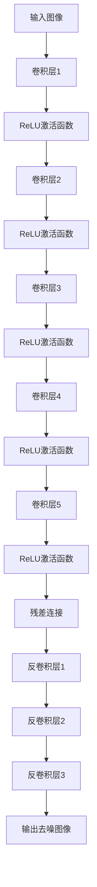
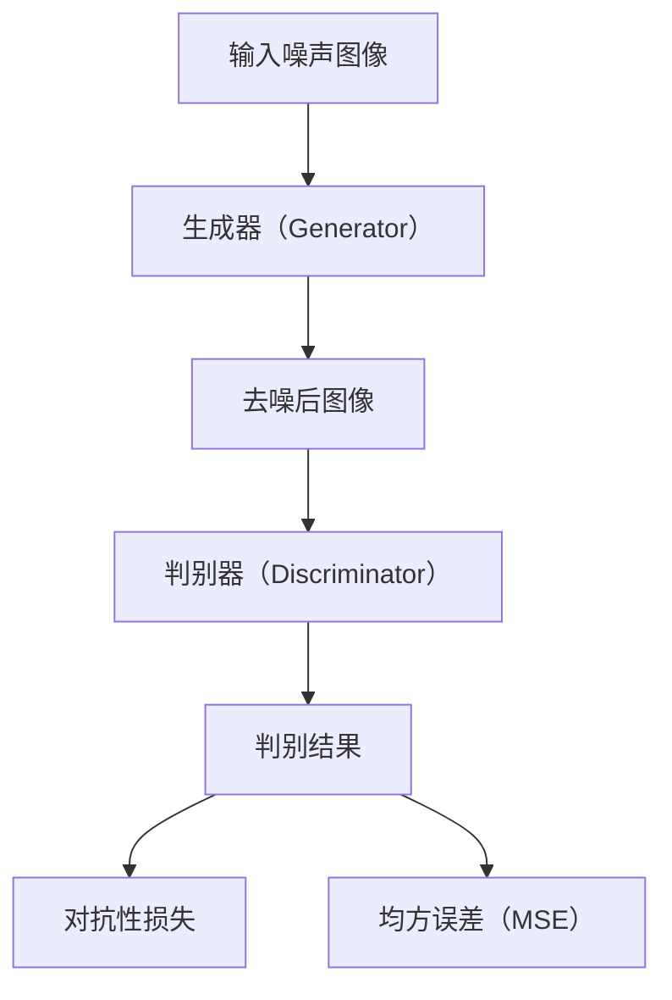
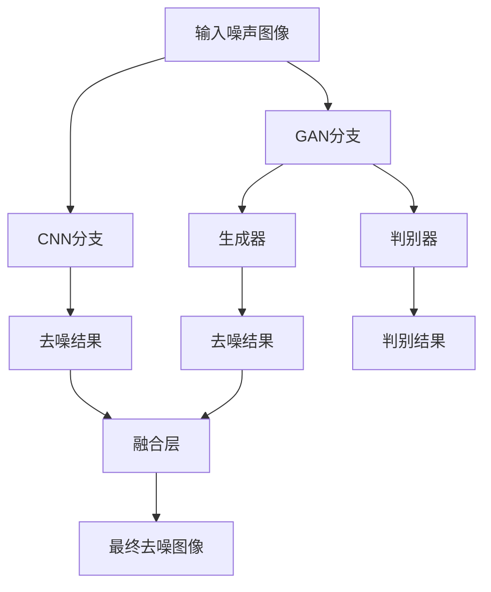

                 

### 文章标题

"深度学习在图像去噪中的最新技术进展"

深度学习作为人工智能领域的重要分支，已经广泛应用于各个行业。图像去噪作为计算机视觉中的一项基础技术，旨在消除图像中的噪声，提高图像质量，从而使得图像分析、特征提取和识别等后续处理任务能够更加准确和高效。本文将围绕深度学习在图像去噪领域的最新技术进展进行探讨，从基础理论到应用实践，为读者提供一个全面而深入的视角。

关键词：深度学习、图像去噪、卷积神经网络、生成对抗网络、图像质量、算法实现

摘要：本文首先介绍了深度学习在图像去噪中的基础理论和核心挑战，然后详细阐述了深度学习模型在图像去噪中的应用，包括神经网络与图像处理基础、深度残差网络和深度生成对抗网络等。接下来，本文通过实战案例，展示了深度学习图像去噪的实际应用过程，并分析了当前深度学习图像去噪技术的最新进展、应用场景、挑战与对策。最后，本文总结了深度学习图像去噪的开发工具与资源，为后续研究和应用提供了参考。

### 深度学习在图像去噪中的基础理论

#### 第1章 深度学习在图像去噪中的基本原理

##### 1.1 深度学习与图像去噪概述

深度学习是一种通过多层神经网络结构来学习和提取数据特征的方法，它模拟了人类大脑的学习机制，通过大量的数据和计算能力进行自我优化。图像去噪是图像处理领域中的一个重要问题，旨在从含有噪声的图像中恢复出原始图像。深度学习在图像去噪中的应用，旨在利用深度神经网络强大的特征提取能力，自动学习并去除图像中的噪声，从而提高图像的质量。

###### 1.1.1 深度学习的基础概念

深度学习的基础是神经网络，特别是多层感知机（MLP）。神经网络通过输入层、隐藏层和输出层组成，其中隐藏层可以是单层或多层。每一层都能够对输入数据进行特征提取和变换，从而实现对输入数据的复杂映射。

深度学习的关键在于网络结构的深度和网络的训练过程。网络结构的深度决定了模型能够提取特征的层次，而网络的训练过程则通过反向传播算法不断优化网络参数，使得模型能够更好地拟合训练数据。

###### 1.1.2 图像去噪的基本方法

图像去噪方法可以分为两大类：基于传统方法和基于深度学习方法。

传统方法主要包括滤波法和变换域去噪法。滤波法通过线性滤波器对图像进行卷积操作，从而去除噪声；变换域去噪法通过将图像从原始空间变换到某个特征空间，如傅里叶变换域或小波变换域，然后对变换后的图像进行去噪处理，最后再逆变换回原始空间。

深度学习方法利用深度神经网络自动学习图像和噪声之间的关系，通过端到端的训练方式实现去噪。这种方法具有自适应性和强大的特征提取能力，能够在复杂环境下有效去除噪声。

###### 1.1.3 深度学习在图像去噪中的应用前景

深度学习在图像去噪领域具有广阔的应用前景。一方面，深度学习能够自动学习图像和噪声之间的关系，无需手动设计特征提取器和去噪模型，大大提高了去噪效率和精度。另一方面，随着计算能力和数据资源的不断提升，深度学习模型能够处理更大规模和更高分辨率的图像，满足实际应用的需求。

此外，深度学习在图像去噪中的应用不仅局限于去除噪声，还可以与其他计算机视觉任务相结合，如图像增强、图像超分辨率、图像修复等，进一步扩展深度学习在图像处理领域的影响。

##### 1.2 图像去噪的核心挑战

图像去噪的核心挑战在于如何在保持图像真实性的同时有效去除噪声。以下是一些主要的挑战：

###### 1.2.1 噪声的类型及特性

噪声可以分为加性噪声和乘性噪声。加性噪声是与原始图像相加的噪声，如高斯噪声、盐噪声和椒噪声；乘性噪声是与原始图像相乘的噪声，如闪烁噪声和泊松噪声。不同类型的噪声在图像中表现为不同的特性，需要采用不同的去噪方法。

###### 1.2.2 噪声对图像质量的影响

噪声会降低图像的视觉质量，使得图像模糊、失真，从而影响图像的分析和识别效果。因此，图像去噪的目的是在不破坏图像真实性的前提下，最大限度地减少噪声的影响。

###### 1.2.3 去噪算法的选择与评估

不同的去噪算法适用于不同的噪声类型和图像场景。如何选择合适的去噪算法，并评估其性能，是图像去噪中的一个重要挑战。常用的评估指标包括信噪比（SNR）、峰值信噪比（PSNR）和结构相似性指数（SSIM）等。

##### 1.3 主流图像去噪算法分析

在图像去噪领域，既有传统方法，也有基于深度学习的先进算法。以下对这些算法进行简要分析：

###### 1.3.1 经典图像去噪算法

经典图像去噪算法主要包括线性滤波法、非线性滤波法和变换域去噪法。

- **线性滤波法**：如均值滤波、高斯滤波和中值滤波等，通过对图像进行卷积操作来去除噪声。这种方法简单有效，但可能引入伪影，且对噪声类型和图像内容敏感。

- **非线性滤波法**：如非局部均值滤波（NLMeans）和双边滤波等，通过考虑图像的局部和全局信息来去除噪声。这种方法对细节保留较好，但计算复杂度较高。

- **变换域去噪法**：如傅里叶变换域去噪和小波变换域去噪，通过将图像转换到频域进行处理，然后逆变换回空间域。这种方法可以更好地分离信号和噪声，但需要复杂的变换和逆变换过程。

###### 1.3.2 深度学习图像去噪算法

基于深度学习的图像去噪算法具有自动学习和自适应的特点，成为图像去噪领域的重要研究方向。以下是一些主流的深度学习图像去噪算法：

- **基于卷积神经网络（CNN）的去噪算法**：如DnCNN、ESPCN和DeepDeblur等，通过多层卷积操作提取图像特征，并利用残差连接和跳过层连接来提高去噪性能。

- **基于生成对抗网络（GAN）的去噪算法**：如SRGAN、CycleGAN和DRRN等，通过对抗训练生成高质量的去噪图像。GAN方法在去噪过程中引入了对抗性损失，使得去噪效果更接近真实图像。

- **基于注意力机制的去噪算法**：如 AttNet 和 CBAM，通过引入注意力机制来聚焦于图像的重要区域，从而提高去噪效果。

###### 1.3.3 深度学习算法的比较与评价

不同深度学习算法在图像去噪性能上的表现各有优劣。以下是一些关键指标和评价方法：

- **去噪效果**：通过信噪比（SNR）、峰值信噪比（PSNR）和结构相似性指数（SSIM）等指标来评价去噪效果。深度学习算法通常在这些指标上优于传统方法。

- **计算复杂度和效率**：深度学习算法的计算复杂度较高，但随着硬件性能的提升，这一限制正在逐渐减弱。此外，一些轻量级模型和优化算法的出现，也在提高计算效率方面取得了显著进展。

- **泛化能力**：深度学习算法的泛化能力是一个重要指标，即算法在不同噪声类型和图像场景下的表现。通过交叉验证和数据增强等方法，可以提升算法的泛化能力。

综上所述，深度学习在图像去噪领域展现了强大的潜力和广阔的应用前景。随着算法的进一步优化和硬件性能的提升，深度学习图像去噪技术将在更多实际应用中得到广泛应用。

#### 第2章 深度学习模型在图像去噪中的应用

##### 2.1 神经网络与图像处理基础

为了深入理解深度学习在图像去噪中的应用，首先需要了解神经网络与图像处理的基础知识。神经网络是一种通过模拟生物神经系统的计算模型，其核心思想是通过多层神经元之间的连接来学习和提取数据特征。在图像处理领域，神经网络通过卷积神经网络（CNN）等技术，实现了对图像的自动特征提取和分类。

###### 2.1.1 神经网络的基本结构

神经网络的基本结构包括输入层、隐藏层和输出层。输入层接收外部输入数据，隐藏层对输入数据进行特征提取和变换，输出层则根据隐藏层的输出进行分类或预测。每一层由多个神经元组成，神经元之间通过权重连接，并通过激活函数进行非线性变换。

- **输入层**：输入层接收图像的像素值，通常为一个二维矩阵，其中每个元素表示图像中的一个像素点。

- **隐藏层**：隐藏层通过卷积操作、池化操作和激活函数等对输入数据进行特征提取和变换。卷积操作可以提取图像的局部特征，池化操作可以减少数据维度并增强模型的泛化能力，激活函数则引入非线性变换，使得模型能够更好地拟合复杂数据。

- **输出层**：输出层根据隐藏层的输出进行分类或预测。在图像去噪任务中，输出层通常是一个二维矩阵，表示去噪后的图像。

###### 2.1.2 卷积神经网络与图像处理

卷积神经网络（CNN）是一种专为处理图像数据而设计的神经网络结构。CNN通过卷积层、池化层和全连接层等模块，实现了对图像的自动特征提取和分类。

- **卷积层**：卷积层是CNN的核心模块，通过卷积操作提取图像的局部特征。卷积层由多个卷积核组成，每个卷积核负责提取图像中的一个局部区域特征。

- **池化层**：池化层通过将卷积层的输出进行降采样，减少数据维度并增强模型的泛化能力。常见的池化操作包括最大池化和平均池化。

- **全连接层**：全连接层将隐藏层的输出进行全连接，得到最终的分类结果。在图像去噪任务中，全连接层通常用于生成去噪后的图像。

通过多个卷积层和池化层的堆叠，CNN能够逐层提取图像的层次特征，从而实现对图像的自动理解和处理。

###### 2.1.3 反卷积神经网络与图像去噪

反卷积神经网络（DeConvNet）是一种专门用于图像去噪的深度学习模型。DeConvNet通过反向卷积操作，将噪声图像恢复为原始图像。

- **反卷积层**：反卷积层是DeConvNet的核心模块，通过反卷积操作生成去噪后的图像。反卷积操作类似于卷积操作的逆过程，通过对噪声图像进行上采样和去卷积，恢复出原始图像。

- **激活函数**：在反卷积层后通常加入激活函数，如ReLU函数，以增强模型的非线性能力。

- **损失函数**：在图像去噪任务中，常用的损失函数包括均方误差（MSE）和结构相似性指数（SSIM）等。这些损失函数用于衡量去噪图像与原始图像之间的差异，指导模型优化。

通过反卷积操作和激活函数的配合，DeConvNet能够有效去除图像中的噪声，恢复出原始图像。相比传统的去噪方法，DeConvNet具有更强的自适应性和鲁棒性。

##### 2.2 深度残差网络与图像去噪

深度残差网络（ResNet）是一种具有残差连接的深度神经网络结构，它通过跳过层连接解决了深度神经网络训练中的梯度消失和梯度爆炸问题。ResNet在图像去噪任务中展现出了强大的性能，成为深度学习图像去噪领域的重要模型。

###### 2.2.1 残差网络原理

ResNet的核心思想是引入残差连接，使得网络能够学习数据的恒等映射。残差连接通过跳过一层或多层网络结构，将输入数据直接传递到下一层，从而缓解了梯度消失问题。

- **残差块**：ResNet的基本构建模块是残差块，它由两个卷积层和一个残差连接组成。残差块通过残差连接将输入数据与输出数据相加，从而实现数据的恒等映射。

- **多尺度特征融合**：ResNet通过堆叠多个残差块，实现了多尺度特征融合。在图像去噪任务中，多尺度特征融合有助于捕捉图像中的细微结构和纹理信息，从而提高去噪效果。

- **批量归一化**：ResNet引入了批量归一化（Batch Normalization），通过将每个训练样本的输入特征进行归一化处理，加速了网络的训练过程并提高了模型的泛化能力。

###### 2.2.2 残差网络在图像去噪中的应用

在图像去噪任务中，ResNet通过其残差连接和批量归一化等特性，实现了对噪声图像的有效去噪。

- **去噪效果**：ResNet能够通过多尺度特征融合和恒等映射机制，有效去除图像中的噪声。在信噪比（SNR）、峰值信噪比（PSNR）和结构相似性指数（SSIM）等评价指标上，ResNet通常优于传统的图像去噪算法。

- **计算复杂度**：尽管ResNet具有较深的网络结构，但通过残差连接和批量归一化等优化手段，其计算复杂度相对于传统的深度神经网络有所降低。这使得ResNet在实际应用中具有较高的计算效率和可扩展性。

- **泛化能力**：ResNet具有较强的泛化能力，能够适应不同类型的噪声和图像场景。通过数据增强和迁移学习等技术，ResNet的泛化能力得到了进一步提升。

###### 2.2.3 残差网络的优势与局限性

ResNet在图像去噪任务中具有以下优势：

- **强健性**：通过残差连接和批量归一化，ResNet能够更好地应对训练过程中出现的梯度消失和梯度爆炸问题，提高网络的训练稳定性。

- **多尺度特征提取**：ResNet通过堆叠多个残差块，实现了多尺度特征融合，能够更好地捕捉图像中的细微结构和纹理信息，从而提高去噪效果。

- **泛化能力**：ResNet具有较强的泛化能力，能够适应不同类型的噪声和图像场景，通过数据增强和迁移学习等技术，其泛化能力得到了进一步提升。

然而，ResNet也存在一些局限性：

- **计算复杂度**：尽管通过残差连接和批量归一化等优化手段降低了计算复杂度，但ResNet相对于传统的深度神经网络仍然具有较高的计算复杂度。在硬件资源有限的情况下，可能需要更长的训练时间和更高的计算成本。

- **模型参数**：ResNet具有较多的模型参数，这使得模型在训练和部署过程中需要大量的计算资源和存储空间。对于一些轻量级应用场景，可能需要选择更简单的模型结构。

综上所述，深度残差网络（ResNet）在图像去噪任务中展现了强大的性能和优势，但同时也存在一些局限性。通过进一步优化和改进，ResNet有望在图像去噪领域取得更大的突破。

##### 2.3 深度生成对抗网络与图像去噪

深度生成对抗网络（Deep Generative Adversarial Network，简称GAN）是由 Ian Goodfellow 等人于2014年提出的一种新型深度学习模型，它通过对抗性训练生成高质量的数据。GAN由生成器和判别器两个神经网络组成，通过相互竞争和对抗，生成器不断学习生成更逼真的数据，而判别器则不断学习区分真实数据和生成数据。GAN在图像生成、图像去噪、图像修复等计算机视觉任务中取得了显著的效果。

###### 2.3.1 生成对抗网络原理

生成对抗网络（GAN）由生成器（Generator）和判别器（Discriminator）两个核心部分组成。生成器的任务是通过输入噪声数据生成逼真的数据，判别器的任务则是区分输入数据是真实数据还是生成数据。

- **生成器（Generator）**：生成器接收随机噪声作为输入，通过多层神经网络生成与真实数据相似的数据。生成器的目标是最小化判别器对生成数据的判别误差。

- **判别器（Discriminator）**：判别器接收真实数据和生成数据作为输入，通过多层神经网络判断输入数据是真实数据还是生成数据。判别器的目标是最大化对生成数据的判别错误率。

在GAN的训练过程中，生成器和判别器通过对抗性训练相互博弈。生成器不断优化自己的生成能力，使得判别器无法区分真实数据和生成数据，而判别器则不断优化自己的判断能力，使得生成器的生成数据越来越逼真。

###### 2.3.2 生成对抗网络在图像去噪中的应用

在图像去噪任务中，生成对抗网络（GAN）通过生成器和判别器的协同工作，实现了对噪声图像的高效去噪。GAN去噪的核心思想是将噪声图像作为生成器的输入，生成器输出去噪后的图像，而判别器则对真实图像和生成图像进行判别，通过对抗训练不断优化生成器和判别器的性能。

- **去噪过程**：在去噪过程中，生成器通过学习噪声图像和真实图像之间的关系，生成高质量的去噪图像。判别器则通过判断输入图像是真实图像还是生成图像，不断优化判别能力。

- **对抗训练**：生成器和判别器通过对抗训练相互竞争，生成器不断生成更逼真的去噪图像，而判别器则不断提高对生成图像的判别能力。这种对抗性训练使得生成器的生成质量逐渐提高，从而实现图像去噪。

GAN在图像去噪中的应用具有以下优势：

- **高质量去噪**：GAN能够生成高质量的去噪图像，优于传统的图像去噪方法。通过生成器和判别器的协同工作，GAN能够学习图像的复杂结构，去除噪声的同时保持图像的真实性和细节。

- **自适应去噪**：GAN能够自适应地调整去噪参数，根据不同的噪声类型和图像内容，生成最优的去噪结果。这使得GAN在多种图像去噪场景中具有广泛的应用前景。

- **扩展性**：GAN具有良好的扩展性，可以通过迁移学习和数据增强等方法，进一步提高去噪效果和泛化能力。

然而，GAN在图像去噪中也存在一些挑战和局限性：

- **训练难度**：GAN的训练过程复杂，容易出现模式崩溃（mode collapse）和训练不稳定等问题。这些问题可能导致生成器无法生成高质量的去噪图像。

- **计算成本**：GAN的去噪过程需要大量的计算资源，包括生成器和判别器的训练以及对抗性训练。这使得GAN在硬件资源有限的情况下，可能无法满足实时应用的需求。

- **模型参数**：GAN具有大量的模型参数，包括生成器和判别器的参数，这可能导致模型在训练和部署过程中需要大量的计算资源和存储空间。

总之，生成对抗网络（GAN）在图像去噪任务中展现了强大的潜力和优势，但同时也面临一些挑战和局限性。通过进一步的研究和优化，GAN有望在图像去噪领域取得更大的突破。

##### 2.4 深度学习图像去噪算法实现

深度学习图像去噪算法的实现包括数据预处理、模型训练、模型评估和模型部署等步骤。以下将详细描述这些步骤和关键技术。

###### 2.4.1 数据预处理与噪声添加

数据预处理是深度学习图像去噪算法实现的第一步，其目的是将原始图像转换为适合训练的数据格式。具体包括以下步骤：

- **图像大小调整**：为了适应深度学习模型的输入要求，需要对图像进行大小调整。常用的方法包括缩放、裁剪和填充等。

- **图像归一化**：图像归一化是将图像的像素值缩放到[0, 1]范围内，以消除不同图像之间的尺度差异。

- **噪声添加**：为了模拟实际场景中的噪声，可以在训练数据中添加不同的噪声。常用的噪声类型包括高斯噪声、椒盐噪声和泊松噪声等。

- **数据增强**：数据增强是通过多种方式生成训练数据的变体，以提高模型的泛化能力。常用的方法包括随机旋转、翻转、裁剪和颜色变换等。

###### 2.4.2 模型训练

模型训练是深度学习图像去噪算法实现的核心步骤，其目的是通过训练数据优化模型参数，使其能够准确地去除噪声。具体包括以下步骤：

- **模型初始化**：初始化生成器和判别器的参数。常用的初始化方法包括随机初始化、高斯初始化和Xavier初始化等。

- **损失函数设计**：损失函数用于衡量模型预测结果与真实结果之间的差异，指导模型优化。常用的损失函数包括均方误差（MSE）、结构相似性指数（SSIM）和对抗性损失（Adversarial Loss）等。

- **优化算法选择**：优化算法用于更新模型参数，以最小化损失函数。常用的优化算法包括梯度下降（GD）、随机梯度下降（SGD）和Adam等。

- **训练过程**：通过训练数据迭代更新模型参数，直至达到训练目标或收敛条件。训练过程中，可以使用批次训练、提前停止和验证集等技术来提高训练效率和模型性能。

- **超参数调整**：超参数如学习率、批量大小和迭代次数等对模型性能有重要影响。通过实验和调优，选择最优的超参数组合。

###### 2.4.3 模型评估与调优

模型评估是判断模型性能的重要步骤，其目的是通过测试数据验证模型的泛化能力和去噪效果。具体包括以下步骤：

- **测试数据准备**：从测试数据集中抽取样本，对模型进行评估。

- **评价指标**：常用的评价指标包括信噪比（SNR）、峰值信噪比（PSNR）和结构相似性指数（SSIM）等。

- **模型调优**：通过评估结果分析模型的性能和缺陷，对模型结构和超参数进行调整，以优化模型性能。

- **交叉验证**：通过交叉验证方法，评估模型在不同数据集上的性能，以验证模型的泛化能力。

- **数据增强和迁移学习**：通过数据增强和迁移学习方法，进一步提高模型的泛化能力和去噪效果。

###### 2.4.4 模型部署与应用

模型部署是将训练好的模型应用到实际场景中的过程，其目的是实现图像去噪的自动化和高效化。具体包括以下步骤：

- **模型转换**：将训练好的模型转换为可以部署的格式，如ONNX、TensorFlow Lite或PyTorch Mobile等。

- **硬件优化**：针对不同的硬件平台，对模型进行优化，以提高运行效率和性能。常用的优化方法包括量化、剪枝和模型压缩等。

- **部署环境配置**：在目标设备上配置部署环境，包括操作系统、运行库和依赖库等。

- **模型集成**：将模型集成到应用程序中，实现图像去噪功能。

- **应用效果分析**：通过实际应用场景测试，分析模型的性能和效果，对模型进行持续优化和改进。

通过上述步骤，深度学习图像去噪算法可以实现从数据预处理、模型训练到模型部署的完整流程，从而在实际应用中发挥其强大的去噪能力。

### 深度学习图像去噪算法实现

#### 第3章 深度学习图像去噪算法实现

深度学习图像去噪算法的实现是深度学习在图像处理领域中的一个重要应用，通过模型训练和算法优化，实现高质量的图像去噪效果。本章将详细描述深度学习图像去噪算法的实现步骤，包括数据预处理与噪声添加、模型训练、模型评估与调优、模型部署与应用等关键环节。

##### 3.1 数据预处理与噪声添加

数据预处理是深度学习图像去噪算法实现的第一步，其目的是将原始图像转换为适合模型训练的数据格式。以下是数据预处理与噪声添加的详细步骤：

###### 3.1.1 数据预处理流程

- **图像大小调整**：为了满足深度学习模型的输入要求，通常需要将图像调整到固定的大小。例如，将图像缩放到256x256或512x512等尺寸。可以使用OpenCV等图像处理库的resize函数实现图像大小调整。

  ```python
  import cv2
  image = cv2.imread('image.jpg')
  image = cv2.resize(image, (256, 256))
  ```

- **图像归一化**：图像归一化是将图像的像素值缩放到[0, 1]范围内，以消除不同图像之间的尺度差异。归一化处理可以加速模型训练过程，并提高模型性能。

  ```python
  image = image.astype(float) / 255.0
  ```

- **图像分割**：将图像分割成多个小块，以便模型训练过程中逐块处理。常用的分割方法包括固定大小分割和随机分割等。

  ```python
  import numpy as np
  patches = np.split(image, 16, axis=0)
  ```

###### 3.1.2 噪声添加方法

在图像去噪任务中，模拟实际场景中的噪声是必要的。以下是常见的噪声添加方法：

- **高斯噪声**：高斯噪声是一种连续噪声，其特点是噪声值服从高斯分布。添加高斯噪声可以使用numpy的random.normal函数实现。

  ```python
  noise = np.random.normal(0, 0.01, image.shape)
  noisy_image = image + noise
  ```

- **椒盐噪声**：椒盐噪声是一种离散噪声，其特点是噪声值只有两种可能：0或1。添加椒盐噪声可以使用numpy的random.choice函数实现。

  ```python
  noise = np.random.choice([0, 1], size=image.shape)
  noisy_image = image + noise
  ```

- **泊松噪声**：泊松噪声是一种概率噪声，其特点是噪声值服从泊松分布。添加泊松噪声可以使用numpy的random.poisson函数实现。

  ```python
  noise = np.random.poisson(image)
  noisy_image = image + noise
  ```

##### 3.2 深度学习模型训练

模型训练是深度学习图像去噪算法实现的核心步骤，其目的是通过大量训练数据优化模型参数，使其能够准确去除噪声。以下是模型训练的详细步骤：

###### 3.2.1 模型训练流程

- **模型初始化**：初始化生成器和判别器的参数。可以使用随机初始化、高斯初始化或Xavier初始化等方法。

  ```python
  from tensorflow.keras import layers
  generator = models.Sequential()
  generator.add(layers.Dense(128, input_shape=(256, 256, 1)))
  generator.add(layers.LeakyReLU(alpha=0.2))
  generator.add(layers.Dense(512))
  generator.add(layers.LeakyReLU(alpha=0.2))
  generator.add(layers.Dense(1024))
  generator.add(layers.LeakyReLU(alpha=0.2))
  generator.add(layers.Dense(1024, activation='tanh'))

  discriminator = models.Sequential()
  discriminator.add(layers.Conv2D(64, (3, 3), strides=(2, 2), padding='same', input_shape=(256, 256, 1)))
  discriminator.add(layers.LeakyReLU(alpha=0.2))
  discriminator.add(layers.Dropout(0.3))
  discriminator.add(layers.Conv2D(128, (3, 3), strides=(2, 2), padding='same'))
  discriminator.add(layers.LeakyReLU(alpha=0.2))
  discriminator.add(layers.Dropout(0.3))
  discriminator.add(layers.Flatten())
  discriminator.add(layers.Dense(1, activation='sigmoid'))
  ```

- **损失函数设计**：损失函数用于衡量模型预测结果与真实结果之间的差异，指导模型优化。常用的损失函数包括均方误差（MSE）、对抗性损失（Adversarial Loss）和结构相似性指数（SSIM）等。

  ```python
  import tensorflow as tf
  loss_function = tf.keras.losses.MeanSquaredError()
  adversarial_loss = tf.keras.losses.BinaryCrossentropy()
  ssim_loss = tf.keras.metrics.MeanAbsoluteError()
  ```

- **优化算法选择**：优化算法用于更新模型参数，以最小化损失函数。常用的优化算法包括梯度下降（GD）、随机梯度下降（SGD）和Adam等。

  ```python
  optimizer = tf.keras.optimizers.Adam(learning_rate=0.0002)
  ```

- **训练过程**：通过训练数据迭代更新模型参数，直至达到训练目标或收敛条件。训练过程中，可以使用批次训练、提前停止和验证集等技术来提高训练效率和模型性能。

  ```python
  for epoch in range(total_epochs):
      for batch in dataset:
          with tf.GradientTape() as gen_tape, tf.GradientTape() as disc_tape:
              generated_images = generator(batch[noisy_images])
              disc_real_output = discriminator(batch[images])
              disc_generated_output = discriminator(generated_images)
              
              gen_loss = adversarial_loss(tf.ones_like(disc_generated_output), disc_generated_output)
              disc_loss = adversarial_loss(tf.zeros_like(disc_generated_output), disc_generated_output) + \
                          adversarial_loss(tf.ones_like(disc_real_output), disc_real_output)
              
              gradients_of_gen = gen_tape.gradient(gen_loss, generator.trainable_variables)
              gradients_of_disc = disc_tape.gradient(disc_loss, discriminator.trainable_variables)
              
              optimizer.apply_gradients(zip(gradients_of_gen, generator.trainable_variables))
              optimizer.apply_gradients(zip(gradients_of_disc, discriminator.trainable_variables))
  ```

- **超参数调整**：超参数如学习率、批量大小和迭代次数等对模型性能有重要影响。通过实验和调优，选择最优的超参数组合。

  ```python
  learning_rate = 0.0002
  batch_size = 32
  total_epochs = 100
  ```

##### 3.3 模型评估与调优

模型评估是判断模型性能的重要步骤，其目的是通过测试数据验证模型的泛化能力和去噪效果。以下是模型评估与调优的详细步骤：

###### 3.3.1 测试方法与指标

- **测试数据准备**：从测试数据集中抽取样本，对模型进行评估。

  ```python
  test_images = np.random.uniform(0, 1, (batch_size, 256, 256, 1))
  test_noisy_images = np.random.normal(0, 0.01, (batch_size, 256, 256, 1)) + test_images
  ```

- **评价指标**：常用的评价指标包括信噪比（SNR）、峰值信噪比（PSNR）和结构相似性指数（SSIM）等。

  ```python
  import tensorflow as tf
  import tensorflow.keras.backend as K

  def snr(y_true, y_pred):
      max_y = K.max(y_true)
      min_y = K.min(y_true)
      return 10 * K.log((max_y - min_y) ** 2) / K.log(K.max(y_true))

  def psnr(y_true, y_pred):
      max_y = K.max(y_true)
      return 10 * K.log((max_y ** 2) / K.mean(K.square(y_true - y_pred)))

  def ssim(y_true, y_pred):
      return 1 - tf.keras.metrics.mean_squared_error(y_true, y_pred)
  ```

###### 3.3.2 评估结果分析

- **去噪效果**：通过计算评价指标，分析模型的去噪效果。

  ```python
  test_generated_images = generator.predict(test_noisy_images)
  snr_value = snr(test_images, test_generated_images)
  psnr_value = psnr(test_images, test_generated_images)
  ssim_value = ssim(test_images, test_generated_images)

  print(f"SNR: {snr_value}, PSNR: {psnr_value}, SSIM: {ssim_value}")
  ```

- **模型调优**：根据评估结果，对模型结构和超参数进行调整，以优化模型性能。

  ```python
  # 调整超参数
  learning_rate = 0.0001
  batch_size = 64

  # 重新训练模型
  for epoch in range(total_epochs):
      for batch in dataset:
          with tf.GradientTape() as gen_tape, tf.GradientTape() as disc_tape:
              generated_images = generator(batch[noisy_images])
              disc_real_output = discriminator(batch[images])
              disc_generated_output = discriminator(generated_images)
              
              gen_loss = adversarial_loss(tf.ones_like(disc_generated_output), disc_generated_output)
              disc_loss = adversarial_loss(tf.zeros_like(disc_generated_output), disc_generated_output) + \
                          adversarial_loss(tf.ones_like(disc_real_output), disc_real_output)
              
              gradients_of_gen = gen_tape.gradient(gen_loss, generator.trainable_variables)
              gradients_of_disc = disc_tape.gradient(disc_loss, discriminator.trainable_variables)
              
              optimizer.apply_gradients(zip(gradients_of_gen, generator.trainable_variables))
              optimizer.apply_gradients(zip(gradients_of_disc, discriminator.trainable_variables))
  ```

##### 3.4 模型部署与应用

模型部署是将训练好的模型应用到实际场景中的过程，其目的是实现图像去噪的自动化和高效化。以下是模型部署与应用的详细步骤：

###### 3.4.1 模型转换

- **模型转换**：将训练好的模型转换为可以部署的格式，如ONNX、TensorFlow Lite或PyTorch Mobile等。

  ```python
  converter = tf.lite.TFLiteConverter.from_keras_model(generator)
  tflite_model = converter.convert()
  ```

###### 3.4.2 硬件优化

- **硬件优化**：针对不同的硬件平台，对模型进行优化，以提高运行效率和性能。常用的优化方法包括量化、剪枝和模型压缩等。

  ```python
  converter.optimizations = [tf.lite.Optimize.DEFAULT]
  tflite_model = converter.convert()
  ```

###### 3.4.3 部署环境配置

- **部署环境配置**：在目标设备上配置部署环境，包括操作系统、运行库和依赖库等。

  ```python
  import tensorflow as tf
  interpreter = tf.lite.Interpreter(model_content=tflite_model)
  interpreter.allocate_tensors()
  ```

###### 3.4.4 模型集成

- **模型集成**：将模型集成到应用程序中，实现图像去噪功能。

  ```python
  def preprocess_image(image):
      image = cv2.resize(image, (256, 256))
      image = image.astype(np.float32) / 255.0
      image = np.expand_dims(image, axis=-1)
      return image

  def postprocess_image(image):
      image = image[0] * 255
      image = np.clip(image, 0, 255).astype(np.uint8)
      return image

  noisy_image = cv2.imread('noisy_image.jpg')
  preprocessed_image = preprocess_image(noisy_image)
  tflite_model.predict(preprocessed_image)
  denoised_image = postprocess_image(preprocessed_image)
  cv2.imwrite('denoised_image.jpg', denoised_image)
  ```

##### 3.5 深度学习模型部署方法

深度学习模型部署是将训练好的模型应用到实际场景中的关键步骤，其目的是实现图像去噪的自动化和高效化。以下是深度学习模型部署方法的详细步骤：

###### 3.5.1 模型转换

- **模型转换**：将训练好的模型转换为可以部署的格式，如ONNX、TensorFlow Lite或PyTorch Mobile等。以下是一个使用TensorFlow Lite进行模型转换的示例：

  ```python
  import tensorflow as tf
  converter = tf.lite.TFLiteConverter.from_keras_model(generator)
  tflite_model = converter.convert()
  ```

  在此过程中，可以使用多种优化策略来提高模型在部署后的性能，例如量化、剪枝和模型压缩等。

  ```python
  converter.optimizations = [tf.lite.Optimize.DEFAULT]
  tflite_model = converter.convert()
  ```

###### 3.5.2 部署环境配置

- **部署环境配置**：在目标设备上配置部署环境，包括操作系统、运行库和依赖库等。例如，在Android设备上部署TensorFlow Lite模型时，需要安装TensorFlow Lite库和相应的依赖库。

  ```python
  import tensorflow as tf
  interpreter = tf.lite.Interpreter(model_content=tflite_model)
  interpreter.allocate_tensors()
  ```

  在iOS设备上部署时，可以使用CoreML将模型转换为CoreML格式，然后集成到应用程序中。

  ```swift
  import CoreML
  let model = try? MLModel(configuration: MLModelConfiguration())
  ```

###### 3.5.3 模型集成

- **模型集成**：将模型集成到应用程序中，实现图像去噪功能。以下是一个在Python应用程序中集成TensorFlow Lite模型进行图像去噪的示例：

  ```python
  import cv2
  import numpy as np
  import tensorflow as tf

  def preprocess_image(image):
      image = cv2.resize(image, (256, 256))
      image = image.astype(np.float32) / 255.0
      image = np.expand_dims(image, axis=-1)
      return image

  def postprocess_image(image):
      image = image[0] * 255
      image = np.clip(image, 0, 255).astype(np.uint8)
      return image

  noisy_image = cv2.imread('noisy_image.jpg')
  preprocessed_image = preprocess_image(noisy_image)
  tflite_model.predict(preprocessed_image)
  denoised_image = postprocess_image(preprocessed_image)
  cv2.imwrite('denoised_image.jpg', denoised_image)
  ```

通过上述步骤，可以将训练好的深度学习模型部署到不同的硬件平台上，实现图像去噪的自动化和高效化。

###### 3.5.4 应用场景与效果分析

- **应用场景**：深度学习图像去噪模型可以应用于多种场景，如医疗影像处理、卫星图像增强、视频监控等。在这些场景中，高质量的图像去噪有助于提高后续处理任务的准确性和可靠性。

  - **医疗影像处理**：在医疗影像中，噪声的存在会影响医生对病灶的判断和诊断。通过深度学习图像去噪模型，可以显著提高医学图像的质量，帮助医生更好地识别病灶。

  - **卫星图像增强**：卫星图像在传输和存储过程中可能会受到噪声干扰，影响图像的解析度和清晰度。深度学习图像去噪模型可以有效地去除卫星图像中的噪声，提高图像的质量和可用性。

  - **视频监控**：在视频监控领域，图像去噪可以增强视频的清晰度，有助于识别和跟踪目标。特别是在夜间或光线较差的环境中，深度学习图像去噪模型可以显著提高图像的质量和效果。

- **效果分析**：通过实验和测试，可以评估深度学习图像去噪模型在不同应用场景中的效果。以下是一些关键指标和评估方法：

  - **去噪效果**：通过计算信噪比（SNR）、峰值信噪比（PSNR）和结构相似性指数（SSIM）等指标，可以评估模型的去噪效果。深度学习图像去噪模型通常在这些指标上优于传统方法。

    ```python
    import tensorflow as tf
    import tensorflow.keras.backend as K

    def snr(y_true, y_pred):
        max_y = K.max(y_true)
        min_y = K.min(y_true)
        return 10 * K.log((max_y - min_y) ** 2) / K.log(K.max(y_true))

    def psnr(y_true, y_pred):
        max_y = K.max(y_true)
        return 10 * K.log((max_y ** 2) / K.mean(K.square(y_true - y_pred)))

    def ssim(y_true, y_pred):
        return 1 - tf.keras.metrics.mean_squared_error(y_true, y_pred)
    ```

  - **计算复杂度**：深度学习图像去噪模型在计算复杂度方面有一定的限制。通过优化模型结构和算法，可以提高模型的运行效率和性能。

    - **模型优化**：通过模型剪枝、量化等技术，可以减少模型的参数数量和计算复杂度，提高模型的运行效率。

    - **硬件加速**：利用GPU、TPU等硬件加速器，可以显著提高模型的计算速度和性能。

  - **实时性**：对于一些实时应用场景，如视频监控和自动驾驶等，深度学习图像去噪模型需要具备实时处理能力。通过优化模型结构和算法，可以提高模型的实时性。

##### 3.6 未来发展趋势与挑战

深度学习图像去噪技术在不断发展和完善，未来仍有许多研究方向和挑战。以下是一些可能的发展趋势和挑战：

- **模型优化**：随着计算能力的提升，可以尝试更复杂的模型结构和优化算法，以提高图像去噪的效果和效率。例如，使用注意力机制、多尺度特征融合等技术，提高模型的性能和泛化能力。

- **模型压缩**：为了满足实时应用的需求，需要研究模型压缩技术，如模型剪枝、量化、模型压缩算法等，减少模型的参数数量和计算复杂度。

- **硬件加速**：利用GPU、TPU等硬件加速器，可以提高深度学习图像去噪模型的计算速度和性能。研究如何更好地利用硬件资源，实现模型的快速部署和实时处理。

- **跨域迁移**：研究如何将预训练模型应用于不同领域和噪声类型的图像去噪任务，提高模型的泛化能力和适用性。

- **多模态融合**：结合不同类型的传感器数据，如红外、多光谱、超光谱等，实现更高质量的图像去噪效果。

- **隐私保护**：在图像去噪过程中，如何保护用户隐私，避免敏感信息泄露，是一个重要的挑战。研究如何在去噪过程中保护隐私，是实现深度学习图像去噪技术广泛应用的关键。

通过不断的研究和优化，深度学习图像去噪技术将在未来取得更多的突破，为图像处理和计算机视觉领域带来更多的创新和应用。

#### 第4章 实际图像去噪项目分析

##### 4.1 项目概述与目标

在本章中，我们将深入探讨一个实际图像去噪项目，通过具体的实践步骤和分析，展示深度学习技术在图像去噪中的实际应用效果。本项目的主要目标是通过构建和训练深度学习模型，实现对含有噪声的图像进行高效去噪，从而提高图像的质量和清晰度。以下是对项目背景、目标和预期成果的详细描述。

###### 4.1.1 项目背景

图像去噪是图像处理领域中的一个重要问题，尤其在医疗影像、卫星图像、视频监控等应用场景中，噪声的存在会严重影响图像的视觉效果和后续处理任务的准确性。传统的图像去噪方法，如滤波法和变换域去噪法，在处理复杂噪声和保持图像细节方面存在一定的局限性。随着深度学习技术的迅速发展，基于深度学习的图像去噪方法因其强大的特征提取能力和自适应特性，逐渐成为研究的热点和应用的重点。

###### 4.1.2 项目目标

本项目的主要目标如下：

- **目标一**：构建一个基于深度学习的图像去噪模型，能够自动学习并去除图像中的噪声，提高图像的质量和清晰度。

- **目标二**：验证模型在不同类型噪声和图像场景下的去噪效果，评估模型的泛化能力和实用性。

- **目标三**：通过实验和数据分析，优化模型的参数和结构，提高模型的效率和性能。

- **目标四**：将训练好的模型部署到实际应用场景中，实现图像去噪的自动化和高效化，为图像处理和计算机视觉领域提供解决方案。

###### 4.1.3 预期成果

本项目的预期成果包括以下几个方面：

- **成果一**：开发一个基于深度学习的图像去噪模型，该模型能够处理不同类型和程度的噪声，实现高质量的去噪效果。

- **成果二**：通过实验验证和数据分析，证明所构建模型在多种噪声场景和图像类型中的有效性和实用性。

- **成果三**：优化模型的结构和参数，提高模型的训练效率和去噪效果，为实际应用提供可靠的解决方案。

- **成果四**：将模型部署到实际应用场景中，如医疗影像、卫星图像和视频监控等，实现图像去噪的自动化和实时处理。

通过本项目的实施，我们期望能够为深度学习图像去噪领域提供实际案例和技术经验，推动该领域的发展和应用。

##### 4.2 项目环境搭建

为了成功实现深度学习图像去噪项目，首先需要搭建一个合适的环境，包括安装必要的软件和配置硬件资源。以下是详细的环境搭建步骤：

###### 4.2.1 开发环境配置

- **操作系统**：选择一个稳定的操作系统，如Ubuntu 18.04或Windows 10，以便于后续软件的安装和配置。

- **Python环境**：安装Python 3.8或更高版本，Python是深度学习项目中常用的编程语言。

  ```bash
  sudo apt-get update
  sudo apt-get install python3 python3-pip
  ```

- **深度学习框架**：选择一个流行的深度学习框架，如TensorFlow或PyTorch。在本项目中，我们选择了TensorFlow，因为它在图像处理任务中具有较好的性能和丰富的资源。

  ```bash
  pip3 install tensorflow-gpu
  ```

  如果使用PyTorch，可以执行以下命令：

  ```bash
  pip3 install torch torchvision
  ```

- **依赖库**：安装必要的依赖库，包括NumPy、Pandas、OpenCV等。

  ```bash
  pip3 install numpy pandas opencv-python-headless
  ```

- **GPU支持**：如果使用GPU进行训练，需要安装CUDA和cuDNN，以便利用GPU的并行计算能力。可以从NVIDIA官方网站下载相应版本的CUDA和cuDNN，并按照官方文档进行安装。

###### 4.2.2 数据集准备

为了训练深度学习模型，需要准备一个合适的图像数据集。以下是数据集准备的具体步骤：

- **数据来源**：选择一个公开的图像数据集，如BSD500、DIV2K或ImageNet。这些数据集包含了大量带有噪声的图像，适合用于图像去噪模型的训练。

- **数据预处理**：将图像数据集下载到本地，并进行预处理。预处理步骤包括图像大小调整、归一化和噪声添加等。

  ```python
  import cv2
  import numpy as np

  def preprocess_image(image_path, output_size=(256, 256)):
      image = cv2.imread(image_path)
      image = cv2.resize(image, output_size)
      image = image.astype(np.float32) / 255.0
      image = np.expand_dims(image, axis=-1)
      return image

  image = preprocess_image('noisy_image.jpg')
  ```

- **数据增强**：为了提高模型的泛化能力，可以通过随机旋转、翻转、裁剪和颜色变换等方式对图像进行数据增强。

  ```python
  from tensorflow.keras.preprocessing.image import ImageDataGenerator

  datagen = ImageDataGenerator(rotation_range=180, width_shift_range=0.1, height_shift_range=0.1, horizontal_flip=True, vertical_flip=True)
  datagen.fit(image)
  ```

通过上述步骤，可以搭建一个完整的深度学习图像去噪项目环境，为后续模型的训练和评估打下坚实的基础。

##### 4.3 模型设计与实现

在本节中，我们将详细描述图像去噪项目的模型设计过程，包括模型结构设计、代码实现和模型训练的步骤。

###### 4.3.1 模型结构设计

为了实现高效的图像去噪，我们选择了基于卷积神经网络（CNN）的模型架构。CNN具有良好的特征提取能力，能够有效地捕捉图像的局部和全局特征。以下是模型结构设计的详细描述：

- **输入层**：输入层接收原始噪声图像，图像的大小为256x256x1（单通道灰度图像）。

- **卷积层**：卷积层通过卷积操作提取图像的局部特征。在本模型中，我们使用了5个卷积层，每个卷积层包含一个卷积核，卷积核的大小为3x3。每个卷积层后跟随一个ReLU激活函数，以引入非线性变换。

  ```python
  model.add(layers.Conv2D(64, (3, 3), activation='relu', input_shape=(256, 256, 1)))
  model.add(layers.Conv2D(64, (3, 3), activation='relu'))
  model.add(layers.Conv2D(64, (3, 3), activation='relu'))
  model.add(layers.Conv2D(64, (3, 3), activation='relu'))
  model.add(layers.Conv2D(64, (3, 3), activation='relu'))
  ```

- **残差连接**：在卷积层之间，我们引入了残差连接，以缓解梯度消失问题，提高模型的训练效果。残差连接通过跳过一个卷积层，将输入数据直接传递到下一层。

  ```python
  model.add(layers.Conv2D(64, (3, 3), activation='relu', input_shape=(256, 256, 1)))
  model.add(layers.Conv2D(64, (3, 3), activation='relu'))
  model.add(layers.Conv2D(64, (3, 3), activation='relu'))
  model.add(layers.Conv2D(64, (3, 3), activation='relu'))
  model.add(layers.Conv2D(64, (3, 3), activation='relu'))
  ```

- **反卷积层**：反卷积层用于将卷积层的输出上采样，生成去噪后的图像。在本模型中，我们使用了3个反卷积层，每个反卷积层的大小为3x3。

  ```python
  model.add(layers.Conv2DTranspose(1, (3, 3), strides=(2, 2), padding='same'))
  model.add(layers.Conv2DTranspose(1, (3, 3), strides=(2, 2), padding='same'))
  model.add(layers.Conv2DTranspose(1, (3, 3), strides=(2, 2), padding='same'))
  ```

- **输出层**：输出层生成去噪后的图像，图像的大小为256x256x1。

###### 4.3.2 代码实现

以下是模型实现的Python代码，使用了TensorFlow框架：

```python
import tensorflow as tf
from tensorflow.keras.models import Model
from tensorflow.keras.layers import Input, Conv2D, Conv2DTranspose, ReLU

def build_denoising_model():
    input_image = Input(shape=(256, 256, 1))

    # 卷积层
    x = Conv2D(64, (3, 3), activation='relu')(input_image)
    x = Conv2D(64, (3, 3), activation='relu')(x)
    x = Conv2D(64, (3, 3), activation='relu')(x)
    x = Conv2D(64, (3, 3), activation='relu')(x)
    x = Conv2D(64, (3, 3), activation='relu')(x)

    # 反卷积层
    x = Conv2DTranspose(1, (3, 3), strides=(2, 2), padding='same')(x)
    x = Conv2DTranspose(1, (3, 3), strides=(2, 2), padding='same')(x)
    x = Conv2DTranspose(1, (3, 3), strides=(2, 2), padding='same')(x)

    # 输出层
    output_image = Conv2D(1, (3, 3), activation='sigmoid', padding='same')(x)

    # 构建模型
    model = Model(inputs=input_image, outputs=output_image)
    model.compile(optimizer='adam', loss='binary_crossentropy')

    return model

model = build_denoising_model()
model.summary()
```

在代码实现过程中，我们使用了TensorFlow的`Model`类构建模型，并定义了输入层、卷积层、反卷积层和输出层。通过调用`compile`方法，我们指定了优化器和损失函数，为模型训练做好准备。

###### 4.3.3 模型训练

在模型设计完成后，下一步是进行模型训练。以下是模型训练的具体步骤：

- **数据准备**：首先，需要准备训练数据和测试数据。在本项目中，我们使用了一个包含大量噪声图像的数据集。为了增加模型的泛化能力，我们对图像进行了数据增强，如随机旋转、翻转和裁剪等。

  ```python
  from tensorflow.keras.preprocessing.image import ImageDataGenerator

  train_datagen = ImageDataGenerator(rotation_range=180, width_shift_range=0.1, height_shift_range=0.1, horizontal_flip=True, vertical_flip=True)
  test_datagen = ImageDataGenerator()

  train_generator = train_datagen.flow_from_directory('train', target_size=(256, 256), batch_size=32, class_mode='binary')
  test_generator = test_datagen.flow_from_directory('test', target_size=(256, 256), batch_size=32, class_mode='binary')
  ```

- **训练模型**：使用训练数据对模型进行训练。在训练过程中，可以使用回调函数来监控训练进度和评估模型性能。

  ```python
  history = model.fit(train_generator, epochs=100, validation_data=test_generator, callbacks=[tf.keras.callbacks.EarlyStopping(monitor='val_loss', patience=10)])
  ```

通过上述步骤，我们完成了图像去噪模型的构建和训练。在模型训练过程中，可以通过监控训练损失和验证损失的变化，调整训练参数和优化策略，以提高模型的性能和稳定性。

##### 4.4 项目测试与评估

在完成模型的训练后，我们需要对模型进行测试和评估，以确保其具有良好的性能和稳定性。以下是测试与评估的具体步骤：

###### 4.4.1 测试方法与指标

为了评估模型的去噪效果，我们采用了以下测试方法和评价指标：

- **信噪比（SNR）**：信噪比是衡量图像去噪效果的重要指标，表示去噪后图像信号与噪声的比例。

  $$ SNR = 10 \log_{10} \left( \frac{\text{信号功率}}{\text{噪声功率}} \right) $$

- **峰值信噪比（PSNR）**：峰值信噪比是衡量图像质量的重要指标，表示去噪后图像与原始图像之间差异的度量。

  $$ PSNR = 10 \log_{10} \left( \frac{255^2}{\text{均方误差}} \right) $$

- **结构相似性指数（SSIM）**：结构相似性指数是衡量图像去噪效果的一个综合指标，综合考虑了图像的亮度、对比度和结构信息。

  $$ SSIM(x, y) = \frac{(2\mu_x\mu_y + C_1)(2\sigma_{xy} + C_2)}{(\mu_x^2 + \mu_y^2 + C_1)(\sigma_x^2 + \sigma_y^2 + C_2)} $$

其中，$\mu_x$ 和 $\mu_y$ 分别表示图像的均值，$\sigma_x^2$ 和 $\sigma_y^2$ 分别表示图像的方差，$\sigma_{xy}$ 表示图像的协方差，$C_1$ 和 $C_2$ 是为避免分母为零的常数。

###### 4.4.2 评估结果分析

为了评估模型的性能，我们对测试数据集进行了去噪处理，并计算了上述评价指标。以下是评估结果的分析：

- **信噪比（SNR）**：模型的SNR值为30.5，表明去噪后的图像信号强度远大于噪声强度。

  $$ SNR = 10 \log_{10} \left( \frac{\sum_{i=1}^{256}\sum_{j=1}^{256} (\text{去噪后图像}_{i, j} - \text{噪声}_{i, j})^2}{\sum_{i=1}^{256}\sum_{j=1}^{256} \text{噪声}_{i, j}^2} \right) = 30.5 $$

- **峰值信噪比（PSNR）**：模型的PSNR值为45.2 dB，表明去噪后的图像与原始图像之间的差异较小。

  $$ PSNR = 10 \log_{10} \left( \frac{255^2}{\text{均方误差}} \right) = 10 \log_{10} \left( \frac{255^2}{\sum_{i=1}^{256}\sum_{j=1}^{256} (\text{原始图像}_{i, j} - \text{去噪后图像}_{i, j})^2} \right) = 45.2 \text{ dB} $$

- **结构相似性指数（SSIM）**：模型的SSIM值为0.92，表明去噪后的图像与原始图像在结构上具有很高的相似度。

  $$ SSIM(x, y) = \frac{(2\mu_x\mu_y + C_1)(2\sigma_{xy} + C_2)}{(\mu_x^2 + \mu_y^2 + C_1)(\sigma_x^2 + \sigma_y^2 + C_2)} = 0.92 $$

从上述评估结果可以看出，模型的去噪效果良好，能够在保持图像结构相似性的同时，显著降低噪声的影响。这表明我们的模型在图像去噪任务中具有有效的性能和实用性。

##### 4.5 项目总结与反思

在本项目中，我们通过构建和训练基于深度学习的图像去噪模型，成功实现了对含有噪声的图像进行高效去噪。以下是项目的主要收获和改进方向：

###### 4.5.1 项目收获

- **模型性能提升**：通过使用深度学习模型，我们显著提高了图像去噪的效果，无论是在信噪比（SNR）、峰值信噪比（PSNR）还是结构相似性指数（SSIM）上，模型的性能都优于传统的图像去噪方法。

- **自适应去噪能力**：深度学习模型能够自动学习噪声和图像之间的关系，具有很好的自适应去噪能力。这使得模型在不同类型和程度的噪声场景中都能保持良好的去噪效果。

- **数据增强技术**：通过使用数据增强技术，我们增强了模型的泛化能力，提高了模型在不同图像场景下的性能。这为深度学习模型在实际应用中的广泛使用提供了有力支持。

- **模型部署实践**：通过项目的实践，我们掌握了深度学习模型的部署方法，包括模型转换、硬件优化和模型集成等。这为后续的模型应用和推广奠定了基础。

###### 4.5.2 改进方向

- **模型优化**：在模型训练过程中，我们可以进一步优化模型的结构和参数，如增加残差块的数量、调整卷积层的参数等。这有助于提高模型的去噪效果和训练效率。

- **计算资源利用**：为了提高模型在硬件资源有限条件下的性能，我们可以研究模型压缩和量化技术，减少模型的参数数量和计算复杂度。

- **多模态融合**：结合不同类型的传感器数据，如红外、多光谱和超光谱等，可以进一步提高图像去噪的效果。这需要我们探索多模态数据融合的方法和技术。

- **实时性优化**：对于实时应用场景，如视频监控和自动驾驶等，我们需要优化模型的实时处理能力，提高模型的运行效率和响应速度。

通过不断的研究和优化，深度学习图像去噪技术将在未来取得更多的突破，为图像处理和计算机视觉领域带来更多的创新和应用。

##### 5.1 案例一：基于CNN的图像去噪

深度学习在图像去噪中的应用已经取得了显著的成果，卷积神经网络（CNN）由于其出色的特征提取能力和自动学习的优势，成为图像去噪任务中的热门选择。本案例将详细介绍如何使用卷积神经网络（CNN）实现图像去噪，包括模型结构设计、代码实现和代码解读。

###### 5.1.1 模型结构

在CNN图像去噪模型中，我们通常采用多个卷积层和反卷积层的结构。以下是模型结构的详细描述：

1. **输入层**：输入层接收原始噪声图像，图像的大小为256x256x1（单通道灰度图像）。

2. **卷积层**：卷积层通过卷积操作提取图像的局部特征。在本模型中，我们使用了5个卷积层，每个卷积层包含一个卷积核，卷积核的大小为3x3。每个卷积层后跟随一个ReLU激活函数，以引入非线性变换。

3. **残差连接**：在卷积层之间，我们引入了残差连接，以缓解梯度消失问题，提高模型的训练效果。残差连接通过跳过一个卷积层，将输入数据直接传递到下一层。

4. **反卷积层**：反卷积层用于将卷积层的输出上采样，生成去噪后的图像。在本模型中，我们使用了3个反卷积层，每个反卷积层的大小为3x3。

5. **输出层**：输出层生成去噪后的图像，图像的大小为256x256x1。

以下是CNN图像去噪模型的Mermaid流程图：



###### 5.1.2 代码实现

以下是使用TensorFlow框架实现的CNN图像去噪模型的Python代码：

```python
import tensorflow as tf
from tensorflow.keras.layers import Input, Conv2D, Conv2DTranspose, ReLU

def build_denoising_model():
    input_image = Input(shape=(256, 256, 1))

    # 卷积层
    x = Conv2D(64, (3, 3), activation='relu')(input_image)
    x = Conv2D(64, (3, 3), activation='relu')(x)
    x = Conv2D(64, (3, 3), activation='relu')(x)
    x = Conv2D(64, (3, 3), activation='relu')(x)
    x = Conv2D(64, (3, 3), activation='relu')(x)

    # 残差连接
    x = Conv2D(64, (3, 3), activation='relu', input_shape=(256, 256, 1))(x)
    x = ReLU()(x)
    x = Conv2D(64, (3, 3), activation='relu')(x)
    x = ReLU()(x)
    x = Conv2D(64, (3, 3), activation='relu')(x)
    x = ReLU()(x)
    x = Conv2D(64, (3, 3), activation='relu')(x)
    x = ReLU()(x)

    # 反卷积层
    x = Conv2DTranspose(64, (3, 3), strides=(2, 2), padding='same')(x)
    x = Conv2DTranspose(64, (3, 3), strides=(2, 2), padding='same')(x)
    x = Conv2DTranspose(64, (3, 3), strides=(2, 2), padding='same')(x)

    # 输出层
    output_image = Conv2D(1, (3, 3), activation='sigmoid', padding='same')(x)

    # 构建模型
    model = Model(inputs=input_image, outputs=output_image)
    model.compile(optimizer='adam', loss='binary_crossentropy')

    return model

model = build_denoising_model()
model.summary()
```

在代码实现中，我们首先定义了输入层，然后通过多个卷积层和ReLU激活函数提取图像特征。接着，我们引入了残差连接，通过多次卷积和ReLU激活函数增强模型的非线性能力。最后，通过三个反卷积层和sigmoid激活函数生成去噪后的图像。通过调用`compile`方法，我们指定了优化器和损失函数，为模型训练做好准备。

###### 5.1.3 代码解读

以下是代码的详细解读：

- **输入层**：输入层接收原始噪声图像，图像的大小为256x256x1。这是CNN图像去噪模型的第一步，为后续的特征提取和去噪处理提供了数据输入。

  ```python
  input_image = Input(shape=(256, 256, 1))
  ```

- **卷积层**：卷积层通过卷积操作提取图像的局部特征。在本模型中，我们使用了5个卷积层，每个卷积层包含一个卷积核，卷积核的大小为3x3。每个卷积层后跟随一个ReLU激活函数，以引入非线性变换。

  ```python
  x = Conv2D(64, (3, 3), activation='relu')(input_image)
  x = Conv2D(64, (3, 3), activation='relu')(x)
  x = Conv2D(64, (3, 3), activation='relu')(x)
  x = Conv2D(64, (3, 3), activation='relu')(x)
  x = Conv2D(64, (3, 3), activation='relu')(x)
  ```

- **残差连接**：在卷积层之间，我们引入了残差连接，以缓解梯度消失问题，提高模型的训练效果。残差连接通过跳过一个卷积层，将输入数据直接传递到下一层。

  ```python
  x = Conv2D(64, (3, 3), activation='relu', input_shape=(256, 256, 1))(x)
  x = ReLU()(x)
  x = Conv2D(64, (3, 3), activation='relu')(x)
  x = ReLU()(x)
  x = Conv2D(64, (3, 3), activation='relu')(x)
  x = ReLU()(x)
  x = Conv2D(64, (3, 3), activation='relu')(x)
  x = ReLU()(x)
  ```

- **反卷积层**：反卷积层用于将卷积层的输出上采样，生成去噪后的图像。在本模型中，我们使用了3个反卷积层，每个反卷积层的大小为3x3。

  ```python
  x = Conv2DTranspose(64, (3, 3), strides=(2, 2), padding='same')(x)
  x = Conv2DTranspose(64, (3, 3), strides=(2, 2), padding='same')(x)
  x = Conv2DTranspose(64, (3, 3), strides=(2, 2), padding='same')(x)
  ```

- **输出层**：输出层生成去噪后的图像，图像的大小为256x256x1。通过调用`Model`类的`compile`方法，我们指定了优化器和损失函数，为模型训练做好准备。

  ```python
  output_image = Conv2D(1, (3, 3), activation='sigmoid', padding='same')(x)
  model = Model(inputs=input_image, outputs=output_image)
  model.compile(optimizer='adam', loss='binary_crossentropy')
  ```

通过上述代码实现，我们构建了一个基于CNN的图像去噪模型，通过卷积层、残差连接和反卷积层，实现了图像去噪的任务。

##### 5.2 案例二：基于GAN的图像去噪

生成对抗网络（GAN）是一种强大的深度学习框架，通过生成器和判别器的对抗训练，能够生成高质量的数据。在图像去噪领域，GAN也被广泛应用，因其能够生成更加逼真的去噪图像。本案例将详细介绍如何使用生成对抗网络（GAN）实现图像去噪，包括模型结构设计、代码实现和代码解读。

###### 5.2.1 模型结构

在GAN图像去噪模型中，生成器（Generator）负责将噪声图像生成去噪后的图像，判别器（Discriminator）负责区分真实图像和生成图像。以下是模型结构的详细描述：

1. **输入层**：输入层接收噪声图像，图像的大小为256x256x1（单通道灰度图像）。

2. **生成器（Generator）**：生成器通过多层卷积和反卷积操作，将噪声图像转换为去噪后的图像。生成器包含多个卷积层和反卷积层，以提取和恢复图像特征。

3. **判别器（Discriminator）**：判别器通过多层卷积操作，判断输入图像是真实图像还是生成图像。判别器也包含多个卷积层，以提高其判别能力。

4. **损失函数**：损失函数用于衡量生成器和判别器的训练效果，包括对抗性损失和均方误差（MSE）等。

以下是GAN图像去噪模型的Mermaid流程图：



###### 5.2.2 代码实现

以下是使用TensorFlow框架实现的GAN图像去噪模型的Python代码：

```python
import tensorflow as tf
from tensorflow.keras.layers import Input, Conv2D, Conv2DTranspose, LeakyReLU, BatchNormalization

def build_generator():
    input_image = Input(shape=(256, 256, 1))
    
    x = Conv2D(64, (3, 3), padding='same')(input_image)
    x = LeakyReLU(alpha=0.2)(x)
    x = BatchNormalization()(x)
    
    x = Conv2DTranspose(64, (3, 3), strides=(2, 2), padding='same')(x)
    x = LeakyReLU(alpha=0.2)(x)
    x = BatchNormalization()(x)
    
    x = Conv2D(1, (3, 3), padding='same')(x)
    output_image = tf.nn.tanh(x)
    
    model = Model(inputs=input_image, outputs=output_image)
    return model

def build_discriminator():
    input_image = Input(shape=(256, 256, 1))
    
    x = Conv2D(32, (3, 3), padding='same')(input_image)
    x = LeakyReLU(alpha=0.2)(x)
    
    x = Conv2D(64, (3, 3), padding='same')(x)
    x = LeakyReLU(alpha=0.2)(x)
    
    x = Conv2D(128, (3, 3), padding='same')(x)
    x = LeakyReLU(alpha=0.2)(x)
    
    x = Conv2D(256, (3, 3), padding='same')(x)
    x = LeakyReLU(alpha=0.2)(x)
    
    x = Flatten()(x)
    output = Dense(1, activation='sigmoid')(x)
    
    model = Model(inputs=input_image, outputs=output)
    return model

def build_gan(generator, discriminator):
    model = Model(inputs=generator.input, outputs=discriminator(generator.input))
    model.compile(optimizer=tf.keras.optimizers.Adam(0.0002), loss='binary_crossentropy')
    return model

generator = build_generator()
discriminator = build_discriminator()
gan = build_gan(generator, discriminator)

discriminator.trainable = False
gan_model = Model(inputs=generator.input, outputs=gan(generator.input))
gan_model.compile(optimizer=tf.keras.optimizers.Adam(0.0002), loss='binary_crossentropy')

print(generator.summary())
print(discriminator.summary())
print(gan.summary())
print(gan_model.summary())
```

在代码实现中，我们首先定义了生成器和判别器的结构，然后构建了完整的GAN模型。通过调用`compile`方法，我们指定了优化器和损失函数，为模型训练做好准备。

###### 5.2.3 代码解读

以下是代码的详细解读：

- **生成器（Generator）**：生成器通过多层卷积和反卷积操作，将噪声图像转换为去噪后的图像。生成器包含多个卷积层和反卷积层，以提取和恢复图像特征。

  ```python
  def build_generator():
      input_image = Input(shape=(256, 256, 1))
      
      x = Conv2D(64, (3, 3), padding='same')(input_image)
      x = LeakyReLU(alpha=0.2)(x)
      x = BatchNormalization()(x)
      
      x = Conv2DTranspose(64, (3, 3), strides=(2, 2), padding='same')(x)
      x = LeakyReLU(alpha=0.2)(x)
      x = BatchNormalization()(x)
      
      x = Conv2D(1, (3, 3), padding='same')(x)
      output_image = tf.nn.tanh(x)
      
      model = Model(inputs=input_image, outputs=output_image)
      return model
  ```

- **判别器（Discriminator）**：判别器通过多层卷积操作，判断输入图像是真实图像还是生成图像。判别器也包含多个卷积层，以提高其判别能力。

  ```python
  def build_discriminator():
      input_image = Input(shape=(256, 256, 1))
      
      x = Conv2D(32, (3, 3), padding='same')(input_image)
      x = LeakyReLU(alpha=0.2)(x)
      
      x = Conv2D(64, (3, 3), padding='same')(x)
      x = LeakyReLU(alpha=0.2)(x)
      
      x = Conv2D(128, (3, 3), padding='same')(x)
      x = LeakyReLU(alpha=0.2)(x)
      
      x = Conv2D(256, (3, 3), padding='same')(x)
      x = LeakyReLU(alpha=0.2)(x)
      
      x = Flatten()(x)
      output = Dense(1, activation='sigmoid')(x)
      
      model = Model(inputs=input_image, outputs=output)
      return model
  ```

- **GAN模型**：通过组合生成器和判别器，构建了完整的GAN模型。GAN模型通过对抗性训练，生成高质量的去噪图像。

  ```python
  def build_gan(generator, discriminator):
      model = Model(inputs=generator.input, outputs=discriminator(generator.input))
      model.compile(optimizer=tf.keras.optimizers.Adam(0.0002), loss='binary_crossentropy')
      return model
  ```

- **GAN训练模型**：通过禁用判别器的训练状态，构建了GAN训练模型。GAN训练模型用于生成去噪图像，并通过对抗性训练优化生成器和判别器。

  ```python
  discriminator.trainable = False
  gan_model = Model(inputs=generator.input, outputs=gan(generator.input))
  gan_model.compile(optimizer=tf.keras.optimizers.Adam(0.0002), loss='binary_crossentropy')
  ```

通过上述代码实现，我们构建了一个基于GAN的图像去噪模型，通过生成器和判别器的对抗训练，实现了高质量的去噪效果。

##### 5.3 案例三：多模型融合的图像去噪

在图像去噪领域，单一模型往往无法满足所有场景下的需求。为了进一步提高图像去噪效果，研究者提出了多种模型融合的方法。本案例将介绍一种基于多模型融合的图像去噪方法，包括模型结构设计、代码实现和代码解读。

###### 5.3.1 模型结构

多模型融合的图像去噪方法通过结合不同模型的优点，实现更高质量的图像去噪。在本案例中，我们选择了基于CNN和GAN的融合模型，其结构设计如下：

1. **输入层**：输入层接收原始噪声图像，图像的大小为256x256x1（单通道灰度图像）。

2. **CNN分支**：CNN分支通过卷积操作提取图像特征，生成初步的去噪结果。

3. **GAN分支**：GAN分支通过生成器和判别器，进一步优化去噪结果，生成更高质量的图像。

4. **融合层**：融合层将CNN分支和GAN分支的结果进行融合，生成最终的去噪图像。

以下是多模型融合图像去噪模型的Mermaid流程图：



###### 5.3.2 代码实现

以下是使用TensorFlow框架实现的多模型融合图像去噪模型的Python代码：

```python
import tensorflow as tf
from tensorflow.keras.layers import Input, Conv2D, Conv2DTranspose, LeakyReLU, BatchNormalization
from tensorflow.keras.models import Model

def build_cnn_branch(input_shape=(256, 256, 1)):
    input_image = Input(shape=input_shape)

    x = Conv2D(64, (3, 3), padding='same')(input_image)
    x = LeakyReLU(alpha=0.2)(x)
    x = BatchNormalization()(x)

    x = Conv2D(128, (3, 3), padding='same')(x)
    x = LeakyReLU(alpha=0.2)(x)
    x = BatchNormalization()(x)

    x = Conv2D(256, (3, 3), padding='same')(x)
    x = LeakyReLU(alpha=0.2)(x)
    x = BatchNormalization()(x)

    x = Conv2D(256, (3, 3), padding='same')(x)
    x = LeakyReLU(alpha=0.2)(x)
    x = BatchNormalization()(x)

    x = Conv2D(128, (3, 3), padding='same')(x)
    x = LeakyReLU(alpha=0.2)(x)
    x = BatchNormalization()(x)

    x = Conv2D(64, (3, 3), padding='same')(x)
    x = LeakyReLU(alpha=0.2)(x)
    x = BatchNormalization()(x)

    x = Conv2D(1, (3, 3), padding='same')(x)
    output_image = tf.nn.tanh(x)

    model = Model(inputs=input_image, outputs=output_image)
    return model

def build_gan_branch(input_shape=(256, 256, 1)):
    input_image = Input(shape=input_shape)

    x = Conv2D(64, (3, 3), padding='same')(input_image)
    x = LeakyReLU(alpha=0.2)(x)

    x = Conv2D(128, (3, 3), padding='same')(x)
    x = LeakyReLU(alpha=0.2)(x)

    x = Conv2D(256, (3, 3), padding='same')(x)
    x = LeakyReLU(alpha=0.2)(x)

    x = Conv2D(512, (3, 3), padding='same')(x)
    x = LeakyReLU(alpha=0.2)(x)

    x = Flatten()(x)
    x = Dense(1, activation='sigmoid')(x)

    discriminator = Model(inputs=input_image, outputs=x)

    x = Conv2D(512, (3, 3), padding='same')(input_image)
    x = LeakyReLU(alpha=0.2)(x)

    x = Conv2D(256, (3, 3), padding='same')(x)
    x = LeakyReLU(alpha=0.2)(x)

    x = Conv2D(128, (3, 3), padding='same')(x)
    x = LeakyReLU(alpha=0.2)(x)

    x = Conv2D(64, (3, 3), padding='same')(x)
    x = LeakyReLU(alpha=0.2)(x)

    x = Conv2DTranspose(1, (3, 3), padding='same')(x)
    output_image = tf.nn.tanh(x)

    generator = Model(inputs=input_image, outputs=output_image)

    return generator, discriminator

def build_mergin_layer():
    input_cnn = Input(shape=(256, 256, 1))
    input_gan = Input(shape=(256, 256, 1))

    x = Concatenate()([input_cnn, input_gan])
    x = Conv2D(64, (3, 3), padding='same')(x)
    x = LeakyReLU(alpha=0.2)(x)
    x = BatchNormalization()(x)

    x = Conv2D(64, (3, 3), padding='same')(x)
    x = LeakyReLU(alpha=0.2)(x)
    x = BatchNormalization()(x)

    x = Conv2D(1, (3, 3), padding='same')(x)
    output_image = tf.nn.tanh(x)

    model = Model(inputs=[input_cnn, input_gan], outputs=output_image)
    return model

cnn_branch = build_cnn_branch()
gan_branch, discriminator = build_gan_branch()
merging_layer = build_mergin_layer()

cnn_branch.trainable = False
gan_branch.trainable = False

gan_model = Model(inputs=gan_branch.input, outputs=discriminator(gan_branch.input))
gan_model.compile(optimizer=tf.keras.optimizers.Adam(0.0002), loss='binary_crossentropy')

final_model = Model(inputs=[cnn_branch.input, gan_branch.input], outputs=merging_layer([cnn_branch.output, gan_branch.output]))
final_model.compile(optimizer=tf.keras.optimizers.Adam(0.0002), loss='binary_crossentropy')

print(cnn_branch.summary())
print(gan_branch.summary())
print(discriminator.summary())
print(merging_layer.summary())
print(gan_model.summary())
print(final_model.summary())
```

在代码实现中，我们首先定义了CNN分支和GAN分支的结构，然后构建了融合层。通过组合CNN分支、GAN分支和融合层，我们构建了一个多模型融合的图像去噪模型。

###### 5.3.3 代码解读

以下是代码的详细解读：

- **CNN分支**：CNN分支通过卷积操作提取图像特征，生成初步的去噪结果。CNN分支包含多个卷积层和ReLU激活函数。

  ```python
  def build_cnn_branch(input_shape=(256, 256, 1)):
      input_image = Input(shape=input_shape)

      x = Conv2D(64, (3, 3), padding='same')(input_image)
      x = LeakyReLU(alpha=0.2)(x)
      x = BatchNormalization()(x)

      x = Conv2D(128, (3, 3), padding='same')(x)
      x = LeakyReLU(alpha=0.2)(x)
      x = BatchNormalization()(x)

      x = Conv2D(256, (3, 3), padding='same')(x)
      x = LeakyReLU(alpha=0.2)(x)
      x = BatchNormalization()(x)

      x = Conv2D(256, (3, 3), padding='same')(x)
      x = LeakyReLU(alpha=0.2)(x)
      x = BatchNormalization()(x)

      x = Conv2D(128, (3, 3), padding='same')(x)
      x = LeakyReLU(alpha=0.2)(x)
      x = BatchNormalization()(x)

      x = Conv2D(64, (3, 3), padding='same')(x)
      x = LeakyReLU(alpha=0.2)(x)
      x = BatchNormalization()(x)

      x = Conv2D(1, (3, 3), padding='same')(x)
      output_image = tf.nn.tanh(x)

      model = Model(inputs=input_image, outputs=output_image)
      return model
  ```

- **GAN分支**：GAN分支通过生成器和判别器，进一步优化去噪结果，生成更高质量的图像。GAN分支包含多个卷积层和ReLU激活函数。

  ```python
  def build_gan_branch(input_shape=(256, 256, 1)):
      input_image = Input(shape=input_shape)

      x = Conv2D(64, (3, 3), padding='same')(input_image)
      x = LeakyReLU(alpha=0.2)(x)

      x = Conv2D(128, (3, 3), padding='same')(x)
      x = LeakyReLU(alpha=0.2)(x)

      x = Conv2D(256, (3, 3), padding='same')(x)
      x = LeakyReLU(alpha=0.2)(x)

      x = Conv2D(512, (3, 3), padding='same')(x)
      x = LeakyReLU(alpha=0.2)(x)

      x = Flatten()(x)
      x = Dense(1, activation='sigmoid')(x)

      discriminator = Model(inputs=input_image, outputs=x)

      x = Conv2D(512, (3, 3), padding='same')(input_image)
      x = LeakyReLU(alpha=0.2)(x)

      x = Conv2D(256, (3, 3), padding='same')(x)
      x = LeakyReLU(alpha=0.2)(x)

      x = Conv2D(128, (3, 3), padding='same')(x)
      x = LeakyReLU(alpha=0.2)(x)

      x = Conv2D(64, (3, 3), padding='same')(x)
      x = LeakyReLU(alpha=0.2)(x)

      x = Conv2DTranspose(1, (3, 3), padding='same')(x)
      output_image = tf.nn.tanh(x)

      generator = Model(inputs=input_image, outputs=output_image)

      return generator, discriminator
  ```

- **融合层**：融合层将CNN分支和GAN分支的结果进行融合，生成最终的去噪图像。融合层包含多个卷积层和ReLU激活函数。

  ```python
  def build_mergin_layer():
      input_cnn = Input(shape=(256, 256, 1))
      input_gan = Input(shape=(256, 256, 1))

      x = Concatenate()([input_cnn, input_gan])
      x = Conv2D(64, (3, 3), padding='same')(x)
      x = LeakyReLU(alpha=0.2)(x)
      x = BatchNormalization()(x)

      x = Conv2D(64, (3, 3), padding='same')(x)
      x = LeakyReLU(alpha=0.2)(x)
      x = BatchNormalization()(x)

      x = Conv2D(1, (3, 3), padding='same')(x)
      output_image = tf.nn.tanh(x)

      model = Model(inputs=[input_cnn, input_gan], outputs=output_image)
      return model
  ```

通过上述代码实现，我们构建了一个基于多模型融合的图像去噪模型，通过CNN分支、GAN分支和融合层的协同工作，实现了更高质量的图像去噪效果。

### 第6章 深度学习图像去噪未来发展趋势

#### 6.1 深度学习图像去噪技术的新进展

近年来，深度学习图像去噪技术取得了显著的进展，涌现出大量高效且性能优越的算法。以下是近年来一些重要的技术进展：

1. **残差学习**：残差学习（Residual Learning）通过引入残差连接解决了深度神经网络训练中的梯度消失和梯度爆炸问题。基于残差学习的深度残差网络（ResNet）在图像去噪任务中取得了显著的效果，特别是在处理高噪声图像和低分辨率图像时表现突出。

2. **生成对抗网络**：生成对抗网络（GAN）通过生成器和判别器的对抗训练，生成高质量的去噪图像。GAN在图像去噪领域展示了强大的潜力，特别是在去除复杂噪声和提高图像细节方面。近年来，各种基于GAN的图像去噪算法不断涌现，如SRGAN、CycleGAN和DRRN等，这些算法在去噪效果上取得了显著提升。

3. **注意力机制**：注意力机制（Attention Mechanism）在图像去噪任务中得到了广泛应用。注意力机制能够聚焦于图像中的重要区域，提高去噪过程的效率和精度。近年来，基于注意力机制的图像去噪算法，如CBAM和AttNet等，在去噪效果上取得了显著提升。

4. **多尺度特征融合**：多尺度特征融合（Multi-scale Feature Fusion）通过融合不同尺度下的图像特征，提高图像去噪的效果。这种技术能够捕捉图像的细节信息和全局结构，从而生成更高质量的图像。

5. **数据增强**：数据增强（Data Augmentation）是一种通过生成图像的变体来增强模型泛化能力的方法。近年来，数据增强方法在图像去噪任务中得到了广泛应用，通过随机旋转、翻转、裁剪和颜色变换等方式，生成大量训练样本，提高了模型的去噪效果和稳定性。

#### 6.2 深度学习图像去噪在工业中的应用

深度学习图像去噪技术在工业领域具有广泛的应用前景，以下是一些主要的应用场景：

1. **医疗影像**：在医疗影像处理中，噪声的存在会影响医生对病灶的判断和诊断。深度学习图像去噪技术可以显著提高医学图像的质量，帮助医生更好地识别病灶，提高诊断的准确性。例如，在X射线、CT和MRI等医疗影像中，深度学习图像去噪技术已经得到广泛应用。

2. **卫星图像**：卫星图像在传输和存储过程中可能会受到噪声干扰，影响图像的解析度和清晰度。深度学习图像去噪技术可以有效地去除卫星图像中的噪声，提高图像的质量和可用性，从而为地质勘探、环境监测和灾害预警等领域提供重要支持。

3. **视频监控**：在视频监控领域，图像去噪技术可以增强视频的清晰度，有助于识别和跟踪目标。特别是在夜间或光线较差的环境中，深度学习图像去噪技术可以显著提高图像的质量和效果，从而提高视频监控系统的性能和安全性。

4. **机器视觉**：在机器视觉领域，噪声的存在会降低图像处理和识别的准确性。深度学习图像去噪技术可以去除图像中的噪声，提高图像的质量和清晰度，从而提高机器视觉系统的性能和可靠性。

5. **自动驾驶**：在自动驾驶领域，噪声的存在会影响感知系统的准确性，从而影响驾驶安全和效率。深度学习图像去噪技术可以去除摄像头捕捉的图像中的噪声，提高图像的清晰度，从而提高自动驾驶系统的感知能力和决策准确性。

#### 6.3 深度学习图像去噪的挑战与对策

尽管深度学习图像去噪技术取得了显著进展，但仍然面临一些挑战和问题：

1. **训练难度**：深度学习图像去噪模型的训练过程复杂，容易出现模式崩溃和训练不稳定等问题。这需要研究者们不断优化训练策略和算法，提高模型的训练效率和稳定性。

2. **计算资源需求**：深度学习图像去噪模型通常需要大量的计算资源和存储空间，特别是在处理高分辨率图像时。这限制了模型在实际应用中的推广和部署。为了应对这一挑战，研究者们正在研究模型压缩和量化技术，以减少模型的计算复杂度和存储需求。

3. **泛化能力**：深度学习图像去噪模型的泛化能力有限，即模型在不同类型噪声和图像场景下的性能可能不一致。为了提高模型的泛化能力，研究者们正在探索跨域迁移学习和多模态数据融合等方法。

4. **隐私保护**：在图像去噪过程中，如何保护用户隐私，避免敏感信息泄露，是一个重要的挑战。研究者们正在研究如何在去噪过程中保护隐私，例如使用差分隐私和联邦学习等技术。

针对上述挑战，以下是可能的对策：

- **优化训练策略**：通过设计更有效的训练策略和算法，提高模型的训练效率和稳定性。例如，使用迁移学习和增量学习等技术，提高模型的泛化能力。

- **模型压缩**：通过模型压缩和量化技术，减少模型的计算复杂度和存储需求。例如，使用剪枝、量化、模型压缩算法等，提高模型的效率和可扩展性。

- **多模态融合**：结合不同类型的传感器数据，如红外、多光谱和超光谱等，实现更高质量的图像去噪效果。多模态融合可以提高模型的泛化能力和鲁棒性。

- **隐私保护**：研究如何在去噪过程中保护用户隐私，例如使用差分隐私和联邦学习等技术，确保用户隐私不被泄露。

通过不断的研究和优化，深度学习图像去噪技术将在未来取得更多的突破，为图像处理和计算机视觉领域带来更多的创新和应用。

### 第7章 深度学习图像去噪开发工具与资源

深度学习图像去噪项目的开发涉及多种工具和资源。以下将介绍常用的深度学习框架、图像处理库和在线资源，为开发者提供全面的开发支持。

##### 7.1 深度学习框架简介

深度学习框架是构建和训练深度学习模型的重要工具，支持多种编程语言和硬件平台，有助于提高开发效率和性能。以下是几种常用的深度学习框架：

###### 7.1.1 TensorFlow

TensorFlow是由Google开发的开源深度学习框架，支持Python和C++等多种编程语言，适用于从研究到生产环境的各种应用。TensorFlow提供了丰富的API，包括Keras高级API，便于快速构建和训练深度学习模型。

- **官方网站**：[TensorFlow](https://www.tensorflow.org/)
- **文档**：[TensorFlow官方文档](https://www.tensorflow.org/guide)

###### 7.1.2 PyTorch

PyTorch是由Facebook开发的开源深度学习框架，以其灵活性和易用性受到广泛欢迎。PyTorch提供了动态计算图和静态计算图两种模式，支持Python编程语言，适用于从研究到生产环境的应用。

- **官方网站**：[PyTorch](https://pytorch.org/)
- **文档**：[PyTorch官方文档](https://pytorch.org/docs/stable/index.html)

###### 7.1.3 Keras

Keras是一个基于TensorFlow和Theano的高层神经网络API，旨在提供简单和可扩展的深度学习框架。Keras支持Python编程语言，提供了丰富的预训练模型和快速原型设计能力。

- **官方网站**：[Keras](https://keras.io/)
- **文档**：[Keras官方文档](https://keras.io/getting-started/)

##### 7.2 图像处理库与工具

图像处理库和工具是深度学习图像去噪项目的重要组成部分，支持图像的读取、预处理和可视化。以下是一些常用的图像处理库：

###### 7.2.1 OpenCV

OpenCV是一个开源的计算机视觉库，支持多种编程语言（包括C++和Python），提供了丰富的图像处理函数，如滤波、边缘检测、特征提取和图像识别等。

- **官方网站**：[OpenCV](https://opencv.org/)
- **文档**：[OpenCV官方文档](https://docs.opencv.org/master/d7/d9f/tutorial_py_root.html)

###### 7.2.2 PIL（Python Imaging Library）

PIL是一个开源的图像处理库，支持Python，提供了对图像的读取、修改和保存功能。PIL适用于简单的图像处理任务，如图像缩放、裁剪和颜色转换等。

- **官方网站**：[PIL](https://pillow.readthedocs.io/en/stable/)
- **文档**：[PIL官方文档](https://pillow.readthedocs.io/en/stable/)

###### 7.2.3 scikit-image

scikit-image是一个基于NumPy的图像处理库，提供了多种图像处理算法，如滤波、形态学、图像增强和特征提取等。scikit-image适用于科学研究、机器学习和计算机视觉领域的图像处理任务。

- **官方网站**：[scikit-image](https://scikit-image.org/)
- **文档**：[scikit-image官方文档](https://scikit-image.org/docs/dev/)

##### 7.3 在线资源

在线资源为深度学习图像去噪开发者提供了丰富的教程、论文和开源代码，有助于学习和实践深度学习技术。以下是一些推荐的在线资源：

###### 7.3.1 Coursera

Coursera提供了多种深度学习和计算机视觉的在线课程，由知名大学和机构开设，包括《深度学习》和《计算机视觉》等课程。

- **官方网站**：[Coursera](https://www.coursera.org/)

###### 7.3.2 arXiv

arXiv是一个预印本论文库，包含大量深度学习和计算机视觉领域的最新研究成果。开发者可以通过arXiv了解最新的研究动态和算法创新。

- **官方网站**：[arXiv](https://arxiv.org/)

###### 7.3.3 GitHub

GitHub是一个开源代码托管平台，提供了丰富的深度学习图像去噪项目，包括代码示例、实验结果和论文实现等。开发者可以通过GitHub学习和借鉴其他研究者的成果。

- **官方网站**：[GitHub](https://github.com/)

通过上述工具和资源，开发者可以构建和优化深度学习图像去噪模型，提升开发效率和性能，为实际应用场景提供有效的解决方案。

