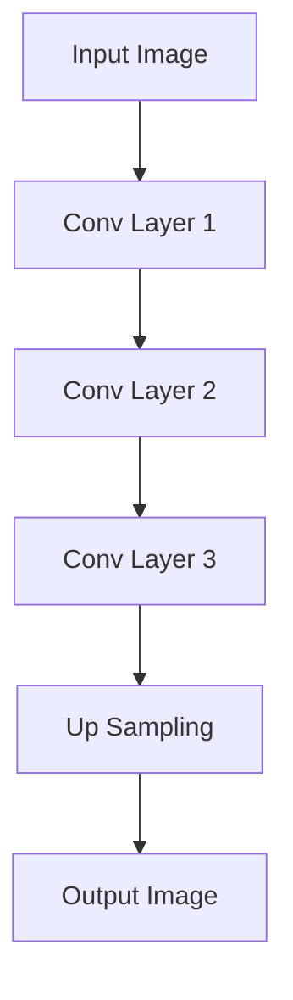
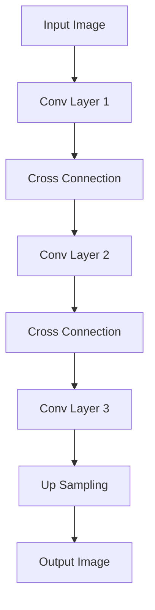
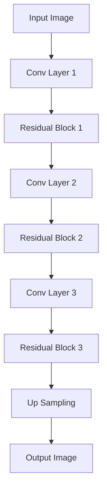
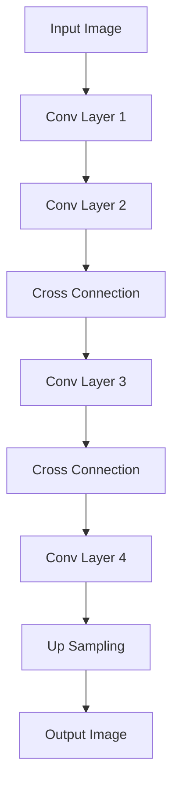
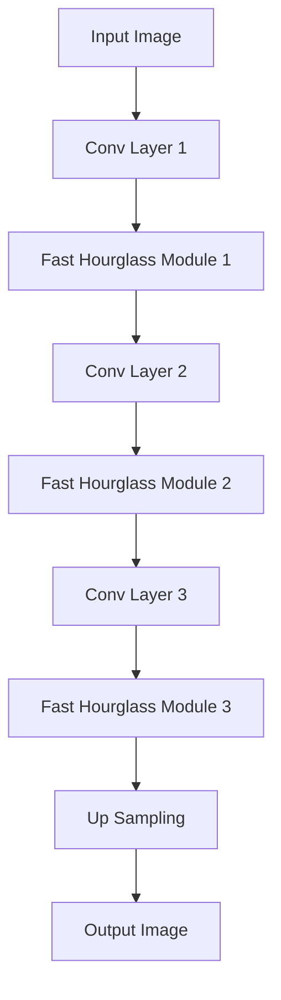
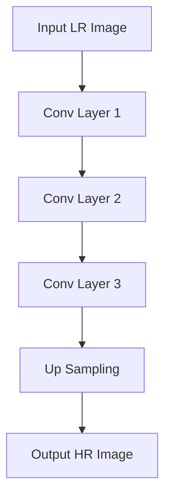
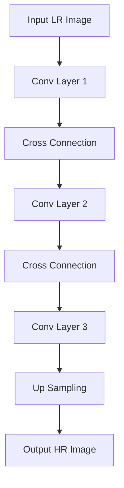
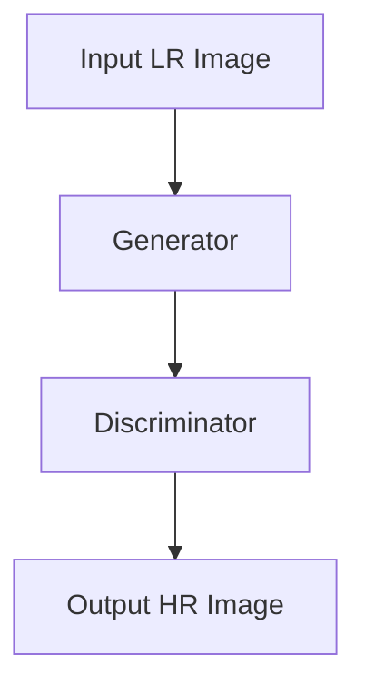

                 

# 《深度学习在图像超分辨率中的应用》

## 关键词

深度学习、图像超分辨率、神经网络、低分辨率图像重建、实时图像处理、移动设备优化

## 摘要

本文旨在探讨深度学习在图像超分辨率领域的应用。首先，介绍了图像超分辨率技术的基本概念、重要性和发展历程。接着，阐述了深度学习的基础理论及其在图像处理中的应用，为后续内容铺垫。本文重点分析了几种深度学习算法在图像超分辨率中的应用，包括基于神经网络的图像重建方法和优化策略。随后，讨论了深度学习在低分辨率图像重建、实时图像超分辨率以及移动设备图像超分辨率中的应用，并通过实际项目进行了案例分析。最后，总结了深度学习在图像超分辨率中的发展趋势和挑战，并对未来发展方向进行了展望。

## 目录大纲

### 第一部分：基础概念与算法

#### 第1章：图像超分辨率简介
- **1.1 图像超分辨率技术概述**
- **1.2 图像超分辨率的重要性**
- **1.3 图像超分辨率的应用领域**
- **1.4 图像超分辨率的发展历程**

#### 第2章：深度学习基础
- **2.1 深度学习的基本原理**
- **2.2 神经网络结构**
- **2.3 深度学习框架**

#### 第3章：深度学习在图像处理中的应用
- **3.1 深度学习在图像识别中的应用**
- **3.2 深度学习在图像分割中的应用**
- **3.3 深度学习在图像增强中的应用**

### 第二部分：深度学习算法原理

#### 第4章：图像超分辨率中的深度学习算法
- **4.1 传统超分辨率算法与深度学习算法的比较**
- **4.2 深度学习在图像超分辨率中的核心算法**
- **4.3 深度学习在图像超分辨率中的优化策略**

#### 第5章：深度学习中的数学模型
- **5.1 神经网络中的数学模型**
- **5.2 损失函数与优化算法**
- **5.3 深度学习中的正则化方法**

#### 第6章：深度学习中的数据预处理
- **6.1 图像数据集的收集与处理**
- **6.2 图像增强方法**
- **6.3 数据增强策略**

### 第三部分：深度学习在图像超分辨率中的应用

#### 第7章：深度学习在低分辨率图像重建中的应用
- **7.1 基于深度学习的低分辨率图像重建方法**
- **7.2 低分辨率图像重建中的深度学习算法案例**

#### 第8章：深度学习在实时图像超分辨率中的应用
- **8.1 实时图像超分辨率的技术挑战**
- **8.2 实时图像超分辨率的方法与实现**
- **8.3 实时图像超分辨率的应用场景**

#### 第9章：深度学习在移动设备图像超分辨率中的应用
- **9.1 移动设备图像超分辨率的硬件限制**
- **9.2 移动设备图像超分辨率的方法与实现**
- **9.3 移动设备图像超分辨率的应用案例**

### 第四部分：项目实战与评估

#### 第10章：图像超分辨率项目的实际应用
- **10.1 图像超分辨率项目的设计与实现**
- **10.2 图像超分辨率项目的评估与优化**

#### 第11章：深度学习在图像超分辨率中的应用前景
- **11.1 深度学习在图像超分辨率中的应用趋势**
- **11.2 深度学习在图像超分辨率中的应用挑战与展望**

#### 第12章：总结与展望
- **12.1 书籍总结**
- **12.2 深度学习在图像超分辨率中的未来发展方向**

### 附录

#### 附录A：深度学习在图像超分辨率中的应用资源
#### 附录B：深度学习在图像超分辨率中的常见问题与解答
#### 附录C：深度学习在图像超分辨率中的常用工具与框架简介

### 第1章：图像超分辨率简介

#### 1.1 图像超分辨率技术概述

图像超分辨率技术是指通过算法和计算手段，从低分辨率图像中恢复出更高分辨率图像的方法。这一技术在图像处理和计算机视觉领域具有重要应用价值。

**基本概念**：图像超分辨率技术的基本概念主要包括低分辨率图像和超分辨率图像。低分辨率图像通常是指图像像素数量较少、分辨率较低的图像，而超分辨率图像则是在低分辨率图像基础上通过算法重建出的高分辨率图像。

**发展背景**：随着计算机技术和图像处理算法的不断进步，图像超分辨率技术在过去几十年里得到了迅速发展。早期的图像超分辨率方法主要基于传统图像处理技术，如插值方法、图像增强和滤波等。随着深度学习的兴起，基于深度学习的图像超分辨率方法得到了广泛关注，并取得了显著成果。

**重要性**：图像超分辨率技术的重要性体现在以下几个方面：

1. **提升图像质量**：通过图像超分辨率技术，可以从低分辨率图像中恢复出更高分辨率的图像，提高图像的清晰度和细节表现，增强图像的视觉体验。
2. **增强图像信息**：图像超分辨率技术可以增强图像中的有用信息，如细节、纹理和结构等，对于图像分析、图像识别和图像理解等任务具有重要意义。
3. **节约存储资源**：通过减少图像数据的大小，图像超分辨率技术有助于节约存储资源，降低图像存储和传输的成本。

#### 1.2 图像超分辨率技术的基本原理

图像超分辨率技术的基本原理主要包括低分辨率图像重建和高分辨率图像生成。下面将详细阐述这两种原理：

**低分辨率图像重建**：低分辨率图像重建是指通过算法和计算手段，将低分辨率图像重建为更高分辨率的图像。常见的重建方法包括插值方法、图像增强和滤波等。

- **插值方法**：插值方法是通过在像素之间插入新像素来提升图像分辨率。常见的插值方法有线性插值、双线性插值和双三次插值等。
- **图像增强**：图像增强是指通过调整图像的亮度、对比度和色彩等参数，增强图像的视觉效果。常见的图像增强方法有直方图均衡化、对比度增强和锐化等。
- **滤波方法**：滤波方法是通过滤波器对图像进行滤波处理，去除图像中的噪声和模糊，从而提升图像分辨率。常见的滤波方法有均值滤波、高斯滤波和中值滤波等。

**高分辨率图像生成**：高分辨率图像生成是指通过算法和计算手段，从低分辨率图像中生成更高分辨率的图像。常见的生成方法包括基于神经网络的方法、基于生成对抗网络的方法和基于深度学习的超分辨率算法等。

- **基于神经网络的方法**：基于神经网络的方法利用深度学习模型，通过对低分辨率图像进行卷积和池化操作，生成高分辨率图像。常见的神经网络模型有卷积神经网络（CNN）、残差网络（ResNet）和生成对抗网络（GAN）等。
- **基于生成对抗网络的方法**：生成对抗网络（GAN）是一种由生成器和判别器组成的深度学习模型。生成器通过学习低分辨率图像的特征，生成高分辨率图像；判别器则通过学习判断生成图像的真实性和低分辨率图像的分辨率。通过生成器和判别器的相互博弈，生成高分辨率图像。
- **基于深度学习的超分辨率算法**：基于深度学习的超分辨率算法利用卷积神经网络（CNN）和残差网络（ResNet）等模型，对低分辨率图像进行特征提取和重建，生成高分辨率图像。常见的算法有ESPCN、VDSR、SRResNet和EDSR等。

#### 1.3 图像超分辨率的应用领域

图像超分辨率技术在多个领域具有广泛的应用，主要包括：

**医疗影像**：图像超分辨率技术在医疗影像处理中具有重要意义。通过提升医学图像的分辨率，可以更清晰地显示病变区域和组织结构，提高诊断的准确性和效率。例如，在医学影像领域，图像超分辨率技术可以用于提升X光片、CT扫描和MRI图像的分辨率，帮助医生更准确地诊断疾病。

**视频监控**：图像超分辨率技术在视频监控领域具有广泛的应用。通过提升监控视频的分辨率，可以更清晰地捕捉视频中的细节和目标，提高监控效果和安全性。例如，在视频监控领域，图像超分辨率技术可以用于提升监控视频的清晰度，帮助监控人员更准确地识别和分析视频内容。

**计算机视觉**：图像超分辨率技术在计算机视觉领域具有广泛的应用。通过提升图像的分辨率，可以更准确地识别和分类图像中的目标，提高图像识别和目标检测的准确性。例如，在计算机视觉领域，图像超分辨率技术可以用于提升图像识别算法的精度，提高自动驾驶车辆的识别准确性和安全性。

**图像增强与修复**：图像超分辨率技术在图像增强和修复领域也具有广泛的应用。通过提升图像的分辨率，可以增强图像的视觉效果和细节表现，修复图像中的缺失部分。例如，在图像增强和修复领域，图像超分辨率技术可以用于提升图像的清晰度、细节和色彩表现，修复图像中的划痕、斑点等缺陷。

**其他应用领域**：除了上述应用领域，图像超分辨率技术还在许多其他领域具有广泛的应用。例如，在遥感图像处理领域，图像超分辨率技术可以用于提升遥感图像的分辨率，帮助科学家更准确地分析地表特征和资源分布。在艺术创作和图像编辑领域，图像超分辨率技术可以用于增强图像的艺术效果和细节表现。

#### 1.4 图像超分辨率的发展历程

图像超分辨率技术经历了从传统方法到深度学习方法的发展历程。下面将简要回顾图像超分辨率技术的发展历程：

**早期方法**：早期的图像超分辨率方法主要基于传统图像处理技术，如插值方法、图像增强和滤波等。这些方法主要通过在像素之间进行插值、调整图像的亮度、对比度和色彩等参数，以及通过滤波器去除图像中的噪声和模糊，从而提升图像分辨率。然而，这些传统方法在处理复杂图像时存在一定的局限性，难以获得高质量的重建效果。

**基于学习的方法**：随着深度学习的兴起，基于学习的方法在图像超分辨率领域得到了广泛应用。深度学习方法利用大规模的图像数据集进行训练，通过学习图像的特征和模式，生成高分辨率图像。常见的基于学习的方法包括卷积神经网络（CNN）、残差网络（ResNet）和生成对抗网络（GAN）等。这些方法在处理复杂图像时具有更高的重建效果和灵活性。

**最新研究进展**：近年来，图像超分辨率技术取得了许多新的研究成果。研究人员提出了一系列新的深度学习模型和优化策略，如ESPCN、VDSR、SRResNet、EDSR等，进一步提升了图像超分辨率的重建效果和速度。同时，深度学习在实时图像处理、移动设备图像处理等领域的应用也得到了广泛关注。

### Mermaid 流程图

graph TD
    A[传统图像超分辨率方法] --> B[基于学习的方法]
    B --> C[卷积神经网络]
    C --> D[生成对抗网络]
    C --> E[其他深度学习模型]
    F[最新研究进展] --> G[优化策略]

## 第一部分：基础概念与算法

### 第1章：图像超分辨率简介

#### 1.1 图像超分辨率技术概述

图像超分辨率技术是一种通过算法和计算手段，将低分辨率图像重建为更高分辨率图像的方法。它通过增强图像的细节、清晰度和纹理信息，提升图像的视觉质量。图像超分辨率技术在多个领域具有广泛的应用，如医疗影像、视频监控、计算机视觉和图像增强等。

**定义**：图像超分辨率（Image Super-Resolution）是指利用计算机算法和数学模型，从给定的低分辨率图像中恢复出更高分辨率图像的过程。超分辨率图像在像素数量和图像质量上都比原始低分辨率图像有显著提升。

**技术发展**：图像超分辨率技术经历了从传统方法到深度学习方法的演变。早期的图像超分辨率方法主要基于图像插值、图像增强和滤波等传统图像处理技术。随着深度学习的兴起，基于深度学习的超分辨率方法逐渐成为研究热点，并在实际应用中取得了显著成效。

#### 1.2 图像超分辨率的重要性

图像超分辨率技术在多个方面具有重要价值：

1. **提升图像质量**：通过超分辨率技术，可以从低分辨率图像中提取更多的细节和结构信息，提高图像的视觉清晰度和质量。
2. **增强图像信息**：超分辨率技术可以增强图像中的有用信息，如边缘、纹理和形状等，有助于后续的图像分析和处理任务。
3. **节约存储资源**：通过降低图像数据的大小，超分辨率技术有助于节约存储空间和减少数据传输的成本。
4. **医学影像诊断**：在医学影像领域，超分辨率技术可以提升图像的分辨率，帮助医生更准确地诊断疾病和评估病情。
5. **视频监控与安全**：在视频监控领域，超分辨率技术可以提升监控视频的清晰度，有助于识别和追踪视频中的目标，提高监控效果和安全性。

#### 1.3 图像超分辨率的应用领域

图像超分辨率技术在多个领域具有广泛应用：

1. **医疗影像**：在医学影像领域，超分辨率技术可以提升X光片、CT扫描和MRI图像的分辨率，帮助医生更准确地诊断疾病和评估病情。
2. **视频监控**：在视频监控领域，超分辨率技术可以提升监控视频的清晰度，帮助监控人员更清晰地观察和识别监控区域的目标。
3. **计算机视觉**：在计算机视觉领域，超分辨率技术可以提高图像识别、目标检测和物体追踪的准确性，有助于实现更智能化的视觉系统。
4. **图像增强与修复**：在图像增强和修复领域，超分辨率技术可以修复图像中的缺失部分，增强图像的视觉效果和细节表现。
5. **遥感图像处理**：在遥感图像处理领域，超分辨率技术可以提升遥感图像的分辨率，帮助科学家更准确地分析地表特征和资源分布。

#### 1.4 图像超分辨率的发展历程

图像超分辨率技术经历了从传统方法到深度学习方法的发展历程：

1. **传统方法**：早期的图像超分辨率方法主要基于传统图像处理技术，如插值方法、图像增强和滤波等。这些方法在处理简单图像时具有一定的效果，但在处理复杂图像时存在局限性。
2. **基于学习的方法**：随着深度学习的兴起，基于学习的方法逐渐成为图像超分辨率技术的研究热点。这些方法利用深度学习模型，通过学习大量的图像数据，能够自动提取图像特征并进行超分辨率重建。
3. **深度学习方法**：近年来，深度学习方法在图像超分辨率领域取得了显著进展。常见的深度学习方法包括卷积神经网络（CNN）、生成对抗网络（GAN）和自编码器（Autoencoder）等。这些方法通过学习图像的特征和模式，能够生成高质量的超分辨率图像。

#### 1.5 图像超分辨率的基本原理

图像超分辨率的基本原理主要包括低分辨率图像重建和高分辨率图像生成：

1. **低分辨率图像重建**：低分辨率图像重建是指通过算法和计算手段，将低分辨率图像转换为更高分辨率的图像。常见的重建方法包括插值方法、图像增强和滤波等。这些方法通过在像素之间插入新像素或调整像素的亮度、对比度和色彩等参数，实现图像的分辨率提升。
2. **高分辨率图像生成**：高分辨率图像生成是指通过算法和计算手段，从低分辨率图像中生成更高分辨率的图像。常见的生成方法包括基于神经网络的方法、基于生成对抗网络的方法和基于深度学习的超分辨率算法等。这些方法通过学习图像的特征和模式，能够自动生成高质量的图像。

#### 1.6 图像超分辨率技术的核心算法

图像超分辨率技术的核心算法主要包括以下几种：

1. **插值方法**：插值方法是一种简单的图像超分辨率方法，通过在像素之间进行插值，生成更高分辨率的图像。常见的插值方法包括线性插值、双线性插值和双三次插值等。
2. **图像增强方法**：图像增强方法通过调整图像的亮度、对比度和色彩等参数，增强图像的视觉效果和细节表现。常见的图像增强方法包括直方图均衡化、对比度增强和锐化等。
3. **滤波方法**：滤波方法通过滤波器对图像进行滤波处理，去除图像中的噪声和模糊，从而提升图像分辨率。常见的滤波方法包括均值滤波、高斯滤波和中值滤波等。
4. **基于神经网络的方法**：基于神经网络的方法利用深度学习模型，通过对低分辨率图像进行卷积和池化操作，生成高分辨率图像。常见的神经网络模型包括卷积神经网络（CNN）、残差网络（ResNet）和生成对抗网络（GAN）等。
5. **基于生成对抗网络的方法**：生成对抗网络（GAN）是一种由生成器和判别器组成的深度学习模型。生成器通过学习低分辨率图像的特征，生成高分辨率图像；判别器则通过学习判断生成图像的真实性和低分辨率图像的分辨率。通过生成器和判别器的相互博弈，生成高质量的高分辨率图像。
6. **基于深度学习的超分辨率算法**：基于深度学习的超分辨率算法利用卷积神经网络（CNN）和残差网络（ResNet）等模型，对低分辨率图像进行特征提取和重建，生成高分辨率图像。常见的算法包括ESPCN、VDSR、SRResNet和EDSR等。

### 第2章：深度学习基础

#### 2.1 深度学习的基本原理

深度学习（Deep Learning）是一种人工智能（AI）技术，通过构建多层神经网络模型，从大量数据中自动提取特征并进行学习，从而实现各种复杂任务。深度学习在图像识别、语音识别、自然语言处理等领域取得了显著成果。

**神经网络**：神经网络（Neural Network）是深度学习的基础模型，由多个神经元（Node）组成，通过连接和权重（Weight）实现信息的传递和处理。神经网络通过学习输入数据与输出数据之间的映射关系，实现自动特征提取和模式识别。

**多层神经网络**：多层神经网络（Multi-Layer Neural Network）包含多个隐藏层（Hidden Layer），通过逐层提取特征，实现更复杂的任务。多层神经网络在处理非线性问题时具有优势。

**反向传播算法**：反向传播算法（Backpropagation Algorithm）是多层神经网络的学习算法，通过误差反向传播，调整网络的权重和偏置，优化模型性能。

**损失函数**：损失函数（Loss Function）是评估模型预测结果与实际结果之间差异的指标。常见的损失函数包括均方误差（MSE）、交叉熵（Cross-Entropy）等。

**优化算法**：优化算法（Optimization Algorithm）用于调整网络的权重和偏置，优化模型性能。常见的优化算法包括梯度下降（Gradient Descent）、随机梯度下降（SGD）、Adam等。

#### 2.2 神经网络结构

神经网络的结构决定了其学习和处理数据的能力。以下是几种常见的神经网络结构：

**前馈神经网络**：前馈神经网络（Feedforward Neural Network）是最简单的神经网络结构，数据从输入层（Input Layer）通过隐藏层（Hidden Layer）传递到输出层（Output Layer），没有反向传播。

**卷积神经网络**：卷积神经网络（Convolutional Neural Network，CNN）是一种专门用于处理图像数据的神经网络。CNN通过卷积操作提取图像特征，具有局部感知和共享权重等特性。

**循环神经网络**：循环神经网络（Recurrent Neural Network，RNN）适用于序列数据建模，通过循环结构处理输入数据的时序信息。常见的RNN包括LSTM（Long Short-Term Memory）和GRU（Gated Recurrent Unit）等。

**生成对抗网络**：生成对抗网络（Generative Adversarial Network，GAN）由生成器和判别器组成，通过对抗训练生成高质量的数据。

#### 2.3 深度学习框架

深度学习框架（Deep Learning Framework）是用于实现和训练深度学习模型的工具集。常见的深度学习框架包括TensorFlow、PyTorch、Keras等。

**TensorFlow**：TensorFlow是Google开发的开源深度学习框架，支持多种深度学习模型和算法，具有强大的计算能力和灵活性。

**PyTorch**：PyTorch是Facebook开发的开源深度学习框架，以动态计算图（Dynamic Computation Graph）为特点，易于实现自定义模型和算法。

**Keras**：Keras是TensorFlow和Theano的高层次封装框架，提供简洁、易于使用的API，适合快速实验和开发。

#### 2.4 深度学习在图像处理中的应用

深度学习在图像处理领域具有广泛的应用，包括图像分类、目标检测、图像分割、图像增强等。

**图像分类**：深度学习模型如卷积神经网络（CNN）和残差网络（ResNet）在图像分类任务中取得了优异成绩，广泛应用于计算机视觉任务。

**目标检测**：目标检测（Object Detection）是图像处理中的重要任务，深度学习方法如YOLO（You Only Look Once）和Faster R-CNN在目标检测领域取得了显著成果。

**图像分割**：图像分割（Image Segmentation）是将图像分为不同的区域或类别的过程。深度学习方法如U-Net和SegNet在图像分割任务中表现出色。

**图像增强**：图像增强（Image Enhancement）是通过算法和计算手段提升图像质量和视觉效果的过程。深度学习模型如GAN和基于CNN的方法在图像增强任务中取得了良好效果。

#### 2.5 深度学习在图像超分辨率中的应用

深度学习在图像超分辨率领域具有广泛应用，通过学习图像特征和模式，生成高质量的超分辨率图像。

**基于神经网络的方法**：基于神经网络的方法如ESPCN、VDSR和SRResNet等，通过卷积神经网络（CNN）提取图像特征，实现图像超分辨率。

**生成对抗网络（GAN）**：生成对抗网络（GAN）通过生成器和判别器的对抗训练，生成高质量的超分辨率图像。GAN在图像超分辨率任务中取得了显著成果，如SRGAN等。

**自编码器（Autoencoder）**：自编码器（Autoencoder）是一种无监督学习模型，通过编码器（Encoder）和解码器（Decoder）学习图像特征，生成高质量的超分辨率图像。

### 第3章：深度学习在图像处理中的应用

#### 3.1 深度学习在图像识别中的应用

图像识别（Image Recognition）是计算机视觉中的重要任务，深度学习在图像识别中取得了显著的成果。深度学习模型如卷积神经网络（CNN）和残差网络（ResNet）在图像分类、物体检测和场景识别等领域表现出色。

**卷积神经网络（CNN）**：卷积神经网络（CNN）是一种专门用于图像识别的神经网络，通过卷积操作提取图像特征，实现图像分类和物体检测。CNN在图像识别任务中取得了优异成绩，如ImageNet图像识别挑战赛。

**残差网络（ResNet）**：残差网络（ResNet）是深度学习中的里程碑式模型，通过引入残差连接，解决了深度神经网络训练过程中的梯度消失和梯度爆炸问题。ResNet在图像识别任务中表现出色，广泛应用于各种计算机视觉任务。

**迁移学习**：迁移学习（Transfer Learning）是一种利用预训练模型进行图像识别的方法。通过将预训练模型应用于新的图像识别任务，迁移学习可以快速提高模型的性能，减少训练数据的需求。

#### 3.2 深度学习在图像分割中的应用

图像分割（Image Segmentation）是将图像划分为不同的区域或类别的过程，深度学习在图像分割中具有广泛应用。

**U-Net**：U-Net是一种用于医学图像分割的卷积神经网络，通过设计独特的网络结构，实现了高精度的图像分割。U-Net在医学图像分割任务中取得了显著成果，广泛应用于医疗诊断和疾病检测。

**SegNet**：SegNet是一种用于图像分割的深度学习模型，通过编码器（Encoder）和解码器（Decoder）学习图像特征，实现高精度的图像分割。SegNet在图像分割任务中表现出色，广泛应用于计算机视觉领域。

**语义分割**：语义分割（Semantic Segmentation）是将图像中的每个像素划分为不同的类别。深度学习模型如FCN（Fully Convolutional Network）和DeepLab V3+在语义分割任务中取得了优异成绩。

#### 3.3 深度学习在图像增强中的应用

图像增强（Image Enhancement）是通过算法和计算手段提升图像质量和视觉效果的过程，深度学习在图像增强中具有广泛应用。

**生成对抗网络（GAN）**：生成对抗网络（GAN）通过生成器和判别器的对抗训练，生成高质量的超分辨率图像和增强图像。GAN在图像增强任务中取得了显著成果，如SRGAN和EDGAN等。

**深度卷积神经网络（CNN）**：深度卷积神经网络（CNN）通过卷积操作提取图像特征，实现图像增强。CNN在图像增强任务中表现出色，广泛应用于图像去噪、图像锐化和图像修复等。

**自编码器（Autoencoder）**：自编码器（Autoencoder）是一种无监督学习模型，通过编码器（Encoder）和解码器（Decoder）学习图像特征，实现图像增强。自编码器在图像增强任务中表现出色，广泛应用于图像去噪和图像压缩等。

### 第4章：图像超分辨率中的深度学习算法

#### 4.1 传统超分辨率算法与深度学习算法的比较

图像超分辨率技术在过去的几十年里经历了从传统方法到深度学习方法的演变。传统超分辨率算法主要基于图像插值、图像增强和滤波等技术，而深度学习算法则通过构建多层神经网络模型，从数据中自动提取特征，实现更高精度的图像重建。

**传统超分辨率算法**：

1. **图像插值方法**：图像插值方法通过在像素之间进行插值，生成更高分辨率的图像。常见的插值方法有线性插值、双线性插值和双三次插值等。这些方法简单易行，但在处理复杂图像时效果有限。
2. **图像增强方法**：图像增强方法通过调整图像的亮度、对比度和色彩等参数，增强图像的视觉效果。常见的图像增强方法有直方图均衡化、对比度增强和锐化等。这些方法在一定程度上提高了图像质量，但仍然受到传统图像处理技术的限制。
3. **滤波方法**：滤波方法通过滤波器对图像进行滤波处理，去除图像中的噪声和模糊，从而提升图像分辨率。常见的滤波方法有均值滤波、高斯滤波和中值滤波等。这些方法在去噪和图像平滑方面表现较好，但在分辨率提升方面存在局限性。

**深度学习算法**：

1. **卷积神经网络（CNN）**：卷积神经网络（CNN）是一种专门用于图像处理的深度学习模型，通过卷积操作提取图像特征，实现图像超分辨率。CNN在图像特征提取和模式识别方面具有优势，能够生成更高质量的图像。
2. **生成对抗网络（GAN）**：生成对抗网络（GAN）是一种由生成器和判别器组成的深度学习模型。生成器通过学习低分辨率图像的特征，生成高分辨率图像；判别器则通过学习判断生成图像的真实性和低分辨率图像的分辨率。通过生成器和判别器的相互博弈，GAN能够生成高质量的超分辨率图像。
3. **自编码器（Autoencoder）**：自编码器（Autoencoder）是一种无监督学习模型，通过编码器（Encoder）和解码器（Decoder）学习图像特征，实现图像超分辨率。自编码器在图像特征提取和重建方面具有优势，能够生成更高质量的图像。

**比较**：

1. **性能**：深度学习算法在图像超分辨率任务中取得了显著的性能提升，能够生成更高分辨率的图像。与传统超分辨率算法相比，深度学习算法在处理复杂图像时具有更好的重建效果。
2. **灵活性**：深度学习算法通过学习图像特征和模式，具有更强的灵活性和泛化能力。传统超分辨率算法通常依赖于固定的模型和参数，难以适应不同的图像数据和应用场景。
3. **计算成本**：深度学习算法通常需要较大的计算资源和时间进行训练和推理。随着计算技术的不断发展，深度学习算法在计算成本方面也在逐渐降低。
4. **应用场景**：传统超分辨率算法在处理简单图像和特定任务时具有一定的效果，但深度学习算法在复杂图像和多样应用场景中具有更广泛的应用前景。

#### 4.2 深度学习在图像超分辨率中的核心算法

深度学习在图像超分辨率领域提出了多种核心算法，下面介绍几种典型的算法：

**ESPCN（EccVSR）**：

ESPCN是一种基于卷积神经网络的图像超分辨率算法，通过逐层卷积操作提取图像特征，实现图像超分辨率。ESPCN的网络结构简单，参数较少，适用于实时图像超分辨率应用。



**VDSR（Very Deep Super-Resolution）**：

VDSR是一种基于深度卷积神经网络的图像超分辨率算法，通过多个卷积层和跨层连接结构，实现图像超分辨率。VDSR在图像细节和纹理保留方面表现出色。



**SRResNet（Super-Resolution Residual Network）**：

SRResNet是一种基于残差学习的图像超分辨率算法，通过引入残差块和跨层连接结构，实现图像超分辨率。SRResNet在图像分辨率提升和细节保留方面具有优势。



**EDSR（EccVSR-Dual Path Network）**：

EDSR是一种基于深度卷积神经网络和生成对抗网络的图像超分辨率算法，通过双重路径结构和深度残差网络，实现图像超分辨率。EDSR在图像细节和纹理保留方面表现出色。



**FHRNet（Fast High-Resolution Network）**：

FHRNet是一种基于深度卷积神经网络和快速卷积操作的图像超分辨率算法，通过引入快速卷积模块，实现快速和高效的图像超分辨率。FHRNet在速度和性能方面具有优势。



#### 4.3 深度学习在图像超分辨率中的优化策略

为了提高图像超分辨率的性能和效率，深度学习算法需要采用多种优化策略：

**数据增强**：

数据增强（Data Augmentation）是一种通过变换输入数据，增加训练数据多样性的方法。常见的数据增强方法包括随机裁剪、旋转、翻转、缩放和噪声添加等。数据增强有助于提高模型的泛化能力，避免过拟合。

```python
import cv2
import numpy as np

def random_crop(image, crop_size):
    height, width, _ = image.shape
    x = np.random.randint(0, width - crop_size[1])
    y = np.random.randint(0, height - crop_size[0])
    return image[y:y+crop_size[0], x:x+crop_size[1]]

def random_flip(image):
    if np.random.rand() > 0.5:
        return cv2.flip(image, 0)
    else:
        return image

def random_rotate(image):
    angle = np.random.randint(-45, 45)
    return cv2.rotate(image, angle)
```

**损失函数**：

损失函数（Loss Function）是评估模型预测结果与实际结果之间差异的指标。在图像超分辨率任务中，常见的损失函数包括均方误差（MSE）、结构相似性指数（SSIM）和感知损失（Perceptual Loss）等。通过优化损失函数，可以提高模型的重建效果。

```python
import tensorflow as tf

def mean_squared_error(y_true, y_pred):
    return tf.reduce_mean(tf.square(y_true - y_pred))

def structural_similarity(y_true, y_pred):
    return tf.reduce_mean(tf.reduce_sum(tf.square(tf.image.ssim(y_true, y_pred, 1.0, 33.0)), axis=-1))

def perceptual_loss(y_true, y_pred):
    return tf.reduce_mean(tf.reduce_sum(tf.square(tf.image.perceptual_hash(y_true) - tf.image.perceptual_hash(y_pred)), axis=-1))
```

**优化算法**：

优化算法（Optimization Algorithm）用于调整模型的权重和偏置，优化模型的性能。常见的优化算法包括梯度下降（Gradient Descent）、随机梯度下降（SGD）和Adam等。通过选择合适的优化算法，可以提高模型的训练效率和性能。

```python
import tensorflow as tf

optimizer = tf.keras.optimizers.Adam(learning_rate=0.001)
```

**权重初始化**：

权重初始化（Weight Initialization）是模型训练过程中重要的步骤。合适的权重初始化有助于提高模型的收敛速度和性能。常见的权重初始化方法包括高斯初始化（Gaussian Initialization）和Xavier初始化（Xavier Initialization）等。

```python
import tensorflow as tf

def xavier_initializer(shape, dtype=tf.float32, seed=None):
    return tf.random.normal(shape, dtype=dtype, mean=0.0, stddev=tf.sqrt(2 / tf.reduce_sum(shape)))

weights = xavier_initializer([filter_height, filter_width, in_channels, out_channels])
```

### 第5章：深度学习中的数学模型

#### 5.1 神经网络中的数学模型

神经网络（Neural Network）是深度学习的基础模型，其核心组成部分包括神经元、权重和偏置。神经网络通过数学模型实现信息的传递和处理。

**神经元**：

神经元是神经网络的基本计算单元，其功能类似于生物神经元。神经元接收输入信号，通过权重和偏置进行加权求和，然后通过激活函数进行非线性变换，输出结果。

**权重**：

权重是神经元之间的连接权重，用于调整输入信号的重要性。在训练过程中，通过反向传播算法调整权重，以优化模型性能。

**偏置**：

偏置是神经元内部的偏置项，用于调整神经元的阈值。偏置有助于提高神经网络的泛化能力。

**激活函数**：

激活函数（Activation Function）是神经网络中的非线性变换，用于引入非线性因素，提高模型的拟合能力。常见的激活函数包括Sigmoid、ReLU和Tanh等。

**数学模型**：

神经网络的数学模型可以表示为：

$$
Y = \sigma(WX + b)
$$

其中，$Y$是输出值，$W$是权重矩阵，$X$是输入值，$b$是偏置项，$\sigma$是激活函数。

#### 5.2 损失函数与优化算法

损失函数（Loss Function）用于评估模型预测结果与实际结果之间的差异，优化算法（Optimization Algorithm）用于调整模型参数，以最小化损失函数。

**损失函数**：

常见的损失函数包括均方误差（MSE）、交叉熵（Cross-Entropy）和感知损失（Perceptual Loss）等。

1. **均方误差（MSE）**：

均方误差（MSE）是评估预测值与真实值之间差异的常用损失函数，其数学模型如下：

$$
MSE = \frac{1}{n}\sum_{i=1}^{n}(Y_i - \hat{Y}_i)^2
$$

其中，$Y_i$是真实值，$\hat{Y}_i$是预测值，$n$是样本数量。

2. **交叉熵（Cross-Entropy）**：

交叉熵（Cross-Entropy）是评估分类问题预测结果与真实标签之间差异的损失函数，其数学模型如下：

$$
Cross-Entropy = -\frac{1}{n}\sum_{i=1}^{n}y_i\log(\hat{y}_i)
$$

其中，$y_i$是真实标签，$\hat{y}_i$是预测概率。

3. **感知损失（Perceptual Loss）**：

感知损失（Perceptual Loss）是评估图像超分辨率任务预测结果与真实图像之间差异的损失函数，其数学模型如下：

$$
Perceptual Loss = \frac{1}{n}\sum_{i=1}^{n}\frac{1}{H\times W}\sum_{j=1}^{H}\sum_{k=1}^{W}\frac{1}{\sqrt{H\times W}}\cdot\sum_{l=1}^{C}\left|\phi_{\text{VGG}}(I_i)_{j,k,l} - \phi_{\text{VGG}}(\hat{I}_i)_{j,k,l}\right|
$$

其中，$I_i$是真实图像，$\hat{I}_i$是预测图像，$\phi_{\text{VGG}}$是VGG网络的特征提取层。

**优化算法**：

常见的优化算法包括梯度下降（Gradient Descent）、随机梯度下降（SGD）和Adam等。

1. **梯度下降（Gradient Descent）**：

梯度下降是一种基于梯度的优化算法，其基本思想是通过计算损失函数关于模型参数的梯度，并沿着梯度的反方向更新参数，以最小化损失函数。

$$
\theta_{t+1} = \theta_{t} - \alpha \cdot \nabla_{\theta}J(\theta)
$$

其中，$\theta$是模型参数，$J(\theta)$是损失函数，$\alpha$是学习率。

2. **随机梯度下降（SGD）**：

随机梯度下降（SGD）是对梯度下降算法的一种改进，其基本思想是在每次更新参数时，随机选择一部分样本计算梯度，并沿着梯度的反方向更新参数。

$$
\theta_{t+1} = \theta_{t} - \alpha \cdot \nabla_{\theta}J(\theta; \xi_t)
$$

其中，$\xi_t$是随机选择的样本。

3. **Adam**：

Adam是一种结合SGD和动量法的优化算法，其基本思想是利用一阶矩估计和二阶矩估计来更新参数。

$$
\theta_{t+1} = \theta_{t} - \alpha \cdot \nabla_{\theta}J(\theta)
$$

$$
m_t = \beta_1 m_{t-1} + (1 - \beta_1) \cdot \nabla_{\theta}J(\theta)
$$

$$
v_t = \beta_2 v_{t-1} + (1 - \beta_2) \cdot (\nabla_{\theta}J(\theta))^2
$$

其中，$m_t$和$v_t$分别是参数的一阶矩估计和二阶矩估计，$\beta_1$和$\beta_2$是超参数。

#### 5.3 深度学习中的正则化方法

正则化方法（Regularization Method）是深度学习中用于防止过拟合的重要手段，其核心思想是引入额外的惩罚项，调整模型参数的更新方向。

**L1正则化**：

L1正则化（L1 Regularization）通过引入L1范数惩罚项，鼓励模型参数的稀疏性。

$$
\text{Loss} = \sum_{i=1}^{n}(Y_i - \hat{Y}_i)^2 + \lambda \cdot \sum_{j=1}^{m}|\theta_j|
$$

其中，$\lambda$是正则化参数，$m$是参数数量。

**L2正则化**：

L2正则化（L2 Regularization）通过引入L2范数惩罚项，鼓励模型参数的平滑性。

$$
\text{Loss} = \sum_{i=1}^{n}(Y_i - \hat{Y}_i)^2 + \lambda \cdot \sum_{j=1}^{m}\theta_j^2
$$

**Dropout**：

Dropout是一种通过随机丢弃神经元来防止过拟合的方法。在训练过程中，随机丢弃一部分神经元，减少模型的复杂度。

**Early Stopping**：

Early Stopping是一种在模型训练过程中提前停止训练的方法。当模型在验证集上的性能不再提升时，提前停止训练，避免过拟合。

### 第6章：深度学习中的数据预处理

#### 6.1 图像数据集的收集与处理

图像数据集的收集与处理是深度学习项目中的关键步骤，其质量直接影响到模型的性能和泛化能力。以下是一些关于图像数据集收集与处理的详细内容：

**数据集收集**：

1. **公开数据集**：许多公开数据集可供使用，如ImageNet、CIFAR-10、MNIST等。这些数据集已经过整理，并广泛用于学术研究和工业应用。
2. **自定义数据集**：根据特定任务的需求，可以收集和整理自定义数据集。例如，对于自动驾驶项目，可以收集道路图像数据集；对于医学图像分析项目，可以收集医学影像数据集。
3. **数据清洗**：收集到的图像数据集中可能包含噪声、异常值和重复图像。需要通过数据清洗算法去除噪声和异常值，并确保图像的完整性和一致性。

**数据预处理**：

1. **图像尺寸调整**：为了使模型适应不同的图像尺寸，通常需要对图像进行尺寸调整。常见的方法包括等比例缩放、裁剪和填充等。
2. **图像归一化**：通过将图像的像素值缩放到特定范围（如[0, 1]或[-1, 1]），可以减少模型对输入数据范围的依赖性。
3. **数据增强**：数据增强（Data Augmentation）是一种通过变换输入数据，增加训练数据多样性的方法。常见的数据增强方法包括随机裁剪、旋转、翻转、缩放、亮度调整和色彩抖动等。
4. **数据标准化**：对于某些深度学习模型，如卷积神经网络（CNN），可以采用数据标准化（Data Standardization）方法，将图像的像素值转换为标准正态分布。

#### 6.2 图像增强方法

图像增强（Image Enhancement）是通过算法和计算手段提升图像质量和视觉效果的过程。以下是一些常见的图像增强方法：

1. **对比度增强**：对比度增强通过调整图像的亮度和对比度，提高图像的视觉效果。常用的方法包括直方图均衡化（Histogram Equalization）和拉直变换（Laplace Transform）等。
2. **锐化**：锐化通过增强图像的边缘和细节，提高图像的清晰度。常用的方法包括高斯锐化（Gaussian Sharpening）和拉普拉斯锐化（Laplacian Sharpening）等。
3. **去噪**：去噪通过去除图像中的噪声，提高图像的清晰度和质量。常用的方法包括均值滤波（Mean Filtering）、高斯滤波（Gaussian Filtering）和中值滤波（Median Filtering）等。
4. **图像融合**：图像融合是将多个图像合并为一个高质量图像的过程。常用的方法包括多尺度图像融合（Multi-Scale Image Fusion）和同态滤波（Homomorphic Filtering）等。

#### 6.3 数据增强策略

数据增强策略（Data Augmentation Strategy）是深度学习项目中提高模型泛化能力和减少过拟合的有效手段。以下是一些常见的数据增强策略：

1. **随机裁剪**：随机裁剪（Random Crop）通过从原始图像中随机裁剪一个区域作为样本。常用的方法包括中心裁剪（Center Crop）和随机裁剪（Random Crop）等。
2. **随机旋转**：随机旋转（Random Rotation）通过将图像随机旋转一定角度。常用的方法包括90度旋转（90 Degree Rotation）和随机角度旋转（Random Angle Rotation）等。
3. **随机翻转**：随机翻转（Random Flip）通过将图像沿水平轴或垂直轴随机翻转。常用的方法包括水平翻转（Horizontal Flip）和垂直翻转（Vertical Flip）等。
4. **缩放**：缩放（Scaling）通过调整图像的大小。常用的方法包括等比例缩放（Uniform Scaling）和随机缩放（Random Scaling）等。
5. **颜色抖动**：颜色抖动（Color Jittering）通过随机调整图像的亮度和颜色。常用的方法包括亮度调整（Brightness Adjustment）和色彩调整（Color Adjustment）等。

### 第7章：深度学习在低分辨率图像重建中的应用

#### 7.1 基于深度学习的低分辨率图像重建方法

低分辨率图像重建是图像超分辨率技术中的重要任务，其目的是从低分辨率图像中恢复出高分辨率的细节信息。近年来，深度学习技术在低分辨率图像重建领域取得了显著进展，以下介绍几种基于深度学习的低分辨率图像重建方法：

**基于卷积神经网络的方法**：

卷积神经网络（CNN）是一种有效的图像特征提取和重建模型，在低分辨率图像重建中得到了广泛应用。CNN通过多层卷积和池化操作，可以自动学习图像的底层和高级特征，从而实现低分辨率图像的高分辨率重建。

- **基于逐层重建的方法**：该方法通过逐层重建的方式，从低分辨率图像中逐层恢复出高分辨率图像。例如，ESPCN（EccVSR）和VDSR（Very Deep Super-Resolution）等算法都采用了逐层重建的方法。其中，ESPCN采用了三个卷积层，每个卷积层负责重建图像的一部分细节；VDSR则通过多个卷积层和跨层连接结构，实现了更精细的细节重建。

- **基于残差网络的方法**：残差网络（ResNet）通过引入残差块，解决了深层网络训练过程中的梯度消失问题。SRResNet（Super-Resolution Residual Network）是基于残差网络的一种低分辨率图像重建算法，它通过残差块和跨层连接结构，有效地提取和重建图像的细节信息。SRResNet在多个图像超分辨率比赛中取得了优异成绩。

- **基于生成对抗网络的方法**：生成对抗网络（GAN）由生成器和判别器组成，通过对抗训练生成高质量的数据。在低分辨率图像重建中，GAN通过生成器学习低分辨率图像的特征，生成高分辨率图像；判别器则通过学习判断生成图像的真实性和低分辨率图像的分辨率。GAN在图像超分辨率任务中取得了显著成果，例如SRGAN（Super-Resolution GAN）和EDSR（EccVSR-Dual Path Network）等。

**基于自编码器的方法**：

自编码器（Autoencoder）是一种无监督学习模型，通过编码器（Encoder）和解码器（Decoder）学习图像的特征，实现低分辨率图像的高分辨率重建。自编码器通过自动学习图像的压缩和重构过程，提取图像的底层特征，并利用这些特征实现高分辨率重建。

- **标准自编码器**：标准自编码器由一个编码器和一个解码器组成，编码器负责将输入数据压缩成一个低维度的特征向量，解码器则负责将特征向量重构为输出数据。在低分辨率图像重建中，标准自编码器可以通过训练学习图像的特征，从而实现高分辨率图像的重建。

- **变分自编码器**：变分自编码器（Variational Autoencoder，VAE）是一种基于概率模型的自编码器，通过引入先验分布和后验分布，实现了更灵活的特征提取和重构过程。VAE在低分辨率图像重建中具有优势，可以生成更加多样化和高质量的图像。

- **去噪自编码器**：去噪自编码器（Denoising Autoencoder，DAE）是一种通过学习噪声数据的特征，实现去噪和重构的自编码器。在低分辨率图像重建中，去噪自编码器可以有效地去除图像中的噪声，从而提高图像的清晰度和质量。

**基于混合模型的方法**：

混合模型（Hybrid Model）是结合多种深度学习模型的优势，实现低分辨率图像重建的方法。常见的混合模型包括CNN+GAN、CNN+VAE和CNN+ResNet等。

- **CNN+GAN**：CNN+GAN结合了CNN和GAN的优点，通过CNN提取图像特征，GAN生成高分辨率图像。这种方法在图像超分辨率任务中取得了很好的效果，例如SRGAN和EDSR等。

- **CNN+VAE**：CNN+VAE结合了CNN和VAE的优点，通过CNN提取图像特征，VAE实现图像的压缩和重构。这种方法可以生成更加自然和高质量的高分辨率图像。

- **CNN+ResNet**：CNN+ResNet结合了CNN和残差网络的优点，通过CNN提取图像特征，ResNet实现图像的重建和细节恢复。这种方法在低分辨率图像重建中具有很好的效果，例如SRResNet等。

**应用案例**：

以下是一些基于深度学习的低分辨率图像重建的应用案例：

1. **医疗影像重建**：在医学影像领域，深度学习技术可以用于低分辨率医学影像的重建，从而提高图像的清晰度和诊断准确性。例如，通过使用SRResNet模型，可以对低分辨率的CT扫描图像进行重建，提高医生的诊断效果。

2. **视频监控重建**：在视频监控领域，深度学习技术可以用于低分辨率视频的超分辨率重建，从而提高视频的清晰度和监控效果。例如，通过使用SRGAN模型，可以对低分辨率视频进行超分辨率重建，从而提高监控视频的质量。

3. **计算机视觉重建**：在计算机视觉领域，深度学习技术可以用于低分辨率图像的重建，从而提高图像识别和目标检测的准确性。例如，通过使用SRResNet模型，可以重建低分辨率图像，从而提高图像识别和目标检测的效果。

**未来发展趋势**：

随着深度学习技术的不断发展，低分辨率图像重建领域将会有更多的创新和发展。以下是一些未来发展趋势：

1. **更高效的模型**：为了提高低分辨率图像重建的效率和实时性，研究者们将致力于设计更高效的深度学习模型，例如使用轻量级网络结构、优化训练算法和推理算法等。

2. **多模态数据融合**：通过融合多模态数据（如光学图像和红外图像），可以实现更高质量的低分辨率图像重建。这将为图像超分辨率技术在医疗影像、安防监控等领域提供更广阔的应用前景。

3. **自适应重建策略**：根据不同场景和应用需求，设计自适应的重建策略，从而实现更灵活和高效的低分辨率图像重建。

### 7.2 低分辨率图像重建中的深度学习算法案例

为了更好地理解深度学习在低分辨率图像重建中的应用，以下将介绍几个具有代表性的低分辨率图像重建算法案例。

**案例一：ESPCN（EccVSR）**

ESPCN是一种基于卷积神经网络的低分辨率图像重建算法，其基本架构如图7-1所示。



**网络结构**：

- 输入层：接受低分辨率图像作为输入。
- 卷积层1：通过卷积操作提取图像的局部特征。
- 卷积层2：在卷积层1的基础上进一步提取图像特征。
- 卷积层3：继续提取图像特征，并生成部分高分辨率细节。
- 上采样层：通过上采样操作将图像放大到高分辨率。
- 输出层：生成高分辨率图像。

**训练过程**：

1. **数据预处理**：对低分辨率图像进行预处理，如归一化、裁剪和数据增强等。
2. **模型训练**：使用梯度下降算法优化模型参数，通过反向传播算法更新权重。
3. **模型评估**：在验证集上评估模型性能，调整模型参数。

**应用场景**：

ESPCN适用于实时图像超分辨率应用，如视频监控和移动设备图像重建等。

**案例二：VDSR（Very Deep Super-Resolution）**

VDSR是一种基于深度卷积神经网络的低分辨率图像重建算法，其基本架构如图7-2所示。



**网络结构**：

- 输入层：接受低分辨率图像作为输入。
- 卷积层1：通过卷积操作提取图像的局部特征。
- 跨层连接：将卷积层1的特征与卷积层2的特征进行跨层连接，增强图像细节。
- 卷积层2：在卷积层1的基础上进一步提取图像特征。
- 跨层连接：将卷积层2的特征与卷积层3的特征进行跨层连接，增强图像细节。
- 卷积层3：继续提取图像特征，并生成部分高分辨率细节。
- 上采样层：通过上采样操作将图像放大到高分辨率。
- 输出层：生成高分辨率图像。

**训练过程**：

1. **数据预处理**：对低分辨率图像进行预处理，如归一化、裁剪和数据增强等。
2. **模型训练**：使用梯度下降算法优化模型参数，通过反向传播算法更新权重。
3. **模型评估**：在验证集上评估模型性能，调整模型参数。

**应用场景**：

VDSR适用于高质量图像重建任务，如医疗影像和视频监控等。

**案例三：SRGAN（Super-Resolution GAN）**

SRGAN是一种基于生成对抗网络的低分辨率图像重建算法，其基本架构如图7-3所示。



**网络结构**：

- 输入层：接受低分辨率图像作为输入。
- 生成器：通过卷积操作和上采样操作，生成高分辨率图像。
- 判别器：判断生成图像的真实性和低分辨率图像的分辨率。
- 输出层：生成高分辨率图像。

**训练过程**：

1. **数据预处理**：对低分辨率图像进行预处理，如归一化、裁剪和数据增强等。
2. **模型训练**：同时训练生成器和判别器，通过生成器和判别器的对抗训练优化模型参数。
3. **模型评估**：在验证集上评估模型性能，调整模型参数。

**应用场景**：

SRGAN适用于高质量图像重建任务，如视频游戏、电影制作和医疗影像等。

### 第8章：深度学习在实时图像超分辨率中的应用

#### 8.1 实时图像超分辨率的技术挑战

实时图像超分辨率是指在有限的计算资源和时间约束下，对输入的低分辨率图像进行快速超分辨率重建。这一技术在视频监控、移动设备和虚拟现实等应用场景中具有重要价值。然而，实时图像超分辨率面临着一系列技术挑战：

**计算资源限制**：实时图像超分辨率通常需要在有限的计算资源（如CPU、GPU和内存）下运行。这使得算法必须具有高效的计算性能，以适应实时处理的需

