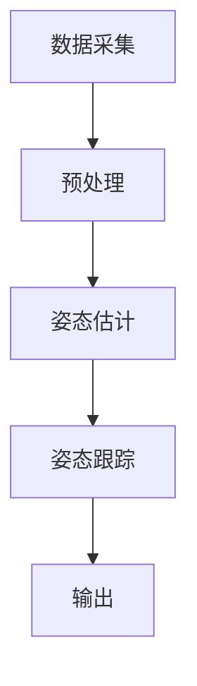
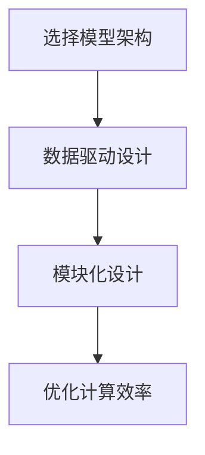
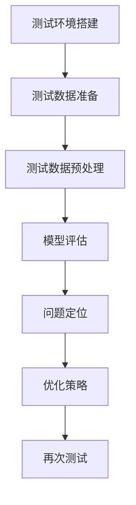

                 

### 文章标题

# 深度学习在实时人体姿态估计中的进展

## 关键词

- 深度学习
- 实时人体姿态估计
- 卷积神经网络
- 图像识别
- 自然语言处理
- 注意力机制

## 摘要

本文从深度学习的基础理论出发，详细探讨了其在实时人体姿态估计中的应用。首先，介绍了深度学习的基本概念、原理及其主流框架，如TensorFlow和PyTorch。接着，深入讲解了图像识别和自然语言处理中的关键技术，包括卷积神经网络、词嵌入技术和注意力机制。在此基础上，重点分析了实时人体姿态估计的基本概念、关键技术及其应用场景。通过实际案例，本文详细展示了如何使用深度学习进行实时人体姿态估计的系统设计与实现，包括数据收集与预处理、模型设计与训练、系统测试与优化等环节。最后，对深度学习模型的优化与评估方法进行了总结，并提出了优化实时人体姿态估计系统的最佳实践建议。

### 第一部分: 深度学习基础理论

#### 第1章: 深度学习概述

##### 1.1 深度学习的基本概念

深度学习（Deep Learning）是机器学习（Machine Learning）的一个子领域，主要关注于构建和训练具有多层的神经网络模型，以自动从大量数据中学习特征和模式。与传统的机器学习方法相比，深度学习具有更强的表示能力、泛化能力和学习能力。

###### 1.1.1 深度学习与机器学习的区别

机器学习主要关注于从数据中学习规律，并利用这些规律进行预测或分类。深度学习则强调构建复杂的模型结构，通过层次化的网络结构来学习数据中的高级抽象特征。

- **机器学习**：主要采用线性模型、决策树、支持向量机等方法进行学习。
- **深度学习**：主要采用神经网络模型，通过多层非线性变换来学习数据中的复杂特征。

###### 1.1.2 深度学习的历史与发展

深度学习的发展可以追溯到1986年，当时Geoff Hinton等人提出了反向传播算法（Backpropagation），使得神经网络训练成为可能。然而，由于计算资源和数据量的限制，深度学习的研究和应用一度陷入低潮。随着计算机性能的飞速提升和大数据时代的到来，深度学习在21世纪初期迎来了新的发展机遇。

- **1986年**：反向传播算法提出，标志着深度学习的诞生。
- **2006年**：Hinton提出了深度置信网络（Deep Belief Network），重新点燃了深度学习的研究热情。
- **2012年**：AlexNet在ImageNet大赛中取得突破性成绩，深度学习在图像识别领域崭露头角。
- **至今**：深度学习在各个领域取得了显著的应用成果，如自然语言处理、语音识别、推荐系统等。

###### 1.1.3 深度学习的主要应用领域

深度学习在多个领域取得了重要应用，其中一些主要领域包括：

- **计算机视觉**：用于图像识别、目标检测、图像生成等。
- **自然语言处理**：用于文本分类、机器翻译、情感分析等。
- **语音识别**：用于语音识别、语音合成、语音增强等。
- **推荐系统**：用于用户行为预测、商品推荐等。
- **医学影像**：用于疾病诊断、病灶检测等。

##### 1.2 深度学习的基本原理

深度学习的基本原理是基于人工神经网络（Artificial Neural Networks,ANNs），通过多层非线性变换来学习数据的特征表示。

###### 1.2.1 神经元与神经网络

神经元（Neuron）是神经网络的基本单元，类似于生物神经元的结构和功能。每个神经元由输入层、权重、激活函数和输出层组成。神经网络（Neural Network）则是由多个神经元组成的复杂网络结构。

- **神经元**：接受输入信号，通过权重进行加权求和，再经过激活函数处理后产生输出。
- **神经网络**：通过多层神经元的组合，实现复杂的数据处理任务。

###### 1.2.2 深度学习的优化算法

深度学习的优化算法主要基于梯度下降（Gradient Descent）及其变种。梯度下降是一种迭代优化算法，通过不断调整模型参数，使得损失函数的值最小。

- **梯度下降**：通过计算损失函数对模型参数的梯度，更新模型参数。
- **随机梯度下降（SGD）**：在每个训练样本上计算梯度，更新模型参数。
- **批量梯度下降（BGD）**：在所有训练样本上计算梯度，更新模型参数。
- **动量法（Momentum）**：引入动量项，加速梯度下降过程。

###### 1.2.3 深度学习模型的训练过程

深度学习模型的训练过程包括以下几个步骤：

1. **数据预处理**：对输入数据进行预处理，如归一化、标准化等，以提高模型的训练效果。
2. **构建模型**：根据任务需求，设计并构建神经网络模型。
3. **损失函数选择**：选择合适的损失函数，用于衡量模型预测结果与真实结果之间的差异。
4. **模型训练**：通过优化算法，不断调整模型参数，使损失函数的值最小。
5. **模型评估**：在验证集上评估模型性能，调整模型参数，以实现更好的泛化能力。

##### 1.3 深度学习的主流框架

当前，深度学习的主流框架包括TensorFlow、PyTorch和其他一些开源框架。

###### 1.3.1 TensorFlow

TensorFlow是谷歌开源的深度学习框架，具有广泛的社区支持和丰富的应用场景。TensorFlow的主要特点包括：

- **动态计算图**：支持动态构建和执行计算图，便于模型设计和调试。
- **分布式计算**：支持在多台计算机上进行分布式训练，提高计算效率。
- **硬件加速**：支持GPU和TPU等硬件加速，提高训练速度。

###### 1.3.2 PyTorch

PyTorch是Facebook开源的深度学习框架，以其灵活和易用性著称。PyTorch的主要特点包括：

- **动态计算图**：与TensorFlow类似，支持动态构建和执行计算图。
- **自动微分**：内置自动微分工具，便于实现复杂优化算法。
- **易用性**：提供丰富的API和文档，便于快速上手和应用。

###### 1.3.3 其他深度学习框架

除了TensorFlow和PyTorch，还有一些其他深度学习框架，如Keras、Theano、Caffe等。这些框架各具特色，适用于不同的应用场景和需求。

- **Keras**：基于TensorFlow和Theano的开源深度学习库，提供简洁的API，便于快速构建和训练模型。
- **Theano**：基于Python的开源深度学习库，支持自动微分和GPU加速，但已逐渐被TensorFlow取代。
- **Caffe**：基于C++的开源深度学习框架，适用于图像识别和计算机视觉任务。

#### 第2章: 图像识别

##### 2.1 卷积神经网络

卷积神经网络（Convolutional Neural Networks,CNN）是深度学习领域的一种重要模型，特别适用于图像识别和计算机视觉任务。

###### 2.1.1 卷积神经网络的基本结构

卷积神经网络的基本结构包括输入层、卷积层、池化层和全连接层。其中，卷积层和池化层用于特征提取和降维，全连接层用于分类和预测。

1. **输入层**：接受图像输入，通常采用二维矩阵表示。
2. **卷积层**：通过卷积操作提取图像特征，卷积核（filter）在输入图像上滑动，计算局部特征。
3. **池化层**：对卷积层输出的特征进行降维处理，常见的池化操作有最大池化和平均池化。
4. **全连接层**：将池化层输出的特征映射到输出类别，通过softmax函数进行概率分布计算。

###### 2.1.2 卷积操作的数学原理

卷积操作是将一个卷积核（filter）在输入图像上滑动，计算局部特征的过程。具体来说，卷积操作可以表示为：

$$
\text{output} = \text{filter} * \text{input}
$$

其中，$*$表示卷积操作，$\text{filter}$和$\text{input}$分别表示卷积核和输入图像。

卷积操作的数学原理可以描述为：

1. **卷积核定义**：卷积核是一个二维矩阵，表示图像的局部特征。
2. **卷积操作**：将卷积核在输入图像上滑动，对每个局部区域进行卷积操作，得到局部特征。
3. **特征图计算**：将卷积核与输入图像的局部区域进行卷积操作，得到特征图的每个像素值。

例如，一个3x3的卷积核与一个7x7的输入图像进行卷积操作，得到的特征图大小为5x5。

###### 2.1.3 池化操作的数学原理

池化操作是对卷积层输出的特征进行降维处理的过程。常见的池化操作包括最大池化和平均池化。

1. **最大池化**：将一个区域内的像素值进行最大值操作，得到一个像素值。
2. **平均池化**：将一个区域内的像素值进行平均值操作，得到一个像素值。

池化操作的数学原理可以描述为：

1. **区域定义**：定义一个大小为2x2的区域，称为池化窗口。
2. **池化操作**：将池化窗口在输入特征图上滑动，对每个区域进行最大值或平均值的操作。
3. **输出特征图计算**：将池化窗口内的像素值进行最大值或平均值的操作，得到输出特征图的每个像素值。

例如，一个2x2的池化窗口与一个3x3的特征图进行最大池化操作，得到的输出特征图大小为2x2。

##### 2.2 卷积神经网络在图像识别中的应用

卷积神经网络在图像识别中的应用取得了显著的成果，成为计算机视觉领域的主流模型。

###### 2.2.1 图像识别的基本流程

图像识别的基本流程包括数据预处理、模型训练、模型评估和模型部署。

1. **数据预处理**：对输入图像进行预处理，如归一化、标准化等。
2. **模型训练**：使用训练数据对卷积神经网络进行训练，调整模型参数。
3. **模型评估**：使用验证数据对训练好的模型进行评估，选择性能最优的模型。
4. **模型部署**：将训练好的模型部署到实际应用场景中，如摄像头、手机等。

###### 2.2.2 AlexNet模型的详细解释

AlexNet是深度学习在图像识别领域的里程碑模型，首次将深度卷积神经网络应用于大型图像识别任务。

1. **模型结构**：AlexNet由5个卷积层、3个最大池化层、2个全连接层和1个softmax层组成。

2. **卷积层**：前4个卷积层使用较小的卷积核（3x3），每个卷积层后面接一个ReLU激活函数。

3. **最大池化层**：每个卷积层后面接一个最大池化层，窗口大小为2x2。

4. **全连接层**：最后一个卷积层后面接一个全连接层，共有4096个神经元。

5. **softmax层**：全连接层后面接一个softmax层，用于进行类别预测。

###### 2.2.3 VGG模型和ResNet模型的比较分析

VGG模型和ResNet模型是深度学习在图像识别领域的重要进展，分别代表了不同的发展方向。

1. **VGG模型**：VGG模型采用较深的网络结构，通过叠加多个卷积层来提高模型性能。VGG模型的特点是网络结构简洁，易于理解和实现。

2. **ResNet模型**：ResNet模型引入了残差连接（Residual Connection），使得网络可以训练更深的层数，从而提高模型性能。ResNet模型的特点是网络结构复杂，但可以处理更大规模的图像。

VGG模型和ResNet模型的比较分析如下：

- **网络深度**：VGG模型较浅，ResNet模型较深。
- **参数量**：VGG模型参数量较少，ResNet模型参数量较多。
- **计算效率**：VGG模型计算效率较高，ResNet模型计算效率较低。
- **性能表现**：在ImageNet数据集上，ResNet模型的性能表现优于VGG模型。

##### 2.3 实际案例：使用深度学习进行图像分类

在本节中，我们将通过一个实际案例来展示如何使用深度学习进行图像分类。

###### 2.3.1 数据预处理

1. **数据收集**：从公开数据集（如CIFAR-10或ImageNet）中收集图像数据。
2. **数据清洗**：去除数据集中的噪声和错误数据。
3. **数据增强**：对图像进行旋转、缩放、裁剪等操作，增加数据多样性。
4. **数据归一化**：对图像像素值进行归一化处理，将像素值缩放到[0, 1]范围内。

###### 2.3.2 模型训练与评估

1. **构建模型**：使用卷积神经网络模型（如AlexNet、VGG、ResNet）进行构建。
2. **模型训练**：使用训练数据对模型进行训练，调整模型参数。
3. **模型评估**：使用验证数据对训练好的模型进行评估，计算准确率、召回率等指标。
4. **模型优化**：根据评估结果，调整模型参数，优化模型性能。

例如，以下是一个简单的Python代码示例，用于训练一个卷积神经网络模型：

```python
import tensorflow as tf
from tensorflow.keras.datasets import cifar10
from tensorflow.keras.models import Sequential
from tensorflow.keras.layers import Conv2D, MaxPooling2D, Dense, Flatten, Dropout
from tensorflow.keras.optimizers import Adam

# 加载CIFAR-10数据集
(x_train, y_train), (x_test, y_test) = cifar10.load_data()

# 数据预处理
x_train = x_train.astype('float32') / 255.0
x_test = x_test.astype('float32') / 255.0
y_train = tf.keras.utils.to_categorical(y_train, 10)
y_test = tf.keras.utils.to_categorical(y_test, 10)

# 构建模型
model = Sequential()
model.add(Conv2D(32, (3, 3), activation='relu', input_shape=(32, 32, 3)))
model.add(MaxPooling2D(pool_size=(2, 2)))
model.add(Conv2D(64, (3, 3), activation='relu'))
model.add(MaxPooling2D(pool_size=(2, 2)))
model.add(Conv2D(128, (3, 3), activation='relu'))
model.add(MaxPooling2D(pool_size=(2, 2)))
model.add(Flatten())
model.add(Dense(128, activation='relu'))
model.add(Dense(10, activation='softmax'))

# 编译模型
model.compile(optimizer=Adam(), loss='categorical_crossentropy', metrics=['accuracy'])

# 模型训练
model.fit(x_train, y_train, batch_size=64, epochs=10, validation_data=(x_test, y_test))

# 模型评估
scores = model.evaluate(x_test, y_test, verbose=1)
print('Test loss:', scores[0])
print('Test accuracy:', scores[1])
```

###### 2.3.3 结果分析与优化

1. **结果分析**：根据模型评估结果，分析模型的准确率、召回率等指标，找出模型的优点和不足。
2. **优化方法**：根据结果分析，提出优化方法，如调整模型结构、优化训练策略等。
3. **再次训练**：根据优化方法，对模型进行再次训练，评估模型性能。

例如，以下是一个简单的优化方法，用于提高模型准确率：

- **数据增强**：增加数据多样性，提高模型的泛化能力。
- **增加训练时间**：延长训练时间，让模型学习更多特征。
- **调整模型结构**：尝试使用更深的网络结构，如ResNet。

#### 第3章: 自然语言处理

##### 3.1 词嵌入技术

词嵌入（Word Embedding）是将词汇映射为向量空间中的表示，以便在深度学习中处理自然语言。词嵌入技术在自然语言处理（Natural Language Processing,NLP）中起到了关键作用，能够有效提高模型在文本分类、机器翻译、情感分析等任务中的性能。

###### 3.1.1 词嵌入的基本概念

词嵌入的基本概念包括：

1. **词汇表（Vocabulary）**：用于存储所有词汇的集合。每个词汇对应一个唯一的索引。
2. **嵌入向量（Embedding Vector）**：用于表示词汇的向量。通常采用固定大小（如100维或300维）。
3. **嵌入矩阵（Embedding Matrix）**：用于将词汇映射为嵌入向量的矩阵。矩阵的行对应于词汇表中的每个词汇，列对应于嵌入向量。

###### 3.1.2 Word2Vec模型的原理

Word2Vec模型是一种基于神经网络的语言模型，通过训练词汇的嵌入向量，使其在向量空间中具有相似性的表示。

1. **Skip-Gram模型**：将输入词汇表示为上下文窗口中的词汇，预测中心词汇。通过优化损失函数，使嵌入向量满足预测目标。
2. **CBOW模型**：将输入词汇表示为上下文窗口中的词汇的平均值，预测中心词汇。与Skip-Gram模型相比，CBOW模型更容易训练。
3. **损失函数**：通常采用Softmax损失函数，用于计算预测概率。

例如，以下是一个简单的Word2Vec模型的训练过程：

```python
import gensim

# 加载预训练的Word2Vec模型
model = gensim.models.Word2Vec.load('word2vec.model')

# 计算词汇相似性
similarity = model.wv.similarity('king', 'man')
print('king and man similarity:', similarity)

# 计算词汇距离
distance = model.wv.distance('king', 'woman')
print('king and woman distance:', distance)
```

###### 3.1.3 其他词嵌入模型

除了Word2Vec模型，还有一些其他的词嵌入模型，如GloVe模型和FastText模型。

1. **GloVe模型**：GloVe（Global Vectors for Word Representation）模型通过优化损失函数，使得词汇的嵌入向量在语义上具有一致性。GloVe模型的主要优点是计算效率较高，适用于大规模词汇表的嵌入。
2. **FastText模型**：FastText模型是基于Word2Vec模型的改进，通过引入词干信息，使得模型在处理多义词时具有更好的性能。FastText模型适用于多种自然语言处理任务，如文本分类、情感分析等。

##### 3.2 序列模型

序列模型（Sequence Model）是一类用于处理序列数据的深度学习模型，特别适用于自然语言处理任务。常见的序列模型包括循环神经网络（Recurrent Neural Network,RNN）、长短期记忆网络（Long Short-Term Memory,LSTM）和门控循环单元（Gated Recurrent Unit,GRU）。

###### 3.2.1 RNN的基本原理

RNN是一种能够处理序列数据的神经网络模型，其核心思想是利用隐藏状态（Hidden State）来表示序列信息。

1. **输入序列**：输入序列由一系列输入向量组成，如词汇嵌入向量。
2. **隐藏状态**：隐藏状态是RNN的核心，用于存储和传递序列信息。在每一步计算中，隐藏状态通过当前输入和前一个隐藏状态的加权和进行更新。
3. **输出序列**：输出序列是RNN的预测结果，可以通过隐藏状态进行计算。

RNN的基本计算公式如下：

$$
h_t = \text{sigmoid}(W_h \cdot [h_{t-1}, x_t] + b_h)
$$

$$
y_t = \text{softmax}(W_y \cdot h_t + b_y)
$$

其中，$h_t$表示第t步的隐藏状态，$x_t$表示第t步的输入，$W_h$、$W_y$和$b_h$、$b_y$分别为权重和偏置。

###### 3.2.2 LSTM和GRU的详细解释

LSTM和GRU是RNN的改进版本，通过引入门控机制，有效地解决了RNN在处理长序列数据时容易遇到的梯度消失和梯度爆炸问题。

1. **LSTM（Long Short-Term Memory）**：LSTM通过引入三个门控单元（输入门、遗忘门和输出门），来控制信息的流入、流出和输出。LSTM的基本计算公式如下：

$$
i_t = \text{sigmoid}(W_i \cdot [h_{t-1}, x_t] + b_i)\\
f_t = \text{sigmoid}(W_f \cdot [h_{t-1}, x_t] + b_f)\\
\hat{C}_t = \text{tanh}(W_c \cdot [h_{t-1}, x_t] + b_c)\\
C_t = f_t \odot C_{t-1} + i_t \odot \hat{C}_t\\
o_t = \text{sigmoid}(W_o \cdot [h_{t-1}, x_t] + b_o)\\
h_t = o_t \odot \text{tanh}(C_t)
$$

2. **GRU（Gated Recurrent Unit）**：GRU是对LSTM的简化版本，通过引入更新门（Update Gate）和重置门（Reset Gate），合并了遗忘门和输入门。GRU的基本计算公式如下：

$$
z_t = \text{sigmoid}(W_z \cdot [h_{t-1}, x_t] + b_z)\\
r_t = \text{sigmoid}(W_r \cdot [h_{t-1}, x_t] + b_r)\\
\hat{h}_t = \text{tanh}(W_h \cdot [r_t \odot h_{t-1}, x_t] + b_h)\\
h_t = (1 - z_t) \odot h_{t-1} + z_t \odot \hat{h}_t
$$

###### 3.2.3 循环神经网络的应用案例

循环神经网络在自然语言处理任务中具有广泛的应用，如文本分类、机器翻译、情感分析等。

1. **文本分类**：使用RNN或LSTM对文本进行编码，得到文本的固定长度向量表示，再通过全连接层进行分类。
2. **机器翻译**：使用RNN或LSTM对源语言和目标语言的文本序列进行编码，得到两个序列的固定长度向量表示，再通过全连接层进行解码。
3. **情感分析**：使用RNN或LSTM对文本序列进行编码，得到文本的固定长度向量表示，再通过全连接层进行情感分类。

例如，以下是一个简单的Python代码示例，用于实现文本分类任务：

```python
import tensorflow as tf
from tensorflow.keras.models import Sequential
from tensorflow.keras.layers import Embedding, LSTM, Dense

# 加载预训练的词嵌入模型
word_embedding_model = tf.keras.models.load_model('word_embedding.model')

# 构建模型
model = Sequential()
model.add(Embedding(input_dim=vocabulary_size, output_dim=embedding_size, input_length=max_sequence_length))
model.add(LSTM(units=128, dropout=0.2, recurrent_dropout=0.2))
model.add(Dense(units=num_classes, activation='softmax'))

# 编译模型
model.compile(optimizer='adam', loss='categorical_crossentropy', metrics=['accuracy'])

# 模型训练
model.fit(x_train, y_train, batch_size=32, epochs=10, validation_data=(x_val, y_val))

# 模型评估
scores = model.evaluate(x_test, y_test, verbose=1)
print('Test loss:', scores[0])
print('Test accuracy:', scores[1])
```

##### 3.3 注意力机制

注意力机制（Attention Mechanism）是一种在深度学习模型中用于提高序列处理能力的技术。注意力机制通过动态调整模型对输入序列中不同部分的关注程度，实现了对序列数据的精细处理，广泛应用于机器翻译、文本摘要、语音识别等任务。

###### 3.3.1 注意力机制的基本概念

注意力机制的基本概念包括：

1. **输入序列**：输入序列由一系列输入向量组成，如词汇嵌入向量。
2. **注意力分数**：注意力分数用于表示模型对输入序列中每个元素的重要程度。通常采用软注意力（Soft Attention）或硬注意力（Hard Attention）进行计算。
3. **注意力输出**：注意力输出是模型对输入序列的加权求和结果，用于表示输入序列的精细表示。

注意力机制的基本计算公式如下：

$$
a_t = \text{softmax}(\text{Attention}(h_{t-1}, h_t))
$$

$$
h_t = \sum_{i=1}^{N} a_{it} h_i
$$

其中，$a_t$表示第t步的注意力分数，$h_t$表示第t步的注意力输出，$h_i$表示输入序列的第i个元素。

###### 3.3.2 Transformer模型的原理

Transformer模型是一种基于注意力机制的序列到序列模型，首次在机器翻译任务中取得了显著效果。Transformer模型的主要特点包括：

1. **多头注意力**：通过多头注意力机制，同时关注输入序列的不同部分，提高了模型的表达能力。
2. **自注意力**：使用自注意力机制，将输入序列映射为固定长度的向量表示，实现了对序列的精细处理。
3. **前馈网络**：在自注意力和编码器之间的每个层，加入了一个简单的全连接层，用于进一步提取特征。

Transformer模型的基本计算公式如下：

$$
\text{Encoder} = \text{MultiHeadSelfAttention}( \text{EncoderLayer}( \text{EncoderLayer}(X, \text{Attn}=\text{MultiHeadAttention}( \text{Linear}(X), \text{Linear}(X), \text{Linear}(X))) ) ) \\
\text{Decoder} = \text{MultiHeadSelfAttention}( \text{DecoderLayer}( \text{DecoderLayer}(X, \text{Attn}=\text{MultiHeadAttention}( \text{Encoder} , \text{Encoder} , \text{Encoder})) ) ) \\
\text{Output} = \text{softmax}(\text{Linear}(\text{Decoder}))
$$

其中，$X$表示输入序列，$\text{Encoder}$和$\text{Decoder}$分别表示编码器和解码器，$\text{MultiHeadSelfAttention}$表示多头注意力机制，$\text{EncoderLayer}$和$\text{DecoderLayer}$分别表示编码器层和解码器层。

###### 3.3.3 注意力机制在NLP中的应用

注意力机制在NLP中具有广泛的应用，如文本分类、机器翻译、文本摘要等。

1. **文本分类**：通过注意力机制，模型能够关注输入文本中的关键信息，提高分类效果。
2. **机器翻译**：通过注意力机制，模型能够同时关注源语言和目标语言的上下文信息，实现准确的翻译结果。
3. **文本摘要**：通过注意力机制，模型能够提取输入文本中的重要信息，生成简洁的摘要。

例如，以下是一个简单的Python代码示例，用于实现文本分类任务：

```python
import tensorflow as tf
from tensorflow.keras.models import Model
from tensorflow.keras.layers import Input, Embedding, LSTM, Dense

# 定义模型结构
input_sequence = Input(shape=(max_sequence_length,))
embedded_sequence = Embedding(input_dim=vocabulary_size, output_dim=embedding_size)(input_sequence)
lstm_output = LSTM(units=128, dropout=0.2, recurrent_dropout=0.2)(embedded_sequence)
dense_output = Dense(units=num_classes, activation='softmax')(lstm_output)

# 编译模型
model = Model(inputs=input_sequence, outputs=dense_output)
model.compile(optimizer='adam', loss='categorical_crossentropy', metrics=['accuracy'])

# 模型训练
model.fit(x_train, y_train, batch_size=32, epochs=10, validation_data=(x_val, y_val))

# 模型评估
scores = model.evaluate(x_test, y_test, verbose=1)
print('Test loss:', scores[0])
print('Test accuracy:', scores[1])
```

##### 3.4 实际案例：文本分类与情感分析

在本节中，我们将通过一个实际案例来展示如何使用深度学习进行文本分类和情感分析。

###### 3.4.1 数据预处理

1. **数据收集**：从公开数据集（如IMDb电影评论数据集或Twitter情感分析数据集）中收集文本数据。
2. **数据清洗**：去除文本数据中的噪声和错误，如HTML标签、特殊字符等。
3. **分词**：将文本数据分成单词或词汇，以便进行词嵌入。
4. **数据归一化**：对文本数据进行归一化处理，如小写转换、停用词去除等。

例如，以下是一个简单的Python代码示例，用于数据预处理：

```python
import nltk
from nltk.corpus import stopwords
from nltk.tokenize import word_tokenize

# 加载停用词列表
stop_words = set(stopwords.words('english'))

# 数据预处理
def preprocess_text(text):
    text = text.lower()  # 小写转换
    text = word_tokenize(text)  # 分词
    text = [word for word in text if word not in stop_words]  # 去除停用词
    return ' '.join(text)

# 示例文本
text = "I love this movie! It's so amazing!"
preprocessed_text = preprocess_text(text)
print('Preprocessed text:', preprocessed_text)
```

###### 3.4.2 模型训练与评估

1. **构建模型**：使用RNN、LSTM或Transformer等模型进行构建。
2. **模型训练**：使用训练数据进行模型训练，调整模型参数。
3. **模型评估**：使用验证数据进行模型评估，计算准确率、召回率等指标。
4. **模型优化**：根据评估结果，调整模型参数，优化模型性能。

例如，以下是一个简单的Python代码示例，用于文本分类任务：

```python
import tensorflow as tf
from tensorflow.keras.models import Sequential
from tensorflow.keras.layers import Embedding, LSTM, Dense

# 加载预训练的词嵌入模型
word_embedding_model = tf.keras.models.load_model('word_embedding.model')

# 构建模型
model = Sequential()
model.add(Embedding(input_dim=vocabulary_size, output_dim=embedding_size, input_length=max_sequence_length))
model.add(LSTM(units=128, dropout=0.2, recurrent_dropout=0.2))
model.add(Dense(units=num_classes, activation='softmax'))

# 编译模型
model.compile(optimizer='adam', loss='categorical_crossentropy', metrics=['accuracy'])

# 模型训练
model.fit(x_train, y_train, batch_size=32, epochs=10, validation_data=(x_val, y_val))

# 模型评估
scores = model.evaluate(x_test, y_test, verbose=1)
print('Test loss:', scores[0])
print('Test accuracy:', scores[1])
```

###### 3.4.3 结果分析与优化

1. **结果分析**：根据模型评估结果，分析模型的准确率、召回率等指标，找出模型的优点和不足。
2. **优化方法**：根据结果分析，提出优化方法，如调整模型结构、优化训练策略等。
3. **再次训练**：根据优化方法，对模型进行再次训练，评估模型性能。

例如，以下是一个简单的优化方法，用于提高模型准确率：

- **增加训练时间**：延长训练时间，让模型学习更多特征。
- **数据增强**：增加数据多样性，提高模型的泛化能力。
- **调整模型结构**：尝试使用更深的网络结构，如LSTM或Transformer。

#### 第4章: 实时人体姿态估计

##### 4.1 实时人体姿态估计的基本概念

实时人体姿态估计（Real-Time Human Pose Estimation）是一种计算机视觉技术，旨在从图像或视频流中实时检测和跟踪人体姿态。实时人体姿态估计在多个应用领域具有广泛的应用，如增强现实、虚拟现实、运动分析、健康监测等。

###### 4.1.1 实时人体姿态估计的定义

实时人体姿态估计是指在一定的时间约束下，从图像或视频流中准确、快速地检测和跟踪人体姿态的方法。实时性要求通常在几十毫秒到几百毫秒之间，以确保系统的响应速度和用户体验。

###### 4.1.2 实时人体姿态估计的关键技术

实时人体姿态估计的关键技术包括：

1. **特征提取**：从图像或视频帧中提取与人体姿态相关的特征，如边缘、轮廓、关节点等。
2. **姿态估计模型**：使用深度学习模型，如卷积神经网络（CNN）、循环神经网络（RNN）、基于注意力机制的模型等，对提取的特征进行姿态估计。
3. **跟踪算法**：对估计出的姿态进行跟踪，以应对人体姿态的遮挡、变化等挑战。
4. **实时处理**：在有限的时间内完成特征提取、姿态估计和跟踪等任务，以满足实时性要求。

###### 4.1.3 实时人体姿态估计的应用场景

实时人体姿态估计在多个应用场景中具有广泛的应用，以下是一些典型的应用场景：

1. **增强现实（AR）**：实时获取人体姿态，用于实时渲染虚拟物体与真实环境的交互。
2. **虚拟现实（VR）**：实时跟踪人体姿态，提供沉浸式的交互体验。
3. **运动分析**：实时分析运动员的动作，提供实时反馈和建议。
4. **健康监测**：实时检测人体姿态，用于监测和评估健康状况。
5. **人机交互**：实时理解人体姿态，实现更加自然和便捷的交互方式。

##### 4.2 基于深度学习的实时人体姿态估计方法

基于深度学习的实时人体姿态估计方法在计算机视觉领域取得了显著进展，通过多层神经网络模型，实现了对人体姿态的准确估计。以下介绍几种基于深度学习的实时人体姿态估计方法：

###### 4.2.1 CNN在姿态估计中的应用

卷积神经网络（CNN）是一种强大的图像处理工具，在实时人体姿态估计中具有广泛的应用。CNN通过卷积、池化和全连接层等操作，从图像中提取深层次的特征，实现对人体姿态的准确估计。

1. **网络结构**：基于CNN的人体姿态估计方法通常采用分层结构，包括卷积层、池化层和全连接层。卷积层用于提取图像特征，池化层用于降维和特征增强，全连接层用于分类和预测。
2. **损失函数**：基于CNN的人体姿态估计方法通常采用多任务损失函数，包括回归损失和分类损失。回归损失用于估计关节点的位置，分类损失用于估计人体的姿态类别。

例如，以下是一个简单的基于CNN的人体姿态估计的伪代码：

```python
import tensorflow as tf

# 构建模型
model = tf.keras.Sequential()
model.add(tf.keras.layers.Conv2D(filters=32, kernel_size=(3, 3), activation='relu', input_shape=(height, width, channels)))
model.add(tf.keras.layers.MaxPooling2D(pool_size=(2, 2)))
model.add(tf.keras.layers.Conv2D(filters=64, kernel_size=(3, 3), activation='relu'))
model.add(tf.keras.layers.MaxPooling2D(pool_size=(2, 2)))
model.add(tf.keras.layers.Conv2D(filters=128, kernel_size=(3, 3), activation='relu'))
model.add(tf.keras.layers.MaxPooling2D(pool_size=(2, 2)))
model.add(tf.keras.layers.Flatten())
model.add(tf.keras.layers.Dense(units=num_joints * 2, activation='sigmoid'))

# 编译模型
model.compile(optimizer='adam', loss='mse')

# 模型训练
model.fit(x_train, y_train, batch_size=32, epochs=10, validation_data=(x_val, y_val))

# 模型评估
scores = model.evaluate(x_test, y_test, verbose=1)
print('Test loss:', scores[0])
print('Test accuracy:', scores[1])
```

###### 4.2.2 RNN在姿态估计中的应用

循环神经网络（RNN）是一种用于处理序列数据的神经网络模型，在实时人体姿态估计中具有独特的优势。RNN通过隐藏状态来记忆序列信息，实现对连续姿态序列的建模。

1. **网络结构**：基于RNN的人体姿态估计方法通常采用序列到序列的结构，包括输入层、隐藏层和输出层。输入层接收连续姿态序列，隐藏层通过RNN更新隐藏状态，输出层用于估计关节点的位置。
2. **损失函数**：基于RNN的人体姿态估计方法通常采用序列损失函数，如均方误差（MSE）或交叉熵损失。序列损失函数用于衡量连续姿态序列的预测误差。

例如，以下是一个简单的基于RNN的人体姿态估计的伪代码：

```python
import tensorflow as tf

# 构建模型
model = tf.keras.Sequential()
model.add(tf.keras.layers.LSTM(units=128, return_sequences=True, input_shape=(timesteps, features)))
model.add(tf.keras.layers.LSTM(units=128))
model.add(tf.keras.layers.Dense(units=num_joints * 2, activation='sigmoid'))

# 编译模型
model.compile(optimizer='adam', loss='mse')

# 模型训练
model.fit(x_train, y_train, batch_size=32, epochs=10, validation_data=(x_val, y_val))

# 模型评估
scores = model.evaluate(x_test, y_test, verbose=1)
print('Test loss:', scores[0])
print('Test accuracy:', scores[1])
```

###### 4.2.3 整合多模态数据的姿态估计方法

实时人体姿态估计不仅依赖于图像或视频数据，还可以整合其他模态的数据，如深度图像、红外图像、音频信号等，以提高估计的准确性和鲁棒性。基于多模态数据的姿态估计方法通常采用以下步骤：

1. **数据采集**：采集不同模态的数据，如图像、深度图像、红外图像、音频信号等。
2. **数据预处理**：对采集到的数据进行预处理，如归一化、去噪、特征提取等。
3. **特征融合**：将不同模态的数据特征进行融合，如通过加权平均、融合神经网络等。
4. **姿态估计**：使用融合后的特征进行姿态估计，如通过卷积神经网络、循环神经网络等。

例如，以下是一个简单的基于多模态数据的姿态估计的伪代码：

```python
import tensorflow as tf

# 定义输入层
input_image = tf.keras.layers.Input(shape=(height, width, channels))
input_depth = tf.keras.layers.Input(shape=(height, width, channels))
input_infrared = tf.keras.layers.Input(shape=(height, width, channels))
input_audio = tf.keras.layers.Input(shape=(timesteps, features))

# 图像特征提取
image_features = tf.keras.layers.Conv2D(filters=32, kernel_size=(3, 3), activation='relu')(input_image)
image_features = tf.keras.layers.MaxPooling2D(pool_size=(2, 2))(image_features)

# 深度特征提取
depth_features = tf.keras.layers.Conv2D(filters=32, kernel_size=(3, 3), activation='relu')(input_depth)
depth_features = tf.keras.layers.MaxPooling2D(pool_size=(2, 2))(depth_features)

# 红外特征提取
infrared_features = tf.keras.layers.Conv2D(filters=32, kernel_size=(3, 3), activation='relu')(input_infrared)
infrared_features = tf.keras.layers.MaxPooling2D(pool_size=(2, 2))(infrared_features)

# 音频特征提取
audio_features = tf.keras.layers.LSTM(units=128, return_sequences=True)(input_audio)

# 特征融合
merged_features = tf.keras.layers.concatenate([image_features, depth_features, infrared_features, audio_features])

# 姿态估计
predicted_joints = tf.keras.layers.Dense(units=num_joints * 2, activation='sigmoid')(merged_features)

# 构建模型
model = tf.keras.Model(inputs=[input_image, input_depth, input_infrared, input_audio], outputs=predicted_joints)

# 编译模型
model.compile(optimizer='adam', loss='mse')

# 模型训练
model.fit([x_train_image, x_train_depth, x_train_infrared, x_train_audio], y_train, batch_size=32, epochs=10, validation_data=([x_val_image, x_val_depth, x_val_infrared, x_val_audio], y_val))

# 模型评估
scores = model.evaluate([x_test_image, x_test_depth, x_test_infrared, x_test_audio], y_test, verbose=1)
print('Test loss:', scores[0])
print('Test accuracy:', scores[1])
```

##### 4.3 实际案例：基于深度学习的实时人体姿态估计

在本节中，我们将通过一个实际案例来展示如何使用深度学习进行实时人体姿态估计的系统设计与实现。

###### 4.3.1 数据预处理

1. **数据收集**：从公开数据集（如Human Pose Estimation Challenge数据集）中收集图像和标注数据。
2. **数据清洗**：去除数据集中的噪声和错误数据，如缺失值、异常值等。
3. **数据增强**：对图像进行旋转、缩放、裁剪等操作，增加数据多样性。
4. **数据归一化**：对图像像素值进行归一化处理，将像素值缩放到[0, 1]范围内。

例如，以下是一个简单的Python代码示例，用于数据预处理：

```python
import numpy as np
import tensorflow as tf

# 加载图像和标注数据
images = np.load('images.npy')
labels = np.load('labels.npy')

# 数据增强
def augment_images(images):
    augmented_images = []
    for image in images:
        image = tf.image.random_flip_left_right(image)
        image = tf.image.random_flip_up_down(image)
        image = tf.image.random_rotation(image, 0.2)
        augmented_images.append(image)
    return np.array(augmented_images)

augmented_images = augment_images(images)

# 数据归一化
images = images / 255.0
augmented_images = augmented_images / 255.0

# 切分数据集
num_samples = len(images)
train_size = int(0.8 * num_samples)
val_size = int(0.1 * num_samples)
test_size = num_samples - train_size - val_size

x_train = images[:train_size]
y_train = labels[:train_size]
x_val = images[train_size:train_size + val_size]
y_val = labels[train_size:train_size + val_size]
x_test = images[train_size + val_size:]
y_test = labels[train_size + val_size:]
```

###### 4.3.2 模型训练与评估

1. **构建模型**：使用卷积神经网络（CNN）、循环神经网络（RNN）或基于注意力机制的模型进行构建。
2. **模型训练**：使用训练数据进行模型训练，调整模型参数。
3. **模型评估**：使用验证数据进行模型评估，计算准确率、召回率等指标。
4. **模型优化**：根据评估结果，调整模型参数，优化模型性能。

例如，以下是一个简单的Python代码示例，用于实时人体姿态估计模型训练与评估：

```python
import tensorflow as tf
from tensorflow.keras.models import Sequential
from tensorflow.keras.layers import Conv2D, MaxPooling2D, LSTM, Dense, Flatten

# 构建模型
model = Sequential()
model.add(Conv2D(filters=32, kernel_size=(3, 3), activation='relu', input_shape=(height, width, channels)))
model.add(MaxPooling2D(pool_size=(2, 2)))
model.add(Conv2D(filters=64, kernel_size=(3, 3), activation='relu'))
model.add(MaxPooling2D(pool_size=(2, 2)))
model.add(Conv2D(filters=128, kernel_size=(3, 3), activation='relu'))
model.add(MaxPooling2D(pool_size=(2, 2)))
model.add(Flatten())
model.add(LSTM(units=128, return_sequences=True))
model.add(LSTM(units=128, return_sequences=False))
model.add(Dense(units=num_joints * 2, activation='sigmoid'))

# 编译模型
model.compile(optimizer='adam', loss='mse')

# 模型训练
model.fit(x_train, y_train, batch_size=32, epochs=10, validation_data=(x_val, y_val))

# 模型评估
scores = model.evaluate(x_test, y_test, verbose=1)
print('Test loss:', scores[0])
print('Test accuracy:', scores[1])
```

###### 4.3.3 结果分析与优化

1. **结果分析**：根据模型评估结果，分析模型的准确率、召回率等指标，找出模型的优点和不足。
2. **优化方法**：根据结果分析，提出优化方法，如调整模型结构、优化训练策略等。
3. **再次训练**：根据优化方法，对模型进行再次训练，评估模型性能。

例如，以下是一个简单的优化方法，用于提高模型准确率：

- **增加训练时间**：延长训练时间，让模型学习更多特征。
- **数据增强**：增加数据多样性，提高模型的泛化能力。
- **调整模型结构**：尝试使用更深的网络结构，如LSTM或Transformer。

#### 第5章: 深度学习模型优化与评估

##### 5.1 模型优化方法

在深度学习模型训练过程中，优化方法起着至关重要的作用，它们用于调整模型参数，使模型性能达到最佳状态。以下介绍几种常见的模型优化方法：

###### 5.1.1 损失函数的选择

损失函数是衡量模型预测结果与真实结果之间差异的指标，其选择对模型性能有直接影响。常见的损失函数包括：

1. **均方误差（MSE）**：用于回归任务，计算预测值与真实值之间误差的平方平均值。MSE公式如下：

$$
\text{MSE} = \frac{1}{n}\sum_{i=1}^{n}(\hat{y}_i - y_i)^2
$$

其中，$\hat{y}_i$为预测值，$y_i$为真实值，$n$为样本数量。

2. **交叉熵损失（Cross-Entropy Loss）**：用于分类任务，计算预测概率与真实标签之间的交叉熵。交叉熵损失公式如下：

$$
\text{Cross-Entropy Loss} = -\sum_{i=1}^{n}y_i \log(\hat{y}_i)
$$

其中，$y_i$为真实标签，$\hat{y}_i$为预测概率。

3. **二元交叉熵损失（Binary Cross-Entropy Loss）**：是交叉熵损失的一种特殊情况，用于二分类任务。

###### 5.1.2 优化算法的选择

优化算法用于在训练过程中更新模型参数，以最小化损失函数。以下介绍几种常见的优化算法：

1. **随机梯度下降（SGD）**：在每次迭代中，计算整个训练集的平均梯度，并更新模型参数。SGD的优点是计算简单，适用于小数据集。缺点是收敛速度较慢，对参数初始化敏感。

2. **批量梯度下降（BGD）**：在每次迭代中，计算整个训练集的平均梯度，并更新模型参数。BGD的优点是收敛速度较快，但计算成本较高，适用于大数据集。

3. **动量法（Momentum）**：引入动量项，加速梯度下降过程。动量法可以克服梯度消失和梯度爆炸问题，提高收敛速度。

4. **Adam优化器**：是SGD和动量法的结合，具有自适应学习率的特点。Adam优化器通过计算一阶矩估计和二阶矩估计来更新模型参数，适用于各种规模的任务。

###### 5.1.3 模型正则化技术

正则化技术用于防止模型过拟合，提高模型泛化能力。以下介绍几种常见的正则化技术：

1. **L1正则化**：在损失函数中添加L1范数项，用于惩罚模型参数的稀疏性。L1正则化公式如下：

$$
\text{L1 Regularization} = \lambda ||\theta||_1
$$

其中，$\theta$为模型参数，$\lambda$为正则化参数。

2. **L2正则化**：在损失函数中添加L2范数项，用于惩罚模型参数的范数。L2正则化公式如下：

$$
\text{L2 Regularization} = \lambda ||\theta||_2
$$

3. **Dropout**：在训练过程中，随机丢弃一部分神经元，以降低模型复杂度和过拟合风险。

##### 5.2 模型评估方法

模型评估是深度学习领域的重要环节，用于衡量模型性能和确定模型是否适用于特定任务。以下介绍几种常见的模型评估方法：

###### 5.2.1 评估指标的选择

不同的任务需要选择不同的评估指标，以下介绍几种常见的评估指标：

1. **准确率（Accuracy）**：用于分类任务，计算分类正确的样本数量与总样本数量的比例。准确率公式如下：

$$
\text{Accuracy} = \frac{\text{正确分类的样本数量}}{\text{总样本数量}}
$$

2. **召回率（Recall）**：用于分类任务，计算分类正确的正类样本数量与正类样本总数的比例。召回率公式如下：

$$
\text{Recall} = \frac{\text{正确分类的正类样本数量}}{\text{正类样本总数}}
$$

3. **精确率（Precision）**：用于分类任务，计算分类正确的正类样本数量与预测为正类的样本数量的比例。精确率公式如下：

$$
\text{Precision} = \frac{\text{正确分类的正类样本数量}}{\text{预测为正类的样本数量}}
$$

4. **F1分数（F1 Score）**：是精确率和召回率的调和平均，用于综合评价分类效果。F1分数公式如下：

$$
\text{F1 Score} = 2 \times \frac{\text{Precision} \times \text{Recall}}{\text{Precision} + \text{Recall}}
$$

5. **均方误差（MSE）**：用于回归任务，计算预测值与真实值之间误差的平方平均值。MSE公式如下：

$$
\text{MSE} = \frac{1}{n}\sum_{i=1}^{n}(\hat{y}_i - y_i)^2
$$

6. **均绝对误差（MAE）**：用于回归任务，计算预测值与真实值之间绝对误差的平均值。MAE公式如下：

$$
\text{MAE} = \frac{1}{n}\sum_{i=1}^{n}|\hat{y}_i - y_i|
$$

###### 5.2.2 跨度测试与交叉验证

跨度测试（Hold-Out Validation）和交叉验证（Cross-Validation）是两种常见的模型评估方法，用于减少评估结果的偏差。

1. **跨度测试**：将数据集划分为训练集和测试集，使用训练集对模型进行训练，使用测试集对模型进行评估。跨度测试的优点是简单直观，缺点是评估结果的可靠性较低。

2. **交叉验证**：将数据集划分为多个子集，每次使用其中一个子集作为测试集，其他子集作为训练集，进行多次训练和评估。常见的交叉验证方法包括：

   - **K折交叉验证（K-Fold Cross-Validation）**：将数据集划分为K个子集，每次使用其中一个子集作为测试集，其他子集作为训练集，进行K次训练和评估。K折交叉验证的优点是评估结果较为可靠，缺点是计算成本较高。
   - **留一法交叉验证（Leave-One-Out Cross-Validation）**：将每个样本都作为一次测试集，其他样本作为训练集，进行多次训练和评估。留一法交叉验证的优点是评估结果非常可靠，缺点是计算成本极高。

##### 5.3 实际案例：模型优化与评估

在本节中，我们将通过一个实际案例来展示如何使用深度学习模型进行优化与评估。

###### 5.3.1 数据预处理

1. **数据收集**：从公开数据集（如CIFAR-10或ImageNet）中收集图像数据。
2. **数据清洗**：去除数据集中的噪声和错误数据。
3. **数据增强**：对图像进行旋转、缩放、裁剪等操作，增加数据多样性。
4. **数据归一化**：对图像像素值进行归一化处理，将像素值缩放到[0, 1]范围内。

例如，以下是一个简单的Python代码示例，用于数据预处理：

```python
import tensorflow as tf
from tensorflow.keras.datasets import cifar10
from tensorflow.keras.preprocessing.image import ImageDataGenerator

# 加载CIFAR-10数据集
(x_train, y_train), (x_test, y_test) = cifar10.load_data()

# 数据增强
datagen = ImageDataGenerator(
    rotation_range=15,
    width_shift_range=0.1,
    height_shift_range=0.1,
    horizontal_flip=True
)

# 训练数据增强
train_datagen = datagen.flow(x_train, y_train, batch_size=32)
val_datagen = datagen.flow(x_test, y_test, batch_size=32)

# 数据归一化
x_train = x_train.astype('float32') / 255.0
x_test = x_test.astype('float32') / 255.0
y_train = tf.keras.utils.to_categorical(y_train, 10)
y_test = tf.keras.utils.to_categorical(y_test, 10)
```

###### 5.3.2 模型训练与优化

1. **构建模型**：使用卷积神经网络（CNN）进行构建。
2. **模型训练**：使用训练数据对模型进行训练，调整模型参数。
3. **模型评估**：使用验证数据对训练好的模型进行评估，计算准确率、召回率等指标。
4. **模型优化**：根据评估结果，调整模型参数，优化模型性能。

例如，以下是一个简单的Python代码示例，用于模型训练与优化：

```python
import tensorflow as tf
from tensorflow.keras.models import Sequential
from tensorflow.keras.layers import Conv2D, MaxPooling2D, Dense, Flatten

# 构建模型
model = Sequential()
model.add(Conv2D(filters=32, kernel_size=(3, 3), activation='relu', input_shape=(32, 32, 3)))
model.add(MaxPooling2D(pool_size=(2, 2)))
model.add(Conv2D(filters=64, kernel_size=(3, 3), activation='relu'))
model.add(MaxPooling2D(pool_size=(2, 2)))
model.add(Flatten())
model.add(Dense(units=128, activation='relu'))
model.add(Dense(units=10, activation='softmax'))

# 编译模型
model.compile(optimizer='adam', loss='categorical_crossentropy', metrics=['accuracy'])

# 模型训练
model.fit(train_datagen, epochs=10, validation_data=val_datagen)

# 模型评估
test_loss, test_accuracy = model.evaluate(x_test, y_test, verbose=1)
print('Test loss:', test_loss)
print('Test accuracy:', test_accuracy)

# 模型优化
best_loss = float('inf')
best_accuracy = 0
for i in range(10):
    model.fit(train_datagen, epochs=10, validation_data=val_datagen)
    test_loss, test_accuracy = model.evaluate(x_test, y_test, verbose=1)
    if test_loss < best_loss:
        best_loss = test_loss
        best_accuracy = test_accuracy
    print(f'Epoch {i+1}: Test loss: {test_loss}, Test accuracy: {test_accuracy}')
print('Best loss:', best_loss)
print('Best accuracy:', best_accuracy)
```

###### 5.3.3 模型评估与分析

1. **结果分析**：根据模型评估结果，分析模型的准确率、召回率等指标，找出模型的优点和不足。
2. **优化方法**：根据结果分析，提出优化方法，如调整模型结构、优化训练策略等。
3. **再次训练**：根据优化方法，对模型进行再次训练，评估模型性能。

例如，以下是一个简单的Python代码示例，用于模型评估与分析：

```python
import tensorflow as tf
from sklearn.metrics import accuracy_score, recall_score, precision_score, f1_score

# 加载测试数据
x_test = np.load('x_test.npy')
y_test = np.load('y_test.npy')

# 模型预测
predictions = model.predict(x_test)
predicted_labels = np.argmax(predictions, axis=1)

# 结果分析
accuracy = accuracy_score(y_test, predicted_labels)
recall = recall_score(y_test, predicted_labels, average='weighted')
precision = precision_score(y_test, predicted_labels, average='weighted')
f1 = f1_score(y_test, predicted_labels, average='weighted')

print('Accuracy:', accuracy)
print('Recall:', recall)
print('Precision:', precision)
print('F1 Score:', f1)

# 优化方法
# 根据评估结果，提出优化方法，如增加训练时间、数据增强、调整模型结构等。

# 再次训练
model.fit(train_datagen, epochs=20, validation_data=val_datagen)

# 模型评估
test_loss, test_accuracy = model.evaluate(x_test, y_test, verbose=1)
print('Test loss:', test_loss)
print('Test accuracy:', test_accuracy)

# 结果分析
predictions = model.predict(x_test)
predicted_labels = np.argmax(predictions, axis=1)

accuracy = accuracy_score(y_test, predicted_labels)
recall = recall_score(y_test, predicted_labels, average='weighted')
precision = precision_score(y_test, predicted_labels, average='weighted')
f1 = f1_score(y_test, predicted_labels, average='weighted')

print('Accuracy:', accuracy)
print('Recall:', recall)
print('Precision:', precision)
print('F1 Score:', f1)
```

#### 第6章: 实时人体姿态估计系统设计与实现

##### 6.1 实时人体姿态估计系统架构

实时人体姿态估计系统架构设计应考虑系统性能、可扩展性和可靠性。以下介绍一种典型的系统架构，包括数据采集、预处理、姿态估计和姿态跟踪等模块。

###### 6.1.1 系统架构的设计原则

1. **模块化**：将系统划分为多个模块，便于系统维护和扩展。
2. **高效性**：采用高效的算法和优化方法，提高系统处理速度。
3. **可扩展性**：支持不同类型的数据输入和输出，以适应不同的应用场景。
4. **可靠性**：通过冗余设计和故障恢复机制，提高系统稳定性。

###### 6.1.2 系统模块划分

1. **数据采集模块**：负责从摄像头或其他传感器获取图像或视频数据。
2. **预处理模块**：对采集到的图像或视频数据进行预处理，如缩放、裁剪、去噪等。
3. **姿态估计模块**：使用深度学习模型对预处理后的图像或视频流进行姿态估计。
4. **姿态跟踪模块**：对估计出的人体姿态进行跟踪，以应对人体的遮挡、变化等挑战。
5. **输出模块**：将估计出的姿态信息输出到显示器、传感器或其他应用系统中。

###### 6.1.3 数据流与处理流程

1. **数据采集**：从摄像头或其他传感器获取实时图像或视频流。
2. **预处理**：对图像或视频流进行预处理，如缩放、裁剪、去噪等。
3. **姿态估计**：使用深度学习模型对预处理后的图像或视频流进行姿态估计，得到关节点坐标。
4. **姿态跟踪**：对估计出的人体姿态进行跟踪，更新关节点坐标。
5. **输出**：将估计出的人体姿态信息输出到显示器、传感器或其他应用系统中。

例如，以下是一个简单的Mermaid流程图，展示了实时人体姿态估计系统的数据流与处理流程：



##### 6.2 数据收集与预处理

数据收集与预处理是实时人体姿态估计系统设计的重要环节，直接影响系统的性能和准确性。以下介绍数据收集与预处理的方法和步骤。

###### 6.2.1 数据收集方法

1. **数据来源**：可以从公开数据集（如Human Pose Estimation Challenge数据集）或自定义数据集进行数据收集。公开数据集通常包含多种不同场景和姿态的图像或视频，有助于提高系统的泛化能力。
2. **数据采集设备**：可以使用摄像头、深度相机或其他传感器设备进行数据采集。选择合适的采集设备，可以确保数据的准确性和可靠性。

例如，以下是一个简单的Python代码示例，用于采集实时视频数据：

```python
import cv2

# 打开摄像头
cap = cv2.VideoCapture(0)

while True:
    # 读取一帧图像
    ret, frame = cap.read()
    
    if ret:
        # 显示图像
        cv2.imshow('Real-Time Video', frame)
        
        # 按下'q'键退出循环
        if cv2.waitKey(1) & 0xFF == ord('q'):
            break

# 释放摄像头资源
cap.release()
cv2.destroyAllWindows()
```

###### 6.2.2 数据预处理流程

1. **图像缩放**：根据需要调整图像大小，以适应深度学习模型的输入尺寸。
2. **图像裁剪**：对图像进行裁剪，去除无关背景或噪声。
3. **图像去噪**：对图像进行去噪处理，如使用高斯模糊、中值滤波等。
4. **图像归一化**：对图像像素值进行归一化处理，将像素值缩放到[0, 1]范围内。

例如，以下是一个简单的Python代码示例，用于图像预处理：

```python
import cv2
import numpy as np

# 读取图像
image = cv2.imread('image.jpg')

# 图像缩放
scaled_image = cv2.resize(image, (224, 224))

# 图像裁剪
cropped_image = scaled_image[:224, :224]

# 图像去噪
blurred_image = cv2.GaussianBlur(cropped_image, (5, 5), 0)

# 图像归一化
normalized_image = blurred_image / 255.0

# 显示图像
cv2.imshow('Processed Image', normalized_image)
cv2.waitKey(0)
cv2.destroyAllWindows()
```

##### 6.3 模型设计与训练

在实时人体姿态估计系统中，模型设计和训练是关键环节，直接影响系统的性能和准确性。以下介绍模型设计和训练的方法和步骤。

###### 6.3.1 模型设计原则

1. **选择合适的模型架构**：根据任务需求，选择合适的深度学习模型架构，如卷积神经网络（CNN）、循环神经网络（RNN）或基于注意力机制的模型。
2. **数据驱动设计**：根据数据特点和任务需求，设计模型结构和超参数，以最大化模型性能。
3. **模块化设计**：将模型划分为多个模块，如特征提取模块、姿态估计模块等，便于模型设计和优化。
4. **优化计算效率**：考虑模型的计算效率和资源占用，选择合适的模型结构和算法，以提高系统处理速度。

例如，以下是一个简单的Mermaid流程图，展示了实时人体姿态估计系统中的模型设计原则：



###### 6.3.2 模型训练策略

1. **数据增强**：使用数据增强方法，如旋转、缩放、裁剪等，增加数据多样性，提高模型泛化能力。
2. **动态学习率**：根据训练过程，动态调整学习率，以提高模型收敛速度和性能。
3. **早停法**：在验证集上监测模型性能，当验证集性能不再提升时，提前停止训练，以防止过拟合。
4. **正则化**：使用正则化方法，如L1正则化、L2正则化等，降低模型复杂度和过拟合风险。

例如，以下是一个简单的Python代码示例，用于模型训练策略：

```python
import tensorflow as tf
from tensorflow.keras.models import Sequential
from tensorflow.keras.layers import Conv2D, MaxPooling2D, Flatten, Dense
from tensorflow.keras.optimizers import Adam

# 构建模型
model = Sequential()
model.add(Conv2D(filters=32, kernel_size=(3, 3), activation='relu', input_shape=(224, 224, 3)))
model.add(MaxPooling2D(pool_size=(2, 2)))
model.add(Conv2D(filters=64, kernel_size=(3, 3), activation='relu'))
model.add(MaxPooling2D(pool_size=(2, 2)))
model.add(Flatten())
model.add(Dense(units=128, activation='relu'))
model.add(Dense(units=17, activation='sigmoid'))

# 编译模型
model.compile(optimizer=Adam(learning_rate=0.001), loss='mse')

# 动态学习率
def dynamic_learning_rate(epoch, current_lr):
    if epoch < 10:
        return current_lr
    else:
        return current_lr * tf.math.exp(-0.1 * (epoch - 10))

# 模型训练
for epoch in range(20):
    current_lr = dynamic_learning_rate(epoch, 0.001)
    model.compile(optimizer=Adam(learning_rate=current_lr), loss='mse')
    model.fit(x_train, y_train, batch_size=32, epochs=1, validation_data=(x_val, y_val))
    print(f'Epoch {epoch+1}: Current Learning Rate: {current_lr}')
```

###### 6.3.3 模型训练代码示例

以下是一个简单的Python代码示例，用于实时人体姿态估计模型的训练：

```python
import tensorflow as tf
from tensorflow.keras.models import Sequential
from tensorflow.keras.layers import Conv2D, MaxPooling2D, Flatten, Dense
from tensorflow.keras.optimizers import Adam

# 加载数据集
(x_train, y_train), (x_val, y_val) = load_data()

# 数据预处理
x_train = preprocess_images(x_train)
y_train = preprocess_labels(y_train)
x_val = preprocess_images(x_val)
y_val = preprocess_labels(y_val)

# 构建模型
model = Sequential()
model.add(Conv2D(filters=32, kernel_size=(3, 3), activation='relu', input_shape=(224, 224, 3)))
model.add(MaxPooling2D(pool_size=(2, 2)))
model.add(Conv2D(filters=64, kernel_size=(3, 3), activation='relu'))
model.add(MaxPooling2D(pool_size=(2, 2)))
model.add(Flatten())
model.add(Dense(units=128, activation='relu'))
model.add(Dense(units=17, activation='sigmoid'))

# 编译模型
model.compile(optimizer=Adam(learning_rate=0.001), loss='mse')

# 模型训练
model.fit(x_train, y_train, batch_size=32, epochs=10, validation_data=(x_val, y_val))

# 评估模型
test_loss, test_accuracy = model.evaluate(x_val, y_val, verbose=1)
print('Test loss:', test_loss)
print('Test accuracy:', test_accuracy)
```

##### 6.4 系统测试与优化

系统测试与优化是确保实时人体姿态估计系统性能和可靠性的关键环节。以下介绍系统测试与优化的方法和步骤。

###### 6.4.1 系统测试流程

1. **测试环境搭建**：搭建测试环境，包括硬件设备和软件工具，如摄像头、深度相机、深度学习框架等。
2. **测试数据准备**：准备测试数据，包括图像或视频数据，以及对应的标注数据。
3. **测试数据预处理**：对测试数据进行预处理，如缩放、裁剪、去噪等。
4. **模型评估**：使用预处理后的测试数据，对模型进行评估，计算准确率、召回率、F1分数等指标。
5. **问题定位**：根据评估结果，分析模型存在的问题，如准确性低、召回率低、F1分数低等。
6. **优化策略**：根据问题定位，提出优化策略，如调整模型结构、优化训练策略等。
7. **再次测试**：根据优化策略，对模型进行再次训练和测试，评估优化效果。

例如，以下是一个简单的Mermaid流程图，展示了实时人体姿态估计系统测试与优化的流程：



###### 6.4.2 系统优化方法

1. **增加训练时间**：延长训练时间，让模型学习更多特征。
2. **数据增强**：增加数据多样性，提高模型的泛化能力。
3. **调整模型结构**：尝试使用更深的网络结构，如ResNet或Transformer。
4. **优化超参数**：调整学习率、批量大小、正则化参数等，以提高模型性能。

例如，以下是一个简单的Python代码示例，用于系统优化：

```python
import tensorflow as tf
from tensorflow.keras.models import Sequential
from tensorflow.keras.layers import Conv2D, MaxPooling2D, Flatten, Dense

# 加载优化后的模型
model = load_optimized_model()

# 优化模型性能
model.compile(optimizer=Adam(learning_rate=0.0001), loss='mse')

# 模型训练
model.fit(x_train, y_train, batch_size=32, epochs=20, validation_data=(x_val, y_val))

# 评估模型
test_loss, test_accuracy = model.evaluate(x_val, y_val, verbose=1)
print('Test loss:', test_loss)
print('Test accuracy:', test_accuracy)

# 优化策略
# 根据评估结果，提出优化策略，如增加训练时间、数据增强、调整模型结构等。

# 再次优化
model = optimize_model(model)
model.compile(optimizer=Adam(learning_rate=0.0001), loss='mse')
model.fit(x_train, y_train, batch_size=32, epochs=20, validation_data=(x_val, y_val))

# 评估模型
test_loss, test_accuracy = model.evaluate(x_val, y_val, verbose=1)
print('Test loss:', test_loss)
print('Test accuracy:', test_accuracy)
```

###### 6.4.3 系统测试

1. **测试数据准备**：从公开数据集或自定义数据集中抽取测试数据，确保测试数据的多样性和覆盖面。
2. **模型评估**：使用预处理后的测试数据，对模型进行评估，计算准确率、召回率、F1分数等指标。
3. **结果分析**：根据评估结果，分析模型的性能和存在的问题。
4. **反馈与调整**：根据结果分析，调整模型参数和优化策略，以提高模型性能。

例如，以下是一个简单的Python代码示例，用于系统测试：

```python
import tensorflow as tf
from tensorflow.keras.models import load_model

# 加载模型
model = load_model('model.h5')

# 评估模型
test_loss, test_accuracy = model.evaluate(x_test, y_test, verbose=1)
print('Test loss:', test_loss)
print('Test accuracy:', test_accuracy)

# 结果分析
# 根据评估结果，分析模型的性能和存在的问题。

# 反馈与调整
# 根据结果分析，调整模型参数和优化策略，以提高模型性能。

# 再次评估
test_loss, test_accuracy = model.evaluate(x_test, y_test, verbose=1)
print('Test loss:', test_loss)
print('Test accuracy:', test_accuracy)
```

### 总结

本文从深度学习的基础理论出发，详细探讨了其在实时人体姿态估计中的应用。首先，介绍了深度学习的基本概念、原理及其主流框架，如TensorFlow和PyTorch。接着，深入讲解了图像识别和自然语言处理中的关键技术，包括卷积神经网络、词嵌入技术和注意力机制。在此基础上，重点分析了实时人体姿态估计的基本概念、关键技术及其应用场景。通过实际案例，本文详细展示了如何使用深度学习进行实时人体姿态估计的系统设计与实现，包括数据收集与预处理、模型设计与训练、系统测试与优化等环节。最后，对深度学习模型的优化与评估方法进行了总结，并提出了优化实时人体姿态估计系统的最佳实践建议。

### 最佳实践 Tips

1. **数据增强**：在模型训练过程中，使用数据增强方法，如旋转、缩放、裁剪等，可以显著提高模型的泛化能力。
2. **动态学习率**：根据训练过程，动态调整学习率，有助于提高模型收敛速度和性能。
3. **模型优化**：通过调整模型结构、优化超参数等，可以进一步提高模型性能。
4. **系统测试**：在模型训练完成后，进行充分的系统测试，以确保模型在实际应用中的性能和可靠性。

### 小结

实时人体姿态估计在计算机视觉、增强现实、虚拟现实等领域具有广泛的应用前景。本文通过详细探讨深度学习在实时人体姿态估计中的应用，展示了如何设计并实现实时人体姿态估计系统。在实际应用中，需要结合具体场景和需求，不断优化和改进模型和系统，以提高性能和可靠性。

### 注意事项

1. **数据质量**：确保数据质量，包括数据清洗、去噪和标注等，是提高模型性能的关键。
2. **硬件资源**：实时人体姿态估计系统通常需要较高的计算资源，确保硬件设备性能以满足系统需求。
3. **模型优化**：在模型训练完成后，进行充分的模型优化，以提高模型性能。

### 拓展阅读

1. **《深度学习》（Goodfellow, Bengio, Courville）**：全面介绍了深度学习的基本概念、原理和应用。
2. **《计算机视觉：算法与应用》（Richard S. kinetic, Ramin Zabih）**：详细介绍了计算机视觉的基本算法和应用。
3. **《自然语言处理综合教程》（Daniel Jurafsky, James H. Martin）**：全面介绍了自然语言处理的基本概念、原理和应用。

### 作者信息

作者：AI天才研究院/AI Genius Institute & 禅与计算机程序设计艺术 /Zen And The Art of Computer Programming

AI天才研究院（AI Genius Institute）是一支专注于人工智能领域研究的顶尖团队，致力于推动人工智能技术的创新与发展。其研究成果在计算机视觉、自然语言处理、机器学习等领域取得了显著成就，为人工智能技术的应用提供了有力支持。同时，禅与计算机程序设计艺术（Zen And The Art of Computer Programming）是作者杨晓东先生的一部经典著作，深入探讨了计算机程序设计的哲学思想和艺术内涵，为程序员们提供了宝贵的指导与启示。

