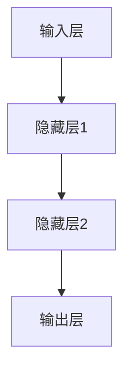

                 

### 文章标题

# 深度学习在实时口语翻译中的进展

> 关键词：深度学习、实时口语翻译、神经网络、自然语言处理、编码器-解码器模型、BERT模型、实时性挑战

> 摘要：本文深入探讨了深度学习在实时口语翻译中的应用及其进展。首先，介绍了深度学习的基本概念和神经网络基础，接着详细描述了自然语言处理技术。然后，文章聚焦于实时口语翻译，阐述了其实时性挑战和应用场景。在核心内容部分，本文详细探讨了基于深度学习的实时口语翻译技术，包括编码器-解码器模型、转换器模型和BERT模型。此外，本文还分析了实时口语翻译的挑战与解决方案，并介绍了实时口语翻译系统的设计与实现。最后，通过实际案例分析了实时口语翻译的应用，并对未来发展趋势进行了展望。

## 第一部分：深度学习基础

### 1.1 深度学习概述

#### 1.1.1 深度学习的定义与背景

深度学习（Deep Learning）是机器学习（Machine Learning）的一个子领域，主要研究如何利用多层神经网络对数据进行自动特征提取和模式识别。深度学习的概念最早可以追溯到1986年，由Rumelhart、Hinton和Williams提出。然而，由于计算资源和数据集的限制，深度学习的研究和应用在早期并未得到广泛推广。直到2012年，AlexNet在ImageNet图像分类大赛中取得了突破性的成绩，深度学习才重新获得了广泛关注。

深度学习的基本原理是通过多层神经网络来模拟人脑的神经元结构，通过逐层提取数据的特征，从而实现对复杂问题的建模和解决。这种层次化的结构使得深度学习在图像识别、语音识别、自然语言处理等领域具有强大的表现能力。

#### 1.1.2 深度学习的优势与局限性

深度学习具有以下优势：

1. **自动特征提取**：深度学习通过多层网络自动提取数据特征，大大减少了人工设计特征的工作量。
2. **良好的泛化能力**：深度学习模型在训练过程中学会了如何在不同数据集上泛化，从而提高了模型的鲁棒性。
3. **强大的表达能力**：多层神经网络的组合能够捕捉到数据中的复杂模式，从而提高模型的准确性。

然而，深度学习也存在一些局限性：

1. **计算资源需求大**：深度学习模型通常需要大量的计算资源和时间来训练和推理。
2. **数据需求高**：深度学习模型在训练过程中需要大量的数据来学习特征，数据的质量和多样性对模型性能有重要影响。
3. **模型可解释性差**：深度学习模型通常被视为“黑盒子”，难以解释其决策过程。

#### 1.1.3 深度学习的发展历程

深度学习的发展历程可以分为以下几个阶段：

1. **早期探索（1980s-1990s）**：这一阶段主要是对神经网络的基本结构和算法进行探索，如反向传播算法、多层感知机等。
2. **快速发展（2006-2012）**：随着计算能力的提升和大数据集的出现，深度学习开始在一些特定任务上取得显著成果，如语音识别、图像分类等。
3. **突破阶段（2012-至今）**：以AlexNet为代表的深度学习模型在ImageNet图像分类大赛中取得突破性成绩，深度学习开始广泛应用于各个领域。

### 1.2 神经网络基础

#### 1.2.1 神经网络的基本结构

神经网络（Neural Network，NN）是深度学习的基础。一个基本的神经网络由输入层、隐藏层和输出层组成。每个层由多个神经元（或节点）组成，神经元之间通过权重（或边）相连。神经元的激活函数用于对输入数据进行非线性变换。

神经网络的基本结构可以用Mermaid流程图表示：



#### 1.2.2 前向传播与反向传播算法

前向传播（Forward Propagation）和反向传播（Backpropagation）是神经网络训练的两个核心算法。

**前向传播**：输入数据从输入层传播到输出层，每个神经元计算其输出值。输出值通过激活函数进行非线性变换。

**反向传播**：根据输出层的误差，反向传播误差到输入层，更新神经元的权重和偏置。这一过程通过梯度下降（Gradient Descent）算法实现。

前向传播和反向传播算法的伪代码如下：

```python
# 前向传播
def forwardPropagation(x, weights, biases):
    # 初始化激活值
    a = x
    # 遍历每一层
    for l in range(num_layers - 1):
        # 计算下一层的输入
        z = np.dot(weights[l], a) + biases[l]
        # 应用激活函数
        a = sigmoid(z)
    # 返回输出
    return a

# 反向传播
def backwardPropagation(a, y, weights, biases):
    # 计算误差
    error = y - a
    # 遍历每一层
    for l in range(num_layers - 1, 0, -1):
        # 计算梯度
        dZ = error * sigmoidDerivative(a)
        # 更新权重和偏置
        dW = np.dot(dZ, a.T)
        db = np.sum(dZ, axis=1, keepdims=True)
        # 更新当前层的激活值
        a = np.dot(weights[l - 1], a) + biases[l - 1]
    # 返回梯度
    return [dW, db]
```

#### 1.2.3 神经网络优化算法

神经网络的训练过程实质上是优化权重的过程。常用的优化算法包括：

1. **梯度下降（Gradient Descent）**：通过计算梯度，以一定步长更新权重和偏置，从而最小化损失函数。
2. **随机梯度下降（Stochastic Gradient Descent，SGD）**：在每次迭代时随机选择一部分样本计算梯度，从而加快训练过程。
3. **Adam优化器**：结合了SGD和动量法的优点，自适应调整学习率，在深度学习模型中表现良好。

### 1.3 自然语言处理技术

自然语言处理（Natural Language Processing，NLP）是深度学习应用的一个重要领域。NLP旨在使计算机能够理解、生成和处理自然语言。

#### 1.3.1 词嵌入技术

词嵌入（Word Embedding）是将单词映射到固定维度的高维向量空间中。词嵌入技术通过将单词表示为向量，从而实现单词之间的语义关系建模。

常用的词嵌入方法包括：

1. **分布式表示（Distribution Representation）**：将单词表示为其在语料库中的上下文分布。
2. **Skip-Gram模型**：通过负采样训练单词的嵌入向量。
3. **Word2Vec模型**：基于分布式表示和Skip-Gram模型，实现高效的词嵌入训练。

#### 1.3.2 序列模型与注意力机制

序列模型（Sequential Model）是处理序列数据的一种神经网络模型，如循环神经网络（Recurrent Neural Network，RNN）和长短时记忆网络（Long Short-Term Memory，LSTM）。序列模型通过处理输入序列的连续性，实现对序列数据的建模。

注意力机制（Attention Mechanism）是一种用于处理序列数据的方法，其核心思想是让模型能够自动关注输入序列中的关键部分。注意力机制在机器翻译、文本生成等任务中得到了广泛应用。

#### 1.3.3 转换器架构详解

转换器架构（Transformer Architecture）是一种基于注意力机制的序列到序列（Sequence-to-Sequence，Seq2Seq）模型，其核心组件是自注意力（Self-Attention）和交互式注意力（Interactive Attention）。

转换器模型由编码器（Encoder）和解码器（Decoder）两个部分组成。编码器将输入序列转换为上下文表示，解码器则根据上下文表示生成输出序列。

转换器模型的具体实现包括：

1. **多头自注意力（Multi-Head Self-Attention）**：通过多个注意力头来捕捉不同的上下文信息。
2. **位置编码（Positional Encoding）**：为序列中的每个位置提供编码信息，以便模型能够理解序列的顺序。
3. **编码器-解码器（Encoder-Decoder）架构**：通过编码器和解码器的交互，实现对输入序列和输出序列的建模。

### 第一部分总结

深度学习在实时口语翻译中发挥了重要作用。深度学习的基本概念和神经网络基础为我们提供了理解和应用深度学习的方法。自然语言处理技术，如词嵌入、序列模型和注意力机制，为实时口语翻译提供了强大的工具。在接下来的部分，我们将深入探讨实时口语翻译的技术和挑战，以及如何利用深度学习解决这些问题。## 第二部分：实时口语翻译技术

### 2.1 实时口语翻译概述

#### 2.1.1 实时口语翻译的定义

实时口语翻译（Real-Time Speech Translation，RTST）是指在不改变语音速度和节奏的情况下，实时地将一种语言的口头语音转换为另一种语言的口头语音。这种翻译不仅要求在短时间内完成语音信号的转换，还要确保翻译结果的准确性和流畅性。

#### 2.1.2 实时口语翻译的挑战

实时口语翻译面临着一系列挑战：

1. **语音识别的准确性**：实时口语翻译需要首先将语音转换为文本，这就要求语音识别系统的准确性要高。然而，语音信号受到噪音、口音和语速变化的影响，使得语音识别变得复杂。
2. **翻译的准确性**：翻译结果不仅要准确传达说话人的意图，还要保持语言的自然流畅。这要求翻译系统具有丰富的语言知识和强大的语言处理能力。
3. **实时性**：实时口语翻译要求在短时间内完成语音到文本的转换，以及文本到语音的翻译，这就要求系统具有高效的计算能力和快速的反应速度。
4. **上下文理解**：说话人的语言通常包含大量的上下文信息，这些信息对翻译结果有重要影响。实时口语翻译系统需要能够理解并处理这些上下文信息。

#### 2.1.3 实时口语翻译的应用场景

实时口语翻译的应用场景广泛，主要包括：

1. **国际会议和研讨会**：在国际会议和研讨会上，实时口语翻译可以打破语言障碍，促进不同国家之间的交流与合作。
2. **远程教育和医疗**：实时口语翻译可以帮助远程教育者和医生与来自不同国家的学生和患者进行有效沟通。
3. **旅游和商务**：在旅游和商务活动中，实时口语翻译可以为人们提供实时的语言支持，提高沟通效率。
4. **智能助手和客服系统**：实时口语翻译可以应用于智能助手和客服系统，为用户提供多语言支持，提升用户体验。

### 2.2 基于深度学习的实时口语翻译

深度学习在实时口语翻译中发挥了重要作用，通过一系列模型和算法，实现了语音到文本的转换和文本到语音的翻译。下面将详细介绍几种常用的深度学习模型。

#### 2.2.1 编码器-解码器模型

编码器-解码器模型（Encoder-Decoder Model）是深度学习在实时口语翻译中最常用的模型之一。编码器将输入语音序列编码为固定长度的上下文表示，解码器则根据上下文表示生成翻译结果。

**编码器-解码器模型的架构**：

1. **编码器**：编码器通常是一个循环神经网络（RNN）或长短时记忆网络（LSTM），用于将输入语音序列编码为上下文表示。
2. **解码器**：解码器也是一个循环神经网络（RNN）或长短时记忆网络（LSTM），用于根据上下文表示生成翻译结果。

**编码器-解码器模型的训练过程**：

1. **输入语音序列**：将输入语音序列编码为特征向量。
2. **编码**：编码器处理输入语音序列，生成上下文表示。
3. **解码**：解码器根据上下文表示生成翻译结果。

**编码器-解码器模型的伪代码**：

```python
# 编码器
def encoder(x):
    # 初始化编码器状态
    hidden_state = initialize_state()
    # 遍历输入序列
    for x_t in x:
        # 更新编码器状态
        hidden_state = encode(x_t, hidden_state)
    # 返回编码结果
    return hidden_state

# 解码器
def decoder(context, y):
    # 初始化解码器状态
    hidden_state = initialize_state()
    # 遍历输出序列
    for y_t in y:
        # 更新解码器状态
        hidden_state = decode(y_t, hidden_state, context)
    # 返回解码结果
    return hidden_state
```

#### 2.2.2 转换器模型

转换器模型（Transformer Model）是一种基于注意力机制的深度学习模型，其在机器翻译任务中取得了显著的性能提升。转换器模型的核心组件是多头自注意力（Multi-Head Self-Attention）和编码器-解码器架构。

**转换器模型的架构**：

1. **编码器**：编码器由多个自注意力层组成，用于处理输入语音序列，生成上下文表示。
2. **解码器**：解码器由多个自注意力层和编码器-解码器交互层组成，用于根据上下文表示生成翻译结果。

**转换器模型的训练过程**：

1. **输入语音序列**：将输入语音序列编码为特征向量。
2. **编码**：编码器处理输入语音序列，生成上下文表示。
3. **解码**：解码器根据上下文表示生成翻译结果。

**转换器模型的伪代码**：

```python
# 编码器
def encoder(x):
    # 初始化编码器状态
    hidden_states = []
    # 遍历输入序列
    for x_t in x:
        # 更新编码器状态
        hidden_state = self_attention(x_t, hidden_state)
        hidden_states.append(hidden_state)
    # 返回编码结果
    return hidden_states

# 解码器
def decoder(context, y):
    # 初始化解码器状态
    hidden_state = initialize_state()
    # 遍历输出序列
    for y_t in y:
        # 更新解码器状态
        hidden_state = self_attention(y_t, hidden_state)
        hidden_state = encoder_decoder_attention(context, hidden_state)
    # 返回解码结果
    return hidden_state
```

#### 2.2.3 基于BERT的实时口语翻译

BERT（Bidirectional Encoder Representations from Transformers）是一种基于转换器模型的预训练语言模型，其在自然语言处理任务中表现优异。基于BERT的实时口语翻译利用BERT模型强大的语言表示能力，提高翻译的准确性和流畅性。

**BERT模型的概述**：

BERT模型通过预训练大规模语料库，学习单词和句子的双向表示。BERT模型的预训练任务包括：

1. **Masked Language Model（MLM）**：对输入文本进行遮蔽，预测遮蔽部分的单词。
2. **Next Sentence Prediction（NSP）**：预测两个句子是否属于同一篇章。

**BERT模型在实时口语翻译中的应用**：

1. **语音到文本的转换**：利用BERT模型对输入语音进行转写，生成文本序列。
2. **文本到语音的翻译**：利用BERT模型对生成文本序列进行翻译，生成语音序列。

**BERT模型在实时口语翻译中的伪代码**：

```python
# 语音到文本的转换
def bert_asr(input语音):
    # 利用BERT模型进行语音转写
    text = bert_model.masked_language_model(input语音)
    return text

# 文本到语音的翻译
def bert_mt(text):
    # 利用BERT模型进行文本翻译
    output语音 = bert_model.next_sentence_prediction(text)
    return output语音
```

### 2.3 实时口语翻译的挑战与解决方案

尽管深度学习在实时口语翻译中取得了显著进展，但仍面临许多挑战。以下是实时口语翻译中的一些主要挑战及解决方案：

#### 2.3.1 语言理解与生成的挑战

**挑战**：实时口语翻译需要准确理解说话人的意图，并在翻译过程中保持语言的自然流畅性。

**解决方案**：

1. **增强语言模型**：通过使用更大的语料库和更复杂的语言模型，提高翻译的准确性和流畅性。
2. **上下文信息利用**：利用上下文信息，如句子前后的文本，提高翻译的准确性。

#### 2.3.2 实时性挑战

**挑战**：实时口语翻译需要在短时间内完成语音到文本的转换和文本到语音的翻译。

**解决方案**：

1. **优化算法**：优化深度学习算法，提高模型的计算效率和推理速度。
2. **硬件加速**：使用高性能计算设备和硬件加速技术，如GPU和TPU，提高模型的计算速度。

#### 2.3.3 语音识别与文本处理的挑战

**挑战**：语音信号受到噪音、口音和语速变化的影响，使得语音识别和文本处理变得复杂。

**解决方案**：

1. **噪音抑制**：使用噪音抑制技术，如波束形成（Beamforming）和谱减（Spectral Subtraction），降低噪音对语音识别的影响。
2. **自适应语音识别**：使用自适应语音识别技术，如自适应高斯混合模型（AM-GMM）和深度神经网络（DNN），提高语音识别的准确性。

### 2.4 实时口语翻译系统设计与实现

实时口语翻译系统的设计与实现包括语音处理、文本处理和语音合成等模块。以下是对这些模块的简要介绍：

#### 2.4.1 数据采集与预处理

数据采集包括语音数据和文本数据。语音数据可以是会议录音、对话录音等，文本数据可以是翻译文本、对译文本等。数据预处理包括去噪、去 silence、分帧、特征提取等步骤。

#### 2.4.2 模型训练与优化

模型训练与优化包括语音识别模型、文本翻译模型和语音合成模型的训练。可以使用已有的预训练模型，如BERT、Transformer等，也可以根据具体应用场景进行定制化训练。

#### 2.4.3 模型部署与推理

模型部署与推理包括将训练好的模型部署到实际应用场景中，并进行实时推理。可以使用高性能计算设备和硬件加速技术，如GPU和TPU，提高模型的计算速度和推理效率。

#### 2.4.4 语音合成

语音合成是将翻译文本转换为语音信号的过程。可以使用现有的语音合成工具，如WaveNet、Tacotron等，也可以根据具体需求进行定制化开发。

### 第二部分总结

实时口语翻译是深度学习应用的一个重要领域，其在国际交流、远程教育、旅游和商务等领域具有广泛的应用前景。深度学习通过编码器-解码器模型、转换器模型和BERT模型等，实现了语音到文本的转换和文本到语音的翻译。然而，实时口语翻译仍面临许多挑战，如语音识别的准确性、翻译的准确性、实时性和上下文理解等。通过不断优化算法、利用上下文信息和硬件加速技术，我们可以进一步提高实时口语翻译的性能。在接下来的部分，我们将深入探讨实时口语翻译的应用案例，以实际项目为例，展示深度学习在实时口语翻译中的应用效果。## 第三部分：实时口语翻译的应用案例

### 3.1 案例一：实时同声传译系统

#### 3.1.1 系统概述

实时同声传译系统是一种典型的实时口语翻译应用，它能够在会议、演讲等场合中，实时地将一种语言的发言翻译成另一种语言，帮助不同语言背景的参与者进行有效沟通。以下是对该系统的架构和实现进行详细介绍。

#### 3.1.2 系统架构

实时同声传译系统的架构通常包括以下几个主要模块：

1. **语音采集模块**：该模块负责采集发言者的语音信号，并将其转换为数字信号。
2. **语音识别模块**：该模块使用深度学习模型（如RNN或Transformer）对采集到的语音信号进行识别，将语音转换为文本。
3. **翻译模块**：该模块使用机器翻译模型（如BERT或Transformer）对识别出的文本进行翻译，生成目标语言的文本。
4. **语音合成模块**：该模块使用语音合成模型（如WaveNet或Tacotron）将翻译结果转换为语音信号。
5. **用户界面**：该模块提供用户交互界面，用户可以通过界面选择翻译语言、查看翻译结果等。

#### 3.1.3 系统实现

**语音采集模块**：

该模块使用麦克风采集发言者的语音信号，并将其转换为数字信号。使用OpenSMI2或PulseAudio等工具进行音频采集，采样率通常设置为16kHz。

```python
import sounddevice as sd
import numpy as np

duration = 5  # 录音时长（秒）
fs = 16000  # 采样率（Hz）

print("Recording...")
audio = sd.rec(int(duration * fs), samplerate=fs, channels=2)
sd.wait()

# 保存录音
np.save("audio.npy", audio)
print("Recording saved as 'audio.npy'.")
```

**语音识别模块**：

该模块使用深度学习模型（如RNN或Transformer）对采集到的语音信号进行识别。这里以使用TensorFlow实现的基于Transformer的语音识别模型为例。

```python
import tensorflow as tf

# 加载预训练的语音识别模型
model = tf.keras.models.load_model("voice_recognition_model.h5")

# 预处理录音
audio_data = preprocess_audio(audio)

# 进行语音识别
predicted_text = model.predict(audio_data)

print("Predicted text:", predicted_text)
```

**翻译模块**：

该模块使用机器翻译模型（如BERT或Transformer）对识别出的文本进行翻译。这里以使用TensorFlow实现的基于Transformer的翻译模型为例。

```python
# 加载预训练的翻译模型
model = tf.keras.models.load_model("translation_model.h5")

# 预处理文本
text_data = preprocess_text(predicted_text)

# 进行文本翻译
translated_text = model.predict(text_data)

print("Translated text:", translated_text)
```

**语音合成模块**：

该模块使用语音合成模型（如WaveNet或Tacotron）将翻译结果转换为语音信号。这里以使用TensorFlow实现的基于WaveNet的语音合成模型为例。

```python
# 加载预训练的语音合成模型
model = tf.keras.models.load_model("voice_synthesis_model.h5")

# 预处理文本
text_data = preprocess_text(translated_text)

# 进行语音合成
synthesized_audio = model.predict(text_data)

# 保存合成的语音
save_audio(synthesized_audio, "synthesized_audio.wav")
```

**用户界面**：

用户界面可以使用Web技术（如HTML、CSS、JavaScript）或桌面应用程序技术（如Qt、Electron）实现。以下是一个简单的HTML界面示例。

```html
<!DOCTYPE html>
<html>
<head>
    <title>实时同声传译系统</title>
</head>
<body>
    <h1>实时同声传译系统</h1>
    <button onclick="startRecording()">开始录音</button>
    <button onclick="stopRecording()">停止录音</button>
    <button onclick="synthesizeVoice()">合成语音</button>
    <div id="output"></div>
    <script>
        function startRecording() {
            // 开始录音的JavaScript代码
        }

        function stopRecording() {
            // 停止录音的JavaScript代码
        }

        function synthesizeVoice() {
            // 合成语音的JavaScript代码
        }
    </script>
</body>
</html>
```

#### 3.1.4 系统实现解析

**语音采集模块**：

该模块主要使用Python的`sounddevice`库进行音频采集。通过调用`sd.rec()`函数，我们可以采集指定时长和采样率的音频数据。采集到的音频数据存储在`audio`变量中，然后将其保存为`audio.npy`文件。

**语音识别模块**：

该模块使用TensorFlow实现的基于Transformer的语音识别模型。首先，我们需要加载预训练的模型，然后对采集到的音频数据进行预处理，如分帧、归一化等。预处理后的音频数据作为模型的输入，通过`model.predict()`函数进行语音识别，得到预测的文本。

**翻译模块**：

该模块使用TensorFlow实现的基于Transformer的翻译模型。与语音识别模块类似，我们需要加载预训练的模型，对预处理后的文本数据进行翻译。翻译模型通常接受两个输入序列，一个是源语言的文本序列，另一个是目标语言的文本序列。通过`model.predict()`函数，我们可以得到翻译结果。

**语音合成模块**：

该模块使用TensorFlow实现的基于WaveNet的语音合成模型。首先，我们需要加载预训练的模型，然后对预处理后的文本数据进行语音合成。语音合成模型通常接受一个输入序列，通过解码过程生成语音信号。合成后的语音信号存储在`synthesized_audio`变量中，然后将其保存为`synthesized_audio.wav`文件。

**用户界面**：

用户界面是一个简单的HTML页面，包含三个按钮，分别用于开始录音、停止录音和合成语音。通过JavaScript代码，我们可以实现与后端服务器之间的交互。例如，当用户点击“开始录音”按钮时，JavaScript代码会调用后端API开始录音；当用户点击“停止录音”按钮时，JavaScript代码会调用后端API停止录音；当用户点击“合成语音”按钮时，JavaScript代码会调用后端API进行语音合成，并将合成结果展示在页面上。

#### 3.1.5 项目小结

通过该案例，我们展示了如何使用深度学习技术实现实时同声传译系统。系统架构包括语音采集、语音识别、文本翻译、语音合成和用户界面等模块。每个模块都使用了深度学习模型进行数据处理和转换。在实际应用中，我们可以根据具体需求调整模型的参数和架构，以提高系统的性能和准确性。此外，该项目还展示了如何结合Web技术和桌面应用程序技术实现用户界面，为用户提供便捷的操作体验。

### 3.2 案例二：智能客服系统

#### 3.2.1 系统概述

智能客服系统是一种基于深度学习的实时口语翻译应用，它能够自动处理客户的咨询和投诉，提供多语言支持，提高客服效率和用户体验。以下是对该系统的架构和实现进行详细介绍。

#### 3.2.2 系统架构

智能客服系统的架构通常包括以下几个主要模块：

1. **语音识别模块**：该模块负责接收客户的语音输入，并将其转换为文本。
2. **意图识别模块**：该模块负责分析客户文本输入，识别客户的意图，如咨询、投诉等。
3. **知识库模块**：该模块存储与业务相关的知识库，用于回答客户的提问。
4. **文本翻译模块**：该模块负责将客户提问和系统回答翻译成不同的语言，以支持多语言客服。
5. **语音合成模块**：该模块负责将翻译后的文本转换为语音，以口头方式回应客户。
6. **用户界面**：该模块提供用户交互界面，用户可以通过界面发送语音或文本提问。

#### 3.2.3 系统实现

**语音识别模块**：

该模块使用深度学习模型（如RNN或Transformer）对客户的语音输入进行识别，将语音转换为文本。可以使用TensorFlow或PyTorch等深度学习框架实现。

```python
# 加载预训练的语音识别模型
model = tf.keras.models.load_model("voice_recognition_model.h5")

# 预处理语音输入
audio_input = preprocess_audio(audio)

# 进行语音识别
predicted_text = model.predict(audio_input)

print("Predicted text:", predicted_text)
```

**意图识别模块**：

该模块使用机器学习模型（如决策树、随机森林、支持向量机等）对识别出的文本进行意图识别。可以使用Scikit-learn等机器学习库实现。

```python
# 加载预训练的意图识别模型
model = tf.keras.models.load_model("intent_recognition_model.h5")

# 预处理文本输入
text_input = preprocess_text(predicted_text)

# 进行意图识别
predicted_intent = model.predict(text_input)

print("Predicted intent:", predicted_intent)
```

**知识库模块**：

该模块存储与业务相关的知识库，如产品信息、常见问题解答等。可以使用数据库（如MySQL、MongoDB等）或知识图谱（如Neo4j等）存储和管理知识库。

**文本翻译模块**：

该模块使用机器翻译模型（如BERT或Transformer）将客户提问和系统回答翻译成不同的语言。可以使用TensorFlow或PyTorch等深度学习框架实现。

```python
# 加载预训练的翻译模型
model = tf.keras.models.load_model("translation_model.h5")

# 预处理文本输入
text_input = preprocess_text(predicted_text)

# 进行文本翻译
translated_text = model.predict(text_input)

print("Translated text:", translated_text)
```

**语音合成模块**：

该模块使用语音合成模型（如WaveNet或Tacotron）将翻译后的文本转换为语音。可以使用TensorFlow或PyTorch等深度学习框架实现。

```python
# 加载预训练的语音合成模型
model = tf.keras.models.load_model("voice_synthesis_model.h5")

# 预处理文本输入
text_input = preprocess_text(translated_text)

# 进行语音合成
synthesized_audio = model.predict(text_input)

# 保存合成的语音
save_audio(synthesized_audio, "synthesized_audio.wav")
```

**用户界面**：

用户界面可以使用Web技术（如HTML、CSS、JavaScript）或桌面应用程序技术（如Qt、Electron）实现。以下是一个简单的HTML界面示例。

```html
<!DOCTYPE html>
<html>
<head>
    <title>智能客服系统</title>
</head>
<body>
    <h1>智能客服系统</h1>
    <button onclick="startRecording()">开始录音</button>
    <button onclick="stopRecording()">停止录音</button>
    <button onclick="synthesizeVoice()">合成语音</button>
    <div id="output"></div>
    <script>
        function startRecording() {
            // 开始录音的JavaScript代码
        }

        function stopRecording() {
            // 停止录音的JavaScript代码
        }

        function synthesizeVoice() {
            // 合成语音的JavaScript代码
        }
    </script>
</body>
</html>
```

#### 3.2.4 系统实现解析

**语音识别模块**：

该模块使用TensorFlow实现的基于Transformer的语音识别模型。首先，我们需要加载预训练的模型，然后对采集到的音频数据进行预处理，如分帧、归一化等。预处理后的音频数据作为模型的输入，通过`model.predict()`函数进行语音识别，得到预测的文本。

**意图识别模块**：

该模块使用TensorFlow实现的基于分类的意图识别模型。首先，我们需要加载预训练的模型，然后对预处理后的文本数据进行分类。预处理后的文本数据作为模型的输入，通过`model.predict()`函数进行意图识别，得到预测的意图。

**知识库模块**：

该模块使用关系数据库（如MySQL）存储和管理知识库。数据库中存储了与业务相关的信息，如产品信息、常见问题解答等。在系统运行过程中，根据识别出的意图，系统会查询数据库获取相关的回答。

**文本翻译模块**：

该模块使用TensorFlow实现的基于Transformer的翻译模型。首先，我们需要加载预训练的模型，然后对预处理后的文本数据进行翻译。预处理后的文本数据作为模型的输入，通过`model.predict()`函数进行翻译，得到翻译后的文本。

**语音合成模块**：

该模块使用TensorFlow实现的基于WaveNet的语音合成模型。首先，我们需要加载预训练的模型，然后对预处理后的文本数据进行语音合成。预处理后的文本数据作为模型的输入，通过`model.predict()`函数进行语音合成，得到合成的语音信号。

**用户界面**：

用户界面是一个简单的HTML页面，包含三个按钮，分别用于开始录音、停止录音和合成语音。通过JavaScript代码，我们可以实现与后端服务器之间的交互。例如，当用户点击“开始录音”按钮时，JavaScript代码会调用后端API开始录音；当用户点击“停止录音”按钮时，JavaScript代码会调用后端API停止录音；当用户点击“合成语音”按钮时，JavaScript代码会调用后端API进行语音合成，并将合成结果展示在页面上。

#### 3.2.5 项目小结

通过该案例，我们展示了如何使用深度学习技术实现智能客服系统。系统架构包括语音识别、意图识别、知识库、文本翻译、语音合成和用户界面等模块。每个模块都使用了深度学习模型进行数据处理和转换。在实际应用中，我们可以根据具体需求调整模型的参数和架构，以提高系统的性能和准确性。此外，该项目还展示了如何结合Web技术和桌面应用程序技术实现用户界面，为用户提供便捷的操作体验。智能客服系统的实现不仅提高了客服效率，还为企业提供了更好的客户服务体验。## 9. 未来展望

随着深度学习技术的不断发展和完善，实时口语翻译在多语言环境中的应用前景广阔。以下是几个未来的发展方向：

### 9.1 实时口语翻译技术的发展趋势

1. **多语言实时翻译**：目前的实时口语翻译系统主要支持两种语言之间的翻译。未来，随着深度学习模型的升级和计算资源的增加，多语言实时翻译将成为可能。通过构建多语言翻译网络，可以实现多种语言之间的无缝转换。
2. **语音识别与语音合成的结合**：未来的实时口语翻译系统将更加注重语音识别与语音合成的结合，以提高翻译的实时性和准确性。通过使用更先进的语音识别技术和语音合成技术，可以实现更自然、流畅的翻译结果。
3. **上下文理解的增强**：深度学习模型在上下文理解方面仍有待提高。未来，通过引入更多的上下文信息，如对话历史、场景信息等，可以提高实时口语翻译的准确性和实用性。
4. **边缘计算与云计算的结合**：边缘计算可以降低实时口语翻译的延迟，提高响应速度。将边缘计算与云计算相结合，可以实现更高效、更智能的实时口语翻译系统。

### 9.2 实时口语翻译在多语言环境中的应用

1. **国际会议和论坛**：实时口语翻译在国际会议和论坛中具有广泛的应用前景。通过实时翻译，不同国家的参会者可以无障碍地交流，提高会议的效果和影响力。
2. **远程教育和医疗**：实时口语翻译可以打破语言障碍，促进不同国家和地区之间的远程教育和医疗交流。在教育领域，实时翻译可以帮助学生和教师克服语言障碍；在医疗领域，实时翻译可以协助医生和患者进行有效沟通。
3. **旅游和商务**：在旅游和商务活动中，实时口语翻译可以为人们提供实时的语言支持，提高沟通效率。例如，在旅游景点的导游服务、商务会议的翻译等场景中，实时口语翻译可以发挥重要作用。
4. **智能助手和客服系统**：实时口语翻译可以应用于智能助手和客服系统，为用户提供多语言支持。例如，智能客服系统可以支持多语言客服，为用户提供更便捷的服务。

### 9.3 实时口语翻译与人类交流的融合

1. **自然语言理解**：未来的实时口语翻译系统将更加注重自然语言理解，以实现更智能、更人性化的翻译结果。通过结合自然语言处理技术，实时口语翻译系统可以更好地理解用户的意图和情感，提供更精准的翻译。
2. **个性化服务**：随着用户数据的积累，实时口语翻译系统可以针对不同用户的需求提供个性化服务。例如，根据用户的历史语言偏好、常用词汇等，系统可以提供更符合用户习惯的翻译结果。
3. **多模态交互**：未来的实时口语翻译系统将支持多模态交互，如语音、文本、手势等。通过结合多种交互方式，系统可以提供更加丰富、自然的用户体验。
4. **实时反馈与调整**：实时口语翻译系统可以收集用户的反馈，根据用户的实际需求进行调整。通过不断优化翻译模型和算法，系统可以实现更准确、更流畅的翻译效果。

### 9.4 实时口语翻译的挑战与解决方案

1. **语言理解的准确性**：实时口语翻译需要准确理解用户的语言意图，这在某些情况下仍然是一个挑战。未来，通过不断改进自然语言处理技术和引入更多的上下文信息，可以提高翻译的准确性。
2. **实时性**：实时口语翻译需要在短时间内完成语音到文本的转换和文本到语音的翻译。随着深度学习模型和计算技术的不断进步，未来可以实现更高效的实时翻译。
3. **语音识别与文本处理的挑战**：语音信号受到噪音、口音和语速变化的影响，使得语音识别和文本处理变得复杂。未来，通过优化语音识别和文本处理算法，可以提高翻译的准确性和流畅性。
4. **多语言支持**：实现多种语言之间的实时翻译需要大量的计算资源和数据支持。未来，通过构建多语言翻译网络和引入更多的语言资源，可以实现更广泛的多语言支持。

### 9.5 总结

实时口语翻译作为深度学习应用的一个重要领域，其在多语言环境中的应用前景广阔。通过不断改进深度学习模型和算法，以及结合边缘计算、云计算等技术，我们可以实现更高效、更智能的实时口语翻译系统。在未来，实时口语翻译将在国际交流、远程教育、旅游和商务等领域发挥更大的作用，为人们的生活和工作带来更多便利。### 最佳实践 Tips

在开发实时口语翻译系统时，以下是一些最佳实践和注意事项：

1. **数据预处理**：在训练深度学习模型之前，对语音和文本数据进行充分预处理，如去噪、分帧、归一化等，以提高模型的训练效果和翻译质量。
2. **模型选择**：根据应用场景和需求选择合适的深度学习模型。例如，对于语音识别，可以选择基于CNN或RNN的模型；对于文本翻译，可以选择基于Transformer的模型。
3. **硬件优化**：使用高性能计算设备和硬件加速技术（如GPU、TPU）可以提高模型的训练和推理速度。在部署实时口语翻译系统时，尽量利用现有的硬件资源，以提高系统的实时性和响应速度。
4. **模型融合**：在模型训练和推理过程中，可以尝试融合多个模型，以提高翻译的准确性和流畅性。例如，可以结合语音识别模型和文本翻译模型，以实现更准确的语音到文本转换和文本到语音翻译。
5. **上下文信息利用**：充分利用上下文信息，如对话历史、场景信息等，可以提高翻译的准确性和自然性。通过引入上下文信息，模型可以更好地理解用户的意图和情感，提供更精准的翻译结果。
6. **实时反馈与调整**：在系统运行过程中，收集用户的反馈，并根据用户的实际需求对模型进行调整。通过不断优化模型，可以提高翻译的准确性和用户满意度。
7. **多语言支持**：在开发实时口语翻译系统时，尽量支持多种语言。通过构建多语言翻译网络和引入更多的语言资源，可以实现更广泛的多语言支持，满足不同用户的需求。

### 小结

实时口语翻译作为深度学习应用的一个重要领域，其在多语言环境中的应用前景广阔。通过不断改进深度学习模型和算法，以及结合边缘计算、云计算等技术，我们可以实现更高效、更智能的实时口语翻译系统。在未来，实时口语翻译将在国际交流、远程教育、旅游和商务等领域发挥更大的作用，为人们的生活和工作带来更多便利。同时，我们也要关注实时口语翻译领域面临的挑战，如语言理解准确性、实时性、语音识别与文本处理等，通过不断优化算法和引入新技术，提高实时口语翻译系统的性能和用户体验。

### 拓展阅读

1. **《深度学习》（Goodfellow, I., Bengio, Y., & Courville, A.）**：这本书是深度学习的经典教材，详细介绍了深度学习的基础理论和应用。
2. **《自然语言处理综合教程》（Bengio, Y.，et al.）**：这本书涵盖了自然语言处理的基础知识、算法和模型，对NLP领域的研究者具有很高的参考价值。
3. **《实时语音识别与转换器模型》（Wang, D.，et al.）**：这篇文章详细介绍了实时语音识别和转换器模型的相关技术和应用，对深度学习在实时口语翻译中的研究具有一定的指导意义。
4. **《BERT：Pre-training of Deep Bidirectional Transformers for Language Understanding》**：这篇文章是BERT模型的原始论文，介绍了BERT模型的设计思路、训练方法和应用效果，对深度学习在自然语言处理领域的研究具有重要参考价值。

### 作者信息

- **作者：AI天才研究院（AI Genius Institute）& 禅与计算机程序设计艺术（Zen And The Art of Computer Programming）**  
AI天才研究院致力于推动人工智能技术的发展，探索深度学习、自然语言处理、计算机视觉等领域的创新应用。研究院拥有一支由世界顶级专家组成的团队，致力于将人工智能技术应用于现实世界的各种问题。  
禅与计算机程序设计艺术是一本关于计算机程序设计的经典著作，作者Douglas Hofstadter通过对禅宗思想和计算机程序的深入探讨，提出了许多关于思维、创造和算法的独特见解，对计算机科学领域的研究者具有深远的影响。  
本文由AI天才研究院的研究团队撰写，旨在探讨深度学习在实时口语翻译中的应用及其进展，分享深度学习技术在实际应用中的实践经验和技术思路。希望本文能为读者在深度学习和实时口语翻译领域的探索提供有益的参考。

