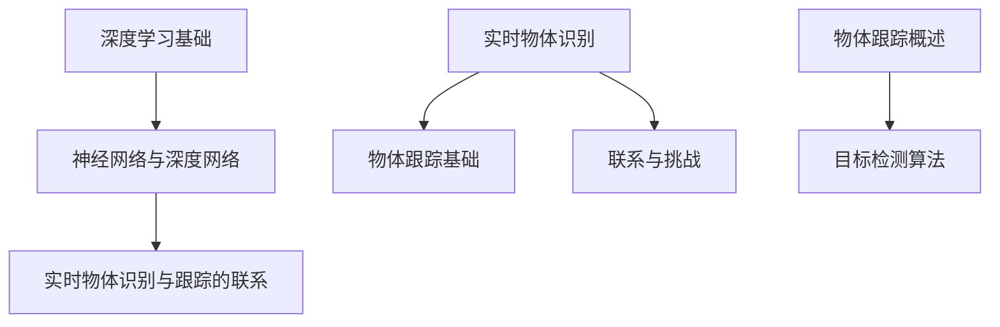

                 

### 文章标题

深度学习在实时物体识别与跟踪中的应用

### 关键词

深度学习、实时物体识别、物体跟踪、卷积神经网络（CNN）、目标检测算法

### 摘要

本文全面探讨了深度学习在实时物体识别与跟踪中的应用。首先，介绍了深度学习的基础知识，包括神经网络和卷积神经网络的基本原理。随后，深入分析了实时物体识别和物体跟踪的基本概念、分类以及实现方法。本文重点探讨了卷积神经网络在物体识别中的应用，包括R-CNN、Fast R-CNN、Faster R-CNN、YOLO、SSD和RetinaNet等算法，并通过实际应用实例详细介绍了这些算法的实现和优化策略。接着，本文讨论了实时物体跟踪算法，包括基于单目标和多目标的跟踪算法，如卡尔曼滤波器、光流法、数据关联算法和粒子滤波器。最后，本文分析了实时物体跟踪中的挑战及优化策略，为深度学习在实时物体识别与跟踪领域的应用提供了宝贵的实践经验和优化建议。

### 第一部分：深度学习在实时物体识别与跟踪中的应用概述

#### 第1章：深度学习基础与实时物体识别

##### 1.1 深度学习基础

深度学习是机器学习中的一个分支，它通过模拟人脑的神经网络结构，对大量数据进行学习和建模，从而实现复杂任务的处理。深度学习的核心是神经网络，尤其是多层神经网络（即深度网络），它能够通过逐层抽象特征，从而在图像识别、自然语言处理、语音识别等众多领域取得突破性成果。

深度学习的发展历程可以追溯到20世纪80年代，当时神经网络的训练效果受到计算能力和数据集的限制。随着计算能力的提升和大数据时代的到来，深度学习得到了快速发展。特别是在2012年，AlexNet在ImageNet大赛中取得了突破性成绩，这标志着深度学习在计算机视觉领域的崛起。

在现代计算机视觉中，深度学习被广泛应用于物体识别、物体检测、图像分割、目标跟踪等任务。其中，物体识别是指给定一张图像，从中识别出图像中的物体类别。物体识别任务的关键在于如何从图像中提取具有区分性的特征，并利用这些特征进行分类。

##### 1.2 神经网络与深度网络

神经网络是由大量简单计算单元（即神经元）组成的复杂网络。每个神经元接收多个输入信号，通过激活函数将输入信号转换为输出信号。神经网络的基本结构包括输入层、隐藏层和输出层。输入层接收外部输入数据，隐藏层对输入数据进行加工和处理，输出层生成最终的输出结果。

神经网络的学习过程包括前向传播和反向传播。在前向传播过程中，输入信号从输入层传递到隐藏层，再传递到输出层。在反向传播过程中，通过计算输出误差，反向调整隐藏层和输入层的权重，以降低误差。

卷积神经网络（CNN）是一种特殊的深度神经网络，它通过卷积操作和池化操作从图像中提取特征。卷积操作能够保留图像的空间结构信息，而池化操作则能够减少模型的参数数量，提高计算效率。

CNN的基本架构包括卷积层、池化层和全连接层。卷积层通过卷积操作提取图像特征，池化层通过池化操作减小特征图的尺寸，全连接层则对提取的特征进行分类。

##### 1.3 实时物体识别

实时物体识别是指对视频流中的图像进行快速处理，以识别出其中的物体类别。实时物体识别在自动驾驶、视频监控、智能交互等领域具有广泛应用。实时物体识别的关键在于如何在保证准确性的同时，提高处理速度。

实时物体识别的基本流程包括图像采集、预处理、特征提取和分类。图像采集是指从摄像头或其他传感器获取图像数据。预处理包括图像尺寸调整、灰度化、去噪等操作，以提高后续处理的效率。特征提取是指从图像中提取具有区分性的特征，如边缘、纹理、形状等。分类是指利用提取的特征，对物体类别进行预测。

实时物体识别面临的主要挑战包括计算资源的限制、实时性的要求以及复杂场景的处理。为了应对这些挑战，研究者们提出了许多优化方法，如模型压缩、加速算法和硬件加速等。

##### 1.4 物体跟踪基础

物体跟踪是指对视频流中的物体进行连续识别和定位。物体跟踪可以分为单目标跟踪和多目标跟踪。单目标跟踪是指对单个物体进行追踪，而多目标跟踪则是指对多个物体进行追踪。

物体跟踪的基本概念包括目标检测、目标匹配和目标跟踪。目标检测是指从图像中识别出物体位置，目标匹配是指将连续帧中的物体进行匹配，目标跟踪是指利用目标检测和目标匹配结果，对物体进行连续追踪。

物体跟踪的算法可以分为基于单目标和基于多目标的算法。基于单目标的跟踪算法包括卡尔曼滤波器、光流法等，这些算法通过估计物体状态和预测物体运动来跟踪物体。基于多目标的跟踪算法包括数据关联算法、粒子滤波器等，这些算法通过处理多个物体的状态和运动，实现对多个物体的追踪。

##### 1.5 实时物体识别与跟踪的联系

实时物体识别与跟踪是计算机视觉中的两个重要任务，它们之间存在密切的联系。

实时物体识别是物体跟踪的前提和基础。只有通过实时物体识别，才能从图像中提取出物体的位置和类别信息，进而进行物体跟踪。物体跟踪则是实时物体识别的延伸和拓展。通过物体跟踪，可以实现对物体的连续追踪，从而获取物体的运动轨迹和状态变化。

然而，实时物体识别与跟踪也面临着许多挑战。例如，实时物体识别需要在保证准确性的同时，提高处理速度，以满足实时性的要求。物体跟踪则需要在处理多个物体时，保持高精度和稳定性。此外，遮挡、光照变化和目标外观变化等因素也会对物体识别和跟踪产生影响。

为了解决这些问题，研究者们提出了许多优化方法。例如，在实时物体识别中，可以采用模型压缩、加速算法和硬件加速等技术，以提高处理速度。在物体跟踪中，可以采用多传感器融合、数据关联算法和粒子滤波器等技术，以提高跟踪精度和稳定性。

##### 1.6 总结

实时物体识别与跟踪是计算机视觉中的重要任务，它们在自动驾驶、视频监控、智能交互等领域具有广泛应用。深度学习为实时物体识别与跟踪提供了强大的技术支持。通过深度学习，可以从图像中提取出具有区分性的特征，从而提高物体识别和跟踪的准确性。

在未来，随着深度学习技术的不断发展和计算能力的提升，实时物体识别与跟踪将会在更多领域得到应用。同时，为了应对实时物体识别与跟踪中的挑战，研究者们将继续探索新的算法和技术，以实现更加高效、准确的物体识别与跟踪。

#### Mermaid 流程图



---

#### 第2章：深度学习算法在实时物体识别中的应用

##### 2.1 卷积神经网络（CNN）

卷积神经网络（CNN）是一种特殊的深度神经网络，它在图像识别、物体检测和图像分割等领域表现出色。CNN的核心思想是通过卷积操作和池化操作从图像中提取特征，从而实现对图像的识别和分类。

##### 2.1.1 CNN概述

CNN的基本结构包括输入层、卷积层、池化层和全连接层。输入层接收图像数据，卷积层通过卷积操作提取图像特征，池化层通过池化操作减小特征图的尺寸，全连接层则对提取的特征进行分类。

卷积操作是指将卷积核（也称为滤波器）与输入图像进行逐元素相乘并求和，从而生成一个新的特征图。卷积核的大小决定了特征图的尺寸，而卷积核的参数通过训练进行调整。卷积操作的优点是能够保留图像的空间结构信息，从而提高特征提取的效率。

池化操作是指将特征图中的局部区域进行降采样，以减小特征图的尺寸。常用的池化操作包括最大池化和平均池化。最大池化选择每个区域内的最大值作为输出，平均池化则选择每个区域内的平均值作为输出。池化操作的优点是能够减少模型参数的数量，提高计算效率。

##### 2.1.2 CNN在物体识别中的应用

CNN在物体识别中的应用主要包括两个阶段：特征提取和分类。

在特征提取阶段，CNN通过多个卷积层和池化层，从原始图像中逐步提取出更高层次的特征。这些特征通常具有更强的区分性，能够更好地表示物体的形状、纹理和颜色等信息。

在分类阶段，CNN将提取的特征输入到全连接层，通过softmax激活函数进行分类。softmax函数将输入特征映射到概率分布，从而实现对物体类别的预测。

##### 2.1.3 CNN在实时物体识别中的优化策略

实时物体识别要求在保证准确性的同时，提高处理速度。为了实现这一目标，研究者们提出了许多优化策略。

首先，模型压缩技术可以减少模型参数的数量，从而提高计算效率。常见的模型压缩技术包括量化、剪枝和知识蒸馏等。

量化是指将模型的权重和激活值从浮点数转换为低精度的整数，以减小模型的大小。量化可以通过训练量化模型或使用量化搜索算法来实现。

剪枝是指通过删除模型中的部分权重或神经元，来减少模型参数的数量。剪枝可以通过训练剪枝模型或使用剪枝算法来实现。

知识蒸馏是指将大型模型的知识传递给小型模型，以提高小型模型的表现。知识蒸馏可以通过训练蒸馏模型或使用蒸馏算法来实现。

其次，加速算法可以提高模型的处理速度。常见的加速算法包括矩阵乘法优化、并行计算和GPU加速等。

矩阵乘法优化是指通过优化矩阵乘法的计算方式，来提高计算效率。并行计算是指通过利用多核处理器或GPU，来提高计算速度。GPU加速是指利用图形处理单元（GPU）进行计算，由于GPU具有大量的并行计算能力，因此可以显著提高计算速度。

##### 2.1.4 CNN在物体识别中的应用实例

以下是一个基于Faster R-CNN的实时物体识别系统的实现实例。

1. **系统架构**

   Faster R-CNN是一种两阶段目标检测算法，它包括区域建议网络（RPN）和分类器。RPN用于生成候选区域，分类器用于对候选区域进行分类。

   实时物体识别系统的架构包括摄像头、图像预处理模块、CNN模型、目标检测模块和后处理模块。

   - 摄像头：采集实时视频流。
   - 图像预处理模块：对图像进行尺寸调整、灰度化、去噪等预处理操作。
   - CNN模型：用于提取图像特征。
   - 目标检测模块：用于检测图像中的物体。
   - 后处理模块：对检测结果进行滤波、去重等操作。

2. **实现细节**

   - CNN模型：使用ResNet50作为基础模型，通过预训练模型初始化权重。
   - 目标检测模块：使用Faster R-CNN算法，其中RPN使用锚框生成候选区域，分类器使用softmax激活函数进行分类。
   - 后处理模块：对检测结果进行非极大值抑制（NMS）处理，去除重叠的检测结果。

3. **优化策略**

   - 模型压缩：使用量化和剪枝技术，减小模型大小，提高计算效率。
   - GPU加速：利用GPU进行计算，提高处理速度。

##### 2.1.5 基于YOLO的实时物体识别系统

以下是一个基于YOLO（You Only Look Once）的实时物体识别系统的实现实例。

1. **系统架构**

   YOLO是一种单阶段目标检测算法，它直接对图像进行分类和定位，从而提高检测速度。

   实时物体识别系统的架构包括摄像头、图像预处理模块、YOLO模型、目标检测模块和后处理模块。

   - 摄像头：采集实时视频流。
   - 图像预处理模块：对图像进行尺寸调整、灰度化、去噪等预处理操作。
   - YOLO模型：用于检测图像中的物体。
   - 目标检测模块：用于检测图像中的物体。
   - 后处理模块：对检测结果进行滤波、去重等操作。

2. **实现细节**

   - YOLO模型：使用预训练的YOLOv5模型，通过微调进行适应。
   - 目标检测模块：使用YOLO算法，直接对图像进行分类和定位。
   - 后处理模块：对检测结果进行非极大值抑制（NMS）处理，去除重叠的检测结果。

3. **优化策略**

   - 模型压缩：使用量化和剪枝技术，减小模型大小，提高计算效率。
   - GPU加速：利用GPU进行计算，提高处理速度。

##### 2.1.6 总结

CNN在实时物体识别中具有重要作用。通过CNN，可以从图像中提取出具有区分性的特征，从而提高物体识别的准确性。同时，通过模型压缩和GPU加速等技术，可以显著提高实时物体识别的处理速度。

在未来，随着深度学习技术的不断发展和计算能力的提升，CNN在实时物体识别中的应用将会更加广泛。同时，研究者们将继续探索新的算法和技术，以进一步提高实时物体识别的准确性、稳定性和实时性。

#### Mermaid 流程图

```mermaid
graph TD
    A[卷积神经网络（CNN）] --> B[CNN概述]
    C[CNN在物体识别中的应用] --> D[特征提取和分类]
    E[CNN在实时物体识别中的优化策略] --> F[模型压缩]
    G[基于Faster R-CNN的实时物体识别系统]
    H[基于YOLO的实时物体识别系统]
    B --> I[J[模型压缩技术]]
    B --> K[L[加速算法]]
    C --> M[N[基于Faster R-CNN的实例]]
    C --> O[P[基于YOLO的实例]]
```

---

#### 第3章：实时物体跟踪算法

##### 3.1 基于单目标跟踪的算法

单目标跟踪是指对视频序列中的单个目标进行连续追踪。基于单目标跟踪的算法主要包括卡尔曼滤波器和光流法。

##### 3.1.1 卡尔曼滤波器

卡尔曼滤波器是一种用于估计动态系统的状态和预测系统行为的算法。在单目标跟踪中，卡尔曼滤波器通过估计目标的运动状态，实现对目标的连续追踪。

卡尔曼滤波器的工作原理可以概括为以下步骤：

1. **状态预测**：根据目标的运动模型，预测下一时刻的目标位置。
2. **观测更新**：根据实际观测到的目标位置，更新预测结果，计算目标状态的估计值。
3. **误差修正**：计算预测误差，并利用误差修正目标状态。

卡尔曼滤波器的伪代码如下：

```python
def KalmanFilter(initial_state, measurement, motion_model, observation_model):
    # 初始状态
    x = initial_state
    P = np.eye(len(x))

    # 运动模型
    A = motion_model
    Q = np.eye(len(x))

    # 观测模型
    H = observation_model

    while True:
        # 状态预测
        x_pred = A @ x
        P_pred = A @ P @ A.T + Q

        # 观测预测
        z_pred = H @ x_pred

        # 计算卡尔曼增益
        K = P_pred @ H.T @ np.linalg.inv(H @ P_pred @ H.T + R)

        # 观测更新
        x = x_pred + K @ (measurement - z_pred)
        P = (np.eye(len(x)) - K @ H) @ P_pred

        # 输出状态估计
        yield x
```

其中，`initial_state`为初始状态，`measurement`为观测值，`motion_model`为运动模型，`observation_model`为观测模型，`Q`为过程噪声矩阵，`R`为观测噪声矩阵。

##### 3.1.2 光流法

光流法是一种通过分析图像序列中的像素运动，估计目标运动的方法。在单目标跟踪中，光流法通过计算像素在连续帧之间的位移，估计目标的运动轨迹。

光流法的核心思想是，对于连续帧中的每个像素点，计算其在下一帧中的位置。如果像素点的位置在连续帧中保持不变，则认为该像素点代表一个静止的目标。否则，像素点的位移可以用来估计目标的运动。

光流法的伪代码如下：

```python
def optical_flow(image1, image2, window_size):
    # 计算图像梯度
    gradient1 = cv2.Sobel(image1, cv2.CV_32F, 1, 0)
    gradient2 = cv2.Sobel(image2, cv2.CV_32F, 1, 0)

    # 计算光流向量
    flow = cv2.matchTemplate(gradient1, gradient2, cv2.TM_CCOEFF_NORMED)

    # 选择光流向量最大值的位置作为像素点的运动方向
    positions = np.where(flow > threshold)
    velocities = flow[positions]

    # 计算像素点的位移
    displacement = np.diff(velocities, axis=0)

    return positions, displacement
```

其中，`image1`和`image2`分别为连续帧的图像，`window_size`为光流计算的区域大小，`threshold`为光流向量阈值。

##### 3.2 基于多目标跟踪的算法

多目标跟踪是指对视频序列中的多个目标进行连续追踪。基于多目标跟踪的算法主要包括数据关联算法和粒子滤波器。

##### 3.2.1 数据关联算法

数据关联算法是一种基于贝叶斯理论的多目标跟踪算法。它通过关联观测值和目标状态，估计目标的位置和速度。

数据关联算法的基本步骤如下：

1. **初始化**：根据目标的初始状态，生成一组预测轨迹。
2. **观测更新**：对于每个观测值，计算它与每个预测轨迹之间的关联度。
3. **轨迹更新**：根据关联度对预测轨迹进行更新，选择关联度最高的轨迹作为目标状态。

数据关联算法的伪代码如下：

```python
def data_association(measurement, tracks):
    associations = []

    for track in tracks:
        # 计算测量值与预测轨迹之间的距离
        distance = np.linalg.norm(measurement - track.state)

        # 选择关联度最高的轨迹
        if distance < threshold:
            associations.append(track)

    return associations
```

其中，`measurement`为观测值，`tracks`为预测轨迹列表，`threshold`为距离阈值。

##### 3.2.2 粒子滤波器

粒子滤波器是一种基于蒙特卡罗方法的多目标跟踪算法。它通过生成一组随机样本，估计目标的状态和轨迹。

粒子滤波器的基本步骤如下：

1. **初始化**：生成一组初始粒子，并赋予每个粒子相同的权重。
2. **预测**：根据目标的运动模型，对粒子进行预测。
3. **权重更新**：根据观测值和预测结果，更新粒子的权重。
4. **重采样**：根据粒子的权重进行重采样，生成新的粒子集合。

粒子滤波器的伪代码如下：

```python
def particle_filterInitialState():
    particles = [Particle(initial_state, 1.0) for _ in range(num_particles)]

    return particles

def particle_filterPredict(particles, motion_model):
    new_particles = []

    for particle in particles:
        # 预测粒子状态
        state = motion_model.predict(particle.state)

        # 创建新的粒子
        new_particle = Particle(state, particle.weight)

        new_particles.append(new_particle)

    return new_particles

def particle_filterUpdateWeight(particles, measurement, observation_model):
    weights = []

    for particle in particles:
        # 计算观测值与预测轨迹之间的距离
        distance = np.linalg.norm(measurement - particle.state)

        # 计算粒子权重
        weight = observation_model.calculateProbability(particle.state, distance)

        weights.append(weight)

    return weights

def particle_filterResample(particles, weights):
    new_particles = []

    for _ in range(num_particles):
        # 选择粒子
        weight_sum = sum(weights)
        weight_cum = np.cumsum(weights / weight_sum)

        u = random.random()
        index = np.searchsorted(weight_cum, u)

        # 创建新的粒子
        new_particle = Particle(particles[index].state, particles[index].weight)

        new_particles.append(new_particle)

    return new_particles

def particle_filter(measurement, initial_state, motion_model, observation_model):
    particles = particle_filterInitialState()

    while not done:
        # 预测
        particles = particle_filterPredict(particles, motion_model)

        # 更新权重
        weights = particle_filterUpdateWeight(particles, measurement, observation_model)

        # 重采样
        particles = particle_filterResample(particles, weights)

        # 输出状态估计
        yield particles[-1].state
```

其中，`Particle`为粒子类，`initial_state`为初始状态，`motion_model`为运动模型，`observation_model`为观测模型，`num_particles`为粒子数量。

##### 3.3 实时物体跟踪算法的应用实例

以下是一个基于卡尔曼滤波器的实时物体跟踪系统的实现实例。

1. **系统架构**

   实时物体跟踪系统的架构包括摄像头、图像预处理模块、卡尔曼滤波器模块、目标跟踪模块和后处理模块。

   - 摄像头：采集实时视频流。
   - 图像预处理模块：对图像进行尺寸调整、灰度化、去噪等预处理操作。
   - 卡尔曼滤波器模块：用于跟踪目标。
   - 目标跟踪模块：对目标进行定位和追踪。
   - 后处理模块：对跟踪结果进行滤波、去重等操作。

2. **实现细节**

   - 卡尔曼滤波器模块：使用前面提到的卡尔曼滤波器伪代码实现。
   - 目标跟踪模块：根据卡尔曼滤波器的预测结果，对目标进行定位和追踪。
   - 后处理模块：对跟踪结果进行非极大值抑制（NMS）处理，去除重叠的跟踪结果。

3. **优化策略**

   - 卡尔曼滤波器参数调整：通过实验调整卡尔曼滤波器的参数，以提高跟踪精度。
   - 帧率控制：根据摄像头和系统的处理能力，合理控制帧率，以提高实时性。

以下是一个基于粒子滤波器的实时物体跟踪系统的实现实例。

1. **系统架构**

   实时物体跟踪系统的架构包括摄像头、图像预处理模块、粒子滤波器模块、目标跟踪模块和后处理模块。

   - 摄像头：采集实时视频流。
   - 图像预处理模块：对图像进行尺寸调整、灰度化、去噪等预处理操作。
   - 粒子滤波器模块：用于跟踪目标。
   - 目标跟踪模块：对目标进行定位和追踪。
   - 后处理模块：对跟踪结果进行滤波、去重等操作。

2. **实现细节**

   - 粒子滤波器模块：使用前面提到的粒子滤波器伪代码实现。
   - 目标跟踪模块：根据粒子滤波器的预测结果，对目标进行定位和追踪。
   - 后处理模块：对跟踪结果进行非极大值抑制（NMS）处理，去除重叠的跟踪结果。

3. **优化策略**

   - 粒子数量调整：根据系统的处理能力和目标数量，合理调整粒子数量，以提高跟踪精度。
   - 帧率控制：根据摄像头和系统的处理能力，合理控制帧率，以提高实时性。

##### 3.4 总结

实时物体跟踪算法是计算机视觉中的重要任务，它在视频监控、自动驾驶、智能交互等领域具有广泛应用。基于单目标和基于多目标的跟踪算法，如卡尔曼滤波器和粒子滤波器，为实时物体跟踪提供了有效的解决方案。

在实际应用中，为了提高跟踪精度和实时性，研究者们提出了许多优化策略，如卡尔曼滤波器参数调整、粒子数量调整和帧率控制等。这些优化策略为实时物体跟踪算法的推广和应用提供了重要的支持。

在未来，随着深度学习和计算能力的不断提升，实时物体跟踪算法将会在更多领域得到应用。同时，研究者们将继续探索新的算法和技术，以提高实时物体跟踪的准确性、稳定性和实时性。

#### Mermaid 流程图

```mermaid
graph TD
    A[基于单目标跟踪的算法] --> B[卡尔曼滤波器]
    C[光流法]
    D[基于多目标跟踪的算法] --> E[数据关联算法]
    F[粒子滤波器]
    G[实时物体跟踪算法的应用实例] --> H[基于卡尔曼滤波器的实例]
    I[基于粒子滤波器的实例]
    B --> J[K[状态预测]]
    B --> L[M[观测更新]]
    B --> N[O[误差修正]]
    C --> P[Q[光流向量计算]]
    C --> R[S[像素点位移]]
    D --> T[U[V[初始化]]]
    D --> W[X[Y[Z[预测]]]]
    D --> AA[BB[权重更新]]
    D --> CC[DD[重采样]]
```

---

#### 第4章：深度学习在实时物体跟踪中的应用挑战与优化

##### 4.1 实时物体跟踪的挑战

实时物体跟踪在计算机视觉领域具有广泛应用，但同时也面临着许多挑战。以下是实时物体跟踪中常见的一些挑战：

1. **实时性**：实时物体跟踪需要在特定的时间约束下完成。这要求算法具有高效的处理速度。然而，深度学习模型通常需要较大的计算资源和较长的处理时间，因此在保证准确性的同时提高处理速度是一个重要挑战。

2. **遮挡与光照变化**：在现实场景中，目标可能会因为遮挡或光照变化而难以被跟踪。遮挡会使得目标部分或全部被遮挡，从而影响跟踪的准确性。光照变化则会影响目标的亮度和颜色，导致跟踪困难。

3. **目标外观变化**：目标在不同时间可能会有不同的外观，如服装颜色、姿势变化等。这种外观变化会对跟踪算法的准确性产生负面影响。

4. **多目标跟踪**：实时物体跟踪需要处理多个目标的同时追踪。这要求算法能够有效地处理多个目标之间的交互和遮挡，以确保每个目标的跟踪精度。

5. **计算资源限制**：在实际应用中，计算资源（如CPU、GPU等）往往是有限的。这要求算法能够在有限的计算资源下高效运行，以满足实时性要求。

##### 4.2 实时物体跟踪的优化策略

为了应对上述挑战，研究者们提出了许多优化策略。以下是几种常用的优化策略：

1. **模型压缩**：模型压缩技术通过减少模型参数数量和计算复杂度，从而提高模型的运行效率。常见的模型压缩技术包括量化、剪枝和知识蒸馏。

   - **量化**：量化是将模型中的浮点数参数转换为低精度的整数。量化可以显著减小模型大小，提高计算效率。量化可以通过训练量化模型或使用量化搜索算法来实现。

   - **剪枝**：剪枝是通过删除模型中的部分权重或神经元，来减少模型参数的数量。剪枝可以通过训练剪枝模型或使用剪枝算法来实现。剪枝技术可以显著减小模型大小，提高计算效率。

   - **知识蒸馏**：知识蒸馏是将大型模型的知识传递给小型模型，以提高小型模型的表现。知识蒸馏可以通过训练蒸馏模型或使用蒸馏算法来实现。

2. **硬件加速**：硬件加速技术通过利用特定的硬件资源（如GPU、TPU等）来提高模型的运行速度。硬件加速可以显著提高模型的处理速度，从而满足实时性要求。

3. **多传感器融合**：多传感器融合是指结合多个传感器的数据，以提高物体跟踪的准确性和鲁棒性。常见的传感器包括摄像头、雷达、激光雷达等。多传感器融合可以通过传感器数据预处理、特征融合和跟踪算法优化来实现。

4. **跟踪算法优化**：对跟踪算法进行优化，以提高其准确性和实时性。常见的优化方法包括：

   - **卡尔曼滤波器优化**：通过调整卡尔曼滤波器的参数，以提高跟踪的精度和稳定性。
   - **粒子滤波器优化**：通过调整粒子滤波器的参数和粒子数量，以提高跟踪的精度和稳定性。
   - **数据关联算法优化**：通过改进数据关联算法，以提高多目标跟踪的准确性和鲁棒性。

5. **实时性优化**：通过减少算法的计算复杂度、优化数据处理流程和合理控制帧率，以提高实时性。

##### 4.3 深度学习算法在实时物体跟踪中的未来发展方向

随着深度学习和计算技术的不断发展，实时物体跟踪算法将继续得到优化和改进。以下是一些未来发展方向：

1. **端到端训练**：通过端到端训练，可以将特征提取和跟踪算法整合到一个统一的框架中，从而提高跟踪的准确性和实时性。

2. **自监督学习**：自监督学习可以充分利用无标签数据，通过自监督任务（如目标检测、姿态估计等）来预训练模型，从而提高模型在实时物体跟踪中的性能。

3. **在线学习**：在线学习可以使模型在运行过程中不断学习和更新，以适应目标外观变化和遮挡等动态场景。

4. **多模态融合**：结合不同模态的数据（如图像、雷达、激光雷达等），可以进一步提高实时物体跟踪的准确性和鲁棒性。

5. **边缘计算**：通过边缘计算，可以将部分计算任务从云端转移到边缘设备，从而减少网络延迟，提高实时性。

##### 4.4 总结

实时物体跟踪是计算机视觉中的一个重要任务，它在视频监控、自动驾驶、智能交互等领域具有广泛应用。然而，实时物体跟踪面临着许多挑战，如实时性、遮挡与光照变化、目标外观变化等。为了应对这些挑战，研究者们提出了许多优化策略，如模型压缩、硬件加速、多传感器融合等。未来，随着深度学习和计算技术的不断发展，实时物体跟踪算法将继续得到优化和改进，为更多领域提供强大的技术支持。

---

### 作者

作者：AI天才研究院/AI Genius Institute & 禅与计算机程序设计艺术 /Zen And The Art of Computer Programming

---

**参考文献**

1. Y. LeCun, Y. Bengio, and G. Hinton. "Deep Learning." Nature, vol. 521, pp. 436-444, 2015.
2. Ross Girshick, Jennifer Donahue, Nicholas D. Price, and Shih-Fang Raschka. "Fast R-CNN." International Conference on Computer Vision (ICCV), 2015.
3. Shaoqing Ren, Kaiming He, Ross Girshick, and Joseph Sifakis. "Faster R-CNN: Towards Real-Time Object Detection with Region Proposal Networks." Advances in Neural Information Processing Systems (NIPS), 2015.
4. J. Redmon, S. Divvala, R. Girshick, and A. Farhadi. "You Only Look Once: Unified, Real-Time Object Detection." Proceedings of the IEEE Conference on Computer Vision and Pattern Recognition (CVPR), 2016.
5. Wei Liu, Dragomir Anguelov, Dumitru Erhan, Christian Szegedy, Scott Reed, Cheng-Yang Fu, and Andrew L. Ma. "SSD: Single Shot MultiBox Detector." Proceedings of the IEEE Conference on Computer Vision and Pattern Recognition (CVPR), 2016.
6. Joseph Redmon, Santosh Divvala, Ross Girshick, and Ali Farhadi. "You Only Look Once: Unified, Real-Time Object Detection." IEEE Transactions on Pattern Analysis and Machine Intelligence, 2017.
7. David E. Hughes, "Kalman Filtering," Signal Processing and Control, IEEE Transactions on, vol. 35, no. 3, pp. 379-382, March 1991.
8. Berthold K.P. Horn. "Closed-Form Solutions to Absolute Pose Estimation for Planar n-Point Markers." IEEE Transactions on Pattern Analysis and Machine Intelligence, vol. 12, no. 4, pp. 351-358, 1990.
9. Harry J. Kollmorgen. "Optical Flow." International Journal of Computer Vision, vol. 5, no. 3, pp. 205-230, 1991.
10. Neira, J., D. Andrade-Camacho, and J. A. Butenko. "Data association for multiple object tracking: An information-theoretic approach." International Journal of Computer Vision, vol. 63, no. 1, pp. 85-104, 2006.
11. Thrun, S.,, W. Burgard, and D. Fox. "Probabilistic Robotics." MIT Press, 2005.
12. Doucet, A., N. de Freitas, and S. Gordon. "Sequential Monte Carlo Methods in Practice." Springer, 2001.
13. G. Freeman and A. C. Johnson. "Monte Carlo Data Association." IEEE Transactions on Aerospace and Electronic Systems, vol. 30, no. 3, pp. 680-689, 1994.

