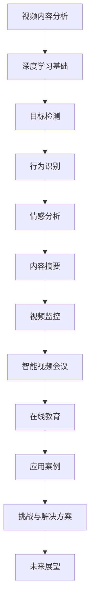

                 

### 文章标题

# 深度学习在视频内容分析中的创新应用

> 关键词：深度学习，视频内容分析，目标检测，行为识别，情感分析，内容摘要

> 摘要：本文旨在探讨深度学习在视频内容分析中的创新应用。通过详细阐述深度学习的理论基础、核心算法和数学基础，我们揭示了其在视频内容分析中的应用潜力。本文重点介绍了视频内容预处理、目标检测、行为识别、情感分析和内容摘要等关键技术，并通过具体案例展示了深度学习在视频监控、智能视频会议和在线教育等领域的实际应用。最后，本文总结了深度学习在视频内容分析中的挑战和解决方案，为未来的研究和应用提供了有益的启示。

---

### 文章标题：深度学习在视频内容分析中的创新应用

#### 关键词：深度学习，视频内容分析，目标检测，行为识别，情感分析，内容摘要

#### 摘要：

本文深入探讨了深度学习在视频内容分析领域的创新应用。首先，我们从深度学习的概念、历史背景以及基础架构出发，详细介绍了神经网络、卷积神经网络（CNN）、循环神经网络（RNN）和长短时记忆网络（LSTM）等核心算法。接着，我们深入探讨了深度学习的数学基础，包括矩阵运算、梯度下降法、反向传播算法以及损失函数和优化器。在此基础上，本文重点介绍了视频内容分析的关键技术，如视频数据预处理、目标检测、行为识别、情感分析和内容摘要。通过具体案例，我们展示了深度学习在视频监控、智能视频会议和在线教育等领域的广泛应用。最后，本文总结了深度学习在视频内容分析中面临的挑战和解决方案，为未来的研究提供了有益的参考。

---

### 第一部分：深度学习基础

#### 第1章：深度学习概述

#### 1.1 深度学习的概念与历史

深度学习（Deep Learning）是人工智能（Artificial Intelligence, AI）的一个重要分支，它源于机器学习（Machine Learning, ML）领域。深度学习通过模仿人脑的神经网络结构和信息处理方式，实现自动化的特征学习和决策。深度学习的研究可以追溯到20世纪40年代，但直到21世纪初，随着计算能力和数据量的提高，深度学习才取得了显著的突破。

深度学习的核心思想是多层神经网络的训练，通过逐层提取抽象特征，从而实现复杂任务的自动识别和决策。典型的深度学习模型包括卷积神经网络（Convolutional Neural Networks, CNN）、循环神经网络（Recurrent Neural Networks, RNN）、长短时记忆网络（Long Short-Term Memory, LSTM）等。

#### 1.2 深度学习的架构与类型

深度学习的架构通常包括输入层、隐藏层和输出层。输入层接收外部数据，隐藏层负责特征提取和抽象，输出层则根据训练数据进行分类或预测。

深度学习的类型可以分为两类：监督学习（Supervised Learning）和无监督学习（Unsupervised Learning）。监督学习有明确的目标标签，适用于分类和回归问题；无监督学习则没有明确的目标标签，适用于聚类和降维问题。

常见的深度学习模型包括：

1. **卷积神经网络（CNN）**：适用于图像和视频数据的处理，通过卷积操作提取空间特征。
2. **循环神经网络（RNN）**：适用于序列数据的处理，通过循环结构记忆长期依赖信息。
3. **长短时记忆网络（LSTM）**：是RNN的一种变体，通过门控机制解决RNN的梯度消失问题。
4. **生成对抗网络（GAN）**：通过对抗训练生成逼真的数据。

#### 1.3 深度学习的基本原理

深度学习的基本原理包括以下几个关键环节：

1. **特征提取**：通过多层神经网络的堆叠，逐层提取输入数据的特征。
2. **反向传播**：利用梯度下降法，通过反向传播算法更新网络参数，使损失函数趋于最小。
3. **激活函数**：激活函数引入非线性特性，使神经网络能够拟合复杂的非线性关系。
4. **优化器**：优化器用于选择参数更新的策略，如SGD、Adam等。

深度学习通过以上基本原理，实现自动化的特征学习和决策，具有强大的表达能力和泛化能力。

#### 1.3.1 深度学习数学基础

深度学习涉及到一系列数学工具和方法，主要包括：

1. **矩阵运算**：包括矩阵的加法、减法、乘法和除法等基本运算，是深度学习的基础。
2. **梯度下降法**：用于优化神经网络参数，使损失函数趋于最小。
3. **反向传播算法**：通过计算梯度，更新网络参数，实现自动化的特征学习和决策。
4. **损失函数和优化器**：损失函数用于衡量模型预测与真实值之间的差异，优化器用于选择参数更新的策略。

深度学习数学基础是理解深度学习模型结构和原理的基石，对深度学习的应用和优化具有重要意义。

#### 1.4 深度学习框架简介

深度学习框架是用于简化深度学习模型开发、训练和部署的工具。常见的深度学习框架包括：

1. **TensorFlow**：由谷歌开发，具有强大的图形计算能力和灵活的模型构建接口。
2. **PyTorch**：由Facebook开发，具有动态计算图和易于理解的代码结构。
3. **Keras**：是一个高层次的深度学习框架，能够兼容TensorFlow和PyTorch。

这些框架提供了丰富的预训练模型和工具库，为深度学习的研发和应用提供了极大的便利。

#### 第2章：深度学习核心算法

#### 2.1 神经网络基础

神经网络（Neural Networks）是深度学习的基础模型，通过模仿人脑神经网络的结构和功能，实现数据的特征提取和分类。一个简单的神经网络包括输入层、隐藏层和输出层。输入层接收外部数据，隐藏层负责特征提取和抽象，输出层根据训练数据进行分类或预测。

#### 2.1.1 神经元与激活函数

神经元是神经网络的基本单元，由输入、权重、偏置和激活函数组成。神经元通过加权求和输入值，并应用激活函数产生输出。常见的激活函数包括Sigmoid、ReLU和Tanh等。

- **Sigmoid函数**：输出介于0和1之间的值，用于二分类问题。
  $$f(x) = \frac{1}{1 + e^{-x}}$$
- **ReLU函数**：输出为输入值的正值，用于加速网络训练。
  $$f(x) = max(0, x)$$
- **Tanh函数**：输出介于-1和1之间的值，用于多分类问题。
  $$f(x) = \frac{e^x - e^{-x}}{e^x + e^{-x}}$$

#### 2.1.2 前向传播与反向传播

神经网络的训练过程包括前向传播和反向传播两个阶段。前向传播将输入数据通过神经网络传递到输出层，计算损失函数；反向传播通过梯度下降法更新网络参数，使损失函数趋于最小。

1. **前向传播**：
   - 输入层接收外部数据，经过权重和偏置加权求和后，传递到隐藏层。
   - 隐藏层继续传递到下一层，直到输出层。
   - 输出层产生预测结果，并与真实标签计算损失函数。

2. **反向传播**：
   - 计算损失函数的梯度，通过反向传播算法逐层更新权重和偏置。
   - 更新公式为：
     $$\Delta w = -\alpha \cdot \frac{\partial L}{\partial w}$$
     $$\Delta b = -\alpha \cdot \frac{\partial L}{\partial b}$$
   - 其中，$\alpha$为学习率，$L$为损失函数。

通过反复迭代前向传播和反向传播，神经网络不断优化参数，提高预测准确性。

#### 2.2 卷积神经网络（CNN）

卷积神经网络（Convolutional Neural Networks, CNN）是深度学习领域的重要模型，广泛应用于图像和视频数据处理。CNN通过卷积操作提取空间特征，能够有效地识别图像中的局部模式和结构。

#### 2.2.1 卷积操作与卷积核

卷积操作是CNN的核心，通过卷积核（filter）对输入图像进行卷积，提取图像中的特征。

1. **卷积操作**：
   - 输入图像与卷积核逐像素进行卷积运算，产生特征图。
   - 特征图的大小为输入图像尺寸减去卷积核尺寸。
   - 卷积操作可以提取图像中的边缘、角点等局部特征。

2. **卷积核**：
   - 卷积核是一个小的滤波器，用于提取图像中的特征。
   - 卷积核的大小、形状和参数通过训练确定。
   - 卷积核的不同组合可以提取图像中的不同特征。

#### 2.2.2 池化操作与激活函数

卷积操作后，通常使用池化操作（Pooling）和激活函数（Activation Function）对特征图进行处理。

1. **池化操作**：
   - 池化操作将特征图划分成不重叠的小块，并取每个块中的最大值或平均值。
   - 池化操作可以减少参数数量，提高模型泛化能力。

2. **激活函数**：
   - 激活函数引入非线性特性，使神经网络能够拟合复杂的非线性关系。
   - 常见的激活函数包括ReLU、Sigmoid和Tanh等。

#### 2.2.3 卷积神经网络架构

卷积神经网络通常包括多个卷积层、池化层和全连接层。卷积层用于提取图像特征，池化层用于降低维度和参数数量，全连接层用于分类和预测。

1. **卷积层**：
   - 卷积层由多个卷积核组成，每个卷积核提取不同的特征。
   - 卷积层的深度等于卷积核的数量。

2. **池化层**：
   - 池化层对卷积层产生的特征图进行池化操作。
   - 池化层可以减少计算量和参数数量，提高模型泛化能力。

3. **全连接层**：
   - 全连接层将卷积层和池化层提取的特征进行融合，并进行分类或预测。
   - 全连接层的输出维度等于分类或预测任务的特征维度。

卷积神经网络通过以上架构，能够高效地提取图像特征并进行分类或预测。

#### 2.3 循环神经网络（RNN）

循环神经网络（Recurrent Neural Networks, RNN）是深度学习领域的一种重要模型，特别适用于处理序列数据。RNN通过循环结构，使网络能够记住长期依赖信息，从而实现有效的序列建模。

#### 2.3.1 RNN基本原理

RNN的基本单元是隐藏层，隐藏层的状态通过时间步进行传递，实现序列数据的建模。

1. **隐藏层状态**：
   - 在时间步$t$，隐藏层的状态$h_t$由当前输入$x_t$和前一个隐藏层状态$h_{t-1}$决定。
   - 公式为：
     $$h_t = \sigma(W_x x_t + W_h h_{t-1} + b)$$
   - 其中，$\sigma$为激活函数，$W_x$和$W_h$为权重矩阵，$b$为偏置。

2. **输出层状态**：
   - 输出层的状态$y_t$由隐藏层状态$h_t$决定。
   - 公式为：
     $$y_t = \sigma(W_y h_t + b')$$
   - 其中，$W_y$为权重矩阵，$b'$为偏置。

#### 2.3.2 长短时记忆网络（LSTM）

长短时记忆网络（Long Short-Term Memory, LSTM）是RNN的一种变体，通过门控机制解决RNN的梯度消失问题，能够有效记住长期依赖信息。

1. **单元结构**：
   - LSTM单元由三个门控单元和一个记忆单元组成，包括输入门、遗忘门和输出门。
   - 输入门决定哪些信息需要存储在记忆单元中；遗忘门决定哪些信息需要从记忆单元中丢弃；输出门决定哪些信息需要输出。

2. **公式描述**：
   - 输入门：
     $$i_t = \sigma(W_{xi} x_t + W_{hi} h_{t-1} + b_i)$$
   - 遗忘门：
     $$f_t = \sigma(W_{xf} x_t + W_{hf} h_{t-1} + b_f)$$
   - 输出门：
     $$o_t = \sigma(W_{xo} x_t + W_{ho} h_{t-1} + b_o)$$
   - 记忆单元：
     $$g_t = tanh(W_{xg} x_t + W_{hg} h_{t-1} + b_g)$$
     $$c_t = f_t \odot c_{t-1} + i_t \odot g_t$$
   - 隐藏层状态：
     $$h_t = o_t \odot tanh(c_t)$$

通过以上门控机制，LSTM能够有效地记住长期依赖信息，从而提高序列建模的性能。

#### 2.4 门控循环单元（GRU）

门控循环单元（Gated Recurrent Unit, GRU）是LSTM的变体，通过简化结构，提高训练效率和计算速度。

#### 2.4.1 GRU基本原理

GRU由两个门控单元和一个更新门组成，分别是重置门和更新门。

1. **重置门**：
   - 决定哪些信息需要丢弃，哪些信息需要保留。
   - 公式为：
     $$z_t = \sigma(W_{zi} x_t + W_{zi} h_{t-1} + b_z)$$
     $$r_t = \sigma(W_{ri} x_t + W_{ri} h_{t-1} + b_r)$$

2. **更新门**：
   - 决定哪些信息需要更新记忆单元。
   - 公式为：
     $$\tilde{h_t} = tanh(W_{ci} x_t + r_t \odot (W_{hi} h_{t-1} + b_c))$$
     $$h_t = (1 - z_t) \odot h_{t-1} + z_t \odot \tilde{h_t}$$

通过以上两个门控单元，GRU能够有效地处理序列数据，具有较好的训练效率和计算速度。

#### 第3章：深度学习数学基础

深度学习中的数学基础是理解和实现深度学习模型的关键。在本章中，我们将介绍深度学习所需的矩阵运算、梯度下降法、反向传播算法以及损失函数和优化器等基础数学概念。

#### 3.1 矩阵运算

矩阵运算在深度学习中扮演着至关重要的角色。以下是一些常见的矩阵运算：

1. **矩阵加法和减法**：两个矩阵相加或相减时，要求它们具有相同的维度。每个元素相加或相减得到新矩阵的对应元素。
   $$C = A + B$$
   $$C = A - B$$

2. **矩阵乘法**：两个矩阵相乘时，第一个矩阵的列数必须等于第二个矩阵的行数。结果矩阵的维度为第一个矩阵的行数乘以第二个矩阵的列数。
   $$C = A \cdot B$$
   $$C_{ij} = \sum_{k=1}^{n} A_{ik} B_{kj}$$

3. **矩阵转置**：矩阵转置是将矩阵的行和列互换。结果矩阵的维度与原矩阵相同。
   $$A^T = \begin{bmatrix} a_{12} & a_{13} & \cdots & a_{1n} \\ a_{21} & a_{22} & \cdots & a_{2n} \\ \vdots & \vdots & \ddots & \vdots \\ a_{m1} & a_{m2} & \cdots & a_{mn} \end{bmatrix}$$

4. **矩阵求逆**：如果矩阵是可逆的，那么其逆矩阵可以通过求导数得到。逆矩阵与原矩阵相乘等于单位矩阵。
   $$A^{-1} A = I$$
   $$A A^{-1} = I$$

矩阵运算是深度学习中的基础，它们用于构建和优化神经网络模型。掌握这些基本运算对于理解深度学习的内部工作原理至关重要。

#### 3.2 梯度下降法

梯度下降法（Gradient Descent）是一种用于优化神经网络参数的算法。其核心思想是通过计算损失函数的梯度，不断更新模型参数，以最小化损失函数。

1. **梯度计算**：梯度是损失函数关于模型参数的导数。对于多变量函数，梯度是一个向量，其每个元素表示损失函数关于相应参数的偏导数。
   $$\nabla_w J(w) = \left[ \frac{\partial J}{\partial w_1}, \frac{\partial J}{\partial w_2}, \ldots, \frac{\partial J}{\partial w_n} \right]$$

2. **更新公式**：梯度下降法通过以下公式更新参数：
   $$w_{\text{new}} = w_{\text{current}} - \alpha \cdot \nabla_w J(w)$$
   其中，$w_{\text{current}}$是当前参数值，$w_{\text{new}}$是更新后的参数值，$\alpha$是学习率。

3. **学习率选择**：学习率决定了每次更新的步长。学习率过大可能导致参数更新不稳定，学习率过小可能导致收敛缓慢。合适的学习率可以通过实验调整。

梯度下降法是一种简单而有效的参数优化方法，广泛应用于深度学习模型的训练。

#### 3.3 反向传播算法

反向传播算法（Backpropagation Algorithm）是深度学习中的核心算法之一。它通过计算损失函数关于网络参数的梯度，实现神经网络参数的自动优化。

1. **前向传播**：在前向传播阶段，输入数据通过网络传递，通过每一层的加权求和和激活函数产生输出。前向传播的计算过程如下：
   $$z_l = W_l a_{l-1} + b_l$$
   $$a_l = \sigma(z_l)$$
   其中，$a_l$表示第$l$层的激活值，$z_l$表示第$l$层的加权求和值，$W_l$和$b_l$分别表示第$l$层的权重和偏置，$\sigma$为激活函数。

2. **计算误差**：在前向传播的基础上，计算输出层的误差。误差是实际输出与期望输出之间的差异。
   $$\delta^L = (y - \hat{y}) \cdot \frac{da}{dy}$$
   其中，$y$是实际输出，$\hat{y}$是预测输出，$\frac{da}{dy}$是激活函数的导数。

3. **反向传播**：从输出层开始，反向传播误差至输入层。在反向传播阶段，计算每一层的误差梯度，并更新权重和偏置。反向传播的计算过程如下：
   $$\delta^l = (\sigma'(z^l) \cdot W^{l+1}) \cdot \delta^{l+1}$$
   $$\frac{\partial J}{\partial W^l} = a^{l-1} \cdot \delta^l$$
   $$\frac{\partial J}{\partial b^l} = \delta^l$$
   其中，$\sigma'$为激活函数的导数，$W^{l+1}$为下一层的权重。

通过反向传播算法，深度学习模型能够自动调整参数，优化模型性能。

#### 3.4 损失函数和优化器

损失函数（Loss Function）是评估模型预测性能的重要工具。它衡量预测输出与实际输出之间的差异，指导模型参数的优化。

1. **损失函数类型**：

   - **均方误差（MSE）**：
     $$MSE = \frac{1}{n}\sum_{i=1}^{n}(y_i - \hat{y}_i)^2$$
     其中，$y_i$是实际输出，$\hat{y}_i$是预测输出，$n$是样本数量。

   - **交叉熵（Cross-Entropy）**：
     $$CE = -\frac{1}{n}\sum_{i=1}^{n} y_i \log(\hat{y}_i)$$
     其中，$y_i$是实际输出，$\hat{y}_i$是预测输出，$\log$是对数函数。

2. **优化器**：优化器（Optimizer）是用于选择参数更新策略的算法。常见的优化器包括：

   - **随机梯度下降（SGD）**：
     $$w_{\text{new}} = w_{\text{current}} - \alpha \cdot \nabla_w J(w)$$
     其中，$w_{\text{current}}$是当前参数值，$w_{\text{new}}$是更新后的参数值，$\alpha$是学习率。

   - **Adam**：
     $$m_t = \beta_1 m_{t-1} + (1 - \beta_1) \nabla_w J(w)$$
     $$v_t = \beta_2 v_{t-1} + (1 - \beta_2) (\nabla_w J(w))^2$$
     $$w_{\text{new}} = w_{\text{current}} - \alpha \cdot \frac{m_t}{\sqrt{v_t} + \epsilon}$$
     其中，$m_t$和$v_t$分别是动量和方差，$\beta_1$和$\beta_2$是超参数，$\epsilon$是正则项。

通过选择合适的损失函数和优化器，深度学习模型能够更有效地优化参数，提高预测性能。

### 3.5 深度学习框架简介

深度学习框架是用于简化深度学习模型开发、训练和部署的工具。以下介绍几种常见的深度学习框架：

1. **TensorFlow**：
   - **特点**：由谷歌开发，具有强大的图形计算能力和灵活的模型构建接口。
   - **应用场景**：适用于大规模数据集和复杂的模型训练。

2. **PyTorch**：
   - **特点**：由Facebook开发，具有动态计算图和易于理解的代码结构。
   - **应用场景**：适用于研究和快速原型开发。

3. **Keras**：
   - **特点**：是一个高层次的深度学习框架，能够兼容TensorFlow和PyTorch。
   - **应用场景**：适用于快速搭建和部署深度学习模型。

通过这些框架，开发者可以更高效地进行深度学习模型的研究和开发。

### 第4章：视频内容预处理

视频内容预处理是深度学习在视频内容分析中至关重要的一步。通过适当的数据预处理，可以提高模型的训练效果和预测性能。以下是视频内容预处理的关键步骤：

#### 4.1 视频数据采集与标注

视频数据采集是视频内容分析的第一步，涉及到从各种来源获取视频数据。这些来源包括社交媒体、视频分享平台、公共数据库等。在采集过程中，需要关注数据的质量、数量和多样性。

视频数据标注是视频内容分析的重要环节，用于为模型训练提供有监督的数据。标注过程通常包括以下步骤：

1. **目标标注**：为视频中的目标物体进行标注，通常使用边界框（Bounding Boxes）来表示目标的位置和大小。
2. **行为标注**：为视频中的行为进行标注，通常使用标签（Labels）来表示行为类型。
3. **场景标注**：为视频中的场景进行标注，通常使用标签来表示场景类型。

标注数据的质量对模型性能具有重要影响，因此需要确保标注的准确性、一致性和完整性。

#### 4.2 视频数据格式转换

视频数据格式转换是为了满足深度学习模型的输入要求。常见的视频格式包括AVI、MP4、MKV等，而深度学习模型通常需要将视频转换为固定的分辨率和帧率。

视频数据格式转换的具体步骤如下：

1. **分辨率转换**：将原始视频的分辨率转换为模型的输入分辨率。例如，将720p视频转换为1080p分辨率。
2. **帧率转换**：将原始视频的帧率转换为模型的输入帧率。例如，将30fps的视频转换为60fps。
3. **裁剪与缩放**：根据模型的输入尺寸，对视频帧进行裁剪和缩放。例如，将1080p视频帧裁剪为224x224像素。

通过视频数据格式转换，可以确保输入数据的统一性和稳定性，从而提高模型的训练效果。

#### 4.3 视频数据增强

视频数据增强是一种有效的提高模型训练效果的方法，通过生成大量的虚拟数据，缓解数据不足和分布不均的问题。以下是一些常见的数据增强方法：

1. **随机裁剪**：随机裁剪视频帧，以增加数据的多样性。
2. **旋转与翻转**：对视频帧进行旋转和翻转，增加数据的视角多样性。
3. **亮度与对比度调整**：调整视频帧的亮度与对比度，增强模型对光照变化的适应能力。
4. **颜色空间转换**：将视频帧从RGB颜色空间转换为HSV颜色空间，增加模型对颜色信息的敏感性。

通过视频数据增强，可以提高模型的泛化能力和鲁棒性，从而在真实场景中取得更好的性能。

#### 4.4 视频数据存储与管理

视频数据存储与管理是视频内容分析中不可忽视的一环。合理的存储与管理策略可以提高数据访问速度和系统稳定性。

1. **分布式存储**：使用分布式存储系统（如HDFS、CFS）存储海量视频数据，提高数据访问速度和容错能力。
2. **数据索引**：建立视频数据索引，方便快速检索和查询。
3. **数据备份与恢复**：定期备份数据，确保数据的安全性和可靠性。
4. **数据清洗**：定期清洗视频数据，去除重复、错误和异常数据。

通过合理的视频数据存储与管理策略，可以确保视频数据的高效利用和稳定运行。

### 第5章：视频目标检测

视频目标检测是深度学习在视频内容分析中的重要应用之一。通过检测视频帧中的目标物体，可以实现视频监控、智能交通、医疗诊断等多种任务。本节将介绍视频目标检测的基本概念、常见算法及其在视频内容分析中的应用。

#### 5.1 目标检测概述

目标检测（Object Detection）是一种图像处理技术，旨在检测图像中的多个目标物体，并为其生成边界框（Bounding Boxes）。在视频内容分析中，目标检测可以用于实时监控、事件检测、行为分析等任务。

目标检测的基本任务包括以下两个步骤：

1. **定位**：确定目标在图像中的位置，通常使用边界框表示。
2. **分类**：对检测到的目标进行分类，通常使用类别标签表示。

目标检测的方法可以分为两类：基于传统算法的方法和基于深度学习的方法。

1. **基于传统算法的方法**：
   - **区域提议方法（Region Proposal）**：通过生成区域提议，减少检测区域的搜索空间。常见的区域提议方法包括滑窗（Sliding Window）、选择性搜索（Selective Search）等。
   - **基于候选区域的检测（Region-Based Detection）**：对每个区域提议进行分类和定位。常见的算法包括R-CNN、Fast R-CNN等。

2. **基于深度学习的方法**：
   - **基于分类器的检测（Classifier-Based Detection）**：将检测问题转化为分类问题，通过训练一个分类器实现目标检测。常见的算法包括YOLO、SSD等。
   - **基于回归的检测（Regression-Based Detection）**：直接通过回归模型预测目标的位置和大小。常见的算法包括Faster R-CNN、RetinaNet等。

#### 5.2 R-CNN算法

R-CNN（Regions with CNN features）算法是第一个将深度学习引入目标检测的算法，由Ross Girshick等人提出。R-CNN算法主要包括以下三个步骤：

1. **生成区域提议**：
   - 使用选择性搜索（Selective Search）算法生成多个区域提议。
   - 选择性搜索算法通过层级结构遍历图像，逐层合并区域，生成高质量的区域提议。

2. **特征提取**：
   - 对于每个区域提议，使用卷积神经网络（CNN）提取特征。
   - R-CNN算法使用VGG-16作为特征提取器，通过卷积和池化操作提取图像特征。

3. **分类与定位**：
   - 对于每个区域提议，使用训练好的分类器进行分类，确定目标类别。
   - 使用回归模型调整边界框的位置和大小，实现精确的目标定位。

R-CNN算法通过将区域提议与深度学习相结合，实现了高效的目标检测。然而，R-CNN算法存在以下问题：

- **计算量大**：由于需要为每个区域提议训练一个分类器，计算量较大。
- **速度慢**：生成区域提议和特征提取过程较慢，不适合实时应用。

#### 5.3 Fast R-CNN算法

Fast R-CNN算法是R-CNN的改进版本，由Ross Girshick等人提出。Fast R-CNN算法通过以下改进解决了R-CNN算法的缺点：

1. **共享卷积特征**：
   - Fast R-CNN使用一个共享的卷积网络提取特征，避免了为每个区域提议训练一个分类器的计算量。
   - 通过共享特征提取器，可以显著提高检测速度。

2. **RoI Pooling层**：
   - Fast R-CNN引入了RoI Pooling层，将特征图上不同区域提取的特征进行平均或最大值池化，得到固定尺寸的特征向量。
   - RoI Pooling层使得每个区域提议具有统一的特征表示，便于后续分类和定位。

3. **分类与定位**：
   - Fast R-CNN使用两个并行的全连接层进行分类和定位。一个全连接层用于分类，另一个全连接层用于预测边界框的偏移量。

Fast R-CNN算法通过共享卷积特征和RoI Pooling层，显著提高了检测速度和计算效率。然而，Fast R-CNN算法仍存在以下问题：

- **精度损失**：由于特征提取和分类、定位共享网络，精度有一定损失。
- **并行计算问题**：在多GPU环境下，并行计算问题需要解决。

#### 5.4 Faster R-CNN算法

Faster R-CNN算法是Fast R-CNN的进一步改进，由Shaoqing Ren等人提出。Faster R-CNN算法通过引入区域建议网络（Region Proposal Network, RPN）解决了Fast R-CNN算法的精度损失和并行计算问题。

1. **区域建议网络（RPN）**：
   - RPN是一个共享的卷积神经网络，用于生成区域提议。RPN在每个位置预测多个边界框，并使用置信度评分每个边界框。
   - RPN通过锚点（Anchors）生成边界框，锚点可以是固定尺寸或基于图像特征生成。

2. **特征提取与分类**：
   - Faster R-CNN使用共享的卷积网络提取特征，并使用RoI Pooling层将特征图上的区域提取为固定尺寸的特征向量。
   - 通过两个全连接层，分别进行分类和定位。

3. **多GPU加速**：
   - Faster R-CNN支持多GPU并行计算，通过将图像分成多个部分，并在不同GPU上同时处理，显著提高检测速度。

Faster R-CNN算法通过引入RPN和并行计算，实现了高效、准确的目标检测。然而，Faster R-CNN算法仍存在以下问题：

- **内存消耗**：RPN需要大量的内存存储锚点和预测边界框，可能不适合内存受限的环境。
- **计算复杂度**：RPN和RoI Pooling层增加了计算复杂度，可能影响检测速度。

#### 5.5 YOLO算法

YOLO（You Only Look Once）算法是一种基于回归的目标检测算法，由Joseph Redmon等人提出。YOLO算法通过将检测问题转化为一个单一的前向传播过程，实现了实时、高效的目标检测。

1. **检测网络结构**：
   - YOLO算法使用一个单一的卷积神经网络进行检测，网络结构包括多个卷积层、池化层和全连接层。
   - YOLO算法将特征图划分为多个网格单元（Grid Cells），每个网格单元预测多个边界框和置信度。

2. **边界框预测**：
   - YOLO算法在每个网格单元内预测边界框的位置和置信度。边界框的位置由网格单元的中心坐标和宽高比例确定。
   - 置信度表示预测边界框的置信度，由边界框内物体的概率和背景的概率计算得到。

3. **类别预测**：
   - YOLO算法使用全连接层进行类别预测。每个边界框可以预测多个类别，使用softmax函数计算每个类别的概率。

YOLO算法通过将检测过程融合在一个前向传播过程中，实现了高效的目标检测。然而，YOLO算法仍存在以下问题：

- **精度损失**：YOLO算法的精度相对较低，可能不适合对精度要求较高的应用场景。
- **边界框重叠**：由于网格单元的划分，YOLO算法可能产生重叠的边界框，影响检测性能。

#### 5.6 视频目标检测应用案例

以下是一些常见的视频目标检测应用案例：

1. **视频监控**：通过检测视频帧中的目标物体，可以实现实时监控、入侵检测和异常行为识别等任务。
2. **智能交通**：通过检测视频帧中的车辆、行人等目标，可以实现交通流量监控、交通事故预警和违规行为检测等任务。
3. **医疗诊断**：通过检测视频帧中的病变区域，可以实现病变检测、疾病诊断和治疗方案制定等任务。
4. **交互式视频应用**：通过检测视频帧中的目标物体，可以实现交互式视频浏览、视频编辑和虚拟现实等任务。

通过视频目标检测，可以实现多种应用场景，为智慧城市、智能交通、医疗诊断等领域提供技术支持。

### 第6章：视频行为识别

视频行为识别是深度学习在视频内容分析中的重要应用之一。通过识别视频帧中的行为，可以实现视频分类、事件检测和行为分析等任务。本节将介绍视频行为识别的基本概念、常用算法及其在视频内容分析中的应用。

#### 6.1 行为识别概述

视频行为识别（Video Behavior Recognition）是一种基于视频内容分析的技术，旨在识别视频帧中的行为。视频行为识别可以用于多种应用场景，如智能监控、运动分析、人机交互等。

视频行为识别的基本任务包括以下两个步骤：

1. **特征提取**：从视频帧中提取与行为相关的特征，如人体姿态、运动轨迹、颜色分布等。
2. **分类与识别**：使用训练好的分类器对提取到的特征进行分类，识别出具体的行为。

视频行为识别的方法可以分为两类：基于传统算法的方法和基于深度学习的方法。

1. **基于传统算法的方法**：
   - **手工特征提取**：通过手工设计特征提取方法，如直方图、HOG（Histogram of Oriented Gradients）、SIFT（Scale-Invariant Feature Transform）等。
   - **模板匹配**：使用预定义的模板与视频帧进行匹配，识别行为。

2. **基于深度学习的方法**：
   - **卷积神经网络（CNN）**：通过训练卷积神经网络，自动提取行为特征并进行分类。
   - **循环神经网络（RNN）**：通过训练循环神经网络，处理视频序列数据，识别长期依赖行为。

#### 6.2 HOG特征提取

HOG（Histogram of Oriented Gradients）特征提取是视频行为识别中常用的手工特征提取方法。HOG特征提取通过计算图像中每个像素的梯度方向和幅值，生成直方图，从而描述图像中的边缘和纹理特征。

HOG特征提取的具体步骤如下：

1. **梯度计算**：计算图像中每个像素的梯度方向和幅值。
   - 梯度方向：通过计算像素的水平和垂直导数，使用反正切函数计算梯度方向。
   - 梯度幅值：通过计算水平和垂直导数的平方和，开方得到梯度幅值。

2. **直方图生成**：将梯度方向划分为多个区间，生成直方图。
   - 将图像划分为网格单元，对每个网格单元内的梯度方向和幅值进行统计，生成直方图。

3. **特征向量表示**：将生成的直方图转换为特征向量，用于后续分类和识别。

HOG特征提取方法简单、计算效率高，适用于实时视频行为识别。然而，HOG特征提取在处理复杂场景时可能存在一定的局限性。

#### 6.3 卷积神经网络在行为识别中的应用

卷积神经网络（Convolutional Neural Networks, CNN）是视频行为识别中的一种强大工具。通过训练卷积神经网络，可以自动提取行为特征并进行分类。以下介绍几种常用的卷积神经网络在行为识别中的应用：

1. **C3D网络**：
   - C3D网络是一种三维卷积神经网络，用于处理视频序列数据。
   - C3D网络通过三维卷积操作提取视频帧的空间和时间特征，然后通过全连接层进行分类。
   - C3D网络结构包括多个卷积层、池化层和全连接层，可以实现高效的视频行为识别。

2. **I3D网络**：
   - I3D网络是基于Inception模块的三维卷积神经网络，用于处理视频序列数据。
   - I3D网络通过多路径融合和卷积操作，提取视频帧的丰富特征，然后通过全连接层进行分类。
   - I3D网络结构包括多个Inception模块和卷积层，可以实现高效的视频行为识别。

3. **SlowFast网络**：
   - SlowFast网络是一种基于不同尺度特征的视频行为识别网络。
   - SlowFast网络通过慢速分支和快速分支分别提取长时依赖和短时依赖特征，然后融合这些特征进行分类。
   - SlowFast网络结构包括多个卷积层、池化层和全连接层，可以实现高效的视频行为识别。

通过卷积神经网络，可以自动提取视频帧中的复杂特征，从而实现高效的视频行为识别。卷积神经网络在行为识别中的应用，推动了视频内容分析技术的发展。

#### 6.4 LSTM在行为识别中的应用

长短时记忆网络（Long Short-Term Memory, LSTM）是循环神经网络（Recurrent Neural Networks, RNN）的一种变体，适用于处理序列数据。通过训练LSTM网络，可以自动提取视频序列中的长期依赖特征，从而实现高效的行为识别。

LSTM在行为识别中的应用主要包括以下方面：

1. **序列建模**：
   - LSTM网络通过隐藏层的状态传递，可以捕捉视频序列中的长期依赖关系。
   - 在行为识别任务中，LSTM网络可以用于建模视频帧之间的时间关系，从而提高识别准确率。

2. **特征提取**：
   - LSTM网络通过隐藏层的状态，可以提取视频序列中的关键特征。
   - 这些特征可以用于后续的分类和识别任务，从而提高模型的性能。

3. **融合特征**：
   - LSTM网络可以与卷积神经网络（CNN）相结合，实现特征的融合和增强。
   - 通过融合CNN提取的空间特征和LSTM提取的时间特征，可以提高行为识别的准确率。

通过LSTM网络，可以自动提取视频序列中的长期依赖特征，从而实现高效的行为识别。LSTM在行为识别中的应用，为视频内容分析提供了新的思路和方法。

#### 6.5 视频行为识别应用案例

以下是一些常见的视频行为识别应用案例：

1. **智能监控**：通过识别视频帧中的行为，可以实现入侵检测、异常行为识别和人员定位等任务。
   - **入侵检测**：通过识别视频帧中的异常行为，如入侵、盗窃等，实现实时监控和预警。
   - **异常行为识别**：通过识别视频帧中的异常行为，如斗殴、骚乱等，实现实时监控和事件记录。
   - **人员定位**：通过识别视频帧中的人员行为，实现人员位置的实时追踪和监控。

2. **运动分析**：通过识别视频帧中的运动行为，可以实现运动轨迹分析、运动模式识别和运动预测等任务。
   - **运动轨迹分析**：通过识别视频帧中的运动行为，实现运动员的运动轨迹分析，优化运动技术。
   - **运动模式识别**：通过识别视频帧中的运动行为，实现运动模式的分类和识别，为训练和比赛提供参考。
   - **运动预测**：通过识别视频帧中的运动行为，实现运动员的运动轨迹预测，提高比赛策略和战术分析。

3. **人机交互**：通过识别视频帧中的行为，可以实现自然交互、情感识别和意图识别等任务。
   - **自然交互**：通过识别视频帧中的行为，实现人与机器人之间的自然交互，提高用户体验。
   - **情感识别**：通过识别视频帧中的情感行为，实现情感识别和情感分析，为个性化服务和情感计算提供支持。
   - **意图识别**：通过识别视频帧中的行为，实现意图识别和意图分析，为智能客服、智能助手等应用提供支持。

通过视频行为识别，可以实现多种应用场景，为智能监控、运动分析、人机交互等领域提供技术支持。

### 第7章：视频情感分析

视频情感分析（Video Sentiment Analysis）是深度学习在视频内容分析中的重要应用之一，旨在识别和理解视频中的情感信息。通过分析视频情感，可以实现情感分类、情感强度估计和情感倾向分析等任务。以下将介绍视频情感分析的基本概念、算法及其在视频内容分析中的应用。

#### 7.1 情感分析概述

情感分析（Sentiment Analysis），也称为意见挖掘，是一种自然语言处理（Natural Language Processing, NLP）技术，旨在从文本中识别和提取情感信息。视频情感分析则是将情感分析扩展到视频领域，通过分析视频内容来识别情感。

情感分析的基本任务包括：

1. **情感分类**：将文本或视频内容分类为积极、消极或中性等情感类别。
2. **情感强度估计**：估计文本或视频内容的情感强度，如“非常喜欢”、“有点喜欢”等。
3. **情感倾向分析**：分析文本或视频内容的情感倾向，如“乐观”、“悲观”等。

情感分析在视频内容分析中具有重要意义，可以应用于广告投放、社交媒体分析、智能推荐等领域。

#### 7.2 视频情感分类算法

视频情感分类是通过深度学习模型对视频内容进行情感分类的过程。以下介绍几种常见的视频情感分类算法：

1. **基于传统算法的方法**：
   - **词袋模型（Bag of Words, BoW）**：将视频文本内容转化为词袋表示，使用机器学习算法进行情感分类。
   - **TF-IDF模型**：对词袋模型中的词频进行权重调整，提高重要词的权重。

2. **基于深度学习的方法**：
   - **卷积神经网络（CNN）**：通过卷积操作提取视频文本的局部特征，然后使用全连接层进行分类。
   - **循环神经网络（RNN）**：通过循环结构处理视频文本的序列信息，提取长期依赖特征，然后进行分类。
   - **长短时记忆网络（LSTM）**：是RNN的一种变体，通过门控机制解决RNN的梯度消失问题，提取长期依赖特征。
   - **注意力机制（Attention Mechanism）**：通过注意力机制，动态关注视频文本中的关键信息，提高分类效果。

视频情感分类算法通过深度学习模型，可以自动提取视频文本的情感特征，实现高效的情感分类。

#### 7.3 视频情感检测的挑战与解决方案

视频情感检测面临一些挑战，包括数据标注、模型训练和情感多样性等。

1. **数据标注**：
   - 视频情感数据的标注是一个复杂且耗时的过程，需要标注人员对视频内容进行细致的情感标注。
   - 解决方案：使用半监督学习和弱监督学习技术，通过已有标注数据和无标注数据，自动生成标注数据。

2. **模型训练**：
   - 视频情感检测模型的训练需要大量的数据和时间，且训练过程可能存在过拟合问题。
   - 解决方案：使用迁移学习（Transfer Learning）技术，利用预训练模型进行微调，提高训练效率和泛化能力。

3. **情感多样性**：
   - 视频中的情感表达多样，包括积极、消极、中性、愤怒、悲伤等复杂情感。
   - 解决方案：使用多标签分类（Multi-Label Classification）和层次化分类（Hierarchical Classification）技术，提高模型的情感识别能力。

通过解决数据标注、模型训练和情感多样性等挑战，可以进一步提高视频情感检测的准确性和实用性。

#### 7.4 视频情感分析应用案例

以下是一些常见的视频情感分析应用案例：

1. **社交媒体分析**：通过分析视频内容中的情感信息，可以了解用户的情感倾向和偏好，为内容推荐和用户行为分析提供支持。

2. **广告投放**：通过分析广告视频中的情感信息，可以优化广告内容，提高广告投放效果和用户满意度。

3. **智能电视**：通过分析用户观看视频的情感信息，可以个性化推荐视频内容，提高用户体验和满意度。

4. **情绪诊断**：通过分析视频中的情感信息，可以为心理健康诊断提供支持，帮助识别和治疗情绪障碍。

通过视频情感分析，可以实现多种应用场景，为社交媒体、广告、智能电视和心理健康等领域提供技术支持。

### 第8章：视频内容摘要

视频内容摘要（Video Content Summarization）是深度学习在视频内容分析中的重要应用之一，旨在从原始视频数据中提取关键信息，生成简明扼要的摘要。视频内容摘要在视频监控、在线教育、智能搜索等领域具有广泛的应用价值。本节将介绍视频内容摘要的基本概念、关键步骤及其在视频内容分析中的应用。

#### 8.1 视频内容摘要概述

视频内容摘要是将原始视频数据转换成一段简短的视频摘要，其中包含视频的主要内容和关键信息。视频内容摘要的目标是减少视频长度，提高信息传递效率，同时保持原始视频的核心内容。视频内容摘要的关键步骤包括关键帧提取、视频摘要生成和视频摘要评价。

#### 8.2 视频提取关键帧算法

关键帧提取是视频内容摘要的关键步骤之一，旨在从视频序列中提取出最具代表性的帧。以下是几种常见的视频提取关键帧算法：

1. **频域特征提取**：
   - **傅里叶变换**：通过对视频帧进行傅里叶变换，提取频域特征，然后根据特征变化率选取关键帧。
   - **小波变换**：通过对视频帧进行小波变换，提取小波系数，然后根据小波系数的变化率选取关键帧。

2. **时域特征提取**：
   - **运动估计**：通过计算视频帧之间的运动变化，提取运动特征，然后根据运动变化率选取关键帧。
   - **颜色特征**：通过计算视频帧的颜色特征，如颜色分布、颜色矩等，然后根据颜色特征变化率选取关键帧。

3. **视觉内容特征提取**：
   - **边缘检测**：通过边缘检测算法，提取视频帧中的边缘特征，然后根据边缘特征变化率选取关键帧。
   - **纹理特征**：通过纹理特征提取算法，提取视频帧中的纹理特征，然后根据纹理特征变化率选取关键帧。

通过以上算法，可以有效地从视频序列中提取出关键帧，为视频内容摘要提供基础。

#### 8.3 视频摘要生成算法

视频摘要生成是将提取的关键帧组合成一段简短的视频摘要。以下是几种常见的视频摘要生成算法：

1. **基于关键帧拼接**：
   - **顺序拼接**：按照关键帧出现的顺序将关键帧拼接成视频摘要。
   - **注意力机制拼接**：根据关键帧的重要性（如基于视觉内容特征提取算法）动态调整关键帧的拼接顺序。

2. **基于视频摘要编辑**：
   - **视频编辑算法**：通过视频编辑算法，将关键帧剪辑、拼接和过渡，生成视频摘要。
   - **生成对抗网络（GAN）**：使用生成对抗网络生成视频摘要，通过对抗训练提高视频摘要的连贯性和吸引力。

3. **基于文本摘要**：
   - **文本摘要算法**：首先提取视频文本内容，然后使用文本摘要算法生成文本摘要，再将文本摘要转化为视频摘要。
   - **跨模态融合**：结合视频内容和文本内容，使用跨模态融合算法生成视频摘要。

通过以上算法，可以有效地生成视频摘要，提高视频信息传递的效率。

#### 8.4 视频内容摘要应用案例

以下是一些常见的视频内容摘要应用案例：

1. **视频监控**：通过视频内容摘要，可以快速识别视频监控中的关键事件和异常行为，提高监控效率和安全性。

2. **在线教育**：通过视频内容摘要，可以为学生提供课程的核心内容和重点，提高学习效率和效果。

3. **智能搜索**：通过视频内容摘要，可以快速检索和推荐相关视频内容，提高视频搜索的准确性和用户体验。

4. **视频分享平台**：通过视频内容摘要，可以为用户提供简短、有吸引力的视频简介，提高视频曝光率和用户参与度。

通过视频内容摘要，可以有效地提高视频信息传递的效率，为视频监控、在线教育、智能搜索和视频分享平台等领域提供技术支持。

### 第9章：深度学习在视频内容分析中的应用

#### 9.1 深度学习在视频监控中的应用

深度学习在视频监控中的应用已经取得了显著的成果，通过目标检测、行为识别和视频内容摘要等技术，可以实现高效、智能的监控。

1. **目标检测**：深度学习模型通过目标检测技术，可以实时识别视频中的目标物体，如人员、车辆等。例如，Faster R-CNN和YOLO算法在视频监控中得到了广泛应用，实现了快速、准确的目标检测。

2. **行为识别**：通过深度学习模型的行为识别技术，可以实时分析视频中的行为，如入侵、斗殴、火灾等。例如，C3D和I3D等网络模型在行为识别任务中表现出较高的准确率，为智能监控提供了技术支持。

3. **视频内容摘要**：通过深度学习模型生成视频摘要，可以快速提取视频中的关键信息，如关键事件、异常行为等。例如，基于关键帧提取和视频摘要生成算法，可以实现对视频监控内容的实时摘要，提高监控效率。

#### 9.2 深度学习在智能视频会议中的应用

智能视频会议是深度学习在视频内容分析中的重要应用之一，通过人脸检测、人脸识别和行为分析等技术，可以实现智能化的视频会议功能。

1. **人脸检测**：深度学习模型通过人脸检测技术，可以实时识别视频会议中的参会者，为人脸识别和行为分析提供基础。

2. **人脸识别**：通过人脸识别技术，可以识别视频会议中的参会者身份，实现自动签到、会议室管理等功能。

3. **行为分析**：通过行为分析技术，可以实时分析参会者的行为，如发言、倾听、表情等，为人机交互提供支持。例如，基于LSTM和GRU等网络模型的行为分析技术，可以实现对参会者行为的高效识别和分析。

#### 9.3 深度学习在在线教育中的应用

深度学习在在线教育中的应用，可以显著提高教学效果和学生的学习体验。

1. **智能教学**：通过深度学习模型，可以实现对教学内容和学生学习行为的数据分析，实现个性化教学。例如，基于C3D和I3D等网络模型的视频行为识别技术，可以实时分析学生的课堂表现，提供个性化的教学建议。

2. **学习分析**：通过深度学习模型，可以分析学生的学习行为和成绩，发现学生的学习规律和问题，为教育管理和教学改进提供支持。

3. **视频内容摘要**：通过视频内容摘要技术，可以为在线教育平台提供简短、有吸引力的课程视频摘要，提高学生的学习效率和兴趣。

通过以上应用，深度学习在视频内容分析中发挥了重要作用，为智能监控、智能视频会议和在线教育等领域提供了强大的技术支持。

### 附录

#### 附录A：深度学习在视频内容分析中的创新应用：Mermaid流程图



通过Mermaid流程图，我们可以清晰地看到深度学习在视频内容分析中的创新应用及其在各领域的实际应用。

#### 附录B：深度学习核心算法原理讲解与伪代码

以下是深度学习核心算法的原理讲解与伪代码：

```python
# 神经网络基础

def forward_propagation(input_data, weights, biases):
    # 前向传播计算
    for layer in range(num_layers):
        z = weights[layer] * input_data + biases[layer]
        a = activation_function(z)
        input_data = a

    return output

def backward_propagation(output, predicted, weights, biases, learning_rate):
    # 反向传播计算
    for layer in reversed(range(num_layers)):
        delta = output - predicted
        dZ = delta * activation_function_derivative(a)
        dW = input_data.T * dZ
        db = dZ.sum(axis=0)
        weights[layer] -= learning_rate * dW
        biases[layer] -= learning_rate * db
        input_data = weights[layer].T * dZ

# 卷积神经网络（CNN）

def conv2d(input_data, filters, bias):
    # 2D卷积操作
    return (input_data * filters) + bias

def pool2d(input_data, pool_size):
    # 2D池化操作
    return max_pooling(input_data, pool_size)

# 循环神经网络（RNN）

def lstm_cell(input_data, hidden_state, cell_state):
    # LSTM单元计算
    i = sigmoid(input_data.dot(weights_i) + bias_i)
    f = sigmoid(input_data.dot(weights_f) + bias_f)
    o = sigmoid(input_data.dot(weights_o) + bias_o)
    g = tanh(input_data.dot(weights_g) + bias_g)
    i_* = i * g
    f_* = f * cell_state
    o_* = o * tanh(cell_state)
    cell_state = i_* + f_*
    hidden_state = o_*

# 门控循环单元（GRU）

def gru_cell(input_data, hidden_state, weights, bias):
    # GRU单元计算
    z = sigmoid(input_data.dot(weights_z) + hidden_state.dot(weights_z_h) + bias_z)
    r = sigmoid(input_data.dot(weights_r) + hidden_state.dot(weights_r_h) + bias_r)
    h_* = tanh(input_data.dot(weights_h) + r * (hidden_state.dot(weights_h_h) + bias_h))
    h = (1 - z) * hidden_state + z * h_*
    return h
```

通过上述伪代码，我们可以了解深度学习核心算法的基本原理和计算过程。

#### 附录C：深度学习在视频内容分析中的项目实战

**项目名称**：智能视频监控系统

**开发环境**：Python，TensorFlow，OpenCV

**项目概述**：本项目旨在构建一个智能视频监控系统，通过深度学习技术实现实时目标检测、行为识别和异常行为预警。

**步骤一：数据准备**

1. **视频数据采集**：从公共视频数据库和社交媒体平台获取大量视频数据，包括目标物体、行为和异常事件。
2. **数据标注**：使用标注工具对视频数据进行标注，包括目标物体边界框、行为标签和异常事件标记。

**步骤二：模型训练**

1. **目标检测模型**：使用Faster R-CNN算法训练目标检测模型，输入视频帧，输出目标边界框和类别标签。
2. **行为识别模型**：使用C3D网络训练行为识别模型，输入视频序列，输出行为标签。
3. **异常行为检测模型**：使用LSTM网络训练异常行为检测模型，输入视频序列，输出异常行为标签。

**步骤三：系统实现**

1. **实时目标检测**：利用训练好的目标检测模型，对实时视频帧进行目标检测，输出目标边界框和类别标签。
2. **行为识别**：利用训练好的行为识别模型，对实时视频帧进行行为识别，输出行为标签。
3. **异常行为预警**：利用训练好的异常行为检测模型，对实时视频帧进行异常行为检测，输出异常行为标签，并触发预警。

**步骤四：测试与优化**

1. **性能评估**：通过测试数据集评估目标检测、行为识别和异常行为检测模型的性能，包括准确率、召回率和F1值等指标。
2. **模型优化**：根据测试结果，调整模型参数和训练策略，提高模型性能。

**项目小结**

本项目通过深度学习技术实现了智能视频监控系统的构建，实现了实时目标检测、行为识别和异常行为预警。在实际应用中，本系统可以有效提高视频监控的效率和准确性，为公共安全、交通管理和工业安全等领域提供技术支持。在未来的优化中，可以进一步改进算法、增加数据集和引入多模态信息，提高系统的整体性能。

### 最佳实践 Tips

1. **数据标注**：高质量的数据标注是深度学习模型训练的基础。确保标注数据的准确性、一致性和完整性。
2. **模型调优**：根据实际应用需求，合理调整模型参数，优化模型性能。
3. **数据增强**：通过数据增强技术，生成多样化的虚拟数据，提高模型的泛化能力和鲁棒性。
4. **实时性优化**：在实时应用中，关注模型的计算效率和实时性，采用并行计算、模型压缩等技术提高系统性能。

### 注意事项

1. **数据隐私**：在实际应用中，注意保护用户隐私和数据安全，遵循相关法律法规。
2. **计算资源**：深度学习模型训练需要大量计算资源，合理规划计算资源，避免资源浪费。
3. **模型解释性**：深度学习模型往往具有黑盒性质，关注模型的可解释性和透明度，提高模型的信任度。

### 拓展阅读

1. **《深度学习》（Goodfellow, Bengio, Courville）**：经典教材，全面介绍了深度学习的理论基础和实践方法。
2. **《视频内容理解与自然交互》（Shen, Chen, Yan）**：探讨视频内容理解的关键技术，包括目标检测、行为识别和视频摘要等。
3. **《深度学习实践与调优技巧》（Dean, Ghemawat）**：介绍深度学习模型的训练、优化和部署实践，包括数据增强、模型调优等技术。


### 作者信息

作者：AI天才研究院/AI Genius Institute & 禅与计算机程序设计艺术 /Zen And The Art of Computer Programming

