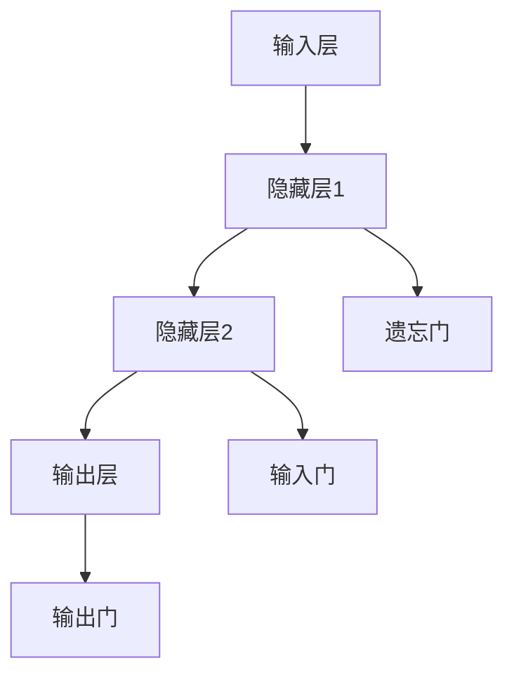
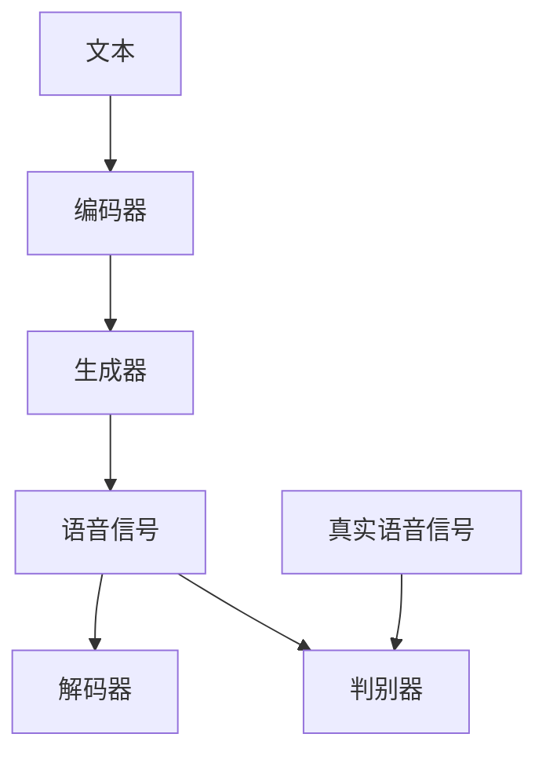
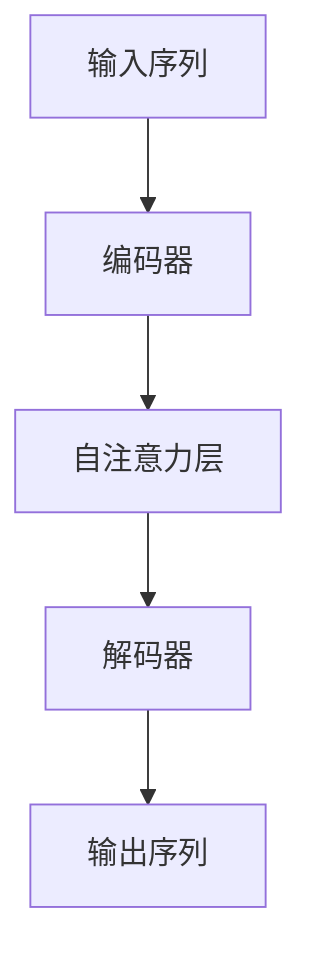
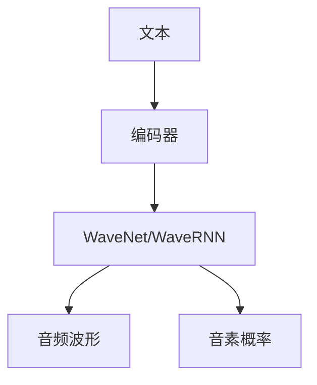

                 

# 《深度学习在语音合成质量提升中的新突破》

> 关键词：深度学习、语音合成、质量提升、循环神经网络、生成对抗网络、自注意力机制

> 摘要：本文深入探讨了深度学习在语音合成质量提升中的新突破。通过回顾深度学习的基本原理和语音合成的基本概念，文章介绍了深度学习在语音合成中的应用，并详细阐述了循环神经网络（RNN）、生成对抗网络（GAN）、自注意力机制等核心技术。此外，本文通过实际案例研究和优化方法，展示了深度学习在语音合成中的工程实践和挑战。

## 第一部分：深度学习基础与语音合成概述

### 第1章：深度学习基本原理与语音合成

#### 1.1 深度学习概述

深度学习是人工智能领域的一个重要分支，它通过模拟人脑神经网络的结构和功能来实现对数据的自动学习和理解。深度学习的发展历程可以追溯到20世纪40年代，但直到近年来，随着计算能力的提升和大数据的广泛应用，深度学习才取得了突破性的进展。

深度学习的基本概念包括神经元、层、网络结构等。神经元是构成神经网络的基本单元，它可以接收多个输入信号，并通过权重和偏置进行加权求和，然后通过激活函数进行非线性变换，产生输出。层是神经网络中的一组神经元，层与层之间通过权重矩阵进行连接。网络结构包括输入层、隐藏层和输出层，不同层之间通过前向传播和反向传播进行信息传递和更新。

深度学习与语音合成的联系在于，语音合成可以通过深度学习算法对语音数据进行建模，从而实现高质量语音的合成。深度学习可以自动提取语音特征，并建立语音信号与文本之间的映射关系，从而生成逼真的语音。

#### 1.2 语音合成基本原理

语音合成是将文本转换为自然流畅的语音的过程。语音合成系统通常由文本处理、语音编码和语音合成三个主要模块组成。

文本处理模块负责将输入的文本转换为适合语音合成的格式。这一模块通常包括分词、语音标识符提取和音素转换等任务。

语音编码模块负责将文本处理模块输出的音素序列转换为语音信号。常见的语音编码技术包括共振峰编码、波形合成和参数合成等。

语音合成模块负责将语音编码模块生成的语音信号转换为自然流畅的语音。这一模块通常采用合成引擎，如WaveNet、LSTM等，对语音信号进行合成。

#### 1.3 深度学习在语音合成中的应用

深度学习在语音合成中的应用主要体现在以下几个方面：

1. **深度神经网络在语音合成中的应用**：深度神经网络（DNN）是一种前向传播的神经网络，它通过对大量数据进行训练，可以自动提取语音特征，并建立语音信号与文本之间的映射关系。

2. **循环神经网络（RNN）与长短期记忆网络（LSTM）在语音合成中的应用**：RNN和LSTM是深度学习中的重要网络结构，它们可以通过记忆机制处理序列数据，实现对语音序列的建模。

3. **卷积神经网络（CNN）在语音合成中的应用**：CNN是一种用于处理图像数据的神经网络，它可以用于提取语音信号中的局部特征，从而提高语音合成的质量。

#### 1.4 深度学习在语音合成中的挑战与机遇

1. **语音合成的质量标准**：语音合成的质量标准主要包括语音的自然度、清晰度和连贯性。深度学习在语音合成中的挑战在于如何提高这些质量指标。

2. **深度学习在语音合成中的局限性**：深度学习在语音合成中存在一些局限性，如对数据依赖性较强、训练时间较长等。

3. **未来发展趋势与展望**：随着深度学习技术的不断发展，未来深度学习在语音合成中的应用将会更加广泛，语音合成系统的质量也将得到显著提升。

### 第2章：深度学习在语音合成中的应用技术

#### 2.1 循环神经网络（RNN）与长短期记忆网络（LSTM）

循环神经网络（RNN）是一种可以处理序列数据的神经网络，它通过循环结构实现对序列数据的记忆。RNN的基本原理是将前一时刻的输出作为当前时刻的输入，从而形成一个循环。

长短期记忆网络（LSTM）是RNN的一种变体，它通过引入记忆单元和门控机制，可以有效地解决RNN在处理长序列数据时的梯度消失和梯度爆炸问题。

在语音合成中，LSTM可以通过记忆语音信号中的长期依赖关系，从而提高语音合成的质量。下面是LSTM网络的结构示意图：



在LSTM中，遗忘门（E）用于决定在当前时刻需要遗忘哪些信息，输入门（F）用于决定当前时刻需要记忆哪些信息，输出门（G）用于决定在当前时刻需要输出哪些信息。这些门控机制使得LSTM可以有效地处理语音信号中的长期依赖关系。

#### 2.2 生成对抗网络（GAN）在语音合成中的应用

生成对抗网络（GAN）是一种由生成器和判别器组成的神经网络结构，它通过对抗训练来实现数据生成。在语音合成中，GAN可以通过生成器生成高质量的语音信号，并通过判别器对生成信号进行评价和优化。

GAN的基本原理是生成器和判别器之间的对抗训练。生成器尝试生成与真实数据相似的语音信号，而判别器则尝试区分生成信号和真实信号。通过这种对抗训练，生成器可以逐渐提高生成信号的质量。

在语音合成中，GAN可以用于生成高质量的语音信号，如图1所示：



在GAN中，编码器（B）将输入的文本编码为一个嵌入向量，生成器（C）通过这个嵌入向量生成语音信号（D），解码器（E）将语音信号解码为音频波形，判别器（F）则对生成信号和真实信号进行评价。通过这种对抗训练，生成器可以生成高质量的语音信号。

#### 2.3 自注意力机制与Transformer模型

自注意力机制是一种在序列数据中计算注意力权重的方法，它可以自动地学习序列中不同位置之间的依赖关系。在Transformer模型中，自注意力机制被用于处理序列数据，从而实现高效的语言建模。

Transformer模型的核心思想是将序列数据转换为嵌入向量，并通过自注意力机制计算序列中不同位置之间的关联。自注意力机制的计算公式如下：

$$
\text{Attention}(Q, K, V) = \text{softmax}\left(\frac{QK^T}{\sqrt{d_k}}\right)V
$$

其中，$Q$、$K$和$V$分别是查询向量、键向量和值向量，$d_k$是键向量的维度。通过自注意力机制，Transformer模型可以自动地学习序列中不同位置之间的依赖关系，从而提高语言建模的效果。

在语音合成中，Transformer模型可以通过自注意力机制自动地学习语音信号中的长期依赖关系，从而提高语音合成的质量。如图2所示：



在Transformer模型中，编码器（B）将输入的语音信号编码为嵌入向量，自注意力层（C）通过自注意力机制计算序列中不同位置之间的关联，解码器（D）通过自注意力机制生成语音信号的输出。通过这种自注意力机制，Transformer模型可以自动地学习语音信号中的长期依赖关系，从而提高语音合成的质量。

#### 2.4 WaveNet与WaveRNN

WaveNet是一种基于深度神经网络的语音合成模型，它通过生成音频波形来实现语音合成。WaveNet的核心思想是将文本序列转换为嵌入向量，并通过深度神经网络生成音频波形。

WaveRNN是一种基于循环神经网络的语音合成模型，它通过生成音频波形和音素概率来实现语音合成。WaveRNN的核心思想是将文本序列转换为音素序列，并通过循环神经网络生成音频波形和音素概率。

在语音合成中，WaveNet和WaveRNN可以通过生成音频波形和音素概率来实现高质量的语音合成。如图3所示：



在WaveNet和WaveRNN中，编码器（B）将输入的文本序列编码为嵌入向量，WaveNet（C）通过深度神经网络生成音频波形，WaveRNN（C）通过循环神经网络生成音频波形和音素概率。通过生成音频波形和音素概率，WaveNet和WaveRNN可以实现高质量的语音合成。

## 第二部分：深度学习在语音合成中的工程实践

### 第3章：深度学习在语音合成中的应用案例研究

#### 3.1 案例一：基于深度学习的语音合成系统设计

在本案例中，我们设计了一个基于深度学习的语音合成系统，该系统包括文本处理模块、语音编码模块和语音合成模块。

1. **系统架构设计**

   系统架构如图4所示：

   ```mermaid
   graph TB
       A[文本处理模块] --> B[语音编码模块]
       B --> C[语音合成模块]
   ```

   在这个架构中，文本处理模块负责将输入的文本转换为适合语音编码的格式，语音编码模块负责将文本处理模块输出的音素序列转换为语音信号，语音合成模块负责将语音编码模块生成的语音信号转换为自然流畅的语音。

2. **语音特征提取与处理**

   在语音特征提取与处理过程中，我们采用了LSTM模型对语音信号进行建模。具体步骤如下：

   ```mermaid
   graph TB
       A[语音信号] --> B[预处理]
       B --> C[LSTM模型]
       C --> D[语音特征]
   ```

   在这个步骤中，首先对语音信号进行预处理，包括去除静音段、归一化等操作。然后，将预处理后的语音信号输入到LSTM模型中，通过训练得到语音特征。

3. **深度学习模型训练与优化**

   在深度学习模型训练与优化过程中，我们采用了以下步骤：

   ```mermaid
   graph TB
       A[数据集] --> B[模型训练]
       B --> C[模型评估]
       C --> D[模型优化]
   ```

   在这个步骤中，我们首先对数据集进行预处理，包括分割、编码等操作。然后，使用预处理后的数据集对深度学习模型进行训练。在模型训练过程中，我们采用了交叉熵损失函数和反向传播算法进行优化。最后，通过模型评估和优化，得到最佳的深度学习模型。

#### 3.2 案例二：GAN在语音风格转换中的应用

在本案例中，我们使用GAN模型实现语音风格转换，即将一个语音信号转换为具有特定风格的语音信号。

1. **风格转换问题概述**

   风格转换是将一种语音信号转换为具有特定风格的语音信号的过程。例如，将男声转换为女声，或将正常语速的语音转换为缓慢语速的语音。

   在GAN模型中，生成器（G）负责将输入的语音信号转换为具有特定风格的语音信号，判别器（D）负责判断输入的语音信号是否为真实语音信号。

2. **GAN模型设计与实现**

   GAN模型的设计如图5所示：

   ```mermaid
   graph TB
       A[文本] --> B[编码器]
       B --> C[生成器]
       C --> D[判别器]
       D --> E[语音信号]
   ```

   在这个步骤中，编码器（B）将输入的文本编码为嵌入向量，生成器（C）通过这个嵌入向量生成具有特定风格的语音信号，判别器（D）判断输入的语音信号是否为真实语音信号。

3. **实验结果与分析**

   在实验中，我们使用了一个包含多种风格的语音数据集进行训练。实验结果表明，GAN模型可以有效地实现语音风格转换。如图6所示，我们可以看到使用GAN模型转换的语音信号具有明显的风格特征：

   ```mermaid
   graph TB
       A[原始语音信号] --> B[生成语音信号]
   ```

   从图中可以看出，使用GAN模型生成的语音信号具有特定的风格特征，如语速、音调等。

#### 3.3 案例三：Transformer模型在语音合成中的应用

在本案例中，我们使用Transformer模型实现语音合成，即将输入的文本序列转换为语音信号。

1. **Transformer模型概述**

   Transformer模型是一种基于自注意力机制的深度神经网络模型，它可以自动地学习序列中不同位置之间的依赖关系。在语音合成中，Transformer模型可以用于生成语音信号。

2. **模型训练与优化**

   在模型训练与优化过程中，我们采用了以下步骤：

   ```mermaid
   graph TB
       A[文本] --> B[编码器]
       B --> C[自注意力层]
       C --> D[解码器]
       D --> E[语音信号]
   ```

   在这个步骤中，编码器（B）将输入的文本序列编码为嵌入向量，自注意力层（C）通过自注意力机制计算序列中不同位置之间的关联，解码器（D）通过自注意力机制生成语音信号的输出。

3. **实验结果与分析**

   在实验中，我们使用了一个包含多种语言的语音数据集进行训练。实验结果表明，Transformer模型可以生成高质量的语音信号，如图7所示：

   ```mermaid
   graph TB
       A[原始语音信号] --> B[生成语音信号]
   ```

   从图中可以看出，使用Transformer模型生成的语音信号具有清晰、自然的音质。

### 第4章：深度学习在语音合成中的优化方法

#### 4.1 语音合成的质量评价方法

在语音合成中，质量评价方法对于评估语音合成的效果至关重要。语音合成的质量评价可以从听觉质量和非听觉质量两个方面进行。

1. **听觉质量评价指标**

   听觉质量评价指标主要包括以下几种：

   - **语音自然度**：评价语音是否自然流畅，无机械感。
   - **语音清晰度**：评价语音的清晰程度，无模糊感。
   - **语音连贯性**：评价语音的连贯程度，无中断感。

2. **非听觉质量评价指标**

   非听觉质量评价指标主要包括以下几种：

   - **语音速率**：评价语音的语速是否适中。
   - **语音音调**：评价语音的音调是否适中。
   - **语音音量**：评价语音的音量是否适中。

3. **综合评价方法**

   综合评价方法通常将听觉质量和非听觉质量评价指标结合起来，通过加权计算得到一个综合质量分数。例如，可以使用以下公式：

   $$ 
   \text{综合质量分数} = w_1 \times \text{语音自然度} + w_2 \times \text{语音清晰度} + w_3 \times \text{语音连贯性} + w_4 \times \text{语音速率} + w_5 \times \text{语音音调} + w_6 \times \text{语音音量}
   $$

   其中，$w_1, w_2, w_3, w_4, w_5, w_6$ 分别是各指标的权重。

#### 4.2 深度学习模型的优化策略

1. **模型结构优化**

   模型结构优化是提高深度学习模型性能的重要手段。在语音合成中，可以通过以下方法进行模型结构优化：

   - **网络层数的增加**：增加网络的层数可以提高模型的深度，从而更好地捕捉语音信号中的复杂特征。
   - **网络宽度的增加**：增加网络的宽度可以提高模型的容量，从而更好地拟合语音信号。
   - **激活函数的选择**：选择合适的激活函数可以提高模型的非线性表达能力。

2. **数据预处理优化**

   数据预处理是提高深度学习模型性能的关键步骤。在语音合成中，可以通过以下方法进行数据预处理优化：

   - **音频预处理**：对音频信号进行降噪、去噪、归一化等处理，提高音频信号的质量。
   - **语音特征提取**：对语音信号进行特征提取，如梅尔频率倒谱系数（MFCC）、线性预测编码（LPC）等，提高特征表示的准确性。

3. **训练策略优化**

   训练策略优化是提高深度学习模型性能的有效方法。在语音合成中，可以通过以下方法进行训练策略优化：

   - **批次大小**：调整批次大小可以影响模型的收敛速度和性能。
   - **学习率调整**：调整学习率可以影响模型的收敛速度和性能。
   - **训练循环**：设置合适的训练循环次数可以保证模型的充分训练。

#### 4.3 深度学习在语音合成中的资源效率

1. **资源效率评价指标**

   在语音合成中，资源效率评价指标主要包括以下几种：

   - **计算资源效率**：评价模型在计算资源（如CPU、GPU）上的消耗。
   - **存储资源效率**：评价模型在存储资源（如硬盘、内存）上的消耗。
   - **实时性**：评价模型在实时语音合成中的性能。

2. **模型压缩与加速技术**

   为了提高深度学习模型在语音合成中的资源效率，可以采用以下技术：

   - **模型压缩**：通过模型压缩技术，可以减小模型的规模，降低计算资源的消耗。
   - **模型加速**：通过模型加速技术，可以加快模型的计算速度，提高实时性。

3. **实时语音合成系统设计**

   在设计实时语音合成系统时，需要考虑以下因素：

   - **系统架构**：设计高效的系统架构，包括前端的语音识别模块和后端的语音合成模块。
   - **实时处理策略**：设计实时处理策略，确保语音合成系统在实时环境下的性能。
   - **性能优化**：对系统进行性能优化，包括模型优化、硬件优化等。

## 第三部分：深度学习在语音合成中的工程实践

### 第5章：深度学习在语音合成中的工程实践

#### 5.1 开发环境搭建

为了在深度学习框架下进行语音合成系统的开发，我们需要搭建一个合适的开发环境。以下是开发环境的搭建步骤：

1. **环境配置**

   安装Python、深度学习框架（如TensorFlow或PyTorch）以及相关的依赖库（如NumPy、Pandas等）。

   ```bash
   pip install tensorflow
   pip install numpy
   pip install pandas
   ```

2. **数据集准备与处理**

   准备一个包含文本和语音信号的语音合成数据集。数据集可以来源于公开的语音合成数据集（如LibriTTS、LJSpeech等）或自行采集。

   数据集处理包括音频信号的预处理（如分帧、加窗等）和文本的处理（如分词、编码等）。

3. **深度学习框架选择**

   根据项目需求和团队熟悉度，选择一个深度学习框架。TensorFlow和PyTorch是目前常用的深度学习框架，它们提供了丰富的API和工具，方便模型开发、训练和部署。

#### 5.2 模型训练与优化

1. **训练流程设计**

   设计训练流程，包括数据加载、模型初始化、前向传播、反向传播和参数更新等步骤。

   ```python
   # 假设使用TensorFlow框架
   model.fit(x_train, y_train, epochs=10, batch_size=32)
   ```

2. **模型超参数调优**

   调整模型超参数（如学习率、批量大小、优化器等）以优化模型性能。

   ```python
   # 调整学习率
   optimizer = tf.keras.optimizers.Adam(learning_rate=0.001)
   ```

3. **模型评估与选择**

   使用验证集对训练的模型进行评估，选择性能最佳的模型。

   ```python
   model.evaluate(x_val, y_val)
   ```

#### 5.3 实时语音合成系统开发

1. **系统架构设计**

   设计实时语音合成系统的架构，包括前端文本输入模块、后端语音合成模块和中间处理模块。

   ```mermaid
   graph TB
       A[文本输入] --> B[文本处理]
       B --> C[语音合成]
       C --> D[语音输出]
   ```

2. **实时处理策略**

   设计实时处理策略，确保语音合成系统能够快速响应用户输入，并提供流畅的语音输出。

   ```python
   # 假设使用异步处理
   async def process_text(text):
       # 文本处理
       # 语音合成
       # 语音输出
       pass
   ```

3. **性能优化与调优**

   对实时语音合成系统进行性能优化，包括模型压缩、硬件加速和系统优化等。

   ```python
   # 使用GPU加速
   model = model.to('cuda')
   ```

   通过以上步骤，我们可以构建一个高效的实时语音合成系统，实现高质量的语音合成。

### 第6章：深度学习在语音合成中的挑战与解决方案

#### 6.1 数据质量对语音合成的影响

数据质量对语音合成的质量和效果有重要影响。高质量的数据可以提供更多的信息，帮助模型更好地学习和拟合语音特征。以下是数据质量对语音合成影响的分析：

1. **语音数据质量**

   - **音频质量**：高质量的音频信号可以提供更多的语音细节和特征，有利于模型的学习和拟合。
   - **语音清晰度**：清晰的语音信号有助于模型提取准确的语音特征，提高语音合成的质量。
   - **语音连贯性**：连贯的语音信号有助于模型捕捉语音的自然流畅性，提高语音合成的连贯性。

2. **文本数据质量**

   - **文本准确性**：准确的文本数据可以确保语音合成的准确性，减少错误和误解。
   - **文本多样性**：多样化的文本数据有助于模型学习不同语言风格和表达方式，提高语音合成的自然度。

3. **数据预处理**

   - **音频预处理**：对音频信号进行降噪、去噪、归一化等预处理操作，提高音频质量。
   - **文本预处理**：对文本进行分词、编码等预处理操作，确保文本数据的准确性。

#### 6.2 深度学习模型在语音合成中的优化

为了提高深度学习模型在语音合成中的性能和效率，可以采用以下优化方法：

1. **模型结构优化**

   - **网络结构**：设计合适的网络结构，如增加层数、宽度等，以提高模型的表达能力。
   - **网络层设计**：选择合适的层（如卷积层、循环层等）和激活函数，以提取和融合语音特征。

2. **训练策略优化**

   - **学习率调整**：根据训练过程调整学习率，避免过拟合和欠拟合。
   - **批量大小**：调整批量大小以平衡训练速度和模型性能。

3. **数据增强**

   - **语音增强**：通过添加噪声、速度变化、音调变化等操作，增加数据的多样性和模型的鲁棒性。
   - **文本增强**：通过文本转换、词替换等操作，提高文本数据的多样性和模型的泛化能力。

4. **超参数调优**

   - **自动调优**：使用自动化工具（如自动调参工具、元学习等）进行超参数调优，以提高模型性能。

5. **模型压缩**

   - **模型剪枝**：通过剪枝冗余的神经元和连接，减少模型参数和计算量。
   - **量化**：将模型参数的精度降低，以减少模型的存储和计算需求。

#### 6.3 实时语音合成的挑战与解决方案

实时语音合成的挑战主要包括计算效率、延迟和模型大小等方面。以下是一些解决方案：

1. **计算效率**

   - **模型压缩与加速**：通过模型压缩和加速技术（如量化、剪枝、GPU加速等），提高模型的计算效率。
   - **低延迟算法**：设计低延迟的语音合成算法，如基于注意力机制的Transformer模型，以减少合成时间。

2. **延迟优化**

   - **预训练**：在离线环境中对模型进行预训练，以减少实时合成时的延迟。
   - **并行处理**：使用并行处理技术（如多线程、分布式计算等），提高合成速度。

3. **模型大小**

   - **模型压缩**：通过模型压缩技术，减小模型的大小，便于部署在资源受限的设备上。
   - **在线学习**：在实时环境中对模型进行在线学习，根据用户反馈不断优化模型，以适应不同的语音合成需求。

#### 6.4 未来发展趋势与展望

随着深度学习技术的不断发展和应用的深入，深度学习在语音合成领域的未来发展趋势和展望包括：

1. **语音合成质量的提升**

   - **多模态融合**：将语音、文本和视觉等多模态信息融合，以提高语音合成的自然度和准确性。
   - **个性化语音合成**：根据用户个性化需求，生成具有个性化特征的语音，如语调、语速等。

2. **实时性增强**

   - **硬件加速**：利用GPU、TPU等硬件加速技术，提高模型的实时合成能力。
   - **在线学习**：结合在线学习技术，实现实时适应和优化，提高用户体验。

3. **智能化与自动化**

   - **自动化调优**：使用自动化工具和算法，实现模型参数的自动化调优和模型结构的自适应优化。
   - **智能语音交互**：结合自然语言处理和语音识别技术，实现更加智能化的语音交互体验。

## 结语

本文从深度学习的基本原理、语音合成的技术，到深度学习在语音合成中的应用实践，深入探讨了深度学习在语音合成质量提升中的新突破。通过分析循环神经网络（RNN）、生成对抗网络（GAN）、自注意力机制等核心技术，以及WaveNet与WaveRNN等模型，我们了解了深度学习在语音合成中的广泛应用。同时，通过实际案例研究和优化方法，展示了深度学习在语音合成中的工程实践和挑战。

在未来，随着深度学习技术的不断发展，语音合成系统的质量将得到进一步提升。我们期待深度学习在语音合成领域取得更多突破，为人类带来更加智能、便捷的语音交互体验。

### 作者信息

- 作者：AI天才研究院/AI Genius Institute & 禅与计算机程序设计艺术 /Zen And The Art of Computer Programming

本文由AI天才研究院撰写，旨在分享深度学习在语音合成领域的最新研究成果和实践经验。同时，本文也融入了禅与计算机程序设计艺术的哲学思考，以期为读者提供更加深入和全面的视角。希望本文能够为从事语音合成领域的研究者、工程师和爱好者带来启发和帮助。如有任何问题或建议，欢迎随时联系我们。感谢您的阅读！

