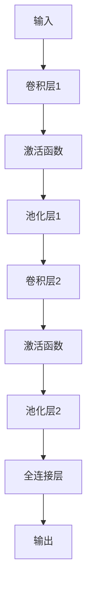
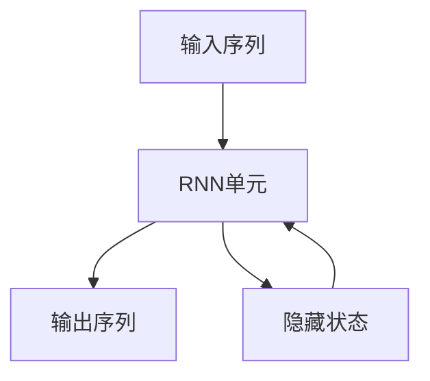
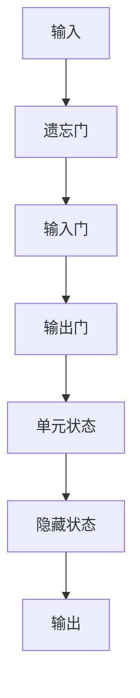
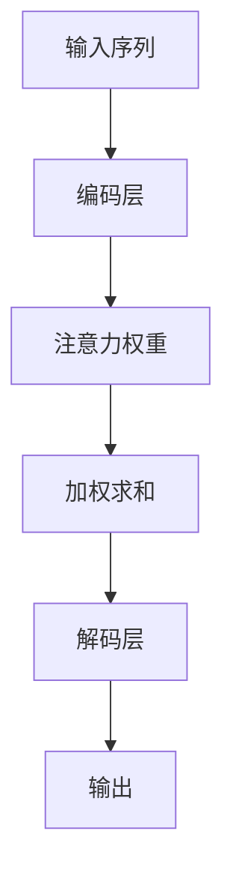

                 

### 附录 A.1：深度学习

----------------------------------------------------------------

#### A.1.1 研究背景

深度学习作为人工智能的重要分支，自2006年由Hinton等人提出后，在图像识别、语音识别、自然语言处理等领域取得了显著的成果。近年来，深度学习在语音情感识别这一新兴领域也展现出了强大的潜力。语音情感识别是指通过分析语音信号，提取出其中的情感信息，从而实现对人类情感的自动识别和理解。这一技术在情感分析、心理健康监测、智能家居等领域具有广泛的应用前景。

#### A.1.2 核心概念与联系

深度学习与语音情感识别之间的核心联系在于，前者为后者提供了强大的工具和理论基础。具体来说，核心概念之间的联系架构如下：

```mermaid
graph TD
A[深度学习] --> B[神经网络]
B --> C[卷积神经网络(CNN)]
B --> D[循环神经网络(RNN)]
D --> E[LSTM]
D --> F[GRU]
C --> G[语音信号处理]
D --> G
E --> G
F --> G
G --> H[语音情感识别]
H --> I[情感分析]
H --> J[心理健康监测]
H --> K[智能家居]
```

#### A.1.3 算法原理讲解

深度学习的核心算法原理主要包括神经网络、卷积神经网络（CNN）、循环神经网络（RNN）、长短时记忆网络（LSTM）、门控循环单元（GRU）等。以下简要介绍这些算法的基本原理：

##### 3.1.1 神经网络基础

神经网络（Neural Network，NN）是由大量相互连接的神经元组成的计算系统，其基本原理模拟了人脑的工作方式。神经元之间通过权重连接，传递信息，并通过激活函数产生输出。以下为神经网络的简化结构：

```python
# 神经元模型伪代码
def neuron(input_data, weights, bias, activation_function):
    z = np.dot(input_data, weights) + bias
    output = activation_function(z)
    return output
```

##### 3.1.2 卷积神经网络（CNN）

卷积神经网络（Convolutional Neural Network，CNN）是一种特殊的多层前馈神经网络，主要用于图像识别和语音信号处理。CNN的基本结构包括卷积层、池化层和全连接层。以下为CNN的基本结构：



##### 3.1.3 循环神经网络（RNN）

循环神经网络（Recurrent Neural Network，RNN）是一种能够处理序列数据的神经网络，其特点是在网络中引入了循环结构，使得网络可以保留历史信息。RNN的基本结构如下：



##### 3.1.4 长短时记忆网络（LSTM）

长短时记忆网络（Long Short-Term Memory，LSTM）是RNN的一种改进，旨在解决RNN在长序列学习中的梯度消失和梯度爆炸问题。LSTM通过引入三个门（遗忘门、输入门、输出门）来控制信息的流动。以下为LSTM的基本结构：



##### 3.1.5 注意力机制

注意力机制（Attention Mechanism）是一种在处理序列数据时能够自动关注重要信息的方法。在语音情感识别中，注意力机制可以帮助模型更好地捕捉语音信号中的情感信息。以下为注意力机制的简化结构：



#### A.1.4 数学模型与公式

深度学习中的数学模型主要包括前向传播和反向传播。以下简要介绍这些模型的基本原理和公式：

##### 前向传播

前向传播是指将输入数据通过神经网络逐层计算，得到最终输出的过程。具体公式如下：

$$
z_{l} = \sum_{k} w_{lk} a_{l-1,k} + b_{l}
$$

$$
a_{l} = \sigma(z_{l})
$$

其中，$z_{l}$表示第$l$层的输出，$a_{l}$表示第$l$层的激活值，$w_{lk}$表示从第$l-1$层到第$l$层的权重，$b_{l}$表示第$l$层的偏置，$\sigma$表示激活函数。

##### 反向传播

反向传播是指通过计算损失函数关于网络参数的梯度，来更新网络参数的过程。具体公式如下：

$$
\frac{\partial C}{\partial w_{lk}} = \frac{\partial C}{\partial z_{l}} \cdot \frac{\partial z_{l}}{\partial w_{lk}}
$$

$$
\frac{\partial C}{\partial b_{l}} = \frac{\partial C}{\partial z_{l}}
$$

其中，$C$表示损失函数，$\frac{\partial C}{\partial z_{l}}$表示关于$z_{l}$的梯度，$\frac{\partial z_{l}}{\partial w_{lk}}$表示关于$w_{lk}$的梯度。

#### A.1.5 举例说明

为了更好地理解深度学习在语音情感识别中的应用，以下通过一个简单的例子来说明。

假设我们使用一个简单的神经网络来识别语音信号中的情感，输入为一段语音信号的时频特征向量，输出为情感标签。神经网络的结构为1个输入层、1个隐藏层和1个输出层，其中隐藏层使用ReLU激活函数，输出层使用softmax激活函数。

输入层：$X \in \mathbb{R}^{m \times n}$，表示$m$个样本的时频特征向量。

隐藏层：$H \in \mathbb{R}^{m \times h}$，表示隐藏层的输出，其中$h$为隐藏层神经元的数量。

输出层：$Y \in \mathbb{R}^{m \times k}$，表示$m$个样本的情感概率分布，其中$k$为情感类别数量。

损失函数：$C = -\sum_{i=1}^{m} \sum_{j=1}^{k} y_{ij} \log(p_{ij})$，其中$y_{ij}$表示第$i$个样本属于第$j$类别的真实标签，$p_{ij}$表示第$i$个样本属于第$j$类别的预测概率。

前向传播：

$$
z_{1} = \sum_{j=1}^{k} w_{1j} X_{i} + b_{1j}
$$

$$
H_{i} = \sigma(z_{1})
$$

$$
z_{2} = \sum_{j=1}^{k} w_{2j} H_{i} + b_{2j}
$$

$$
Y_{i} = \sigma(z_{2})
$$

反向传播：

$$
\frac{\partial C}{\partial w_{1j}} = \frac{\partial C}{\partial z_{1}} \cdot \frac{\partial z_{1}}{\partial w_{1j}}
$$

$$
\frac{\partial C}{\partial b_{1j}} = \frac{\partial C}{\partial z_{1}} \cdot \frac{\partial z_{1}}{\partial b_{1j}}
$$

$$
\frac{\partial C}{\partial w_{2j}} = \frac{\partial C}{\partial z_{2}} \cdot \frac{\partial z_{2}}{\partial w_{2j}}
$$

$$
\frac{\partial C}{\partial b_{2j}} = \frac{\partial C}{\partial z_{2}} \cdot \frac{\partial z_{2}}{\partial b_{2j}}
$$

通过以上步骤，我们可以训练出能够识别语音情感的神经网络模型。在实际应用中，需要使用大量的语音数据来训练模型，并不断优化模型参数，以提高模型的识别准确率。

---

通过以上详细的讲解，我们可以看到深度学习在语音情感识别中扮演了重要的角色。从核心概念到算法原理，再到数学模型和公式，我们一步步深入探讨了这一领域的基本知识和应用。接下来的章节将进一步讨论语音情感识别中的深度学习模型和优化方法，以及实际应用案例分析。让我们继续深入探索这一激动人心的领域。

