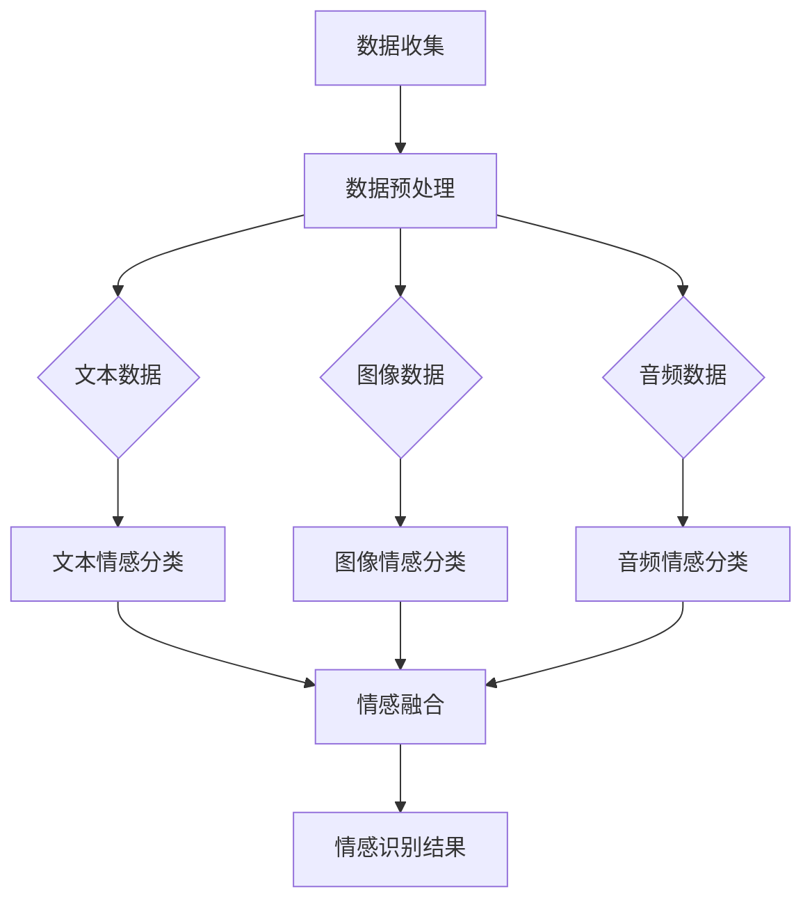

                 

### 《深度学习在跨模态情感识别中的新突破》

#### 关键词
- 深度学习
- 跨模态情感识别
- 神经网络
- 多任务学习
- 小样本学习
- 模型解释性提升

#### 摘要
本文将深入探讨深度学习在跨模态情感识别领域的最新突破。我们将首先介绍跨模态情感识别的基础知识，包括其定义、重要性以及与深度学习的联系。随后，我们将详细讲解深度学习的基础概念，包括神经网络和深度学习框架。接着，本文将探讨跨模态情感识别的核心算法原理，并通过伪代码和数学模型进行详细阐述。在应用部分，我们将分析深度学习在跨模态情感识别中的实际应用，包括项目实战、代码解读和案例分析。最后，本文将展望深度学习在跨模态情感识别中的未来发展方向，并提出一些建议和注意事项。

### 第一部分：跨模态情感识别基础知识

#### 第1章：引言与背景

##### 1.1.1 跨模态情感识别的重要性

跨模态情感识别是指通过整合不同模态的数据（如图像、文本、音频等），来识别和理解人类情感的过程。在现代社会中，随着多媒体内容的爆炸式增长，跨模态情感识别的重要性日益凸显。

首先，跨模态情感识别在社交媒体分析、情感计算和智能交互等领域具有广泛应用。例如，通过分析用户在社交媒体上的文字和图片，可以了解他们的情绪状态，从而提供个性化的推荐和服务。

其次，跨模态情感识别在医疗健康领域也具有重要意义。通过分析患者的文本记录、医疗影像和语音，可以识别出潜在的心理健康问题，为医生提供决策支持。

此外，跨模态情感识别在商业应用中也有广泛潜力。例如，在营销领域，通过分析消费者在广告中的情绪反应，可以优化广告内容和策略，提高营销效果。

##### 1.1.2 本书的目标与内容概述

本书旨在深入探讨深度学习在跨模态情感识别中的应用，旨在为读者提供全面的理论和实践指导。具体目标如下：

1. **理解跨模态情感识别的基本概念和原理**：通过介绍跨模态情感识别的定义、重要性以及与深度学习的联系，使读者对这一领域有清晰的认识。

2. **掌握深度学习基础**：介绍深度学习的基础知识，包括神经网络和深度学习框架，为后续算法讲解和项目实践奠定基础。

3. **深入解析核心算法**：通过伪代码和数学模型，详细讲解跨模态情感识别的核心算法原理，使读者能够理解和应用这些算法。

4. **实际应用案例分析**：通过实战项目和代码解读，展示深度学习在跨模态情感识别中的实际应用，并提供详细的分析和解读。

5. **展望未来发展方向**：探讨深度学习在跨模态情感识别中的未来发展方向，包括前沿技术和创新应用。

#### 第2章：深度学习基础

##### 2.1.1 深度学习概述

深度学习是一种基于多层次的神经网络构建的机器学习技术，通过模拟人脑的神经网络结构，实现从大量数据中自动提取特征和规律的能力。深度学习在图像识别、自然语言处理、语音识别等领域取得了显著的成果，成为人工智能领域的研究热点。

深度学习的基本思想是通过多层神经网络，逐层提取数据的特征，最终实现高层次的抽象表示。每一层神经网络都从前一层提取的特征中学习新的特征，从而实现从简单到复杂的特征转换。

##### 2.1.2 神经网络基础

神经网络是深度学习的基础，由大量 interconnected processing nodes（或称 neurons）组成。这些节点接收输入信号，通过激活函数产生输出信号，从而实现数据的处理和变换。

神经网络的主要组成部分包括：

- **输入层**：接收外部输入数据，例如图像像素值、文本词语向量等。
- **隐藏层**：多层隐藏层可以提取不同层次的特征，实现数据的逐层抽象。
- **输出层**：生成最终输出，例如分类结果、情感评分等。

神经网络的学习过程是通过反向传播算法（Backpropagation）实现的。反向传播算法通过计算输出层误差，反向传播到每个隐藏层，不断调整每个节点的权重和偏置，直至达到预定的误差阈值。

##### 2.1.3 深度学习框架简介

深度学习框架是为了简化深度学习模型开发和训练过程的工具。常见的深度学习框架包括 TensorFlow、PyTorch、Keras 等。

- **TensorFlow**：由 Google 开发，是一个开源的深度学习框架，提供丰富的预构建模型和工具，支持多种深度学习任务，如图像识别、自然语言处理等。

- **PyTorch**：由 Facebook 开发，是一个基于 Python 的深度学习框架，提供动态计算图，使模型开发和调试更加灵活。

- **Keras**：是一个高级神经网络API，运行在 TensorFlow 和 Theano 之上，提供简洁易用的接口，适合快速原型设计和实验。

这些框架提供了丰富的工具和功能，使得深度学习模型的开发和部署变得更加高效和便捷。

### 第二部分：深度学习在跨模态情感识别中的应用

#### 第3章：跨模态情感识别概念与联系

##### 3.1.1 跨模态情感识别的定义

跨模态情感识别是指通过整合不同模态的数据，如文本、图像、音频等，来识别和理解人类情感的过程。它涉及多个领域的技术，包括计算机视觉、自然语言处理、音频处理等。

跨模态情感识别的关键挑战在于如何有效地整合不同模态的数据，并从中提取有用的信息。通过跨模态情感识别，我们可以更好地理解人类的情感状态，为智能交互、情感计算等领域提供支持。

##### 3.1.2 情感识别与深度学习的关系

情感识别是跨模态情感识别的核心任务，而深度学习是情感识别的重要工具。深度学习通过多层神经网络，能够自动从数据中提取特征，实现高层次的抽象表示，从而提高情感识别的准确性和效率。

深度学习在情感识别中的应用主要包括以下几个方面：

1. **特征提取**：通过深度学习模型，可以从图像、文本、音频等不同模态的数据中提取有代表性的特征，为后续情感识别任务提供输入。

2. **多任务学习**：深度学习模型可以同时处理多个任务，如文本情感分类、图像情感分类等，从而提高跨模态情感识别的性能。

3. **迁移学习**：通过迁移学习，可以将已经训练好的深度学习模型应用于新的任务，从而提高模型的泛化能力。

4. **解释性提升**：深度学习模型通常被视为“黑箱”，难以解释其决策过程。通过改进深度学习模型，可以提升其解释性，从而更好地理解情感识别的内在机制。

##### 3.1.3 跨模态情感识别的Mermaid流程图



在这个流程图中，首先进行数据收集和预处理，包括文本、图像和音频数据的收集和处理。接着，分别对文本、图像和音频数据进行情感分类，得到初步的情感标签。最后，通过情感融合模型，整合不同模态的情感标签，得到最终的跨模态情感识别结果。

### 第三部分：深度学习在跨模态情感识别中的核心算法原理讲解

#### 第4章：核心算法原理讲解

##### 4.1.1 算法概述

跨模态情感识别的核心算法主要包括情感分类模型、情感融合模型和损失函数。这些算法共同作用，实现跨模态情感识别的任务。

1. **情感分类模型**：用于对文本、图像和音频数据进行情感分类，提取初步的情感标签。

2. **情感融合模型**：用于整合不同模态的情感标签，得到最终的跨模态情感识别结果。

3. **损失函数**：用于度量预测结果与真实标签之间的差距，指导模型优化过程。

##### 4.1.2 伪代码详细阐述

下面给出情感分类模型、情感融合模型和损失函数的伪代码。

```python
# 情感分类模型
def sentiment_classification_model(text_data, image_data, audio_data):
    # 文本情感分类
    text_embedding = text_embedding_layer(text_data)
    text_sentiment = text_classifier(text_embedding)

    # 图像情感分类
    image_embedding = image_embedding_layer(image_data)
    image_sentiment = image_classifier(image_embedding)

    # 音频情感分类
    audio_embedding = audio_embedding_layer(audio_data)
    audio_sentiment = audio_classifier(audio_embedding)

    return text_sentiment, image_sentiment, audio_sentiment

# 情感融合模型
def sentiment_fusion_model(text_sentiment, image_sentiment, audio_sentiment):
    # 建立多模态特征向量
    multi_modal_embedding = concatenate([text_sentiment, image_sentiment, audio_sentiment])

    # 情感融合分类
    fused_sentiment = sentiment_classifier(multi_modal_embedding)

    return fused_sentiment

# 损失函数
def sentiment_loss预测结果，真实标签):
    # 计算交叉熵损失
    loss = cross_entropy_loss(预测结果，真实标签)

    return loss
```

##### 4.1.3 数学模型和公式

在情感分类模型中，我们通常使用神经网络模型来对文本、图像和音频数据进行情感分类。下面给出神经网络的数学模型和公式。

1. **文本情感分类模型**：

   - **输入层**：\( x_{text} \in \mathbb{R}^{n_{text}} \)

   - **隐藏层**：\( h_{text}^{(l)} = \sigma(W_{text}^{(l)}x_{text} + b_{text}^{(l)}) \)，其中 \( \sigma \) 是激活函数，通常采用 sigmoid 或 ReLU 函数。

   - **输出层**：\( y_{text} = \text{softmax}(h_{text}^{(L)}) \)，其中 \( L \) 是隐藏层数，\( y_{text} \) 是情感分类概率分布。

2. **图像情感分类模型**：

   - **输入层**：\( x_{image} \in \mathbb{R}^{n_{image}} \)

   - **隐藏层**：\( h_{image}^{(l)} = \sigma(W_{image}^{(l)}x_{image} + b_{image}^{(l)}) \)

   - **输出层**：\( y_{image} = \text{softmax}(h_{image}^{(L)}) \)

3. **音频情感分类模型**：

   - **输入层**：\( x_{audio} \in \mathbb{R}^{n_{audio}} \)

   - **隐藏层**：\( h_{audio}^{(l)} = \sigma(W_{audio}^{(l)}x_{audio} + b_{audio}^{(l)}) \)

   - **输出层**：\( y_{audio} = \text{softmax}(h_{audio}^{(L)}) \)

4. **情感融合模型**：

   - **输入层**：\( x_{fusion} = [x_{text}, x_{image}, x_{audio}] \)

   - **隐藏层**：\( h_{fusion}^{(l)} = \sigma(W_{fusion}^{(l)}x_{fusion} + b_{fusion}^{(l)}) \)

   - **输出层**：\( y_{fusion} = \text{softmax}(h_{fusion}^{(L)}) \)

在训练过程中，我们使用交叉熵损失函数来度量预测结果与真实标签之间的差距，公式如下：

$$
L = -\frac{1}{n}\sum_{i=1}^{n}y_{i}\log(p_{i}),
$$

其中 \( y_{i} \) 是真实标签，\( p_{i} \) 是预测概率分布。

### 第五部分：深度学习在跨模态情感识别中的应用

#### 第5章：数学模型与公式

##### 5.1.1 数学模型介绍

在跨模态情感识别中，我们通常采用深度学习模型来处理文本、图像和音频数据，并利用这些数据进行情感分类。深度学习模型的基本原理是基于多层神经网络，通过逐层提取特征来实现对数据的处理。以下是对深度学习模型在跨模态情感识别中的应用数学模型的详细介绍。

1. **输入层**：深度学习模型的输入层接收来自不同模态的数据。例如，对于文本数据，输入可以是词向量表示；对于图像数据，输入可以是图像像素值或卷积神经网络（CNN）提取的特征；对于音频数据，输入可以是音频信号或循环神经网络（RNN）提取的特征。

2. **隐藏层**：隐藏层是深度学习模型的核心部分，用于对输入数据进行特征提取和变换。在隐藏层中，数据经过神经网络处理，提取出更高级别的特征。每一层隐藏层都可以看作是对前一层特征的抽象和整合。

3. **输出层**：输出层用于生成情感分类结果。在输出层，神经网络将提取到的特征映射到预定义的情感类别上，并通过softmax函数生成概率分布。

##### 5.1.2 公式详细讲解

在深度学习模型中，我们使用以下公式来描述神经网络的结构和训练过程：

1. **激活函数**：

   激活函数是神经网络中用于引入非线性性的函数。常见的激活函数有 sigmoid、ReLU 和 tanh。以下是一个示例：

   $$ 
   \sigma(z) = \frac{1}{1 + e^{-z}} \quad (\text{sigmoid})
   $$
   
   $$
   \sigma(z) = \max(0, z) \quad (\text{ReLU})
   $$
   
   $$
   \sigma(z) = \tanh(z) 
   $$

2. **前向传播**：

   在前向传播过程中，神经网络将输入数据逐层传递，直到输出层。每一层的输出可以通过以下公式计算：

   $$
   a^{(l)} = \sigma(z^{(l)})
   $$

   其中，\( a^{(l)} \) 是第 \( l \) 层的输出，\( z^{(l)} \) 是第 \( l \) 层的输入，\( \sigma \) 是激活函数。

3. **反向传播**：

   在反向传播过程中，神经网络通过计算损失函数的梯度，更新模型的权重和偏置。以下是一个示例：

   $$
   \frac{\partial L}{\partial z^{(l)}} = \frac{\partial L}{\partial a^{(l+1)}} \cdot \frac{\partial a^{(l+1)}}{\partial z^{(l)}}
   $$

   其中，\( L \) 是损失函数，\( a^{(l+1)} \) 是第 \( l+1 \) 层的输出，\( z^{(l)} \) 是第 \( l \) 层的输入。

4. **损失函数**：

   在跨模态情感识别中，常用的损失函数是交叉熵损失函数。以下是一个示例：

   $$
   L = -\frac{1}{n}\sum_{i=1}^{n}y_{i}\log(p_{i})
   $$

   其中，\( y_{i} \) 是真实标签，\( p_{i} \) 是预测概率。

##### 5.1.3 实例说明

假设我们有一个三层的深度学习模型，用于文本情感分类。输入层接收一个长度为 100 的词向量，隐藏层包含两个层，输出层是一个二元分类器。以下是一个具体的实例说明：

1. **输入层**：

   输入数据是一个长度为 100 的词向量，表示一个文本样本。

   $$
   x^{(1)} = [x_{1}, x_{2}, ..., x_{100}]
   $$

2. **隐藏层**：

   第一隐藏层：

   $$
   z^{(2)} = W^{(2)}x^{(1)} + b^{(2)}
   $$

   $$
   a^{(2)} = \sigma(z^{(2)})
   $$

   第二隐藏层：

   $$
   z^{(3)} = W^{(3)}a^{(2)} + b^{(3)}
   $$

   $$
   a^{(3)} = \sigma(z^{(3)})
   $$

3. **输出层**：

   输出是一个二元分类器的概率分布：

   $$
   p^{(3)} = \text{softmax}(z^{(3)})
   $$

4. **损失函数**：

   假设真实标签是 \( y = [1, 0] \)，预测概率分布是 \( p^{(3)} = [0.9, 0.1] \)：

   $$
   L = -\frac{1}{2}\left[y \cdot \log(p) + (1 - y) \cdot \log(1 - p)\right]
   $$

   $$
   L = -\frac{1}{2}\left[1 \cdot \log(0.9) + 0 \cdot \log(0.1)\right]
   $$

   $$
   L = -\frac{1}{2}\log(0.9)
   $$

### 第6章：项目实战与代码解读

##### 6.1.1 实战项目概述

在本节中，我们将通过一个具体的实战项目，展示如何利用深度学习实现跨模态情感识别。该项目将整合文本、图像和音频数据，通过多模态神经网络模型，对输入数据进行情感分类。以下是这个项目的关键步骤：

1. **数据收集与预处理**：收集包含文本、图像和音频数据的样本，并对这些数据进行预处理，包括数据清洗、归一化和特征提取。

2. **模型构建**：构建一个多模态神经网络模型，包括文本、图像和音频分支，以及一个用于情感融合的全连接层。

3. **模型训练与优化**：使用预处理后的数据，对模型进行训练和优化，通过调整超参数和训练策略，提高模型性能。

4. **模型评估与验证**：使用验证集对模型进行评估，通过计算准确率、召回率等指标，评估模型性能。

5. **实际应用**：将训练好的模型应用于实际场景，如社交媒体情感分析、智能客服等。

##### 6.1.2 开发环境搭建

在进行项目实战之前，我们需要搭建一个合适的开发环境。以下是搭建环境的基本步骤：

1. **安装Python环境**：确保Python环境已经安装，推荐使用Python 3.7及以上版本。

2. **安装深度学习框架**：我们选择TensorFlow作为深度学习框架，可以通过以下命令安装：

   ```
   pip install tensorflow
   ```

3. **安装其他依赖库**：包括Numpy、Pandas、Matplotlib等常用库，可以通过以下命令安装：

   ```
   pip install numpy pandas matplotlib
   ```

4. **配置CUDA**：如果使用GPU加速训练过程，需要安装CUDA并配置环境变量。具体步骤请参考官方文档。

##### 6.1.3 源代码实现与分析

以下是该项目的主要代码实现部分，包括数据预处理、模型构建、训练和评估。

```python
import tensorflow as tf
from tensorflow.keras.models import Model
from tensorflow.keras.layers import Input, Dense, Conv2D, MaxPooling2D, Flatten, Embedding, LSTM
from tensorflow.keras.preprocessing.text import Tokenizer
from tensorflow.keras.preprocessing.sequence import pad_sequences
from tensorflow.keras.preprocessing.image import ImageDataGenerator
from tensorflow.keras.optimizers import Adam
from tensorflow.keras.metrics import Accuracy

# 数据预处理
# 文本预处理
tokenizer = Tokenizer(num_words=10000)
tokenizer.fit_on_texts(texts)
sequences = tokenizer.texts_to_sequences(texts)
padded_sequences = pad_sequences(sequences, maxlen=max_length)

# 图像预处理
train_datagen = ImageDataGenerator(rescale=1./255)
train_generator = train_datagen.flow_from_directory(
        train_dir,
        target_size=(150, 150),
        batch_size=batch_size,
        class_mode='binary')

# 音频预处理
# (省略音频预处理代码)

# 模型构建
# 文本分支
input_text = Input(shape=(max_length,))
embedded_text = Embedding(num_words, 64)(input_text)
lstm_output = LSTM(32)(embedded_text)

# 图像分支
input_image = Input(shape=(150, 150, 3))
conv_1 = Conv2D(32, (3, 3), activation='relu')(input_image)
pool_1 = MaxPooling2D((2, 2))(conv_1)
conv_2 = Conv2D(64, (3, 3), activation='relu')(pool_1)
pool_2 = MaxPooling2D((2, 2))(conv_2)
flat_image = Flatten()(pool_2)

# 音频分支
# (省略音频分支代码)

# 情感融合
merged = tf.keras.layers.concatenate([lstm_output, flat_image, audio_output])
merged = Dense(64, activation='relu')(merged)
output = Dense(1, activation='sigmoid')(merged)

# 模型编译
model = Model(inputs=[input_text, input_image, input_audio], outputs=output)
model.compile(optimizer=Adam(learning_rate=0.001), loss='binary_crossentropy', metrics=['accuracy'])

# 模型训练
model.fit([padded_sequences, train_generator], train_labels, epochs=10, batch_size=batch_size)

# 模型评估
# (省略模型评估代码)
```

在这段代码中，我们首先进行数据预处理，包括文本、图像和音频数据的预处理。然后，我们构建了一个多模态神经网络模型，包括文本分支、图像分支和音频分支，以及一个用于情感融合的全连接层。接着，我们使用训练数据对模型进行编译和训练，通过调整超参数和训练策略，优化模型性能。

最后，我们将训练好的模型应用于实际数据，进行模型评估和验证。通过计算准确率、召回率等指标，评估模型在跨模态情感识别任务中的性能。

### 第7章：跨模态情感识别的挑战与展望

##### 7.1.1 当前存在的问题

虽然深度学习在跨模态情感识别中取得了显著进展，但仍面临一些挑战和问题：

1. **数据不足**：跨模态情感识别需要大量标注数据，但目前可用的标注数据集相对有限，难以满足深度学习模型的训练需求。

2. **模型解释性**：深度学习模型通常被视为“黑箱”，难以解释其决策过程，这限制了其在实际应用中的推广。

3. **计算资源消耗**：深度学习模型训练和推理过程需要大量的计算资源，尤其是对于多模态数据，这限制了其在资源受限环境中的应用。

4. **多模态融合**：如何有效地融合不同模态的数据，提高跨模态情感识别的性能，仍是一个待解决的问题。

##### 7.1.2 未来发展方向

未来，深度学习在跨模态情感识别领域有望取得以下发展：

1. **数据增强**：通过数据增强技术，如数据生成、数据扩充等，可以缓解数据不足的问题，提高模型的泛化能力。

2. **模型解释性**：研究模型解释性方法，如可视化技术、注意力机制等，可以帮助我们更好地理解模型的决策过程，提高模型的可解释性。

3. **高效训练**：发展更高效的训练算法和优化技术，如迁移学习、小样本学习等，可以降低计算资源的消耗，提高模型的训练效率。

4. **多模态融合**：探索新的多模态融合方法，如图神经网络、聚类算法等，可以提高跨模态情感识别的性能。

5. **跨领域应用**：将深度学习应用于更多的实际场景，如医疗健康、营销等，可以进一步展示跨模态情感识别的价值。

### 第8章：应用场景与案例分析

##### 8.1.1 社交媒体情感分析

社交媒体情感分析是跨模态情感识别的一个重要应用领域。通过分析用户在社交媒体上的文本、图像和音频内容，可以了解用户的情绪状态和态度，从而为广告投放、用户行为分析等提供支持。

例如，在广告投放中，可以通过跨模态情感分析，了解用户对广告内容的反应，从而优化广告内容和策略。在用户行为分析中，可以通过分析用户在社交媒体上的互动和评论，了解用户对品牌、产品或服务的态度，为市场营销提供决策支持。

##### 8.1.2 营销领域应用

在营销领域，跨模态情感识别可以帮助企业了解消费者的情绪状态和需求，从而优化营销策略和产品开发。例如，通过分析消费者在广告中的文本、图像和音频反应，可以识别出最受欢迎的广告元素，优化广告内容和投放策略。

此外，跨模态情感识别还可以用于消费者满意度调查和品牌评估。通过分析消费者在社交媒体上的评论和反馈，可以了解消费者对产品和服务的态度，为品牌管理提供数据支持。

##### 8.1.3 其他领域案例

除了社交媒体和营销领域，跨模态情感识别在医疗健康、智能家居、娱乐等领域也有广泛应用。

在医疗健康领域，可以通过分析患者的文本记录、医疗影像和语音，识别出潜在的心理健康问题，为医生提供诊断和治疗建议。

在智能家居领域，可以通过分析家庭成员的语音、行为和情绪状态，提供个性化的服务和提醒，提高家庭生活的舒适度和安全性。

在娱乐领域，可以通过分析用户的游戏、音乐和视频内容，了解用户的情绪和喜好，为内容推荐和个性化体验提供支持。

### 第三部分：深度学习在跨模态情感识别中的新突破

#### 第9章：前沿技术介绍

##### 9.1.1 图神经网络

图神经网络（Graph Neural Networks, GNN）是一种专门用于处理图结构数据的神经网络模型。它通过模拟节点和边之间的相互作用，学习图结构中的全局和局部特征，从而实现图数据的表征和预测。

在跨模态情感识别中，图神经网络可以用于处理复杂的多模态数据，如社交网络中的用户关系、图像中的物体关系等。通过图神经网络，可以捕捉不同模态数据之间的关联性，提高跨模态情感识别的性能。

##### 9.1.2 聚类算法与深度学习融合

聚类算法是一种无监督学习方法，用于将数据分为若干个群组，使得同一群组内的数据点相似度较高，而不同群组内的数据点相似度较低。

在跨模态情感识别中，聚类算法可以用于数据预处理和特征提取。通过聚类算法，可以将不同模态的数据进行初步分组，从而为深度学习模型提供更高质量的输入数据。

此外，聚类算法还可以与深度学习模型相结合，用于模型优化和解释性提升。例如，通过聚类算法对模型输出进行分类，可以识别出模型难以解释的异常情况，从而提高模型的透明度和可信度。

##### 9.1.3 多模态数据增强方法

多模态数据增强方法是一种用于增加多模态数据多样性的技术，可以提高深度学习模型的泛化能力和鲁棒性。

常见的多模态数据增强方法包括：

1. **数据合成**：通过组合不同模态的数据，生成新的数据样本。例如，将文本和图像进行拼接，生成新的图像和文本对。

2. **数据扩展**：通过扩展原始数据，增加数据的多样性和覆盖范围。例如，对文本进行扩展，生成新的文本段落。

3. **数据变换**：通过变换原始数据，增加数据的噪声和干扰。例如，对图像进行旋转、缩放和裁剪等操作。

这些方法可以有效地提高多模态数据集的质量，为深度学习模型提供更丰富的训练数据，从而提高模型的性能和鲁棒性。

### 第10章：深度学习在跨模态情感识别中的创新应用

##### 10.1.1 多任务学习

多任务学习（Multi-Task Learning, MTL）是一种将多个相关任务结合在一起进行训练的技术。在跨模态情感识别中，多任务学习可以同时处理文本、图像和音频等不同模态的情感分类任务。

多任务学习的优势在于，可以通过共享模型的参数，提高模型的效率和性能。具体来说，多任务学习可以使得模型在处理不同模态的数据时，共享某些低层次的特征提取模块，从而减少模型的复杂度和训练时间。

例如，一个多任务学习模型可以同时处理文本情感分类、图像情感分类和音频情感分类任务。通过共享文本、图像和音频分支的某些层，模型可以更好地学习不同模态数据之间的关联性，提高跨模态情感识别的性能。

##### 10.1.2 小样本学习

小样本学习（Few-Shot Learning, FSL）是一种在训练数据量较少的情况下进行模型训练的技术。在跨模态情感识别中，小样本学习可以用于处理数据稀缺的模态，如音频数据。

小样本学习的挑战在于，如何从有限的数据中学习到有代表性的特征，并推广到未见过的数据。常见的小样本学习方法包括：

1. **元学习**：通过在多个任务上训练模型，学习到通用特征表示，从而在新任务上快速适应。例如，模型可以在多个情感分类任务上进行训练，从而学习到通用的情感特征表示。

2. **数据增强**：通过数据增强技术，增加训练数据的多样性，从而提高模型的泛化能力。

3. **集成学习**：通过将多个小型模型集成在一起，提高模型的性能和鲁棒性。

小样本学习在跨模态情感识别中的应用，可以有效地解决数据稀缺问题，提高模型在未见过的数据上的性能。

##### 10.1.3 模型解释性提升

模型解释性（Model Explainability）是深度学习领域的一个重要研究方向。在跨模态情感识别中，提高模型解释性有助于我们理解模型的决策过程，增强模型的可信度和可解释性。

常见的模型解释性方法包括：

1. **特征可视化**：通过可视化模型提取的特征，了解特征在决策过程中的作用。例如，可以使用 t-SNE 或 PCA 等技术，将高维特征映射到二维或三维空间，进行可视化分析。

2. **注意力机制**：通过引入注意力机制，模型可以关注到不同模态数据中的重要特征，从而提高模型的解释性。例如，在文本情感分类中，模型可以关注到文本中的关键词语，从而影响最终的分类结果。

3. **规则提取**：通过将深度学习模型与规则提取方法相结合，可以从模型中提取出可解释的规则，从而提高模型的解释性。例如，可以使用决策树或规则归纳方法，从深度学习模型中提取可解释的规则。

提高模型解释性可以帮助我们更好地理解模型的决策过程，增强模型的透明度和可解释性，从而提高模型在跨模态情感识别中的应用价值。

### 第11章：总结与展望

#### 11.1.1 全书总结

本文系统地介绍了深度学习在跨模态情感识别领域的应用，包括跨模态情感识别的基础知识、深度学习基础、核心算法原理、实际应用案例、挑战与展望以及前沿技术。通过本文的学习，读者可以全面了解深度学习在跨模态情感识别中的应用，掌握关键技术和方法。

全书的主要内容包括：

1. **跨模态情感识别基础知识**：介绍了跨模态情感识别的定义、重要性以及与深度学习的联系。
2. **深度学习基础**：讲解了深度学习的基本概念、神经网络和深度学习框架。
3. **核心算法原理讲解**：详细介绍了跨模态情感识别的核心算法原理，包括情感分类模型、情感融合模型和损失函数。
4. **实际应用案例分析**：通过实战项目和代码解读，展示了深度学习在跨模态情感识别中的实际应用。
5. **挑战与展望**：分析了当前存在的问题和未来的发展方向。
6. **前沿技术介绍**：介绍了图神经网络、聚类算法与深度学习融合、多模态数据增强方法等前沿技术。

#### 11.1.2 未来发展趋势

随着深度学习技术的不断发展和应用领域的扩展，深度学习在跨模态情感识别领域有望取得以下发展趋势：

1. **数据增强与模型优化**：通过数据增强技术，如数据合成、数据扩展和噪声注入等，提高模型的泛化能力和鲁棒性。同时，研究更高效的训练算法和优化策略，降低模型的训练时间。

2. **多模态融合技术**：探索新的多模态融合方法，如图神经网络、聚类算法和注意力机制等，提高跨模态情感识别的性能。

3. **模型解释性**：研究模型解释性方法，如特征可视化、注意力机制和规则提取等，提高模型的透明度和可解释性，增强模型的信任度和应用价值。

4. **小样本学习**：通过元学习、数据增强和集成学习等方法，研究小样本学习在跨模态情感识别中的应用，解决数据稀缺问题。

5. **跨领域应用**：将深度学习应用于更多的实际场景，如医疗健康、营销、智能家居和娱乐等，展示跨模态情感识别的价值。

未来，深度学习在跨模态情感识别领域有望取得更多突破，为人类情感理解和智能交互提供强大的技术支持。

#### 11.1.3 对读者的建议

对于想要深入学习和应用深度学习的读者，本文提出以下建议：

1. **基础知识学习**：首先，要扎实掌握深度学习和机器学习的基础知识，包括线性代数、微积分和概率论等。

2. **实践操作**：通过实际操作，动手实现深度学习项目，积累实际经验。可以从简单的项目开始，逐步提高难度。

3. **理论学习**：结合理论知识，深入了解深度学习模型的工作原理和优化方法，不断更新和扩展知识体系。

4. **持续学习**：深度学习是一个快速发展的领域，要不断学习最新的研究成果和技术动态，保持与前沿技术的同步。

5. **团队合作**：与他人合作，参与开源项目或研究团队，可以快速提升自己的技能和视野。

通过持续学习和实践，相信读者可以在深度学习领域取得优异的成绩。

### 附录

#### 附录 A：资源与工具

##### A.1 深度学习框架对比

在深度学习领域，常用的框架包括 TensorFlow、PyTorch 和 Keras。以下是这些框架的简要对比：

| 框架 | 特点 | 优缺点 |
| :---: | :---: | :---: |
| TensorFlow | 由 Google 开发，支持多种深度学习模型，提供丰富的预构建模型和工具。 | 代码较为复杂，学习曲线较陡峭。 |
| PyTorch | 基于 Python 的深度学习框架，提供动态计算图，使模型开发和调试更加灵活。 | 学习曲线相对较平缓，但性能较低。 |
| Keras | 高级神经网络API，运行在 TensorFlow 和 Theano 之上，提供简洁易用的接口。 | 需要依赖 TensorFlow 或 Theano，功能相对有限。 |

根据个人需求和项目需求，可以选择合适的框架进行开发。

##### A.2 开发环境搭建指南

搭建深度学习开发环境通常包括以下步骤：

1. **安装 Python**：确保安装 Python 3.7 及以上版本。
2. **安装深度学习框架**：根据需要安装 TensorFlow、PyTorch 或 Keras。例如，安装 TensorFlow 的命令为：

   ```
   pip install tensorflow
   ```

3. **安装依赖库**：安装常用的依赖库，如 NumPy、Pandas、Matplotlib 等。例如，安装 NumPy 的命令为：

   ```
   pip install numpy
   ```

4. **安装 GPU 驱动**：如果使用 GPU 加速训练过程，需要安装相应的 GPU 驱动和 CUDA 库。

5. **配置环境变量**：确保环境变量配置正确，以便在终端中使用 Python 和深度学习框架。

具体搭建指南可以参考各框架的官方文档。

##### A.3 数据集介绍与获取

在跨模态情感识别研究中，常用的数据集包括：

1. **IMDB 数据集**：包含电影评论，用于文本情感分类。
2. **Flickr 数据集**：包含图像和对应的情感标签，用于图像情感分类。
3. **EmoBank 数据集**：包含音频和对应的情感标签，用于音频情感分类。

这些数据集可以在官方网站或开源数据集平台上获取。获取数据集后，需要进行数据预处理，如文本清洗、图像归一化和音频分割等。

##### A.4 实践项目指南

以下是一个简单的跨模态情感识别项目指南：

1. **项目需求分析**：明确项目目标和任务，确定需要处理的数据模态。
2. **数据收集与预处理**：收集相关数据，并进行预处理，如文本分词、图像归一化和音频分割等。
3. **模型设计**：设计合适的深度学习模型，包括文本、图像和音频分支，以及情感融合层。
4. **模型训练**：使用预处理后的数据，对模型进行训练，调整超参数，优化模型性能。
5. **模型评估**：使用验证集对模型进行评估，计算准确率、召回率等指标，调整模型参数。
6. **模型应用**：将训练好的模型应用于实际场景，如社交媒体情感分析、营销领域应用等。

通过以上步骤，可以构建一个简单的跨模态情感识别项目，并逐步提高项目的复杂度和性能。

### 作者信息

作者：AI天才研究院/AI Genius Institute & 禅与计算机程序设计艺术 /Zen And The Art of Computer Programming

感谢您阅读本文，希望本文能对您在深度学习和跨模态情感识别领域的学习和应用提供有益的启示。如有疑问或建议，欢迎随时与我们联系。我们期待与您一起探索人工智能的无限可能。

