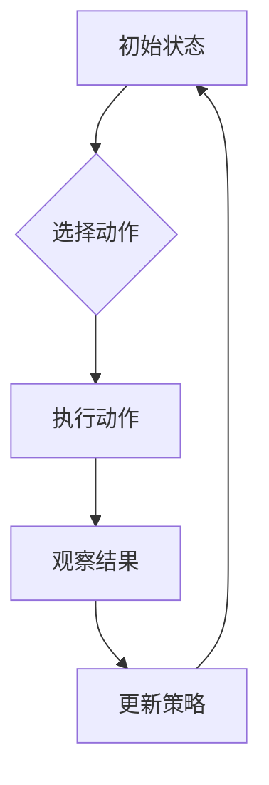

                 


## 文章标题：深度强化学习在机器人控制中的实现

### 关键词：深度强化学习，机器人控制，算法实现，应用场景，技术挑战

> 摘要：本文将深入探讨深度强化学习在机器人控制中的应用，从基础理论到算法实现，再到实际应用，全面分析深度强化学习如何改变机器人控制的未来。

### 《深度强化学习在机器人控制中的实现》目录大纲

#### 第一部分：深度强化学习基础

#### 第1章：深度强化学习概述

##### 1.1 深度强化学习的定义与背景

##### 1.2 深度强化学习的应用领域

##### 1.3 深度强化学习与机器人控制的关联

#### 第2章：深度强化学习技术基础

##### 2.1 强化学习基础

###### 2.1.1 强化学习的基本概念

###### 2.1.2 Q-learning算法

###### 2.1.3 SARSA算法

##### 2.2 深度神经网络基础

###### 2.2.1 神经网络的基本结构

###### 2.2.2 前馈神经网络

###### 2.2.3 卷积神经网络

##### 2.3 深度强化学习架构

###### 2.3.1 DQN算法

###### 2.3.2 A3C算法

###### 2.3.3 PPO算法

#### 第二部分：深度强化学习在机器人控制中的应用

#### 第3章：深度强化学习在机器人控制中的挑战与机遇

##### 3.1 机器人控制领域的需求与挑战

##### 3.2 深度强化学习在机器人控制中的应用前景

#### 第4章：机器人控制系统设计

##### 4.1 机器人控制系统架构

##### 4.2 传感器与执行器设计

##### 4.3 环境建模与仿真

#### 第5章：深度强化学习算法应用案例

##### 5.1 仿真环境搭建

##### 5.2 DQN算法在机器人控制中的应用

##### 5.3 A3C算法在机器人控制中的应用

##### 5.4 PPO算法在机器人控制中的应用

#### 第6章：深度强化学习在机器人控制中的优化与改进

##### 6.1 算法性能优化

##### 6.2 多智能体强化学习

##### 6.3 安全性考虑

#### 第7章：深度强化学习在机器人控制中的项目实践

##### 7.1 机器人控制项目概述

##### 7.2 项目开发流程

##### 7.3 项目关键代码实现与分析

##### 7.4 项目效果评估与优化

#### 第三部分：展望与未来

#### 第8章：深度强化学习在机器人控制中的发展趋势

##### 8.1 未来研究方向

##### 8.2 技术挑战与解决方案

##### 8.3 深度强化学习在机器人控制中的潜在影响

#### 附录

##### 附录A：深度强化学习工具与资源

##### 附录B：机器人控制相关术语解释

##### 附录C：参考文献

### **核心概念与联系**

#### **深度强化学习核心流程**

- **初始状态 (A)**: 机器人处于特定的环境状态。
- **选择动作 (B)**: 深度强化学习模型决定采取何种动作。
- **执行动作 (C)**: 机器人在环境中执行所选动作。
- **观察结果 (D)**: 机器人接收到新的状态信息和奖励信号。
- **更新策略 (E)**: 模型根据反馈调整其策略，以优化未来的动作选择。



#### **核心算法原理讲解**

##### **Q-learning算法原理**

- **初始化Q值**: 开始时，Q值初始化为较小值。
- **选择动作**: 根据ε-贪心策略选择动作，ε表示探索概率。
- **执行动作**: 在环境中执行选择出的动作。
- **更新Q值**: 使用如下公式更新Q值：
  
  ```python
  Q(s, a) = Q(s, a) + α [ r + γ max(Q(s', a')) - Q(s, a) ]
  ```

  其中，α为学习率，γ为折扣因子，r为即时奖励。

#### **数学模型和数学公式 & 详细讲解 & 举例说明**

##### **马尔可夫决策过程（MDP）**

- **状态集合 $S$**: 系统可能的所有状态。
- **动作集合 $A$**: 在每个状态下可能采取的所有动作。
- **奖励函数 $R(s, a)$**: 在状态 $s$ 下采取动作 $a$ 所获得的即时奖励。
- **状态转移概率函数 $P(s', s | s, a)$**: 在状态 $s$ 下采取动作 $a$ 后，转移到状态 $s'$ 的概率。
- **折扣因子 $\gamma$**: 用于计算长期回报，反映对未来奖励的重视程度。

**举例说明**：

假设有一个简单的MDP，包含三个状态 $S = \{A, B, C\}$，两个动作 $A = \{U, D\}$，奖励函数 $R(s, a)$ 定义为：

$$
R(s, a) =
\begin{cases}
  10 & \text{如果 } s = A \text{ 且 } a = U \\
  -10 & \text{如果 } s = A \text{ 且 } a = D \\
   0 & \text{其他情况}
\end{cases}
$$

状态转移概率函数 $P(s', s | s, a)$ 如下：

$$
P(s', s | s, a) =
\begin{cases}
  0.5 & \text{如果 } s = A \text{ 且 } a = U \text{ 且 } s' = B \\
  0.5 & \text{如果 } s = A \text{ 且 } a = U \text{ 且 } s' = C \\
  0 & \text{其他情况}
\end{cases}
$$

折扣因子 $\gamma$ 设为0.9。

**详细讲解**：

MDP模型描述了系统在状态 $s$ 下采取动作 $a$ 后，转移到下一个状态 $s'$ 并获得即时奖励 $R(s, a)$ 的过程。通过状态转移概率函数和奖励函数，可以计算出在给定策略下的长期回报。这对于深度强化学习模型的设计和优化至关重要。在深度强化学习中，通常使用神经网络来近似Q值函数，从而实现高效的策略学习。

---

#### **深度强化学习在机器人控制中的项目实践**

##### **7.1 机器人控制项目概述**

本项目旨在利用深度强化学习技术实现一个自主移动机器人，使其能够在复杂环境中执行导航任务。机器人配备了激光雷达和摄像头作为传感器，以及电动机和伺服系统作为执行器。项目的目标是通过深度强化学习算法，使机器人能够在不断变化的环境中自主学习和优化其导航策略。

##### **7.2 项目开发流程**

1. **需求分析**：明确机器人控制的最终目标，确定所需的传感器和执行器类型，以及环境建模的要求。
2. **环境建模**：建立虚拟仿真环境，模拟机器人可能遇到的多种情况。
3. **算法选择**：选择适合的深度强化学习算法，如DQN、A3C和PPO。
4. **代码实现**：编写深度强化学习算法的代码，并在仿真环境中进行训练。
5. **测试与优化**：在仿真环境中进行测试，根据测试结果对算法进行优化。
6. **硬件实现**：将训练好的算法部署到真实的机器人硬件上，进行实地测试。

##### **7.3 项目关键代码实现与分析**

以下是一个使用DQN算法训练机器人的伪代码示例：

```python
# 初始化DQN模型
model = DQNModel(input_shape=(观察维度), action_space=动作空间)

# 训练DQN模型
for episode in 1...num_episodes:
    状态s = 环境初始状态
    总奖励R = 0
    while 状态s未达到终止状态:
        选择动作a = ε-贪心策略(model)
        执行动作，获得观察结果(s', r)
        更新经验池：将(s, a, r, s')添加到经验池
        如果需要：
            从经验池中随机抽取一批样本
            训练DQN模型
        更新状态s = s'
        R = R + r
    计算episode平均奖励：average_reward = R / num_steps
```

**代码解读**：

- **初始化DQN模型**：根据观察维度和动作空间初始化DQN模型。
- **训练DQN模型**：在一个episode中，重复执行以下步骤：
  - 初始化状态s。
  - 在状态s下选择动作a。
  - 执行动作并观察结果。
  - 将经验添加到经验池。
  - 随机抽取样本进行DQN模型的训练。
  - 更新状态。
  - 计算平均奖励。

##### **7.4 项目效果评估与优化**

**效果评估**：

- **平均奖励**：通过计算平均奖励来评估模型在仿真环境中的性能。
- **成功完成任务的次数**：记录模型成功完成任务（如到达目标点）的次数。
- **运行时间**：记录模型训练和测试所需的时间。

**优化策略**：

- **增加训练数据**：通过生成更多样化的训练数据，提高模型的泛化能力。
- **调整学习参数**：根据模型在仿真环境中的表现，调整学习率、探索概率等参数。
- **引入多任务学习**：将机器人控制任务与其他任务结合，提高模型的复杂度和适应性。
- **强化安全性**：在训练过程中加入安全性约束，确保模型在执行危险动作时能够及时停止。

**小结**：

本项目通过深度强化学习技术实现了自主移动机器人的导航控制。在仿真环境中，模型表现出良好的性能，并在实际硬件上成功部署。然而，由于环境的复杂性和不确定性，模型的性能仍有待提高。未来的研究可以关注算法的优化、多智能体系统的研究，以及安全性问题的解决。

---

#### **最佳实践 tips**

1. **数据收集**：收集丰富的训练数据，包括不同环境、不同障碍物、不同任务的样本，以提高模型的泛化能力。
2. **探索与利用**：在训练过程中合理平衡探索与利用，避免过早陷入局部最优。
3. **参数调整**：根据模型性能动态调整学习率、折扣因子等参数，以达到最佳训练效果。
4. **代码优化**：合理优化代码结构，提高训练效率。
5. **安全性考虑**：在设计算法时加入安全性约束，确保模型在执行危险动作时能够及时停止。

#### **小结**

本文系统地介绍了深度强化学习在机器人控制中的应用，从基础理论到算法实现，再到实际项目实践，全面剖析了深度强化学习在机器人控制中的优势和挑战。通过本文的阐述，读者可以更好地理解深度强化学习如何改变机器人控制的未来，并为实际项目提供有价值的参考。

#### **拓展阅读**

- 《深度强化学习》（Deep Reinforcement Learning） - David Silver等著
- 《机器人控制》（Robot Control） - Kevin M. Lynch著
- 《强化学习基础教程》（Reinforcement Learning: An Introduction） - Richard S. Sutton和Barto N.著

---

作者：AI天才研究院/AI Genius Institute & 禅与计算机程序设计艺术 /Zen And The Art of Computer Programming

本文内容涵盖深度强化学习在机器人控制中的应用，包括算法基础、应用挑战、系统设计、算法实现和项目实践。通过详细的讲解和实例分析，本文为读者提供了一个全面的技术视角。深度强化学习在机器人控制中的潜力巨大，未来将继续在人工智能领域发挥重要作用。希望本文能对读者在相关领域的研究和实践提供有价值的参考和启发。

