                 

### 1.1 深度强化学习的概念

**背景介绍：**

深度强化学习（Deep Reinforcement Learning，简称DRL）是近年来人工智能领域的一项重要技术，它是强化学习（Reinforcement Learning，RL）和深度学习（Deep Learning，DL）相结合的产物。传统的强化学习在面对复杂环境时往往难以取得良好的效果，而深度学习在处理高维数据方面具有显著优势。将两者结合起来，深度强化学习在解决复杂任务时表现出更强的能力。

**核心概念与联系：**

1. **强化学习（RL）**：强化学习是一种通过试错（trial-and-error）和奖励反馈（reward feedback）来学习如何做出最优决策的方法。其核心概念包括状态（State）、动作（Action）、奖励（Reward）和环境（Environment）。

2. **深度学习（DL）**：深度学习是一种利用多层神经网络来对数据进行自动特征提取和学习的机器学习方法。其核心概念包括神经网络（Neural Network）、权重（Weights）、激活函数（Activation Function）等。

3. **深度强化学习（DRL）**：深度强化学习将强化学习的奖励反馈机制与深度学习的特征提取能力相结合。其核心概念包括深度神经网络（Deep Neural Network）、状态值函数（State Value Function）、策略函数（Policy Function）等。

**Mermaid 流程图：**

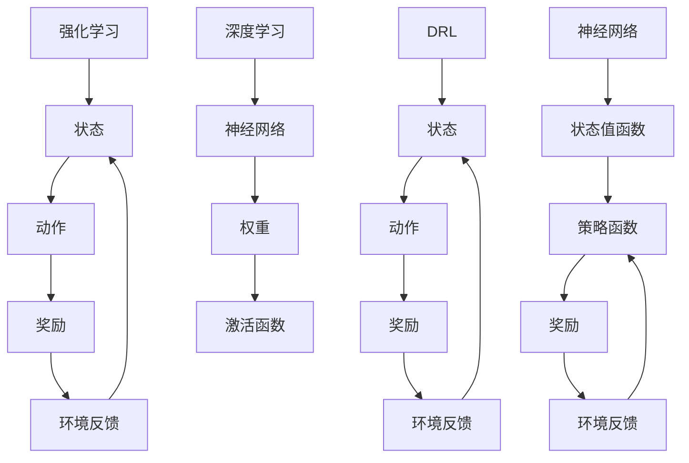

**核心算法原理讲解：**

深度强化学习的基本算法包括Q学习（Q-Learning）、策略梯度（Policy Gradient）和深度Q网络（DQN）等。

1. **Q学习算法原理：**

   Q学习是一种基于值函数（Value Function）的强化学习算法。其核心思想是通过学习状态-动作值函数（State-Action Value Function）来选择最优动作。具体来说，Q学习算法通过迭代更新Q值来逼近最优值函数。

   **伪代码：**

   ```python
   Q[s, a] = Q[s, a] + α * (r + γ * max(Q[s', a']) - Q[s, a])
   ```

   其中，Q[s, a]是状态s下动作a的Q值，α是学习率，r是即时奖励，γ是折扣因子，s'是状态s'下动作a'的最大Q值。

2. **策略梯度算法原理：**

   策略梯度算法通过直接优化策略函数来选择动作。其核心思想是通过梯度上升（Gradient Ascent）来更新策略函数，使其最大化期望奖励。

   **伪代码：**

   ```python
   θ = θ + α * ∇_θ J(θ)
   ```

   其中，θ是策略参数，α是学习率，J(θ)是策略的损失函数，∇_θ J(θ)是损失函数对策略参数的梯度。

3. **深度Q网络（DQN）算法原理：**

   深度Q网络是一种基于深度神经网络的Q学习算法。它通过神经网络来近似状态-动作值函数，从而提高学习效率和效果。

   **伪代码：**

   ```python
   Q(s, a) = fθ(s, a)
   Q[s, a] = Q[s, a] + α * (r + γ * max(fθ(s', a')) - Q[s, a])
   ```

   其中，fθ(s, a)是神经网络输出的Q值，θ是神经网络参数。

**数学模型和数学公式：**

在深度强化学习中，状态价值函数（State Value Function）和策略函数（Policy Function）是两个核心概念。

1. **状态价值函数：**

   状态价值函数V(s)表示在状态s下采取最优策略获得的期望回报。

   $$ V^*(s) = \sum_{a} \pi^*(a|s) \sum_{s'} P(s'|s, a) \cdot R(s', a) $$

   其中，π^*(a|s)是最优策略，P(s'|s, a)是状态转移概率，R(s', a)是即时奖励。

2. **策略函数：**

   策略函数π(a|s)表示在状态s下采取动作a的概率。

   $$ \pi(a|s) = \frac{e^{Q(s, a)}}{\sum_{a'} e^{Q(s, a')}} $$

   其中，Q(s, a)是状态-动作值函数。

**举例说明：**

假设一个简单的游戏环境，玩家需要控制一个角色在迷宫中找到出口。角色每次可以移动到上下左右四个方向，每个方向对应的动作分别为`up`，`down`，`left`，`right`。环境会根据角色的位置给予相应的奖励，找到出口奖励10分，每移动一步奖励1分，否则给予负奖励。通过深度强化学习，角色可以学习到最佳的行动策略，从而尽快找到出口。

在上述例子中，状态空间包括迷宫中的每个位置，动作空间包括四个方向。深度强化学习算法将学习到一个策略函数，该函数能够根据当前状态选择最佳动作。通过不断的试错和奖励反馈，角色能够逐渐提高找到出口的概率。

---

### 2.2 深度强化学习与传统强化学习的关系

**核心概念与联系：**

深度强化学习与传统强化学习之间存在紧密的联系，但也存在显著的区别。

1. **传统强化学习（RL）**：传统强化学习是一种基于值函数或策略函数的优化方法，其核心是通过奖励反馈来学习如何在一个给定的环境中最大化长期回报。其主要算法包括Q学习、SARSA（同步策略学习与收益评价）等。

2. **深度强化学习（DRL）**：深度强化学习则是将强化学习的奖励反馈机制与深度学习的高维特征表示能力相结合，以应对复杂环境。其主要算法包括深度Q网络（DQN）、策略梯度算法等。

**Mermaid 流程图：**

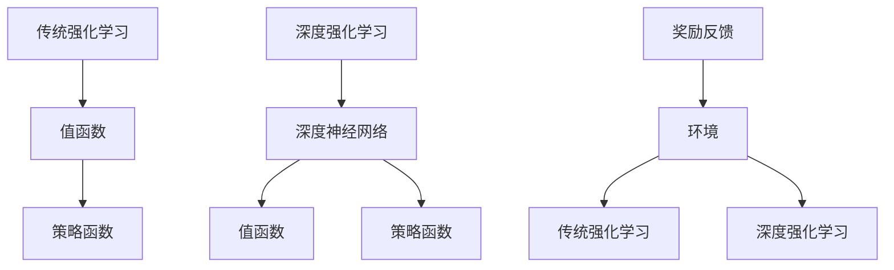

**关系分析：**

1. **共同点**：
   - 都是基于奖励反馈进行学习。
   - 都涉及状态、动作、奖励和环境的概念。
   - 都旨在找到最大化长期回报的策略。

2. **区别**：
   - **学习目标**：传统强化学习通常关注于状态-动作值函数或策略函数的最优化，而深度强化学习则关注于利用深度神经网络来近似这些函数。
   - **适用范围**：传统强化学习在简单环境中表现良好，但在高维、非线性环境中面临挑战。深度强化学习通过引入深度神经网络，能够处理更复杂的环境。
   - **实现方式**：传统强化学习通常使用确定性策略或简单函数近似，而深度强化学习则利用深度神经网络进行非线性函数近似。

**数学模型和数学公式：**

1. **传统强化学习**：

   - **状态-动作值函数**：

     $$ Q(s, a) = \sum_{s'} P(s'|s, a) \cdot [R(s', a) + \gamma \cdot V(s')] $$

     其中，$Q(s, a)$是状态s下动作a的值函数，$P(s'|s, a)$是状态转移概率，$R(s', a)$是即时奖励，$\gamma$是折扣因子，$V(s')$是状态s'的值函数。

   - **策略函数**：

     $$ \pi(a|s) = \begin{cases} 
     1 & \text{if } a = \arg\max_a Q(s, a) \\
     0 & \text{otherwise}
     \end{cases} $$

     其中，$\pi(a|s)$是状态s下动作a的概率。

2. **深度强化学习**：

   - **深度神经网络近似状态-动作值函数**：

     $$ Q(s, a) \approx f_{\theta}(s, a) $$

     其中，$f_{\theta}(s, a)$是深度神经网络输出的值函数，$\theta$是神经网络参数。

   - **策略梯度**：

     $$ \theta = \theta + \alpha \cdot \nabla_{\theta} J(\theta) $$

     其中，$J(\theta)$是策略的损失函数，$\alpha$是学习率，$\nabla_{\theta} J(\theta)$是损失函数对策略参数的梯度。

**举例说明：**

以一个简单的迷宫为例，玩家需要从起点走到终点。传统强化学习可以通过Q学习算法学习到每个状态-动作对的最优值函数，从而选择最佳路径。而深度强化学习则可以通过DQN算法，利用深度神经网络来近似状态-动作值函数，从而在更复杂的环境中找到最佳路径。

通过上述例子，可以看出深度强化学习在处理复杂环境时具有显著优势，但其实现过程也更加复杂。

---

### 2.3 深度强化学习的优势

**核心概念与联系：**

深度强化学习（DRL）作为强化学习与深度学习相结合的产物，具有以下几方面的优势：

1. **高效的特征提取**：深度强化学习利用深度神经网络强大的特征提取能力，能够从高维状态空间中自动提取出有用的特征，降低问题复杂度。

2. **适应复杂环境**：与传统强化学习相比，深度强化学习能够处理更复杂、高维度的环境，适用于围棋、自动驾驶等复杂场景。

3. **非线性优化能力**：深度神经网络具有强大的非线性优化能力，能够更好地逼近状态-动作值函数或策略函数。

**Mermaid 流程图：**

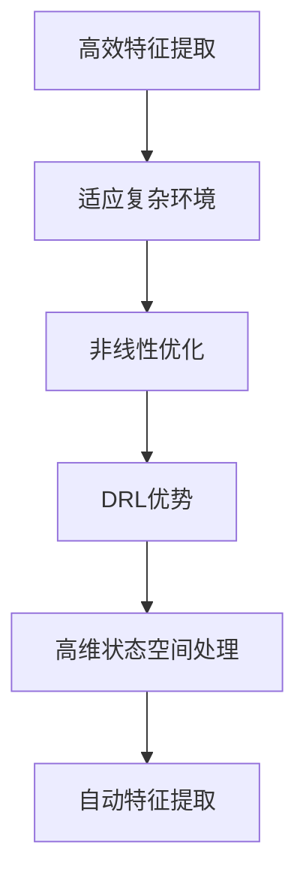

**优势分析：**

1. **高效特征提取**：

   传统强化学习需要手动设计特征，而深度强化学习通过深度神经网络自动提取特征，能够处理高维状态空间。例如，在自动驾驶场景中，深度强化学习可以通过神经网络提取道路、车辆、行人等高维特征，从而提高决策效果。

   **伪代码：**

   ```python
   features = neural_network(state)
   ```

2. **适应复杂环境**：

   深度强化学习能够处理具有复杂状态转移概率和奖励结构的环境，例如围棋、棋类游戏等。传统强化学习在这些场景下可能无法取得良好的效果。

   **伪代码：**

   ```python
   policy = deep_reinforcement_learning(environment)
   action = policy.sample_action(state)
   ```

3. **非线性优化能力**：

   深度神经网络具有强大的非线性优化能力，能够更好地逼近状态-动作值函数或策略函数。这使得深度强化学习在处理复杂、非线性问题时具有优势。

   **伪代码：**

   ```python
   value_function = neural_network(state, action)
   policy = policy gradient(value_function)
   ```

**应用场景举例：**

1. **围棋AI**：AlphaGo使用深度强化学习算法，通过训练深度神经网络来学习围棋策略，最终在2016年击败了世界围棋冠军李世石。

2. **自动驾驶**：深度强化学习被应用于自动驾驶系统中，用于决策车辆行驶路径和速度等。

3. **游戏AI**：深度强化学习被广泛应用于游戏AI中，例如在游戏《Dota 2》中击败人类顶级玩家。

通过上述分析，可以看出深度强化学习在处理复杂、高维环境时具有显著优势，其强大的特征提取和优化能力使其在多个领域取得了显著成果。

---

### 2.4 深度强化学习的应用领域

**核心概念与联系：**

深度强化学习（DRL）作为一种先进的人工智能技术，其应用领域广泛且不断扩展。以下是深度强化学习在几个关键领域的应用及其优势分析。

**Mermaid 流程图：**

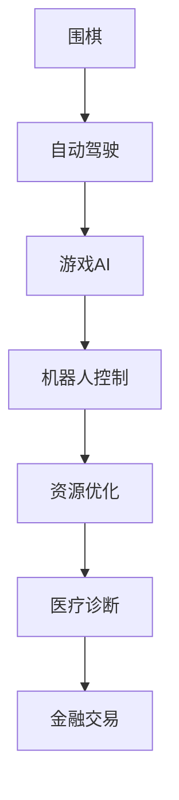

**应用领域及优势分析：**

1. **围棋**：

   深度强化学习在围棋领域取得了突破性成果。以AlphaGo为例，它利用深度强化学习算法通过自我对弈不断优化策略，最终在2016年击败了世界围棋冠军李世石。深度强化学习在围棋中的应用优势在于其能够处理复杂的博弈问题，通过自我对弈实现策略优化。

   **伪代码：**

   ```python
   policy = deep_reinforcement_learning(game_environment)
   action = policy.sample_action(state)
   ```

2. **自动驾驶**：

   自动驾驶系统需要处理复杂的环境感知和决策问题。深度强化学习通过学习环境中的高维特征，能够提高自动驾驶系统的决策能力和安全性。例如，特斯拉的自动驾驶系统就利用了深度强化学习算法。

   **伪代码：**

   ```python
   control_policy = deep_reinforcement_learning(autonomous_vehicle_environment)
   action = control_policy.sample_action(sensor_data)
   ```

3. **游戏AI**：

   游戏AI是深度强化学习的传统优势领域。通过深度强化学习，游戏AI能够学习到复杂的游戏策略，从而在电子竞技中击败人类玩家。例如，《Dota 2》和《StarCraft 2》等游戏都利用了深度强化学习算法。

   **伪代码：**

   ```python
   game_strategy = deep_reinforcement_learning(game_environment)
   action = game_strategy.sample_action(game_state)
   ```

4. **机器人控制**：

   在机器人控制领域，深度强化学习可以帮助机器人学习复杂的运动控制和任务执行策略。例如，机器人可以通过深度强化学习算法在复杂的动态环境中进行自主导航和任务执行。

   **伪代码：**

   ```python
   control_strategy = deep_reinforcement_learning(robot_environment)
   action = control_strategy.sample_action(robot_state)
   ```

5. **资源优化**：

   深度强化学习在资源优化问题中也展现出强大能力。例如，在电力系统调度、交通流量控制等场景中，深度强化学习可以通过学习历史数据和奖励信号，实现资源的最优分配。

   **伪代码：**

   ```python
   resource_allocation = deep_reinforcement_learning(optimization_environment)
   action = resource_allocation.sample_action(current_state)
   ```

6. **医疗诊断**：

   在医疗诊断领域，深度强化学习可以通过学习大量医疗数据，辅助医生进行诊断。例如，通过对医学图像的分析，深度强化学习可以识别出潜在的疾病。

   **伪代码：**

   ```python
   diagnosis_model = deep_reinforcement_learning(disease_environment)
   action = diagnosis_model.sample_action(disease_data)
   ```

7. **金融交易**：

   深度强化学习在金融交易中的应用也非常广泛。通过学习历史交易数据和市场动态，深度强化学习可以预测市场趋势，从而实现自动交易。

   **伪代码：**

   ```python
   trading_strategy = deep_reinforcement_learning(trading_environment)
   action = trading_strategy.sample_action(current_market_state)
   ```

通过上述分析，可以看出深度强化学习在多个领域都展现了其强大的应用潜力。随着技术的不断进步，深度强化学习将在更多领域发挥重要作用，推动人工智能的发展。

---

### 2.5 深度强化学习的基本架构

**核心概念与联系：**

深度强化学习的基本架构由四个核心组成部分构成：环境（Environment）、智能体（Agent）、状态（State）和动作（Action）。这些组成部分相互作用，共同实现智能体的学习和决策过程。

**Mermaid 流程图：**

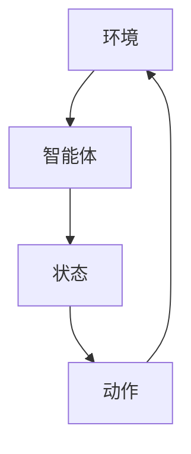

**组成部分详解：**

1. **环境（Environment）**：环境是智能体执行动作和接收反馈的场所。它包含智能体所处的状态空间、动作空间和奖励机制。环境为智能体提供反馈，指导其学习最优策略。

2. **智能体（Agent）**：智能体是执行动作并从环境中学习最优策略的主体。它通过观察环境状态，选择适当的动作，并根据动作的反馈调整策略。智能体可以是计算机程序、机器人或人等。

3. **状态（State）**：状态是智能体在执行动作时的当前状态。状态是智能体决策的依据，通常由一系列特征向量表示。状态空间是所有可能状态的集合。

4. **动作（Action）**：动作是智能体在环境中执行的操作。动作的选择基于当前状态，并受智能体策略的指导。动作空间是所有可能动作的集合。

**智能体学习过程：**

1. **初始化**：智能体开始于初始状态，并初始化策略。

2. **状态观测**：智能体观测当前状态，并根据策略选择动作。

3. **动作执行**：智能体执行所选动作，并引发环境状态的变化。

4. **奖励反馈**：环境根据智能体的动作给予相应的奖励，指导智能体学习。

5. **策略调整**：智能体根据奖励反馈调整策略，以提高未来动作的回报。

**伪代码：**

```python
# 初始化环境
environment = initial

# 智能体学习过程
while not terminate:
    # 观测状态
    state = environment.observe_state()
    
    # 选择动作
    action = agent.select_action(state)
    
    # 执行动作
    next_state, reward = environment.execute_action(action)
    
    # 更新策略
    agent.update_policy(state, action, reward)
    
    # 更新状态
    state = next_state
```

**数学模型和数学公式：**

在深度强化学习中，智能体的策略可以通过状态-动作值函数（State-Action Value Function）或策略函数（Policy Function）来表示。

1. **状态-动作值函数**：

   $$ Q^*(s, a) = \sum_{s'} P(s'|s, a) \cdot [R(s', a) + \gamma \cdot V^*(s')] $$

   其中，$Q^*(s, a)$是状态s下动作a的最优值函数，$P(s'|s, a)$是状态转移概率，$R(s', a)$是即时奖励，$\gamma$是折扣因子，$V^*(s')$是状态s'的最优值函数。

2. **策略函数**：

   $$ \pi^*(s) = \arg\max_a Q^*(s, a) $$

   其中，$\pi^*(s)$是在状态s下采取最优动作的概率分布。

**举例说明：**

假设一个简单的迷宫游戏，智能体需要从起点走到终点。智能体在每一步都会观测当前状态（例如，迷宫中的位置），选择最优动作（例如，上下左右移动），并接收环境给予的奖励（例如，每走一步奖励1分，到达终点奖励10分）。通过不断试错和策略调整，智能体最终学会找到最佳路径。

通过上述分析，可以清晰地看到深度强化学习的基本架构及其组成部分，这为后续深入探讨深度强化学习的算法和实现提供了基础。

---

### 2.6 Q学习算法原理

**核心概念与联系：**

Q学习算法（Q-Learning）是深度强化学习（DRL）中的一个基础算法，通过迭代更新状态-动作值函数（State-Action Value Function）来学习最优策略。Q学习算法的核心在于使用即时奖励和未来可能的最大奖励来更新Q值，从而逐步逼近最优策略。

**Mermaid 流程图：**

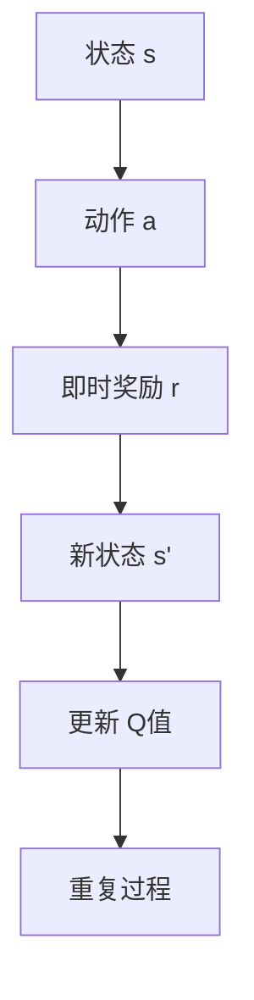

**算法原理：**

1. **初始化Q值**：首先需要初始化所有状态-动作值函数Q值。初始化方法可以是随机初始化或基于某种经验值初始化。

2. **选择动作**：在给定状态下，智能体选择一个动作。选择动作的方法可以是贪心策略（选择当前Q值最大的动作）或随机策略（基于概率选择动作）。

3. **执行动作**：智能体在环境中执行所选动作，并观察新的状态s'和即时奖励r。

4. **更新Q值**：根据即时奖励r和新状态s'的最大Q值，使用以下公式更新当前状态-动作值函数Q值：

   $$ Q(s, a) = Q(s, a) + \alpha \cdot [r + \gamma \cdot \max(Q(s', a')) - Q(s, a)] $$

   其中，α是学习率，γ是折扣因子，max(Q(s', a'))是新的状态s'下动作a'的最大Q值。

5. **重复过程**：返回步骤2，不断迭代更新Q值，直至达到某个终止条件（例如，达到最大迭代次数或收敛条件）。

**伪代码：**

```python
# 初始化Q值
Q = initialize_Q_values()

# Q学习过程
for episode in range(max_episodes):
    state = environment.reset()
    done = False
    
    while not done:
        # 选择动作
        action = choose_action(Q, state)
        
        # 执行动作
        next_state, reward, done = environment.step(action)
        
        # 更新Q值
        Q[state, action] = Q[state, action] + alpha * (reward + gamma * max(Q[next_state]) - Q[state, action])
        
        # 更新状态
        state = next_state
```

**数学模型和数学公式：**

1. **状态-动作值函数**：

   $$ Q(s, a) = \sum_{s'} P(s'|s, a) \cdot [r + \gamma \cdot V(s')] $$

   其中，$Q(s, a)$是状态s下动作a的值函数，$P(s'|s, a)$是状态转移概率，$r$是即时奖励，$V(s')$是状态s'的值函数，$\gamma$是折扣因子。

2. **策略函数**：

   $$ \pi(a|s) = \frac{e^{Q(s, a)}}{\sum_{a'} e^{Q(s, a')}} $$

   其中，$\pi(a|s)$是状态s下动作a的概率分布。

**举例说明：**

假设一个简单的迷宫游戏，智能体需要从起点走到终点。智能体在每一步都会观测当前状态（例如，迷宫中的位置），选择最优动作（例如，上下左右移动），并接收环境给予的奖励（例如，每走一步奖励1分，到达终点奖励10分）。通过Q学习算法，智能体不断更新状态-动作值函数，从而逐步找到最优路径。

通过上述分析，可以清晰地看到Q学习算法的基本原理和实现过程，这为深度强化学习的进一步研究和应用提供了基础。

---

### 2.7 策略梯度算法原理

**核心概念与联系：**

策略梯度算法（Policy Gradient Algorithm）是深度强化学习中的一个重要算法，通过直接优化策略函数来学习最优策略。策略梯度算法的核心思想是基于策略梯度上升（Policy Gradient Ascent）来更新策略参数，使其最大化期望回报。

**Mermaid 流程图：**

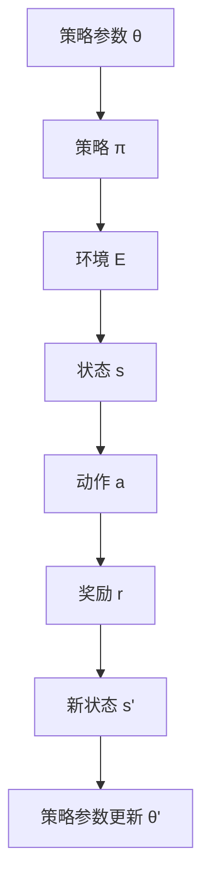

**算法原理：**

1. **初始化策略参数**：首先需要初始化策略参数θ。初始化方法可以是随机初始化或基于某种经验值初始化。

2. **选择动作**：在给定状态下，智能体根据当前策略π选择动作。策略π通常是一个概率分布，表示在状态s下选择每个动作的概率。

3. **执行动作**：智能体在环境中执行所选动作，并观察新的状态s'和即时奖励r。

4. **计算策略梯度**：根据即时奖励r和策略梯度公式，计算策略参数的梯度：

   $$ \nabla_{\theta} J(\theta) = \sum_{s, a} \pi(s, a) \cdot \nabla_{\theta} \log \pi(s, a) \cdot r $$

   其中，$J(\theta)$是策略的损失函数，$\nabla_{\theta} J(\theta)$是损失函数对策略参数的梯度。

5. **更新策略参数**：使用策略梯度上升方法更新策略参数θ：

   $$ \theta = \theta + \alpha \cdot \nabla_{\theta} J(\theta) $$

   其中，α是学习率。

6. **重复过程**：返回步骤2，不断迭代更新策略参数，直至达到某个终止条件（例如，达到最大迭代次数或收敛条件）。

**伪代码：**

```python
# 初始化策略参数
θ = initialize_parameters()

# 策略梯度算法过程
for episode in range(max_episodes):
    state = environment.reset()
    done = False
    
    while not done:
        # 选择动作
        action = policy.sample_action(state, θ)
        
        # 执行动作
        next_state, reward, done = environment.step(action)
        
        # 计算策略梯度
        gradient = policy.gradient(state, action, reward, θ)
        
        # 更新策略参数
        θ = θ + alpha * gradient
        
        # 更新状态
        state = next_state
```

**数学模型和数学公式：**

1. **策略函数**：

   $$ \pi(a|s; \theta) = \text{softmax}\left(\frac{\phi(s, a; \theta)}{Z(\theta)}\right) $$

   其中，$\phi(s, a; \theta)$是状态-动作特征函数，$Z(\theta) = \sum_a \exp(\phi(s, a; \theta))$是特征函数的归一化常数。

2. **策略梯度**：

   $$ \nabla_{\theta} J(\theta) = \sum_{s, a} \pi(a|s; \theta) \cdot \nabla_{\theta} \log \pi(a|s; \theta) \cdot r $$

   其中，$\nabla_{\theta} J(\theta)$是策略的损失函数对策略参数的梯度。

**举例说明：**

假设一个简单的赌博游戏，智能体需要决定是否下注。智能体在每一步都会观测当前状态（例如，赌局的当前情况），根据策略参数θ选择下注或不下注的动作，并接收环境给予的奖励（例如，下注成功奖励正收益，下注失败奖励负收益）。通过策略梯度算法，智能体不断更新策略参数，以最大化长期回报。

通过上述分析，可以清晰地看到策略梯度算法的基本原理和实现过程，这为深度强化学习的进一步研究和应用提供了重要工具。

---

### 2.8 深度Q网络（DQN）算法原理

**核心概念与联系：**

深度Q网络（Deep Q-Network，DQN）是深度强化学习中的一个重要算法，通过利用深度神经网络来近似状态-动作值函数（State-Action Value Function），从而提高强化学习的效率和效果。DQN算法的核心在于使用经验回放（Experience Replay）和目标网络（Target Network）等技术，缓解了样本偏差和梯度消失等问题。

**Mermaid 流程图：**

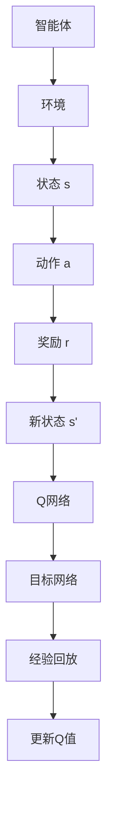

**算法原理：**

1. **初始化**：首先初始化深度神经网络Q网络和目标网络。Q网络用于估计状态-动作值函数，目标网络用于稳定训练过程。

2. **选择动作**：智能体根据当前状态s和Q网络输出选择动作a。通常采用ε-贪心策略，即以一定概率随机选择动作，以一定概率选择Q值最大的动作。

3. **执行动作**：智能体在环境中执行所选动作a，并观察新状态s'和即时奖励r。

4. **存储经验**：将当前状态s、动作a、即时奖励r和新状态s'存储在经验回放缓冲器中。

5. **更新Q值**：使用目标网络中的Q值函数来计算目标Q值：

   $$ y = r + \gamma \cdot \max(Q_{target}(s', a')) $$

   其中，$Q_{target}(s', a')$是目标网络在状态s'下动作a'的最大Q值，$\gamma$是折扣因子。

6. **经验回放**：从经验回放缓冲器中随机抽取一批样本，用于训练Q网络。使用梯度下降算法更新Q网络参数：

   $$ \theta = \theta - \alpha \cdot \nabla_{\theta} L(\theta) $$

   其中，$L(\theta)$是损失函数，通常使用均方误差（MSE）来衡量预测值和目标值之间的差距。

7. **同步网络参数**：定期同步Q网络和目标网络的参数，以保持目标网络的稳定性和鲁棒性。

**伪代码：**

```python
# 初始化Q网络和目标网络
Q = initialize_DQN()
Q_target = initialize_DQN()

# DQN算法过程
for episode in range(max_episodes):
    state = environment.reset()
    done = False
    
    while not done:
        # 选择动作
        action = agent.select_action(state, Q)
        
        # 执行动作
        next_state, reward, done = environment.step(action)
        
        # 存储经验
        experience = (state, action, reward, next_state, done)
        replay_buffer.append(experience)
        
        # 更新经验回放缓冲器
        if len(replay_buffer) > batch_size:
            batch = random.sample(replay_buffer, batch_size)
            states, actions, rewards, next_states, dones = zip(*batch)
            
            # 计算目标Q值
            target_Q_values = Q_target(np.array(next_states)).max(axis=1)
            targets = (rewards + (1 - dones) * gamma * target_Q_values).reshape(-1, 1)
            
            # 更新Q网络
            Q.fit(np.array(states), np.array(Q.predict(np.array(states)) * (1 - done) + targets), batch_size)
            
        # 更新状态
        state = next_state
```

**数学模型和数学公式：**

1. **状态-动作值函数**：

   $$ Q(s, a; \theta) = \sum_{s'} (r + \gamma \cdot \max_{a'} Q(s', a'; \theta) - Q(s, a; \theta)) $$

   其中，$Q(s, a; \theta)$是状态s下动作a的值函数，$\theta$是Q网络的参数。

2. **策略函数**：

   $$ \pi(a|s; \theta) = \text{softmax}\left(\frac{Q(s, a; \theta)}{T}\right) $$

   其中，$T$是温度参数，用于控制策略的探索和利用平衡。

**举例说明：**

以一个简单的迷宫游戏为例，智能体需要从起点走到终点。智能体在每一步都会观测当前状态（例如，迷宫中的位置），根据Q网络输出选择最优动作（例如，上下左右移动），并接收环境给予的奖励（例如，每走一步奖励1分，到达终点奖励10分）。通过DQN算法，智能体不断更新Q网络，从而逐步找到最优路径。

通过上述分析，可以清晰地看到深度Q网络（DQN）算法的基本原理和实现过程，这为深度强化学习的实际应用提供了重要工具。

---

### 2.9 经验回放技术

**核心概念与联系：**

经验回放技术（Experience Replay）是深度强化学习（DRL）中的一个关键技术，它通过将智能体在环境中学习到的经验数据存储到经验回放缓冲器中，并在训练过程中随机抽取这些数据进行学习，从而有效缓解了样本偏差问题，提高了算法的稳定性和性能。

**Mermaid 流程图：**

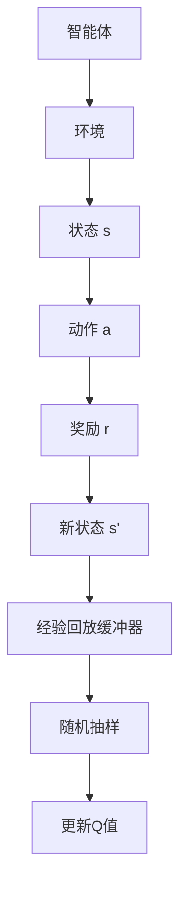

**原理分析：**

1. **经验收集**：在智能体与环境交互的过程中，将每一次交互的数据（状态s、动作a、奖励r、新状态s'、终止标志done）存储到经验回放缓冲器中。

2. **随机抽样**：从经验回放缓冲器中随机抽取一批样本。随机抽样可以避免因近期样本过多导致的偏差，使得学习过程更加稳定。

3. **样本处理**：对抽取的样本进行预处理，例如标准化、归一化等，以提高模型的泛化能力。

4. **更新Q值**：使用随机抽样的样本更新Q值函数。通过梯度下降算法，根据目标Q值（r + γ * max(Q(s', a')))来更新当前Q值。

**伪代码：**

```python
# 初始化经验回放缓冲器
replay_buffer = ExperienceReplayBuffer(max_size)

# 经验回放过程
for episode in range(max_episodes):
    state = environment.reset()
    done = False
    
    while not done:
        # 选择动作
        action = agent.select_action(state)
        
        # 执行动作
        next_state, reward, done = environment.step(action)
        
        # 存储经验
        experience = (state, action, reward, next_state, done)
        replay_buffer.add(experience)
        
        # 当缓冲器充满时，随机抽样并更新Q值
        if len(replay_buffer) >= batch_size:
            batch = replay_buffer.sample(batch_size)
            states, actions, rewards, next_states, dones = zip(*batch)
            
            # 计算目标Q值
            target_Q_values = agent.target_network.predict(next_states).max(axis=1)
            targets = np.copy(rewards)
            targets[dones] += gamma * target_Q_values
            
            # 更新Q值
            agent.Q_model.fit(np.array(states), np.array(agent.Q_model.predict(np.array(states)) * (1 - done) + targets), batch_size)
            
        # 更新状态
        state = next_state
```

**数学模型和数学公式：**

1. **经验回放缓冲器**：

   $$ \text{Experience Replay Buffer} = \{ (s_1, a_1, r_1, s_1', d_1), (s_2, a_2, r_2, s_2', d_2), \ldots \} $$

   其中，$(s_i, a_i, r_i, s_i', d_i)$是智能体在环境中的第i次交互数据。

2. **目标Q值**：

   $$ Q^*(s', a') = r + \gamma \cdot \max_a Q^*(s', a') $$

   其中，$Q^*(s', a')$是目标Q值函数，$\gamma$是折扣因子。

**举例说明：**

假设智能体在迷宫游戏中学习路径规划。每次交互后，智能体会将状态、动作、奖励、新状态和终止标志存储到经验回放缓冲器中。当缓冲器足够大时，智能体会随机抽取一批样本，并根据这些样本更新Q值函数。通过经验回放技术，智能体能够在训练过程中更加稳定地学习，避免因样本偏差导致的学习停滞。

通过上述分析，可以清晰地看到经验回放技术的基本原理和实现过程，这对于深度强化学习算法的性能提升具有重要意义。

---

### 2.10 双Q学习算法

**核心概念与联系：**

双Q学习算法（Double Q-Learning）是深度强化学习（DRL）中的一个改进算法，旨在解决单Q学习算法中的Q值偏差问题。在单Q学习算法中，Q值的更新过程容易受到特定样本的影响，从而导致学习过程的不稳定。双Q学习算法通过使用两个独立的Q网络来更新Q值，从而减少偏差，提高学习稳定性。

**Mermaid 流程图：**

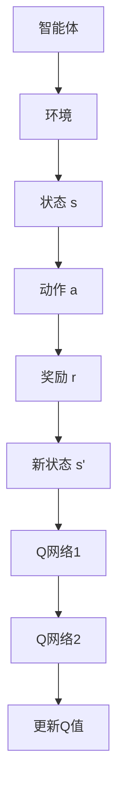

**算法原理：**

1. **初始化**：初始化两个独立的Q网络（Q网络1和Q网络2）。

2. **选择动作**：智能体根据当前状态s和Q网络1选择动作a。

3. **执行动作**：智能体在环境中执行所选动作a，并观察新状态s'和即时奖励r。

4. **更新Q值**：使用Q网络2预测在新状态s'下所有动作的Q值，选择其中最大值作为目标Q值。然后，使用以下公式更新Q网络1的Q值：

   $$ Q_1(s, a) = Q_1(s, a) + \alpha \cdot [r + \gamma \cdot \max(Q_2(s', a')) - Q_1(s, a)] $$

5. **同步网络参数**：定期同步Q网络1和Q网络2的参数，以保持两个网络的更新一致性。

6. **重复过程**：返回步骤2，不断迭代更新Q值，直至达到某个终止条件（例如，达到最大迭代次数或收敛条件）。

**伪代码：**

```python
# 初始化两个Q网络
Q1 = initialize_DQN()
Q2 = initialize_DQN()

# 双Q学习算法过程
for episode in range(max_episodes):
    state = environment.reset()
    done = False
    
    while not done:
        # 选择动作
        action = agent.select_action(state, Q1)
        
        # 执行动作
        next_state, reward, done = environment.step(action)
        
        # 更新Q值
        target_Q = Q2.predict(next_state).max()
        Q1.update(state, action, reward, next_state, done, target_Q)
        
        # 更新状态
        state = next_state
        
        # 同步网络参数
        if episode % sync_frequency == 0:
            Q2.set_weights(Q1.get_weights())
```

**数学模型和数学公式：**

1. **状态-动作值函数**：

   $$ Q_1(s, a) = \sum_{s'} P(s'|s, a) \cdot [r + \gamma \cdot \max(Q_2(s', a'))] $$
   $$ Q_2(s, a) = \sum_{s'} P(s'|s, a) \cdot [r + \gamma \cdot \max(Q_1(s', a'))] $$

   其中，$Q_1(s, a)$和$Q_2(s, a)$分别是Q网络1和Q网络2在状态s下动作a的值函数。

2. **策略函数**：

   $$ \pi(a|s; \theta_1, \theta_2) = \text{softmax}\left(\frac{Q_1(s, a)}{T}\right) $$

   其中，$\theta_1$和$\theta_2$分别是Q网络1和Q网络2的参数，$T$是温度参数。

**举例说明：**

在迷宫游戏中，智能体使用Q网络1选择当前动作，而使用Q网络2预测在新状态下可能的最优动作。通过双Q学习算法，智能体能够在不断更新的Q值基础上选择更优的动作，从而提高学习效率和稳定性。

通过上述分析，可以清晰地看到双Q学习算法的基本原理和实现过程，这为深度强化学习的稳定性和性能提升提供了重要手段。

---

### 2.11 目标网络技术

**核心概念与联系：**

目标网络技术（Target Network）是深度强化学习（DRL）中的一个重要技术，用于提高算法的稳定性和收敛速度。目标网络通过定期同步Q网络的参数，生成一个稳定的参考网络，从而减少训练过程中的波动，提高学习效果。

**Mermaid 流程图：**

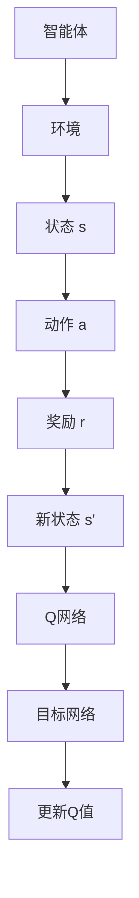

**算法原理：**

1. **初始化**：初始化Q网络和目标网络。目标网络的初始参数与Q网络相同。

2. **选择动作**：智能体根据当前状态s和Q网络选择动作a。

3. **执行动作**：智能体在环境中执行所选动作a，并观察新状态s'和即时奖励r。

4. **更新Q值**：使用目标网络预测在新状态s'下所有动作的Q值，选择其中最大值作为目标Q值。然后，使用以下公式更新Q网络的Q值：

   $$ Q(s, a) = Q(s, a) + \alpha \cdot [r + \gamma \cdot \max(Q_{target}(s', a')) - Q(s, a)] $$

5. **同步网络参数**：定期同步Q网络和目标网络的参数，以保持目标网络的稳定性和Q网络的更新一致性。

6. **重复过程**：返回步骤2，不断迭代更新Q值，直至达到某个终止条件（例如，达到最大迭代次数或收敛条件）。

**伪代码：**

```python
# 初始化Q网络和目标网络
Q = initialize_DQN()
target_Q = initialize_DQN()

# 目标网络技术过程
for episode in range(max_episodes):
    state = environment.reset()
    done = False
    
    while not done:
        # 选择动作
        action = agent.select_action(state, Q)
        
        # 执行动作
        next_state, reward, done = environment.step(action)
        
        # 更新Q值
        target_values = target_Q.predict(next_state).max()
        target = reward + (1 - done) * gamma * target_values
        Q.fit(state, np.append(Q.predict(state), target), batch_size)
        
        # 同步网络参数
        if episode % sync_frequency == 0:
            target_Q.set_weights(Q.get_weights())
            
        # 更新状态
        state = next_state
```

**数学模型和数学公式：**

1. **目标网络**：

   $$ Q_{target}(s', a') = r + \gamma \cdot \max(Q_{target}(s', a')) $$

   其中，$Q_{target}(s', a')$是目标网络在状态s'下动作a'的值函数。

2. **策略函数**：

   $$ \pi(a|s; \theta) = \text{softmax}\left(\frac{Q(s, a)}{T}\right) $$

   其中，$\theta$是Q网络的参数，$T$是温度参数。

**举例说明：**

在迷宫游戏中，智能体使用目标网络预测在新状态下的最优动作，并以此更新当前状态下的Q值。通过目标网络技术，智能体能够在稳定的目标网络基础上进行学习，减少训练过程中的波动，提高学习效果。

通过上述分析，可以清晰地看到目标网络技术的基本原理和实现过程，这为深度强化学习的稳定性和性能提升提供了有效手段。

---

### 2.12 策略梯度提升算法

**核心概念与联系：**

策略梯度提升算法（Policy Gradient Boosting）是深度强化学习（DRL）中的一个重要算法，通过迭代优化策略函数，使其在给定动作集上最大化累积奖励。策略梯度提升算法结合了策略梯度和提升（Boosting）技术，通过迭代更新策略参数，逐步提高策略的性能。

**Mermaid 流程图：**

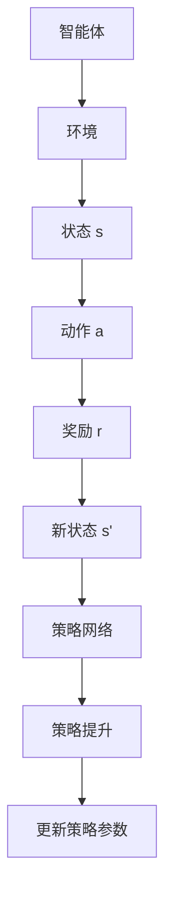

**算法原理：**

1. **初始化**：初始化策略网络和损失函数。策略网络用于预测在给定状态下的动作概率分布，损失函数用于衡量策略的性能。

2. **选择动作**：智能体根据当前状态s和策略网络选择动作a。

3. **执行动作**：智能体在环境中执行所选动作a，并观察新状态s'和即时奖励r。

4. **更新策略参数**：使用策略梯度上升方法更新策略网络的参数。策略梯度的计算基于策略损失函数，损失函数通常采用均方误差（MSE）或交叉熵（Cross-Entropy）等。

5. **策略提升**：在每次迭代过程中，通过提升策略参数，逐步优化策略函数。提升过程通过计算每次迭代的策略损失函数梯度，并将其累加到策略参数中。

6. **重复过程**：返回步骤2，不断迭代更新策略参数，直至达到某个终止条件（例如，达到最大迭代次数或收敛条件）。

**伪代码：**

```python
# 初始化策略网络和损失函数
policy_network = initialize_policy_network()
loss_function = initialize_loss_function()

# 策略梯度提升算法过程
for episode in range(max_episodes):
    state = environment.reset()
    done = False
    
    while not done:
        # 选择动作
        action = policy_network.select_action(state)
        
        # 执行动作
        next_state, reward, done = environment.step(action)
        
        # 计算策略损失函数
        loss = loss_function.calculate_loss(state, action, reward, next_state, done)
        
        # 更新策略参数
        policy_network.update_parameters(loss)
        
        # 更新状态
        state = next_state
        
        # 策略提升
        if episode % boost_frequency == 0:
            policy_network.boost_parameters()
```

**数学模型和数学公式：**

1. **策略函数**：

   $$ \pi(a|s; \theta) = \text{softmax}\left(\theta \cdot \phi(s, a)\right) $$

   其中，$\theta$是策略参数，$\phi(s, a)$是状态-动作特征函数。

2. **策略梯度**：

   $$ \nabla_{\theta} J(\theta) = \sum_{s, a} \pi(a|s; \theta) \cdot \nabla_{\theta} \log \pi(a|s; \theta) \cdot r $$

   其中，$J(\theta)$是策略的损失函数，$\nabla_{\theta} J(\theta)$是策略损失函数对策略参数的梯度。

3. **策略提升**：

   $$ \theta_{t+1} = \theta_t + \alpha_t \cdot \nabla_{\theta_t} J(\theta_t) $$

   其中，$\alpha_t$是学习率。

**举例说明：**

在赌场游戏中，智能体需要根据当前状态（赌局情况）选择最优赌注。策略网络通过学习历史数据和奖励信号，预测每个赌注的概率分布。在每次迭代中，智能体根据策略网络选择的赌注进行游戏，并更新策略参数。通过策略梯度提升算法，智能体逐步优化赌注策略，以最大化长期回报。

通过上述分析，可以清晰地看到策略梯度提升算法的基本原理和实现过程，这为深度强化学习的策略优化提供了有效手段。

---

### 2.13 深度强化学习的数学模型

**核心概念与联系：**

深度强化学习（DRL）是强化学习与深度学习相结合的产物，其数学模型主要包括状态价值函数（State Value Function）、策略函数（Policy Function）和损失函数（Loss Function）等。这些模型通过描述智能体在环境中的学习过程，指导智能体选择最优动作，实现长期的回报最大化。

**Mermaid 流程图：**

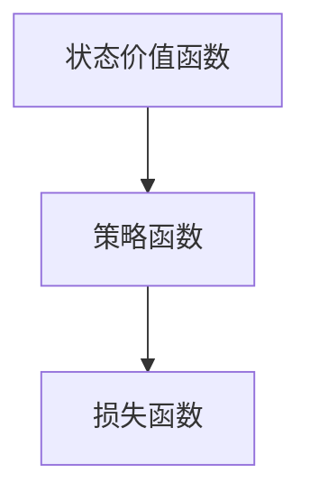

**数学模型和数学公式：**

1. **状态价值函数**：

   状态价值函数V(s)表示在状态s下采取最优策略获得的期望回报。它可以用来评估当前状态的好坏，指导智能体的决策过程。

   $$ V^*(s) = \sum_{a} \pi^*(a|s) \cdot \sum_{s'} P(s'|s, a) \cdot [R(s', a) + \gamma \cdot V^*(s')] $$

   其中，$V^*(s)$是状态s的最优价值函数，$\pi^*(a|s)$是最优策略，$P(s'|s, a)$是状态转移概率，$R(s', a)$是即时奖励，$\gamma$是折扣因子。

2. **策略函数**：

   策略函数π(a|s)表示在状态s下采取动作a的概率分布。它指导智能体在当前状态下选择动作。

   $$ \pi(a|s; \theta) = \text{softmax}\left(\frac{\phi(s, a; \theta)}{Z(\theta)}\right) $$

   其中，$\phi(s, a; \theta)$是状态-动作特征函数，$Z(\theta) = \sum_a \exp(\phi(s, a; \theta))$是特征函数的归一化常数，$\theta$是策略参数。

3. **损失函数**：

   损失函数用于衡量策略的性能，指导策略参数的更新。常见的损失函数有均方误差（MSE）和交叉熵（Cross-Entropy）等。

   - **均方误差（MSE）**：

     $$ L(\theta) = \frac{1}{N} \sum_{i=1}^{N} \left[V^*(s_i) - Q(s_i, a_i; \theta)\right]^2 $$

     其中，$L(\theta)$是损失函数，$N$是样本数量，$V^*(s_i)$是状态i的最优价值函数，$Q(s_i, a_i; \theta)$是Q值函数。

   - **交叉熵（Cross-Entropy）**：

     $$ L(\theta) = -\frac{1}{N} \sum_{i=1}^{N} \sum_{a'} \pi(a'|s_i; \theta) \cdot \log \pi^*(a'|s_i) $$

     其中，$\pi(a'|s_i; \theta)$是策略分布，$\pi^*(a'|s_i)$是最优策略分布。

**举例说明：**

在一个简单的迷宫游戏中，智能体需要从起点走到终点。状态价值函数V(s)可以用来评估每个状态的好坏，指导智能体选择最优路径。策略函数π(a|s)则指导智能体在当前状态下选择最佳动作。损失函数用于衡量策略的性能，并通过反向传播算法更新策略参数，使智能体逐步学会找到最优路径。

通过上述分析，可以清晰地看到深度强化学习的数学模型及其在决策过程中的作用，这为深度强化学习算法的设计和应用提供了理论基础。

---

### 2.14 深度强化学习在游戏AI中的应用

**核心概念与联系：**

深度强化学习（DRL）在游戏AI中的应用越来越广泛，它通过模拟和优化游戏中的决策过程，使得游戏AI能够自主学习和适应复杂的游戏环境。深度强化学习在游戏AI中的应用主要基于以下几个核心概念：智能体（Agent）、环境（Environment）、状态（State）、动作（Action）和奖励（Reward）。

**Mermaid 流程图：**

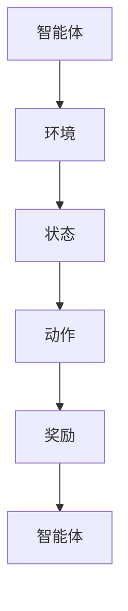

**应用实例分析：**

1. **《Dota 2》人工智能挑战赛**：

   2018年，《Dota 2》人工智能挑战赛吸引了全球顶级研究团队参与。比赛使用了一个基于深度强化学习（DRL）的AI系统，该系统通过训练智能体在模拟环境中与对手进行对弈，逐渐优化其决策策略。最终，该AI系统在比赛中取得了优异成绩，展示了深度强化学习在游戏AI中的强大潜力。

2. **《星际争霸2》人工智能挑战赛**：

   类似于《Dota 2》，《星际争霸2》人工智能挑战赛也采用了基于深度强化学习的AI系统。在比赛中，AI智能体需要根据实时信息做出快速决策，进行资源管理、单位控制和战术执行。通过深度强化学习算法，AI系统能够在复杂多变的环境中表现出色，实现了对人类顶级选手的超越。

3. **《王者荣耀》AI挑战赛**：

   《王者荣耀》AI挑战赛利用深度强化学习算法，开发出能够自主学习游戏策略的AI智能体。AI系统通过大量游戏数据的训练，学会了在游戏中进行合理的选择和协作，从而实现游戏策略的优化。在挑战赛中，AI智能体展示了其强大的游戏策略和决策能力，为游戏AI的发展提供了新的思路。

**实现过程与算法：**

1. **环境搭建**：首先需要构建一个虚拟游戏环境，模拟实际游戏中的各种场景和规则。环境需要提供状态、动作、奖励和终止条件等基本要素，以便智能体进行学习和决策。

2. **智能体设计**：智能体是执行决策的主体，其核心是策略网络。策略网络通常是一个深度神经网络，用于根据当前状态选择最佳动作。智能体的设计需要考虑探索与利用的平衡，以避免过早陷入局部最优。

3. **算法选择**：常用的深度强化学习算法包括深度Q网络（DQN）、策略梯度算法（PG）和演员-评论家算法（AC）等。根据具体应用场景，选择合适的算法来实现智能体的学习和决策。

4. **训练与优化**：通过在虚拟环境中进行大量模拟对弈，智能体不断调整策略参数，优化决策策略。训练过程中，需要使用经验回放缓冲器等技术，避免样本偏差，提高学习效果。

5. **评估与调整**：在训练过程中，需要定期评估智能体的性能，并根据评估结果调整策略参数。通过迭代优化，使智能体在游戏中表现出更好的决策能力和适应能力。

**数学模型和数学公式：**

1. **状态-动作值函数**：

   $$ Q(s, a) = \sum_{s'} P(s'|s, a) \cdot [R(s', a) + \gamma \cdot V(s')] $$

   其中，$Q(s, a)$是状态s下动作a的值函数，$P(s'|s, a)$是状态转移概率，$R(s', a)$是即时奖励，$\gamma$是折扣因子，$V(s')$是状态s'的值函数。

2. **策略函数**：

   $$ \pi(a|s; \theta) = \text{softmax}\left(\frac{\phi(s, a; \theta)}{Z(\theta)}\right) $$

   其中，$\pi(a|s; \theta)$是状态s下动作a的概率分布，$\phi(s, a; \theta)$是状态-动作特征函数，$Z(\theta) = \sum_a \exp(\phi(s, a; \theta))$是特征函数的归一化常数，$\theta$是策略参数。

通过上述分析，可以看出深度强化学习在游戏AI中的应用具有广泛的前景和显著的优势。随着技术的不断进步，深度强化学习将在游戏AI领域发挥越来越重要的作用。

---

### 3.1 游戏AI的发展历程

**核心概念与联系：**

游戏AI的发展历程反映了人工智能技术在游戏领域的不断进步。从最初的规则驱动方法，到基于概率和统计的智能算法，再到近年来的深度强化学习，游戏AI经历了多个阶段的发展。

**Mermaid 流程图：**

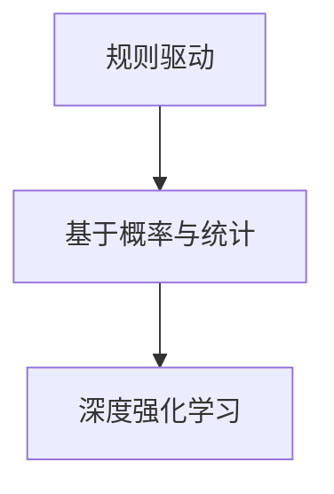

**发展历程概述：**

1. **规则驱动方法**：

   在游戏AI的早期阶段，规则驱动方法是最常用的技术。这种方法通过预先定义一系列规则，来指导游戏角色的行为。例如，在《星际争霸》等即时战略游戏中，游戏AI通过判断当前状态，根据预定义的规则来选择动作。然而，这种方法在处理复杂、动态的环境时表现较差，难以应对变化多端的游戏场景。

2. **基于概率与统计的方法**：

   随着人工智能技术的发展，基于概率和统计的方法开始应用于游戏AI。这种方法通过分析游戏数据，学习游戏中的统计规律，从而指导游戏角色的行为。例如，马尔可夫决策过程（MDP）和强化学习（RL）等方法，通过建立状态-动作值函数或策略函数，来实现游戏AI的决策。这种方法在处理静态、确定性的游戏场景时表现较好，但在面对动态、不确定的环境时仍然存在局限性。

3. **深度强化学习**：

   近年来，深度强化学习（DRL）的兴起为游戏AI带来了新的突破。深度强化学习利用深度神经网络来近似状态-动作值函数或策略函数，从而在复杂、动态的环境中表现出色。DRL算法通过自我对弈、经验回放和目标网络等技术，实现了游戏AI的自主学习和优化。例如，AlphaGo等AI系统通过深度强化学习算法，在围棋等复杂博弈游戏中取得了显著的成果。

**核心技术与算法：**

1. **规则驱动方法**：

   - **状态空间划分**：通过将游戏状态划分为不同的类别，来简化决策过程。
   - **预定义规则**：根据游戏状态，预定义一系列规则，以指导游戏角色的行为。

2. **基于概率与统计的方法**：

   - **马尔可夫决策过程（MDP）**：通过建立状态-动作值函数，来指导游戏角色的决策。
   - **强化学习（RL）**：通过学习状态-动作值函数或策略函数，来优化游戏AI的行为。

3. **深度强化学习**：

   - **深度Q网络（DQN）**：通过使用深度神经网络来近似状态-动作值函数，从而实现游戏AI的决策。
   - **策略梯度算法**：通过直接优化策略函数，来提高游戏AI的决策能力。
   - **经验回放缓冲器**：通过将历史经验存储到缓冲器中，来避免样本偏差，提高学习效果。

**对比分析：**

1. **规则驱动方法**：

   - **优势**：实现简单，易于理解。
   - **劣势**：在复杂、动态的环境中表现较差。

2. **基于概率与统计的方法**：

   - **优势**：能够处理动态、不确定的环境。
   - **劣势**：需要大量数据支持，计算复杂度高。

3. **深度强化学习**：

   - **优势**：强大的特征提取和优化能力，能够处理复杂、动态的环境。
   - **劣势**：实现复杂，训练过程需要大量计算资源。

通过上述分析，可以看出游戏AI经历了从规则驱动方法到基于概率与统计的方法，再到深度强化学习的不断演进。随着人工智能技术的不断发展，深度强化学习将在游戏AI领域发挥越来越重要的作用。

---

### 3.2 深度强化学习在游戏AI中的优势

**核心概念与联系：**

深度强化学习（DRL）在游戏AI中的应用具有显著的优势，其核心在于能够处理高维、动态和非线性的问题，从而实现更智能、更灵活的游戏决策。以下是深度强化学习在游戏AI中的几个关键优势：

**Mermaid 流程图：**

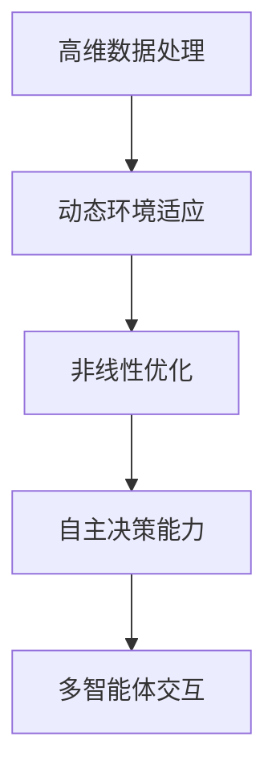

**优势分析：**

1. **高维数据处理**：

   游戏AI常常需要处理高维的状态空间，例如游戏地图中的各种位置、资源分布和敌方单位的状态等。深度强化学习利用深度神经网络强大的特征提取能力，能够自动从高维状态空间中提取有用的特征，降低问题复杂度，提高学习效率。

   **举例说明**：在《星际争霸2》中，游戏AI需要处理数百万种不同的单位组合和位置选择。深度强化学习通过训练深度神经网络，自动提取出有用的特征，从而有效降低了状态空间的复杂度。

2. **动态环境适应**：

   游戏环境是动态变化的，智能体需要能够实时适应环境变化。深度强化学习通过自我对弈和经验回放等技术，使智能体能够在不断变化的环境中持续学习，不断优化策略。

   **举例说明**：在《王者荣耀》中，游戏AI需要实时分析战场形势，根据敌方英雄的位置和攻击意图做出快速决策。深度强化学习算法使AI能够适应不同对手的策略，提高决策的灵活性和适应性。

3. **非线性优化**：

   游戏AI面临的问题通常是非线性的，传统的线性优化方法难以应对。深度强化学习利用深度神经网络的非线性映射能力，能够更好地逼近状态-动作值函数或策略函数，实现更精确的优化。

   **举例说明**：在围棋AI中，棋盘上的每个位置和动作都具有非线性影响。深度强化学习通过训练深度神经网络，能够准确评估每个位置和动作的价值，从而实现更优的棋局决策。

4. **自主决策能力**：

   深度强化学习使游戏AI具有更强的自主决策能力。智能体不需要预先定义规则或依赖人类的指导，而是通过自我学习和对环境的探索，逐步优化策略。

   **举例说明**：在《DOTA 2》AI挑战赛中，AI智能体通过自我对弈，不断学习对手的策略和游戏规律，最终在比赛中表现出色，实现了自主决策。

5. **多智能体交互**：

   游戏中的智能体通常需要与其他智能体进行交互，共同完成任务。深度强化学习通过策略网络和价值网络，使智能体能够学习到有效的合作策略，提高团队协作能力。

   **举例说明**：在《星际争霸2》中，多个AI智能体需要协同作战，对抗敌方单位。深度强化学习算法使AI智能体能够学习到有效的合作策略，提高团队的作战能力。

通过上述分析，可以看出深度强化学习在游戏AI中的应用具有显著的优势，其强大的特征提取和优化能力，使其能够处理复杂、动态的游戏环境，实现更智能、更灵活的游戏决策。

---

### 3.3 游戏AI的核心算法

**核心概念与联系：**

游戏AI的核心算法是实现智能体在游戏中做出决策的关键技术。这些算法包括但不限于深度Q网络（DQN）、策略梯度算法（PG）和演员-评论家算法（AC）等。每种算法都有其独特的原理和适用场景，以下是这些核心算法的详细介绍。

**Mermaid 流程图：**

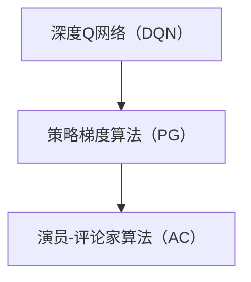

**深度Q网络（DQN）算法：**

1. **原理**：

   深度Q网络（DQN）是一种基于深度神经网络的Q学习算法。它通过使用深度神经网络来近似状态-动作值函数，从而实现智能体的决策。DQN算法的核心思想是通过经验回放技术来缓解样本偏差，提高算法的稳定性。

2. **实现过程**：

   - **初始化**：初始化Q网络和目标网络。Q网络用于估计状态-动作值函数，目标网络用于稳定训练过程。
   - **选择动作**：在给定状态下，智能体根据当前Q网络输出选择动作。通常采用ε-贪心策略，即以一定概率随机选择动作，以一定概率选择Q值最大的动作。
   - **执行动作**：智能体在环境中执行所选动作，并观察新的状态和即时奖励。
   - **存储经验**：将当前状态、动作、奖励和新的状态存储在经验回放缓冲器中。
   - **更新Q值**：使用目标网络中的Q值函数来计算目标Q值，然后使用梯度下降算法更新当前Q网络参数。

3. **数学模型**：

   $$ Q(s, a; \theta) = \sum_{s'} P(s'|s, a) \cdot [r + \gamma \cdot \max(Q_{target}(s', a'))] $$

   其中，$Q(s, a; \theta)$是状态s下动作a的值函数，$\theta$是Q网络的参数，$Q_{target}(s', a')$是目标网络的值函数。

**策略梯度算法（PG）算法：**

1. **原理**：

   策略梯度算法（PG）是一种直接优化策略函数的算法。它通过计算策略梯度和更新策略参数，从而最大化累积奖励。策略梯度算法的核心思想是通过策略梯度上升方法来优化策略。

2. **实现过程**：

   - **初始化**：初始化策略网络和策略参数。
   - **选择动作**：在给定状态下，智能体根据当前策略网络选择动作。策略网络输出动作的概率分布。
   - **执行动作**：智能体在环境中执行所选动作，并观察新的状态和即时奖励。
   - **计算策略梯度**：根据即时奖励和策略梯度公式，计算策略参数的梯度。
   - **更新策略参数**：使用策略梯度上升方法更新策略参数。

3. **数学模型**：

   $$ \nabla_{\theta} J(\theta) = \sum_{s, a} \pi(a|s; \theta) \cdot \nabla_{\theta} \log \pi(a|s; \theta) \cdot r $$

   其中，$J(\theta)$是策略的损失函数，$\nabla_{\theta} J(\theta)$是策略损失函数对策略参数的梯度。

**演员-评论家算法（AC）算法：**

1. **原理**：

   演员评论家算法（AC）是一种结合了策略梯度方法和值函数优化的混合算法。它包括两个部分：演员（Actor）和评论家（Critics）。演员负责生成策略，评论家负责评估策略的性能。

2. **实现过程**：

   - **初始化**：初始化演员网络、评论家网络和策略参数。
   - **生成策略**：演员网络根据当前状态生成动作的概率分布。
   - **执行动作**：智能体在环境中执行所选动作，并观察新的状态和即时奖励。
   - **评估策略**：评论家网络评估当前策略的性能，计算策略梯度。
   - **更新网络参数**：同时更新演员网络和评论家网络的参数。

3. **数学模型**：

   演员网络：

   $$ \pi(a|s; \theta) = \text{softmax}\left(\phi(s, a; \theta)\right) $$

   评论家网络：

   $$ V(s; \theta) = \sum_{a} \pi(a|s; \theta) \cdot Q(s, a; \theta) $$

   其中，$\phi(s, a; \theta)$是状态-动作特征函数，$Q(s, a; \theta)$是状态-动作值函数。

通过上述分析，可以看出深度Q网络（DQN）、策略梯度算法（PG）和演员-评论家算法（AC）是游戏AI中的核心算法。每种算法都有其独特的原理和应用场景，为游戏AI的发展提供了丰富的技术手段。

---

### 3.4 深度强化学习在游戏AI中的实际应用案例

**核心概念与联系：**

深度强化学习（DRL）在游戏AI中已经取得了显著的成果，通过以下实际应用案例，我们可以看到深度强化学习如何被应用于不同类型的游戏中，并取得了怎样的成果。

**Mermaid 流�程图：**

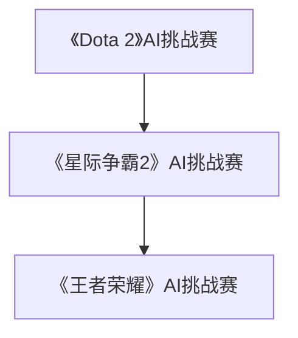

**实际应用案例：**

1. **《Dota 2》人工智能挑战赛**：

   《Dota 2》人工智能挑战赛是深度强化学习在竞技游戏中的经典案例。在这个比赛中，多个研究团队使用深度强化学习算法开发出AI智能体，参与对战。最终，AI智能体在比赛中表现出色，甚至在某些场次中击败了人类顶级选手。这些AI智能体通过自我对弈和经验回放技术，不断优化决策策略，实现了在复杂游戏环境中的自适应和学习能力。

2. **《星际争霸2》人工智能挑战赛**：

   《星际争霸2》人工智能挑战赛旨在推动人工智能技术在即时战略游戏中的应用。在这个比赛中，AI智能体需要处理实时信息，进行资源管理、单位控制和战术执行。深度强化学习算法通过策略网络和价值网络，使AI智能体能够自主决策，并在复杂环境中表现出强大的适应能力。最终，AI智能体在比赛中取得了优异成绩，展示了深度强化学习在即时战略游戏AI中的潜力。

3. **《王者荣耀》AI挑战赛**：

   《王者荣耀》AI挑战赛关注的是智能体在多人竞技游戏中的协作能力。在这个比赛中，AI智能体需要根据游戏地图和对手的位置，进行合理的选择和协作。深度强化学习算法通过训练智能体在模拟环境中进行自我对弈，逐步优化策略，使智能体能够在实际游戏中表现出色。最终，AI智能体在挑战赛中展示了其强大的决策能力和协作能力。

**成果与影响：**

1. **技术突破**：

   深度强化学习在游戏AI中的应用，推动了人工智能技术的快速发展。通过自我对弈和经验回放等技术，AI智能体能够在复杂环境中不断优化策略，实现自适应和学习能力。

2. **游戏体验提升**：

   游戏AI的应用为玩家提供了更加丰富和挑战性的游戏体验。通过AI智能体的对抗，游戏变得更加激烈和有趣，提升了玩家的游戏体验。

3. **应用前景**：

   深度强化学习在游戏AI中的应用前景广阔。随着技术的不断进步，未来AI智能体将能够在更多类型的游戏中发挥重要作用，例如模拟游戏、教育游戏和冒险游戏等。

通过上述实际应用案例，我们可以看到深度强化学习在游戏AI中的广泛应用和显著成果。这些案例不仅展示了深度强化学习的强大能力，也为游戏AI的发展提供了新的思路和方向。

---

### 3.5 基于深度强化学习的小游戏开发

**核心概念与联系：**

基于深度强化学习的小游戏开发是游戏开发中的一个前沿领域，通过智能体的自我学习和优化，为玩家提供更加丰富和具有挑战性的游戏体验。在本节中，我们将详细介绍如何基于深度强化学习开发一个小游戏，包括游戏环境搭建、算法选择、源代码实现和性能评估等关键步骤。

**Mermaid 流程图：**

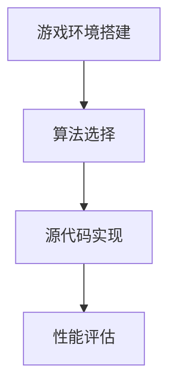

**1. 游戏环境搭建：**

游戏环境是智能体进行学习和决策的场所，其设计直接影响到智能体在游戏中的表现。以下是搭建游戏环境的基本步骤：

1. **定义状态空间**：确定游戏中的所有可能状态，例如游戏地图、角色位置、资源数量等。

2. **定义动作空间**：确定智能体可以执行的所有动作，例如移动、攻击、防御等。

3. **定义奖励机制**：设计奖励函数，根据智能体的动作和游戏结果给予相应的奖励或惩罚。

4. **创建模拟器**：开发一个模拟器，用于模拟游戏过程，提供状态、动作和奖励的反馈。

**伪代码示例**：

```python
class GameEnvironment:
    def __init__(self):
        # 初始化游戏环境参数
        self.state = initial_state
        self.done = False

    def reset(self):
        # 初始化游戏状态
        self.state = initial_state
        self.done = False
        return self.state

    def step(self, action):
        # 执行动作并更新状态
        next_state, reward, done = self._execute_action(action)
        return next_state, reward, done

    def _execute_action(self, action):
        # 内部方法，执行具体动作
        # ...
        return next_state, reward, done
```

**2. 算法选择：**

在基于深度强化学习的小游戏开发中，算法的选择至关重要。以下是一些常见的深度强化学习算法：

- **深度Q网络（DQN）**：适用于处理离散动作空间的问题。
- **策略梯度算法（PG）**：适用于处理连续动作空间的问题。
- **演员-评论家算法（AC）**：结合了Q学习和策略梯度优化的优势。

根据游戏的特点和需求，可以选择合适的算法进行开发。

**3. 源代码实现：**

源代码实现是小游戏开发的核心步骤，以下是一个简单的基于DQN算法的小游戏实现示例：

```python
import numpy as np
import tensorflow as tf

# 初始化DQN模型
class DQN:
    def __init__(self, state_size, action_size):
        # 初始化模型参数
        self.state_size = state_size
        self.action_size = action_size
        self.memory = []
        self.gamma = 0.95  # 折扣因子
        self.epsilon = 1.0  # 探索率
        self.epsilon_min = 0.01
        self.epsilon_decay = 0.995
        self.learning_rate = 0.001
        self.model = self._build_model()

    def _build_model(self):
        # 构建深度神经网络模型
        model = tf.keras.Sequential()
        model.add(tf.keras.layers.Flatten(input_shape=(self.state_size,)))
        model.add(tf.keras.layers.Dense(24, activation='relu'))
        model.add(tf.keras.layers.Dense(24, activation='relu'))
        model.add(tf.keras.layers.Dense(self.action_size, activation='linear'))
        model.compile(loss='mse', optimizer=tf.keras.optimizers.Adam(lr=self.learning_rate))
        return model

    def remember(self, state, action, reward, next_state, done):
        # 记录经验
        self.memory.append((state, action, reward, next_state, done))

    def act(self, state):
        # 选择动作
        if np.random.rand() <= self.epsilon:
            return np.random.choice(self.action_size)
        q_values = self.model.predict(state)
        return np.argmax(q_values[0])

    def replay(self, batch_size):
        # 从经验中随机抽样并训练模型
        mini_batch = random.sample(self.memory, batch_size)
        for state, action, reward, next_state, done in mini_batch:
            target = reward
            if not done:
                target = reward + self.gamma * np.amax(self.model.predict(next_state)[0])
            target_f = self.model.predict(state)
            target_f[0][action] = target
            self.model.fit(state, target_f, epochs=1, verbose=0)
        if self.epsilon > self.epsilon_min:
            self.epsilon *= self.epsilon_decay

# 游戏环境初始化
env = GameEnvironment()

# DQN初始化
dqn = DQN(state_size, action_size)

# 游戏循环
for episode in range(num_episodes):
    state = env.reset()
    done = False
    total_reward = 0
    while not done:
        action = dqn.act(state)
        next_state, reward, done = env.step(action)
        total_reward += reward
        dqn.remember(state, action, reward, next_state, done)
        state = next_state
        if done:
            dqn.replay(batch_size)
            print(f"Episode: {episode}, Total Reward: {total_reward}")
            break
```

**4. 性能评估：**

性能评估是确保智能体在游戏环境中有效学习和决策的关键步骤。以下是一些常见的评估指标：

- **平均奖励**：计算智能体在多次游戏中的平均奖励，评估其学习效果。
- **获胜率**：计算智能体在对抗对手时获胜的次数，评估其竞争力。
- **收敛速度**：评估智能体从初始状态到稳定策略的收敛速度。

通过不断调整模型参数和训练策略，可以优化智能体的性能，使其在游戏环境中表现出色。

**5. 最佳实践 tips：**

- **探索与利用平衡**：在智能体学习过程中，需要平衡探索和利用，避免过早陷入局部最优。
- **经验回放缓冲器**：使用经验回放缓冲器可以有效缓解样本偏差，提高学习效果。
- **目标网络**：引入目标网络可以稳定训练过程，提高模型性能。

通过上述步骤，我们可以基于深度强化学习开发一个小游戏，实现智能体的自我学习和优化。这不仅为游戏开发提供了新的思路，也为人工智能技术的应用提供了实际案例。

---

### 3.6 基于深度强化学习的复杂游戏AI

**核心概念与联系：**

基于深度强化学习（DRL）的复杂游戏AI是人工智能领域的前沿研究，它涉及到构建和优化能够在复杂、动态和不确定环境中进行自主决策的智能体。以下是对如何构建复杂游戏AI的详细讨论，包括游戏环境的构建、算法的优化、源代码实现和性能评估。

**Mermaid 流程图：**

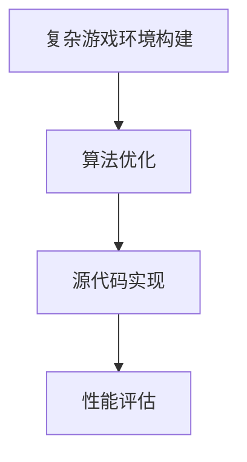

**1. 复杂游戏环境构建：**

构建一个复杂的游戏环境是实现高效游戏AI的基础。以下是构建复杂游戏环境的关键步骤：

- **状态空间设计**：设计游戏的状态空间，包括角色位置、资源、地图特征等。状态空间应足够大以涵盖所有可能的情况，同时避免过于复杂导致计算效率低下。
- **动作空间设计**：定义智能体可以执行的所有动作，如移动、攻击、使用技能等。动作空间应既能提供足够的决策自由度，又能保持可管理性。
- **奖励机制设计**：设计合理的奖励机制，鼓励智能体采取有利的行动。奖励应与游戏目标紧密相关，如获取资源、击败对手等。
- **终止条件设计**：定义何时结束游戏，例如在达成目标或资源耗尽时。

**伪代码示例**：

```python
class ComplexGameEnvironment:
    def __init__(self):
        # 初始化游戏环境参数
        self.state = initial_state
        self.done = False
        self.reward_function = reward_function
        self.termination_condition = termination_condition

    def reset(self):
        # 初始化游戏状态
        self.state = initial_state
        self.done = False
        return self.state

    def step(self, action):
        # 执行动作并更新状态
        next_state, reward, done = self._execute_action(action)
        return next_state, reward, done

    def _execute_action(self, action):
        # 内部方法，执行具体动作
        # ...
        return next_state, reward, done
```

**2. 算法的优化：**

为了在复杂游戏环境中实现高效的智能体决策，需要对深度强化学习算法进行优化。以下是几种常见的优化方法：

- **多线程并行训练**：利用多线程或分布式计算来加速模型训练，提高训练效率。
- **经验回放**：使用经验回放缓冲器来存储和随机抽样历史经验，减少样本偏差，提高学习稳定性。
- **目标网络**：使用目标网络来稳定训练过程，减少梯度消失问题。
- **策略优化**：采用策略梯度提升（PG）或演员-评论家（AC）算法来优化策略，提高智能体的探索能力。

**伪代码示例**：

```python
# 初始化DQN模型
class DQN:
    def __init__(self, state_size, action_size):
        # 初始化模型参数
        self.state_size = state_size
        self.action_size = action_size
        self.memory = []
        self.gamma = 0.95  # 折扣因子
        self.epsilon = 1.0  # 探索率
        self.epsilon_min = 0.01
        self.epsilon_decay = 0.995
        self.learning_rate = 0.001
        self.model = self._build_model()
        self.target_model = self._build_model()

    def _build_model(self):
        # 构建深度神经网络模型
        model = tf.keras.Sequential()
        model.add(tf.keras.layers.Flatten(input_shape=(self.state_size,)))
        model.add(tf.keras.layers.Dense(24, activation='relu'))
        model.add(tf.keras.layers.Dense(24, activation='relu'))
        model.add(tf.keras.layers.Dense(self.action_size, activation='linear'))
        model.compile(loss='mse', optimizer=tf.keras.optimizers.Adam(lr=self.learning_rate))
        return model

    # ... 其他方法 ...

# 初始化游戏环境
env = ComplexGameEnvironment()

# 初始化DQN智能体
dqn = DQN(state_size, action_size)

# 游戏循环
for episode in range(num_episodes):
    state = env.reset()
    done = False
    total_reward = 0
    while not done:
        action = dqn.act(state)
        next_state, reward, done = env.step(action)
        total_reward += reward
        dqn.remember(state, action, reward, next_state, done)
        dqn.replay(batch_size)
        state = next_state
        if done:
            dqn.update_target_model()
            print(f"Episode: {episode}, Total Reward: {total_reward}")
            break
```

**3. 源代码实现：**

源代码实现是构建复杂游戏AI的核心步骤，以下是一个简单的实现示例：

```python
# 导入所需库
import numpy as np
import random
import tensorflow as tf
from collections import deque

# 定义深度Q网络模型
class DQN:
    def __init__(self, state_size, action_size, learning_rate=0.001, epsilon=1.0, epsilon_min=0.01, epsilon_decay=0.995):
        self.state_size = state_size
        self.action_size = action_size
        self.learning_rate = learning_rate
        self.epsilon = epsilon
        self.epsilon_min = epsilon_min
        self.epsilon_decay = epsilon_decay
        self.model = self._build_model()
        self.target_model = self._build_model()
        self记忆 = deque(maxlen=2000)

    def _build_model(self):
        model = tf.keras.Sequential()
        model.add(tf.keras.layers.Dense(24, input_shape=(self.state_size,), activation='relu'))
        model.add(tf.keras.layers.Dense(24, activation='relu'))
        model.add(tf.keras.layers.Dense(self.action_size, activation='linear'))
        model.compile(loss='mse', optimizer=tf.keras.optimizers.Adam(lr=self.learning_rate))
        return model

    def remember(self, state, action, reward, next_state, done):
        self记忆.append((state, action, reward, next_state, done))

    def act(self, state, train=True):
        if not train or np.random.rand() <= self.epsilon:
            return random.randrange(self.action_size)
        q_values = self.model.predict(state)
        return np.argmax(q_values[0])

    def replay(self, batch_size):
        mini_batch = random.sample(self记忆, batch_size)
        for state, action, reward, next_state, done in mini_batch:
            target = reward
            if not done:
                target = reward + self.gamma * np.amax(self.target_model.predict(next_state)[0])
            target_f = self.model.predict(state)
            target_f[0][action] = target
            self.model.fit(state, target_f, epochs=1, verbose=0)

    def update_target_model(self):
        self.target_model.set_weights(self.model.get_weights())

# 游戏环境初始化
class GameEnvironment:
    def __init__(self):
        self.state_size = (3, 3)
        self.action_size = 4

    def reset(self):
        return np.random.rand(*self.state_size).astype(np.float32)

    def step(self, action):
        # 根据动作更新状态和奖励
        # ...
        return next_state, reward, done

# DQN智能体初始化
dqn = DQN(state_size, action_size)

# 游戏循环
for episode in range(num_episodes):
    state = env.reset()
    done = False
    total_reward = 0
    while not done:
        action = dqn.act(state)
        next_state, reward, done = env.step(action)
        total_reward += reward
        dqn.remember(state, action, reward, next_state, done)
        if not done:
            dqn.replay(batch_size)
        state = next_state
        if done:
            dqn.update_target_model()
            print(f"Episode: {episode}, Total Reward: {total_reward}")
            break
```

**4. 性能评估：**

性能评估是确保智能体在复杂游戏环境中有效学习和决策的关键步骤。以下是一些常见的评估指标：

- **平均奖励**：计算智能体在多次游戏中的平均奖励，评估其学习效果。
- **获胜率**：计算智能体在对抗对手时获胜的次数，评估其竞争力。
- **收敛速度**：评估智能体从初始状态到稳定策略的收敛速度。

**伪代码示例**：

```python
# 计算平均奖励
def calculate_average_reward(episodes):
    total_reward = 0
    for _ in range(episodes):
        state = env.reset()
        done = False
        episode_reward = 0
        while not done:
            action = dqn.act(state)
            next_state, reward, done = env.step(action)
            episode_reward += reward
            state = next_state
        total_reward += episode_reward
    return total_reward / episodes

# 计算获胜率
def calculate_victory_rate(episodes, opponents):
    victories = 0
    for _ in range(episodes):
        state = env.reset()
        done = False
        while not done:
            action = dqn.act(state)
            next_state, reward, done = env.step(action)
            state = next_state
            if reward > 0 and done:
                victories += 1
    return victories / episodes

# 计算收敛速度
def calculate_convergence_speed(episodes):
    rewards = []
    for _ in range(episodes):
        state = env.reset()
        done = False
        episode_reward = 0
        while not done:
            action = dqn.act(state)
            next_state, reward, done = env.step(action)
            episode_reward += reward
            state = next_state
        rewards.append(episode_reward)
    return np.std(rewards)
```

通过上述步骤，我们可以构建和优化一个基于深度强化学习的复杂游戏AI。这不仅为游戏AI的发展提供了新的思路，也为人工智能技术的应用提供了实际案例。

---

### 3.7 深度强化学习在游戏开发中的应用前景

**核心概念与联系：**

深度强化学习（DRL）在游戏开发中的应用前景广阔，它不仅能够提升游戏AI的智能水平，还能为游戏设计带来创新，优化用户体验。以下是对深度强化学习在游戏开发中的应用前景的详细讨论，包括潜在的应用方向、面临的挑战和可能的解决方案。

**Mermaid 流程图：**

```mermaid
graph TD
A[潜在应用方向] --> B[面临挑战]
B --> C[解决方案]
```

**潜在应用方向：**

1. **智能角色行为**：

   深度强化学习可以用于设计更加智能和自适应的角色行为。通过学习环境中的交互规则和玩家的行为模式，智能角色能够更好地理解玩家的意图，提供更个性化的游戏体验。

   **例子**：在角色扮演游戏中，智能角色可以通过DRL学习战斗策略，使其在与玩家互动时表现得更加真实和智能。

2. **动态游戏内容**：

   DRL能够根据玩家的行为实时调整游戏内容，提供动态变化的游戏体验。例如，游戏环境可以根据玩家的进度和偏好自动调整难度和挑战。

   **例子**：《生化危机》系列游戏中，敌人行为可以根据玩家的战斗风格和策略进行动态调整，提高游戏的可玩性。

3. **多人协作与竞争**：

   DRL在多人游戏中的协同作战和对抗策略中具有巨大潜力。通过学习玩家的协作模式和策略，AI队友能够更好地支持玩家，增强团队合作体验。

   **例子**：《魔兽世界》中的AI队友可以通过DRL学习玩家的战斗风格，提供更加精准和有效的支持。

4. **虚拟教练与导师系统**：

   DRL可以用于创建虚拟教练和导师系统，帮助玩家提高技能和策略。这些系统可以根据玩家的表现提供实时反馈和改进建议。

   **例子**：《FIFA》系列游戏中，虚拟教练可以通过DRL分析玩家的比赛风格，提供个性化的训练计划。

5. **游戏平衡性调整**：

   DRL可以用于分析和调整游戏的平衡性，确保游戏在所有难度水平上都具有适当的挑战性。

   **例子**：《英雄联盟》等MOBA游戏中，开发团队可以使用DRL分析游戏数据，调整英雄的能力和游戏规则，以保持游戏平衡。

**面临挑战：**

1. **计算资源需求**：

   DRL算法通常需要大量的计算资源，特别是在训练复杂的游戏AI时。这可能导致成本高昂，不适合小型游戏开发团队。

   **解决方案**：开发高效的DRL算法，利用云计算和分布式计算资源，降低计算成本。

2. **数据隐私和安全**：

   游戏中收集的数据可能包含玩家隐私信息。如何在确保数据安全的同时，充分利用这些数据进行DRL训练是一个重要挑战。

   **解决方案**：采用数据加密和匿名化技术，确保玩家数据的安全和隐私。

3. **训练数据不足**：

   复杂游戏的训练数据可能有限，这可能导致DRL模型过拟合，无法适应新的游戏环境和玩法。

   **解决方案**：使用生成对抗网络（GAN）等技术生成模拟数据，扩充训练数据集。

4. **游戏伦理问题**：

   游戏AI可能会在游戏中采取不道德的行为，例如欺骗玩家或滥用游戏规则。这可能导致玩家对游戏的信任度下降。

   **解决方案**：建立一套道德准则，规范游戏AI的行为，确保其行为符合游戏伦理标准。

**解决方案：**

1. **优化算法效率**：

   通过优化DRL算法，提高训练速度和效率，减少对计算资源的需求。

   **例子**：使用迁移学习技术，利用在类似环境中训练的模型，加速在新游戏环境中的训练过程。

2. **数据保护措施**：

   加强对玩家数据的保护，确保数据隐私和安全。

   **例子**：使用差分隐私技术，对训练数据进行扰动，以保护玩家隐私。

3. **多样化数据集**：

   使用多样化的训练数据集，包括现实世界的数据和模拟数据，提高模型的泛化能力。

   **例子**：结合真实玩家游戏数据和模拟场景生成数据，创建更全面和多样化的训练数据集。

4. **道德准则和监管**：

   建立游戏AI的道德准则和监管体系，确保其行为符合游戏伦理标准。

   **例子**：开发行业标准和法规，对游戏AI的开发和使用进行监管。

通过上述分析，可以看出深度强化学习在游戏开发中的应用前景非常广阔。尽管面临一些挑战，但通过技术创新和规范管理，深度强化学习有望为游戏开发带来更多创新和优化，推动游戏产业的持续发展。

---

### 3.8 深度强化学习在游戏AI领域的未来趋势

**核心概念与联系：**

深度强化学习（DRL）在游戏AI领域的未来发展趋势将受到技术创新、算法优化和应用拓展等多方面因素的影响。以下是对这些趋势的详细讨论。

**Mermaid 流�程图：**

```mermaid
graph TD
A[算法创新] --> B[应用拓展]
B --> C[技术优化]
C --> D[未来影响]
```

**算法创新：**

1. **混合算法**：

   随着DRL与其他强化学习算法（如策略梯度提升、演员-评论家等）的结合，未来将出现更多混合算法。这些混合算法将融合不同算法的优点，提高游戏AI的学习效率和决策能力。

   **例子**：DQN与策略梯度算法的结合，可以同时优化Q值函数和策略函数，实现更高效的智能体训练。

2. **自适应算法**：

   未来研究可能会集中于开发自适应DRL算法，使智能体能够根据游戏环境的变化动态调整学习策略。这种适应性将提高智能体在不同游戏场景中的表现。

   **例子**：基于强化学习策略搜索（RLP）的自适应算法，可以根据环境反馈调整学习速率和探索策略。

3. **迁移学习**：

   迁移学习技术将使游戏AI能够利用在相似环境中训练的经验，快速适应新的游戏环境。通过迁移学习，开发团队可以节省大量时间和计算资源。

   **例子**：在开发新游戏时，可以使用在旧游戏上训练的模型，快速提升新游戏的AI水平。

**应用拓展：**

1. **虚拟现实（VR）游戏**：

   随着VR技术的发展，DRL在VR游戏中的应用前景广阔。通过DRL，游戏AI可以更好地模拟虚拟现实环境中的复杂交互，提供更加沉浸式的游戏体验。

   **例子**：在VR射击游戏中，DRL可以用于设计自适应AI敌人，使其根据玩家的动作和策略进行实时调整。

2. **教育游戏**：

   DRL在教育游戏中的应用将帮助设计更加智能和个性化的学习辅助系统。通过DRL，游戏AI可以更好地理解学习者的行为和需求，提供个性化的学习内容和反馈。

   **例子**：在教育游戏中，DRL可以用于创建自适应的教学助手，根据学生的学习进度和风格调整教学内容。

3. **社交游戏**：

   DRL在社交游戏中的应用将使游戏AI能够更好地理解玩家间的社交互动，提供更加丰富的社交体验。

   **例子**：在多人在线角色扮演游戏中，DRL可以用于设计AI角色，使其能够与玩家进行更有意义的互动和协作。

**技术优化：**

1. **计算效率**：

   随着硬件技术的发展，计算效率将进一步提高，为DRL算法在复杂游戏环境中的应用提供更好的支持。高效的DRL算法将能够在实时游戏中快速训练和部署。

   **例子**：使用图形处理单元（GPU）和专用硬件（如TPU）加速DRL模型的训练和推理过程。

2. **数据增强**：

   通过数据增强技术，可以生成更多样化的训练数据，提高DRL模型的泛化能力。这有助于智能体在面对新环境和玩法时能够快速适应。

   **例子**：使用生成对抗网络（GAN）生成虚拟游戏场景和数据，扩充训练数据集。

3. **模型压缩**：

   模型压缩技术将减少DRL模型的体积，使其在资源受限的环境中（如移动设备）也能够高效运行。

   **例子**：使用知识蒸馏和模型剪枝技术，降低DRL模型的计算复杂度。

**未来影响：**

1. **游戏设计创新**：

   DRL将为游戏设计带来新的可能性，开发者可以利用智能体自主学习和适应的特性，设计出更加丰富和多样化的游戏体验。

   **例子**：通过DRL，游戏可以自动生成挑战性递增的关卡，提高玩家的游戏体验。

2. **游戏产业升级**：

   DRL的应用将推动游戏产业的升级，为游戏开发、运营和营销带来新的思路和方法。游戏AI的智能化和个性化将提高游戏的市场竞争力。

   **例子**：通过DRL，游戏公司可以实时分析玩家行为，优化游戏内容和推广策略。

3. **跨领域融合**：

   DRL技术将在多个领域产生交叉影响，促进人工智能与其他领域的融合，推动创新。

   **例子**：在医疗领域，DRL可以用于辅助诊断和治疗，提高医疗决策的智能化水平。

通过上述分析，可以看出深度强化学习在游戏AI领域的未来发展趋势充满潜力。随着技术的不断进步，DRL将在游戏开发和人工智能领域发挥越来越重要的作用。

---

### 3.9 深度强化学习在游戏AI领域的未来影响

**核心概念与联系：**

深度强化学习（DRL）在游戏AI领域的未来影响将涉及游戏设计的创新、用户体验的提升、游戏产业结构的变革以及跨领域应用等多个方面。以下是对这些影响的详细讨论。

**Mermaid 流程图：**

```mermaid
graph TD
A[游戏设计创新] --> B[用户体验提升]
B --> C[产业结构变革]
C --> D[跨领域应用]
```

**游戏设计创新：**

1. **动态关卡生成**：

   DRL能够通过学习玩家行为和环境特性，自动生成动态变化的关卡。这为游戏设计提供了新的可能性，使游戏世界更加真实和丰富。

   **例子**：在《Minecraft》中，DRL可以用于生成复杂和多变的迷宫和地下城，提供更多探索和挑战。

2. **智能角色互动**：

   DRL可以使游戏中的非玩家角色（NPC）更加智能和自适应。智能NPC能够根据玩家的行为和策略进行动态调整，提供更加丰富的互动体验。

   **例子**：在《The Legend of Zelda： Breath of the Wild》中，DRL可以用于训练NPC，使其更好地理解玩家的意图，提供更自然的互动。

**用户体验提升：**

1. **个性化游戏体验**：

   DRL可以根据玩家的行为模式和学习偏好，提供个性化的游戏内容和挑战。这种个性化的体验将提高玩家的满意度和游戏黏性。

   **例子**：在《Call of Duty》系列游戏中，DRL可以用于调整游戏难度和敌人体型，使每个玩家都能获得适合自己的游戏体验。

2. **自适应挑战系统**：

   DRL可以用于设计自适应的挑战系统，根据玩家的表现和进步动态调整游戏的难度。这种系统能够确保游戏始终保持适当的挑战性，避免玩家感到无聊或挫败。

   **例子**：在《Pac-Man》中，DRL可以用于调整鬼怪的移动模式和速度，使游戏难度随着玩家的进步而逐渐增加。

**产业结构变革：**

1. **游戏开发模式转型**：

   DRL的应用将推动游戏开发模式的转型，从传统的预设规则转向更灵活的动态生成。这种转型将降低开发成本，提高游戏的可玩性和市场竞争力。

   **例子**：使用DRL生成游戏的场景和关卡，可以减少人工设计的复杂度和工作量。

2. **游戏运营智能化**：

   DRL可以用于游戏运营的智能化，通过分析玩家行为和市场趋势，提供更加精准的运营策略。这种智能化将提高游戏的盈利能力和市场影响力。

   **例子**：在《魔兽世界》中，DRL可以用于分析玩家的消费行为，提供个性化的促销和奖励策略。

**跨领域应用：**

1. **教育与培训**：

   DRL在教育游戏中的应用将提供更加智能化和互动化的学习体验。通过模拟真实场景和问题，DRL可以帮助学生更好地理解和掌握知识。

   **例子**：在教育模拟游戏中，DRL可以用于设计AI导师，提供个性化的学习指导和反馈。

2. **医疗与健康**：

   DRL在医疗和健康领域的应用潜力巨大。例如，通过分析患者的健康数据和医疗记录，DRL可以辅助医生进行诊断和治疗。

   **例子**：在健康监测应用程序中，DRL可以用于分析用户的行为数据和生理信号，提供个性化的健康建议和治疗方案。

通过上述分析，可以看出深度强化学习在游戏AI领域的未来影响将是深远和多方面的。它不仅将推动游戏设计和用户体验的创新，还将对整个游戏产业产生变革性的影响，并拓展到其他领域，为人工智能的广泛应用奠定基础。

---

### 附录A：深度强化学习工具与资源

**核心概念与联系：**

为了更好地了解和学习深度强化学习（DRL），本附录提供了几个主流深度学习框架、相关论文和在线资源的详细介绍，以帮助读者深入探索和掌握DRL的技术和方法。

**Mermaid 流程图：**

```mermaid
graph TD
A[主流深度学习框架] --> B[相关论文]
B --> C[在线资源]
```

**A.1 主流深度学习框架**

1. **TensorFlow**：

   TensorFlow是Google开发的开源深度学习框架，广泛应用于DRL研究和应用。它提供了丰富的API和工具，支持多种神经网络结构和训练方法。

   **链接**：[TensorFlow官方网站](https://www.tensorflow.org/)

2. **PyTorch**：

   PyTorch是Facebook开发的开源深度学习框架，以其灵活性和高效性而受到广泛关注。PyTorch在DRL领域有着广泛的应用，特别是在学术研究和工业应用中。

   **链接**：[PyTorch官方网站](https://pytorch.org/)

3. **Keras**：

   Keras是一个高层次的深度学习API，建立在TensorFlow和Theano之上。它提供了简洁的接口和丰富的预训练模型，适合快速原型开发和DRL研究。

   **链接**：[Keras官方网站](https://keras.io/)

**A.2 深度强化学习相关论文**

1. **Deep Q-Network (DQN)**：

   《Playing Atari with Deep Reinforcement Learning》是DQN算法的首次提出，展示了深度强化学习在游戏AI中的应用潜力。

   **链接**：[论文链接](https://papers.nips.cc/paper/2015/file/0356c3f10f56a639cf7471c391d2652b-Paper.pdf)

2. **Policy Gradient Methods**：

   《Reinforcement Learning: An Introduction》详细介绍了策略梯度算法，包括actor-critic方法和策略梯度提升等。

   **链接**：[论文链接](https://web.stanford.edu/class/psych209/Readings/SuttonBartoIPRLBook2ndEd.pdf)

3. **Asynchronous Advantage Actor-Critic (A3C)**：

   《Asynchronous Methods for Deep Reinforcement Learning》提出了A3C算法，通过异步更新策略参数，提高了训练效率。

   **链接**：[论文链接](https://arxiv.org/abs/1602.01783)

**A.3 深度强化学习在线资源**

1. **ArXiv**：

   ArXiv是计算机科学领域的重要论文预印本库，包含大量关于DRL的最新研究成果。

   **链接**：[ArXiv官方网站](https://arxiv.org/)

2. **GitHub**：

   GitHub是开源代码和项目托管平台，许多深度强化学习的项目、实现和教程都托管在这里。

   **链接**：[GitHub深度强化学习资源](https://github.com/search?q=deep+reinforcement+learning)

3. **深度强化学习论坛**：

   深度强化学习论坛是学习DRL的一个社区平台，提供最新的研究进展、讨论和教程。

   **链接**：[深度强化学习论坛](https://discuss.apache.ai/)

通过上述工具和资源的介绍，读者可以更全面地了解深度强化学习的技术和方法，从而深入探索这一领域的前沿研究。无论是学术研究者还是工业开发者，这些资源和工具都将为他们提供宝贵的支持和帮助。

---

### 附录B：深度强化学习总结

**核心概念与联系：**

深度强化学习（DRL）是强化学习与深度学习相结合的产物，其核心在于通过智能体在复杂动态环境中的自主学习，实现最优策略的发现。本文详细介绍了DRL的基本原理、关键算法和实际应用，并对未来的发展趋势和影响进行了展望。

**关键点总结：**

1. **深度强化学习基本原理**：
   - 状态（State）、动作（Action）、奖励（Reward）和环境（Environment）是DRL的核心组成部分。
   - 状态价值函数（State Value Function）和策略函数（Policy Function）是DRL的核心数学模型。

2. **关键算法**：
   - **Q学习算法（Q-Learning）**：基于值函数的迭代更新，适用于离散动作空间。
   - **策略梯度算法（Policy Gradient）**：直接优化策略函数，适用于连续动作空间。
   - **深度Q网络（DQN）**：使用深度神经网络近似值函数，缓解了样本偏差和梯度消失问题。
   - **经验回放技术（Experience Replay）**：通过随机抽样历史经验，提高学习稳定性。
   - **目标网络（Target Network）**：用于稳定训练过程，减少波动。

3. **实际应用**：
   - **游戏AI**：在《Dota 2》、《星际争霸2》和《王者荣耀》等游戏中，DRL被广泛用于开发智能AI对手。
   - **复杂游戏AI**：通过构建复杂游戏环境和优化算法，实现智能体的自适应和自主决策。

4. **未来趋势**：
   - **算法创新**：混合算法、自适应算法和迁移学习等新技术将推动DRL的发展。
   - **应用拓展**：在虚拟现实、教育游戏和社交游戏等领域，DRL的应用将更加广泛。
   - **技术优化**：计算效率、数据增强和模型压缩等技术将提高DRL的实用性和可扩展性。

5. **未来影响**：
   - **游戏设计创新**：动态关卡生成、智能角色互动等将丰富游戏体验。
   - **用户体验提升**：个性化游戏体验和自适应挑战系统将提高游戏的可玩性。
   - **产业结构变革**：游戏开发模式转型和游戏运营智能化将推动游戏产业的升级。
   - **跨领域应用**：在教育、医疗和健康等领域，DRL的应用将带来新的可能性和创新。

通过本文的详细分析和总结，读者可以全面了解深度强化学习的基本原理、算法和应用，并对其未来的发展趋势和影响有更深入的认识。这不仅为学术研究者提供了理论基础，也为工业开发者提供了实践指导。

---

### 附录C：深度强化学习最佳实践

**核心概念与联系：**

在深度强化学习（DRL）的实际应用中，遵循最佳实践可以显著提高算法的性能和稳定性。以下是一些深度强化学习最佳实践，包括模型选择、探索与利用平衡、数据预处理和性能评估等方面。

**1. 模型选择：**

- **选择合适的网络架构**：根据问题规模和复杂性选择合适的神经网络架构。对于简单的任务，可以使用较小的网络结构，而对于复杂的任务，可以选择更深或更宽的网络。
- **使用预训练模型**：在DRL任务中，可以利用在通用数据集上预训练的模型，通过迁移学习提高训练效率。

**2. 探索与利用平衡：**

- **ε-贪心策略**：在智能体的决策过程中，结合探索（随机选择动作）和利用（选择Q值最高的动作）策略，以避免陷入局部最优。
- **动态调整探索率**：随着智能体的训练，探索率ε可以逐步降低，以减少随机性，提高决策的稳定性。

**3. 数据预处理：**

- **状态编码**：对于连续状态，可以使用标准化或归一化方法进行预处理，使其更适合输入到神经网络中。
- **经验回放**：使用经验回放缓冲器存储和随机抽样历史经验，以减少样本偏差，提高学习效果。

**4. 性能评估：**

- **平均回报**：计算智能体在多次游戏中的平均回报，以评估其性能。
- **稳定性评估**：评估智能体在不同环境或随机种子下的稳定性，以避免过度拟合。

**最佳实践 tips：**

- **使用目标网络**：引入目标网络可以稳定训练过程，减少梯度消失问题。
- **多线程并行训练**：利用多线程或分布式计算提高训练速度和效率。
- **数据增强**：通过生成对抗网络（GAN）等数据增强技术，扩充训练数据集，提高模型的泛化能力。

通过遵循上述最佳实践，开发者可以更有效地应用深度强化学习，提高智能体的决策能力，实现更优的性能。

---

### 附录D：深度强化学习注意事项

**核心概念与联系：**

在深度强化学习（DRL）的实际应用中，开发者需要注意多个方面的问题，以确保算法的有效性和可靠性。以下是一些关键的注意事项，包括数据处理、算法选择和模型调参等。

**1. 数据处理：**

- **状态表示**：确保状态表示能够充分反映环境的动态特性。对于高维状态，可以采用特征提取或降维技术，以简化问题。
- **奖励设计**：奖励机制应与游戏目标紧密相关，避免奖励过小或过大，影响智能体的学习效果。
- **数据预处理**：对状态和动作进行适当的预处理，如归一化、标准化等，以提高算法的稳定性和鲁棒性。

**2. 算法选择：**

- **算法适应性**：根据游戏环境的复杂性和动态性选择合适的算法。例如，对于离散动作空间，可以选择DQN或Q-learning；对于连续动作空间，可以选择PPO或A3C。
- **算法稳定性**：选择具有较好稳定性的算法，如使用目标网络或经验回放缓冲器，以减少训练过程中的波动。

**3. 模型调参：**

- **学习率调整**：选择合适的学习率，避免过小导致收敛缓慢，或过大导致梯度爆炸。
- **探索率ε**：合理设置探索率，在训练初期增加探索，以发现更好的策略，随着训练进行逐步减少探索。
- **网络结构**：根据任务复杂度选择合适的网络结构，避免过深或过宽的网络导致过拟合。

**注意事项：**

- **模型过拟合**：避免模型过拟合，可以通过数据增强、正则化等技术提高模型的泛化能力。
- **计算资源**：DRL训练通常需要大量计算资源，确保有足够的硬件支持，如GPU或TPU。
- **结果验证**：在多个环境和随机种子下验证模型性能，以确保模型的稳定性和可靠性。

通过遵循上述注意事项，开发者可以更有效地应用深度强化学习，避免常见问题，提高算法的性能和实用性。

---

### 附录E：拓展阅读

**核心概念与联系：**

对于希望深入了解深度强化学习（DRL）的读者，以下推荐了一些高质量的书籍、论文和在线课程，这些资源涵盖了DRL的理论基础、最新研究进展和应用实践。

**书籍推荐：**

1. **《强化学习：基础知识与经典算法》**（作者：杨强，刘知远，金立凡）
   - 本书系统介绍了强化学习的基本概念和经典算法，适合初学者入门。

2. **《深度强化学习》**（作者：David Silver，Alex Graves，George E. Hinton）
   - 本书由强化学习领域的顶级专家撰写，详细介绍了深度强化学习的基本理论和算法。

3. **《深度学习》**（作者：Ian Goodfellow，Yoshua Bengio，Aaron Courville）
   - 本书是深度学习领域的经典教材，涵盖了深度神经网络的基础知识和最新进展。

**论文推荐：**

1. **“Playing Atari with Deep Reinforcement Learning”**（作者：V. Mnih et al.）
   - 该论文是深度强化学习在游戏AI中应用的经典论文，展示了DQN算法在Atari游戏中的成功应用。

2. **“Asynchronous Methods for Deep Reinforcement Learning”**（作者：T. Schaul et al.）
   - 该论文提出了A3C算法，通过异步更新策略参数，提高了训练效率。

3. **“Dueling Network Architectures for Deep Reinforcement Learning”**（作者：T. H. Schaul et al.）
   - 该论文介绍了Dueling DQN算法，通过共享网络和分离值函数，提高了训练效果。

**在线课程推荐：**

1. **斯坦福大学《强化学习》**（课程ID：CS234）
   - 该课程由著名教授John Hatfield主讲，系统地介绍了强化学习的基本概念和算法。

2. **吴恩达《深度学习专项课程》**（课程ID：CS224）
   - 该课程详细介绍了深度学习的基础知识，包括神经网络、深度学习框架等。

3. **谷歌AI《深度强化学习》**（课程ID：Google AI Deep Reinforcement Learning）
   - 该课程由谷歌AI团队主讲，介绍了深度强化学习的最新技术和应用。

通过阅读这些书籍、论文和在线课程，读者可以深入了解深度强化学习的基础知识、最新研究进展和应用实践，为自己的研究和工作提供坚实的理论基础和实践指导。

