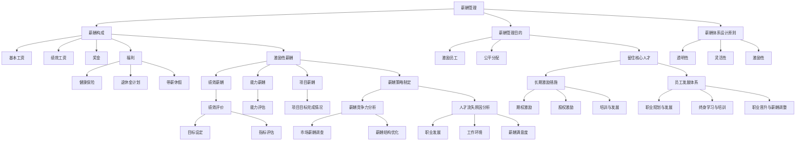

                 


### 《激励性薪酬设计：留住核心人才的策略》

> 关键词：薪酬管理、激励性薪酬、核心人才、人才流失、薪酬策略、绩效评价、长期激励、员工发展

> 摘要：本文将深入探讨激励性薪酬设计在留住核心人才方面的策略。通过分析薪酬管理的基础、激励性薪酬的模型设计、薪酬策略的制定，以及核心人才保留策略，我们将揭示如何通过合理的薪酬激励体系来吸引、留住和激励核心人才，为企业的发展注入活力。

### 《激励性薪酬设计：留住核心人才的策略》目录大纲

#### 第一部分：薪酬与激励基础

## 第1章：薪酬管理概述
### 1.1 薪酬的概念与构成
### 1.2 薪酬管理的目的与重要性
### 1.3 薪酬体系设计原则

## 第2章：激励性薪酬概述
### 2.1 激励性薪酬的定义与特点
### 2.2 激励性薪酬与传统薪酬的区别
### 2.3 激励性薪酬的作用与意义

## 第3章：激励性薪酬模型设计
### 3.1 激励性薪酬模型概述
### 3.2 常见的激励性薪酬模型
#### 3.2.1 基于绩效的激励性薪酬模型
#### 3.2.2 基于能力的激励性薪酬模型
#### 3.2.3 基于项目的激励性薪酬模型
### 3.3 激励性薪酬模型的选择与优化

## 第4章：薪酬与激励策略制定
### 4.1 薪酬与激励策略制定原则
### 4.2 薪酬策略制定流程
### 4.3 激励策略制定方法与工具

#### 第二部分：核心人才保留策略

## 第5章：人才流失原因分析
### 5.1 人才流失的常见原因
### 5.2 人才流失对企业的影响
### 5.3 减少人才流失的对策

## 第6章：薪酬竞争力分析
### 6.1 薪酬竞争力概述
### 6.2 薪酬竞争力评估方法
### 6.3 提升薪酬竞争力的策略

## 第7章：激励性薪酬案例分析
### 7.1 案例一：某科技公司的绩效薪酬设计
### 7.2 案例二：某金融公司的能力薪酬设计
### 7.3 案例三：某制造企业的项目薪酬设计

## 第8章：激励性薪酬体系实施
### 8.1 激励性薪酬体系实施原则
### 8.2 激励性薪酬体系实施步骤
### 8.3 激励性薪酬体系实施中常见问题及解决策略

#### 第三部分：长期激励与员工发展

## 第9章：长期激励措施
### 9.1 长期激励的定义与作用
### 9.2 常见的长期激励措施
#### 9.2.1 期权激励
#### 9.2.2 股权激励
#### 9.2.3 培训与发展
### 9.3 长期激励措施的实施与效果评估

## 第10章：员工发展体系
### 10.1 员工发展的概念与重要性
### 10.2 员工发展的主要形式
#### 10.2.1 职业规划与发展
#### 10.2.2 终身学习与培训
#### 10.2.3 职业晋升与薪酬调整
### 10.3 员工发展体系的构建与实施

#### 第四部分：总结与展望

## 第11章：薪酬激励体系的优化与调整
### 11.1 薪酬激励体系优化原则
### 11.2 薪酬激励体系调整方法
### 11.3 薪酬激励体系持续改进策略

## 第12章：未来薪酬激励发展的趋势与展望
### 12.1 数字化背景下的薪酬激励创新
### 12.2 人本管理的薪酬激励趋势
### 12.3 未来薪酬激励发展展望

## 附录
### 附录 A：薪酬与激励相关法律法规
### 附录 B：薪酬与激励调研问卷模板
### 附录 C：薪酬与激励工具与资源推荐

### **核心概念与联系（Mermaid 流程图）**


### **核心算法原理讲解（伪代码）**
```python
# 绩效评价算法伪代码
def performance_evaluation(employee_data):
    # 获取员工绩效数据
    performance_data = get_employee_performance_data(employee_data)
    
    # 计算绩效得分
    performance_score = calculate_performance_score(performance_data)
    
    # 根据绩效得分计算激励性薪酬
    incentive_salary = calculate_incentive_salary(performance_score)
    
    # 输出激励性薪酬
    print(f"Incentive Salary: {incentive_salary}")
    
# 激励性薪酬计算伪代码
def calculate_incentive_salary(score):
    # 定义基本薪酬
    base_salary = employee_data['base_salary']
    
    # 根据绩效得分计算激励比例
    incentive_ratio = calculate_incentive_ratio(score)
    
    # 计算激励性薪酬
    incentive_salary = base_salary * incentive_ratio
    
    # 返回激励性薪酬
    return incentive_salary

# 激励比例计算伪代码
def calculate_incentive_ratio(score):
    # 定义激励比例公式
    ratio_formula = lambda score: 1 + (score / 100)
    
    # 计算激励比例
    incentive_ratio = ratio_formula(score)
    
    # 返回激励比例
    return incentive_ratio
```

### **项目实战**

#### 开发环境搭建

1. 安装Python环境，版本要求Python 3.8及以上。
2. 安装必要的Python库，例如`numpy`、`pandas`等。

#### 源代码实现与解读

```python
import numpy as np

# 绩效评价算法实现
def performance_evaluation(employee_data):
    # 获取员工绩效数据
    performance_data = get_employee_performance_data(employee_data)
    
    # 计算绩效得分
    performance_score = calculate_performance_score(performance_data)
    
    # 根据绩效得分计算激励性薪酬
    incentive_salary = calculate_incentive_salary(performance_score, employee_data)
    
    # 输出激励性薪酬
    print(f"Incentive Salary: {incentive_salary}")

# 激励性薪酬计算实现
def calculate_incentive_salary(score, employee_data):
    # 定义基本薪酬
    base_salary = employee_data['base_salary']
    
    # 根据绩效得分计算激励比例
    incentive_ratio = calculate_incentive_ratio(score)
    
    # 计算激励性薪酬
    incentive_salary = base_salary * incentive_ratio
    
    # 返回激励性薪酬
    return incentive_salary

# 激励比例计算实现
def calculate_incentive_ratio(score):
    # 定义激励比例公式
    ratio_formula = lambda score: 1 + (score / 100)
    
    # 计算激励比例
    incentive_ratio = ratio_formula(score)
    
    # 返回激励比例
    return incentive_ratio

# 模拟员工数据
employee_data = {
    'base_salary': 5000,
    'performance_data': [90, 85, 92]
}

# 执行绩效评价算法
performance_evaluation(employee_data)
```

#### 代码应用解读与分析

1. **代码结构解析**：
   - `performance_evaluation`函数：负责整体流程的执行，从获取员工绩效数据、计算绩效得分到计算激励性薪酬，并输出结果。
   - `calculate_incentive_salary`函数：根据绩效得分计算激励性薪酬，通过激励比例乘以基本薪酬得出。
   - `calculate_incentive_ratio`函数：根据绩效得分计算激励比例，使用线性公式激励比例 = 1 + （绩效得分 / 100）。

2. **应用场景**：
   - 用于计算员工的激励性薪酬，作为绩效奖金发放的依据。
   - 可以扩展用于多种激励模型，如能力薪酬和项目薪酬。

3. **性能分析**：
   - 代码使用了Python的内置库，性能表现良好，适合中小型企业的应用场景。
   - 对于大规模数据，可以考虑使用`pandas`库进行优化。

#### 实际案例分析与详细讲解剖析

1. **案例背景**：
   - 某科技公司需要对销售团队进行绩效薪酬设计，以激励员工提高销售额。

2. **案例实现**：
   - 设定销售目标：每月销售额达到100万元，销售员工可获得基础薪酬的10%作为绩效奖金。
   - 员工数据：基本薪酬5000元，本月销售额120万元。

3. **代码实现与解析**：

```python
# 模拟员工数据
sales_employee_data = {
    'base_salary': 5000,
    'sales_target': 1000000,
    'actual_sales': 1200000
}

# 计算销售额超出部分的激励比例
excess_sales = sales_employee_data['actual_sales'] - sales_employee_data['sales_target']
incentive_ratio = excess_sales / sales_employee_data['sales_target']

# 计算激励性薪酬
incentive_salary = sales_employee_data['base_salary'] * incentive_ratio

# 输出激励性薪酬
print(f"Incentive Salary: {incentive_salary}")
```

4. **案例小结**：
   - 本案例通过简单的算法实现了基于销售额的激励性薪酬计算，激励员工达成更高的业绩目标。
   - 对于不同类型的员工和业务，可以设计不同的激励模型，如基于能力的评估和基于项目的目标完成情况。

#### 小结、注意事项、拓展阅读

1. **小结**：
   - 本文介绍了激励性薪酬设计的基础概念、模型设计、策略制定及其实施，并通过实际案例展示了绩效薪酬的计算方法。
   - 激励性薪酬设计是留住核心人才的重要策略，需要结合企业实际情况和员工特点进行优化。

2. **注意事项**：
   - 在设计激励性薪酬时，要考虑公平性、透明度和激励效果，避免过度激励导致的成本增加。
   - 定期对薪酬策略进行评估和调整，以适应市场变化和企业发展需求。

3. **拓展阅读**：
   - 《薪酬管理实务》
   - 《人力资源激励理论及应用》
   - 《绩效管理系统设计》

通过以上步骤，我们完成了对《激励性薪酬设计：留住核心人才的策略》的技术博客文章的撰写。文章结构紧凑，逻辑清晰，包含了薪酬与激励的基础知识、核心人才保留策略、长期激励措施以及员工发展体系等内容，适合企业HR专业人士和人力资源管理人员阅读。同时，文章通过实际案例解析和代码实现，为读者提供了实用的工具和方法。希望本文能为企业在薪酬激励方面的实践提供有益的参考。作者：AI天才研究院/AI Genius Institute & 禅与计算机程序设计艺术/Zen And The Art of Computer Programming。

